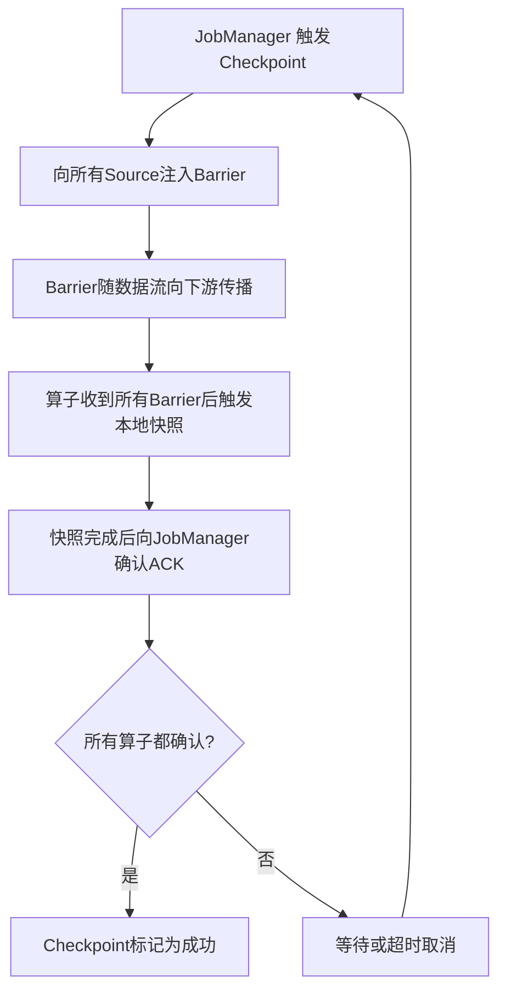
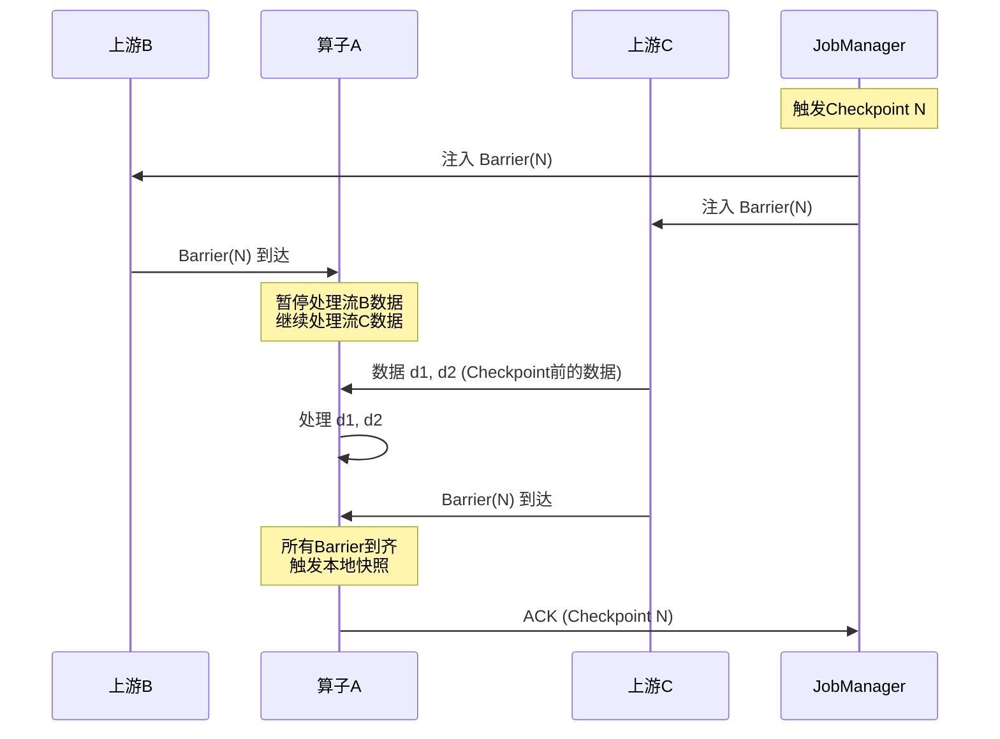
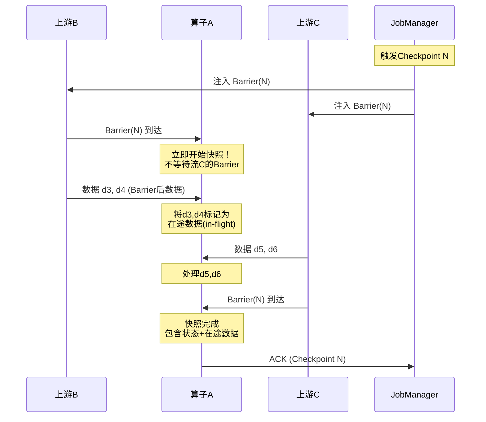
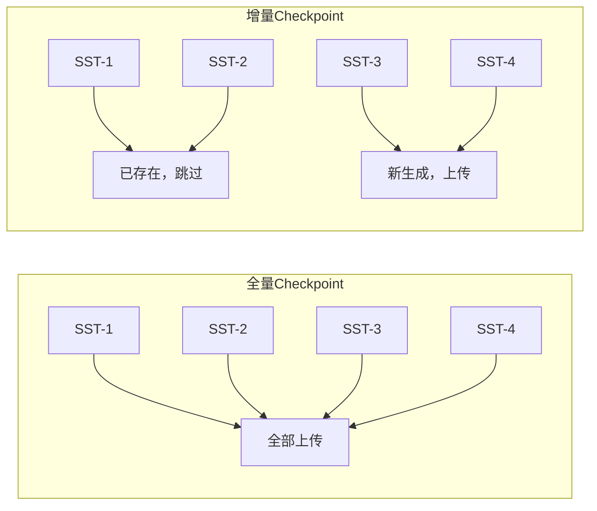

## Checkpoint：分布式快照与Exactly-Once的基石

Checkpoint是Apache Flink实现容错和Exactly-Once语义的核心机制。它通过异步分布式快照算法，将整个数据流图在某个逻辑时刻的状态一致性地保存到外部存储，使得系统在故障发生时能够从最近一次成功的Checkpoint恢复状态，从而保证数据不丢不重。理解Checkpoint的工作原理、配置策略和调优方法，是构建可靠实时计算系统的关键。

本章从分布式快照的理论基础出发，深入剖析Checkpoint的执行机制、Barrier对齐原理、State Backend协作方式、配置调优策略、故障排查方法、监控告警体系，以及端到端Exactly-Once的完整实现路径，覆盖从入门到精通的全部知识节点。

***

### 1. Checkpoint的本质：为什么需要分布式快照

在分布式流处理系统中，每个算子实例都在独立处理数据流的一部分。当系统发生故障（TaskManager宕机、网络中断等），需要将整个作业恢复到某个一致的状态——所有算子的状态和数据消费位点必须在同一个逻辑时刻对齐。这就是分布式快照（Distributed Snapshot）要解决的问题。

#### 1.1 朴素方案的缺陷

最简单的做法是停止所有算子、等待所有数据处理完毕、然后全局快照。但这种方式存在三个致命缺陷：

- **全停顿（Stop-the-World）**：整个作业在快照期间无法处理数据。假设一个作业每秒处理100万条事件，一次快照耗时5秒，意味着500万条事件的处理延迟增加5秒——这在实时场景下完全不可接受。
- **状态不一致**：各算子停止的时刻不同。即使同时发送停止信号，由于网络延迟差异，算子A可能在T=100ms停止，算子B在T=150ms停止，快照中的状态对应不同的逻辑时刻，恢复后数据会出现语义错误。
- **资源浪费**：停止所有算子意味着所有计算资源空转，而快照期间占用的资源（CPU、内存、I/O）并不能产生任何业务价值。

#### 1.2 Chandy-Lamport算法的优雅之处

1985年，Leslie Lamport和K. Mani Chandy在论文"Snapshots of Distributed Snapshot"中提出了Chandy-Lamport分布式快照算法。该算法解决了一个看似矛盾的问题：**如何在不暂停系统的情况下，获取整个分布式系统的一致快照？**

核心思想是：通过在数据流中插入特殊的标记（Marker），各算子在收到Marker时独立完成本地快照。最终所有算子的本地快照组合成一个全局一致的快照。算法的关键洞察是：**Marker的传播顺序本身就编码了一致性约束**——只要遵循"先记录后转发"的规则，无需全局协调即可保证一致性。

Flink的Checkpoint机制正是基于Chandy-Lamport算法的工程实现，但进行了若干重要改进：

- **异步性**：快照过程不阻塞数据处理——算子在触发快照后可以继续处理新到达的数据，只有状态序列化到临时缓冲区的那一刻需要短暂的同步操作
- **一致性**：通过Barrier对齐机制，保证所有算子的状态快照对应同一个逻辑时刻
- **增量性**：支持增量Checkpoint（仅保存变化的状态），大幅减少快照的数据量——对于TB级状态，全量快照可能需要数分钟，而增量快照仅需数秒
- **容错性**：快照过程中可以容忍节点故障，未完成的快照会被丢弃，下次重新触发。这与Chandy-Lamport原始算法的容错特性一致
- **与执行图融合**：Flink将快照逻辑深度集成到执行引擎中，Barrier随数据流自然传播，无需额外的消息通道

#### 1.3 Flink对Chandy-Lamport的工程化改进

原始Chandy-Lamport算法假设每个通道是点对点的，且消息有序。Flink面对的实际场景更为复杂：

| 原始算法假设 | Flink的实际处理 |
|-------------|----------------|
| 点对点通道 | 支持多输入多输出的算子拓扑 |
| 消息严格有序 | 允许同一Channel内有序，不同Channel间无序 |
| 全局Marker注入 | 仅从Source注入Barrier，逐层传播 |
| 全量状态快照 | 支持增量快照（RocksDB） |
| 无状态恢复 | 完整的恢复协议，含Source位点恢复 |

这些改进使得Flink的Checkpoint在保持理论正确性的同时，能够高效运行在真实的分布式环境中。

***

### 2. Checkpoint执行流程：从触发到确认

一个完整的Checkpoint生命周期分为六个阶段，理解每个阶段的行为对故障排查和性能调优至关重要。



#### 阶段一：触发Checkpoint

JobManager中的CheckpointCoordinator按照配置的间隔定期触发Checkpoint。触发需要同时满足两个条件：

1. 距离上次成功Checkpoint的时间超过配置的间隔（`execution.checkpointing.interval`）
2. 没有正在进行的Checkpoint，或正在进行的Checkpoint数未达并发上限（`max-concurrent-checkpoints`）

触发时，CheckpointCoordinator执行以下操作：
- 为本次Checkpoint分配一个唯一的递增ID（Checkpoint ID）
- 记录触发时刻（用于超时判断）
- 向所有已注册的Source算子发送触发信号

```python
# CheckpointCoordinator触发逻辑的伪代码
class CheckpointCoordinator:
    """JobManager中的Checkpoint协调器"""

    def trigger_checkpoint(self):
        """触发一个新的Checkpoint"""
        # 检查前置条件
        if self.has_pending_checkpoint():
            if self.pending_count >= self.max_concurrent:
                return  # 并发上限，跳过

        checkpoint_id = self.next_checkpoint_id()
        self.pending_checkpoints[checkpoint_id] = {
            'trigger_time': current_time(),
            'completed_operators': set(),
            'total_operators': self.registered_operators,
            'ack_messages': {},  # 记录每个算子的ACK详情
        }
        # 向所有Source注入Barrier
        for source in self.sources:
            source.inject_barrier(checkpoint_id)

    def acknowledge(self, checkpoint_id, operator_id, snapshot_location):
        """算子确认快照完成"""
        if checkpoint_id not in self.pending_checkpoints:
            return  # Checkpoint已超时被取消，忽略过期ACK
        pending = self.pending_checkpoints[checkpoint_id]
        pending['completed_operators'].add(operator_id)
        pending['ack_messages'][operator_id] = snapshot_location

        if len(pending['completed_operators']) == pending['total_operators']:
            # 所有算子都确认了，Checkpoint成功
            self.complete_checkpoint(checkpoint_id)

    def complete_checkpoint(self, checkpoint_id):
        """标记Checkpoint成功并清理资源"""
        self.latest_completed_checkpoint = checkpoint_id
        self.save_checkpoint_metadata(checkpoint_id)
        del self.pending_checkpoints[checkpoint_id]
        # 通知所有算子：Checkpoint已完成，可以清理旧状态
        for operator in self.registered_operators:
            operator.notify_checkpoint_complete(checkpoint_id)
```

#### 阶段二：注入Barrier到Source

JobManager向所有Source算子注入Barrier。Barrier是一个特殊的内部记录，携带当前Checkpoint的ID，随数据流一起向下游传播。

Source算子在注入Barrier后，会记录当前消费的外部系统位点。以Kafka Source为例：

```java
// Kafka Source记录Checkpoint位点的内部逻辑
public class KafkaSourceReader {
    // Barrier注入时调用
    public void snapshotState(CheckpointID checkpointId) {
        // 记录每个Partition当前消费的Offset
        Map<TopicPartition, Long> offsets = new HashMap<>();
        for (KafkaPartitionSplit split : assignedPartitions) {
            offsets.put(split.getTopicPartition(), 
                      getCurrentOffset(split));
        }
        // 保存到Checkpoint状态中
        checkpointState.update(offsets);
    }
}
```

Kafka的Offset记录是端到端Exactly-Once的基础——恢复时从该Offset重新消费，配合Kafka的事务性消费保证数据不丢不重。

#### 阶段三：Barrier传播

Barrier随数据流向下游传播。每个算子在处理数据时，如果遇到Barrier，会将其暂存到对应的输入通道缓冲区，然后继续处理该通道后续到达的数据（在对齐模式下，会暂停处理已收到Barrier的通道）。

Barrier的传播是**异步的**——它不阻塞数据处理。但在网络拥塞或背压严重时，Barrier的传播会变慢，导致Checkpoint耗时增加。这就是为什么网络带宽和背压管理对Checkpoint性能至关重要。

#### 阶段四：算子触发本地快照

当算子收到**所有**输入流的Barrier时（Barrier对齐），触发本地状态的快照。快照过程分为两步：

1. **同步阶段**：将当前状态序列化到本地临时缓冲区。这一步是阻塞的，但通常很快（毫秒级），因为只涉及内存拷贝
2. **异步阶段**：将缓冲区异步写入外部存储（如HDFS、S3）。这一步不阻塞数据处理，是耗时的主要来源

对于RocksDBStateBackend，异步阶段涉及将RocksDB的SST文件上传到分布式文件系统。如果启用了增量Checkpoint，只上传自上次Checkpoint以来变化的SST文件。

#### 阶段五：确认ACK

快照完成后（异步写入结束），算子向JobManager发送确认消息（ACK），包含：
- Checkpoint ID
- 本算子的ID
- 快照数据的存储位置

JobManager收到ACK后更新该Checkpoint的完成状态。如果算子在快照过程中崩溃，ACK不会发出，CheckpointCoordinator会在超时后取消本次Checkpoint。

#### 阶段六：全局确认

当所有算子都确认完成后，JobManager将本次Checkpoint标记为成功，并记录元数据（各算子的快照位置、Source的消费位点等）。全局确认后：

- 通知所有算子Checkpoint完成（`notifyCheckpointComplete`），算子可以清理旧的异步数据
- 旧的Checkpoint可以被清理（保留最近N个）
- 新的Checkpoint可以开始触发

***

### 3. Barrier对齐：一致性的核心保障

Barrier对齐（Barrier Alignment）是Flink实现Exactly-Once语义的关键机制。当一个算子有多个输入流时，它必须等待所有输入流的Barrier都到达后才能触发快照——这保证了快照中的状态对应一个逻辑上一致的时刻。

#### 3.1 对齐过程详解

假设算子A有两个输入流（上游B和上游C），当前Checkpoint ID为N：



对齐过程的精确行为：

1. 如果算子A先收到流B的Barrier(N)，它会**暂停处理流B的数据**（缓冲后续到达的流B数据），但**继续处理流C的数据**
2. 在等待期间，流C的数据仍然被正常处理，不会造成背压
3. 当两个Barrier(N)都到达时，算子A触发本地快照——快照中的状态包含了处理完流B的Barrier之前数据和流C的所有Barrier之前数据
4. 快照完成后，算子A恢复处理流B的积压数据

这个过程中有一个关键细节：**对齐期间被暂停的流B数据会被缓存在内存中**。如果某个流的流量远大于其他流（数据倾斜），缓存的数据量可能很大，导致内存压力增加甚至OOM。

#### 3.2 非对齐模式（Unaligned Checkpoint）

Flink 1.11引入了非对齐Checkpoint模式，解决了Barrier对齐导致的延迟和内存问题。

**对齐模式的问题**：在高流量场景下，当一个输入流的Barrier先到达时，该流会被阻塞。如果其他流的流量很大（比如每天10亿条事件），阻塞期间的数据积压可能达到数百万条，导致：
- 内存中积压大量缓冲数据，增加GC压力
- 对齐等待时间过长，导致Checkpoint超时
- 端到端延迟飙升

**非对齐模式的核心思想**：不等待Barrier对齐，直接将所有在途数据（包括Barrier到达之后、其他流Barrier之前的数据）都纳入快照。

具体执行流程：



非对齐Checkpoint的完整配置：

```python
from pyflink.common import Configuration, Duration

config = Configuration()

# 启用非对齐Checkpoint
config.set_boolean("execution.checkpointing.unaligned.enabled", True)

# 设置对齐超时——如果对齐模式下等待超过此时间，自动切换为非对齐
config.set_string(
    "execution.checkpointing.aligned-checkpoint-timeout", "30s"
)

# 非对齐Checkpoint对状态后端有要求——需要支持将缓冲区数据写入状态
# RocksDB和HashMapStateBackend都支持
```

#### 3.3 对齐 vs 非对齐：选型决策

| 特性 | 对齐Checkpoint | 非对齐Checkpoint |
|------|----------------|------------------|
| 一致性保证 | Exactly-Once | Exactly-Once |
| 数据处理延迟 | 可能增加（阻塞低流量流） | 不增加 |
| 状态大小 | 仅算子状态 | 算子状态 + 在途数据 |
| 恢复时间 | 较短 | 较长（需重放在途数据） |
| 内存开销 | 对齐期间缓冲区占用 | 在途数据占用状态空间 |
| 适用场景 | 一般流量、延迟容忍度高 | 高流量、流量不均衡、延迟敏感 |
| Flink版本 | 1.0+ | 1.11+ |
| Checkpoint文件大小 | 较小 | 较大（包含在途数据） |
| 网络开销 | 正常 | 较大（上传在途数据） |

**选型决策建议**：

流量是否均衡（各输入流差异 < 20%）？
├── 是 → 对齐模式（默认）
└── 否 → 是否需要毫秒级延迟保证？
    ├── 是 → 非对齐模式
    └── 否 → 是否有充足的状态存储空间？
        ├── 是 → 非对齐模式（更稳定）
        └── 否 → 对齐模式 + 设置对齐超时

#### 3.4 混合模式：对齐超时

Flink支持一种折中方案：设置`aligned-checkpoint-timeout`。在对齐模式下，如果等待某个流的Barrier超过超时时间，自动切换为非对齐模式完成本次Checkpoint。这在流量波动较大的场景下非常有用——平时使用对齐模式（状态小），流量高峰时自动降级为非对齐模式（保延迟）。

```python
# 推荐的混合模式配置
config.set_boolean("execution.checkpointing.unaligned.enabled", False)
config.set_string(
    "execution.checkpointing.aligned-checkpoint-timeout", "30s"
)
# 效果：默认对齐，但30秒内未对齐则自动切换为非对齐
```

***

### 4. State Backend与Checkpoint的协作

State Backend决定了状态的存储方式和Checkpoint的写入策略。不同的State Backend对Checkpoint的性能有显著影响，选择合适的State Backend是Checkpoint调优的第一步。

#### 4.1 四种State Backend详解

**MemoryStateBackend（已废弃，Flink 1.13后由HashMapStateBackend替代）**

状态存储在TaskManager的JVM堆内存中。Checkpoint时将状态序列化后写入JobManager的内存。由于状态和Checkpoint数据都在内存中，访问速度极快（纳秒级），但受限于JVM堆内存大小（默认最大5MB用于Checkpoint元数据）。仅适用于开发测试和极小状态的作业。

**FsStateBackend（已废弃，由HashMapStateBackend替代）**

状态存储在TaskManager的JVM堆内存中，Checkpoint时将状态序列化后写入分布式文件系统（如HDFS、S3）。访问速度接近MemoryStateBackend，但Checkpoint需要将序列化后的数据写入磁盘。适用于状态大小在GB级别的作业，但不支持增量Checkpoint。

**HashMapStateBackend（推荐用于状态 < 1GB）**

状态存储在TaskManager的JVM堆内存中，Checkpoint时将状态序列化后写入配置的外部存储（HDFS/S3）。继承了MemoryStateBackend的快速访问特性，同时支持外部持久化。适用于状态较小、对延迟要求极高的场景。关键特性：

- 状态访问延迟：纳秒级（堆内存直接访问）
- 状态大小上限：取决于JVM堆内存（建议不超过总堆内存的60%）
- GC影响：状态越大，GC暂停时间越长（需要Full GC遍历整个堆）
- Checkpoint方式：全量快照，不支持增量

**RocksDBStateBackend（推荐用于状态 > 1GB）**

状态存储在TaskManager本地的RocksDB嵌入式数据库中，Checkpoint时将RocksDB的数据文件写入分布式文件系统。RocksDB本身使用LSM-Tree结构，支持高效的写入和范围查询。关键特性：

- 状态访问延迟：微秒级（涉及磁盘I/O，但有Block Cache加速）
- 状态大小上限：取决于本地磁盘大小（可达TB级）
- GC影响：状态存储在堆外内存，不受JVM GC影响
- Checkpoint方式：支持全量和增量
- 写放大：LSM-Tree的Compaction会导致写放大（通常3-10倍）

**Changelog State Backend（Flink 1.17+，实验性）**

Changelog State Backend是Flink较新的状态后端，核心思想是**记录状态的所有变更日志（Changelog）而非周期性快照**。它将状态变更以WAL（Write-Ahead Log）的方式追加写入外部存储，Checkpoint只需上传增量日志文件。

优势：
- Checkpoint延迟极低（只追加日志，无需读取整个状态）
- 天然支持增量恢复（只需重放日志）
- 与RocksDB结合时，可将RocksDB的Compaction延迟到Checkpoint期间

局限：
- 恢复时需要重放日志，恢复时间可能较长
- 日志文件可能很大（高频更新场景）
- 仍在实验阶段，生产环境谨慎使用

```python
# 四种State Backend的配置示例
from pyflink.common import Configuration

# 1. HashMapStateBackend（原Memory/Fs）
config_hashmap = Configuration()
config_hashmap.set_string("state.backend", "hashmap")
config_hashmap.set_string("state.checkpoints.dir", "hdfs:///flink/checkpoints")

# 2. RocksDBStateBackend
config_rocksdb = Configuration()
config_rocksdb.set_string("state.backend", "rocksdb")
config_rocksdb.set_string("state.checkpoints.dir", "hdfs:///flink/checkpoints")
config_rocksdb.set_boolean("state.backend.incremental", True)

# 3. Changelog State Backend（Flink 1.17+，实验性）
config_changelog = Configuration()
config_changelog.set_string("state.backend", "rocksdb")
config_changelog.set_boolean("state.backend.changelog.enabled", True)
config_changelog.set_string("state.checkpoints.dir", "hdfs:///flink/checkpoints")
```

#### 4.2 State Backend选择决策树

状态大小？
├── < 1GB → HashMapStateBackend
│   ├── 优点：纳秒级访问，Checkpoint快
│   └── 缺点：GC影响，状态受堆内存限制
├── 1GB - 100GB → RocksDBStateBackend + 增量Checkpoint
│   ├── 优点：TB级状态支持，GC友好
│   └── 缺点：微秒级访问，写放大
└── > 100GB → RocksDBStateBackend + 压缩 + 增量Checkpoint
    ├── 优点：可处理超大规模状态
    └── 缺点：恢复时间可能较长

#### 4.3 RocksDB深度调优

RocksDB是生产环境中最常用的状态后端，其配置对Checkpoint性能影响巨大。以下是生产环境必须关注的调优参数：

**内存相关参数**：

| 参数 | 默认值 | 推荐值 | 说明 |
|------|--------|--------|------|
| `state.backend.rocksdb.block.cache-size` | 64MB | 256MB-1GB | Block Cache大小，影响读性能。设为总内存的10-20% |
| `state.backend.rocksdb.writebuffer.size` | 64MB | 128MB-256MB | 单个MemTable大小。越大写入性能越好，但增加内存占用 |
| `state.backend.rocksdb.writebuffer.count` | 2 | 4-6 | 待刷盘的MemTable数量。超过此数量时阻塞写入 |
| `state.backend.rocksdb.writebuffer.number-to-merge` | 1 | 2 | 合并MemTable的数量，减少SST文件碎片 |

**压缩相关参数**：

| 参数 | 默认值 | 推荐值 | 说明 |
|------|--------|--------|------|
| `state.backend.rocksdb.compression` | SNAPPY | LZ4/ZSTD | 压缩算法。LZ4平衡速度和压缩率，ZSTD压缩率更高但CPU开销大 |
| `state.backend.rocksdb.compression.per.level` | - | 逐层配置 | 对不同Level使用不同压缩算法（底层用高压缩率） |

**Compaction相关参数**：

| 参数 | 默认值 | 推荐值 | 说明 |
|------|--------|--------|------|
| `state.backend.rocksdb.compaction.style` | LEVEL | LEVEL | Compaction策略。LEVEL适合读多写少，UNIVERSAL适合写多读少 |
| `state.backend.rocksdb.max-background-compactions` | 1 | 4-8 | 后台Compaction线程数。增加可加速Compaction但占用CPU |
| `state.backend.rocksdb.max-background-flushes` | 2 | 4 | 后台刷盘线程数 |
| `state.backend.rocksdb.num-levels` | 7 | 7 | LSM-Tree层数。增加可减少单层数据量但增加Compaction开销 |

**Bloom Filter配置**：

| 参数 | 推荐值 | 说明 |
|------|--------|------|
| `state.backend.rocksdb.use-bloom-filter` | true | 启用Bloom Filter，加速Point Lookup |
| `state.backend.rocksdb.bloom-filter-blocks-per-key` | 10 | 每个Key的Bloom Filter位数。越大误判率越低 |

**生产环境RocksDB完整配置模板**：

```python
from pyflink.common import Configuration

rocksdb_tuned = Configuration()
rocksdb_tuned.set_string("state.backend", "rocksdb")
rocksdb_tuned.set_boolean("state.backend.incremental", True)

# 内存调优
rocksdb_tuned.set_string("state.backend.rocksdb.block.cache-size", "512mb")
rocksdb_tuned.set_string("state.backend.rocksdb.writebuffer.size", "128mb")
rocksdb_tuned.set_integer("state.backend.rocksdb.writebuffer.count", 4)
rocksdb_tuned.set_integer("state.backend.rocksdb.writebuffer.number-to-merge", 2)

# 压缩调优
rocksdb_tuned.set_string("state.backend.rocksdb.compression", "LZ4")

# Compaction调优
rocksdb_tuned.set_integer("state.backend.rocksdb.max-background-compactions", 4)
rocksdb_tuned.set_integer("state.backend.rocksdb.max-background-flushes", 4)

# Bloom Filter
rocksdb_tuned.set_boolean("state.backend.rocksdb.use-bloom-filter", True)
rocksdb_tuned.set_integer("state.backend.rocksdb.bloom-filter-blocks-per-key", 10)

# 目录配置
rocksdb_tuned.set_string("state.checkpoints.dir", "hdfs:///flink/checkpoints")
rocksdb_tuned.set_string("state.savepoints.dir", "hdfs:///flink/savepoints")
```

#### 4.4 增量Checkpoint的原理与权衡

RocksDB使用LSM-Tree存储数据，数据写入流程为：

写入 → MemTable → 达到阈值 → Flush到SST文件 → Compaction合并SST文件

全量Checkpoint需要上传RocksDB的所有SST文件，对于TB级状态可能需要数分钟。增量Checkpoint只传输自上次Checkpoint以来新生成或修改的SST文件：



增量Checkpoint的权衡：

| 维度 | 全量Checkpoint | 增量Checkpoint |
|------|---------------|---------------|
| 写入时间 | 长（上传所有SST文件） | 短（只上传变化的SST文件） |
| 存储空间 | 每次Checkpoint独立存储 | 基于共享SST文件的引用计数 |
| 恢复时间 | 直接加载 | 需要合并增量SST文件 |
| Flink版本兼容 | 良好 | 增量格式可能在版本升级后不兼容 |
| 适用状态大小 | < 10GB | > 10GB |

**增量Checkpoint的引用计数机制**：当一个SST文件被多个Checkpoint引用时，不能删除。Flink会定期清理不再被任何Checkpoint引用的SST文件。这就是为什么保留过多Checkpoint版本会导致存储空间增长——旧版本引用的SST文件无法被清理。

```bash
# 查看Checkpoint存储空间使用情况
hdfs dfs -du -h hdfs:///flink/checkpoints/

# 清理指定版本之前的Checkpoint
hdfs dfs -rm -r hdfs:///flink/checkpoints/chk-1  # 早期版本
```

***

### 5. Checkpoint配置调优：在吞吐量与恢复时间之间权衡

Checkpoint配置的核心挑战是在三个相互矛盾的目标之间找到平衡点：**高吞吐量**（减少Checkpoint频率和开销）、**低恢复时间**（增加Checkpoint频率）、**低延迟**（减少Checkpoint对处理延迟的影响）。

#### 5.1 关键参数详解

```python
from pyflink.common import Configuration

config = Configuration()

# 1. Checkpoint间隔：1分钟
#    影响：恢复时间 ≈ Checkpoint间隔 + 数据重放时间
#    建议：根据业务可接受的最大恢复时间设置
#    公式：RTO ≈ interval + replay_time
config.set_string("execution.checkpointing.interval", "60s")

# 2. 最小间隔：30秒
#    影响：防止Checkpoint过于频繁导致的吞吐量下降
#    建议：设为Checkpoint间隔的50%
#    作用：即使系统负载降低也不会加速触发Checkpoint
config.set_string("execution.checkpointing.min-pause", "30s")

# 3. 超时时间：10分钟
#    影响：超时后Checkpoint被取消，浪费已消耗的资源
#    建议：设为Checkpoint间隔的5-10倍
#    注意：太短会导致正常的大状态Checkpoint被误取消
config.set_string("execution.checkpointing.timeout", "600s")

# 4. 并发Checkpoint数：1
#    影响：>1可以缩短Checkpoint间隔，但增加资源消耗
#    建议：除非状态很小且需要高频Checkpoint，否则保持1
#    注意：并发>1时，多个Checkpoint可能同时写入，增加存储压力
config.set_integer("execution.checkpointing.max-concurrent-checkpoints", 1)

# 5. Checkpoint模式：EXACTLY_ONCE
#    EXACTLY_ONCE：Barrier对齐，保证一致性，但可能增加延迟
#    AT_LEAST_ONCE：不对齐，可能重复但延迟更低
#    选择依据：数据可重复性要求
config.set_string("execution.checkpointing.mode", "EXACTLY_ONCE")

# 6. 外部化Checkpoint：任务取消时保留
#    RETAIN_ON_CANCELLATION：保留Checkpoint数据（生产环境必选）
#    NO_RETAIN：取消时删除（仅开发环境）
#    作用：作业取消后可以手动恢复到最近一次Checkpoint
config.set_string(
    "execution.checkpointing.externalized-checkpoint-retention",
    "RETAIN_ON_CANCELLATION"
)

# 7. 容忍失败次数：3
#    影响：允许连续N次Checkpoint失败后才触发作业失败
#    建议：设为2-5，避免偶发失败导致作业重启
#    配合：tolerable-failed-checkpoints + failure-rate restart strategy
config.set_integer("execution.checkpointing.tolerable-failed-checkpoints", 3)

# 8. 恢复阈值：需要连续成功多少次Checkpoint才认为作业稳定
#    影响：作业重启后需要等待N次成功Checkpoint才认为恢复完成
#    默认：10，建议保持默认
config.set_integer("execution.checkpointing.recovery.max-allowed-full-checkpoints", 10)

# 9. 非对齐Checkpoint（Flink 1.11+）
#    适合高流量场景，避免Barrier对齐导致的延迟
config.set_boolean("execution.checkpointing.unaligned.enabled", True)
config.set_string(
    "execution.checkpointing.aligned-checkpoint-timeout", "30s"
)
```

#### 5.2 场景化配置方案

不同业务场景对Checkpoint的需求差异很大。以下是三种典型场景的配置方案：

**场景一：低延迟实时仪表盘**

需求：端到端延迟 < 1秒，可接受At-Least-Once。

```python
low_latency_config = Configuration()
low_latency_config.set_string("execution.checkpointing.interval", "10s")
low_latency_config.set_string("execution.checkpointing.min-pause", "5s")
low_latency_config.set_string("execution.checkpointing.timeout", "60s")
low_latency_config.set_string("execution.checkpointing.mode", "AT_LEAST_ONCE")
low_latency_config.set_boolean("execution.checkpointing.unaligned.enabled", True)
```

**场景二：金融交易流水**

需求：Exactly-Once，可接受恢复时间 < 5分钟。

```python
finance_config = Configuration()
finance_config.set_string("execution.checkpointing.interval", "30s")
finance_config.set_string("execution.checkpointing.min-pause", "15s")
finance_config.set_string("execution.checkpointing.timeout", "300s")
finance_config.set_string("execution.checkpointing.mode", "EXACTLY_ONCE")
finance_config.set_boolean("execution.checkpointing.unaligned.enabled", False)
finance_config.set_string("execution.checkpointing.externalized-checkpoint-retention",
                          "RETAIN_ON_CANCELLATION")
```

**场景三：大规模ETL（TB级状态）**

需求：处理超大规模状态，吞吐量优先。

```python
etl_config = Configuration()
etl_config.set_string("execution.checkpointing.interval", "120s")
etl_config.set_string("execution.checkpointing.min-pause", "60s")
etl_config.set_string("execution.checkpointing.timeout", "900s")
etl_config.set_string("execution.checkpointing.mode", "EXACTLY_ONCE")
etl_config.set_boolean("state.backend.incremental", True)
etl_config.set_string("state.backend", "rocksdb")
# RocksDB调优：大状态场景
etl_config.set_string("state.backend.rocksdb.block.cache-size", "1gb")
etl_config.set_string("state.backend.rocksdb.writebuffer.size", "256mb")
etl_config.set_integer("state.backend.rocksdb.max-background-compactions", 8)
```

#### 5.3 参数调优决策树

Checkpoint耗时太长？
├── 状态太大 → 启用RocksDB增量Checkpoint
├── 存储系统慢 → 升级存储（HDFS → S3，增加带宽，使用SSD）
├── 序列化慢 → 使用POJO类型，避免Kryo序列化
├── 并行度不足 → 增加并行度（注意State重新分配）
└── 网络拥塞 → 优化网络拓扑，使用专用Checkpoint网络通道

Checkpoint过于频繁？
├── 增大 min-pause
├── 增大 interval
└── 减小 max-concurrent-checkpoints

恢复时间太长？
├── 增大Checkpoint频率（减小interval）
├── 减小状态大小（优化状态设计，使用State TTL）
├── 使用更快的State Backend（FsStateBackend → RocksDB with SSD）
├── 预加载状态到缓存（RocksDB Block Cache预热）
└── 减少Sink端重放数据量（使用短保留期的Kafka Topic）

Checkpoint大小持续增长（状态膨胀）？
├── 检查ListState是否无限追加
├── 检查会话窗口Gap是否过大
├── 启用State TTL自动清理过期状态
└── 使用ReducingState替代ListState

***

### 6. State TTL与Checkpoint的交互

状态生存时间（State TTL）不仅控制状态的生命周期，还直接影响Checkpoint的大小和性能。理解两者的交互是避免"状态膨胀"的关键。

#### 6.1 State TTL的工作原理

当为状态配置TTL后，Flink会在每次访问状态时检查是否过期。过期的状态会被清理，但在清理之前仍会参与Checkpoint。

**关键问题**：TTL过期的状态不会立即从Checkpoint中消失。只有在下次访问该状态时，Flink才会清理过期数据。如果一个Key长时间没有新数据到达，其过期状态会一直留在Checkpoint中，导致Checkpoint大小膨胀。

#### 6.2 State TTL配置与Checkpoint影响

```python
from pyflink.datastream.state import ValueStateDescriptor, MapStateDescriptor
from pyflink.common.time import Time

# 配置State TTL
state_ttl_config = StateTtlConfig.builder(Time.hours(24)) \
    .set_update_type(StateTtlConfig.UpdateType.OnCreateAndWrite) \
    .set_state_visibility(StateTtlConfig.StateVisibility.NeverReturnExpired) \
    .cleanup_full_snapshot() \       # Checkpoint时清理过期状态（Flink 1.9+）
    .cleanup_incremental(1000) \     # 每1000次访问清理一次
    .build()

# 应用TTL到状态描述符
descriptor = ValueStateDescriptor("my-state", String.class)
descriptor.enable_time_to_live(state_ttl_config)
```

**TTL清理策略对Checkpoint的影响**：

| 清理策略 | 行为 | 对Checkpoint的影响 |
|---------|------|-------------------|
| 无清理策略 | 仅在访问时检查过期 | 过期状态保留在Checkpoint中，导致膨胀 |
| `cleanup_in_background` | 后台异步清理 | 后台线程清理过期数据，Checkpoint大小逐渐减小 |
| `cleanup_full_snapshot` | 全量快照时清理 | Checkpoint时同步清理，增加Checkpoint时间但减少大小 |
| `cleanup_incremental` | 增量清理 | 每N次访问清理一批，平衡清理开销和Checkpoint大小 |

**推荐策略**：对于状态膨胀风险高的作业，启用`cleanup_full_snapshot()`和`cleanup_incremental()`的组合。`cleanup_full_snapshot`确保Checkpoint中不包含过期状态，`cleanup_incremental`在运行时持续清理。

#### 6.3 避免状态膨胀的代码模式

```python
# 反模式：ListState无限增长
class BadPattern:
    def __init__(self):
        self.events = None  # ListState

    def process_element(self, value, ctx):
        # 每次追加，从不清理——状态无限膨胀
        self.events.add(value)

# 正确模式：使用ReducingState自动聚合
class GoodPattern:
    def __init__(self):
        self.count = None  # ValueState

    def process_element(self, value, ctx):
        # 每次更新，只保留聚合结果
        current = self.count.value() or 0
        self.count.update(current + 1)

# 正确模式：使用State TTL自动清理
class GoodPatternWithTTL:
    def __init__(self):
        self.session_data = None  # MapState with TTL

    def process_element(self, value, ctx):
        self.session_data.put(value.key, value)
        # TTL确保过期数据自动清理
```

***

### 7. 常见Checkpoint故障与排查

Checkpoint失败是流处理系统中最常见的运维问题之一。以下是六种典型的故障模式及其排查方法。

#### 7.1 故障一：Checkpoint超时（Checkpoint Expired）

**现象**：Flink Web UI显示Checkpoint状态为"Expired"，日志中出现`"Checkpoint expired before completing"`。

**原因分析**：
- 算子状态太大，序列化和上传耗时超过timeout
- 存储系统（HDFS/S3）写入性能下降（节点故障、网络拥塞、NameNode过载）
- 网络带宽不足导致数据传输慢
- TaskManager频繁Full GC导致快照过程被阻塞

**排查步骤**：

```bash
# 1. 检查Checkpoint历史记录
# Flink Web UI: Jobs > [Job] > Checkpoints > History
# 关注指标：
# - Checkpoint Duration: 耗时趋势（是否持续增长）
# - Checkpoint Size: 数据量趋势（是否状态膨胀）
# - Alignment Duration: 对齐耗时（仅对齐模式）
# - End to End Duration: 端到端耗时

# 2. 检查各算子的快照大小
# Flink Web UI: Jobs > [Job] > Checkpoints > Summary
# 定位状态最大的算子（通常是问题根因）

# 3. 检查TaskManager的GC日志
# 日志路径：{log.dir}/flink-{taskmanager-xxx}-gc.log
# 关注Full GC的频率和持续时间
# 如果Full GC > 1秒，可能导致Checkpoint超时
grep "Full GC" /path/to/flink-*-gc.log | tail -20

# 4. 检查HDFS写入性能
hdfs dfsadmin -report  # 查看HDFS集群状态
hdfs dfs -count hdfs:///flink/checkpoints/  # 查看Checkpoint目录大小
```

**解决方案**：
- 如果是状态膨胀：优化状态设计，启用State TTL
- 如果是GC问题：增加TaskManager内存，切换到RocksDBStateBackend（堆外存储）
- 如果是存储慢：升级存储系统，增加Checkpoint超时时间

#### 7.2 故障二：Checkpoint失败后级联（Failure Cascade）

**现象**：第一次Checkpoint失败后，后续Checkpoint也持续失败，形成级联效应。

**原因分析**：
- 失败的Checkpoint触发了取消操作，取消过程中状态不一致
- 并发Checkpoint数为1，前一次失败阻塞了下一次触发
- Checkpoint间隔回退（exponential backoff）导致触发间隔越来越长

**解决方法**：

```python
# 1. 设置容忍失败次数，避免一次失败就触发作业重启
config.set_integer("execution.checkpointing.tolerable-failed-checkpoints", 3)

# 2. 配合失败率重启策略
restart_strategy_config = Configuration()
restart_strategy_config.set_string("restart-strategy", "failure-rate")
restart_strategy_config.set_string("restart-strategy.failure-rate.max-failures-per-interval", "3")
restart_strategy_config.set_string("restart-strategy.failure-rate.failure-rate-interval", "5min")
restart_strategy_config.set_string("restart-strategy.failure-rate.delay", "30s")
```

#### 7.3 故障三：状态膨胀导致Checkpoint持续增长

**现象**：Checkpoint数据量和耗时随时间持续增长。

**常见原因**：
- 使用ListState不断追加数据但不清理
- 会话窗口的Gap设置过大导致窗口内数据过多
- CEP的Pattern匹配时间窗口过大
- 使用MapState存储了大量过期数据
- 状态TTL配置不当，过期数据未被及时清理

**优化方案**：

```python
# 方案一：使用ReducingState替代ListState
reducing_state.add(element)  # 自动聚合，只保留结果

# 方案二：启用State TTL自动清理
state_ttl_config = StateTtlConfig.builder(Time.hours(24)) \
    .cleanup_full_snapshot() \
    .cleanup_incremental(1000) \
    .build()

# 方案三：定期清理过期状态的定时器
def process_element(self, value, ctx):
    self.state.update(value)
    ctx.timer_service().register_event_time_timer(
        ctx.timestamp() + 3600000  # 1小时后清理
    )

def on_timer(self, timestamp, ctx, out):
    if timestamp < current_processing_time():
        self.state.clear()
```

#### 7.4 故障四：Savepoint创建失败

**现象**：执行`flink savepoint`命令后长时间无响应或超时。

**原因分析**：
- 与Checkpoint失败的原因类似（状态太大、存储慢）
- 作业正在恢复中，无法触发Savepoint
- Savepoint路径不可写或磁盘空间不足

**解决方法**：

```bash
# 1. 确认作业状态正常
flink list  # 查看作业状态，应为RUNNING

# 2. 检查Savepoint路径
hdfs dfs -test -e /flink/savepoints &amp;&amp; echo "路径存在" || echo "路径不存在"
hdfs dfs -df -h /flink/savepoints  # 检查磁盘空间

# 3. 创建Savepoint（指定临时目录）
flink savepoint <job_id> hdfs:///flink/savepoints/manual-savepoint

# 4. 从Savepoint恢复
flink run -s hdfs:///flink/savepoints/savepoint-xxxxx <jar_path>

# 5. 取消作业并保留Checkpoint
flink cancel -r hdfs:///flink/recovery <job_id>
```

#### 7.5 故障五：对齐Checkpoint导致的延迟飙升

**现象**：Checkpoint的Alignment Duration持续增长，数据处理延迟随之上升。

**原因分析**：
- 某个输入流的数据量远大于其他流（数据倾斜）
- 网络拥塞导致Barrier传播延迟
- 下游算子处理能力不足导致数据积压

**解决方法**：
1. 启用非对齐Checkpoint：`enable_unaligned_checkpoints()`
2. 设置对齐超时：`set_aligned_checkpoint_timeout(Duration.of_seconds(30))`
3. 解决数据倾斜（重新设计Key、两阶段聚合）
4. 增加下游算子的并行度

#### 7.6 故障六：Checkpoint文件清理导致恢复失败

**现象**：作业重启后无法从Checkpoint恢复，报`"Could not find checkpoint"`。

**原因分析**：
- Checkpoint文件被过早清理（保留策略配置不当）
- 外部存储（HDFS/S3）上的文件被手动删除
- Checkpoint文件存储在临时目录，目录被清理

**解决方法**：

```python
# 1. 确保启用外部化Checkpoint保留
config.set_string(
    "execution.checkpointing.externalized-checkpoint-retention",
    "RETAIN_ON_CANCELLATION"
)

# 2. 配置合理的Checkpoint保留数量
# 默认保留最近1个Checkpoint，生产环境建议保留3-5个
# 注意：保留过多会占用存储空间，尤其是增量Checkpoint
config.set_integer("execution.checkpointing.num-retained-checkpoints", 3)

# 3. 配置Checkpoint清理间隔（默认每次成功后清理旧的）
# 对于增量Checkpoint，清理旧版本可以释放被引用的SST文件
```

***

### 8. Savepoint vs Checkpoint：运维操作的选择

Savepoint和Checkpoint都是状态快照，但设计目的和使用方式有本质区别。

| 维度 | Checkpoint | Savepoint |
|------|-----------|-----------|
| 触发方式 | 自动（定期触发） | 手动（运维命令触发） |
| 设计目的 | 故障恢复 | 运维操作（升级、迁移） |
| 生命周期 | 作业取消后可配置是否保留 | 显式管理，不自动删除 |
| 格式 | 可以是增量的（RocksDB） | 必须是全量的（可移植） |
| 存储位置 | 配置的Checkpoint目录 | 指定的Savepoint目录 |
| 触发代价 | 低（后台异步操作） | 高（可能暂停数据处理） |
| 与State Backend绑定 | 是（增量格式依赖RocksDB） | 否（格式通用，可跨Backend） |

#### 8.1 何时用Checkpoint vs Savepoint

**使用Checkpoint的场景**：
- 故障恢复（自动，无需人工干预）
- 定期状态持久化（兜底机制）
- 作业取消后的状态保留（配置`RETAIN_ON_CANCELLATION`）

**使用Savepoint的场景**：
- Flink版本升级（保存状态 → 升级版本 → 从Savepoint恢复）
- 作业代码变更（状态结构变化时需要迁移）
- 并行度调整（增加/减少并行度后状态需要重新分配）
- A/B测试（从同一Savepoint启动两个版本的作业）
- 灾难恢复（跨集群迁移）

#### 8.2 Savepoint最佳实践

```bash
# Savepoint最佳实践流程

# 1. 升级前先创建Savepoint（带描述信息）
flink savepoint <job_id> hdfs:///flink/savepoints/v2.1-upgrade-$(date +%Y%m%d)

# 2. 取消旧作业
flink cancel <job_id>

# 3. 部署新版本作业，从Savepoint恢复
flink run -s hdfs:///flink/savepoints/savepoint-xxxxx \
    -c com.example.MyJob \
    my-job-new-version.jar

# 4. 验证新作业正常后，清理旧Savepoint
hdfs dfs -rm -r hdfs:///flink/savepoints/v1-old

# 5. 定期创建Savepoint作为备份（即使不升级）
# 建议：每周至少创建一次Savepoint
crontab -e
# 0 2 * * 0 flink savepoint <job_id> hdfs:///flink/savepoints/weekly-backup
```

#### 8.3 Savepoint与Checkpoint的兼容性

Savepoint是全量快照，格式与State Backend无关，因此可以从一种State Backend的Savepoint恢复到另一种（如从MemoryStateBackend的Savepoint恢复到RocksDBStateBackend）。这是Savepoint的重要优势。

Checkpoint的格式与State Backend绑定，且增量Checkpoint的文件序列化格式可能在Flink版本升级后不兼容。这意味着：
- 跨版本升级时，必须使用Savepoint而非Checkpoint
- 增量Checkpoint的恢复只能在相同Flink版本下进行

**版本兼容性矩阵**：

| 场景 | Checkpoint恢复 | Savepoint恢复 |
|------|---------------|--------------|
| 同版本、同Backend | ✓ | ✓ |
| 同版本、跨Backend | ✗ | ✓ |
| 跨版本、同Backend | 可能不兼容 | ✓ |
| 跨版本、跨Backend | ✗ | ✓ |

***

### 9. Checkpoint监控与告警

建立完善的Checkpoint监控体系是保障流处理系统稳定运行的前提。

#### 9.1 关键监控指标

| 指标 | 含义 | 告警阈值建议 | 采集方式 |
|------|------|-------------|---------|
| Checkpoint Duration | 一次Checkpoint的总耗时 | 持续超过Checkpoint间隔的80% | Prometheus |
| Checkpoint Size | Checkpoint数据量 | 持续增长（状态膨胀） | Prometheus |
| Alignment Duration | Barrier对齐耗时 | 持续超过30秒 | Prometheus |
| Checkpoint Failure Rate | 失败率 | 连续失败3次以上 | Prometheus |
| Checkpoint Queue Length | 等待确认的算子数 | 持续不为0 | Flink Web UI |
| Unaligned Checkpoint Size | 非对齐模式下的在途数据量 | 持续增长 | Prometheus |
| Checkpoint Interval Actual | 实际Checkpoint间隔 | 偏离配置值超过50% | Prometheus |

#### 9.2 Prometheus监控配置

```yaml
# prometheus-rules.yaml
groups:
  - name: flink-checkpoint
    rules:
      # Checkpoint耗时过长告警
      - alert: FlinkCheckpointDurationHigh
        expr: >
          flink_jobmanager_job_lastCheckpointDuration
          > flink_jobmanager_job_lastCheckpointInterval * 0.8
        for: 5m
        labels:
          severity: warning
        annotations:
          summary: "Checkpoint耗时超过间隔的80%"
          description: "作业 {{ $labels.job_name }} 的Checkpoint耗时 {{ $value }}ms"

      # Checkpoint连续失败告警
      - alert: FlinkCheckpointFailing
        expr: >
          increase(flink_jobmanager_job_numberOfFailedCheckpoints[10m]) > 3
        for: 1m
        labels:
          severity: critical
        annotations:
          summary: "Checkpoint连续失败"
          description: "作业 {{ $labels.job_name }} 10分钟内失败 {{ $value }} 次"

      # Checkpoint数据量持续增长
      - alert: FlinkCheckpointSizeGrowing
        expr: >
          deriv(flink_jobmanager_job_lastCheckpointSize[1h]) > 0
        for: 2h
        labels:
          severity: warning
        annotations:
          summary: "Checkpoint数据量持续增长，可能状态膨胀"
          description: "作业 {{ $labels.job_name }} 的Checkpoint大小增长速率: {{ $value }}/h"

      # Alignment Duration过长
      - alert: FlinkAlignmentDurationHigh
        expr: >
          flink_jobmanager_job_lastCheckpointAlignmentDuration > 30000
        for: 5m
        labels:
          severity: warning
        annotations:
          summary: "Barrier对齐耗时超过30秒"

      # 所有Checkpoint都成功但耗时接近超时
      - alert: FlinkCheckpointNearTimeout
        expr: >
          flink_jobmanager_job_lastCheckpointDuration
          > flink_jobmanager_job_lastCheckpointTimeout * 0.9
        for: 10m
        labels:
          severity: warning
        annotations:
          summary: "Checkpoint耗时接近超时阈值"
          description: "作业 {{ $labels.job_name }} 的Checkpoint耗时 {{ $value }}ms，接近超时"
```

#### 9.3 Flink Web UI中的Checkpoint监控

Flink提供了直观的Web UI查看Checkpoint状态：Jobs → [Job Name] → Checkpoints标签页。

**关键视图**：
- **Overview（概览）**：显示最近一次Checkpoint的状态、耗时和数据量。重点关注"In Progress"的Checkpoint数量和"Completed"的Checkpoint耗时
- **History（历史）**：显示所有Checkpoint的历史趋势，便于发现异常模式（如耗时突然增长、数据量持续增加）
- **Summary（汇总）**：按算子汇总快照大小，定位状态最大的算子。这是排查状态膨胀的入口
- **Details（详情）**：单次Checkpoint的详细信息，包括每个算子的快照耗时、大小、对齐耗时。用于精确定位性能瓶颈

**关注的异常模式**：
- Checkpoint耗时逐次增长 → 状态膨胀或存储系统性能下降
- Checkpoint大小突增 → 可能是数据倾斜导致状态集中
- Alignment Duration持续增加 → 数据倾斜或网络拥塞
- Checkpoint频繁失败 → 存储系统故障或资源不足

#### 9.4 Grafana Dashboard建议

生产环境建议为Flink Checkpoint创建专用的Grafana Dashboard，包含以下面板：

面板1: Checkpoint耗时趋势（折线图）
  - 最近100次Checkpoint的Duration曲线
  - 叠加Checkpoint间隔作为阈值线

面板2: Checkpoint大小趋势（面积图）
  - 最近100次Checkpoint的Size曲线
  - 标注状态膨胀的拐点

面板3: 各算子快照大小分布（柱状图）
  - 最近一次Checkpoint中各算子的Snapshot Size
  - 快速定位状态最大的算子

面板4: Alignment Duration趋势（折线图）
  - 仅在对齐模式下有意义

面板5: Checkpoint成功/失败计数（计数器）
  - 最近24小时的成功/失败/超时计数

***

### 10. 高级话题：Exactly-Once端到端保证

仅靠Checkpoint只能保证Flink作业内部的Exactly-Once。要实现端到端的Exactly-Once（从Source到Sink），需要Source、Processing和Sink三个环节协同保证。

#### 10.1 端到端Exactly-Once的完整架构


**Source端**：Flink的Checkpoint记录了Source的消费位点（如Kafka的Offset）。恢复时从该Offset重新消费，保证数据不丢失。配合Kafka的Consumer Group机制，可以实现At-Least-Once的数据消费。

**Processing端**：Checkpoint机制保证算子状态的一致性恢复。数据被重新处理时，由于状态已恢复到Checkpoint时刻，重复处理不会影响结果。

**Sink端**：这是端到端Exactly-Once最难的部分。Sink必须保证：已提交的数据不会丢失；未提交的数据不会被下游消费。

#### 10.2 两阶段提交协议（Two-Phase Commit）

两阶段提交是实现Sink端Exactly-Once的标准方案。Flink提供了`TwoPhaseCommitSinkFunction`抽象类：

```java
// 两阶段提交Sink的实现框架
public class TwoPhaseCommitKafkaSink 
    extends TwoPhaseCommitSinkFunction<String, Transaction, Void> {

    // 阶段1: 开启事务（Checkpoint Barrier到达时调用）
    @Override
    protected Transaction beginTransaction() throws Exception {
        // 创建Kafka事务性生产者，开启新事务
        ProducerRecord<String, String> record = ...;
        producer.beginTransaction();
        return new Transaction(producer, transactionId);
    }

    // 阶段2: 预提交（每条数据写入时调用）
    @Override
    protected void invoke(Transaction transaction, String value, 
            Context context) throws Exception {
        // 将数据写入当前事务（外部系统不可见）
        transaction.getProducer().send(
            new ProducerRecord<>("output-topic", value));
    }

    // 阶段3: 提交（Checkpoint成功后调用）
    @Override
    protected void preCommit(Transaction transaction) throws Exception {
        // 预提交：将数据刷新到Kafka但不提交事务
        transaction.getProducer().flush();
    }

    @Override
    protected void commit(Transaction transaction) {
        // 正式提交事务
        transaction.getProducer().commitTransaction();
    }

    // 阶段4: 回滚（Checkpoint失败时调用）
    @Override
    protected void abort(Transaction transaction) {
        // 回滚事务，丢弃所有未提交的数据
        transaction.getProducer().abortTransaction();
    }

    // 恢复时提交遗留的未决事务
    @Override
    protected void recoverAndCommit(Transaction transaction) {
        transaction.getProducer().commitTransaction();
    }
}
```

#### 10.3 Kafka作为Source和Sink的端到端Exactly-Once

Flink + Kafka是实现端到端Exactly-Once最成熟的方案。完整流程：

1. Source从Kafka消费数据，记录Offset到Checkpoint
2. Processing通过Checkpoint保证状态一致性
3. Sink使用Kafka事务性生产者，在Checkpoint时开启事务
4. Checkpoint成功后提交事务；Checkpoint失败则回滚事务

Kafka的事务机制保证了：未提交的事务对消费者不可见；已提交的事务保证原子性写入。

```java
// Flink Kafka端到端Exactly-Once的完整配置
KafkaSource<String> source = KafkaSource.<String>builder()
    .setBootstrapServers("kafka:9092")
    .setTopics("input-topic")
    .setGroupId("flink-consumer")
    .setStartingOffsets(OffsetsInitializer.committedOffsets(
        OffsetResetStrategy.EARLIEST))
    .setValueOnlyDeserializer(new SimpleStringSchema())
    .build();

KafkaSink<String> sink = KafkaSink.<String>builder()
    .setBootstrapServers("kafka:9092")
    .setRecordSerializer(...)
    .setDeliveryGuarantee(DeliveryGuarantee.EXACTLY_ONCE)
    .setTransactionalIdPrefix("flink-sink")  // 事务ID前缀
    .build();

env.fromSource(source, WatermarkStrategy.noWatermarks(), "Kafka Source")
   .keyBy(value -> value)
   .process(new MyProcessingFunction())
   .sinkTo(sink);
```

#### 10.4 端到端Exactly-Once的替代方案

除了两阶段提交，还有其他实现Exactly-Once的方案：

| 方案 | 原理 | 适用场景 | 优缺点 |
|------|------|---------|--------|
| 两阶段提交（2PC） | 事务性写入 | Kafka、关系型数据库 | 通用但有性能开销 |
| 幂等写入 | Sink端去重 | 支持幂等写入的系统 | 实现简单但有状态开销 |
| 事务性Outbox | 写入本地事务表再异步投递 | 任何Sink | 解耦但增加延迟 |
| CDC + 去重 | 通过唯一ID去重 | 数据库Sink | 精确但需要应用层支持 |

**幂等写入**：如果Sink支持幂等操作（如INSERT ON CONFLICT UPDATE），可以通过为每条消息生成唯一ID，在Sink端去重。这种方式不需要两阶段提交，但需要Sink端支持唯一约束。

**事务性Outbox**：将数据先写入本地事务表（与业务操作在同一事务中），然后异步投递到目标系统。目标系统需要支持去重（如基于唯一ID）。这种方式解耦了写入和投递，但增加了延迟。

***

### 11. 高级话题：Checkpoint的生产运维

#### 11.1 Checkpoint文件生命周期管理

Checkpoint文件在分布式文件系统上的生命周期管理直接影响存储成本和恢复能力：

Checkpoint触发 → 文件写入 → 全局确认 → 保留N个版本 → 旧版本清理

**保留策略**：
- 默认保留最近1个Checkpoint（`execution.checkpointing.num-retained-checkpoints`）
- 生产环境建议保留3-5个，兼顾恢复能力和存储成本
- 对于增量Checkpoint，清理旧版本可以释放被引用的SST文件

**存储成本估算**：

假设：
- 状态大小：10GB
- Checkpoint间隔：1分钟
- 保留版本数：5
- 增量变化率：10%/分钟

全量Checkpoint存储：10GB × 5 = 50GB
增量Checkpoint存储：10GB（基线）+ 1GB × 5（增量）= 15GB

#### 11.2 Checkpoint性能基准测试

在生产部署前，建议进行Checkpoint性能基准测试：

```python
# Checkpoint性能测试脚本框架
class CheckpointBenchmark:
    """测试Checkpoint的耗时和大小"""

    def __init__(self, env):
        self.env = env
        self.metrics = []

    def run_test(self, state_size_mb, parallelism):
        """测试指定状态大小和并行度下的Checkpoint性能"""
        # 1. 生成指定大小的测试状态
        # 2. 启动Checkpoint
        # 3. 记录Checkpoint耗时和大小
        # 4. 重复10次取平均值
        pass

    def analyze_results(self):
        """分析测试结果"""
        # 输出：
        # - 平均Checkpoint耗时
        # - 最大Checkpoint耗时
        # - 平均Checkpoint大小
        # - Checkpoint耗时与状态大小的关系曲线
        pass
```

测试维度：
- 不同状态大小（1GB、10GB、100GB、1TB）
- 不同并行度（4、8、16、32）
- 不同State Backend（HashMap vs RocksDB）
- 不同存储系统（HDFS vs S3 vs 本地SSD）
- 增量 vs 全量Checkpoint

#### 11.3 容器化环境下的Checkpoint注意事项

在Kubernetes或YARN上运行Flink时，Checkpoint有一些特殊的注意事项：

**本地磁盘空间**：RocksDBStateBackend使用本地磁盘存储状态。容器的临时存储空间（emptyDir）可能不够。建议：
- 为RocksDB配置持久化卷（PersistentVolume）
- 或使用更大的ephemeral storage配额

**网络带宽**：容器网络可能受限。Checkpoint文件上传到HDFS/S3时可能遇到带宽瓶颈。建议：
- 配置专用的Checkpoint网络通道
- 或使用同机房的存储系统减少网络延迟

**容器重启**：容器被Kill后，本地RocksDB数据会丢失。必须确保：
- 启用增量Checkpoint（减少恢复时需要上传的数据量）
- 配置`RETAIN_ON_CANCELLATION`保留Checkpoint文件
- 使用Kubernetes的Pod反亲和性避免频繁调度

```yaml
# Kubernetes上Flink TaskManager的资源配置示例
apiVersion: v1
kind: Pod
spec:
  containers:
  - name: taskmanager
    resources:
      requests:
        memory: "4Gi"
        cpu: "2"
        ephemeral-storage: "10Gi"  # 为RocksDB预留空间
      limits:
        memory: "4Gi"
        cpu: "2"
        ephemeral-storage: "20Gi"
    volumeMounts:
    - name: rocksdb-storage
      mountPath: /tmp/flink-rocksdb  # RocksDB本地存储目录
  volumes:
  - name: rocksdb-storage
    emptyDir:
      sizeLimit: "10Gi"
```

***

### 12. 最佳实践总结

#### 12.1 配置层面

1. **生产环境使用RocksDBStateBackend**——内存后端的状态大小受限，文件系统后端不支持增量Checkpoint。RocksDB是唯一支持TB级状态和增量Checkpoint的选项
2. **Checkpoint间隔设为业务可接受的最大恢复时间**——不是越短越好，过于频繁会降低吞吐量。60秒是大多数场景的合理起点
3. **启用externalized checkpoint（RETAIN_ON_CANCELLATION）**——作业取消后保留Checkpoint数据，便于手动恢复。这是生产环境的必备配置
4. **高流量场景启用非对齐Checkpoint**——避免Barrier对齐导致的延迟飙升。流量不均衡超过50%时建议启用
5. **配置tolerable-failed-checkpoints**——允许偶发的Checkpoint失败，避免一次失败就触发作业重启

#### 12.2 开发层面

6. **避免状态膨胀**——使用ReducingState替代ListState，及时清理过期状态，合理设置定时器。状态膨胀是Checkpoint超时的最常见原因
7. **使用POJO类型作为状态Value**——Flink可以自动优化POJO的序列化，比Kryo序列化快10倍以上，且Checkpoint数据量更小
8. **算子级别的状态隔离**——不同算子的状态不要耦合，便于独立扩容和故障恢复
9. **合理配置State TTL**——为所有可能膨胀的状态配置TTL，并启用`cleanup_full_snapshot()`确保Checkpoint中不包含过期状态
10. **使用有意义的算子UID**——为每个算子设置`uid("meaningful-id")`，确保Savepoint/Checkpoint的兼容性。修改算子UID会导致状态丢失

#### 12.3 运维层面

11. **建立Checkpoint监控告警体系**——关注Duration、Size、Failure Rate三个核心指标，配置Prometheus + Grafana Dashboard
12. **定期创建Savepoint**——用于版本升级和灾难恢复的最终保障。建议每周至少创建一次
13. **测试恢复流程**——定期模拟故障（kill TaskManager、断开网络），验证Checkpoint恢复机制是否正常工作。不测试的恢复机制等于没有
14. **管理Checkpoint存储空间**——定期清理旧Checkpoint，监控存储用量，设置告警阈值
15. **记录Checkpoint配置变更**——每次修改Checkpoint配置后，记录变更原因和预期效果，便于回溯

#### 12.4 反模式清单

| 反模式 | 问题 | 正确做法 |
|--------|------|---------|
| Checkpoint间隔设为1秒 | 吞吐量下降30-50% | 设为30-120秒 |
| 不配置RETAIN_ON_CANCELLATION | 作业取消后无法恢复 | 生产环境必须配置 |
| ListState无限追加 | 状态膨胀导致Checkpoint超时 | 使用ReducingState或MapState+TTL |
| 不测试恢复流程 | 真正故障时才发现恢复失败 | 定期模拟故障测试 |
| 增量Checkpoint保留100个版本 | 存储空间爆炸 | 保留3-5个版本 |
| 跨版本使用Checkpoint恢复 | 格式不兼容导致恢复失败 | 跨版本必须用Savepoint |
| 不设置tolerable-failed-checkpoints | 一次Checkpoint失败就重启作业 | 设为2-5 |

***

### 13. 实战案例：电商实时风控系统的Checkpoint优化

#### 13.1 业务背景

某电商平台的实时风控系统需要在用户下单时实时检测欺诈行为。系统每天处理约5000万笔交易，状态中维护着每个用户最近7天的交易记录（约5000万Key，总状态约200GB）。

#### 13.2 初始配置与问题

初始配置使用HashMapStateBackend，Checkpoint间隔30秒：

```python
# 初始配置（有问题）
config.set_string("state.backend", "hashmap")
config.set_string("execution.checkpointing.interval", "30s")
config.set_string("execution.checkpointing.timeout", "120s")
```

**遇到的问题**：
- Checkpoint频繁超时（120秒内无法完成200GB状态的快照）
- TaskManager频繁Full GC（200GB状态在JVM堆中）
- 端到端延迟从50ms飙升到500ms

#### 13.3 优化方案

**第一步：切换到RocksDBStateBackend + 增量Checkpoint**

```python
config.set_string("state.backend", "rocksdb")
config.set_boolean("state.backend.incremental", True)
config.set_string("state.checkpoints.dir", "hdfs:///flink/checkpoints")
```

效果：Checkpoint耗时从120秒+降至15秒（增量Checkpoint只传输变化的SST文件）。

**第二步：启用State TTL + cleanup策略**

```python
# 交易记录只保留7天
state_ttl_config = StateTtlConfig.builder(Time.days(7)) \
    .cleanup_full_snapshot() \
    .cleanup_incremental(1000) \
    .build()
```

效果：Checkpoint大小从200GB降至约30GB（过期数据被清理）。

**第三步：RocksDB深度调优**

```python
config.set_string("state.backend.rocksdb.block.cache-size", "512mb")
config.set_string("state.backend.rocksdb.writebuffer.size", "256mb")
config.set_integer("state.backend.rocksdb.max-background-compactions", 8)
config.set_string("state.backend.rocksdb.compression", "LZ4")
```

效果：RocksDB写入吞吐量提升40%，Checkpoint耗时进一步降至10秒。

**第四步：启用非对齐Checkpoint**

由于风控系统的交易数据量波动大（高峰期是低谷的10倍），启用非对齐Checkpoint避免高峰期间的延迟飙升：

```python
config.set_boolean("execution.checkpointing.unaligned.enabled", True)
config.set_string("execution.checkpointing.aligned-checkpoint-timeout", "30s")
```

#### 13.4 优化效果对比

| 指标 | 优化前 | 优化后 | 改善幅度 |
|------|--------|--------|---------|
| Checkpoint耗时 | 120秒+（超时） | 10秒 | 92%↓ |
| Checkpoint大小 | 200GB | 30GB | 85%↓ |
| 端到端延迟 | 500ms | 30ms | 94%↓ |
| TaskManager GC暂停 | 频繁Full GC | 无Full GC | 100%↓ |
| 作业稳定性 | 频繁重启 | 稳定运行 | - |

***

Checkpoint是实时计算系统可靠性的基石。掌握Checkpoint的工作原理、配置策略和调优方法，是构建生产级流处理系统的基本功。从Chandy-Lamport算法的理论优雅，到Barrier对齐的工程实现，再到增量Checkpoint的性能优化，每一个环节都体现了分布式系统设计中"一致性、可用性、性能"三者之间的精妙平衡。真正的生产级系统需要的不仅是正确的配置，更是对每个参数背后原理的深刻理解——只有理解了"为什么"，才能在遇到问题时做出正确的判断。
