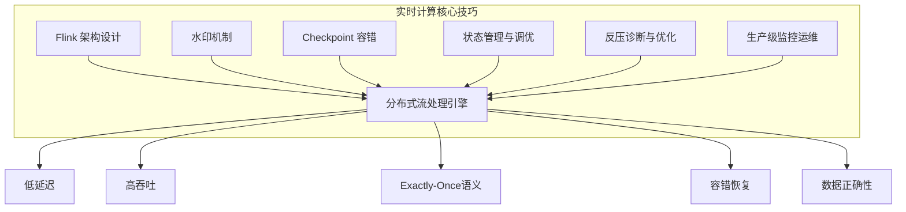
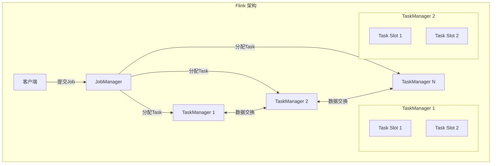
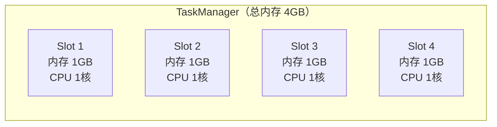
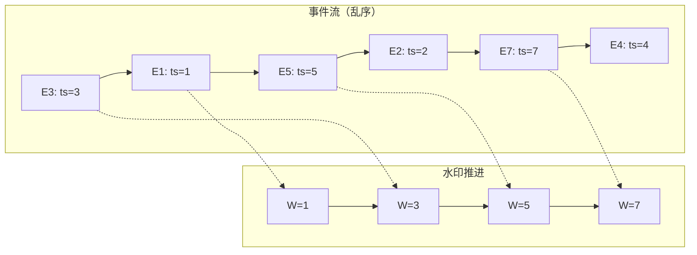
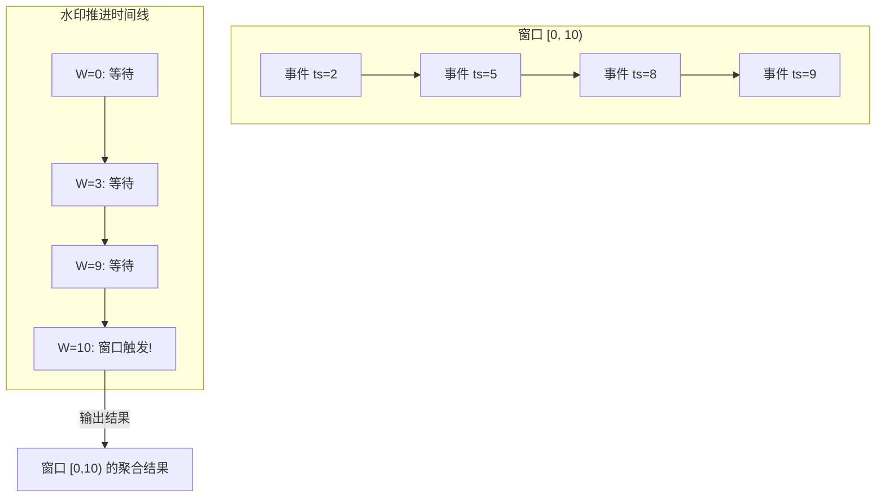
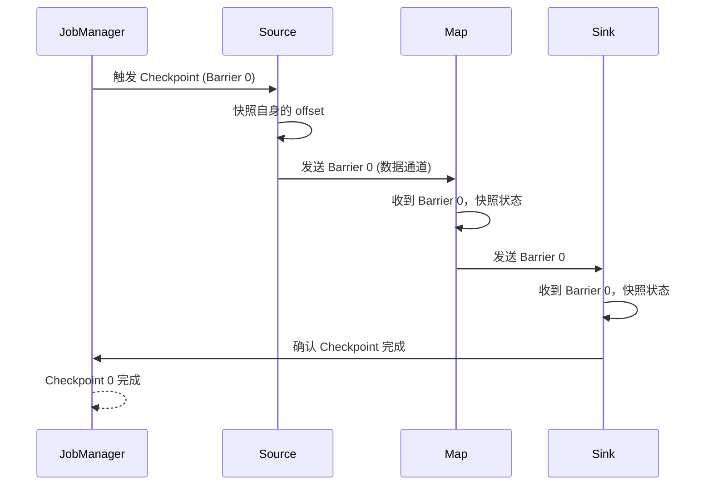
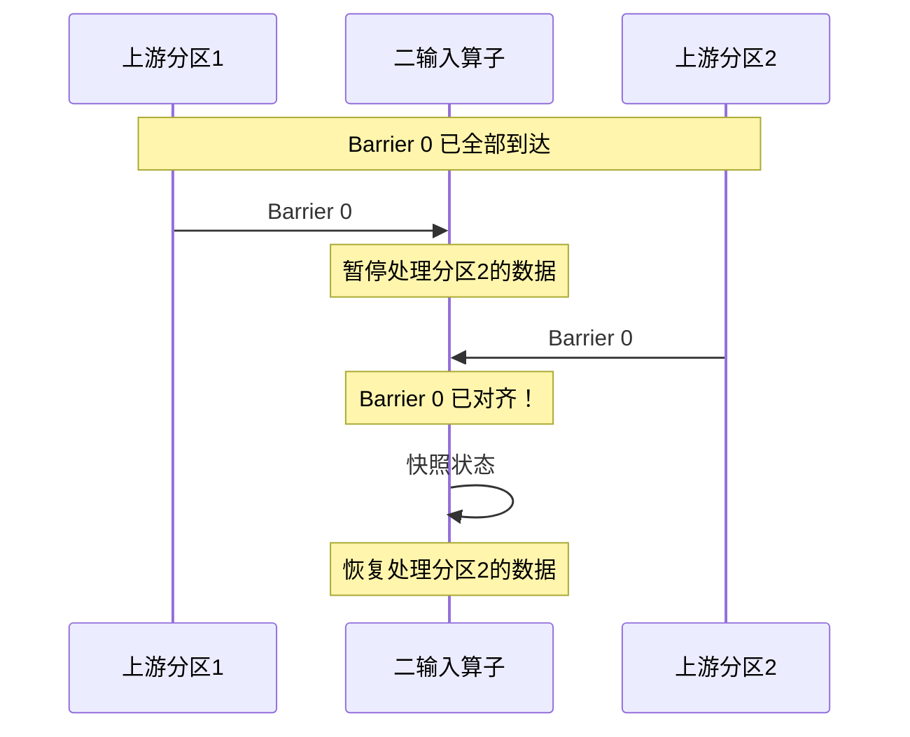
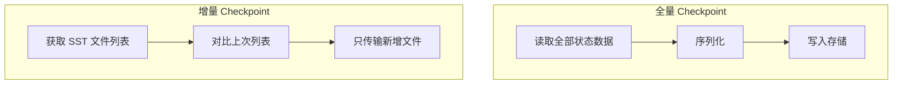
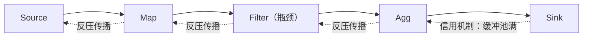

# 实时计算核心技巧

实时计算的理论基础为我们建立了认知框架，但真正的工程能力来自对核心技巧的深度掌握。本节聚焦六大关键领域：**Flink 架构设计**、**水印机制**、**Checkpoint 容错机制**、**状态管理与调优**、**反压诊断与优化**、**生产级监控运维**——它们是构建可靠、高性能流处理系统的基石。



---

## 一、Flink 架构设计

### 1.1 Flink 的设计哲学

Apache Flink 诞生于柏林工业大学的 Stratosphere 研究项目（2011年），其核心设计理念是**将批处理视为流处理的特例**——即"批是有限流"（Batch as a Bounded Stream）。这一哲学决定了 Flink 所有架构决策的方向。

与 Spark Streaming 的微批（Micro-batch）模式不同，Flink 采用**逐条事件处理（Event-at-a-time）**模型，数据一到达即触发计算，天然支持毫秒级延迟。这一差异不是性能调优能弥补的，而是架构层面的根本区别。

| 维度 | Flink（逐条处理） | Spark Streaming（微批） | Storm（逐条处理） | Kafka Streams |
|------|-------------------|------------------------|-------------------|---------------|
| 处理模型 | Event-at-a-time | Micro-batch | Event-at-a-time | Event-at-a-time |
| 典型延迟 | 毫秒级 | 秒级 | 毫秒级 | 毫秒级 |
| 吞吐量 | 高（百万级/秒） | 极高（亿级/秒） | 中（万级/秒） | 中高（十万级/秒） |
| 状态管理 | 原生分布式 | 受限（RDD） | 需外部存储 | 内置（依赖Kafka） |
| Exactly-Once | 原生支持 | 通过 WAL 实现 | 需事务保障 | 端到端（依赖Kafka） |
| 窗口语义 | 丰富（滑动/会话/翻转） | 仅翻转窗口 | 受限 | 时间/计数/会话 |
| 部署模式 | Standalone/YARN/K8s | Standalone/YARN/K8s | YARN | 进程内嵌 |
| 适用规模 | 中大规模 | 大规模 | 小中规模 | 中小规模 |

**Flink 在大数据生态中的定位**：Flink 已成为实时计算领域事实上的标准引擎。阿里巴巴的 Flink on Apache 项目（Blink）支撑了双十一每秒数十亿事件的实时处理；字节跳动使用 Flink 驱动实时推荐和广告系统；Netflix 用 Flink 实现实时数据管道。选择 Flink 的根本原因不是"流行"，而是它在延迟、吞吐、正确性三个维度上取得了最佳平衡。

### 1.2 Flink 运行时架构

Flink 的运行时由以下几个核心组件构成：



**JobManager** 是集群的主控节点，由三个核心子组件构成：

**（1）Dispatcher** — 接收客户端提交的作业，为每个作业启动一个 JobMaster，提供 REST API 和 Web UI 入口。在 Session 模式下常驻，Per-Job 模式下随作业启停。

**（2）ResourceManager** — 管理 TaskManager 的 Slot 资源池。接收 JobMaster 的资源请求，分配空闲 Slot。当 Slot 不足时，向外部资源管理器（YARN/Kubernetes）申请容器。支持 SlotSharingGroup：多个子任务可共享一个 Slot，提升资源利用率。

**（3）JobMaster** — 一个作业对应一个 JobMaster 实例。负责将作业的 ExecutionGraph 拆分为 Task，分发到 TaskManager；管理 Checkpoint 协调（触发、确认、完成）；监控 Task 的执行状态，处理故障恢复。

**TaskManager** 是实际执行计算的工作节点，负责：
- 管理一个或多个 **Task Slot**（每个 Slot 执行一个 Task）
- 存储作业的**状态数据**（如 ValueState、ListState）
- 执行 Task 之间的**数据交换**（通过 Netty Shuffle Service）
- 参与 Checkpoint 的数据快照过程

**Client** 不属于运行时组件，它负责将用户的 DataStream/DataSet 程序编译为 JobGraph，然后提交给 JobManager。Flink 支持多种提交方式：命令行（`flink run`）、REST API、YARN/Kubernetes 集成模式。

### 1.3 执行图：从代码到分布式执行

Flink 程序的执行经历四层图的转换，理解这个过程是性能调优的前提：

StreamGraph（用户代码）→ JobGraph（优化合并）→ ExecutionGraph（并行化）→ 物理执行计划

**StreamGraph**：直接反映用户代码中的算子连接关系，每个算子对应一个节点。这是最接近代码的一层。

**JobGraph**：Flink 会将满足条件的连续算子合并为**算子链（Operator Chain）**，在同一 Task 中执行。合并条件包括：
- 下游算子的入度为 1
- 两个算子之间没有 Shuffle 操作
- 两个算子在同一个 Slot Sharing Group 中
- 用户未手动禁用链化（`disableChaining()`）

算子链化的价值在于：链内的数据传递在**线程内完成**，无需序列化、反序列化和网络传输，可将延迟降低一个数量级。这是 Flink 性能优化的第一道关卡。

**ExecutionGraph**：引入并行度概念，将每个算子按并行度拆分为多个**并行子任务（Subtask）**。例如并行度为 4 的 Map 算子会产生 4 个 Subtask，分布在不同的 Task Slot 中执行。

**理解四层图转换的实战价值**：当作业出现性能问题时，需要逐层排查。先看 StreamGraph 确认逻辑正确，再看 JobGraph 确认链化策略合理，然后看 ExecutionGraph 确认并行度和数据分区正确，最后看物理执行计划确认资源分配。

### 1.4 数据交换策略

Task 之间的数据传输方式直接影响性能。Flink 定义了多种数据分发策略：

| 分发策略 | 机制 | 适用场景 | 性能特征 |
|---------|------|---------|---------|
| Forward | 一对一前向传递 | 同并行度的相邻算子 | 零网络开销 |
| Broadcast | 向所有下游分区广播 | 维表 Join、配置分发 | 网络开销大 |
| KeyGroup/Rebalance | 轮询分配 | 默认分发策略 | 均匀但有网络开销 |
| Rescale | 轮询（仅本地 TaskManager） | TaskManager 内部连接 | 低网络开销 |
| Shuffle | 随机均匀分配 | 无序分发 | 均匀但无序 |
| KeyPartition | 按 Key Hash 分配 | GroupBy、Join 操作 | 数据倾斜风险 |
| Global | 全部发送到第一个分区 | 结果汇总 | 单点瓶颈 |

**实战建议**：当两个算子并行度相同且无 Shuffle 时，Flink 自动使用 Forward 策略，数据在同一 TaskManager 的线程间传递。这是性能最优路径。设计 DAG 时应尽量保持关键路径上的算子并行度一致，减少不必要的网络传输。

**数据倾斜的识别与处理**：当使用 KeyPartition 时，如果某些 Key 的数据量远大于其他 Key，会导致部分 Subtask 过载而其他 Subtask 空闲。识别方法是观察各 Subtask 的处理速率差异；处理方法包括：加盐打散热点 Key、两阶段聚合（先局部聚合再全局聚合）、使用 Dynamic Table 实现运行时负载均衡。

### 1.5 Task Slot 与资源模型

Flink 的资源调度以 **Task Slot** 为最小单位。一个 TaskManager 的 Slot 数量决定了它能并行执行多少个 Task。



**关键配置参数：**

| 参数 | 含义 | 调优建议 |
|------|------|---------|
| `taskmanager.numberOfTaskSlots` | 每个 TM 的 Slot 数 | 默认 1，可根据资源调整 |
| `parallelism.default` | 默认并行度 | 根据数据量和延迟要求设置 |
| `taskmanager.memory.process.size` | TM 进程总内存 | 生产环境建议 4-8GB |
| `taskmanager.memory.managed.size` | 托管内存大小 | 用于排序、哈希等操作 |
| `taskmanager.memory.task.heap.size` | Task 堆内存 | 算子的 JVM 堆使用 |
| `taskmanager.memory.task.off-heap.size` | Task 堆外内存 | 网络缓冲区等 |
| `taskmanager.memory.network.fraction` | 网络内存占比 | 默认 0.1，高吞吐场景调大 |

**Flink 内存模型详解**：Flink 的内存管理分为三个层次：

TaskManager JVM 进程内存
├── JVM Metaspace (元空间)
├── JVM Overhead (开销)
└── Total Process Memory
    ├── Framework Heap Memory (框架堆内存)
    ├── Framework Off-Heap (框架堆外)
    ├── Task Off-Heap Memory (任务堆外)
    ├── Managed Memory (托管内存，用于 RocksDB/排序/哈希)
    ├── Network Memory (网络缓冲区)
    └── Task Heap Memory (任务堆内存，算子使用)

生产环境中，`taskmanager.memory.managed.size` 是关键参数。它决定了 Flink 预留给 RocksDB 和排序操作的堆外内存。如果设置过小，RocksDB 可能回退到磁盘读写，性能急剧下降；设置过大则挤占算子可用的堆内存。推荐值为 TaskManager 总内存的 30%-40%。

**Slot Sharing（Slot 共享）**：默认情况下，来自不同算子但相同 Slot Sharing Group 的 Subtask 可以共享同一个 Slot。这意味着一个 Slot 中可能运行 Source + Map + Filter 的 Subtask 组合。优势是提高了资源利用率；风险是不同算子的资源需求可能冲突。

**独占 Slot**：通过 `slotSharingGroup("exclusive")` 可以禁止 Slot 共享，让每个 Subtask 独占一个 Slot。适用于资源需求大或需要隔离的算子（如大状态的窗口聚合算子）。

### 1.6 算子链化与性能调优

算子链化是 Flink 性能优化的第一道关卡。判断两个算子是否能链接的条件：

```java
// 默认配置：满足以下所有条件即可链接
StreamGraph.setChainingMode(ChainingMode.ALWAYS);

// 禁止特定算子参与链化
stream.map(...).uid("my-map").disableChaining();

// 设置新的 Chain Group，强制断链
stream.map(...).startNewChain();
```

**链化 vs 断链的决策依据：**

| 场景 | 建议 | 原因 |
|------|------|------|
| 低延迟要求 | 链化 | 线程内传递，消除序列化开销 |
| CPU 密集型算子 | 断链 | 避免与其他算子竞争 CPU 时间 |
| 异步 IO 操作 | 断链 | 防止阻塞链内其他算子 |
| 大状态算子 | 断链 | 方便独立调优和扩缩容 |
| 算子逻辑变更频繁 | 断链 | 方便独立升级和 A/B 测试 |
| 资源需求差异大 | 断链 | 避免资源竞争，便于独立配置 |

**算子 UID 的重要性**：每个算子都应通过 `.uid("unique-name")` 设置唯一标识。这在 Savepoint 恢复时至关重要——Flink 通过 UID 将 Savepoint 中的状态绑定到对应的算子。如果代码修改导致算子拓扑变化（如在中间插入新算子），没有 UID 的算子会丢失状态绑定，必须使用 `--allowNonRestoredState` 跳过，导致数据不一致。

```java
// 生产级算子 UID 设置规范
stream
    .map(new MyMapper())
    .uid("mapper-step-1")     // 固定不变的唯一标识
    .keyBy(event -> event.getKey())
    .window(TumblingEventTimeWindows.of(Time.seconds(10)))
    .uid("window-aggregate")  // 关键算子必须设置
    .addSink(new MySink())
    .uid("final-sink");
```

---

## 二、水印机制

### 2.1 为什么需要水印

在理想的世界中，事件按产生顺序到达——先发生的事件先被处理。但现实世界中：

- **网络延迟差异**：不同生产者到消费者的网络路径不同，导致同一时间窗口的事件到达顺序不一致
- **生产者端积压**：某个生产者暂时过载，事件堆积后批量发送，产生突发乱序
- **GC 暂停**：JVM 垃圾回收导致数据延迟释放，数秒甚至数十秒的乱序
- **重试机制**：失败的事件重试后乱序到达
- **分区策略**：Kafka 的分区策略本身可能导致跨分区乱序

如果没有水印机制，窗口计算将无法判断"某个时间窗口的数据是否已经全部到达"，导致结果永远处于"等待更多数据"的状态。水印机制的核心作用是：**提供一个系统级别的"时间进度信号"，告诉下游算子"时间戳小于 T 的事件已经全部到齐，可以安全地处理或关闭窗口了"**。

### 2.2 水印的核心概念

**水印本质上是一个单调递增的时间戳**，它表示"时间戳小于等于该值的事件理论上已经全部到达"。当窗口的结束时间小于水印值时，Flink 认为该窗口可以关闭并输出结果。



**水印的数学定义**：设水印 W(t) 是处理时间 t 时刻的水印值，则：对于任意事件 e，如果 `e.eventTime < W(t)`，则在处理时间 t 之后，系统假设不会再收到事件 e（或与 e 时间戳相同的其他事件）。这个定义将不确定的"事件什么时候全部到齐"问题，转化为了确定性的"水印推进到哪里"问题。

**水印的两种语义**：

| 类型 | 语义 | 延迟容忍 | 适用场景 |
|------|------|---------|---------|
| 严格水印（Strict） | 水印 W 到达后，时间戳 < W 的事件保证不再出现 | 0 | 数据源保证全局有序 |
| 宽松水印（Lax） | 水印 W 到达后，时间戳 < W 的事件**极大概率**不再出现 | 可配置 | 绝大多数实际场景 |

实际生产中几乎都使用宽松水印，因为严格水印要求数据源全局有序，这在分布式系统中几乎不可能实现。

### 2.3 水印生成策略

**策略一：周期性水印（Periodic Watermark）**

水印由一个独立的计时器按固定间隔生成。Flink 默认每 200ms 生成一次水印。这是最常用的策略，适合大多数场景。

```java
// 自定义周期性水印
public class BoundedOutOfOrdernessWatermark 
    implements WatermarkStrategy<Event> {
    
    private final Duration maxOutOfOrderness;
    
    public BoundedOutOfOrdernessWatermark(Duration maxOutOfOrderness) {
        this.maxOutOfOrderness = maxOutOfOrderness;
    }
    
    @Override
    public WatermarkGenerator<Event> createWatermarkGenerator(
            WatermarkGeneratorSupplier.Context context) {
        return new WatermarkGenerator<Event>() {
            private long maxTimestamp = Long.MIN_VALUE;
            
            @Override
            public void onEvent(Event event, long eventTimestamp, 
                    WatermarkOutput output) {
                maxTimestamp = Math.max(maxTimestamp, event.getTimestamp());
            }
            
            @Override
            public void onPeriodicEmit(WatermarkOutput output) {
                // 水印 = 最大事件时间 - 最大容忍延迟
                output.emitWatermark(
                    new Watermark(maxTimestamp - maxOutOfOrderness.toMillis() - 1));
            }
        };
    }
}
```

**关键参数：`maxOutOfOrderness`** —— 表示你能容忍的最大乱序程度。例如设为 5 秒，意味着如果一个事件的延迟超过 5 秒，它将被丢弃（在允许迟到配置下除外）。这个值的选择需要权衡：

- 设得太大：窗口关闭延迟增加，结果产出延迟变高
- 设得太小：迟到事件被丢弃，结果不完整
- 推荐做法：通过侧输出监控迟到数据分布，设为实际观测最大乱序时间的 1.5~2 倍

**策略二：标点水印（Punctuated Watermark）**

水印嵌入在数据流中，由事件本身驱动。适用于心跳驱动的场景（如 IoT 设备定期上报状态）。

```java
// 标点水印：遇到特定事件才推进水印
public class PunctuatedWatermark 
    implements WatermarkStrategy<Event> {
    
    @Override
    public WatermarkGenerator<Event> createWatermarkGenerator(
            WatermarkGeneratorSupplier.Context context) {
        return new WatermarkGenerator<Event>() {
            private long maxTimestamp = Long.MIN_VALUE;
            
            @Override
            public void onEvent(Event event, long eventTimestamp, 
                    WatermarkOutput output) {
                if (event.isHeartbeat()) {
                    maxTimestamp = event.getTimestamp();
                    output.emitWatermark(new Watermark(maxTimestamp));
                }
            }
            
            @Override
            public void onPeriodicEmit(WatermarkOutput output) {
                // 不需要周期性发射
            }
        };
    }
}
```

标点水印的优点是水印精确度高，缺点是依赖数据源的特殊格式，且需要逐条检查每个事件，计算开销较大。

**策略三：空闲分区检测（With Idle Source）**

当某个并行度的数据源暂时没有数据时，水印不会前进，导致整个作业的水印被这个空闲的源卡住。这是多分区数据源（如 Kafka 多分区）中最常见的水印停滞原因。

```java
// 空闲检测：空闲超过1分钟即忽略
WatermarkStrategy<Event> strategy = WatermarkStrategy
    .<Event>forBoundedOutOfOrderness(Duration.ofSeconds(10))
    .withIdleness(Duration.ofMinutes(1));  // 关键配置
```

**为什么需要空闲检测？** 假设一个作业从 Kafka 的 12 个分区读取数据。全局水印 = min(所有分区的水印)。如果第 8 个分区因为消费端 rebalance 暂时没有数据，该分区的水印停滞不前，导致全局水印被拖住——即使其他 11 个分区的数据已经推进到了很晚的时间戳，窗口仍然无法关闭。`withIdleness` 解决的就是这个问题。

**三种策略的对比**：

| 策略 | 水印推进方式 | 延迟 | 精确度 | 实现复杂度 | 适用场景 |
|------|-------------|------|--------|-----------|---------|
| 周期性水印 | 定时器触发，基于 max_ts - delay | 可配置 | 中等 | 低 | 通用场景 |
| 周期性+空闲检测 | 同上 + 空闲源自动跳过 | 可配置 | 中等 | 低 | 多分区、不均匀流量 |
| 自定义标记水印 | 数据驱动，遇到标记立即推进 | 最低 | 高 | 高 | 数据源有明确批次边界 |

### 2.4 水印与窗口的交互

当水印推进到窗口的结束时间（加上允许迟到时间）时，窗口关闭并触发计算。以 10 秒翻转窗口 `[0,10)` 为例：



**Flink 提供三种窗口触发策略：**

| 策略 | 触发时机 | 结果 | 适用场景 |
|------|---------|------|---------|
| 默认（OnTime） | 水印超过窗口结束时间 | 一次精确结果 | 大多数场景 |
| Early（提前触发） | 窗口内事件达到阈值 | 多次部分结果 | 实时仪表盘 |
| Late（迟到数据） | 水印超过后仍有数据到达 | 更新结果 | 数据质量不可控 |

### 2.5 处理迟到数据的完整策略

实时系统中，迟到数据是不可避免的。Flink 提供了多层防御：

```java
stream
    .keyBy(event -> event.getKey())
    .window(TumblingEventTimeWindows.of(Time.seconds(10)))
    // 第一层：允许迟到（窗口关闭后仍接收迟到数据）
    .allowedLateness(Time.seconds(5))
    // 第二层：侧输出流（超过允许迟到的数据）
    .sideOutputLateData(lateOutputTag)
    .process(new ProcessWindowFunction<...>() {
        @Override
        public void process(Context ctx, Iterable<Event> elements, 
                Collector<Result> out) {
            // 处理窗口内的所有数据（包括迟到数据）
            for (Event e : elements) {
                // 聚合逻辑
            }
            out.collect(result);
        }
    });

// 处理侧输出流中的"超级迟到"数据
dataStream.getSideOutput(lateOutputTag)
    .addSink(new LateDataArchiver());  // 存入 HBase/DynamoDB 供后续修正
```

**迟到数据处理三层架构：**

正常数据 → 窗口计算 → 结果输出
    ↓（迟到但在窗口内）
迟到数据 → 窗口重计算 → 结果更新
    ↓（超过 allowedLateness）
超级迟到 → 侧输出流 → 离线修正

**迟到数据处理策略的选择**：

| 策略 | 数据保证 | 延迟 | 状态开销 | 适用场景 |
|------|---------|------|---------|---------|
| 不处理迟到数据 | 可能丢失 | 最低 | 最低 | 允许近似结果的实时监控 |
| allowedLateness | 窗口关闭前的数据不丢 | 增加 | 增加 | 金融计费、用户行为分析 |
| 侧输出 + 批量修正 | 最终全部处理 | 较高 | 较高 | 对数据完整性要求极高的场景 |
| 允许延迟 + 侧输出组合 | 窗口内不丢，超时的单独处理 | 中等 | 中等 | **生产环境的通用方案** |

### 2.6 水印的常见陷阱与调优

**陷阱一：空闲分区导致水印停滞**

在使用 KeyBy 后，如果某个分区长时间没有数据（如某个 Key 的生产者离线），该分区的水印不再推进，会阻塞整个窗口的触发。这是多分区场景中最常见的水印问题。

**解决方案**：配置空闲分区超时。

```java
WatermarkStrategy<Event> strategy = WatermarkStrategy
    .<Event>forBoundedOutOfOrderness(Duration.ofSeconds(10))
    .withIdleness(Duration.ofMinutes(1));  // 空闲超过1分钟即忽略
```

**陷阱二：水印与 Processing Time 混用**

水印是事件时间（Event Time）的度量，与处理时间（Processing Time）无关。但有些开发者在窗口函数中使用 `System.currentTimeMillis()` 来标记结果时间，导致混乱。

**正确做法**：始终使用窗口上下文提供的时间信息：

```java
@Override
public void process(Context ctx, Iterable<Event> elements, 
        Collector<Result> out) {
    // 正确：使用窗口的事件时间范围
    long windowStart = ctx.window().getStart();
    long windowEnd = ctx.window().getEnd();
    // windowEnd - windowStart = 窗口大小
}
```

**陷阱三：水印生成粒度不当**

过粗的水印（每 10 秒生成一次）会导致窗口触发延迟；过细的水印（每 1ms 生成一次）会产生大量 Watermark 对象，增加 GC 压力。

**推荐配置：**

| 场景 | 推荐间隔 | 理由 |
|------|---------|------|
| 低延迟（< 100ms） | 50-100ms | 窗口快速触发 |
| 通用场景 | 200ms（默认） | 平衡延迟与开销 |
| 高吞吐批量 | 1-5s | 减少水印开销 |

**陷阱四：不考虑时区**

```java
// 错误：忽略时区
window(TumblingEventTimeWindows.of(Time.hours(1)));

// 正确：显式指定时区
window(TumblingEventTimeWindows.of(Time.hours(1), 
    Timezone.getTimeZone("Asia/Shanghai")));
```

跨时区业务（如全球用户行为分析）必须显式指定时区，否则窗口边界会因服务器时区不同而产生偏差。

### 2.7 多输入水印合并策略

当算子有多个上游输入时，Flink 取**所有输入水印的最小值**作为当前算子的水印。这是保证正确性的必要条件——只有所有上游都到达某个时间点，当前算子才能安全地处理该时间点之前的数据。

```java
// 多输入水印合并示意
// Input A: Watermark = 100
// Input B: Watermark = 85
// 合并后算子 Watermark = min(100, 85) = 85
```

**这带来的性能影响**：如果一个上游的水印严重滞后（如某个 Kafka 分区的消费者卡住），整个作业的水印推进都会被拖慢。

**端到端延迟估算公式**：

端到端延迟 ≈ maxOutOfOrderness + watermarkInterval + sum(算子处理延迟) + sum(网络延迟)

例如：`10s(容忍延迟) + 0.2s(水印间隔) + 0.5s(算子延迟) + 0.3s(网络延迟) = 11s`

如果业务要求端到端延迟 < 5 秒，则 `maxOutOfOrderness` 必须 < 4 秒。但缩短容忍延迟会增加数据丢失风险——这就是实时计算中**正确性与延迟的根本矛盾**。

### 2.8 自适应水印策略

对于乱序程度波动较大的数据流（如节假日电商大促），固定水印策略往往不够灵活。自适应水印通过统计最近事件的乱序分布，动态调整容忍延迟：

```java
public class AdaptiveWatermark implements WatermarkStrategy<Event> {
    private final DescriptiveStatistics windowSize = 
        new DescriptiveStatistics(1000);  // 滑动窗口，记录最近1000个事件
    
    @Override
    public WatermarkGenerator<Event> createWatermarkGenerator(...) {
        return new WatermarkGenerator<Event>() {
            private long maxTimestamp = Long.MIN_VALUE;
            
            @Override
            public void onEvent(Event event, long eventTimestamp, 
                    WatermarkOutput output) {
                long latency = System.currentTimeMillis() - eventTimestamp;
                windowSize.addValue(latency);
                
                double avgLatency = windowSize.getMean();
                double stdLatency = windowSize.getStandardDeviation();
                
                // 动态调整容忍延迟 = 均值 + 2σ（覆盖约95%的乱序）
                long dynamicTolerance = (long)(avgLatency + 2 * stdLatency);
                
                maxTimestamp = Math.max(maxTimestamp, event.getTimestamp());
                output.emitWatermark(
                    new Watermark(maxTimestamp - dynamicTolerance - 1));
            }
            
            @Override
            public void onPeriodicEmit(WatermarkOutput output) {
                // 已在 onEvent 中处理
            }
        };
    }
}
```

这种策略在乱序程度波动大的场景下效果显著：平时水印紧跟事件流，乱序加剧时自动放宽容忍范围。

---

## 三、Checkpoint 容错机制

### 3.1 Chandy-Lamport 算法原理

1985 年提出的 Chandy-Lamport 算法解决了一个根本问题：**如何在不暂停整个系统的情况下，获取分布式系统的一致快照？**

Flink 对该算法的工程化改进包括：
- **异步 Barrier 注入**：Barrier 随数据流前进，不需要全局暂停
- **增量快照**：只记录状态变化，大幅减少 I/O 开销
- **与算子状态融合**：将快照逻辑深度集成到执行引擎中
- **支持 Unaligned Checkpoint**：Barrier 直接穿越被阻塞的数据缓冲区，消除对齐延迟

**Flink 对原始算法的改进对照**：

| 原始算法假设 | Flink 的实际处理 |
|-------------|----------------|
| 点对点通道 | 支持多输入多输出的算子拓扑 |
| 消息严格有序 | 允许同一 Channel 内有序，不同 Channel 间无序 |
| 全局 Marker 注入 | 仅从 Source 注入 Barrier，逐层传播 |
| 全量状态快照 | 支持增量快照（RocksDB） |
| 无状态恢复 | 完整的恢复协议，含 Source 位点恢复 |

### 3.2 Checkpoint 执行流程



**Checkpoint 执行的六个阶段**：

1. **触发阶段**：JobManager 的 CheckpointCoordinator 按配置间隔定期触发 Checkpoint
2. **注入阶段**：向所有 Source 注入 Barrier，记录 Source 的消费偏移量
3. **传播阶段**：Barrier 随数据流向下游传播（异步，不阻塞数据处理）
4. **快照阶段**：算子收到所有输入的 Barrier 后，触发本地状态快照（同步序列化 + 异步写入）
5. **确认阶段**：快照完成后向 JobManager 发送 ACK
6. **完成阶段**：所有算子确认后，Checkpoint 标记为成功，通知算子清理旧数据

**关键概念——Barrier 对齐（Barrier Alignment）：**

对于有两个上游输入的算子（如 CoProcessFunction），Barrier 对齐是保证 Exactly-Once 的关键：



对齐期间，已经收到 Barrier 0 但尚未收到另一分区 Barrier 0 的数据会被**阻塞**。这就是为什么 Checkpoint 时间过长会增加端到端延迟。

**非对齐 Checkpoint（Flink 1.11+）：**

对于延迟敏感的场景，可以启用非对齐 Checkpoint。非对齐模式下，Barriers 直接"穿越"被阻塞的数据缓冲区，不等待对齐。代价是 Checkpoint 的大小可能更大（需要快照阻塞的数据缓冲区），但消除了对齐导致的延迟抖动。

```java
env.getCheckpointConfig().enableUnalignedCheckpoints();

// 推荐：设置对齐超时，流量高峰时自动降级为非对齐模式
env.getCheckpointConfig().setAlignedCheckpointTimeout(
    Duration.ofSeconds(30));
```

**对齐 vs 非对齐的选型决策**：

| 特性 | 对齐 Checkpoint | 非对齐 Checkpoint |
|------|----------------|------------------|
| 一致性保证 | Exactly-Once | Exactly-Once |
| 数据处理延迟 | 可能增加 | 不增加 |
| 状态大小 | 仅算子状态 | 算子状态 + 在途数据 |
| 恢复时间 | 较短 | 较长 |
| 适用场景 | 一般流量、延迟容忍度高 | 高流量、延迟敏感 |
| Checkpoint 文件大小 | 较小 | 较大 |

### 3.3 状态后端选择

状态后端决定了 Checkpoint 数据的存储位置和读写性能：

| 特性 | HashMapStateBackend | EmbeddedRocksDBStateBackend |
|------|--------------------|-----------------------------|
| 存储位置 | JVM 堆内存 | 本地磁盘（RocksDB） |
| 状态大小限制 | 堆内存大小（通常 GB 级） | 磁盘大小（TB 级） |
| 读写性能 | 极快（纳秒级） | 较快（微秒级，受磁盘影响） |
| 序列化 | Java 原生 | Protobuf / 自定义 |
| Checkpoint 方式 | 全量（异步） | 全量或增量 |
| 适用场景 | 状态小（< 1GB）、低延迟 | 状态大（> 1GB）、高吞吐 |
| 内存管理 | 受 GC 影响大 | JVM 堆外存储，GC 友好 |

**选择决策树：**

状态大小 < 1GB？
├── 是 → HashMapStateBackend（性能最优）
│   └── 注意：超过 60% 堆内存时可能 OOM
└── 否 → 状态大小 < 100GB？
    ├── 是 → RocksDB（增量 Checkpoint）
    │   └── 启用 state.backend.incremental: true
    └── 否 → RocksDB + 压缩（LZ4/ZSTD）
        └── 启用 per-level 压缩策略

### 3.4 Checkpoint 调优实战

**参数一：Checkpoint 间隔**

```java
// 推荐配置
env.enableCheckpointing(60000);  // 60秒一次（毫秒）
```

间隔太短 → Checkpoint 频繁，占用计算资源；间隔太长 → 故障恢复时需要重放更多数据。

**参数二：Checkpoint 超时**

```java
env.getCheckpointConfig().setCheckpointTimeout(120000);  // 120秒超时
```

如果 Checkpoint 在超时时间内未完成，会被放弃。超时通常意味着状态太大或 I/O 压力过高。

**参数三：最大并发 Checkpoint 数**

```java
env.getCheckpointConfig().setMaxConcurrentCheckpoints(1);
```

默认为 1，即上一次 Checkpoint 完成后才触发下一次。设为 2 可以让两次 Checkpoint 重叠执行，但会增加 I/O 和内存压力。

**参数四：Checkpoint 失败容忍**

```java
// 最多容忍 3 次连续失败，之后作业重启
env.getCheckpointConfig().setTolerableCheckpointFailureNumber(3);
```

**参数五：Checkpoint 模式**

```java
// EXACTLY_ONCE（默认）：强一致性
env.getCheckpointConfig().setCheckpointingMode(CheckpointingMode.EXACTLY_ONCE);

// AT_LEAST_ONCE：允许重复处理，但延迟更低
env.getCheckpointConfig().setCheckpointingMode(CheckpointingMode.AT_LEAST_ONCE);
```

| 模式 | 特征 | 延迟 | 状态大小 | 适用场景 |
|------|------|------|---------|---------|
| EXACTLY_ONCE | Barrier 对齐 | 较高 | 可能更大 | 金融交易、计费 |
| AT_LEAST_ONCE | 无对齐 | 较低 | 较小 | 日志分析、监控 |

**生产级 Checkpoint 完整配置模板**：

```java
// === Checkpoint 核心配置 ===
env.enableCheckpointing(60000);  // 60秒间隔
env.getCheckpointConfig().setCheckpointingMode(CheckpointingMode.EXACTLY_ONCE);
env.getCheckpointConfig().setCheckpointTimeout(300000);  // 5分钟超时
env.getCheckpointConfig().setMinPauseBetweenCheckpoints(30000);  // 最小间隔30秒
env.getCheckpointConfig().setMaxConcurrentCheckpoints(1);
env.getCheckpointConfig().setTolerableCheckpointFailureNumber(3);

// 外部化 Checkpoint：作业取消后保留
env.getCheckpointConfig().setExternalizedCheckpointCleanup(
    ExternalizedCheckpointCleanup.RETAIN_ON_CANCELLATION);

// 非对齐 Checkpoint（延迟敏感场景）
env.getCheckpointConfig().enableUnalignedCheckpoints();
env.getCheckpointConfig().setAlignedCheckpointTimeout(Duration.ofSeconds(30));

// === 状态后端配置 ===
env.setStateBackend(new EmbeddedRocksDBStateBackend(true));  // true = 增量

// === 存储路径 ===
Configuration config = new Configuration();
config.setString("state.checkpoints.dir", "hdfs:///flink/checkpoints");
config.setString("state.savepoints.dir", "hdfs:///flink/savepoints");
```

### 3.5 Savepoint：人工备份与迁移

Savepoint 是用户触发的、与 Checkpoint 格式兼容的全局快照，但用途不同：

| 特性 | Checkpoint | Savepoint |
|------|-----------|-----------|
| 触发方式 | 自动（定时器） | 手动（CLI/API） |
| 目的 | 故障恢复 | 版本升级、迁移、调参 |
| 生命周期 | 作业取消后可配置删除 | 永久保留直到手动删除 |
| 存储格式 | 状态后端特定 | 可移植格式 |
| 触发开销 | 优化为增量 | 通常全量 |

```bash
# 创建 Savepoint
flink savepoint :jobId hdfs://namenode/flink/savepoints

# 从 Savepoint 恢复
flink run -s hdfs://namenode/flink/savepoints/savepoint-xxx ...

# 取消作业并触发 Savepoint
flink cancel -s hdfs://path :jobId
```

**Savepoint 迁移的典型场景：**

1. **代码升级**：修改了状态结构，需要通过 `--allowNonRestoredState` 或 `StateMigration` 处理兼容性
2. **Flink 版本升级**：新版的状态序列化格式可能不兼容旧版
3. **并行度调整**：改变算子并行度后从 Savepoint 恢复
4. **集群迁移**：从 YARN 迁移到 Kubernetes
5. **A/B 测试**：从同一 Savepoint 启动两个不同版本的作业进行对比

**Savepoint 迁移注意事项**：
- 保持算子 UID 不变是状态恢复的前提
- 新增算子不影响恢复（状态是按 UID 绑定的）
- 删除算子需要 `--allowNonRestoredState`，但会导致该算子状态丢失
- 修改算子并行度时，Flink 会自动对状态进行重分区（Keyed State）

### 3.6 增量 Checkpoint 原理

RocksDB 状态后端支持增量 Checkpoint，核心思路是利用 RocksDB 的 **SST 文件不可变性**——每次 Checkpoint 只记录相对于上次 Checkpoint 新增的 SST 文件，而不需要重新读取所有状态数据。



**增量 Checkpoint 的性能数据：**

| 状态大小 | 全量 Checkpoint 时间 | 增量 Checkpoint 时间 | 节省比例 |
|---------|---------------------|---------------------|---------|
| 1GB | ~15s | ~2s | 87% |
| 10GB | ~120s | ~8s | 93% |
| 100GB | ~600s | ~30s | 95% |

**启用方式：**

```java
StateBackend backend = new EmbeddedRocksDBStateBackend(true);  // true = 增量
env.setStateBackend(backend);
```

**注意事项：**
- 增量 Checkpoint 的恢复时间可能比全量更长（需要合并多次增量文件）
- 如果状态变化率很高（如每秒更新大部分状态），增量优势不明显
- 增量 Checkpoint 的外部存储需要保留所有增量链路，否则恢复失败
- Compaction 会合并旧的 SST 文件，需要确保 Checkpoint 存储保留了所有引用的文件

### 3.7 Checkpoint 性能瓶颈诊断

当 Checkpoint 变慢时，需要系统性排查：

**诊断流程：**

Checkpoint 超时？
├── 检查状态大小（lastCheckpointSize）
│   ├── > 1GB → 考虑 RocksDB + 增量 Checkpoint
│   └── < 1GB → 检查 I/O
├── 检查对齐时间（alignmentDuration）
│   ├── > Checkpoint 间隔 → 数据倾斜或网络瓶颈
│   │   └── 启用 Unaligned Checkpoint
│   └── 正常 → 检查序列化时间
├── 检查持久化时间（unalignedCheckpointDuration）
│   ├── 异常 → 检查外部存储（HDFS/S3）的可用性
│   └── 正常 → 可能是 GC 暂停导致
└── 检查内存使用
    ├── GC 频繁 → 增大 JVM 堆或调整 GC 策略
    └── 内存不足 → 增大 TaskManager 内存

**常用排查命令：**

```bash
# 查看 Checkpoint 详情
flink list -r :jobId  # 查看运行中的 Checkpoint

# 检查 TaskManager 磁盘 I/O
iostat -x 1 5

# 检查 GC 情况
jstat -gcutil <pid> 1000 10

# 检查 RocksDB 统计
# 在 Flink Web UI → Job → Checkpoints → Summary 中查看
```

**常见瓶颈及解决方案**：

| 瓶颈 | 症状 | 解决方案 |
|------|------|---------|
| 状态过大 | lastCheckpointSize 持续增长 | 启用 State TTL、清理过期状态 |
| 对齐时间过长 | alignmentDuration > Checkpoint间隔 | 启用 Unaligned Checkpoint |
| I/O 瓶颈 | 持久化时间异常 | 使用 SSD、增加网络带宽 |
| GC 暂停 | jstat 显示 Full GC 频繁 | 增大堆内存、切换到 G1/ZGC |
| 外部存储慢 | HDFS/S3 写入延迟高 | 使用就近存储、增加副本数 |

### 3.8 故障恢复的代价分析

当 Checkpoint 失败触发作业重启时，恢复代价包括：

恢复时间 = Checkpoint 读取时间 + 状态恢复时间 + 数据重放时间

**数据重放**是最关键的部分。如果上游使用 Kafka 作为数据源：

| Checkpoint 间隔 | 平均重放数据量 | Kafka 消费速率 | 恢复时间（估算） |
|----------------|--------------|---------------|-----------------|
| 30 秒 | ~30 秒数据 | 10 万条/秒 | ~30 秒 |
| 60 秒 | ~60 秒数据 | 10 万条/秒 | ~60 秒 |
| 5 分钟 | ~5 分钟数据 | 10 万条/秒 | ~5 分钟 |

**优化恢复时间的策略：**

- 使用增量 Checkpoint（RocksDB）减少快照读取时间
- 合理设置 Checkpoint 间隔，平衡开销与恢复代价
- 启用 Externalized Checkpoint 持久化到高可靠存储
- 配置 `restartStrategy.fixed-delay.attempts` 控制重启次数
- 使用 Savepoint 定期备份关键状态，减少全量恢复的需要

### 3.9 生产级 Checkpoint 监控

```java
// 注册 Checkpoint 监听器
env.getCheckpointConfig().addCheckpointListener(new CheckpointListener() {
    @Override
    public void notifyCheckpointComplete(long checkpointId) {
        log.info("Checkpoint {} completed in {}ms", 
            checkpointId, getDuration());
        // 上报监控指标
        metrics.recordCheckpointDuration(getDuration());
    }
    
    @Override
    public void notifyCheckpointAborted(long checkpointId) {
        log.warn("Checkpoint {} aborted", checkpointId);
        alertService.trigger("Checkpoint abandoned");
    }
});
```

**关键监控指标：**

| 指标 | 正常范围 | 告警阈值 | 含义 |
|------|---------|---------|------|
| `lastCheckpointSize` | < 100MB | > 1GB | 状态大小异常增长 |
| `lastCheckpointDuration` | < 10s | > 30s | Checkpoint 执行过慢 |
| `numberOfCompletedCheckpoints` | 持续增长 | 停止增长 | Checkpoint 卡住 |
| `numberOfFailedCheckpoints` | 0 | > 3 连续失败 | 需要排查根因 |
| `lastCheckpointExternalPath` | 非空 | 空 | 外部存储不可用 |
| `lastCheckpointAlignmentBuffered` | < 10MB | > 100MB | 对齐积压过多 |
| `lastCheckpointProcessedRecords` | 持续增长 | 停止增长 | 数据处理停滞 |

---

## 四、状态管理与进阶调优

### 4.1 状态类型全景

Flink 提供了丰富的状态原语，选择正确的状态类型是高效状态管理的基础：

| 状态类型 | 说明 | 使用场景 | 典型操作 |
|----------|------|----------|---------|
| **ValueState** | 存储单个值 | 计数器、累加器、标志位 | `value()`, `update()` |
| **ListState** | 存储元素列表 | 收集一批数据后处理 | `add()`, `get()`, `update()` |
| **MapState** | 存储键值对 | 维护一张动态表 | `put()`, `get()`, `entries()` |
| **ReducingState** | 自动聚合（Reduce语义） | 实时聚合 | `add()` |
| **AggregatingState** | 自动聚合（Aggregate语义） | 复杂聚合逻辑 | `add()` |

**Keyed State vs Operator State**：

Keyed State（键控状态）:
  - 绑定到特定的 Key
  - 通过 KeyContext 保证同一 Key 的状态只在一个线程中访问
  - 自动按 Key 分区存储
  - 适用于: 统计、聚合、Join

Operator State（算子状态）:
  - 绑定到特定的算子实例（SubTask）
  - 不区分 Key
  - 适用于: 累加器、广播状态、Source 的偏移量
  - 重启时按算子并行度重新分配

### 4.2 状态 TTL 与清理策略

对于有时效性的状态（如用户最近 30 分钟的行为），必须配置状态 TTL 以避免状态无限膨胀：

```java
StateTtlConfig ttlConfig = StateTtlConfig
    .newBuilder(Time.minutes(30))
    // 更新类型：只在创建时设置过期时间，还是每次访问都重置
    .setUpdateType(StateTtlConfig.UpdateType.OnCreateAndWrite)
    // 状态可见性：是否返回已过期但未清理的状态
    .setStateVisibility(StateTtlConfig.StateVisibility.NeverReturnExpired)
    // 清理策略
    .cleanupInRocksdbCompactFilter(1000)  // RocksDB 压缩时清理
    .build();

ValueStateDescriptor<String> stateDescriptor = 
    new ValueStateDescriptor<>("user-state", String.class);
stateDescriptor.enableTimeToLive(ttlConfig);
```

**清理策略选择：**

| 策略 | 机制 | 性能影响 | 适用场景 |
|------|------|---------|---------|
| Full Snapshot Cleanup | 快照时过滤 | 恢复变慢 | 低频 Checkpoint |
| Incremental Cleanup | 访问时检查 | 有访问开销 | 频繁访问的状态 |
| RocksDB Compaction Filter | 压缩时清理 | 低（后台执行） | **RocksDB 大状态** |
| Timer Cleanup | 定时器触发 | 需要 Timer 服务 | 精确过期时间 |

**状态 TTL 的生产建议**：
- 几乎所有生产作业都应配置 State TTL，除非状态有明确的业务生命周期
- RocksDB Compaction Filter 是最推荐的清理策略，几乎无性能开销
- `NeverReturnExpired` 比 `ReturnExpiredIfNotCleanedUp` 更安全，避免脏读
- TTL 时间要大于 Checkpoint 间隔 + 允许迟到时间，否则窗口内的状态可能被提前清理

### 4.3 状态 Schema 演进

在生产环境中，代码变更往往需要修改状态结构。Flink 提供了多种状态演进策略：

**策略一：使用 `--allowNonRestoredState`（NSR）**

```bash
flink run -s savepoint-path --allowNonRestoredState my-job.jar
```

允许跳过 Savepoint 中存在但新代码中不存在的状态。简单但粗暴——被跳过的状态完全丢失。

**策略二：保持算子 UID 不变**

只要算子的 UID 不变，即使拓扑发生变化（如在前面插入新算子），状态仍然可以正确恢复。这是生产环境中最重要的状态演进原则。

**策略三：使用 State Processor API**

Flink 的 State Processor API 允许以批处理方式读取、转换和写入 Savepoint，适用于复杂的状态迁移场景（如修改 Keyed State 的 Key 结构）。

```java
// 读取 Savepoint 并转换状态
SavepointReader reader = SavepointReader.read(env, "hdfs:///savepoints/savepoint-xxx");

// 读取旧的状态
DataSet<Tuple2<String, Long>> oldState = reader.readBatchedState(
    "my-operator", 
    new ListStateDescriptor<>("my-state", String.class, Long.class));

// 转换状态
DataSet<Tuple2<String, Long>> newState = oldState.map(...);

// 写入新的 Savepoint
SavepointWriter.writeToSavepoint(env, "hdfs:///savepoints/new-savepoint")
    .withOperator(new OperatorIdentifier("new-operator"))
    .withKeyGroups(0, 128)
    .withState(newState);
```

### 4.4 RocksDB 深度调优

RocksDB 是生产环境中最常用的状态后端，其配置对性能影响巨大：

**内存相关参数**：

| 参数 | 默认值 | 推荐值 | 说明 |
|------|--------|--------|------|
| `state.backend.rocksdb.block.cache-size` | 64MB | 256MB-1GB | Block Cache 大小，影响读性能 |
| `state.backend.rocksdb.writebuffer.size` | 64MB | 128MB-256MB | 单个 MemTable 大小 |
| `state.backend.rocksdb.writebuffer.count` | 2 | 4-6 | 待刷盘的 MemTable 数量 |
| `state.backend.rocksdb.writebuffer.number-to-merge` | 1 | 2 | 合并 MemTable 的数量 |

**压缩相关参数**：

| 参数 | 默认值 | 推荐值 | 说明 |
|------|--------|--------|------|
| `state.backend.rocksdb.compression` | SNAPPY | LZ4/ZSTD | 压缩算法 |
| `state.backend.rocksdb.compression.per.level` | - | 逐层配置 | 底层用高压缩率 |

**Compaction 相关参数**：

| 参数 | 默认值 | 推荐值 | 说明 |
|------|--------|--------|------|
| `state.backend.rocksdb.compaction.style` | LEVEL | LEVEL | LEVEL 适合读多写少 |
| `state.backend.rocksdb.max-background-compactions` | 1 | 4-8 | 后台 Compaction 线程数 |
| `state.backend.rocksdb.max-background-flushes` | 2 | 4 | 后台刷盘线程数 |

**生产环境 RocksDB 完整配置模板**：

```yaml
# state.backend: rocksdb
# state.backend.incremental: true

# 内存调优
state.backend.rocksdb.block.cache-size: 512mb
state.backend.rocksdb.writebuffer.size: 128mb
state.backend.rocksdb.writebuffer.count: 4
state.backend.rocksdb.writebuffer.number-to-merge: 2

# 压缩调优
state.backend.rocksdb.compression: LZ4

# Compaction 调优
state.backend.rocksdb.max-background-compactions: 4
state.backend.rocksdb.max-background-flushes: 4

# Bloom Filter（加速 Point Lookup）
state.backend.rocksdb.use-bloom-filter: true
state.backend.rocksdb.bloom-filter-blocks-per-key: 10

# 目录配置
state.checkpoints.dir: hdfs:///flink/checkpoints
state.savepoints.dir: hdfs:///flink/savepoints
```

---

## 五、反压机制与诊断优化

### 5.1 反压的本质

反压（Backpressure）是流处理系统的核心保护机制。当下游处理速度跟不上上游数据产生速度时，Flink 通过**基于信用（Credit）的反压机制**向上游传播压力，防止内存溢出。



**Credit-based 反压的工作原理**：
1. 下游算子的输入缓冲区（InputBuffer）满了之后，停止向上游发送 Credit
2. 上游算子的输出缓冲区（ResultBuffer）没有 Credit 就不能发送数据
3. 反压逐级向上游传播，直到 Source 算子减速
4. 当下游消费了缓冲区的数据后，重新发送 Credit，上游恢复发送

### 5.2 反压的检测方法

**方法一：Flink Web UI（最直观）**

在 Flink Web UI 的作业拓扑图中，每个算子的连线会显示反压状态：
- **OK**：正常
- **LOW**：轻微反压
- **HIGH**：严重反压

反压通常从瓶颈算子开始，向上游传播。找到反压链的起始点就是瓶颈所在。

**方法二：Metrics 监控（最精确）**

```java
// 关键反压指标
// 1. Buffers in outPool / Buffers in backPool
// 2. InputQueueLength / OutputQueueLength
// 3. InPoolUsage / OutPoolUsage（0-1之间的值，越接近1反压越严重）
```

**方法三：日志分析**

```bash
# 检查 TaskManager 日志中的反压警告
grep -i "backpressure" taskmanager-*.log

# 检查网络缓冲区使用率
grep "Buffer pool" taskmanager-*.log
```

### 5.3 反压的根因分析与优化

反压不是问题本身，而是症状。根因通常有四类：

**根因一：数据倾斜**

症状：同一个算子的不同 Subtask 处理速率差异很大（如有的 Subtask 处理 100万条/秒，有的只有 1000条/秒）。

诊断步骤：
1. 在 Flink Web UI 中查看各 Subtask 的处理速率
2. 如果差异 > 10 倍，基本可以确认数据倾斜
3. 检查 KeyBy 的分布是否均匀

优化方案：
- 加盐打散热点 Key（将一个 Key 拆分为 N 个子 Key）
- 两阶段聚合（先局部聚合再全局聚合）
- 使用 Dynamic Table 实现运行时负载均衡
- 在上游做预聚合（如 Reduce 而非 Process）

**根因二：算子处理慢**

症状：某个算子的单条处理时间过长（如复杂业务逻辑、外部系统调用）。

优化方案：
- 使用 Async IO 异步调用外部系统
- 优化业务逻辑（减少不必要的计算）
- 增加算子并行度
- 使用预计算缓存（如 Broadcast State）

**根因三：Checkpoint 开销**

症状：Checkpoint 期间反压加剧，Checkpoint 完成后恢复正常。

优化方案：
- 启用增量 Checkpoint
- 增大 Checkpoint 间隔
- 使用 Unaligned Checkpoint
- 优化状态大小（清理过期状态）

**根因四：序列化/反序列化开销**

症状：算子之间网络传输慢，但算子本身处理速度正常。

优化方案：
- 使用更高效的序列化格式（Avro/Protobuf 替代 Java 序列化）
- 优化算子链化（减少跨网络传输）
- 增加网络缓冲区大小

### 5.4 异步 IO：解决外部系统调用瓶颈

当流处理算子需要查询外部系统（数据库、REST API、缓存）时，同步调用会成为严重瓶颈。Flink 的 Async IO 机制允许并发查询多个外部系统，显著提升吞吐量。

```java
// Async IO 示例：异步查询用户信息
AsyncDataStream.unorderedWait(
    inputStream,
    new AsyncFunction<Event, EnrichedEvent>() {
        @Override
        public void asyncInvoke(Event event, ResultFuture<EnrichedEvent> resultFuture) {
            // 异步查询用户信息
            CompletableFuture<UserInfo> future = userService.getUserInfo(event.getUserId());
            future.thenAccept(userInfo -> {
                resultFuture.complete(Collections.singleton(
                    new EnrichedEvent(event, userInfo)));
            });
        }
    },
    30,  // 最大并发请求数
    TimeUnit.SECONDS
);
```

**Async IO 的关键配置**：
- **最大并发请求数**：通常设为算子并行度 × 10-50（取决于外部系统容量）
- **超时时间**：超过此时间未返回的请求会被丢弃
- **容量**：异步结果的缓冲区大小，超限时触发反压

---

## 六、部署模式与运维

### 6.1 部署模式对比

| 模式 | 特点 | 适用场景 | 资源隔离 | 弹性伸缩 |
|------|------|----------|---------|---------|
| **Local** | 单机单进程 | 本地开发调试 | 无 | 无 |
| **Standalone** | 自管理集群 | 小规模测试环境 | 弱 | 手动 |
| **YARN** | 作业运行在 YARN 容器中 | Hadoop 生态企业 | 强 | YARN 调度 |
| **Kubernetes** | 容器化部署 | 云原生环境 | 强 | K8s HPA |
| **Session 模式** | 集群共享，多作业复用 | 低延迟提交 | 弱 | 弱 |
| **Per-Job 模式** | 一个作业独占集群资源 | 生产环境强隔离 | 强 | 手动 |
| **Application 模式** | 应用级隔离，K8s 原生 | **最新推荐方式** | 最强 | K8s 原生 |

**推荐选型**：
- 新项目优先使用 **Application 模式 + Kubernetes**，获得最好的隔离性和弹性
- 已有 Hadoop 集群使用 **YARN per-job 模式**，复用现有资源管理
- 开发测试使用 **Local 模式**，快速迭代

### 6.2 重启策略配置

Flink 提供了多种重启策略，决定作业失败后如何恢复：

```java
// 策略一：固定延迟重启（推荐生产环境）
env.setRestartStrategy(RestartStrategies.fixedDelayRestart(
    3,                    // 最大重启次数
    Time.seconds(30)      // 每次重启间隔
));

// 策略二：失败率重启
env.setRestartStrategy(RestartStrategies.failureRateRestart(
    3,                    // 时间窗口内的最大失败次数
    Time.minutes(5),      // 时间窗口
    Time.seconds(10)      // 重启间隔
));

// 策略三：不重启（开发测试用）
env.setRestartStrategy(RestartStrategies.noRestart());
```

**重启策略选择建议**：
- **生产环境**：固定延迟重启（3-5次，间隔30-60秒），配合 Checkpoint 自动恢复
- **临时任务**：失败率重启，避免无限重启
- **关键任务**：固定延迟重启 + 告警通知 + 人工干预

### 6.3 实时 ETL 管道设计模式

实时 ETL 是最常见的流处理应用场景之一。典型的架构模式：

数据源 → Source → 清洗转换 → 窗口聚合 → Sink
(Kafka)  (Flink)  (Map/Filter) (Window)  (DB/ES/MQ)

**模式一：Kafka → Flink → Kafka**

最简单的端到端 Exactly-Once 管道，适合数据流转和格式转换。

**模式二：Kafka → Flink → 数据库**

适合实时数仓构建。Sink 端需要实现幂等写入（如使用 Upsert 语句）。

```java
// JDBC Sink with Exactly-Once
JdbcSink.sink(
    "INSERT INTO user_stats (user_id, count, avg_amount) VALUES (?, ?, ?) "
    + "ON DUPLICATE KEY UPDATE count = VALUES(count), avg_amount = VALUES(avg_amount)",
    (statement, event) -> {
        statement.setString(1, event.getUserId());
        statement.setLong(2, event.getCount());
        statement.setDouble(3, event.getAvgAmount());
    },
    JdbcExecutionOptions.builder()
        .withBatchSize(1000)
        .withBatchIntervalMs(5000)
        .build()
);
```

**模式三：Kafka → Flink → Elasticsearch**

适合实时搜索和分析。使用 Bulk API 批量写入提升吞吐量。

---

## 七、核心技巧综合对比

| 维度 | Flink 架构 | 水印机制 | Checkpoint | 状态管理 | 反压机制 |
|------|-----------|---------|------------|---------|---------|
| 解决的问题 | 分布式并行计算 | 乱序事件处理 | 容错与一致性 | 数据持久化 | 流量控制 |
| 核心概念 | TaskManager、Slot、算子链 | Event Time、Watermark | Barrier、状态快照 | State TTL、Schema | Credit、缓冲池 |
| 关键权衡 | 吞吐 vs 延迟 | 正确性 vs 延迟 | 恢复速度 vs 资源开销 | 状态大小 vs 访问性能 | 吞吐 vs 内存 |
| 性能影响 | 算子链化减少序列化 | 水印间隔影响触发延迟 | Checkpoint 频率影响吞吐 | 清理策略影响状态大小 | 反压传播影响延迟 |
| 调优方向 | 并行度、Slot 共享 | 容忍延迟、空闲检测 | 状态后端、增量快照 | TTL、压缩、Compaction | 并行度、Async IO |
| 监控重点 | Backpressure、Checkpoint | 水印滞后、空闲分区 | 大小、耗时、失败率 | 状态增长率、GC | 缓冲池使用率 |

---

## 八、常见误区与最佳实践

### 8.1 架构设计误区

**误区一：盲目追求高并行度**

并行度越高不一定越好。每个并行 Subtask 都有固定的内存和线程开销。如果数据量不支持高并行度，反而会导致大量空闲 Slot 浪费资源。

**正确做法**：先根据数据量和延迟要求确定理论并行度，再通过压测验证。

理论并行度 = 目标吞吐量 / 单 Subtask 最大处理速率

**误区二：忽视反压（Backpressure）**

反压是下游处理速度跟不上上游数据产生速度时的自然保护机制，但长期反压意味着系统瓶颈。

**排查方法**：
1. 在 Flink Web UI 中查看反压状态（HIGH/LOW）
2. 找到反压起始的算子（通常是瓶颈所在）
3. 检查该算子的处理逻辑、I/O、状态访问
4. 使用 Metrics 确认具体瓶颈类型

**误区三：不设置算子 UID**

不设置 UID 的算子在 Savepoint 恢复时会丢失状态绑定。每次修改代码时如果拓扑变化，必须使用 `--allowNonRestoredState`，导致数据不一致。

### 8.2 水印配置误区

**误区四：水印间隔设为 0**

```java
// 错误：水印间隔设为 0
env.getConfig().setAutoWatermarkInterval(0);
```

水印间隔为 0 意味着每个事件都触发一次水印生成，这会显著增加 CPU 开销。对于大多数场景，200ms（默认值）是合理的选择。

**误区五：不考虑时区**

跨时区业务必须显式指定时区，否则窗口边界会因服务器时区不同而产生偏差。

**误区六：allowedLateness 设得过大**

allowedLateness 越大，窗口状态保留时间越长，状态膨胀风险越高。建议通过监控侧输出的数据量来合理设置。

### 8.3 Checkpoint 配置误区

**误区七：Checkpoint 间隔与数据延迟混淆**

Checkpoint 间隔 ≠ 数据处理延迟。Checkpoint 间隔影响的是故障恢复代价，而非正常处理延迟。数据延迟主要由水印和窗口机制决定。

**误区八：生产环境使用内存状态后端**

```java
// 错误：生产环境使用内存状态后端
env.setStateBackend(new HashMapStateBackend());

// 正确：生产环境使用 RocksDB
env.setStateBackend(new EmbeddedRocksDBStateBackend(true));
```

当状态超过 JVM 堆内存时，HashMapStateBackend 会直接 OOM。RocksDB 状态后端将状态存储在磁盘上，天然支持 TB 级状态。

### 8.4 最佳实践清单

| 实践 | 具体做法 | 预期效果 |
|------|---------|---------|
| 幂等 Sink | 为每条数据生成唯一 ID，写入时去重 | 即使重复处理也不影响正确性 |
| 独立 UID | 为每个算子设置 `.uid("xxx")` | Savepoint 恢复时不丢失状态绑定 |
| 反压监控 | 集成 Prometheus + Grafana | 提前发现瓶颈 |
| Checkpoint 外部化 | `ExternalizedCheckpointCleanup.RETAIN_ON_CANCELLATION` | 作业取消后仍可恢复 |
| 空闲超时 | `withIdleness(Duration.ofMinutes(1))` | 避免空闲分区阻塞水印 |
| 状态 TTL | 启用 `StateTtlConfig` | 防止状态无限膨胀 |
| 序列化优化 | 使用 `Avro` 或 `Protobuf` 替代 Java 序列化 | 减少状态大小 30%-60% |
| 增量 Checkpoint | 启用 `state.backend.incremental: true` | 减少 Checkpoint 时间 80%+ |
| 容忍延迟 | 设置 `allowedLateness` + 侧输出 | 平衡正确性与状态开销 |
| 异步 IO | 外部系统调用使用 `AsyncDataStream` | 消除 IO 瓶颈 |
| 定期 Savepoint | 每次代码变更前创建 Savepoint | 保证状态安全可恢复 |
| 算子 UID | 所有算子设置固定 UID | 代码变更后状态可正确恢复 |

---

## 九、本节总结

Flink 架构、水印机制、Checkpoint 容错、状态管理、反压优化和生产运维构成了实时计算的六大核心支柱。它们分别解决的问题是：

- **架构**：如何将流处理程序高效地映射到分布式集群上执行
- **水印**：如何在乱序数据流中确定"何时可以安全输出结果"
- **Checkpoint**：如何在故障发生时实现无损恢复
- **状态管理**：如何高效地存储和管理流处理中的中间状态
- **反压优化**：如何在流量波动下保持系统稳定
- **生产运维**：如何监控、诊断和优化生产环境中的流处理作业

掌握这六个领域的核心技巧，不仅能写出正确的流处理程序，更能设计出在生产环境中稳定运行的高性能系统。关键的学习路径是：

1. **理解原理**：先理解每个机制的设计目的和工作原理
2. **掌握配置**：熟悉关键参数及其调优策略
3. **实战验证**：通过实际作业观察各机制的行为
4. **持续优化**：根据生产环境的监控数据不断调优

下一节我们将通过 Flink 和 Kafka Streams 的实战案例，将这些技巧应用到真实的业务场景中。
