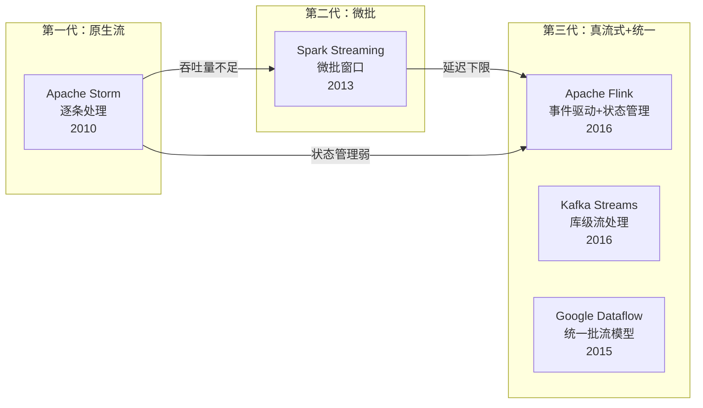
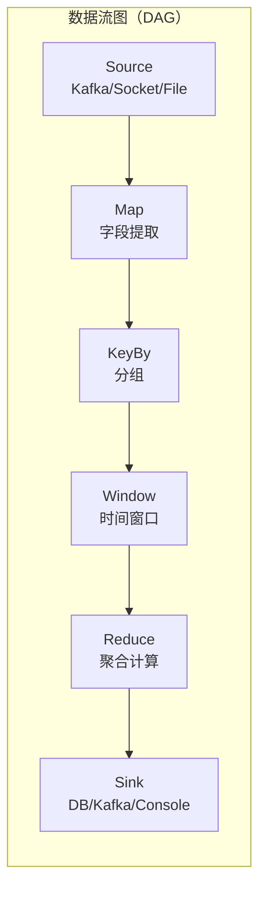
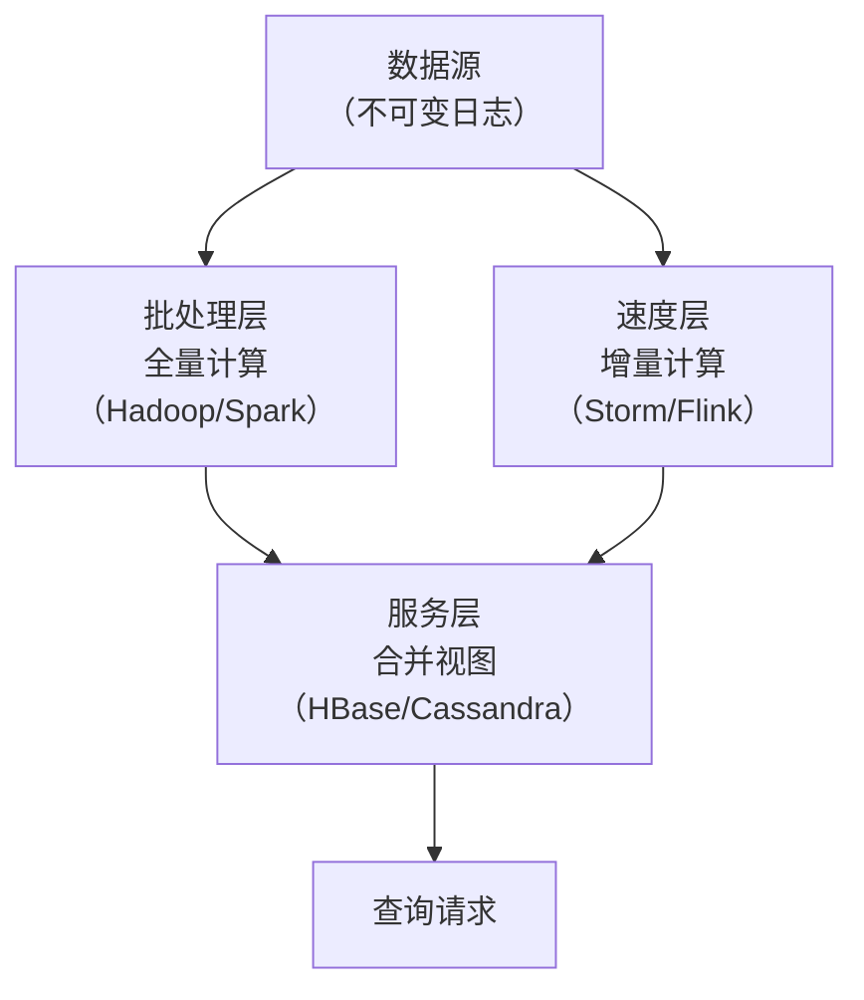
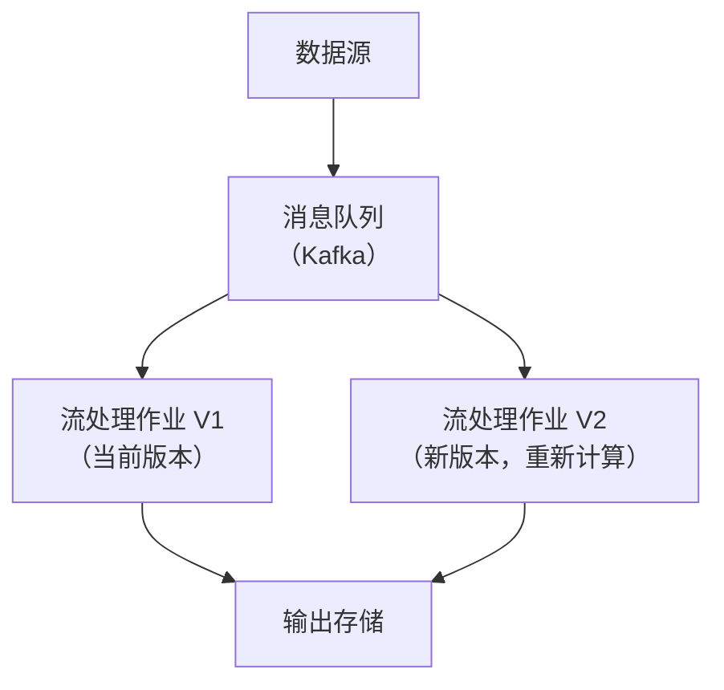
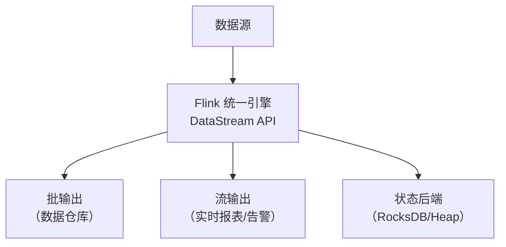
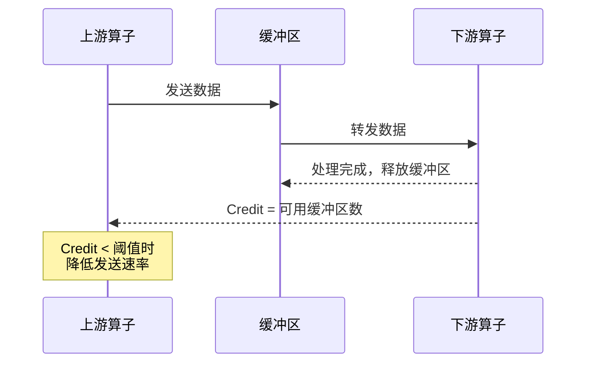
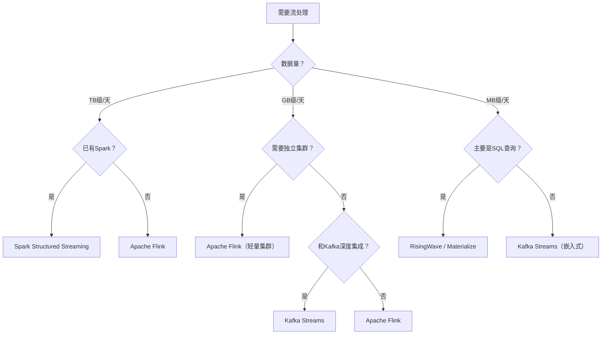
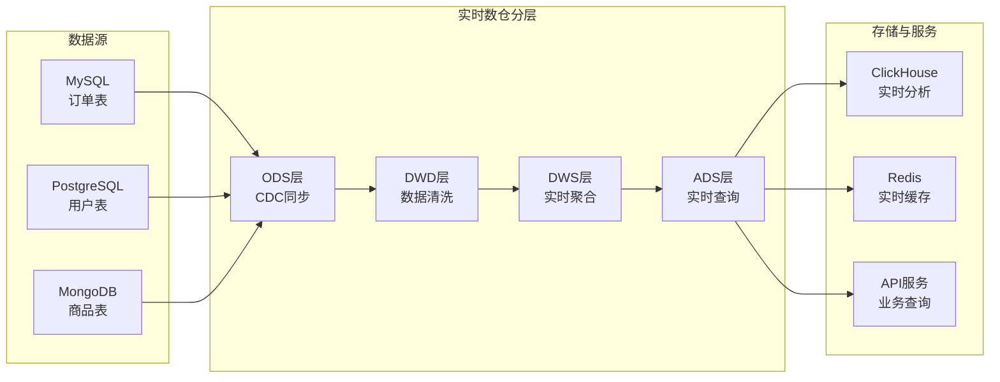
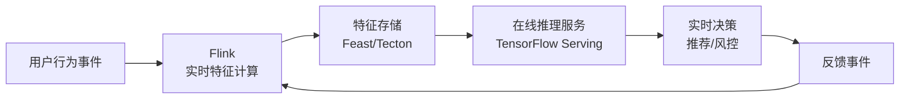

# 流处理架构

> **本节定位**：作为实时计算理论基础的第一篇，本文从全局视角建立流处理的完整认知框架——从"为什么需要流处理"出发，到核心架构模型、关键设计问题、技术选型和应用场景，为后续深入窗口机制（02节）、状态管理（03节）、Exactly-Once语义（04节）等专题打下坚实基础。

---

## 1. 流处理的本质：为什么世界是流式的

### 1.1 批处理 vs 流处理：两种世界观

在数据处理领域，存在两种根本不同的处理范式，它们反映了对"时间"和"数据"两种截然不同的哲学假设。

**批处理（Batch Processing）**将数据视为有限的数据集。它假设数据已经"静止"，可以一次性读取、处理、输出。典型场景是每天凌晨跑一次的 ETL 任务——从数据库导出昨日交易数据，计算汇总指标，写入报表系统。批处理的优势是实现简单、吞吐量高、容错容易（失败了重跑一次就行），但代价是**延迟高**——你只能看到"过去"的数据。

**流处理（Stream Processing）**将数据视为无限的、持续产生的事件流。它假设数据永远在流动，系统必须在数据到达时立即处理。典型场景是实时风控——每笔交易发生时立即评估风险，在毫秒内决定是否拦截。流处理的优势是**低延迟**，但代价是系统复杂度大幅提升：如何处理乱序到达的数据？如何在不停机的情况下扩展？如何保证故障恢复后不丢数据？

用一个比喻来理解：批处理像是相册——你拍照、冲洗、翻阅，每张照片都是一个完成的快照；流处理像是实时视频流——画面持续涌入，你必须边看边处理，错过就没了。

| 维度 | 批处理 | 流处理 |
|------|--------|--------|
| 数据模型 | 有限数据集（Bounded） | 无限事件流（Unbounded） |
| 延迟 | 分钟级到小时级 | 毫秒级到秒级 |
| 吞吐量 | 极高（可优化） | 高（但低于批处理） |
| 容错方式 | 重跑整个批次 | 状态恢复 + 重放 |
| 典型框架 | Hadoop MapReduce, Spark Batch | Flink, Kafka Streams, Storm |
| 适用场景 | 报表、数据仓库、历史分析 | 实时监控、风控、推荐、IoT |

### 1.2 从 Lambda 到 Kappa 到统一：架构思想的演进

流处理技术经历了三代架构思想的演进，每一代都在解决前一代的核心痛点。

**第一代：原生流处理（2010-2013）**——以 Apache Storm 为代表。Storm 采用"逐条处理"（per-tuple processing）模型，每条消息到达时立即触发计算。优点是延迟极低（亚毫秒级），缺点是吞吐量受限、状态管理原始（需要开发者自己管理）、容错机制简陋（Nimbus 单点问题）。当时业界面临的核心困境是：要在低延迟和高吞吐之间二选一。

**第二代：微批处理（2013-2016）**——以 Spark Streaming 为代表。它将连续的事件流切分成小的时间窗口（如 1 秒），在每个小窗口上执行一次微型批处理。这本质上是"伪装成流的批处理"。优点是复用了 Spark Batch 的成熟生态和容错机制，缺点是延迟下限被窗口大小锁死（最短 1 秒）、窗口切换时的延迟抖动。这个阶段的教训是：批处理的基础设施（容错、调度、资源管理）确实很成熟，但微批的延迟天花板是物理限制。

**第三代：真流式处理（2016-至今）**——以 Apache Flink 为代表。Flink 回到了逐条处理的模型，但同时提供了完善的状态管理和 Exactly-Once 语义保证。它结合了 Storm 的低延迟和 Spark 的高吞吐，成为当前流处理的主流选择。Google 在同一时期提出了 Dataflow 模型（2015年论文），从理论上统一了批处理和流处理——批处理是有界的流，流处理是无界的批。



> **关键认知**：这三代不是简单的"新替旧"关系。Storm 在超低延迟（亚毫秒级）场景仍有不可替代性；Spark Streaming 在已有 Spark 生态的大数据平台中依然活跃。技术选型的本质是在延迟、吞吐、复杂度、生态之间找到平衡点。

---

## 2. 流处理架构的核心模型

### 2.1 数据流模型（Dataflow Model）

现代流处理架构的理论基础是 Google 在 2015 年发表的 The Dataflow Model 论文（Akidau et al.）。该论文提出了一个统一的编程模型，可以同时处理有界数据集和无界事件流，是 Apache Flink 和 Google Cloud Dataflow 的理论基石。

数据流模型的核心抽象是：**将计算视为数据流图（DAG）**。图中的节点是计算操作（Source、Transform、Sink），边是数据的流动方向。每个事件携带一个**事件时间戳（Event Time）**，系统根据事件时间而非处理时间来决定事件的归属。



这个模型解决了传统流处理的两个关键问题：

**问题一：事件时间 vs 处理时间**

在分布式系统中，事件产生的时刻和事件被处理的时刻可能差很多。比如用户在手机上操作（事件时间 10:00:00），但因为网络延迟，消息在 10:00:05 才到达服务器（处理时间）。数据流模型允许基于事件时间来计算窗口，保证结果的正确性。

| 时间语义 | 定义 | 优点 | 缺点 |
|---------|------|------|------|
| 处理时间（Processing Time） | 事件被系统处理的时刻 | 简单、无需时钟同步 | 结果不确定、受处理延迟影响 |
| 事件时间（Event Time） | 事件在数据源产生的时刻 | 结果可重现、语义正确 | 需要水印机制、有等待延迟 |
| 摄入时间（Ingestion Time） | 事件进入流处理系统的时刻 | 折中方案 | 无法反映真实事件时间 |

**问题二：乱序与延迟数据**

在真实网络中，消息到达的顺序可能和发送顺序不同。数据流模型通过**水印（Watermark）**机制来处理乱序数据——水印表示"时间戳小于 T 的事件大概率已经全部到达"。当水印推进到某个时间点时，系统可以安全地认为该时间点之前的数据已经齐全，可以触发计算。

> 水印机制是流处理中最精妙也最容易出错的部分。更深入的水印原理和配置技巧将在后续章节详细展开。

### 2.2 推模型 vs 拉模型

流处理系统在数据传输层有两种基本模型：

**推模型（Push Model）**：数据生产者主动将数据推送给消费者。消息到达时立即转发，消费者被动接收。典型代表：Apache Storm（Spout → Bolt）、Apache Flink（上游算子 → 下游算子）。

- 优点：延迟最低，数据到达即处理
- 缺点：消费者处理速度跟不上时会积压，需要背压（Backpressure）机制

**拉模型（Pull Model）**：消费者主动从生产者拉取数据。消费者根据自己的处理能力控制拉取速度。典型代表：Kafka（Consumer 主动 poll）。

- 优点：天然的背压机制，消费者不会被压垮
- 缺点：延迟略高（取决于轮询间隔）

**混合模型**是现代流处理系统的主流选择：底层消息传输用拉模型（如 Kafka），上层计算用推模型（如 Flink 算子间的数据传输）。这种设计既保证了背压能力，又降低了计算延迟。

推模型示意：
  Producer ──push──▶ Consumer
  (延迟低，但Consumer可能被压垮)

拉模型示意：
  Consumer ──pull──▶ Producer
  (Consumer控制速率，天然背压，但有轮询延迟)

混合模型（Flink+Kafka）：
  Kafka ←──pull── Flink Source ──push──▶ Flink Operator Chain ──push──▶ Sink
  (底层拉，上层推，兼得两者优势)

### 2.3 有状态 vs 无状态处理

**无状态处理**：每个事件独立处理，不依赖之前的数据。例如：过滤掉金额小于 100 的交易、将所有金额转换为美元、对字段做格式化。无状态处理实现简单、水平扩展容易，但无法完成需要上下文的计算（如"过去 5 分钟的交易总额"）。

**有状态处理**：处理结果依赖之前的数据（状态）。例如：计算滑动窗口内的平均值、检测连续 3 次异常登录、维护用户画像。有状态处理是流处理的精髓，也是复杂度的主要来源。

有状态处理面临的核心挑战：

| 挑战 | 描述 | 解决方案 |
|------|------|---------|
| 状态存储 | 状态保存在哪里，如何高效读写 | 内存、RocksDB、远程存储 |
| 状态一致性 | 故障恢复后状态是否正确 | Checkpoint + 恢复机制 |
| 状态扩展 | 单机装不下时如何分布 | Key-Group 分片 |
| 状态演化 | 数据结构变更时旧状态如何兼容 | 序列化兼容层 |
| 状态清理 | 过期状态如何删除 | TTL（Time-to-Live）机制 |
| 状态访问模式 | 随机读写还是顺序扫描 | 根据场景选型状态后端 |

```java
// Flink 有状态处理示例：计算每个用户的交易总额
public class UserTransactionSum extends KeyedProcessFunction<String, Transaction, TransactionTotal> {
    // 状态：每个用户的累计交易金额
    private ValueState<BigDecimal> totalAmount;

    @Override
    public void open(Configuration parameters) {
        // 定义状态描述符
        ValueStateDescriptor<BigDecimal> descriptor =
            new ValueStateDescriptor<>("totalAmount", BigDecimal.class);
        // 设置状态 TTL：24 小时无更新自动清理
        StateTtlConfig ttlConfig = StateTtlConfig.newBuilder(Time.hours(24))
            .setUpdateType(StateTtlConfig.UpdateType.OnCreateAndWrite)
            .build();
        descriptor.enableTimeToLive(ttlConfig);
        totalAmount = getRuntimeContext().getState(descriptor);
    }

    @Override
    public void processElement(Transaction tx, Context ctx, Collector<TransactionTotal> out) throws Exception {
        // 读取当前状态
        BigDecimal current = totalAmount.value();
        if (current == null) current = BigDecimal.ZERO;

        // 更新状态
        BigDecimal updated = current.add(tx.getAmount());
        totalAmount.update(updated);

        // 输出结果
        out.collect(new TransactionTotal(tx.getUserId(), updated));
    }
}
```

> **深入理解**：有状态处理的核心难点不在于"如何存储状态"，而在于"如何在故障恢复后保证状态的一致性"。这涉及到分布式快照算法（Chandy-Lamport）、Checkpoint 机制、两阶段提交等复杂概念，将在后续章节中详细展开。

---

## 3. 流处理架构的三种模式

### 3.1 Lambda 架构

Lambda 架构由 Nathan Marz（Apache Storm 创始人）在 2011 年提出，是流处理早期最具影响力的架构模式。它将数据处理分为两条并行的路径：

- **批处理层（Batch Layer）**：对全量历史数据进行周期性计算，生成"准确但延迟"的批视图
- **速度层（Speed Layer）**：对最近的增量数据进行实时计算，生成"近似但即时"的实时视图
- **服务层（Serving Layer）**：合并批视图和实时视图，对外提供统一查询



**Lambda 架构的核心哲学**：用批处理的"准确性"兜底，用速度层的"时效性"弥补批处理的延迟。批处理层定期（如每天）重算全量数据，覆盖速度层可能产生的近似结果。这种"双保险"设计在流处理技术不成熟的年代是非常务实的选择。

Lambda 架构的优点：
- 批处理层提供"兜底"——即使速度层出错，批视图仍然是准确的
- 速度层提供"时效"——不等批处理完成就能看到最近数据
- 整体架构可容忍一定程度的近似结果

Lambda 架构的致命缺点：
- **双重代码维护**：同一批业务逻辑必须用两种语言/框架实现两遍（批处理一遍、流处理一遍），这是最大的工程负担。一个简单的窗口聚合，Spark Batch 写一遍，Flink 再写一遍，两套代码还要保证语义一致
- **结果不一致**：批视图和实时视图可能给出不同结果，合并逻辑复杂。用户可能看到"上午的实时数据是 X，但下午批处理后变成了 Y"
- **运维复杂**：同时维护两套系统，故障排查困难。批处理层失败还是速度层失败？哪个结果是对的？

> Lambda 架构在 2011-2015 年是主流选择，但随着 Flink 等第三代流处理框架的成熟，其缺点变得越来越不可接受。Twitter、LinkedIn 等公司已经从 Lambda 架构迁移到 Kappa 架构或纯流处理架构。

### 3.2 Kappa 架构

Kappa 架构由 Jay Kreps（Kafka 联合创始人）在 2014 年提出。核心思想是：**流处理足够强大时，就不需要批处理层了**。

Kappa 架构只有一条路径：所有数据写入消息队列（如 Kafka），所有计算都通过流处理完成。需要重新计算历史数据时，不是启动批处理任务，而是**从消息队列的起始位置重新消费数据，启动一个新的流处理作业来重新计算**。



Kappa 架构的前提条件：
1. **消息队列必须支持消息回溯**——Kafka 通过日志保留策略满足这一点，可以保留数天甚至数周的全量数据
2. **流处理引擎必须支持 Exactly-Once 语义**——确保重放时结果可重复
3. **计算逻辑必须是确定性的**——相同的输入必须产生相同的输出（不能依赖外部随机状态）

Kappa 架构的优缺点：

| 维度 | Lambda 架构 | Kappa 架构 |
|------|-----------|-----------|
| 代码维护 | 两套代码 | 一套代码 |
| 结果一致性 | 可能不一致 | 天然一致 |
| 历史重算 | 批处理层兜底 | 重放消息队列 |
| 依赖条件 | 低 | 高（消息队列容量、流引擎成熟度） |
| 运维复杂度 | 高（两套系统） | 低（一套系统） |
| 适用场景 | 混合场景 | 流处理成熟的场景 |

**Kappa 架构的实际代价**：当需要重算几个月前的历史数据时，Kafka 需要保留足够长的日志，或者将历史数据从对象存储加载到 Kafka 中。这个"重放"操作的成本可能远高于批处理。LinkedIn 在实践中发现，对于超过 7 天的历史重算，启动 Spark 批处理作业比从 Kafka 重放数据更高效。

### 3.3 统一流批架构（Unified Stream-Batch）

随着 Apache Flink 和 Google Dataflow 的成熟，"统一批流"成为新的架构范式。其核心思想是：**批处理是流处理的特例**——一个有界数据集就是一个会终止的流。

Flink 的 DataStream API（流处理）和 DataSet API（批处理）共享同一套运行时引擎。Flink 1.12 之后，批处理也可以用 DataStream API 来实现，真正做到了"一套引擎、一套代码"。



这种架构的优势：
- **无需维护两套系统**，Lambda 架构的核心痛点被彻底解决
- **流批语义统一**，同一段代码既可以处理无限流，也可以处理有限数据集
- **故障恢复高效**，流处理的 Checkpoint 机制天然支持增量恢复
- **开发体验一致**，团队只需掌握一套 API 和编程模型

### 3.4 三种架构的选型对比

| 维度 | Lambda | Kappa | 统一流批 |
|------|--------|-------|---------|
| 代码维护成本 | 高（双份） | 低（单份） | 低（单份） |
| 历史重算能力 | 强（批处理兜底） | 中（依赖消息回放） | 强（有界流） |
| 实时性 | 中（速度层近似） | 高（纯流处理） | 高（纯流处理） |
| 技术门槛 | 中 | 中高 | 高 |
| 成熟度 | 高 | 中高 | 中（快速成熟中） |
| 推荐场景 | 已有批处理基础设施 | Kafka 生态成熟 | 新项目首选 |

**实践建议**：
- 新项目、新团队 → 优先考虑统一流批架构（Flink）
- 已有 Kafka 生态 + 中小规模 → Kappa 架构（Kafka Streams）
- 已有 Hadoop/Spark 基础设施 + 对准确性要求极高 → Lambda 架构（逐步向统一流批迁移）

---

## 4. 流处理的关键设计问题

### 4.1 背压（Backpressure）

当数据生产速度超过消费者处理速度时，就会产生背压。如果没有背压机制，消费者会被压垮——内存溢出、GC 频繁、最终 OOM 崩溃。

**常见的背压处理策略**：

| 策略 | 原理 | 优点 | 缺点 |
|------|------|------|------|
| 缓冲区溢出 | 在缓冲区满时阻塞上游 | 实现简单 | 可能阻塞整条链路 |
| 丢弃策略 | 缓冲区满时丢弃数据 | 保护消费者 | 数据丢失 |
| 采样策略 | 高负载时只处理部分数据 | 渐进降级 | 结果不精确 |
| 弹性扩缩容 | 动态增加处理资源 | 自动适应 | 扩缩容有延迟 |
| 拉模型 | 消费者按能力拉取 | 天然背压 | 增加延迟 |

Flink 采用**基于信用度（Credit-based）的背压机制**：下游算子向上游发送可用缓冲区数量（Credit），上游根据 Credit 控制发送速率。当下游处理慢时，Credit 减少，上游自动减速。这种机制的粒度是每个 TaskManager 之间的 TCP 连接，既精确又高效。



**Flink 背压的实际表现**：当某个算子成为瓶颈时，背压会从该算子向上游逐级传播。在 Flink Web UI 的"Backpressure"面板中，可以看到每个算子的背压状态（OK / LOW / HIGH）。如果整个作业都在 HIGH 状态，说明瓶颈在最后一个算子；如果只有部分算子 HIGH，说明瓶颈在这些算子或其下游。

### 4.2 消息语义保证

流处理系统需要保证消息传递的语义，有三种级别：

**At-Most-Once（至多一次）**：消息可能丢失，但不会重复。实现方式：消息发出后立即从队列删除，不管消费者是否处理成功。这是最简单但最不安全的语义，适用于可容忍丢失的场景（如日志收集、监控指标采样）。

**At-Least-Once（至少一次）**：消息不会丢失，但可能重复。实现方式：消息处理成功后才从队列删除，如果处理过程中消费者崩溃，消息会被重新投递。适用于可容忍重复的场景（如告警系统——重复告警比漏掉告警好；计数器可以做去重）。

**Exactly-Once（精确一次）**：消息既不丢失也不重复。这是最难保证的语义，需要端到端的协调。实现方式：通过 Checkpoint + 事务写入，确保从消费到输出的整个链路都是原子的。

| 语义 | 消息丢失 | 消息重复 | 实现复杂度 | 典型场景 |
|------|---------|---------|-----------|---------|
| At-Most-Once | 可能 | 不会 | 低 | 日志收集、监控指标 |
| At-Least-Once | 不会 | 可能 | 中 | 告警系统、数据同步 |
| Exactly-Once | 不会 | 不会 | 高 | 金融交易、订单处理 |

> Exactly-Once 的本质是**幂等性**——如果处理同一条消息多次的结果和处理一次的结果相同，那么即使消息重复投递也不会产生错误。很多场景下，保证处理逻辑的幂等性比保证 Exactly-Once 传输更简单。例如：用事件 ID 做去重，用 UPSERT 替代 INSERT。

### 4.3 乱序与事件时间

在分布式系统中，事件到达的顺序几乎不可能和产生的顺序完全一致。原因包括：

- **网络延迟不一致**：不同机器之间的网络延迟不同，甚至同一台机器在不同时刻的网络延迟也不同
- **数据源时间偏差**：不同数据源的时钟可能不同步（即使使用 NTP 同步，也有毫秒级偏差）
- **重试和重放**：消息处理失败后重新投递，打破原有顺序
- **多分区并行**：Kafka 多个分区的事件交错到达，天然乱序
- **GC 暂停**：JVM 垃圾回收导致处理线程暂停，恢复后大量事件涌入

处理乱序数据的核心机制是**事件时间窗口（Event-Time Window）**和**水印（Watermark）**：

- **事件时间**：事件产生的时间，嵌入在事件数据中
- **处理时间**：事件被系统处理的时间
- **水印**：一个单调递增的时间戳，表示"时间戳小于该值的事件大概率已经全部到达"
- **窗口**：将事件按事件时间划分到不同的时间区间中

当水印推进到某个窗口的结束时间时，该窗口被认为"关闭"，可以输出计算结果。如果在窗口关闭后才收到迟到的事件，系统有三种处理策略：

1. **丢弃（Discard）**：直接丢弃迟到事件——简单但可能丢失数据
2. **更新（Update）**：重新计算窗口并更新之前的结果——精确但需要可更新的输出端
3. **侧输出（Side Output）**：将迟到事件发送到单独的流，后续特殊处理——灵活但增加系统复杂度

```java
// Flink 事件时间窗口示例
DataStream<Transaction> stream = env
    .addSource(kafkaSource)
    .assignTimestampsAndWatermarks(
        WatermarkStrategy.<Transaction>forBoundedOutOfOrderness(Duration.ofSeconds(5))
            .withTimestampAssigner((event, timestamp) -> event.getTimestamp())
    );

// 每 5 分钟一个窗口，允许 5 秒乱序
stream
    .keyBy(Transaction::getUserId)
    .window(TumblingEventTimeWindows.of(Time.minutes(5)))
    .allowedLateness(Time.seconds(30))  // 允许 30 秒迟到
    .sideOutputLateData(lateOutputTag)  // 过期迟到事件进入侧输出
    .sum("amount");
```

### 4.4 时间语义与结果正确性

流处理中"正确结果"的定义取决于时间语义的选择。理解这一点对于避免生产事故至关重要。

**处理时间语义下的陷阱**：如果用处理时间划分窗口，同一个事件在不同机器上可能被分配到不同的窗口（因为处理时间不同步）。更糟糕的是，如果某个算子发生反压导致处理延迟，大量事件会在反压解除后集中到达，全部被分配到"当前"窗口，产生错误的结果。

**事件时间语义的权衡**：事件时间保证了结果的确定性——相同的数据无论重放多少次，结果都一样。但代价是需要等待迟到数据，增加了端到端的延迟。水印的延迟设置就是这个权衡的直接体现：

- 水印延迟 = 0 → 不等待任何迟到数据，可能丢失数据
- 水印延迟 = ∞ → 等待所有迟到数据，延迟不可接受
- 水印延迟 = 5秒 → 等待最多5秒的迟到数据，平衡延迟和正确性

> **实践建议**：对正确性要求高的场景（金融、电商）必须使用事件时间语义；对延迟要求极高且可容忍少量数据丢失的场景（监控告警）可以使用处理时间语义。

---

## 5. 流处理架构的技术选型

### 5.1 主流框架对比

| 维度 | Apache Flink | Kafka Streams | Apache Storm | Spark Structured Streaming |
|------|-------------|---------------|-------------|--------------------------|
| 部署模式 | 独立集群 | 嵌入应用（库） | 独立集群 | Spark 集群 |
| 处理模型 | 逐条事件处理 | 逐条事件处理 | 逐条事件处理 | 微批（默认）/ 连续处理 |
| 状态管理 | 内置（RocksDB/Heap） | 内置（RocksDB） | 外部（如 Redis） | 内置（内存） |
| Exactly-Once | 端到端支持 | 端到端支持 | At-Least-Once | 端到端支持 |
| 延迟 | 毫秒级 | 毫秒级 | 亚毫秒级 | 秒级（微批）/ 毫秒级（连续） |
| 吞吐量 | 极高 | 高 | 中 | 极高 |
| 窗口类型 | 事件时间/处理时间/会话窗口 | 事件时间/处理时间 | 处理时间窗口 | 事件时间/处理时间 |
| 运维复杂度 | 高（需集群） | 低（嵌入应用） | 中 | 高（Spark 集群） |
| 适用规模 | 大规模（TB级/天） | 中小规模 | 中等规模 | 大规模 |

**新兴框架补充**：

| 框架 | 定位 | 特点 | 适用场景 |
|------|------|------|---------|
| RisingWave | 云端流数据库 | PostgreSQL 兼容、SQL 原生、物化视图 | 流式 SQL 查询、实时仪表盘 |
| Materialize | 云端流数据库 | 增量计算、SQL 接口、强一致性 | 复杂流式查询、实时报表 |
| Apache Beam | 统一编程模型 | 框架无关、一次编写多处运行 | 需要跨引擎迁移的场景 |
| Apache Kafka (KRaft) | 事件存储 + 流处理 | 去 ZooKeeper、轻量流处理 | 事件驱动架构、Kafka Streams |

**选型建议**：

- **大流量实时计算**（日均 TB 级）→ Flink：状态管理最完善、性能最优、社区最活跃
- **轻量级流处理**（和 Kafka 紧密集成）→ Kafka Streams：零运维、嵌入式、与 Kafka 生态无缝对接
- **已有 Spark 生态**→ Spark Structured Streaming：复用集群、统一技术栈、团队学习成本低
- **极低延迟、简单逻辑**→ Storm：逐条处理延迟最低（已逐渐被 Flink 替代，不建议新项目使用）
- **流式 SQL 查询**→ RisingWave / Materialize：对 SQL 用户最友好，像操作数据库一样操作流

### 5.2 架构选型决策树



### 5.3 选型关键考量

除了技术维度，选型还需要考虑以下工程因素：

**团队能力**：Flink 的学习曲线较陡（涉及 State、Checkpoint、水印等概念），团队是否具备足够的分布式系统经验？如果团队更熟悉 Spark，Spark Structured Streaming 可能是更务实的选择。

**运维能力**：Flink 集群的运维涉及 ResourceManager、JobManager、TaskManager 多个组件，是否有专人负责？Kafka Streams 作为库嵌入应用，运维负担最轻。

**生态系统**：公司内部是否已有 Kafka、Spark、Flink 等基础设施？选择与现有生态兼容的框架可以大幅降低集成成本。

**成本预算**：Flink 集群需要独立的计算资源；Kafka Streams 与应用共享 JVM 进程；云服务（如 Google Dataflow、AWS Kinesis）按量计费但无运维成本。

---

## 6. 实际应用场景

### 6.1 实时风控系统

金融风控是流处理最经典的场景之一。每笔交易发生时，系统需要在毫秒内完成风险评估：

1. **规则引擎**：基于预定义规则检测异常（如单笔金额 > 5 万、短时间内跨地域交易、同一账户多设备登录）
2. **特征计算**：实时聚合用户行为特征（如过去 1 小时交易次数、平均金额、最常交易城市）
3. **模型评分**：将实时特征送入机器学习模型（如 XGBoost、深度学习）进行风险评分
4. **决策执行**：根据评分结果决定放行、拦截或人工审核

技术架构要点：
- 从 Kafka 消费交易事件流
- Flink 进行实时特征计算和规则匹配
- 特征结果写入 Redis（低延迟查询，P99 < 1ms）
- 模型服务部署在在线推理集群（如 TensorFlow Serving、Triton Inference Server）
- 决策结果写回 Kafka，触发后续流程（拦截通知、人工审核队列）

**性能指标参考**：某大型银行实时风控系统的实际数据——日均处理 2 亿笔交易，峰值 TPS 5 万，端到端延迟 P99 < 200ms，误报率 < 0.1%。

### 6.2 实时推荐系统

推荐系统从"离线批量计算 + 在线服务"演进到"实时流式计算"：

- **传统方式**：每天凌晨用 Spark 计算用户画像和推荐列表，写入 Redis，白天提供服务。延迟 24 小时，无法捕捉用户即时兴趣变化。用户上午搜索了"笔记本电脑"，下午推荐的还是运动鞋。
- **流处理方式**：用户每次点击、浏览、购买事件实时流入 Flink，实时更新用户画像和推荐候选集。延迟秒级，能捕捉用户"此刻"的兴趣。用户刚浏览了笔记本，下一屏就出现相关推荐。

关键设计：
- 用户行为事件 → Kafka → Flink 实时特征计算
- 特征更新 → 特征存储（Redis/HBase）→ 特征平台
- 推荐模型在线推理：候选集召回 + 排序 → 展示
- A/B 测试框架：实时分流，实时统计转化率

### 6.3 IoT 实时监控

工业物联网场景中，数百万传感器持续产生数据，需要实时检测异常：

- **数据量**：100 万台设备 × 每秒 1 条数据 = 100 万事件/秒
- **检测逻辑**：温度超过阈值、振动频率异常、设备掉线、数据质量异常
- **响应要求**：异常发生后 5 秒内告警

Flink 在此场景的典型应用：
- Kafka 收集传感器数据（作为消息缓冲，应对数据峰值）
- Flink 按设备 ID 分 Key 进行窗口聚合（计算均值、方差、趋势）
- 通过 CEP（复杂事件处理）检测异常模式（如"温度连续3次上升 + 振动频率突变"）
- 告警结果写入 Kafka，触发通知服务（短信、工单系统）

**边缘计算补充**：对于超大规模 IoT 场景（千万级设备），全部数据传回中心集群成本过高。可以在边缘节点部署轻量级 Flink（如 Flink Edge），先做本地预处理和异常检测，只将异常数据和聚合结果传回中心，减少 80% 以上的网络带宽消耗。

### 6.4 实时数据仓库

传统数据仓库（T+1）无法满足业务对实时数据的需求。现代实时数仓采用流处理架构：



- **ODS 层**：CDC（Change Data Capture）将数据库变更实时同步到 Kafka（使用 Debezium / Canal）
- **DWD 层**：Flink 实时消费 Kafka，进行数据清洗、规范化、维度关联
- **DWS 层**：Flink 进行实时聚合计算，生成汇总指标（如实时 GMV、实时 DAU）
- **ADS 层**：实时指标写入 ClickHouse / Doris，提供实时查询

这种架构被称为"流批一体数仓"，是当前数据工程领域的热点方向。与传统 T+1 数仓相比，核心变化是将"定时批处理"替换为"持续流处理"，实现数据从产生到可查询的端到端延迟从小时级压缩到秒级。

### 6.5 实时日志分析与监控

运维和可观测性是流处理的另一个重要场景：

- **日志收集**：应用日志 → Kafka → Flink 实时解析和聚合
- **指标计算**：实时计算 QPS、错误率、响应时间 P99
- **异常检测**：基于统计规则或机器学习模型实时检测异常
- **告警联动**：异常触发告警，推送到 Grafana / PagerDuty / 企业微信

典型技术栈：Filebeat（日志采集）→ Kafka（消息缓冲）→ Flink（实时处理）→ Elasticsearch（存储和查询）→ Grafana（可视化）。

---

## 7. 常见误区与最佳实践

### 7.1 常见误区

**误区一："流处理可以替代一切批处理"**

流处理并非批处理的完全替代。在以下场景中，批处理仍然是更好的选择：
- 复杂的多表 JOIN（流处理的 JOIN 需要维护双侧状态，内存和复杂度都很高）
- 需要全局排序的计算（流处理无法看到全部数据，只能做 Top-N 近似）
- 历史数据全量重算（流处理重放消息队列的效率低于批处理直接读文件）
- 容错要求极高且可以接受延迟的场景（批处理重跑一次就能保证正确性）

**误区二："Exactly-Once 是万能药"**

Exactly-Once 只是数据流处理链路中的一个环节。端到端的 Exactly-Once 需要：
- 消息源（如 Kafka）支持 offset 管理
- 处理引擎支持 Checkpoint
- 输出端支持事务或幂等写入

如果输出端是不支持事务的系统（如外部 HTTP API、Elasticsearch），Exactly-Once 就无法保证。此时应关注处理逻辑的**幂等性**设计——用事件 ID 去重，用 UPSERT 替代 INSERT。

**误区三："低延迟和高吞吐不可兼得"**

通过合理的架构设计，可以同时实现低延迟和高吞吐：
- **增量 Checkpoint**：Flink 的增量 Checkpoint 减少 I/O 开销，不影响处理性能
- **状态后端优化**：使用 RocksDB 作为状态后端，利用本地 SSD 降低读写延迟
- **反压机制**：避免消费者被压垮导致的整体延迟升高
- **Operator Chain**：减少序列化和网络传输开销
- **异步 I/O**：对外部系统的查询使用 AsyncFunction，避免阻塞处理线程

**误区四："流处理不需要考虑数据质量"**

流处理中数据质量问题更严重，因为：
- 无法像批处理那样在计算前做全量数据质量检查
- 错误数据会实时传播到下游，影响范围随时间扩大
- 需要在流中实时检测数据异常（如字段缺失、格式错误、值异常、重复数据）

最佳实践：在 Source 层加入数据校验逻辑，异常数据进入侧输出流，后续人工处理或进入死信队列（Dead Letter Queue）。

**误区五："状态可以无限增长"**

新手常犯的错误是定义了有状态算子但没有设置 TTL，导致状态持续膨胀。一个有 1000 万用户的流处理作业，如果每个用户的状态是 1KB，仅用户状态就需要 10GB。加上历史状态未清理，状态可能增长到数十 GB 甚至 TB，最终导致 Checkpoint 超时、作业崩溃。

**教训**：定义任何状态时，第一件事就是设置合理的 TTL。

### 7.2 生产环境最佳实践

**1. 状态管理**

- 使用 RocksDB 作为状态后端（支持大状态 + 增量 Checkpoint）
- 设置合理的 State TTL，避免状态无限膨胀（根据业务场景设置，如用户行为保留 24 小时）
- 监控状态大小，设置增长告警阈值（如状态大小超过上一次 Checkpoint 的 2 倍时告警）
- 避免在状态中存储大对象（如完整日志文本），只存储计算所需的字段

**2. Checkpoint 配置**

```java
StreamExecutionEnvironment env = StreamExecutionEnvironment.getExecutionEnvironment();
env.enableCheckpointing(60000); // 60秒间隔
env.getCheckpointConfig().setCheckpointingMode(CheckpointingMode.EXACTLY_ONCE);
env.getCheckpointConfig().setCheckpointTimeout(120000); // 超时120秒
env.getCheckpointConfig().setMinPauseBetweenCheckpoints(30000); // 两次Checkpoint间隔至少30秒
env.getCheckpointConfig().setTolerableCheckpointFailureNumber(3); // 允许连续失败3次
env.getCheckpointConfig().setExternalizedCheckpointCleanup(
    ExternalizedCheckpointCleanup.RETAIN_ON_CANCELLATION); // 取消作业时保留Checkpoint
// 使用RocksDB增量Checkpoint
env.setStateBackend(new RocksDBStateBackend("hdfs://...", true));
```

**3. 资源配置**

- TaskManager 内存：根据状态大小配置，建议 2-8 GB（状态较大的场景可配到 16 GB）
- Task Slot 数量：根据并行度需求配置，一般等于集群总 CPU 核数
- 网络缓冲区：背压场景下适当调大（`taskmanager.network.memory.fraction`）
- JVM 堆外内存：RocksDB 使用堆外内存，需要单独配置（`taskmanager.memory.task.off-heap.size`）

**4. 监控告警**

必须监控的关键指标：
- Checkpoint 持续时间异常（持续增长说明状态过大或存储慢）
- 反压（Backpressure）持续存在（说明存在性能瓶颈）
- 消费延迟（Consumer Lag）持续增长（说明处理速度跟不上生产速度）
- 处理吞吐量异常下降（可能是数据倾斜或资源不足）
- OOM Kill 事件（可能是状态膨胀或内存配置不足）

**5. 部署与升级**

- 使用 Yarn / Kubernetes 部署 Flink，实现资源弹性调度
- 作业升级时，从最近的 Checkpoint 恢复，实现无缝升级
- 配合 CI/CD 流水线，实现作业代码的自动化测试和部署

---

## 8. 流处理架构的未来趋势

### 8.1 流批一体（Unified Stream-Batch）

流批一体不是新概念，但随着 Flink 和 Spark 的演进，它正在成为现实。Flink 1.12+ 的 DataStream API 可以同时处理有界和无界数据源，Flink SQL 更是让批处理和流处理的语法完全统一。

未来趋势是：同一个作业可以同时处理实时流和历史批次，无需区分批处理和流处理。这将彻底消除 Lambda 架构的双重维护问题。

**关键进展**：
- Flink 1.18+ 引入了 Unified Sink API，进一步统一了批流写入接口
- Flink SQL 的 Changelog 模式让流和批的查询语法完全一致
- Apache Calcite 作为 SQL 优化层，为统一批流提供理论基础

### 8.2 Serverless 流处理

传统流处理需要管理集群资源（选机型、配节点、扩缩容）。Serverless 流处理让用户只需定义计算逻辑，无需关心底层资源。

| 服务 | 提供商 | 特点 | 适用场景 |
|------|-------|------|---------|
| Google Cloud Dataflow | Google | Beam 模型、自动扩缩容 | 全场景 |
| Amazon Kinesis Data Analytics | AWS | SQL/Flink 支持 | AWS 生态内 |
| Amazon Managed Service for Flink | AWS | 托管 Flink | Flink 作业上云 |
| Azure Stream Analytics | Azure | SQL-like 查询 | 简单流处理 |
| Confluent Cloud | Confluent | Kafka 生态全托管 | Kafka 用户 |

Serverless 流处理的优势是零运维和按量付费，但劣势是定制化能力有限、调试困难、大规模场景成本可能高于自建集群。

### 8.3 AI 与流处理的融合

实时特征计算是 AI 应用的核心需求。流处理框架正在原生支持 ML 模型推理：

- **Flink ML**：在 Flink 作业中嵌入机器学习模型，实现特征计算和模型推理的统一。支持在线学习（Online Learning），模型可以随数据流增量更新
- **实时特征存储**：流处理 + 特征存储（如 Feast、Tecton）的深度集成。流处理计算实时特征，特征存储统一管理离线和在线特征
- **在线学习（Online Learning）**：模型随数据流增量训练，而非每天离线重训。适用于用户行为快速变化的场景（如广告点击率预测）



### 8.4 边缘流处理

随着 IoT 设备的普及和 5G 的发展，越来越多的流处理发生在边缘节点而非中心集群。边缘流处理的核心需求和挑战：

**为什么需要边缘流处理**：
- **带宽限制**：百万级传感器的原始数据全部传回中心集群，网络带宽成本极高（100万设备×1KB/条×1条/秒 = 1GB/s 原始数据）
- **延迟要求**：自动驾驶、工业控制等场景要求亚毫秒级响应，数据传回中心再返回的延迟不可接受
- **数据隐私**：某些场景（如视频监控）的数据不适合离开边缘节点
- **离线能力**：网络断开时（隧道、偏远地区），边缘节点需要独立运行

**边缘流处理的技术要求**：
- **轻量级运行时**：传统 Flink 集群需要数百 MB 内存和 JVM，边缘设备（如树莓派、嵌入式网关）资源有限。需要裁剪过的轻量级流处理引擎（如 Apache Edgent、Flink Lite）
- **离线缓存与处理**：网络断开时，边缘节点需要本地缓存数据并继续处理，网络恢复后再将结果同步到中心
- **与中心集群的协同**：边缘预处理 + 中心汇总。边缘负责数据过滤、压缩、异常检测；中心负责全局聚合、模型训练、跨设备关联
- **OTA 更新**：边缘节点的处理逻辑需要远程更新，支持灰度发布和回滚

**实际案例——智慧工厂**：
- 每台设备边缘网关运行轻量流处理，本地检测振动异常（延迟 < 10ms）
- 异常数据和聚合指标通过 MQTT 上传到中心集群
- 中心集群用 Flink 做全厂级别的设备健康分析和预测性维护
- 网络中断时，边缘网关本地缓存异常日志，恢复后自动补传

### 8.5 流式 SQL 的崛起

用 SQL 替代 Java/Scala 编写流处理作业是明确的趋势。降低了流处理的使用门槛，让数据分析师和业务人员也能直接操作实时数据流。

- **Flink SQL**：支持 SELECT/JOIN/GROUP BY 等标准 SQL 语法，底层自动转换为流处理 DAG
- **RisingWave / Materialize**：将流处理封装为"物化视图"，用户只需定义视图，系统自动增量更新
- **ksqlDB**：Confluent 提供的流式 SQL 引擎，直接在 Kafka 上执行 SQL 查询

---

## 9. 本节小结与延伸

### 核心要点回顾

本节建立了流处理架构的完整认知框架：

1. **流处理的本质**：处理无限、持续产生的事件流，核心价值是低延迟
2. **架构演进**：从 Storm（原生流）→ Spark Streaming（微批）→ Flink（真流式+统一），每一代解决前一代的痛点
3. **核心模型**：数据流 DAG、推/拉传输、有状态/无状态处理
4. **架构模式**：Lambda（双路径兜底）、Kappa（纯流处理）、统一流批（批处理是流处理的特例）
5. **关键设计**：背压、消息语义、乱序处理、时间语义
6. **技术选型**：根据数据量、团队能力、运维能力、生态系统综合决策

### 与后续章节的衔接

本节建立了全局框架，后续章节将深入每个核心专题：

- **02-窗口机制**：深入讲解滚动/滑动/会话/全局窗口的原理、配置和优化
- **03-状态管理**：详解 Keyed State、Operator State、State Backend 选型
- **04-Exactly-Once 语义**：详解 Checkpoint 算法、两阶段提交、端到端一致性实现

### 推荐阅读

- 《Streaming Systems》（Tyler Akidau 等著）——流处理领域的"圣经"，系统性地讲解了流处理的理论基础
- Google Dataflow 论文：*The Dataflow Model: A Practical Approach to Balancing Correctness, Latency, and Cost in Massive-Scale, Unbounded, Out-of-Order Data Processing*
- Apache Flink 官方文档：https://nightlies.apache.org/flink/flink-docs-stable/
- Jay Kreps 的博客文章 "Questioning the Lambda Architecture"：Kappa 架构的原始论述
