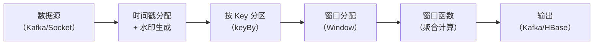
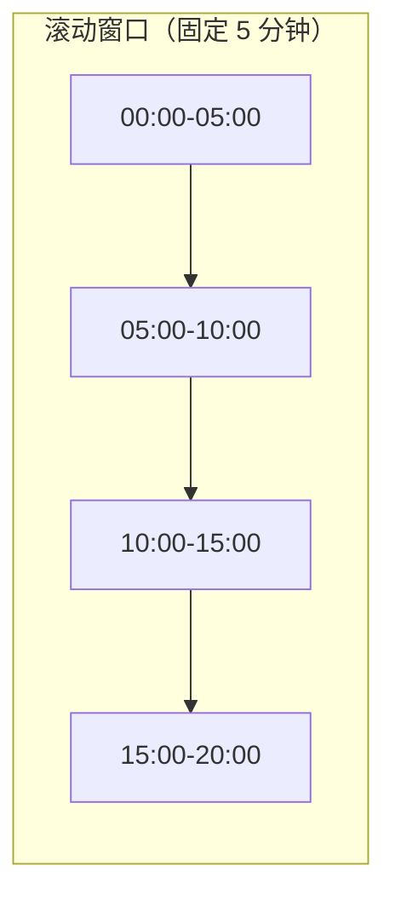
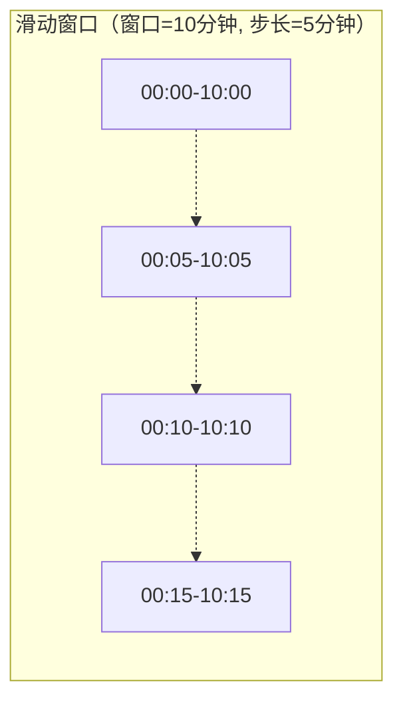
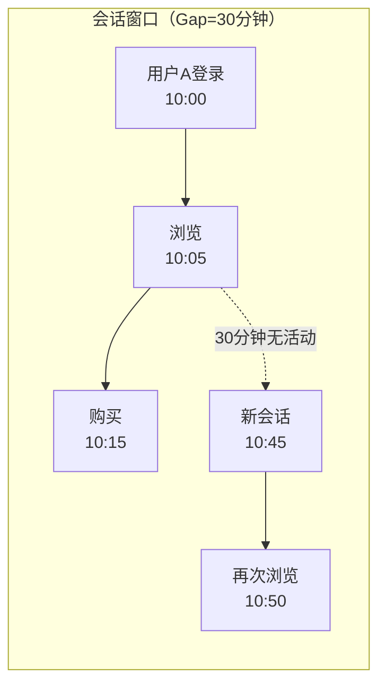
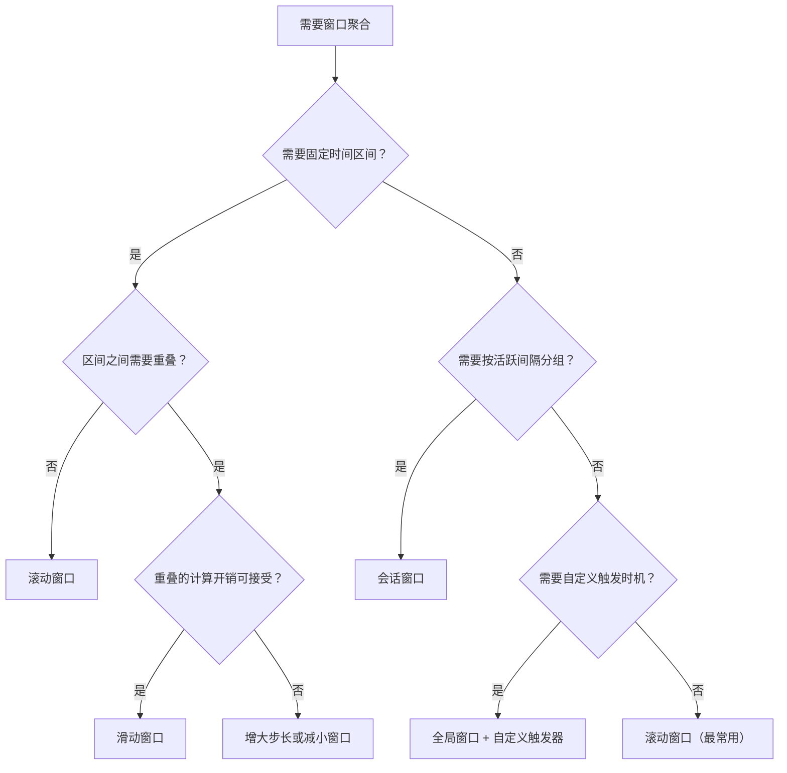
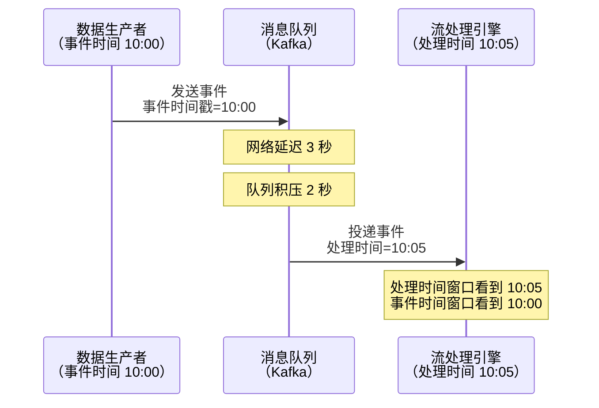
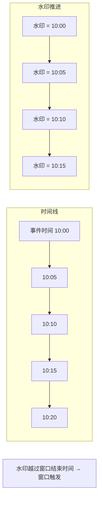
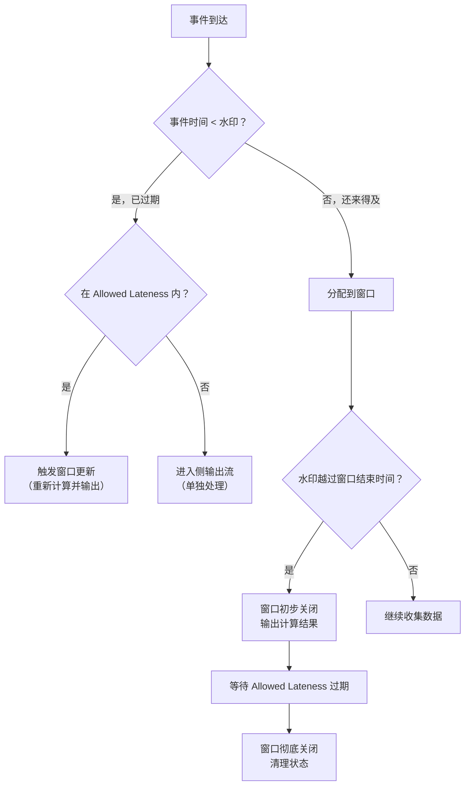
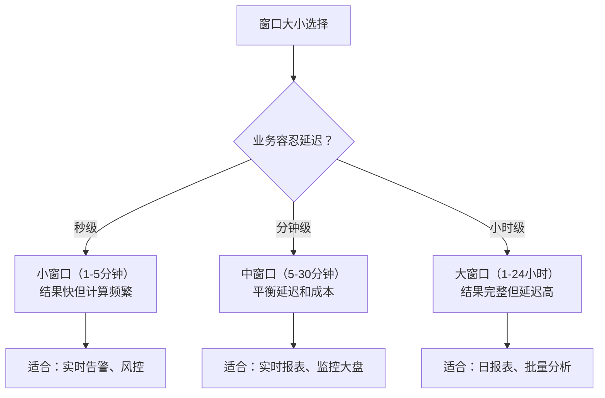

# 二窗口机制：流处理的时间切片艺术

## 1. 概述与背景

### 1.1 为什么流处理需要窗口

流处理面对的是**无限数据流**（Unbounded Stream）——事件持续产生，永不停歇。如果对无限流做全局聚合（如"所有交易的总额"），结果永远在变化，永远不会"完成"。这就像试图给一条永远流动的河流称重——你不知道什么时候该读数。

**窗口（Window）** 解决了这个问题：它将无限流切分成有限的、可管理的时间片段（或数据片段），在每个片段上执行计算并输出结果。窗口是流处理中"有限化无限"的核心抽象，是连接无限数据流和有限批处理之间的桥梁。

一个直觉类比：窗口就像财务中的"结算周期"——你不会等公司倒闭才算总账，而是按月、按季度、按年切分，定期出报表。流处理中的窗口也是同样的道理——定期"结算"一段数据，输出聚合结果。

### 1.2 窗口在流处理架构中的位置



窗口处于数据流处理管线的核心位置：上游的水印决定了"什么时候算"，窗口定义了"算哪些数据"，窗口函数决定了"怎么算"。理解窗口机制，是掌握流处理的关键一步。

### 1.3 窗口的核心概念体系

在深入具体窗口类型之前，先建立统一的概念框架：

| 概念 | 定义 | 作用 |
|------|------|------|
| **窗口分配器（Window Assigner）** | 决定每条事件属于哪个窗口的策略 | 将事件映射到一个或多个窗口 |
| **窗口触发器（Window Trigger）** | 决定窗口何时触发计算并输出结果 | 控制计算时机 |
| **窗口函数（Window Function）** | 窗口触发时执行的计算逻辑 | 定义"怎么算" |
| **窗口驱逐器（Evictor）** | 在窗口函数执行前/后移除部分元素 | 控制参与计算的数据量 |
| **迟到数据处理** | 窗口关闭后到达的事件的处理策略 | 保证结果的完整性 |

---

## 2. 四种基础窗口类型

### 2.1 滚动窗口（Tumbling Window）

滚动窗口是最简单、最直观的窗口类型。它将数据流切分为**固定大小、不重叠、不遗漏**的时间段。每个事件恰好属于一个窗口，没有交叉，也没有间隙。



**特点**：
- 窗口大小固定，如每 5 分钟、每 1 小时
- 窗口之间无重叠、无间隙
- 每条事件恰好归属于一个窗口
- 适合"定期汇总"类场景

**典型场景**：每分钟统计一次网站访问量、每小时计算一次交易总额、每天生成一份报表。

**Flink 实现**：

```java
DataStream<SensorReading> stream = env
    .addSource(kafkaSource)
    .assignTimestampsAndWatermarks(
        WatermarkStrategy.<SensorReading>forBoundedOutOfOrderness(Duration.ofSeconds(10))
            .withTimestampAssigner((event, timestamp) -> event.getTimestamp())
    );

// 滚动窗口：每 5 分钟一个窗口，基于事件时间
DataStream<AggregatedResult> result = stream
    .keyBy(SensorReading::getSensorId)
    .window(TumblingEventTimeWindows.of(Time.minutes(5)))
    .aggregate(new SensorAggregator());

// 等效写法：使用时间窗口简写
stream.keyBy(SensorReading::getSensorId)
      .timeWindow(Time.minutes(5))  // timeWindow 是 TumblingWindow 的语法糖
      .aggregate(new SensorAggregator());
```

**聚合函数示例**：

```java
public class SensorAggregator implements AggregateFunction<SensorReading, Double, AggregatedResult> {
    @Override
    public Double createAccumulator() {
        return 0.0;
    }

    @Override
    public Double add(SensorReading reading, Double accumulator) {
        return accumulator + reading.getTemperature();
    }

    @Override
    public AggregatedResult getResult(Double accumulator) {
        return new AggregatedResult(accumulator);  // 窗口关闭时输出
    }

    @Override
    public Double merge(Double a, Double b) {
        return a + b;
    }
}
```

### 2.2 滑动窗口（Sliding Window）

滑动窗口同样有固定大小，但允许窗口之间**重叠**。窗口大小和滑动步长（Slide）是两个独立的参数：窗口大小决定了"每次计算多少数据"，滑动步长决定了"多久计算一次"。



**特点**：
- 窗口大小 > 滑动步长时，一个事件可能属于多个窗口
- 窗口大小 = 滑动步长时，退化为滚动窗口
- 滑动步长 < 窗口大小时，结果更新更频繁，但计算量更大
- 适合"滑动平均"、"移动趋势"类场景

**典型场景**：过去 10 分钟的平均温度（每 5 分钟更新一次）、最近 1 小时的用户活跃数（每 10 分钟刷新）。

**窗口归属规则**：对于一个事件，如果其时间戳为 T，窗口大小为 S，滑动步长为 Slide，那么该事件属于所有满足 `window_start <= T < window_start + S` 的窗口，其中 `window_start` 是所有 `n × Slide`（n 为整数）且 `window_start <= T` 的值。

**Flink 实现**：

```java
// 滑动窗口：窗口大小 10 分钟，每 5 分钟滑动一次
DataStream<AggregatedResult> result = stream
    .keyBy(SensorReading::getSensorId)
    .window(SlidingEventTimeWindows.of(Time.minutes(10), Time.minutes(5)))
    .aggregate(new SensorAggregator());

// 带偏移量的滑动窗口（对齐到整点）
stream.keyBy(SensorReading::getSensorId)
      .window(SlidingEventTimeWindows.of(
          Time.minutes(10),    // 窗口大小
          Time.minutes(5),     // 滑动步长
          Time.hours(-8)       // UTC 偏移量（对齐到北京时间 UTC+8）
      ))
      .aggregate(new SensorAggregator());
```

**性能考量**：滑动窗口的计算成本比滚动窗口高。如果窗口大小为 10 分钟、步长为 5 分钟，一个事件会被复制到 2 个窗口中参与计算。步长越小、窗口越大，一个事件参与的窗口越多，计算开销越大。生产中需要在"结果精度"和"计算成本"之间权衡。

### 2.3 会话窗口（Session Window）

会话窗口不像前两种那样有固定的时间边界，而是根据**事件之间的活跃间隔（Gap）**动态确定窗口的起止时间。如果两个事件之间的间隔超过 Gap，就会创建新的窗口。



**特点**：
- 窗口大小不固定，取决于用户的活跃模式
- Gap 参数定义"多长时间不活动算会话结束"
- 适合用户行为分析、会话追踪类场景
- 每个事件恰好属于一个窗口

**典型场景**：用户网站会话分析（30 分钟无操作算结束）、在线游戏会话统计、客服工单会话聚合。

**Flink 实现**：

```java
// 会话窗口：30 分钟无活动则关闭
DataStream<SessionResult> result = stream
    .keyBy(UserEvent::getUserId)
    .window(EventTimeSessionWindows.withGap(Time.minutes(30)))
    .process(new SessionWindowFunction());

// 自定义增量聚合的会话窗口
stream.keyBy(UserEvent::getUserId)
      .window(EventTimeSessionWindows.withGap(Time.minutes(30)))
      .aggregate(new UserActivityAggregator());

// 带元组 Gap 的会话窗口（不同用户不同 Gap）
stream.keyBy(UserEvent::getUserId)
      .window(EventTimeSessionWindows.withDynamicGap(
          (event1, event2) -> event1.isVip() ? Time.minutes(60) : Time.minutes(30)
      ))
      .process(new SessionWindowFunction());
```

**会话窗口的合并机制**：Flink 内部使用合并窗口（Merging Window）来处理会话窗口。当新事件到达时，如果它和现有窗口的 Gap 没有超过阈值，Flink 会将新事件合并到最近的窗口中。如果新事件同时靠近多个窗口（因为 Gap 较小），Flink 会将这些窗口合并为一个更大的窗口。这个合并逻辑是会话窗口实现的关键，也是其相比滚动/滑动窗口更复杂的原因。

### 2.4 全局窗口（Global Window）

全局窗口将所有数据分配到同一个窗口中。如果没有自定义的触发器，这个窗口永远不会触发——因为"所有数据"是无限的。因此，全局窗口必须配合自定义触发器使用，由开发者自己决定"什么时候算"。

**特点**：
- 所有事件属于同一个窗口
- 需要自定义触发器才能输出结果
- 最灵活但最容易出错
- 适合需要自定义窗口触发逻辑的场景

**典型场景**：按固定条数触发（每 100 条计算一次）、按外部信号触发（收到特殊标记才计算）、自定义业务逻辑触发。

**Flink 实现**：

```java
// 全局窗口 + 自定义触发器：每 100 条数据触发一次
DataStream<Result> result = stream
    .keyBy(SensorReading::getSensorId)
    .window(GlobalWindows.create())
    .trigger(CountTrigger.of(100))  // 每 100 条触发
    .aggregate(new SensorAggregator());

// 全局窗口 + 自定义触发器：收到特殊事件时触发
DataStream<Result> result2 = stream
    .keyBy(SensorReading::getSensorId)
    .window(GlobalWindows.create())
    .trigger(new EndOfBatchTrigger())  // 自定义触发器
    .process(new BatchAggregateFunction());
```

**自定义触发器示例**：

```java
// 自定义触发器：当某个条件满足时触发
public class EndOfBatchTrigger extends Trigger<SensorReading, GlobalWindow> {
    private static final long serialVersionUID = 1L;

    @Override
    public TriggerResult onElement(SensorReading element, long timestamp,
                                   GlobalWindow window, TriggerContext ctx) throws Exception {
        // 如果是特殊的 "批次结束" 标记，触发计算
        if (element.isEndOfBatch()) {
            return TriggerResult.FIRE_AND_PURGE;
        }
        return TriggerResult.CONTINUE;
    }

    @Override
    public TriggerResult onProcessingTime(long time, GlobalWindow window,
                                          TriggerContext ctx) throws Exception {
        return TriggerResult.CONTINUE;
    }

    @Override
    public TriggerResult onEventTime(long time, GlobalWindow window,
                                     TriggerContext ctx) throws Exception {
        return TriggerResult.CONTINUE;
    }

    @Override
    public void clear(GlobalWindow window, TriggerContext ctx) {
        // 清理逻辑
    }
}
```

---

## 3. 四种窗口类型对比与选型

### 3.1 核心差异对比

| 维度 | 滚动窗口 | 滑动窗口 | 会话窗口 | 全局窗口 |
|------|----------|----------|----------|----------|
| **窗口大小** | 固定 | 固定 | 动态（取决于活跃间隔） | 无限 |
| **窗口重叠** | 不重叠 | 可重叠 | 不重叠 | 不适用 |
| **事件归属** | 恰好 1 个窗口 | 可能属于多个窗口 | 恰好 1 个窗口 | 所有事件同一个窗口 |
| **触发器** | 默认自动触发 | 默认自动触发 | 默认自动触发 | 必须自定义 |
| **实现复杂度** | 低 | 中 | 中高 | 高 |
| **典型用途** | 定期汇总 | 滑动平均/趋势 | 用户会话分析 | 按条数/信号触发 |

### 3.2 选型决策树



---

## 4. 事件时间窗口 vs 处理时间窗口

### 4.1 两种时间语义

流处理中的"时间"有两种截然不同的含义：

**处理时间（Processing Time）**：事件被流处理系统处理的时刻。这是机器时钟的时间，取决于事件到达计算节点的时间。

**事件时间（Event Time）**：事件实际发生的时刻。这个时间戳由数据生产者在事件中携带，不受网络延迟、系统负载等因素影响。



### 4.2 两种时间窗口的差异

| 维度 | 处理时间窗口 | 事件时间窗口 |
|------|-------------|-------------|
| **窗口归属依据** | 事件到达系统的时刻 | 事件本身携带的时间戳 |
| **实现复杂度** | 低（无需水印） | 高（需要水印机制） |
| **结果确定性** | 不确定（依赖系统负载） | 确定（相同输入产生相同输出） |
| **处理乱序** | 不支持 | 支持 |
| **结果正确性** | 可能不准确（延迟数据导致窗口归属错误） | 准确（事件按实际发生时间归属） |
| **适用场景** | 对准确性要求低的实时监控 | 对准确性要求高的金融计算、数据报表 |

### 4.3 为什么事件时间窗口是主流

处理时间窗口的问题在于**结果不可重现**。同样的数据，系统负载高时和低时处理时间不同，窗口归属也不同，导致聚合结果不同。这对于需要**可重现性**（Reproducibility）的场景是不可接受的。

事件时间窗口保证：**只要事件时间戳相同，无论什么时候处理、在哪个节点处理，结果都一样**。这是实现 Exactly-Once 语义的前提——如果窗口归属本身不确定，再精确的传输保证也无法产生正确的结果。

### 4.4 Flink 中的时间窗口选择

```java
// 处理时间窗口（基于机器时钟）
stream.keyBy(data -> data.getKey())
      .window(TumblingProcessingTimeWindows.of(Time.minutes(5)))
      .aggregate(new MyAggregator());

// 事件时间窗口（基于事件时间戳 + 水印）
stream.keyBy(data -> data.getKey())
      .window(TumblingEventTimeWindows.of(Time.minutes(5)))
      .aggregate(new MyAggregator());

// Flink 默认使用处理时间（如果未指定时间特性）
// Flink 1.12+ 默认使用事件时间（推荐）
```

> **最佳实践**：始终使用事件时间窗口。处理时间窗口只在以下情况使用：(1) 事件没有时间戳；(2) 对准确性要求极低且追求极简实现；(3) 历史数据回放场景。

---

## 5. 水印与窗口的协同机制

### 5.1 水印的本质

水印（Watermark）是事件时间的"进度指示器"。当水印推进到时间 T 时，系统认为"时间戳小于 T 的事件大概率已经全部到达"。水印是窗口触发的前提条件——只有当水印越过窗口的结束时间，窗口才会关闭并输出结果。



### 5.2 水印策略与窗口的关系

Flink 提供两种主要的水印生成策略，它们直接影响窗口的行为：

**有界乱序水印（Bounded Out-of-Orderness）**：假设事件最大延迟为 D，则水印 = 当前最大事件时间 - D。这意味着窗口会在事件时间 D 之后才关闭，给迟到事件留出缓冲时间。

```java
// 水印策略：允许最大 10 秒乱序
WatermarkStrategy<Event> strategy = WatermarkStrategy
    .<Event>forBoundedOutOfOrderness(Duration.ofSeconds(10))
    .withTimestampAssigner((event, timestamp) -> event.getEventTime());

// 窗口关闭时机：水印推进到 window_end 时触发
// 即 window_end + 10秒后，窗口才会输出
```

**周期性水印（Periodic Watermark）**：每隔固定时间生成一个水印，通常基于当前看到的最大事件时间。

```java
WatermarkStrategy<Event> strategy = WatermarkStrategy
    .<Event>forMonotonousTimestamps()  // 严格递增（无乱序）
    .withTimestampAssigner((event, timestamp) -> event.getEventTime());
```

### 5.3 水印延迟对窗口的影响

水印延迟（Bounded Out-of-Orderness 的值）是一个关键参数：

| 水印延迟 | 优点 | 缺点 | 适用场景 |
|----------|------|------|----------|
| 太小（如 1 秒） | 窗口快速关闭，结果低延迟 | 大量迟到数据被丢弃 | 数据质量高、延迟极低的场景 |
| 适中（如 10 秒） | 平衡延迟和完整性 | 适中的结果延迟 | 大多数生产场景（推荐起点） |
| 太大（如 5 分钟） | 几乎不丢数据 | 窗口关闭太慢，结果延迟高 | 数据严重乱序的场景 |

> **经验法则**：水印延迟应设为数据最大预期乱序时间的 1.5-2 倍。可以通过监控迟到数据量来动态调整。

---

## 6. 迟到数据处理策略

### 6.1 迟到数据的产生原因

在分布式系统中，事件可能在窗口关闭后才到达。原因包括：

- **网络抖动**：消息在网络中传输时遇到短暂延迟
- **生产者重试**：生产者发送失败后重新发送，打乱了时间顺序
- **多源汇聚**：不同数据源的事件汇聚到同一个流，延迟差异大
- **GC 暂停**：JVM 垃圾回收暂停导致事件处理延迟
- **分区不均**：某些分区的数据处理速度慢于其他分区

### 6.2 三种处理策略

#### 策略一：丢弃（Discard）——默认行为

窗口关闭后到达的事件直接丢弃。这是最简单的策略，适用于可以容忍少量数据丢失的场景。

```java
// 默认行为：窗口关闭后迟到数据被丢弃
stream.keyBy(data -> data.getKey())
      .window(TumblingEventTimeWindows.of(Time.minutes(5)))
      .aggregate(new MyAggregator());
// 迟到数据：静默丢弃
```

#### 策略二：允许迟到（Allowed Lateness）——增量更新

设置一个"允许迟到时间"（Allowed Lateness），在窗口关闭后的这段宽限期内，迟到数据仍然可以触发窗口重新计算并更新结果。

```java
stream.keyBy(data -> data.getKey())
      .window(TumblingEventTimeWindows.of(Time.minutes(5)))
      .allowedLateness(Time.minutes(1))  // 窗口关闭后 1 分钟内仍可更新
      .aggregate(new MyAggregator());

// 窗口关闭时机：
// 1. 水印推进到 window_end → 窗口"初步关闭"，输出结果
// 2. 迟到事件到达且在 Allowed Lateness 内 → 重新计算，更新结果
// 3. Allowed Lateness 过期 → 窗口彻底关闭，状态清理
```

**Allowed Lateness 的代价**：
- 窗口状态需要在内存/磁盘中保留更长时间
- Allowed Lateness 越大，状态保留时间越长，内存消耗越大
- 需要在"结果完整性"和"状态大小"之间权衡

#### 策略三：侧输出（Side Output）——兜底处理

将超过 Allowed Lateness 的迟到数据发送到一个独立的侧输出流，由下游单独处理（如写入日志、人工审核、触发补偿计算）。

```java
// 侧输出 Tag
OutputTag<SensorReading> lateOutputTag = new OutputTag<SensorReading>("late-data") {};

// 窗口配置
SingleOutputStreamOperator<AggregatedResult> result = stream
    .keyBy(data -> data.getKey())
    .window(TumblingEventTimeWindows.of(Time.minutes(5)))
    .allowedLateness(Time.minutes(1))
    .sideOutputLateData(lateOutputTag)  // 超过 Allowed Lateness 的数据进入侧输出
    .aggregate(new MyAggregator());

// 获取侧输出流
DataStream<SensorReading> lateStream = result.getSideOutput(lateOutputTag);

// 对迟到数据做特殊处理
lateStream.addSink(new LateDataSink());  // 如写入日志、发送告警
```

### 6.3 迟到数据处理完整流程



---

## 7. 窗口函数详解

### 7.1 三类窗口函数

Flink 提供三类窗口函数，适用于不同的计算需求：

#### ReduceFunction——增量聚合

```java
// ReduceFunction：每条数据到达时增量计算，窗口触发时输出最终结果
stream.keyBy(data -> data.getKey())
      .window(TumblingEventTimeWindows.of(Time.minutes(5)))
      .reduce((a, b) -> new Data(a.getKey(), a.getValue() + b.getValue()));

// 优点：内存效率高（只保留聚合结果，不保留原始数据）
// 缺点：输入输出类型必须相同
```

#### AggregateFunction——增量聚合（更灵活）

```java
// AggregateFunction：支持输入输出类型不同
stream.keyBy(data -> data.getKey())
      .window(TumblingEventTimeWindows.of(Time.minutes(5)))
      .aggregate(new AggregateFunction<Event, Tuple2<Long, Long>, Double>() {
          @Override
          public Tuple2<Long, Long> createAccumulator() {
              return Tuple2.of(0L, 0L);  // [sum, count]
          }

          @Override
          public Tuple2<Long, Long> add(Event event, Tuple2<Long, Long> acc) {
              return Tuple2.of(acc.f0 + event.getAmount(), acc.f1 + 1);
          }

          @Override
          public Double getResult(Tuple2<Long, Long> acc) {
              return acc.f1 > 0 ? (double) acc.f0 / acc.f1 : 0.0;  // 平均值
          }

          @Override
          public Tuple2<Long, Long> merge(Tuple2<Long, Long> a, Tuple2<Long, Long> b) {
              return Tuple2.of(a.f0 + b.f0, a.f1 + b.f1);
          }
      });

// 优点：支持增量计算，内存效率高，输入输出类型可不同
// 优点：窗口触发时只输出最终结果
```

#### ProcessWindowFunction——全量窗口函数

```java
// ProcessWindowFunction：窗口关闭时一次性拿到窗口内所有数据
stream.keyBy(data -> data.getKey())
      .window(TumblingEventTimeWindows.of(Time.minutes(5)))
      .process(new ProcessWindowFunction<Event, Result, String, TimeWindow>() {
          @Override
          public void process(String key, Context context, Iterable<Event> elements,
                              Collector<Result> out) {
              // 可以访问窗口元数据
              TimeWindow window = context.window();
              long windowStart = window.getStart();
              long windowEnd = window.getEnd();

              // 遍历窗口内所有元素
              List<Event> allEvents = new ArrayList<>();
              for (Event event : elements) {
                  allEvents.add(event);
              }

              // 可以访问窗口状态
              ListState<Event> windowState =
                  context.windowState().getListState(new ListStateDescriptor<>("events", Event.class));

              // 做复杂计算：如取 Top-N、中位数等
              Result result = computeComplexAggregation(key, allEvents, windowStart, windowEnd);
              out.collect(result);
          }
      });

// 优点：可以访问所有窗口元素和窗口元数据
// 缺点：内存消耗大（窗口内所有数据都要加载到内存）
```

### 7.2 增量 vs 全量：怎么选

| 维度 | 增量聚合（Reduce/Accumulate） | 全量聚合（Process） |
|------|------------------------------|---------------------|
| **触发时机** | 每条数据到达时计算 | 窗口关闭时一次性计算 |
| **内存使用** | 低（只保留聚合状态） | 高（保留所有原始数据） |
| **适用场景** | 求和、计数、最大值、平均值 | Top-N、中位数、分位数、复杂模式 |
| **输出频率** | 每次更新（可选） | 仅窗口关闭时 |
| **性能** | 高 | 中（取决于窗口大小） |

**最佳实践**：优先使用增量聚合（性能好、内存省），只在需要访问窗口内所有数据时才用全量聚合。如果两者都需要，可以组合使用：

```java
// 组合使用：增量聚合 + ProcessWindowFunction
stream.keyBy(data -> data.getKey())
      .window(TumblingEventTimeWindows.of(Time.minutes(5)))
      .reduce(
          (a, b) -> new Intermediate(a.getKey(), a.getSum() + b.getSum(), a.getCount() + 1),
          new FinalWindowFunction()  // 窗口关闭时处理聚合结果
      );
```

---

## 8. 高级窗口特性

### 8.1 窗口合并（Window Merging）

会话窗口的底层依赖窗口合并机制。当新事件到达时，Flink 检查它是否与现有窗口"足够接近"（在 Gap 范围内），如果是则合并。

```java
// 窗口合并的内部流程
// 假设已有窗口 [10:00, 10:20]，新事件时间 10:25，Gap = 30 分钟
// 10:25 - 10:20 = 5 分钟 < 30 分钟 → 合并
// 合并后窗口变为 [10:00, 10:25]

// 如果新事件时间 10:35
// 10:35 - 10:20 = 15 分钟 < 30 分钟 → 合并
// 合并后窗口变为 [10:00, 10:35]

// 如果新事件时间 10:51
// 10:51 - 10:35 = 16 分钟 < 30 分钟 → 合并
// 合并后窗口变为 [10:00, 10:51]
```

### 8.2 窗口状态与 Checkpoint 的关系

窗口的状态（即窗口内已收集的数据）会被纳入 Flink 的 Checkpoint 机制：

- **滚动窗口**：状态简单，每个窗口一个聚合值
- **滑动窗口**：一个事件可能存在于多个窗口，状态更大
- **会话窗口**：窗口合并导致状态动态变化
- **全局窗口 + ProcessFunction**：状态可能非常大

Checkpoint 保存窗口状态，故障恢复时从 Checkpoint 恢复。如果窗口很大、Checkpoint 间隔很长，恢复后的重放数据量就很大。

### 8.3 多窗口组合

在实际业务中，常常需要在同一数据流上应用多种窗口：

```java
// 场景：同一传感器数据，同时计算 5 分钟滚动窗口和 1 小时滑动窗口
SingleOutputStreamOperator<SensorReading> keyed = stream.keyBy(SensorReading::getSensorId);

// 5 分钟滚动窗口：实时告警
SingleOutputStreamOperator<Alert> alertResult = keyed
    .window(TumblingEventTimeWindows.of(Time.minutes(5)))
    .process(new AlertTriggerFunction());

// 1 小时滑动窗口：趋势分析
SingleOutputStreamOperator<Trend> trendResult = keyed
    .window(SlidingEventTimeWindows.of(Time.hours(1), Time.minutes(10)))
    .aggregate(new TrendAggregator());

// 注意：同一个 keyed 流可以被多次 window，Flink 会分别维护两套窗口状态
```

---

## 9. Kafka Streams 中的窗口

Kafka Streams 也提供了完整的窗口支持，API 风格与 Flink 有差异但概念相同：

```java
StreamsBuilder builder = new StreamsBuilder();
KStream<String, Order> orderStream = builder.stream("orders");

// 滚动窗口：每 5 分钟统计一次订单总额
KTable<Windowed<String>, Long> tumblingResult = orderStream
    .groupByKey()
    .windowedBy(TimeWindows.ofSizeWithNoGrace(Duration.ofMinutes(5)))
    .aggregate(
        () -> 0L,
        (key, order, total) -> total + order.getAmount(),
        Materialized.<String, Long, WindowStore<Bytes, byte[]>>as("tumbling-orders")
    );

// 滑动窗口：窗口 10 分钟，每 5 分钟滑动
KTable<Windowed<String>, Long> slidingResult = orderStream
    .groupByKey()
    .windowedBy(SlidingWindows.ofTimeDifferenceWithNoGrace(Duration.ofMinutes(10)))
    .aggregate(
        () -> 0L,
        (key, order, total) -> total + order.getAmount(),
        Materialized.<String, Long, WindowStore<Bytes, byte[]>>as("sliding-orders")
    );

// 会话窗口：30 分钟 Gap
KTable<Windowed<String>, Long> sessionResult = orderStream
    .groupByKey()
    .windowedBy(SessionWindows.ofGapWithNoGrace(Duration.ofMinutes(30)))
    .aggregate(
        () -> 0L,
        (key, order, total) -> total + order.getAmount(),
        Materialized.<String, Long, SessionStore<Bytes, byte[]>>as("session-orders")
    );
```

**Kafka Streams 窗口与 Flink 的关键差异**：

| 维度 | Flink | Kafka Streams |
|------|-------|---------------|
| 迟到数据 | 原生支持 Allowed Lateness + 侧输出 | 通过 Grace Period 控制 |
| 窗口存储 | RocksDB/Heap | 内置 RocksDB |
| 窗口粒度 | 事件时间/处理时间 | 事件时间/处理时间/摄取时间 |
| 并行度 | 独立集群管理 | 跟随 Kafka 分区数 |

---

## 10. 窗口性能优化与调优

### 10.1 内存管理

窗口的状态存储是内存消耗的主要来源：

| 窗口类型 | 状态大小估算 | 优化建议 |
|----------|-------------|----------|
| 滚动窗口 | 并行度 × 窗口大小 × 单条数据大小 | 合理设置窗口大小 |
| 滑动窗口 | 并行度 × 窗口大小 / 步长 × 单条数据大小 | 增大步长减少重叠 |
| 会话窗口 | 并行度 × 活跃会话数 × 单条数据大小 | 设置合理的 Session Gap |
| 全局窗口 | 可能无限增长 | 必须配合触发器使用 |

**优化策略**：
- 使用 RocksDB 状态后端：将大状态溢出到磁盘，避免 OOM
- 设置 State TTL：自动清理过期窗口状态
- 合理设置并行度：更多并行度 = 每个实例处理更少的 Key
- 使用增量 Checkpoint：减少 Checkpoint 的 I/O 开销

### 10.2 窗口大小与延迟的权衡



### 10.3 常见性能问题与解决

| 问题 | 症状 | 原因 | 解决方案 |
|------|------|------|----------|
| **Checkpoint 超时** | Checkpoint 持续时间 > 间隔 | 窗口状态太大 | 减小窗口大小、增大 State 后端内存、启用 Unaligned Checkpoint |
| **状态膨胀** | 内存/磁盘占用持续增长 | 会话窗口 Gap 太大或未设置 TTL | 设置合理的 Gap、启用 State TTL |
| **迟到数据过多** | 侧输出流数据量大 | 水印延迟太小 | 增大 Bounded Out-ofOrderness 的值 |
| **窗口合并风暴** | 大量会话窗口同时合并 | 事件密集到达且 Gap 较小 | 增大并行度、优化 Key 分布 |
| **结果延迟高** | 窗口触发慢 | 水印延迟太大 | 减小 Bounded Out-ofOrderness、使用 Allowed Lateness |

---

## 11. 生产环境实战案例

### 11.1 电商实时交易监控

**需求**：每 5 分钟统计各品类的交易总额和订单数，支持迟到数据，超时未收到数据时告警。

```java
public class EcommerceMonitoring {

    public static void main(String[] args) throws Exception {
        StreamExecutionEnvironment env = StreamExecutionEnvironment.getExecutionEnvironment();

        // 开启 Exactly-Once
        env.enableCheckpointing(60000);  // 60 秒一次 Checkpoint
        env.getCheckpointConfig().setCheckpointingMode(CheckpointingMode.EXACTLY_ONCE);

        // 数据源：Kafka 交易事件
        DataStream<Transaction> transactions = env
            .addSource(new FlinkKafkaConsumer<>(
                "transactions",
                new TransactionDeserializer(),
                kafkaProperties
            ))
            .assignTimestampsAndWatermarks(
                WatermarkStrategy.<Transaction>forBoundedOutOfOrderness(Duration.ofSeconds(30))
                    .withTimestampAssigner((event, timestamp) -> event.getTimestamp())
            );

        // 侧输出 Tag
        OutputTag<Transaction> lateTag = new OutputTag<Transaction>("late-transactions") {};

        // 5 分钟滚动窗口：按品类聚合
        SingleOutputStreamOperator<CategoryStats> stats = transactions
            .keyBy(Transaction::getCategory)
            .window(TumblingEventTimeWindows.of(Time.minutes(5)))
            .allowedLateness(Time.minutes(2))  // 允许 2 分钟迟到
            .sideOutputLateData(lateTag)        // 超过 2 分钟的进入侧输出
            .aggregate(
                new CategoryStatsAggregator(),
                new CategoryStatsWindowFunction()
            );

        // 正常结果 → 写入 ClickHouse
        stats.addSink(new ClickHouseSink());

        // 迟到数据 → 写入日志 + 告警
        stats.getSideOutput(lateTag)
             .addSink(new LateDataLogger())
             .addSink(new LateDataAlertSink());

        env.execute("E-commerce Real-time Monitoring");
    }
}
```

### 11.2 实时用户行为分析

**需求**：统计每个用户最近 30 分钟的活跃度，检测"沉默用户"（超过 30 分钟无活动）。

```java
public class UserActivityAnalysis {

    public static void main(String[] args) throws Exception {
        StreamExecutionEnvironment env = StreamExecutionEnvironment.getExecutionEnvironment();

        DataStream<UserEvent> events = env
            .addSource(kafkaSource)
            .assignTimestampsAndWatermarks(
                WatermarkStrategy.<UserEvent>forBoundedOutOfOrderness(Duration.ofSeconds(10))
                    .withTimestampAssigner((event, timestamp) -> event.getTimestamp())
            );

        // 会话窗口：30 分钟 Gap
        DataStream<UserSession> sessions = events
            .keyBy(UserEvent::getUserId)
            .window(EventTimeSessionWindows.withGap(Time.minutes(30)))
            .process(new UserSessionProcessor());

        // 滑动窗口：每 5 分钟统计最近 30 分钟的活跃用户数
        DataStream<ActiveUserCount> activeCounts = events
            .keyBy(UserEvent::getUserId)
            .window(SlidingEventTimeWindows.of(Time.minutes(30), Time.minutes(5)))
            .process(new ActiveUserCounter());

        sessions.addSink(new SessionSink());
        activeCounts.addSink(new MetricsSink());

        env.execute("User Activity Analysis");
    }
}

public class UserSessionProcessor
        extends ProcessWindowFunction<UserEvent, UserSession, String, TimeWindow> {

    @Override
    public void process(String userId, Context context,
                        Iterable<UserEvent> elements, Collector<UserSession> out) {
        List<UserEvent> eventList = new ArrayList<>();
        elements.forEach(eventList::add);

        UserSession session = new UserSession();
        session.setUserId(userId);
        session.setSessionStart(context.window().getStart());
        session.setSessionEnd(context.window().getEnd());
        session.setEventCount(eventList.size());
        session.setDuration(context.window().getEnd() - context.window().getStart());
        session.setPageViews((int) eventList.stream()
            .filter(e -> e.getType() == EventType.PAGE_VIEW)
            .count());
        session.setPurchases((int) eventList.stream()
            .filter(e -> e.getType() == EventType.PURCHASE)
            .count());

        out.collect(session);
    }
}
```

---

## 12. 常见误区与最佳实践

### 12.1 常见误区

**误区一："窗口大小等于结果延迟"**

窗口大小不等于结果延迟。对于事件时间窗口，结果延迟 = 窗口大小 + 水印延迟。如果窗口大小为 5 分钟、水印延迟为 30 秒，结果延迟至少是 5 分 30 秒。需要考虑完整的端到端延迟链路。

**误区二："处理时间窗口更简单所以更好用"**

处理时间窗口虽然实现简单，但有三个致命问题：(1) 结果不可重现——同样的数据跑两次结果不同；(2) 乱序数据导致窗口归属错误；(3) 无法保证 Exactly-Once 语义。除非对准确性要求极低，否则应始终使用事件时间窗口。

**误区三："迟到数据全部丢弃也没关系"**

丢弃迟到数据看似省事，但会导致结果不准确。在金融场景中，丢失一笔交易可能影响风控判断；在监控场景中，丢失一个告警可能导致故障未被发现。正确做法是设置合理的 Allowed Lateness + 侧输出兜底。

**误区四："滑动窗口的步长可以无限小"**

步长越小，一个事件参与的窗口越多，计算开销呈线性增长。如果窗口大小为 1 小时、步长为 1 分钟，一个事件需要参与 60 个窗口的计算。在高吞吐场景下，这可能导致严重的性能问题。步长应至少为窗口大小的 1/10。

**误区五："窗口状态会自动清理"**

滚动窗口和滑动窗口在窗口关闭后会清理状态，但会话窗口的状态可能因为 Gap 较大而长期保留。全局窗口的状态永远不会自动清理（因为窗口永不关闭）。必须设置 State TTL 来防止状态无限膨胀。

### 12.2 生产最佳实践

**1. 始终使用事件时间窗口**
- 保证结果的确定性和可重现性
- 正确处理乱序数据
- 为 Exactly-Once 语义打好基础

**2. 水印延迟的初始设置**
- 从数据实际乱序程度的 2 倍开始
- 通过监控迟到数据量（侧输出大小）来动态调整
- 定期审查和优化

**3. 窗口大小的选择**
- 实时告警：1-5 分钟滚动窗口
- 实时报表：5-30 分钟滚动/滑动窗口
- 趋势分析：30 分钟-2 小时滑动窗口
- 用户会话：30 分钟-2 小时会话窗口（Gap 取决于业务定义）

**4. 迟到数据处理**
- 设置 Allowed Lateness（建议 1-5 分钟）
- 配置侧输出兜底（写入日志或补偿队列）
- 监控侧输出数据量，异常时告警

**5. 状态管理**
- 使用 RocksDB 状态后端
- 设置 State TTL（建议不超过窗口大小的 10 倍）
- 监控状态大小，异常增长时告警
- 使用增量 Checkpoint 减少 I/O

**6. 监控指标**
- 窗口触发延迟（从窗口结束到结果输出的时间）
- 迟到数据量（侧输出流的数据量）
- 窗口状态大小（每个 Key 的状态大小）
- Checkpoint 持续时间和大小

---

## 13. 窗口机制的未来趋势

### 13.1 动态窗口

传统窗口的大小和类型在作业启动时就确定了。未来的趋势是支持**运行时动态调整窗口参数**——根据系统负载、数据特征自动调整窗口大小、水印延迟和迟到容忍时间。

### 13.2 语义窗口

除了时间窗口和计数窗口，未来可能出现更多**语义驱动的窗口**——基于业务事件（如"一批货物到达"、"一个订单完成"）来划分窗口，而非固定的时间或数量。

### 13.3 分布式窗口协调

在超大规模集群中，窗口的分配和状态同步成为瓶颈。未来的方向是**去中心化的窗口协调**——各节点独立管理本地窗口，通过最终一致性协议同步状态，减少中心协调的开销。

---

## 本节小结

窗口机制是流处理中"将无限数据有限化"的核心抽象。本节涵盖了：

- **四种基础窗口**：滚动窗口（定期汇总）、滑动窗口（移动平均）、会话窗口（活跃分组）、全局窗口（自定义触发）
- **时间语义**：事件时间窗口（准确、可重现）优于处理时间窗口（简单但不可靠）
- **水印与窗口的协同**：水印决定窗口何时关闭，迟到数据通过 Allowed Lateness 和侧输出处理
- **窗口函数**：增量聚合（Reduce/Accumulate，高效）vs 全量聚合（Process，灵活）
- **生产实践**：状态管理、性能调优、监控告警的完整方案

窗口看似简单——无非是"切分时间片"——但在分布式环境中正确实现窗口，需要处理乱序、迟到、状态一致性、故障恢复等一系列挑战。理解窗口的内部机制，是构建可靠流处理系统的基础。
