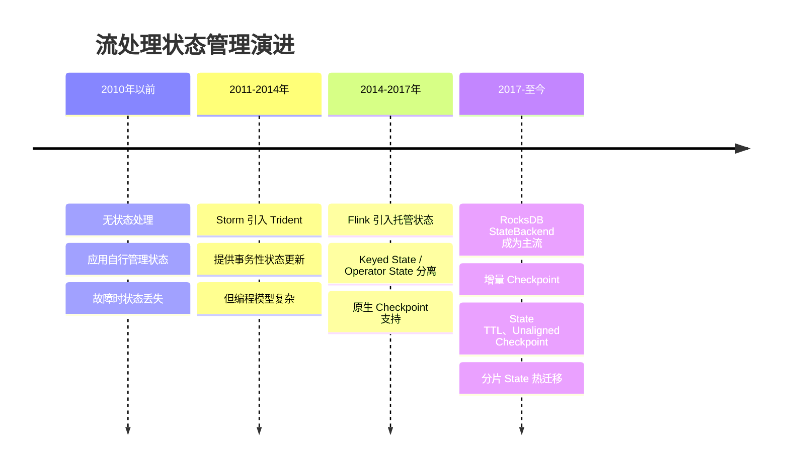
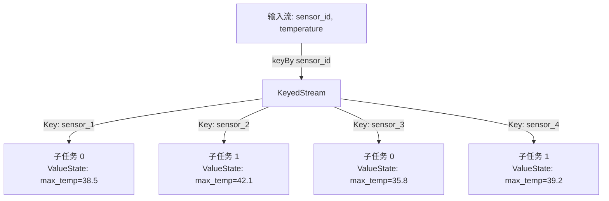
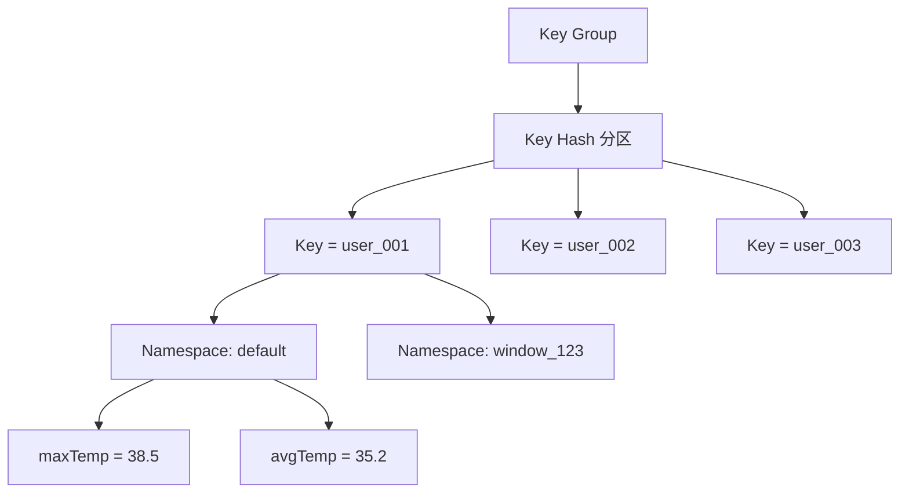
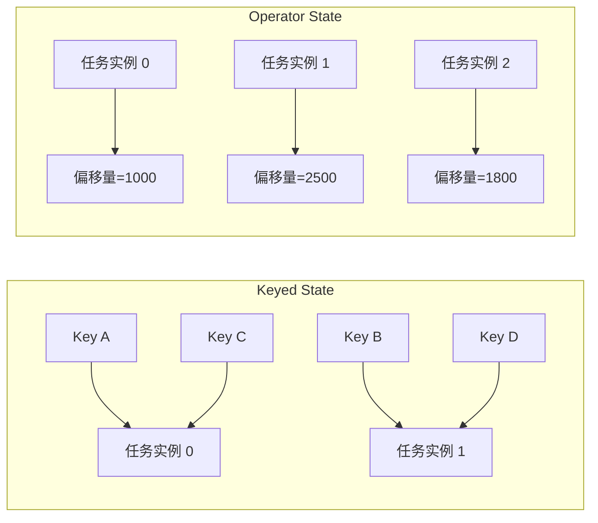
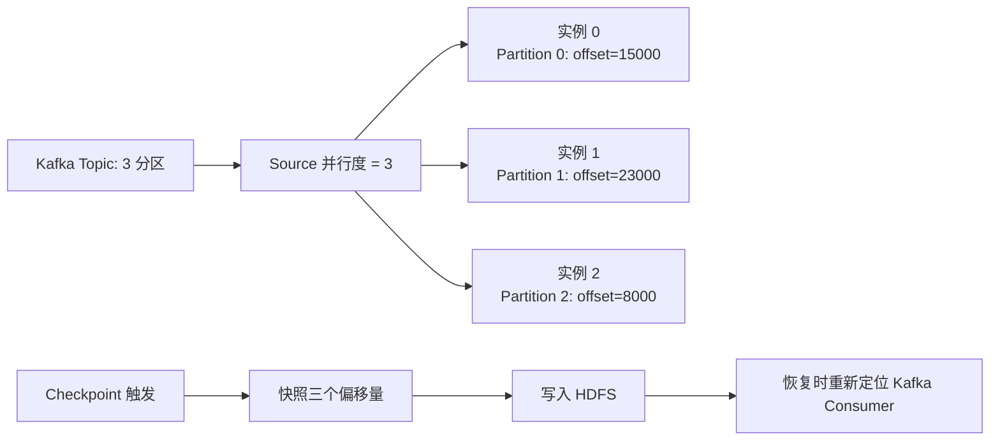
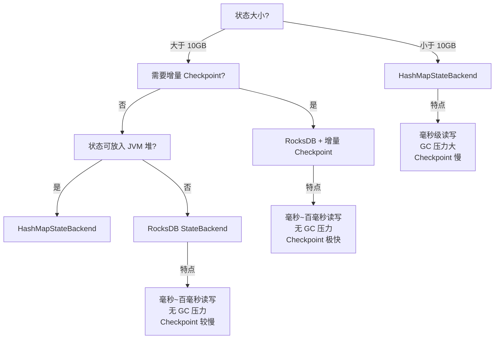
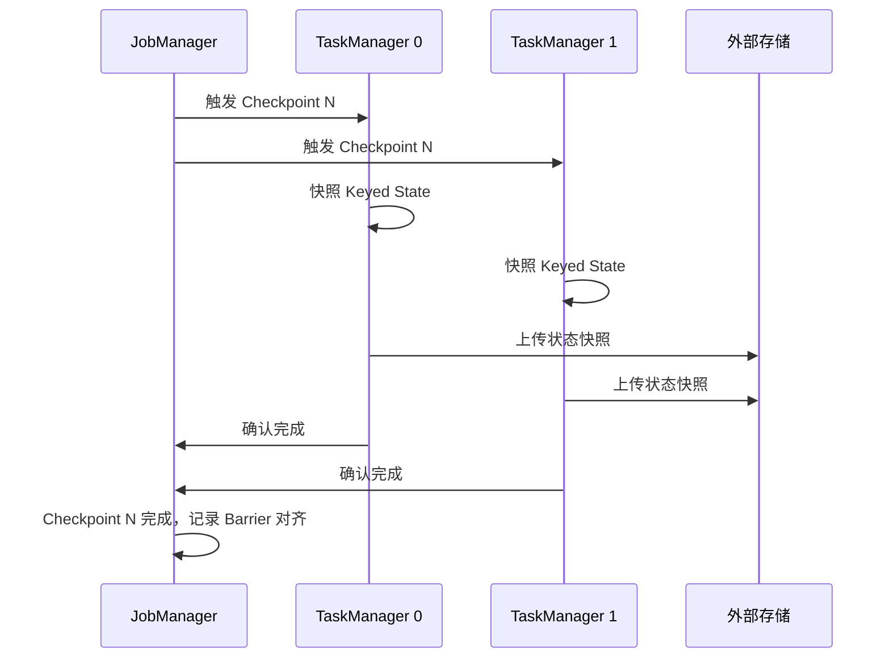
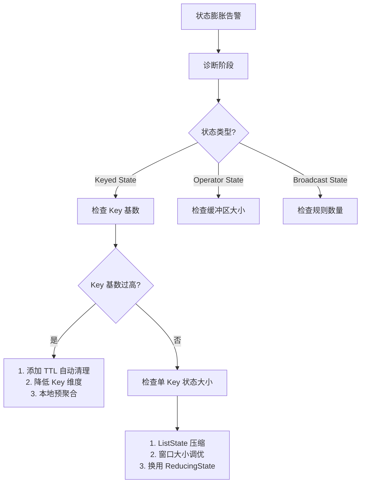

# 三状态管理：Keyed State、Operator State 与 Broadcast State

## 1. 概述与背景

### 1.1 为什么状态管理是流处理的灵魂

在流处理系统中，数据如流水般持续涌入，处理器必须"记住"历史信息才能完成有意义的计算。例如：

- **实时去重**：需要记住过去已见过的用户 ID
- **滑动窗口聚合**：需要维护窗口内所有元素
- **CEP 复杂事件处理**：需要跟踪事件模式的匹配进度
- **流式机器学习**：需要持续更新模型参数

这些"需要记住的信息"就是**状态（State）**。如果说窗口定义了"对哪些数据做计算"，那么状态就是"计算过程中保存了什么"。没有可靠的状态管理，流处理系统就无法实现故障恢复、精确一次语义和水平扩展——这些正是现代流处理框架区别于简单消息队列消费者的核心能力。

### 1.2 状态管理的演进历程



### 1.3 三状态体系概览

Apache Flink 将托管状态（Managed State）划分为三大类型，每种类型解决不同的编程需求和部署场景：

| 状态类型 | 核心特征 | 适用场景 | 与 Key 的关系 |
|----------|----------|----------|---------------|
| **Keyed State** | 按 Key 分区，每个 Key 一份独立状态 | 需要按业务键聚合的场景（计数、求和、去重） | 强绑定，只在 KeyedStream 上可用 |
| **Operator State** | 绑定到算子实例，与 Key 无关 | 算子级别的容错（偏移量管理、连接器缓冲） | 无关联 |
| **Broadcast State** | 广播到所有并行实例，保持一致 | 动态规则下发、配置热更新 | 无关联 |

> **核心思想**：Keyed State 解决"按什么维度聚合"的问题；Operator State 解决"算子自身如何容错"的问题；Broadcast State 解决"如何将全局信息同步给所有算子实例"的问题。

---

## 2. Keyed State（键控状态）

### 2.1 基本概念

Keyed State 是 Flink 中最常用的状态类型。当数据流经过 `keyBy()` 操作后，每个 Key 拥有独立的状态副本，不同 Key 之间完全隔离。这种设计天然支持水平扩展——增加并行度时，Key 按哈希重新分区，每个子任务只处理一部分 Key 的状态。



**关键约束**：

- 只能在 `keyBy()` 之后的 `KeyedStream` 上使用
- 状态的"作用域"自动限定为当前处理记录的 Key
- 增加并行度后，Flink 通过 Redistributing 机制重新分配 Key

### 2.2 五种内置 State 接口

Flink 提供了五种基本的 Keyed State 接口，覆盖了绝大多数业务需求：

| 接口 | 存储内容 | 典型用途 | 读写 API |
|------|----------|----------|----------|
| `ValueState<T>` | 单个值 | 计数器、累加器、最新值跟踪 | `.value()` / `.update(value)` |
| `ListState<T>` | 元素列表 | 收集窗口内所有元素、批量写入 | `.get()` / `.add(value)` / `.update(list)` |
| `MapState<K, V>` | 键值映射 | 特征字典、分布式缓存 | `.get(key)` / `.put(key, value)` / `.entries()` |
| `ReducingState<T>` | 单个聚合值 | 求和、求最大值（需提供 ReduceFunction） | `.add(value)` |
| `AggregatingState<IN, OUT>` | 单个聚合值 | 复杂聚合（输入输出类型可不同） | `.add(value)` |

> **选型建议**：优先选择 `ValueState`（最简单、最高效）；需要聚合时用 `ReducingState` 或 `AggregatingState`（避免手动管理累加逻辑）；需要存多个值时用 `ListState` 或 `MapState`。

**五种 State 接口的性能特征对比**：

| 接口 | 读性能 | 写性能 | 内存占用 | 适用场景 |
|------|--------|--------|----------|----------|
| `ValueState` | O(1) | O(1) | 最小（单值） | 频繁读写单值 |
| `ListState` | O(n) 遍历 | O(1) 添加 | 随元素数增长 | 写多读少 |
| `MapState` | O(1) 哈希查找 | O(1) | 随 Key-Value 数增长 | 需要按 Key 查询 |
| `ReducingState` | O(1) | O(1) | 最小（单值） | 流式聚合 |
| `AggregatingState` | O(1) | O(1) | 最小（单值） | 复杂聚合逻辑 |

### 2.3 完整代码示例：实时温度监控

以下示例展示了一个实时温度监控系统：为每个传感器跟踪最高温度、温度历史和异常次数。

```java
// Java - Flink Keyed State 完整示例
public class TemperatureMonitor extends KeyedProcessFunction<String, SensorReading, Alert> {

    // 五种 State 按需声明
    private ValueState<Double> maxTempState;
    private ListState<Double> tempHistoryState;
    private MapState<String, Integer> alertCountState;
    private ReducingState<Long> totalReadingsState;
    private AggregatingState<Double, Double> avgTempState;

    @Override
    public void open(Configuration parameters) {
        // ValueState：跟踪最高温度
        maxTempState = getRuntimeContext().getState(
            new ValueStateDescriptor<>("maxTemp", Double.class, Double.MIN_VALUE));

        // ListState：保存最近 100 次读数（用于趋势分析）
        ValueStateDescriptor<List<Double>> listDesc =
            new ValueStateDescriptor<>("tempHistory", List.class);
        listDesc.enableTimeToLive(StateTtlConfig.newBuilder(Time.hours(1)).build());
        tempHistoryState = getRuntimeContext().getListState(listDesc);

        // MapState：按类型统计告警次数
        MapStateDescriptor<String, Integer> mapDesc =
            new MapStateDescriptor<>("alertCounts", String.class, Integer.class);
        alertCountState = getRuntimeContext().getMapState(mapDesc);

        // ReducingState：累计总读数
        ReducingStateDescriptor<Long> reducingDesc =
            new ReducingStateDescriptor<>("totalReadings",
                (a, b) -> a + b, Long.class);
        totalReadingsState = getRuntimeContext().getReducingState(reducingDesc);

        // AggregatingState：滑动平均温度
        AggregatingStateDescriptor<Double, Double, Double> aggDesc =
            new AggregatingStateDescriptor<>("avgTemp",
                new AggregateFunction<Double, double[], Double>() {
                    @Override public double[] createAccumulator() {
                        return new double[]{0.0, 0.0}; // [sum, count]
                    }
                    @Override public double[] add(Double value, double[] acc) {
                        return new double[]{acc[0] + value, acc[1] + 1};
                    }
                    @Override public Double getResult(double[] acc) {
                        return acc[1] > 0 ? acc[0] / acc[1] : 0.0;
                    }
                    @Override public double[] merge(double[] a, double[] b) {
                        return new double[]{a[0] + b[0], a[1] + b[1]};
                    }
                }, Double.class);
        avgTempState = getRuntimeContext().getAggregatingState(aggDesc);
    }

    @Override
    public void processElement(SensorReading reading, Context ctx, Collector<Alert> out)
            throws Exception {
        // 更新最高温度
        Double currentMax = maxTempState.value();
        if (reading.getTemperature() > currentMax) {
            maxTempState.update(reading.getTemperature());
        }

        // 更新历史记录（保留最近 100 条）
        List<Double> history = new ArrayList<>(tempHistoryState.get());
        history.add(reading.getTemperature());
        if (history.size() > 100) {
            history = history.subList(history.size() - 100, history.size());
        }
        tempHistoryState.update(history);

        // 更新告警计数
        if (reading.getTemperature() > 40.0) {
            String alertType = reading.getTemperature() > 50.0 ? "CRITICAL" : "WARNING";
            Integer count = alertCountState.get(alertType);
            alertCountState.put(alertType, count == null ? 1 : count + 1);
        }

        // 累计读数
        totalReadingsState.add(1L);

        // 计算平均温度
        avgTempState.add(reading.getTemperature());

        // 发出告警
        if (reading.getTemperature() > 45.0) {
            out.collect(new Alert(
                reading.getSensorId(),
                reading.getTemperature(),
                maxTempState.value(),
                avgTempState.get()
            ));
        }
    }
}
```

### 2.4 状态描述符（StateDescriptor）详解

每个状态在使用前必须通过 `StateDescriptor` 进行注册。StateDescriptor 包含三个关键配置：

```java
ValueStateDescriptor<Long> descriptor = new ValueStateDescriptor<>(
    "myState",           // 状态名称（在 Checkpoint 中用作标识）
    Long.class,          // 值类型
    0L                   // 默认值（状态未初始化时返回）
);
```

**配置选项**：

| 配置项 | 方法 | 说明 |
|--------|------|------|
| TTL | `enableTimeToLive(StateTtlConfig)` | 设置状态过期时间，防止状态无限增长 |
| 启用增量清理 | `TtlConfig.setUpdateType(OnCreateAndWrite)` | 每次写入时检查过期 |
| 启用全量清理 | `TtlConfig.cleanupIncrementally(interval, batchSize)` | 后台定时扫描清理 |
| 启用快照清理 | `TtlConfig.cleanupFullSnapshot()` | Checkpoint 快照中跳过过期状态 |
| 可查询状态 | `enableQuerying()` | 允许外部通过 REST API 查询状态值 |

### 2.5 State 索引与访问模式

理解 Keyed State 在存储引擎中的内部索引结构，是进行性能调优的前提。Flink 的 Keyed State 在底层按三级层次组织：



**三级索引结构**：

| 层级 | 说明 | 决定因素 |
|------|------|----------|
| **Key Group** | Key 的逻辑分片，数量等于最大并行度 | `keyBy()` 的哈希分区 |
| **Key** | 业务键的序列化字节 | 用户定义的 KeySelector |
| **Namespace** | 状态的逻辑命名空间（窗口 ID、Timer 时间戳等） | 框架自动管理 |

**RocksDB 中的存储细节**：

RocksDB 使用 Key-Value 存储，Flink 将三级索引编码为一个 RocksDB Key：

[KeyGroup Prefix][Key Bytes][Namespace Bytes][State Name Bytes] → [Serialized Value]

这意味着：
- **顺序读写更快**：连续的 Key 通常落在同一个 RocksDB SSTable 文件中，范围扫描效率高
- **随机读写有开销**：跨 Key Group 的访问会导致 RocksDB Block Cache 失效
- **Key 的序列化效率直接影响性能**：使用 `String` 类型的 Key 比使用复杂 Pojo 作为 Key 效率更高

**访问模式最佳实践**：

| 场景 | 推荐做法 | 原因 |
|------|----------|------|
| 高频读写 | 将状态集中在少数 Key 上 | 减少 RocksDB 查找次数 |
| 大量 Key | 使用简单的 Key 类型（String/Long） | 序列化开销小 |
| 批量操作 | 使用 `MapState.entries()` 一次性读取 | 减少多次单条读取的开销 |
| 条件更新 | 先 `value()` 判断再 `update()` | 避免不必要的序列化写入 |

### 2.6 State 序列化与类型系统

Flink 内部通过 **TypeInformation** 和 **TypeSerializer** 系统管理状态的序列化。选择正确的序列化策略对性能和兼容性至关重要。

**三种序列化级别**：

| 级别 | 类型 | 性能 | Schema 兼容性 | 适用场景 |
|------|------|------|---------------|----------|
| **Flink 原生** | 基本类型（String, Integer, Long 等） | 最快 | 完全兼容 | 简单状态 |
| **POJO 序列化** | 符合规范的 Java/Scala POJO | 快 | 支持字段增删 | 复杂业务对象 |
| **Kryo 序列化** | 任意可序列化对象 | 最慢 | 不支持 | 原型开发、第三方类 |

**POJO 序列化的条件**（必须同时满足）：

```java
// 合规的 POJO 示例
public class SensorReading {
    // 1. 公有类
    public class SensorReading {
        // 2. 公有无参构造函数
        public SensorReading() {}

        // 3. 所有字段为公有或有 getter/setter
        public String sensorId;
        public double temperature;
        public long timestamp;

        // getter/setter ...
    }
}
```

> **性能警告**：如果 POJO 不满足上述条件，Flink 会回退到 Kryo 序列化，性能可能下降 5-10 倍。可以通过 `env.getConfig().addDefaultKryoSerializer(...)` 注册自定义 Kryo 序列化器来缓解，但最佳方案是修正 POJO 结构。

**Schema 演进注意事项**：

- 添加新字段：POJO 序列化支持，旧 Checkpoint 中缺失的字段使用默认值
- 删除字段：POJO 序列化支持，旧 Checkpoint 中的该字段被忽略
- 修改字段类型：**不兼容**，必须使用 Savepoint 迁移
- 重命名字段：**不兼容**（按字段位置序列化，不按名称）

### 2.7 State TTL（状态生存时间）

State TTL 是防止状态无限膨胀的关键机制。对于只关心最近一段时间数据的场景（如"过去 1 小时的计数"），TTL 可以自动清理过期状态，避免内存和磁盘被历史数据耗尽。

```java
// State TTL 配置示例：24 小时过期，写入时重置 TTL
StateTtlConfig ttlConfig = StateTtlConfig.newBuilder(Time.hours(24))
    .setUpdateType(StateTtlConfig.UpdateType.OnCreateAndWrite) // 每次写入刷新 TTL
    .setStateVisibility(StateTtlConfig.StateVisibility.NeverReturnExpired) // 过期数据不可见
    .cleanupFullSnapshot()        // Checkpoint 中不包含过期状态
    .cleanupIncrementally(10, true) // 后台增量清理
    .build();

ValueStateDescriptor<String> desc = new ValueStateDescriptor<>("ttlState", String.class);
desc.enableTimeToLive(ttlConfig);
```

**TTL 更新策略对比**：

| 策略 | 行为 | 适用场景 |
|------|------|----------|
| `OnCreateAndWrite` | 创建和更新时重置 TTL | 大多数场景（推荐） |
| `OnReadAndWrite` | 读取时也重置 TTL | 需要保持活跃的数据 |

**TTL 清理策略组合建议**：

| 组合 | 行为 | 适用场景 |
|------|------|----------|
| `cleanupFullSnapshot()` | Checkpoint 快照中跳过过期状态 | 减少 Checkpoint 大小（推荐默认开启） |
| `cleanupIncrementally(delayMs, runDuringCompaction)` | 后台定期扫描清理 | 状态量大、需要及时释放空间 |
| `cleanupCompactionFilter()` | 利用 RocksDB Compaction 过滤过期数据 | RocksDB 后端、写入密集场景 |
| `cleanupIncrementally` + `cleanupCompactionFilter` | 双重清理 | 大状态 + 高写入吞吐 |

> **注意**：TTL 精度取决于 StateBackend。Heap 后端精确到毫秒；RocksDB 后端精确到秒级。在 RocksDB 后端中，TTL 存储为秒级时间戳，因此毫秒级过期粒度不生效。

### 2.8 常见误区

**误区 1：在非 KeyedStream 上使用 Keyed State**

```java
// 错误：未 keyBy 就调用 KeyedProcessFunction
dataStream.process(new MyKeyedProcessFunction());  // 运行时异常

// 正确：先 keyBy
dataStream.keyBy(record -> record.getKey())
           .process(new MyKeyedProcessFunction());
```

**误区 2：状态类型不匹配**

```java
// 错误：StateDescriptor 声明为 Integer，但存入 Long
ValueStateDescriptor<Integer> desc = new ValueStateDescriptor<>("state", Integer.class);
// 如果计算结果超过 Integer.MAX_VALUE，会溢出

// 正确：根据业务数据范围选择合适类型
ValueStateDescriptor<Long> desc = new ValueStateDescriptor<>("state", Long.class);
```

**误区 3：忘记初始化默认值**

```java
// 风险：如果状态从未被 update()，value() 返回 null（引用类型）或基本类型默认值
Double value = myState.value(); // 可能为 null，导致 NPE

// 安全写法
Double value = myState.value();
if (value == null) {
    value = 0.0;
}
```

**误区 4：在 processElement 中频繁序列化大对象**

```java
// 反模式：每次处理都重新创建和序列化大的 List
List<Event> events = new ArrayList<>(myListState.get()); // 每次都反序列化整个列表
events.add(newEvent);
myListState.update(events); // 每次都重新序列化整个列表

// 优化：使用增量方式
myListState.add(newEvent); // 只序列化单个新事件
// 仅在需要读取完整列表时才调用 get()
```

---

## 3. Operator State（算子状态）

### 3.1 基本概念

Operator State 绑定到算子的并行实例上，与数据的 Key 无关。每个算子实例维护自己独立的状态，不同实例之间的状态互不干扰。

典型应用：

- **Source 算子**：记录每个并行实例消费的 Kafka 分区偏移量
- **Sink 算子**：缓冲批量写入的数据
- **自定义算子**：跨 Key 的全局计数、连接池管理
- **连接器内部**：Flink Kafka Connector 使用 Operator State 存储每个分区的消费偏移量

### 3.2 与 Keyed State 的核心区别



| 维度 | Keyed State | Operator State |
|------|-------------|----------------|
| 分区依据 | 按 Key 哈希分区 | 按算子并行度分区 |
| 作用域 | 当前 Key 的数据 | 当前算子实例处理的所有数据 |
| 可用上下文 | 只能在 KeyedStream 上使用 | 任何 Stream 上都可使用 |
| 重新分配策略 | 自动随 Redistributing 分配 | 需实现 `ListCheckpointed` 或 `CheckpointedFunction` |
| 典型用途 | 聚合、窗口、模式匹配 | 偏移量管理、缓冲、连接器状态 |

### 3.3 Operator State 重新分配策略

当并行度发生变化时（如扩缩容），Operator State 需要重新分配。Flink 提供了三种内置重新分配策略：

```mermaid
graph TD
    subgraph 均匀重新分配
        A1[实例0: [s0, s1, s2]] --> B1[实例0: [s0]]
        A1 --> B2[实例1: [s1]]
        A1 --> B3[实例2: [s2]]
    end

    subgraph 连接列表重新分配
        C1[实例0: [s0, s1, s2]] --> D1[实例0: [s0, s1, s2]]
        C2[实例1: [s3, s4]] --> D2[实例1: [s3, s4]]
    end

    subgraph 广播重新分配
        E1[实例0: [s0, s1, s2]] --> F1[实例0: [s0, s1, s2]]
        E1 --> F2[实例1: [s0, s1, s2]]
        E1 --> F3[实例2: [s0, s1, s2]]
    end
```

| 重新分配策略 | 方法 | 行为 | 适用场景 |
|-------------|------|------|----------|
| **均匀分配** | `evenSplitSplits()` | 状态均匀分散到新实例 | 每个状态独立（如各自管理一段偏移量） |
| **连接列表** | `coalesceSplits()` | 合并为一个列表返回 | 状态需要聚合（如缓冲区合并） |
| **广播** | `broadcastState()` | 每个实例获得完整副本 | 全局配置、规则表 |

### 3.4 完整代码示例：自定义 Kafka Source 偏移量管理

```java
// Java - 使用 CheckpointedFunction 管理偏移量
public class CustomKafkaSource extends RichParallelSourceFunction<KafkaRecord>
        implements CheckpointedFunction {

    private transient ListState<byte[]> checkpointedState;
    private final List<byte[]> pendingOffsets = new ArrayList<>();
    private volatile boolean running = true;

    @Override
    public void run(SourceContext<KafkaRecord> ctx) throws Exception {
        while (running) {
            KafkaRecord record = pollKafka();
            if (record != null) {
                // 在 Checkpoint 锁内更新状态，保证一致性
                synchronized (ctx.getCheckpointLock()) {
                    ctx.collect(record);
                    pendingOffsets.add(serializeOffset(record.getPartition(),
                                                       record.getOffset()));
                }
            }
        }
    }

    // 实现 CheckpointedFunction 接口
    @Override
    public void snapshotState(FunctionSnapshotContext context) throws Exception {
        // 清空旧状态，写入最新偏移量
        checkpointedState.clear();
        for (byte[] offset : pendingOffsets) {
            checkpointedState.add(offset);
        }
    }

    @Override
    public void initializeState(FunctionInitializationContext context) throws Exception {
        // 从 Checkpoint 恢复偏移量
        ListStateDescriptor<byte[]> descriptor =
            new ListStateDescriptor<>("kafka-offsets", byte[].class);

        checkpointedState = context.getOperatorStateStore()
            .getListState(descriptor);  // 使用 Operator State，非 Keyed State

        if (context.isRestored()) {
            // 从 Checkpoint 恢复后，用保存的偏移量继续消费
            for (byte[] offset : checkpointedState.get()) {
                restoreKafkaOffset(deserializeOffset(offset));
            }
        }
    }

    @Override
    public void cancel() {
        running = false;
    }
}
```

### 3.5 算子状态的高级用法：ListCheckpointed

对于更简单的场景，可以直接实现 `ListCheckpointed<T>` 接口：

```java
public class PartitionCounter extends RichFlatMapFunction<Event, Integer>
        implements ListCheckpointed<Integer> {

    private int localCount = 0;

    @Override
    public void flatMap(Event event, Collector<Integer> out) {
        localCount++;
        out.collect(1);
    }

    @Override
    public List<Integer> snapshotState(long checkpointId, long timestamp) {
        return Collections.singletonList(localCount);
    }

    @Override
    public void restoreState(List<Integer> state) {
        localCount = state.isEmpty() ? 0 : state.get(0);
    }
}
```

> **选择指南**：需要管理 `ListState` 时用 `CheckpointedFunction`（更灵活）；只需要简单的状态快照时用 `ListCheckpointed`（更简洁）。

### 3.6 CheckpointedFunction 与不同重分配策略的代码示例

`CheckpointedFunction` 接口提供了完全控制状态重分配的能力。以下示例展示三种策略的实现差异：

```java
// 策略一：均匀分配 — 每个新实例获得均分的状态子集
// 适用场景：每个状态片段独立（如 Kafka 各分区偏移量）
public class EvenSplitSource extends RichParallelSourceFunction<String>
        implements CheckpointedFunction {

    private transient ListState<byte[]> partitionOffsets;
    private final List<byte[]> localOffsets = new ArrayList<>();

    @Override
    public void snapshotState(FunctionSnapshotContext context) throws Exception {
        partitionOffsets.clear();
        for (byte[] offset : localOffsets) {
            partitionOffsets.add(offset);
        }
    }

    @Override
    public void initializeState(FunctionInitializationContext context) throws Exception {
        OperatorStateStore stateStore = context.getOperatorStateStore();
        // 注册时指定均匀分配策略
        partitionOffsets = stateStore.getListState(
            new ListStateDescriptor<>("offsets", byte[].class),
            new EvenSplitOperatorStateSerializer());  // Flink 内置

        if (context.isRestored()) {
            // 恢复时只处理分配给当前实例的那部分
            for (byte[] offset : partitionOffsets.get()) {
                localOffsets.add(offset);
            }
        }
    }
}

// 策略二：合并列表 — 所有状态合并为一个列表
// 适用场景：缓冲区数据需要在扩缩容时合并
public class BufferedSink extends RichSinkFunction<Event>
        implements CheckpointedFunction {

    private transient ListState<Event> bufferedEvents;
    private final List<Event> localBuffer = new ArrayList<>();
    private static final int FLUSH_THRESHOLD = 1000;

    @Override
    public void invoke(Event event, Context context) throws Exception {
        localBuffer.add(event);
        if (localBuffer.size() >= FLUSH_THRESHOLD) {
            flushToExternal();  // 批量写入外部系统
            localBuffer.clear();
        }
    }

    @Override
    public void snapshotState(FunctionSnapshotContext context) throws Exception {
        bufferedEvents.clear();
        for (Event event : localBuffer) {
            bufferedEvents.add(event);  // 将缓冲区内容持久化
        }
    }

    @Override
    public void initializeState(FunctionInitializationContext context) throws Exception {
        OperatorStateStore stateStore = context.getOperatorStateStore();
        // 注册时指定合并策略：扩缩容后所有缓冲数据合并到一起
        bufferedEvents = stateStore.getListState(
            new ListStateDescriptor<>("buffer", Event.class),
            new CoalescingListStateSerializer<>(Event.class));

        if (context.isRestored()) {
            // 从合并后的列表恢复所有缓冲事件
            for (Event event : bufferedEvents.get()) {
                localBuffer.add(event);
            }
        }
    }
}
```

### 3.7 Flink Kafka Connector 中的 Operator State

Flink Kafka Connector 是 Operator State 最典型的应用场景。理解其内部实现有助于深入理解 Operator State 的设计思想。



**FlinkKafkaConsumer 内部状态管理要点**：

| 特性 | 实现方式 | 说明 |
|------|----------|------|
| 状态类型 | `ListState<byte[]>` (Operator State) | 每个分区偏移量作为一个列表元素 |
| 重分配策略 | 均匀分配 (`evenSplit`) | 扩缩容后均匀分配分区到新实例 |
| Checkpoint 语义 | 与 Kafka Consumer 的 `commitSync` 解耦 | Flink 管理偏移量，不依赖 Kafka 自动提交 |
| 恢复行为 | 从 Checkpoint 恢复偏移量 | 重启后从保存的 offset 继续消费 |

---

## 4. Broadcast State（广播状态）

### 4.1 基本概念

Broadcast State 用于将一份公共数据同步到算子的所有并行实例。典型场景是**动态规则引擎**：规则表由一个算子广播出去，所有下游算子实例收到相同的规则并应用到各自处理的数据上。

```mermaid
graph TD
    A[规则流: filter_rules] --> B[广播算子<br/>BroadcastProcessFunction]
    B -->|广播到所有实例| C[实例 0<br/>规则表: [rule1, rule2]]
    B -->|广播到所有实例| D[实例 1<br/>规则表: [rule1, rule2]]
    B -->|广播到所有实例| E[实例 2<br/>规则表: [rule1, rule2]]
    F[数据流: sensor_data] --> C
    F --> D
    F --> E
```

### 4.2 Broadcast State 使用约束

| 约束 | 说明 |
|------|------|
| 只能用 `MapState` | Broadcast State 的底层存储是 MapState |
| 只读于下游 | 广播后，下游算子只能读取，不能写入 |
| 无 Checkpoint 重分配 | 并行度变化时，广播状态不做重新分配（所有实例保持完整副本） |
| 无 TTL | Broadcast State 不支持自动过期 |
| KeyedStream 不可用 | 不能在 `keyBy()` 之后的流上使用 Broadcast State |

### 4.3 完整代码示例：实时欺诈检测规则引擎

```java
// Java - Broadcast State 实现动态规则引擎
public class FraudDetectionRule {
    private String ruleId;
    private String field;
    private String operator; // "gt", "lt", "eq", "contains"
    private double threshold;
    private String alertLevel; // "LOW", "MEDIUM", "HIGH"
    // getter/setter ...
}

public class TransactionFraudDetector
        extends KeyedBroadcastProcessFunction<String, Transaction, Alert> {

    // 广播状态描述符
    private final MapStateDescriptor<String, FraudRule> ruleStateDesc =
        new MapStateDescriptor<>("fraudRules",
            String.class, FraudRule.class);

    // Keyed State：跟踪用户最近交易频率
    private ValueState<Integer> recentTxCountState;

    @Override
    public void open(Configuration parameters) {
        ValueStateDescriptor<Integer> countDesc =
            new ValueStateDescriptor<>("recentTxCount", Integer.class, 0);
        recentTxCountState = getRuntimeContext().getState(countDesc);
    }

    @Override
    public void processBroadcastElement(FraudRule rule, Context ctx, Collector<Alert> out)
            throws Exception {
        // 更新广播状态：所有实例收到相同的规则
        MapState<String, FraudRule> ruleState = ctx.getBroadcastState(ruleStateDesc);
        ruleState.put(rule.getRuleId(), rule);

        LOG.info("规则已更新: {} -> {}", rule.getRuleId(), rule);
    }

    @Override
    public void processElement(Transaction tx, ReadOnlyContext ctx, Collector<Alert> out)
            throws Exception {
        // 读取广播状态（只读）
        MapState<String, FraudRule> ruleState =
            ctx.getBroadcastState(ruleStateDesc);

        // 应用所有规则
        for (Map.Entry<String, FraudRule> entry : ruleState.entries()) {
            FraudRule rule = entry.getValue();
            if (rule.matches(tx)) {
                // 更新 Keyed State（跟踪交易频率）
                Integer count = recentTxCountState.value();
                recentTxCountState.update(count + 1);

                // 高频交易 + 规则命中 = 高风险告警
                if (count > 10 &amp;&amp; "HIGH".equals(rule.getAlertLevel())) {
                    out.collect(new Alert(
                        tx.getUserId(),
                        "FRAUD_DETECTED",
                        String.format("用户 %s 在短时间内触发 %d 次规则: %s",
                            tx.getUserId(), count + 1, rule.getRuleId())
                    ));
                }
            }
        }
    }
}

// 构建完整的拓扑
public class FraudDetectionTopology {

    public static void main(String[] args) throws Exception {
        StreamExecutionEnvironment env = StreamExecutionEnvironment.getExecutionEnvironment();

        // 1. 规则流（低吞吐，需要广播）
        DataStream<FraudRule> ruleStream = env
            .addSource(new RuleSourceFunction())
            .name("fraud-rules");

        // 2. 交易流（高吞吐，需要按用户分区）
        DataStream<Transaction> transactionStream = env
            .addSource(new TransactionSourceFunction())
            .name("transactions")
            .keyBy(Transaction::getUserId);

        // 3. 广播规则流
        BroadcastStream<FraudRule> broadcastRuleStream =
            ruleStream.broadcast(ruleStateDesc);

        // 4. 连接并处理
        DataStream<Alert> alerts = transactionStream
            .connect(broadcastRuleStream)
            .process(new TransactionFraudDetector())
            .name("fraud-detector");

        alerts.addSink(new AlertSink());
        env.execute("实时欺诈检测");
    }
}
```

### 4.4 Broadcast State 的两种处理函数

Flink 提供两种 BroadcastProcessFunction，分别对应 Keyed 和非 Keyed 场景：

| 函数类型 | 基类 | 处理方法 | 状态访问 | 适用场景 |
|----------|------|----------|----------|----------|
| `BroadcastProcessFunction` | `ProcessFunction` | `processElement()` + `processBroadcastElement()` | 只读访问广播状态 | 非 Keyed 流的规则匹配 |
| `KeyedBroadcastProcessFunction` | `KeyedProcessFunction` | `processElement()` + `processBroadcastElement()` | 读写广播状态 + 读写 Keyed State | Keyed 流的规则匹配 |

**回调执行顺序保证**：

在 `KeyedBroadcastProcessFunction` 中，两个回调的执行顺序有严格保证：

- **processElement 与 processBroadcastElement 的执行是串行的**：对于同一个 Key，不会并发执行。这意味着你可以在 `processElement` 中安全读取广播状态，也可以在 `processBroadcastElement` 中安全读取 Keyed State。
- **跨 Key 的并行**：不同 Key 的处理仍然可以并行执行，因为它们由不同的子任务处理。
- **事件处理顺序**：同一 Key 内，事件按照到达顺序处理。广播事件会在数据事件之间穿插处理，取决于事件到达的时间。

**非 Keyed BroadcastProcessFunction 示例**：

```java
// 非 Keyed 场景：全局日志过滤器
public class LogFilter extends BroadcastProcessFunction<LogEntry, FilterRule, LogEntry> {

    private final MapStateDescriptor<String, FilterRule> filterDesc =
        new MapStateDescriptor<>("filters", String.class, FilterRule.class);

    @Override
    public void processBroadcastElement(FilterRule rule, Context ctx,
                                         Collector<LogEntry> out) throws Exception {
        // 广播状态可读写（这里更新规则表）
        MapState<String, FilterRule> filters = ctx.getBroadcastState(filterDesc);
        if (rule.isEnabled()) {
            filters.put(rule.getFieldName(), rule);
        } else {
            filters.remove(rule.getFieldName());
        }
    }

    @Override
    public void processElement(LogEntry log, ReadOnlyContext ctx,
                                Collector<LogEntry> out) throws Exception {
        // 只读访问广播状态
        MapState<String, FilterRule> filters = ctx.getBroadcastState(filterDesc);

        boolean keep = true;
        for (Map.Entry<String, FilterRule> entry : filters.entries()) {
            FilterRule rule = entry.getValue();
            if (!rule.matches(log)) {
                keep = false;
                break;
            }
        }

        if (keep) {
            out.collect(log);
        }
    }
}
```

**KeyedBroadcastProcessFunction 示例（规则更新时回溯评估）**：

```java
// Keyed 场景：规则变更时重新评估历史状态
public class RuleBackfillDetector
        extends KeyedBroadcastProcessFunction<String, Event, Alert> {

    private final MapStateDescriptor<String, Rule> ruleDesc =
        new MapStateDescriptor<>("rules", String.class, Rule.class);

    // Keyed State：保存最近的事件摘要
    private ValueState<EventSummary> summaryState;

    @Override
    public void open(Configuration parameters) {
        summaryState = getRuntimeContext().getState(
            new ValueStateDescriptor<>("summary", EventSummary.class));
    }

    @Override
    public void processBroadcastElement(Rule newRule, Context ctx,
                                         Collector<Alert> out) throws Exception {
        MapState<String, Rule> rules = ctx.getBroadcastState(ruleDesc);
        rules.put(newRule.getId(), newRule);

        // 关键：规则更新时，重新评估当前 Key 的已有状态
        EventSummary summary = summaryState.value();
        if (summary != null &amp;&amp; newRule.matches(summary)) {
            out.collect(new Alert("RULE_BACKFILL",
                "规则 " + newRule.getId() + " 回溯命中历史数据"));
        }
    }

    @Override
    public void processElement(Event event, ReadOnlyContext ctx,
                                Collector<Alert> out) throws Exception {
        MapState<String, Rule> rules = ctx.getBroadcastState(ruleDesc);

        // 正常处理：用当前规则评估新事件
        for (Map.Entry<String, Rule> entry : rules.entries()) {
            if (entry.getValue().matches(event)) {
                out.collect(new Alert(entry.getKey(), "实时命中"));
            }
        }

        // 更新 Keyed State
        EventSummary summary = summaryState.value();
        if (summary == null) summary = new EventSummary();
        summary.update(event);
        summaryState.update(summary);
    }
}
```

---

## 5. 状态后端（State Backend）

### 5.1 三大 State Backend

状态后端决定了状态如何存储、如何创建 Checkpoint。选择合适的 State Backend 是状态管理性能优化的关键。

| State Backend | 状态存储位置 | Checkpoint 存储 | 大小限制 | 适用场景 |
|---------------|-------------|-----------------|----------|----------|
| **HashMapStateBackend** | JVM 堆内存 | 分布式文件系统 | 受 JVM 堆大小限制 | 开发测试、小状态 |
| **EmbeddedRocksDBStateBackend** | 本地磁盘（RocksDB） | 分布式文件系统 | 受磁盘大小限制（可 TB 级） | 生产环境、大状态 |
| **FsStateBackend**（已废弃） | JVM 堆内存 | 分布式文件系统 | 受 JVM 堆大小限制 | 被 HashMapStateBackend 替代 |

### 5.2 配置示例

```java
// 方式一：HashMapStateBackend（小状态，低延迟）
StreamExecutionEnvironment env = StreamExecutionEnvironment.getExecutionEnvironment();
env.setStateBackend(new HashMapStateBackend());
env.getCheckpointConfig().setCheckpointStorage("hdfs://namenode:8020/flink/checkpoints");

// 方式二：RocksDB StateBackend（生产推荐）
RocksDBStateBackend rocksDBBackend = new RocksDBStateBackend(
    "hdfs://namenode:8020/flink/checkpoints",
    true  // 启用增量 Checkpoint
);
env.setStateBackend(rocksDBBackend);

// 方式三：通过配置文件（flink-conf.yaml）
// state.backend: rocksdb
// state.checkpoints.dir: hdfs:///flink/checkpoints
// state.backend.incremental: true
```

### 5.3 选型决策树



### 5.4 RocksDB 调优参数

| 参数 | 默认值 | 说明 | 调优建议 |
|------|--------|------|----------|
| `state.backend.rocksdb.block.cache-size` | 64MB | 块缓存大小 | 设为 TaskManager 内存的 10-20% |
| `state.backend.rocksdb.writebuffer.size` | 64MB | 写缓冲区大小 | 增大可提升写入性能 |
| `state.backend.rocksdb.writebuffer.count` | 2 | 写缓冲区数量 | 增大可减少磁盘 flush 频率 |
| `state.backend.rocksdb.writebuffer.number-to-merge` | 1 | 合并阈值 | 增大可减少磁盘写入次数 |
| `state.backend.rocksdb.block.size` | 4KB | 数据块大小 | 默认值通常足够 |
| `state.backend.rocksdb.compaction.style` | LEVEL | 压缩策略 | LEVEL 适合读多写少；UNIVERSAL 适合写多读少 |
| `state.backend.rocksdb.timer-service.factory` | ROCKSDB | Timer 服务实现 | HeapTimerService 可提升 Timer 精度 |

**RocksDB 高级调优参数**：

| 参数 | 默认值 | 说明 | 适用场景 |
|------|--------|------|----------|
| `state.backend.rocksdb.memory.managed` | true | Flink 管理 RocksDB 内存预算 | 生产环境保持开启 |
| `state.backend.rocksdb.memory.fixed-per-slot` | - | 每个 slot 固定内存 | 需要精确控制内存分配时 |
| `state.backend.rocksdb.use-bloom-filter` | false | 启用布隆过滤器 | 大量随机读取场景 |
| `state.backend.rocksdb.predefined-options` | DEFAULT | 预定义优化配置 | 可选 `SPINNING_DISK_OPTIMIZED` 或 `FLASH_SSD_OPTIMIZED` |

---

## 6. Flink SQL 中的状态管理

Flink SQL 提供了声明式的数据处理方式，其内部也依赖状态管理来实现聚合、连接等操作。理解 SQL 层的状态行为，对调优 SQL 作业至关重要。

### 6.1 SQL 聚合的内部状态

当 Flink SQL 执行 `GROUP BY` 聚合时，内部会自动创建 Keyed State 来维护每个分组的聚合结果：

```sql
-- Flink SQL 聚合查询
SELECT
    user_id,
    COUNT(*) AS order_count,
    SUM(amount) AS total_amount
FROM orders
GROUP BY user_id;
```

**内部状态映射**：

| SQL 操作 | 内部 Keyed State | 状态大小 |
|----------|-----------------|----------|
| `GROUP BY` + `COUNT` | `AggregatingState<Long, Long>` | 每个分组一条记录 |
| `GROUP BY` + `SUM` | `AggregatingState<Double, Double>` | 每个分组一条记录 |
| `GROUP BY` + `LISTAGG` | `ListState<String>` | 每个分组可能多条 |
| `GROUP BY` + `DEDUP` | `ValueState<Row>` | 每个分组一条记录 |

### 6.2 SQL 状态 TTL 配置

Flink SQL 支持通过 Table Hint 为特定查询设置状态 TTL：

```sql
-- 为聚合查询设置 24 小时状态 TTL
SELECT /*+ STATE_TTL('86400s') */
    user_id,
    COUNT(*) AS order_count
FROM orders
GROUP BY user_id;

-- 为窗口聚合设置状态 TTL
SELECT /*+ STATE_TTL('3600s') */
    TUMBLE_START(event_time, INTERVAL '1' HOUR) AS window_start,
    category,
    SUM(amount) AS total
FROM orders
GROUP BY TUMBLE(event_time, INTERVAL '1' HOUR), category;
```

**SQL 状态 TTL 的生效规则**：

| 配置位置 | 语法 | 作用范围 |
|----------|------|----------|
| Table Hint | `/*+ STATE_TTL('duration') */` | 当前查询的所有聚合状态 |
| 全局配置 | `table.exec.state.ttl` | 未设置 Hint 的所有 SQL 查询 |
| DDL 属性 | `'state.ttl' = '86400000'` | 指定的 Source/Sink |

### 6.3 Temporal Join 与版本化表

Temporal Join（时间关联）是 Flink SQL 中一种特殊的状态使用模式，用于将事件流与版本化的维表进行关联：

```sql
-- Temporal Join：将订单流与最新的商品价格关联
SELECT
    o.order_id,
    o.product_id,
    p.product_name,
    o.quantity * p.price AS order_amount
FROM orders AS o
JOIN product_prices FOR SYSTEM_TIME AS OF o.order_time AS p
    ON o.product_id = p.product_id;
```

**Temporal Join 的状态特征**：

| 特征 | 说明 |
|------|------|
| 状态类型 | 维表状态（Keyed State） |
| 更新机制 | 维表流的每条记录更新对应 Key 的状态 |
| 状态大小 | 等于维表的去重 Key 数量 |
| TTL 建议 | 设置为业务允许的最大版本延迟 |

### 6.4 Changelog Mode 与状态影响

Flink SQL 的 Changelog Mode 决定了中间结果的传播方式，直接影响下游算子的状态行为：

| Mode | 中间结果 | 下游状态影响 | 适用场景 |
|------|----------|-------------|----------|
| `append` | 只有 INSERT | 无状态（每条独立处理） | 无聚合的简单查询 |
| `retract` | INSERT + DELETE | 需要维护完整状态以支持撤回 | 聚合查询、窗口查询 |
| `upsert` | INSERT + UPDATE | 需要维护 Key 映射 | 维表 Join、去重 |

```sql
-- 查看查询的 Changelog Mode
EXPLAIN SELECT user_id, COUNT(*) FROM orders GROUP BY user_id;
-- 输出中会显示 ChangelogMode=[+I, -D] 表示 retract 模式

-- retract 模式下，每次聚合更新会发送：
-- +I (insert) 新的聚合结果
-- -D (delete) 旧的聚合结果
```

> **状态影响**：retract 模式下，下游算子需要缓存所有已发送的结果，以便在撤回时能正确处理。这会导致下游状态膨胀，是 SQL 作业状态管理中最常见的问题之一。

---

## 7. 状态一致性与 Checkpoint 集成

### 7.1 状态在 Checkpoint 中的角色

Checkpoint 是 Flink 实现容错的核心机制，而状态是 Checkpoint 的"内容"。每次 Checkpoint 时，所有算子的托管状态被快照并持久化到外部存储。



### 7.2 Unaligned Checkpoint

传统的 Aligned Checkpoint 需要等待所有 Barrier 对齐，在反压严重时会导致 Checkpoint 超时。Unaligned Checkpoint 允许 Barrier 直接"穿过"缓冲区，先记录缓冲区中的数据，再在状态快照中包含这些数据。

```java
// 启用 Unaligned Checkpoint
env.getCheckpointConfig().enableUnalignedCheckpoints();
// 建议：设置较短的 Checkpoint 间隔，因为 Unaligned Checkpoint 的状态大小更大
env.getCheckpointConfig().setCheckpointInterval(60_000); // 60 秒
```

| 特性 | Aligned Checkpoint | Unaligned Checkpoint |
|------|--------------------|-----------------------|
| Barrier 行为 | 等待对齐 | 直接穿越 |
| 反压影响 | 严重时超时 | 不受影响 |
| 状态大小 | 小 | 较大（包含缓冲区数据） |
| 适用场景 | 低反压、状态小 | 高反压、状态大 |

### 7.3 Savepoint 与 Checkpoint 的区别

| 维度 | Checkpoint | Savepoint |
|------|-----------|-----------|
| 触发方式 | 自动（按配置间隔） | 手动触发 |
| 生命周期 | 作业取消后可删除 | 持久保留 |
| 存储格式 | 与 StateBackend 相关 | 标准化格式（可跨版本） |
| 用途 | 故障恢复 | 版本升级、并行度调整、状态迁移 |

```bash
# 手动触发 Savepoint
bin/flink savepoint <jobId> hdfs:///flink/savepoints/

# 从 Savepoint 恢复
bin/flink run -s hdfs:///flink/savepoints/savepoint-xxxxxx -c com.example.MyJob job.jar

# 取消作业并保留 Checkpoint
bin/flink cancel -s hdfs:///flink/savepoints/ <jobId>
```

---

## 8. 状态管理性能优化实践

### 8.1 状态膨胀治理

状态膨胀是生产环境中最常见的问题。以下是一个系统化的治理框架：



### 8.2 性能优化清单

| 优化项 | 措施 | 预期收益 |
|--------|------|----------|
| **减少状态大小** | 启用 State TTL、压缩 ListState、降低 Key 基数 | 降低内存/磁盘占用 50-90% |
| **减少状态访问频率** | 批量读写、减少 processElement 中的状态操作 | 降低读写延迟 30-50% |
| **优化 Checkpoint** | 启用增量 Checkpoint、Unaligned Checkpoint | Checkpoint 时间缩短 60-80% |
| **RocksDB 调优** | 增大 Block Cache、调整 WriteBuffer 参数 | 读写吞吐提升 20-50% |
| **避免大状态** | 预聚合后再存储、使用 AggregatingState 替代 ListState | 状态大小降低 1-2 个数量级 |

### 8.3 状态监控指标

Flink 提供了丰富的状态相关监控指标，应在生产环境中持续跟踪：

| 指标路径 | 含义 | 告警阈值建议 |
|----------|------|-------------|
| `numBytesInStateBackend` | 状态后端总字节数 | 超过磁盘/内存容量的 80% |
| `numKeys` | Keyed State 的 Key 总数 | 超过预期的 2 倍 |
| `lastCheckpointDuration` | 最近一次 Checkpoint 耗时 | 超过 Checkpoint 间隔 |
| `lastCheckpointSize` | 最近一次 Checkpoint 大小 | 超过上一次的 50% |
| `numberOfCompletedCheckpoints` | 完成的 Checkpoint 数量 | 持续增长 |
| `numberOfFailedCheckpoints` | 失败的 Checkpoint 数量 | 突然增加 |
| `lastCheckpointAlignmentBuffered` | Barrier 对齐缓冲大小 | 持续大于 100MB |

### 8.4 状态调试与排障

在生产环境中，状态相关的问题往往表现为 Checkpoint 超时、内存溢出或数据丢失。以下是一套系统化的排障流程。

**通过 REST API 检查状态大小**：

```bash
# 查看作业的所有算子状态大小
curl -s http://localhost:8081/jobs/<jobId>/vertices | jq '.vertices[] | {
  id: .id,
  name: .name,
  metrics: .metrics
}'

# 查看 Checkpoint 历史
curl -s http://localhost:8081/jobs/<jobId>/checkpoints | jq '.history[] | {
  id: .id,
  status: .status,
  size: .state_size,
  duration: .duration
}'
```

**RocksDB 内部统计**：

```bash
# 启用 RocksDB 统计信息（在 flink-conf.yaml 中配置）
state.backend.rocksdb.statistics.level: VERBOSE

# 通过 Flink Web UI 查看 RocksDB 指标
# Task Manager → Metrics → rocksdb.*
```

**关键 RocksDB 监控指标**：

| 指标 | 含义 | 异常判断 |
|------|------|----------|
| `rocksdb.memtable.hit` | Memtable 命中次数 | 远小于 `rocksdb.memtable.miss` 说明缓存不足 |
| `rocksdb.bloom.filter.useful` | 布隆过滤器有效拦截次数 | 如果为 0 说明未启用或无效 |
| `rocksdb.compact.read.bytes` | Compaction 读取字节数 | 持续增长说明写入压力大 |
| `rocksdb.write.stall` | 写入停顿次数 | 大于 0 说明写入受阻 |

**常见状态异常与修复方案**：

| 异常信息 | 原因 | 修复方案 |
|----------|------|----------|
| `StateMigrationException` | Savepoint 与代码的 State 不兼容 | 修改代码保持 State 结构兼容，或使用新 Savepoint |
| `OutOfMemoryError` (StateBackend) | 状态超出 JVM 堆空间 | 切换到 RocksDB StateBackend |
| `Checkpoint expired` | Checkpoint 超时（默认 10 分钟） | 启用 Unaligned Checkpoint、增大 timeout |
| `Cannot restore partitioned state` | 并行度变更后 Operator State 不兼容 | 检查 `ListCheckpointed` 的重分配逻辑 |
| `State size exceeded` | 单个 Key 的状态过大 | 添加 TTL、减小窗口、使用预聚合 |

---

## 9. 三状态对比与选型指南

### 9.1 综合对比表

| 对比维度 | Keyed State | Operator State | Broadcast State |
|----------|-------------|----------------|-----------------|
| **数据分区** | 按 Key 哈希 | 按算子实例 | 全量广播 |
| **使用前提** | 必须 keyBy | 无 | 必须 broadcast + connect |
| **状态存储** | MapState/ValueState 等 | ListState | MapState |
| **并行度变更** | 自动重分区 | 需实现重新分配策略 | 不重新分配 |
| **Checkpoint** | 支持 | 支持 | 支持 |
| **State TTL** | 支持 | 支持 | 不支持 |
| **编程复杂度** | 低 | 中 | 高 |
| **典型吞吐量** | 取决于 Key 基数 | 取决于实例数 | 受限于规则流吞吐 |

### 9.2 场景选型决策

需要按业务维度聚合？
├── 是 → Keyed State
│   ├── 单值跟踪 → ValueState
│   ├── 收集元素 → ListState
│   ├── 键值映射 → MapState
│   ├── 累加聚合 → ReducingState
│   └── 复杂聚合 → AggregatingState
│
├── 否 → 需要全局同步数据？
│   ├── 是 → Broadcast State
│   │   └── 规则下发、配置热更新、动态过滤
│   │
│   └── 否 → Operator State
│       ├── 偏移量管理 → ListCheckpointed
│       └── 复杂算子状态 → CheckpointedFunction

### 9.3 混合使用模式

在实际生产中，三种状态经常混合使用。以下是一个典型的实时风控系统架构：

```java
public class RiskControlSystem {

    public static void main(String[] args) throws Exception {
        StreamExecutionEnvironment env = StreamExecutionEnvironment.getExecutionEnvironment();

        // 1. 风控规则流 → Broadcast State
        DataStream<RiskRule> ruleStream = env.addSource(new RuleSource());
        BroadcastStream<RiskRule> broadcastRules = ruleStream.broadcast(ruleStateDesc);

        // 2. 交易流 → 连接广播规则
        DataStream<Transaction> txStream = env.addSource(new TxSource())
            .keyBy(Transaction::getUserId);
        DataStream<Alert> alerts = txStream
            .connect(broadcastRules)
            .process(new RiskDetector());  // 内部使用 Keyed State + Broadcast State

        // 3. 告警聚合 → Keyed State
        DataStream<AggregatedAlert> aggregatedAlerts = alerts
            .keyBy(Alert::getUserId)
            .window(TumblingEventTimeWindows.of(Time.minutes(5)))
            .aggregate(new AlertAggregator());  // 窗口内状态自动管理

        // 4. 写入外部系统 → Operator State（Sink 内部管理偏移量）
        aggregatedAlerts.addSink(new ElasticsearchSink());

        env.execute("实时风控系统");
    }
}
```

---

## 10. 常见问题与最佳实践

### 10.1 Q&A

**Q1：状态大小超出了 StateBackend 的容量怎么办？**

首先检查是否有"热点 Key"（某个 Key 的状态远大于平均值）。如果是，考虑：
- 对 Key 做二次哈希分散
- 使用 RocksDB 并增加磁盘容量
- 启用 State TTL 自动清理过期数据
- 将大状态拆分为"热状态"（内存）+ "冷状态"（外部存储）

**Q2：Checkpoint 频繁超时怎么办？**

排查路径：
1. 检查反压情况（Flink Web UI → Backpressure 面板）
2. 如果反压严重 → 启用 Unaligned Checkpoint
3. 如果状态过大 → 启用增量 Checkpoint（RocksDB）
4. 如果网络慢 → 检查 Checkpoint 存储的 IOPS 和带宽
5. 调大 `execution.checkpointing.timeout`（默认 10 分钟）

**Q3：扩缩容后状态如何保持？**

- **Keyed State**：自动重新分区，无需手动处理。但如果使用了 ValueState 且 Key 分布不均匀，扩缩容后可能出现临时的"冷启动"现象（某些 Key 的状态需要重新加载）。
- **Operator State**：通过 `evenSplitSplits()` 或 `coalesceSplits()` 定义重新分配策略。
- **Broadcast State**：不做重新分配，所有新实例会收到完整副本。

**Q4：State TTL 和窗口 TTL 有什么区别？**

- **State TTL**：针对托管状态（Keyed State、Operator State），控制状态的生命周期
- **窗口 TTL**：针对窗口本身，控制窗口在触发计算前的存活时间（`window(...).allowedLateness(...)`）
- 两者可以配合使用：窗口处理完后，聚合结果存入 Keyed State，再由 State TTL 控制结果的保留时间

**Q5：如何估算状态大小？**

一个实用的估算公式：

状态大小 ≈ Key 基数 × 每个 Key 的状态大小 × (1 + 开销系数)

其中开销系数通常为 1.2-1.5（包含序列化开销、索引结构、RocksDB Block 元数据等）。例如：100 万个 Key，每个 Key 的 ValueState 存储一个 Long（8 字节），预估状态大小为 `1,000,000 × 8 × 1.3 ≈ 10.4 MB`。

### 10.2 生产环境最佳实践

| 实践 | 说明 |
|------|------|
| **所有状态都启用 TTL** | 即使当前不需要清理，也为未来留出空间 |
| **生产环境使用 RocksDB** | 堆外存储避免 GC 问题，支持增量 Checkpoint |
| **监控状态大小变化** | 设置告警，状态大小突增通常意味着数据问题 |
| **定期做 Savepoint** | 版本升级、参数调整前必须做 Savepoint |
| **测试恢复流程** | 定期从 Savepoint 恢复作业，验证恢复逻辑正确性 |
| **避免在状态中存储大对象** | 大对象会拖慢 Checkpoint，考虑外部存储 |
| **使用 State 清理策略** | 增量清理 + 快照清理组合使用 |
| **评估 Key 基数** | Key 基数过高（如 UUID）会导致状态碎片化 |

---

## 11. 本节小结

状态管理是流处理系统的核心能力。本节从三个维度完整覆盖了 Flink 的托管状态体系：

1. **Keyed State**：最常用的状态类型，按 Key 分区，提供五种基本接口（ValueState、ListState、MapState、ReducingState、AggregatingState），支持 TTL 和查询。内部通过 Key Group → Key → Namespace 三级索引组织，RocksDB 中编码为 KV 对存储。
2. **Operator State**：算子级别的状态管理，适用于偏移量管理、缓冲等场景，需要显式实现 `CheckpointedFunction` 或 `ListCheckpointed` 接口，并选择合适的重新分配策略。
3. **Broadcast State**：将公共数据同步到所有并行实例，适用于动态规则下发，但不支持 TTL 和自动重分配。通过 `BroadcastProcessFunction` 和 `KeyedBroadcastProcessFunction` 两种函数实现。
4. **Flink SQL 状态**：SQL 层自动管理聚合状态，支持通过 Table Hint 配置状态 TTL，Temporal Join 和 Changelog Mode 对状态有显著影响。

三种状态各有适用场景，在实际系统中往往混合使用。选择正确的 State Backend（生产环境推荐 RocksDB）、合理配置 Checkpoint、持续监控状态大小，是保障流处理系统稳定运行的关键。

> **下一节预告**：Exactly-Once 语义——将深入讲解 Flink 如何通过 Checkpoint + Barrier 对齐 + 两阶段提交，实现端到端的精确一次语义。
