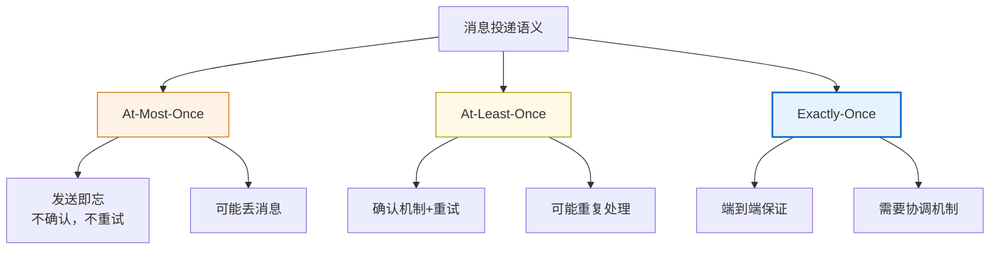
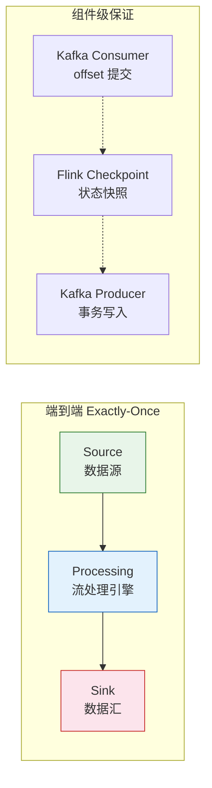
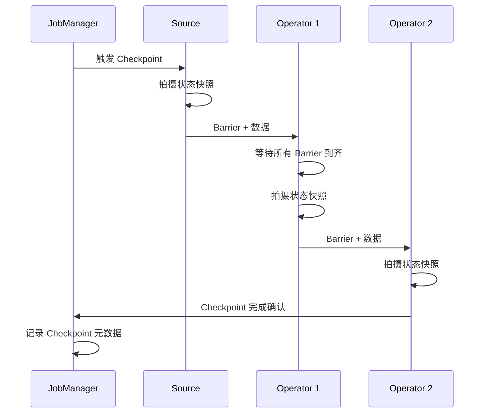
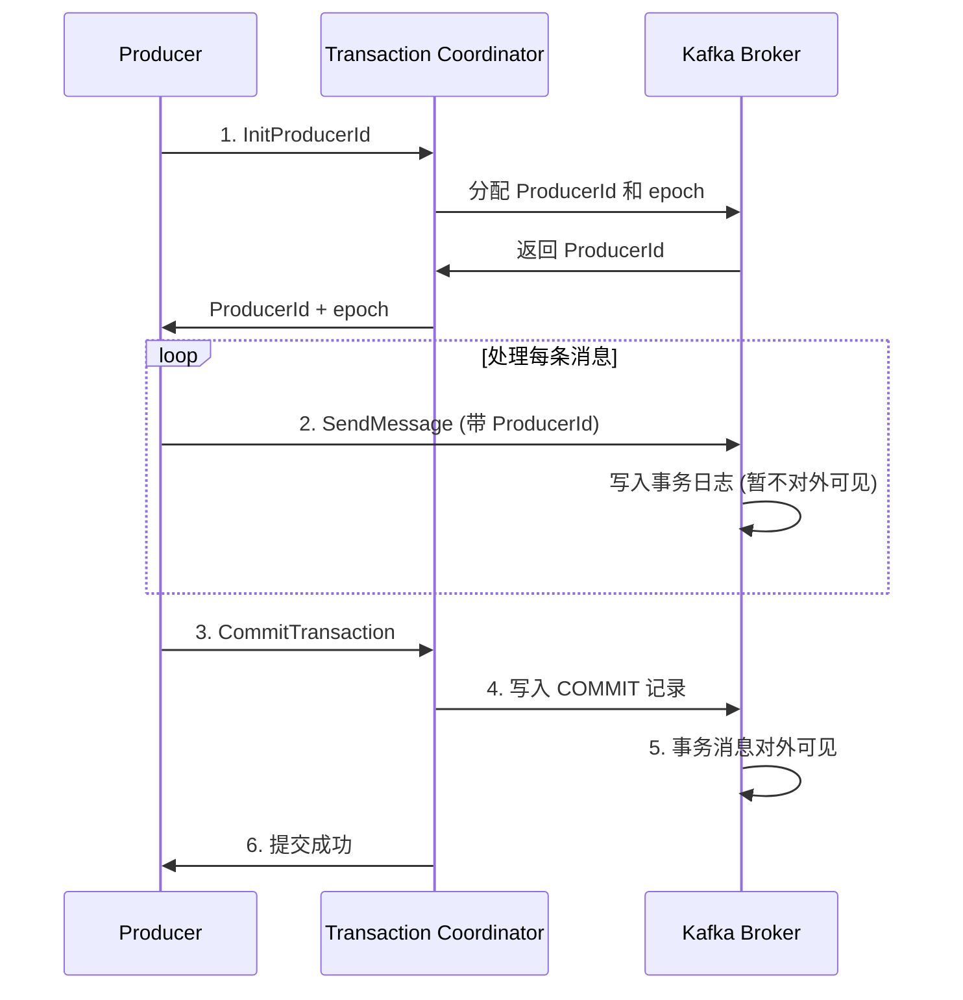
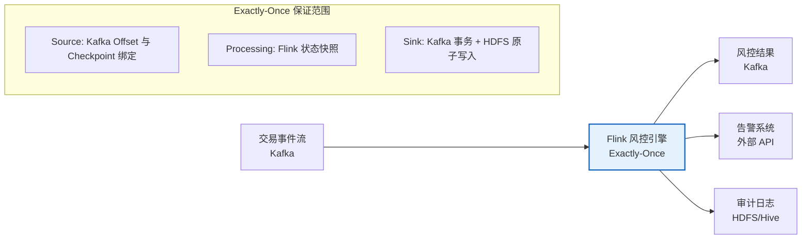
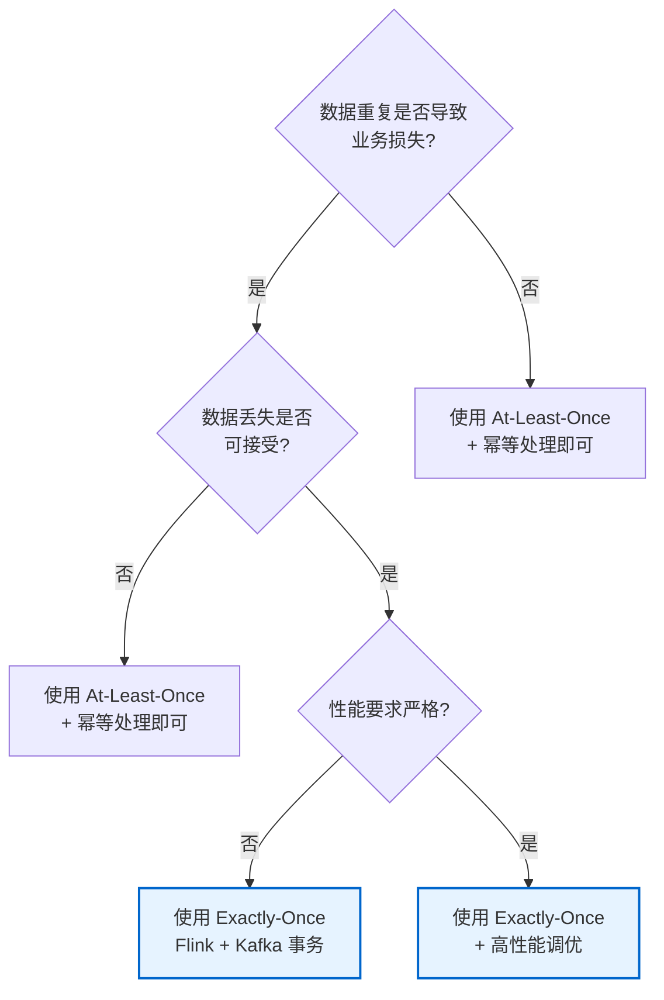

## Exactly-Once 语义

### 1. 概述与背景

#### 1.1 什么是 Exactly-Once 语义

Exactly-Once 语义（简称 EOS）是分布式系统中消息投递/处理保证的最高级别：**每条消息恰好被处理一次，不多也不少**。在实时计算领域，它是数据正确性的终极目标——既不丢失数据（At-Least-Once 的问题），也不重复处理数据（At-Most-Once 的问题）。

在金融交易、计费系统、实时监控等对数据准确性要求极高的场景中，Exactly-Once 语义直接决定了系统能否投入使用。一条交易被重复扣款、一条计费记录被多算一次，都可能造成严重的业务后果。

#### 1.2 为什么 Exactly-Once 如此困难

分布式系统天然面临网络不可靠、进程可能崩溃、机器可能宕机等问题。在网络通信模型中，Fischer-Lynch-Paterson（FLP）不可能定理已经证明：在异步系统中，即使只有一个节点可能故障，也无法保证达成确定性共识。

对于消息投递而言，核心矛盾在于：**发送方无法确认接收方是否成功处理了消息**。如果发送方超时重试，可能消息已经成功处理，导致重复；如果不重试，可能消息确实没有送达，导致丢失。这个"发送方不确定性"问题是一切投递语义问题的根源。

#### 1.3 三种投递语义对比

| 语义 | 保证 | 实现难度 | 典型场景 | 代价 |
|------|------|----------|----------|------|
| At-Most-Once | 消息最多处理一次，可能丢失 | 低 | 日志采集、监控指标采集 | 丢失数据 |
| At-Least-Once | 消息至少处理一次，可能重复 | 中 | 大多数消息队列默认行为 | 重复数据，需要幂等处理 |
| Exactly-Once | 消息恰好处理一次 | 高 | 金融交易、计费系统、状态一致性 | 性能开销、架构复杂度 |



### 2. 核心原理

#### 2.1 端到端 Exactly-Once vs 内部 Exactly-Once

理解 Exactly-Once 语义时，必须区分两个层次：

**内部 Exactly-Once（组件级）**：指流处理引擎内部的 exactly-once 保证。例如 Flink 在其算子之间的数据传输中通过 Barrier 和 Checkpoint 机制实现 exactly-once，但这只保证引擎内部的状态更新恰好执行一次。

**端到端 Exactly-Once（系统级）**：指从数据源到数据汇的完整链路中，每条消息恰好被处理一次并产生一次输出。这要求 Source、Processing、Sink 三个环节协同保证。



关键洞察：**没有任何单一组件能独立实现端到端的 Exactly-Once**。它需要 Source、Sink 和处理引擎三者的事务机制协同工作。

#### 2.2 实现 Exactly-Once 的三大支柱

**支柱一：幂等性（Idempotency）**

幂等性是指同一个操作执行多次与执行一次的效果相同。在数学上，如果 f(f(x)) = f(x)，则 f 是幂等的。

在消息处理中，如果消息本身携带唯一标识（Message ID），处理器可以在处理前检查该消息是否已被处理过。如果已处理，直接跳过。这是实现 Exactly-Once 最简单、最常用的方式。

```python
# 幂等处理器示例
class IdempotentProcessor:
    def __init__(self):
        self.processed_ids = set()  # 实际生产中用 Redis 或数据库
    
    def process(self, message):
        msg_id = message['id']
        if msg_id in self.processed_ids:
            return None  # 已处理过，跳过
        result = self._do_process(message)
        self.processed_ids.add(msg_id)
        return result
    
    def _do_process(self, message):
        # 实际业务处理逻辑
        pass
```

**支柱二：事务性写入（Transactional Write）**

事务性写入确保数据处理结果要么全部成功提交，要么全部回滚。在流处理中，这通常通过两阶段提交（2PC）或类似协议实现：

- 准备阶段：将处理结果暂存，不对外可见
- 提交阶段：原子性地将所有结果写入目标系统

**支柱三：状态快照与恢复（Snapshot & Recovery）**

通过定期对系统状态做快照，在故障发生时可以回滚到最近的一致性快照，然后从该快照点重新处理数据。Flink 的 Checkpoint 机制就是这一支柱的典型实现。

#### 2.3 消息去重的数学基础

从信息论角度看，实现 Exactly-Once 需要解决的核心问题是消息去重。去重的充要条件是：**每条消息必须携带全局唯一的标识符，且处理端必须维护已处理消息的记录**。

去重策略的时间-空间权衡：

| 策略 | 时间复杂度 | 空间复杂度 | 适用场景 |
|------|-----------|-----------|----------|
| 全量记录（Set） | O(1) 查找 | O(N) 存储所有ID | 短期窗口、小数据量 |
| 布隆过滤器（Bloom Filter） | O(k) 查找 | O(m) 位数组 | 大数据量、可接受极低误判率 |
| 时间窗口裁剪 | O(1) 查找 | O(W) 滑动窗口内ID | 有明确的消息保留策略 |
| 逻辑时钟/序号 | O(1) 比较 | O(1) 仅存储最新序号 | 消息天然有序的场景 |

```python
# 布隆过滤器去重示例
from pybloom_live import BloomFilter

class BloomIdempotentProcessor:
    def __init__(self, capacity=10_000_000, error_rate=0.001):
        self.bloom = BloomFilter(capacity=capacity, error_rate=error_rate)
    
    def is_duplicate(self, msg_id):
        if msg_id in self.bloom:
            return True  # 可能是重复（极小概率是误判）
        self.bloom.add(msg_id)
        return False
```

### 3. 主流框架的 Exactly-Once 实现

#### 3.1 Apache Flink：基于 Checkpoint 的 Exactly-Once

Flink 是目前流处理领域对 Exactly-Once 语义支持最完善的框架。其核心机制包括：

**Chandy-Lamport 分布式快照算法**

Flink 的 Checkpoint 机制基于 Chandy-Lamport 算法的变体。JobManager 定期向 Source 注入 Barrier（屏障），Barrier 沿着数据流拓扑向下游传播。当某个算子收到来自所有上游的 Barrier 时，它对自己的状态做快照。所有算子完成快照后，一次 Checkpoint 完成。



**Checkpoint 关键参数配置**：

| 参数 | 含义 | 推荐值 | 调优建议 |
|------|------|--------|----------|
| `execution.checkpointing.interval` | Checkpoint 间隔 | 1-10 分钟 | 越短恢复越快，但开销越大 |
| `execution.checkpointing.timeout` | 单次 Checkpoint 超时 | 10-30 分钟 | 与状态大小正相关 |
| `state.backend.incremental` | 增量 Checkpoint | true（ RocksDB） | 大状态场景必开 |
| `execution.checkpointing.max-concurrent` | 最大并发 Checkpoint 数 | 1 | 避免资源竞争 |

```java
// Flink Exactly-Once 配置示例
StreamExecutionEnvironment env = StreamExecutionEnvironment.getExecutionEnvironment();

// 启用 Checkpoint，间隔 5 分钟
env.enableCheckpointing(300_000, CheckpointingMode.EXACTLY_ONCE);

// 配置 RocksDB 增量 Checkpoint
env.setStateBackend(new EmbeddedRocksDBStateBackend(true));

// Checkpoint 存储到 HDFS
env.getCheckpointConfig().setCheckpointStorage("hdfs://cluster/checkpoints");

// 同一时间只允许一个 Checkpoint 进行
env.getCheckpointConfig().setMaxConcurrentCheckpoints(1);

// Checkpoint 失败容忍次数
env.getCheckpointConfig().setTolerableCheckpointFailureNumber(3);
```

**Flink 端到端 Exactly-Once 的完整链路**：

要实现端到端 Exactly-Once，需要三个环节协同：

1. **Source 端**：Kafka Source + Consumer Group Offset 提交与 Checkpoint 绑定
2. **处理引擎**：Flink Checkpoint 保证状态一致性
3. **Sink 端**：两阶段提交 Sink（如 Kafka Transactional Producer）

```java
// Flink + Kafka 端到端 Exactly-Once 完整示例
KafkaSource<String> source = KafkaSource.<String>builder()
    .setBootstrapServers("broker1:9092")
    .setTopics("input-topic")
    .setGroupId("flink-eos-group")
    .setStartingOffsets(OffsetsInitializer.committedOffsets(OffsetResetStrategy.EARLIEST))
    .setValueOnlyDeserializer(new SimpleStringSchema())
    .build();

KafkaSink<String> sink = KafkaSink.<String>builder()
    .setBootstrapServers("broker1:9092")
    .setRecordSerializer(...)
    .setDeliveryGuarantee(DeliveryGuarantee.EXACTLY_ONCE)
    .setTransactionalIdPrefix("flink-eos-")  // 事务ID前缀
    .build();

DataStream<String> stream = env.fromSource(
    source, WatermarkStrategy.noWatermarks(), "Kafka Source");

stream.map(new MyMapper())
      .sinkTo(sink);
```

#### 3.2 Apache Kafka：基于事务的 Exactly-Once

Kafka 从 0.11 版本开始引入事务（Transactional API），支持跨分区、跨 Topic 的原子性写入。

**Kafka 事务的工作原理**：



**Kafka 事务的关键概念**：

| 概念 | 说明 |
|------|------|
| ProducerId (PID) | Kafka 为每个事务 Producer 分配的唯一标识 |
| Epoch | 单调递增的时代号，用于防止过期 Producer 的写入 |
| Transaction Coordinator | 负责管理事务状态的 Broker 节点 |
| 事务日志 (__transaction_state) | 存储事务元数据的内部 Topic |
| 幂等 Producer | 通过 PID + Sequence Number 在单分区级别去重 |

**Kafka 幂等 Producer 与事务的区别**：

| 特性 | 幂等 Producer | 事务 Producer |
|------|--------------|---------------|
| 粒度 | 单个 Producer 实例 | 跨 Producer、跨分区 |
| 跨 Topic | 不支持 | 支持 |
| Consumer 端 | 需配合 `isolation.level=read_committed` | 需配合 `isolation.level=read_committed` |
| 性能 | 接近无事务的性能 | 有明显开销（约 10-20%） |
| 适用场景 | 单 Producer 重试场景 | 消费-处理-生产（consume-transform-produce）模式 |

```java
// Kafka 事务 Producer 示例
Properties props = new Properties();
props.put("bootstrap.servers", "broker1:9092");
props.put("transactional.id", "my-transactional-id");
props.put("enable.idempotence", true);
props.put("acks", "all");
props.put("isolation.level", "read_committed");

KafkaProducer<String, String> producer = new KafkaProducer<>(props);
producer.initTransactions();

try {
    producer.beginTransaction();
    
    // 从 Source 读取消息
    ConsumerRecords<String, String> records = consumer.poll(Duration.ofMillis(100));
    
    for (ConsumerRecord<String, String> record : records) {
        // 处理消息
        String result = process(record.value());
        // 写入目标 Topic
        producer.send(new ProducerRecord<>("output-topic", record.key(), result));
    }
    
    // 原子性提交：同时提交消费位移和生产结果
    producer.sendOffsetsToTransaction(
        currentOffsets(records), consumer.groupMetadata());
    producer.commitTransaction();
    
} catch (Exception e) {
    producer.abortTransaction();
}
```

#### 3.3 Apache Spark Structured Streaming

Spark Structured Streaming 通过 WAL（预写日志）和 Micro-batch 机制实现 Exactly-Once：

```python
# Spark Structured Streaming Exactly-Once 配置
spark = SparkSession.builder \
    .appName("EOS Example") \
    .config("spark.sql.streaming.checkpointLocation", "/checkpoint/path") \
    .config("spark.sql.streaming.stateStore.providerClass",
            "org.apache.spark.sql.execution.streaming.state.HDFSBackedStateStoreProvider") \
    .getOrCreate()

df = spark.readStream \
    .format("kafka") \
    .option("kafka.bootstrap.servers", "broker1:9092") \
    .option("subscribe", "input-topic") \
    .load()

result = df.selectExpr("CAST(value AS STRING)") \
    .groupBy("value") \
    .count()

result.writeStream \
    .format("kafka") \
    .option("kafka.bootstrap.servers", "broker1:9092") \
    .option("topic", "output-topic") \
    .option("checkpointLocation", "/checkpoint/path") \
    .outputMode("update") \
    .start()
```

**Spark vs Flink 的 Exactly-Once 差异**：

| 对比维度 | Spark Structured Streaming | Apache Flink |
|----------|---------------------------|--------------|
| 执行模型 | Micro-batch（微批） | 连续流 + 按需微批 |
| 延迟下限 | ~100ms（微批间隔） | ~1ms（逐条处理） |
| 状态管理 | 有限（基于 RocksDB/内存） | 丰富（多种 State Backend） |
| Checkpoint 机制 | WAL + HDFS | Chandy-Lamport 分布式快照 |
| 端到端 EOS | 需配合 Kafka 事务 | 原生支持两阶段提交 Sink |
| 精确一次开销 | 较高（整个微批重算） | 较低（增量 Checkpoint） |

### 4. 两阶段提交协议详解

两阶段提交（2PC）是实现端到端 Exactly-Once 的核心协议，理解它对于掌握整个语义体系至关重要。

#### 4.1 协议流程

```mermaid
graph TD
    subgraph 阶段一：准备阶段
        A[协调者发起 Prepare] --> B[参与者1: 预写数据+锁定资源]
        A --> C[参与者2: 预写数据+锁定资源]
        B --> D{所有参与者就绪?}
        C --> D
    end
    
    subgraph 阶段二：提交阶段
        D -->|是| E[协调者发送 Commit]
        D -->|否| F[协调者发送 Rollback]
        E --> G[参与者1: 正式提交]
        E --> H[参与者2: 正式提交]
        F --> I[参与者1: 回滚]
        F --> J[参与者2: 回滚]
    end
    
    style D fill:#fff3e6,stroke:#cc6600,stroke-width:2px
```

#### 4.2 在流处理中的应用

以 Flink + Kafka 为例，两阶段提交的完整流程：

**阶段一（Barrier 对齐 + 预提交）**：
1. Flink 开始一次 Checkpoint
2. 算子处理数据，将结果通过 Kafka Transactional Producer 写入（此时事务未提交，消息不可见）
3. Checkpoint 完成时，Flink 记录所有正在进行的 Kafka 事务 ID

**阶段二（正式提交 / 回滚）**：
1. 下一次 Checkpoint 成功后，Flink 正式提交上一次 Checkpoint 中的所有 Kafka 事务
2. 如果 Checkpoint 失败，Flink 回滚所有相关 Kafka 事务
3. 恢复时，Flink 回滚到上一次成功的 Checkpoint，然后重新处理数据

```java
// Flink 两阶段提交 Sink 自定义实现示例
public class TwoPhaseCommitSinkFn<T> extends TwoPhaseCommitSinkFunction<T, Void, Void> {
    
    private transient KafkaProducer<String, String> producer;
    private transient List<KafkaTransaction<Void, Void>> pendingTransactions;
    
    @Override
    protected void invoke(Void transaction, T value, Context context) {
        // 在当前事务中写入 Kafka
        producer.send(new ProducerRecord<>(outputTopic, null, serialize(value)));
    }
    
    @Override
    protected Void beginTransaction() throws Exception {
        // 开始新事务
        producer.beginTransaction();
        return null;
    }
    
    @Override
    protected void preCommit(Void transaction) throws Exception {
        // 预提交：刷新缓冲但不关闭事务
        producer.flush();
        pendingTransactions.add(new KafkaTransaction<>(transaction));
    }
    
    @Override
    protected void commit(Void transaction) {
        // 正式提交
        producer.commitTransaction();
    }
    
    @Override
    protected void abort(Void transaction) {
        // 回滚
        producer.abortTransaction();
    }
}
```

#### 4.3 2PC 的缺陷与改进

2PC 并非完美方案，它存在以下已知问题：

| 问题 | 描述 | 影响 | 改进方案 |
|------|------|------|----------|
| 阻塞问题 | 协调者宕机后参与者一直锁定资源 | 可用性下降 | 3PC、Paxos 变种 |
| 单点故障 | 协调者是单点 | 整体不可用 | Raft 多副本协调者 |
| 性能开销 | 两次网络往返 + 资源锁定 | 延迟增加 | 异步提交优化 |
| 数据不一致窗口 | 阶段一和阶段二之间存在不一致窗口 | 短暂数据不可见 | 业务层容忍 |

### 5. 实际应用场景

#### 5.1 金融交易流水处理

在金融场景中，每笔交易必须被精确处理一次。典型的实时风控系统架构：



**关键设计要点**：

- 幂等风控规则：同一笔交易多次触发风控，结果一致
- 外部 API 调用需要包装在幂等逻辑中（用交易号做去重）
- 审计日志使用 HDFS 的原子写入或 Kafka 事务写入

#### 5.2 实时 ETL 数据管道

从 OLTP 数据库实时同步数据到数据湖的场景：

```python
# Debezium + Flink 实现端到端 Exactly-Once ETL
# Flink SQL 配置示例
"""
CREATE TABLE cdc_source (
    user_id BIGINT,
    order_id BIGINT,
    amount DECIMAL(10,2),
    event_time TIMESTAMP(3),
    WATERMARK FOR event_time AS event_time - INTERVAL '5' SECOND
) WITH (
    'connector' = 'kafka',
    'topic' = 'db-cdc-orders',
    'properties.bootstrap.servers' = 'broker:9092',
    'properties.group.id' = 'flink-etl-group',
    'scan.startup.mode' = 'group-offsets',
    'format' = 'debezium-json'
);

CREATE TABLE data_lake_sink (
    user_id BIGINT,
    order_id BIGINT,
    amount DECIMAL(10,2),
    dt STRING,
    PRIMARY KEY (user_id, order_id) NOT ENFORCED
) WITH (
    'connector' = 'upsert-kafka',
    'topic' = 'data-lake-orders',
    'properties.bootstrap.servers' = 'broker:9092',
    'format' = 'json',
    'sink.delivery-guarantee' = 'exactly-once'
);

INSERT INTO data_lake_sink
SELECT user_id, order_id, amount,
       DATE_FORMAT(event_time, 'yyyy-MM-dd') as dt
FROM cdc_source;
"""
```

#### 5.3 实时特征计算

在推荐系统和机器学习中，实时特征的准确性直接影响模型效果：

- 用户实时点击流 → 统计特征（最近1小时点击次数、点击率）
- 特征值如果被重复计算，会导致模型输入偏差
- 使用 Flink 的 Keyed State + Exactly-Once 保证特征计算的准确性

### 6. 常见误区与最佳实践

#### 6.1 五大常见误区

**误区一：认为 Kafka 幂等 Producer 就是 Exactly-Once**

Kafka 幂等 Producer 只保证单个 Producer 实例在单分区级别的 exactly-once。如果 Producer 崩溃重启后重新发送同一批消息，或者涉及跨分区写入，幂等性不成立。要实现真正的 Exactly-Once，必须使用 Kafka 事务 API。

**误区二：忽略消费端的幂等性**

即使流处理引擎保证了 Exactly-Once，如果下游系统（数据库、API）不支持幂等操作，端到端的 Exactly-Once 仍然无法实现。例如，向一个不支持幂等的 REST API 发送通知，重复调用就会产生重复通知。

**误区三：将 Exactly-Once 等同于零延迟**

Exactly-Once 需要额外的协调开销（Checkpoint、事务提交、状态快照），这些都会增加处理延迟。在延迟敏感的场景中，需要在一致性和延迟之间做出权衡。

**误区四：认为 Exactly-Once 可以处理所有故障场景**

Exactly-Once 语义在以下场景仍然可能失效：
- 处理引擎和外部系统同时故障（脑裂）
- 外部系统不支持事务（如写入 S3 的非事务接口）
- 时钟偏差导致的窗口计算不确定性

**误区五：忽视 Checkpoint 的性能影响**

Checkpoint 频率过高会导致性能下降，频率过低会导致恢复时间变长。需要根据实际的状态大小和延迟要求找到平衡点。

#### 6.2 最佳实践清单

| 实践 | 说明 | 重要程度 |
|------|------|----------|
| 使用幂等设计作为第一道防线 | 即使引擎支持 EOS，业务层仍应设计幂等逻辑 | ⭐⭐⭐⭐⭐ |
| 合理设置 Checkpoint 间隔 | 权衡恢复时间与性能开销 | ⭐⭐⭐⭐⭐ |
| 使用增量 Checkpoint | 大状态场景下大幅减少 Checkpoint 时间 | ⭐⭐⭐⭐ |
| 监控 Checkpoint 指标 | 关注 Checkpoint 耗时、失败率、状态大小 | ⭐⭐⭐⭐ |
| 设计可恢复的外部系统 | 下游存储应支持事务或幂等写入 | ⭐⭐⭐⭐ |
| 避免外部副作用 | 将外部 API 调用包装在可重试的逻辑中 | ⭐⭐⭐ |
| 进行故障注入测试 | 定期模拟节点宕机、网络分区，验证 EOS 保证 | ⭐⭐⭐ |

### 7. 性能影响与权衡

#### 7.1 Exactly-Once 的代价

实现 Exactly-Once 语义不可避免地带来性能开销：

| 开销来源 | 量化影响 | 优化手段 |
|----------|----------|----------|
| Checkpoint 状态快照 | 增加 10-30% 延迟 | 增量 Checkpoint、异步快照 |
| Kafka 事务协调 | 增加 10-20% 吞吐开销 | 批量事务、减少事务粒度 |
| 幂等状态存储 | 额外内存/磁盘占用 | 布隆过滤器、TTL 过期清理 |
| 两阶段提交 | 增加一次网络往返 | 异步提交、Pipeline 化 |

#### 7.2 何时不需要 Exactly-Once

并非所有场景都需要追求 Exactly-Once。以下场景可以使用更轻量的保证：

- **日志采集**：少量丢失或重复可以接受，使用 At-Most-Once 或 At-Least-Once 即可
- **实时监控指标**：聚合统计类指标对单条数据的重复不敏感
- **非关键数据管道**：数据可以通过下游对账机制修复的场景

选择投递语义时的决策框架：



### 8. 前沿进展

#### 8.1 从 Exactly-Once 到 Effectively-Exactly-Once

在实际工程中，严格的 Exactly-Once 很难在所有环节实现（特别是涉及外部系统时）。因此业界逐渐接受 "Effectively-Exactly-Once" 的概念——通过幂等性+去重+对账机制，在业务层面达到与 Exactly-Once 相同的效果，而不要求底层每个环节都严格保证。

#### 8.2 基于 Chandy-Lamport 的轻量化实现

传统的分布式快照算法开销较大，近年来的研究方向包括：
- **增量快照**：只记录状态的变化量而非全量状态
- **异步快照**：快照过程不阻塞数据处理
- **自适应快照**：根据系统负载动态调整快照频率

#### 8.3 云原生流处理中的 Exactly-Once

云原生架构为 Exactly-Once 带来了新的可能性：
- **Serverless 流处理**（如 AWS Lambda + DynamoDB Streams）：通过云服务内置的事务机制实现 EOS
- **共享存储架构**：计算与存储分离后，可以通过共享存储的一致性快照简化协调流程
- **持久化消息队列**：Pulsar 等新一代消息系统通过分层架构优化了事务性能

### 9. 本节小结

Exactly-Once 语义是实时计算正确性的基石。理解它需要把握以下关键点：

1. **本质是分布式一致性问题**：在网络不可靠的分布式系统中实现精确一次处理，本质上是在解决一致性与可用性的权衡
2. **三大支柱缺一不可**：幂等性、事务性写入、状态快照与恢复，三者共同构成了 Exactly-Once 的完整保证
3. **端到端 vs 组件级**：单一组件的 Exactly-Once 不等于端到端的 Exactly-Once，需要 Source-Processing-Sink 全链路协同
4. **没有免费的午餐**：Exactly-Once 有明确的性能代价，需要根据业务需求做出合理选择
5. **幂等性是万能后备**：即使底层框架不支持 EOS，良好的幂等设计也能在业务层面达到类似效果
