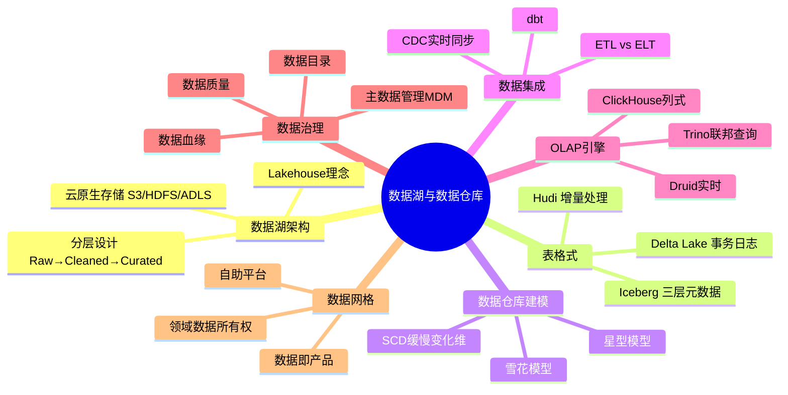
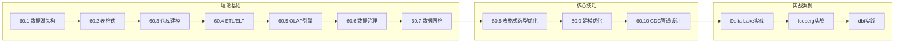

## 第60章 数据湖与数据仓库——章节概览

### 为什么需要这一章

数据是现代企业的核心资产，但"有数据"和"能用好数据"之间隔着一道巨大的鸿沟。大多数企业的数据散落在数十个业务系统中——MySQL里的订单、MongoDB里的用户画像、Kafka里的行为日志、Excel里的财务报表——格式不一、口径不同、更新频率各异。数据仓库试图用统一的Schema将结构化数据整合到一起，但面对半结构化（JSON、日志）和非结构化数据（图片、文本）时力不从心；数据湖承诺"先存再说"，却因为缺乏事务支持和质量管控，往往退化为无人问津的"数据沼泽"。

本章的核心命题是：**如何在低成本存储海量异构数据的同时，保证数据的可靠性、可查询性和可治理性？** 围绕这个问题，我们将从数据湖的分层架构出发，逐一剖析表格式（Delta Lake / Iceberg / Hudi）、数据仓库建模、ETL/ELT、OLAP引擎、数据治理和数据网格等关键技术，最终构建一套完整的现代数据架构知识体系。

### 章节定位与知识地图

本章是"软件工程核心原理"中数据架构方向的专题章节，适合以下读者：

| 读者类型 | 阅读重点 | 收获 |
|---------|---------|------|
| 后端工程师 | 表格式选型、CDC管道、OLAP引擎 | 掌握从OLTP到OLAP的数据链路搭建 |
| 数据工程师 | 数据湖分层、ETL/ELT、dbt实践 | 能独立设计和维护数据管道 |
| 数据分析师 | 星型模型、OLAP操作、数据质量 | 理解数据从哪里来、怎么用 |
| 架构师 | Lakehouse架构、数据网格、治理框架 | 具备企业级数据架构设计能力 |
| 技术管理者 | 方案选型框架、ROI分析 | 做出合理的技术决策 |

### 本章内容路线图

### 六大核心主题一览

**1. 数据湖架构与Lakehouse**——解决"数据存哪里、怎么存"的问题。数据湖按处理阶段分为三层：Raw（原始数据）→ Cleaned（清洗数据）→ Curated（精炼数据）。Lakehouse通过在对象存储上叠加元数据层（表格式），消除了数据湖与数据仓库之间的ETL，实现"一份数据，多种引擎"。

**2. 数据湖表格式**——解决"数据湖如何保证数据质量"的问题。Delta Lake（Databricks）、Apache Iceberg（Netflix）、Apache Hudi（Uber）三大表格式各有侧重：Delta Lake以事务日志为核心，适合Spark/Databricks生态；Iceberg以开放标准和三层元数据为特色，多引擎兼容性最好；Hudi针对增量数据处理优化，COW/MOR两种模式灵活应对读写比例。

**3. 数据仓库建模**——解决"分析数据怎么组织"的问题。星型模型（事实表+维度表）是主流选择，雪花模型适合对存储敏感的场景。SCD Type 2是维度历史管理的标准方案。数据仓库分层设计（ODS→DWD→DWS→ADS）让数据加工过程清晰可控。

**4. ETL/ELT与dbt**——解决"数据怎么流转"的问题。从传统ETL（在中间服务器转换）到现代ELT（在目标系统转换），核心变化是利用数据湖/云数仓的计算能力。dbt用SQL定义转换逻辑，带来版本控制、自动测试和文档生成。

**5. OLAP引擎**——解决"数据怎么分析"的问题。ClickHouse追求极致查询性能，Apache Druid支持实时摄入+亚秒查询，Trino/Presto实现跨数据源联邦查询。三者各有适用场景，不存在"一个引擎解决所有问题"。

**6. 数据治理与数据网格**——解决"数据怎么管"的问题。数据目录（可发现）、数据血缘（可追溯）、数据质量（可信赖）、主数据管理（一致性）构成治理的四大支柱。数据网格则从组织架构层面重新定义数据责任——由中央团队集中管理转向领域团队自治管理。

### 前置知识

阅读本章前，建议具备以下基础：

| 知识领域 | 具体要求 | 不具备怎么办 |
|---------|---------|-------------|
| SQL基础 | 能读懂和编写SELECT/JOIN/GROUP BY | 先阅读本书SQL相关章节 |
| 分布式系统基础 | 理解CAP定理、一致性模型 | 可先阅读本书分布式系统章节 |
| 大数据生态概念 | 了解Hadoop/Spark/Kafka的基本定位 | 无需深入，本章会做必要介绍 |
| Linux命令行 | 能执行基本的Shell命令 | 实战案例部分需要 |

### 学习建议

**入门路线（2-3天）**：60.1 数据湖架构 → 60.3 仓库建模 → 60.5 OLAP引擎 → 60.6 数据治理。掌握核心概念后，能参与数据架构讨论。

**进阶路线（1-2周）**：按顺序完整阅读理论基础部分 → 核心技巧部分 → 重点实战案例。能独立设计数据管道和建模方案。

**精通路线（持续实践）**：理论+技巧全部掌握后，重点研读实战案例，动手搭建完整的数据湖环境。关注表格式源码和OLAP引擎内部机制。

> **提示**：本章的"理论基础"和"核心技巧"位于 `content/docs/engineering/第60章-数据湖与数据仓库/_index.md` 中，包含完整的7个理论小节和3个技巧小节。"实战案例"和"常见误区"分别在独立子目录中。
