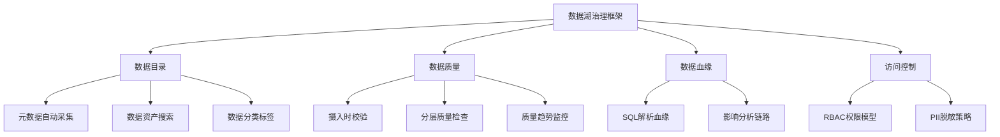
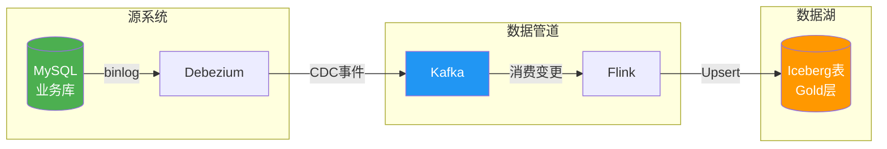
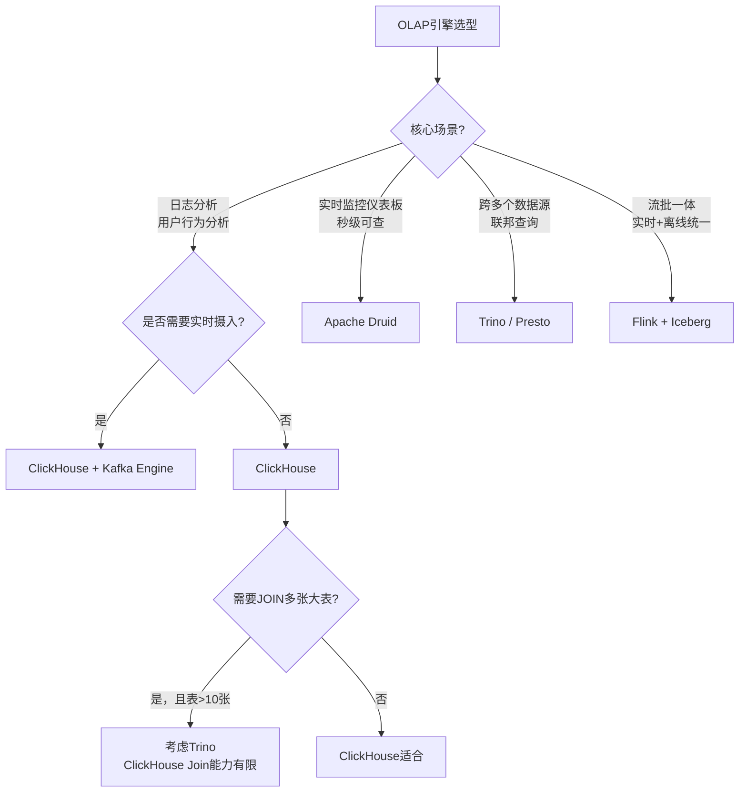
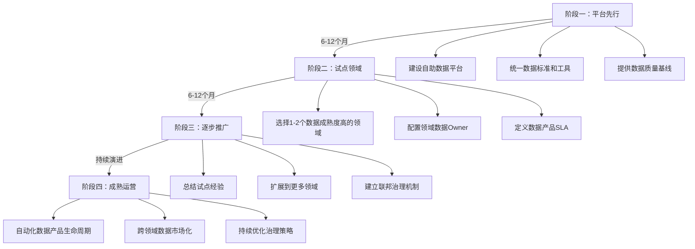

# 数据湖与数据仓库常见误区

数据湖与数据仓库的建设是一项复杂的系统工程，从架构选型、建模设计到数据治理，每个环节都有容易踩的坑。本节梳理实战中最典型的十大误区——每个误区都给出"错误做法 → 为什么错 → 正确做法"的完整分析，帮助读者少走弯路。

---

## 误区一：建好数据湖就万事大吉，放任沦为"数据沼泽"

**错误做法：** 团队投入大量资源搭建了基于S3/HDFS的数据湖，把各业务系统的数据灌进去，然后就不再管了——没有元数据管理，没有数据质量规则，没有命名规范。三个月后，数据湖里堆积了上万张表，没人知道每张表的含义、来源、更新频率。分析师找不到数据，工程师不敢删数据，数据湖变成了"数据沼泽"（Data Swamp）。

**为什么这是个常见错误：** 企业往往把数据湖当作"数据垃圾桶"——只要存进去就行。实际上，数据湖的价值不在于"存"，而在于"用"。没有治理的数据湖，存储成本不断攀升但数据利用率极低。Gartner曾预测，到2025年超过80%的数据湖将因缺乏治理而沦为数据沼泽。

**正确做法：** 数据湖建设必须"三分技术、七分治理"：



| 治理措施 | 具体动作 | 工具推荐 |
|---------|---------|---------|
| 数据目录 | 自动采集每张表的Schema、Owner、更新频率、数据量 | Apache Atlas、DataHub、AWS Glue Catalog |
| 命名规范 | 强制执行 `层级_域_表名` 命名规则（如 `gold.order_daily_summary`） | Pre-commit Hook + 命名校验脚本 |
| 数据质量 | 在Bronze/Silver/Gold各层设置质量检查点 | Great Expectations、dbt tests、Deequ |
| 数据血缘 | 追踪从源表到消费表的完整转换链路 | DataHub Lineage、OpenLineage |
| 数据生命周期 | 设置TTL策略，过期数据自动归档或清理 | Iceberg expire_snapshots、Delta VACUUM |

**关键原则：** 数据湖治理应该是"Day 1"任务，不是"Day 100"才想起来的事。在第一批数据进入数据湖之前，数据目录、命名规范和质量规则就必须就位。

---

## 误区二：建模过度规范化，把维度表拆成"雪花片片"

**错误做法：** 设计数据仓库时，严格遵循数据库第三范式（3NF），将产品维度表拆成产品表、品类表、品牌表、供应商表……每张维度表都有独立的代理键，查询一个简单的"按品牌统计销售额"需要JOIN五张表。结果是SQL复杂、查询性能差、维护成本高。

**为什么这是个常见错误：** 很多数据仓库工程师从关系型数据库（OLTP）转型而来，把OLTP的规范化思维带到了OLAP领域。在OLTP系统中，规范化是为了减少更新异常和数据冗余；但数据仓库是读密集型场景，查询性能和可理解性远比存储节省重要。

**正确做法：** 优先使用星型模型，而非雪花模型：

```sql
-- 错误：雪花模型（维度表被过度规范化）
-- 查询"按品牌统计销售额"需要4次JOIN
SELECT b.brand_name, SUM(f.total_amount)
FROM fact_sales f
JOIN dim_product p ON f.product_sk = p.product_sk
JOIN dim_category c ON p.category_sk = c.category_sk
JOIN dim_brand b ON c.brand_sk = b.brand_sk
GROUP BY b.brand_name;

-- 正确：星型模型（维度表保持扁平）
-- 品牌信息直接冗余在产品维度表中
SELECT p.brand, SUM(f.total_amount)
FROM fact_sales f
JOIN dim_product p ON f.product_sk = p.product_sk
GROUP BY p.brand;
```

**星型 vs 雪花模型决策：**

| 考量因素 | 星型模型 | 雪花模型 |
|---------|---------|---------|
| 查询性能 | 好（JOIN少） | 差（JOIN多） |
| 存储开销 | 稍高（维度冗余） | 低（规范化消除冗余） |
| 可理解性 | 高（直观易懂） | 低（需要理解表间关系） |
| 维护成本 | 低 | 高（多表同步更新） |
| 适用场景 | OLAP分析、BI报表 | 特殊合规要求（如数据不可冗余） |

**现代列式存储已经消解了冗余存储的顾虑。** ClickHouse、DuckDB等列式引擎天然支持高压缩比，维度表中的冗余字段经过列式压缩后，额外存储开销几乎可以忽略。在现代数据仓库中，星型模型是绝对的主流选择。

---

## 误区三：全量刷新替代增量更新，源系统不堪重负

**错误做法：** 每天凌晨通过 `SELECT * FROM source_table` 全量抽取业务数据库的数据，然后和目标表做全量比对后写入。当源表有数亿行记录时，全量抽取一次需要数小时，严重占用源数据库的连接和IO资源，导致业务系统在高峰期响应变慢。

**为什么这是个常见错误：** 全量抽取实现简单，不需要额外的CDC基础设施，所以在项目初期经常被采用。但随着数据量增长，全量抽取的弊端迅速放大——不仅耗时长、源系统压力大，还无法捕获DELETE操作（被删除的行不会出现在全量结果中）。

**正确做法：** 使用CDC（Change Data Capture）实现增量同步：



**CDC vs 全量刷新对比：**

| 维度 | 全量刷新 | CDC增量同步 |
|------|---------|------------|
| 源系统压力 | 高（大查询锁表） | 低（读binlog，异步） |
| 数据延迟 | 小时级 | 秒级 |
| DELETE捕获 | 不支持 | 支持 |
| 实现复杂度 | 低 | 中等（需要Debezium+Kafka） |
| 数据量敏感度 | 线性增长 | 几乎不受影响 |
| 适用规模 | <1000万行 | 任意规模 |

**CDC数据管道关键配置：**

```python
# Debezium全量+增量模式配置
debezium_config = {
    "snapshot.mode": "initial",  # 首次运行全量快照
    # 后续自动切换为增量模式（读binlog）
    "snapshot.locking.mode": "minimal",  # 全量快照时最小锁持有时间
    "heartbeat.interval.ms": "10000",  # 心跳间隔，防止长时间无变更时连接超时
    "tombstones.on.delete": "true",  # 生成tombstone消息，下游可感知DELETE
}
```

**注意：** CDC并非万能方案。如果源系统没有变更日志（如某些SaaS API只提供全量导出），或者数据变更频率极低（如年维度表），全量刷新反而是更简单合理的选择。选择方案时要根据实际场景权衡。

---

## 误区四：小文件问题视而不见，查询性能急剧恶化

**错误做法：** 使用Flink流式写入Iceberg表时，每次微批写入都生成一个小文件（几KB到几MB）。运行一周后，表中积累了数万个小文件。Spark查询时需要打开所有文件的元数据，光是文件列举就花了几十秒，实际数据扫描只用了几秒。

**为什么这是个常见错误：** 小文件问题在批处理场景中不太明显（一次写入一个大文件），但在流式写入和频繁微批更新场景中是致命的。很多人在架构设计时只关注功能实现，忽略了文件粒度对查询性能的影响。

**正确做法：** 三管齐下解决小文件问题：

**策略一：写入端控制——减少文件产生**

```python
# Spark写入时增加批量大小，减少文件数量
spark.conf.set("spark.sql.shuffle.partitions", "200")  # 控制并行度
# 写入前按目标文件大小重分区
df.repartition(ceil(num_rows / target_rows_per_file)).writeTo("db.table").append()
```

**策略二：定期Compaction——合并小文件**

```sql
-- Delta Lake: OPTIMIZE合并小文件
OPTIMIZE delta.`/data/table`
WHERE date >= '2024-06-01';  -- 可以只优化特定分区

-- Z-Order多维聚簇优化
OPTIMIZE delta.`/data/table` ZORDER BY (user_id, event_date)

-- Iceberg: 重写数据文件
CALL system.rewrite_data_files(
  table => 'db.table',
  options => map('target-file-size-bytes', '134217728')  -- 128MB目标文件大小
)

-- Iceberg: 重写清单文件（减少元数据文件数量）
CALL system.rewrite_manifests(table => 'db.table')
```

**策略三：自动文件大小管理——Hudi内置方案**

```java
// Hudi配置自动Compaction
hoodie.compact.inline=true
hoodie.compact.inline.max.delta.commits=5  // 每5次增量提交自动触发Compaction
hoodie.table.file.format=PARQUET
```

**小文件问题诊断SQL：**

```sql
-- 检查表中的文件大小分布
SELECT 
    CASE 
        WHEN file_size < 1048576 THEN '<1MB'
        WHEN file_size < 134217728 THEN '1MB-128MB'
        ELSE '>128MB'
    END as size_bucket,
    COUNT(*) as file_count,
    SUM(file_size) / 1073741824.0 as total_size_gb
FROM table_files('db.my_table')
GROUP BY 1
ORDER BY 1;
```

**经验法则：** 数据湖表的目标文件大小为128MB-256MB。小于1MB的文件应被视为异常，需要立即Compaction。监控小文件数量应作为数据湖运维的核心指标之一。

---

## 误区五：OLAP引擎拍脑袋选型，用ClickHouse干Trino的活

**错误做法：** 团队决定上OLAP引擎时，听说ClickHouse性能很强就直接选了ClickHouse。结果业务需求是"跨5个MySQL库做联邦查询"，ClickHouse无法直接查询外部MySQL数据，不得不先把所有数据ETL到ClickHouse中，数据同步管道变得极其复杂。

**为什么这是个常见错误：** OLAP引擎选型容易被"性能跑分"误导。ClickHouse在基准测试中的确很快，但它的优势场景是单表或少量表的聚合分析。不同OLAP引擎的设计目标完全不同，选型必须匹配业务场景。

**正确做法：** 根据核心场景选择OLAP引擎：



| 业务场景 | 推荐引擎 | 原因 |
|---------|---------|------|
| 电商用户行为分析（PB级日志） | ClickHouse | 列式存储+向量化执行，单表聚合极致快 |
| 双十一大屏实时交易监控 | Apache Druid | 支持从Kafka秒级摄入，亚秒级查询 |
| 跨MySQL+Hive+MongoDB联合分析 | Trino | 联邦查询能力，一条SQL跨多数据源 |
| 实时ETL + 离线报表统一 | Flink + Iceberg | 流批一体架构 |
| 嵌入式轻量OLAP | DuckDB / ClickHouse Local | 无需部署服务，进程内查询 |
| 多租户SaaS数据分析 | StarRocks | 支持资源隔离和多租户 |

**特别提醒：** ClickHouse的Join能力是其短板。当需要频繁做10+张大表的复杂Join时，ClickHouse的性能优势会被Join开销抵消。此时Trino或StarRocks可能是更好的选择。选型前一定要用真实数据和真实查询做POC验证，不要只看基准测试。

---

## 误区六：数据治理流于形式，建了目录没人用

**错误做法：** 团队搭建了Apache Atlas数据目录，要求所有表必须填写Owner、Description和标签。但三个月后发现：一半的表Owner字段填的是"admin"，Description都是"测试表"或"临时表"，标签全是随意填写的。数据目录成了摆设，分析师依然靠"问同事"找数据。

**为什么这是个常见错误：** 数据治理被认为是"额外工作"而非"核心能力"。如果治理工具不好用、治理流程太重、治理收益不明确，团队自然会敷衍了事。形式化的数据治理比没有治理更糟糕——它给人一种"我们有治理"的虚假安全感。

**正确做法：** 让治理"自动生成"而非"人工填写"：

```python
# 通过代码自动采集元数据，而非依赖人工填写
# 示例：使用dbt + DataHub自动发布元数据
import datahub.emitter.mce_builder as builder
from datahub.emitter.rest_emitter import DatahubRestEmitter

# dbt运行后自动发布表级元数据
emitter = DatahubRestEmitter("http://datahub:8080")

# 自动从dbt manifest.json提取元数据
def emit_metadata(dbt_model):
    dataset_urn = builder.make_dataset_urn(
        platform="snowflake",
        name=f"{dbt_model.database}.{dbt_model.schema}.{dbt_model.name}"
    )
    
    # 自动采集：Schema、Owner（从dbt的meta字段读取）、更新时间
    metadata = builder.make_metadata_change_event_v2(
        entityUrn=dataset_urn,
        aspectName="datasetProperties",
        aspect={
            "description": dbt_model.description,  # 从SQL注释自动提取
            "customProperties": {
                "owner": dbt_model.meta.get("owner"),
                "freshness": dbt_model.meta.get("freshness"),
                "tier": dbt_model.meta.get("tier", "bronze"),
            }
        }
    )
    emitter.emit(metadata)
```

**数据治理落地的关键：**

| 原则 | 具体做法 |
|------|---------|
| 自动化优先 | 元数据通过代码自动采集，不依赖人工填写 |
| 嵌入工作流 | 治理检查嵌入CI/CD——PR提交时自动校验Schema规范 |
| 价值可见 | 每周展示治理成果：数据发现问题数、血缘覆盖率、质量达标率 |
| 渐进式推进 | 先治理核心数据域（如订单、用户），再逐步扩展 |
| 利益绑定 | 将数据质量指标与团队OKR挂钩，治理不是"别人的事" |

---

## 误区七：ETL管道只管"跑通"，不考虑失败恢复

**错误做法：** ETL管道设计时只考虑了"happy path"——数据顺利从A到B的正常流程。没有设计幂等性、没有重试机制、没有死信队列。结果是：Kafka消费超时导致数据丢失；网络抖动导致部分写入成功部分失败；异常数据导致管道崩溃后需要人工介入才能恢复。

**为什么这是个常见错误：** ETL管道的失败场景远多于成功场景——网络分区、上游数据格式变更、目标表Schema不匹配、资源不足、并发冲突……如果只处理正常流程，管道迟早会挂。

**正确做法：** 构建容错的ETL管道，遵循"四个必须"：

**必须一：幂等性——同一批数据重复处理不会产生副作用**

```python
# 使用Iceberg的MERGE操作实现幂等写入
MERGE INTO target_table t
USING source_view s ON t.order_id = s.order_id
WHEN MATCHED THEN UPDATE SET
    t.amount = s.amount,
    t.update_time = s.update_time
WHEN NOT MATCHED THEN INSERT VALUES (
    s.order_id, s.amount, s.update_time
);
-- 无论执行多少次，结果都一致
```

**必须二：重试机制——临时故障自动恢复**

```python
import tenacity

@tenacity.retry(
    stop=tenacity.stop_after_attempt(3),
    wait=tenacity.wait_exponential(multiplier=1, min=2, max=30),
    retry=tenacity.retry_if_exception_type((IOError, TimeoutError)),
)
def write_to_data_lake(batch):
    """写入数据湖，临时故障自动重试3次"""
    iceberg_table.append(batch)
```

**必须三：死信队列——异常数据隔离处理**

```python
# Flink消费Kafka数据时的错误处理
try:
    process_record(record)
except DataValidationError as e:
    # 校验失败的数据发送到死信Topic
    kafka_producer.send("dlq.order_events", record)
    log.warning(f"记录进入死信队列: {e}")
except Exception as e:
    # 未知异常，记录后跳过，避免阻塞管道
    log.error(f"处理失败: {e}", exc_info=True)
```

**必须四：检查点——管道可以从断点恢复**

```python
# Flink检查点配置
env.enableCheckpointing(60000)  # 每60秒做一次检查点
env.getCheckpointConfig().setCheckpointingMode(CheckpointingMode.EXACTLY_ONCE)
env.getCheckpointConfig().setMinPauseBetweenCheckpoints(30000)
env.getCheckpointConfig().setTolerableCheckpointFailureNumber(3)
# 管道崩溃后从最近的检查点恢复，不丢数据
```

---

## 误区八：数据分层形同虚设，所有SQL都在"一张表"上跑

**错误做法：** 虽然建了数据湖分层架构（Bronze/Silver/Gold），但实际开发中分析师直接查询Bronze层的原始数据，用复杂的CASE WHEN和子查询在一条SQL中完成清洗、转换和聚合。结果是SQL长达几百行，每次执行扫描TB级数据，查询超时。

**为什么这是个常见错误：** "一步到位"比"层层递进"看起来更快。当业务方催着要数据时，工程师倾向于跳过分层直接在原始数据上写复杂查询。但这种做法牺牲了可维护性、可复用性和查询性能。

**正确做法：** 严格遵守分层原则，每层职责清晰：

数据仓库分层模型：

  ODS层（原始数据）      保持源系统结构，不做任何处理
       │
       ▼  清洗、去重、格式标准化
  DWD层（明细数据）      明细粒度的事实表，清洗完成
       │
       ▼  按业务主题聚合
  DWS层（汇总数据）      面向分析的宽表和汇总表
       │
       ▼  面向报表和应用
  ADS层（应用数据）      直接供前端消费的报表数据

| 分层 | 数据粒度 | 典型表 | 查询频率 | 数据量级 |
|------|---------|--------|---------|---------|
| ODS | 源系统原样 | orders_raw, users_raw | 极少（仅追溯用） | 最大 |
| DWD | 业务过程明细 | fact_order_detail | 中等（分析师使用） | 中等 |
| DWS | 主题汇总 | dws_daily_sales | 高（报表使用） | 较小 |
| ADS | 报表应用 | ads_monthly_revenue | 极高（前端直查） | 最小 |

**分层的价值：** 同一个"月度销售额"指标，如果在DWS层已经预计算好了，前端查询只需要 `SELECT * FROM dws_monthly_sales WHERE month='2024-06'`，扫描几MB数据就能返回结果。如果在ODS层现算，需要扫描全部订单明细（可能几TB），查询时间差几个数量级。

---

## 误区九：SCD策略拍脑袋定，历史数据算不对

**错误做法：** 设计维度表时，对所有维度都用SCD Type 1（直接覆盖）——客户搬家了直接改地址，产品调价了直接改价格。结果是：历史报表中的客户地址和产品价格都变成了最新值，"去年Q4华东区的销售额"因为客户地址变更而统计错误。

**为什么这是个常见错误：** SCD Type 1实现最简单，很多团队不假思索地全部采用。但数据分析的核心需求之一就是"对比历史"——如果维度数据不保留历史，历史分析就会失真。

**正确做法：** 根据业务需求选择SCD策略，大多数场景使用SCD Type 2：

```sql
-- SCD Type 2完整实现示例
-- 1. 插入新记录（维度变化时）
INSERT INTO dim_customer (
    customer_sk, customer_id, name, city, 
    valid_from, valid_to, is_current
)
VALUES (
    next_sk(), 'C001', '张三', '上海',
    CURRENT_TIMESTAMP, '9999-12-31', TRUE
);

-- 2. 旧记录标记为失效
UPDATE dim_customer
SET valid_to = CURRENT_TIMESTAMP, is_current = FALSE
WHERE customer_id = 'C001' AND is_current = TRUE;

-- 3. 查询某个时间点的维度快照（历史分析）
SELECT * FROM dim_customer
WHERE customer_id = 'C001'
  AND valid_from <= DATE '2024-01-15'
  AND valid_to > DATE '2024-01-15';

-- 4. 事实表JOIN维度表时的最新版本JOIN
SELECT f.order_id, c.city, f.amount
FROM fact_orders f
JOIN dim_customer c 
  ON f.customer_sk = c.customer_sk
  AND c.is_current = TRUE;
```

**SCD策略选择指南：**

| 场景 | 推荐策略 | 原因 |
|------|---------|------|
| 客户地址、职位等需要追踪历史 | SCD Type 2 | 历史分析需要准确的历史维度 |
| 修正数据错误（如身份证号录错） | SCD Type 1 | 错误数据不需要保留历史 |
| 只需比较"当前值 vs 上一个值" | SCD Type 3 | 比Type 2简单，满足有限对比需求 |
| 产品价格变动频繁 | SCD Type 2 + 快照表 | 事实表本身也需要记录价格快照 |
| 地区编码等低频变更 | SCD Type 2 | 一年变不了几次，Type 2开销极小 |

**特别注意SCD Type 2的数据膨胀问题：** 如果一个维度表有100万行，每行平均每年变更3次，一年后这张表就有400万行。频繁变更的维度（如用户在线状态）不适合用SCD Type 2——考虑将这类高频变更的属性单独建表或放入事实表。

---

## 误区十：数据网格直接照搬，组织没准备好就上

**错误做法：** CTO读了一篇关于Data Mesh的文章，立刻决定公司要"去中心化数据团队"，把数据责任下放到各业务团队。但业务团队既没有数据工程经验，也没有自助数据平台的支持。结果是：每个团队各自造轮子，数据标准不统一，跨团队的数据无法关联，"去中心化"变成了"各自为政"。

**为什么这是个常见错误：** Data Mesh的理念很好——领域团队拥有自己的数据、数据即产品。但Data Mesh的落地需要三大前提条件：组织变革能力、平台工程能力、文化转变意愿。缺一不可。

**正确做法：** Data Mesh落地需要渐进式推进：



**Data Mesh落地的四个前提条件：**

| 前提条件 | 不具备时的后果 | 建设要点 |
|---------|--------------|---------|
| 自助数据平台 | 每个团队自建基础设施，重复造轮子 | 统一的存储、计算、编排、监控平台 |
| 数据工程能力 | 业务团队写不好数据管道，数据质量堪忧 | 内部培训、Data Platform团队提供顾问支持 |
| 数据标准体系 | 各团队数据格式不统一，跨域关联困难 | 定义全局Schema规范、命名约定、互操作协议 |
| 管理层支持 | 领域团队不愿承担数据责任，推诿扯皮 | 将数据质量纳入团队OKR，与绩效挂钩 |

**关键认知：Data Mesh不是"银弹"。** 对于数据量小、团队少（<5个）、数据消费场景单一的公司，传统的中心化数据团队模式更高效。Data Mesh适合100人以上、多个独立业务领域、数据消费场景多样的中大型企业。在错误的组织条件下强行推行Data Mesh，结果只会比中心化模式更差。

---

## 延伸误区：不容忽视的实践陷阱

除了上述十大误区，以下问题也值得警惕：

**小误区一：忽略数据Schema演化的兼容性。** 在数据湖表中直接修改列类型（如将STRING改为INT），导致历史数据查询报错。正确做法：先添加新列并回填数据，验证无误后再删除旧列，确保Schema演化向前兼容。

**小误区二：把数据湖当数据仓库用。** 在数据湖上做高频低延迟的BI查询，结果查询延迟远高于专用数仓。数据湖适合批处理和大规模分析，交互式BI查询应该在专用OLAP引擎（如ClickHouse、StarRocks）上执行。

**小误区三：监控指标只看技术指标，不看业务指标。** 只监控管道延迟和成功率，不监控数据是否正确反映了业务（如订单金额总和是否对得上财务报表）。技术监控是基础，业务指标校验才是数据可信度的终极保障。

**小误区四：数据库选型时忽视成本。** 选择了功能最全的云数仓（如Snowflake），结果存储和计算成本远超预算。应该根据实际查询模式和数据量选择合适的规格，利用自动暂停/恢复功能控制计算成本。

---

## 误区速查表

| # | 误区 | 错误做法 | 正确做法 | 影响等级 |
|---|------|---------|---------|---------|
| 1 | 数据沼泽 | 建湖不治理 | Day 1配套数据目录+质量+血缘 | 🔴 致命 |
| 2 | 过度规范化 | 维度表拆成雪花 | 优先星型模型 | 🟡 性能 |
| 3 | 全量刷新 | 每天全量抽取 | CDC增量同步 | 🔴 致命 |
| 4 | 小文件泛滥 | 流式写入不管文件大小 | 写入控制+定期Compaction | 🟡 性能 |
| 5 | OLAP选型错误 | 只看性能跑分 | 匹配业务场景选型 | 🟠 架构 |
| 6 | 治理形式化 | 人工填写元数据 | 自动采集+嵌入工作流 | 🟡 效率 |
| 7 | ETL无容错 | 只处理正常流程 | 幂等+重试+死信队列+检查点 | 🔴 致命 |
| 8 | 跳过分层 | 在原始数据上写复杂SQL | 严格ODS→DWD→DWS→ADS分层 | 🟡 性能 |
| 9 | SCD策略错误 | 全部用Type 1 | 根据场景选择Type 1/2/3 | 🟠 正确性 |
| 10 | Data Mesh照搬 | 不具备前提条件就推 | 渐进式：平台→试点→推广→运营 | 🟠 组织 |

---

## 自检清单

在数据湖/数据仓库项目的每个阶段，对照以下清单排查误区：

**架构设计阶段：**
- [ ] 数据湖分层架构是否明确（Bronze/Silver/Gold每层的质量标准是什么？）
- [ ] 是否规划了数据治理方案（数据目录、质量规则、血缘追踪）？
- [ ] OLAP引擎选型是否经过POC验证（用真实数据和真实查询测试）？
- [ ] 增量同步方案是否就位（CDC vs 全量刷新的决策依据是什么？）

**建模设计阶段：**
- [ ] 事实表粒度是否明确（每行代表什么业务过程？）
- [ ] 维度表是否保持扁平（是否做了不必要的规范化？）
- [ ] SCD策略是否按维度类型分别设计？
- [ ] 是否定义了一致维度（Conformed Dimension）？

**开发实施阶段：**
- [ ] ETL管道是否具备幂等性？
- [ ] 是否设计了重试和死信队列机制？
- [ ] 流式写入是否配置了小文件监控和自动Compaction？
- [ ] 数据质量检查是否覆盖了所有分层？

**运维运营阶段：**
- [ ] 数据目录是否在持续自动更新（而非建了就不管）？
- [ ] 是否监控了数据的业务正确性（不只看技术指标）？
- [ ] 数据生命周期管理是否到位（TTL策略、历史数据归档）？
- [ ] 团队是否真正理解并遵守了分层规范（而非跳层查询）？
