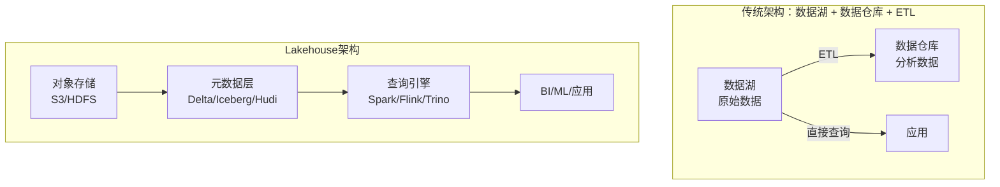
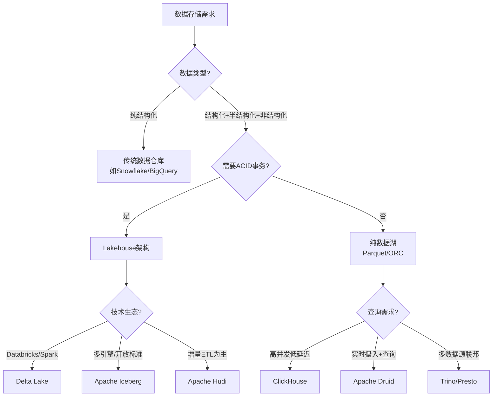

## 本章小结

本章从数据湖的分层架构出发，系统性地梳理了现代数据管理的完整技术栈——涵盖存储层（数据湖/Lakehouse）、表格式（Delta Lake/Iceberg/Hudi）、建模层（星型/雪花/SCD）、集成层（ETL/ELT/dbt）、查询层（OLAP引擎）、治理层（目录/血缘/质量/MDM）以及组织层（数据网格）七大模块。以下是对全章核心知识的结构化回顾，帮助读者建立清晰的知识脉络。

### 全章知识地图

| 小节 | 主题 | 一句话总结 | 核心收获 |
|------|------|-----------|---------|
| 60.1 | 数据湖架构 | 分层存储（Raw→Cleaned→Curated）+ Lakehouse统一湖仓 | 理解数据湖分层设计和Lakehouse消除ETL的理念 |
| 60.2 | 表格式三大支柱 | Delta Lake事务日志 / Iceberg三层元数据 / Hudi增量处理 | 掌握三种表格式的核心机制和适用场景 |
| 60.3 | 数据仓库建模 | 星型模型为主，SCD Type 2管理维度历史 | 能独立设计事实表粒度和维度表SCD策略 |
| 60.4 | ETL与ELT | 从中间服务器转换到目标系统转换的演进 | 理解ELT优势和dbt的SQL-first开发模式 |
| 60.5 | OLAP引擎 | ClickHouse极致性能 / Druid实时摄入 / Trino联邦查询 | 根据场景选择合适的OLAP引擎 |
| 60.6 | 数据治理 | 目录（可发现）+ 血缘（可追溯）+ 质量（可信赖）+ MDM（一致性） | 构建数据治理的四大支柱 |
| 60.7 | 数据网格 | 领域驱动的去中心化数据架构 | 理解Data Mesh的四大原则和实施前提 |
| 60.8 | 表格式选型优化 | 小文件治理、分区策略、Schema演化 | 掌握表格式性能优化的工程实践 |
| 60.9 | 建模优化技巧 | 事实表粒度选择、维度表反规范化、分层设计 | 能设计高效的数据仓库分层模型 |
| 60.10 | CDC与数据管道 | Debezium + Kafka + 表格式Upsert | 实现源系统到数据湖的增量同步 |

---

### 核心知识点回顾

#### 1. 数据湖架构与Lakehouse理念

**数据湖分层架构**是数据湖设计的基石。数据按处理阶段分为三层：原始区（Raw/Bronze）存储源系统原样数据，保留完整可追溯性；清洗区（Cleaned/Silver）存储去重、格式标准化、类型转换后的数据；精炼区（Curated/Gold）存储经过业务逻辑处理、可直接消费的高质量数据。这种分层保证了每一层数据的可审计性和可回溯能力。

**Lakehouse架构**的核心价值在于消除数据湖与数据仓库之间的ETL。通过在对象存储（S3/HDFS/ADLS）之上叠加元数据层（Delta Lake/Iceberg/Hudi），Lakehouse同时获得数据湖的低成本灵活性和数据仓库的ACID事务能力。数据只存一份，即可同时支持批处理、流处理和交互式查询。

#### 2. 数据湖表格式三大支柱

| 特性 | Delta Lake | Apache Iceberg | Apache Hudi |
|------|-----------|---------------|-------------|
| 开源方 | Databricks | Netflix | Uber |
| 元数据机制 | 事务日志（Delta Log） | 三层元数据（Table Metadata → Manifest List → Manifest File） | Timeline + Metadata Table |
| 存储类型 | 仅COW | COW + MOR（0.13+） | COW + MOR |
| 增量查询 | Change Data Feed | Incremental Scan | 原生支持 |
| 多引擎支持 | Spark为主 | Spark、Flink、Trino、Hive、Presto | Spark、Flink、Hive |
| 分区演化 | 不支持 | 支持 | 不支持 |
| 适用场景 | Databricks生态、Spark为主的场景 | 多引擎环境、开放标准需求 | 增量ETL、近实时数据湖 |

**Delta Lake**通过事务日志实现ACID事务——每次写入生成JSON格式的变更记录，保证原子性和隔离性。支持Z-Order多维索引优化查询。

**Apache Iceberg**通过三层元数据实现高效查询优化——清单文件中的列统计信息（min/max）支持分区裁剪，查询引擎无需扫描实际数据即可过滤不相关文件。隐藏分区和分区演化是Iceberg的核心差异化能力。

**Apache Hudi**针对增量数据处理优化——COW适合读多写少（写入时重写整个文件），MOR适合写多读少（写入增量日志，查询时合并）。原生支持增量查询，非常适合增量ETL场景。

#### 3. 数据仓库建模体系

**星型模型**是数据仓库的经典建模方式——事实表在中心存储度量数据，维度表围绕事实表存储描述属性。事实表设计的关键在于粒度选择：建议选择最细粒度，因为粗粒度数据可通过聚合得到，但细粒度数据无法还原。

**雪花模型**对维度表进一步规范化，减少冗余但增加Join复杂度。在现代列式OLAP引擎中，星型模型比雪花模型更常用——列式存储已大大减少了冗余的存储开销。

**缓慢变化维（SCD）**处理维度随时间变化的场景：

| SCD类型 | 策略 | 适用场景 | 优缺点 |
|---------|------|---------|--------|
| Type 1 | 直接覆盖旧值 | 修正错误数据 | 简单但丢失历史 |
| Type 2 | 保留完整历史版本（valid_from/valid_to/is_current） | 需要追踪历史变化 | 最常用，数据量大 |
| Type 3 | 保留有限历史（previous_xxx列） | 只需比较当前值和前值 | 简单但只保留一次历史 |

**数据仓库分层设计**：ODS（原始数据）→ DWD（明细事实）→ DWS（汇总事实）→ ADS（应用数据）。每一层有明确的职责：ODS保持源系统结构，DWD完成清洗标准化，DWS按业务主题聚合，ADS面向具体报表。

#### 4. ETL与ELT的演进

| 维度 | ETL | ELT |
|------|-----|-----|
| 转换位置 | 中间ETL服务器 | 目标系统（数据湖/云数仓） |
| 代表工具 | Informatica、DataStage | dbt、Spark SQL |
| 优势 | 数据进入仓库前已清洗 | 利用目标系统计算力，原始数据可回溯 |
| 劣势 | 转换逻辑绑定ETL工具 | 目标系统负载增大 |
| 适用场景 | 传统数据仓库 | 数据湖、云数据仓库 |

**dbt**是ELT模式的代表工具——通过SQL定义转换逻辑，支持依赖管理（自动解析执行顺序）、版本控制（Git集成）、数据质量测试（唯一性/非空/参照完整性）和自动文档生成。

#### 5. OLAP引擎对比

| 引擎 | 定位 | 存储 | 实时摄入 | Join能力 | 适用场景 |
|------|------|------|---------|---------|---------|
| ClickHouse | 列式OLAP数据库 | 自带存储 | 支持（Kafka Engine） | 有限 | 单表聚合查询、日志分析 |
| Apache Druid | 实时OLAP引擎 | 自带存储 | 原生支持 | 有限 | 实时监控、实时仪表板 |
| Trino/Presto | 联邦查询引擎 | 无（查询外部数据源） | 不支持 | 强 | 多数据源联邦查询 |

**ClickHouse**以极致查询性能著称——列式存储只读取涉及的列，向量化执行利用SIMD指令批量处理，压缩比可达10:1以上。但不支持ACID事务，更新/删除操作需后台异步合并。

**Apache Druid**支持从Kafka实时摄入数据、秒级可查——通过预聚合和Bitmap索引实现亚秒级查询，适合实时监控场景。

**Trino/Presto**不存储数据，一条SQL可Join来自不同数据源的表，适合多数据源联邦查询。但不适合长时间运行的ETL任务——内存模型不适合大范围Shuffle。

#### 6. 数据治理体系

数据治理是确保数据资产有效管理的体系化实践，包含四大核心模块：

- **数据目录（Data Catalog）**：管理元数据、支持数据发现、分类和标签。代表工具：Apache Atlas、DataHub、AWS Glue Data Catalog。
- **数据血缘（Data Lineage）**：追踪数据从源头到消费的完整链路。核心价值：影响分析（源变更→受影响下游）、问题排查（数据异常→根因追溯）、合规审计（GDPR溯源）。通过SQL解析或API钩子实现，存储于图数据库（Neo4j）。
- **数据质量（Data Quality）**：覆盖完整性、准确性、一致性、时效性、唯一性五个维度。通过定义质量规则（非空检查、范围检查、唯一性检查）在管道各层级监控。
- **主数据管理（MDM）**：管理企业核心业务实体（客户/产品/供应商），确保跨系统一致性。

#### 7. CDC与数据管道

CDC（Change Data Capture）是现代数据管道的核心技术——通过读取源数据库的变更日志（MySQL binlog、PostgreSQL WAL）捕获INSERT/UPDATE/DELETE事件。**Debezium**是最流行的开源CDC工具，基于Kafka Connect构建，支持多种数据库。

数据管道设计模式：全量+增量（首次全量快照+后续CDC）、仅增量（只同步变更数据）。CDC数据在数据湖中以Upsert方式写入——通过表格式的Merge操作实现行级更新。

#### 8. 数据网格（Data Mesh）

数据网格是Zhamak Dehghani提出的新兴架构理念，将领域驱动设计（DDD）应用于数据架构，四大核心原则：

1. **领域数据所有权**：每个业务领域团队负责自己的数据产品（打破中心化数据团队模式）
2. **数据即产品**：数据有明确的SLA、质量标准、文档和API
3. **自助数据平台**：统一的数据基础设施降低领域团队门槛
4. **联邦计算治理**：统一治理框架下实现领域自治

---

### 关键公式与模型

| 概念 | 公式/模型 | 说明 |
|------|-----------|------|
| 数据湖存储成本 | 成本 = 数据量 × 存储单价 × 副本数 | 对象存储成本远低于传统数仓 |
| 小文件判断 | 文件数 = 数据量 / 文件大小（<128MB为小文件） | 小文件增加元数据开销和IO |
| OLAP查询性能 | 延迟 ≈ 扫描数据量 / 列式压缩比 × IO吞吐 | 列式存储通过减少扫描量提升性能 |
| 数据质量评分 | 质量分 = Σ(维度权重 × 维度得分) | 加权平均，各维度可自定义权重 |
| SCD Type 2数据膨胀 | 行数 = 基础行数 × 平均变更次数 | 频繁变更维度会导致事实表膨胀 |
| 数据管道延迟 | 端到端延迟 = 摄入延迟 + 处理延迟 + 加载延迟 | CDC可将摄入延迟降至秒级 |
| 分区裁剪率 | 裁剪率 = 被跳过分区数 / 总分区数 | 合理分区策略可裁剪90%+数据 |

---

### 方案选型决策框架

根据业务场景快速定位技术方案：

| 场景 | 推荐方案 | 理由 |
|------|---------|------|
| Databricks生态、Spark为主 | Delta Lake | 与Spark集成最紧密，商业支持完善 |
| 多引擎（Spark+Flink+Trino） | Apache Iceberg | 开放标准，多引擎兼容性最好 |
| 增量ETL、近实时数据湖 | Apache Hudi | 原生增量查询，MOR适合高频写入 |
| 日志分析、高并发聚合 | ClickHouse | 极致单表查询性能 |
| 实时监控仪表板 | Apache Druid | 秒级可查的实时数据摄入 |
| 多数据源交叉分析 | Trino/Presto | 联邦查询，一条SQL跨多个数据源 |
| ELT数据转换 | dbt | SQL定义、版本控制、自动测试文档 |
| 数据治理起步 | Apache Atlas + DataHub | 元数据管理+数据发现 |

---

### 实战案例回顾

本章提供了两个完整的实战案例，覆盖了从搭建到优化的全流程：

**案例一：Delta Lake实战**——在Spark+MinIO环境中搭建Delta Lake，实践ACID事务写入、Merge操作（Upsert）、时间旅行查询、Z-Order索引优化和VACUUM历史版本清理。重点验证了事务日志如何保证数据一致性，以及OPTIMIZE命令如何解决小文件问题。

**案例二：Apache Iceberg实战**——在相同环境中搭建Iceberg表，实践三层元数据的查看与理解、分区演化（修改分区策略而不影响已有数据）、Schema演化（安全地添加和修改列）、增量扫描（只读取自某个快照以来变更的数据）。重点验证了隐藏分区和分区演化的工程价值。

**dbt实践**——搭建dbt项目，将数据仓库的转换逻辑定义为SQL模型，实践模型依赖管理、数据质量测试（schema tests）、文档自动生成和增量模型（incremental model）的性能优化。

**ClickHouse实践**——部署ClickHouse集群，使用Kafka Engine实时摄入数据，实践列式存储的查询性能优势、物化视图（Materialized View）预聚合和分布式表的分片设计。

**数据目录实践**——使用DataHub搭建数据目录，通过OpenLineage自动采集数据血缘，验证从源表到消费表的完整链路追踪能力。

**数据网格实践**——模拟多团队协作场景，实践领域数据产品的定义、SLA约定、自助数据平台的搭建和联邦治理机制。

---

### 最佳实践清单

**数据湖设计阶段**：
- [ ] 规划分层架构（Raw/Cleaned/Curated），明确每层的数据质量标准
- [ ] 选择合适的表格式（Delta Lake/Iceberg/Hudi），根据技术生态和业务场景决策
- [ ] 设计分区策略——选择查询高频过滤列，避免高基数列做分区
- [ ] 规划数据生命周期——设置TTL策略，明确数据保留和清理周期

**表格式实施阶段**：
- [ ] 配置自动Compaction——Delta Lake的autoCompact、Iceberg的rewriteDataFiles
- [ ] 设置合理的文件目标大小（128MB-256MB）
- [ ] 为高频查询列创建Z-Order/聚簇索引
- [ ] 配置VACUUM/expire_snapshots定期清理历史版本

**数据仓库建模阶段**：
- [ ] 确定事实表粒度——选择最细粒度，通过聚合得到粗粒度
- [ ] 使用代理键而非自然键作为主键
- [ ] 设计一致维度（Conformed Dimension）确保跨事实表分析一致性
- [ ] 根据业务需求选择SCD策略——Type 2是最常用的选择

**数据管道阶段**：
- [ ] 使用CDC（Debezium）替代定时全量同步
- [ ] 设计全量+增量的首次加载策略
- [ ] 在管道各层级设置数据质量检查点
- [ ] 实现数据血缘采集（SQL解析或API钩子）

**数据治理阶段**：
- [ ] 建设数据目录，确保数据资产可发现
- [ ] 定义数据质量规则（完整性/准确性/一致性/时效性/唯一性）
- [ ] 实现数据血缘追踪，支持影响分析和问题排查
- [ ] 制定数据安全策略——PII识别、访问控制、审计日志

**运维监控阶段**：
- [ ] 监控小文件数量和文件大小分布
- [ ] 跟踪数据管道延迟和数据新鲜度
- [ ] 定期审查数据质量指标趋势
- [ ] 监控存储成本增长趋势

---

### 常见误区与纠正

| 误区 | 纠正方法 |
|------|---------|
| 数据湖建好就不管，沦为"数据沼泽" | 必须配套数据治理：数据目录+质量监控+血缘追踪 |
| 星型模型和雪花模型随意选择 | 优先星型模型，现代OLAP引擎已减少冗余存储开销 |
| 全量刷新替代增量更新 | 使用CDC（Debezium）实现增量同步，减少源系统压力 |
| OLAP引擎随意选型 | 根据场景选择：日志分析→ClickHouse，实时监控→Druid，联邦查询→Trino |
| 数据质量只在最后环节检查 | 在管道各层级（ODS/DWD/DWS/ADS）都设置质量检查点 |
| 数据网格直接照搬 | 需要组织变革+平台建设+文化转变，循序渐进实施 |
| 分区列选择高基数字段（如用户ID） | 选择低基数、查询高频过滤列（如日期、地区） |

---

### 工具生态速查

| 类别 | 工具 | 定位 | 一句话说明 |
|------|------|------|-----------|
| 表格式 | Delta Lake | Databricks开源 | 事务日志实现ACID，Spark生态首选 |
| 表格式 | Apache Iceberg | Netflix开源 | 三层元数据+分区演化，多引擎兼容 |
| 表格式 | Apache Hudi | Uber开源 | COW/MOR双模式，增量ETL首选 |
| 转换工具 | dbt | dbt Labs | SQL-first的ELT转换框架 |
| OLAP引擎 | ClickHouse | Yandex开源 | 列式存储+向量化，极致查询性能 |
| OLAP引擎 | Apache Druid | Metamarkets | 实时摄入+亚秒查询 |
| OLAP引擎 | Trino | Trino Software | 联邦查询，跨数据源JOIN |
| CDC工具 | Debezium | Red Hat | 基于Kafka Connect的CDC框架 |
| 数据目录 | Apache Atlas | Apache | Hadoop生态的元数据治理 |
| 数据目录 | DataHub | LinkedIn开源 | 现代数据目录+血缘 |
| 数据质量 | Great Expectations | Great Expectations | Python数据质量框架 |
| 数据质量 | Deequ | AWS/Amazon | Spark数据质量库 |
| 对象存储 | MinIO | MinIO | S3兼容的本地对象存储 |

---

### 下一步学习建议

**深入方向**：

1. **表格式源码阅读**：阅读Delta Lake的TransactionLog实现、Iceberg的Manifest文件管理、Hudi的Timeline机制，理解ACID事务的底层实现
2. **查询优化器研究**：深入学习ClickHouse的向量化执行引擎、Spark Catalyst优化器、Trino的代价优化器（CBO），理解OLAP查询性能优化的原理
3. **数据治理平台建设**：从Apache Atlas或DataHub入手，搭建企业级数据目录，逐步引入数据血缘和质量监控
4. **流批一体架构**：学习Flink的流批一体能力，结合Iceberg实现流式摄入+批式分析的统一架构
5. **数据网格实践**：从小规模试点开始，选择一个业务领域团队实施数据即产品，积累经验后逐步推广

**推荐资源**：

- 书籍：《Fundamentals of Data Engineering》（Joe Reis）、《Designing Data-Intensive Applications》（Martin Kleppmann）、《The Data Mesh》（Zhamak Dehghani）
- 论文：《Delta Lake: High-Performance ACID Table Storage》（Databricks）、《Iceberg: A Metadata Framework for High-Performance Analytical Tables》（Netflix）
- 开源项目：Delta Lake（github.com/delta-io/delta）、Apache Iceberg（github.com/apache/iceberg）、Apache Hudi（github.com/apache/hudi）、dbt（github.com/dbt-labs/dbt-core）、ClickHouse（github.com/ClickHouse/ClickHouse）
- 官方文档：Delta Lake（docs.delta.io）、Iceberg（iceberg.apache.org）、Hudi（hudi.apache.org）、dbt（docs.getdbt.com）、ClickHouse（clickhouse.com/docs）

---

### 思考题

1. **架构选型**：一家电商公司有MySQL订单库（结构化）、用户行为日志（半结构化JSON）、商品图片（非结构化），需要统一存储并支持实时查询和离线分析。你会如何设计数据湖架构？选择哪种表格式？为什么？

   > 提示：考虑分层设计（Raw/Cleaned/Curated），表格式需同时支持Spark（离线分析）和Flink（实时查询），Iceberg的多引擎兼容性是关键考量。非结构化数据直接存对象存储，通过元数据层统一管理。

2. **表格式对比**：某团队正在从Spark+Hive迁移到数据湖表格式。团队同时使用Spark做批处理、Flink做流处理、Trino做交互式查询。Delta Lake、Iceberg、Hudi中哪个最适合？请从引擎兼容性、社区活跃度、迁移成本三个维度分析。

   > 提示：Delta Lake对Spark支持最好但Flink/Trino支持有限；Iceberg三大引擎原生支持且迁移成本最低（Hive表可直接迁移）；Hudi的Flink支持好但Trino支持较弱。综合来看Iceberg是最佳选择。

3. **建模决策**：一个零售企业的数据仓库需要支持"按门店×月份×品类的销售额分析"和"按客户×产品的购买行为分析"。事实表的粒度应该选择订单级别还是订单明细级别？两种分析需求是否需要不同的事实表？

   > 提示：选择订单明细粒度（最细粒度），因为"按品类分析"需要product_id级别数据。两种分析需求可以在同一张明细事实表上通过不同的GROUP BY实现，无需建两张事实表——这就是星型模型的灵活性。

4. **数据质量**：某公司的数据管道每天处理1亿条用户行为日志。如何设计一个高效的数据质量监控框架？在管道的哪些环节检查什么指标？如何平衡质量检查的开销和数据延迟？

   > 提示：在Bronze层检查Schema完整性和格式合规性；在Silver层检查业务规则（如时间戳合理性、ID非空）；在Gold层检查聚合一致性（如SUM(明细)=汇总）。采样检查+全量检查结合，延迟敏感的规则异步执行。

5. **数据网格落地**：一家500人规模的互联网公司有10个业务团队，每个团队有自己的数据库。如何逐步实施数据网格？第一步应该做什么？如何解决跨团队的数据互通问题？

   > 提示：第一步不是下放数据责任，而是建设自助数据平台（统一存储+管道+质量+目录）。选择数据成熟度最高的1-2个团队试点，定义数据产品SLA。跨团队互通依赖一致维度和全局数据标准。

6. **CDC与一致性**：使用Debezium从MySQL同步数据到Iceberg表。在同步过程中，MySQL发生了表结构变更（添加了一列）。Debezium会如何处理？Iceberg的Schema演化能力如何保证数据不丢失？

   > 提示：Debezium通过Schema History Topic记录Schema变更，自动识别新列并传递给下游。Iceberg支持Schema演化（添加列时指定默认值），新旧数据可以在同一张表中共存——旧数据的新增列填充默认值，新数据正常写入。

---

### 本章核心能力检验

完成本章学习后，你应该能够：

- [ ] 画出数据湖分层架构图，解释Raw/Cleaned/Curated三层的职责和数据流转
- [ ] 对比Delta Lake、Iceberg、Hudi的核心机制，根据场景选择合适的表格式
- [ ] 设计一个星型模型的事实表和维度表，正确选择粒度和SCD策略
- [ ] 区分ETL和ELT的适用场景，搭建一个dbt项目并实现基本的转换逻辑
- [ ] 根据业务需求选择ClickHouse/Druid/Trino中的合适OLAP引擎
- [ ] 规划一个数据治理框架，包含目录、血缘、质量和安全四个维度
- [ ] 理解Data Mesh的四大原则，评估组织是否具备实施条件
