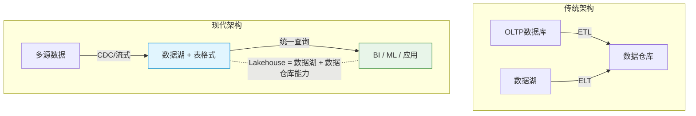
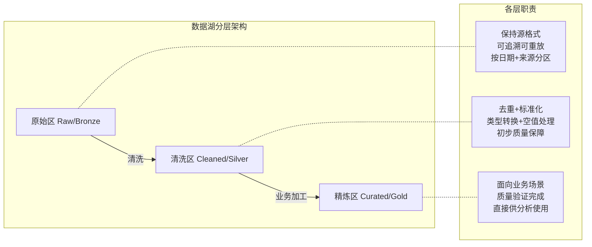
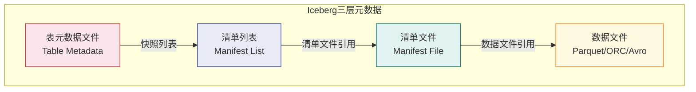
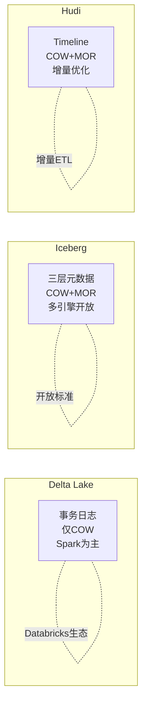
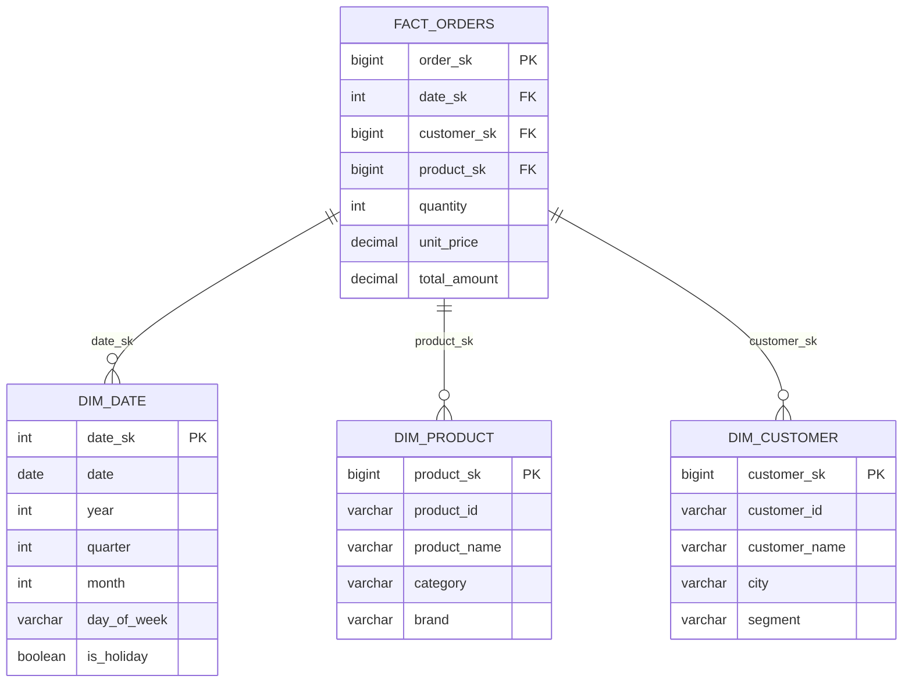
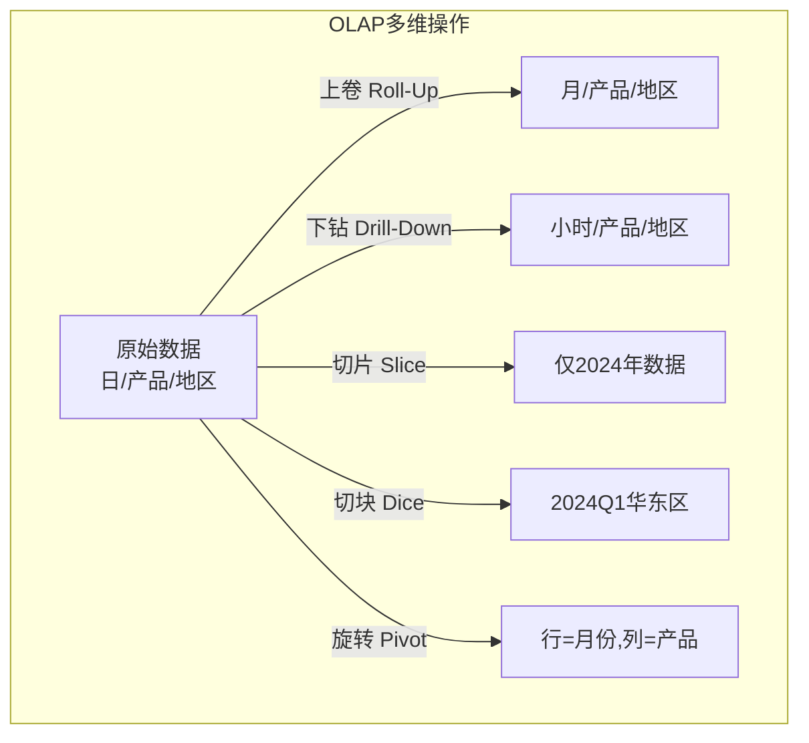
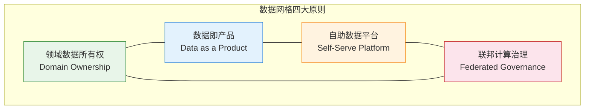

# 第60章 数据湖与数据仓库：现代数据架构的全景解析

***

## 章节定位

数据湖与数据仓库是企业数据架构的两大核心支柱。随着数据量的爆炸式增长和数据类型的多样化，传统的数据仓库架构已经无法满足所有需求——结构化数据、半结构化数据和非结构化数据需要统一的存储和处理方式。数据湖（Data Lake）应运而生，提供了低成本的原始数据存储能力。然而，早期的数据湖由于缺乏事务支持、数据治理和查询性能，逐渐沦为"数据沼泽"（Data Swamp）。数据湖表格式（Delta Lake、Apache Iceberg、Apache Hudi）的出现，为数据湖带来了ACID事务、Schema演化和时间旅行等能力，使得数据湖能够同时支持批处理和流处理场景。Lakehouse架构将数据仓库的管理能力与数据湖的灵活性结合在一起，成为现代数据架构的主流方向。本章从数据湖架构到数据治理，系统性地探讨数据管理的方方面面。



***

## 核心内容概览

**数据湖架构** 按照数据的处理阶段划分为多个层级。原始区（Raw Zone）存储从源系统摄入的原始数据，不做任何处理；清洗区（Cleaned Zone）存储经过数据清洗和格式标准化的数据；精炼区（Curated Zone）存储经过业务逻辑处理、质量验证的高质量数据，供下游分析使用。这种分层架构保证了数据的可追溯性和质量。

**数据湖表格式** 是数据湖的核心基础设施。Delta Lake由Databricks开源，基于Parquet文件构建，通过事务日志（Delta Log）实现ACID事务和时间旅行。Apache Iceberg由Netflix开源，定义了开放的表格式标准，支持多种计算引擎（Spark、Flink、Trino等），通过Manifest文件实现高效的元数据管理和分区裁剪。Apache Hudi由Uber开源，针对增量数据处理优化，支持Copy-on-Write和Merge-on-Read两种存储类型。

**数据仓库建模** 是数据仓库设计的核心技能。星型模型（Star Schema）将数据组织为事实表和维度表的简单结构，查询性能好但灵活性有限。雪花模型（Snowflake Schema）对维度表进一步规范化，减少了数据冗余但增加了查询复杂度。事实表存储业务过程的度量数据，维度表存储描述业务上下文的属性数据。缓慢变化维（SCD）处理维度数据随时间变化的场景——Type 1直接覆盖、Type 2保留历史版本、Type 3保留有限历史。

**ETL与ELT** 是数据集成的两种模式。ETL（Extract-Transform-Load）在数据加载到目标系统之前完成转换，适合传统数据仓库场景。ELT（Extract-Load-Transform）将原始数据先加载到目标系统，再在目标系统中完成转换，适合数据湖和云数据仓库场景。dbt（data build tool）是ELT模式的代表工具，通过SQL定义转换逻辑，支持版本控制、测试和文档生成。

**OLAP** 是在线分析处理的核心技术。OLAP操作包括上卷（Roll-Up）——从细粒度到粗粒度的聚合；下钻（Drill-Down）——从粗粒度到细粒度的展开；切片（Slice）——选择某个维度的特定值；切块（Dice）——选择多个维度的特定范围。ClickHouse是列式OLAP引擎，以极致的查询性能著称。Apache Druid是实时OLAP引擎，支持低延迟的实时数据摄入和查询。Presto/Trino是分布式SQL查询引擎，可以查询多种数据源。

**数据治理** 包括数据目录（Data Catalog）——管理数据资产的元数据；数据血缘（Data Lineage）——追踪数据从源头到消费的完整链路；数据质量（Data Quality）——监控数据的完整性、准确性、一致性和时效性；主数据管理（MDM）——管理企业的核心业务实体数据。

**数据网格（Data Mesh）** 是一种新兴的数据架构理念。数据网格的核心原则包括：领域数据所有权——每个业务领域团队负责自己的数据；数据即产品——将数据视为产品来设计和管理；自助数据平台——提供统一的数据基础设施；联邦计算治理——在统一治理框架下实现领域自治。

***

## 学习目标

完成本章学习后，读者应能理解数据湖的分层架构（Raw/Cleaned/Curated）和Lakehouse的设计理念，掌握数据湖表格式（Delta Lake/Iceberg/Hudi）的核心原理和适用场景，熟练运用星型模型和雪花模型进行数据仓库建模，理解ETL和ELT两种数据集成模式的差异及dbt的使用，了解ClickHouse/Druid/Presto/StarRocks等OLAP引擎的特点和适用场景，掌握数据治理的核心概念（目录/血缘/质量/MDM），理解数据网格的理念和实施挑战，掌握数据湖安全与访问控制的最佳实践，理解流式数据湖的设计模式。

***

## 本章结构

| 小节 | 主题 | 核心内容 |
|------|------|----------|
| 01 | 理论基础 | 数据湖架构、表格式、数据仓库建模、ETL/ELT、OLAP、数据治理、数据网格、安全与访问控制 |
| 02 | 核心技巧 | 表格式选型、建模优化、CDC集成、数据质量框架、数据血缘实现 |
| 03 | 实战案例 | Delta Lake、Iceberg、dbt、ClickHouse、数据目录、数据网格实践 |
| 04 | 常见误区 | 数据沼泽、建模过度规范化、ETL瓶颈、OLAP选型错误、数据治理形式化 |
| 05 | 练习方法 | 数据湖表格式实验、数据仓库建模、dbt项目搭建、OLAP查询优化、数据质量监控 |
| 06 | 本章小结 | 核心概念回顾、方案选型框架、延伸阅读 |

***

# 第60章 数据湖与数据仓库 理论基础

***

## 60.1 数据湖架构：分层设计与Lakehouse理念

数据湖是一种以原始格式存储海量数据的架构，支持结构化、半结构化和非结构化数据的统一存储。但早期的数据湖缺乏事务支持和数据质量管控，容易退化为"数据沼泽"。现代数据湖通过分层架构和表格式技术解决了这些问题。

**为什么需要数据湖？** 传统数据仓库有两个根本性限制：第一，数据仓库只能存储结构化数据，但企业中80%以上的数据是非结构化或半结构化的（日志、音视频、文档、社交媒体）；第二，数据仓库存储成本高昂（通常每TB每月数百美元），而对象存储（S3、OSS）的成本仅为其1/10到1/5。数据湖通过在廉价对象存储上保存原始数据，解决了这两个核心问题。



**数据湖分层架构** 将数据按照处理阶段划分为多个层级：

原始区（Raw Zone，也称为Bronze层）存储从源系统摄入的原始数据，不做任何转换或清洗。原始区的数据保持源系统的格式和结构，保证了数据的可追溯性——任何时候都可以从原始区重新处理数据。原始区的数据通常按照日期和数据源进行分区存储。例如，一个典型的原始区目录结构为：`s3://data-lake/bronze/source=orders/year=2024/month=01/day=15/`。

清洗区（Cleaned Zone，也称为Silver层）存储经过数据清洗和格式标准化的数据。清洗操作包括：去重——去除重复的数据记录；格式标准化——将不同源系统的数据格式统一（如日期统一为ISO 8601格式）；类型转换——将字符串类型的数字转为数值类型；空值处理——填充默认值或标记缺失值；业务规则过滤——去除明显不合理的数据（如负数金额）。清洗区的数据质量已经得到了基本保障，可以用于初步的分析。

精炼区（Curated Zone，也称为Gold层）存储经过业务逻辑处理、质量验证的高质量数据。精炼区的数据通常是面向特定业务场景的——例如，用户画像表、商品宽表、订单汇总表等。精炼区的数据可以直接被数据分析师和数据科学家使用，也可以被下游应用系统查询。精炼区的数据通常已经过数据质量验证，满足完整性和准确性的要求。

**Lakehouse架构** 将数据仓库的管理能力和数据湖的灵活性结合在一起。Lakehouse的核心思想是：在低成本的对象存储（如S3、HDFS）之上，通过元数据层（如Delta Lake、Iceberg、Hudi）提供数据仓库级别的管理能力——ACID事务、Schema演化、数据版本化、性能优化等。Lakehouse避免了传统架构中数据湖和数据仓库之间的ETL过程——数据只需要存储一份，就可以同时支持批处理、流处理和交互式查询。

```mermaid
graph TB
    subgraph Lakehouse架构
        L1[消费层<br/>BI / ML / 应用]
        L2[查询引擎层<br/>Spark | Flink | Trino | Presto | Hive]
        L3[元数据层-表格式<br/>Delta Lake | Iceberg | Hudi]
        L4[存储层-对象存储<br/>S3 | HDFS | ADLS | GCS]
    end
    L1 --> L2 --> L3 --> L4
    style L3 fill:#fff3e0,stroke:#f57c00
    style L4 fill:#e3f2fd,stroke:#1976d2
```

**Lakehouse相比传统架构的核心优势**：

| 维度 | 传统数据湖+数据仓库 | Lakehouse |
|------|---------------------|-----------|
| 数据冗余 | 两份数据（湖+仓），ETL同步 | 一份数据，避免冗余 |
| 存储成本 | 数据仓库存储昂贵 | 全部存储在低成本对象存储 |
| 数据新鲜度 | ETL延迟导致数据延迟 | 直接查询原始数据，支持实时 |
| 事务支持 | 数据湖无事务保证 | ACID事务保证数据一致性 |
| Schema管理 | 数据湖无Schema演化 | 支持Schema演化和时间旅行 |
| 运维复杂度 | 维护两套系统的ETL | 统一架构，降低运维成本 |

**Lambda架构与Kappa架构**：数据处理架构有两种经典范式。Lambda架构（Lambda Architecture）由Nathan Marz提出，同时维护批处理层（Batch Layer）和速度层（Speed Layer），批处理结果和实时结果在服务层合并。Lambda架构的优势是容错性好——批处理层可以修正速度层的错误；劣势是需要维护两套代码逻辑。Kappa架构（Kappa Architecture）由Jay Kreps提出，只使用流处理层——所有数据都以流的方式处理，通过重放历史数据来实现批处理效果。Kappa架构的优势是代码统一、运维简单；劣势是对流处理引擎的要求极高（如Kafka的无限日志保留）。现代Lakehouse架构通常采用折中方案：以批处理为主，通过增量处理（Incremental Processing）实现近实时的数据更新。

***

## 60.2 数据湖表格式：Delta Lake、Iceberg与Hudi

数据湖表格式是Lakehouse架构的核心基础设施，为数据湖带来了ACID事务、Schema演化、时间旅行和查询优化等能力。表格式的本质是在Parquet等列式文件之上增加了一层元数据管理，使得无状态的对象存储具备了有状态的数据库能力。

**为什么需要表格式？** 原始数据湖中的Parquet文件是"死"的——它们只是一堆静态文件，不支持行级更新（只能追加），不支持事务（写入中断会留下不完整的文件），不支持时间旅行（删除的文件无法恢复），不支持Schema演化（修改Schema需要重写所有数据）。表格式通过引入元数据层来解决这些问题：记录每个文件的状态（新增/删除）、维护Schema版本历史、提供事务日志保证原子性。

### Delta Lake

Delta Lake由Databricks开源，是最早的数据湖表格式之一。Delta Lake的核心设计是事务日志（Delta Log）——每次数据变更（写入、更新、删除）都会生成一个JSON格式的事务日志文件，记录变更的元数据信息（添加了哪些文件、删除了哪些文件）。事务日志保证了ACID事务的原子性和隔离性。

Delta Lake的ACID事务实现原理：每次写操作开始时，写入者会创建一个"预留文件"（_crc文件），获取对表的独占锁。写入完成后，写入者将新文件的信息追加到事务日志中，并删除预留文件。如果两个写入者同时尝试写入，第二个写入者会在获取锁时失败并回滚，保证事务的隔离性。

Delta Lake基于Parquet文件存储数据，支持Schema演化（添加/修改/删除列）、时间旅行（查询历史版本的数据）和Z-Order索引（多维索引优化查询性能）。

### Apache Iceberg

Apache Iceberg由Netflix开源，定义了开放的表格式标准。Iceberg的元数据分为三层：



表元数据文件（Table Metadata）存储表的Schema、分区信息和快照列表；清单列表（Manifest List）存储每个快照包含的清单文件；清单文件（Manifest File）存储具体的数据文件列表及其统计信息（如每列的最小值/最大值）。这种分层的元数据设计使得Iceberg在分区裁剪和查询优化方面非常高效——查询引擎可以通过清单文件中的统计信息快速过滤不相关的数据文件，而不需要扫描实际数据。

Iceberg的核心特性包括：

- **隐藏分区**——分区信息对用户透明，查询时不需要指定分区列。例如表按`days(order_date)`分区，但用户查询时只需写`WHERE order_date = '2024-01-15'`，不需要写`WHERE year=2024 AND month=01 AND day=15`
- **分区演化**——可以修改分区策略（如从按天分区改为按月分区）而不影响已有数据，新数据按新策略写入，旧数据保持原样
- **Schema演化**——支持添加、删除、重命名和重排序列，通过字段ID（Field ID）稳定映射，即使重命名列也能正确读取历史数据
- **时间旅行**——支持查询任意历史快照的数据
- **多引擎支持**——Spark、Flink、Trino、Hive、Presto等主流计算引擎都支持Iceberg

### Apache Hudi

Apache Hudi由Uber开源，针对增量数据处理场景优化。Hudi支持两种存储类型：

**Copy-on-Write（COW）**——每次更新都会重写整个数据文件。写入时读取旧文件，合并变更后写入新文件，原子性地替换旧文件。COW适合读多写少的场景：查询性能好（文件已经是最新版本），但写入开销大（需要重写整个文件）。

**Merge-on-Read（MOR）**——更新写入增量日志文件（Log File），查询时合并基础文件（Base File）和增量文件。MOR适合写多读少的场景：写入性能好（只追加日志），但查询需要合并操作（增加延迟）。Hudi通过后台的Compaction任务定期将日志文件合并到基础文件中，逐步降低查询延迟。

Hudi的核心特性包括：增量查询——只查询自某个时间点以来变更的数据，非常适合增量ETL；自动文件大小管理——自动合并小文件，避免小文件问题；索引机制——通过Bloom Filter或HBase索引实现快速的记录定位。

### 三种表格式对比



| 维度 | Delta Lake | Apache Iceberg | Apache Hudi |
|------|-----------|---------------|-------------|
| 开源方 | Databricks | Netflix | Uber |
| 元数据机制 | 事务日志（Delta Log） | 三层元数据（Manifest） | Timeline + Metadata Table |
| 存储类型 | 仅COW | COW + MOR（0.13+） | COW + MOR |
| ACID事务 | 完整支持 | 完整支持 | 完整支持 |
| Schema演化 | 支持（列级） | 支持（字段ID映射） | 支持 |
| 增量查询 | 支持（Change Data Feed） | 支持（Incremental Scan） | 原生支持（核心优势） |
| 分区演化 | 不支持 | 支持（核心优势） | 不支持 |
| 隐藏分区 | 不支持 | 支持 | 不支持 |
| 多引擎支持 | Spark为主，其他有限 | Spark、Flink、Trino、Hive | Spark、Flink、Hive |
| Compaction | OPTIMIZE命令 | rewriteDataFiles | 自动Compaction |
| 时间旅行 | 支持 | 支持 | 支持 |
| 适用场景 | Databricks生态、Spark为主的场景 | 多引擎环境、开放标准需求 | 增量ETL、近实时数据湖 |

**选型决策树**：如果团队主要使用Spark且已经在Databricks生态中，选择Delta Lake——它与Spark的集成最紧密，Databricks提供了商业支持。如果需要多引擎支持（Spark + Flink + Trino），选择Apache Iceberg——Iceberg的开放标准设计使得它在多引擎环境中的兼容性最好。如果业务场景以增量ETL为主（频繁的Upsert和增量读取），选择Apache Hudi——Hudi的MER类型和增量查询能力是其核心优势。

***

## 60.3 数据仓库建模：星型模型与雪花模型

数据仓库建模是将业务数据组织为适合分析查询的结构的过程。合理的数据模型可以显著提升查询性能和分析效率。建模的核心理念来自Ralph Kimball的维度建模方法论——以业务过程为核心，以分析需求为导向，以查询性能为目标。

### 星型模型（Star Schema）

星型模型是数据仓库中最经典的建模方式。星型模型由一张事实表和多张维度表组成，事实表在中心，维度表围绕事实表呈星形排列。事实表存储业务过程的度量数据（如订单金额、销售数量），维度表存储描述业务上下文的属性数据（如时间维度、产品维度、客户维度）。



事实表的设计关键在于：**粒度（Grain）**——事实表中每一行代表什么（如一行代表一笔订单、一个订单明细项）。粒度是最关键的设计决策——它决定了事实表中能回答什么问题。粒度越细，灵活性越高但数据量越大。建议选择最细粒度，因为粗粒度数据可以通过聚合得到，但细粒度数据无法还原。**度量（Measure）**——事实表中存储的数值型数据（如金额、数量、时长）。度量分为可加度量（如销售额，可以跨所有维度求和）、半可加度量（如库存量，只能跨时间和产品求和，不能跨客户求和）和非可加度量（如单价、比率，不能直接求和）。**外键**——事实表通过外键关联到维度表。事实表通常非常大（数十亿行），而维度表相对较小（数百万行）。

维度表的设计关键在于：维度属性——维度表中的描述性字段（如产品名称、类别、品牌），这些属性是分析的"锚点"——用户通过选择维度属性的值来过滤和分组数据。主键——维度表的唯一标识符，通常使用代理键（Surrogate Key，自增整数）而非自然键（如业务编号），原因有三：自然键可能变化（如客户改名）、可能缺失（如源系统没有ID）、可能冲突（如不同系统使用相同ID）。缓慢变化维（SCD）——处理维度数据随时间变化的策略。

### 雪花模型（Snowflake Schema）

雪花模型是星型模型的扩展——对维度表进一步规范化，将维度表拆分为多层关联的子维度表。例如，产品维度表可以拆分为产品表、类别表和品牌表。雪花模型减少了数据冗余，但增加了查询时的Join操作，降低了查询性能。在实际项目中，星型模型比雪花模型更常用——现代OLAP引擎的列式存储已经大大减少了数据冗余的存储开销。

### 缓慢变化维（SCD）

缓慢变化维是数据仓库建模中的重要概念，处理维度属性随时间变化的场景：

**SCD Type 1——直接覆盖**：旧值被新值覆盖，不保留历史。适用于不需要追踪历史变化的场景（如修正错误数据、电话号码更新）。实现简单，但丢失了历史信息。

**SCD Type 2——保留完整历史**：每条维度记录包含生效时间（valid_from）、失效时间（valid_to）和当前标记（is_current）。当维度属性变化时，旧记录标记为失效（valid_to设为当前时间，is_current设为FALSE），新增一条当前记录（valid_from设为当前时间，valid_to设为NULL，is_current设为TRUE）。SCD Type 2是数据仓库中最常用的策略——它保留了完整的维度历史，可以回答"某个时间点的维度状态是什么"的问题。

**SCD Type 3——保留有限历史**：在维度表中添加"前值"列（如previous_city），只保留一次历史变化。适用于只需要比较当前值和前值的场景。优点是实现简单、查询方便；缺点是只能看到一次历史变化。

**SCD Type 4——历史表**：将当前维度数据和历史维度数据分开存储——当前表只存最新版本，历史表存所有版本。优点是当前表查询性能好；缺点是需要维护两张表。

```sql
-- 星型模型示例：电商订单分析
-- 事实表
CREATE TABLE fact_orders (
    order_sk        BIGINT,          -- 代理键
    order_id        VARCHAR(64),     -- 自然键
    date_sk         INT,             -- 时间维度外键
    customer_sk     BIGINT,          -- 客户维度外键
    product_sk      BIGINT,          -- 产品维度外键
    store_sk        INT,             -- 门店维度外键
    quantity        INT,             -- 度量：数量
    unit_price      DECIMAL(10,2),   -- 度量：单价
    total_amount    DECIMAL(12,2),   -- 度量：总金额
    discount        DECIMAL(10,2),   -- 度量：折扣
    shipping_cost   DECIMAL(10,2)    -- 度量：运费
);

-- 维度表
CREATE TABLE dim_date (
    date_sk         INT PRIMARY KEY,
    date            DATE,
    year            INT,
    quarter         INT,
    month           INT,
    day_of_week     VARCHAR(10),
    is_holiday      BOOLEAN
);

CREATE TABLE dim_product (
    product_sk      BIGINT PRIMARY KEY,
    product_id      VARCHAR(64),
    product_name    VARCHAR(200),
    category        VARCHAR(100),
    brand           VARCHAR(100),
    valid_from      TIMESTAMP,
    valid_to        TIMESTAMP,
    is_current      BOOLEAN
);

-- SCD Type 2的查询：获取某个时间点的维度快照
SELECT * FROM dim_product
WHERE product_id = 'P001'
  AND valid_from <= '2024-01-15'
  AND valid_to > '2024-01-15';

-- SCD Type 2的更新：当产品类别变化时
-- 1. 将旧记录标记为失效
UPDATE dim_product
SET valid_to = CURRENT_TIMESTAMP, is_current = FALSE
WHERE product_id = 'P001' AND is_current = TRUE;

-- 2. 插入新记录
INSERT INTO dim_product (product_id, product_name, category, brand, valid_from, valid_to, is_current)
SELECT product_id, product_name, '新类别', brand, CURRENT_TIMESTAMP, NULL, TRUE
FROM dim_product
WHERE product_id = 'P001' AND is_current = FALSE
ORDER BY valid_from DESC LIMIT 1;
```

### 数据仓库分层设计

数据仓库通常采用分层设计，每层承担不同的职责：

| 层级 | 名称 | 职责 | 典型技术 |
|------|------|------|---------|
| ODS | 操作数据层 | 保持源系统原貌，不做处理 | Hive外部表、Iceberg |
| DWD | 明细数据层 | 清洗、标准化、维度关联 | dbt staging模型 |
| DWS | 汇总数据层 | 按业务主题聚合 | dbt mart模型 |
| ADS | 应用数据层 | 面向具体报表/应用 | 物化视图、BI工具 |

```sql
-- 数据仓库分层设计
-- ODS层：原始数据（保持源系统结构）
CREATE TABLE ods_orders AS SELECT * FROM source_db.orders;

-- DWD层：明细事实表（清洗和标准化）
CREATE TABLE dwd_order_detail AS
SELECT
    o.order_id,
    o.customer_id,
    o.order_date,
    oi.product_id,
    oi.quantity,
    oi.unit_price,
    oi.quantity * oi.unit_price AS line_total
FROM ods_orders o
JOIN ods_order_items oi ON o.order_id = oi.order_id
WHERE o.order_status != 'CANCELLED';

-- DWS层：汇总事实表（按业务主题聚合）
CREATE TABLE dws_daily_sales AS
SELECT
    date_sk,
    store_sk,
    product_sk,
    SUM(quantity) AS total_quantity,
    SUM(total_amount) AS total_amount,
    COUNT(DISTINCT order_id) AS order_count
FROM dwd_order_detail
GROUP BY date_sk, store_sk, product_sk;

-- ADS层：应用数据表（面向报表）
CREATE TABLE ads_monthly_report AS
SELECT
    year,
    month,
    store_name,
    category,
    SUM(total_amount) AS monthly_sales,
    SUM(total_amount) / COUNT(DISTINCT date) AS avg_daily_sales
FROM dws_daily_sales
JOIN dim_date ON dws_daily_sales.date_sk = dim_date.date_sk
JOIN dim_store ON dws_daily_sales.store_sk = dim_store.store_sk
JOIN dim_product ON dws_daily_sales.product_sk = dim_product.product_sk
GROUP BY year, month, store_name, category;
```

***

## 60.4 ETL与ELT：数据集成模式的演进

数据集成是将分散在不同系统中的数据整合到统一存储中的过程。ETL和ELT是两种主要的数据集成模式，它们的本质区别在于转换操作发生在数据流的哪个环节。

### ETL（Extract-Transform-Load）

ETL是传统的数据集成模式。数据从源系统提取（Extract）后，在中间的ETL服务器上完成转换（Transform），然后加载（Load）到目标数据仓库。ETL的转换过程通常使用专门的ETL工具（如Informatica、DataStage、SSIS）来实现。

ETL的优势在于：数据进入数据仓库之前已经过清洗和转换，数据质量有保障；数据仓库中只存储需要的数据，节省存储空间。ETL的劣势在于：转换逻辑与ETL工具绑定，不易于版本控制和协作；转换过程在中间服务器上完成，大数据量时可能成为瓶颈；中间服务器需要额外的计算资源和运维成本。

### ELT（Extract-Load-Transform）

ELT是现代数据集成模式。数据从源系统提取后，先直接加载（Load）到目标系统（通常是数据湖或云数据仓库），然后在目标系统中完成转换（Transform）。

ELT的优势在于：利用目标系统的计算能力进行转换，可以处理更大数据量；转换逻辑使用SQL定义，易于版本控制和协作；原始数据保留在数据湖中，支持回溯和重新处理；云数据仓库（如Snowflake、BigQuery）的弹性计算能力使得ELT的性价比更高。

**ETL vs ELT选型指南**：

| 维度 | ETL | ELT |
|------|-----|-----|
| 转换位置 | 中间服务器 | 目标系统 |
| 存储需求 | 低（只存结果） | 高（存原始+转换后） |
| 处理规模 | 受限于中间服务器 | 受限于目标系统（通常更大） |
| 版本控制 | 困难（ETL工具私有格式） | 容易（SQL文件+Git） |
| 数据回溯 | 不支持（原始数据不保留） | 支持（原始数据在湖中） |
| 适用场景 | 传统数据仓库、小数据量 | 数据湖、云数据仓库、大数据量 |
| 代表工具 | Informatica, DataStage | dbt, Spark SQL |

### dbt（data build tool）

dbt是ELT模式的代表工具，将数据转换定义为一系列SQL模型（Model），每个模型是一个SELECT语句，dbt负责将其编译为CREATE TABLE AS SELECT（CTAS）或视图语句并执行。

dbt的核心特性包括：依赖管理——dbt自动解析模型之间的依赖关系，按照正确的顺序执行（拓扑排序）；版本控制——转换逻辑存储在Git仓库中，支持代码审查和版本管理；测试——dbt支持数据质量测试（如唯一性、非空、参照完整性）；文档——dbt自动生成数据文档，包括模型的描述、列的含义和数据血缘关系。

```sql
-- dbt模型示例：订单宽表
-- models/marts/order_mart.sql

WITH orders AS (
    SELECT * FROM {{ ref('stg_orders') }}
),

customers AS (
    SELECT * FROM {{ ref('stg_customers') }}
),

products AS (
    SELECT * FROM {{ ref('stg_products') }}
),

order_items AS (
    SELECT * FROM {{ ref('stg_order_items') }}
),

final AS (
    SELECT
        o.order_id,
        o.order_date,
        c.customer_id,
        c.customer_name,
        c.city AS customer_city,
        p.product_name,
        p.category,
        oi.quantity,
        oi.unit_price,
        oi.quantity * oi.unit_price AS line_total
    FROM orders o
    JOIN customers c ON o.customer_id = c.customer_id
    JOIN order_items oi ON o.order_id = oi.order_id
    JOIN products p ON oi.product_id = p.product_id
)

SELECT * FROM final
```

### Apache Airflow与数据管道编排

在实际生产环境中，数据管道需要可靠的调度和监控。Apache Airflow是目前最流行的数据管道编排工具，通过DAG（有向无环图）定义任务的依赖关系和执行顺序。Airflow的核心概念包括：Operator（任务类型，如BashOperator、PythonOperator、SparkSubmitOperator）、DAG（任务的依赖关系图）、Sensor（等待某个条件满足的特殊Operator）、XCom（任务间传递数据的机制）。Airflow支持多种调度器（如CronScheduler、KubernetesScheduler）和执行器（如SequentialExecutor、CeleryExecutor、KubernetesExecutor）。

***

## 60.5 OLAP引擎：从Cube到分布式查询

OLAP（Online Analytical Processing）是在线分析处理技术，支持对大规模数据进行快速的多维分析。OLAP的核心思想是将数据组织为多维立方体（Cube），用户可以通过切片、切块、上卷、下钻等操作从不同角度分析数据。

**OLAP的核心操作** 包括：



- **上卷（Roll-Up）**——从细粒度到粗粒度的聚合，如从日销售额汇总到月销售额。本质是GROUP BY的维度缩减
- **下钻（Drill-Down）**——从粗粒度到细粒度的展开，如从月销售额展开到日销售额。本质是GROUP BY的维度增加
- **切片（Slice）**——选择某个维度的特定值，如只查看2024年的数据。本质是WHERE条件过滤
- **切块（Dice）**——选择多个维度的特定范围，如查看2024年Q1的华东区数据。本质是多维WHERE条件
- **旋转（Pivot）**——交换行和列的维度，如将按月份显示的行转为按月份显示的列

### ClickHouse

ClickHouse是Yandex开源的列式OLAP数据库，以极致的查询性能著称。ClickHouse的核心设计包括：列式存储——只读取查询涉及的列，大幅减少IO（假设100列的表只查3列，IO减少97%）；向量化执行——利用SIMD指令批量处理数据，一次处理一批数据而非逐行处理；数据压缩——列式存储天然适合压缩，同一列的数据类型和值域相近，压缩比可达10:1以上；稀疏索引——通过稀疏索引（默认每8192行一个索引点）快速定位数据块；分布式查询——支持分布式表和分片，可以水平扩展。

ClickHouse的优势在于：查询性能极快——在单表聚合查询中，ClickHouse的性能通常优于其他OLAP引擎，因为其列式存储和向量化执行可以充分利用CPU缓存和SIMD指令；部署简单——ClickHouse是单一的二进制文件，不需要依赖其他组件。ClickHouse的劣势在于：不支持事务——ClickHouse不支持ACID事务，不适合需要事务保证的场景；Join性能有限——多表Join的性能不如专门的MPP引擎（ClickHouse使用Hash Join或Broadcast Join，内存消耗大）；更新/删除操作低效——ClickHouse的更新和删除操作需要后台异步合并（Mutation），实时性不高。

### Apache Druid

Apache Druid是实时OLAP引擎，支持低延迟的实时数据摄入和查询。Druid的架构包括：数据摄入层（Indexing Service）——从Kafka等数据源实时摄入数据；存储层（Data Nodes）——将数据分为实时段（Realtime Segment）和历史段（Historical Segment）；查询层（Broker）——接收查询请求，路由到合适的节点，合并结果。Druid的优势在于：实时数据摄入——支持从Kafka实时摄入数据，秒级可查；低延迟查询——通过预聚合和Bitmap索引实现亚秒级查询。Druid适合需要实时监控和实时仪表板的场景，如实时广告分析、实时用户行为分析。

### Presto/Trino

Presto/Trino是分布式SQL查询引擎，可以查询多种数据源（Hive、MySQL、PostgreSQL、Kafka、S3等）。Presto/Trino不存储数据，只负责查询的解析、优化和执行。Presto/Trino的优势在于：多数据源联邦查询——一条SQL可以Join来自不同数据源的表（如Join Hive中的用户表和MySQL中的订单表）；交互式查询——不需要预计算，即查即用。Presto/Trino的劣势在于：不适合长时间运行的ETL任务——Presto/Trino的内存模型不适合大范围的Shuffle操作（所有中间数据都在内存中，数据量超过内存时查询失败）；对存储引擎的优化有限——查询性能依赖于底层存储引擎的性能。

### StarRocks

StarRocks（原名Apache Doris的分支）是近年来崛起的全能型OLAP引擎。StarRocks的核心优势在于：同时支持实时数据更新和高吞吐查询——通过主键模型（Primary Key Model）实现行级更新，通过聚合模型（Aggregate Model）和重复模型（Duplicate Model）支持不同的查询模式；向量化执行引擎——从底层重写了执行引擎，充分利用SIMD指令；CBO（Cost-Based Optimizer）——基于代价的优化器可以自动选择最优的Join顺序和执行策略；MySQL协议兼容——可以直接用MySQL客户端连接，与现有BI工具无缝集成。

### OLAP引擎选型对比

| 维度 | ClickHouse | Apache Druid | Trino/Presto | StarRocks |
|------|-----------|-------------|-------------|-----------|
| 定位 | 列式OLAP数据库 | 实时OLAP引擎 | 联邦查询引擎 | 全能型OLAP |
| 存储 | 自带存储 | 自带存储 | 无（查询外部数据源） | 自带存储 |
| 实时摄入 | 支持（Kafka Engine） | 原生支持 | 不支持 | 支持（Primary Key） |
| 行级更新 | 不支持 | 不支持 | 不支持 | 支持 |
| Join能力 | 有限 | 有限 | 强 | 强 |
| 事务支持 | 不支持 | 不支持 | 不支持 | 部分支持 |
| 运维复杂度 | 低 | 高 | 中 | 中 |
| 适用场景 | 单表聚合、日志分析 | 实时监控、实时仪表板 | 多数据源联邦查询 | 实时分析+更新+联邦 |

```python
# OLAP引擎选型决策
def choose_olap_engine(requirements):
    """根据需求选择OLAP引擎"""
    if requirements["real_time_update"] and requirements["join能力强"]:
        return "StarRocks"  # 唯一支持行级更新+强Join
    elif requirements["sub_second_latency"] and requirements["real_time_ingest"]:
        return "Apache Druid"  # 亚秒级实时查询
    elif requirements["single_table_aggregation"]:
        return "ClickHouse"  # 单表聚合性能最优
    elif requirements["federation_query"]:
        return "Trino"  # 多数据源联邦查询
    elif requirements["mixed_workload"]:
        return "StarRocks"  # 混合负载均衡
    else:
        return "ClickHouse"  # 默认选择（最成熟、社区最大）
```

***

## 60.6 数据治理：目录、血缘、质量与MDM

数据治理是确保数据资产得到有效管理和利用的体系化实践。数据治理不是一次性项目，而是需要持续运营的长期工程。

### 数据目录（Data Catalog）

数据目录是数据治理的基础设施，负责管理数据资产的元数据。数据目录的核心功能包括：元数据管理——记录数据集的Schema、存储位置、数据量、更新频率等信息；数据发现——提供搜索和浏览功能，帮助用户找到需要的数据；数据分类——按照业务领域、数据敏感度等维度对数据进行分类；数据标签——为数据添加自定义标签（如PII、敏感数据、核心数据等）。

**常见数据目录工具对比**：

| 工具 | 开源/商业 | 核心特点 | 适用场景 |
|------|----------|---------|---------|
| Apache Atlas | 开源 | Hadoop生态集成、自动血缘 | Hadoop/Hive环境 |
| DataHub (LinkedIn) | 开源 | REST API友好、实时元数据 | 现代数据栈 |
| Amundsen (Lyft) | 开源 | 搜索体验好、使用频率统计 | 数据发现驱动 |
| AWS Glue Data Catalog | 商业 | AWS生态集成、Serverless | AWS环境 |
| Alation | 商业 | 协作功能强、AI推荐 | 大型企业 |

### 数据血缘（Data Lineage）

数据血缘追踪数据从源头到消费的完整链路。数据血缘记录了数据在每个处理步骤中的转换关系——哪些源表经过了什么转换产生了哪些目标表。数据血缘的核心价值在于：影响分析——当源数据变更时，可以快速识别受影响的下游数据和报表；问题排查——当数据出现异常时，可以通过血缘链路追溯到问题的根因；合规审计——满足数据合规要求（如GDPR）的数据溯源需求；变更管理——在修改数据管道前，评估影响范围。

### 数据质量（Data Quality）

数据质量监控和保障数据的可用性。数据质量的核心维度包括：完整性（Completeness）——数据是否缺失；准确性（Accuracy）——数据值是否正确；一致性（Consistency）——同一数据在不同系统中是否一致；时效性（Timeliness）——数据是否按时更新；唯一性（Uniqueness）——是否存在重复数据。数据质量监控通常通过定义数据质量规则（如非空检查、范围检查、唯一性检查）来实现，当规则被违反时触发告警。

### 主数据管理（MDM）

主数据管理管理企业的核心业务实体数据（如客户、产品、供应商等）。MDM的目标是确保这些核心数据在企业范围内的一致性和准确性。MDM的实现方式包括：注册表模式——各系统维护自己的主数据，MDM系统维护主数据的索引和映射关系；合并模式——各系统的主数据定期合并到MDM系统中，MDM系统是主数据的权威来源；共存模式——各系统和MDM系统共同维护主数据。

***

## 60.7 数据网格：领域驱动的数据架构

数据网格（Data Mesh）是Zhamak Dehghani提出的一种新兴的数据架构理念，将领域驱动设计（DDD）的思想应用于数据架构。数据网格不是一种技术方案，而是一种组织和治理范式的变革。

### 数据网格的核心原则



**领域数据所有权（Domain Ownership）**——每个业务领域团队负责自己的数据产品，包括数据的产生、存储、质量和治理。这打破了传统的"中心化数据团队"模式——不再由一个中央团队负责所有数据，而是将数据责任分散到各个业务领域。例如，用户增长团队负责用户行为数据，交易团队负责订单和支付数据，供应链团队负责库存和物流数据。

**数据即产品（Data as a Product）**——将数据视为产品来设计和管理。每个数据产品有明确的SLA（服务级别协议）、数据质量标准、文档和API。数据产品的消费者（其他团队或分析人员）可以自助发现和使用数据产品。数据产品的核心属性包括：可寻址（有明确的URI/API端点）、可描述（有完整的文档和Schema定义）、可信赖（有数据质量保证和SLA承诺）、自描述（包含元数据和语义信息）。

**自助数据平台（Self-Serve Data Platform）**——提供统一的数据基础设施，降低领域团队构建和运维数据产品的门槛。自助平台提供数据存储、数据管道、数据质量监控、数据目录等基础能力。平台团队的工作是提供"数据基础设施即服务"，让领域团队只需要关注业务逻辑，不需要关心底层的技术实现。

**联邦计算治理（Federated Computational Governance）**——在统一的治理框架下实现领域自治。联邦治理定义全局的数据标准、安全策略和互操作规范，各领域在此框架下自主管理自己的数据。关键在于"计算化的治理"——将治理规则编码为可执行的策略（Policy），通过自动化工具来执行和验证，而非依赖人工审查。

### 数据网格的实施挑战

**组织变革**——需要将数据责任从中央团队转移到领域团队，涉及组织架构调整和职责重新划分。最大的挑战是领域团队的"数据能力"建设——传统的业务开发团队通常不具备数据工程的能力，需要通过培训和招聘来补充。

**平台建设**——需要建设完善的自助数据平台，降低领域团队的构建和运维门槛。平台需要提供：数据存储抽象（领域团队不需要关心底层用的是Iceberg还是Hudi）、数据管道模板（标准化的数据发布流程）、数据质量工具（开箱即用的质量检查）、数据目录集成（自动注册和发现）。

**文化转变**——需要培养"数据即产品"的文化，让领域团队像对待应用产品一样对待数据——有版本管理、有质量保证、有用户反馈、有持续迭代。

### 数据网格 vs 数据湖 vs 数据仓库

| 维度 | 传统数据仓库 | 数据湖 | 数据网格 |
|------|------------|-------|---------|
| 架构模式 | 集中式 | 集中式存储 | 去中心化 |
| 数据所有权 | 中央数据团队 | 中央数据团队 | 领域团队 |
| 技术栈 | MPP数据库 | 对象存储+表格式 | 领域自选+统一平台 |
| 治理模式 | 集中式治理 | 弱治理 | 联邦式治理 |
| 数据消费 | SQL查询 | SQL/Spark/ML | 领域API/数据产品 |
| 适用规模 | 中小规模 | 大规模 | 大规模+多团队 |

***

## 60.8 数据湖安全与访问控制

数据湖的安全性是企业级部署的关键考量。随着数据湖中存储的数据越来越多且越来越敏感，安全和合规要求也日益严格。

### 认证与授权

**认证（Authentication）**：确认"你是谁"。数据湖的认证方式包括：Kerberos认证——Hadoop生态的标准认证方式，基于票据机制；LDAP/AD集成——与企业现有的目录服务集成；IAM角色——云环境中的身份和访问管理（如AWS IAM Role、Azure AD）；OAuth 2.0/JWT——现代API认证方式。

**授权（Authorization）**：确认"你能做什么"。数据湖的授权模型包括：

- **RBAC（基于角色的访问控制）**——定义角色（如数据工程师、数据分析师、数据科学家），为角色分配权限，将角色分配给用户。适合组织结构清晰的场景
- **ABAC（基于属性的访问控制）**——根据用户属性、资源属性和环境属性动态决定访问权限。例如，"只能查看自己部门的数据"、"只能访问非敏感数据"
- **列级权限**——控制用户可以访问表中的哪些列。例如，数据分析师可以查看订单金额但不能查看客户手机号
- **行级权限**——控制用户可以访问表中的哪些行。例如，区域经理只能查看自己负责区域的数据

### 数据加密

数据湖的加密分为两类：**静态数据加密（Encryption at Rest）**——数据在磁盘上的加密，防止物理介质被窃取后的数据泄露。云存储通常自动支持SSE（Server-Side Encryption）。**传输中加密（Encryption in Transit）**——数据在网络传输过程中的加密，通过TLS/SSL协议实现。

### 数据脱敏

对于包含敏感信息的数据（如PII——个人身份信息），需要在数据湖中实施数据脱敏策略。常见的脱敏方式包括：遮蔽（Masking）——将部分字符替换为*（如138****1234）；泛化（Generalization）——将精确值替换为范围（如将年龄替换为年龄段）；加密（Encryption）——使用可逆加密算法，授权用户可以解密；假名化（Pseudonymization）——用假名替换真实标识符。

### 合规框架

企业需要根据适用的法律法规制定数据湖的合规策略：GDPR（欧盟通用数据保护条例）——要求数据最小化、目的限制、存储限制、用户权利（访问权、删除权、可携带权）；CCPA（加州消费者隐私法案）——消费者有权知道收集了哪些数据、有权要求删除；中国《个人信息保护法》——个人信息处理需要合法基础、用户同意，跨境传输需要安全评估。

***

## 本节小结

本节从理论层面系统性地探讨了数据湖与数据仓库的核心架构和关键技术。数据湖通过分层架构（Raw/Cleaned/Curated）和Lakehouse理念，实现了低成本存储与高性能查询的统一。数据湖表格式（Delta Lake、Iceberg、Hudi）为数据湖带来了ACID事务和Schema演化等能力。数据仓库通过星型模型和雪花模型组织数据，支持高效的OLAP分析。ELT模式和dbt工具代表了现代数据集成的方向。OLAP引擎（ClickHouse、Druid、Trino、StarRocks）各有特色，适用于不同的分析场景。数据治理（目录、血缘、质量、MDM）是保障数据价值的关键体系。数据网格通过领域驱动的方式重新思考数据架构的组织方式。数据湖安全是企业级部署的必要考量。

***

# 第60章 数据湖与数据仓库 核心技巧

***

## 60.9 数据湖表格式选型与优化

数据湖表格式的选择和优化直接影响数据湖的查询性能和运维成本。

### 小文件问题与优化

数据湖中的小文件问题是影响查询性能的主要因素之一。频繁的小批量写入会产生大量小文件（远小于128MB），导致查询时需要打开大量文件，增加IO开销。小文件问题的根因在于：每次写操作都会生成新文件，而文件系统的元数据操作（打开文件、读取文件头）的开销与文件数量成正比，而非文件大小。一个包含10000个小文件（每个1MB）的表的查询性能，远低于一个包含10个大文件（每个1GB）的表——即使总数据量相同。

解决方式包括：写入端优化——在写入时增加批量大小，减少文件数量；定期Compaction——定期将小文件合并为大文件（Delta Lake的OPTIMIZE命令、Iceberg的rewriteDataFiles操作、Hudi的Compaction）；自动文件大小管理——Hudi内置了自动文件大小管理功能。

```python
# Delta Lake小文件优化
# 1. OPTIMIZE命令合并小文件
spark.sql("OPTIMIZE delta.`/path/to/table`")

# 2. Z-Order优化（多维聚簇）——将相关数据物理聚集在一起
spark.sql("OPTIMIZE delta.`/path/to/table` ZORDER BY (user_id, date)")

# 3. VACUUM清理旧版本数据（释放空间）
spark.sql("VACUUM delta.`/path/to/table` RETAIN 168 HOURS")  # 保留7天

# Iceberg小文件优化
# 1. 重写数据文件
spark.sql("CALL system.rewrite_data_files('db.table')")

# 2. 重写清单文件（优化元数据）
spark.sql("CALL system.rewrite_manifests('db.table')")

# 3. 清理过期快照（释放空间）
spark.sql("CALL system.expire_snapshots('db.table', TIMESTAMP '2024-01-01 00:00:00')")
```

### 分区策略优化

合理的分区策略可以显著提升查询性能。分区列应该选择查询中经常用于过滤的列（如日期、地区）。Iceberg支持分区演化——可以修改分区策略而不影响已有数据。避免使用高基数列作为分区列（如用户ID），否则会产生大量小分区（每个分区只有一个文件），适得其反。

**分区策略对比**：

| 分区策略 | 优点 | 缺点 | 适用场景 |
|---------|------|------|---------|
| 按日期分区 | 分区裁剪高效、生命周期管理简单 | 分区内数据量可能不均 | 时序数据、日志 |
| 按地区分区 | 按区域查询高效 | 分区数固定、不能演化 | 区域化业务 |
| 桶分区（Bucket） | 均匀分布、Join优化 | 查询需要知道桶号 | 大表Join |
| 不分区 | 简单、无分区列开销 | 无法分区裁剪 | 小表 |

### Schema演化的最佳实践

Schema演化（添加/删除列、修改列类型）是数据湖的常见操作。最佳实践包括：添加列时指定默认值，确保历史数据的一致性；避免删除被下游依赖的列，通过数据血缘确认影响范围；修改列类型时确保兼容性（如INT改LONG是安全的，但STRING改INT可能丢失数据）。

### 数据湖性能优化检查清单

1. **写入优化**：批量写入（避免逐行插入）、设置合理的文件大小（目标128-256MB）
2. **Compaction**：定期执行小文件合并、监控文件数量和平均大小
3. **分区裁剪**：确保查询条件包含分区列、使用隐藏分区（Iceberg）
4. **列裁剪**：只查询需要的列、使用列式存储格式（Parquet）
5. **谓词下推**：利用文件级统计信息过滤数据、Iceberg的Manifest统计信息
6. **缓存**：Spark的磁盘缓存（persist(StorageLevel.DISK_ONLY)）、查询引擎的结果缓存

***

## 60.10 数据仓库建模优化技巧

数据仓库建模的质量直接影响查询性能和分析效率。

**事实表设计优化**：选择合适的粒度——粒度越细，灵活性越高但数据量越大；粒度越粗，查询性能越好但灵活性越低。建议选择最细粒度，因为粗粒度的数据可以通过聚合得到，但细粒度数据无法还原。使用代理键——事实表使用代理键（自增整数）而非自然键作为主键，减少存储空间和Join开销（INT 4字节 vs VARCHAR 64字节）。预计算常用度量——将频繁使用的计算字段（如总价 = 单价 × 数量）直接存储在事实表中，避免重复计算。

**维度表设计优化**：维度表应该尽量宽——将相关的属性放在同一张维度表中，减少查询时的Join操作。使用一致的维度（Conformed Dimension）——多个事实表共享相同的维度表，确保跨事实表分析的一致性（如"产品维度"在销售事实表和库存事实表中是同一张表）。适当的反规范化——在维度表中冗余一些常用的属性（如在产品维度中冗余类别名称），减少查询时的子查询或Join。

**增量更新策略**：数据仓库的数据更新通常采用增量方式而非全量刷新。增量更新的关键是识别自上次以来变更的数据。CDC（Change Data Capture）是增量更新的最佳方式——通过监听源数据库的变更日志（如MySQL的binlog、PostgreSQL的WAL）来捕获增量数据。Debezium是常用的CDC工具，支持多种数据库的变更捕获。

***

## 60.11 CDC与数据管道设计

CDC（Change Data Capture）是现代数据管道的核心技术，实现了从源数据库到数据湖/数据仓库的实时数据同步。

### CDC的核心原理

关系型数据库将所有数据变更记录在预写日志（WAL/Binlog）中，用于崩溃恢复和主从复制。CDC工具通过读取这些变更日志来捕获数据变更事件——INSERT、UPDATE和DELETE。CDC的优势在于：对源系统影响小——不需要修改源系统的应用代码，只需要有读取日志的权限（通常通过复制用户）；实时性好——变更可以在秒级内被捕获；完整性高——可以捕获所有变更，包括DELETE操作；不影响源系统性能——读取日志是顺序IO，对OLTP性能影响极小。

### Debezium

Debezium是最流行的开源CDC工具，基于Kafka Connect构建。Debezium支持MySQL、PostgreSQL、Oracle、SQL Server、MongoDB等数据库的变更捕获。Debezium的架构：Connector读取数据库的变更日志，将变更事件发布到Kafka Topic中；下游消费者（如Flink、Spark）从Kafka Topic消费变更事件，写入数据湖或数据仓库。

### CDC数据管道的设计模式

**全量+增量模式**——首次运行时进行全量快照（确保初始数据完整），之后通过CDC进行增量同步。这是最常用的模式。Debezium的`snapshot.mode=initial`自动实现了这个模式。

**仅增量模式**——只通过CDC同步增量数据，适用于数据量大且只需要增量数据的场景。需要确保源数据库的变更日志保留了足够的历史（如MySQL的`expire_logs_days`设置足够大）。

**Log-Based + Snapshot混合模式**——先通过CDC读取变更日志，当日志过期或不存在时，回退到全量快照。Debezium的`snapshot.mode=when_needed`实现了这个模式。

```python
# CDC数据管道设计
# Debezium MySQL Source Connector配置
debezium_config = {
    "name": "mysql-cdc-connector",
    "config": {
        "connector.class": "io.debezium.connector.mysql.MySqlConnector",
        "database.hostname": "mysql-host",
        "database.port": "3306",
        "database.user": "cdc_user",
        "database.password": "***",
        "database.server.id": "1",
        "database.server.name": "myserver",
        "database.include.list": "order_db",
        "table.include.list": "order_db.orders,order_db.order_items",
        "database.history.kafka.bootstrap.servers": "kafka:9092",
        "database.history.kafka.topic": "schema-changes.order_db",
        # 全量快照+增量同步
        "snapshot.mode": "initial",
        # 处理DELETE操作
        "transforms": "unwrap",
        "transforms.unwrap.type": "io.debezium.transforms.ExtractNewRecordState",
        "delete.handling.mode": "rewrite"
    }
}

# Flink SQL CDC直接读取MySQL（无需Kafka中转）
# CREATE TABLE orders_cdc (
#     order_id INT,
#     customer_id INT,
#     amount DECIMAL(10,2),
#     update_time TIMESTAMP(3),
#     PRIMARY KEY (order_id) NOT ENFORCED
# ) WITH (
#     'connector' = 'mysql-cdc',
#     'hostname' = 'mysql-host',
#     'port' = '3306',
#     'username' = 'cdc_user',
#     'password' = '***',
#     'database-name' = 'order_db',
#     'table-name' = 'orders'
# );
```

***

## 60.12 数据质量监控框架

数据质量是数据价值的基础保障。一个完善的数据质量监控框架应该覆盖数据质量的核心维度，并在数据管道的各个层级进行检查。

**数据质量规则定义**：每个数据质量维度需要定义具体的检查规则。完整性规则——非空检查（NOT NULL）、必填字段检查；准确性规则——范围检查（值在合理范围内）、格式检查（符合正则表达式）；一致性规则——跨表一致性（同一实体在不同表中的属性值一致）、跨系统一致性（同一数据在不同系统中一致）；时效性规则——数据更新时间检查（数据是否按时更新）；唯一性规则——主键唯一性检查、业务键唯一性检查。

**数据质量监控实现**：数据质量监控通常在数据管道的各个层级进行——ODS层检查源数据的完整性和格式；DWD层检查清洗后的数据准确性和一致性；DWS层检查汇总数据的完整性和合理性；ADS层检查报表数据的时效性和准确性。

```python
# 数据质量框架
class DataQualityFramework:
    """数据质量监控框架"""

    def __init__(self, db_engine):
        self.db_engine = db_engine
        self.rules = []

    def add_rule(self, rule):
        self.rules.append(rule)

    def run_checks(self, table_name):
        results = []
        for rule in self.rules:
            if rule.applies_to(table_name):
                result = rule.check(self.db_engine, table_name)
                results.append(result)
        return results

class NotNullCheck:
    """非空检查"""
    def __init__(self, column):
        self.column = column

    def check(self, engine, table):
        sql = f"""
            SELECT COUNT(*) AS null_count
            FROM {table}
            WHERE {self.column} IS NULL
        """
        result = engine.execute(sql).fetchone()
        return {
            "rule": f"NOT NULL({self.column})",
            "passed": result[0] == 0,
            "null_count": result[0]
        }

class RangeCheck:
    """范围检查"""
    def __init__(self, column, min_val, max_val):
        self.column = column
        self.min_val = min_val
        self.max_val = max_val

    def check(self, engine, table):
        sql = f"""
            SELECT COUNT(*) AS out_of_range
            FROM {table}
            WHERE {self.column} < {self.min_val}
               OR {self.column} > {self.max_val}
        """
        result = engine.execute(sql).fetchone()
        return {
            "rule": f"RANGE({self.column}, {self.min_val}, {self.max_val})",
            "passed": result[0] == 0,
            "out_of_range_count": result[0]
        }

class FreshnessCheck:
    """时效性检查"""
    def __init__(self, timestamp_column, max_delay_hours):
        self.timestamp_column = timestamp_column
        self.max_delay_hours = max_delay_hours

    def check(self, engine, table):
        sql = f"""
            SELECT MAX({self.timestamp_column}) AS latest_update
            FROM {table}
        """
        result = engine.execute(sql).fetchone()
        latest = result[0]
        delay = (datetime.now() - latest).total_seconds() / 3600
        return {
            "rule": f"FRESHNESS({self.timestamp_column}, {self.max_delay_hours}h)",
            "passed": delay <= self.max_delay_hours,
            "delay_hours": round(delay, 2),
            "latest_update": str(latest)
        }
```

***

## 60.13 数据血缘实现

数据血缘的实现方式主要有两种：基于日志解析和基于API钩子。

**基于SQL解析的血缘**：通过解析SQL语句来提取数据的来源和去向关系。解析INSERT INTO ... SELECT语句可以得到目标表和源表的血缘关系；解析CREATE TABLE AS SELECT语句同理。SQL解析的挑战在于需要处理各种SQL方言和复杂查询（嵌套子查询、CTE、窗口函数等）。Apache Atlas内置了SQL解析器，可以自动提取Hive/Spark SQL的血缘关系。

**基于API钩子的血缘**：在数据处理框架（如Spark、dbt）中插入钩子，在数据读写操作发生时记录血缘信息。Spark提供了QueryExecutionListener接口，可以在查询执行时捕获读写关系。dbt通过解析模型的依赖关系自动生成血缘图——每个模型的`ref()`和`source()`调用定义了依赖关系。

**血缘信息存储**：血缘信息通常存储在图数据库中（如Neo4j），其中节点代表数据资产（表、列），边代表血缘关系（来源、去向）。图数据库的查询语言（如Cypher）天然适合血缘查询——例如，查询某个表的所有上游依赖、某个字段变更的影响范围等。

```python
# 基于Spark的血缘采集
from pyspark.sql.listeners import QueryExecutionListener

class LineageListener(QueryExecutionListener):
    """Spark查询血缘监听器"""

    def __init__(self, lineage_store):
        self.lineage_store = lineage_store

    def onSuccess(self, funcName, qe, durationNs):
        # 提取读取的表
        read_sources = []
        for relation in qe.optimizedPlan().collectLeaves():
            if hasattr(relation, "table"):
                read_sources.append(relation.table.name())

        # 提取写入的表
        write_target = None
        if qe.optimizedPlan().isInstanceOf[InsertIntoHadoopFsRelationCommand]:
            write_target = qe.optimizedPlan().outputPath.toString()

        # 记录血缘关系
        if read_sources and write_target:
            self.lineage_store.save(Lineage(
                sources=read_sources,
                target=write_target,
                sql_text=qe.toString(),
                timestamp=datetime.now()
            ))

    def onFailure(self, funcName, qe, exception):
        pass
```

***

## 本节小结

本节从工程实践角度详细介绍了数据湖与数据仓库的核心技巧。表格式选型需要根据技术生态、引擎支持和业务场景综合考虑。小文件问题是数据湖的常见挑战，需要通过Compaction和合理的写入策略来解决。数据仓库建模需要选择合适的粒度、使用代理键和一致的维度。CDC是现代数据管道的核心技术，Debezium是最流行的开源CDC工具。数据质量监控需要覆盖完整性、准确性、一致性、时效性和唯一性等维度。数据血缘通过SQL解析或API钩子实现，是数据治理的关键基础设施。

***

# 第60章 数据湖与数据仓库 实战案例

***

## 60.14 Delta Lake实战

以下是一个完整的Delta Lake使用示例，展示表创建、数据写入、ACID事务和时间旅行等功能。

```python
from pyspark.sql import SparkSession
from delta.tables import DeltaTable

spark = SparkSession.builder \
    .appName("DeltaLakeExample") \
    .config("spark.sql.extensions", "io.delta.sql.DeltaSparkSessionExtension") \
    .config("spark.sql.catalog.spark_catalog", "org.apache.spark.sql.delta.catalog.DeltaCatalog") \
    .getOrCreate()

# 创建Delta表（配置自动优化）
spark.sql("""
    CREATE TABLE delta.`/data/lake/gold/user_events` (
        user_id STRING,
        event_type STRING,
        event_time TIMESTAMP,
        properties MAP<STRING, STRING>
    ) USING DELTA
    PARTITIONED BY (date(event_time))
    TBLPROPERTIES (
        'delta.autoOptimize.optimizeWrite' = 'true',
        'delta.autoOptimize.autoCompact' = 'true',
        'delta.logRetentionDuration' = 'interval 30 days'
    )
""")

# 写入数据
events_df = spark.read.format("json").load("/data/raw/events/")
events_df.write.format("delta").mode("append").save("/data/lake/gold/user_events")

# Upsert（Merge）操作——实现行级更新
delta_table = DeltaTable.forPath(spark, "/data/lake/gold/user_events")
delta_table.alias("target").merge(
    new_data.alias("source"),
    "target.user_id = source.user_id AND target.event_time = source.event_time"
).whenMatchedUpdateAll() \
 .whenNotMatchedInsertAll() \
 .execute()

# 时间旅行：查询历史版本
# 查询特定版本的数据
historical_df = spark.read.format("delta") \
    .option("versionAsOf", 10) \
    .load("/data/lake/gold/user_events")

# 查询特定时间点的数据
historical_df = spark.read.format("delta") \
    .option("timestampAsOf", "2024-01-15 00:00:00") \
    .load("/data/lake/gold/user_events")

# 查看版本历史（审计追踪）
history_df = delta_table.history()
history_df.show()

# 优化：合并小文件 + Z-Order（多维聚簇索引）
spark.sql("OPTIMIZE delta.`/data/lake/gold/user_events` ZORDER BY (user_id)")

# 清理旧版本（释放存储空间）
spark.sql("VACUUM delta.`/data/lake/gold/user_events` RETAIN 168 HOURS")
```

***

## 60.15 Apache Iceberg实战

以下是一个完整的Apache Iceberg使用示例，展示表创建、分区演化和多引擎查询。

```python
# 使用PySpark操作Iceberg表
spark = SparkSession.builder \
    .appName("IcebergExample") \
    .config("spark.sql.catalog.my_catalog", "org.apache.iceberg.spark.SparkCatalog") \
    .config("spark.sql.catalog.my_catalog.type", "hadoop") \
    .config("spark.sql.catalog.my_catalog.warehouse", "/data/iceberg/warehouse") \
    .getOrCreate()

# 创建Iceberg表
spark.sql("""
    CREATE TABLE my_catalog.db.orders (
        order_id BIGINT,
        customer_id BIGINT,
        order_date DATE,
        amount DECIMAL(12,2),
        status STRING,
        created_at TIMESTAMP
    ) USING iceberg
    PARTITIONED BY (days(order_date))
    TBLPROPERTIES (
        'write.format.default' = 'parquet',
        'write.parquet.compression-codec' = 'zstd'
    )
""")

# 分区演化：添加新的分区维度（不影响已有数据）
spark.sql("""
    ALTER TABLE my_catalog.db.orders
    ADD PARTITION FIELD bucket(16, customer_id)
""")

# 写入数据
orders_df = spark.read.format("jdbc").options(...).load()
orders_df.writeTo("my_catalog.db.orders").append()

# 时间旅行查询（Iceberg SQL语法）
spark.sql("""
    SELECT * FROM my_catalog.db.orders
    FOR SYSTEM_VERSION AS OF 10
""")

spark.sql("""
    SELECT * FROM my_catalog.db.orders
    FOR SYSTEM_TIME AS OF '2024-01-15 00:00:00'
""")

# 表管理操作
spark.sql("CALL my_catalog.system.rewrite_data_files('db.orders')")      # 重写小文件
spark.sql("CALL my_catalog.system.expire_snapshots('db.orders', TIMESTAMP '2024-01-01', 7)")  # 清理快照
spark.sql("CALL my_catalog.system.rewrite_manifests('db.orders')")        # 重写清单
```

```sql
-- 使用Trino查询同一张Iceberg表（多引擎支持）
SELECT
    date_trunc('month', order_date) AS month,
    status,
    COUNT(*) AS order_count,
    SUM(amount) AS total_amount
FROM iceberg.db.orders
WHERE order_date >= DATE '2024-01-01'
GROUP BY 1, 2
ORDER BY 1, 2;
```

***

## 60.16 dbt数据仓库实战

以下是一个完整的dbt项目示例，展示数据仓库的分层建模。

```yaml
# dbt_project.yml
name: 'ecommerce'
version: '1.0.0'
profile: 'snowflake'

models:
  ecommerce:
    staging:
      +materialized: view
      +schema: stg
    marts:
      +materialized: table
      +schema: marts
```

```sql
-- models/staging/stg_orders.sql
WITH source AS (
    SELECT * FROM {{ source('raw', 'orders') }}
),

renamed AS (
    SELECT
        id AS order_id,
        user_id AS customer_id,
        CAST(created_at AS TIMESTAMP) AS ordered_at,
        CAST(updated_at AS TIMESTAMP) AS updated_at,
        status AS order_status,
        total_amount::DECIMAL(12,2) AS order_total
    FROM source
    WHERE id IS NOT NULL
)

SELECT * FROM renamed
```

```yaml
-- models/staging/stg_orders.yml（数据质量测试）
version: 2
models:
  - name: stg_orders
    columns:
      - name: order_id
        tests:
          - unique
          - not_null
      - name: customer_id
        tests:
          - not_null
          - relationships:
              to: ref('stg_customers')
              field: customer_id
      - name: order_total
        tests:
          - not_null
          - dbt_utils.accepted_range:
              min_value: 0
              max_value: 1000000
```

```sql
-- models/marts/order_mart.sql
WITH orders AS (
    SELECT * FROM {{ ref('stg_orders') }}
),

customers AS (
    SELECT * FROM {{ ref('stg_customers') }}
),

order_items AS (
    SELECT
        order_id,
        COUNT(*) AS item_count,
        SUM(quantity) AS total_quantity,
        SUM(line_total) AS items_total
    FROM {{ ref('stg_order_items') }}
    GROUP BY order_id
),

final AS (
    SELECT
        o.order_id,
        o.ordered_at,
        c.customer_id,
        c.customer_name,
        c.segment AS customer_segment,
        o.order_status,
        o.order_total,
        oi.item_count,
        oi.total_quantity,
        DATE_TRUNC('month', o.ordered_at) AS order_month
    FROM orders o
    JOIN customers c ON o.customer_id = c.customer_id
    LEFT JOIN order_items oi ON o.order_id = oi.order_id
)

SELECT * FROM final
```

***

## 60.17 ClickHouse OLAP实战

以下是一个ClickHouse的使用示例，展示表创建、数据导入和高性能查询。

```sql
-- 创建MergeTree表（ClickHouse的核心表引擎）
CREATE TABLE analytics.user_events (
    user_id UInt64,
    event_type LowCardinality(String),
    event_time DateTime64(3),
    page_url String,
    referrer String,
    device_type LowCardinality(String),
    country LowCardinality(String),
    duration_ms UInt32
) ENGINE = MergeTree()
PARTITION BY toYYYYMM(event_time)
ORDER BY (user_id, event_time)
TTL event_time + INTERVAL 1 YEAR
SETTINGS index_granularity = 8192;

-- 实时聚合物化视图：每分钟的PV/UV统计
CREATE MATERIALIZED VIEW analytics.minute_pv_uv
ENGINE = SummingMergeTree()
PARTITION BY toYYYYMM(minute)
ORDER BY (minute, event_type)
AS SELECT
    toStartOfMinute(event_time) AS minute,
    event_type,
    COUNT(*) AS pv,
    uniqState(user_id) AS uv
FROM analytics.user_events
GROUP BY minute, event_type;

-- 高性能查询示例
-- 查询最近7天每天的PV和UV
SELECT
    toDate(event_time) AS date,
    COUNT(*) AS pv,
    uniq(user_id) AS uv
FROM analytics.user_events
WHERE event_time >= now() - INTERVAL 7 DAY
GROUP BY date
ORDER BY date;

-- 查询用户的漏斗分析
WITH
    step1 AS (
        SELECT DISTINCT user_id
        FROM analytics.user_events
        WHERE event_type = 'page_view'
          AND event_time >= now() - INTERVAL 1 DAY
    ),
    step2 AS (
        SELECT DISTINCT user_id
        FROM analytics.user_events
        WHERE event_type = 'add_to_cart'
          AND event_time >= now() - INTERVAL 1 DAY
    ),
    step3 AS (
        SELECT DISTINCT user_id
        FROM analytics.user_events
        WHERE event_type = 'purchase'
          AND event_time >= now() - INTERVAL 1 DAY
    )
SELECT
    (SELECT COUNT(*) FROM step1) AS page_views,
    (SELECT COUNT(*) FROM step2) AS add_to_cart,
    (SELECT COUNT(*) FROM step3) AS purchase,
    round(add_to_cart / page_views * 100, 2) AS step1_to_step2_rate,
    round(purchase / add_to_cart * 100, 2) AS step2_to_step3_rate;
```

***

## 60.18 数据目录与血缘实践

以下是一个数据目录和数据血缘的实践示例。

```python
# 数据目录实现
class DataCatalog:
    """数据目录管理"""

    def __init__(self, metadata_store):
        self.store = metadata_store

    def register_dataset(self, dataset):
        """注册数据集"""
        metadata = DatasetMetadata(
            name=dataset.name,
            description=dataset.description,
            schema=dataset.schema,
            storage_location=dataset.location,
            owner=dataset.owner,
            tags=dataset.tags,
            classification=dataset.classification,  # PII, 敏感, 公开
            update_frequency=dataset.update_frequency,
            created_at=datetime.now(),
            updated_at=datetime.now()
        )
        self.store.save(metadata)

    def search(self, query, tags=None, owner=None):
        """搜索数据集"""
        results = self.store.search(query)
        if tags:
            results = [r for r in results if set(tags) &amp; set(r.tags)]
        if owner:
            results = [r for r in results if r.owner == owner]
        return results

    def get_lineage(self, dataset_name):
        """获取数据血缘"""
        return self.lineage_store.get_lineage(dataset_name)

    def get_impact_analysis(self, dataset_name):
        """影响分析：当数据变更时，哪些下游受影响"""
        return self.lineage_store.get_downstream(dataset_name)

# 数据血缘存储（基于图数据库）
class LineageStore:
    """基于图的数据血缘存储"""

    def __init__(self, graph_db):
        self.graph = graph_db

    def save_lineage(self, lineage):
        """保存血缘关系"""
        for source in lineage.sources:
            self.graph.merge_node("Dataset", {"name": source})
        self.graph.merge_node("Dataset", {"name": lineage.target})

        for source in lineage.sources:
            self.graph.create_edge(
                "Dataset", {"name": source},
                "Dataset", {"name": lineage.target},
                "DERIVES_FROM",
                {"transform": lineage.transform, "timestamp": lineage.timestamp}
            )

    def get_downstream(self, dataset_name):
        """获取所有下游依赖"""
        query = """
            MATCH (source:Dataset {name: $name})-[:DERIVES_FROM*]->(downstream:Dataset)
            RETURN DISTINCT downstream.name
        """
        return self.graph.execute(query, name=dataset_name)

    def get_upstream(self, dataset_name):
        """获取所有上游依赖"""
        query = """
            MATCH (upstream:Dataset)-[:DERIVES_FROM*]->(target:Dataset {name: $name})
            RETURN DISTINCT upstream.name
        """
        return self.graph.execute(query, name=dataset_name)
```

***

## 60.19 数据网格实践

以下是一个数据网格的实施示例，展示如何将数据产品化。

```python
# 数据产品定义
class DataProduct:
    """数据产品"""

    def __init__(self, name, domain, owner):
        self.name = name
        self.domain = domain        # 所属业务领域
        self.owner = owner          # 负责团队
        self.sla = None             # 服务级别协议
        self.schema = None          # 数据Schema
        self.quality_checks = []    # 质量检查规则
        self.documentation = None   # 文档
        self.api_endpoint = None    # 查询API

    def set_sla(self, freshness_hours, availability_percent, latency_seconds):
        self.sla = {
            "freshness": freshness_hours,         # 数据时效性
            "availability": availability_percent,  # 可用性
            "latency": latency_seconds             # 查询延迟
        }

    def add_quality_check(self, check):
        self.quality_checks.append(check)

    def publish(self, catalog):
        """发布到数据目录"""
        catalog.register(DataProductMetadata(
            name=self.name,
            domain=self.domain,
            owner=self.owner,
            sla=self.sla,
            schema=self.schema,
            documentation=self.documentation,
            quality_status=self._run_quality_checks()
        ))

# 数据产品示例：用户行为数据产品
user_behavior_product = DataProduct(
    name="user-behavior-events",
    domain="user-growth",
    owner="user-growth-team"
)
user_behavior_product.set_sla(
    freshness_hours=1,
    availability_percent=99.9,
    latency_seconds=5
)
user_behavior_product.add_quality_check(
    NotNullCheck("user_id")
)
user_behavior_product.add_quality_check(
    FreshnessCheck("event_time", max_delay_hours=1)
)
user_behavior_product.publish(catalog)
```

***

## 本节小结

本节通过多个实战案例展示了数据湖与数据仓库在实际项目中的应用。Delta Lake展示了ACID事务、时间旅行和小文件优化。Iceberg展示了多引擎支持、分区演化和开放标准。dbt展示了ELT模式下的数据仓库分层建模。ClickHouse展示了列式OLAP引擎的高性能查询。数据目录和血缘展示了数据治理的实践。数据网格展示了数据产品化的理念。每个案例都展示了不同的技术选型和设计权衡，实际项目中需要根据业务需求和团队能力来选择合适的方案。

***

# 第60章 数据湖与数据仓库 常见误区

***

## 60.20 数据沼泽：数据湖的治理缺失

数据沼泽（Data Swamp）是数据湖最常见也最致命的问题。当数据湖缺乏有效的治理机制时，大量数据被无序地堆积进来，没有元数据管理、没有数据质量保障、没有使用文档，最终数据湖变成了一个无法使用的"沼泽"。

**误区一：只管进不管出**。很多团队建设数据湖时，只关注如何将数据灌入数据湖，而忽略了数据的元数据管理、质量监控和生命周期管理。数据湖中堆积了大量无人认领、无人维护的数据集，分析师找不到需要的数据，也不敢使用找到的数据（因为不确定数据的质量和含义）。根据Gartner的调查，超过80%的数据湖项目在初期面临"数据沼泽"问题。

**误区二：没有数据目录**。没有数据目录的数据湖就像没有目录的图书馆——数据就在那里，但没有人知道它在哪里、是什么、怎么用。数据目录是数据湖治理的基础，它记录了每个数据集的Schema、存储位置、数据量、更新频率、负责人和业务含义等信息。

**误区三：没有数据生命周期管理**。数据湖中的数据应该有明确的生命周期——从原始区到清洗区到精炼区，每个阶段的数据应该有保留策略。过期的、不再使用的数据应该被归档或删除，否则数据湖会持续膨胀，增加存储成本和管理复杂度。

**解决方案**：在建设数据湖的同时建设数据治理体系；强制要求所有数据集注册到数据目录；定义数据质量标准和检查规则；建立数据生命周期管理策略；指定每个数据集的负责人（数据Owner）。

***

## 60.21 数据仓库建模的过度规范化

数据仓库建模需要在规范化和查询性能之间找到平衡。过度规范化会导致查询时需要大量的Join操作，影响查询性能。

**误区一：将OLTP的范式设计直接搬到数据仓库**。OLTP系统（如MySQL）通常采用第三范式（3NF）设计，以减少数据冗余和保证数据一致性。但数据仓库是OLAP系统，查询模式完全不同——OLAP查询通常需要扫描大量数据并进行聚合，Join操作是主要的性能瓶颈。在数据仓库中，适度的反规范化（如在维度表中冗余常用属性）可以显著提升查询性能。

**误区二：雪花模型的过度使用**。雪花模型将维度表进一步规范化，虽然减少了数据冗余，但增加了查询时的Join操作。在实际项目中，星型模型通常是更好的选择——现代列式存储已经大大减少了数据冗余的存储开销，而查询性能的提升远比存储节省更重要。

**误区三：忽略查询模式**。数据模型应该面向查询模式设计——分析最常见的查询模式，设计能够高效支持这些查询的数据模型。如果80%的查询都需要关联订单表和客户表，那么在订单事实表中冗余客户的关键属性（如客户名称、客户等级）是合理的。

```sql
-- 过度规范化的模型（雪花模型）
-- 查询需要3次Join
SELECT c.name, cat.category_name, SUM(o.amount)
FROM orders o
JOIN customers c ON o.customer_id = c.id
JOIN customer_segments cs ON c.segment_id = cs.id
JOIN order_items oi ON o.id = oi.order_id
JOIN products p ON oi.product_id = p.id
JOIN categories cat ON p.category_id = cat.id
GROUP BY c.name, cat.category_name;

-- 适度反规范化的模型（星型模型）
-- 查询只需要1次Join或不需要Join
SELECT customer_name, category, SUM(amount)
FROM fact_order_detail  -- 已经冗余了客户名称和产品类别
GROUP BY customer_name, category;
```

***

## 60.22 ETL/ELT的性能瓶颈

数据集成管道的性能瓶颈会严重影响数据的时效性和系统的稳定性。

**误区一：全量刷新而非增量更新**。每次ETL都进行全量刷新（从源系统读取所有数据）会产生大量的IO和计算开销。增量更新只处理自上次以来变更的数据，效率远高于全量刷新。实现增量更新的关键是识别变更数据——可以通过时间戳、CDC或版本号来实现。

**误区二：单线程处理大数据量**。数据管道没有并行化，单个任务处理数亿条数据，处理时间以小时计。应该根据数据的分区键进行并行处理，将大数据集拆分为多个小任务并行执行。

**误区三：没有数据质量检查**。ETL管道没有在关键节点进行数据质量检查，脏数据流入下游系统导致分析结果错误。应该在ETL管道的每个层级设置数据质量检查点，当质量指标不达标时触发告警或阻断管道。

**误区四：没有错误处理和重试机制**。当某个步骤失败时，整个管道卡住无法继续。应该实现完善的错误处理机制——记录失败的数据、支持从失败点恢复、支持重试和告警。

```python
# 增量ETL设计
class IncrementalETL:
    """增量ETL管道"""

    def __init__(self, source, target, checkpoint_store):
        self.source = source
        self.target = target
        self.checkpoint = checkpoint_store

    def run(self):
        # 获取上次处理的位点
        last_checkpoint = self.checkpoint.get_last_checkpoint()

        # 读取增量数据
        incremental_data = self.source.read_incremental(
            since=last_checkpoint
        )

        if not incremental_data:
            return  # 无新数据

        # 数据质量检查
        quality_result = self.quality_check(incremental_data)
        if not quality_result.passed:
            self.alert("数据质量检查失败", quality_result)
            return

        # 写入目标
        self.target.upsert(incremental_data)

        # 更新Checkpoint
        new_checkpoint = incremental_data.max_timestamp()
        self.checkpoint.save_checkpoint(new_checkpoint)
```

***

## 60.23 OLAP引擎选型错误

OLAP引擎的选型错误会导致性能不达标或运维成本过高。

**误区一：用ClickHouse替代所有分析需求**。ClickHouse在单表聚合查询上性能卓越，但在多表Join和联邦查询方面能力有限。如果业务需求主要是多表关联分析，Trino/Presto可能更合适。如果需要实时数据摄入和亚秒级查询，Druid可能更合适。

**误区二：用Trino做实时分析**。Trino是交互式查询引擎，不适合低延迟的实时分析场景。Trino的查询延迟通常在秒级到分钟级，无法满足亚秒级的实时仪表板需求。

**误区三：忽略运维成本**。Druid的运维复杂度远高于ClickHouse——Druid有多个组件（Broker、Historical、MiddleManager、Coordinator等），需要更多的运维投入。如果业务规模不大，ClickHouse的单机部署可能已经足够。

**正确的选型方法**：明确业务的查询模式和性能要求；评估数据量、数据类型和数据增长速度；评估团队的运维能力和技术栈；进行实际的性能测试（PoC）。

***

## 60.24 数据治理的形式化

很多企业的数据治理停留在"形式化"阶段——有制度、有流程、有文档，但实际执行不到位。

**误区一：数据目录建好就完事**。数据目录需要持续维护——数据集的元数据需要更新，新的数据集需要注册，过期的数据集需要标记。如果数据目录的信息不准确，用户就不会信任和使用它。

**误区二：数据质量检查只在报告层**。数据质量问题应该尽早发现——在数据进入数据湖时就进行检查，而不是等到生成报表时才发现。报告层的数据质量问题已经影响了业务决策，修复成本也更高。

**误区三：数据血缘没有自动化**。手动维护数据血缘信息费时费力且容易出错。数据血缘应该通过自动化方式采集——解析SQL语句或在数据处理框架中插入钩子。

**误区四：数据治理是技术团队的事**。数据治理需要业务团队和技术团队的共同参与。业务团队定义数据标准和质量规则，技术团队实现自动化的监控和保障。

***

## 60.25 CDC数据管道的常见陷阱

CDC（Change Data Capture）是现代数据管道的核心技术，但也存在一些常见的陷阱。

**误区一：忽略Schema变更的传播**。源数据库的Schema变更（如添加列、修改列类型）需要同步传播到数据湖和数据仓库。如果Schema变更没有被正确处理，可能导致数据管道中断或数据丢失。Debezium的Schema History功能可以记录Schema变更历史，但下游消费者需要正确处理Schema变更事件。

**误区二：没有处理DELETE操作**。CDC可以捕获DELETE操作，但数据湖/数据仓库中处理DELETE操作的方式与OLTP数据库不同。Delta Lake通过DELETE SQL操作实现，Iceberg通过行级删除标记实现，Hudi通过标记删除和后台Compaction实现。如果忽略DELETE事件，数据湖中的数据会越来越多，且包含已不存在的记录。

**误区三：CDC延迟导致数据不一致**。当CDC的延迟增大时，数据湖中的数据与源数据库的数据可能存在不一致。对于需要强一致性的场景，应该监控CDC延迟并设置告警阈值。典型的CDC延迟应该在秒级，如果超过分钟级就需要排查原因（网络延迟、Kafka积压、消费者处理慢等）。

```python
# CDC管道的Schema变更处理
class CDCSchemaHandler:
    """CDC Schema变更处理器"""

    def handle_schema_change(self, event):
        if event.type == "ADD_COLUMN":
            # 在目标表中添加列（指定默认值）
            self.target.execute(
                f"ALTER TABLE {event.table} "
                f"ADD COLUMN {event.column} {event.data_type} "
                f"DEFAULT {event.default_value}"
            )
        elif event.type == "RENAME_COLUMN":
            # 通过Schema映射表跟踪重命名
            self.schema_mapper.add_mapping(
                event.table, event.old_name, event.new_name
            )
        elif event.type == "DROP_COLUMN":
            # 标记列已弃用（不实际删除，避免影响历史数据查询）
            self.catalog.mark_column_deprecated(
                event.table, event.column
            )
```

***

## 本节小结

本节总结了数据湖与数据仓库建设中的常见误区。数据沼泽是数据湖最致命的问题，需要通过数据目录、质量监控和生命周期管理来避免。数据仓库建模需要在规范化和查询性能之间找到平衡，避免过度规范化。ETL/ELT管道需要实现增量更新、并行处理和错误处理。OLAP引擎选型需要根据查询模式和性能要求来决定。数据治理需要避免形式化，真正落地执行。CDC数据管道需要处理Schema变更、DELETE操作和延迟监控等关键问题。

***

# 第60章 数据湖与数据仓库 练习方法

***

## 60.26 数据湖表格式实验

第一个练习是对比体验Delta Lake、Iceberg和Hudi三种表格式的核心功能。

**环境搭建**：使用Docker搭建包含Spark、Flink和Hive的本地开发环境。分别创建Delta Lake、Iceberg和Hudi表，存储同一份数据。

**基础练习**：分别使用三种表格式执行以下操作——创建表（指定Schema和分区）、写入数据（批量写入和流式写入）、查询数据（全量查询和分区裁剪查询）。对比三种表格式的API使用差异。

**进阶练习**：体验ACID事务——并发写入同一个表，验证事务隔离性。体验Schema演化——添加新列、修改列类型，验证历史数据的兼容性。体验时间旅行——查询历史版本的数据，验证版本管理的正确性。

**高级练习**：体验小文件优化——频繁小批量写入数据，观察文件数量变化，执行Compaction操作后再次观察。对比三种表格式的Compaction策略和效果。

**测试要点**：ACID事务——验证并发写入不会导致数据损坏；Schema演化——验证Schema变更不会影响历史数据的查询；时间旅行——验证可以正确查询历史版本；小文件——验证Compaction操作能有效减少文件数量。

***

## 60.27 数据仓库建模练习

第二个练习是从零设计一个数据仓库模型。

**业务场景选择**：选择一个熟悉的业务场景（如电商、外卖、视频平台），梳理核心业务过程（如下单、支付、发货、评价）和维度（如时间、用户、商品、渠道）。

**星型模型设计**：为每个业务过程设计事实表——确定粒度、度量和外键。为每个维度设计维度表——确定维度属性和缓慢变化维策略。画出星型模型的ER图，标注事实表和维度表之间的关系。

**SQL实现**：使用SQL创建事实表和维度表，插入示例数据。编写典型的OLAP查询——上卷、下钻、切片、切块。验证查询结果的正确性。

**进阶练习**：实现SCD Type 2——模拟维度数据的变化（如客户更换城市），验证历史版本的正确性。设计聚合表——根据最常见的查询模式，设计预聚合的事实表，验证查询性能的提升。

```sql
-- 建模练习模板
-- 1. 创建维度表
CREATE TABLE dim_customer (
    customer_sk BIGINT PRIMARY KEY,
    customer_id VARCHAR(64),
    customer_name VARCHAR(100),
    email VARCHAR(100),
    city VARCHAR(50),
    customer_level VARCHAR(20),
    valid_from TIMESTAMP,
    valid_to TIMESTAMP,
    is_current BOOLEAN
);

-- 2. 创建事实表
CREATE TABLE fact_order (
    order_sk BIGINT PRIMARY KEY,
    order_id VARCHAR(64),
    date_sk INT,
    customer_sk BIGINT,
    product_sk BIGINT,
    channel_sk INT,
    quantity INT,
    unit_price DECIMAL(10,2),
    total_amount DECIMAL(12,2)
);

-- 3. 典型OLAP查询
-- 上卷：按月统计销售额
SELECT d.month, SUM(f.total_amount) AS monthly_sales
FROM fact_order f JOIN dim_date d ON f.date_sk = d.date_sk
GROUP BY d.month;

-- 下钻：按天查看某月的销售明细
SELECT d.date, SUM(f.total_amount) AS daily_sales
FROM fact_order f JOIN dim_date d ON f.date_sk = d.date_sk
WHERE d.year = 2024 AND d.month = 1
GROUP BY d.date;
```

***

## 60.28 dbt项目搭建练习

第三个练习是从零搭建一个dbt项目。

**环境准备**：安装dbt（pip install dbt-core dbt-postgres 或 dbt-snowflake），配置数据库连接Profile。

**项目初始化**：使用dbt init命令创建项目，理解项目的目录结构——models/、tests/、macros/、seeds/。

**Staging层**：为源系统的每个表创建Staging模型（SELECT + 重命名 + 类型转换）。为Staging模型添加数据质量测试（unique、not_null、accepted_values）。

**Mart层**：基于Staging模型创建Mart层模型——事实表和维度表。实现SCD Type 2的维度表更新逻辑。

**文档和血缘**：为每个模型添加描述和列说明。使用dbt docs generate生成数据文档，查看模型之间的依赖关系图。

**测试要点**：模型正确性——验证每个模型的SQL逻辑正确；数据质量测试——运行dbt test，验证所有测试通过；依赖关系——验证模型的执行顺序正确；文档完整性——验证生成的文档包含所有模型和列的描述。

```bash
# dbt练习流程
# 1. 初始化项目
dbt init my_analytics
cd my_analytics

# 2. 配置数据源（sources.yml）
# 3. 创建Staging模型
# 4. 创建Mart模型
# 5. 添加数据质量测试
# 6. 运行项目
dbt run
dbt test

# 7. 生成文档
dbt docs generate
dbt docs serve
```

***

## 60.29 OLAP查询优化练习

第四个练习是体验OLAP查询优化技术。

**ClickHouse部署**：使用Docker部署ClickHouse，创建MergeTree表并导入测试数据（如1亿条用户行为数据）。

**查询优化实验**：对比不同排序键（ORDER BY）下的查询性能——选择合适的排序键可以显著提升查询速度。对比不同分区策略下的查询性能——分区裁剪可以减少数据扫描范围。实验物化视图——创建物化视图预计算常用聚合，对比查询前后的性能差异。

**对比实验**：使用同一份数据和同一组查询，在ClickHouse和Trino上分别执行，对比查询性能。分析ClickHouse在单表聚合查询上的优势，以及Trino在多表Join查询上的能力。

**测试要点**：排序键优化——验证合适的排序键能显著提升查询性能；分区裁剪——验证分区裁剪能减少数据扫描量；物化视图——验证物化视图能加速重复查询；引擎对比——理解不同引擎的适用场景。

***

## 60.30 数据质量监控练习

第五个练习是搭建一个数据质量监控系统。

**质量规则定义**：为练习数据定义至少5种质量规则——非空检查、唯一性检查、范围检查、格式检查、时效性检查。

**质量检查实现**：使用Python或SQL实现每个质量规则的检查逻辑。将检查结果记录到数据质量报告表中。

**告警机制**：当质量检查失败时，触发告警通知（如发送邮件或消息）。实现质量报告仪表板——展示每个数据集的质量评分和历史趋势。

**测试要点**：规则覆盖——验证定义的质量规则能有效检测数据问题；告警及时性——验证质量问题能在合理时间内被发现和通知；报告准确性——验证质量报告的数据准确无误。

```python
# 数据质量监控练习
class DataQualityMonitor:
    def __init__(self, db_engine):
        self.db = db_engine
        self.checks = []

    def add_check(self, check):
        self.checks.append(check)

    def run_all_checks(self, table_name):
        results = []
        for check in self.checks:
            result = check.execute(self.db, table_name)
            results.append(result)
            if not result.passed:
                self.send_alert(result)
        return results

    def generate_report(self, table_name, results):
        passed = sum(1 for r in results if r.passed)
        total = len(results)
        score = round(passed / total * 100, 1) if total > 0 else 0
        return {
            "table": table_name,
            "score": score,
            "passed": passed,
            "failed": total - passed,
            "details": [r.to_dict() for r in results],
            "timestamp": datetime.now()
        }
```

***

## 本节小结

本节提供了五个递进式的练习，覆盖了数据湖与数据仓库的核心实践技能。从数据湖表格式的对比体验，到数据仓库建模、dbt项目搭建、OLAP查询优化和数据质量监控。这些练习帮助理解数据管理的底层机制——表格式如何实现ACID事务、维度建模如何设计、dbt如何组织转换逻辑、OLAP如何优化查询、数据质量如何保障。建议按照顺序完成练习，每个练习都在前一个的基础上增加复杂度和实战性。

***

# 第60章 数据湖与数据仓库 本章小结

***

## 核心概念回顾

本章系统性地探讨了数据湖与数据仓库的架构设计、核心技术和工程实践。以下是对本章核心概念的回顾：

**数据湖分层架构** 按照数据的处理阶段将数据划分为原始区（Raw/Bronze）、清洗区（Cleaned/Silver）和精炼区（Curated/Gold）三个层级。这种分层架构保证了数据的可追溯性和质量——原始数据保留在最低层，经过层层处理后形成高质量的业务数据。Lakehouse架构将数据仓库的管理能力与数据湖的灵活性结合在一起，通过在对象存储之上构建元数据层（表格式），避免了数据湖和数据仓库之间的ETL过程。

**数据湖表格式** 是Lakehouse架构的核心基础设施。Delta Lake通过事务日志实现ACID事务，与Spark生态深度集成。Apache Iceberg通过三层元数据设计实现高效的查询优化，支持多种计算引擎。Apache Hudi针对增量数据处理优化，支持COW和MOR两种存储类型。选择哪种表格式取决于技术生态、引擎支持和业务场景。

**数据仓库建模** 将业务数据组织为适合分析查询的结构。星型模型将数据组织为事实表和维度表的简单结构，查询性能好。雪花模型对维度表进一步规范化，减少冗余但增加Join。缓慢变化维（SCD）处理维度数据随时间变化的策略——Type 1覆盖、Type 2保留历史、Type 3保留有限历史。数据仓库通常采用分层设计——ODS（原始数据层）、DWD（明细数据层）、DWS（汇总数据层）和ADS（应用数据层）。

**ETL与ELT** 是数据集成的两种模式。ETL在加载到目标系统之前完成转换，适合传统场景。ELT先加载后转换，适合数据湖和云数据仓库。dbt是ELT模式的代表工具，通过SQL定义转换逻辑，支持版本控制、测试和文档生成。

**OLAP引擎** 支持对大规模数据进行快速的多维分析。ClickHouse以极致的单表聚合查询性能著称，适合日志分析和指标计算。Apache Druid支持低延迟的实时数据摄入和查询，适合实时监控和仪表板。Presto/Trino是联邦查询引擎，可以查询多种数据源，适合多数据源关联分析。StarRocks是全能型OLAP引擎，同时支持实时更新和高吞吐查询。

**数据治理** 是确保数据资产得到有效管理的体系化实践。数据目录管理数据资产的元数据，支持数据发现和分类。数据血缘追踪数据从源头到消费的完整链路，支持影响分析和问题排查。数据质量监控覆盖完整性、准确性、一致性、时效性和唯一性等维度。主数据管理确保核心业务实体数据在企业范围内的一致性。

**数据网格** 是一种新兴的数据架构理念，将领域驱动设计应用于数据架构。其核心原则包括领域数据所有权、数据即产品、自助数据平台和联邦计算治理。数据网格需要组织变革、平台建设和文化转变的支撑。

**CDC** 是现代数据管道的核心技术，通过监听数据库的变更日志来捕获增量数据。Debezium是最流行的开源CDC工具，支持多种数据库的变更捕获。CDC数据管道需要处理Schema变更传播、DELETE操作和延迟监控等关键问题。

***

## 方案选型框架

选择合适的数据架构方案需要综合考虑以下因素：

**数据规模和增长速度**：TB级数据、增长缓慢——传统数据仓库（如Snowflake、Redshift）即可满足；PB级数据、快速增长——需要数据湖（S3/HDFS + 表格式）+ OLAP引擎的组合。

**查询模式**：以OLAP聚合查询为主——选择ClickHouse或Druid；以多表Join为主——选择Trino/Presto或MPP数据仓库；混合查询——数据湖 + 多引擎组合；需要实时更新+分析——选择StarRocks。

**实时性要求**：T+1批处理——传统ETL + 数据仓库即可；小时级近实时——数据湖 + Spark Structured Streaming；秒级实时——Flink + 实时OLAP引擎（Druid/ClickHouse）。

**技术生态**：Spark为主——Delta Lake是最自然的选择；多引擎环境——Iceberg的开放标准更合适；增量ETL为主——Hudi的MER类型更适合。

**团队能力**：有数据平台团队——可以建设完整的数据湖架构；数据团队较小——使用云数据仓库（如Snowflake、BigQuery）更务实。

| 方案 | 存储成本 | 查询性能 | 运维复杂度 | 适用规模 |
|------|---------|---------|-----------|---------|
| 云数据仓库 | 高 | 高 | 低 | 中小规模 |
| 数据湖+Spark | 低 | 中 | 中 | 大规模 |
| 数据湖+OLAP | 低 | 高 | 高 | 超大规模 |
| Lakehouse | 低 | 高 | 中 | 大规模 |

***

## 延伸阅读

**官方文档**：Delta Lake官方文档（https://docs.delta.io/）提供了完整的API参考和最佳实践；Apache Iceberg官方文档（https://iceberg.apache.org/）详细介绍了表格式设计和多引擎集成；dbt官方文档（https://docs.getdbt.com/）是学习ELT模式的最佳资料；ClickHouse官方文档（https://clickhouse.com/docs/）包含了丰富的性能优化指南；StarRocks官方文档（https://docs.starrocks.io/）提供了全能型OLAP引擎的完整指南。

**经典著作**：《The Data Warehouse Toolkit》（Ralph Kimball）是数据仓库建模的经典参考书；《Designing Data-Intensive Applications》（Martin Kleppmann）的第10章深入讨论了数据仓库和OLAP系统；《Fundamentals of Data Engineering》（Joe Reis和Matt Housley）提供了现代数据工程的全面视角。

**架构演进**：Lakehouse论文《Lakehouse: A New Generation of Open Platforms that Unify Data Warehousing and Advanced Analytics》（Databricks）提出了Lakehouse架构的理念；Data Mesh著作《Data Mesh》（Zhamak Dehghani）详细阐述了数据网格的理论和实践。

***

## 关键要点总结

数据湖与数据仓库是企业数据架构的两大支柱，现代趋势是两者的融合——Lakehouse架构。数据湖表格式（Delta Lake、Iceberg、Hudi）是Lakehouse的核心基础设施，选择哪种取决于技术生态和业务场景。数据仓库建模需要面向查询模式设计，在规范化和性能之间找到平衡。ELT模式和dbt代表了现代数据集成的方向——在目标系统中完成转换，使用SQL定义逻辑。OLAP引擎各有特色——ClickHouse擅长单表聚合，Druid擅长实时查询，Trino擅长联邦查询，StarRocks擅长混合负载。数据治理不是可选项，而是数据湖和数据仓库建设的必要组成部分——没有治理的数据湖终将沦为数据沼泽。数据网格提供了一种新的数据组织方式，但需要组织变革和平台建设的支撑。数据湖安全是企业级部署的必要考量——认证、授权、加密、脱敏和合规缺一不可。在技术选型时，需要根据数据规模、查询模式、实时性要求、技术生态和团队能力来综合决策。

DONE: 第60章-数据湖与数据仓库
