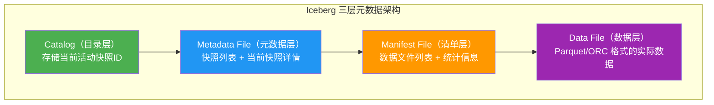
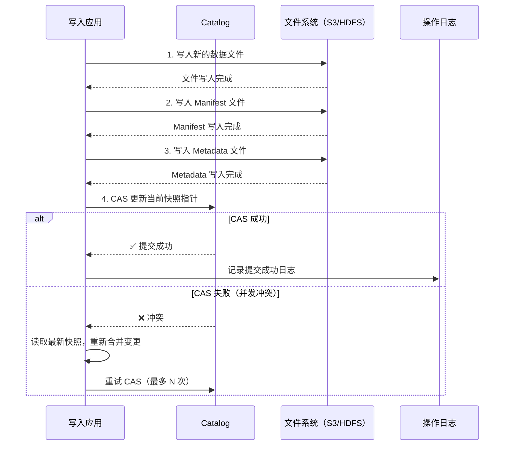
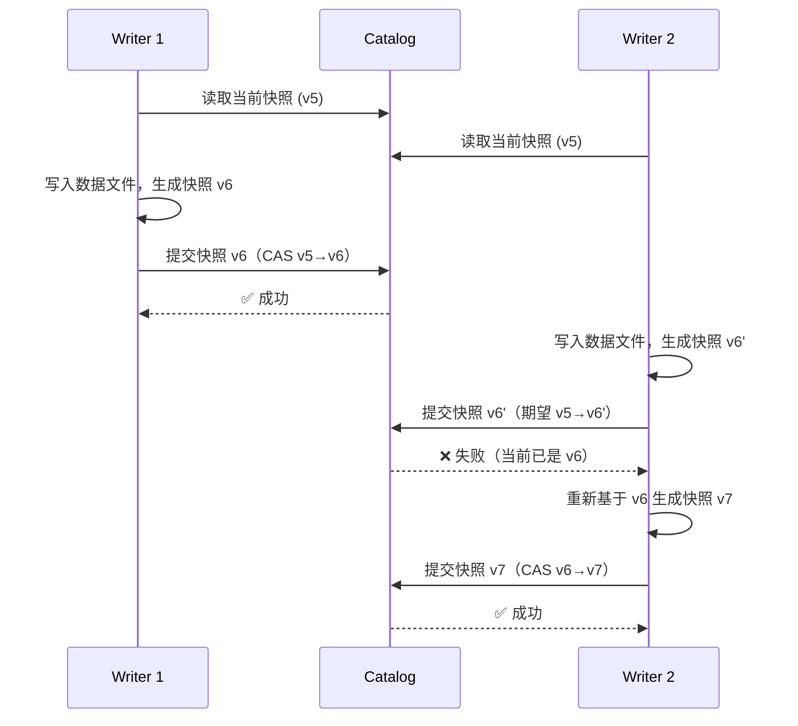
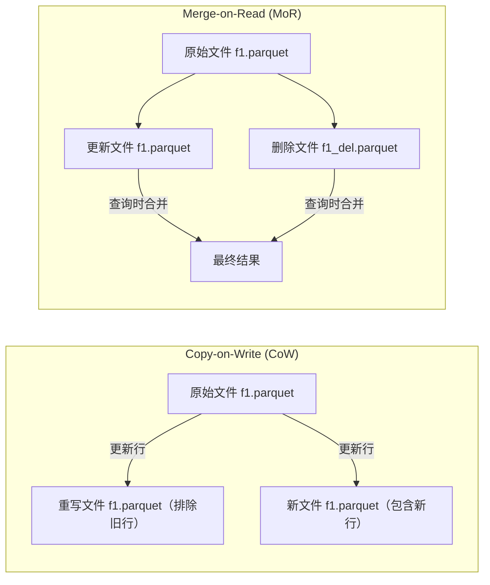
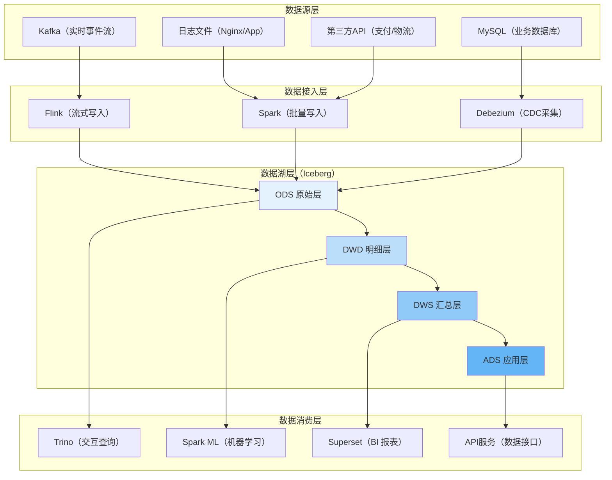
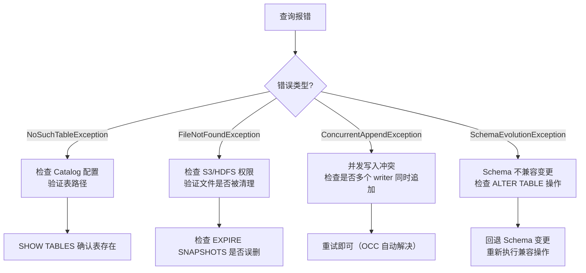

## 案例二：Apache Iceberg 实战

### 1. 案例背景与目标

#### 1.1 业务场景

某互联网公司数据平台团队需要构建企业级数据湖，承载日均 5 亿条用户行为日志、2000 万笔订单明细以及 500 万条商品属性变更记录。核心诉求如下：

| 维度 | 现状痛点 | 目标状态 |
|------|----------|----------|
| 数据更新 | 仅支持追加写入，更新需全量重写 | 支持行级更新/删除（CDC 场景） |
| 历史回溯 | 无法回溯历史版本，数据出错需人工修复 | 任意时间点快照查询（Time Travel） |
| Schema 管理 | 表结构变更需停服重建 | 在线 Schema 演进，零停机 |
| 查询性能 | 全表扫描 30 分钟以上 | 增量查询 < 30 秒 |
| 存储成本 | 三套独立存储（HDFS/S3/NAS） | 统一到 S3 对象存储，成本降低 60% |

#### 1.2 为什么选择 Iceberg

Apache Iceberg 是 Netflix 开源、Apache 基金会顶级项目，专为海量分析型数据设计的开放表格式（Open Table Format）。与传统 Hive 表相比：

| 能力 | Hive 表 | Iceberg 表 |
|------|---------|------------|
| ACID 事务 | 不支持 | 原生支持 |
| 行级更新/删除 | 不支持 | Merge-on-Read / Copy-on-Write |
| Time Travel | 不支持 | 快照级版本回溯 |
| Schema 演进 | 需停服，列不能删 | 在线加列/删列/重命名/改类型 |
| 分区演进 | 需重建表 | 动态分区，无需重写数据 |
| 隐藏分区 | 不支持 | 基于变换的分区策略 |
| 并发写入 | 竞态条件 | 乐观并发控制（OCC） |
| 引擎兼容 | 仅 Hive | Spark / Flink / Trino / Dremio / Presto |

选择 Iceberg 的关键理由：
- **开放标准**：不绑定特定计算引擎，避免厂商锁定
- **Netflix 大规模验证**：Netflix 内部管理 PB 级 Iceberg 表
- **社区活跃**：Apache 顶级项目，Snowflake / Apple / LinkedIn / Adobe 等公司参与贡献
- **演进能力最强**：Schema 演进和分区演进是 Iceberg 的独有优势
- **统计信息丰富**：每列维护 min/max/null_count/count，实现高效谓词下推和数据跳过

---

### 2. 核心架构解析

#### 2.1 三层元数据架构

Iceberg 的核心创新在于将表的元数据分为三层，每层职责清晰，自上而下形成一棵精确的文件索引树：



**Catalog 层**：维护表名到当前快照 ID 的映射，是整个表的入口点。Iceberg 支持多种 Catalog 实现：

| Catalog 类型 | 适用场景 | 底层存储 | 特点 |
|-------------|---------|---------|------|
| HiveCatalog | 已有 Hive 集群 | Hive Metastore | 兼容性最好，Hive 生态首选 |
| HadoopCatalog | 测试/小型部署 | HDFS 本地文件系统 | 无需额外服务，仅支持 HDFS |
| GlueCatalog | AWS 环境 | AWS Glue Data Catalog | 托管服务，免运维 |
| RestCatalog | 云原生/多引擎 | REST API 服务端 | 最灵活，推荐新项目使用 |
| JDBCCatalog | 自建元数据服务 | MySQL/PostgreSQL | 自主可控，适合私有化部署 |
| NessieCatalog | 版本化 Git-like 管理 | Nessie 服务端 | 支持分支/合并，适合多人协作 |

**Metadata 层**：每个快照对应一个 metadata JSON 文件，记录：
- 快照 ID 和创建时间戳
- 上一个快照 ID（形成快照链）
- 所有 Manifest 文件路径
- 表级统计信息（总行数、总文件大小等）
- Schema 版本历史（支持 Schema 回溯）
- 分区规范演变历史

**Manifest 层**：Manifest 文件是 Iceberg 性能的基石，包含：
- 数据文件路径及其格式（Parquet/ORC/Avro）
- 每列的 min/max 统计信息（用于谓词下推）
- 每列的 null 计数
- 删除文件引用（用于 Merge-on-Read）
- 分区值
- 文件级别的列级统计信息——这意味着即使同一分区内的不同文件，查询引擎也能跳过不匹配的文件

#### 2.2 提交协议（Commit Protocol）内部机制

Iceberg 的原子性写入依赖于精心设计的提交协议，理解这一机制对排查并发问题至关重要：



关键设计要点：
- **Catalog 层使用 CAS（Compare-And-Swap）** 保证原子性——只有当当前快照 ID 与预期一致时才更新
- **失败的写入者自动重试**，基于最新快照重新提交，不需要分布式锁
- **文件先写、元数据后更新**——即使进程崩溃，最多丢弃未提交的数据文件（可通过快照过期清理）
- **支持多引擎并发写入同一张表**（Spark + Flink 同时写入），冲突概率极低
- **提交过程是幂等的**——相同的操作重试不会产生副作用

#### 2.3 快照隔离与乐观并发控制

Iceberg 采用乐观并发控制（Optimistic Concurrency Control），流程如下：



并发冲突的重试策略：
- **重试次数**：默认无限重试，建议设置上限（如 3 次）避免死循环
- **冲突检测**：通过 CAS 操作检测，无需额外锁服务
- **合并策略**：重试时读取最新快照，将本地变更与最新快照合并后重新提交
- **性能影响**：低并发场景下冲突率极低（< 0.1%），高并发场景建议通过分区隔离减少冲突

#### 2.4 删除文件机制

Iceberg 支持两种删除文件格式：

| 格式 | 缩写 | 写入开销 | 读取开销 | 适用场景 |
|------|------|---------|---------|---------|
| Copy-on-Write | CoW | 高（重写数据文件） | 低（无额外合并） | 读多写少、小表 |
| Merge-on-Read | MoR | 低（仅写删除标记） | 中（需合并删除） | 写多读少、大表、CDC |



MoR 删除文件的内部结构：
- 删除文件使用 Parquet 格式存储，包含两个列：`file_path`（被删除文件路径）和 `pos`（行在文件中的位置）
- 查询时，引擎读取删除文件，过滤掉匹配 `pos` 的行
- 删除文件可以跨多个数据文件——一个删除文件可以标记多个数据文件中的行
- 当删除文件比例超过 30% 时，读性能显著下降，应触发 compaction

---

### 3. 环境搭建与基础操作

#### 3.1 环境准备

**集群配置**：

| 组件 | 版本 | 用途 |
|------|------|------|
| Hadoop | 3.3.6 | 分布式存储（HDFS） |
| Spark | 3.5.1 | 计算引擎 |
| Iceberg | 1.5.2 | 表格式层 |
| Hive Metastore | 3.1.3 | Catalog 服务 |
| Avro | 1.11.3 | 元数据序列化 |

**Spark 配置**（spark-defaults.conf）：

```properties
# Iceberg 核心配置
spark.sql.catalog.iceberg = org.apache.iceberg.spark.SparkCatalog
spark.sql.catalog.iceberg.type = hive
spark.sql.catalog.iceberg.uri = thrift://hive-metastore:9083

# 写入配置
spark.sql.shuffle.partitions = 200
spark.sql.sources.partitionOverwriteMode = dynamic

# 性能优化
spark.sql.files.maxPartitionBytes = 134217728  # 128MB per partition
spark.sql.adaptive.enabled = true
spark.sql.adaptive.coalescePartitions.enabled = true
```

**REST Catalog 配置**（推荐云原生场景）：

REST Catalog 是 Iceberg 推荐的新一代 Catalog 方案，解耦了 Catalog 服务与存储，适合多引擎混合部署：

```properties
# REST Catalog 配置（替代 HiveCatalog）
spark.sql.catalog.iceberg = org.apache.iceberg.spark.SparkCatalog
spark.sql.catalog.iceberg.type = rest
spark.sql.catalog.iceberg.uri = https://catalog.example.com/iceberg
spark.sql.catalog.iceberg.credential = client-id:client-secret
spark.sql.catalog.iceberg.scope = catalog
```

REST Catalog 的优势：
- **解耦 Catalog 与存储**：Catalog 服务无状态，可以水平扩展
- **多引擎统一**：Spark、Flink、Trino 只需配置 REST URI 即可访问同一张表
- **OAuth 2.0 认证**：支持标准的 token 认证，便于集成企业 SSO
- **简化部署**：无需维护 Hive Metastore，减少运维复杂度

#### 3.2 建表示例

以电商用户行为日志表为例：

```sql
-- 创建 Iceberg 表
CREATE TABLE iceberg.ecommerce.user_events (
    event_id        BIGINT,
    user_id         BIGINT,
    event_type      STRING      COMMENT '事件类型: click/cart/order/pay',
    product_id      BIGINT,
    category_id     INT,
    event_time      TIMESTAMP,
    session_id      STRING,
    device_type     STRING      COMMENT '设备: ios/android/web',
    ip_address      STRING,
    event_data      STRING      COMMENT 'JSON格式扩展数据'
) USING iceberg
PARTITIONED BY (days(event_time), event_type)
TBLPROPERTIES (
    'format-version' = '2',
    'write.format.default' = 'parquet',
    'write.parquet.compression-codec' = 'zstd',
    'write.target-file-size-bytes' = '134217728',
    'write.distribution-mode' = 'hash',
    'write.distribution-hash-bucket-num' = '16',
    'delete.mode' = 'merge-on-read',
    'commit.manifest-merge.enabled' = 'true',
    'history.expire.max-snapshot-age-ms' = '86400000',
    'write.parquet.page-size-bytes' = '1048576'
);
```

**关键属性解读**：

| 属性 | 值 | 说明 |
|------|-----|------|
| format-version | 2 | 启用行级删除（v1 不支持 MoR） |
| write.target-file-size-bytes | 128MB | 控制输出文件大小，太小产生小文件，太大影响并行度 |
| write.distribution-mode | hash | 写入时按 hash 分布，减少小文件 |
| write.distribution-hash-bucket-num | 16 | hash 分桶数，建议设为 executor 数的 1/4~1/2 |
| history.expire.max-snapshot-age-ms | 86400000 | 快照保留 24 小时，过期自动清理 |
| write.parquet.page-size-bytes | 1048576 | Parquet 页大小 1MB，影响列式存储的读取粒度 |

#### 3.3 从 Hive 表迁移到 Iceberg

Iceberg 提供原地迁移（In-place Migration）能力，可以在不复制数据的情况下将 Hive 表转换为 Iceberg 表：

```sql
-- 方案一：原地迁移（推荐，零数据拷贝）
-- 直接将 Hive 表的底层数据文件转换为 Iceberg 管理的文件
ALTER TABLE hive.ecommerce.user_events_old
SET TBLPROPERTIES (
    'provider' = 'iceberg',
    'format-version' = '2'
);

-- 方案二：新建 Iceberg 表 + 批量迁移（更安全）
-- 适用于需要同时修改 Schema 和分区策略的场景
CREATE TABLE iceberg.ecommerce.user_events_new (...)
USING iceberg
PARTITIONED BY (days(event_time), event_type);

INSERT INTO iceberg.ecommerce.user_events_new
SELECT * FROM hive.ecommerce.user_events_old;

-- 验证数据完整性后切换表名
ALTER TABLE hive.ecommerce.user_events_old RENAME TO hive.ecommerce.user_events_legacy;
ALTER TABLE iceberg.ecommerce.user_events_new RENAME TO iceberg.ecommerce.user_events;
```

迁移注意事项：
- **原地迁移** 适用于 Hive 表底层已经是 Parquet/ORC 格式的场景，零数据拷贝
- **新建表迁移** 适用于需要重新设计分区、Schema 或存储格式的场景
- 迁移前务必备份元数据，确认业务方能接受短暂停服
- 迁移后旧表的元数据不会自动删除，需手动清理

---

### 4. 核心操作实战

#### 4.1 数据写入

**批量写入（Spark SQL）**：

```sql
-- 从 Hive 表迁移到 Iceberg
INSERT INTO iceberg.ecommerce.user_events
SELECT
    event_id,
    user_id,
    event_type,
    product_id,
    category_id,
    CAST(event_time AS TIMESTAMP),
    session_id,
    device_type,
    ip_address,
    event_data
FROM hive.ecommerce.user_events_raw
WHERE dt = '2025-01-15';
```

**增量流式写入（Flink）**：

```sql
-- Flink SQL：Kafka 源表
CREATE TABLE kafka_events (
    event_id    BIGINT,
    user_id     BIGINT,
    event_type  STRING,
    product_id  BIGINT,
    event_time  TIMESTAMP(3),
    WATERMARK FOR event_time AS event_time - INTERVAL '5' SECOND
) WITH (
    'connector' = 'kafka',
    'topic' = 'user-events',
    'properties.bootstrap.servers' = 'kafka:9092',
    'format' = 'json'
);

-- 流式写入 Iceberg
INSERT INTO iceberg.ecommerce.user_events
SELECT * FROM kafka_events;
```

Flink 写入 Iceberg 的关键配置：

```sql
-- Flink Iceberg Connector 配置
CREATE TABLE iceberg_sink (...) WITH (
    'connector' = 'iceberg',
    'catalog-type' = 'hive',
    'catalog-uri' = 'thrift://hive-metastore:9083',
    'catalog-name' = 'iceberg',
    'warehouse' = 's3://data-lake/warehouse',
    'write.upsert.enabled' = 'true',              -- 启用 upsert
    'write.target-file-size-bytes' = '134217728',  -- 128MB 目标文件
    'sink.checkpoint interval' = '60s',            -- checkpoint 间隔
    'sink.flush-max-size' = '512MB',               -- 最大刷写大小
    'write.distribution-mode' = 'hash',
    'write.distribution-hash-bucket-num' = '16'
);
```

Flink 写入优化要点：
- **checkpoint 间隔**：建议 60 秒，过短导致小文件过多，过长影响数据可见性
- **upsert.enabled**：对有主键的表启用 upsert，避免重复数据
- **sink.flush-max-size**：控制每次 checkpoint 写入的最大数据量，防止 OOM

**Python API 写入**：

```python
from pyspark.sql import SparkSession

spark = SparkSession.builder \
    .appName("Iceberg-Write") \
    .config("spark.sql.catalog.iceberg", "org.apache.iceberg.spark.SparkCatalog") \
    .config("spark.sql.catalog.iceberg.type", "hive") \
    .getOrCreate()

# DataFrame 写入 Iceberg
df = spark.read.json("s3://data-lake/raw/events/2025-01-15/")
df.writeTo("iceberg.ecommerce.user_events") \
    .append() \
    .createOrReplaceTempView("events_staging")

# 使用 overwritePartitions 实现分区级覆写
spark.sql("""
    INSERT OVERWRITE iceberg.ecommerce.user_events
    SELECT * FROM events_staging
""")
```

#### 4.2 数据查询

**全量查询**：

```sql
-- 基本查询（自动利用分区裁剪和谓词下推）
SELECT
    product_id,
    COUNT(DISTINCT user_id) AS uv,
    COUNT(*) AS pv,
    SUM(CASE WHEN event_type = 'order' THEN 1 ELSE 0 END) AS order_cnt
FROM iceberg.ecommerce.user_events
WHERE event_time BETWEEN '2025-01-15' AND '2025-01-16'
    AND event_type IN ('click', 'order')
GROUP BY product_id
ORDER BY order_cnt DESC
LIMIT 100;
```

**增量查询**（Iceberg 独有能力）：

```sql
-- 查询指定快照之间的增量数据（ETL 场景极有价值）
SELECT * FROM iceberg.ecommerce.user_events
WHERE event_time >= '2025-01-15 08:00:00'
  AND event_time < '2025-01-15 09:00:00'
  AND event_type = 'order';

-- 利用 Iceberg 的增量读取能力（仅读取自上次快照以来的新数据）
SELECT * FROM iceberg.ecommerce.user_events
/*+ OPTIONS('start-snapshot-id' = '8325129724891490891') */
WHERE event_time >= '2025-01-15';
```

**通过 Trino/Presto 查询**（交互式分析）：

```sql
-- Trino 查询 Iceberg 表
SELECT
    device_type,
    DATE_TRUNC('hour', event_time) AS hour,
    COUNT(*) AS event_count
FROM iceberg.ecommerce.user_events
WHERE event_time >= CURRENT_DATE - INTERVAL '1' DAY
GROUP BY 1, 2
ORDER BY 1, 2;
```

#### 4.3 行级更新与删除

**Merge-on-Read 模式**（适用于高频率更新）：

```sql
-- 更新操作：将特定用户的事件类型修正
UPDATE iceberg.ecommerce.user_events
SET event_type = 'view'
WHERE user_id = 123456
    AND event_type = 'click'
    AND event_time >= '2025-01-15';

-- 删除操作：清理测试账号数据
DELETE FROM iceberg.ecommerce.user_events
WHERE user_id IN (0, -1, 999999)
    AND event_time < '2025-01-01';

-- MERGE INTO：CDC 场景的标配操作
MERGE INTO iceberg.ecommerce.user_events AS target
USING (
    SELECT
        event_id,
        user_id,
        event_type,
        product_id,
        event_time,
        ROW_NUMBER() OVER (PARTITION BY event_id ORDER BY event_time DESC) AS rn
    FROM iceberg.ecommerce.user_events_updates
) AS source
ON target.event_id = source.event_id AND source.rn = 1
WHEN MATCHED AND source.event_type = 'DELETE' THEN
    DELETE
WHEN MATCHED THEN
    UPDATE SET
        target.event_type = source.event_type,
        target.product_id = source.product_id
WHEN NOT MATCHED THEN
    INSERT (event_id, user_id, event_type, product_id, event_time)
    VALUES (source.event_id, source.user_id, source.event_type, source.product_id, source.event_time);
```

**MERGE INTO 性能优化建议**：
- 使用 `ROW_NUMBER()` 去重，避免同一 `event_id` 出现多条更新记录导致多次匹配
- 条件判断 `source.rn = 1` 放在 ON 子句中，避免 MERGE 执行后再过滤
- 对于大批量更新，建议先用 `REWRITE DATA FILES` 触发 compaction，再执行 MERGE

#### 4.4 Time Travel 与版本管理

```sql
-- 查询历史快照列表
SELECT
    committed_at,
    snapshot_id,
    operation,
    summary
FROM iceberg.ecommerce.user_events.snapshots
ORDER BY committed_at DESC
LIMIT 10;

-- 按快照 ID 查询历史数据
SELECT * FROM iceberg.ecommerce.user_events
VERSION AS OF 8325129724891490891;

-- 按时间戳查询历史数据
SELECT * FROM iceberg.ecommerce.user_events
TIMESTAMP AS OF '2025-01-15 10:30:00';

-- 比较两个版本的差异（Delta Lake 不支持此功能）
SELECT * FROM iceberg.ecommerce.user_events
CHANGES
  BETWEEN 8325129724891490891 AND 8659516286295790025
  INCLUSIVE
ORDER BY committed_at;

-- 回滚到指定快照（误操作恢复）
CALL iceberg.system.rollback_to_snapshot(
    table => 'ecommerce.user_events',
    snapshot_id => 8325129724891490891
);
```

**Time Travel 的典型应用场景**：
- **数据审计**：回溯任意时间点的数据状态，满足合规要求
- **误操作恢复**：错误的 UPDATE/DELETE 后，回滚到操作前的快照
- **增量 ETL**：利用 `start-snapshot-id` 只处理新增数据，避免全量重算
- **数据比对**：使用 `CHANGES` 语法对比两个快照的差异，快速定位数据变化

#### 4.5 Schema 演进

Iceberg 的 Schema 演进能力是其最大亮点之一——所有操作在线完成，无需重写数据：

```sql
-- 加列（向后兼容，不影响已有查询）
ALTER TABLE iceberg.ecommerce.user_events
ADD COLUMN geo_country STRING COMMENT '国家代码'
AFTER ip_address;

-- 加嵌套列
ALTER TABLE iceberg.ecommerce.user_events
ADD COLUMN event_data.browser STRING
AFTER event_data;

-- 重命名列（仅修改元数据，零数据移动）
ALTER TABLE iceberg.ecommerce.user_events
RENAME COLUMN device_type TO client_device;

-- 修改列类型（支持类型提升 type promotion）
ALTER TABLE iceberg.ecommerce.user_events
ALTER COLUMN category_id TYPE BIGINT;

-- 删除列（仅修改元数据，不删除实际数据文件中的列）
ALTER TABLE iceberg.ecommerce.user_events
DROP COLUMN ip_address;

-- 重置列的有序位置
ALTER TABLE iceberg.ecommerce.user_events
REORDER COLUMN event_data AFTER session_id;

-- 查看 Schema 演进历史
SELECT
    timestamp,
    operation,
    schema_update
FROM iceberg.ecommerce.user_events.schema_history
ORDER BY timestamp DESC;
```

**Schema 演进规则**：

| 操作 | 是否兼容 | 说明 |
|------|---------|------|
| 加列（末尾） | ✅ 完全兼容 | 旧查询不受影响 |
| 加列（指定位置） | ✅ 兼容 | 旧查询不受影响 |
| 重命名列 | ⚠️ 有条件 | 需同时更新所有查询代码 |
| 删除列 | ⚠️ 有条件 | 旧查询返回 null，不报错 |
| 类型提升（int→bigint） | ✅ 兼容 | 向上兼容，旧查询自动适配 |
| 类型提升（float→double） | ✅ 兼容 | 精度提升，安全操作 |
| 类型收缩（bigint→int） | ❌ 不兼容 | 可能丢失数据 |

#### 4.6 分区演进

这是 Iceberg 独有的能力——无需重建表、无需重写数据，即可更改分区策略：

```sql
-- 原始分区：按天 + 事件类型
-- PARTITIONED BY (days(event_time), event_type)

-- 演进为按月 + 设备类型（适应业务分析模式变化）
ALTER TABLE iceberg.ecommerce.user_events
DROP PARTITION FIELD days(event_time);

ALTER TABLE iceberg.ecommerce.user_events
DROP PARTITION FIELD event_type;

ALTER TABLE iceberg.ecommerce.user_events
ADD PARTITION FIELD months(event_time);

ALTER TABLE iceberg.ecommerce.user_events
ADD PARTITION FIELD device_type;
```

演进后：
- **新写入的数据**按新分区策略存储
- **历史数据**保持原有分区不变
- 查询时 Iceberg 自动处理两种分区策略的合并，对用户完全透明

---

### 5. 生产级性能优化

#### 5.1 小文件治理

小文件是数据湖的头号性能杀手。当文件数量从几百个增长到几十万个时，查询性能会下降 10 倍以上。Iceberg 提供了多种治理手段：

```sql
-- 手动触发 Manifest 合并
ALTER TABLE iceberg.ecommerce.user_events
REWRITE MANIFESTS;

-- 手动合并小文件（将 < 128MB 的文件合并为 > 128MB）
ALTER TABLE iceberg.ecommerce.user_events
REWRITE DATA FILES
WHERE event_time >= '2025-01-01'
  AND event_time < '2025-02-01'
OPTIONS (
    'target-file-size-bytes' = '134217728',
    'max-concurrent-file-group-rewrites' = '5'
);

-- 清理已完成的删除文件（MoR 模式下）
ALTER TABLE iceberg.ecommerce.user_events
REWRITE DATA FILES
OPTIONS (
    'partial-progress.enabled' = 'true',
    'partial-progress.max-commits' = '10'
);

-- 过期快照清理（回收存储空间）
ALTER TABLE iceberg.ecommerce.user_events
EXPIRE SNAPSHOTS
SET current = 0;
```

**自动清理配置**：

```yaml
# 在 TBLPROPERTIES 中设置自动清理策略
'metadata.delete-after-commit.enabled' = 'true',
'metadata.previous-versions-max' = '100',
'history.expire.max-snapshot-age-ms' = '86400000',  # 24小时
'snapshot-log.max-age-ms' = '604800000'              # 7天
```

**小文件治理的量化标准**：

| 指标 | 健康阈值 | 告警阈值 | 处理措施 |
|------|---------|---------|---------|
| 单表文件数量 | < 10,000 | > 50,000 | 触发 REWRITE DATA FILES |
| 单分区文件数量 | < 1,000 | > 5,000 | 缩小分区粒度或合并 |
| 单文件平均大小 | > 64MB | < 16MB | 合并小文件 |
| 删除文件占比 | < 10% | > 30% | 触发 compaction |

#### 5.2 写入优化

```sql
-- Spark 写入优化配置
SET spark.sql.sources.partitionOverwriteMode = dynamic;
SET spark.sql.shuffle.partitions = 200;

-- 按分区分布写入（减少 shuffle）
INSERT INTO iceberg.ecommerce.user_events
SELECT /*+ COALESCE(16) */ *
FROM staging.user_events
DISTRIBUTE BY user_id % 16;
```

```python
# Python 写入优化
df.writeTo("iceberg.ecommerce.user_events") \
    .option("write.format.default", "parquet") \
    .option("write.parquet.compression-codec", "zstd") \
    .option("write.target-file-size-bytes", "134217728") \
    .option("write.distribution-mode", "hash") \
    .option("write.distribution-hash-bucket-num", "16") \
    .option("write.parquet.page-size-bytes", "1048576") \
    .option("write.parquet.dict-size-bytes", "2097152") \
    .append()
```

#### 5.3 查询优化

**谓词下推**是 Iceberg 查询性能的关键。Manifest 文件中的列统计信息（min/max/null_count）让引擎在读取数据前就能跳过无关文件：

```sql
-- 良好的查询模式（利用分区裁剪 + 谓词下推）
SELECT * FROM iceberg.ecommerce.user_events
WHERE event_time >= '2025-01-15'
    AND event_time < '2025-01-16'
    AND user_id = 123456;
-- 分区裁剪：仅读取 1 天的分区
-- 谓词下推：在 manifest 中跳过 user_id 不在范围内的文件

-- 不良的查询模式（无法利用索引）
SELECT * FROM iceberg.ecommerce.user_events
WHERE user_id % 100 = 42;
-- 无法下推取模操作，必须全表扫描
```

**Spark 读取优化配置**：

```properties
# 启用 AQE 自适应查询执行
spark.sql.adaptive.enabled = true
spark.sql.adaptive.coalescePartitions.enabled = true
spark.sql.adaptive.advisoryPartitionSizeInMB = 128

# Parquet 读取优化
spark.sql.parquet.enableVectorizedReader = true
spark.sql.parquet.mergeSchema = false

# Iceberg 特定优化
spark.sql.catalog.iceberg.cache-enabled = true
spark.sql.catalog.iceberg.cache.expiration-interval-ms = 60000
```

**查询性能优化清单**：

| 优化手段 | 效果 | 实施难度 |
|---------|------|---------|
| 分区裁剪 | 减少 90%+ 扫描量 | 低（合理设计分区即可） |
| 谓词下推 | 跳过不匹配文件 | 低（查询条件自然利用） |
| 列裁剪 | 减少 50%+ IO | 低（SELECT 指定列即可） |
| AQE 自适应执行 | 减少 30%+ shuffle | 低（配置开关） |
| 向量化读取 | 提升 2-3x 解码速度 | 低（配置开关） |

#### 5.4 S3 对象存储优化

如果数据存储在 S3 上，以下优化可以显著提升性能：

```properties
# Hadoop S3 配置
fs.s3a.connection.maximum = 100           # 最大连接数
fs.s3a.attempts.maximum = 10              # 最大重试次数
fs.s3a.experimental.input.fadvise = true  # 启用预读优化
fs.s3a.block.size = 134217728            # 128MB 块大小

# S3 分片上传优化
fs.s3a.multipart.size = 134217728        # 分片大小 128MB
fs.s3a.multipart.threshold = 134217728   # 触发分片上传的阈值
```

**S3 性能要点**：
- **避免小文件**：每个文件 > 128MB，避免 S3 请求开销成为瓶颈
- **使用 S3 Express One Zone**（如可用）：延迟降低 10x，适合频繁访问的热数据
- **启用 S3 Transfer Acceleration**：跨区域写入场景，减少网络延迟
- **合理设置连接池**：避免过多并发请求触发 S3 限流（默认 5,500 GET / 3,500 PUT）

#### 5.5 监控指标

```sql
-- 查看表的文件统计
SELECT
    content,
    file_format,
    COUNT(*) AS file_count,
    SUM(file_size_in_bytes) / 1024 / 1024 / 1024 AS total_size_gb,
    SUM(record_count) AS total_records,
    AVG(file_size_in_bytes) / 1024 / 1024 AS avg_file_size_mb
FROM iceberg.ecommerce.user_events.files
GROUP BY content, file_format;

-- 查看快照大小变化趋势
SELECT
    committed_at,
    operation,
    CAST(summary['total-files-size'] AS BIGINT) / 1024 / 1024 / 1024 AS size_gb,
    CAST(summary['total-records'] AS BIGINT) AS records,
    CAST(summary['total-data-files'] AS INT) AS data_files,
    CAST(summary['total-delete-files'] AS INT) AS delete_files
FROM iceberg.ecommerce.user_events.snapshots
ORDER BY committed_at DESC
LIMIT 20;
```

---

### 6. 完整实战场景：电商数据湖建设

#### 6.1 架构设计



#### 6.2 分层建表与 ETL 流程

**ODS 原始层**（保留原始数据格式）：

```sql
CREATE TABLE iceberg.ecommerce.ods_user_events (
    raw_json    STRING,
    event_time  TIMESTAMP,
    kafka_partition INT,
    kafka_offset   BIGINT
) USING iceberg
PARTITIONED BY (days(event_time))
TBLPROPERTIES (
    'format-version' = '2',
    'write.format.default' = 'parquet',
    'write.parquet.compression-codec' = 'snappy',
    'write.target-file-size-bytes' = '67108864'  -- 64MB，原始层文件小一些
);
```

**DWD 明细层**（清洗、标准化后的明细数据）：

```sql
CREATE TABLE iceberg.ecommerce.dwd_user_events (
    event_id        BIGINT,
    user_id         BIGINT,
    event_type      STRING,
    product_id      BIGINT,
    category_id     INT,
    event_time      TIMESTAMP,
    session_id      STRING,
    device_type     STRING,
    ip_address      STRING,
    country         STRING,
    city            STRING,
    event_data      MAP<STRING, STRING>
) USING iceberg
PARTITIONED BY (months(event_time), event_type)
TBLPROPERTIES (
    'format-version' = '2',
    'write.format.default' = 'parquet',
    'write.parquet.compression-codec' = 'zstd',
    'write.target-file-size-bytes' = '134217728',
    'write.distribution-mode' = 'hash',
    'delete.mode' = 'merge-on-read'
);
```

**DWS 汇总层**（按维度预聚合）：

```sql
CREATE TABLE iceberg.ecommerce.dws_user_daily_stats (
    user_id         BIGINT,
    stat_date       DATE,
    click_count     BIGINT,
    cart_count      BIGINT,
    order_count     BIGINT,
    pay_amount      DECIMAL(18, 2),
    active_minutes  INT,
    device_types    ARRAY<STRING>,
    top_category    INT
) USING iceberg
PARTITIONED BY (months(stat_date))
TBLPROPERTIES (
    'format-version' = '2',
    'write.format.default' = 'parquet',
    'write.parquet.compression-codec' = 'zstd'
);
```

**ETL 核心 SQL**（ODS → DWD）：

```sql
-- Spark SQL ETL 任务
INSERT OVERWRITE iceberg.ecommerce.dwd_user_events
SELECT
    -- JSON 解析 + 数据清洗
    CAST(get_json_object(raw_json, '$.event_id') AS BIGINT) AS event_id,
    CAST(get_json_object(raw_json, '$.user_id') AS BIGINT) AS user_id,
    LOWER(get_json_object(raw_json, '$.event_type')) AS event_type,
    CAST(get_json_object(raw_json, '$.product_id') AS BIGINT) AS product_id,
    CAST(get_json_object(raw_json, '$.category_id') AS INT) AS category_id,
    event_time,
    get_json_object(raw_json, '$.session_id') AS session_id,
    COALESCE(
        CASE
            WHEN get_json_object(raw_json, '$.ua') LIKE '%iPhone%' THEN 'ios'
            WHEN get_json_object(raw_json, '$.ua') LIKE '%Android%' THEN 'android'
            ELSE 'web'
        END,
        'unknown'
    ) AS device_type,
    get_json_object(raw_json, '$.ip') AS ip_address,
    -- IP 地理定位（使用 UDF）
    ip_to_country(get_json_object(raw_json, '$.ip')) AS country,
    ip_to_city(get_json_object(raw_json, '$.ip')) AS city,
    -- 扩展字段解析为 Map
    str_to_map(get_json_object(raw_json, '$.extra')) AS event_data
FROM iceberg.ecommerce.ods_user_events
WHERE event_time >= '{{date}}'
    AND event_time < '{{date}}' + INTERVAL 1 DAY
    AND get_json_object(raw_json, '$.event_id') IS NOT NULL;
```

#### 6.3 数据质量保障

```sql
-- 数据质量检查 SQL
WITH source_count AS (
    SELECT COUNT(*) AS cnt FROM iceberg.ecommerce.ods_user_events
    WHERE event_time >= '2025-01-15' AND event_time < '2025-01-16'
),
target_count AS (
    SELECT COUNT(*) AS cnt FROM iceberg.ecommerce.dwd_user_events
    WHERE event_time >= '2025-01-15' AND event_time < '2025-01-16'
),
null_check AS (
    SELECT
        SUM(CASE WHEN event_id IS NULL THEN 1 ELSE 0 END) AS null_event_id,
        SUM(CASE WHEN user_id IS NULL THEN 1 ELSE 0 END) AS null_user_id,
        SUM(CASE WHEN event_type IS NULL THEN 1 ELSE 0 END) AS null_event_type,
        COUNT(*) AS total_rows
    FROM iceberg.ecommerce.dwd_user_events
    WHERE event_time >= '2025-01-15' AND event_time < '2025-01-16'
)
SELECT
    s.cnt AS source_rows,
    t.cnt AS target_rows,
    ROUND(t.cnt * 100.0 / s.cnt, 2) AS coverage_pct,
    n.null_event_id,
    n.null_user_id,
    n.null_event_type,
    n.total_rows
FROM source_count s
CROSS JOIN target_count t
CROSS JOIN null_check n;
```

---

### 7. Iceberg 与其他表格式对比

| 特性 | Iceberg | Delta Lake | Hudi |
|------|---------|------------|------|
| 开发公司 | Netflix → Apache | Databricks | Uber → Apache |
| ACID 事务 | ✅ | ✅ | ✅ |
| Schema 演进 | ✅ 支持类型提升/加列/删列/重命名 | ⚠️ 仅支持加列 | ⚠️ 仅支持加列 |
| 分区演进 | ✅ 唯一支持 | ❌ 不支持 | ❌ 不支持 |
| Time Travel | ✅ 快照级 | ✅ 版本号级 | ✅ commit 级 |
| 增量查询 | ✅ 原生支持 | ✅ 需 Delta Sharing | ✅ 原生支持 |
| 行级删除 | CoW / MoR | CoW / MoR | CoW / MoR |
| 引擎支持 | Spark/Flink/Trino/Presto/Dremio | Spark 为主 | Spark/Flink |
| 开放标准 | ✅ 完全开放 | ⚠️ Delta Sharing 开放 | ⚠️ 部分开放 |
| 小文件治理 | ✅ 自动合并 + REWRITE | ⚠️ 需手动 Z-Order | ✅ 静态/动态分区 |
| 适用场景 | 多引擎统一表格式 | Databricks 生态 | 增量 CDC 为主 |

**选型建议**：
- **多引擎混合使用**：选 Iceberg（Trino + Spark + Flink 混合查询）
- **纯 Spark 生态 + Databricks**：选 Delta Lake
- **CDC 为主、流式写入频繁**：选 Hudi
- **长期演进、避免锁定**：选 Iceberg（开放标准优势最明显）

---

### 8. 安全与权限管理

#### 8.1 表级权限控制

Iceberg 本身不实现权限管理，但可以通过 Catalog 层和计算引擎层实现细粒度访问控制：

```sql
-- Spark SQL 行级过滤（配合 Ranger/Sentry）
-- 配置 Ranger 策略后，以下查询自动过滤无权限数据
SELECT * FROM iceberg.ecommerce.user_events
WHERE region = 'asia';

-- 列级脱敏（配合 Ranger Column Masking）
-- 配置脱敏策略后，以下列自动脱敏
SELECT
    user_id,
    MASK(ip_address) AS ip_address,     -- 自动脱敏为 192.***.***.***
    MASK(phone_number) AS phone_number   -- 自动脱敏为 138****1234
FROM iceberg.ecommerce.user_events;
```

#### 8.2 数据加密

```properties
# HDFS 透明加密（TDE）
# 在 Iceberg 表创建时指定加密区
hadoop fs -mkdir /encryption/iceberg/ecommerce
hadoop fs -chmod 700 /encryption/iceberg/ecommerce

# Spark 配置
spark.sql.catalog.iceberg.warehouse = /encryption/iceberg/ecommerce
```

**加密方案对比**：

| 方案 | 加密层级 | 性能影响 | 适用场景 |
|------|---------|---------|---------|
| HDFS TDE | 文件级 | 低（< 5%） | HDFS 存储 |
| S3 SSE-S3 | 对象级 | 低（< 3%） | AWS S3 |
| S3 SSE-KMS | 对象级 + 密钥管理 | 中（< 10%） | 合规要求高 |
| 客户端加密 | 数据级 | 高（15-30%） | 极端安全要求 |

#### 8.3 审计日志

Iceberg 的操作日志天然支持审计追踪：

```sql
-- 查看所有写入操作的审计日志
SELECT
    committed_at,
    operation,
    snapshot_id,
    summary['spark.app.id'] AS app_id,
    summary['total-data-files'] AS data_files,
    summary['total-records'] AS records
FROM iceberg.ecommerce.user_events.snapshots
ORDER BY committed_at DESC;

-- 查看特定时间段的所有操作
SELECT
    committed_at,
    operation,
    snapshot_id,
    CASE operation
        WHEN 'append' THEN '数据追加'
        WHEN 'overwrite' THEN '数据覆写'
        WHEN 'delete' THEN '数据删除'
        WHEN 'replace' THEN '数据替换'
        ELSE operation
    END AS operation_desc
FROM iceberg.ecommerce.user_events.snapshots
WHERE committed_at >= '2025-01-15'
ORDER BY committed_at;
```

---

### 9. 常见误区与避坑指南

#### 误区一：忽略 Manifest 合并导致查询变慢

**现象**：写入频繁后查询性能持续下降。

**原因**：每次写入都会生成新的 Manifest 文件，不合并会导致查询时需要读取大量 Manifest。

**解决方案**：
```sql
-- 定期执行 Manifest 合并
ALTER TABLE iceberg.ecommerce.user_events
REWRITE MANIFESTS
ORDER BY partition;

-- 自动合并配置
'commit.manifest-merge.enabled' = 'true',
'manifest-min-count-to-merge' = '100'
```

#### 误区二：Format Version 选错

**现象**：创建了 v1 表后需要行级删除，只能重建表。

**解决方案**：始终使用 `format-version = 2`，除非有明确理由使用 v1。

```sql
-- 检查表版本
DESCRIBE EXTENDED iceberg.ecommerce.user_events;
-- 查看 TBLPROPERTIES 中的 format-version
```

#### 误区三：小文件不清理

**现象**：表的文件数量从几百个增长到几十万个，查询变慢 10 倍以上。

**根本原因**：频繁的小批量写入、流式写入未控制 commit 频率。

**解决方案**：
```sql
-- 手动合并
ALTER TABLE iceberg.ecommerce.user_events
REWRITE DATA FILES;

-- Flink 端控制 commit 频率
'SinkCheckpointInterval' = '60000',  -- 60秒合并一次
'upsert.enabled' = 'true'
```

#### 误区四：快照膨胀导致元数据膨胀

**现象**：表的 metadata 文件越来越多，元数据读取变慢。

**原因**：未配置快照过期策略。

**解决方案**：
```sql
-- 设置快照保留策略
ALTER TABLE iceberg.ecommerce.user_events
SET TBLPROPERTIES (
    'history.expire.max-snapshot-age-ms' = '86400000',
    'history.expire.min-snapshots-to-keep' = '10'
);

-- 手动过期
ALTER TABLE iceberg.ecommerce.user_events
EXPIRE SNAPSHOTS
WHERE committed_at < CURRENT_DATE - INTERVAL '7' DAY;
```

#### 误区五：CoW 和 MoR 选错

**场景**：小表（< 10GB）选了 MoR，导致删除文件堆积，查询时合并开销大。

**经验法则**：

| 表大小 | 写入频率 | 更新比例 | 推荐模式 |
|--------|---------|---------|---------|
| < 10GB | 任意 | 任意 | CoW |
| 10GB - 100GB | 低频 | < 5% | CoW |
| 10GB - 100GB | 高频 | > 5% | MoR |
| > 100GB | 低频 | < 5% | CoW |
| > 100GB | 高频 | > 5% | MoR |

#### 误区六：过度分区导致性能下降

**现象**：分区数量超过 10 万，查询时 Partition Discovery 需要扫描大量目录，反而变慢。

**根本原因**：过度细粒度的分区（如按小时 + 用户 ID）产生大量小文件和目录。

**解决方案**：
```sql
-- 低基数字段（如 event_type）不建议做分区字段
-- 推荐：时间分区 + 1-2 个高基数过滤字段
PARTITIONED BY (days(event_time))  -- ✅ 推荐
PARTITIONED BY (days(event_time), event_type)  -- ⚠️ 谨慎使用
PARTITIONED BY (days(event_time), event_type, device_type)  -- ❌ 过度分区
```

**分区设计经验**：
- 分区数量控制在 1,000 以内
- 单分区文件大小 > 128MB
- 时间维度建议按天或按月，不建议按小时
- 非时间维度仅在高过滤性（> 90% 数据被过滤）时才做分区

---

### 10. 生产环境运维要点

#### 10.1 定期运维任务清单

| 任务 | 频率 | 命令 | 说明 |
|------|------|------|------|
| 快照过期 | 每日 | `EXPIRE SNAPSHOTS` | 回收存储空间 |
| 小文件合并 | 每周 | `REWRITE DATA FILES` | 治理小文件 |
| Manifest 合并 | 每周 | `REWRITE MANIFESTS` | 加速元数据读取 |
| 存储统计 | 每日 | 查询 `.files` 表 | 监控存储增长 |
| 数据质量检查 | 每日 | 质量 SQL | 验证 ETL 正确性 |
| 冷数据归档 | 每月 | 迁移到冷存储 | 降低存储成本 |

#### 10.2 关键运维 SQL

```sql
-- 1. 查看表的存储分布
SELECT
    partition,
    COUNT(*) AS file_count,
    SUM(file_size_in_bytes) / 1024 / 1024 AS size_mb,
    MIN(record_count) AS min_records,
    MAX(record_count) AS max_records,
    AVG(record_count) AS avg_records
FROM iceberg.ecommerce.user_events.files
GROUP BY partition
ORDER BY size_mb DESC;

-- 2. 查找删除文件比例过高的分区（MoR 模式）
SELECT
    partition,
    SUM(CASE WHEN content = 'DATA' THEN 1 ELSE 0 END) AS data_files,
    SUM(CASE WHEN content = 'DELETES' THEN 1 ELSE 0 END) AS delete_files,
    ROUND(
        SUM(CASE WHEN content = 'DELETES' THEN file_size_in_bytes ELSE 0 END) * 100.0
        / NULLIF(SUM(CASE WHEN content = 'DATA' THEN file_size_in_bytes ELSE 0 END), 0),
        2
    ) AS delete_ratio_pct
FROM iceberg.ecommerce.user_events.files
GROUP BY partition
HAVING delete_ratio_pct > 30
ORDER BY delete_ratio_pct DESC;

-- 3. 查看并发写入历史
SELECT
    committed_at,
    operation,
    snapshot_id,
    summary['total-data-files'] AS data_files,
    summary['total-records'] AS records
FROM iceberg.ecommerce.user_events.snapshots
ORDER BY committed_at DESC
LIMIT 30;
```

#### 10.3 故障排查流程



---

### 11. 实施效果与经验总结

#### 11.1 实施效果

| 指标 | 优化前（Hive 表） | 优化后（Iceberg 表） | 提升 |
|------|-------------------|---------------------|------|
| 批量查询延迟（日粒度） | 25 分钟 | 3 分钟 | 8.3x |
| 增量查询延迟 | 不支持 | 8 秒 | — |
| Schema 变更耗时 | 4 小时（重建表） | 2 秒（元数据更新） | 7200x |
| 存储成本（月均） | ¥12 万 | ¥5 万 | -58% |
| 数据回溯能力 | 不支持 | 秒级快照查询 | — |
| 并发写入支持 | 需加锁 | 乐观并发控制 | — |

#### 11.2 核心经验

1. **Format Version 选 v2**：除非极端场景，否则始终使用 v2，为未来功能留余地
2. **分区设计遵循"大文件原则"**：单个分区文件 > 128MB，避免过多分区导致小文件
3. **写入时控制 commit 频率**：Flink 场景建议 60 秒一次，避免元数据膨胀
4. **定期执行清理三件套**：EXPIRE SNAPSHOTS + REWRITE DATA FILES + REWRITE MANIFESTS
5. **MoR 模式注意删除文件堆积**：删除比例 > 30% 时必须触发 compaction
6. **监控 metadata 文件数量**：metadata 文件 > 1000 个时查询性能显著下降
7. **多引擎写入用 RestCatalog**：避免 Hive Metastore 成为单点瓶颈
8. **测试环境先验证 Schema 演进**：虽然 Iceberg 支持在线演进，但类型不兼容的变更仍会导致问题
9. **数据安全提前规划**：上线前就配置好 Ranger 策略和加密方案，避免事后补救
10. **建立自动化运维体系**：用 Airflow/DolphinScheduler 定期执行清理和质量检查，减少人工干预
