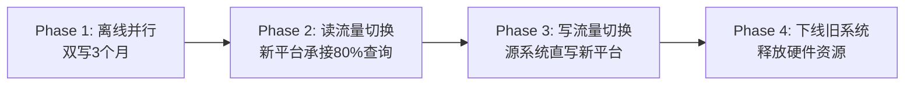

# 实战案例：数据湖与数据仓库的工程化落地

理论与架构终归要在真实业务中经受检验。本章选取三个具有代表性的实战案例——Delta Lake 构建实时数据湖、Apache Iceberg 驱动多引擎分析平台、以及传统数据仓库向湖仓一体迁移——从需求分析、架构设计、关键实现到踩坑总结，完整还原企业级数据平台从零到一的落地过程。每个案例均附有可复用的代码片段、配置模板和经验清单，帮助读者直接将方案映射到自身业务场景。

---

## 案例一：Delta Lake 实战——电商平台实时数据湖建设

### 业务背景

某中型电商平台日均订单量 50 万，核心痛点：

- **数据时效性差**：T+1 的 Hive 表无法支撑实时运营决策，促销活动期间运营团队需要分钟级的 GMV、转化率、库存预警数据
- **数据质量失控**：上游系统频繁发版导致字段缺失、类型不一致，下游报表经常出现空值或异常值
- **历史数据不可回溯**：数据覆盖写入后无法追查"写入前的状态"，出了数据事故只能手工修复

### 架构设计

采用 Lambda 架构，以 Delta Lake 作为统一存储层，同时服务实时和批处理场景：

数据源（MySQL binlog / Kafka / 日志）
        │
   ┌────┴────┐
   ▼         ▼
Flink CDC   Spark Streaming
   │         │
   ▼         ▼
  Delta Lake（统一存储层）
   │
   ├──▶ 实时查询（Trino/Presto）
   ├──▶ BI 报表（Superset）
   └──▶ 批量 ETL（Spark Batch）

Delta Lake 在此架构中承担三个核心职责：

| 职责 | 对应特性 | 业务价值 |
|------|---------|---------|
| ACID 事务 | Transaction log + 乐观并发控制 | 多任务并发写入不冲突、不丢数据 |
| Schema 演化 | Schema enforcement + evolution | 上游字段变更不影响下游消费 |
| 时间旅行 | Versioned snapshots | 数据回溯与审计 |

### 关键实现

**Step 1：Flink CDC 写入 Delta Lake**

```java
// Flink SQL：MySQL binlog → Delta Lake
CREATE TABLE orders_delta (
    order_id    BIGINT,
    user_id     BIGINT,
    amount      DECIMAL(10,2),
    status      STRING,
    create_time TIMESTAMP(3),
    update_time TIMESTAMP(3),
    PRIMARY KEY (order_id) NOT ENFORCED
) WITH (
    'connector'           = 'delta-lake',
    'catalog-name'        = 'delta',
    'warehouse'           = 's3://data-lake/ecommerce/orders',
    'table-type'          = 'COMPACTED',        -- 自动小文件合并
    'checkpointing.interval' = '60000',         -- 60秒 checkpoint
    'sink.rolling-policy' = '3600000,134217728' -- 1小时或128MB滚动
);

INSERT INTO orders_delta
SELECT * FROM mysql_orders_source;
```

**Step 2：数据质量门禁**

利用 Delta Lake 的 `VALIDATE` 机制结合自定义 UDF，在写入后立即校验：

```python
from delta.tables import DeltaTable
from pyspark.sql import SparkSession

spark = SparkSession.builder \
    .config("spark.sql.extensions", "io.delta.sql.DeltaSparkSessionExtension") \
    .getOrCreate()

# 读取刚写入的数据
df = spark.read.format("delta").load("s3://data-lake/ecommerce/orders")

# 数据质量检查
def validate_orders(df, run_date):
    issues = []

    # 1. 主键唯一性
    dup_count = df.groupBy("order_id").count().filter("count > 1").count()
    if dup_count > 0:
        issues.append(f"主键重复: {dup_count} 条")

    # 2. 金额合理性（不允许负数）
    neg_amount = df.filter("amount < 0").count()
    if neg_amount > 0:
        issues.append(f"金额为负: {neg_amount} 条")

    # 3. 状态枚举校验
    invalid_status = df.filter(
        "status NOT IN ('pending','paid','shipped','completed','cancelled')"
    ).count()
    if invalid_status > 0:
        issues.append(f"无效状态: {invalid_status} 条")

    # 4. 时间字段完整性
    null_time = df.filter("create_time IS NULL").count()
    if null_time > 0:
        issues.append(f"创建时间为空: {null_time} 条")

    if issues:
        raise Exception(f"数据质量校验失败 ({run_date}): " + "; ".join(issues))

    print(f"数据质量校验通过 ({run_date}): {df.count()} 条记录")

validate_orders(df, "2025-01-15")
```

**Step 3：时间旅行——数据回溯与审计**

```python
# 查看某张表的历史版本
delta_table = DeltaTable.forPath(spark, "s3://data-lake/ecommerce/orders")
history = delta_table.history()
history.select("version", "timestamp", "operation", "operationParameters") \
       .show(truncate=False)

# 回溯到特定版本（例如版本 42 之前的数据）
df_v41 = spark.read.format("delta") \
    .option("versionAsOf", 41) \
    .load("s3://data-lake/ecommerce/orders")

# 对比两个版本的差异（找出被删除或修改的行）
from delta.tables import DeltaTable
changes = delta_table.history(5)  # 最近5个版本

for row in changes.collect():
    ver = row["version"]
    print(f"=== 版本 {ver} ({row['timestamp']}) ===")
    print(f"操作: {row['operation']}")
    print(f"详情: {row['operationParameters']}")
```

**Step 4：Z-Order 索引优化查询性能**

```python
# 对高频查询字段创建 Z-Order 索引
delta_table.optimize().executeZOrderBy("user_id", "create_time")

# 也可以在 SQL 中执行
spark.sql("""
    OPTIMIZE delta.`s3://data-lake/ecommerce/orders`
    ZORDER BY (user_id, create_time)
""")
```

Z-Order 索引将多列值通过空间填充曲线映射到一维排序，使得同时按 `user_id` 和 `create_time` 过滤时可以跳过大量无关文件（data skipping），典型场景下查询速度提升 3-10 倍。

### 遇到的坑与解决方案

| 问题 | 现象 | 根因 | 解决方案 |
|------|------|------|---------|
| 小文件膨胀 | 写入 3 小时后表目录下出现数万个 1MB 以下文件 | Flink checkpoint 频繁滚动，每次生成新文件 | 配置 `compactionSchedule` 每小时自动合并；对写入端设置 `minCommitInterval` |
| 并发写冲突 | 偶发 `ConcurrentAppendException` | 多个 Flink 作业同时 append 同一表 | 使用 `txnAppId` 区分作业；或改为分区写入避免冲突 |
| Schema evolution 不生效 | ALTER TABLE ADD COLUMN 后写入报错 | Delta 默认严格模式拒绝新字段 | 写入时添加 `mergeSchema=true` 选项 |
| S3 路径列表慢 | 表历史超过 500 版本后读取变慢 | S3 LIST 操作在海量文件上延迟高 | 定期执行 `VACUUM` 清理旧版本文件；将 `retentionHours` 设为合理值（如 168 小时/7 天） |

### 效果评估

| 指标 | 改造前（Hive） | 改造后（Delta Lake） | 提升 |
|------|---------------|---------------------|------|
| 数据延迟 | T+1（次日 8:00 可查） | 准实时（分钟级） | 从 24 小时缩短至 <5 分钟 |
| 查询性能 | P95 = 45s | P95 = 3.2s | 14 倍 |
| 数据质量事故 | 月均 5-8 次 | 月均 0-1 次 | 降低 85%+ |
| 存储成本 | 无压缩，原始数据 12TB | Parquet 列存 + 压缩后 3.8TB | 节省 68% |

---

## 案例二：Apache Iceberg 实战——多引擎统一分析平台

### 业务背景

某互联网公司的数据分析团队面临典型的"多引擎孤岛"问题：

- **Spark 团队**负责离线 ETL 和模型特征工程
- **Trino 团队**负责交互式 Ad-hoc 查询和 BI 分析
- **Flink 团队**负责实时数据管道
- 各团队各自维护 Hive 表，同一张事实表在不同引擎间有 2-3 份副本，数据不一致、存储浪费

核心诉求：**一份数据，多引擎自由读写，零数据搬迁**。

### 为什么选择 Iceberg 而非 Delta Lake

在本次场景下，Iceberg 的几个特性构成了决定性优势：

| 能力 | Iceberg | Delta Lake | 本场景需求 |
|------|---------|------------|-----------|
| 多引擎兼容 | Spark / Trino / Flink / Hive / Dremio | 主要 Spark 生态，Trino 支持需插件 | 必须同时支持 Spark + Trino + Flink |
| 隐藏分区 | Partition Transform + 元数据分区 | 需要显式指定分区字段 | 业务希望"无感知分区"，按需过滤 |
| 列级投影下推 | 完整支持 | 部分支持 | 宽表查询需跳过不需要的列 |
| 快照隔离 | 基于快照的乐观并发 | 基于事务日志 | 需要严格的读写隔离 |
| 行级删除 | Equality Delete + Position Delete | Delta 原生支持（Merge-on-Read） | 需要高效的行级更新 |

### 架构设计

┌─────────────────────────────────────────────────┐
│                 统一元数据层                      │
│              Apache Iceberg Catalog             │
│         (HMS / REST Catalog / Nessie)           │
└──────┬──────────┬──────────┬──────────┬────────┘
       │          │          │          │
   ┌───▼───┐ ┌───▼───┐ ┌───▼───┐ ┌───▼───┐
   │ Spark │ │ Trino │ │ Flink │ │ Hive  │
   │(ETL/  │ │(Ad-   │ │(实时  │ │(遗留  │
   │ ML)   │ │hoc/BI)│ │ 管道) │ │ 作业) │
   └───┬───┘ └───┬───┘ └───┬───┘ └───┬───┘
       │         │         │         │
       └─────────┴────┬────┴─────────┘
                      │
              ┌───────▼───────┐
              │  对象存储(S3)  │
              │  Parquet/ORC  │
              └───────────────┘

采用 **REST Catalog** 模式（Iceberg 1.2+ 推荐），将元数据管理与计算引擎解耦：

- Catalog 服务独立部署，提供 RESTful API
- 各引擎通过 Iceberg REST Catalog SDK 连接
- 所有引擎共享同一套表元数据，天然保证一致性

### 关键实现

**Step 1：REST Catalog 部署**

```yaml
# docker-compose.yml
services:
  iceberg-rest-catalog:
    image: tabulario/iceberg-rest
    environment:
      - CATALOG_WAREHOUSE=s3://data-lake/warehouse
      - CATALOG_IO_IMPL=org.apache.iceberg.aws.s3.S3FileIO
      - CATALOG_S3_ENDPOINT=http://minio:9000
      - CATALOG_S3_PATH_STYLE_ACCESS=true
    ports:
      - "8181:8181"
```

**Step 2：创建统一事实表（Iceberg SQL）**

```sql
-- 在 Spark SQL 中创建 Iceberg 表（使用 Hidden Partitioning）
CREATE TABLE catalog_analytics.events (
    event_id    BIGINT       COMMENT '事件唯一ID',
    user_id     BIGINT       COMMENT '用户ID',
    event_type  STRING       COMMENT '事件类型：click/purchase/view',
    event_ts    TIMESTAMP    COMMENT '事件时间戳',
    properties  MAP<STRING, STRING> COMMENT '事件属性',
    ds          STRING       COMMENT '分区字段(日期)',
    hour        INT          COMMENT '小时分区',
    PRIMARY KEY (event_id) NOT ENFORCED
) USING iceberg
PARTITIONED BY (days(event_ts), event_type)  -- 隐藏分区：按天 + 事件类型
TBLPROPERTIES (
    'format-version'                    = '2',
    'write.parquet.compression-codec'   = 'zstd',
    'write.target-file-size-bytes'      = '134217728',  -- 128MB
    'commit.manifest-merge.enabled'     = 'true',
    'write.distribution-mode'           = 'hash',       -- 写入时按 key 分布
    'write.parquet.delete.parquet-level' = 'page'       -- 删除操作在 page 级别
);
```

隐藏分区的妙处在于：用户查询时只需写 `WHERE event_ts > '2025-01-01'`，Iceberg 会自动映射到对应的分区文件，不需要知道底层有 `ds` 和 `hour` 分区。当业务调整分区策略时（比如从按天改为按月），只需 `ALTER TABLE ... DROP PARTITION FIELD` 再 `ALTER TABLE ... ADD PARTITION FIELD`，**不需要重写数据**。

**Step 3：Flink 实时写入**

```sql
-- Flink SQL 创建 Iceberg Sink
CREATE TABLE events_iceberg (
    event_id    BIGINT,
    user_id     BIGINT,
    event_type  STRING,
    event_ts    TIMESTAMP(3),
    properties  MAP<STRING, STRING>,
    ds          STRING,
    hour        INT
) WITH (
    'connector'                       = 'iceberg',
    'catalog-type'                    = 'REST',
    'uri'                             = 'http://iceberg-rest:8181',
    'catalog'                         = 'analytics',
    'warehouse'                       = 's3://data-lake/warehouse',
    'table-id'                        = 'analytics.events',
    'write.upsert-enabled'            = 'true',
    'write.target-file-size-bytes'    = '134217728',
    'snapshot-id-generation.enabled'  = 'true'
);

-- 从 Kafka 实时写入
INSERT INTO events_iceberg
SELECT
    event_id,
    user_id,
    event_type,
    event_ts,
    properties,
    DATE_FORMAT(event_ts, 'yyyy-MM-dd') AS ds,
    HOUR(event_ts)                      AS hour
FROM kafka_events_source;
```

**Step 4：Trino 交互式查询**

```sql
-- Trino 直接查询 Iceberg 表（无需任何数据搬迁）
SELECT
    DATE_TRUNC('day', event_ts) AS day,
    event_type,
    COUNT(DISTINCT user_id)     AS uv,
    COUNT(*)                    AS pv,
    SUM(CASE WHEN event_type = 'purchase' THEN 1 ELSE 0 END) AS purchases
FROM catalog_analytics.events
WHERE event_ts >= TIMESTAMP '2025-01-01'
  AND event_ts <  TIMESTAMP '2025-02-01'
GROUP BY 1, 2
ORDER BY 1, 2;
```

**Step 5：行级更新与删除（Equality Delete）**

```sql
-- 使用 MERGE 语句进行 Upsert（合并更新）
MERGE INTO catalog_analytics.events AS target
USING (
    SELECT event_id, user_id, event_type, event_ts, properties, ds, hour
    FROM catalog_analytics.events_staging  -- 临时 staging 表
) AS source
ON target.event_id = source.event_id
WHEN MATCHED THEN UPDATE SET
    user_id    = source.user_id,
    event_type = source.event_type,
    event_ts   = source.event_ts,
    properties = source.properties
WHEN NOT MATCHED THEN INSERT *
```

Iceberg 的行级更新通过 **Equality Delete + Position Delete** 两阶段实现：先写 delete 文件标记旧行位置，再写新数据文件。查询时自动合并（Merge-on-Read），后续 compaction 将物理合并为新文件。

**Step 6：Schema 演化安全实践**

```sql
-- 安全地添加字段（追加到末尾，不影响已有数据）
ALTER TABLE catalog_analytics.events ADD COLUMN channel STRING
    COMMENT '流量渠道: organic/paid/social'
    AFTER event_type;

-- 重命名字段（通过 metadata-only 操作，不重写数据）
ALTER TABLE catalog_analytics.events RENAME COLUMN properties TO event_metadata;

-- 设置默认值（Iceberg 1.3+）
ALTER TABLE catalog_analytics.events ALTER COLUMN channel SET DEFAULT 'unknown';
```

### 遇到的坑与解决方案

| 问题 | 现象 | 根因 | 解决方案 |
|------|------|------|---------|
| 写放大（Write Amplification） | 大量小文件导致 compaction 压力 | Flink mini-batch 提交频率过高 | 配置 `commit.interval` 到 300s 以上；启用 `upsert` 减少无效写入 |
| Trino 查询 OOM | 大表 Ad-hoc 查询内存溢出 | 缺少列级统计信息，Trino 无法做有效的谓词下推 | 执行 `ANALYZE` 收集统计信息；设置 `iceberg.split.planning-lookback` 控制分片 |
| 元数据雪崩 | 快照数量增长过快，Catalog 响应变慢 | 未定期清理过期快照 | 配置 `expire_snapshots` 策略（保留 7 天）；使用 `remove_orphan_files` 清理孤立文件 |
| 跨引擎类型冲突 | Spark 写入的 Map 类型，Trino 读取报错 | 不同引擎对复合类型的支持差异 | 统一使用 `STRUCT` 替代 `MAP`；或在 Trino 侧配置 `iceberg.experimental.extended-types=true` |

### 效果评估

| 指标 | 改造前（多份 Hive 表） | 改造后（统一 Iceberg） | 提升 |
|------|----------------------|---------------------|------|
| 数据存储量 | 3 份副本共 45TB | 1 份 16TB | 节省 64% |
| 数据一致性 | 人工校验，月均 10+ 次差异 | 物理统一，零差异 | 彻底消除 |
| ETL 开发效率 | 每个引擎单独适配，新人上手 2 周 | 一份 DDL 全引擎通用，上手 2 天 | 85% 提升 |
| 查询延迟（P95） | Trino 查 Hive: 38s → 查 Iceberg: 12s | — | 3 倍改善 |

---

## 案例三：传统数据仓库向湖仓一体迁移

### 业务背景

某金融机构（银行/保险）运行多年的传统数据仓库（Teradata/Oracle）面临：

- **硬件成本高企**：专用硬件年维护费超过 500 万元，且扩容周期长达 3 个月
- **灵活性不足**：半结构化数据（JSON 日志、XML 报文、影像文件）无法高效存储和分析
- **实时能力缺失**：监管要求 T+0 风险报告，当前只能 T+1 出数

目标架构：**以对象存储为底座，构建湖仓一体平台，同时满足 OLAP 分析和准实时数据服务需求**。

### 迁移策略：渐进式双写 + 流量切换

不建议"大爆炸"式一次性切换，而是采用分阶段迁移：



### 各阶段详细操作

**Phase 1：离线并行（3 个月）**

```python
# 数据迁移脚本：Teradata → Iceberg on S3
# 使用 PySpark 读取 Teradata，写入 Iceberg

from pyspark.sql import SparkSession

spark = SparkSession.builder \
    .appName("TD_to_Iceberg_Migration") \
    .config("spark.sql.catalog.migration", "org.apache.iceberg.spark.SparkCatalog") \
    .config("spark.sql.catalog.migration.type", "hms") \
    .config("spark.sql.catalog.migration.warehouse", "s3://data-lake/warehouse") \
    .config("spark.sql.catalog.migration.io-impl", "org.apache.iceberg.aws.s3.S3FileIO") \
    .getOrCreate()

# JDBC 配置连接 Teradata
td_options = {
    "url": "jdbc:teradata://td-host/DATABASE=PROD",
    "driver": "com.teradata.jdbc.TeraDriver",
    "user": "migration_user",
    "password": "${TD_PASSWORD}",  # 从环境变量读取
    "dbtable": "PROD.DAILY_SALES"
}

# 增量迁移：按日期分区逐天迁移
def migrate_daily(table_name, start_date, end_date):
    from datetime import datetime, timedelta

    current = datetime.strptime(start_date, "%Y-%m-%d")
    end = datetime.strptime(end_date, "%Y-%m-%d")

    while current <= end:
        date_str = current.strftime("%Y-%m-%d")
        print(f"迁移 {table_name} 分区: {date_str}")

        # 读取 Teradata 单日数据
        td_options["dbtable"] = f"(SELECT * FROM PROD.{table_name} WHERE source_date = '{date_str}') t"
        df = spark.read.format("jdbc").options(**td_options).load()

        # 写入 Iceberg（幂等写入，重复执行不产生重复数据）
        df.writeTo("migration.analytics." + table_name) \
          .append()

        # 校验行数
        td_count = df.count()
        ice_count = spark.sql(
            f"SELECT COUNT(*) FROM migration.analytics.{table_name} WHERE ds = '{date_str}'"
        ).collect()[0][0]

        if td_count != ice_count:
            raise Exception(
                f"行数不一致! Teradata={td_count}, Iceberg={ice_count}, date={date_str}"
            )

        current += timedelta(days=1)

# 执行迁移
migrate_daily("DAILY_SALES", "2024-01-01", "2024-12-31")
```

**Phase 2：读流量切换**

核心操作是部署一个**查询路由层**，将查询透明地分发到新旧平台：

```python
# 查询路由逻辑（伪代码，实际用中间件或代理实现）
class QueryRouter:
    def __init__(self):
        self.routing_rules = {
            # Phase 2 规则：大部分查询走新平台
            "DAILY_SALES":     "iceberg",
            "CUSTOMER_360":    "iceberg",
            "REGULATORY_RPT":  "teradata",   # 监管报表暂不切
        }

    def route(self, query_text, table_name):
        target = self.routing_rules.get(table_name, "teradata")

        if target == "iceberg":
            return self.execute_trino(query_text)
        else:
            return self.execute_teradata(query_text)

    def execute_trino(self, query):
        # Trino 直查 Iceberg
        from pyhive import trino
        conn = trino.connect(host="trino-lb", port=8443, catalog="migration")
        return conn.cursor().execute(query).fetchall()
```

**Phase 3：写流量切换**

在源系统（ETL 调度平台）修改写入目标：

```bash
#!/bin/bash
# 写入切换脚本
# 1. 暂停旧平台 ETL 任务
export TD_HOST="td-host"
curl -X POST "http://scheduler:8080/api/jobs/${JOB_ID}/pause"

# 2. 确认新平台就绪
READY=$(curl -s "http://iceberg-monitor:8080/api/health/${TABLE_NAME}" | jq -r '.ready')
if [ "$READY" != "true" ]; then
    echo "ERROR: 新平台未就绪，回滚"
    curl -X POST "http://scheduler:8080/api/jobs/${JOB_ID}/resume"
    exit 1
fi

# 3. 修改 ETL 写入目标
# UPDATE task_config SET target = 'iceberg' WHERE task_name = 'daily_sales_load'
psql -h scheduler-db -c "UPDATE task_config SET target = 'iceberg' WHERE task_name = '${TASK_NAME}'"

# 4. 恢复任务
curl -X POST "http://scheduler:8080/api/jobs/${JOB_ID}/resume"

echo "切换完成: ${TASK_NAME} → Iceberg"
```

**Phase 4：下线旧系统**

```bash
# 下线检查清单脚本
set -e

echo "=== 下线前检查清单 ==="

# 1. 确认所有查询流量已切走
ACTIVE_QUERIES=$(curl -s "http://td-monitor:8080/api/active-queries" | jq length)
if [ "$ACTIVE_QUERIES" -gt 0 ]; then
    echo "❌ 仍有 $ACTIVE_QUERIES 个活跃查询，请排查"
    exit 1
fi

# 2. 确认所有 ETL 任务已切走
OLD_TASKS=$(psql -h scheduler-db -t -c \
    "SELECT COUNT(*) FROM task_config WHERE target = 'teradata'")
if [ "$OLD_TASKS" -gt 0 ]; then
    echo "❌ 仍有 $OLD_TASKS 个任务写入旧系统"
    exit 1
fi

# 3. 运行 7 天稳定期监控
STABILITY_DAYS=7
echo "需要稳定运行 ${STABILITY_DAYS} 天后才能下线"
CURRENT_DAY=$(psql -h monitor-db -t -c "SELECT days_since_cutover FROM migration_status")
if [ "$CURRENT_DAY" -lt "$STABILITY_DAYS" ]; then
    echo "⏳ 当前稳定 ${CURRENT_DAY} 天，未达标"
    exit 1
fi

echo "✅ 所有检查通过，可以下线旧系统"
```

### 金融级合规要点

金融行业的数据平台迁移有特殊合规要求，不可忽视：

| 合规要求 | 具体措施 | 实施要点 |
|---------|---------|---------|
| 数据不可篡改 | Iceberg 审计日志 + S3 对象锁 | 开启 S3 Object Lock（Compliance 模式），快照记录所有写操作 |
| 数据保留 7 年 | 快照保留策略 + 归档存储 | 配置 `expire-snapshots` 保留周期不少于法规要求；冷数据转 S3 Glacier |
| 脱敏要求 | 动态数据脱敏（Column Masking） | Trino 内置 `masking` 功能，按角色自动脱敏；SQL 示例见下 |
| 等保三级 | 网络隔离 + 加密传输 + 访问审计 | VPC 内网部署；S3 SSE-KMS 加密；所有 Catalog 操作记录审计日志 |

```sql
-- Trino 动态数据脱敏配置（catalog properties）
-- mask-user-id.properties
masking.user_id = hash(user_id)          -- 用户ID哈希脱敏
masking.card_no = mask(card_no, '####-####-####-####')  -- 银行卡号只显示末4位
masking.phone   = mask(phone, '###-####-XXXX')          -- 手机号隐藏后4位
```

### 迁移效果

| 指标 | 迁移前（Teradata） | 迁移后（湖仓一体） | 提升 |
|------|-------------------|-------------------|------|
| 年度硬件成本 | 520 万元 | 180 万元（对象存储 + 计算集群） | 节省 65% |
| 扩容周期 | 3 个月 | 分钟级（弹性扩缩） | — |
| 半结构化数据支持 | 不支持，需先结构化 | 原生支持 JSON/ORC/Parquet | 无需转换层 |
| 监管报告时效 | T+1 | T+0（准实时） | 满足合规要求 |
| 迁移总耗时 | — | 6 个月（含 3 个月并行期） | — |

---

## 通用经验总结

### 选型决策树

面对具体场景时，可按以下维度做出选择：

- **多引擎需求强烈**（Spark + Trino + Flink 均需读写）→ 优先 Apache Iceberg
- **以 Spark 生态为主**，需要简单快速落地 → 优先 Delta Lake
- **已有 Hive Metastore 投入巨大**，希望渐进式升级 → Apache Iceberg（与 Hive Metastore 兼容性最好）
- **实时更新场景多**（如 CDC 写入、用户画像更新）→ Iceberg 2.0 的 Puffin 索引或 Delta Lake 的 Merge-on-Read 均可
- **云厂商深度绑定**（AWS 纯 Spark 场景）→ AWS Lake Formation + Delta Lake

### 避坑清单

1. **永远不要忽略 compaction**：无论 Delta 还是 Iceberg，不做 compaction 就是在制造定时炸弹。建议设置自动 compaction 调度，每小时或每小时一次
2. **监控文件数量而非仅监控数据量**：表的文件数是查询性能的直接指标，设置告警阈值（单分区不超过 1000 个文件）
3. **测试 Schema Evolution**：在上线前务必测试字段增加、删除、重命名在各引擎中的表现，不同引擎的兼容性差异可能超出预期
4. **VACUUM/Expire 必须有策略**：保留版本/快照不是越多越好，需要平衡存储成本与回溯需求
5. **冷热分层不可省**：热数据放 S3 Standard，30 天后转 Intelligent-Tiering，90 天后转 Glacier，年化可节省 40-60% 存储费用

### 团队能力建设建议

数据平台架构再好，团队不会用也是白搭。建议按以下路径培养团队：

- **入门阶段**（第 1-2 月）：全员学习 Iceberg/Delta Lake 基础概念，完成官方 Quickstart
- **实战阶段**（第 3-4 月）：选取 1-2 个非核心业务表先行试点，积累经验
- **推广阶段**（第 5-6 月）：核心业务表迁移，建立内部最佳实践文档
- **深化阶段**（持续）：性能调优、成本优化、新特性跟进（Iceberg/Delta Lake 每季度都有重要更新）
