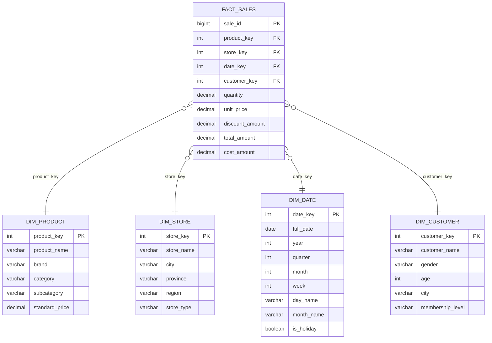
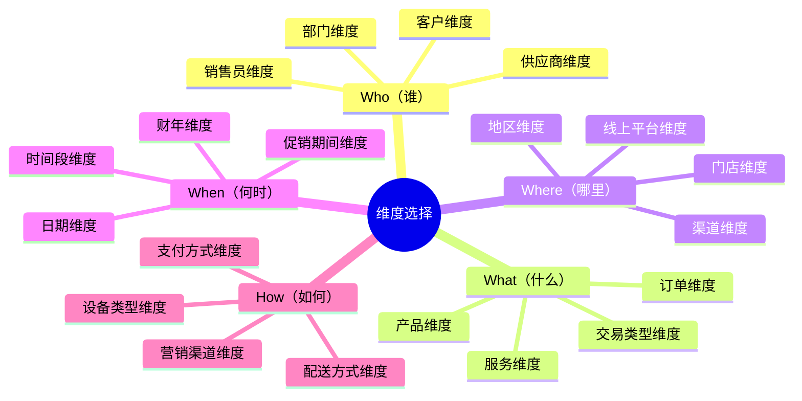

# 一星型模型：数据仓库建模的基石

## 概述

星型模型（Star Schema）是数据仓库建模中最基础、最经典的设计模式，由Ralph Kimball在《The Data Warehouse Toolkit》中系统化提出。它的核心思想是将数据组织为一张或多张**事实表**（Fact Table）和围绕其周围的**维度表**（Dimension Table），形成一个类似星形的拓扑结构——事实表居于中心，维度表向外辐射。

星型模型之所以成为数据仓库建模的默认选择，原因有三：**查询性能优异**（事实表与维度表之间只需一次JOIN）、**业务语义直观**（维度即"分析的角度"，符合业务人员思维）、**实现复杂度低**（不依赖深层规范化设计）。根据TDWI（The Data Warehousing Institute）的调查，超过70%的数据仓库项目采用星型模型或其变体作为核心建模方案。

---

## 核心概念

### 事实表（Fact Table）

事实表是星型模型的中心表，存储业务过程的**可度量事件**。每一行代表一个可观察的业务事件或交易记录。

**事实表的特征：**

- **行数最多**：通常包含数百万到数十亿行，是数据仓库中最大的表
- **列最窄**：主要由外键（指向维度表）和度量值（数值型）组成
- **粒度明确**：每行代表一个具体的业务事件，粒度（Grain）定义是建模的第一步
- **增长最快**：随着业务持续运行，事实表不断追加新行

**事实表的类型：**

| 类型 | 说明 | 典型场景 |
|------|------|----------|
| **事务事实表（Transaction Fact）** | 记录离散的业务事件，每行对应一个独立事务 | 订单创建、支付完成、用户注册 |
| **快照事实表（Snapshot Fact）** | 按固定时间间隔记录系统状态的快照 | 每日库存余额、月末账户余额 |
| **累积快照事实表（Accumulating Snapshot）** | 跟踪一个业务过程从开始到结束的完整生命周期 | 订单从下单→发货→签收的全过程 |
| **无事实事实表（Factless Fact）** | 无数值度量，仅记录事件发生（用于统计计数） | 学生出勤记录、设备故障发生 |

**度量值的分类：**

- **可加性度量（Additive）**：可以在所有维度上聚合求和。例如：销售额、订单数量、利润。这是最理想的度量类型。
- **半可加性度量（Semi-Additive）**：只能在部分维度上聚合。例如：账户余额不能按时间维度求和（某天的余额 + 某天的余额 ≠ 有意义的值），但可以跨客户维度聚合。
- **非可加度量（Non-Additive）**：不能直接聚合。例如：毛利率、单价。需要通过分子/分母分别聚合后计算。

### 维度表（Dimension Table）

维度表描述业务事件的**上下文环境**——"谁、什么、哪里、何时、如何"。维度是分析数据的视角和切入点。

**维度表的特征：**

- **行数较少**：通常数百到数千行（一个零售企业可能有数十万SKU，但国家只有两百多个）
- **列较宽**：包含大量文本属性和描述字段
- **包含层次结构**：如 品类→子品类→商品，或 城市→省份→国家
- **主键为代理键**：通常使用自增整数作为代理键（Surrogate Key），而非源系统的自然键

**常见维度类型：**

| 维度类型 | 说明 | 示例 |
|----------|------|------|
| **普通维度（Conformed Dimension）** | 在多个事实表之间共享，保证一致性 | 时间维度、产品维度、地区维度 |
| **退化维度（Degenerate Dimension）** | 不单独建表，直接存在于事实表中 | 订单号、交易流水号 |
| **杂项维度（Junk Dimension）** | 将多个低基数标志位/状态字段组合成一个维度 | 订单状态标志组合（是否退货、是否取消、是否加急） |
| **角色扮演维度（Role-Playing Dimension）** | 同一维度在事实表中扮演不同角色 | 日期维度分别扮演下单日期、发货日期、收货日期 |
| **支架维度（Outrigger Dimension）** | 维度表之间存在引用关系 | 省份维度引用国家维度 |
| **雪片维度（Snowflaked Dimension）** | 维度表被规范化拆分为多张子表 | 品类→子品类→商品三层拆分 |

### 事实表与维度表的关系



上图展示了一个典型的零售销售星型模型：中心是销售事实表，四张维度表围绕其展开。每张维度表通过代理键与事实表关联，形成清晰的星形拓扑。

---

## 设计方法论

### 第一步：确定业务过程（Identify Business Process）

业务过程是组织中可重复执行、可观察的活动。建模的起点是明确要分析的业务过程。

**常见业务过程：**

- 零售：销售交易、库存管理、退货处理
- 金融：交易处理、风险评估、客户服务
- 制造：生产计划、质量检测、设备维护
- 医疗：门诊就诊、住院管理、药品分发

**选择原则：** 优先选择**高层管理者最关注的**、**数据最容易获取的**、**跨部门共享需求最强烈的**业务过程。

### 第二步：声明粒度（Declare the Grain）

粒度是事实表中每行数据所代表的**最细级别的业务事件**。粒度声明是星型模型设计中最关键的决策。

**粒度决定原则：**

- 粒度应该尽可能细（原子级别），因为粗粒度数据可以聚合为细粒度，反之不行
- 粒度必须明确、唯一，不能模棱两可
- 粒度直接决定事实表的行数和查询灵活性

**粒度声明示例：**

| 模糊的粒度声明 | 正确的粒度声明 |
|----------------|----------------|
| "销售数据" | "每个零售门店每天每个SKU的销售事务，一笔交易一行" |
| "用户行为" | "每个用户在App上的每一次页面访问事件" |
| "财务数据" | "每个法人实体每月的会计科目余额" |

### 第三步：选择维度（Choose the Dimensions）

维度回答"谁、什么、哪里、何时、如何"的问题。为每个粒度选择能描述业务事件完整上下文的维度。

**维度选择清单：**



### 第四步：确定事实（Identify the Facts）

事实是业务过程的**可度量数值**。选择与粒度一致的、可加性好的度量值。

**事实选择原则：**

- 度量值必须与粒度一致（粒度是"单笔订单"，就不能放"月累计金额"）
- 优先选择可加性度量（Summable measures）
- 同时存储分子和分母，而非直接存比率（如存销售额和成本，而非毛利率）
- 原始值比衍生值好（衍生值可以通过查询计算）

### 第五步：规范化与反规范化

星型模型的核心设计决策是**维度表的反规范化**。

- 事实表保持规范化（外键 + 度量值，无冗余）
- 维度表进行反规范化（将可能的层次结构扁平化到一张表中）

```sql
-- 反规范化的维度表（星型模型推荐）
CREATE TABLE dim_product (
    product_key     INT PRIMARY KEY,       -- 代理键
    product_id      VARCHAR(50),           -- 源系统自然键
    product_name    VARCHAR(200),
    brand           VARCHAR(100),
    category        VARCHAR(100),          -- 一级品类
    subcategory     VARCHAR(100),          -- 二级品类
    product_group   VARCHAR(100),          -- 三级品类
    unit_cost       DECIMAL(10,2),
    unit_price      DECIMAL(10,2),
    is_active       BOOLEAN,
    effective_date  DATE,
    expiry_date     DATE
);

-- 规范化的维度表（雪花模型，后续章节详述）
CREATE TABLE dim_product (
    product_key     INT PRIMARY KEY,
    product_id      VARCHAR(50),
    product_name    VARCHAR(200),
    brand           VARCHAR(100),
    subcategory_key INT REFERENCES dim_subcategory(subcategory_key)
);
```

---

## 完整实现案例：电商销售分析

### 场景描述

某电商平台需要分析过去三年的销售数据，业务需求包括：

- 按时间、地区、品类、渠道分析销售额和利润
- 按客户群体分析购买行为
- 追踪促销活动效果
- 支持从年度到小时级别的多粒度分析

### 数据库建表（PostgreSQL）

```sql
-- ============================================================
-- 维度表：日期维度
-- ============================================================
CREATE TABLE dim_date (
    date_key            INT PRIMARY KEY,         -- 格式: YYYYMMDD
    full_date           DATE NOT NULL UNIQUE,
    year                SMALLINT NOT NULL,
    quarter             SMALLINT NOT NULL,
    month               SMALLINT NOT NULL,
    week_of_year        SMALLINT NOT NULL,
    day_of_month        SMALLINT NOT NULL,
    day_of_week         SMALLINT NOT NULL,       -- 1=周一, 7=周日
    day_name            VARCHAR(10) NOT NULL,
    month_name          VARCHAR(10) NOT NULL,
    is_weekend          BOOLEAN NOT NULL,
    is_holiday          BOOLEAN DEFAULT FALSE,
    holiday_name        VARCHAR(50),
    fiscal_year         SMALLINT,
    fiscal_quarter      SMALLINT,
    year_month          VARCHAR(7)               -- "2026-06" 格式
);

COMMENT ON TABLE dim_date IS '日期维度表，覆盖2023-01-01至2028-12-31';
COMMENT ON COLUMN dim_date.date_key IS '代理键，格式YYYYMMDD，用于事实表关联';

-- ============================================================
-- 维度表：产品维度
-- ============================================================
CREATE TABLE dim_product (
    product_key         SERIAL PRIMARY KEY,
    product_id          VARCHAR(50) NOT NULL,    -- 源系统SKU编号
    product_name        VARCHAR(300) NOT NULL,
    brand               VARCHAR(100),
    category_l1         VARCHAR(100),            -- 一级品类：电子产品
    category_l2         VARCHAR(100),            -- 二级品类：手机
    category_l3         VARCHAR(100),            -- 三级品类：智能手机
    unit_cost           DECIMAL(12,2),           -- 成本价
    unit_price          DECIMAL(12,2),           -- 标准零售价
    weight_kg           DECIMAL(8,3),
    is_active           BOOLEAN DEFAULT TRUE,
    launch_date         DATE,
    delist_date         DATE,
    source_system       VARCHAR(50),
    etl_load_time       TIMESTAMP DEFAULT CURRENT_TIMESTAMP
);

CREATE INDEX idx_product_category ON dim_product(category_l1, category_l2);
CREATE INDEX idx_product_brand ON dim_product(brand);

-- ============================================================
-- 维度表：门店/渠道维度
-- ============================================================
CREATE TABLE dim_store (
    store_key           SERIAL PRIMARY KEY,
    store_id            VARCHAR(50) NOT NULL,
    store_name          VARCHAR(200) NOT NULL,
    store_type          VARCHAR(50),             -- 旗舰店/自营店/加盟店/线上渠道
    channel             VARCHAR(50),             -- 线上/线下/O2O
    city                VARCHAR(100),
    province            VARCHAR(100),
    region              VARCHAR(50),             -- 华东/华南/华北/华中/西南/西北/东北
    country             VARCHAR(50) DEFAULT '中国',
    tier                VARCHAR(20),             -- 一线/二线/三线/四线
    opening_date        DATE,
    area_sqm            DECIMAL(10,2),           -- 门店面积（平方米）
    is_active           BOOLEAN DEFAULT TRUE
);

-- ============================================================
-- 维度表：客户维度
-- ============================================================
CREATE TABLE dim_customer (
    customer_key        SERIAL PRIMARY KEY,
    customer_id         VARCHAR(50) NOT NULL,    -- 源系统用户ID
    customer_name       VARCHAR(100),
    gender              VARCHAR(10),
    age                 SMALLINT,
    age_group           VARCHAR(30),             -- 18-25/26-35/36-45/46-55/55+
    city                VARCHAR(100),
    province            VARCHAR(100),
    membership_level    VARCHAR(30),             -- 普通/银卡/金卡/钻石
    register_date       DATE,
    register_channel    VARCHAR(50),             -- 自然注册/广告引流/口碑推荐
    lifetime_value      DECIMAL(12,2),           -- 客户生命周期价值
    is_active           BOOLEAN DEFAULT TRUE,
    etl_load_time       TIMESTAMP DEFAULT CURRENT_TIMESTAMP
);

-- ============================================================
-- 维度表：促销活动维度
-- ============================================================
CREATE TABLE dim_promotion (
    promotion_key       SERIAL PRIMARY KEY,
    promotion_id        VARCHAR(50) NOT NULL,
    promotion_name      VARCHAR(200) NOT NULL,
    promotion_type      VARCHAR(50),             -- 满减/折扣/赠品/限时秒杀/直播专属
    discount_rate       DECIMAL(5,2),            -- 折扣率（0.80 = 八折）
    min_purchase_amount DECIMAL(10,2),           -- 满减门槛
    start_date          DATE,
    end_date            DATE,
    budget              DECIMAL(12,2),
    target_audience     VARCHAR(100)
);

-- ============================================================
-- 事实表：销售事务事实表
-- ============================================================
CREATE TABLE fact_sales (
    sale_key            BIGSERIAL PRIMARY KEY,
    order_id            VARCHAR(50) NOT NULL,    -- 退化维度：订单号
    order_line_no       SMALLINT NOT NULL,       -- 退化维度：订单行号

    -- 外键关联维度表
    date_key            INT NOT NULL REFERENCES dim_date(date_key),
    product_key         INT NOT NULL REFERENCES dim_product(product_key),
    store_key           INT NOT NULL REFERENCES dim_store(store_key),
    customer_key        INT NOT NULL REFERENCES dim_customer(customer_key),
    promotion_key       INT REFERENCES dim_promotion(promotion_key),

    -- 可加性度量
    quantity            INT NOT NULL,            -- 销售数量
    unit_price          DECIMAL(12,2) NOT NULL,  -- 成交单价
    discount_amount     DECIMAL(12,2) DEFAULT 0, -- 折扣金额
    total_amount        DECIMAL(12,2) NOT NULL,  -- 成交金额（=数量×单价-折扣）
    cost_amount         DECIMAL(12,2) NOT NULL,  -- 成本金额
    profit_amount       DECIMAL(12,2) GENERATED ALWAYS AS
                        (total_amount - cost_amount) STORED,  -- 利润

    -- 非可加度量（分子/分母）
    tax_rate            DECIMAL(5,4),            -- 税率
    tax_amount          DECIMAL(12,2) DEFAULT 0, -- 税额

    -- 辅助字段
    payment_method      VARCHAR(30),             -- 支付宝/微信/银行卡/货到付款
    order_source        VARCHAR(50),             -- App/H5/小程序/PC
    etl_load_time       TIMESTAMP DEFAULT CURRENT_TIMESTAMP
);

-- ============================================================
-- 索引设计（针对高频查询模式）
-- ============================================================
CREATE INDEX idx_fact_sales_date ON fact_sales(date_key);
CREATE INDEX idx_fact_sales_product ON fact_sales(product_key);
CREATE INDEX idx_fact_sales_store ON fact_sales(store_key);
CREATE INDEX idx_fact_sales_customer ON fact_sales(customer_key);
CREATE INDEX idx_fact_sales_composite ON fact_sales(date_key, product_key, store_key);
```

### 典型查询示例

```sql
-- 查询1：按月、品类汇总销售额和利润
SELECT
    d.year,
    d.month_name,
    p.category_l1,
    p.category_l2,
    SUM(f.total_amount) AS total_sales,
    SUM(f.profit_amount) AS total_profit,
    SUM(f.quantity) AS total_qty,
    ROUND(SUM(f.profit_amount) / NULLIF(SUM(f.total_amount), 0) * 100, 2)
        AS profit_margin_pct
FROM fact_sales f
JOIN dim_date d ON f.date_key = d.date_key
JOIN dim_product p ON f.product_key = p.product_key
WHERE d.year = 2026 AND d.month = 6
GROUP BY d.year, d.month_name, p.category_l1, p.category_l2
ORDER BY total_sales DESC;

-- 查询2：各地区TOP10客户的消费排名（客户维度分析）
SELECT
    c.province,
    c.customer_name,
    c.membership_level,
    COUNT(DISTINCT f.order_id) AS order_count,
    SUM(f.total_amount) AS total_spend,
    AVG(f.total_amount) AS avg_order_value,
    MAX(d.full_date) AS last_purchase_date
FROM fact_sales f
JOIN dim_customer c ON f.customer_key = c.customer_key
JOIN dim_date d ON f.date_key = d.date_key
WHERE d.year = 2026
GROUP BY c.province, c.customer_name, c.membership_level
ORDER BY c.province, total_spend DESC;

-- 查询3：促销活动效果对比分析
SELECT
    pr.promotion_name,
    pr.promotion_type,
    pr.start_date,
    pr.end_date,
    COUNT(DISTINCT f.order_id) AS orders_generated,
    SUM(f.total_amount) AS total_sales,
    SUM(f.discount_amount) AS total_discount,
    ROUND(SUM(f.discount_amount) / NULLIF(SUM(f.total_amount) + SUM(f.discount_amount), 0) * 100, 2)
        AS effective_discount_pct,
    -- ROAS: 广告支出回报率
    ROUND(SUM(f.total_amount) / NULLIF(pr.budget, 0), 2) AS roas
FROM fact_sales f
JOIN dim_promotion pr ON f.promotion_key = pr.promotion_key
JOIN dim_date d ON f.date_key = d.date_key
WHERE d.full_date BETWEEN pr.start_date AND pr.end_date
GROUP BY pr.promotion_name, pr.promotion_type, pr.start_date, pr.end_date, pr.budget
ORDER BY roas DESC;

-- 查询4：时间序列——每日销售额趋势与同比分析
WITH daily_sales AS (
    SELECT
        d.full_date,
        d.year,
        d.day_of_year,
        SUM(f.total_amount) AS daily_total
    FROM fact_sales f
    JOIN dim_date d ON f.date_key = d.date_key
    GROUP BY d.full_date, d.year, d.day_of_year
)
SELECT
    cur.full_date,
    cur.daily_total AS current_year_sales,
    prev.daily_total AS last_year_sales,
    ROUND((cur.daily_total - prev.daily_total)
        / NULLIF(prev.daily_total, 0) * 100, 2) AS yoy_growth_pct
FROM daily_sales cur
LEFT JOIN daily_sales prev
    ON cur.day_of_year = prev.day_of_year AND cur.year = prev.year + 1
WHERE cur.year = 2026
ORDER BY cur.full_date;
```

---

## 设计原则与最佳实践

### 代理键（Surrogate Key）设计

代理键是星型模型中维度表的主键，与源系统无关，由数据仓库自行生成。

**为什么不用自然键（Natural Key）？**

| 对比维度 | 自然键 | 代理键 |
|----------|--------|--------|
| 稳定性 | 源系统可能修改自然键 | 代理键永远不变 |
| SCD支持 | 无法区分同一实体的历史版本 | 新版本=新代理键行 |
| 跨源整合 | 不同系统同一实体的自然键可能冲突 | 代理键全局唯一 |
| 存储效率 | 业务键可能很长（UUID等） | 整数类型，存储紧凑 |
| JOIN性能 | 字符串JOIN慢 | 整数JOIN快 |

**代理键生成策略：**

```sql
-- 策略1：自增序列（PostgreSQL/MySQL）
CREATE SEQUENCE dim_product_key_seq START WITH 1;
INSERT INTO dim_product (product_key, product_id, product_name, ...)
VALUES (nextval('dim_product_key_seq'), 'SKU001', 'iPhone 16 Pro', ...);

-- 策略2：MD5哈希（适用于ELT场景，可幂等执行）
-- 优点：相同输入永远生成相同键，支持重跑
-- 缺点：128位占用空间大，可以用截断到64位
SELECT MD5(CONCAT(product_id, brand, effective_date)) AS product_key_hash
FROM staging_products;

-- 策略3：日期+序列组合（适用于日期维度）
-- 直接使用 YYYYMMDD 整数，无需额外生成
SELECT TO_CHAR(full_date, 'YYYYMMDD')::INT AS date_key FROM dim_date;
```

### 粒度一致性原则

事实表中的所有度量值必须与粒度一致。一个常见的反模式是在细粒度事实表中混入聚合度量。

```sql
-- ❌ 错误：在单笔订单级事实表中存储月累计值
CREATE TABLE fact_sales_bad (
    order_id        VARCHAR(50),
    quantity        INT,
    total_amount    DECIMAL(12,2),
    monthly_total   DECIMAL(12,2),  -- 违反粒度一致性！
    monthly_avg     DECIMAL(12,2)   -- 违反粒度一致性！
);

-- ✅ 正确：只存原子度量，聚合值通过查询计算
CREATE TABLE fact_sales_good (
    order_id        VARCHAR(50),
    quantity        INT,
    total_amount    DECIMAL(12,2)
    -- monthly_total 和 monthly_avg 通过 GROUP BY 计算
);
```

### NULL值处理

事实表中的外键不能为NULL（因为事实必须关联维度），但业务度量可以为NULL。

```sql
-- 事实表外键的NULL处理策略
-- 策略1：创建"未知"维度行（推荐）
INSERT INTO dim_customer (customer_key, customer_id, customer_name, ...)
VALUES (-1, 'UNKNOWN', '未知客户', ...);

-- 策略2：声明 NOT NULL + 默认值
ALTER TABLE fact_sales
    ALTER COLUMN customer_key SET DEFAULT -1,
    ALTER COLUMN customer_key SET NOT NULL;
```

---

## 常见设计误区与纠正

### 误区1：维度表设计过于规范化

```sql
-- ❌ 过度规范化：将维度拆成多张表（雪花模型）
CREATE TABLE dim_product_category (category_key INT, category_name VARCHAR);
CREATE TABLE dim_product_brand (brand_key INT, brand_name VARCHAR);
CREATE TABLE dim_product (product_key INT, category_key INT, brand_key INT, ...);

-- ✅ 星型模型：反规范化到一张维度表
CREATE TABLE dim_product (
    product_key     SERIAL PRIMARY KEY,
    product_name    VARCHAR(300),
    brand           VARCHAR(100),
    category        VARCHAR(100),
    ...
);
```

**原因：** 维度表的规范化虽然减少了存储冗余，但增加了查询时的JOIN数量，降低了查询性能和可读性。在现代存储成本极低的背景下，冗余几个VARCHAR列的成本远低于多一次JOIN的查询开销。

### 误区2：事实表中混入维度属性

```sql
-- ❌ 错误：在事实表中冗余存储维度属性
CREATE TABLE fact_sales_bad (
    product_name    VARCHAR(300),   -- 应该在dim_product中
    store_name      VARCHAR(200),   -- 应该在dim_store中
    customer_name   VARCHAR(100),   -- 应该在dim_customer中
    ...
);

-- ✅ 正确：事实表只存外键和度量值
CREATE TABLE fact_sales_good (
    product_key     INT NOT NULL,   -- 关联dim_product
    store_key       INT NOT NULL,   -- 关联dim_store
    customer_key    INT NOT NULL,   -- 关联dim_customer
    quantity        INT NOT NULL,
    total_amount    DECIMAL(12,2) NOT NULL
);
```

**原因：** 维度属性变更时需要更新所有冗余副本，维护成本高且容易不一致。通过外键关联维度表，只需在维度表中更新一次。

### 误区3：事实表粒度过粗

```sql
-- ❌ 粒度过粗：每天每个门店一个汇总行
-- 丢失了客户、单品、订单等分析维度
CREATE TABLE fact_daily_summary (
    date_key        INT,
    store_key       INT,
    daily_revenue   DECIMAL(12,2),
    daily_orders    INT
);

-- ✅ 粒度尽可能细：每笔交易一行
CREATE TABLE fact_sales (
    date_key        INT,
    store_key       INT,
    customer_key    INT,
    product_key     INT,
    order_id        VARCHAR(50),
    quantity        INT,
    total_amount    DECIMAL(12,2)
);
```

**原因：** 粗粒度数据可以通过聚合细粒度数据得到，但细粒度数据无法从粗粒度数据中还原。保持最细粒度才能最大化分析灵活性。

### 误区4：忽视缓慢变化维（SCD）

```sql
-- ❌ 错误：直接覆盖客户地址，历史分析时数据不准
UPDATE dim_customer
SET city = '深圳', province = '广东'
WHERE customer_id = 'C001';
-- 问题：历史销售记录中C001的地理维度全部变成"深圳"

-- ✅ 正确：使用SCD Type 2保留历史版本
INSERT INTO dim_customer (customer_id, city, province, is_current, valid_from, valid_to)
VALUES ('C001', '深圳', '广东', TRUE, '2026-06-26', '9999-12-31');

UPDATE dim_customer
SET is_current = FALSE, valid_to = '2026-06-25'
WHERE customer_id = 'C001' AND is_current = TRUE AND city != '深圳';
```

SCD的详细处理方法将在后续SCD专题章节中深入展开。

---

## 性能优化策略

### 分区设计

对事实表按时间维度进行分区，可以显著提升时间范围查询的性能。

```sql
-- PostgreSQL：按月分区
CREATE TABLE fact_sales (
    sale_key        BIGSERIAL,
    date_key        INT NOT NULL,
    product_key     INT NOT NULL,
    store_key       INT NOT NULL,
    customer_key    INT NOT NULL,
    quantity        INT NOT NULL,
    total_amount    DECIMAL(12,2) NOT NULL
) PARTITION BY RANGE (date_key);

-- 创建月度分区
CREATE TABLE fact_sales_202601 PARTITION OF fact_sales
    FOR VALUES FROM (20260101) TO (20260201);
CREATE TABLE fact_sales_202602 PARTITION OF fact_sales
    FOR VALUES FROM (20260201) TO (20260301);
CREATE TABLE fact_sales_202603 PARTITION OF fact_sales
    FOR VALUES FROM (20260301) TO (20260401);
-- ... 按月创建后续分区
```

```sql
-- ClickHouse：使用MergeTree引擎的分区和排序
CREATE TABLE fact_sales
(
    date_key        UInt32,
    product_key     UInt32,
    store_key       UInt32,
    customer_key    UInt32,
    order_id        String,
    quantity        UInt32,
    total_amount    Decimal(12,2)
)
ENGINE = MergeTree()
PARTITION BY toYYYYMM(date_key)       -- 按月分区
ORDER BY (date_key, store_key, product_key)  -- 排序键=查询最常用的过滤+聚合列
SETTINGS index_granularity = 8192;
```

### 物化聚合表（Aggregate Tables）

对高频查询模式预先计算聚合结果，避免每次查询都扫描全量事实表。

```sql
-- 预计算：月度门店品类聚合表
CREATE TABLE agg_sales_monthly_store_category AS
SELECT
    f.date_key / 100 AS month_key,      -- YYYYMM
    f.store_key,
    p.category_l1,
    p.category_l2,
    COUNT(DISTINCT f.order_id) AS order_count,
    SUM(f.quantity) AS total_quantity,
    SUM(f.total_amount) AS total_sales,
    SUM(f.cost_amount) AS total_cost,
    SUM(f.total_amount) - SUM(f.cost_amount) AS total_profit
FROM fact_sales f
JOIN dim_product p ON f.product_key = p.product_key
JOIN dim_date d ON f.date_key = d.date_key
GROUP BY month_key, f.store_key, p.category_l1, p.category_l2;

-- 查询直接命中聚合表，无需扫描全量事实表
SELECT * FROM agg_sales_monthly_store_category
WHERE month_key = 202606 AND store_key = 42;
```

### 索引策略

```sql
-- 位图索引（适用于低基数维度列，Oracle/PostgreSQL支持）
-- 适用于事实表中的外键列
CREATE INDEX idx_fact_date ON fact_sales USING bitmap (date_key);
CREATE INDEX idx_fact_store ON fact_sales USING bitmap (store_key);

-- 列式存储（ClickHouse默认支持，不需要显式索引）
-- 数据按列组织，聚合查询只读取需要的列
SELECT SUM(total_amount) FROM fact_sales WHERE date_key BETWEEN 20260601 AND 20260630;

-- 物化视图（自动维护的预计算结果）
CREATE MATERIALIZED VIEW mv_daily_sales
AS SELECT
    date_key,
    store_key,
    product_key,
    SUM(total_amount) AS daily_sales,
    COUNT(*) AS daily_transactions
FROM fact_sales
GROUP BY date_key, store_key, product_key;
```

---

## 星型模型与雪花模型对比

| 对比维度 | 星型模型（Star Schema） | 雪花模型（Snowflake Schema） |
|----------|------------------------|----------------------------|
| **维度表结构** | 反规范化，所有属性在一张表 | 规范化，层次拆分为多张子表 |
| **查询复杂度** | 低（事实表与维度表直接JOIN） | 高（需要多层JOIN穿透维度层次） |
| **查询性能** | 优（JOIN少，扫描数据少） | 较差（多层JOIN开销） |
| **存储效率** | 低（维度表有冗余） | 高（消除冗余） |
| **维护难度** | 低（维度更新简单） | 高（需要更新多个关联表） |
| **业务可读性** | 优（维度属性平铺，直观） | 差（需要理解多层关联） |
| **适用场景** | OLAP查询、BI报表、数据集市 | 存储敏感、维度层次复杂的场景 |

**选择建议：** 除非存储成本极度敏感或维度层次需要严格维护一致性，否则默认选择星型模型。在现代数仓环境中（如Snowflake、BigQuery、ClickHouse），存储成本已经很低，反规范化的空间开销可以忽略不计。

---

## 在现代数据平台中的应用

### Snowflake / BigQuery / Redshift

云数仓天然适合星型模型。这些平台的CBO（基于成本的优化器）会自动处理JOIN优化，加上列式存储和大规模并行处理（MPP），星型模型的查询性能可以得到充分发挥。

```sql
-- Snowflake：星型模型建表示例
CREATE OR REPLACE TABLE fact_sales AS
SELECT * FROM @s3_stage/sales/;

-- 自动聚类（Snowflake特有）
ALTER TABLE fact_sales ALTER CLUSTER BY (date_key, store_key);
```

### dbt中的星型模型

dbt（data build tool）是ELT模式下的主流转换工具，天然支持星型模型建模。

```sql
-- dbt模型文件：models/marts/sales/fct_orders.sql
{{ config(materialized='table') }}

SELECT
    {{ dbt_utils.generate_surrogate_key(['order_id', 'order_line_no']) }}
        AS sale_key,
    d.date_key,
    p.product_key,
    s.store_key,
    c.customer_key,
    pr.promotion_key,
    o.order_id,
    o.line_number,
    o.quantity,
    o.unit_price,
    o.discount_amount,
    o.quantity * o.unit_price - o.discount_amount AS total_amount,
    o.quantity * p.unit_cost AS cost_amount
FROM {{ ref('stg_orders') }} o
JOIN {{ ref('dim_date') }} d ON o.order_date = d.full_date
JOIN {{ ref('dim_product') }} p ON o.product_id = p.product_id
JOIN {{ ref('dim_store') }} s ON o.store_id = s.store_id
JOIN {{ ref('dim_customer') }} c ON o.customer_id = c.customer_id
LEFT JOIN {{ ref('dim_promotion') }} pr ON o.promotion_id = pr.promotion_id
```

### Delta Lake / Iceberg 中的星型模型

数据湖表格式同样支持星型模型，且具备额外优势——ACID事务保证数据一致性，时间旅行支持维度历史回溯。

```python
# PySpark：在Delta Lake中构建星型模型
from pyspark.sql import SparkSession

spark = SparkSession.builder \
    .appName("star_schema_etl") \
    .config("spark.sql.extensions", "io.delta.sql.DeltaSparkSessionExtension") \
    .getOrCreate()

# 读取销售事实数据
raw_sales = spark.read.format("json") \
    .load("s3://data-lake/raw/sales/2026/06/")

# 构建日期维度
from pyspark.sql.functions import col, date_format, dayofweek, quarter, weekofyear

dim_date = raw_sales.select(
    date_format("order_date", "yyyyMMdd").cast("int").alias("date_key"),
    col("order_date").alias("full_date"),
    date_format("order_date", "yyyy").cast("int").alias("year"),
    quarter("order_date").alias("quarter"),
    date_format("order_date", "M").cast("int").alias("month"),
    weekofyear("order_date").alias("week_of_year"),
    dayofweek("order_date").alias("day_of_week")
).distinct()

# 写入Delta Lake
dim_date.write.format("delta") \
    .mode("overwrite") \
    .save("s3://data-lake/curated/dim_date")
```

---

## 本章小结

星型模型作为数据仓库建模的基石，其核心价值在于：

1. **业务语义直观**：事实表回答"发生了什么"，维度表回答"谁、什么、哪里、何时、如何"，完全对应业务分析的自然思维
2. **查询性能优异**：事实表与维度表之间只需要一次JOIN，配合分区和物化聚合表可以支撑海量数据的实时分析
3. **设计方法成熟**：Kimball的四步建模法（业务过程→粒度→维度→事实）经过数十年实践验证，是业界公认的建模范式
4. **工具生态完善**：从传统数仓（Teradata、Oracle）到现代云平台（Snowflake、BigQuery、ClickHouse），星型模型都有成熟的工具链支持

下一节将探讨星型模型的规范化变体——雪花模型，以及在什么场景下应该选择雪花模型而非星型模型。
