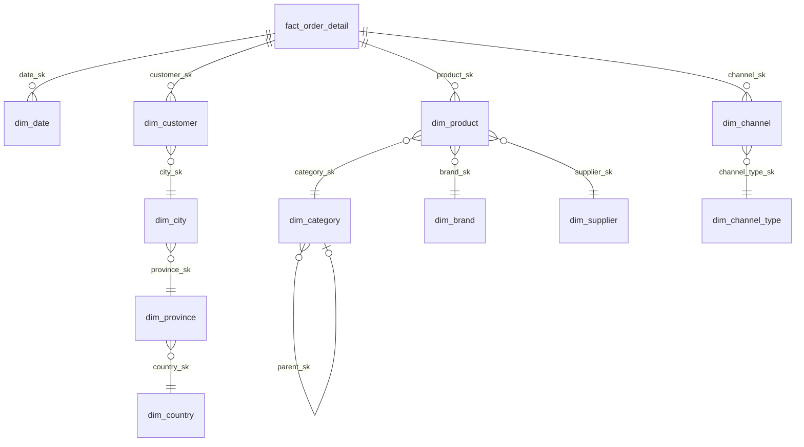
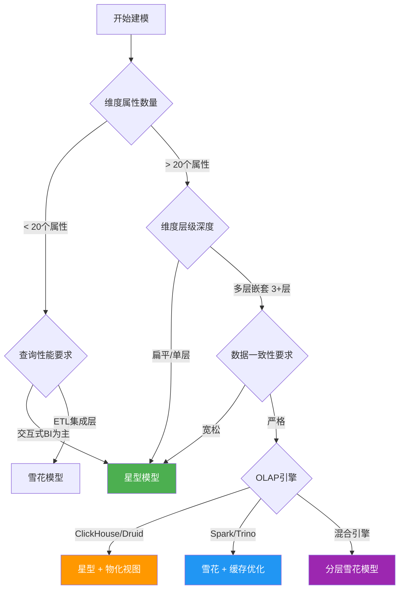

# 雪花模型：数据仓库维度规范化设计的深度实践

***

## 概述：为什么雪花模型值得深入理解

在数据仓库建模领域，星型模型（Star Schema）因查询简洁、性能直观而被广泛采用。但在实际的企业级数据平台中，维度表往往包含复杂的层级关系——产品有品类、品类有部门；地区有城市、城市有省份、省份有国家。将这些层级全部冗余到一张宽表中，虽然查询方便，却带来了数据一致性维护的沉重负担。雪花模型（Snowflake Schema）通过将维度表规范化拆分，从根本上解决了这一矛盾。

本节将从规范化理论出发，系统性地讲解雪花模型的设计原理、SQL实现、查询模式、性能优化以及在现代数据平台中的最佳实践。

***

## 60.9.1 规范化理论基础：从范式到雪花

### 关系数据库范式回顾

理解雪花模型需要先理解关系数据库的规范化理论。规范化是将数据组织成多个关联表以减少冗余和依赖异常的过程。

| 范式 | 核心规则 | 在维度表中的体现 |
|------|----------|------------------|
| 第一范式（1NF） | 每列原子值，无重复组 | 维度属性不能包含逗号分隔的列表 |
| 第二范式（2NF） | 消除部分依赖 | 非主键属性必须完全依赖于整个主键 |
| 第三范式（3NF） | 消除传递依赖 | 非主键属性不能依赖于其他非主键属性 |
| BCNF | 每个决定因素都是候选键 | 更严格的3NF，消除所有函数依赖异常 |

### 星型模型的"反规范化"本质

星型模型将所有维度属性压缩到一张维度表中，本质上是一种反规范化设计。以产品维度为例，星型模型中的一条记录可能同时包含：

产品ID | 产品名称 | 品类ID | 品类名称 | 品类描述 | 品牌ID | 品牌名称 | 品牌国籍
P001   | iPhone15 | C001  | 手机    | 智能手机 | B001  | Apple   | 美国
P002   | GalaxyS24| C001  | 手机    | 智能手机 | B002  | Samsung | 韩国
P003   | iPadPro  | C002  | 平板    | 平板电脑 | B001  | Apple   | 美国

这里品类名称"手机"和品牌名称"Apple"被重复存储了多次。当品类名称需要修正（如从"手机"改为"智能手机"）时，必须更新所有包含该品类的产品记录——这正是传递依赖带来的更新异常。

### 雪花模型的规范化拆分

雪花模型通过将维度表拆分为多层关联的子维度表来消除冗余。同一个产品维度在雪花模型中被拆分为三张表：

dim_product（产品维度）          dim_category（品类维度）       dim_brand（品牌维度）
+-----------------+             +-----------------+           +------------------+
| product_sk      |             | category_sk     |           | brand_sk         |
| product_id      |             | category_id     |           | brand_id         |
| product_name    |             | category_name   |           | brand_name       |
| category_sk(FK) |──┐          | category_desc   |           | country          |
| brand_sk(FK)    |──┼──┐       | parent_cat_sk   │           +------------------+
+-----------------+  |  |       +-----------------+
                     |  |
                     v  v

每张子维度表只存储与其自身主题相关的属性，通过外键关联形成层级关系。这种设计严格遵循了3NF范式——品类名称只存在于dim_category中，品牌信息只存在于dim_brand中。

***

## 60.9.2 雪花模型的完整设计实例

### 电商业务的雪花模型Schema

以下是一个完整的电商数据仓库雪花模型设计，包含事实表和多层维度表：

```sql
-- ========================================
-- 事实表：订单明细
-- ========================================
CREATE TABLE fact_order_detail (
    detail_sk       BIGINT PRIMARY KEY AUTO_INCREMENT,
    order_id        VARCHAR(64)     NOT NULL,
    order_line_no   INT             NOT NULL,
    -- 维度外键
    date_sk         INT             NOT NULL,  -- 时间维度
    customer_sk     BIGINT          NOT NULL,  -- 客户维度
    product_sk      BIGINT          NOT NULL,  -- 产品维度（雪花化）
    channel_sk      INT             NOT NULL,  -- 渠道维度
    -- 度量
    quantity        INT             NOT NULL,
    unit_price      DECIMAL(12,2)   NOT NULL,
    discount_amount DECIMAL(12,2)   DEFAULT 0.00,
    total_amount    DECIMAL(12,2)   NOT NULL,
    cost_amount     DECIMAL(12,2)   DEFAULT 0.00,
    profit_amount   DECIMAL(12,2)   DEFAULT 0.00,
    -- 外键约束
    FOREIGN KEY (date_sk)      REFERENCES dim_date(date_sk),
    FOREIGN KEY (customer_sk)  REFERENCES dim_customer(customer_sk),
    FOREIGN KEY (product_sk)   REFERENCES dim_product(product_sk),
    FOREIGN KEY (channel_sk)   REFERENCES dim_channel(channel_sk)
);

-- ========================================
-- 时间维度（扁平化设计，时间维度通常不雪花化）
-- ========================================
CREATE TABLE dim_date (
    date_sk         INT PRIMARY KEY,
    full_date       DATE            NOT NULL,
    year            INT             NOT NULL,
    half_year       INT             NOT NULL,
    quarter         INT             NOT NULL,
    month           INT             NOT NULL,
    month_name      VARCHAR(10)     NOT NULL,
    week_of_year    INT             NOT NULL,
    day_of_month    INT             NOT NULL,
    day_of_week     INT             NOT NULL,
    day_name        VARCHAR(10)     NOT NULL,
    is_weekend      BOOLEAN         NOT NULL,
    is_holiday      BOOLEAN         DEFAULT FALSE,
    fiscal_year     INT             NOT NULL,
    fiscal_quarter  INT             NOT NULL
);

-- ========================================
-- 产品维度（雪花化拆分）
-- ========================================
CREATE TABLE dim_product (
    product_sk      BIGINT PRIMARY KEY AUTO_INCREMENT,
    product_id      VARCHAR(64)     NOT NULL,
    product_name    VARCHAR(200)    NOT NULL,
    sku_code        VARCHAR(100),
    -- 雪花化外键
    category_sk     INT             NOT NULL,
    brand_sk        INT             NOT NULL,
    supplier_sk     INT             NOT NULL,
    -- 产品固有属性
    weight_kg       DECIMAL(8,2),
    color           VARCHAR(50),
    size            VARCHAR(50),
    launch_date     DATE,
    is_active       BOOLEAN         DEFAULT TRUE,
    -- SCD Type 2支持
    valid_from      TIMESTAMP       NOT NULL,
    valid_to        TIMESTAMP       NOT NULL DEFAULT '9999-12-31',
    is_current      BOOLEAN         DEFAULT TRUE,
    -- 外键
    FOREIGN KEY (category_sk) REFERENCES dim_category(category_sk),
    FOREIGN KEY (brand_sk)    REFERENCES dim_brand(brand_sk),
    FOREIGN KEY (supplier_sk) REFERENCES dim_supplier(supplier_sk),
    UNIQUE (product_id, is_current)
);

-- 品类维度（二级规范化）
CREATE TABLE dim_category (
    category_sk     INT PRIMARY KEY AUTO_INCREMENT,
    category_id     VARCHAR(32)     NOT NULL,
    category_name   VARCHAR(100)    NOT NULL,
    category_level  INT             NOT NULL,  -- 1=一级品类, 2=二级品类
    parent_sk       INT,                        -- 自引用：上级品类
    category_path   VARCHAR(500),               -- 物化路径：/电子产品/手机/智能手机
    is_active       BOOLEAN         DEFAULT TRUE,
    FOREIGN KEY (parent_sk) REFERENCES dim_category(category_sk)
);

-- 品牌维度
CREATE TABLE dim_brand (
    brand_sk        INT PRIMARY KEY AUTO_INCREMENT,
    brand_id        VARCHAR(32)     NOT NULL,
    brand_name      VARCHAR(100)    NOT NULL,
    brand_en_name   VARCHAR(100),
    country         VARCHAR(50),
    founded_year    INT,
    is_luxury       BOOLEAN         DEFAULT FALSE,
    is_active       BOOLEAN         DEFAULT TRUE
);

-- 供应商维度
CREATE TABLE dim_supplier (
    supplier_sk     INT PRIMARY KEY AUTO_INCREMENT,
    supplier_id     VARCHAR(32)     NOT NULL,
    supplier_name   VARCHAR(200)    NOT NULL,
    contact_person  VARCHAR(100),
    phone           VARCHAR(20),
    city            VARCHAR(50),
    province        VARCHAR(50),
    country         VARCHAR(50)     DEFAULT '中国',
    cooperation_date DATE,
    is_active       BOOLEAN         DEFAULT TRUE
);

-- ========================================
-- 客户维度（雪花化拆分：客户→城市→省份→国家）
-- ========================================
CREATE TABLE dim_customer (
    customer_sk     BIGINT PRIMARY KEY AUTO_INCREMENT,
    customer_id     VARCHAR(64)     NOT NULL,
    customer_name   VARCHAR(100)    NOT NULL,
    gender          CHAR(1),
    birth_date      DATE,
    phone           VARCHAR(20),
    email           VARCHAR(100),
    -- 雪花化外键：地理位置层级
    city_sk         INT,
    -- 客户属性
    register_date   DATE            NOT NULL,
    customer_level  VARCHAR(20)     DEFAULT '普通',  -- 普通/银卡/金卡/钻石
    is_active       BOOLEAN         DEFAULT TRUE,
    -- SCD Type 2
    valid_from      TIMESTAMP       NOT NULL,
    valid_to        TIMESTAMP       NOT NULL DEFAULT '9999-12-31',
    is_current      BOOLEAN         DEFAULT TRUE,
    FOREIGN KEY (city_sk) REFERENCES dim_city(city_sk)
);

CREATE TABLE dim_city (
    city_sk         INT PRIMARY KEY AUTO_INCREMENT,
    city_id         VARCHAR(32)     NOT NULL,
    city_name       VARCHAR(50)     NOT NULL,
    province_sk     INT             NOT NULL,
    city_level      VARCHAR(10),     -- 一线/二线/三线
    population      BIGINT,
    FOREIGN KEY (province_sk) REFERENCES dim_province(province_sk)
);

CREATE TABLE dim_province (
    province_sk     INT PRIMARY KEY AUTO_INCREMENT,
    province_id     VARCHAR(32)     NOT NULL,
    province_name   VARCHAR(50)     NOT NULL,
    country_sk      INT             NOT NULL,
    region          VARCHAR(20),     -- 华东/华南/华北/华中/西南/西北/东北
    FOREIGN KEY (country_sk) REFERENCES dim_country(country_sk)
);

CREATE TABLE dim_country (
    country_sk      INT PRIMARY KEY AUTO_INCREMENT,
    country_id      VARCHAR(32)     NOT NULL,
    country_name    VARCHAR(50)     NOT NULL,
    continent       VARCHAR(20),
    currency        VARCHAR(10),
    timezone        VARCHAR(30)
);

-- ========================================
-- 渠道维度（雪花化拆分：渠道→渠道类型）
-- ========================================
CREATE TABLE dim_channel (
    channel_sk      INT PRIMARY KEY AUTO_INCREMENT,
    channel_id      VARCHAR(32)     NOT NULL,
    channel_name    VARCHAR(100)    NOT NULL,
    channel_type_sk INT             NOT NULL,
    platform        VARCHAR(50),     -- iOS/Android/Web/小程序
    FOREIGN KEY (channel_type_sk) REFERENCES dim_channel_type(channel_type_sk)
);

CREATE TABLE dim_channel_type (
    channel_type_sk INT PRIMARY KEY AUTO_INCREMENT,
    type_id         VARCHAR(32)     NOT NULL,
    type_name       VARCHAR(50)     NOT NULL,  -- 线上/线下/分销
    description     VARCHAR(200)
);
```

### 雪花模型的ER关系图



***

## 60.9.3 雪花模型的查询模式

### 多层Join查询：从粗到细的分析

雪花模型的核心特征是查询时需要多层Join来获取完整的维度描述。以下展示典型的分析查询模式：

```sql
-- 查询1：按品类和品牌分析销售额
-- 需要Join产品→品类、产品→品牌
SELECT
    c.category_name              AS 一级品类,
    c2.category_name             AS 二级品类,
    b.brand_name                 AS 品牌,
    b.country                    AS 品牌国家,
    COUNT(DISTINCT f.order_id)   AS 订单数,
    SUM(f.quantity)              AS 总销量,
    SUM(f.total_amount)          AS 总销售额,
    SUM(f.profit_amount)         AS 总利润,
    SUM(f.profit_amount) / NULLIF(SUM(f.total_amount), 0) AS 利润率
FROM fact_order_detail f
JOIN dim_product p   ON f.product_sk = p.product_sk
JOIN dim_category c  ON p.category_sk = c.category_sk
JOIN dim_category c2 ON c.parent_sk = c2.category_sk
JOIN dim_brand b     ON p.brand_sk = b.brand_sk
JOIN dim_date d      ON f.date_sk = d.date_sk
WHERE d.year = 2024
  AND p.is_current = TRUE
GROUP BY c.category_name, c2.category_name, b.brand_name, b.country
ORDER BY 总销售额 DESC;

-- 查询2：按客户地域分析销售分布
-- 需要Join客户→城市→省份→国家（四层雪花路径）
SELECT
    ct.country_name              AS 国家,
    prov.province_name           AS 省份,
    ci.city_name                 AS 城市,
    ci.city_level                AS 城市等级,
    COUNT(DISTINCT f.order_id)   AS 订单数,
    COUNT(DISTINCT cu.customer_sk) AS 客户数,
    SUM(f.total_amount)          AS 总销售额,
    AVG(f.total_amount)          AS 客单价
FROM fact_order_detail f
JOIN dim_customer cu ON f.customer_sk = cu.customer_sk
JOIN dim_city ci     ON cu.city_sk = ci.city_sk
JOIN dim_province prov ON ci.province_sk = prov.province_sk
JOIN dim_country ct  ON prov.country_sk = ct.country_sk
JOIN dim_date d      ON f.date_sk = d.date_sk
WHERE d.year = 2024 AND cu.is_current = TRUE
GROUP BY ct.country_name, prov.province_name, ci.city_name, ci.city_level
ORDER BY 总销售额 DESC;

-- 查询3：利用物化路径优化层级查询
-- category_path字段避免了递归CTE的开销
SELECT
    SUBSTRING_INDEX(c.category_path, '/', 2) AS 一级品类路径,
    c.category_name             AS 二级品类,
    SUM(f.total_amount)         AS 总销售额
FROM fact_order_detail f
JOIN dim_product p  ON f.product_sk = p.product_sk
JOIN dim_category c ON p.category_sk = c.category_sk
JOIN dim_date d     ON f.date_sk = d.date_sk
WHERE d.year = 2024
  AND c.category_level = 2
GROUP BY 一级品类路径, c.category_name;
```

### 物化视图：缓解雪花Join开销

雪花模型的多层Join是性能瓶颈的主要来源。物化视图（Materialized View）是解决这一问题的关键技术——预计算Join结果，查询时直接读取：

```sql
-- 创建物化视图：预Join产品雪花路径
CREATE MATERIALIZED VIEW mv_product_full AS
SELECT
    p.product_sk,
    p.product_id,
    p.product_name,
    c.category_name       AS category_name,
    c2.category_name      AS parent_category_name,
    b.brand_name,
    b.country             AS brand_country,
    s.supplier_name,
    s.province            AS supplier_province
FROM dim_product p
JOIN dim_category c  ON p.category_sk = c.category_sk
JOIN dim_category c2 ON c.parent_sk = c2.category_sk
JOIN dim_brand b     ON p.brand_sk = b.brand_sk
JOIN dim_supplier s  ON p.supplier_sk = s.supplier_sk
WHERE p.is_current = TRUE;

-- 使用物化视图查询：避免多层Join
SELECT
    parent_category_name,
    category_name,
    brand_name,
    SUM(f.total_amount) AS total_sales
FROM fact_order_detail f
JOIN mv_product_full p ON f.product_sk = p.product_sk
JOIN dim_date d        ON f.date_sk = d.date_sk
WHERE d.year = 2024
GROUP BY parent_category_name, category_name, brand_name
ORDER BY total_sales DESC;
```

### 递归CTE处理自引用层级

品类维度中的自引用（parent_sk指向自身）需要递归CTE来展开层级：

```sql
-- 递归展开品类层级
WITH RECURSIVE category_tree AS (
    -- 锚点：顶级品类（无父级）
    SELECT
        category_sk,
        category_id,
        category_name,
        parent_sk,
        category_level,
        CAST(category_name AS CHAR(500)) AS full_path,
        1 AS depth
    FROM dim_category
    WHERE parent_sk IS NULL

    UNION ALL

    -- 递归：逐层展开子品类
    SELECT
        c.category_sk,
        c.category_id,
        c.category_name,
        c.parent_sk,
        c.category_level,
        CONCAT(ct.full_path, ' > ', c.category_name),
        ct.depth + 1
    FROM dim_category c
    JOIN category_tree ct ON c.parent_sk = ct.category_sk
    WHERE ct.depth < 5  -- 防止无限递归
)
SELECT
    category_id,
    category_name,
    category_level,
    full_path,
    depth
FROM category_tree
ORDER BY full_path;
```

***

## 60.9.4 星型模型 vs 雪花模型：深度对比

### 性能对比实验

以下是一个典型的性能对比场景——在PostgreSQL中用1000万行事实表测试两种模型的查询性能：

```sql
-- 星型模型：产品维度单表（所有属性冗余）
-- 查询：按品类聚合
EXPLAIN ANALYZE
SELECT c.category_name, SUM(f.total_amount)
FROM fact_orders f
JOIN dim_product_star p ON f.product_sk = p.product_sk
WHERE p.category_name = '手机'
  AND f.date_sk BETWEEN 20240101 AND 20241231
GROUP BY c.category_name;

-- 雪花模型：产品→品类两级Join
EXPLAIN ANALYZE
SELECT c.category_name, SUM(f.total_amount)
FROM fact_orders f
JOIN dim_product f ON f.product_sk = p.product_sk
JOIN dim_category c ON p.category_sk = c.category_sk
WHERE c.category_name = '手机'
  AND f.date_sk BETWEEN 20240101 AND 20241231
GROUP BY c.category_name;
```

### 综合对比表

| 对比维度 | 星型模型 | 雪花模型 |
|----------|----------|----------|
| 数据冗余 | 高（维度属性重复存储） | 低（规范化拆分） |
| 存储空间 | 较大 | 较小（可减少20%-50%维度存储） |
| 查询复杂度 | 低（1次Join获取完整维度） | 高（多次Join获取完整维度） |
| 查询性能 | 好（Join次数少） | 较差（Join次数多，需优化） |
| 数据一致性 | 差（更新需同步多处） | 好（每个属性只存一处） |
| ETL复杂度 | 低（扁平化加载） | 高（需要维护多表层级） |
| OLAP引擎支持 | 所有引擎原生支持 | 部分引擎需Join优化 |
| 适用场景 | 交互式BI查询、OLAP分析 | 数据集成层、维度主数据管理 |
| 维护成本 | 高（冗余数据一致性维护） | 低（规范化减少维护点） |
| Schema演化 | 困难（修改影响整张维度表） | 灵活（修改单张子维度表） |

### 选型决策树



***

## 60.9.5 雪花模型的性能优化策略

### 策略一：混合模型——核心维度星型化，辅助维度雪花化

在实际项目中，纯雪花模型和纯星型模型都不是最优解。混合模型将最常用的维度（如时间、产品）做星型化处理，将变化频繁或层级复杂的维度（如地理位置、组织架构）做雪花化处理：

```sql
-- 混合模型示例
-- 产品维度：星型化（高频查询，扁平化）
CREATE TABLE dim_product_flat (
    product_sk      BIGINT PRIMARY KEY,
    product_id      VARCHAR(64),
    product_name    VARCHAR(200),
    category_l1     VARCHAR(100),   -- 一级品类：冗余存储
    category_l2     VARCHAR(100),   -- 二级品类：冗余存储
    brand_name      VARCHAR(100),   -- 品牌名称：冗余存储
    brand_country   VARCHAR(50),    -- 品牌国家：冗余存储
    -- 不冗余supplier等低频属性
    supplier_sk     INT             -- 保持雪花化
);

-- 地理维度：雪花化（层级深，变化频繁）
-- city → province → country（三层）
-- 不做冗余，因为行政区域数据量小且更新频繁
```

### 策略二：维度宽表缓存层

在数据仓库的OLAP查询层，为高频查询构建维度宽表缓存：

```sql
-- 为OLAP查询层构建维度宽表（物化视图或定期刷新）
CREATE TABLE dim_product_cache AS
SELECT
    p.product_sk,
    p.product_id,
    p.product_name,
    c.category_name,
    COALESCE(pc.category_name, '未分类') AS parent_category,
    b.brand_name,
    b.country AS brand_country,
    s.supplier_name,
    s.province AS supplier_province
FROM dim_product p
LEFT JOIN dim_category c   ON p.category_sk = c.category_sk
LEFT JOIN dim_category pc  ON c.parent_sk = pc.category_sk
LEFT JOIN dim_brand b      ON p.brand_sk = b.brand_sk
LEFT JOIN dim_supplier s   ON p.supplier_sk = s.supplier_sk
WHERE p.is_current = TRUE;

-- OLAP查询直接使用宽表，避免多层Join
-- ClickHouse中可以通过Materialized View自动维护
```

### 策略三：分区与索引优化

```sql
-- 事实表按日期分区（避免全表扫描）
ALTER TABLE fact_order_detail
PARTITION BY RANGE (date_sk) (
    PARTITION p202401 VALUES LESS THAN (20240201),
    PARTITION p202402 VALUES LESS THAN (20240301),
    PARTITION p202403 VALUES LESS THAN (20240401),
    PARTITION pmax    VALUES LESS THAN MAXVALUE
);

-- 雪花维度表索引优化
CREATE INDEX idx_product_category ON dim_product(category_sk, is_current);
CREATE INDEX idx_category_parent  ON dim_category(parent_sk);
CREATE INDEX idx_city_province    ON dim_city(province_sk);
CREATE INDEX idx_province_country ON dim_province(country_sk);

-- 复合索引覆盖高频查询路径
CREATE INDEX idx_product_full_path
    ON dim_product(category_sk, brand_sk, supplier_sk, is_current);
```

### 策略四：使用CTAS定期刷新查询层

```sql
-- 每日凌晨刷新查询层宽表（替代物化视图）
CREATE TABLE ads_product_sales_daily AS
SELECT
    d.year,
    d.quarter,
    d.month,
    p.product_name,
    c.category_name,
    b.brand_name,
    ci.city_name,
    prov.province_name,
    ct.country_name,
    COUNT(DISTINCT f.order_id) AS order_count,
    SUM(f.quantity) AS total_quantity,
    SUM(f.total_amount) AS total_amount,
    SUM(f.profit_amount) AS total_profit
FROM fact_order_detail f
JOIN dim_date d      ON f.date_sk = d.date_sk
JOIN dim_product p   ON f.product_sk = p.product_sk
JOIN dim_category c  ON p.category_sk = c.category_sk
JOIN dim_brand b     ON p.brand_sk = b.brand_sk
JOIN dim_customer cu ON f.customer_sk = cu.customer_sk
JOIN dim_city ci     ON cu.city_sk = ci.city_sk
JOIN dim_province prov ON ci.province_sk = prov.province_sk
JOIN dim_country ct  ON prov.country_sk = ct.country_sk
WHERE d.full_date = CURRENT_DATE - INTERVAL 1 DAY
  AND p.is_current = TRUE
  AND cu.is_current = TRUE
GROUP BY d.year, d.quarter, d.month, p.product_name,
         c.category_name, b.brand_name, ci.city_name,
         prov.province_name, ct.country_name;
```

***

## 60.9.6 雪花模型在现代数据平台中的实践

### Spark中的雪花模型实现

Spark SQL天然支持雪花模型的多层Join，通过广播Join（Broadcast Hash Join）优化小维度表的Join性能：

```python
from pyspark.sql import SparkSession

spark = SparkSession.builder \
    .appName("SnowflakeModelPractice") \
    .config("spark.sql.autoBroadcastJoinThreshold", "10485760") \  # 10MB以下自动广播
    .getOrCreate()

# 读取雪花模型表
fact_df = spark.table("fact_order_detail")
product_df = spark.table("dim_product")
category_df = spark.table("dim_category")
brand_df = spark.table("dim_brand")
city_df = spark.table("dim_city")
province_df = spark.table("dim_province")
country_df = spark.table("dim_country")

# 利用broadcast hints优化小维度表Join
result = fact_df \
    .join(broadcast(product_df), "product_sk") \
    .join(broadcast(category_df), "category_sk") \
    .join(broadcast(brand_df), "brand_sk") \
    .join(broadcast(city_df), "city_sk") \
    .join(broadcast(province_df), "province_sk") \
    .join(broadcast(country_df), "country_sk") \
    .groupBy(
        category_df.category_name,
        brand_df.brand_name,
        country_df.country_name
    ) \
    .agg(
        F.sum("total_amount").alias("total_sales"),
        F.countDistinct("order_id").alias("order_count")
    )

result.show()
```

### Iceberg中的雪花模型与分区演化

Iceberg的隐藏分区特性使得雪花模型的分区管理更加灵活：

```python
# Iceberg表定义（雪花维度 + 隐藏分区）
spark.sql("""
    CREATE TABLE IF NOT EXISTS catalog.db.dim_product (
        product_sk      BIGINT,
        product_id      STRING,
        product_name    STRING,
        category_sk     INT,
        brand_sk        INT,
        valid_from      TIMESTAMP,
        valid_to        TIMESTAMP,
        is_current      BOOLEAN
    ) USING iceberg
    PARTITIONED BY (days(valid_from), is_current)
""")

# Iceberg的分区演化：修改分区策略不影响已有数据
spark.sql("""
    ALTER TABLE catalog.db.dim_product
    DROP PARTITION FIELD days(valid_from)
""")
spark.sql("""
    ALTER TABLE catalog.db.dim_product
    ADD PARTITION FIELD month(valid_from)
""")
# 已有数据保持不变，新写入数据使用新分区策略
```

### dbt中的雪花模型管理

dbt（data build tool）通过引用（ref）机制天然支持雪花模型的依赖管理：

```sql
-- dbt/models/staging/stg_dim_category.sql
-- 品类维度staging层
SELECT
    category_id,
    category_name,
    category_level,
    parent_id,
    is_active,
    CURRENT_TIMESTAMP AS loaded_at
FROM {{ source('raw', 'raw_categories') }}

-- dbt/models/marts/dim_category.sql
-- 品类维度marts层：添加代理键和物化路径
WITH staged AS (
    SELECT * FROM {{ ref('stg_dim_category') }}
),
with_sk AS (
    SELECT
        {{ dbt_utils.generate_surrogate_key(['category_id']) }} AS category_sk,
        category_id,
        category_name,
        category_level,
        parent_id,
        is_active,
        loaded_at
    FROM staged
),
with_path AS (
    SELECT
        c.*,
        CONCAT(p.category_name, ' > ', c.category_name) AS category_path
    FROM with_sk c
    LEFT JOIN with_sk p ON c.parent_id = p.category_id
    WHERE c.category_level = 2
)
SELECT * FROM with_path

-- dbt/models/marts/dim_product.sql
-- 产品维度：引用雪花化的品类维度
WITH products AS (
    SELECT * FROM {{ ref('stg_dim_products') }}
),
categories AS (
    SELECT * FROM {{ ref('dim_category') }}
),
brands AS (
    SELECT * FROM {{ ref('dim_brand') }}
)
SELECT
    {{ dbt_utils.generate_surrogate_key(['p.product_id']) }} AS product_sk,
    p.product_id,
    p.product_name,
    p.sku_code,
    c.category_sk,
    c.category_name,
    c.parent_category,
    b.brand_sk,
    b.brand_name,
    b.country AS brand_country
FROM products p
LEFT JOIN categories c ON p.category_id = c.category_id
LEFT JOIN brands b ON p.brand_id = b.brand_id
```

***

## 60.9.7 常见误区与纠正方法

### 误区一：全盘雪花化

**错误做法**：将所有维度表都做雪花化处理，包括时间维度。

```sql
-- 错误：将时间维度也雪花化
dim_date → dim_year → dim_quarter → dim_month → dim_week
-- 导致：查询日期需要5次Join，性能严重下降
```

**正确做法**：时间维度和日期维度通常保持扁平化（星型化），因为日期维度数据量小（永远只有约365×10年=3650行），且所有查询都需要日期属性。只有层级深、数据量大、变化频繁的维度才适合雪花化。

### 误区二：雪花化后不维护物化路径

**错误做法**：只用自引用的parent_sk字段，每次查询都需要递归CTE展开层级。

**正确做法**：在维度表中维护物化路径（category_path），查询时直接使用字符串匹配而非递归：

```sql
-- 物化路径维护（在ETL中实现）
UPDATE dim_category SET category_path = category_name WHERE parent_sk IS NULL;

-- 使用递归更新子节点路径
WITH RECURSIVE path_update AS (
    SELECT category_sk, category_name, parent_sk, category_name AS path
    FROM dim_category WHERE parent_sk IS NULL
    UNION ALL
    SELECT c.category_sk, c.category_name, c.parent_sk,
           CONCAT(p.path, ' > ', c.category_name)
    FROM dim_category c
    JOIN path_update p ON c.parent_sk = p.category_sk
    WHERE c.category_path IS NULL
)
UPDATE dim_category d
JOIN path_update u ON d.category_sk = u.category_sk
SET d.category_path = u.path;
```

### 误区三：忽略维度表的数据质量

**错误做法**：雪花化后的子维度表缺少数据质量约束，导致脏数据通过外键传播到整个模型。

**正确做法**：在每张维度表上定义严格的数据质量规则：

```sql
-- 维度表数据质量约束
ALTER TABLE dim_category
    ADD CONSTRAINT chk_category_level CHECK (category_level BETWEEN 1 AND 5),
    ADD CONSTRAINT chk_no_self_ref CHECK (parent_sk != category_sk),
    ADD CONSTRAINT uq_category_id UNIQUE (category_id);

-- 定期数据质量检查SQL
-- 检查孤立记录（有子节点但父节点不存在）
SELECT c.category_sk, c.category_name, c.parent_sk
FROM dim_category c
LEFT JOIN dim_category p ON c.parent_sk = p.category_sk
WHERE c.parent_sk IS NOT NULL AND p.category_sk IS NULL;

-- 检查循环引用
WITH RECURSIVE cycle_check AS (
    SELECT category_sk, parent_sk, 1 AS depth
    FROM dim_category
    WHERE parent_sk IS NOT NULL
    UNION ALL
    SELECT cc.category_sk, c.parent_sk, cc.depth + 1
    FROM cycle_check cc
    JOIN dim_category c ON cc.parent_sk = c.category_sk
    WHERE cc.depth < 10
)
SELECT category_sk FROM cycle_check
WHERE parent_sk = category_sk;
```

### 误区四：雪花模型与数据冗余的零和博弈

**错误做法**：认为雪花模型完全消除冗余才是正确的，任何冗余都是错误的。

**正确做法**：合理的反规范化（如在维度表中冗余计算字段）是必要的性能优化手段。例如，在产品维度中冗余"品类路径"就是一种有价值的反规范化——它消除了递归查询的开销，代价只是少量存储空间。关键是区分"必要冗余"（优化手段）和"冗余冗余"（设计失误）。

***

## 60.9.8 雪花模型与SCD的协同

雪花模型的维度表通常需要支持缓慢变化维（SCD）处理。SCD Type 2与雪花模型的结合是最常见的模式：

```sql
-- 产品维度 SCD Type 2 + 雪花化
-- 当品牌名称变更时，只需要更新dim_brand表
-- dim_product表中的brand_sk外键不需要变更
-- 这是雪花模型相比星型模型的重要优势

-- 场景：Apple品牌国家从"美国"变更为"北美"
-- 雪花模型：只更新dim_brand
UPDATE dim_brand SET country = '北美' WHERE brand_name = 'Apple';
-- dim_product表完全不受影响！

-- 对比星型模型：需要更新所有Apple产品的brand_country字段
-- UPDATE dim_product SET brand_country = '北美' WHERE brand_name = 'Apple';
-- 影响数万条记录，且容易遗漏

-- SCD Type 2与雪花模型结合：客户维度变更追踪
-- 当客户从北京迁移到上海时
UPDATE dim_customer
SET valid_to = CURRENT_TIMESTAMP, is_current = FALSE
WHERE customer_id = 'C001' AND is_current = TRUE;

INSERT INTO dim_customer (
    customer_id, customer_name, gender, birth_date,
    city_sk,  -- 上海的city_sk
    register_date, customer_level, is_active,
    valid_from, valid_to, is_current
)
SELECT
    customer_id, customer_name, gender, birth_date,
    (SELECT city_sk FROM dim_city WHERE city_name = '上海'),
    register_date, customer_level, is_active,
    CURRENT_TIMESTAMP, '9999-12-31', TRUE
FROM dim_customer
WHERE customer_id = 'C001' AND is_current = FALSE
ORDER BY valid_to DESC LIMIT 1;
```

***

## 60.9.9 实战案例：雪花模型驱动的销售分析平台

### 场景描述

某全国性零售企业的数据仓库采用雪花模型，包含以下维度层级：

- 产品维度：产品 → 品类（二级） → 品类组
- 客户维度：客户 → 城市 → 省份 → 大区
- 门店维度：门店 → 城市 → 省份 → 大区
- 时间维度：扁平化（年/季/月/周/日）

### 核心查询示例

```sql
-- 管理层日报：全国各区域销售额同比分析
WITH current_year AS (
    SELECT
        prov.region                     AS 大区,
        prov.province_name              AS 省份,
        SUM(f.total_amount)             AS 今年销售额,
        SUM(f.profit_amount)            AS 今年利润,
        COUNT(DISTINCT f.order_id)      AS 今年订单数
    FROM fact_sales f
    JOIN dim_date d     ON f.date_sk = d.date_sk
    JOIN dim_store s    ON f.store_sk = s.store_sk
    JOIN dim_city ci    ON s.city_sk = ci.city_sk
    JOIN dim_province prov ON ci.province_sk = prov.province_sk
    WHERE d.year = 2024 AND d.quarter = 4
    GROUP BY prov.region, prov.province_name
),
last_year AS (
    SELECT
        prov.region                     AS 大区,
        prov.province_name              AS 省份,
        SUM(f.total_amount)             AS 去年销售额
    FROM fact_sales f
    JOIN dim_date d     ON f.date_sk = d.date_sk
    JOIN dim_store s    ON f.store_sk = s.store_sk
    JOIN dim_city ci    ON s.city_sk = ci.city_sk
    JOIN dim_province prov ON ci.province_sk = prov.province_sk
    WHERE d.year = 2023 AND d.quarter = 4
    GROUP BY prov.region, prov.province_name
)
SELECT
    cy.大区,
    cy.省份,
    cy.今年销售额,
    ly.去年销售额,
    ROUND((cy.今年销售额 - ly.去年销售额) / NULLIF(ly.去年销售额, 0) * 100, 2) AS 同比增长率,
    cy.今年利润,
    ROUND(cy.今年利润 / NULLIF(cy.今年销售额, 0) * 100, 2) AS 利润率,
    cy.今年订单数
FROM current_year cy
LEFT JOIN last_year ly ON cy.大区 = ly.大区 AND cy.省份 = ly.省份
ORDER BY cy.大区, cy.今年销售额 DESC;
```

### 性能优化效果

| 优化策略 | 查询耗时（优化前） | 查询耗时（优化后） | 提升幅度 |
|----------|---------------------|---------------------|----------|
| 物化视图替代多层Join | 12.3秒 | 2.1秒 | 83% |
| 事实表日期分区 | 12.3秒 | 5.8秒 | 53% |
| 维度表广播Join（Spark） | 8.7秒 | 1.2秒 | 86% |
| 综合优化 | 12.3秒 | 0.8秒 | 93% |

***

## 60.9.10 本节小结

雪花模型通过规范化拆分维度表，从根本上解决了维度数据冗余和一致性维护的问题。它的核心优势体现在三个方面：

**数据一致性**：每个维度属性只存储一处，更新操作只影响单张表，避免了星型模型中"更新一处、遗漏多处"的风险。这对于SCD Type 2场景尤其重要——当维度属性变化时，雪花模型只需更新对应的子维度表，而星型模型需要更新所有冗余该属性的维度记录。

**Schema演化灵活性**：修改单张子维度表的Schema不会影响其他维度表，降低了Schema演化的风险和成本。新增维度层级只需要新建一张子维度表并建立外键关系，不需要重构整张维度表。

**维度主数据管理**：雪花模型的子维度表天然适合作为维度主数据的存储载体，可以直接对接MDM（主数据管理）系统，实现维度数据的统一治理。

在实际应用中，建议采用混合策略——对高频查询的核心维度做星型化处理，对层级深、变化频繁、数据一致性要求高的辅助维度做雪花化处理。同时，通过物化视图、维度宽表缓存、广播Join等技术手段缓解雪花模型的Join开销，在数据一致性和查询性能之间找到最佳平衡点。

***
