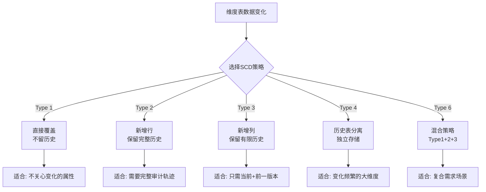
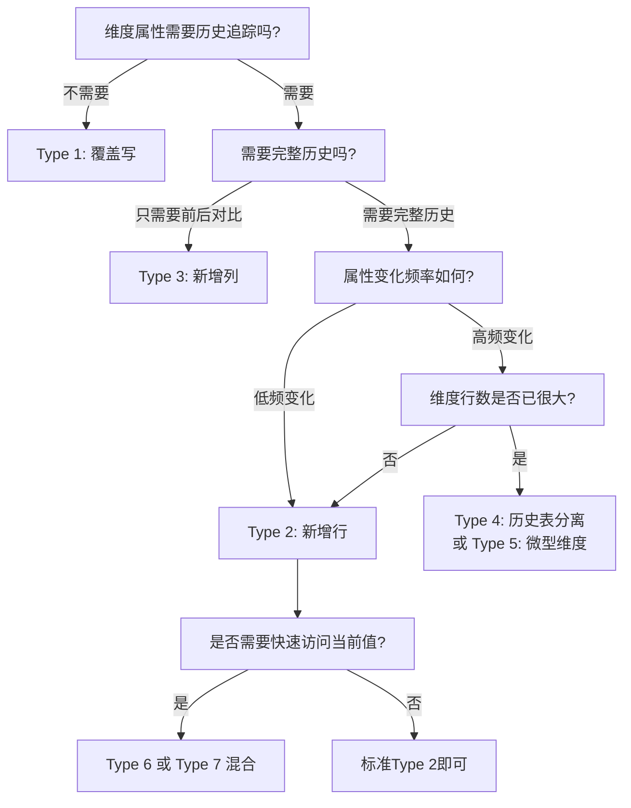

## 三SCD处理——缓慢变化维度的完整治理方案

### 为什么SCD是数据仓库的核心难题

在数据仓库中，维度表记录的是"谁、在哪、什么时候"这样的描述性信息——客户地址、产品类别、员工部门、门店状态。这些信息不是静态的，它们会随时间缓慢变化。问题在于：**当维度发生变化时，历史事实记录应该关联变化前的维度还是变化后的维度？**

假设一个电商场景：客户张三在2024年3月从"北京"搬到"上海"。那么他1月份下的订单（事实记录）在分析时应该关联"北京"还是"上海"？如果不做任何处理，直接覆盖地址字段，那1月份的订单也会显示"上海"，导致区域销售报表失真。这就是缓慢变化维度（Slowly Changing Dimension，SCD）需要解决的核心矛盾。

SCD由数据仓库之父Ralph Kimball在1990年代提出，至今仍是维度建模中不可回避的设计决策。处理不当会导致三大问题：

- **历史失真**：错误地覆盖历史数据，导致报表结果与事实不符
- **分析受限**：无法按时间维度回溯实体状态的变化
- **数据不一致**：上下游系统对同一实体的状态认知不统一



### SCD的七种类型全解

虽然业界常说"SCD三种类型"，实际上完整的分类体系包含七种，其中前三种是Kimball原始定义，后四种是实践中的演进补充。

#### Type 1：覆盖写（Overwrite）

**核心思想**：新值直接覆盖旧值，不保留任何历史信息。

**适用场景**：
- 修正数据错误（如地址录入有误）
- 不关心历史变化的属性（如客户积分等级的当前值）
- 缓慢变化本身无分析价值（如电话号码更新）

**维度表变化示意**：

| 变化前 | customer_id | name | city |
|--------|-------------|------|------|
| 原始记录 | C001 | 张三 | 北京 |

| 变化后（Type 1） | customer_id | name | city |
|--------|-------------|------|------|
| 更新记录 | C001 | 张三 | **上海** |

**SQL实现**：

```sql
-- Type 1: 直接UPDATE
UPDATE dim_customer
SET city = '上海',
    update_timestamp = CURRENT_TIMESTAMP
WHERE customer_id = 'C001';
```

**ETL伪代码**：

```python
def scd_type1_apply(source_record, target_table):
    """Type 1: 直接覆盖，不留历史"""
    # 检查维度是否已存在
    existing = target_table.find(customer_id=source_record.customer_id)
    if existing:
        # 直接更新所有可变字段
        target_table.update(
            where={'customer_id': source_record.customer_id},
            set={
                'city': source_record.city,
                'update_timestamp': now()
            }
        )
    else:
        # 新维度行，直接插入
        target_table.insert(source_record)
```

**优势与局限**：

| 维度 | 评估 |
|------|------|
| 实现复杂度 | ★☆☆ 极简 |
| 存储开销 | ★☆☆ 无额外开销 |
| 历史追溯能力 | ☆☆☆ 完全丧失 |
| 查询性能 | ★★★ 最优（行数不增长） |
| 数据一致性 | ★★☆ 覆盖瞬间可能有短暂不一致 |

**常见误区**：很多团队在数据清洗阶段大量使用Type 1覆盖，却忽略了某些看似"无用"的属性变化其实对业务分析有隐含价值。例如客户的职业变化，单看无意义，但结合收入水平和消费行为分析时就至关重要。建议在决定使用Type 1之前，先与业务方确认该属性是否真的无需历史追踪。

#### Type 2：新增行（Row Versioning）

**核心思想**：维度变化时插入新行，旧行保留但标记为"非当前"，通过有效期（start_date/end_date）或版本标志（is_current）来区分。

这是SCD中最常用、最强大的类型，也是Kimball强烈推荐的默认策略。它能完整追踪维度的每一次变化，是最符合"数据仓库要记录历史"这一核心原则的方案。

**维度表变化示意**：

| 变化前 | customer_id | name | city | start_date | end_date | is_current |
|--------|-------------|------|------|------------|----------|------------|
| 原始记录 | C001 | 张三 | 北京 | 2024-01-01 | 9999-12-31 | Y |

| 变化后（Type 2） | customer_id | name | city | start_date | end_date | is_current |
|--------|-------------|------|------|------------|----------|------------|
| 旧记录 | C001 | 张三 | 北京 | 2024-01-01 | 2024-03-14 | **N** |
| 新记录 | C001 | 张三 | 上海 | **2024-03-15** | **9999-12-31** | **Y** |

**关键设计决策**：

1. **有效期策略**：使用 start_date/end_date 对还是 is_current 标志？
   - start_date + end_date：查询灵活，但需要管理"永远生效"的特殊值（通常用 9999-12-31 或 NULL）
   - is_current 标志：查询简单（`WHERE is_current = 'Y'`），但历史查询需要额外逻辑
   - 最佳实践：两者结合使用，既方便日常查询，又支持历史回溯

2. **代理键（Surrogate Key）策略**：每行需要唯一的代理键，通常使用自增序列或哈希。代理键将事实表和维度表解耦，即使自然键（customer_id）不变，不同版本的维度行也有不同的代理键。

3. **有效性期间重叠检测**：在加载新版本时，必须先关闭旧记录的有效期，再插入新记录。这两步需要在事务中执行，否则会出现同一实体存在两个"当前"版本的数据质量问题。

**完整SQL实现**：

```sql
-- Type 2: 新增行（使用 start_date + end_date + is_current）
-- 步骤1：关闭旧记录
UPDATE dim_customer
SET end_date = DATEADD(day, -1, CURRENT_DATE),
    is_current = 'N'
WHERE customer_id = 'C001'
  AND is_current = 'Y';

-- 步骤2：插入新记录
INSERT INTO dim_customer (
    customer_sk,      -- 代理键
    customer_id,      -- 自然键
    name,
    city,
    start_date,
    end_date,
    is_current
)
VALUES (
    NEXT_SURROGATE_KEY(),  -- 自增代理键
    'C001',
    '张三',
    '上海',
    CURRENT_DATE,
    '9999-12-31',
    'Y'
);
```

**Spark/PySpark实现**：

```python
from pyspark.sql import SparkSession
from pyspark.sql import functions as F
from pyspark.sql.window import Window

def scd_type2_merge(spark, source_df, target_table_name, natural_keys, tracked_columns):
    """
    Type 2 SCD合并逻辑
    
    参数:
        source_df: 源数据DataFrame（本次增量数据）
        target_table_name: 目标维度表名
        natural_keys: 自然键列名列表，如 ['customer_id']
        tracked_columns: 需要跟踪变化的列名列表，如 ['city', 'name']
    """
    # 读取当前维度表
    target_df = spark.table(target_table_name)
    
    # 为源数据生成变更检测哈希
    hash_cols = natural_keys + tracked_columns
    source_with_hash = source_df.withColumn(
        'row_hash',
        F.md5(F.concat_ws('||', *[F.col(c).cast('string') for c in hash_cols]))
    )
    
    # 找出需要新增的行（自然键不存在 或 属性已变化）
    new_records = source_with_hash.alias('src').join(
        target_df.filter(F.col('is_current') == 'Y').alias('tgt'),
        on=natural_keys,
        how='left_anti'
    )
    
    # 找出需要更新的行（自然键存在且属性已变化）
    changed_records = source_with_hash.alias('src').join(
        target_df.filter(F.col('is_current') == 'Y').alias('tgt'),
        on=natural_keys,
        how='inner'
    ).filter(F.col('src.row_hash') != F.col('tgt.row_hash'))
    
    # 步骤1: 关闭旧记录（设置 end_date 和 is_current = 'N'）
    # 步骤2: 插入新版本记录
    # ... 具体的MERGE/INSERT逻辑
```

**SCD Type 2的查询模式**：

```sql
-- 查询当前有效的维度状态
SELECT customer_id, name, city
FROM dim_customer
WHERE is_current = 'Y';

-- 查询某历史时刻的维度状态（时间旅行查询）
SELECT customer_id, name, city
FROM dim_customer
WHERE customer_id = 'C001'
  AND start_date <= '2024-02-15'
  AND end_date >= '2024-02-15';

-- 查询维度变化历史
SELECT customer_id, name, city, start_date, end_date
FROM dim_customer
WHERE customer_id = 'C001'
ORDER BY start_date;

-- 事实表关联维度的两种方式
-- 方式1: 关联当前版本（分析当前状态）
SELECT f.order_date, f.amount, d.city
FROM fact_orders f
JOIN dim_customer d ON f.customer_sk = d.customer_sk
WHERE d.is_current = 'Y';

-- 方式2: 关联订单发生时的版本（分析历史状态）
SELECT f.order_date, f.amount, d.city
FROM fact_orders f
JOIN dim_customer d ON f.customer_sk = d.customer_sk;
-- 注意: 事实表中的 customer_sk 应指向下单时的版本
```

#### Type 3：新增列（Add New Column）

**核心思想**：只保留"当前值"和"前一个值"，通过在维度表中添加额外列来存储。变化超过一次后，更早的历史会被覆盖。

**维度表变化示意**：

| 变化前 | customer_id | name | city |
|--------|-------------|------|------|
| 原始记录 | C001 | 张三 | 北京 |

| 变化后（第一次变化） | customer_id | name | city_previous | city |
|--------|-------------|------|---------------|------|
| 更新记录 | C001 | 张三 | **北京** | **上海** |

| 变化后（第二次变化） | customer_id | name | city_previous | city |
|--------|-------------|------|---------------|------|
| 更新记录 | C001 | 张三 | **上海** | **广州** |

注意：北京这个值在第二次变化时已经被覆盖丢失了。Type 3只能保留最近一次的变化历史。

**SQL实现**：

```sql
-- Type 3: 新增列（保留前一个值）
-- 检测变化并更新
UPDATE dim_customer
SET city_previous = city,      -- 当前值移到"前一个值"列
    city = '广州',              -- 新值写入当前列
    update_timestamp = CURRENT_TIMESTAMP
WHERE customer_id = 'C001'
  AND city != '广州';           -- 仅在实际变化时更新
```

**Spark实现**：

```python
def scd_type3_apply(source_df, target_table, natural_keys, tracked_column):
    """
    Type 3 SCD: 新增列保留前一个值
    
    参数:
        tracked_column: 需要跟踪的列名，如 'city'
        会自动创建 {tracked_column}_previous 列
    """
    prev_col = f'{tracked_column}_previous'
    
    # 合并逻辑: 将当前值移到_previous列，写入新值
    merged = source_df.alias('src').join(
        target_table.alias('tgt'),
        on=natural_keys,
        how='left'
    ).select(
        *[F.coalesce(F.col(f'src.{k}'), F.col(f'tgt.{k}')).alias(k) for k in natural_keys],
        F.when(
            F.col(f'src.{tracked_column}') != F.col(f'tgt.{tracked_column}'),
            F.col(f'tgt.{tracked_column}')  # 旧值移到previous
        ).otherwise(F.col(f'tgt.{prev_col}')).alias(prev_col),
        F.col(f'src.{tracked_column}').alias(tracked_column)
    )
    return merged
```

**Type 3的局限性**：
- 只能保存一个历史版本，变化超过一次后，最早的历史被覆盖
- 每增加一个需要跟踪的属性，就需要多加两列（当前+前一版本），列数膨胀快
- 不适合需要完整审计轨迹的场景（如金融、医疗等合规要求高的行业）

#### Type 4：历史表分离（History Table）

**核心思想**：在主维度表中只保留当前值，将历史变化记录到单独的历史表中。类似于将Type 1和Type 2分离存储。

**适用场景**：
- 维度变化频繁，如果用Type 2会导致主表膨胀严重
- 历史查询频率远低于当前状态查询
- 需要兼顾查询性能和历史完整性

**表结构设计**：

```sql
-- 主维度表（仅当前状态，Type 1风格）
CREATE TABLE dim_customer (
    customer_id VARCHAR(20) PRIMARY KEY,
    name VARCHAR(100),
    city VARCHAR(50),
    update_timestamp TIMESTAMP
);

-- 历史表（完整变化轨迹）
CREATE TABLE dim_customer_history (
    history_sk BIGINT PRIMARY KEY AUTO_INCREMENT,
    customer_id VARCHAR(20),
    name VARCHAR(100),
    city VARCHAR(50),
    valid_from TIMESTAMP,
    valid_to TIMESTAMP,
    change_type VARCHAR(10)  -- INSERT / UPDATE / DELETE
);
```

**合并查询**：

```sql
-- 查询当前+历史时，通过UNION ALL合并
SELECT customer_id, name, city, valid_from, valid_to
FROM dim_customer_history
WHERE customer_id = 'C001'

UNION ALL

SELECT customer_id, name, city,
       update_timestamp AS valid_from,
       '9999-12-31' AS valid_to
FROM dim_customer
WHERE customer_id = 'C001'
  AND NOT EXISTS (
    SELECT 1 FROM dim_customer_history h
    WHERE h.customer_id = dim_customer.customer_id
      AND h.valid_to = '9999-12-31'
  );
```

#### Type 5：Type 1 + Type 2 混合（Miniature Dimension）

**核心思想**：将维度拆分为两部分——一部分属性用Type 2管理（变化慢、需要历史），另一部分用Type 1管理（变化快或不需历史）。创建一个"微型维度"来管理高频变化的属性。

**适用场景**：
- 大部分属性需要Type 2跟踪，但少数属性变化极快（如信用评级每日变化）
- 维度表行数已经很大，继续用Type 2会导致存储爆炸

**表结构设计**：

```sql
-- 主维度表（Type 2管理慢变属性）
CREATE TABLE dim_customer (
    customer_sk BIGINT PRIMARY KEY,
    customer_id VARCHAR(20),
    name VARCHAR(100),
    gender VARCHAR(10),
    birth_date DATE,
    start_date DATE,
    end_date DATE,
    is_current BOOLEAN
);

-- 微型维度表（Type 1管理快变属性）
CREATE TABLE dim_customer_profile (
    profile_sk BIGINT PRIMARY KEY,
    credit_score VARCHAR(20),    -- AAA/AA/A/B/C
    risk_level VARCHAR(20),      -- 低/中/高
    income_bracket VARCHAR(20),  -- 高/中/低
    last_evaluated DATE
);

-- 事实表同时关联两个维度
CREATE TABLE fact_orders (
    order_sk BIGINT PRIMARY KEY,
    customer_sk BIGINT REFERENCES dim_customer(customer_sk),
    profile_sk BIGINT REFERENCES dim_customer_profile(profile_sk),
    order_date DATE,
    amount DECIMAL(10,2)
);
```

#### Type 6：Type 1 + Type 2 + Type 3 混合

**核心思想**：在Type 2的基础上，同时维护一个"回写"机制——当属性变化时，既新增一行（Type 2），也把新值回写到当前有效行的当前值列（Type 1）。同时保留前一个值列（Type 3）。

**表结构设计**：

```sql
CREATE TABLE dim_customer (
    customer_sk BIGINT PRIMARY KEY,
    customer_id VARCHAR(20),
    name VARCHAR(100),
    city VARCHAR(50),            -- 当前值（Type 1回写）
    city_previous VARCHAR(50),   -- 前一个值（Type 3）
    city_start_date DATE,        -- 当前值生效日期
    city_end_date DATE,          -- 当前值失效日期
    is_current BOOLEAN
);
```

**优势**：一次查询就能同时获取当前状态、前一版本状态和完整历史，无需关联多次。

#### Type 7：Type 2 + Type 3 组合

**核心思想**：在Type 2的每一行中同时保存"当前值"和"前一个值"。这样查询"当前状态"时不需要通过 `is_current` 过滤，直接读取当前值列即可。

这种类型在实践中较少使用，主要适用于查询模式复杂、对性能要求极高的场景。

### SCD选型决策框架

面对实际项目，选择哪种SCD类型不是随意的，需要系统性地评估。以下决策矩阵可以帮助团队做出选择：

| 评估维度 | Type 1 | Type 2 | Type 3 | Type 4 | Type 5 |
|---------|--------|--------|--------|--------|--------|
| 实现复杂度 | 低 | 高 | 中 | 中高 | 高 |
| 存储开销 | 最小 | 最大（行数膨胀） | 中（列数膨胀） | 中（两表） | 中高 |
| 历史完整性 | 无 | 完整 | 仅前一版本 | 完整 | 慢变完整/快变当前 |
| 查询便利性 | 最高 | 中等 | 较高 | 需合并 | 中等 |
| 事实表关联 | 无历史关联 | 按时间关联 | 按时间关联 | 按时间关联 | 双键关联 |
| 适合场景 | 修正错误/不关心变化 | 审计/合规/分析 | 只需对比前后 | 高频变化属性 | 大维度拆分 |

**选型决策流程图**：



### dbt中的SCD实现

dbt（Data Build Tool）是现代数据栈中处理SCD的首选工具。dbt-core提供了 `scd_type_2` 宏，可以自动处理Type 2的合并逻辑。

**dbt项目配置**：

```yaml
# dbt_project.yml
name: 'my_data_warehouse'
version: '1.0.0'

models:
  my_data_warehouse:
    staging:
      +materialized: view
    marts:
      +materialized: table
```

**Type 2维度模型（dbt SQL）**：

```sql
-- models/marts/dim_customer_scd2.sql
{{
    config(
        materialized='incremental',
        unique_key='customer_sk',
        incremental_strategy='merge',
        merge_update_columns=['end_date', 'is_current']
    )
}}

with source as (
    select * from {{ ref('stg_customers') }}
),

-- 计算行哈希用于变更检测
with_hash as (
    select
        *,
        md5(concat(customer_id, name, city)) as row_hash
    from source
),

-- 读取当前维度表（增量模式）
current_dim as (
    select *
    from {{ this }}
    where is_current = true
),

-- 找出变化的记录
changes as (
    select
        s.customer_id,
        s.name,
        s.city,
        s.row_hash
    from with_hash s
    left join current_dim c
        on s.customer_id = c.customer_id
    where c.customer_id is null           -- 新实体
       or s.row_hash != c.row_hash        -- 已变化
),

-- 关闭旧版本
close_old as (
    select
        c.customer_sk,
        c.customer_id,
        c.name,
        c.city,
        c.row_hash,
        c.start_date,
        current_date as end_date,
        false as is_current
    from current_dim c
    inner join changes ch
        on c.customer_id = ch.customer_id
    where c.is_current = true
),

-- 创建新版本
new_versions as (
    select
        {{ dbt_utils.generate_surrogate_key(['ch.customer_id', 'ch.row_hash']) }} as customer_sk,
        ch.customer_id,
        ch.name,
        ch.city,
        ch.row_hash,
        current_date as start_date,
        date('9999-12-31') as end_date,
        true as is_current
    from changes ch
)

-- 合并输出
select * from close_old
union all
select * from new_versions
```

**使用dbt官方SCD宏**：

```sql
-- 更简洁的方式：使用 dbt_utils.scd_type_2
{{
    dbt_utils.scd_type_2(
        primary_key='customer_id',
        updated_at='updated_at',
        strategy='check',
        check_cols=['name', 'city', 'phone']
    )
}}
```

### CDC驱动的实时SCD处理

在实时数据管道中，SCD处理需要结合CDC（Change Data Capture）工具。以下展示基于Debezium + Kafka + Flink的实时SCD Type 2方案。

**Debezium配置（MySQL → Kafka）**：

```json
{
  "name": "mysql-cdc-connector",
  "config": {
    "connector.class": "io.debezium.connector.mysql.MySqlConnector",
    "database.hostname": "mysql-host",
    "database.port": "3306",
    "database.user": "cdc_user",
    "database.password": "xxx",
    "database.server.id": "1",
    "database.include.list": "ecommerce",
    "table.include.list": "ecommerce.customers",
    "database.history.kafka.bootstrap.servers": "kafka:9092",
    "database.history.kafka.topic": "schema-changes.ecommerce"
  }
}
```

**Flink SQL实时SCD Type 2**：

```sql
-- Flink SQL: 实时SCD Type 2处理
CREATE TABLE customers_cdc (
    customer_id STRING,
    name STRING,
    city STRING,
    update_time TIMESTAMP(3),
    op STRING,  -- c=创建, u=更新, d=删除
    PRIMARY KEY (customer_id) NOT ENFORCED
) WITH (
    'connector' = 'kafka',
    'topic' = 'ecommerce.customers',
    'properties.bootstrap.servers' = 'kafka:9092',
    'format' = 'debezium-json',
    'scan.startup.mode' = 'latest-offset'
);

-- Flink内置SCD Type 2支持
CREATE TABLE dim_customer_scd2 (
    customer_id STRING,
    name STRING,
    city STRING,
    valid_from TIMESTAMP(3),
    valid_to TIMESTAMP(3),
    is_current BOOLEAN,
    PRIMARY KEY (customer_id, valid_from) NOT ENFORCED
) WITH (
    'connector' = 'jdbc',
    'url' = 'jdbc:postgresql://dw-host:5432/warehouse',
    'table-name' = 'dim_customer'
);

INSERT INTO dim_customer_scd2
SELECT
    customer_id,
    name,
    city,
    update_time AS valid_from,
    COALESCE(
        LEAD(update_time) OVER (PARTITION BY customer_id ORDER BY update_time),
        TIMESTAMP '9999-12-31 23:59:59'
    ) AS valid_to,
    ROW_NUMBER() OVER (
        PARTITION BY customer_id ORDER BY update_time DESC
    ) = 1 AS is_current
FROM customers_cdc
WHERE op != 'd';
```

### 性能优化与生产最佳实践

#### 1. 大维度表的分区策略

SCD Type 2会导致维度表行数持续增长。一个拥有100万客户、平均每人变化3次的维度表，最终会有300万行。分区策略至关重要：

```sql
-- 按 is_current 分区：将当前和历史物理分离
-- 冷热分离：热数据（当前）放SSD，冷数据（历史）放HDD
CREATE TABLE dim_customer (
    customer_sk BIGINT,
    customer_id VARCHAR(20),
    name VARCHAR(100),
    city VARCHAR(50),
    start_date DATE,
    end_date DATE,
    is_current BOOLEAN
)
PARTITION BY LIST (is_current) (
    PARTITION p_current VALUES IN (true),
    PARTITION p_history VALUES IN (false)
);

-- 按 start_date 年月分区（适用于按时间范围查询历史）
CREATE TABLE dim_customer (
    customer_sk BIGINT,
    customer_id VARCHAR(20),
    start_date DATE,
    end_date DATE,
    ...
)
PARTITION BY RANGE (start_date) (
    PARTITION p_2023 VALUES LESS THAN ('2024-01-01'),
    PARTITION p_2024 VALUES LESS THAN ('2025-01-01'),
    PARTITION p_2025 VALUES LESS THAN ('2026-01-01'),
    PARTITION p_future VALUES LESS THAN (MAXVALUE)
);
```

#### 2. 索引设计

```sql
-- 必须索引：自然键 + 当前标志（最频繁的查询模式）
CREATE INDEX idx_dim_customer_current
    ON dim_customer (customer_id, is_current);

-- 历史查询索引：时间范围查询
CREATE INDEX idx_dim_customer_validity
    ON dim_customer (customer_id, start_date, end_date);
```

#### 3. 批量处理优化

```python
def batch_scd_type2(source_batch, target_table, batch_size=10000):
    """
    批量SCD Type 2处理，避免逐行UPDATE导致性能问题
    """
    # 1. 将源数据按自然键分区
    partitioned = partition_by_natural_key(source_batch, batch_size)
    
    for chunk in partitioned:
        # 2. 批量检测变化（使用哈希比对）
        changed_ids = detect_changes(chunk, target_table)
        
        if not changed_ids:
            continue
        
        # 3. 批量关闭旧版本（单条UPDATE批量更新）
        target_table.execute("""
            UPDATE dim_customer
            SET end_date = CURRENT_DATE, is_current = FALSE
            WHERE customer_id IN %s AND is_current = TRUE
        """, (tuple(changed_ids),))
        
        # 4. 批量插入新版本
        new_rows = generate_new_versions(chunk, changed_ids)
        target_table.bulk_insert(new_rows)
```

#### 4. 数据质量校验

SCD数据必须定期校验，防止出现数据不一致：

```sql
-- 校验1: 每个自然键最多一个 is_current = true 的记录
SELECT customer_id, COUNT(*) as cnt
FROM dim_customer
WHERE is_current = TRUE
GROUP BY customer_id
HAVING COUNT(*) > 1;
-- 期望: 0行结果

-- 校验2: 有效期区间不能重叠
SELECT a.customer_id, a.start_date, a.end_date, b.start_date, b.end_date
FROM dim_customer a
JOIN dim_customer b
  ON a.customer_id = b.customer_id
  AND a.customer_sk != b.customer_sk
  AND a.start_date < b.end_date
  AND b.start_date < a.end_date;
-- 期望: 0行结果

-- 校验3: end_date >= start_date
SELECT customer_id, customer_sk, start_date, end_date
FROM dim_customer
WHERE end_date < start_date;
-- 期望: 0行结果

-- 校验4: is_current = true 的行 end_date 应为 9999-12-31
SELECT customer_id, customer_sk, end_date
FROM dim_customer
WHERE is_current = TRUE AND end_date != '9999-12-31';
-- 期望: 0行结果
```

### 常见误区与避坑指南

**误区1：所有属性都用同一种SCD策略**
错误做法：客户维度的10个属性全部用Type 2跟踪。
正确做法：按属性特性分类——城市（Type 2，需分析区域迁移）、电话号码（Type 1，仅修正错误）、信用等级（Type 3，只需前后对比）。

**误区2：Type 2忘记关闭旧版本**
这是最常见的生产事故。如果在INSERT新版本之前没有先UPDATE关闭旧版本，会出现同一客户有两个 `is_current = true` 的记录，导致事实表JOIN产生笛卡尔积，报表数据翻倍。

**误区3：事实表关联了错误版本的维度SK**
事实表中的 `customer_sk` 应该指向**下单时的维度版本**，而不是当前最新版本。如果指向当前版本，所有历史订单的区域分析都会显示最新的地址，历史分析失去意义。

**误区4：忽略Type 2的存储增长**
Type 2的行数增长公式为：`最终行数 = 初始行数 × (1 + 平均变化次数)`。如果一个维度有1亿行且平均变化5次，最终是6亿行。必须提前规划存储和查询优化。

**误区5：Type 3的列爆炸**
Type 3每跟踪一个属性就需要2列（当前+前一版本）。如果跟踪10个属性就是20列。加上Type 2的start_date/end_date等列，维度表可能有40+列，严重影响查询性能和可维护性。建议Type 3最多跟踪3-5个关键属性。

### 实战案例：电商客户维度SCD设计

以一个典型的电商平台为例，完整展示SCD策略的选择和实施。

**维度属性分类**：

| 属性 | 变化频率 | 分析需求 | SCD策略 | 理由 |
|------|---------|---------|---------|------|
| customer_id | 不变 | 自然键 | N/A | 标识符 |
| name | 极低 | 不关心历史 | Type 1 | 名字修正，无需历史 |
| city | 低 | 分析区域迁移 | Type 2 | 需要回溯历史订单的区域归属 |
| phone | 低 | 不关心历史 | Type 1 | 仅联系信息更新 |
| credit_level | 中 | 分析信用变化趋势 | Type 3 | 只需对比前后两个等级 |
| vip_level | 中 | 需要完整积分历史 | Type 2 | 合规审计要求 |
| registration_channel | 不变 | N/A | Type 1 | 不会变化 |

**最终表结构**：

```sql
CREATE TABLE dim_customer (
    -- 代理键
    customer_sk        BIGINT PRIMARY KEY AUTO_INCREMENT,
    
    -- 自然键
    customer_id        VARCHAR(20) NOT NULL,
    
    -- Type 1属性（直接覆盖）
    name               VARCHAR(100),
    phone              VARCHAR(20),
    
    -- Type 2属性（新增行追踪）
    city               VARCHAR(50),
    
    -- Type 3属性（新增列）
    credit_level       VARCHAR(20),
    credit_level_prev  VARCHAR(20),
    
    -- Type 2元数据
    registration_channel VARCHAR(50),
    start_date         DATE NOT NULL,
    end_date           DATE NOT NULL DEFAULT '9999-12-31',
    is_current         BOOLEAN NOT NULL DEFAULT TRUE,
    
    -- 审计字段
    created_at         TIMESTAMP DEFAULT CURRENT_TIMESTAMP,
    updated_at         TIMESTAMP DEFAULT CURRENT_TIMESTAMP,
    
    -- 索引
    UNIQUE KEY uk_natural_date (customer_id, start_date),
    INDEX idx_current (customer_id, is_current),
    INDEX idx_validity (start_date, end_date)
);
```

### 与数据湖表格式的结合

在Lakehouse架构中，Delta Lake和Iceberg的ACID事务能力让SCD实现更加优雅。

**Delta Lake的MERGE INTO**：

```sql
-- Delta Lake: 原子性SCD Type 2合并
MERGE INTO dim_customer AS target
USING (
    SELECT
        customer_id,
        name,
        city,
        md5(concat(customer_id, name, city)) as row_hash,
        current_date() as effective_date
    FROM stg_customers
) AS source
ON target.customer_id = source.customer_id
  AND target.is_current = true
WHEN MATCHED AND target.row_hash != source.row_hash THEN
    -- 关闭旧版本
    UPDATE SET
        end_date = date_add(source.effective_date, -1),
        is_current = false
WHEN NOT MATCHED THEN
    -- 插入新版本
    INSERT (
        customer_sk, customer_id, name, city, row_hash,
        start_date, end_date, is_current
    )
    VALUES (
        monotonically_increasing_id(),
        source.customer_id, source.name, source.city, source.row_hash,
        source.effective_date,
        date('9999-12-31'),
        true
    );
```

**Iceberg的时间旅行与SCD**：

Iceberg的隐藏分区和时间旅行特性天然适合SCD Type 2：

```sql
-- Iceberg表定义（按start_date分区）
CREATE TABLE dim_customer_iceberg (
    customer_id STRING,
    name STRING,
    city STRING,
    start_date DATE,
    end_date DATE,
    is_current BOOLEAN
) USING iceberg
PARTITIONED BY (start_date);

-- 利用Iceberg时间旅行查询历史状态
-- 查询2024-06-01时刻的维度快照
SELECT * FROM dim_customer_iceberg
FOR SYSTEM_TIME AS OF '2024-06-01';

-- Iceberg的增量读取：只读取最近变化的行
SELECT * FROM dim_customer_iceberg
WHERE start_date >= '2024-06-01';
```

### 本节要点回顾

1. SCD的核心矛盾是"维度变化时，历史事实应该关联哪个版本的维度"
2. Type 1（覆盖写）最简单但丢失历史，适合修正和不关心变化的属性
3. Type 2（新增行）是业界默认推荐方案，完整保留历史，但存储开销大
4. Type 3（新增列）只保留前一版本，适合只需前后对比的场景
5. Type 4-7是实践中的演进方案，解决Type 2在特定场景下的局限
6. dbt的SCD宏和Delta Lake的MERGE INTO大幅降低了实现复杂度
7. 生产环境必须关注：分区策略、索引设计、数据质量校验、批量处理优化
8. SCD策略选择应基于"属性特性 × 分析需求 × 合规要求"三维度决策
