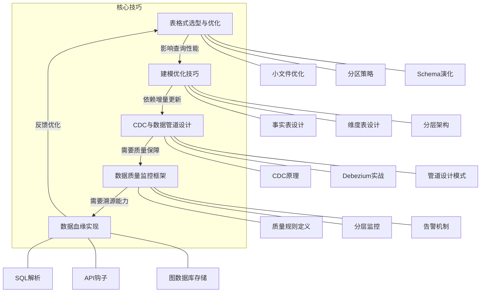
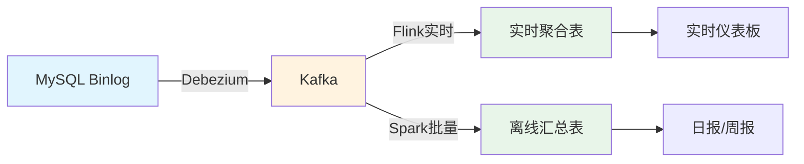
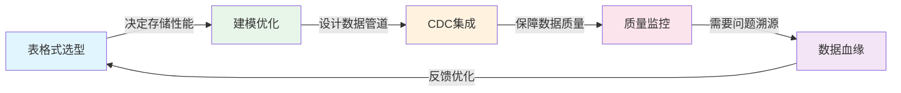

# 核心技巧：从理论到工程实践的关键跨越

理论基础回答"是什么"和"为什么"，核心技巧回答"怎么做"和"怎么做好"。本节聚焦数据湖与数据仓库领域最核心的工程实践技能——从表格式的选型与性能调优，到数据仓库建模的设计模式，再到CDC数据管道、数据质量监控和数据血缘的落地实现。每一项技巧都直接决定了数据架构在生产环境中的可靠性、性能和可维护性。

---

## 本节知识地图



这五大技巧不是孤立存在的，它们构成了一个闭环的数据工程能力体系：表格式选型决定了底层存储的性能上限，建模优化决定了分析查询的效率，CDC管道保证了数据的实时同步，质量监控确保了数据的可信度，血缘追踪则为整个体系提供了可溯源的能力。

---

## 一、数据湖表格式选型与优化

### 为什么表格式选型如此重要

数据湖表格式是Lakehouse架构的核心基础设施。选错了表格式，轻则增加运维成本，重则导致项目推倒重来。Delta Lake、Apache Iceberg和Apache Hudi三者各有侧重，选择时必须结合技术生态、引擎支持和业务场景综合判断。

表格式的核心职责是为对象存储上的Parquet/ORC文件提供三层关键能力：**事务保证**（ACID语义确保并发写入不冲突）、**元数据管理**（快速定位数据文件而不必全表扫描）和**版本化**（时间旅行支持回溯和回滚）。三者的实现路径不同——Delta Lake依赖事务日志文件、Iceberg依赖三层元数据结构、Hudi依赖Timeline——但最终目标一致。

### 选型决策框架

| 决策维度 | Delta Lake | Apache Iceberg | Apache Hudi |
|---------|-----------|---------------|-------------|
| 核心生态 | Databricks + Spark | 多引擎开放标准 | Spark + Flink |
| 事务实现 | 事务日志（Delta Log） | 三层元数据（Manifest） | Timeline + Metadata Table |
| 存储模式 | 仅COW（0.13+支持MOR） | COW/MOR | COW + MOR |
| 增量能力 | Change Data Feed | Incremental Scan | 原生增量查询 |
| 分区演化 | 不支持 | 支持（隐藏分区+分区演化） | 不支持 |
| Schema演化 | 支持（需兼容写入） | 支持（支持列重排序） | 支持 |
| 时间旅行 | 支持（版本号/时间戳） | 支持（快照ID/时间戳） | 支持（Timeline） |
| 许可证 | Apache 2.0 | Apache 2.0 | Apache 2.0 |
| 社区活跃度 | Databricks主导 | 基金会治理，多厂商参与 | Uber主导 |
| 最佳场景 | Spark为主的数仓 | 多引擎数据湖 | 增量ETL + 近实时 |

**选型速查规则**：
- 团队全部基于Spark + Databricks → Delta Lake，享受原生集成和商业支持
- 需要Spark + Flink + Trino多引擎协作 → Apache Iceberg，开放标准兼容性最好
- 以频繁Upsert和增量读取为主 → Apache Hudi，MOR模式写入性能最优
- 预算有限且团队能力强 → Iceberg（社区治理最中立，不会被单一厂商锁定）
- 混合场景（批处理 + 流处理 + 交互查询） → Iceberg，引擎覆盖最广

### 小文件问题：数据湖的头号性能杀手

数据湖中小文件问题的成因很直观：每次写入都会生成新文件，小批量频繁写入产生大量远小于128MB的文件碎片。查询时引擎需要打开每个文件读取元数据，文件数量从数百暴增到数万时，IO开销会急剧恶化——这就是为什么很多数据湖项目上线初期性能良好，半年后查询越来越慢的根本原因。

**小文件的量化影响**：
- 假设单个Parquet文件元数据约10KB，1万个文件的元数据扫描开销约100MB
- Spark任务启动时需要为每个文件创建一个Task，文件过多导致Task调度开销剧增
- 列式存储的谓词下推（Predicate Pushdown）依赖文件级统计信息，文件越多过滤效率越低
- 对象存储（如S3）的GET请求有吞吐限制（单前缀默认3500-5500 TPS），大量小文件可能触发限流

**三大表格式的Compaction方案对比**：

```python
# === Delta Lake 小文件优化 ===

# 1. OPTIMIZE：合并小文件为目标大小（默认128MB）
spark.sql("OPTIMIZE delta.`/data/orders`")

# 2. Z-Order：多维聚簇索引，加速多列过滤查询
# 原理：将数据按多维空间填充曲线排序，使得同时满足多列过滤条件的数据物理相邻
# 适用：经常同时过滤 user_id 和 order_date 的查询
spark.sql("OPTIMIZE delta.`/data/orders` ZORDER BY (user_id, order_date)")

# 3. VACUUM：清理旧版本文件，释放存储空间（默认保留7天）
# 注意：VACUUM后无法查询超过保留期的历史版本
spark.sql("VACUUM delta.`/data/orders` RETAIN 168 HOURS")

# 4. 自动优化（Databricks Runtime 11.3+）
# 写入时自动合并小文件，避免积累
spark.conf.set("spark.databricks.optimizeWrite.enabled", "true")
spark.conf.set("spark.databricks.autoCompact.enabled", "true")

# === Apache Iceberg 小文件优化 ===

# 1. 重写数据文件：合并小文件
spark.sql("CALL system.rewrite_data_files('db.orders')")

# 2. 重写数据文件（带过滤条件，只处理最近分区）
spark.sql("""
    CALL system.rewrite_data_files(
        table => 'db.orders',
        strategy => 'binpack',
        where => 'order_date >= current_date() - interval 7 days'
    )
""")

# 3. 重写清单文件：优化元数据结构
# 将多个小Manifest文件合并为大Manifest，加速元数据扫描
spark.sql("CALL system.rewrite_manifests('db.orders')")

# 4. 清理过期快照：释放旧版本存储空间
spark.sql("CALL system.expire_snapshots('db.orders', TIMESTAMP '2024-01-01 00:00:00')")

# === Apache Hudi 小文件优化 ===

# Hudi内置自动Compaction，但也可手动触发
from pyspark.sql import SparkSession
spark = SparkSession.builder.config("hoodie.compact.inline", "true").getOrCreate()

# 手动Compaction（适用于MOR表）
spark.sql("CALL compaction('db.orders', 'run')")

# Hudi特有的文件大小控制参数
spark.conf.set("hoodie.parquet.max.file.size", 128 * 1024 * 1024)  # 目标文件大小128MB
spark.conf.set("hoodie.copyonwrite.record.size.estimate", 1024)     # 估算记录大小
```

**Compaction调度策略**：
- **定时触发**：每天凌晨执行一次全量Compaction，适合批处理场景
- **增量触发**：每次写入后自动判断是否需要Compaction，适合实时场景
- **阈值触发**：当小文件数量超过阈值（如1000个）时触发，兼顾效率和资源
- **混合策略**：实时层增量触发 + 离线层定时兜底，是生产环境中最常见的方案

**关键指标监控**：运维团队应持续关注文件大小分布——理想状态是绝大多数文件在128MB-256MB之间。可以通过统计每个文件的大小来判断是否需要触发Compaction。

### 分区策略优化

分区设计直接影响查询性能的上限。好的分区策略可以利用分区裁剪（Partition Pruning）跳过大量不相关的数据文件，坏的分区策略反而会制造海量小分区拖慢查询。

**分区设计的核心原则**：

| 原则 | 说明 | 示例 |
|------|------|------|
| 低基数优先 | 选择取值有限的列 | 日期（365值/年）、地区（30值） |
| 查询驱动 | 根据最频繁的过滤条件选择 | 90%查询按日期过滤 → 按日期分区 |
| 避免高基数 | 用户ID、订单号等不适合做分区列 | 用户ID有1亿取值 → 产生1亿个小分区 |
| 分区演化 | Iceberg支持修改分区策略 | 按天分区 → 改为按月分区，无需重写数据 |
| 时间优先 | 时间列是最常见的分区选择 | 按天/月/年分区，天然支持时间范围查询 |

**分区数量的合理范围**：
- 太少（<10个分区）：分区裁剪效果不明显，退化为全表扫描
- 太多（>10万个分区）：元数据管理开销大，每个分区的文件平均变小
- 推荐：每个分区至少包含100MB-1GB数据，分区总数在100-10000之间
- 经验公式：分区数 ≈ 表总大小 / 单分区目标大小（建议256MB-1GB）

**隐藏分区 vs 显式分区**：
- Iceberg采用隐藏分区：用户在建表时定义分区转换（如`days(order_date)`），查询时无需指定分区列，引擎自动进行分区裁剪。这避免了显式分区中常见的"查询漏写分区列导致全表扫描"的错误。
- Delta Lake和Hudi使用显式分区：用户需要在查询中显式指定分区列过滤条件，否则不会触发分区裁剪。

### Schema演化的安全操作规范

Schema演化是数据湖的高频操作，但操作不当会导致下游数据管道中断或数据丢失。核心原则是"向前兼容"——新增的变更不能破坏已有的查询和管道。

| 操作 | 安全性 | 注意事项 |
|------|--------|---------|
| 添加列（带默认值） | 安全 | 历史数据自动填充默认值 |
| 添加列（无默认值） | 需注意 | 历史数据该列为NULL |
| 删除列 | 危险 | 必须确认无下游依赖 |
| 重命名列 | 中等 | 可能影响依赖该列的查询 |
| INT → LONG | 安全 | 向上兼容，不会丢失精度 |
| STRING → INT | 危险 | 非数字字符串会转换失败 |
| DECIMAL精度提升 | 安全 | 不丢失已有精度 |
| DECIMAL精度降低 | 危险 | 超出精度的值会报错 |

**Schema演化的最佳实践**：
1. **变更前**：通过数据血缘确认影响范围，通知所有下游消费者
2. **变更中**：优先添加列而非删除列；删除列前至少等待两个保留周期
3. **变更后**：验证下游管道是否正常运行，监控查询结果是否正确
4. **回滚准备**：确保变更前的快照可用，制定回滚方案

### 常见陷阱与解决方案

| 陷阱 | 根因 | 解决方案 |
|------|------|---------|
| Z-Order列选择不当 | 选择基数差异过大的列做Z-Order | 选择查询中经常同时过滤且基数相近的列 |
| VACUUM后时间旅行失败 | 保留期设置过短 | 生产环境保留期至少7天，关键表保留30天 |
| 分区数爆炸 | 按高基数列分区（如用户ID） | 改为按时间分区 + 查询时过滤用户ID |
| Compaction与写入冲突 | Compaction和写入并发修改同一分区 | 使用文件锁或调度错峰，Iceberg和Hudi有原生并发控制 |
| 表格式版本不兼容 | 升级引擎版本后表格式不兼容 | 升级前测试兼容性，参考官方兼容性矩阵 |

---

## 二、数据仓库建模优化技巧

### 事实表设计的三个关键决策

**决策一：粒度（Grain）**——事实表的每一行代表什么。粒度选择是建模的第一步，也是最重要的一步。选择最细粒度（如订单明细行而非订单汇总），因为粗粒度数据可以通过聚合得到，但细粒度数据无法还原。粒度一旦确定就很难更改，所以宁可细不可粗。

**粒度选择的决策树**：
业务过程是什么？
├── 事务型（下单、支付、退款）
│   └── 粒度 = 一个事务事件（如一行 = 一个订单明细项）
├── 周期快照型（库存快照、账户余额）
│   └── 粒度 = 一个周期内的一个实体状态（如一行 = 某商品某天的库存量）
└── 累积快照型（订单生命周期）
    └── 粒度 = 一个业务过程的完整生命周期（如一行 = 从下单到收货的全过程）

**决策二：代理键（Surrogate Key）**——事实表和维度表使用自增整数作为主键，而非业务系统的自然键（如订单号、用户ID）。代理键的优势：存储空间小（BIGINT 8字节 vs VARCHAR 64字节），Join性能好（整数比较比字符串快一个数量级），不受源系统键变更影响（业务系统改了订单号，代理键不变）。

**代理键 vs 自然键的对比**：

| 对比维度 | 代理键（Surrogate Key） | 自然键（Natural Key） |
|---------|----------------------|---------------------|
| 存储空间 | 8字节（BIGINT） | 16-64字节（VARCHAR） |
| Join性能 | 快（整数哈希） | 慢（字符串哈希） |
| 业务含义 | 无（纯技术主键） | 有（承载业务含义） |
| 源系统变更 | 不受影响 | 可能被破坏 |
| 可读性 | 差（纯数字） | 好（可理解的业务标识） |
| 推荐场景 | 数仓内部所有表 | 仅用于ODS层标识源数据 |

**决策三：预计算度量**——将频繁使用的计算字段直接存储在事实表中。例如，`line_total = quantity * unit_price` 在写入时计算好，而不是查询时实时计算。这看起来简单，但在大规模数据上（数十亿行），避免重复计算可以节省大量查询时间。

**三类事实表度量**：
- **可加性度量**：可以在所有维度上求和，如订单金额、销售数量
- **半可加性度量**：只能在部分维度上求和，如账户余额（不能跨时间求和，但可以跨客户求和）
- **非可加性度量**：不能求和，如比率、百分比、单价（需要在聚合后重新计算）

### 维度表设计：宽表策略与一致性维度

**宽表策略**：将相关的属性放在同一张维度表中，减少查询时的Join数量。例如，产品维度表应包含产品名称、类别、品牌、供应商、制造商等所有属性，而不是拆成多张小表。现代OLAP引擎的列式存储已经大大降低了宽表的存储开销——列式存储只读取查询涉及的列，宽表中未使用的列不消耗IO。

**一致性维度（Conformed Dimension）**：多个事实表必须共享相同的维度表。例如，销售事实表和库存事实表都引用同一个产品维度表和时间维度表。如果每个事实表各自维护一套维度表，跨事实表的分析就会出现数据不一致的问题。

**缓慢变化维（SCD）的五种策略**：

| 策略 | 原理 | 适用场景 | 存储开销 | 实现复杂度 |
|------|------|---------|---------|-----------|
| Type 1：覆盖 | 直接覆盖旧值 | 修正错误数据 | 最低 | 最简单 |
| Type 2：版本化 | 保留完整历史（valid_from/valid_to） | 需要历史追踪 | 最高 | 中等 |
| Type 3：有限历史 | 保留前值列（current_value, previous_value） | 只需比较当前和前值 | 低 | 简单 |
| Type 4：历史表 | 当前表 + 独立历史表 | 大维度表的历史追踪 | 中等 | 较复杂 |
| Type 5：混合 | Type 1 + Type 2的子集 | 需要最近N个版本 | 中高 | 复杂 |

```sql
-- SCD Type 2 完整实现示例
-- 当客户城市信息变更时，保留历史版本

-- 1. 标记旧记录为失效
UPDATE dim_customer
SET valid_to = CURRENT_TIMESTAMP,
    is_current = FALSE
WHERE customer_id = 1001
  AND is_current = TRUE;

-- 2. 插入新记录
INSERT INTO dim_customer (
    customer_sk, customer_id, customer_name, 
    city, valid_from, valid_to, is_current
)
VALUES (
    NEXT_SK(), 1001, '张三',
    '北京', CURRENT_TIMESTAMP, '9999-12-31', TRUE
);

-- 3. 查询某个时间点的维度快照
SELECT * FROM dim_customer
WHERE customer_id = 1001
  AND valid_from <= '2024-01-15'
  AND valid_to > '2024-01-15';

-- 4. 查询维度变更历史
SELECT customer_id, customer_name, city, valid_from, valid_to
FROM dim_customer
WHERE customer_id = 1001
ORDER BY valid_from;
```

### 数据仓库分层架构实战

数据仓库的分层设计是数据治理的基石。每一层有明确的职责边界，上层只能依赖下层，不能反向依赖。

```sql
-- ============================================
-- 数据仓库四层架构：ODS → DWD → DWS → ADS
-- ============================================

-- 第一层：ODS（Operational Data Store）原始数据层
-- 保持源系统结构，不做任何转换
-- 作用：数据备份、审计追溯、重新处理的起点
CREATE TABLE ods_orders AS 
SELECT * FROM source_db.orders;

-- 第二层：DWD（Data Warehouse Detail）明细数据层
-- 清洗、标准化、规范化，生成最细粒度的明细事实表
-- 作用：统一数据口径，消除源系统差异
CREATE TABLE dwd_order_detail AS
SELECT
    o.order_id,
    o.customer_id,
    CAST(o.order_date AS DATE) AS order_date,
    oi.product_id,
    oi.quantity,
    oi.unit_price,
    oi.quantity * oi.unit_price AS line_total,
    o.order_status,
    o.create_time
FROM ods_orders o
JOIN ods_order_items oi ON o.order_id = oi.order_id
WHERE o.order_status != 'CANCELLED';  -- 过滤取消订单

-- 第三层：DWS（Data Warehouse Summary）汇总数据层
-- 按业务主题预聚合，加速常见分析查询
-- 作用：提供高性能的聚合数据，减少重复计算
CREATE TABLE dws_daily_sales AS
SELECT
    date_sk,
    store_sk,
    product_sk,
    SUM(quantity) AS total_quantity,
    SUM(line_total) AS total_amount,
    COUNT(DISTINCT order_id) AS order_count,
    AVG(unit_price) AS avg_unit_price
FROM dwd_order_detail
JOIN dim_date ON dwd_order_detail.order_date = dim_date.date
JOIN dim_store ON dwd_order_detail.store_id = dim_store.store_id
JOIN dim_product ON dwd_order_detail.product_id = dim_product.product_id
GROUP BY date_sk, store_sk, product_sk;

-- 第四层：ADS（Application Data Service）应用数据层
-- 面向具体业务场景的报表和应用
-- 作用：直接服务于BI报表、数据产品、API接口
CREATE TABLE ads_monthly_report AS
SELECT
    dd.year,
    dd.month,
    ds.store_name,
    dp.category,
    SUM(ds.total_amount) AS monthly_sales,
    SUM(ds.total_amount) / COUNT(DISTINCT dd.date) AS avg_daily_sales,
    SUM(ds.order_count) AS total_orders
FROM dws_daily_sales ds
JOIN dim_date dd ON ds.date_sk = dd.date_sk
JOIN dim_store st ON ds.store_sk = st.store_sk
JOIN dim_product dp ON ds.product_sk = dp.product_sk
GROUP BY dd.year, dd.month, ds.store_name, dp.category;
```

**分层架构的命名规范**：业界常见的命名方式是用层级缩写作为表名前缀——`ods_*`、`dwd_*`、`dws_*`、`ads_*`，一目了然。这不仅方便开发者理解表的层级定位，也便于权限管理（不同层级授予不同的访问权限）。

**各层的性能特征和数据治理重点**：

| 层级 | 数据量级 | 主要操作 | 权限控制 | 典型延迟要求 |
|------|---------|---------|---------|------------|
| ODS | TB-PB级 | 全量/增量写入 | 开发团队 | 小时级 |
| DWD | TB级 | 清洗、关联、过滤 | 数据团队 | 分钟级 |
| DWS | GB-TB级 | 聚合、汇总 | 分析团队 | 秒级 |
| ADS | GB级 | 报表、API | 业务团队 | 亚秒级 |

### 增量更新策略

数据仓库的数据更新通常采用增量方式而非全量刷新，原因很简单：全量刷新在数据量达到TB级别时耗时太长，而且浪费计算资源。增量更新的关键在于识别"自上次更新以来变更了哪些数据"。

| 增量识别方式 | 原理 | 适用场景 | 局限性 |
|-------------|------|---------|--------|
| 时间戳字段 | 比较update_time > last_sync_time | 有可靠更新时间戳的表 | 无法捕获DELETE操作 |
| 自增ID | 比较id > last_sync_id | 有自增主键的表 | 无法捕获UPDATE操作 |
| CDC日志 | 监听数据库变更日志 | 所有场景（最佳方案） | 需要数据库开启日志 |
| 哈希对比 | 计算行哈希值比较差异 | 无时间戳的表 | 计算开销大 |
| 软删除标记 | 过滤is_deleted字段 | 有逻辑删除标记的表 | 需要源系统配合 |

### 常见陷阱与解决方案

| 陷阱 | 根因 | 解决方案 |
|------|------|---------|
| 粒度选择过粗 | 初始设计时选择了汇总粒度 | 永远选择最细粒度，粗粒度可以通过聚合得到 |
| 代理键不连续 | 数据回溯和重跑导致键冲突 | 使用全局唯一ID生成器（如Snowflake）而非自增 |
| 维度表不一致 | 不同事实表引用不同的维度表 | 建立一致性维度（Conformed Dimension）规范 |
| 分层边界模糊 | DWS层做了ADS的事，或ODS层做了DWD的事 | 严格执行"上层依赖下层"原则 |
| 缓慢变化维处理不当 | 所有维度变更都用Type 1覆盖 | 根据业务需求选择合适的SCD策略 |

---

## 三、CDC与数据管道设计

### CDC的核心原理

CDC（Change Data Capture）的本质是：关系型数据库为了崩溃恢复和主从复制，已经把所有数据变更记录在了预写日志（MySQL的Binlog、PostgreSQL的WAL、Oracle的Redo Log）中。CDC工具直接读取这些日志，就能捕获所有的INSERT、UPDATE和DELETE操作，而不需要修改源系统的应用代码。

**主流数据库的变更日志格式**：

| 数据库 | 变更日志 | 格式 | 读取方式 |
|-------|---------|------|---------|
| MySQL | Binlog | statement/row/mixed | 客户端模拟从库协议（Debezium） |
| PostgreSQL | WAL | logical decoding | 逻辑复制槽（Debezium） |
| Oracle | Redo Log | 红日挖掘器（LogMiner） | LogMiner API（Debezium） |
| SQL Server | Transaction Log | CDC系统表 | CDC存储过程/Debezium |
| MongoDB | Oplog | 环形缓冲区 | 轮询Oplog（Debezium） |

**CDC相比传统ETL的优势**：

| 对比维度 | 传统ETL（轮询） | CDC |
|---------|----------------|-----|
| 对源系统影响 | 每次轮询执行SQL查询，增加数据库负载 | 只读取日志，对源系统几乎无影响 |
| 实时性 | 分钟级到小时级 | 秒级 |
| 完整性 | 可能漏掉DELETE操作 | 捕获所有变更，包括DELETE |
| 资源消耗 | 持续占用数据库连接 | 按日志消费，资源可控 |
| 数据血缘 | 难以追溯具体变更 | 每条变更事件携带完整的前镜像/后镜像 |
| 幂等性 | 需要额外设计 | 事件天然携带变更位点，支持精确一次语义 |

### Debezium实战配置

Debezium是基于Kafka Connect构建的开源CDC工具，是目前最成熟、社区最活跃的CDC解决方案。它支持MySQL、PostgreSQL、Oracle、SQL Server、MongoDB等主流数据库。

```python
# Debezium MySQL Source Connector完整配置
debezium_config = {
    "name": "mysql-cdc-connector",
    "config": {
        # 基础连接配置
        "connector.class": "io.debezium.connector.mysql.MySqlConnector",
        "database.hostname": "mysql-host",
        "database.port": "3306",
        "database.user": "cdc_user",
        "database.password": "****",
        "database.server.id": "1",
        "database.server.name": "production-mysql",
        
        # 数据库和表过滤
        "database.include.list": "order_db",
        "table.include.list": "order_db.orders,order_db.order_items",
        
        # Schema历史（用于处理DDL变更）
        "database.history.kafka.bootstrap.servers": "kafka:9092",
        "database.history.kafka.topic": "schema-changes.order_db",
        
        # 全量快照策略
        # initial: 首次启动时做全量快照，之后只读增量日志
        # never: 不做快照，只从当前日志位置开始（需要数据库已有位点）
        # no_data: 做快照但不包含数据（只采集Schema）
        "snapshot.mode": "initial",
        
        # 转换器配置（将变更事件转换为目标格式）
        "transforms": "route,unwrap",
        "transforms.route.type": "org.apache.kafka.connect.transforms.RegexRouter",
        "transforms.route.regex": "([^.]+)\\.([^.]+)\\.([^.]+)",
        "transforms.route.replacement": "$3",
        "transforms.unwrap.type": "io.debezium.transforms.ExtractNewRecordState",
        
        # 数据格式
        "key.converter": "io.confluent.connect.avro.AvroConverter",
        "value.converter": "io.confluent.connect.avro.AvroConverter",
        
        # 性能参数
        "max.batch.size": "2048",          # 单批次最大事件数
        "max.queue.size": "8192",          # 内存队列最大容量
        "poll.interval.ms": "500",         # 日志轮询间隔
        
        # 断点续传
        "offset.flush.interval.ms": "10000",  # 位点持久化间隔
        
        # 错误处理
        "errors.log.enable": "true",
        "errors.log.include.messages": "true",
        "errors.tolerance": "none"         # 遇到错误立即停止
    }
}

# Flink消费CDC数据写入Iceberg的完整示例
# 方式一：通过Kafka间接消费
from pyflink.datastream import StreamExecutionEnvironment
from pyflink.datastream.connectors import KafkaSource
from pyflink.common.serialization import JsonDeserializationSchema

env = StreamExecutionEnvironment.get_execution_environment()
cdc_source = KafkaSource.builder() \
    .set_bootstrap_servers("kafka:9092") \
    .set_topics("production-mysql.orders") \
    .set_group_id("cdc-consumer-group") \
    .set_deserializer(JsonDeserializationSchema()) \
    .build()

# 方式二：Flink SQL直接读取MySQL CDC（无需Kafka中间层）
# CREATE TABLE orders_cdc (
#     order_id INT,
#     customer_id INT,
#     amount DECIMAL(10,2),
#     order_date TIMESTAMP(3),
#     update_time TIMESTAMP(3),
#     PRIMARY KEY (order_id) NOT ENFORCED
# ) WITH (
#     'connector' = 'mysql-cdc',
#     'hostname' = 'mysql-host',
#     'port' = '3306',
#     'username' = 'cdc_user',
#     'password' = '****',
#     'database-name' = 'order_db',
#     'table-name' = 'orders'
# );
```

### CDC数据管道设计模式

**模式一：全量 + 增量（Snapshot + CDC）**

适用于从零搭建数据同步管道。首次运行时对源表做全量快照（一次性读取所有数据写入数据湖），之后通过CDC持续同步增量变更。Debezium的`snapshot.mode=initial`配置就是这种模式。

时间线：
t0 ──── 全量快照（耗时较长，一次性）
t1 ──→ t2 ──→ t3 ──→ ... ──→ 持续CDC增量同步（实时）

**模式二：仅增量（CDC Only）**

适用于数据量极大、全量快照不现实的场景（如数十亿行的历史表）。需要数据库已经有可靠的位点信息（MySQL binlog position或PostgreSQL LSN），从该位点开始增量同步。

**模式三：CDC + Upsert写入数据湖**

在数据湖中处理CDC的UPDATE和DELETE操作时，需要通过表格式的Merge/Upsert功能实现行级更新。Delta Lake的MERGE INTO、Iceberg的MERGE INTO、Hudi的Upsert操作都支持这种模式。

**模式四：CDC + 流处理 + 批处理混合**



这种模式将CDC数据同时送入实时和离线两条路径：Flink消费Kafka中的CDC事件进行实时聚合，写入低延迟的实时表供仪表板使用；Spark定期批量消费Kafka中的CDC事件进行全量聚合，写入离线汇总表供报表使用。两条路径的数据最终通过一致性维度保持对齐。

### CDC管道的可靠性保障

**精确一次语义（Exactly-Once Semantics）**：CDC管道最常见的数据质量问题是重复消费导致的数据重复。实现精确一次需要三方面配合：

| 层级 | 机制 | 说明 |
|------|------|------|
| Source端 | 位点持久化 | Debezium定期将binlog位点写入Kafka Connect内部topic |
| Broker端 | 幂等写入 | Kafka支持幂等生产者，避免网络重试导致的重复消息 |
| Sink端 | 事务写入 | Flink/Spark的两阶段提交或幂等Upsert写入 |

**错误处理与死信队列**：
- **跳过并继续**：`errors.tolerance=all`，跳过失败事件写入死信队列（DLQ），不中断管道
- **失败停止**：`errors.tolerance=none`，遇到错误立即停止Connector，人工介入修复
- **重试机制**：配置`errors.retry.timeout`和`errors.retry.delay`，自动重试临时性错误
- **告警集成**：监控DLQ的积压量，超过阈值立即告警

### 常见陷阱与解决方案

| 陷阱 | 根因 | 解决方案 |
|------|------|---------|
| Schema变更导致Connector崩溃 | 源表DDL变更后Debezium无法识别新列 | 配置`schema.history.internal`并使用兼容的Schema演化策略 |
| Binlog过期导致Connector无法恢复 | 数据库保留的binlog空间不足 | 增大binlog保留空间（`expire_logs_days`），监控binlog消费延迟 |
| 大事务阻塞消费 | 一个事务包含数万行变更，消费时间过长 | 拆分大事务或增加`max.batch.size`参数 |
| 字段字符集不匹配 | 中文等多字节字符在传输中被截断 | 确保Source和Sink的字符集配置一致（如UTF-8） |
| CDC数据与全量快照不一致 | 全量快照期间有新变更，增量起点不精确 | 使用一致性快照（如MySQL的`FLUSH TABLES WITH READ LOCK`或GTID） |

---

## 四、数据质量监控框架

### 数据质量的五个核心维度

数据质量不是抽象概念，而是可以量化监控的具体指标。每个维度都需要定义明确的检查规则和阈值。

| 维度 | 含义 | 检查规则示例 | 告警阈值建议 |
|------|------|-------------|-------------|
| 完整性 | 数据是否缺失 | 非空检查（NOT NULL） | 空值率 < 1% |
| 准确性 | 数据值是否正确 | 范围检查、格式检查 | 异常值 < 0.1% |
| 一致性 | 跨系统数据是否一致 | 跨表Join比对 | 差异率 < 0.01% |
| 时效性 | 数据是否按时更新 | 检查最新数据时间戳 | 延迟 < 2小时 |
| 唯一性 | 是否存在重复数据 | 主键/业务键唯一性 | 重复率 = 0% |

**数据质量的量化公式**：
- **质量得分** = (通过的检查数 / 总检查数) × 100%
- **数据健康度** = Σ(维度权重 × 维度得分) / Σ维度权重
- **SLA达成率** = (按时更新的数据表数 / 总数据表数) × 100%

建议设置数据质量SLA：核心报表表的数据健康度 ≥ 99%，一般数据表 ≥ 95%。

### 分层质量监控策略

数据质量监控应该在数据管道的每个层级进行，但检查重点不同：

```python
# 数据质量监控框架完整实现
from datetime import datetime, timedelta
from dataclasses import dataclass
from typing import List, Dict, Any

@dataclass
class QualityCheckResult:
    """单条质量检查结果"""
    rule: str
    passed: bool
    details: Dict[str, Any]
    check_time: datetime

class DataQualityFramework:
    """数据质量监控框架
    
    支持按数据层级（ODS/DWD/DWS/ADS）配置不同的质量规则，
    当规则被违反时生成告警，支持自定义检查逻辑。
    """
    
    def __init__(self, db_engine):
        self.db_engine = db_engine
        self.rules: List[Any] = []
        self.results: List[QualityCheckResult] = []
    
    def add_rule(self, rule, layer: str = "all"):
        """添加质量检查规则，可指定适用的数据层级"""
        self.rules.append({"rule": rule, "layer": layer})
    
    def run_checks(self, table_name: str, layer: str) -> List[QualityCheckResult]:
        """对指定表执行所有适用的质量检查"""
        results = []
        for item in self.rules:
            if item["layer"] in ("all", layer):
                result = item["rule"].check(self.db_engine, table_name)
                results.append(result)
                self.results.append(result)
        return results
    
    def generate_report(self) -> str:
        """生成质量检查报告"""
        total = len(self.results)
        passed = sum(1 for r in self.results if r.passed)
        failed = total - passed
        pass_rate = (passed / total * 100) if total > 0 else 0
        return (
            f"质量检查报告：共{total}项，通过{passed}项，"
            f"失败{failed}项，通过率{pass_rate:.1f}%"
        )
    
    def get_failed_checks(self) -> List[QualityCheckResult]:
        """获取所有未通过的检查"""
        return [r for r in self.results if not r.passed]


class NotNullCheck:
    """非空检查：验证指定列不存在NULL值"""
    
    def __init__(self, column: str):
        self.column = column
    
    def check(self, engine, table: str) -> QualityCheckResult:
        sql = f"""
            SELECT COUNT(*) AS null_count,
                   COUNT(*) * 100.0 / (SELECT COUNT(*) FROM {table}) AS null_pct
            FROM {table}
            WHERE {self.column} IS NULL
        """
        result = engine.execute(sql).fetchone()
        return QualityCheckResult(
            rule=f"NOT NULL({self.column})",
            passed=result[0] == 0,
            details={"null_count": result[0], "null_pct": round(result[1], 4)},
            check_time=datetime.now()
        )


class RangeCheck:
    """范围检查：验证数值在合理范围内"""
    
    def __init__(self, column: str, min_val: float, max_val: float):
        self.column = column
        self.min_val = min_val
        self.max_val = max_val
    
    def check(self, engine, table: str) -> QualityCheckResult:
        sql = f"""
            SELECT COUNT(*) AS out_of_range
            FROM {table}
            WHERE {self.column} < {self.min_val}
               OR {self.column} > {self.max_val}
               OR {self.column} IS NULL
        """
        result = engine.execute(sql).fetchone()
        return QualityCheckResult(
            rule=f"RANGE({self.column}, {self.min_val}, {self.max_val})",
            passed=result[0] == 0,
            details={"out_of_range_count": result[0]},
            check_time=datetime.now()
        )


class FreshnessCheck:
    """时效性检查：验证数据更新是否及时"""
    
    def __init__(self, timestamp_column: str, max_delay_hours: float):
        self.timestamp_column = timestamp_column
        self.max_delay_hours = max_delay_hours
    
    def check(self, engine, table: str) -> QualityCheckResult:
        sql = f"SELECT MAX({self.timestamp_column}) AS latest_update FROM {table}"
        result = engine.execute(sql).fetchone()
        latest = result[0]
        delay_hours = (datetime.now() - latest).total_seconds() / 3600
        return QualityCheckResult(
            rule=f"FRESHNESS({self.timestamp_column}, {self.max_delay_hours}h)",
            passed=delay_hours <= self.max_delay_hours,
            details={
                "delay_hours": round(delay_hours, 2),
                "latest_update": str(latest),
                "threshold_hours": self.max_delay_hours
            },
            check_time=datetime.now()
        )


class UniquenessCheck:
    """唯一性检查：验证主键/业务键无重复"""
    
    def __init__(self, columns: List[str]):
        self.columns = columns
    
    def check(self, engine, table: str) -> QualityCheckResult:
        cols = ", ".join(self.columns)
        sql = f"""
            SELECT COUNT(*) - COUNT(DISTINCT {cols}) AS duplicate_count
            FROM {table}
        """
        result = engine.execute(sql).fetchone()
        return QualityCheckResult(
            rule=f"UNIQUE({', '.join(self.columns)})",
            passed=result[0] == 0,
            details={"duplicate_count": result[0]},
            check_time=datetime.now()
        )


class CrossTableConsistencyCheck:
    """跨表一致性检查：验证同一实体在不同表中的属性值一致"""
    
    def __init__(self, table_a: str, table_b: str, join_key: str, compare_column: str):
        self.table_a = table_a
        self.table_b = table_b
        self.join_key = join_key
        self.compare_column = compare_column
    
    def check(self, engine, table: str) -> QualityCheckResult:
        sql = f"""
            SELECT COUNT(*) AS mismatch_count
            FROM (
                SELECT a.{self.join_key}, a.{self.compare_column} AS val_a,
                       b.{self.compare_column} AS val_b
                FROM {self.table_a} a
                JOIN {self.table_b} b ON a.{self.join_key} = b.{self.join_key}
                WHERE a.{self.compare_column} != b.{self.compare_column}
            )
        """
        result = engine.execute(sql).fetchone()
        return QualityCheckResult(
            rule=f"CROSS_TABLE({self.table_a}.{self.compare_column} == {self.table_b}.{self.compare_column})",
            passed=result[0] == 0,
            details={"mismatch_count": result[0]},
            check_time=datetime.now()
        )


class VolumeCheck:
    """数据量检查：验证表的行数在合理范围内"""
    
    def __init__(self, min_rows: int, max_rows: int):
        self.min_rows = min_rows
        self.max_rows = max_rows
    
    def check(self, engine, table: str) -> QualityCheckResult:
        sql = f"SELECT COUNT(*) AS row_count FROM {table}"
        result = engine.execute(sql).fetchone()
        row_count = result[0]
        passed = self.min_rows <= row_count <= self.max_rows
        return QualityCheckResult(
            rule=f"VOLUME({self.min_rows} <= rows <= {self.max_rows})",
            passed=passed,
            details={
                "actual_rows": row_count,
                "min_expected": self.min_rows,
                "max_expected": self.max_rows
            },
            check_time=datetime.now()
        )


class SchemaCheck:
    """Schema检查：验证表的Schema是否符合预期"""
    
    def __init__(self, expected_columns: Dict[str, str]):
        self.expected_columns = expected_columns  # {column_name: expected_type}
    
    def check(self, engine, table: str) -> QualityCheckResult:
        sql = f"DESCRIBE {table}"
        result = engine.execute(sql).fetchall()
        actual_columns = {row[0]: row[1] for row in result}
        
        missing = set(self.expected_columns.keys()) - set(actual_columns.keys())
        type_mismatches = [
            col for col, expected_type in self.expected_columns.items()
            if col in actual_columns and actual_columns[col] != expected_type
        ]
        
        passed = len(missing) == 0 and len(type_mismatches) == 0
        return QualityCheckResult(
            rule=f"SCHEMA({table})",
            passed=passed,
            details={
                "missing_columns": list(missing),
                "type_mismatches": type_mismatches
            },
            check_time=datetime.now()
        )
```

### 质量监控的分层策略

每个数据层级有不同的质量关注重点：

- **ODS层**：关注数据完整性（源数据是否全部到达）和格式合规性（字段类型是否匹配）。关键规则：Schema一致性检查、数据量波动检查（今日数据量与历史均值偏差不超过20%）、时效性检查（数据是否按时到达）
- **DWD层**：关注数据准确性（清洗逻辑是否正确）和一致性（跨表数据是否对齐）。关键规则：主键唯一性检查、外键引用完整性、空值率检查、业务规则验证（如订单金额 ≥ 0）
- **DWS层**：关注汇总结果的合理性（聚合值是否在合理范围）和完整性（分组是否齐全）。关键规则：聚合值范围检查（如日销售额不会为负）、分组完整性检查（如100个门店应该有100条日销售记录）
- **ADS层**：关注报表数据的时效性（是否按时生成）和准确性（最终数字是否正确）。关键规则：报表完整性检查、环比异常波动检查（如销售额环比突变超过50%触发告警）

### 告警与响应机制

质量检查发现问题后，必须有明确的响应流程：

1. **实时告警**：关键规则（如主键重复、时效性超时）违反时立即发送告警（邮件/Slack/钉钉）
2. **数据血缘追踪**：通过血缘关系快速定位问题影响范围——哪些下游报表依赖了问题数据
3. **数据回滚**：利用表格式的时间旅行能力，回滚到质量合格的历史版本
4. **根因分析**：追溯问题源头——是源系统数据问题、ETL逻辑Bug还是基础设施故障

**告警分级策略**：

| 级别 | 触发条件 | 响应时间 | 通知方式 | 处理流程 |
|------|---------|---------|---------|---------|
| P0-严重 | 核心报表数据错误或不可用 | 15分钟内 | 电话+短信+IM | 立即回滚，通知所有下游 |
| P1-重要 | 数据延迟超过SLA、质量得分低于95% | 1小时内 | 短信+IM | 排查根因，评估影响范围 |
| P2-一般 | 非核心表数据异常、质量得分低于98% | 4小时内 | IM+邮件 | 记录问题，排期修复 |
| P3-提醒 | 数据量波动异常、Schema变更通知 | 24小时内 | 邮件 | 评估是否需要干预 |

### 常见陷阱与解决方案

| 陷阱 | 根因 | 解决方案 |
|------|------|---------|
| 告警疲劳 | 规则设置过严导致大量误报 | 分级告警+滑动窗口统计，避免瞬时波动触发告警 |
| 检查开销过大 | 全量扫描大表做质量检查 | 抽样检查+增量检查，只在数据变更时触发 |
| 质量检查与ETL竞争资源 | 检查SQL占用大量计算资源 | 独立资源池运行质量检查，避免与ETL任务竞争 |
| 忽略数据漂移 | 长期运行的管道逐渐偏离正确结果 | 定期全量校验+统计监控（如P50/P99值漂移检测） |
| 质量规则不维护 | 业务变更后质量规则未同步更新 | 质量规则纳入版本控制，与ETL代码同步review和部署 |

---

## 五、数据血缘实现

### 为什么数据血缘是数据治理的基石

数据血缘回答一个核心问题："这个数据是从哪来的，经过了什么处理，最终流向了哪里"。没有血缘的数据治理就像没有地图的导航——你知道数据有问题，但不知道问题从何而来，也不知道修复后会影响哪些下游。

数据血缘的核心价值：
- **影响分析**：源表某个字段要删除？通过血缘立即知道会影响哪些下游表和报表
- **问题排查**：报表数据异常？通过血缘链路逆向追踪到问题的根因
- **合规审计**：GDPR要求数据可追溯？血缘提供了完整的数据流转链路
- **数据发现**：新来的分析师想找"用户活跃度"指标？通过血缘可以定位到所有相关的表和字段

### 三种血缘采集方式

**方式一：基于SQL解析**

通过解析INSERT INTO ... SELECT、CREATE TABLE AS SELECT等语句，提取源表和目标表的依赖关系。优点是实现简单，缺点是需要处理各种SQL方言和复杂查询（嵌套子查询、CTE、窗口函数等）。

**方式二：基于API钩子**

在数据处理框架中插入监听器，在查询执行时捕获实际的读写关系。Spark的QueryExecutionListener、dbt的依赖解析都是这种方式。优点是准确度高（捕获的是实际执行的计划），缺点是与特定框架绑定。

**方式三：基于日志解析**

解析数据处理引擎的执行日志，提取IO操作信息。适用于无法修改应用代码的场景，但解析准确度依赖日志格式的稳定性。

**三种方式的对比**：

| 对比维度 | SQL解析 | API钩子 | 日志解析 |
|---------|---------|---------|---------|
| 实现难度 | 低 | 中 | 高 |
| 准确度 | 中（静态分析） | 高（运行时实际计划） | 中（依赖日志格式） |
| 框架依赖 | 无 | 强（绑定特定框架） | 弱 |
| 覆盖范围 | 仅SQL作业 | 仅特定框架的作业 | 所有可产生日志的作业 |
| 列级血缘 | 困难 | 较容易 | 困难 |
| 推荐场景 | SQL-heavy环境 | Spark/Flink环境 | 混合环境兜底 |

### 基于Spark的血缘采集实现

```python
from pyspark.sql import SparkSession
from datetime import datetime

class LineageListener:
    """Spark查询血缘监听器
    
    通过Spark的QueryExecutionListener接口，在每次查询执行完成后
    自动提取读写的表信息，记录血缘关系。
    """
    
    def __init__(self, lineage_store):
        self.lineage_store = lineage_store
    
    def onSuccess(self, func_name, query_execution, duration_ns):
        try:
            # 提取读取的源表
            read_sources = []
            plan = query_execution.optimizedPlan()
            for leaf in plan.collectLeaves():
                if hasattr(leaf, "table"):
                    read_sources.append(leaf.table.name())
            
            # 提取写入的目标表
            write_target = None
            if hasattr(plan, "outputPath"):
                write_target = plan.outputPath.toString()
            
            # 记录血缘关系
            if read_sources and write_target:
                lineage = {
                    "sources": read_sources,
                    "target": write_target,
                    "sql_text": query_execution.toString(),
                    "duration_ms": duration_ns / 1_000_000,
                    "timestamp": datetime.now().isoformat()
                }
                self.lineage_store.save(lineage)
        except Exception as e:
            # 血缘采集失败不应影响正常查询
            print(f"Lineage collection failed: {e}")
    
    def onFailure(self, func_name, query_execution, exception):
        # 查询失败时不需要采集血缘
        pass


# 使用示例
spark = SparkSession.builder \
    .appName("DataWarehouse") \
    .getOrCreate()

lineage_store = InMemoryLineageStore()  # 或 Neo4jLineageStore
listener = LineageListener(lineage_store)
spark.listenerManager.register(listener)

# 之后的所有Spark SQL查询都会自动采集血缘
spark.sql("INSERT INTO dwd_orders SELECT * FROM ods_orders WHERE status = 'active'")
# → 自动记录：ods_orders → dwd_orders
```

### 血缘信息的图数据库存储

血缘关系天然是图结构——节点是数据资产（表、列），边是血缘关系（来源、去向）。图数据库（如Neo4j）的查询语言非常适合血缘查询：

```cypher
// 查询某个表的所有上游依赖（递归）
MATCH path = (target:Table {name: "ads_monthly_report"})-[:DEPENDS_ON*]->(source:Table)
RETURN path

// 查询某个字段变更的影响范围
MATCH (source:Column {name: "customer_id", table: "ods_orders"})
      -[:LINEAGE*]->(downstream)
RETURN downstream.name, downstream.table

// 查询两个表之间的最短血缘路径
MATCH path = shortestPath(
    (a:Table {name: "ods_orders"})-[:LINEAGE*]->(b:Table {name: "ads_monthly_report"})
)
RETURN path

// 统计每个表的下游影响范围（数据资产重要性评估）
MATCH (t:Table)-[:LINEAGE*]->(downstream:Table)
RETURN t.name AS table_name, COUNT(DISTINCT downstream) AS downstream_count
ORDER BY downstream_count DESC
LIMIT 10

// 检测循环依赖（不应出现但需要定期检查）
MATCH (t:Table)-[:LINEAGE*]->(t)
RETURN t.name AS table_name
```

### 血缘实现的工程最佳实践

**列级血缘**：表级血缘告诉你"哪些表依赖哪些表"，但粒度太粗——一个表有100列，只有1列被修改，你不想通知所有下游。列级血缘追踪每个字段的来源和去向，是精准影响分析的基础。实现列级血缘通常需要结合SQL解析（分析SELECT子句中的字段映射）和API钩子（分析实际执行计划中的字段投影）。

**血缘数据的质量保障**：
- 定期校验血缘数据的完整性：检查是否存在"孤儿节点"（有表但没有血缘关系的表）
- 监控血缘采集的覆盖率：确保所有ETL作业都被采集到
- 血缘版本管理：血缘关系会随SQL变更而变化，需要保留历史版本

### 常见陷阱与解决方案

| 陷阱 | 根因 | 解决方案 |
|------|------|---------|
| 血缘数据与实际不一致 | SQL解析遗漏了动态生成的SQL | 结合API钩子采集实际执行计划的血缘 |
| 血缘查询性能差 | 图数据库的递归查询在深链路上很慢 | 建立物化路径（Materialized Path）加速查询 |
| 忽略非SQL作业的血缘 | 只采集了Spark SQL的血缘 | 增加Python/Scala UDF的血缘采集（通过API钩子） |
| 血缘数据量爆炸 | 列级血缘在大宽表场景下数据量巨大 | 采用采样策略，只采集关键表的列级血缘 |
| 血缘无人维护 | 采集了血缘但没人用 | 将血缘集成到数据发现平台和CI/CD流程中 |

---

## 技巧之间的协同关系

本节介绍的五大技巧构成了一个完整的数据工程能力闭环：



- 表格式选型决定了底层存储的性能上限和运维模式
- 建模优化决定了分析查询的效率和数据的可理解性
- CDC管道保证了数据从源系统到数据湖的实时同步
- 质量监控确保了数据的可信度和一致性
- 血缘追踪为整个体系提供了可溯源和影响分析的能力

掌握这五大技巧，你就具备了构建企业级数据平台的核心工程能力。但在实际项目中，这些技巧不是一次性设计完成的——它们需要在迭代中不断优化。一个成熟的团队会建立这样的反馈循环：质量监控发现问题 → 血缘追踪定位根因 → 优化建模或管道 → 调整表格式配置 → 继续监控验证。这个循环一旦运转起来，数据平台的可靠性和性能就会持续提升。
