## 数据湖架构

### 1. 概述与背景

#### 1.1 什么是数据湖

数据湖（Data Lake）是一个以原始格式存储海量数据的集中式存储库，它允许企业以任意规模存储所有结构化、半结构化和非结构化数据。与传统数据仓库的"写时模式"（schema-on-write）不同，数据湖采用"读时模式"（schema-on-read），即在数据写入时不强制定义schema，而是在数据被读取和分析时才根据需要施加schema。这一设计哲学赋予了数据湖极高的灵活性：数据工程师可以先将原始数据"倒"进湖中，再由不同消费者按各自需求解析和使用。

数据湖的核心理念源于 Apache 软件基金会 2011 年提出的数据湖概念，由 Cloudera 的首席架构师 Doug Cutting 首次使用类比："数据湖就像自然界的湖泊，水从不同源头汇入，保持各自的特征，消费者按需取用。"这个类比精准地捕捉了数据湖的本质——它是一个接纳一切数据格式、支持多种消费模式的开放平台。

**数据湖的核心特征：**

- **原始格式存储**：数据以原生格式（JSON、CSV、Parquet、图片、视频等）保存，不经过预处理或转换，保留数据的完整信息
- **Schema-on-Read**：schema在读取时才应用，同一个原始数据集可以被不同消费者以不同schema解读
- **弹性扩展**：基于对象存储（S3/ADLS/GCS）或分布式文件系统（HDFS），可以近乎无限地扩展存储容量
- **多引擎支持**：同一份数据可以同时被批处理引擎（Spark）、交互式查询引擎（Trino）、流处理引擎（Flink）和机器学习平台消费
- **成本优化**：使用廉价的对象存储，存储成本远低于传统数据仓库（通常低5-10倍）

#### 1.2 数据湖的起源与演进

数据湖的诞生并非偶然，而是大数据技术栈成熟到一定阶段的必然产物。其演进历程可以划分为四个关键阶段：

| 阶段 | 时间 | 代表技术 | 特征 | 典型痛点 |
|------|------|----------|------|----------|
| 早期探索 | 2006-2011 | HDFS + MapReduce | 以Hadoop为核心的批处理，存储成本低但查询性能差 | 编程复杂、延迟高、只适合离线分析 |
| 架构成型 | 2012-2016 | Hive + Impala + Spark SQL | SQL引擎加入，批处理性能提升，但仍以批处理为主 | 读时schema导致数据质量差、缺乏事务支持 |
| 湖仓融合 | 2017-2021 | Delta Lake + Hudi + Iceberg | ACID事务支持，湖仓一体架构兴起 | 表格式碎片化、引擎兼容性不一 |
| 云原生数据湖 | 2022至今 | Snowflake + Databricks + StarRocks | 存算分离、Serverless、实时化、AI/ML原生集成 | 多云管理复杂、成本控制、数据治理 |

**各阶段关键转折点：**

- **2006年**：Google发表GFS论文，Doug Cutting据此实现HDFS，奠定了分布式存储的基础
- **2008年**：Hadoop成为Apache顶级项目，Cloudera成立，大数据生态开始商业化
- **2010年**：James Dixon在Pentaho博客中首次提出"数据仓库是瓶装水，数据湖是自然湖泊"的类比
- **2013年**：Apache Spark在AMPLab诞生，其内存计算模型大幅提升了批处理性能
- **2016年**：Netflix开源Iceberg表格式，首次解决了Hive表格式的ACID事务问题
- **2019年**：Databricks开源Delta Lake，推动湖仓一体概念走向主流
- **2021年**：Databricks提出Medallion架构（奖章架构），成为数据湖分层的事实标准
- **2023年**：Apache Iceberg成为Apache顶级项目，三大表格式（Delta/Iceberg/Hudi）形成三足鼎立格局

#### 1.3 为什么需要数据湖

企业面临的数据挑战日益严峻：

- **数据多样性**：日志、传感器数据、社交媒体、音视频等非结构化数据占比已超过80%，传统数据仓库只能处理结构化数据，大量数据被弃用
- **数据增长速度**：全球数据量每年增长约25%，IDC预测到2025年全球数据总量将达到175ZB，其中非结构化数据占90%
- **成本压力**：传统数据仓库（如Teradata、Oracle Exadata）的存储和计算成本高昂，每TB年成本可达$10,000-$50,000，难以支撑PB级数据的长期存储
- **实时需求**：业务决策越来越依赖实时数据分析，传统的T+1批处理模式已无法满足风控、推荐、运营监控等场景的需求
- **数据民主化**：数据科学家、机器学习工程师、业务分析师等不同角色都需要访问原始数据，传统数据仓库的预定义schema限制了数据的灵活使用
- **AI/ML需求**：机器学习模型训练需要大量原始特征数据，数据湖天然适合存储和提供这类数据

数据湖的出现，正是为了解决这些痛点。它提供了"先存后算"的模式，让企业可以先以低成本存储所有数据，待明确业务价值后再决定如何处理和分析。这种"数据先行"的策略，大幅降低了数据项目的启动门槛。

### 2. 核心架构设计

#### 2.1 数据湖的分层架构

一个成熟的数据湖架构通常包含以下五层，每层各司其职，共同构成完整的数据生命周期管理：

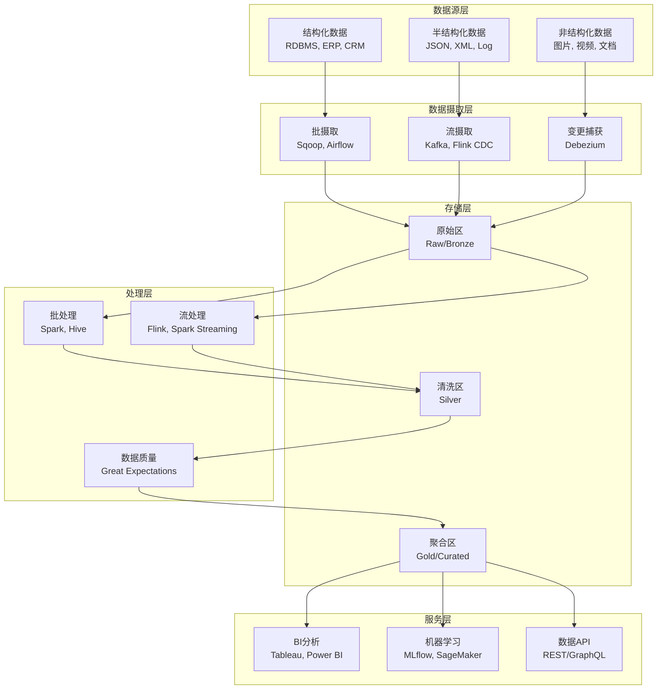

**各层职责说明：**

| 层级 | 核心职责 | 关键技术选型 | 数据格式 | SLA要求 |
|------|----------|--------------|----------|---------|
| 数据源层 | 接入各种业务系统数据 | JDBC/ODBC连接器、API适配器 | 各种原始格式 | N/A |
| 数据摄取层 | 将数据从源系统导入数据湖 | Kafka Connect、Debezium、Flink CDC | Avro、Protobuf | 批: <4h; 流: <1min |
| 存储层 | 按数据成熟度分区存储 | S3、ADLS、HDFS + Iceberg/Hudi/Delta | Parquet、ORC | 持久性99.999999999% |
| 处理层 | 清洗、转换、聚合数据 | Spark、Flink、dbt | 中间格式(Parquet) | 批: <2h; 流: <1min |
| 服务层 | 向下游应用提供数据服务 | Trino、StarRocks、数据API | 查询结果、模型 | 交互查询<30s |

#### 2.2 数据分区策略：Bronze-Silver-Gold 模型

Databricks 在2021年提出的 Medallion 架构（奖章架构）已成为数据湖分区的事实标准。它将数据按质量等级分为三层：

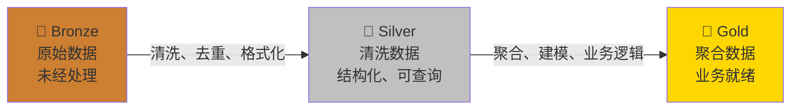

**Bronze层（原始区）**

- **数据特征**：完全保留源系统原始格式，不做任何修改
- **存储内容**：原始日志文件、CDC变更流、API原始响应、非结构化文件
- **关键要求**：保留完整数据血缘，支持时间旅行（Time Travel），可回溯到任意历史状态
- **保留策略**：至少保留90天原始数据，支持任意时间点的数据回溯
- **典型实现**：

```python
# Bronze层写入示例 - 使用Delta Lake
from pyspark.sql import SparkSession

spark = SparkSession.builder \
    .appName("Bronze_Ingestion") \
    .config("spark.sql.shuffle.partitions", "200") \
    .getOrCreate()

# 读取原始JSON数据
bronze_df = spark.read \
    .format("json") \
    .option("inferSchema", "true") \
    .load("/mnt/raw/events/2024/01/")

# 写入Bronze层 - 关键配置说明：
# - mode("append"): 增量追加，不覆盖已有数据
# - mergeSchema: 允许schema自动演化（新字段自动添加）
# - partitionBy: 按日期和事件类型分区，提升查询效率
bronze_df.write \
    .format("delta") \
    .mode("append") \
    .option("mergeSchema", "true") \
    .partitionBy("event_date", "event_type") \
    .save("/mnt/bronze/events")
```

**Silver层（清洗区）**

- **数据特征**：经过清洗、去重、格式标准化的结构化数据
- **处理操作**：数据类型转换、空值处理、重复记录消除、schema enforcement、数据脱敏
- **关键要求**：支持ACID事务，数据质量可度量，支持upsert操作
- **保留策略**：永久保留，作为数据湖的核心资产
- **典型实现**：

```python
# Silver层处理示例
from pyspark.sql import functions as F
from pyspark.sql.window import Window

# 读取Bronze层数据
bronze_events = spark.read.format("delta").load("/mnt/bronze/events")

# 定义数据清洗管道
silver_events = bronze_events \
    .filter(F.col("event_id").isNotNull()) \
    .withColumn("event_timestamp", 
                F.to_timestamp("event_timestamp", "yyyy-MM-dd'T'HH:mm:ss")) \
    .withColumn("user_id", F.lower(F.trim("user_id"))) \
    .dropDuplicates(["event_id"]) \
    .withColumn("processed_at", F.current_timestamp()) \
    .withColumn("data_quality_score", 
                F.when(F.col("user_id").isNotNull(), 1.0)
                 .otherwise(0.5))

# 数据质量统计
quality_stats = silver_events.groupBy("event_type").agg(
    F.count("*").alias("total_records"),
    F.count("user_id").alias("valid_user_ids"),
    F.countDistinct("event_id").alias("unique_events")
)

# 写入Silver层（使用merge实现upsert）
silver_events.write \
    .format("delta") \
    .mode("overwrite") \
    .partitionBy("event_date") \
    .save("/mnt/silver/events")
```

**Gold层（聚合区）**

- **数据特征**：面向业务主题的高度聚合数据，可直接用于BI报表和数据分析
- **处理操作**：维度建模、指标计算、业务规则应用、数据立方体预计算
- **关键要求**：高性能查询，支持实时更新，SLA保障，数据可直接用于生产决策
- **保留策略**：根据业务需求，通常保留3-5年
- **典型实现**：

```python
# Gold层聚合示例 - 用户行为分析宽表
gold_user_daily = silver_events \
    .groupBy("user_id", "event_date") \
    .agg(
        F.count("*").alias("total_events"),
        F.countDistinct("event_type").alias("unique_event_types"),
        F.sum(F.when(F.col("event_type") == "purchase", F.col("amount")).otherwise(0)).alias("daily_revenue"),
        F.avg("session_duration").alias("avg_session_duration"),
        F.collect_set("device_type").alias("devices_used")
    ) \
    .withColumn("is_active", F.col("total_events") > 0) \
    .withColumn("is_purchaser", F.col("daily_revenue") > 0)

# 使用merge实现增量更新
from delta.tables import DeltaTable

if DeltaTable.isDeltaTable(spark, "/mnt/gold/user_daily_metrics"):
    delta_table = DeltaTable.forPath(spark, "/mnt/gold/user_daily_metrics")
    delta_table.alias("target").merge(
        gold_user_daily.alias("source"),
        "target.user_id = source.user_id AND target.event_date = source.event_date"
    ).whenMatchedUpdateAll() \
     .whenNotMatchedInsertAll() \
     .execute()
else:
    gold_user_daily.write \
        .format("delta") \
        .mode("overwrite") \
        .save("/mnt/gold/user_daily_metrics")
```

**各层数据治理对比：**

| 治理维度 | Bronze层 | Silver层 | Gold层 |
|----------|----------|----------|--------|
| Schema管理 | 无约束，schema-on-read | Schema enforcement + evolution | Schema enforcement，严格类型 |
| 数据质量 | 不校验 | 基础校验（非空、唯一性） | 完整校验（业务规则、一致性） |
| 访问控制 | 仅数据工程师 | 数据工程师 + 数据分析师 | 所有角色（含业务用户） |
| 数据血缘 | 记录源系统信息 | 记录清洗逻辑 | 记录聚合规则和业务逻辑 |
| 版本控制 | 快照保留90天 | 永久快照 | 永久快照 + 变更日志 |

#### 2.3 存储架构设计

数据湖的存储架构直接决定了系统的成本、性能和可扩展性。现代数据湖存储架构的设计需要考虑以下关键维度：

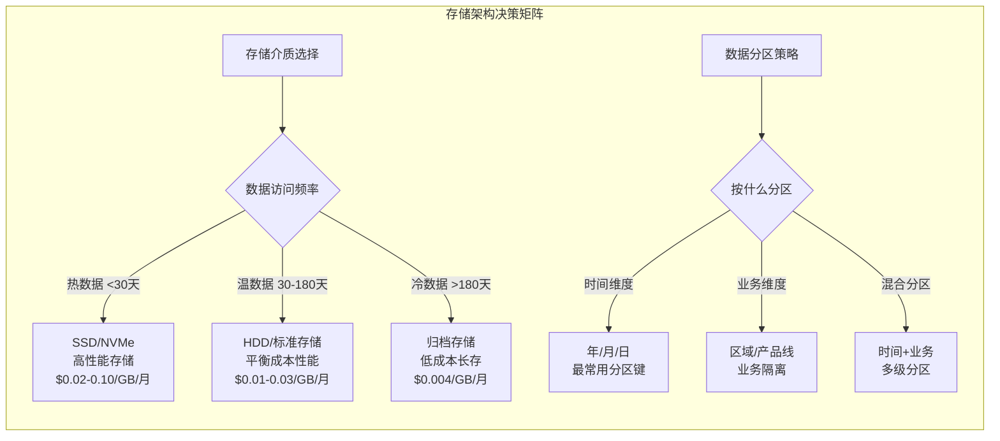

**存储格式对比：**

| 特性 | Parquet | ORC | Avro | JSON | CSV |
|------|---------|-----|------|------|-----|
| 列式存储 | ✅ | ✅ | ❌ | ❌ | ❌ |
| 压缩率 | 高（zstd压缩比10:1+） | 高（zlib压缩比8:1+） | 中（5:1） | 低（2:1） | 低（1.5:1） |
| Schema演化 | 支持（添加列安全） | 有限（需要重写） | 支持（向前向后兼容） | 灵活（无固定schema） | 不支持 |
| 查询性能 | 优（列裁剪+谓词下推） | 优（索引+布隆过滤器） | 中（需全量反序列化） | 差（逐行解析） | 差（逐行解析） |
| 适用场景 | OLAP分析、数据湖核心格式 | Hive分析、Hadoop生态 | 流数据传输、Kafka | API数据交换、配置 | 简单导入、Excel兼容 |
| 文件大小控制 | 行组分块（默认128MB） | 条带分块（默认250MB） | 块分块 | 不适用 | 不适用 |
| 列统计信息 | Min/Max/Count | Min/Max/Sum/Count | 无 | 无 | 无 |

**最佳实践：**

1. **统一使用列式格式**：生产环境推荐 Parquet（Spark生态兼容性最好）或 ORC（Hive生态优化更好）
2. **合理设置文件大小**：单个文件建议 128MB-1GB，过小导致小文件问题（Hive Metastore压力大、NameNode内存溢出），过大导致并行度不足（无法充分利用集群资源）
3. **压缩算法选择**：Zstandard（zstd）在压缩率和解压速度之间取得最佳平衡，Snappy次之（解压速度更快但压缩率较低），gzip适用于归档场景（压缩率最高但CPU开销大）
4. **分区键设计**：分区数控制在 10,000 以内，避免过度分区导致的小文件爆炸（每个分区至少一个文件）。对于Iceberg，推荐使用隐藏分区（Hidden Partitioning），避免分区键暴露在查询中
5. **小文件治理**：定期执行compaction操作，将小文件合并为大文件。Delta Lake使用`OPTIMIZE`命令，Iceberg使用`rewrite_data_files`操作

**云存储成本对比（以AWS S3为例）：**

| 存储类型 | 月成本($/GB) | 适用场景 | 数据检索延迟 |
|----------|-------------|----------|-------------|
| S3 Standard | $0.023 | 频繁访问的热数据 | 毫秒级 |
| S3 Intelligent-Tiering | $0.023-$0.0025 | 访问模式不确定的数据 | 毫秒级 |
| S3 Standard-IA | $0.0125 | 不频繁访问（月均1-2次） | 毫秒级 |
| S3 One Zone-IA | $0.01 | 可重建的非关键数据 | 毫秒级 |
| S3 Glacier Instant | $0.004 | 少量检索的归档数据 | 毫秒级 |
| S3 Glacier Deep Archive | $0.00099 | 长期归档（年均检索<2次） | 12-48小时 |

#### 2.4 表格式（Table Format）选型

表格式是数据湖架构中最关键的技术选型之一，它决定了数据的ACID事务支持、schema演化、时间旅行等核心能力。目前三大主流开源表格式的对比如下：

| 特性 | Delta Lake | Apache Iceberg | Apache Hudi |
|------|-----------|----------------|-------------|
| 发起方 | Databricks | Netflix → Apache | Uber → Apache |
| 事务机制 | WAL + 天际线协议（Optimistic Concurrency） | 快照隔离 + MVCC（多版本并发控制） | 写时复制 + 日志合并（Copy-on-Write / Merge-on-Read） |
| Schema演化 | 支持（添加列、重命名列） | 支持（完整：添加/删除/重命名/提升类型） | 支持（有限：添加列、重命名列） |
| 分区演化 | 不支持（需要重写数据） | 支持（隐藏分区，无需重写数据） | 支持（同步分区，需要重写元数据） |
| 时间旅行 | 支持（基于版本号或时间戳） | 支持（基于快照ID或时间戳） | 支持（基于提交时间） |
| 小文件治理 | OPTIMIZE + Z-ORDER | rewrite_data_files + sort_order | compaction（自动调度） |
| Spark集成 | 原生支持（Databricks） | 原生支持 | 原生支持 |
| Flink集成 | 社区支持（Delta-Flink） | 社区支持（Iceberg-Flink） | 原生支持（最优） |
| Trino/StarRocks | 支持 | 支持 | 有限支持 |
| 云存储优化 | 优秀 | 优秀 | 良好 |
| 社区活跃度 | 高（Databricks主导） | 高（Apache顶级项目） | 高（Apache顶级项目） |
| 适用场景 | Spark为主的分析 | 跨引擎统一数据湖 | CDC实时入湖、增量处理 |

**选型建议：**

- **以Spark为核心**：选择Delta Lake，Databricks生态支持最完善，与Unity Catalog深度集成
- **多引擎混合**：选择Iceberg，跨引擎兼容性最好（Trino、Spark、Flink、StarRocks、Dremio均原生支持），是目前社区增长最快的表格式
- **CDC实时入湖**：选择Hudi，对Flink CDC的支持最成熟，内置增量查询能力（Incremental Query）
- **云平台选型**：AWS Athena/Iceberg、GCP BigLake/Iceberg、Azure Synapse/Delta Lake 各有原生支持

### 3. 数据摄取架构

#### 3.1 批量摄取

批量摄取适用于不需要实时性的数据迁移和定期同步场景，通常通过调度工具（Airflow、DolphinScheduler）定时触发。

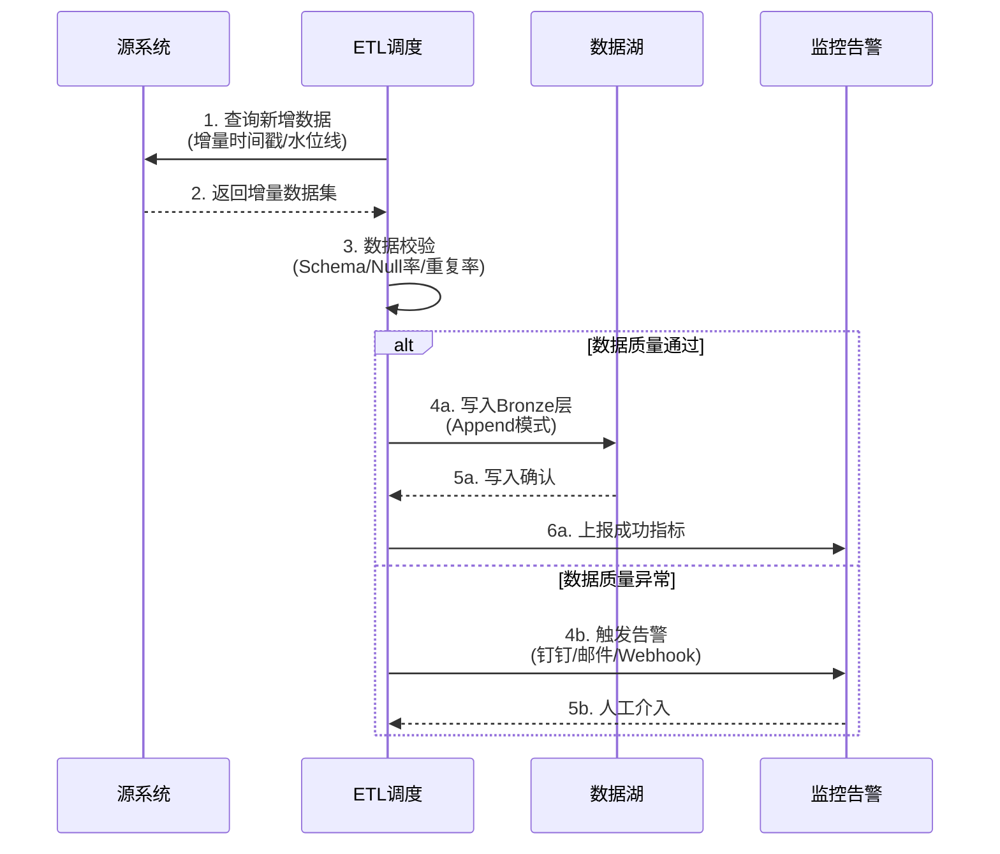

**关键技术点：**

- **增量识别策略**：使用自增ID、修改时间戳（updated_at）、binlog位点或WAL offset。时间戳方式实现简单但可能遗漏并发修改，binlog方式完整但需要DBA权限
- **断点续传**：将最后一次成功处理的位点持久化到外部存储（如Redis、数据库），故障恢复后从断点继续，避免重复处理
- **幂等写入**：确保重复执行不会产生重复数据，使用Upsert（MERGE INTO）而非纯Append。对于Delta Lake/Iceberg/Hudi，支持`INSERT OVERWRITE`或`MERGE INTO`操作
- **数据校验**：在写入前进行基础校验（Schema匹配、空值率<5%、记录数>0），异常时拒绝写入并告警
- **小文件治理**：批量写入时控制文件数量，目标文件大小128MB-1GB，避免产生过多小文件

**Airflow批量摄取DAG示例：**

```python
from airflow import DAG
from airflow.providers.apache.spark.operators.spark_submit import SparkSubmitOperator
from airflow.operators.python import PythonOperator
from airflow.utils.dates import days_ago
from datetime import timedelta

default_args = {
    'owner': 'data_team',
    'retries': 3,
    'retry_delay': timedelta(minutes=5),
    'email_on_failure': True,
    'email': ['data-alert@company.com'],
}

with DAG(
    dag_id='daily_orders_ingestion',
    default_args=default_args,
    schedule_interval='0 2 * * *',  # 每天凌晨2点
    start_date=days_ago(1),
    catchup=False,
    tags=['bronze', 'ingestion', 'daily'],
) as dag:

    ingest_orders = SparkSubmitOperator(
        task_id='ingest_orders_to_bronze',
        application='s3a://scripts/ingest_orders.py',
        conn_id='spark_default',
        conf={
            'spark.sql.shuffle.partitions': '100',
            'spark.sql.sources.partitionOverwriteMode': 'dynamic',
        },
        application_args=[
            '--source-table', 'production.orders',
            '--target-path', 's3a://data-lake/bronze/orders',
            '--incremental-column', 'updated_at',
        ],
    )
```

#### 3.2 流式摄取

流式摄取是现代数据湖的核心能力，允许数据在产生后秒级到达数据湖。

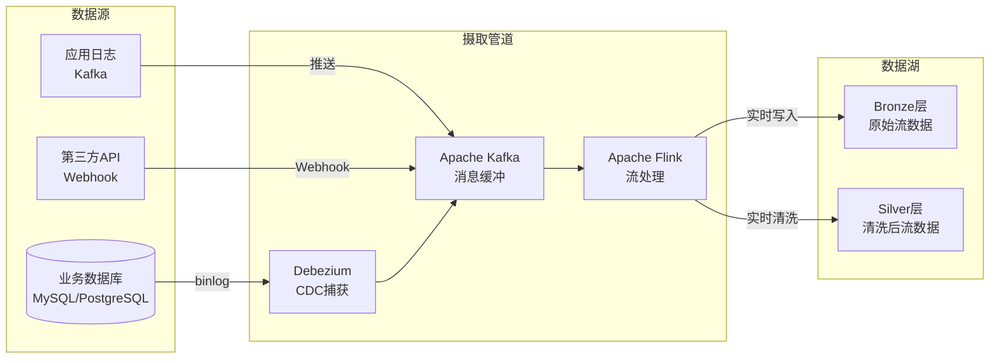

**Flink CDC 实时入湖示例：**

```java
// Flink CDC 3.0 + Iceberg 实时入湖
public class CdcToIceberg {
    public static void main(String[] args) throws Exception {
        StreamExecutionEnvironment env = 
            StreamExecutionEnvironment.getExecutionEnvironment();
        
        // 开启checkpoint，每30秒一次，确保Exactly-Once语义
        env.enableCheckpointing(30000);
        env.getCheckpointConfig().setCheckpointingMode(
            CheckpointingMode.EXACTLY_ONCE);
        env.getCheckpointConfig().setCheckpointTimeout(60000);
        env.getCheckpointConfig().setMinPauseBetweenCheckpoints(15000);
        env.getCheckpointConfig().setTolerableCheckpointFailureNumber(3);
        
        // MySQL CDC Source
        MySqlSource<String> mySqlSource = MySqlSource.<String>builder()
            .hostname("localhost")
            .port(3306)
            .databaseList("ecommerce")
            .tableList("ecommerce.orders")
            .username("reader")
            .password("xxx")
            .deserializer(new JsonDebeziumDeserializationSchema())
            .startupOptions(StartupOptions.initial())
            .build();
        
        // 读取CDC流
        DataStream<String> cdcStream = env
            .fromSource(mySqlSource, 
                       WatermarkStrategy
                           .forBoundedOutOfOrderness(Duration.ofSeconds(5))
                           .withIdleness(Duration.ofMinutes(1)),
                       "MySQL CDC Source");
        
        // 解析JSON并写入Iceberg
        cdcStream
            .map(json -> parseOrder(json))
            .sinkTo(IcebergSink.<Order>builder()
                .setCatalog("hive_catalog")
                .setTableIdentifier("ecommerce.orders_iceberg")
                .setSnapshotProperties(Map.of(
                    "cdc_source", "mysql",
                    "processing_time", Instant.now().toString()
                ))
                .setIo(new FileIOImpl())
                .build());
        
        env.execute("MySQL CDC to Iceberg");
    }
}
```

**流式摄取关键配置：**

| 配置项 | 推荐值 | 说明 |
|--------|--------|------|
| Checkpoint间隔 | 30秒-5分钟 | 越短故障恢复越快，但checkpoint开销越大 |
| Checkpoint超时 | 60-120秒 | 避免长时间running的checkpoint被取消 |
| 最小checkpoint间隔 | 15-30秒 | 避免checkpoint堆积 |
| 容忍失败次数 | 2-3次 | 避免偶发故障导致任务重启 |
| Watermark延迟 | 5-30秒 | 平衡延迟和乱序容忍度 |

#### 3.3 CDC（变更数据捕获）技术详解

CDC是连接OLTP数据库与数据湖的关键桥梁，其核心技术原理如下：

| CDC方式 | 原理 | 优点 | 缺点 | 适用场景 |
|---------|------|------|------|----------|
| 基于时间戳 | 查询updated_at > 上次时间 | 实现简单，无侵入 | 无法捕获删除、可能遗漏并发修改、需要额外索引 | 低并发、无删除、可接受少量丢失 |
| 基于触发器 | 在数据库创建INSERT/UPDATE/DELETE触发器 | 数据完整，可捕获所有变更 | 性能开销大（每次写操作+1次触发器执行）、侵入性强、维护复杂 | 无法使用其他方式时的兜底方案 |
| 基于binlog | 读取MySQL binlog（ROW格式） | 低延迟（秒级）、数据完整、非侵入 | 需要DBA权限、binlog格式必须为ROW | 核心业务数据同步 |
| 基于logminer | Oracle LogMiner读取redo log | 非侵入、数据完整 | 仅支持Oracle、性能一般 | Oracle数据同步 |
| 基于WAL | PostgreSQL WAL（Write-Ahead Log） | 标准协议、数据完整 | 需要复制槽、可能造成WAL堆积 | PostgreSQL同步 |
| Debezium | 开源CDC框架，统一接口 | 支持多种数据库、社区活跃、schema演化 | 需要部署Kafka Connect、运维复杂度高 | 多数据库统一CDC平台 |
| Flink CDC | Flink原生CDC Source | 流处理原生集成、Exactly-Once | 依赖Flink生态 | Flink流处理管道 |

**Debezium + Kafka Connect 架构：**

```json
{
  "name": "mysql-cdc-connector",
  "config": {
    "connector.class": "io.debezium.connector.mysql.MySqlConnector",
    "database.hostname": "mysql-primary",
    "database.port": "3306",
    "database.user": "debezium",
    "database.password": "secret",
    "database.server.id": "1",
    "database.server.name": "production",
    "database.include.list": "ecommerce",
    "table.include.list": "ecommerce.orders,ecommerce.users",
    "database.history.kafka.bootstrap.servers": "kafka:9092",
    "database.history.kafka.topic": "schema-changes.ecommerce",
    "transforms": "route",
    "transforms.route.type": "org.apache.kafka.connect.transforms.RegexRouter",
    "transforms.route.regex": "([^.]+)\\.([^.]+)\\.([^.]+)",
    "transforms.route.replacement": "bronze.$3",
    "snapshot.mode": "initial",
    "snapshot.locking.mode": "none",
    "heartbeat.interval.ms": "10000"
  }
}
```

### 4. 元数据管理与数据治理

#### 4.1 元数据管理体系

元数据管理是数据湖从"数据沼泽"进化为"数据资产"的关键环节。没有完善的元数据管理，数据湖将退化为一个无人能理解、无法使用的数据垃圾场。

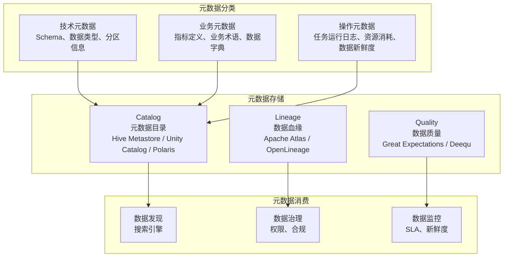

**关键技术组件：**

- **Hive Metastore**：经典元数据目录，存储表schema、分区信息、存储位置等。几乎所有大数据引擎（Spark、Trino、Hive）都支持Hive Metastore作为元数据源
- **Apache Unity Catalog**：Databricks开源的统一治理方案，支持跨引擎的权限管理和审计。特点是基于开放标准，不绑定特定计算引擎
- **Apache Polaris**：Iceberg原生的Catalog实现，支持多租户、RBAC权限、快照管理。是Snowflake贡献给Apache社区的项目
- **Apache Atlas**：Hadoop生态的数据治理框架，提供血缘追踪和分类标签。支持自动化的数据分类和敏感数据发现
- **OpenLineage**：数据管道血缘的开放标准，支持Airflow、Spark、Flink等。通过标准化的事件格式实现跨工具的血缘集成

**Catalog选型对比：**

| Catalog | 表格式支持 | 权限管理 | 多引擎 | 部署方式 | 适用场景 |
|---------|-----------|----------|--------|----------|----------|
| Hive Metastore | 所有 | 有限 | 所有 | 自建 | 传统Hadoop生态 |
| Unity Catalog | Delta Lake为主 | 完善（RBAC+ABAC） | Spark/Trino | Databricks托管 | Databricks生态 |
| Polaris | Iceberg | 完善（RBAC） | Spark/Trino/Flink | 自建/托管 | Iceberg生态 |
| AWS Glue Catalog | 所有 | IAM集成 | 所有 | AWS托管 | AWS云上数据湖 |
| Snowflake Horizon | Snowflake格式 | 完善 | Snowflake | Snowflake托管 | Snowflake生态 |

#### 4.2 数据质量保障

数据质量是数据湖价值的基础。数据质量管理应覆盖数据的完整生命周期：

| 质量维度 | 检查方法 | 自动化工具 | 典型规则示例 |
|----------|----------|------------|--------------|
| 完整性 | 空值率检查、记录数校验 | Great Expectations | user_id不能为NULL |
| 准确性 | 范围检查、格式校验 | Apache Deequ | age在0-150之间 |
| 一致性 | 跨表/跨源一致性校验 | dbt tests | 订单金额=Σ明细金额 |
| 及时性 | 数据新鲜度监控 | 自定义SLA监控 | T+1数据必须在6:00前就绪 |
| 唯一性 | 主键重复检查 | Great Expectations | event_id全局唯一 |
| 有效性 | 业务规则验证 | 自定义规则引擎 | 状态必须在枚举值范围内 |

**Great Expectations 质量检查示例：**

```python
import great_expectations as gx
from great_expectations.core import ExpectationConfiguration

context = gx.get_context()

# 定义数据质量期望
orders_expectations = context.add_expectation_suite("orders_quality_suite")

# 非空检查
orders_expectations.add_expectation(
    ExpectationConfiguration(
        expectation_type="expect_column_values_to_not_be_null",
        kwargs={"column": "order_id"}
    )
)

# 唯一性检查
orders_expectations.add_expectation(
    ExpectationConfiguration(
        expectation_type="expect_column_values_to_be_unique",
        kwargs={"column": "order_id"}
    )
)

# 范围检查
orders_expectations.add_expectation(
    ExpectationConfiguration(
        expectation_type="expect_column_values_to_be_between",
        kwargs={
            "column": "order_amount",
            "min_value": 0.01,
            "max_value": 1000000
        }
    )
)

# 记录数检查（确保数据不为空）
orders_expectations.add_expectation(
    ExpectationConfiguration(
        expectation_type="expect_table_row_count_to_be_between",
        kwargs={"min_value": 1, "max_value": None}
    )
)

# 日期范围检查（不允许未来日期）
orders_expectations.add_expectation(
    ExpectationConfiguration(
        expectation_type="expect_column_values_to_be_unique",
        kwargs={"column": "order_date", "mostly": 0.99}
    )
)
```

#### 4.3 数据安全与合规

数据湖的安全架构必须覆盖数据的全生命周期，包括存储、传输、访问和使用四个环节：

**安全架构分层：**

| 安全层级 | 技术手段 | 工具/产品 | 适用场景 |
|----------|----------|-----------|----------|
| 网络安全 | VPC隔离、私有端点、SSL/TLS | 云厂商安全组 | 数据传输加密 |
| 身份认证 | SSO、MFA、服务账号 | LDAP/AD、Okta、云IAM | 用户/服务身份验证 |
| 访问控制 | RBAC、ABAC、列级权限 | Apache Ranger、Unity Catalog | 细粒度权限管理 |
| 数据加密 | 静态加密、传输加密、信封加密 | AWS KMS、Azure KeyVault | 敏感数据保护 |
| 数据脱敏 | 动态脱敏、静态脱敏、差分隐私 | 自定义脱敏规则 | 敏感数据展示 |
| 审计日志 | 操作日志、访问日志、数据血缘 | Atlas、CloudTrail | 合规审计、安全溯源 |

**Apache Ranger权限配置示例：**

```json
{
  "service": "hive",
  "policyType": "hive",
  "policyItems": [
    {
      "accesses": [
        {"type": "select", "allowed": true},
        {"type": "update", "allowed": true}
      ],
      "users": ["data_analyst", "bi_engineer"],
      "groups": ["analytics_team"],
      "delegateAdmin": false
    }
  ],
  "dataPolicyItems": [
    {
      "dataMaskInfo": {
        "dataMaskType": "MASK_HASH",
        "columns": ["phone", "id_card"]
      },
      "users": ["data_analyst"]
    }
  ]
}
```

**GDPR/CCPA合规要点：**

- **数据主体权利**：支持数据主体的访问权、删除权（被遗忘权）、数据可携带权
- **数据最小化**：仅采集业务所需的最小数据集，定期清理过期数据
- **同意管理**：记录用户数据处理的同意状态，支持按需删除
- **跨境传输**：敏感数据跨区域存储时需要加密和访问控制
- **审计追溯**：完整的数据访问日志，支持监管机构的审计要求

### 5. 计算引擎选型

#### 5.1 批处理引擎对比

| 特性 | Apache Spark | Apache Hive | Presto/Trino | StarRocks |
|------|-------------|-------------|--------------|-----------|
| 执行模式 | MPP + 内存 | MapReduce/Tez | MPP | MPP + 向量化 |
| 延迟范围 | 秒-小时 | 分钟-小时 | 秒-分钟 | 毫秒-秒 |
| 交互式查询 | 一般（需要预热） | 差 | 优 | 优 |
| UDF支持 | 丰富（Scala/Java/Python） | 中等 | 中等 | 丰富（Python/Java） |
| 资源管理 | YARN/K8s | YARN | 独立 | 独立/K8s |
| 云原生 | 较好 | 一般 | 好 | 好 |
| 数据湖集成 | 最好 | 良好 | 好 | 好 |
| 适用场景 | 大规模ETL、ML特征工程 | 历史数据处理、Hive表查询 | Ad-hoc查询、联邦查询 | 实时分析、高并发OLAP |

**选型决策树：**

- **大规模ETL批处理** → Spark（内存计算，性能最优）
- **交互式Ad-hoc查询** → Trino（联邦查询，支持多种数据源）
- **实时OLAP分析** → StarRocks（向量化引擎，毫秒级延迟）
- **历史数据批量分析** → Hive（成熟稳定，Hadoop生态兼容）
- **机器学习特征工程** → Spark（与MLlib/MLflow集成最好）

#### 5.2 流处理引擎对比

| 特性 | Apache Flink | Spark Streaming | Kafka Streams | Apache Storm |
|------|-------------|-----------------|---------------|--------------|
| 处理模型 | 真正流处理（事件驱动） | 微批处理（Micro-batch） | 真正流处理 | 真正流处理 |
| 延迟 | 毫秒级 | 秒级 | 毫秒级 | 毫秒级 |
| Exactly-Once | ✅（基于分布式快照） | ✅（基于WAL） | ✅（基于事务） | ❌（仅At-Least-Once） |
| 状态管理 | 内置（RocksDB状态后端） | 有限（checkpoint） | 内置（RocksDB） | 需要外部存储 |
| 窗口支持 | 丰富（滚动/滑动/会话/CIP） | 有限（滚动/滑动） | 丰富（滚动/滑动/会话） | 基础（滚动/滑动） |
| SQL支持 | Flink SQL（ANSI标准） | Spark SQL | ❌ | ❌ |
| 复杂事件处理 | CEP库（模式匹配） | ❌ | ❌ | ❌ |
| 背压处理 | 原生支持（反压传播） | 基于速率限制 | 原生支持 | 需要手动配置 |
| 适用场景 | 实时ETL/流批一体/CEP | 批流统一/已有Spark生态 | 轻量级流处理/Kafka应用 | 简单流处理/遗留系统 |

**选型建议：**

- **实时数据湖核心** → Flink（流批一体，与Iceberg/Hudi深度集成）
- **已有Spark生态** → Spark Structured Streaming（降低学习成本）
- **Kafka数据处理** → Kafka Streams（轻量级，无需独立集群）
- **遗留系统兼容** → Storm（逐步迁移到Flink）

### 6. 实际应用场景

#### 6.1 电商实时数仓

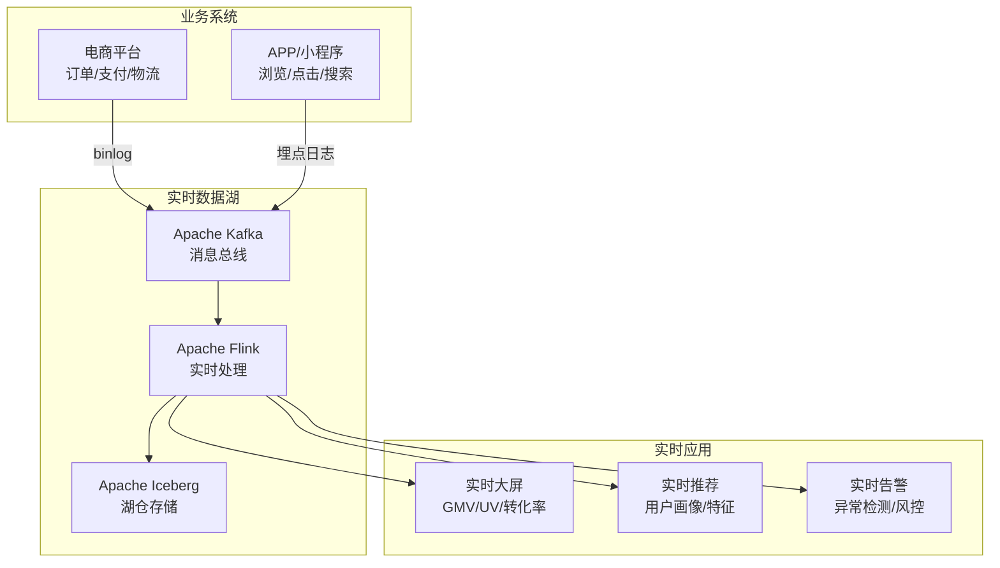

**核心指标实时计算（Flink SQL）：**

```sql
-- 实时GMV计算（5分钟滚动窗口）
SELECT 
    TUMBLE_START(event_time, INTERVAL '5' MINUTE) AS window_start,
    TUMBLE_END(event_time, INTERVAL '5' MINUTE) AS window_end,
    COUNT(DISTINCT user_id) AS uv,
    COUNT(*) AS order_count,
    SUM(order_amount) AS gmv,
    SUM(CASE WHEN order_status = 'paid' THEN order_amount ELSE 0 END) AS paid_gmv,
    SUM(CASE WHEN order_status = 'paid' THEN 1 ELSE 0 END) * 1.0 / COUNT(*) AS pay_rate
FROM orders
WHERE event_time >= CURRENT_TIMESTAMP - INTERVAL '1' HOUR
GROUP BY TUMBLE(event_time, INTERVAL '5' MINUTE);
```

**实时漏斗分析（Flink SQL）：**

```sql
-- 电商转化漏斗：浏览→加购→下单→支付
SELECT 
    user_id,
    MIN(CASE WHEN event_type = 'page_view' THEN event_time END) AS view_time,
    MIN(CASE WHEN event_type = 'add_to_cart' THEN event_time END) AS cart_time,
    MIN(CASE WHEN event_type = 'order_create' THEN event_time END) AS order_time,
    MIN(CASE WHEN event_type = 'payment' THEN event_time END) AS payment_time,
    CASE 
        WHEN MIN(CASE WHEN event_type = 'payment' THEN event_time END) IS NOT NULL THEN '支付完成'
        WHEN MIN(CASE WHEN event_type = 'order_create' THEN event_time END) IS NOT NULL THEN '下单未支付'
        WHEN MIN(CASE WHEN event_type = 'add_to_cart' THEN event_time END) IS NOT NULL THEN '加购未下单'
        ELSE '仅浏览'
    END AS funnel_stage
FROM user_events
WHERE event_time >= CURRENT_TIMESTAMP - INTERVAL '24' HOUR
GROUP BY user_id;
```

#### 6.2 金融风控数据湖

金融行业对数据湖的要求极为严格，主要体现在以下几个方面：

- **数据完整性**：金融交易数据不允许丢失，需要端到端的Exactly-Once语义
- **实时风控**：欺诈检测需要毫秒级响应，数据湖需要支持实时特征计算
- **合规审计**：数据血缘、访问日志、变更历史必须完整记录，满足监管要求
- **数据隔离**：不同业务线、不同客户等级的数据需要严格隔离

**典型架构设计：**

┌─────────────────────────────────────────────────────────┐
│                    金融数据湖架构                          │
├─────────────────────────────────────────────────────────┤
│  数据源: 交易系统 | 征信系统 | 外部数据 | 市场数据          │
├─────────────────────────────────────────────────────────┤
│  实时层: Kafka + Flink → 实时特征计算 → 风控引擎            │
│  批处理层: Spark → T+1风险模型训练 → 信用评分更新            │
├─────────────────────────────────────────────────────────┤
│  存储: Iceberg(交易数据) + Hive(历史归档) + Redis(热特征)  │
├─────────────────────────────────────────────────────────┤
│  治理: Atlas(血缘) + Ranger(权限) + Atlas(合规审计)       │
└─────────────────────────────────────────────────────────┘

**金融风控特征计算示例（Flink SQL）：**

```sql
-- 用户近1小时交易特征（用于实时风控）
SELECT 
    user_id,
    COUNT(*) AS tx_count_1h,
    SUM(tx_amount) AS tx_sum_1h,
    MAX(tx_amount) AS tx_max_1h,
    COUNT(DISTINCT merchant_id) AS merchant_count_1h,
    -- 同卡多商户检测（疑似盗刷）
    CASE WHEN COUNT(DISTINCT merchant_id) > 5 THEN 1 ELSE 0 END AS multi_merchant_flag,
    -- 大额交易检测
    CASE WHEN MAX(tx_amount) > 50000 THEN 1 ELSE 0 END AS large_amount_flag
FROM transactions
WHERE tx_time >= CURRENT_TIMESTAMP - INTERVAL '1' HOUR
GROUP BY user_id;
```

#### 6.3 物联网数据湖

IoT场景下数据湖面临的独特挑战：

- **数据量巨大**：每秒百万级传感器数据点
- **时间序列特征**：数据天然带有时间戳，需要高效的时间范围查询
- **数据降采样**：原始数据需要按不同粒度聚合（秒级→分钟级→小时级→天级）
- **设备管理**：百万级设备的元数据管理、固件版本追踪

```python
# IoT数据湖降采样示例
from pyspark.sql import functions as F

# 读取原始秒级数据
raw_readings = spark.read.format("delta").load("/mnt/silver/iot_readings")

# 分别聚合到不同粒度
minute_agg = raw_readings \
    .withWatermark("event_time", "10 minutes") \
    .groupBy(
        F.window("event_time", "1 minute"),
        "device_id",
        "metric_type"
    ) \
    .agg(
        F.avg("value").alias("avg_value"),
        F.max("value").alias("max_value"),
        F.min("value").alias("min_value"),
        F.count("*").alias("sample_count")
    )

hour_agg = raw_readings \
    .withWatermark("event_time", "2 hours") \
    .groupBy(
        F.window("event_time", "1 hour"),
        "device_id",
        "metric_type"
    ) \
    .agg(
        F.avg("value").alias("avg_value"),
        F.max("value").alias("max_value"),
        F.min("value").alias("min_value"),
        F.count("*").alias("sample_count")
    )

# 写入不同粒度的Gold层
minute_agg.write.format("delta").save("/mnt/gold/iot_by_minute")
hour_agg.write.format("delta").save("/mnt/gold/iot_by_hour")
```

### 7. 数据湖 vs 数据仓库 vs 湖仓一体

#### 7.1 三者本质区别

| 维度 | 数据仓库 | 数据湖 | 湖仓一体 |
|------|----------|--------|----------|
| 数据类型 | 仅结构化 | 全类型（结构化+半结构化+非结构化） | 全类型 |
| Schema | 写时模式（Write-time Schema） | 读时模式（Read-time Schema） | 双模式支持（Schema-on-Read + Enforcement） |
| 存储成本 | 高（冗余存储，每TB $10K-$50K/年） | 低（原始存储，每TB $20-$200/年） | 低（开放格式，每TB $20-$500/年） |
| 处理能力 | SQL分析为主 | 批/流/ML全支持 | SQL + 批/流 + ML |
| 数据质量 | 高（预定义Schema + ETL校验） | 低（原始数据，质量参差不齐） | 高（可选质量控制，Bronze/Silver/Gold分层） |
| 灵活性 | 低（Schema变更慢，需要DDL） | 高（随存随用，Schema-on-Read） | 高 + 结构化管控 |
| 性能 | 优（预聚合优化、物化视图） | 一般（取决于表格式和文件布局） | 优（向量化引擎 + 数据布局优化） |
| 事务支持 | 完整ACID | 无（通过表格式可实现） | 完整ACID（Delta/Iceberg/Hudi） |
| 时间旅行 | 有限 | 支持（通过表格式） | 完整支持 |
| 典型用户 | 分析师、BI工程师 | 数据工程师、数据科学家 | 全角色（分析师、工程师、科学家） |
| 代表产品 | Snowflake、Redshift、Teradata | S3 + Hive | Databricks、Snowflake、StarRocks |

#### 7.2 湖仓一体的技术实现

湖仓一体不是简单地把数据仓库和数据湖合并，而是通过表格式（Delta Lake/Iceberg/Hudi）在开放的廉价存储上实现数据仓库级别的ACID事务和查询性能。

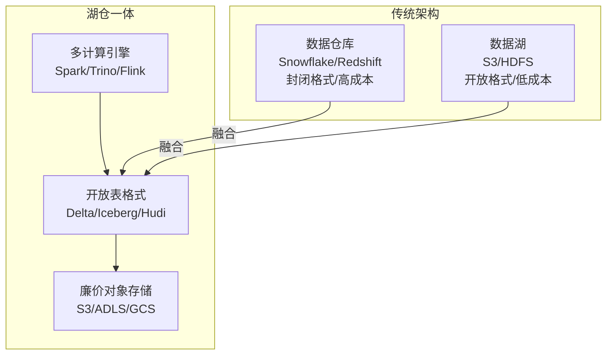

**湖仓一体的四大技术支柱：**

1. **ACID事务**：通过表格式的事务日志实现，确保并发读写的数据一致性。Delta Lake使用WAL + 天际线协议，Iceberg使用快照隔离 + MVCC，Hudi使用写时复制 + 日志合并
2. **Schema演化**：支持安全地添加、修改、删除列，不影响已有查询。Iceberg的schema演化能力最强，支持列类型提升（如int→long）
3. **时间旅行**：通过快照机制支持查询历史数据版本，实现数据回溯和审计。支持`AS OF TIMESTAMP`和`VERSION AS OF`语法
4. **数据治理**：通过Catalog实现统一的元数据管理、权限控制和血缘追踪。支持跨引擎的统一权限模型

### 8. 部署架构与云原生演进

#### 8.1 部署架构对比

| 架构 | 存储 | 计算 | 适用规模 | 月成本估算(1PB) | 运维复杂度 |
|------|------|------|----------|-----------------|------------|
| 自建Hadoop | HDFS(本地磁盘) | YARN(MR/Spark) | 100TB+ | $50K-100K（硬件+运维） | 高（需要专业运维团队） |
| 云上自建 | S3 + EMR | EMR集群 | 10TB-1PB | $30K-80K | 中（部分托管） |
| 纯云服务 | S3/GCS/ADLS | Snowflake/BigQuery | 1TB-1PB+ | $20K-200K（按量计费） | 低（全托管） |
| 湖仓一体 | S3 + Iceberg | Databricks/EMR | 10TB-1PB+ | $40K-150K | 中（需要理解表格式） |

#### 8.2 存算分离架构

现代数据湖架构的核心趋势是存算分离（Disaggregated Storage and Compute），其优势在于：

- **独立扩展**：存储容量和计算能力可以按需独立伸缩，避免资源浪费
- **成本优化**：存储使用廉价的对象存储，计算使用按需的弹性实例（Spot/Preemptible）
- **高可用**：存储层天然多副本（S3 99.999999999%持久性），计算层故障不影响数据
- **多租户**：不同计算引擎可以共享同一份数据存储，避免数据冗余

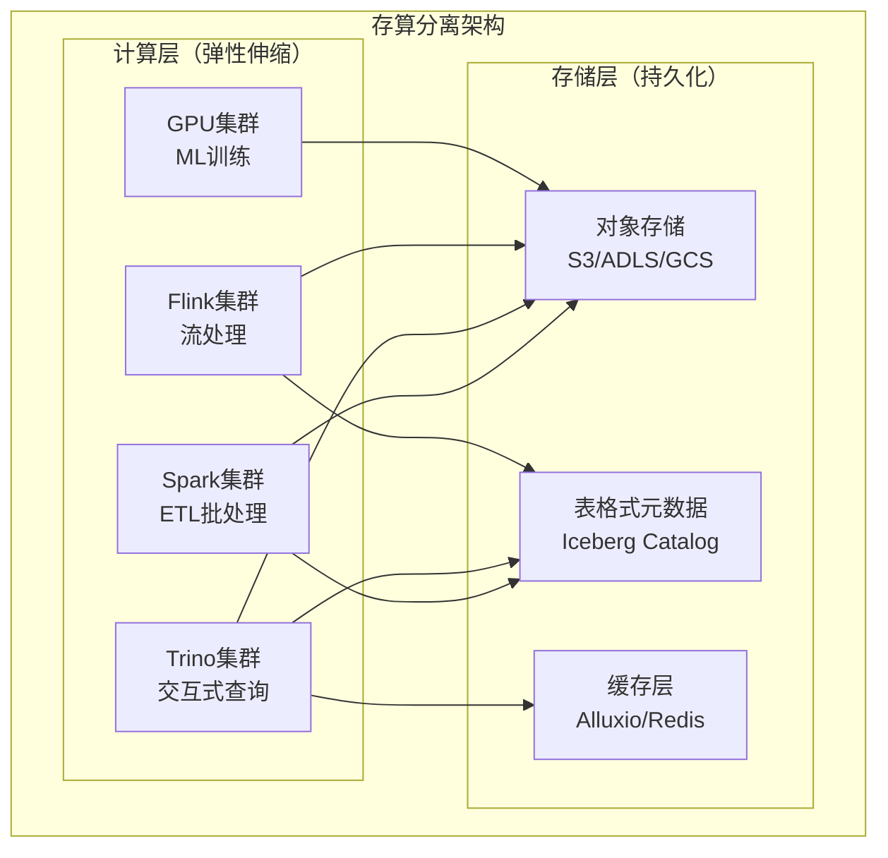

#### 8.3 云原生数据湖组件选型

**AWS数据湖组件栈：**

| 层级 | 组件 | 说明 |
|------|------|------|
| 存储 | S3 + S3 Tables | 对象存储 + 原生Iceberg支持 |
| 表格式 | Iceberg (AWS Glue) | 托管Catalog，支持Athena/EMR/Redshift |
| 批处理 | EMR Serverless | 无服务器Spark |
| 交互查询 | Athena | Serverless SQL查询 |
| 流处理 | Kinesis Data Streams + Managed Flink | 托管流处理 |
| 数据治理 | Lake Formation | 统一权限管理 |
| 缓存 | S3 Express One Zone | 高性能缓存层 |

**Azure数据湖组件栈：**

| 层级 | 组件 | 说明 |
|------|------|------|
| 存储 | ADLS Gen2 | 分层命名空间的Blob存储 |
| 表格式 | Delta Lake (Unity Catalog) | Databricks托管治理 |
| 批处理 | Synapse Spark | 托管Spark集群 |
| 交互查询 | Synapse Serverless SQL | Serverless SQL池 |
| 流处理 | Azure Stream Analytics + Event Hubs | 托管流处理 |
| 数据治理 | Purview | 数据治理和血缘 |

**GCP数据湖组件栈：**

| 层级 | 组件 | 说明 |
|------|------|------|
| 存储 | Cloud Storage | 对象存储 |
| 表格式 | BigLake + Iceberg | 跨格式统一访问 |
| 批处理 | Dataproc Serverless | 无服务器Spark |
| 交互查询 | BigQuery | Serverless SQL分析 |
| 流处理 | Dataflow (Apache Beam) | 流批一体 |
| 数据治理 | Dataplex | 统一数据治理 |

### 9. 数据湖监控与运维

#### 9.1 监控指标体系

数据湖的监控需要覆盖四个维度：

| 监控维度 | 关键指标 | 告警阈值 | 工具 |
|----------|----------|----------|------|
| 数据新鲜度 | 数据到达延迟、处理完成时间 | 批: >SLA 30分钟; 流: >5min | Airflow SLA、Flink Metrics |
| 数据质量 | 空值率、重复率、Schema匹配度 | 空值率>5%、重复率>1% | Great Expectations、Deequ |
| 资源使用 | CPU利用率、内存使用、磁盘IO | CPU>80%持续10min、内存>90% | Prometheus + Grafana |
| 查询性能 | 查询延迟、队列等待时间 | P99>30s、队列>5min | Trino/StarRocks Metrics |

**Prometheus监控配置示例：**

```yaml
# prometheus.yml
scrape_configs:
  - job_name: 'spark-history-server'
    static_configs:
      - targets: ['spark-history:18080']
    metrics_path: '/metrics/prometheus'
    
  - job_name: 'trino-coordinator'
    static_configs:
      - targets: ['trino:8080']
    metrics_path: '/metrics'
    
  - job_name: 'iceberg-metrics'
    static_configs:
      - targets: ['iceberg-metrics:8080']
```

#### 9.2 数据湖运维最佳实践

**小文件治理（Compaction）：**

```python
# Delta Lake compaction示例
spark.sql("""
    OPTIMIZE delta.`/mnt/silver/events`
    ZORDER BY (event_date, event_type)
""")

# Iceberg compaction示例
spark.sql("""
    CALL catalog.system.rewrite_data_files(
        table => 'db.events',
        strategy => 'sort',
        sort_order => 'event_date ASC, event_type ASC',
        options => map('max-file-size-bytes', '1073741824')
    )
""")
```

**数据过期清理（Vacuum）：**

```python
# Delta Lake vacuum - 删除未被引用的旧文件
spark.sql("""
    VACUUM delta.`/mnt/silver/events` RETAIN 168 HOURS
""")

# Iceberg - 删除过期快照
spark.sql("""
    CALL catalog.system.expire_snapshots(
        table => 'db.events',
        older_than => TIMESTAMP '2024-01-01 00:00:00',
        retain_last => 5
    )
""")
```

### 10. 数据湖迁移策略

#### 10.1 从数据仓库迁移到数据湖

迁移不是一蹴而就的，通常采用渐进式策略：

| 迁移阶段 | 策略 | 持续时间 | 风险 | 收益 |
|----------|------|----------|------|------|
| 评估阶段 | 盘点现有数据资产、查询模式、SLA | 2-4周 | 低 | 了解现状 |
| 试点阶段 | 选择1-2个非核心数据域试点 | 1-2月 | 中 | 验证架构 |
| 并行运行 | 数据湖与数据仓库并行，双写双读 | 2-3月 | 中 | 平稳过渡 |
| 迁移阶段 | 逐步将数据域迁移到数据湖 | 3-6月 | 高 | 全面迁移 |
| 退役阶段 | 下线旧数据仓库 | 1-2月 | 中 | 成本节约 |

#### 10.2 从Hadoop迁移到云数据湖

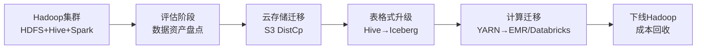

**Hive到Iceberg表迁移示例：**

```sql
-- 1. 创建Iceberg表
CREATE TABLE iceberg_db.events
USING iceberg
PARTITIONED BY (event_date)
AS SELECT * FROM hive_db.events;

-- 2. 设置Iceberg表属性
ALTER TABLE iceberg_db.events SET TBLPROPERTIES (
    'write.format.default' = 'parquet',
    'write.parquet.compression-codec' = 'zstd',
    'history.expire.max-snapshot-age-ms' = '604800000'
);
```

### 11. 常见误区与最佳实践

#### 11.1 数据湖常见陷阱

| 陷阱 | 表现 | 根因 | 解决方案 |
|------|------|------|----------|
| 数据沼泽 | 数据堆积无法使用，没人知道数据在哪里 | 缺乏元数据管理和数据治理 | 建立Catalog、数据字典、质量监控、数据市场 |
| 小文件爆炸 | 查询性能急剧下降，NameNode压力大 | 流式写入产生大量小文件 | 定期compaction、合理设置分区、控制写入频率 |
| 数据孤岛 | 各团队数据不互通，重复造轮子 | 缺乏统一的数据标准和共享机制 | 建立数据市场、统一数据模型、跨团队数据治理 |
| 过度设计 | 架构复杂难以维护，开发效率低 | 追求技术完美主义，照搬大厂架构 | 从简单架构起步，按需演进，YAGNI原则 |
| 权限混乱 | 数据安全无法保障，敏感数据泄露 | 缺乏统一的权限管理 | 实施列级权限、RBAC、审计日志、数据脱敏 |
| 成本失控 | 存储成本飙升，计算资源浪费 | 缺乏数据生命周期管理、无资源限制 | 实施冷热分层、数据归档、Spot实例、自动伸缩 |
| 缺乏监控 | 数据问题无法及时发现 | 没有建立监控告警体系 | 建立数据质量监控、SLA告警、资源使用监控 |
| Schema混乱 | 字段命名不一致、类型不统一 | 缺乏数据标准和命名规范 | 建立数据字典、强制Schema validation、代码审查 |

#### 11.2 数据湖建设最佳实践

**第一阶段：基础建设（0-3个月）**

1. 选择云存储平台（S3/ADLS/GCS）并规划存储分区
2. 部署表格式（推荐Iceberg，社区增长最快）
3. 搭建计算引擎（Spark + Trino，覆盖批处理和交互查询）
4. 建立元数据Catalog（Hive Metastore或Polaris）
5. 实现第一批核心数据入湖（选择1-2个数据域试点）
6. 建立基础监控（数据到达延迟、处理成功率）

**第二阶段：治理完善（3-6个月）**

1. 建立数据质量监控体系（Great Expectations或Deequ）
2. 实施数据血缘追踪（OpenLineage + Apache Atlas）
3. 定义数据标准和业务术语（数据字典、命名规范）
4. 建立数据访问权限模型（RBAC + 列级权限）
5. 实现数据生命周期管理（冷热分层、过期清理）
6. 建立数据质量SLA和告警机制

**第三阶段：能力增强（6-12个月）**

1. 引入流处理能力（Flink CDC + 实时入湖）
2. 建设数据市场（Data Marketplace，自助数据发现）
3. 集成ML平台（MLflow/SageMaker，特征工程自动化）
4. 实现跨组织数据共享（Iceberg REST Catalog）
5. 优化查询性能和成本（Z-ORDER索引、物化视图、缓存）
6. 建立数据产品思维（数据即产品，Owner负责制）

**第四阶段：智能化（12个月+）**

1. 引入数据编织（Data Fabric）能力
2. 实现自动化数据发现和推荐（AI驱动的数据目录）
3. 建设实时特征平台（Feature Store）
4. 实现数据产品的自助化服务（低代码数据管道）
5. 探索数据资产化运营（数据计费、价值评估）

#### 11.3 成本优化策略

| 优化维度 | 具体措施 | 预期节省 | 实施难度 |
|----------|----------|----------|----------|
| 存储分层 | 热/温/冷数据自动迁移（S3 Lifecycle） | 30-50%存储成本 | 低 |
| 文件优化 | 定期compaction合并小文件（OPTIMIZE） | 20-40%查询成本 | 中 |
| 压缩优化 | 使用zstd替代gzip（压缩率更高） | 10-20%存储+IO成本 | 低 |
| 查询优化 | 物化视图、分区裁剪、谓词下推 | 30-60%查询成本 | 中 |
| 计算优化 | Spot实例、预留实例、自动伸缩 | 40-70%计算成本 | 中 |
| 数据清理 | 定期删除无价值数据（VACUUM + Retention） | 视数据量而定 | 低 |
| 引擎选择 | 选择Serverless服务（按需计费） | 20-40%计算成本 | 低 |

### 12. 未来趋势

数据湖架构正在朝着以下方向演进：

**1. 数据网格（Data Mesh）**

去中心化的数据架构范式，将数据视为产品，由各业务领域团队负责自己的数据产品。核心原则：
- **领域所有权**：每个业务团队负责自己的数据产品
- **数据即产品**：数据具有产品属性（可发现、可理解、可信赖）
- **自助平台**：提供标准化的数据平台能力
- **联邦治理**：统一的数据标准和互操作性

**2. 数据编织（Data Fabric）**

通过AI/ML技术自动发现、集成和治理数据，实现跨异构数据源的统一数据访问层。核心能力：
- **自动数据发现**：AI驱动的数据目录，自动识别和分类数据
- **智能数据集成**：根据查询模式自动优化数据布局
- **主动数据治理**：实时监控数据质量、合规性和安全性
- **知识图谱**：构建数据关系图谱，支持语义查询

**3. 实时化（Real-time Everything）**

从批处理为主转向流处理为主，实现数据的秒级可用。关键趋势：
- **流批一体**：Flink等引擎统一处理批和流
- **实时OLAP**：StarRocks/Doris等引擎实现毫秒级查询
- **实时特征**：Feature Store支持实时特征计算和在线服务
- **实时指标**：业务指标从T+1变为实时计算

**4. AI/ML原生集成**

数据湖与机器学习平台深度集成，支持特征工程、模型训练、推理服务的端到端自动化：
- **Feature Store**：统一的特征存储和在线/离线特征服务
- **模型注册**：模型版本管理、A/B测试、灰度发布
- **向量数据库**：支持RAG（Retrieval-Augmented Generation）的向量检索
- **AI数据管道**：自动化数据清洗、标注、增强

**5. 隐私计算与数据安全**

联邦学习、差分隐私、同态加密等技术与数据湖融合，实现"数据可用不可见"：
- **联邦学习**：多个组织在不共享原始数据的情况下联合训练模型
- **差分隐私**：在数据中添加噪声，保护个体隐私
- **同态加密**：在加密数据上直接进行计算
- **可信执行环境**：TEE（如Intel SGX）保护数据处理过程

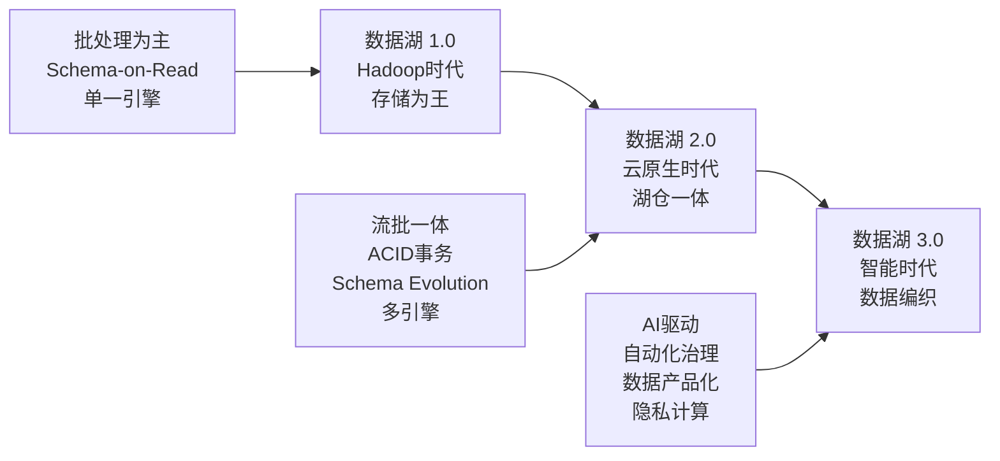

### 13. 总结

数据湖架构的演进，本质上是企业对数据价值认知的深化过程。从最初"先存起来再说"的朴素想法，到今天"数据即资产"的战略共识，数据湖已经从一个技术组件演变为企业的核心竞争力。

构建一个成功的数据湖，需要平衡以下几个关键矛盾：

- **灵活性 vs 治理**：既要数据随存随用，又要数据安全可控。解决方案是分层治理（Bronze/Silver/Gold）+ 统一Catalog
- **成本 vs 性能**：既要低成本存储海量数据，又要高性能查询。解决方案是存算分离 + 冷热分层 + 向量化引擎
- **实时 vs 批量**：既要秒级数据可用，又要保证数据质量。解决方案是流批一体（Flink）+ 分层质量控制
- **统一 vs 灵活**：既要统一的数据标准，又要满足各业务的个性化需求。解决方案是联邦治理 + 自助数据市场

**核心要点回顾：**

1. **表格式是关键**：Delta Lake / Iceberg / Hudi 是数据湖从"数据沼泽"进化为"数据资产"的技术基础
2. **分层是王道**：Bronze/Silver/Gold 三层架构是数据湖治理的黄金标准
3. **治理先行**：没有元数据管理、数据质量、权限控制的数据湖必然退化为数据沼泽
4. **渐进式建设**：从简单架构起步，按需演进，避免过度设计
5. **云原生存算分离**：独立扩展存储和计算，实现成本和弹性的最优平衡

最终，一个成熟的数据湖架构应该做到：让正确的数据在正确的时间以正确的方式到达正确的人手中。这不仅是技术问题，更是组织文化和业务流程的全面变革。数据湖的成功，三分靠技术，七分靠治理。
