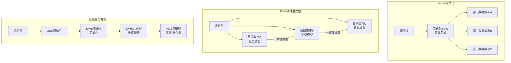
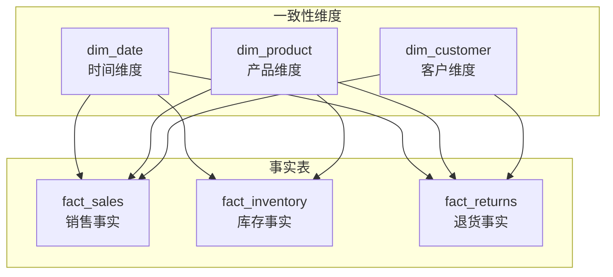

## 三、数据仓库建模：从理论到实践的完整指南

数据仓库建模是将原始业务数据转化为适合分析查询的结构化模型的系统化过程。好的数据模型能让分析师在秒级完成复杂查询，让业务决策基于可靠的数据基础；差的数据模型则会导致查询缓慢、口径混乱、分析结果自相矛盾。本节从建模方法论到表设计细节，系统性地讲解数据仓库建模的核心知识。

---

### 1. 数据仓库建模的本质与价值

#### 1.1 为什么需要建模

操作型数据库（OLTP）的设计目标是高并发事务处理——每秒处理成千上万的增删改查操作，保证数据一致性。这种设计下，数据被高度规范化（通常达到第三范式），拆分成大量小表，通过外键关联。这种结构对事务处理很高效，但对分析查询极为不利：一次跨5个维度的销售分析可能需要JOIN十张以上的小表，查询耗时从毫秒级膨胀到分钟级。

数据仓库建模的核心目标就是解决这个矛盾：**用反规范化和预聚合来换取查询性能**。具体来说：

- **查询性能**：将分析所需的多表关联预处理为宽表，减少运行时JOIN开销
- **语义一致性**：统一数据口径，确保不同团队对"销售额"、"活跃用户"等指标有相同的理解
- **可维护性**：建立清晰的数据分层和依赖关系，降低变更影响范围
- **数据复用**：一次建模、多处消费，避免每个分析需求都从头编写SQL

#### 1.2 两大主流方法论

数据仓库建模领域存在两大经典方法论，分别由Bill Inmon和Ralph Kimball提出，两者在架构理念上存在根本差异：

**Inmon范式化方法（Top-Down）**

Bill Inmon被称为"数据仓库之父"，他主张从企业全局视角出发，先构建范式化的企业数据模型（通常是第三范式），再从范式化模型中派生面向分析的部门级数据集市。其核心理念是"单一版本的事实"——所有数据先以最规范的形式存储，再按需裁剪。

| 特点 | 说明 |
|------|------|
| 架构方向 | 自顶向下，先全局后局部 |
| 存储形式 | 第三范式（3NF）的企业数据仓库（EDW） |
| 数据冗余 | 最小化，通过范式化消除重复 |
| 适用场景 | 企业级数据仓库、需要强一致性的场景 |
| 代表工具 | Teradata、Oracle、SQL Server |
| 优势 | 数据一致性好、存储效率高 |
| 劣势 | 建设周期长、查询需要大量JOIN、对建模师要求高 |

**Kimball维度建模（Bottom-Up）**

Ralph Kimball主张从具体的业务过程出发，逐步构建维度模型。他提出了"总线架构"（Bus Architecture）——通过一致性维度（Conformed Dimensions）将各个独立的数据集市连接成企业级数据仓库。每个数据集市围绕一个业务过程构建，独立交付价值。

| 特点 | 说明 |
|------|------|
| 架构方向 | 自底向上，先局部后全局 |
| 存储形式 | 星型模型/雪花模型 |
| 数据冗余 | 适度冗余（反规范化换取查询性能） |
| 适用场景 | 分析驱动的场景、快速交付需求 |
| 代表工具 | Snowflake、Redshift、BigQuery、ClickHouse |
| 优势 | 查询性能好、易于理解、快速交付 |
| 劣势 | 数据冗余、一致性维护需要额外机制 |

**实践中的融合**：现代数据仓库项目通常采用融合策略——在核心数据层采用Inmon范式化保证数据一致性（DWD层），在分析应用层采用Kimball维度建模提供查询性能（DWS/ADS层）。这种分层策略兼顾了一致性和性能。



---

### 2. 维度建模核心概念

维度建模是数据仓库建模的主流方法，掌握以下核心概念是建模的基础。

#### 2.1 事实表（Fact Table）

事实表存储业务过程的可度量数据，是维度模型的核心。事实表的每行代表一个可度量的业务事件或状态。

**事实表的三个核心要素**：

**① 粒度（Grain）**——事实表中每一行代表什么，这是设计事实表时最重要的决策。粒度决定了事实表的分析粒度和数据量。

常见粒度选择示例：

| 业务过程 | 粒度选择 | 数据量级（日） | 说明 |
|----------|----------|---------------|------|
| 电商订单 | 一个订单明细项 | 百万级 | 最细粒度，灵活性最高 |
| 网站访问 | 一次页面浏览事件 | 十亿级 | 最细粒度，支持所有分析 |
| 银行交易 | 一笔交易 | 千万级 | 自然粒度 |
| 库存快照 | 每个仓库每天每个SKU的库存 | 千万级 | 周期快照，用于库存分析 |

粒度选择的原则：**选择最细粒度**。粗粒度数据可以通过聚合细粒度数据得到，但细粒度数据无法从粗粒度数据还原。比如按天汇总的销售额无法还原到每笔订单，但每笔订单的数据可以聚合为按天汇总。

**② 度量（Measure）**——事实表中存储的数值型数据，是分析的核心对象。度量分为三类：

- **可加性度量（Additive）**：可以沿所有维度求和，如销售额、数量。这是最理想的度量类型。
- **半可加性度量（Semi-Additive）**：只能沿部分维度求和，如账户余额——可以按账户求和（总余额），但不能按时间求和（某天的余额不是多天余额之和）。
- **不可加性度量（Non-Additive）**：不能沿任何维度求和，如比率、百分比。通常需要通过预计算或存储分子分母来解决。

**③ 外键（Foreign Key）**——事实表通过外键关联到维度表。每组外键定义了度量值的分析上下文。

#### 2.2 维度表（Dimension Table）

维度表存储描述业务上下文的属性数据，回答"谁、在哪、什么时候、怎么样的"这类问题。维度表通常比事实表小得多（百万级vs十亿级），但每个维度表可能很"宽"——包含几十甚至上百个属性字段。

**维度属性的设计原则**：

- **描述性**：维度属性应该是描述性的文本，而非编码。例如存储"华东区"而非"R001"。
- **完备性**：尽可能丰富的属性，为分析提供更多切面。产品维度可以包含名称、类别、品牌、供应商、重量、颜色等。
- **稳定性**：维度属性的变化应该比度量值慢得多。如果一个"属性"每天都在变化，它可能更适合放在事实表中。

**代理键（Surrogate Key） vs 自然键（Natural Key）**

维度表通常使用代理键——由数据仓库自动生成的自增整数作为主键，而非使用源系统的业务键（自然键）。原因如下：

- **稳定性**：源系统的主键可能变化（如客户ID格式升级），代理键不受影响
- **一致性**：不同源系统可能对同一实体使用不同的键格式，代理键统一管理
- **SCD支持**：当维度属性变化时，代理键可以区分新旧版本（SCD Type 2的核心机制）
- **性能**：整数型JOIN比字符串型JOIN更快，占用存储更少

#### 2.3 一致性维度（Conformed Dimension）

一致性维度是Kimball总线架构的基石。一致性维度意味着：**多个事实表共享同一个维度表，且维度表的粒度和属性完全一致**。

例如，销售事实表和库存事实表都关联到同一个产品维度表。当分析师查询"电子产品类别的销售总额"和"电子产品类别的库存总额"时，两个查询中的"电子产品"使用的是同一个维度定义，结果可以直接比较和合并。

一致性维度的实现方式：

- **共享维度表**：多个事实表直接关联同一张维度表（最常见的方式）
- **维度子集**：在共享维度表的基础上创建面向特定事实表的子集视图
- **值一致性**：确保不同事实表中同一维度的编码和命名完全一致（如"华东区"不能在A表叫"华东区"、B表叫"华东大区"）

---

### 3. 事实表的三种类型

Kimball将事实表分为三种类型，每种类型对应不同的业务场景和查询模式。

#### 3.1 事务事实表（Transactional Fact Table）

事务事实表记录原子级别的业务事件，每一行对应一个可确认的业务事务（如一笔订单、一次支付、一次网站访问）。

**特征**：
- 粒度：一个事务事件
- 度量：事务发生时的快照值
- 时态：每行有明确的时间戳
- 可更新性：通常只追加（Append-Only），不更新

**示例：电商订单事务事实表**

```sql
-- 事务事实表：每行代表一个订单明细项
CREATE TABLE fact_order_transactions (
    transaction_sk    BIGINT PRIMARY KEY,     -- 代理键
    order_sk          BIGINT,                 -- 订单维度外键
    date_sk           INT,                    -- 时间维度外键
    customer_sk       BIGINT,                 -- 客户维度外键
    product_sk        BIGINT,                 -- 产品维度外键
    channel_sk        INT,                    -- 渠道维度外键
    -- 可加性度量
    quantity          INT,                    -- 购买数量
    unit_price        DECIMAL(12,2),          -- 单价
    line_amount       DECIMAL(12,2),          -- 行金额
    discount_amount   DECIMAL(12,2),          -- 折扣金额
    tax_amount        DECIMAL(12,2),          -- 税额
    -- 事务元数据
    transaction_time  TIMESTAMP               -- 事务精确时间
);
```

#### 3.2 周期快照事实表（Periodic Snapshot Fact Table）

周期快照事实表在固定时间间隔对业务状态进行快照，记录某个时间点的状态值。典型场景包括账户余额（每天快照）、库存水平（每天快照）、设备状态（每小时快照）。

**特征**：
- 粒度：一个实体在一个时间周期内的状态
- 度量：周期结束时的快照值，或周期内的累计值
- 时态：每行代表一个时间周期（如一天、一月）
- 可更新性：定期追加新快照行

**示例：账户余额周期快照表**

```sql
-- 周期快照事实表：每天记录每个账户的余额状态
CREATE TABLE fact_account_daily_snapshot (
    snapshot_sk       BIGINT PRIMARY KEY,
    date_sk           INT,                    -- 快照日期
    account_sk        BIGINT,                 -- 账户维度外键
    customer_sk       BIGINT,                 -- 客户维度外键
    -- 半可加性度量（不能跨时间求和）
    opening_balance   DECIMAL(14,2),          -- 期初余额
    closing_balance   DECIMAL(14,2),          -- 期末余额
    -- 周期内累计度量
    total_debit       DECIMAL(14,2),          -- 日内借方总额
    total_credit      DECIMAL(14,2),          -- 日内贷方总额
    transaction_count INT                     -- 日内交易笔数
);
```

**半可加性度量的查询技巧**：对于账户余额这类半可加性度量，求某段时间的余额时应取起始和结束时间的快照，而非求和：

```sql
-- 错误：跨时间求和余额
SELECT SUM(closing_balance) FROM fact_account_daily_snapshot
WHERE date_sk BETWEEN 20240101 AND 20240131;  -- 结果没有业务意义

-- 正确：取起始日期的余额
SELECT closing_balance FROM fact_account_daily_snapshot
WHERE date_sk = 20240131;  -- 1月31日的余额

-- 或者计算时间点余额变化
SELECT
    a.closing_balance - b.closing_balance AS balance_change
FROM fact_account_daily_snapshot a
JOIN fact_account_daily_snapshot b
    ON a.account_sk = b.account_sk
WHERE a.date_sk = 20240131
  AND b.date_sk = 20231231;
```

#### 3.3 累积快照事实表（Accumulating Snapshot Fact Table）

累积快照事实表跟踪一个业务过程从开始到结束的全生命周期，每行代表一个完整的业务过程实例，随着业务进展不断更新。

**特征**：
- 粒度：一个业务过程实例
- 度量：过程中的关键里程碑和累计度量
- 时态：一行包含多个时间点（开始、中间、结束）
- 可更新性：需要UPDATE（当里程碑状态变化时更新已有行）

**示例：订单生命周期累积快照表**

```sql
-- 累积快照事实表：跟踪订单从创建到完成的全过程
CREATE TABLE fact_order_accumulating (
    order_sk              BIGINT PRIMARY KEY,
    customer_sk           BIGINT,
    product_sk            BIGINT,
    -- 多个里程碑时间点
    order_created_date_sk     INT,          -- 下单日期
    order_confirmed_date_sk   INT,          -- 确认日期
    order_shipped_date_sk     INT,          -- 发货日期
    order_delivered_date_sk   INT,          -- 送达日期
    order_completed_date_sk   INT,          -- 完成日期（确认收货）
    -- 度量
    order_amount         DECIMAL(12,2),      -- 订单金额
    shipping_cost        DECIMAL(10,2),      -- 运费
    -- 持续时间度量
    days_to_confirm      INT,               -- 下单到确认的天数
    days_to_ship         INT,               -- 确认到发货的天数
    days_to_deliver      INT,               -- 发货到送达的天数
    total_cycle_days     INT                -- 总周期天数
);
```

三种事实表的对比总结：

| 特性 | 事务事实表 | 周期快照事实表 | 累积快照事实表 |
|------|-----------|---------------|---------------|
| 粒度 | 一个事务事件 | 一个实体×一个时间周期 | 一个业务过程实例 |
| 行数增长 | 事务量决定 | 实体数×时间周期数 | 业务过程实例数 |
| 更新方式 | 仅追加 | 定期追加 | 需要UPDATE |
| 典型度量 | 事务金额、数量 | 期末余额、累计值 | 持续时间、累计金额 |
| 典型场景 | 订单明细、点击流 | 账户余额、库存快照 | 订单生命周期、项目进度 |

---

### 4. 星型模型与雪花模型

#### 4.1 星型模型（Star Schema）

星型模型是最常用的数据仓库模型。事实表位于中心，维度表直接围绕事实表排列，形成星形结构。每个维度表只与事实表进行一次Join，没有维度表之间的关联。

**星型模型的SQL示例**：

```sql
-- 星型模型查询：按产品类别和地区的月度销售分析
SELECT
    d.year,
    d.month,
    p.category AS product_category,
    g.region,
    g.province,
    SUM(f.quantity)              AS total_quantity,
    SUM(f.line_amount)           AS total_revenue,
    COUNT(DISTINCT f.customer_sk) AS unique_customers,
    SUM(f.line_amount) / COUNT(DISTINCT f.customer_sk) AS revenue_per_customer
FROM fact_sales f
JOIN dim_date     d ON f.date_sk      = d.date_sk
JOIN dim_product  p ON f.product_sk   = p.product_sk
JOIN dim_geo      g ON f.geo_sk       = g.geo_sk
WHERE d.year = 2024
GROUP BY d.year, d.month, p.category, g.region, g.province
ORDER BY d.month, total_revenue DESC;
```

星型模型的优势：
- **查询简单**：每个查询最多Join N+1张表（N个维度+1个事实表），SQL编写直观
- **查询性能好**：Join次数少，OLAP引擎对星型模型有专门优化（如星型Join优化）
- **易于理解**：业务人员也能直观理解事实表和维度表的关系
- **OLAP友好**：大多数OLAP工具（Tableau、PowerBI、Metabase）原生支持星型模型

#### 4.2 雪花模型（Snowflake Schema）

雪花模型是星型模型的扩展——将维度表进一步规范化，拆分为多层子维度表。例如，产品维度表可以拆分为产品表→类别表→部门表，形成雪花状的层级结构。

**雪花模型的SQL示例**：

```sql
-- 雪花模型查询：维度表被规范化为多层结构
-- dim_product → dim_category → dim_department
SELECT
    dep.department_name,
    cat.category_name,
    p.product_name,
    SUM(f.line_amount) AS total_revenue
FROM fact_sales f
JOIN dim_product    p   ON f.product_sk = p.product_sk
JOIN dim_category   cat ON p.category_sk = cat.category_sk
JOIN dim_department dep ON cat.department_sk = dep.department_sk
GROUP BY dep.department_name, cat.category_name, p.product_name;
```

雪花模型的取舍：

| 方面 | 星型模型 | 雪花模型 |
|------|---------|---------|
| 数据冗余 | 较高（维度属性反规范化） | 较低（维度属性规范化） |
| 存储效率 | 较低 | 较高 |
| 查询性能 | 较好（Join次数少） | 较差（Join次数多） |
| 数据一致性 | 需要在ETL中维护冗余数据的一致性 | 规范化天然保证一致性 |
| 查询复杂度 | 简单直观 | 复杂，需要多层Join |
| 维护复杂度 | 更新时需要同步多处冗余数据 | 更新点集中，维护简单 |
| 适用场景 | 查询性能优先 | 存储成本敏感、维度层级复杂 |

**实践建议**：在大多数现代数据仓库中，星型模型是首选。原因有三：

1. **列式存储**已经大大降低了冗余数据的存储成本——同值列的压缩比极高
2. **OLAP引擎**对星型模型有专门的查询优化——如ClickHouse的跳数索引、StarRocks的星型Join
3. **简化开发**——更少的Join意味着更少的SQL错误和更快的开发速度

但在某些场景下，雪花模型更合适：当维度层级非常深（如全球行政区划：大洲→国家→省→市→区→街道）时，将每个层级规范化为独立表可以避免维度表过于臃肿。

#### 4.3 星网模型（Fact Constellation / Galaxy Schema）

星网模型是星型模型的扩展——多张事实表共享同一组一致性维度表，形成类似星系的结构。这是Kimball总线架构的物理实现。



星网模型使得跨业务过程的分析成为可能：比如同时分析"销售额"和"退货率"——两个指标来自不同的事实表，但通过共享的产品维度和时间维度可以关联分析。

---

### 5. 缓慢变化维（SCD）

缓慢变化维（Slowly Changing Dimension）处理维度数据随时间变化的问题。当一个客户的地址从"上海"变成"北京"时，历史分析应该看到"上海"还是"北京"？SCD提供了不同的策略来回答这个问题。

#### 5.1 SCD Type 1：直接覆盖

Type 1不保留历史，直接用新值覆盖旧值。适用于不需要追踪历史变化的场景。

```sql
-- SCD Type 1：直接覆盖
-- 客户地址从"上海"更新为"北京"
UPDATE dim_customer
SET city = '北京',
    update_time = CURRENT_TIMESTAMP
WHERE customer_id = 'C001';

-- 更新后，所有历史查询中该客户的地址都显示"北京"
-- 无法追溯该客户之前在上海的事实
```

**适用场景**：修正错误数据、不关心历史变化的属性（如手机号更新）

**局限性**：完全丢失历史信息，无法做历史维度分析

#### 5.2 SCD Type 2：保留完整历史

Type 2是数据仓库中最常用的策略。当维度属性变化时，旧记录标记为失效，新增一条当前记录。每条记录包含生效时间（valid_from）、失效时间（valid_to）和当前标记（is_current）。

```sql
-- SCD Type 2：完整历史保留
-- 初始状态
INSERT INTO dim_customer (customer_sk, customer_id, name, city, valid_from, valid_to, is_current)
VALUES (1, 'C001', '张三', '上海', '2023-01-01', '9999-12-31', TRUE);

-- 客户地址从"上海"变为"北京"
-- 步骤1：将旧记录标记为失效
UPDATE dim_customer
SET valid_to = '2024-06-01',
    is_current = FALSE
WHERE customer_id = 'C001' AND is_current = TRUE;

-- 步骤2：插入新记录
INSERT INTO dim_customer (customer_sk, customer_id, name, city, valid_from, valid_to, is_current)
VALUES (2, 'C001', '张三', '北京', '2024-06-01', '9999-12-31', TRUE);

-- 查询某个时间点的客户信息（时间旅行查询）
SELECT * FROM dim_customer
WHERE customer_id = 'C001'
  AND valid_from <= '2024-03-15'   -- 在生效日期之前
  AND valid_to > '2024-03-15';     -- 在失效日期之后
-- 结果：city = '上海'（正确反映了3月时的地址）

-- 查询当前客户信息
SELECT * FROM dim_customer
WHERE customer_id = 'C001'
  AND is_current = TRUE;
-- 结果：city = '北京'（当前最新地址）
```

**Type 2的关键设计要素**：

- **代理键（surrogate_key）**：每次变化生成新的代理键，新旧记录有不同主键
- **有效时间范围（valid_from / valid_to）**：定义每条记录的有效期
- **当前标记（is_current）**：快速定位当前有效的记录，避免时间范围计算
- **版本号（version）**：可选字段，记录这是该实体的第几个版本

**Type 2对事实表的影响**：事实表中的维度外键应该关联到对应时间点的代理键。这意味着事实表在加载时需要根据业务时间查找维度表中的有效记录：

```sql
-- 事实表关联SCD Type 2维度表的ETL逻辑
INSERT INTO fact_sales
SELECT
    s.order_id,
    s.product_id,
    s.order_amount,
    -- 根据订单时间关联到对应版本的客户维度
    d.customer_sk,
    s.order_date
FROM staging_sales s
LEFT JOIN dim_customer d
    ON s.customer_id = d.customer_id
    AND d.valid_from <= s.order_date
    AND d.valid_to > s.order_date
    AND d.is_current IN (TRUE, FALSE);  -- 匹配所有版本
```

#### 5.3 SCD Type 3：保留有限历史

Type 3在维度表中添加"前值"列，只保留一次历史变化。适用于只需要比较当前值和前值的场景。

```sql
-- SCD Type 3：保留当前值和前值
ALTER TABLE dim_customer ADD COLUMN previous_city VARCHAR(50);
ALTER TABLE dim_customer ADD COLUMN city_changed_date DATE;

-- 初始状态
UPDATE dim_customer
SET city = '上海',
    previous_city = NULL,
    city_changed_date = NULL
WHERE customer_id = 'C001';

-- 地址变化时
UPDATE dim_customer
SET previous_city = city,        -- 旧值存入"前值"列
    city = '北京',               -- 新值覆盖当前列
    city_changed_date = '2024-06-01'
WHERE customer_id = 'C001';

-- 查询当前和历史地址
SELECT
    city AS current_city,
    previous_city,
    city_changed_date
FROM dim_customer
WHERE customer_id = 'C001';
-- 结果：current_city='北京', previous_city='上海', city_changed_date='2024-06-01'
```

**Type 3的局限性**：只能保留一次历史变化。如果地址从上海→北京→广州，Type 3只保留"北京"作为previous_city，"上海"的信息会丢失。

#### 5.4 SCD策略对比与选型

| 策略 | 历史保留 | 存储开销 | 查询复杂度 | 适用场景 |
|------|---------|---------|-----------|---------|
| Type 1 | 不保留 | 最低 | 最简单 | 不关心历史、修正错误 |
| Type 2 | 完整 | 较高（每个变化一行） | 中等（时间范围JOIN） | 大多数维度分析场景 |
| Type 3 | 仅前值 | 低 | 简单 | 只需比较当前值和前值 |
| Type 4（历史表） | 完整 | 中等 | 中等 | 高频变化维度 |
| Type 6（混合） | 完整 | 较高 | 中等 | 需要同时支持当前视图和历史视图 |

**Type 4（历史表分离）**：维护两张表——当前表只保留最新记录，历史表记录所有历史版本。查询当前值时访问当前表（性能好），查询历史时访问历史表。

**Type 6（混合型）**：结合Type 1和Type 2——当前列始终是最新值（Type 1行为），同时保留历史版本记录（Type 2行为）。适合需要同时支持"看当前值"和"回溯历史"两种查询模式的场景。

---

### 6. 数据仓库分层架构

现代数据仓库通常采用分层设计，每层承担不同的职责。以国内常见的四层架构为例：

#### 6.1 ODS层（Operational Data Store，操作数据层）

ODS层是数据仓库的最底层，存储从源系统直接同步过来的原始数据。ODS层保持与源系统完全一致的数据结构和内容，不做任何转换。

**设计原则**：
- 保持源系统表结构，字段名和类型尽量一致
- 记录数据同步时间戳（`_sync_time`）
- 保留原始数据的所有字段，不做筛选
- 按天分区，支持历史回溯

```sql
-- ODS层：订单表（保持源系统结构）
CREATE TABLE ods_orders (
    order_id          VARCHAR(64),
    customer_id       VARCHAR(64),
    order_date        TIMESTAMP,
    order_status      VARCHAR(20),
    total_amount      DECIMAL(12,2),
    payment_method    VARCHAR(30),
    shipping_address  VARCHAR(500),
    created_at        TIMESTAMP,
    updated_at        TIMESTAMP,
    -- 同步元数据
    _sync_time        TIMESTAMP,
    _source_system    VARCHAR(50)
) PARTITIONED BY (dt STRING);
```

#### 6.2 DWD层（Data Warehouse Detail，明细数据层）

DWD层对ODS层的数据进行清洗、标准化和规范化，形成明细事实表。这是数据仓库的数据质量保障层。

**主要处理内容**：
- **数据清洗**：去重、空值处理、异常值过滤
- **格式标准化**：日期格式统一、编码统一（如性别M/F统一为1/0）
- **维度退化**：将频繁使用的维度属性直接冗余到事实表中
- **字段重构**：拆分复合字段（如将完整地址拆分为省市区）
- **码值翻译**：将编码值翻译为可读文本（如`status=1`→`status='已支付'`）

```sql
-- DWD层：订单明细事实表（清洗和标准化后）
CREATE TABLE dwd_order_detail (
    order_detail_sk    BIGINT,
    order_id           VARCHAR(64),
    customer_id        VARCHAR(64),
    order_date         DATE,
    order_time         TIMESTAMP,
    order_status       VARCHAR(20),
    product_id         VARCHAR(64),
    product_name       VARCHAR(200),
    category_name      VARCHAR(100),
    brand_name         VARCHAR(100),
    quantity           INT,
    unit_price         DECIMAL(12,2),
    line_amount        DECIMAL(12,2),
    discount_amount    DECIMAL(12,2),
    payment_method     VARCHAR(30),
    province           VARCHAR(50),
    city               VARCHAR(50),
    -- 数据质量标记
    is_valid           BOOLEAN,
    data_quality_flag  VARCHAR(50)
) PARTITIONED BY (dt STRING);
```

#### 6.3 DWS层（Data Warehouse Summary，汇总数据层）

DWS层基于DWD层的明细数据，按业务主题进行预聚合，形成面向分析的汇总事实表。DWS层的目的是减少查询时的聚合计算量。

```sql
-- DWS层：每日销售汇总表
CREATE TABLE dws_daily_sales (
    date_sk            INT,
    product_sk         BIGINT,
    geo_sk             INT,
    channel_sk         INT,
    -- 汇总度量
    order_count        INT,             -- 订单数
    detail_count       INT,             -- 明细行数
    total_quantity     INT,             -- 总数量
    total_amount       DECIMAL(14,2),   -- 总金额
    total_discount     DECIMAL(14,2),   -- 总折扣
    total_tax          DECIMAL(14,2),   -- 总税额
    unique_customers   INT,             -- 独立客户数
    -- 衍生度量
    avg_order_amount   DECIMAL(12,2),   -- 平均客单价
    discount_rate      DECIMAL(5,4)     -- 折扣率
) PARTITIONED BY (dt STRING);
```

#### 6.4 ADS层（Application Data Store，应用数据层）

ADS层面向具体的分析应用和报表需求，提供高度定制化的数据表。

```sql
-- ADS层：月度销售报表（面向BI报表）
CREATE TABLE ads_monthly_sales_report (
    report_month       VARCHAR(7),      -- '2024-01'
    region_name        VARCHAR(50),
    store_name         VARCHAR(100),
    category_name      VARCHAR(100),
    brand_name         VARCHAR(100),
    monthly_revenue    DECIMAL(14,2),
    monthly_quantity   INT,
    monthly_orders     INT,
    mom_growth_rate    DECIMAL(5,4),    -- 环比增长率
    yoy_growth_rate    DECIMAL(5,4),    -- 同比增长率
    revenue_rank       INT              -- 收入排名
);
```

**四层架构的数据流与职责**：

| 层级 | 英文全称 | 职责 | 数据量 | 查询频率 |
|------|---------|------|--------|---------|
| ODS | Operational Data Store | 保持源系统原貌，数据备份 | 最大 | 低（仅回溯时查询） |
| DWD | Data Warehouse Detail | 清洗、标准化、规范化 | 大 | 中（明细分析） |
| DWS | Data Warehouse Summary | 按主题预聚合 | 中 | 高（日常分析） |
| ADS | Application Data Store | 面向应用的高度定制 | 小 | 最高（报表/API） |

---

### 7. 维度建模设计流程

一个完整的维度建模流程包括以下步骤：

#### 7.1 步骤一：选择业务过程

业务过程是组织中可重复执行的、产生度量值的活动。典型业务过程包括：

| 业务过程 | 触发事件 | 典型度量 |
|----------|---------|---------|
| 订单处理 | 客户下单 | 订单金额、数量、折扣 |
| 物流配送 | 发货/签收 | 配送时效、运费 |
| 客户服务 | 工单创建 | 响应时间、解决率 |
| 网站访问 | 页面浏览/点击 | 浏览量、停留时长、转化率 |

选择业务过程时，优先选择那些直接影响业务决策的核心过程。不要试图在一个事实表中塞入所有业务过程——每个业务过程应该有自己独立的事实表。

#### 7.2 步骤二：声明粒度

粒度声明是用一句话明确事实表中每一行的含义。好的粒度声明示例：

- "每笔订单明细项"——事实表的一行代表一个订单中一个产品的购买记录
- "每次网站页面浏览"——事实表的一行代表一个用户的一次页面访问
- "每个账户每天的余额快照"——事实表的一行代表一个账户在一天结束时的余额

粒度声明要具体到能消除所有歧义。"订单数据"不是好的粒度声明——它没有说明是订单级还是订单明细级。

#### 7.3 步骤三：确定维度

根据粒度声明，确定分析的上下文——"谁、在哪、什么时候、怎么样"。为每个业务过程选择合适的维度：

- **时间维度**：几乎每个事实表都需要，提供时间切面
- **产品维度**：分析的主体对象
- **客户/用户维度**：分析的行为主体
- **地理维度**：区域、城市、门店等空间维度
- **渠道维度**：线上/线下、APP/小程序/PC等
- **促销维度**：活动类型、优惠券等

#### 7.4 步骤四：确定度量

根据业务需求，确定事实表中要存储的度量值。优先选择可加性度量，谨慎处理半可加和不可加度量。同时考虑需要预计算的衍生度量。

#### 7.5 步骤五：设计维度表

为每个维度设计表结构，确定维度属性、代理键策略和SCD策略。维度表应该尽量宽（属性丰富），方便后续分析时的多角度切分。

#### 7.6 步骤六：设计事实表

确定事实表的主键（代理键）、维度外键、度量字段和分区策略。事实表的设计要严格遵循粒度声明——每行数据的含义必须与粒度声明完全一致。

---

### 8. 实操案例：电商数据仓库建模

以下是一个完整的电商数据仓库建模案例，从表结构设计到查询示例。

#### 8.1 维度表设计

```sql
-- 时间维度表（通常预先生成多年数据）
CREATE TABLE dim_date (
    date_sk          INT PRIMARY KEY,         -- 格式：20240101
    full_date        DATE,
    year             INT,
    half_year        INT,
    quarter          INT,
    month            INT,
    month_name       VARCHAR(10),             -- 'January'
    week_of_year     INT,
    day_of_month     INT,
    day_of_week      INT,                     -- 1=周一
    day_name         VARCHAR(10),             -- 'Monday'
    is_weekend       BOOLEAN,
    is_holiday       BOOLEAN,
    holiday_name     VARCHAR(50),
    fiscal_year      INT,                     -- 财年
    fiscal_quarter   INT
);

-- 产品维度表（SCD Type 2）
CREATE TABLE dim_product (
    product_sk       BIGINT PRIMARY KEY,
    product_id       VARCHAR(64),             -- 业务自然键
    product_name     VARCHAR(200),
    product_desc     TEXT,
    category_l1      VARCHAR(50),             -- 一级类目
    category_l2      VARCHAR(50),             -- 二级类目
    category_l3      VARCHAR(50),             -- 三级类目
    brand_name       VARCHAR(100),
    supplier_name    VARCHAR(100),
    unit_cost        DECIMAL(10,2),
    list_price       DECIMAL(10,2),
    weight_kg        DECIMAL(8,3),
    is_active        BOOLEAN,
    -- SCD Type 2字段
    valid_from       TIMESTAMP,
    valid_to         TIMESTAMP,
    is_current       BOOLEAN,
    version          INT
);

-- 客户维度表（SCD Type 2）
CREATE TABLE dim_customer (
    customer_sk      BIGINT PRIMARY KEY,
    customer_id      VARCHAR(64),
    customer_name    VARCHAR(100),
    gender           VARCHAR(10),
    birth_date       DATE,
    age_group        VARCHAR(20),             -- '25-30'
    membership_level VARCHAR(20),             -- 'Gold'
    register_date    DATE,
    register_channel VARCHAR(30),
    province         VARCHAR(50),
    city             VARCHAR(50),
    valid_from       TIMESTAMP,
    valid_to         TIMESTAMP,
    is_current       BOOLEAN,
    version          INT
);

-- 地理维度表
CREATE TABLE dim_geo (
    geo_sk           INT PRIMARY KEY,
    country          VARCHAR(50),
    region           VARCHAR(50),             -- 华东/华北/...
    province         VARCHAR(50),
    city             VARCHAR(50),
    district         VARCHAR(50)
);

-- 渠道维度表
CREATE TABLE dim_channel (
    channel_sk       INT PRIMARY KEY,
    channel_name     VARCHAR(50),             -- '天猫旗舰店'
    channel_type     VARCHAR(30),             -- '线上B2C'
    platform         VARCHAR(30),             -- '天猫'
    is_own_channel   BOOLEAN                  -- 是否自营
);
```

#### 8.2 事实表设计

```sql
-- 事务事实表：订单明细
CREATE TABLE fact_sales (
    sales_sk         BIGINT PRIMARY KEY,
    date_sk          INT REFERENCES dim_date(date_sk),
    customer_sk      BIGINT REFERENCES dim_customer(customer_sk),
    product_sk       BIGINT REFERENCES dim_product(product_sk),
    geo_sk           INT REFERENCES dim_geo(geo_sk),
    channel_sk       INT REFERENCES dim_channel(channel_sk),
    -- 退化维度
    order_id         VARCHAR(64),             -- 订单号（退化维度）
    -- 度量
    quantity         INT,
    unit_price       DECIMAL(12,2),
    line_amount      DECIMAL(12,2),           -- quantity * unit_price
    discount_amount  DECIMAL(12,2),
    coupon_amount    DECIMAL(12,2),
    final_amount     DECIMAL(12,2),           -- line_amount - discount - coupon
    shipping_cost    DECIMAL(10,2),
    -- 事务时间
    order_time       TIMESTAMP
) PARTITIONED BY (date_sk INT);
```

#### 8.3 常见查询示例

```sql
-- 查询1：月度销售趋势
SELECT
    d.year,
    d.month,
    SUM(f.final_amount)             AS monthly_revenue,
    SUM(f.quantity)                 AS monthly_quantity,
    COUNT(DISTINCT f.order_id)      AS monthly_orders,
    COUNT(DISTINCT f.customer_sk)   AS monthly_customers
FROM fact_sales f
JOIN dim_date d ON f.date_sk = d.date_sk
WHERE d.year = 2024
GROUP BY d.year, d.month
ORDER BY d.month;

-- 查询2：按产品类目的Top10销售排行
SELECT
    p.category_l1,
    p.category_l2,
    p.brand_name,
    SUM(f.final_amount) AS total_revenue,
    SUM(f.quantity)     AS total_quantity
FROM fact_sales f
JOIN dim_product p ON f.product_sk = p.product_sk
WHERE p.is_current = TRUE
  AND f.date_sk BETWEEN 20240101 AND 20240131
GROUP BY p.category_l1, p.category_l2, p.brand_name
ORDER BY total_revenue DESC
LIMIT 10;

-- 查询3：客户RFM分析（基于事务事实表）
WITH customer_rfm AS (
    SELECT
        f.customer_sk,
        DATEDIFF('day', MAX(d.full_date), CURRENT_DATE) AS recency_days,
        COUNT(DISTINCT f.order_id)                       AS frequency,
        SUM(f.final_amount)                              AS monetary
    FROM fact_sales f
    JOIN dim_date d ON f.date_sk = d.date_sk
    WHERE d.full_date >= DATEADD('year', -1, CURRENT_DATE)
    GROUP BY f.customer_sk
)
SELECT
    c.customer_name,
    c.membership_level,
    cr.recency_days,
    cr.frequency,
    cr.monetary,
    -- RFM评分（简化版）
    CASE WHEN cr.recency_days <= 30 THEN 5
         WHEN cr.recency_days <= 90 THEN 4
         WHEN cr.recency_days <= 180 THEN 3
         WHEN cr.recency_days <= 365 THEN 2
         ELSE 1 END AS r_score,
    CASE WHEN cr.frequency >= 20 THEN 5
         WHEN cr.frequency >= 10 THEN 4
         WHEN cr.frequency >= 5 THEN 3
         WHEN cr.frequency >= 2 THEN 2
         ELSE 1 END AS f_score,
    CASE WHEN cr.monetary >= 10000 THEN 5
         WHEN cr.monetary >= 5000 THEN 4
         WHEN cr.monetary >= 1000 THEN 3
         WHEN cr.monetary >= 500 THEN 2
         ELSE 1 END AS m_score
FROM customer_rfm cr
JOIN dim_customer c ON cr.customer_sk = c.customer_sk
WHERE c.is_current = TRUE
ORDER BY cr.monetary DESC;
```

---

### 9. 常见建模误区与最佳实践

#### 9.1 常见误区

**误区一：将OLTP模型直接搬入数据仓库**

直接使用操作型数据库的表结构（第三范式）作为数据仓库模型，导致分析查询需要大量JOIN，性能极差。正确做法是采用维度建模，对数据进行反规范化处理。

**误区二：粒度不统一**

同一张事实表中混合了不同粒度的数据。例如，订单事实表中既存储订单级汇总数据，又存储订单明细行数据——这两者的粒度不同，不应该放在同一张表中。正确做法是为不同粒度创建不同的事实表。

**误区三：过度规范化**

将维度表拆分得过于细碎（如将产品维度拆分为产品表、类别表、品牌表、供应商表、包装表、尺寸表……），导致查询时需要Join七八张维度表。正确做法是在维度表中适度反规范化——将常用的层级属性直接冗余到维度表中。

**误区四：忽略SCD处理**

维度数据变化时直接覆盖，不记录历史。导致历史报表中的维度信息与当时实际不符（如"2023年的华东区销售"中，华东区可能包含了后来划分出去的城市）。正确做法是对关键维度实施SCD Type 2策略。

**误区五：事实表粒度过粗**

为了"提高查询性能"，将事实表的粒度设为天级汇总。结果是灵活性丧失——无法回答"某天上午10点到12点的销售情况"这类问题。正确做法是保持最细粒度，在查询层通过聚合实现粗粒度分析。

#### 9.2 最佳实践

- **粒度先行**：先确定粒度，再设计其他所有元素
- **命名规范**：事实表以`fact_`开头，维度表以`dim_`开头，代理键以`_sk`结尾
- **代理键策略**：使用自增整数作为代理键，避免使用UUID（存储大、JOIN慢）
- **一致性维度**：跨事实表的维度必须保持一致，这是总线架构的基础
- **适度冗余**：在维度表中冗余常用属性，避免查询时的额外JOIN
- **分区策略**：事实表按时间分区（如按天），维度表通常不分区
- **索引策略**：事实表的维度外键列建立索引，加速JOIN操作

---

### 10. 小结

数据仓库建模是连接原始数据与分析洞察的桥梁。本节从建模方法论（Inmon vs Kimball）出发，深入讲解了维度建模的核心概念（事实表、维度表、一致性维度），详细分析了三种事实表类型（事务、周期快照、累积快照）的适用场景，对比了星型模型与雪花模型的取舍，完整介绍了SCD的五种策略，最后通过电商实战案例展示了从表结构设计到查询实现的全流程。

掌握数据仓库建模的关键在于：理解业务过程→声明粒度→确定维度和度量→设计表结构→实现一致性。好的数据模型不是一蹴而就的——它需要与业务团队深度沟通，理解分析需求，并在实践中不断迭代优化。
