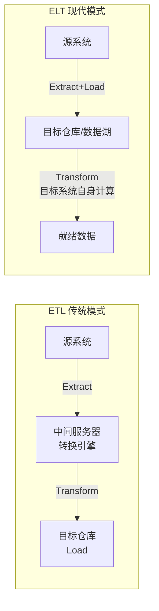
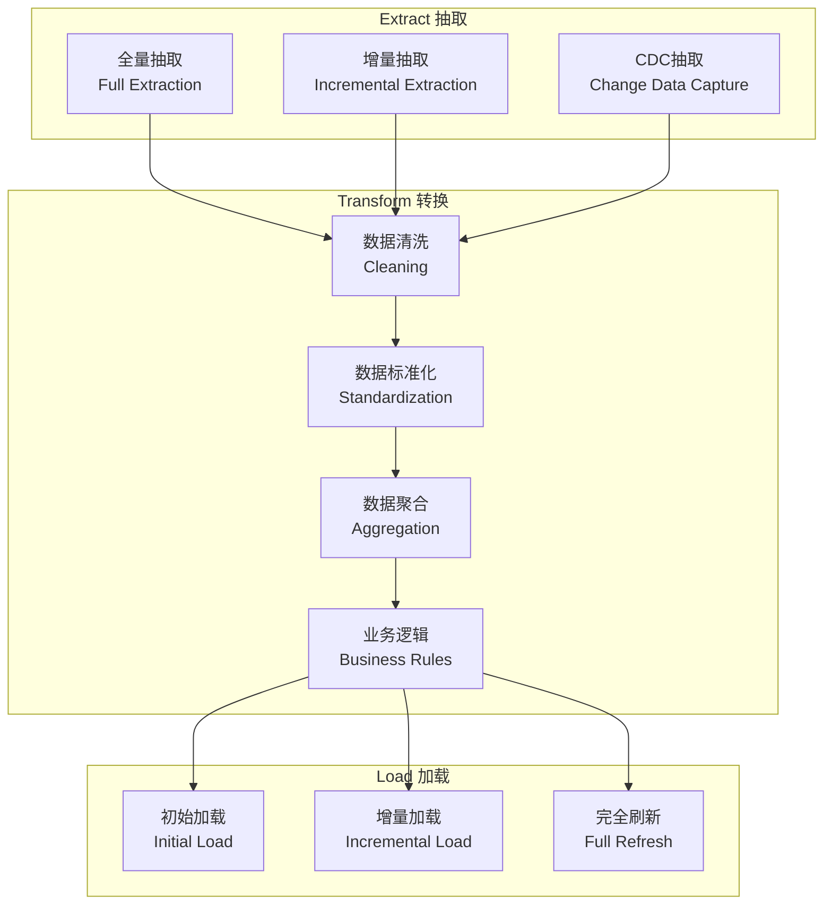
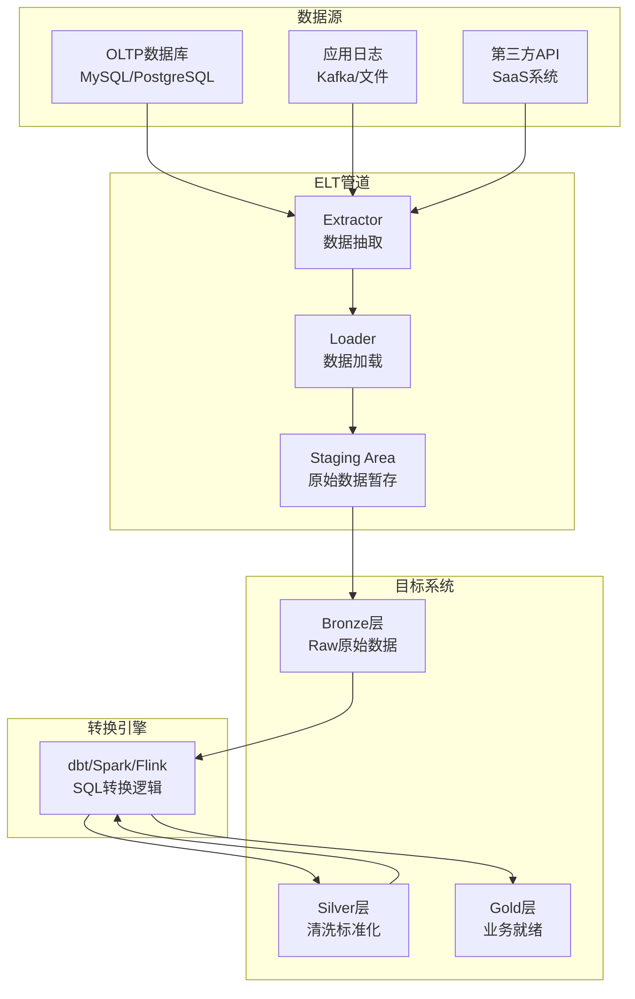
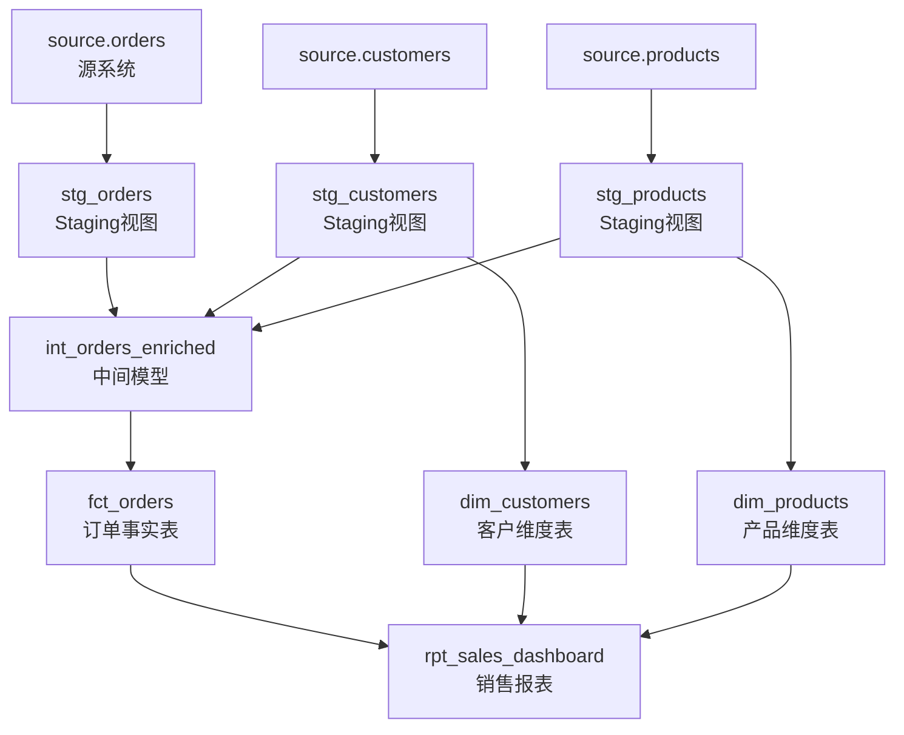
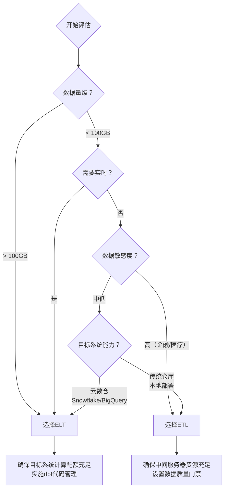
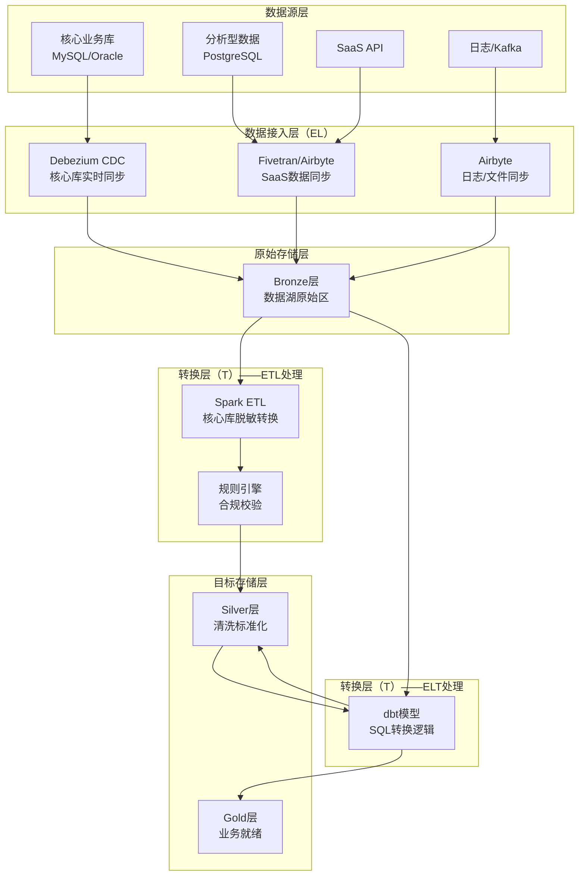
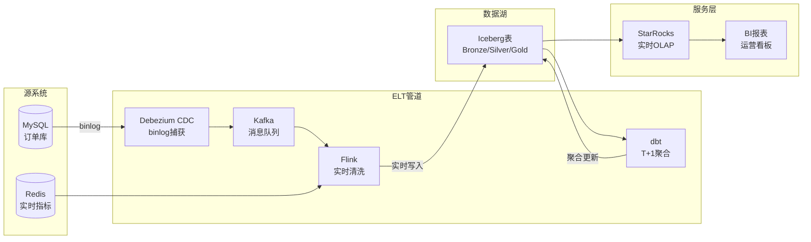
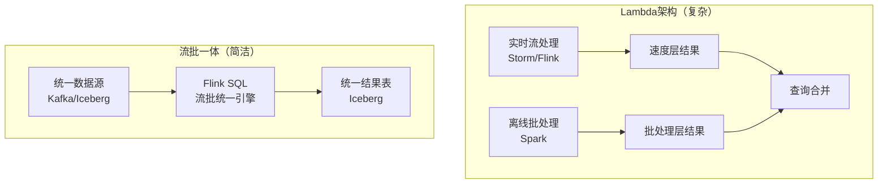
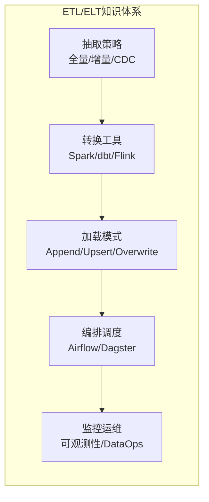

## ETL/ELT：数据流转的核心范式

### 1. 概述与背景

#### 1.1 什么是ETL与ELT

ETL（Extract-Transform-Load）和ELT（Extract-Load-Transform）是数据集成领域的两大核心范式，它们定义了数据从源系统流向目标系统的路径和处理顺序。两者的核心区别在于**转换（Transform）步骤发生的位置**——是在数据到达目标之前还是之后。

**ETL** 是传统的数据集成模式：数据从源系统抽取（Extract）后，在独立的中间服务器上进行清洗、转换（Transform），最后加载（Load）到目标数据仓库或数据湖。这个过程中，中间服务器承担了全部的计算负载。

**ELT** 是现代数据集成模式：数据从源系统抽取后，直接加载（Load）到目标系统（通常是云数据仓库或数据湖），然后利用目标系统自身的计算能力进行转换（Transform）。这种模式消除了独立的中间计算层。



#### 1.2 ETL/ELT在数据架构中的位置

在现代数据架构中，ETL/ELT是连接数据源和数据消费者的关键桥梁。根据章节概览中的数据湖五层架构，ETL/ELT主要作用于**数据摄取层**到**存储层**之间，同时覆盖从存储层到服务层的数据加工过程：

| 架构层级 | ETL/ELT的作用 | 典型场景 |
|---------|-------------|---------|
| 数据源 → 原始区(Bronze) | Extract + Load（纯抽取加载） | CDC同步、批量导入 |
| 原始区 → 清洗区(Silver) | Transform（转换清洗） | 数据去重、Schema标准化 |
| 清洗区 → 聚合区(Gold) | Transform（建模聚合） | 维度建模、指标计算 |
| 聚合区 → 服务层 | Load（发布加载） | 物化视图、OLAP Cube |

#### 1.3 ETL到ELT的演进驱动力

ETL到ELT的转变不是技术潮流，而是底层基础设施变化的必然结果：

| 驱动因素 | ETL时代（2000-2015） | ELT时代（2015至今） |
|---------|-------------------|-------------------|
| 计算资源 | 中间服务器资源有限、昂贵 | 云数仓弹性扩展、按量付费 |
| 存储成本 | 存储昂贵，需压缩后加载 | 对象存储极廉价（$0.023/GB/月） |
| 数据规模 | GB-TB级 | TB-PB级，中间服务器无法承载 |
| 数据多样性 | 结构化为主 | 半结构化/非结构化大量涌入 |
| 实时需求 | 批处理为主，T+1可接受 | 秒级/分钟级延迟要求 |

**核心洞察**：当目标系统的计算能力（Snowflake、BigQuery、Databricks）远超中间ETL服务器时，在中间服务器做转换就成了"用小水管处理大水流"——瓶颈不可避免。ELT的本质是**将计算下沉到数据所在地**，避免数据搬家。

#### 1.4 关键术语定义

| 术语 | 定义 | 补充说明 |
|------|------|---------|
| Extract（抽取） | 从源系统读取数据 | 支持全量抽取和增量抽取 |
| Transform（转换） | 对数据进行清洗、聚合、计算 | ETL中在中间层，ELT中在目标层 |
| Load（加载） | 将数据写入目标系统 | 支持Append、Upsert、Overwrite等模式 |
| Staging Area（暂存区） | ETL模式中的中间数据存放区 | ELT中通常不需要 |
| Orchestration（编排） | 调度和管理多个ETL/ELT任务 | Airflow、Dagster、Prefect等 |
| Incremental Load（增量加载） | 仅处理上次以来变化的数据 | CDC、时间戳、水位线等方式 |

---

### 2. ETL架构深度解析

#### 2.1 ETL的三阶段模型

ETL将数据处理分为三个明确的阶段，每个阶段有独立的技术要求和优化策略：



#### 2.2 抽取（Extract）策略详解

抽取是ETL/ELT的第一步，也是最容易被低估的环节。抽取策略的选择直接影响数据时效性和系统负载。

**全量抽取 vs 增量抽取：**

| 特性 | 全量抽取（Full） | 增量抽取（Incremental） |
|------|-----------------|----------------------|
| 原理 | 每次读取源表全部数据 | 仅读取上次以来变化的数据 |
| 数据量 | 大（每次都是全表） | 小（仅变化部分） |
| 源系统压力 | 高（全表扫描） | 低（条件查询） |
| 实现复杂度 | 低（简单SELECT） | 中（需要识别变化机制） |
| 数据完整性 | 高（无遗漏风险） | 中（需要保证不丢变更） |
| 适用场景 | 小表（<100万行）、维度表 | 大事实表、频繁更新的表 |
| 典型SQL | `SELECT * FROM orders` | `SELECT * FROM orders WHERE updated_at > :last_run` |

**增量识别的五种机制：**

1. **时间戳法**：基于`updated_at`字段筛选变更记录
   ```sql
   -- 时间戳增量抽取
   SELECT * FROM orders
   WHERE updated_at > @last_extraction_time
     AND updated_at <= @current_time;
   ```
   优点：实现简单，几乎所有表都有时间戳字段。
   缺点：无法捕获删除操作；依赖源表时间戳字段的准确性；并发更新可能导致时间戳相同但数据已变。

2. **自增ID法**：基于自增主键筛选
   ```sql
   SELECT * FROM orders
   WHERE order_id > @last_max_id;
   ```
   优点：严格有序，不会遗漏。缺点：仅适用于自增主键，无法感知更新。

3. **binlog/WAL法**：读取数据库事务日志（MySQL binlog、PostgreSQL WAL）
   ```bash
   # Debezium读取MySQL binlog
   debezium-connector-mysql \
     --database.server.id=184054 \
     --database.server.name=ecommerce \
     --database.include.list=orders
   ```
   优点：低延迟（毫秒级）、完整捕获（增删改）。缺点：需要DBA权限、解析复杂度高。

4. **快照对比法**：对比两次全量快照的差异
   ```python
   # 使用MD5哈希检测变更
   import hashlib
   def compute_row_hash(row):
       return hashlib.md5(str(sorted(row.items())).encode()).hexdigest()
   ```
   优点：能捕获所有变更。缺点：每次需要全量读取，计算成本高。

5. **触发器法**：在源数据库创建触发器记录变更
   ```sql
   -- MySQL变更记录触发器
   CREATE TRIGGER orders_audit
   AFTER UPDATE ON orders
   FOR EACH ROW
   BEGIN
       INSERT INTO orders_changelog(order_id, operation, changed_at)
       VALUES (NEW.order_id, 'UPDATE', NOW());
   END;
   ```
   优点：完整准确。缺点：对源系统性能有影响、维护成本高。

#### 2.3 转换（Transform）策略详解

转换是ETL中最复杂的环节，涉及数据清洗、标准化、聚合和业务规则应用。

**转换操作分类：**

| 转换类型 | 操作描述 | 示例 |
|---------|---------|------|
| 数据清洗 | 处理缺失值、异常值、重复值 | `fillna(0)`, `drop_duplicates()` |
| 格式标准化 | 统一日期、货币、编码格式 | `date_format('yyyy-MM-dd')` |
| 类型转换 | 字符串转日期、数值精度调整 | `CAST(amount AS DECIMAL(18,2))` |
| 字段映射 | 源字段到目标字段的映射 | `source_name AS target_name` |
| 数据合并 | 多表关联形成宽表 | `JOIN dimensions` |
| 聚合计算 | 按维度聚合生成汇总指标 | `SUM(amount) GROUP BY category` |
| 业务规则 | 应用特定业务逻辑 | `CASE WHEN status='VIP' THEN discount*0.8` |

**ETL转换代码示例（使用Apache Spark）：**

```python
from pyspark.sql import SparkSession
from pyspark.sql import functions as F
from pyspark.sql.window import Window

spark = SparkSession.builder \
    .appName("ETL_Orders_Transform") \
    .config("spark.sql.warehouse.dir", "/mnt/warehouse") \
    .getOrCreate()

# ========== Extract：从MySQL抽取增量数据 ==========
source_df = spark.read.format("jdbc") \
    .option("url", "jdbc:mysql://source:3306/ecommerce") \
    .option("dbtable", "(SELECT * FROM orders WHERE updated_at > '2024-01-01') AS incremental") \
    .option("user", "reader") \
    .option("password", "xxx") \
    .load()

# ========== Transform：多步骤数据转换 ==========

# Step 1: 数据清洗
cleaned_df = source_df \
    .filter(F.col("order_id").isNotNull()) \
    .filter(F.col("order_amount") > 0) \
    .dropDuplicates(["order_id"]) \
    .withColumn("customer_name", F.trim(F.col("customer_name"))) \
    .withColumn("order_date", F.to_date("order_date", "yyyy-MM-dd"))

# Step 2: 类型标准化
standardized_df = cleaned_df \
    .withColumn("amount_cny", F.col("order_amount").cast("decimal(18,2)")) \
    .withColumn("order_status", F.upper(F.col("status"))) \
    .withColumn("region", F.when(F.col("province").isin("北京","天津","河北","山东","山西","内蒙古"), "华北")
                           .when(F.col("province").isin("上海","江苏","浙江","安徽","福建","江西"), "华东")
                           .otherwise("其他"))

# Step 3: 业务规则应用
business_df = standardized_df \
    .withColumn("discount_rate", 
                F.when(F.col("customer_level") == "VIP", 0.8)
                 .when(F.col("customer_level") == "Gold", 0.9)
                 .otherwise(1.0)) \
    .withColumn("final_amount", F.col("amount_cny") * F.col("discount_rate")) \
    .withColumn("is_high_value", F.col("final_amount") > 1000)

# Step 4: 维度关联（加载维度表）
dim_customer = spark.read.format("delta").load("/mnt/warehouse/dim_customer")
enriched_df = business_df.join(
    F.broadcast(dim_customer),  # 小表广播，避免shuffle
    on="customer_id",
    how="left"
).withColumn("customer_segment",
             F.coalesce(F.col("segment"), F.lit("Unknown")))

# ========== Load：写入目标数据仓库 ==========
enriched_df.write \
    .format("delta") \
    .mode("overwrite") \
    .option("overwriteSchema", "true") \
    .partitionBy("order_date") \
    .save("/mnt/warehouse/fact_orders")

print(f"Processed {enriched_df.count()} records")
```

#### 2.4 加载（Load）策略详解

加载策略决定了数据如何写入目标系统，直接影响数据一致性和查询性能。

| 加载模式 | 原理 | 适用场景 | 注意事项 |
|---------|------|---------|---------|
| Append | 追加新数据，不修改已有数据 | 日志型数据、事实表 | 需要幂等保证，避免重复 |
| Upsert/Merge | 存在则更新，不存在则插入 | 维度表、SCD处理 | 需要主键/唯一键 |
| Overwrite | 完全覆盖目标表 | 全量刷新、维度重建 | 短暂不可用窗口 |
| Partition Swap | 新分区写完后原子切换 | 大表按时间分区 | 需要表格式支持 |

**Upsert/Merge SQL示例：**

```sql
-- Delta Lake MERGE INTO
MERGE INTO target_orders t
USING source_orders s
ON t.order_id = s.order_id
WHEN MATCHED AND s.updated_at > t.updated_at THEN
    UPDATE SET 
        t.order_amount = s.order_amount,
        t.status = s.status,
        t.updated_at = s.updated_at
WHEN NOT MATCHED THEN
    INSERT (order_id, customer_id, order_amount, status, order_date, updated_at)
    VALUES (s.order_id, s.customer_id, s.order_amount, s.status, s.order_date, s.updated_at);
```

#### 2.5 ETL架构的优缺点

**优势：**
- **数据质量控制严格**：在加载前完成所有转换，目标系统中的数据始终是"就绪"状态
- **目标系统压力小**：转换计算在中间服务器完成，目标系统只做存储和查询
- **安全性高**：原始数据不会直接暴露给目标系统，敏感信息在转换过程中脱敏
- **符合传统IT治理**：数据在进入仓库前已经过审核，满足审计要求

**劣势：**
- **中间服务器瓶颈**：当数据量达到TB级时，中间服务器的CPU和内存成为瓶颈
- **延迟高**：数据需要经历抽取→传输→转换→加载的完整链路，端到端延迟通常在小时级
- **维护成本高**：中间服务器需要独立部署、运维、监控，增加基础设施复杂度
- **Schema耦合**：转换逻辑依赖源表Schema，源表结构变更可能导致ETL管道崩溃
- **无法处理半结构化数据**：JSON、XML等非结构化数据在ETL中间层难以高效处理

---

### 3. ELT架构深度解析

#### 3.1 ELT的架构模型

ELT的核心思想是**将转换下沉到目标系统**，利用云数仓或数据湖的弹性计算能力完成数据加工。



#### 3.2 ELT各阶段技术选型

**Extract + Load阶段工具对比：**

| 工具 | 类型 | 支持数据源 | 增量能力 | 适用场景 |
|------|------|-----------|---------|---------|
| Airbyte | 开源EL | 300+连接器 | CDC+时间戳 | 通用数据集成 |
| Fivetran | 商业EL | 500+连接器 | 自动CDC | 企业级SaaS数据同步 |
| Stitch | 商业EL | 130+连接器 | 增量日志 | 中小规模数据同步 |
| Debezium | 开源CDC | 10+数据库 | binlog/WAL | 实时数据库同步 |
| Singer | 开源框架 | 社区连接器 | 自定义Taps | 灵活定制场景 |
| Airflow + 自定义 | 编排+自定义 | 任意 | 自定义 | 复杂异构场景 |

**Transform阶段工具对比：**

| 工具 | 核心能力 | 适用目标系统 | 优势 | 局限 |
|------|---------|-------------|------|------|
| dbt | SQL转换+版本控制+测试 | Snowflake/BigQuery/DuckDB | 开发体验好、文档自动生成 | 仅SQL，复杂逻辑需Python |
| Spark SQL | 大规模SQL+DataFrame | 数据湖/Hive | 生态成熟、性能优秀 | 开发效率低于dbt |
| Flink SQL | 流式SQL+实时转换 | 实时数据湖 | 亚秒级延迟 | 流批统一复杂度高 |
| SQLMesh | 增量SQL+环境隔离 | 多种数仓 | 增量策略灵活 | 社区较小 |

#### 3.3 ELT的Staging层设计

Staging层是ELT中的"原始数据缓冲区"，它的作用是：
1. **解耦源系统与目标系统**：源系统变更不会直接影响目标表
2. **保留原始数据**：作为审计和回溯的基础
3. **支持增量合并**：新数据先写入Staging，再通过MERGE合并到目标表

```sql
-- Staging层设计示例：订单数据
-- 1. 创建Staging表（结构与源系统完全一致）
CREATE TABLE stg_orders (
    order_id        BIGINT,
    customer_id     BIGINT,
    order_amount    DECIMAL(18,2),
    order_date      VARCHAR(10),
    status          VARCHAR(20),
    created_at      VARCHAR(30),
    updated_at      VARCHAR(30),
    _extracted_at   TIMESTAMP DEFAULT CURRENT_TIMESTAMP  -- 记录抽取时间
);

-- 2. 加载到Staging（Truncate + Load）
TRUNCATE TABLE stg_orders;
INSERT INTO stg_orders
SELECT * FROM external_source.orders
WHERE updated_at > @last_extraction_time;

-- 3. 从Staging合并到目标表
MERGE INTO dim_orders t
USING (
    SELECT 
        order_id,
        customer_id,
        order_amount,
        TO_DATE(order_date, 'yyyy-MM-dd') AS order_date,
        UPPER(status) AS order_status,
        _extracted_at
    FROM stg_orders
) s
ON t.order_id = s.order_id
WHEN MATCHED THEN UPDATE SET
    t.customer_id = s.customer_id,
    t.order_amount = s.order_amount,
    t.order_status = s.order_status,
    t.updated_at = s._extracted_at
WHEN NOT MATCHED THEN INSERT VALUES
    (s.order_id, s.customer_id, s.order_amount, s.order_date, s.order_status, s._extracted_at);
```

#### 3.4 dbt：ELT中的转换层标准工具

dbt（data build tool）已成为ELT转换层的事实标准。它将软件工程的最佳实践引入数据转换：版本控制、测试、文档、依赖管理。

**dbt项目结构：**

my_dbt_project/
├── dbt_project.yml          # 项目配置
├── models/
│   ├── staging/
│   │   ├── _staging.yml     # Staging模型文档+测试
│   │   ├── stg_orders.sql   # Staging模型：订单
│   │   └── stg_customers.sql # Staging模型：客户
│   ├── marts/
│   │   ├── _marts.yml       # Mart模型文档+测试
│   │   ├── fct_orders.sql   # 事实表：订单
│   │   └── dim_customers.sql # 维度表：客户
│   └── intermediate/
│       └── int_orders_enriched.sql # 中间模型
├── tests/
│   └── assert_positive_order_amount.sql # 自定义测试
├── macros/
│   └── generate_schema_name.sql # 自定义宏
└── snapshots/
    └── scd_customers.sql    # SCD Type 2快照

**dbt模型定义示例：**

```sql
-- models/staging/stg_orders.sql
-- 订单Staging模型：清洗源系统原始数据
with source as (
    select * from {{ source('ecommerce', 'orders') }}
),

renamed as (
    select
        order_id,
        customer_id,
        amount as order_amount,
        cast(order_date as date) as order_date,
        upper(status) as order_status,
        created_at,
        updated_at
    from source
    where order_id is not null
      and amount > 0
)

select * from renamed
```

```sql
-- models/marts/fct_orders.sql
-- 订单事实表：聚合业务逻辑
with orders as (
    select * from {{ ref('stg_orders') }}
),

customers as (
    select * from {{ ref('dim_customers') }}
),

enriched_orders as (
    select
        o.order_id,
        o.customer_id,
        c.customer_name,
        c.customer_segment,
        o.order_amount,
        o.order_date,
        o.order_status,
        o.order_date - c.first_order_date as days_since_first_order,
        row_number() over (
            partition by o.customer_id 
            order by o.order_date
        ) as order_sequence_number
    from orders o
    left join customers c on o.customer_id = c.customer_id
)

select * from enriched_orders
```

**dbt配置文件示例：**

```yaml
# dbt_project.yml
name: 'my_data_warehouse'
version: '1.0.0'
config-version: 2

profile: 'production'

model-paths: ["models"]
test-paths: ["tests"]
macro-paths: ["macros"]

models:
  my_data_warehouse:
    +materialized: view        # 默认视图
    staging:
      +materialized: view      # Staging层用视图（轻量）
    marts:
      +materialized: table     # Mart层用表（性能）
      +persist_docs:
        relation: true         # 自动生成文档
        columns: true
```

```yaml
# models/staging/_staging.yml
version: 2

models:
  - name: stg_orders
    description: "订单Staging模型，从源系统ecommerce.orders抽取并清洗"
    columns:
      - name: order_id
        description: "订单唯一标识"
        data_tests:
          - unique
          - not_null
      - name: customer_id
        description: "客户ID，关联dim_customers"
        data_tests:
          - not_null
      - name: order_amount
        description: "订单金额（元）"
        data_tests:
          - not_null
          - dbt_utils.accepted_range:
              min_value: 0.01
              max_value: 1000000

sources:
  - name: ecommerce
    description: "电商业务数据库"
    database: ecommerce_prod
    schema: public
    tables:
      - name: orders
        loaded_at_field: updated_at
        freshness:
          warn_after: {count: 6, period: hour}
          error_after: {count: 12, period: hour}
```

**dbt数据血缘可视化（Mermaid）：**



#### 3.5 ELT的优缺点

**优势：**
- **弹性扩展**：利用目标系统的弹性计算资源，无需独立中间服务器
- **低延迟**：数据直接加载到目标系统，转换在本地执行，端到端延迟从小时级降到分钟级
- **处理半结构化数据**：云数仓和数据湖原生支持JSON、Parquet等格式
- **数据可审计**：原始数据保留在目标系统中，支持时间旅行回溯
- **开发效率高**：dbt等工具提供了SQL-first的开发体验，版本控制和测试自动化

**劣势：**
- **目标系统负载高**：转换计算占用目标系统的计算资源，可能影响查询性能
- **原始数据暴露**：原始数据直接加载到目标系统，需要额外的安全管控
- **治理复杂度**：所有转换逻辑集中在目标系统，需要更严格的代码管理和测试
- **成本敏感**：云数仓按计算量计费，大规模转换可能产生高额账单

---

### 4. ETL vs ELT：全面对比与选型决策

#### 4.1 核心差异对比

| 维度 | ETL | ELT |
|------|-----|-----|
| 转换位置 | 中间服务器 | 目标系统 |
| 数据流向 | 源 → 中间层 → 目标 | 源 → 目标（目标内转换） |
| 中间存储 | 需要Staging Area | 不需要（或仅短暂Staging） |
| 计算资源 | 独立中间服务器 | 目标系统自身 |
| 适用数据量 | GB-TB级 | TB-PB级 |
| 延迟 | 小时级（批处理） | 分钟级-秒级 |
| 目标系统要求 | 低（只需存储） | 高（需要强计算能力） |
| 原始数据保留 | 通常不保留 | 完整保留（Bronze层） |
| 半结构化支持 | 差（需要预解析） | 好（原生支持） |
| 工具代表 | Informatica, SSIS, Talend | dbt, Fivetran, Airbyte |
| 开发复杂度 | 中高（需维护中间服务器） | 中低（SQL为主） |
| 运维复杂度 | 高（独立基础设施） | 低（利用现有目标系统） |

#### 4.2 选型决策框架



**场景化选型指南：**

| 场景 | 推荐方案 | 理由 |
|------|---------|------|
| 金融合规数据（银行核心系统） | ETL | 监管要求数据在加载前经过审计，中间层可做合规校验 |
| 电商实时数仓 | ELT | 数据量大（TB级/天）、需要近实时（分钟级）、Snowflake弹性扩展 |
| 传统企业数据仓库迁移 | 混合（ETL+ELT） | 存量ETL任务保留，新增场景用ELT |
| IoT传感器数据湖 | ELT | 数据量巨大（PB级）、半结构化为主、数据湖天然适配 |
| 医疗数据集成 | ETL | 数据敏感、需要脱敏处理、合规要求严格 |
| SaaS产品数据分析 | ELT | Fivetran/Airbyte连接器丰富、Snowflake按量付费 |
| 小型创业公司 | ELT | 资源有限、不想维护中间服务器、DuckDB/BigQuery足够 |

#### 4.3 混合架构：现代数据平台的最佳实践

在实际的企业数据平台中，纯ETL或纯ELT都很少见。最常见的架构是**混合模式**：



**混合架构的设计原则：**

1. **敏感数据走ETL**：核心业务库的数据先经过脱敏、加密、合规校验，再加载到数据湖
2. **非敏感数据走ELT**：SaaS数据、日志数据直接加载，利用目标系统计算能力转换
3. **统一元数据管理**：无论走哪条路径，数据血缘、Schema、质量指标都在统一目录中管理
4. **统一调度编排**：Airflow/Dagster统一管理ETL和ELT任务，确保依赖关系正确

---

### 5. 数据管道编排与调度

#### 5.1 编排工具对比

无论选择ETL还是ELT，都需要可靠的编排工具来调度和监控数据管道：

| 工具 | 类型 | 核心特性 | 适用规模 | 学习曲线 |
|------|------|---------|---------|---------|
| Apache Airflow | 开源 | DAG编排、丰富的Operator、社区成熟 | 中-大型 | 中 |
| Dagster | 开源 | 软件工程导向、资产概念、类型系统 | 中-大型 | 中 |
| Prefect | 开源 | 动态工作流、事件驱动 | 中型 | 低 |
| Mage | 开源 | 可视化+代码、现代化UI | 小-中型 | 低 |
| dbt Cloud | 商业 | SQL编排+调度、内置CI/CD | 中型 | 低 |
| AWS Step Functions | 商业 | Serverless编排、AWS生态深度集成 | 任意 | 中 |
| Azure Data Factory | 商业 | 低代码、Azure生态 | 中-大型 | 低 |

#### 5.2 Airflow DAG示例

```python
from airflow import DAG
from airflow.operators.python import PythonOperator
from airflow.providers.amazon.aws.transfers.s3_to_redshift import S3ToRedshiftOperator
from airflow.providers.amazon.aws.sensors.s3 import S3KeySensor
from airflow.operators.bash import BashOperator
from airflow.utils.dates import days_ago

default_args = {
    'owner': 'data-engineering',
    'depends_on_past': False,
    'email': ['data-alerts@company.com'],
    'email_on_failure': True,
    'retries': 2,
    'retry_delay': timedelta(minutes=5),
}

with DAG(
    dag_id='orders_etl_pipeline',
    default_args=default_args,
    description='订单数据ETL管道：MySQL → S3 → Redshift',
    schedule_interval='0 2 * * *',  # 每天凌晨2点
    start_date=days_ago(1),
    catchup=False,
    tags=['etl', 'orders', 'production'],
) as dag:

    # Task 1: 等待源数据就绪
    wait_for_source = S3KeySensor(
        task_id='wait_for_source_data',
        bucket_name='raw-data',
        bucket_key='orders/{{ ds }}/orders_{{ ds }}.parquet',
        timeout=3600,
        poke_interval=60,
    )

    # Task 2: 数据质量检查
    def validate_data(**context):
        import great_expectations as gx
        # 加载并验证数据质量
        df = context['ti'].xcom_pull(task_ids='extract')
        # ... 质量检查逻辑
        return {'valid': True, 'record_count': len(df)}

    validate = PythonOperator(
        task_id='data_quality_check',
        python_callable=validate_data,
    )

    # Task 3: 数据转换
    def transform_orders(**context):
        from pyspark.sql import SparkSession
        # ... 转换逻辑
        pass

    transform = PythonOperator(
        task_id='transform_orders',
        python_callable=transform_orders,
    )

    # Task 4: 加载到Redshift
    load_to_redshift = S3ToRedshiftOperator(
        task_id='load_to_redshift',
        schema='analytics',
        table='fact_orders',
        s3_bucket='transformed-data',
        s3_key='orders/{{ ds }}/',
        copy_options=['FORMAT AS PARQUET'],
    )

    # Task 5: 通知下游
    notify_downstream = BashOperator(
        task_id='notify_downstream',
        bash_command='curl -X POST https://hooks.slack.com/services/xxx -d \'{"text": "Orders ETL completed for {{ ds }}"}\'',
    )

    # 任务依赖
    wait_for_source >> validate >> transform >> load_to_redshift >> notify_downstream
```

#### 5.3 管道可观测性

数据管道的可观测性是生产环境的生命线。关键监控维度包括：

| 监控维度 | 指标 | 告警阈值 | 工具 |
|---------|------|---------|------|
| 数据新鲜度 | 最后更新时间 | 超过SLA 30分钟 | Monte Carlo、dbt |
| 数据质量 | 空值率、重复率、范围异常 | 超过基线20% | Great Expectations、Deequ |
| 管道健康 | 任务成功率、平均耗时 | 失败率>5% | Airflow UI、Datadog |
| 资源消耗 | CPU、内存、网络IO | 超过配额80% | Prometheus、CloudWatch |
| 成本 | 每日/每表ETL成本 | 超过预算30% | 云厂商Cost Explorer |

---

### 6. 实际应用场景

#### 6.1 场景一：电商实时数仓（ELT架构）

**背景**：某电商平台日均订单量500万，需要构建实时数仓支持运营决策。

**架构设计：**



**关键实现：**
- 实时路径：Debezium → Kafka → Flink → Iceberg（延迟<30秒）
- 批量路径：dbt每日聚合Gold层数据（T+1，支持历史趋势）
- 查询层：StarRocks实时OLAP，支持亚秒级聚合查询

#### 6.2 场景二：传统银行数据仓库迁移（混合架构）

**背景**：某银行从传统Teradata数据仓库迁移到Snowflake，存量500+个ETL任务。

**迁移策略：**

| 阶段 | 策略 | 工具 | 目标 |
|------|------|------|------|
| Phase 1（1-3月） | Lift & Shift | 保留原ETL，Snowflake作为存储层 | 验证Snowflake性能 |
| Phase 2（4-8月） | 渐进迁移 | 新任务用dbt，老任务逐步改造 | 新旧并行运行 |
| Phase 3（9-12月） | 全面ELT | 500个任务全部迁移至dbt | 完全脱离Teradata |

**关键风险与应对：**

| 风险 | 影响 | 应对策略 |
|------|------|---------|
| 数据不一致 | 新旧系统数据对账不平 | 每日自动化对账脚本，差异>0.01%告警 |
| 性能回退 | 部分复杂查询在Snowflake更慢 | 查询优化、物化视图、结果缓存 |
| 人员转型 | ETL开发人员不熟悉dbt | 2周集中培训+Pair Programming |
| 成本失控 | Snowflake计算费用超预算 | 设置Warehouse自动挂起、资源监控告警 |

#### 6.3 场景三：IoT数据湖（ELT架构）

**背景**：某制造企业需要处理10万台设备的传感器数据，每台设备每秒产生100条记录。

**数据量估算：**
- 每秒：1000万条记录
- 每天：约8640亿条记录
- 每天数据量：约50TB（JSON格式）

**ELT管道设计：**

```python
# Flink实时清洗 + Iceberg入湖
# 传感器数据ELT核心逻辑

# 1. Source：Kafka消费传感器数据
sensor_stream = env.add_source(
    KafkaSource.<String>builder()
        .set_bootstrap_servers("kafka:9092")
        .set_topic("sensor-data")
        .set_value_only_deserializer(new SimpleStringSchema())
        .build()
)

# 2. Transform（ELT中的T - 在Flink中执行）
cleaned_stream = sensor_stream \
    .map(parse_sensor_json) \
    .filter(lambda reading: reading['value'] is not None) \
    .filter(lambda reading: reading['value'] > -50 and reading['value'] < 200) \
    .key_by(lambda reading: reading['device_id']) \
    .process(SensorAnomalyDetector())  # 实时异常检测

# 3. Load：写入Iceberg Bronze层
cleaned_stream.add_sink(
    IcebergSink.<SensorReading>builder()
        .set_table("iot.sensor_readings_bronze")
        .set_iceberg_streaming_write(true)
        .build()
)

# 4. dbt后续转换（ELT中的T - 批量聚合）
# models/marts/fct_device_hourly.sql
"""
WITH bronze_data AS (
    SELECT * FROM iot.sensor_readings_bronze
    WHERE event_time >= date_add(current_date, -1)
)
SELECT
    device_id,
    date_trunc('hour', event_time) AS event_hour,
    AVG(value) AS avg_value,
    MAX(value) AS max_value,
    MIN(value) AS min_value,
    COUNT(*) AS reading_count,
    SUM(CASE WHEN is_anomaly THEN 1 ELSE 0 END) AS anomaly_count
FROM bronze_data
GROUP BY device_id, date_trunc('hour', event_time)
"""
```

---

### 7. ETL/ELT性能优化

#### 7.1 抽取优化

| 优化策略 | 原理 | 效果 | 适用场景 |
|---------|------|------|---------|
| 并行抽取 | 多线程/分区并行读取 | 抽取时间缩短N倍 | 大表全量抽取 |
| 压缩传输 | 使用zstd/snappy压缩网络传输 | 网络带宽减少60-80% | 跨区域数据同步 |
| 过滤下推 | 在源端过滤不需要的数据 | 减少传输数据量 | 只需部分列/行 |
| 增量合并 | 小批量增量替代全量 | 处理时间从小时级降到分钟级 | 高频更新的表 |

#### 7.2 转换优化

| 优化策略 | 原理 | 效果 |
|---------|------|------|
| 广播小表 | 维度表广播避免Shuffle | JOIN性能提升5-10倍 |
| 分区裁剪 | 只读取需要的分区 | I/O减少90%+ |
| 列式裁剪 | 只读取需要的列 | I/O减少50-80% |
| 物化中间结果 | 避免重复计算 | 复杂管道执行时间减半 |
| 增量转换 | 仅处理变化的数据 | 处理量减少80-95% |
| 并行度调优 | 合理设置Task数量 | 充分利用集群资源 |

**Spark ETL优化配置示例：**

```python
# Spark ETL性能优化配置
spark = SparkSession.builder \
    .appName("ETL_Optimized") \
    .config("spark.sql.shuffle.partitions", "200") \         # Shuffle分区数
    .config("spark.sql.adaptive.enabled", "true") \          # AQE自适应查询
    .config("spark.sql.adaptive.coalescePartitions.enabled", "true") \
    .config("spark.sql.broadcastTimeout", "600") \           # 广播超时
    .config("spark.serializer", "org.apache.spark.serializer.KryoSerializer") \
    .config("spark.sql.parquet.compression.codec", "zstd") \ # Parquet压缩
    .getOrCreate()
```

#### 7.3 加载优化

| 优化策略 | 原理 | 效果 |
|---------|------|------|
| 分区写入 | 按时间/业务维度分区 | 查询性能提升10-100倍 |
| 文件大小调优 | 单文件128MB-1GB | 避免小文件问题 |
| 压缩格式 | 使用Parquet+Zstd | 存储减少70%、查询提速 |
| 原子写入 | MERGE/INSERT OVERWRITE | 保证数据一致性 |
| 索引维护 | 自动更新统计信息 | 查询优化器选择更优执行计划 |

---

### 8. 常见误区与纠正

#### 误区一：所有数据都应该用ELT

**错误认知**：ELT是现代方案，应该全面替代ETL。

**正确认知**：对于数据敏感场景（金融、医疗），ETL在中间层做脱敏和合规校验是必要的。ELT虽然灵活，但原始数据直接暴露在目标系统中，增加了数据泄露风险。

#### 误区二：dbt可以替代所有ETL工具

**错误认知**：有了dbt就不需要其他ETL工具了。

**正确认知**：dbt专注于SQL转换（Transform），不处理Extract和Load。完整的ELT管道还需要Fivetran/Airbyte（EL）和Airflow（编排）。dbt解决的是T的问题，不是完整的ETL/ELT。

#### 误区三：增量加载总是优于全量加载

**错误认知**：增量加载数据量小，一定比全量快。

**正确认知**：增量加载虽然数据量小，但引入了复杂度（增量识别、断点续传、幂等保证）。对于小表（<100万行），全量加载反而更简单可靠。增量加载适合大表且更新频繁的场景。

#### 误区四：ETL/ELT管道不需要测试

**错误认知**：数据管道是"跑一次就行"的任务。

**正确认知**：数据管道是生产代码，需要：
- **单元测试**：测试转换函数的逻辑正确性
- **集成测试**：测试端到端管道的数据流
- **数据质量测试**：测试输出数据是否符合业务规则
- **回归测试**：管道修改后确保不破坏现有逻辑

```python
# dbt内置测试示例（models/marts/_marts.yml）
models:
  - name: fct_orders
    tests:
      - dbt_utils.unique_combination_of_columns:
          combination_of_columns:
            - order_id
            - order_date
    columns:
      - name: order_amount
        tests:
          - not_null
          - dbt_utils.accepted_range:
              min_value: 0
              max_value: 10000000
```

#### 误区五：忽略管道的幂等性

**错误认知**：管道跑成功就行了，重复执行也没关系。

**正确认知**：管道失败重试是常态，不幂等的管道会导致数据重复。**每一次数据写入都必须是幂等的**——重复执行不会产生重复数据。使用MERGE（Upsert）替代纯INSERT，使用分区覆盖替代追加写入。

---

### 9. 进阶：现代数据集成趋势

#### 9.1 流批一体（Streaming + Batch Unification）

传统的ETL/ELT将流处理和批处理分开设计，现代架构趋向**流批一体**：

| 模式 | 架构 | 延迟 | 复杂度 |
|------|------|------|-------|
| Lambda架构 | 速度层（流）+ 批处理层 | 分钟-小时 | 高（两套逻辑） |
| Kappa架构 | 统一流处理 | 秒-分钟 | 中（一套逻辑） |
| 流批一体 | Flink SQL统一 | 秒-小时 | 低（一套引擎） |



#### 9.2 DataOps与数据可观测性

DataOps将DevOps理念引入数据工程，强调：
- **持续集成/持续部署（CI/CD）**：dbt模型的自动化测试和部署
- **数据可观测性**：数据管道的全链路监控，包括数据质量、新鲜度、血缘
- **数据版本控制**：Schema变更、转换逻辑变更的版本管理

#### 9.3 Lakehouse对ETL/ELT的影响

Lakehouse架构（Delta Lake/Iceberg/Hudi）正在模糊ETL和ELT的边界：

- **统一存储**：一份数据同时支持ETL（批处理）和ELT（交互式查询）
- **ACID事务**：确保ETL/ELT操作的原子性和一致性
- **Schema演化**：支持源系统Schema变更而不中断管道
- **时间旅行**：支持数据回溯和审计，满足ETL的合规需求

---

### 10. 本节小结

ETL/ELT是数据架构中连接数据源和数据消费者的核心范式。关键要点：

1. **ETL适合传统场景**：数据敏感、合规要求高、目标系统计算能力有限
2. **ELT适合现代场景**：数据量大、需要近实时、目标系统是云数仓/数据湖
3. **混合架构是常态**：实际企业中ETL和ELT并存，按数据特性选择路径
4. **dbt是ELT转换层标准**：SQL-first、版本控制、自动化测试和文档
5. **幂等性是生命线**：管道必须可重复执行且不产生重复数据
6. **可观测性不可少**：数据质量、新鲜度、成本的全链路监控


