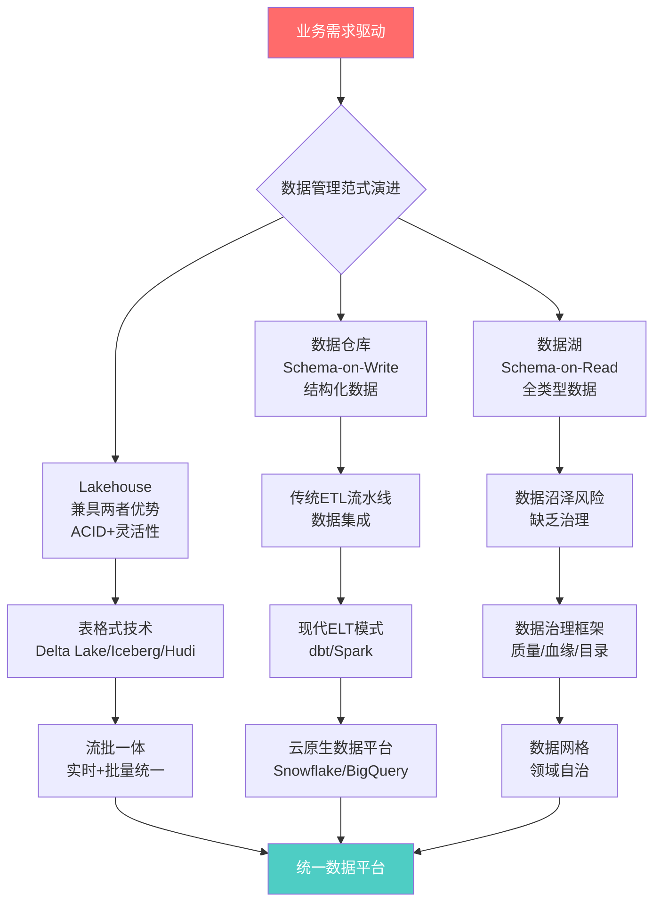
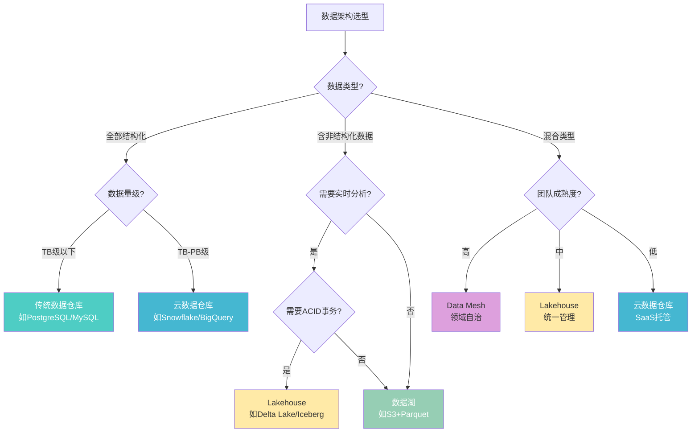
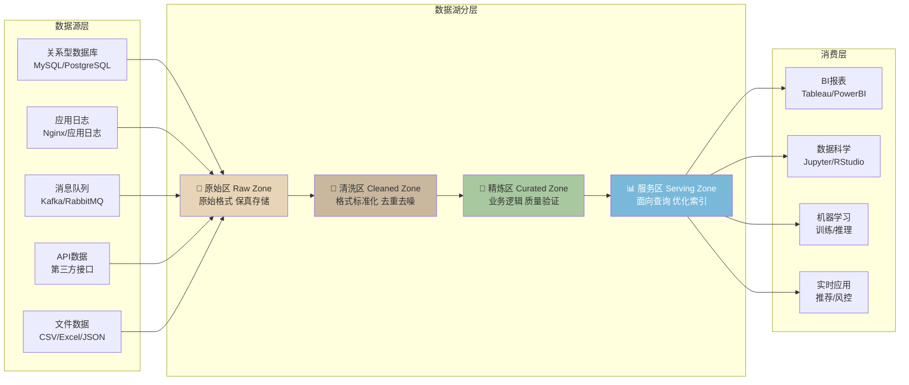

# 理论基础：数据湖与数据仓库的底层逻辑

数据管理领域经历了从单一数据仓库到数据湖，再到Lakehouse架构的三次范式跃迁。每一次跃迁都源于业务需求与技术能力之间的张力——数据量的增长突破了传统仓库的存储上限，数据类型的多样化挑战了schema-on-write的刚性约束，而实时分析的需求则倒逼架构从批处理向流批一体演进。本节从数据架构的演进脉络出发，系统梳理数据湖、表格式、仓库建模和ETL/ELT四大理论支柱，为后续的工程实践和案例分析奠定坚实基础。

## 一、数据架构的演进脉络

### 1.1 三次范式跃迁

**第一阶段：数据仓库时代（1990s-2010s）**

Bill Inmon在1990年代提出了"企业信息工厂"（Corporate Information Factory）的概念，定义了数据仓库的核心特征：面向主题的（Subject-Oriented）、集成的（Integrated）、相对稳定的（Non-Volatile）、反映历史变化的（Time-Variant）数据集合。Ralph Kimball则倡导自底向上的维度建模方法，强调以业务过程为核心构建星型模型。这一时期的核心矛盾是：数据仓库擅长处理结构化、高质量的数据，但面对海量原始数据的低成本存储需求力不从心。

**第二阶段：数据湖兴起（2010-2018）**

2011年，James Dixon提出了"数据湖"概念，将数据湖类比为自然界的湖泊——所有水源（数据源）汇聚一处，保持原始形态，消费者按需取用。数据湖基于Hadoop生态系统，通过HDFS实现廉价的水平扩展存储，支持任意格式的原始数据。但实践中，大量无序流入的数据缺乏元数据管理、质量校验和访问控制，逐渐演变为"数据沼泽"（Data Swamp），导致数据可信度下降、分析效率反而降低。

**第三阶段：Lakehouse融合（2018-至今）**

Databricks在2020年正式提出Lakehouse架构，核心思想是将数据仓库的ACID事务、数据治理、Schema管理能力引入数据湖，同时保留数据湖的开放性、低成本和灵活性。实现这一融合的关键技术是"表格式"（Table Format）——通过在文件系统之上定义元数据层，赋予原始文件以表的语义，实现事务一致性、时间旅行查询和Schema演化。

### 1.2 核心概念辨析

| 概念 | 定义 | 核心特征 | 适用场景 |
|------|------|----------|----------|
| 数据仓库（Data Warehouse） | 面向主题的、集成的、相对稳定的数据集合，用于支持管理决策 | Schema-on-Write、预定义模型、高度结构化、强一致性 | BI报表、OLAP分析、合规审计 |
| 数据湖（Data Lake） | 以原始格式存储海量异构数据的集中式存储库 | Schema-on-Read、原始数据、低成本、高灵活性 | 数据科学探索、机器学习、原始日志分析 |
| 数据集市（Data Mart） | 面向特定部门或业务线的数据仓库子集 | 主题聚焦、小规模、快速响应 | 财务报表、营销分析 |
| 数据湖仓（Lakehouse） | 结合数据仓库管理能力与数据湖灵活性的融合架构 | ACID事务、开放格式、Schema演化、时间旅行 | 统一分析平台、实时+批量混合负载 |
| 数据湖屋（Data Mesh） | 分布式数据所有权的架构范式 | 领域驱动、数据即产品、自助平台、联邦治理 | 大型企业、多团队协作 |

### 1.3 架构选型决策树

选择数据架构时，需要综合考虑数据量级、数据类型、查询模式、团队能力和成本预算五大维度：

## 二、数据湖架构

> 详细内容参见 [数据湖架构](01-一数据湖架构)

数据湖架构是整个现代数据平台的基石。一个设计良好的数据湖并非简单的"所有数据扔进一个桶"，而是需要精心规划的分层架构、数据治理流程和访问控制机制。

### 2.1 分层存储架构

现代数据湖普遍采用"区域分层"（Zone-based）架构，将数据按处理阶段和可信度划分为多个逻辑区域：

各区域的职责定义：

| 区域 | 存储内容 | 数据格式 | 谁写入 | 谁读取 | 保留策略 |
|------|----------|----------|--------|--------|----------|
| **原始区（Raw）** | 从源系统摄入的原始数据，不做任何转换 | 原始格式（JSON/CSV/日志） | 数据管道（Kafka Connect/Sqoop/自研） | 数据工程师（调试/审计） | 长期保留（3-7年） |
| **清洗区（Cleaned）** | 经过去重、去噪、格式标准化的数据 | 列式格式（Parquet/ORC） | ETL/ELT作业 | 数据分析师 | 中期保留（1-3年） |
| **精炼区（Curated）** | 经过业务逻辑处理和质量校验的高质量数据 | 优化的列式格式 | 数据建模作业 | BI工具、业务用户 | 长期保留 |
| **服务区（Serving）** | 面向特定查询场景优化的数据视图 | 预聚合/索引化 | 物化视图/缓存构建作业 | 终端应用 | 按需保留 |

### 2.2 数据摄入模式

数据摄入（Data Ingestion）是数据湖的第一道工序，决定了数据从源系统到达数据湖的时效性和可靠性：

**批量摄入（Batch Ingestion）**：按照固定的时间周期（每小时/每天/每周）将数据从源系统批量导出到数据湖。典型工具包括Apache Sqoop（关系型数据库导入）、Apache Flume（日志采集）、自研脚本（基于cron调度）。优点是实现简单、资源可控；缺点是时效性差，通常有小时级甚至天级的延迟。

**微批处理（Micro-batch）**：将批量摄入的时间间隔缩短到分钟级（通常1-5分钟），在时效性和系统复杂度之间取得平衡。Apache Spark Structured Streaming的trigger设置为"30 seconds"就是典型的微批模式。

**实时流式摄入（Stream Ingestion）**：通过消息队列（Apache Kafka、Amazon Kinesis）实现秒级甚至亚秒级的数据摄入。数据以流的形式持续写入数据湖，支持事件驱动的实时分析。Apache Kafka Connect配合S3/HDFS Sink Connector是常见的实时摄入方案。

### 2.3 元数据管理

元数据（Metadata）是数据湖治理的核心。没有良好元数据管理的数据湖注定沦为数据沼泽。元数据分为三类：

- **技术元数据**（Technical Metadata）：表结构（schema）、字段类型、分区键、文件格式、压缩算法、存储位置、文件大小、行数等
- **业务元数据**（Business Metadata）：业务含义、数据Owner、敏感等级、数据字典、使用说明、SLA承诺等
- **操作元数据**（Operational Metadata）：作业运行日志、数据更新时间、数据新鲜度、访问频率、质量检查结果等

Apache Hive Metastore是开源领域最广泛使用的元数据存储，提供表/分区/数据库的元数据管理。Databricks Unity Catalog和AWS Glue则提供了更丰富的治理能力，包括细粒度的访问控制和跨引擎的元数据共享。

## 三、数据湖表格式

> 详细内容参见 [数据湖表格式：Delta Lake、Iceberg与Hudi深度解析](02-二表格式)

表格式（Table Format）是Lakehouse架构的核心技术突破。它在底层文件系统（S3/HDFS/ADLS）之上定义了一层元数据抽象，将散落的Parquet/ORC文件组织成具有ACID事务、Schema一致性和时间旅行能力的逻辑表。

### 3.1 三大表格式对比

目前主流的三种开源表格式各有其技术渊源和设计侧重：

| 维度 | Delta Lake | Apache Iceberg | Apache Hudi |
|------|-----------|----------------|-------------|
| **开源方** | Databricks (2019) | Netflix (2018) | Uber (2016) |
| **底层文件格式** | Parquet | Parquet/ORC/Avro | Parquet/ORC |
| **元数据存储** | 事务日志（JSON/Parquet） | 快照文件+Manifest List | Timeline文件 |
| **事务实现** | WAL日志 + optimistic concurrency | 快照隔离 + optimistic concurrency | Timeline + OCC |
| **Schema演化** | 支持（追加列/重命名） | 支持（全量演化） | 支持（有限演化） |
| **分区演化** | 不支持（需重写数据） | 支持（隐藏分区） | 支持（有限支持） |
| **时间旅行** | 支持（基于版本号/时间戳） | 支持（基于快照ID/时间戳） | 支持（基于时间戳） |
| **主力计算引擎** | Spark（深度集成） | Spark/Flink/Trino/Hive | Spark（Flink支持中） |
| **社区活跃度** | 高（Databricks主导） | 高（Apache顶级项目） | 中高（Apache顶级项目） |
| **典型用户** | Databricks客户 | Apple/Netflix/Twitter | Uber/字节跳动 |

### 3.2 核心能力解析

**ACID事务**：传统数据湖的致命缺陷是不支持事务——并发写入可能导致数据不一致、读取到中间状态。表格式通过实现多版本并发控制（MVCC）和乐观并发控制（OCC），确保读写操作的原子性、一致性、隔离性和持久性。这意味着多个ETL作业可以安全地并发写入同一张表，而不会产生脏读或数据损坏。

**时间旅行（Time Travel）**：表格式通过保留历史版本的数据快照，支持查询任意时间点的数据状态。这在以下场景中价值巨大：数据回滚（发现ETL错误后恢复到正确版本）、数据审计（查看某一天的报表数据是什么样的）、机器学习实验复现（锁定训练数据的时间窗口）。

**Schema演化（Schema Evolution）**：业务变化必然带来数据结构的调整——新增字段、删除字段、修改字段类型。表格式支持在不重写历史数据的前提下进行Schema变更，通过元数据层的映射实现新旧Schema的兼容读取。

**分区演化（Partition Evolution）**：当业务查询模式变化时，数据的分区策略可能需要调整（例如从按天分区改为按小时分区）。Iceberg的"隐藏分区"（Hidden Partition）机制允许在不重写数据的前提下更改分区策略，这是其相对于Delta Lake的重要优势。

## 四、数据仓库建模

> 详细内容参见 [数据仓库建模](03-三数据仓库建模)

数据仓库建模是将业务需求转化为数据结构的桥梁。好的建模不仅影响查询性能，更决定了数据仓库能否准确反映业务语义、支持灵活的分析需求。

### 4.1 维度建模方法论

Ralph Kimball提出的维度建模（Dimensional Modeling）是数据仓库领域最广泛采用的方法论。其核心思想是将数据组织为两种类型的表：

**事实表（Fact Table）**：存储业务过程的可度量事件，由外键（指向维度表）和度量值（数值型指标）组成。例如：订单事实表记录每一笔交易的金额、数量、折扣等度量。事实表通常是数据仓库中最大的表，行数可达数十亿级别。

**维度表（Dimension Table）**：存储描述业务事件上下文的属性信息，由主键和描述性字段组成。例如：时间维度表记录年/季/月/周/日/节假日等属性；客户维度表记录客户姓名/地区/会员等级等属性。维度表通常较小，行数在万到百万级别。

### 4.2 两大经典模型

**星型模型（Star Schema）**：事实表位于中心，维度表围绕事实表呈星形分布。每个维度表直接与事实表通过外键关联，不经过中间表。查询时只需要一次JOIN操作，性能优秀。星型模型是OLAP查询的首选结构，广泛应用于BI报表和即席分析场景。

**雪花模型（Snowflake Schema）**：在星型模型的基础上，对维度表进行进一步规范化——将维度表中的重复属性拆分为独立的子维度表。例如将"产品维度"拆分为"产品表→品类表→供应商表"的层级结构。雪花模型减少了数据冗余，但增加了查询时的JOIN层数，在大数据量场景下可能导致性能下降。

两种模型的选型建议：对查询性能要求高、维度属性相对简单的场景使用星型模型；对数据一致性要求高、维度层级复杂且需要减少冗余的场景使用雪花模型。实际工程中，星型模型使用更为普遍。

### 4.3 缓慢变化维（SCD）处理

维度数据并非一成不变——客户可能搬家（地址变化）、产品可能调价（价格变化）、员工可能调岗（部门变化）。如何处理这些缓慢变化的维度数据，是建模中的关键设计决策：

- **SCD Type 1（直接覆盖）**：用新值直接覆盖旧值，不保留历史。适用于历史变化不重要的场景（如修正拼写错误）。
- **SCD Type 2（版本化）**：为每次变化创建新记录，通过有效期字段（valid_from/valid_to）和当前标记（is_current）管理版本。适用于需要完整历史追溯的场景（如客户地址变更历史）。
- **SCD Type 3（有限历史）**：在维度表中保留最近一次变化的旧值（如previous_address），适用于只需要对比"当前值vs上一个值"的场景。

## 五、ETL与ELT

> 详细内容参见 [ETL与ELT](04-四ETLELT)

数据从源系统到分析就绪状态的处理过程，经历了从ETL到ELT的范式转变。这一转变的根本驱动力是计算和存储成本的急剧下降——当目标系统的存储和计算能力足够强大时，先加载再转换（ELT）比先转换再加载（ETL）更具灵活性和效率。

### 5.1 ETL：经典数据集成模式

ETL（Extract-Transform-Load）是传统数据仓库时代的核心数据集成模式：

- **Extract（抽取）**：从源系统（数据库、文件、API）读取增量或全量数据
- **Transform（转换）**：在ETL服务器上完成数据清洗、格式转换、业务规则计算、维度关联等操作
- **Load（加载）**：将转换后的数据写入目标数据仓库

ETL的典型工具包括Informatica PowerCenter、IBM DataStage、Talend Open Studio、Apache NiFi。这些工具提供了丰富的可视化转换组件和调度能力，但通常需要专门的ETL服务器资源，且在处理大规模数据时可能成为性能瓶颈。

### 5.2 ELT：云时代的新范式

ELT（Extract-Load-Transform）将处理顺序颠倒——先将原始数据加载到目标系统（通常是云数据仓库或数据湖），然后在目标系统内部利用其计算能力完成转换：

- **Extract（抽取）**：从源系统读取数据（与ETL相同）
- **Load（加载）**：将原始数据直接加载到目标系统，不做转换
- **Transform（转换）**：在目标系统（如Snowflake、BigQuery、Databricks）中使用SQL或Spark进行转换

ELT的核心优势在于：利用了云数据仓库弹性计算的特性（按需扩缩容）、避免了数据在ETL服务器和目标系统之间的多次搬运、原始数据在目标系统中持久保存（可回溯、可重跑）。

**dbt（data build tool）**是ELT模式的标杆工具。dbt通过SQL模型定义转换逻辑，支持模型间的依赖管理、增量更新、数据测试、文档自动生成和版本控制。dbt的核心理念是"Analytics Engineering"——用软件工程的最佳实践（版本控制、代码审查、测试、CI/CD）来管理数据转换层。

### 5.3 ETL与ELT选型对比

| 维度 | ETL | ELT |
|------|-----|-----|
| **转换位置** | 独立ETL服务器 | 目标系统内部 |
| **适用目标** | 传统数据仓库 | 云数据仓库/数据湖 |
| **数据保留** | 仅保留转换后数据 | 保留原始数据+转换后数据 |
| **扩展性** | 受限于ETL服务器资源 | 弹性扩展（云原生） |
| **开发模式** | GUI拖拽或过程式代码 | SQL模型（dbt）或代码 |
| **数据血缘** | 工具内置 | dbt自动追踪 |
| **回溯能力** | 困难（需重跑整个管道） | 容易（从原始数据重跑） |
| **实时能力** | 部分支持 | 需结合流处理框架 |
| **典型工具** | Informatica/DataStage/Talend | dbt/Spark SQL/Flink SQL |

## 六、理论知识体系总结

```mermaid
graph TD
    ROOT[数据湖与数据仓库<br/>理论基础] --> A[数据架构演进]
    ROOT --> B[数据湖架构]
    ROOT --> C[表格式技术]
    ROOT --> D[仓库建模]
    ROOT --> E[ETL/ELT]

    A --> A1[数据仓库时代]
    A --> A2[数据湖兴起]
    A --> A3[Lakehouse融合]
    A --> A4[架构选型决策]

    B --> B1[分层存储架构<br/>Raw→Cleaned→Curated→Serving]
    B --> B2[数据摄入模式<br/>Batch/Micro-batch/Stream]
    B --> B3[元数据管理<br/>技术/业务/操作元数据]

    C --> C1[Delta Lake<br/>Databricks主导]
    C --> C2[Apache Iceberg<br/>开放标准]
    C --> C3[Apache Hudi<br/>增量处理]
    C --> C4[核心能力<br/>ACID/时间旅行/Schema演化]

    D --> D1[星型模型]
    D --> D2[雪花模型]
    D --> D3[SCD处理<br/>Type1/2/3]
    D --> D4[事实表vs维度表]

    E --> E1[ETL经典模式]
    E --> E2[ELT云时代范式]
    E --> E3[dbt工具生态]
    E --> E4[选型决策框架]

    style ROOT fill:#FF6B6B,color:#fff
    style A fill:#4ECDC4,color:#fff
    style B fill:#45B7D1,color:#fff
    style C fill:#FFEAA7,color:#333
    style D fill:#96CEB4,color:#fff
    style E fill:#DDA0DD,color:#fff
```

## 七、学习路径建议

对于不同背景的读者，建议按照以下路径循序渐进地学习本节内容：

**入门路径（数据工程师初学者）**：先理解数据仓库和数据湖的基本概念（1.1-1.2节），掌握星型模型的建模方法（第四节），然后学习ETL/ELT的基本流程（第五节），最后深入了解数据湖的分层架构（第二节）。

**进阶路径（有经验的数据工程师）**：重点关注表格式技术的选型和原理（第三节），理解ACID事务、时间旅行和Schema演化的实现机制，掌握SCD处理的各种模式，学习ELT模式下的dbt实践。

**架构路径（数据架构师/技术负责人）**：聚焦架构选型决策（1.3节），理解数据湖、数据仓库和Lakehouse的适用场景，掌握元数据管理和数据治理框架，思考Data Mesh等新兴架构理念。

**每个子节都包含详细的代码示例、架构图和对比表格，建议结合实际项目场景进行学习和实践。**
