# 附录A：推荐书籍与论文——章节概览

## 为什么需要这份学习资源指南

软件工程是一门实践性极强的学科，但实践的深度取决于理论的厚度。一个只会调用API的工程师和一个理解底层原理的工程师，在面对复杂系统问题时的判断力有本质差异。问题不在于"要不要读书"，而在于"读什么、怎么读、读到什么程度"。

这份附录解决三个核心痛点：

**第一，信息过载。** 计算机科学领域的经典著作数以百计，论文更是浩如烟海。一个工作3年的后端工程师，面对琳琅满目的书单，最常犯的错误是"什么都想读，什么都没读完"。本附录经过严格筛选，每个领域只推荐最具代表性的1-3本书和3-5篇论文，附上具体的推荐理由和适用读者定位，帮你把有限的学习时间花在刀刃上。

**第二，路径缺失。** 很多工程师读完一本书后不知道下一步该读什么，或者在不同领域的书籍之间反复跳跃，始终无法建立系统化的知识体系。本附录提供了按职业阶段组织的分阶段学习路径——初级工程师读什么、中级工程师读什么、高级工程师读什么——以及每个阶段的核心目标和阅读建议。

**第三，学用脱节。** 读书容易，把书中的知识转化为工程能力很难。很多人读完了《设计模式》却写不出好的设计，读完了DDIA却做不了合理的架构选型。本附录不仅推荐资源，还提供三遍阅读法、费曼学习法、间隔重复等高效阅读技巧，以及将理论转化为实践的具体练习方法。

---

## 本附录知识地图

本附录按照"资源分类→方法论→实践转化"的逻辑组织，覆盖三大核心维度：

```mermaid
graph TD
    A["附录A 推荐书籍与论文"] --> B["经典书籍推荐"]
    A --> C["里程碑论文解读"]
    A --> D["学习方法论"]
    
    B --> B1["计算机体系结构"]
    B --> B2["操作系统"]
    B --> B3["数据库系统"]
    B --> B4["网络与分布式系统"]
    B --> B5["编译原理"]
    B --> B6["软件设计与工程"]
    B --> B7["系统编程语言"]
    B --> B8["安全与密码学"]
    B --> B9["云原生与DevOps"]
    B --> B10["机器学习与AI基础"]
    B --> B11["选读推荐"]
    
    C --> C1["分布式存储：GFS/Bigtable/Dynamo"]
    C --> C2["分布式计算：MapReduce/Borg"]
    C --> C3["共识与一致性：Raft/Spanner/CAP"]
    C --> C4["数据基础设施：Kafka/Chubby/Aurora"]
    C --> C5["经典理论：Paxos/逻辑时钟/拜占庭容错"]
    
    D --> D1["高效阅读技巧"]
    D --> D2["分阶段学习路径"]
    D --> D3["常见学习误区"]
    D --> D4["练习与实践方法"]
    D --> D5["资源分类速查"]

    style A fill:#e8590c,color:#fff
    style B fill:#228be6,color:#fff
    style C fill:#2f9e44,color:#fff
    style D fill:#9c36b5,color:#fff
```

---

## 章节结构导航

### 第一部分：推荐书籍（11大领域，60+本经典）

书籍推荐按计算机科学的核心领域分类，每个领域精选最具影响力的经典著作，附内容简介、推荐理由和适用读者定位。

| 领域 | 推荐数量 | 核心书籍 | 适用层次 |
|------|---------|---------|---------|
| 计算机体系结构 | 5本 | Hennessy《量化研究方法》、Tanenbaum《现代操作系统》、Stevens《APUE》、Love《Linux内核》、Bovet《深入理解Linux内核》 | 中级→高级 |
| 数据库系统 | 3本 | Garcia-Molina《数据库系统实现》、Date《数据库系统导论》、Kleppmann《DDIA》 | 中级→架构师 |
| 网络与分布式系统 | 2本 | Stevens《TCP/IP详解》、Tanenbaum《分布式系统》 | 中级→高级 |
| 编译原理 | 1本 | Aho《编译原理》（龙书） | 中级→高级 |
| 软件设计与工程 | 2本 | GoF《设计模式》、Evans《领域驱动设计》 | 中级→架构师 |
| 安全与密码学 | 3本 | Bryant《CSAPP》、Stallings《密码学》、《Web应用安全权威指南》 | 全层次 |
| 云原生与DevOps | 3本 | Google《SRE》、Newman《微服务设计》、Lukša《Kubernetes权威指南》 | 中级→架构师 |
| 系统编程语言 | 2本 | Donovan《Go程序设计语言》、Klabnik《Rust程序设计语言》 | 中级→高级 |
| 机器学习与AI基础 | 1本 | Goodfellow《深度学习》（花书） | 全层次 |
| 选读推荐 | 3本 | SICP、CLRS《算法导论》、《UNIX编程艺术》 | 按需 |

**阅读建议：** 不必追求一次读完所有推荐。根据你当前的技术方向和职业阶段，从1-2个领域的核心书籍开始，配合相关论文阅读，逐步扩展知识版图。

### 第二部分：里程碑论文（14篇开创性论文）

论文是计算机科学发展史的里程碑，每一篇都重新定义了行业的技术范式。本附录精选14篇每个软件工程师都应该了解的论文：

| 类别 | 代表论文 | 核心贡献 | 年份 |
|------|---------|---------|------|
| 分布式存储 | GFS、Bigtable、Dynamo | 奠定NoSQL和分布式存储的设计范式 | 2003-2007 |
| 分布式计算 | MapReduce、Borg | 开启大数据时代，催生Kubernetes | 2004-2015 |
| 共识与一致性 | Raft、Spanner、CAP十二年回顾 | 解决分布式共识，实现全球强一致 | 2012-2014 |
| 数据基础设施 | Kafka、Chubby、Aurora | 重新定义消息系统和云原生数据库 | 2006-2017 |
| 经典理论 | Paxos Made Simple、逻辑时钟、拜占庭容错 | 分布式系统的理论基石 | 1978-2001 |
| 架构权衡 | Life beyond Distributed Transactions、LSM-Tree | 大规模系统的一致性策略和存储引擎 | 1996-2007 |

### 第三部分：学习方法论（4大主题）

| 主题 | 核心内容 | 解决的问题 |
|------|---------|-----------|
| 高效阅读技巧 | 三遍阅读法、费曼学习法、间隔重复 | 如何在有限时间内最大化阅读效果 |
| 分阶段学习路径 | 初级→中级→高级→架构师的推荐顺序 | 不同职业阶段应该读什么 |
| 常见学习误区 | "只读不用"、"追求速度"、"忽略基础" | 避免无效的学习方式 |
| 练习与实践方法 | 代码实践、论文复现、技术写作 | 如何将知识转化为工程能力 |

---

## 分阶段学习路径

根据你的职业阶段选择阅读重点，避免"一刀切"的阅读计划：

### 路径一：初级工程师（0-3年）——建立基础

**目标：** 打通高级语言到硬件的完整知识链，建立系统级思维。

**核心读物（按优先级）：**
1. 《深入理解计算机系统》（CSAPP）——最重要的基础书，打通高级语言到硬件的知识链
2. 《Go程序设计语言》——掌握一门系统编程语言，理解并发编程模型
3. DDIA 第1-3章——建立数据系统的全局认知框架
4. 《现代操作系统》——建立操作系统的完整概念体系
5. 《TCP/IP详解 卷1》——建立网络协议的可验证理解

**阅读建议：** CSAPP和Go语言可以同步学习，DDIA在有一定后端经验后开始阅读。每天投入30-60分钟，预计6-12个月完成第一轮。

### 路径二：中级工程师（3-5年）——深入原理

**目标：** 深入理解分布式系统和数据库，建立架构思维。

**核心读物：**
1. DDIA（完整阅读）——分布式系统设计的百科全书
2. Raft论文 + raft.github.io——理解共识算法
3. 《数据库系统实现》——理解数据库内核实现原理
4. 《领域驱动设计》——建立复杂业务系统的设计方法论
5. GFS/Bigtable/Dynamo论文——理解分布式存储系统的奠基之作

**阅读建议：** DDIA应精读并做详细笔记，配合MIT 6.824 Lab实践。建议在工作中寻找机会实践所学知识。

### 路径三：高级工程师（5-10年）——建立全局视野

**目标：** 补齐知识盲区，培养技术判断力。

**核心读物：**
1. 《站点可靠性工程》——建立可靠性和可观测性的工程方法论
2. Spanner/Aurora论文——理解前沿分布式数据库的设计思想
3. 《编译原理》核心章节——理解语言和工具的底层机制
4. 《深度学习》——理解AI/ML基础
5. Borg论文——理解大规模集群管理的设计思想

**阅读建议：** 侧重于知识面的广度和判断力的深度。不必每本书都精读，针对知识盲区重点突破。建议同时进行技术写作和社区分享，输出倒逼输入。

### 路径四：架构师（10年+）——培养判断力

**目标：** 建立跨领域的系统思维，成为技术决策者。

**核心读物：**
1. 《领域驱动设计》战略设计——限界上下文划分是架构设计的核心技能
2. CAP十二年回顾 + 论文阅读——深入理解一致性和可用性的细粒度权衡
3. SICP——培养抽象思维和计算思维的终极教材
4. 《UNIX编程艺术》——理解简洁设计哲学

**阅读建议：** 重点从"学习技术"转向"培养判断力"。每篇论文和每本书都应带着"这对我团队的技术决策有什么启示？"来阅读。

---

## 资源分类速查

快速定位你需要的资源：

| 领域 | 入门推荐 | 进阶推荐 | 里程碑论文 |
|------|---------|---------|-----------|
| 体系结构 | Hennessy & Patterson | Bovet (Linux内核) | — |
| 操作系统 | Tanenbaum | Love (Linux内核) | — |
| 数据库 | Garcia-Molina | Date, DDIA | Bigtable, Dynamo, Spanner, Aurora |
| 分布式系统 | Tanenbaum | Kleppmann (DDIA) | Raft, Paxos, MapReduce, GFS, Borg |
| 网络 | Stevens (TCP/IP) | Stanford CS244B | — |
| 编译原理 | Aho (龙书) | — | — |
| 软件设计 | GoF (设计模式) | Evans (DDD) | — |
| 安全 | CSAPP安全章节 | Stallings, Tangled Web | — |
| 云原生 | K8s权威指南 | SRE, 微服务设计 | Borg, Aurora |
| 系统语言 | Go程序设计语言 | Rust程序设计语言 | — |
| ML/AI | 深度学习（花书） | 统计学习方法（李航） | — |

---

## 核心洞察

在深入阅读之前，三个核心洞察值得铭记：

**洞察一：原理比工具更重要。** 本附录推荐的每一本书都经过时间检验，代表了其领域的最高水平。从Hennessy和Patterson的体系结构著作到Kleppmann的数据密集型应用设计，这些书籍提供的是不变的原理和方法论，而非易变的工具和技术。掌握原理，你将具备适应技术变化的能力——今天学的框架可能三年后过时，但B+树的原理、CAP定理的权衡、Raft的共识逻辑，这些知识的半衰期以十年计。

**洞察二：精读3-5本经典，比泛读20本更有价值。** 很多工程师的书架上摆满了技术书，但真正读完并理解的寥寥无几。深度优先的学习策略远比广度优先有效——当你真正理解了CSAPP中程序在硬件上的执行过程，你对所有上层技术的理解都会不同。与其浅尝辄止地翻阅20本书，不如把3-5本经典读透、读烂、读到能给别人讲清楚。

**洞察三：学习效果的检验标准是"能讲给别人听"。** 费曼学习法的核心理念是：如果你不能用简单的语言向别人解释一个概念，说明你自己还没有真正理解。读完一本书或一篇论文后，尝试写一篇技术博客、做一次团队分享、或者给同事讲解核心概念。这种"输出倒逼输入"的方式，是将阅读时间转化为真正知识的最有效路径。

---

*准备好开始了吗？根据你的职业阶段选择对应的阅读路径，或者直接翻到你最感兴趣的领域章节开始探索。*
