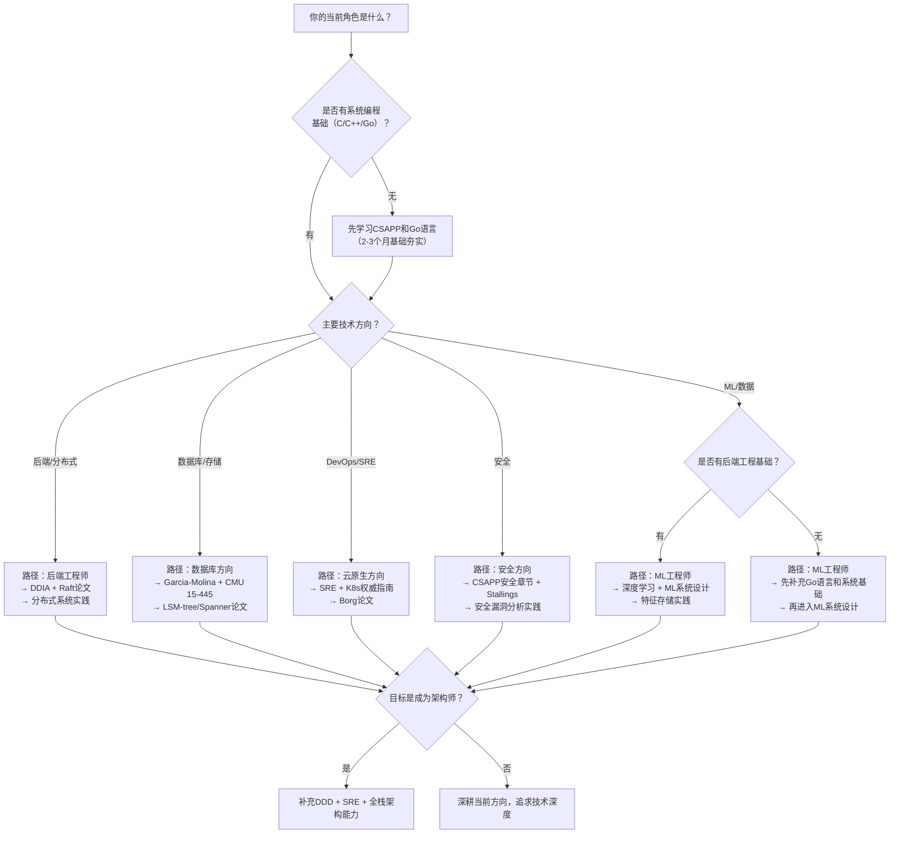

# 附录A：推荐书籍与论文

## 章节概览

软件工程是一门实践性极强的学科，但其根基深植于计算机科学的理论土壤之中。一个优秀的软件工程师不仅需要掌握编程语言和框架的使用，更需要对底层原理有深刻的理解——从计算机体系结构到操作系统内核，从网络协议栈到数据库存储引擎，从编译原理到分布式系统理论。这些底层知识决定了工程师在面对复杂问题时能否做出正确的技术判断。

本附录旨在为读者提供一份系统化的学习资源指南，涵盖以下三个核心维度：

**经典书籍推荐**——按计算机科学的核心领域分类，精选每个方向最具影响力的经典著作。这些书籍经过时间检验，被全球顶尖高校和科技公司广泛采用。我们为每本书提供内容简介和推荐理由，帮助读者根据自身水平和学习目标做出选择。推荐范围涵盖计算机体系结构、操作系统、网络编程、数据库系统、分布式系统、编译原理、软件设计等十余个关键领域。

**里程碑论文解读**——计算机科学的发展史是由一系列开创性论文推动的。从Google的MapReduce、GFS、BigTable，到Amazon的Dynamo，再到Raft共识算法和Apache Kafka的架构设计，这些论文不仅解决了当时的工程难题，更重新定义了整个行业的技术范式。我们为每篇论文提供背景说明和核心贡献概述，帮助读者理解其历史意义和技术价值。

**学习方法论**——仅有资源清单是不够的，如何高效地阅读技术书籍和论文同样重要。本附录还包含高效阅读技巧、分阶段学习路径规划、常见学习误区警示，以及将理论转化为实践的练习方法，帮助读者构建系统化的知识体系，而非零散地积累碎片化信息。

无论你是刚入门的计算机专业学生，还是希望夯实基础的资深工程师，本附录都将成为你持续学习旅程中的可靠参考。

***

> **阅读建议**：不必追求一次读完所有推荐内容。根据你当前的技术方向和职业阶段，选择1-2个领域的经典书籍开始，配合相关论文阅读，逐步扩展知识版图。


***

# 附录A-01：推荐书籍与论文·理论基础

***

## 一、计算机体系结构

### 1.1 《计算机体系结构：量化研究方法》（Computer Architecture: A Quantitative Approach）

**作者**：John L. Hennessy, David A. Patterson  
**版本**：第6版（2019）  
**出版社**：Morgan Kaufmann

**内容简介**：本书是计算机体系结构领域的"圣经"，由图灵奖得主Hennessy和Patterson合著。全书以量化分析为核心方法论，系统讲解了指令集架构设计、流水线技术、存储层次结构（缓存、主存、虚拟内存）、指令级并行（ILP）、线程级并行（TLP）、数据级并行（DLP）以及领域专用架构（DSA）。第6版新增了对异构计算、GPU架构和深度学习加速器的深入讨论。

**推荐理由**：这本书不仅仅介绍"是什么"，更重要的是教会你"怎么评估"。量化研究方法（量化性能公式、Amdahl定律的反复应用）为硬件和软件设计决策提供了严谨的分析框架。理解计算机体系结构对于编写高性能软件、进行性能调优、理解编译器优化策略都至关重要。即使你是纯软件工程师，读完此书后对"为什么这段代码快/慢"会有根本性的理解。

**适用读者**：中高级工程师，尤其是对性能优化、系统编程感兴趣的读者。

***

### 1.2 《现代操作系统》（Modern Operating Systems）

**作者**：Andrew S. Tanenbaum, Herbert Bos  
**版本**：第4版（2014）  
**出版社**：Pearson

**内容简介**：Tanenbaum是操作系统领域的泰斗级人物。本书全面覆盖操作系统的核心概念：进程与线程管理、进程间通信（IPC）、内存管理（分页、分段、虚拟内存）、文件系统、I/O系统、死锁处理、多核操作系统设计，以及虚拟化和云计算等现代主题。书中还穿插了POSIX、Windows和Linux三个系统的具体实现对比。

**推荐理由**：操作系统是所有软件运行的基础设施。这本书以清晰的逻辑和丰富的实例，帮助读者建立对操作系统的完整认知框架。理解进程调度、内存管理、文件系统等概念，对于编写高效的多线程程序、诊断系统性能问题、设计大规模服务端系统都具有直接价值。Tanenbaum的写作风格深入浅出，适合自学。

**适用读者**：所有层次的软件工程师，建议作为系统知识的"第一本操作系统书"。

***

### 1.3 《UNIX环境高级编程》（Advanced Programming in the UNIX Environment，简称APUE）

**作者**：W. Richard Stevens, Stephen A. Rago  
**版本**：第3版（2013）  
**出版社**：Addison-Wesley

**内容简介**：APUE是UNIX/Linux系统编程的权威参考书。全书详细讲解了UNIX系统的文件I/O、标准I/O库、进程环境、进程控制、进程关系、信号、线程、线程同步、守护进程、高级I/O、进程间通信、网络IPC、伪终端等核心系统调用接口。每个主题都附有大量可运行的示例代码。

**推荐理由**：如果你想深入理解Linux/UNIX系统的工作机制，这本书是必读之作。Stevens以严谨的工程态度，将每一个系统调用的行为、边界条件和可移植性问题都讲解得清清楚楚。读完此书，你对文件描述符、信号处理、进程生命周期等概念的理解将上升到一个新的层次。对于从事后端开发、系统编程、基础设施建设的工程师来说，这本书的价值无可替代。

**适用读者**：有一定C语言基础的中高级工程师。

***

### 1.4 《Linux内核设计与实现》（Linux Kernel Development）

**作者**：Robert Love  
**版本**：第3版（2010）  
**出版社**：Addison-Wesley

**内容简介**：本书是Linux内核入门的最佳选择之一，以Linux 2.6内核为蓝本，系统讲解了进程管理、进程调度、系统调用、内核数据结构、中断处理与下半部机制、内核同步、定时器与时间管理、内存管理、虚拟文件系统、块I/O层、进程地址空间等核心子系统的设计与实现。全书约350页，篇幅精炼但信息密度极高。

**推荐理由**：相比Bovet的《深入理解Linux内核》，Love的这本书更加轻量级和易读。它不是逐行代码注释，而是从设计哲学和架构角度讲解内核各子系统。对于想了解"操作系统内核到底是怎么工作的"的工程师来说，这是最佳起点。理解内核调度器、内存管理、中断处理机制，对于编写高性能服务器程序、诊断内核级bug都有直接帮助。

**适用读者**：有C语言和操作系统基础的中级工程师。

***

### 1.5 《深入理解Linux内核》（Understanding the Linux Kernel）

**作者**：Daniel P. Bovet, Marco Cesati  
**版本**：第3版（2005）  
**出版社**：O'Reilly

**内容简介**：本书比Love的书更加深入，以Linux 2.6内核源码为线索，逐层剖析内核的数据结构和算法实现。涵盖了进程调度（O(1)调度器和CFS）、内存管理（伙伴系统、slab分配器）、虚拟文件系统（VFS层抽象、ext2/ext3实现）、设备驱动模型等。书中大量引用内核源码，并配有详细的图解。

**推荐理由**：当你需要真正理解内核的某个子系统"是如何实现的"而不是"大致怎么工作"时，这本书是不可替代的参考资料。它适合在读完Love的书之后深入学习。对于内核开发者、驱动开发者、性能工程师来说，案头常备此书可以极大提高问题诊断效率。

**适用读者**：高级工程师，尤其是从事内核开发或系统调优的工程师。

***

## 二、数据库系统

### 2.1 《数据库系统实现》（Database System Implementation）

**作者**：Hector Garcia-Molina, Jeffrey D. Ullman, Jennifer Widom  
**版本**：第1版（1999）  
**出版社**：Prentice Hall

**内容简介**：本书是数据库系统实现的权威教材，深入讲解了存储管理（磁盘与文件组织）、索引结构（B+树、散列索引）、查询处理（排序、连接算法）、查询优化（基于代价的优化）、事务管理（ACID属性、并发控制、恢复机制）、并行数据库和分布式数据库等核心实现技术。

**推荐理由**：理解数据库的内部实现，对于数据库选型、SQL调优、设计存储系统都有根本性帮助。当你知道一个JOIN操作的代价是如何计算的，当你理解B+树索引的结构和维护开销，你写出的SQL和设计的schema会完全不同。这本书是计算机科学的经典教材，被全球顶尖高校广泛采用。

**适用读者**：所有后端工程师和数据库工程师。

***

### 2.2 《数据库系统导论》（An Introduction to Database Systems）

**作者**：C.J. Date  
**版本**：第8版（2003）  
**出版社**：Addison-Wesley

**内容简介**：Date是关系数据库理论的权威学者。本书从关系模型的数学基础出发，系统讲解了关系代数、关系演算、SQL语言、规范化理论（1NF-BCNF）、依赖理论、视图、完整性约束、事务、并发控制、安全等。与Garcia-Molina的书侧重实现不同，Date的书更侧重理论基础和形式化方法。

**推荐理由**：关系模型是数据库领域的基石，但很多工程师对它的理解仅停留在SQL语法层面。这本书能帮助你建立对关系模型的深层理解，明白为什么规范化是重要的，理解关系代数如何为查询优化提供理论基础。对于设计高质量的数据库schema、理解SQL的各种"奇怪"行为，这本书提供了不可替代的理论视角。

**适用读者**：希望深入理解数据库理论的工程师。

***

### 2.3 《数据密集型应用系统设计》（Designing Data-Intensive Applications，简称DDIA）

**作者**：Martin Kleppmann  
**版本**：第1版（2017）  
**出版社**：O'Reilly

**内容简介**：本书是近年来系统设计领域最受欢迎的技术书籍之一。全书分为三大部分：数据系统基础（存储引擎、数据编码、复制、分区、事务）、分布式系统（一致性与共识、分布式系统挑战、流处理与批处理）、派生数据（数据集成、未来展望）。它不专注于某个具体产品，而是从原理层面统一讲解各种数据系统的设计权衡。

**推荐理由**：DDIA的价值在于它建立了一个完整的知识框架，将存储引擎、消息队列、搜索引擎、批处理、流处理等看似不同的系统放在统一的视角下审视。读完此书后，你在做技术选型时会具备"第一性原理"思维，而不是盲目追随潮流。对于架构师和高级工程师来说，这是近年来最值得读的系统设计书籍。

**适用读者**：有2年以上后端开发经验的工程师。

***

## 三、网络与分布式系统

### 3.1 《TCP/IP详解 卷1：协议》（TCP/IP Illustrated, Volume 1: The Protocols）

**作者**：W. Richard Stevens, Kevin R. Fall  
**版本**：第2版（2011）  
**出版社**：Addison-Wesley

**内容简介**：本书以实际网络数据包分析为手段，系统讲解了TCP/IP协议栈的每一层：链路层（以太网、Wi-Fi）、IP层（IPv4/IPv6、路由）、传输层（TCP/UDP）、应用层（DNS、HTTP、SMTP等）。书中大量使用tcpdump/Wireshark抓包截图，让抽象的协议行为变得可视化和可验证。

**推荐理由**：网络编程和网络调试是后端工程师的核心技能。这本书能帮助你建立对网络协议的"可验证"理解——不再是死记硬背三次握手的步骤，而是真正理解每个字段的含义和交互时序。当你的应用出现网络问题时，读过此书的工程师能够快速定位问题层次（是TCP重传？DNS解析慢？还是应用层协议设计问题？）。

**适用读者**：所有涉及网络编程的工程师。

***

### 3.2 《分布式系统：原理与范型》（Distributed Systems: Principles and Paradigms）

**作者**：Andrew S. Tanenbaum, Maarten Van Steen  
**版本**：第3版（2017）  
**出版社**：Pearson

**内容简介**：本书是分布式系统领域的经典教材，全面覆盖了分布式系统的体系结构、进程、命名、同步、一致性与复制、容错、安全等主题。书中不仅讲解理论，还介绍了大量实际系统（如Google文件系统、Amazon Dynamo等）作为案例。

**推荐理由**：分布式系统是现代软件工程的核心挑战之一。这本书提供了系统化的理论框架，帮助你理解CAP定理、一致性模型、共识算法、分布式事务等核心概念。Tanenbaum的写作风格严谨而清晰，每一章都配有精心设计的习题。对于想系统学习分布式系统的工程师来说，这是最好的入门教材。

**适用读者**：中级及以上工程师，尤其是从事分布式系统开发的工程师。

***

## 四、编译原理

### 4.1 《编译原理》（Compilers: Principles, Techniques, and Tools，俗称"龙书"）

**作者**：Alfred V. Aho, Monica S. Lam, Ravi Sethi, Jeffrey D. Ullman  
**版本**：第2版（2006）  
**出版社**：Addison-Wesley

**内容简介**：本书是编译原理领域的权威教材，全面覆盖了编译器的各个阶段：词法分析（正则表达式、有限自动机）、语法分析（上下文无关文法、LL/LR分析）、语义分析（属性文法、类型检查）、运行时环境（栈式存储分配、垃圾回收）、代码生成（指令选择、寄存器分配）、代码优化（数据流分析、循环优化）等。

**推荐理由**：编译原理不仅仅是关于"如何写编译器"。它所涉及的理论工具（正则表达式、上下文无关文法、有限自动机、数据流分析）在程序分析、领域特定语言设计、静态代码检查、安全漏洞检测等领域都有广泛应用。理解编译原理能帮助你成为更好的程序员——当你理解了类型系统是如何被检查的，你对泛型、协变/逆变等概念会有更深层的理解。

**适用读者**：有一定理论基础的中高级工程师，建议配合实践项目学习。

***

## 五、软件设计与工程

### 5.1 《设计模式：可复用面向对象软件的基础》（Design Patterns: Elements of Reusable Object-Oriented Software，俗称"Gang of Four"或"GoF"）

**作者**：Erich Gamma, Richard Helm, Ralph Johnson, John Vlissides  
**版本**：第1版（1994）  
**出版社**：Addison-Wesley

**内容简介**：本书是软件设计模式的开创性著作，系统收录了23种经典设计模式，分为创建型（Factory Method, Abstract Factory, Builder, Prototype, Singleton）、结构型（Adapter, Bridge, Composite, Decorator, Facade, Flyweight, Proxy）和行为型（Chain of Responsibility, Command, Iterator, Mediator, Memento, Observer, State, Strategy, Template Method, Visitor）三大类。每个模式都包含意图、结构、参与者、协作、效果等完整描述。

**推荐理由**：尽管出版于1994年，GoF设计模式仍然是软件设计的基石。这些模式描述了面向对象设计中反复出现的问题及其解决方案。学习设计模式的核心价值不在于死记23个模式的UML图，而在于培养"识别问题模式，应用对应解法"的设计直觉。当你在代码中看到相似的结构和交互，就能快速做出正确的设计决策。

**适用读者**：有面向对象编程基础的工程师。

***

### 5.2 《领域驱动设计：软件核心复杂性应对之道》（Domain-Driven Design: Tackling Complexity in the Heart of Software）

**作者**：Eric Evans  
**版本**：第1版（2003）  
**出版社**：Addison-Wesley

**内容简介**：本书提出了领域驱动设计（DDD）的方法论，核心思想是将软件设计的重心放在业务领域模型上。书中详细讲解了战略设计（限界上下文、上下文映射、通用语言）和战术设计（实体、值对象、聚合、领域事件、领域服务、仓储、工厂）的完整体系。Evans强调，软件设计者必须与领域专家紧密协作，建立统一的"通用语言"（Ubiquitous Language）。

**推荐理由**：很多软件项目的失败不是因为技术问题，而是因为对业务领域的理解不足。DDD提供了一套系统化的方法来应对复杂业务逻辑的设计挑战。它的战略设计部分（限界上下文的划分、上下文映射的策略）对于微服务架构设计尤其有价值。这本书是每个架构师的必读书目。

**适用读者**：有一定项目经验的中级及以上工程师和架构师。

***

## 六、经典论文推荐

论文是计算机科学发展的重要推动力。以下是每个软件工程师都应该了解的里程碑式论文。

### 6.1 MapReduce: Simplified Data Processing on Large Clusters

**作者**：Jeffrey Dean, Sanjay Ghemawat（Google, 2004）  
**出处**：OSDI '04

**核心贡献**：提出了MapReduce编程模型，将大规模数据处理抽象为Map和Reduce两个函数。工程师无需关心分布式执行的细节（数据分片、容错、负载均衡），只需编写Map和Reduce函数即可处理PB级数据。

**推荐理由**：MapReduce开启了大数据时代，直接催生了Hadoop生态系统。这篇论文展示了如何用简单的抽象隐藏分布式系统的复杂性，这一设计思想在Spark、Flink等后续系统中得到了继承和发展。

***

### 6.2 The Google File System

**作者**：Sanjay Ghemawat, Howard Gobioff, Shun-Tak Leung（Google, 2003）  
**出处**：SOSP '03

**核心贡献**：提出了面向大规模分布式计算环境的分布式文件系统GFS。GFS采用单Master-多ChunkServer架构，将文件分割为64MB的Chunk，通过三副本实现数据可靠性。论文还展示了如何在廉价硬件上构建可靠的存储系统。

**推荐理由**：GFS是分布式存储系统的奠基之作，HDFS（Hadoop Distributed File System）直接模仿了GFS的设计。理解GFS的设计决策（为什么Chunk大小是64MB？为什么采用单Master？）对于理解现代分布式存储系统至关重要。

***

### 6.3 Bigtable: A Distributed Storage System for Structured Data

**作者**：Fay Chang等（Google, 2006）  
**出处**：OSDI '06

**核心贡献**：提出了Bigtable，一个构建在GFS和Chubby之上的分布式结构化数据存储系统。Bigtable使用（行键，列族，时间戳）三维数据模型，支持PB级数据和数千台服务器的规模。论文详细描述了SSTable存储格式、Tablet分裂与合并、压缩策略等实现细节。

**推荐理由**：Bigtable开创了NoSQL数据库的先河，HBase、Cassandra等系统都深受其影响。理解Bigtable的存储模型（LSM-tree、SSTable）对于理解现代NoSQL数据库的性能特征至关重要。

***

### 6.4 Dynamo: Amazon's Highly Available Key-value Store

**作者**：DeCandia等（Amazon, 2007）  
**出处**：SOSP '07

**核心贡献**：Dynamo是Amazon为解决电商场景下的高可用需求而设计的键值存储系统。论文提出了一系列创新技术：一致性哈希（Consistent Hashing）实现数据分区、向量时钟（Vector Clock）实现版本管理、Gossip协议实现成员管理、DHT实现去中心化架构。Dynamo选择了AP（可用性+分区容错）而非CP（一致性+分区容错），体现了"最终一致性"的设计理念。

**推荐理由**：这篇论文直接推动了NoSQL运动。它展示了如何在一致性、可用性和性能之间做出工程权衡。Cassandra、Riak等系统都直接基于Dynamo的设计理念。理解Dynamo的权衡决策，对于设计高可用分布式系统具有极高的参考价值。

***

### 6.5 In Search of an Understandable Consensus Algorithm（Raft）

**作者**：Diego Ongaro, John Ousterhout（Stanford, 2014）  
**出处**：USENIX ATC '14

**核心贡献**：Raft是为替代Paxos而设计的分布式共识算法。论文明确以"可理解性"为设计目标，将共识问题分解为领导人选举（Leader Election）、日志复制（Log Replication）和安全性（Safety）三个独立的子问题。Raft通过强领导人模型简化了日志复制的逻辑，使工程实现更加直观。

**推荐理由**：共识算法是分布式系统的核心难题。相比Paxos，Raft更易于理解和实现，已成为etcd、Consul、CockroachDB等现代分布式系统的共识算法首选。这篇论文的写作风格非常清晰，是学习共识算法的最佳起点。配合论文作者的可视化教学网站（raft.github.io）效果更佳。

***

### 6.6 Spanner: Google's Globally-Distributed Database

**作者**：James C. Corbett等（Google, 2012）  
**出处**：OSDI '12

**核心贡献**：Spanner是Google的全球分布式数据库，首次在全球范围内实现了强一致性（外部一致性/线性一致性）。论文的核心创新是TrueTime API——利用GPS和原子钟提供有界的时钟不确定性，使得Spanner能够在分布式环境中实现基于时间戳的全局事务排序。论文还详细描述了基于Paxos的复制协议和基于2PC的分布式事务实现。

**推荐理由**：Spanner证明了在全球范围内实现强一致性和高可用性是可能的，这一"不可能"的成就改变了分布式数据库领域的格局。CockroachDB、TiDB等开源数据库都受到了Spanner的深远影响。理解TrueTime的设计思想，对于理解分布式系统中的时钟和顺序问题至关重要。

***

### 6.7 Kafka: a Distributed Messaging System for Log Processing

**作者**：Jay Kreps等（LinkedIn, 2011）  
**出处**：NetDB '11

**核心贡献**：Kafka提出了一个高吞吐量的分布式消息系统，核心设计创新包括：基于追加日志（Append-only Log）的存储模型、消费者组（Consumer Group）的并行消费机制、分区（Partition）实现水平扩展、以及零拷贝（Zero-copy）和批处理优化。Kafka将消息系统重新定义为"分布式提交日志"。

**推荐理由**：Kafka不仅是消息队列，更是现代数据架构的核心基础设施。它将消息系统从"异步通信中间件"升级为"统一的数据管道"，支撑了事件驱动架构、流处理、数据湖等多种应用场景。理解Kafka的设计，对于构建实时数据管道和事件驱动系统至关重要。

***

### 6.8 The Chubby Lock Service for Loosely-Coupled Distributed Systems

**作者**：Mike Burrows（Google, 2006）  
**出处**：OSDI '06

**核心贡献**：Chubby是Google的分布式锁服务，基于Paxos实现强一致性。论文讨论了分布式锁服务的设计权衡：粗粒度锁 vs 细粒度锁、锁与缓存的交互、事件通知机制等。Chubby不仅提供锁服务，还承担了名字服务、配置管理、领导者选举等职责。

**推荐理由**：Chubby是分布式协调服务的鼻祖，Apache ZooKeeper的设计直接受其影响。理解Chubby的设计决策，对于理解分布式系统中的协调问题（如领导者选举、配置管理、服务发现）至关重要。ZooKeeper和etcd在现代分布式系统中无处不在，其设计根源就在Chubby。

***

### 6.9 Life beyond Distributed Transactions: an Apostate's Opinion

**作者**：Pat Helland（Microsoft, 2007）  
**出处**：CIDR '07

**核心贡献**：这篇论文探讨了大规模分布式系统中分布式事务的不可行性，提出了基于"实体"（Entity）、"活动"（Activity）和"伙伴"（Partner）概念的应用级一致性保障模型。论文的核心论点是：在大规模系统中，应该放弃全局分布式事务，转而采用应用层面的最终一致性策略。

**推荐理由**：这篇论文对理解微服务架构中的数据一致性问题具有深刻的启示。它帮助工程师认识到，在特定规模下，传统的ACID事务不再是可行的方案，必须在应用层面设计补偿机制。对于设计大规模分布式系统的架构师来说，这是一篇必读论文。

***

### 6.10 Amazon Aurora: Design Considerations for High Throughput Cloud-Native Relational Databases

**作者**：Caetano Sontag等（Amazon, 2017）
**出处**：VLDB '17
**核心贡献**：Aurora提出了一种全新的云原生关系数据库架构，核心创新在于将传统数据库的存储层和计算层完全分离，并利用Quorum机制（6份写副本，3份读副本）实现高可用和高性能。Aurora将redo log的处理从计算节点卸载到存储节点，使得写操作只需写入redo log即可完成，极大降低了写放大问题。
**推荐理由**：Aurora论文展示了如何利用云基础设施的特性重新设计传统数据库。它对存储引擎架构的革新（日志即数据库）影响了TiDB、CockroachDB等新一代分布式数据库的设计。对于理解数据库在云环境下的演进方向，以及"存算分离"架构的设计权衡，这篇论文是必读之作。

***

### 6.11 Large-scale Cluster Management at Google with Borg

**作者**：Abhishek Verma等（Google, 2015）
**出处**：EuroSys '15
**核心贡献**：Borg是Google的大规模集群管理系统，负责管理数十万台服务器上的数十亿个任务。论文描述了Borg的核心架构（Cell、Namespace、Job、Task层级结构）、调度算法（基于优先级的抢占调度、多维资源匹配）、容错机制（任务自动重启、可用域感知放置）以及资源共享策略（基于CPU利用的"准静态"分配）。
**推荐理由**：Borg是Kubernetes的前身和灵感来源。理解Borg的设计决策，对于理解Kubernetes的资源调度、Pod生命周期管理、亲和性/反亲和性等核心概念有直接帮助。此外，Borg论文展示了Google如何在数十万台机器上实现高效的资源利用率，这对任何大规模基础设施都有参考价值。

***

### 6.12 The Log-Structured Merge-Tree (LSM-Tree)

**作者**：Patrick O'Neil等（1996）
**出处**：Acta Informatica
**核心贡献**：LSM-tree提出了一种面向写密集型工作负载的存储数据结构。核心思想是将随机写转化为顺序写：数据先写入内存中的有序结构（MemTable），达到阈值后刷写到磁盘形成不可变的SSTable文件，后台通过Compaction过程合并和清理过期数据。论文详细分析了不同level之间的合并策略及其对读写性能的影响。
**推荐理由**：LSM-tree是现代NoSQL数据库（LevelDB、RocksDB、HBase、Cassandra、TiDB等）的核心存储引擎设计理念。理解LSM-tree的设计权衡（写优化 vs 读放大、空间放大的平衡），对于理解这些系统的性能特征和调优方法至关重要。在当今写密集型应用（时序数据库、日志系统、区块链存储）日益流行的背景下，LSM-tree的原理更加重要。

***

### 6.13 CAP Twelve Years Later: How the "Rules" Have Changed

**作者**：Eric A. Brewer（2012）
**出处**：IEEE Computer
**核心贡献**：这是Brewer对其2000年提出的CAP定理的十二年回顾和反思。论文澄清了CAP定理的常见误解：CAP定理中的C（一致性）特指线性一致性（Linearizability），而非最终一致性；网络分区（P）虽然不可完全避免，但可以通过冗余机制降低其影响。Brewer还讨论了CAP定理与ACID、BASE之间的关系，以及实际系统中一致性和可用性的细粒度权衡。
**推荐理由**：这篇文章对理解CAP定理的实际含义至关重要。很多工程师对CAP的理解停留在"三选二"的简单框架上，而Brewer的回顾揭示了更深层的细微差别——一致性粒度的选择、分区恢复后的协调、以及PACELC模型的提出。对于设计分布式系统的一致性方案，这篇文章提供了比教科书更准确的指导。

***

### 6.14 时间无关的经典论文补充

| 论文 | 年份 | 核心贡献 |
|------|------|----------|
| Paxos Made Simple (Lamport) | 2001 | 用简洁语言重新描述了Paxos共识算法 |
| Time, Clocks, and the Ordering of Events (Lamport) | 1978 | 提出了逻辑时钟和事件偏序关系 |
| A Note on Distributed Computing (Waldo et al.) | 1994 | 指出分布式对象与本地对象的根本差异 |
| Harvest, Yield, and Scalable Tolerant Systems (Fox & Brewer) | 1999 | 提出了CAP定理的早期思想 |
| End-to-End Arguments in System Design (Saltzer et al.) | 1984 | 论述了系统功能应在端到端而非中间层实现 |
| The Byzantine Generals Problem (Lamport et al.) | 1982 | 定义了拜占庭容错问题 |

***

## 七、选读推荐：其他重要书籍

### 7.1 《计算机程序的构造和解释》（Structure and Interpretation of Computer Programs，SICP）

**作者**：Harold Abelson, Gerald Jay Sussman  
**出版社**：MIT Press  
**推荐理由**：MIT经典教材，以Scheme语言为载体，讲解程序设计的核心思想（抽象、递归、高阶函数、元循环求值器、惰性求值、非确定性计算）。不教语言语法，而是教你"如何思考程序"。

### 7.2 《算法导论》（Introduction to Algorithms，CLRS）

**作者**：Thomas H. Cormen等  
**出版社**：MIT Press  
**推荐理由**：算法领域的权威参考书，覆盖排序、图算法、动态规划、贪心算法、摊还分析、NP完全性等。适合作为案头参考书，不必从头读到尾。

### 7.3 《UNIX编程艺术》（The Art of UNIX Programming）
**作者**：Eric S. Raymond  
**推荐理由**：讲解UNIX设计哲学——"做好一件事"、"组合优于单体"、"文本流作为通用接口"等。对于理解Linux/UNIX系统的设计理念和构建符合UNIX哲学的工具有深刻启示。

***

## 八、安全与密码学

### 8.1 《深入理解计算机系统》（Computer Systems: A Programmer's Perspective，简称CSAPP）

**作者**：Randal E. Bryant, David R. O'Hallaron
**版本**：第3版（2016）
**出版社**：Pearson
**内容简介**：本书是卡内基梅隆大学（CMU）的经典教材，从程序员的视角系统讲解计算机系统的核心概念。内容涵盖数据表示（整数/浮点数编码）、x86-64汇编语言、处理器体系结构（流水线、冒险与转发）、存储器层次结构（缓存、虚拟内存）、链接（符号解析、重定位、共享库）、异常控制流（进程、信号、非本地跳转）、虚拟存储器、系统级I/O、网络编程、并发编程（进程/线程/信号量/线程安全）以及安全编程（缓冲区溢出、返回导向编程）等。
**推荐理由**：CSAPP是每位软件工程师的"必修课"。它打通了从高级语言到硬件之间的完整知识链——你写的一行C代码如何被编译为汇编，如何在CPU流水线上执行，如何利用缓存层次结构，如何在虚拟内存中映射。书中关于安全编程的章节（缓冲区溢出、ROP攻击）是安全工程师的入门必读。读完此书，你对"程序到底怎么运行的"会有根本性的理解。
**适用读者**：所有层次的软件工程师，尤其是希望理解底层系统机制的读者。

***

### 8.2 《密码编码学与网络安全》（Cryptography and Network Security）

**作者**：William Stallings
**版本**：第8版（2017）
**出版社**：Pearson
**内容简介**：本书是网络安全领域的权威教材，系统覆盖了密码学的基础理论和网络协议的安全机制。内容包括：对称加密（DES、AES）、非对称加密（RSA、ECC）、哈希函数（SHA家族）、数字签名、密钥管理、公钥基础设施（PKI）、IPSec、SSL/TLS协议、Kerberos认证、X.509证书体系等。书中还讨论了恶意软件防护、防火墙和入侵检测等实践主题。
**推荐理由**：现代软件系统几乎无处不涉及安全问题——HTTPS证书、JWT令牌、密码哈希、API鉴权。理解密码学的基本原理（对称/非对称加密、哈希函数、数字签名），能帮助你避免常见的安全错误（如使用MD5存储密码、在客户端存储密钥）。Stallings的书兼具理论深度和实践指导，是理解网络安全技术的最佳参考。
**适用读者**：所有后端工程师和对安全感兴趣的工程师。

***

### 8.3 《Web应用安全权威指南》（The Tangled Web: A Guide to Securing Modern Web Applications）

**作者**：Dafydd Stuttard, Marcus Pinto
**版本**：第1版（2011）
**出版社**：No Starch Press
**内容简介**：本书由Burp Suite的作者合著，深入剖析Web应用的安全架构和攻击防御机制。内容覆盖浏览器安全模型（同源策略、CORS、CSP）、身份认证机制（会话管理、OAuth）、访问控制（RBAC、ABAC）、客户端攻击（XSS、CSRF、点击劫持）、服务端攻击（SQL注入、命令注入、文件处理漏洞）、以及Web服务和API的安全设计。
**推荐理由**：Web安全是每个Web开发者的基本功。本书的独特之处在于它不仅教你如何发现和利用漏洞，更教你理解浏览器安全模型的设计原理。只有理解了同源策略为什么这样设计，才能真正理解XSS和CSRF的本质。作者基于多年渗透测试经验，提供了大量真实案例和防御策略。
**适用读者**：Web开发工程师、安全工程师、全栈工程师。

***

## 九、云原生与DevOps

### 9.1 《站点可靠性工程》（Site Reliability Engineering: How Google Runs Production Systems）

**作者**：Betsy Beyer, Chris Jones, Jennifer Petoff, Niall Murphy（Google SRE团队）
**版本**：第1版（2016）
**出版社**：O'Reilly
**内容简介**：本书由Google SRE团队编写，系统分享了Google大规模生产系统的运维方法论。核心概念包括：SLI/SLO/SLA体系（服务级别指标/目标/协议）、错误预算（Error Budget）管理、Toil自动化（将重复性运维工作全部自动化）、变更管理（金丝雀发布、特征开关）、容量规划、以及分布式系统的监控与告警设计。书中还讨论了SRE团队的组织文化和职业发展。
**推荐理由**：SRE重新定义了"运维"的内涵——从被动救火转向用工程方法解决运维问题。SLI/SLO/SLA的概念框架已成为现代软件团队衡量服务质量的标准方法。"错误预算"机制优雅地平衡了可靠性和创新速度。无论你是否从事运维工作，理解SRE的方法论都能帮助你构建更可靠的系统。这本书是云原生时代每位工程师的必读之作。
**适用读者**：所有工程师，尤其是负责生产系统可靠性的工程师和架构师。

***

### 9.2 《微服务设计》（Building Microservices: Designing Fine-Grained Systems）

**作者**：Sam Newman
**版本**：第2版（2021）
**出版社**：O'Reilly
**内容简介**：本书是微服务架构领域的权威指南，全面覆盖了微服务的整个生命周期。内容包括：微服务的定义和边界划分（DDD限界上下文的应用）、单体到微服务的渐进式拆分策略、服务间通信（同步REST/gRPC vs 异步消息队列）、数据管理（每服务独立数据库、Saga分布式事务模式）、API设计（API Gateway、API版本管理）、部署（容器化、CI/CD流水线）、测试策略（契约测试、集成测试）以及监控和可观测性。
**推荐理由**：微服务不是银弹，Newman在书中明确讨论了微服务的适用条件和常见陷阱。本书最大的价值在于它提供了从单体架构演进到微服务架构的务实路径，而非简单地"全部推倒重来"。第2版新增了对服务网格、可观测性、安全等内容的深入讨论。对于正在考虑或实施微服务架构的团队，这本书提供了最重要的决策依据和实践指导。
**适用读者**：有3年以上开发经验的中级工程师和架构师。

***

### 9.3 《Kubernetes权威指南》（Kubernetes in Action）

**作者**：Marko Lukša
**版本**：第2版（2020）
**出版社**：Manning
**内容简介**：本书是Kubernetes学习的最佳实践指南。从基础概念（Pod、Service、Deployment、Namespace）开始，逐步深入到存储管理（PV/PVC/StorageClass）、配置管理（ConfigMap/Secret）、调度机制（Node亲和性、污点与容忍、Pod优先级和抢占）、安全（RBAC、NetworkPolicy、PodSecurityPolicy）、监控和日志（Prometheus、EFK栈）、以及Helm包管理和Operator模式等高级主题。
**推荐理由**：Kubernetes已成为云原生基础设施的事实标准。本书的独特之处在于它不仅教你怎么用kubectl命令，更帮你理解每个Kubernetes对象背后的设计意图。理解Pod调度器的工作原理、Service的负载均衡机制、Ingress控制器的路由规则，能帮助你在遇到问题时快速定位和解决。第2版覆盖了Kubernetes 1.18+的最新特性。
**适用读者**：希望掌握云原生基础设施的中级及以上工程师。

***

## 十、系统编程语言

### 10.1 《Go程序设计语言》（The Go Programming Language）

**作者**：Alan A. A. Donovan, Brian W. Kernighan
**版本**：第1版（2015）
**出版社**：Addison-Wesley
**内容简介**：本书由Go语言核心团队成员Donovan和Kernighan合著（Kernighan也是传奇的K&R C语言教材的合著者）。全书系统讲解Go语言的类型系统（基本类型、复合类型、结构体、接口）、函数和方法、包和工程组织、错误处理（panic/recover/error）、并发编程（goroutine、channel、select、sync包）、反射机制、以及Go的内存模型和测试工具链。书中还包含一个完整的Web爬虫项目作为综合案例。
**推荐理由**：Go语言的设计哲学——简洁、高效、并发原生——使其成为云原生时代最流行的系统编程语言。Kernighan的写作风格一如既往地清晰精准。本书不仅教你Go的语法，更帮你理解Go的设计决策：为什么没有继承？为什么error是一个值而非异常？为什么channel比锁更安全？这些设计思考对任何程序员都有启发。
**适用读者**：有编程基础的工程师，尤其是希望学习并发编程和云原生开发的工程师。

***

### 10.2 《Rust程序设计语言》（The Rust Programming Language）

**作者**：Steve Klabnik, Carol Nichols
**版本**：第2版（2019）
**出版社**：No Starch Press（在线免费提供）
**内容简介**：本书是Rust官方推荐的入门教程，由Rust核心团队成员编写。全书从所有权系统出发，系统讲解了Rust的核心特性：所有权与借用规则（Rust的核心创新，编译期内存安全）、生命周期（Lifetime）标注、泛型和trait（静态分发的接口抽象）、模式匹配、错误处理（Result/Option类型）、并发编程（无畏并发Fearless Concurrency，编译器保证线程安全）、宏系统、以及unsafe代码的安全边界。书中还通过实现一个简单的多线程Web服务器来综合运用所学知识。
**推荐理由**：Rust是近年来最受关注的系统编程语言，连续多年在Stack Overflow调查中被评为"最受喜爱的编程语言"。Rust通过所有权系统在编译期保证内存安全和线程安全，无需GC，适合系统编程、WebAssembly、嵌入式开发等场景。Linux内核已开始引入Rust代码，Android系统也用Rust重写了部分关键组件。学习Rust不仅能获得一门强大的工具，更能深刻理解内存安全和并发安全的本质。
**适用读者**：有系统编程需求的中级工程师，尤其是对内存安全和高性能有要求的工程师。

***

## 十一、机器学习与AI基础

### 11.1 《深度学习》（Deep Learning）

**作者**：Ian Goodfellow, Yoshua Bengio, Aaron Courville
**版本**：第1版（2016）
**出版社**：MIT Press
**内容简介**：本书由深度学习三巨头合著，被业界称为"花书"（因封面有彩色花纹而得名）。全书分为三个部分：数学基础（线性代数、概率论、数值计算）、核心概念（机器学习基础、深度前馈网络、正则化、优化算法、卷积网络、序列建模）、高级主题（生成模型、自编码器、图网络、结构化概率模型）。第1部分提供了理解深度学习所需的数学工具，第2部分系统讲解了深度学习的核心技术，第3部分覆盖了前沿研究方向。
**推荐理由**：深度学习已成为人工智能的核心驱动力，对软件工程产生了深远影响（代码生成、自动化测试、智能运维、推荐系统等）。本书是理解深度学习理论基础的最佳参考。即使你不打算成为ML工程师，理解深度学习的基本原理——反向传播、梯度下降、正则化、注意力机制——也能帮助你在工作中更好地与ML团队协作，并做出更明智的技术决策。
**适用读者**：希望理解AI/ML基础的工程师，尤其是需要与ML系统集成的软件工程师。

***

### 11.2 《统计学习方法》

**作者**：李航
**版本**：第2版（2019）
**出版社**：清华大学出版社
**内容简介**：本书是中国机器学习领域的经典教材，系统覆盖了主流统计学习方法。内容包括：感知机、k近邻法、朴素贝叶斯、决策树、逻辑斯谛回归与最大熵模型、支持向量机、提升方法（AdaBoost）、EM算法、隐马尔可夫模型、条件随机场、以及第2版新增的深度学习基础（前馈神经网络、卷积神经网络、循环神经网络、预训练模型）。
**推荐理由**：相比"花书"偏重深度学习，本书的优势在于覆盖面广、数学推导详尽、中文原版无需翻译。每种方法都从基本概念、模型定义、学习策略、学习算法四个层面系统讲解，配有清晰的数学推导。对于希望扎实掌握机器学习理论基础的工程师，这本书是最佳中文参考。第2版新增的深度学习章节也保持了全书严谨的数学风格。
**适用读者**：有线性代数和概率论基础的工程师，尤其是希望系统学习机器学习算法的读者。

***

> **总结**：推荐资源的核心价值不在于数量，而在于你能否真正读透。选择与当前工作最相关的2-3本书，配合1-2篇相关论文，边读边实践，比泛泛浏览10本书更有收获。

***

## 十二、推荐在线课程

优质的在线课程可以作为书籍和论文的补充，提供更直观的学习体验。以下是与本书内容密切相关的精选课程。

### 12.1 CMU 15-445/645 数据库系统（Database Systems）

**讲师**：Andy Pavlo（Carnegie Mellon University）
**平台**：YouTube免费观看
**课程内容**：这是全球最受欢迎的数据库系统课程之一，系统覆盖了数据库内核的各个方面：存储管理（Buffer Pool、页组织、磁盘调度）、索引（B+树、Hash索引、可扩展哈希）、查询执行（Volcano模型、各种算子实现）、查询优化（基于代价的优化）、并发控制（2PL、MVCC、串行化）、恢复机制（WAL、ARIES算法）。课程实验要求学生用C++实现一个完整的数据库引擎。
**推荐理由**：Andy Pavlo的讲解风趣幽默且深入浅出。课程实验（从零实现一个支持事务的数据库引擎）是理解数据库内核的最佳实践方式。配合Garcia-Molina的教材，效果极佳。对于本附录中推荐的数据库相关书籍和论文，这门课程提供了最直接的学习路径。

***

### 12.2 MIT 6.824 分布式系统（Distributed Systems）

**讲师**：Robert Morris（MIT）
**平台**：MIT OpenCourseWare免费观看
**课程内容**：MIT分布式系统经典课程，覆盖分布式系统的核心挑战：容错（故障检测、心跳机制）、一致性与共识（Paxos、Raft）、复制状态机、拜占庭容错、MapReduce、分布式事务（2PC、Spanner）、键值存储（DRAM缓存、磁盘存储）等。课程实验要求学生用Go语言实现GFS、MapReduce、Raft共识算法和容错键值存储。
**推荐理由**：这门课程的实验设计堪称分布式系统学习的标杆。通过亲手实现Raft和MapReduce，你对分布式系统的理解将从"知道概念"升级为"真正理解"。课程论文阅读列表也是分布式系统领域的经典合集。配合Tanenbaum和Kleppmann的教材，这门课程提供了从理论到实践的完整学习体验。

***

### 12.3 Stanford CS244B 高级计算机网络（Advanced Computer Networking）

**讲师**：Nick McKeown, Philip Levis等（Stanford University）
**平台**：Stanford在线课程
**课程内容**：高级网络课程，覆盖数据中心网络架构（Clos拓扑、ECMP）、软件定义网络（SDN/OpenFlow）、拥塞控制（DCTCP、BBR）、网络功能虚拟化（NFV）、可编程数据平面（P4语言）、以及网络模拟与测量等前沿主题。
**推荐理由**：随着云原生和微服务架构的普及，网络知识对后端工程师的重要性与日俱增。这门课程能帮助你理解现代数据中心的网络架构，以及为什么Kubernetes的Service网络、Service Mesh等设计需要特定的网络支持。配合Stevens的TCP/IP详解，能建立从底层协议到上层应用的完整网络知识体系。

***

### 12.4 北京大学《软件工程》MOOC

**讲师**：北京大学软件工程课程组
**平台**：中国大学MOOC（icourse163.org）
**课程内容**：系统讲解软件工程的核心方法论，包括需求工程（需求获取、分析、规格说明）、软件设计（架构设计、详细设计、设计模式）、软件测试（单元测试、集成测试、系统测试、自动化测试）、软件维护、敏捷开发（Scrum、Kanban）、DevOps实践等。课程结合了丰富的中国软件行业案例。
**推荐理由**：作为本书的配套MOOC课程，它提供了系统化的软件工程方法论框架。对于希望从"写代码"提升到"做工程"的工程师，这门课程提供了方法论层面的指导。课程中的案例分析和实践项目能帮助你将本书的理论知识与实际工程实践联系起来。

***

> **总结**：在线课程的最大价值在于其互动性和实践性。书籍提供深度，论文提供前沿，课程则提供结构化的学习路径和动手实验的机会。建议将课程学习与书籍阅读、论文精读结合使用，形成三位一体的学习模式。不必同时选修多门课程，根据当前学习阶段选择1门主力课程，配合1-2本书籍精读，是最高效的学习策略。

***

# 附录A-02：推荐书籍与论文·核心技巧

***

## 如何高效阅读技术书籍和论文

### 一、技术书籍的阅读策略

#### 1.1 三遍阅读法

技术书籍不同于小说，不应追求从头到尾的线性阅读。推荐采用"三遍阅读法"：

**第一遍：侦察式阅读（30-60分钟）**

- 阅读目录，了解全书结构
- 浏览每章开头的概述和结尾的小结
- 查看图表和代码示例，形成直觉
- 标记与当前工作相关的章节

这一遍的目标是建立全书的"心理地图"，确定哪些章节需要精读，哪些可以略读。

**第二遍：选择性精读（数天到数周）**

- 聚焦与当前需求最相关的2-3个章节
- 仔细阅读，做笔记，理解每一个关键概念
- 运行书中的代码示例，亲手验证
- 尝试用自己的话总结核心思想

这一遍的目标是深入理解特定主题，建立可应用的知识。

**第三遍：扩展性阅读（持续进行）**

- 随着工作需要，逐步扩展到其他章节
- 将书中的概念与实际项目联系
- 回顾之前的笔记，补充新的理解
- 与同事讨论，验证自己的理解

这一遍的目标是将书中知识内化为自己的技能。

#### 1.2 SQ3R阅读法的变体

学术界推崇的SQ3R方法同样适用于技术阅读：

- **Survey（概览）**：快速浏览章节结构，了解主题范围
- **Question（提问）**：将标题转化为问题，如"这个系统是如何处理故障的？"
- **Read（阅读）**：带着问题阅读，寻找答案
- **Recite（复述）**：合上书，用自己的话解释核心概念
- **Review（回顾）**：定期回顾笔记，巩固记忆

#### 1.3 笔记技巧

**康奈尔笔记法的改良版**

将笔记页面分为三部分：
- 左侧（1/3宽度）：记录关键词、问题、核心概念
- 右侧（2/3宽度）：记录详细解释、代码片段、个人理解
- 底部：总结这一节的核心收获（2-3句话）

**代码注释法**

对于技术书籍中的代码示例，建议：
- 亲手输入代码（不要复制粘贴）
- 为每一行代码添加中文注释
- 修改参数或条件，观察行为变化
- 尝试用不同方式实现相同功能

***

### 二、学术论文的阅读策略

#### 2.1 论文结构理解

大多数计算机科学论文遵循以下结构：

- **Abstract**：全文的高度浓缩，通常150-300字
- **Introduction**：问题背景、动机、贡献列表
- **Related Work**：相关工作的讨论和对比
- **Design/Method**：论文的核心技术方案
- **Implementation**：实现细节
- **Evaluation**：实验设计和结果分析
- **Conclusion**：总结和未来工作

理解这个结构，可以帮助你快速定位需要重点阅读的部分。

#### 2.2 论文的三遍阅读法

**第一遍（5-10分钟）**
- 读标题、摘要、引言的最后一段（通常列出贡献）
- 浏览所有小节标题
- 看关键图表（通常是系统架构图和性能对比图）
- 读结论

**目标**：判断这篇论文是否值得深入阅读。

**第二遍（1-2小时）**
- 仔细阅读引言和设计部分
- 理解核心思想，忽略证明细节
- 标记不理解的术语和引用
- 用自己的话总结论文的核心贡献

**目标**：理解论文的主要思想和技术方案。

**第三遍（数小时）**
- 逐行推敲技术细节
- 尝试自己重新推导关键证明
- 思考论文的假设是否合理
- 识别论文的局限性和潜在改进方向

**目标**：能够向他人详细解释这篇论文。

#### 2.3 构建论文阅读的"雪球效应"

高效阅读论文的关键是利用引用关系构建阅读网络：

1. 从一篇综述（survey）论文开始，获得领域的全景
2. 从综述中选择3-5篇最常被引用的论文精读
3. 从这些经典论文的参考文献中追溯更早的源头
4. 从Google Scholar查找引用这些经典论文的最新工作
5. 形成"历史脉络 + 最新进展"的完整理解

***

### 三、知识管理与复习

#### 3.1 Anki间隔重复

将关键概念制作成Anki卡片，利用间隔重复算法进行复习：

- **正面**：问题（如"Raft如何处理领导人选举？"）
- **背面**：简要答案（3-5句话）

每天花10-15分钟复习Anki卡片，可以在数月内牢固掌握数百个关键概念。

#### 3.2 费曼学习法

费曼学习法的核心是"以教代学"：

1. 选择一个概念（如"一致性哈希"）
2. 假设向一个没有背景知识的人解释
3. 用最简单的语言和类比来解释
4. 发现自己解释不清楚的地方，回去重新学习
5. 简化语言，使用更准确的类比

能够用简单语言清晰解释复杂概念，是真正理解的标志。

#### 3.3 建立个人知识库

建议使用以下工具建立个人技术知识库：

- **Obsidian/Logseq**：基于双向链接的笔记系统，适合构建概念网络
- **Notion**：适合结构化的知识整理和项目关联
- **GitHub Pages**：将学习笔记公开发布，接受社区反馈

知识库的价值不在于记录了多少内容，而在于你建立了多少"连接"——概念之间的关联、理论与实践的映射、不同领域之间的类比。

***

### 四、时间管理与学习节奏

#### 4.1 番茄工作法

技术阅读需要高度专注，建议采用番茄工作法：

- 25分钟专注阅读 + 5分钟休息 = 1个番茄钟
- 每4个番茄钟后休息15-30分钟
- 每天完成4-6个番茄钟的深度阅读

#### 4.2 每日阅读习惯

建立固定的技术阅读习惯比偶尔的长时间阅读更有效：

- **早晨30分钟**：阅读技术书籍的1-2节
- **午休15分钟**：复习Anki卡片
- **晚间30分钟**：阅读论文或技术博客

这种分散式学习（spaced learning）比集中式学习更能促进长期记忆的形成。

#### 4.3 学习与工作的平衡

最有效的学习是"即时应用"——今天读到的概念，明天就尝试在工作中应用：

- 读完缓存相关章节，就去分析自己项目中的缓存策略
- 读完Raft论文，就去阅读etcd的源码实现
- 读完设计模式，就在代码审查中识别模式的应用

这种"学以致用"的方式不仅加深理解，还能直接产生工作价值。

***

### 五、论文检索与发现工具

高效地找到高质量的论文和书籍是持续学习的第一步。

#### 5.1 论文检索平台

- **Google Scholar（scholar.google.com）**：学术搜索引擎的首选，支持按引用量排序、追踪引用关系、设置关键词提醒。利用"被引用次数"筛选经典论文，利用"相关文章"发现同一主题的其他研究。
- **DBLP（dblp.org）**：计算机科学领域最全面的论文索引数据库，按会议和期刊分类。推荐定期浏览SIGMOD、VLDB、OSDI、SOSP、NSDI等顶级会议的最新论文。
- **arXiv（arxiv.org）**：预印本服务器，可获取最新研究论文。cs.DB（数据库）、cs.DC（分布式计算）、cs.NI（网络）等分类与本书主题直接相关。
- **Semantic Scholar（semanticscholar.org）**：AI驱动的学术搜索引擎，提供论文摘要、引用图谱和关键引用分析，帮助快速理解一篇论文的核心贡献。
- **Connected Papers（connectedpapers.com）**：可视化论文引用关系图，从一篇种子论文出发，发现相关论文网络。非常适合构建某个主题的论文阅读清单。

#### 5.2 书籍发现渠道

- **各领域顶级会议的Best Paper/Best Tutorial**：通常指向该领域最重要的方向
- **知名教授的课程推荐书目**：CMU、MIT、Stanford等高校的公开课程页面通常包含推荐书目
- **Goodreads技术书籍榜单**：按评分和评论数量筛选
- **O'Reilly Learning**：在线阅读平台，提供丰富的技术书籍和视频课程

***

### 六、推荐工具清单

合适的工具可以显著提升学习效率。以下是经过验证的工具推荐。

#### 6.1 阅读工具

| 工具 | 适用场景 | 核心优势 |
|------|----------|----------|
| **Kindle** | 长篇书籍阅读 | 护眼、专注、支持标注和笔记导出 |
| **Readwise** | 跨平台阅读笔记聚合 | 自动同步Kindle/highlights/博客标注，支持间隔重复复习 |
| **MarginNote** | PDF论文和教材精读 | 思维导图式笔记、标注与卡片关联，适合深度阅读 |

#### 6.2 笔记与知识管理工具

| 工具 | 适用场景 | 核心优势 |
|------|----------|----------|
| **Obsidian** | 构建个人知识图谱 | 双向链接、本地Markdown文件、丰富的插件生态 |
| **Logseq** | 大纲式笔记+知识管理 | 双向链接、块级引用、内置日记功能 |
| **Notion** | 结构化知识整理+协作 | 数据库视图、模板系统、团队协作 |

#### 6.3 论文研究工具

| 工具 | 适用场景 | 核心优势 |
|------|----------|----------|
| **Zotero** | 论文文献管理 | 免费开源、浏览器插件一键保存、自动提取元数据 |
| **Connected Papers** | 发现相关论文 | 可视化引用图谱，快速构建文献综述 |
| **Google Scholar Alerts** | 追踪最新研究 | 设置关键词提醒，新论文发表时自动通知 |

#### 6.4 代码实践工具

| 工具 | 适用场景 | 核心优势 |
|------|----------|----------|
| **GitHub Codespaces** | 云端开发环境 | 免配置、即开即用，适合快速实验 |
| **Replit** | 在线编程和协作 | 支持多语言、实时协作、一键部署 |
| **LeetCode** | 算法练习 | 丰富的题目分类、题解社区、在线评测 |
| **Compiler Explorer（godbolt.org）** | 查看编译输出 | 可视化高级语言到汇编的转换过程，适合学习体系结构和编译原理 |

#### 6.5 知识管理方法论：卡片盒笔记法（Zettelkasten）

卡片盒笔记法是由德国社会学家Niklas Luhmann发展起来的知识管理系统，其核心原则是：

1. **原子性**：每张卡片只记录一个概念或想法
2. **链接性**：每张卡片都与至少一张其他卡片建立关联
3. **用自己的话**：用自己的理解重新表述，而非简单摘抄
4. **标签分类**：使用关键词标签组织和检索

在数字工具中实践Zettelkasten方法时，Obsidian和Logseq是最自然的选择——它们的双向链接功能直接对应了卡片之间的关联关系。建议为每个阅读的书籍或论文创建一个"文献笔记卡片"，记录核心思想和个人理解，然后将其与知识库中已有的卡片建立链接。随着卡片数量增长，你会发现概念之间的连接越来越丰富，形成真正的"知识网络"。

***

> **关键提醒**：高效阅读的核心不是速度，而是理解和应用。读得慢但理解透彻，远比读得快但一知半解更有价值。


***

# 附录A-03：推荐书籍与论文·实战案例

***

## 学习路径规划案例

### 案例一：后端工程师的分布式系统学习路径

**背景**：小张是一名3年经验的后端工程师，主要使用Go语言开发微服务。最近公司开始引入分布式架构，他需要系统学习分布式系统的理论和实践。

**学习路径规划**：

**第一阶段：建立基础（1-2个月）**

| 资源 | 学习方式 | 预期收获 |
|------|----------|----------|
| DDIA 第1-4章 | 精读+笔记 | 理解数据存储、复制、分区、事务的基本概念 |
| 分布式系统：原理与范型 第1-5章 | 选择性阅读 | 建立分布式系统的理论框架 |
| MapReduce论文 | 精读+复现简化版 | 理解大规模数据处理的基本抽象 |
| GFS论文 | 精读 | 理解分布式存储系统的设计原则 |

**实践项目**：用Go实现一个简单的分布式键值存储，支持基本的复制和分区功能。

**第二阶段：深入核心（2-3个月）**

| 资源 | 学习方式 | 预期收获 |
|------|----------|----------|
| Raft论文 + raft.github.io | 精读+动画演示 | 深入理解共识算法的细节 |
| Dynamo论文 | 精读 | 理解AP系统的设计权衡 |
| Spanner论文 | 精读 | 理解全球分布式数据库的创新 |
| DDIA 第5-9章 | 精读+笔记 | 理解分布式系统的挑战和解决方案 |

**实践项目**：阅读etcd中Raft的实现代码，尝试用自己的语言解释每个关键函数的作用。

**第三阶段：实战应用（持续进行）**

| 资源 | 学习方式 | 预期收获 |
|------|----------|----------|
| Kafka论文 | 精读 | 理解分布式消息系统的设计 |
| 公司实际系统文档 | 深入分析 | 将理论知识应用到实际系统 |
| 相关开源项目源码 | 阅读+贡献 | 理解理论如何落地为代码 |

**成果评估**：6个月后，小张能够独立设计分布式系统的数据一致性方案，能够诊断分布式环境下的性能问题，并在团队内分享分布式系统的学习心得。

***

### 案例二：从零开始学习系统编程

**背景**：小李是一名前端工程师，希望转型为系统工程师。他有JavaScript/TypeScript经验，但C语言基础薄弱。

**学习路径规划**：

**第一阶段：补基础（1-2个月）**

| 资源 | 学习方式 | 预期收获 |
|------|----------|----------|
| 《C程序设计语言》（K&R） | 精读+完成所有习题 | 掌握C语言基础 |
| APUE 第1-7章 | 精读+代码实践 | 理解UNIX系统编程基础 |
| 《现代操作系统》进程与内存章节 | 精读 | 建立操作系统的概念框架 |

**实践项目**：用C语言实现一个简单的shell，支持管道、重定向和后台执行。

**第二阶段：系统深入（2-3个月）**

| 资源 | 学习方式 | 预期收获 |
|------|----------|----------|
| APUE 第8-15章 | 精读 | 掌握进程控制、信号、线程、IPC |
| 《Linux内核设计与实现》进程和内存章节 | 精读 | 理解内核如何管理系统资源 |
| 《计算机体系结构：量化研究方法》前3章 | 选择性阅读 | 理解硬件如何影响软件性能 |

**实践项目**：实现一个线程池库，支持任务提交、线程管理和优雅关闭。

**第三阶段：专项深入（3-6个月）**

根据兴趣选择一个方向深入：
- **方向A：网络编程** → Stevens的TCP/IP详解 + 实现一个HTTP服务器
- **方向B：存储系统** → Bovet的Linux内核书 + 实现一个简单的文件系统
- **方向C：性能优化** → 性能分析工具 + 优化一个真实项目的性能瓶颈

**成果评估**：12个月后，小李能够熟练使用系统调用进行底层编程，能够阅读和理解中等复杂度的C语言系统代码。

***

### 案例三：数据库内核开发者的学习路径

**背景**：小王是一名数据库应用开发者（使用PostgreSQL），希望深入理解数据库内核实现，为成为数据库内核开发者做准备。

**学习路径规划**：

**第一阶段：理论基础（2-3个月）**

| 资源 | 学习方式 | 预期收获 |
|------|----------|----------|
| Date《数据库系统导论》 | 精读 | 深入理解关系模型的理论基础 |
| Garcia-Molina《数据库系统实现》 | 精读 | 理解数据库各组件的实现原理 |
| CMU 15-445/645 数据库课程 | 视频+作业 | 获得数据库实现的实践经验 |

**实践项目**：实现一个支持B+树索引和基本SQL解析的简化数据库引擎。

**第二阶段：PostgreSQL内核（3-6个月）**

| 资源 | 学习方式 | 预期收获 |
|------|----------|----------|
| PostgreSQL官方文档（Internals章节） | 精读 | 理解PostgreSQL的架构 |
| PostgreSQL源码（executor, planner） | 阅读+调试 | 理解查询执行和优化的实现 |
| 《The Internals of PostgreSQL》 | 精读 | 系统化理解PostgreSQL内核 |

**实践项目**：为PostgreSQL添加一个新的索引类型或优化器hint功能。

**第三阶段：前沿追踪（持续进行）**

| 资源 | 学习方式 | 预期收获 |
|------|----------|----------|
| Spanner/TiDB论文 | 精读 | 理解分布式数据库的设计 |
| LSM-tree相关论文 | 精读 | 理解现代存储引擎的设计趋势 |
| SIGMOD/VLDB顶会论文 | 追踪阅读 | 了解数据库领域的最新研究 |

**成果评估**：18个月后，小王能够理解并修改PostgreSQL的查询优化器代码，能够参与数据库内核项目的开发。

***

### 案例四：安全工程师的系统知识补充

**背景**：小陈是一名应用安全工程师，熟悉Web安全和渗透测试，但对底层系统安全（内核安全、二进制安全）了解不足。

**学习路径规划**：

**第一阶段：系统基础（2-3个月）**

| 资源 | 学习方式 | 预期收获 |
|------|----------|----------|
| 《现代操作系统》内存和安全章节 | 精读 | 理解操作系统安全机制 |
| APUE 进程和信号章节 | 精读 | 理解进程安全相关系统调用 |
| 《计算机体系结构》缓存和内存章节 | 选择性阅读 | 理解侧信道攻击的硬件基础 |

**第二阶段：安全专项（3-6个月）**

| 资源 | 学习方式 | 预期收获 |
|------|----------|----------|
| 《深入理解计算机系统》（CSAPP）安全章节 | 精读 | 理解缓冲区溢出、ROP等攻击原理 |
| 《Linux内核设计与实现》安全相关章节 | 选择性阅读 | 理解内核安全机制 |
| 相关CVE分析报告 | 逐个分析 | 学习真实漏洞的分析方法 |

**实践项目**：分析一个真实的缓冲区溢出漏洞，编写PoC并理解防御措施。

***

### 案例五：架构师的全面知识体系构建

**背景**：老赵是一名8年经验的高级工程师，即将晋升为技术架构师。他的后端开发能力很强，但对底层系统（编译原理、硬件架构）和运维领域（SRE、可观测性）了解不足，需要在成为架构师之前补齐这些短板。

**学习路径规划**：

**第一阶段：补齐系统底层（2-3个月）**

| 资源 | 学习方式 | 预期收获 |
|------|----------|----------|
| CSAPP（深入理解计算机系统） | 精读核心章节 | 理解程序从源码到执行的完整链路 |
| 《现代操作系统》进程与内存章节 | 精读 | 理解操作系统对资源管理的抽象机制 |
| DDIA 第1-3章 | 精读+笔记 | 建立数据系统的全局认知框架 |

**实践项目**：在系统设计评审中，运用CSAPP中的知识分析性能瓶颈的硬件根源（如缓存未命中、TLB失效），提升技术方案的深度。

**第二阶段：运维与可靠性（2-3个月）**

| 资源 | 学习方式 | 预期收获 |
|------|----------|----------|
| 《站点可靠性工程》 | 精读 | 掌握SLI/SLO/SLA方法论 |
| Prometheus+Grafana官方文档 | 实践 | 建立可观测性体系 |
| 《微服务设计》第1-5章 | 选择性阅读 | 理解微服务架构的权衡决策 |

**实践项目**：为团队的现有系统设计SLI/SLO体系，搭建基础的监控告警系统。

**第三阶段：架构设计能力（3-6个月）**

| 资源 | 学习方式 | 预期收获 |
|------|----------|----------|
| 《领域驱动设计》战略设计部分 | 精读 | 掌握限界上下文划分方法 |
| DDIA 第5-11章 | 精读 | 深入理解分布式系统的设计模式 |
| 架构相关论文（Spanner、Aurora） | 精读 | 理解前沿架构设计思想 |
| 高可用架构案例研究（Netflix、Uber） | 分析 | 学习大规模系统的架构演进经验 |

**实践项目**：主导一个系统架构重构项目，应用DDD划分服务边界，设计分布式事务方案。

**成果评估**：12个月后，老赵能够独立设计覆盖全栈的系统架构方案，能够在架构评审中从硬件、操作系统、数据库、网络等多个层面分析技术方案的可行性和风险。

***

### 案例六：算法工程师的系统知识补充

**背景**：小刘是一名机器学习算法工程师，擅长模型训练和调参，但对模型的工程化部署（模型服务的延迟优化、GPU资源调度、特征存储系统）了解不足。在将模型从Notebook推向生产环境时经常遇到性能和可靠性问题。

**学习路径规划**：

**第一阶段：系统基础补充（1-2个月）**

| 资源 | 学习方式 | 预期收获 |
|------|----------|----------|
| CSAPP 链接与系统I/O章节 | 选择性阅读 | 理解进程、I/O模型 |
| 《Go程序设计语言》并发编程章节 | 精读+实践 | 掌握并发模型，理解goroutine/channel |
| DDIA 存储引擎章节 | 精读 | 理解特征存储的底层原理 |

**实践项目**：用Go实现一个高并发的特征查询服务，替代Python Flask的单线程实现。

**第二阶段：分布式系统基础（2-3个月）**

| 资源 | 学习方式 | 预期收获 |
|------|----------|----------|
| MIT 6.824 Lab 1-3 | 视频+实践 | 理解分布式系统的核心概念 |
| DDIA 第6-8章 | 精读 | 理解一致性、共识、分布式事务 |
| Kafka论文 | 精读 | 理解实时特征管道的设计 |
| 《Kubernetes权威指南》前5章 | 选择性阅读 | 理解模型服务的容器化部署 |

**实践项目**：使用Kubernetes部署一个模型推理服务，实现基于CPU/GPU利用率的自动伸缩。

**第三阶段：ML系统设计（持续进行）**

| 资源 | 学习方式 | 预期收获 |
|------|----------|----------|
| Designing Machine Learning Systems（Chip Huyen） | 精读 | 理解ML系统的端到端设计 |
| Feature Store相关论文和开源项目（Feast） | 阅读+实践 | 理解特征存储架构 |
| 模型服务框架（TensorFlow Serving、Triton） | 实践 | 掌握高性能推理服务部署 |
| 监控与A/B测试框架 | 实践 | 理解模型效果评估和迭代机制 |

**成果评估**：12个月后，小刘能够独立设计和部署生产级别的ML系统，包括特征存储、模型训练管道、在线推理服务和监控体系。能够从系统层面分析模型服务的性能瓶颈，而非仅从算法层面寻找优化方案。

***

### 学习路径选择决策树

面对众多的学习资源，如何选择适合自己的路径？以下决策树可以提供参考：



***

1. **从当前需求出发**：选择与当前工作最相关的方向开始，学以致用
2. **循序渐进**：先建立基础框架，再深入特定领域
3. **理论与实践结合**：每读完一个主题，都要通过编程实践巩固
4. **建立反馈循环**：通过代码审查、技术分享、开源贡献获得反馈
5. **保持持续性**：每天30分钟的持续学习比周末8小时的突击学习更有效

***

> **提醒**：以上案例仅供参考，实际学习路径应根据个人基础、工作需求和可用时间进行调整。最重要的是开始行动，而不是追求完美的计划。


***

# 附录A-04：推荐书籍与论文·常见误区

***

## 学习中的常见误区与纠正

### 误区一：追求阅读数量而非理解深度

**表现**：
- 一年列出"读完50本书"的目标
- 快速翻完一本书，马上开始下一本
- 书架上摆满了"已读"的书，但无法清晰解释其中的核心概念
- 笔记本上记满了摘抄，但缺少自己的思考和总结

**危害**：浅层阅读导致"知道"但不"理解"。你可能知道Raft有领导人选举，但无法解释为什么选举超时需要随机化。这种浅层知识在面对实际问题时毫无用处。

**纠正方法**：
- 采用"少即是多"的原则：一年精读5-10本，比泛读50本更有价值
- 使用费曼学习法检验理解深度：能否用简单语言向新人解释？
- 建立"输出驱动"的学习模式：每读完一章，写一篇技术博客或做一次分享
- 定期回顾：读完3个月后，能否回忆核心内容？

***

### 误区二：只读不实践

**表现**：
- 读了很多关于分布式系统的书，但从没写过一行分布式代码
- 读完设计模式，但在代码审查中认不出模式的应用
- 收藏了大量技术文章，但从没动手验证过
- 理论知识丰富，但动手能力薄弱

**危害**：技术学习的目的是应用。只读不实践会导致"纸上谈兵"——你知道理论上应该怎么做，但不知道实际操作中会遇到什么问题。

**纠正方法**：
- 每读完一个核心概念，都要通过编程实践验证
- 从"玩具项目"开始：读完Raft论文，就实现一个简化版Raft
- 参与开源项目：在真实代码库中应用所学知识
- 在工作中寻找应用场景：读完缓存相关章节，就去分析自己项目中的缓存策略

***

### 误区三：迷信"最新"和"最热"

**表现**：
- 只关注最新的技术博客和会议论文，忽视经典著作
- 追逐热门框架（如最新的JavaScript框架），但基础不牢
- 认为老的技术书籍已经"过时"，没有阅读价值
- 被技术营销文章影响，盲目追求新技术

**危害**：计算机科学的基本原理变化很慢。TCP协议的设计不会因为你读了一篇关于HTTP/3的文章而变得过时。经典书籍之所以经典，是因为它们讲解的是不变的原理，而非易变的工具。

**纠正方法**：
- 区分"原理"和"工具"：原理值得深入学习，工具只需了解使用
- 经典优先：先读透经典著作，再追踪最新进展
- 用批判性思维看待新技术：它解决了什么问题？有什么代价？适合什么场景？
- 建立"技术判断力"而非"技术信息量"

***

### 误区四：忽视基础理论

**表现**：
- 认为"用不到"操作系统知识，跳过不学
- 觉得算法和数据结构"在实际工作中用不到"
- 只关注应用层框架，对底层原理不感兴趣
- 认为"能用就行"，不需要理解为什么

**危害**：基础理论决定了你的技术天花板。当你遇到性能问题、并发bug、系统设计挑战时，基础理论知识是解决这些问题的关键。没有理论基础的工程师，只能依赖经验和直觉，而经验和直觉在面对新问题时往往不可靠。

**纠正方法**：
- 将基础理论学习纳入长期计划，每天30分钟
- 建立"为什么"的习惯：每遇到一个技术决策，都问"为什么是这样？"
- 将理论知识与实际问题联系：看到性能问题时，用量化方法分析
- 认识到基础理论的"复利效应"：越早投入，长期收益越大

***

### 误区五：被动阅读，缺乏批判性思维

**表现**：
- 书上说什么就信什么，不加思考
- 不质疑作者的假设和结论
- 不考虑书中的建议是否适合自己的场景
- 盲目模仿书中的代码示例，不理解其局限性

**危害**：技术书籍和论文都有其时代背景和适用条件。盲目接受所有内容会导致错误的应用。例如，DDD适合复杂业务领域，但对简单的CRUD应用来说可能是过度设计。

**纠正方法**：
- 阅读时保持"对话"心态：与作者进行思想交流
- 质疑每一个结论：这个结论的前提是什么？在什么条件下不成立？
- 对比多个来源：同一主题读2-3个不同作者的观点
- 结合自身场景思考：这个建议适合我的项目吗？需要做什么调整？

***

### 误区六：孤立学习，缺乏交流

**表现**：
- 一个人默默读书，从不与他人讨论
- 不参加技术社区活动
- 不分享自己的学习心得
- 遇到困惑时不会寻求帮助

**危害**：独自学习容易陷入思维盲区。你可能对某个概念有错误的理解，但因为没有外界反馈，一直意识不到。此外，不同背景的人对同一概念的理解角度不同，交流可以拓宽你的视角。

**纠正方法**：
- 加入技术学习小组或读书会
- 在技术社区（如GitHub、知乎、掘金）分享学习心得
- 参加技术会议和Meetup
- 向同事或导师请教疑难问题
- 在代码审查中学习他人的思路

***

### 误区七：期望"速成"

**表现**：
- 希望通过一个周末的突击学习掌握分布式系统
- 相信"21天精通XXX"的宣传
- 对需要长期积累的技能缺乏耐心
- 频繁切换学习方向，每个方向都浅尝辄止

**危害**：真正的技术能力需要长期积累。分布式系统、操作系统内核、编译原理这些领域的深度理解，需要数月甚至数年的持续学习和实践。速成心态导致的是浮于表面的"知道"，而非深入骨髓的"理解"。

**纠正方法**：
- 建立合理的期望：深度学习一个领域通常需要6-12个月
- 制定长期学习计划，分阶段达成目标
- 庆祝小进步：每理解一个新概念，都是一次成功
- 享受学习过程本身，而非只关注结果

***

### 误区八：过度依赖视频和博客

**表现**：
- 只看技术视频，从不读技术书籍
- 只看博客文章，从不读原始论文
- 将博客文章的观点当作权威来源
- 信息来源碎片化，缺乏系统性

**危害**：视频和博客文章适合快速了解新概念，但它们通常缺乏深度和系统性。一篇博客文章可能只讲解了某个概念的一个方面，而忽略了重要的上下文和权衡。书籍和论文提供了更完整、更严谨的知识体系。

**纠正方法**：
- 将视频和博客作为"入门"和"补充"，而非"主力"
- 对于重要主题，务必回归原始论文或权威书籍
- 验证博客文章中的观点，查阅多个来源
- 建立分层的信息来源体系：书籍（最权威）→ 论文（最新进展）→ 技术博客（实践案例）→ 视频（快速概览）

***

### 误区九：忽视英文阅读能力

**表现**：
- 只看中文翻译的技术书籍，从不阅读英文原版
- 跳过英文论文，只读中文博客的论文解读
- 遇到英文文档就感到头疼，依赖翻译工具
- 技术成长到一定阶段后遇到瓶颈，核心原因是对一手英文资料的理解力不足

**危害**：计算机科学领域的一手资料几乎全部以英文发布——技术论文、官方文档、开源项目、顶级会议演讲。中文翻译往往滞后数月甚至数年，且翻译过程中不可避免地丢失细节和语境。长期依赖二手翻译资料，会导致你始终比英文读者慢一步，且对概念的理解可能因翻译偏差而产生偏差。例如，"CAP定理"中的"Consistency"翻译为"一致性"可能引起歧义——它特指线性一致性（Linearizability），而非泛义的"数据一致"。

**纠正方法**：
- 从英文技术书籍开始：选择一本你已经读过中文版的书的英文原版，重新阅读。因为内容已知，重点在于适应英文技术阅读
- 建立英文术语本：遇到不熟悉的技术术语时，记录英文原文、英文解释和中文对照，逐步建立双语术语体系
- 使用英文原版文档：养成阅读英文官方文档的习惯（如PostgreSQL、Kubernetes文档），中文文档作为辅助参考
- 设定渐进目标：从每天阅读1页英文技术文章开始，逐步增加到每天1个章节

***

### 误区十：不做笔记或笔记方法不当

**表现**：
- 读完一本书后合上书就忘了大部分内容
- 做笔记只是机械地摘抄书中原文，缺少自己的思考
- 笔记做了很多，但找不到也不会用
- 不同领域的笔记分散在多个工具中，无法形成知识网络
- 回顾笔记时发现半年前的记录已经看不懂

**危害**：不做笔记的学习效果大打折扣——研究表明，仅通过阅读，一周后只能记住约10%的内容。而机械摘抄式的笔记虽然记下了内容，但因为缺少主动加工（用自己的话复述、与已有知识建立连接），理解和记忆效果同样不佳。笔记如果不建立索引和关联，随着数量增长就会变成信息垃圾，反而增加了知识检索的成本。

**纠正方法**：
- **采用"费曼笔记法"**：读完一节后合上书，用自己的话写下核心要点，再打开书对照补充。这比摘抄有效10倍
- **建立知识索引系统**：使用Obsidian或Logseq等支持双向链接的工具，为每条笔记添加标签和链接，形成知识网络而非孤立的信息点
- **定期回顾和整理**：每周花30分钟回顾本周笔记，合并重复条目，补充新的理解。每月整理一次知识库的结构
- **遵循"少即是多"原则**：与其记100条摘抄，不如记10条有深度的个人理解和思考。笔记的价值在于精炼和关联，而非数量
- **采用"渐进式总结"**：第一遍笔记记录关键事实，第二遍（一周后）加入个人理解，第三遍（一月后）提炼为核心观点。每次回顾都是一次知识深化

***

> **总结**：技术学习是一场马拉松，而非短跑。避开这些常见误区，建立系统化、深度化、实践驱动的学习习惯，才能在长期的职业发展中持续进步。


***

# 附录A-05：推荐书籍与论文·练习方法

***

## 将理论转化为实践的练习方法

### 一、论文复现练习

#### 1.1 简化版系统实现

阅读论文后，最有效的学习方式是实现论文核心思想的简化版本：

**MapReduce简化实现**

目标：实现一个单机版的MapReduce框架
功能要求：
1. 支持用户定义Map和Reduce函数
2. 实现数据分片（Split）
3. 实现中间结果的分组（Shuffle & Sort）
4. 支持基本的错误处理

技术要点：
- 使用多线程模拟并行执行
- 使用文件系统作为中间存储
- 实现简单的任务调度器

**Raft共识算法简化实现**

目标：实现Raft的核心功能
功能要求：
1. 领导人选举（Leader Election）
2. 日志复制（Log Replication）
3. 安全性保证（Safety）

技术要点：
- 使用gRPC实现节点间通信
- 实现选举超时和心跳机制
- 处理网络分区和节点故障

#### 1.2 源码阅读练习

选择与论文相关的开源项目，阅读其实现：

| 论文 | 对应开源项目 | 阅读重点 |
|------|-------------|----------|
| Raft | etcd/raft | 领导人选举、日志复制的Go实现 |
| GFS | HDFS | NameNode、DataNode的交互机制 |
| Bigtable | HBase | MemStore、HFile的存储实现 |
| Dynamo | Cassandra | 一致性哈希、反熵协议的实现 |
| Kafka | Apache Kafka | 分区、副本、消费者组的Java实现 |

**源码阅读方法**：

1. 先读项目的架构文档，了解整体设计
2. 从一个简单的工作流开始（如"写入一条数据"）
3. 跟踪代码执行路径，画出调用链
4. 理解关键数据结构和算法
5. 阅读相关单元测试，理解边界条件

***

### 二、系统设计练习

#### 2.1 设计练习题目

基于所学理论，完成以下系统设计练习：

**初级练习**
- 设计一个分布式缓存系统（参考Memcached/Redis Cluster）
- 设计一个分布式文件上传服务（参考S3/GCS）
- 设计一个消息队列（参考Kafka/RocketMQ）

**中级练习**
- 设计一个分布式数据库（参考TiDB/CockroachDB）
- 设计一个搜索引擎的索引系统（参考Elasticsearch）
- 设计一个实时数据处理平台（参考Flink/Spark Streaming）

**高级练习**
- 设计一个全球分布式数据库（参考Spanner）
- 设计一个多租户云原生数据库（参考Snowflake）
- 设计一个大规模机器学习训练平台（参考TensorFlow/PyTorch分布式）

#### 2.2 设计练习模板

每个设计练习应包含以下部分：

```markdown
# 系统设计：[系统名称]

## 1. 需求分析
- 功能需求
- 非功能需求（性能、可用性、一致性）
- 约束条件

## 2. 高层架构
- 系统组件图
- 数据流图
- 关键接口定义

## 3. 详细设计
- 数据模型
- 存储引擎选择
- 一致性方案
- 分区策略
- 复制策略

## 4. 关键问题讨论
- 故障处理
- 扩展性设计
- 性能优化
- 一致性权衡

## 5. 与现有系统的对比
- 与类似系统的异同
- 设计决策的理由
```

***

### 三、代码审查与重构练习

#### 3.1 应用设计模式的重构练习

找一个开源项目中的"坏味道"代码，应用设计模式进行重构：

**练习1：识别和应用策略模式**

场景：一个支付系统中有大量的if-else判断支付方式
任务：
1. 识别代码中的"坏味道"
2. 应用策略模式重构
3. 对比重构前后的代码质量

**练习2：识别和应用观察者模式**

场景：一个事件通知系统中，事件处理逻辑耦合在业务代码中
任务：
1. 分析耦合问题
2. 应用观察者模式解耦
3. 验证系统的可扩展性改善

#### 3.2 性能优化练习

基于性能分析理论，完成以下优化练习：

**练习1：数据库查询优化**

场景：一个电商系统的订单查询接口响应缓慢
任务：
1. 使用EXPLAIN分析查询计划
2. 识别慢查询的原因（缺少索引、全表扫描、JOIN过多）
3. 设计并实施优化方案
4. 对比优化前后的性能

**练习2：内存泄漏检测与修复**

场景：一个长时间运行的服务出现内存持续增长
任务：
1. 使用Valgrind/AddressSanitizer检测内存泄漏
2. 分析泄漏的根本原因
3. 修复泄漏并验证

***

### 四、技术分享与教学练习

#### 4.1 技术博客写作

将学习心得整理成技术博客：

**写作框架**：

1. **问题引入**：为什么这个主题重要？
2. **背景知识**：需要哪些前置知识？
3. **核心概念**：主题的核心思想是什么？
4. **实现细节**：如何实现？有哪些关键决策？
5. **实际案例**：在真实系统中如何应用？
6. **总结与反思**：学到了什么？有哪些局限？

**推荐平台**：
- 个人博客（GitHub Pages/Hugo）
- 技术社区（掘金、知乎、CSDN）
- 公司内部技术博客

#### 4.2 技术分享会

准备并进行技术分享：

**分享主题示例**：
- "从Raft论文到etcd实现：共识算法的工程实践"
- "深入理解LSM-tree：从论文到LevelDB/RocksDB"
- "分布式事务的演进：从2PC到Saga模式"

**分享准备清单**：
- 准备清晰的PPT，包含架构图和关键代码
- 准备可运行的Demo
- 预想听众可能提出的问题
- 控制时间在30-45分钟

***

### 五、竞赛与挑战练习

#### 5.1 分布式系统挑战

**pingcap/talent-plan**

PingCAP开源的分布式系统学习项目，包含：
- Rust语言学习
- 分布式键值存储实现
- Raft共识算法实现
- 分布式事务实现

**distributed-systems-learning**

通过实现一系列分布式系统来学习：
- 分布式键值存储
- 共识算法
- 分布式事务

#### 5.2 性能优化挑战

**LeetCode算法题**

通过算法题练习数据结构和算法：
- 每天1-2道中等难度题目
- 重点练习：树、图、动态规划、贪心算法

**性能优化比赛**

参加数据库性能优化比赛（如TPC-C基准测试优化）：
- 理解基准测试的度量标准
- 分析性能瓶颈
- 实施优化方案

***

### 六、学习日志与进度追踪

#### 6.1 学习日志模板

```markdown
# 学习日志 - [日期]

## 今日学习内容
- 阅读：[书籍/论文章节]
- 实践：[编程练习/项目工作]
- 思考：[新的理解/疑问]

## 关键收获
1. [收获1]
2. [收获2]

## 遇到的问题
- [问题描述]
- [解决方案或下一步计划]

## 明日计划
- [计划1]
- [计划2]
```

#### 6.2 进度追踪表

使用电子表格追踪学习进度：

| 主题 | 目标 | 开始日期 | 当前状态 | 完成日期 | 备注 |
|------|------|----------|----------|----------|------|
| Raft论文 | 精读+实现 | 2024-01-15 | 进行中 | - | 已完成论文阅读，开始实现 |
| DDIA第5章 | 精读+笔记 | 2024-01-20 | 已完成 | 2024-02-05 | 理解了复制的各种策略 |
| etcd源码 | 阅读Raft部分 | 2024-02-01 | 计划中 | - | - |

***

### 七、开源贡献练习

参与开源项目是将理论知识应用于真实代码库的最佳方式之一。通过阅读和贡献开源代码，你不仅能学习到优秀的工程实践，还能获得社区反馈，提升代码质量意识。

#### 7.1 如何找到适合的开源项目

**从"Good First Issues"开始**

大多数流行的开源项目都在GitHub上标记了"good first issue"标签，这些Issue专门设计为适合新贡献者入门的任务。查找方法：

1. 访问 GitHub Trending 页面，找到你感兴趣的活跃项目
2. 在项目仓库的 Issues 页面搜索标签 `good first issue` 或 `help wanted`
3. 利用 GitHub 的 Explore 功能，浏览不同语言和领域的开源项目

**推荐的入门级开源项目**

| 项目 | 语言 | 方向 | 推荐理由 |
|------|------|------|----------|
| **etcd** | Go | 分布式系统 | Raft共识算法的工业级实现 |
| **RocksDB** | C++ | 存储引擎 | LSM-tree的权威实现 |
| **Apache Kafka** | Java | 消息系统 | 分布式消息系统的标杆实现 |
| **Hugo** | Go | 静态网站生成 | 代码质量高，社区友好 |
| **Redis** | C | 编程工具 | 高性能键值存储，代码精炼 |

#### 7.2 开源贡献的步骤

1. **阅读贡献指南**：每个项目都有 `CONTRIBUTING.md`，仔细阅读项目对代码风格、提交规范、测试要求的说明
2. **从文档开始**：修复文档中的错别字、补充缺失的示例，是最安全的第一次贡献
3. **解决简单Bug**：选择标记为 `good first issue` 的Bug，阅读相关代码理解问题根因
4. **添加测试用例**：为已有功能补充缺失的单元测试，帮助理解代码逻辑
5. **提交PR并参与Review**：PR提交后的代码审查过程是最好的学习机会——资深维护者的Review意见往往包含架构设计、代码规范等方面的深刻见解

#### 7.3 开源贡献的学习价值

- **代码质量**：阅读优秀项目的源码，学习工程最佳实践
- **协作流程**：体验完整的软件开发流程（Issue讨论→代码实现→代码审查→合并发布）
- **社区网络**：与全球开发者建立联系，拓展职业发展机会
- **技术深度**：为修复一个Bug，可能需要深入理解整个子系统的设计

***

### 八、技术写作与社区参与

技术写作和社区参与是将隐性知识转化为显性能力的关键手段。当你能够清晰地表达技术观点时，说明你真正理解了它。

#### 8.1 技术博客写作

**推荐写作平台**

| 平台 | 特点 | 适用场景 |
|------|------|----------|
| **个人博客（GitHub Pages + Hugo）** | 完全自主、SEO友好、可积累个人品牌 | 长期技术博客运营 |
| **掘金（juejin.cn）** | 技术社区活跃、推荐算法好 | 面向中文技术社区分享 |
| **Medium** | 全球读者、排版精美 | 面向国际社区分享 |
| **知乎** | 深度讨论、长文友好 | 技术观点和方法论讨论 |
| **Dev.to** | 社区友好、Markdown原生 | 轻量级技术分享 |

**技术博客写作框架**

一篇高质量的技术博客应包含：
1. **问题背景**：为什么这个主题值得讨论？（1-2段）
2. **核心方案**：你的解决方案或分析是什么？（主体内容）
3. **代码示例**：可运行的代码，展示方案的实际效果
4. **性能对比**（如适用）：量化的性能数据
5. **经验总结**：遇到的坑和最佳实践

#### 8.2 技术会议与社区参与

**技术会议参与建议**

| 会议类型 | 代表会议 | 参与方式 |
|----------|----------|----------|
| **国际顶级会议** | QCon、GOTO、Strange Loop | 观看录播、阅读会议文章 |
| **国内技术大会** | GopherChina、KubeCon中国、DTCC | 现场参加、Networking |
| **本地Meetup** | 各城市技术社区Meetup | 定期参加、做分享 |
| **线上技术沙龙** | 各公司技术公众号直播 | 互动提问、后续交流 |

**社区参与的具体行动**

1. **在GitHub上活跃**：除了提交代码，还可以参与Issue讨论、回答其他用户的问题
2. **翻译优秀英文文章**：将经典英文技术文章翻译为中文，附上你的注释和理解
3. **参与技术答疑**：在Stack Overflow中文版（segmentfault.com）回答技术问题
4. **组织技术读书会**：与同事或社区成员一起阅读和讨论技术书籍
5. **在内部做技术分享**：主动在团队内做技术分享，这是提升表达能力和获得反馈的最好机会

#### 8.3 从"输入"到"输出"的学习闭环

学习的最高境界是输出。当你能够教会别人时，说明你已经真正理解了：

阅读（输入）→ 思考（加工）→ 写作（输出）→ 反馈（验证）→ 理解深化

建议每读完一本重要的技术书籍或论文，都写一篇2000-5000字的总结文章，发布到技术博客或社区。写作过程中你会发现自己理解不清晰的地方，这些就是需要回去重新学习的内容。反馈中他人的不同视角也会拓宽你的认知。

***

> **关键提醒**：练习的核心价值不在于完成多少题目，而在于通过实践深化理解。每一个练习都应该让你对某个概念的理解更深一层。如果一个练习没有带来新的理解，可能需要调整练习的难度或方向。


***

# 附录A-06：推荐书籍与论文·本章小结

***

## 本章小结

本附录为软件工程师提供了一份系统化的学习资源指南，涵盖经典书籍、里程碑论文和学习方法论三个维度。

### 核心要点回顾

**经典书籍的价值**：我们推荐的每一本书都经过时间检验，代表了其领域的最高水平。从Hennessy和Patterson的体系结构著作到Kleppmann的数据密集型应用设计，这些书籍提供了不变的原理和方法论，而非易变的工具和技术。掌握这些原理，你将具备适应技术变化的能力。

**里程碑论文的意义**：MapReduce、GFS、BigTable、Dynamo、Raft、Spanner等论文不仅解决了当时的工程难题，更重新定义了整个行业的技术范式。理解这些论文的核心思想和设计权衡，对于现代分布式系统的设计和开发具有直接的指导价值。

**学习方法论的关键**：高效的阅读不是追求速度，而是追求理解和应用。三遍阅读法、费曼学习法、间隔重复等技巧可以帮助你将阅读时间转化为真正的知识。最重要的是建立"理论指导实践，实践深化理论"的良性循环。

### 学习建议

1. **从需求出发**：选择与当前工作最相关的领域开始学习
2. **深度优先**：精读3-5本经典，比泛读20本更有价值
3. **实践为王**：每读完一个核心概念，都要通过编程实践巩固
4. **持续积累**：每天30分钟的持续学习，比周末的突击学习更有效
5. **交流分享**：通过技术博客、分享会、开源贡献获得反馈

### 分阶段推荐阅读顺序

不同职业阶段的工程师应有不同的学习重点。以下是按职业阶段组织的推荐阅读顺序，帮助你找到当前阶段最应优先阅读的内容。

#### 初级工程师（0-3年）

**目标**：建立扎实的计算机科学基础，掌握系统级思维

| 优先级 | 推荐资源 | 理由 |
|--------|----------|------|
| ⭐⭐⭐ | 《深入理解计算机系统》（CSAPP） | 打通高级语言到硬件的知识链，是最重要的基础书 |
| ⭐⭐⭐ | 《Go程序设计语言》 | 掌握一门系统编程语言，理解并发编程模型 |
| ⭐⭐⭐ | DDIA 第1-3章 | 建立数据系统的全局认知框架 |
| ⭐⭐ | 《现代操作系统》 | 建立操作系统的完整概念体系 |
| ⭐⭐ | 《TCP/IP详解 卷1》 | 建立网络协议的可验证理解 |
| ⭐ | 《设计模式》 | 培养面向对象设计的基本能力 |

**阅读建议**：CSAPP和Go语言可以同步学习，DDIA在有一定后端经验后开始阅读。每天投入30-60分钟，预计6-12个月完成第一轮。

#### 中级工程师（3-5年）

**目标**：深入理解分布式系统和数据库，建立架构思维

| 优先级 | 推荐资源 | 理由 |
|--------|----------|------|
| ⭐⭐⭐ | DDIA（完整阅读） | 分布式系统设计的百科全书 |
| ⭐⭐⭐ | Raft论文 + raft.github.io | 理解共识算法，分布式系统的核心 |
| ⭐⭐⭐ | 《数据库系统实现》 | 理解数据库内核实现原理 |
| ⭐⭐ | 《领域驱动设计》 | 建立复杂业务系统的设计方法论 |
| ⭐⭐ | 《Kubernetes权威指南》 | 掌握云原生基础设施 |
| ⭐ | Dynamo/GFS/Bigtable论文 | 理解分布式存储系统的奠基之作 |

**阅读建议**：DDIA应精读并做详细笔记，配合MIT 6.824 Lab实践。建议在工作中寻找机会实践所学知识。

#### 高级工程师（5-10年）

**目标**：建立全局视野，补齐知识盲区，培养技术判断力

| 优先级 | 推荐资源 | 理由 |
|--------|----------|------|
| ⭐⭐⭐ | 《站点可靠性工程》 | 建立可靠性和可观测性的工程方法论 |
| ⭐⭐⭐ | Spanner/Aurora论文 | 理解前沿分布式数据库的设计思想 |
| ⭐⭐⭐ | 《编译原理》（龙书）核心章节 | 补齐编译原理知识，理解语言和工具的底层机制 |
| ⭐⭐ | 《深度学习》或《统计学习方法》 | 理解AI/ML基础，与ML团队高效协作 |
| ⭐⭐ | Borg论文 | 理解大规模集群管理的设计思想 |
| ⭐ | 《微服务设计》 | 理解微服务架构的权衡决策 |

**阅读建议**：此时应侧重于知识面的广度和判断力的深度。不必每本书都精读，针对知识盲区重点突破。建议同时进行技术写作和社区分享，输出倒逼输入。

#### 架构师（10年+）

**目标**：建立跨领域的系统思维，成为技术决策者

| 优先级 | 推荐资源 | 理由 |
|--------|----------|------|
| ⭐⭐⭐ | 《领域驱动设计》战略设计 | 限界上下文划分是架构设计的核心技能 |
| ⭐⭐⭐ | CAP十二年回顾 + 论文阅读 | 深入理解一致性和可用性的细粒度权衡 |
| ⭐⭐⭐ | SICP（计算机程序的构造和解释） | 培养抽象思维和计算思维的终极教材 |
| ⭐⭐ | 《UNIX编程艺术》 | 理解简洁设计哲学，提升架构审美 |
| ⭐⭐ | 跨领域论文阅读（安全、ML、网络） | 建立跨领域的技术判断力 |
| ⭐ | 技术战略与架构演进案例研究 | 学习组织级别的技术决策方法 |

**阅读建议**：此时应将重点从"学习技术"转向"培养判断力"。每篇论文和每本书都应带着"这对我团队的技术决策有什么启示？"来阅读。积极参与架构评审和战略讨论，将学习成果转化为组织级的技术影响力。

### 资源分类速查

| 领域 | 入门推荐 | 进阶推荐 | 里程碑论文 |
|------|----------|----------|------------|
| 体系结构 | Hennessy & Patterson | Bovet (Linux内核) | - |
| 操作系统 | Tanenbaum | Love (Linux内核) | - |
| 数据库 | Garcia-Molina | Date, DDIA | Bigtable, Dynamo, Spanner, Aurora |
| 分布式系统 | Tanenbaum | Kleppmann (DDIA) | Raft, Paxos, MapReduce, GFS, Borg |
| 网络 | Stevens (TCP/IP) | Stanford CS244B | - |
| 编译原理 | Aho (Dragon Book) | - | - |
| 软件设计 | GoF (设计模式) | Evans (DDD) | - |
| 安全 | CSAPP安全章节 | Stallings, Tangled Web | - |
| 云原生 | K8s权威指南 | SRE, 微服务设计 | Borg, Aurora |
| 系统语言 | Go程序设计语言 | Rust程序设计语言 | - |
| ML/AI | 深度学习（花书） | 统计学习方法（李航） | - |

***

> **最后的提醒**：学习是一场终身旅程，而非一个终点。保持好奇心，享受探索的过程，你将在技术道路上走得更远。记住：**最好的学习时间是十年前，其次是现在**。
