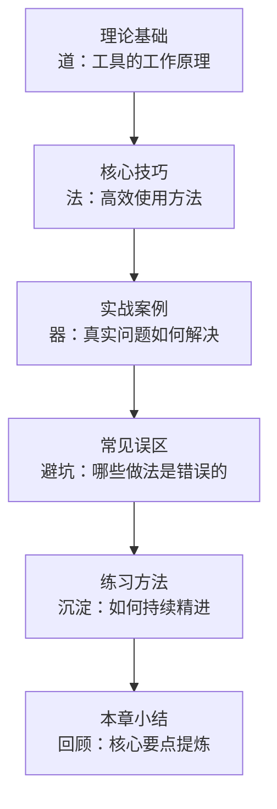
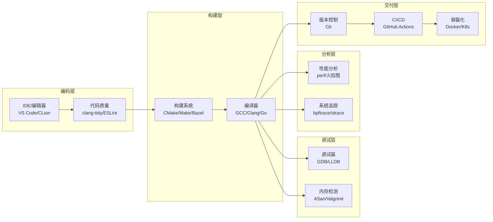
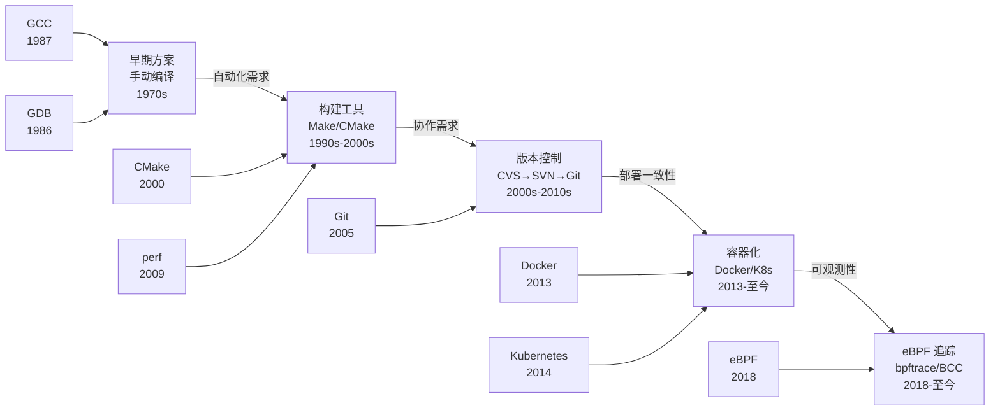

# 附录B 工具与环境搭建

## 章节概览

### 1. 为什么工具链是软件工程师的第二语言

"工欲善其事，必先利其器。" 这句古语在软件工程领域有着极其精确的现代映射：**工具链的熟练程度，直接决定了你能否高效地编写、调试、分析和交付软件系统**。

然而，一个令人遗憾的现实是——大多数软件工程师对工具的掌握停留在"能用"的层面。他们知道 `gcc -o` 可以编译代码，知道 `gdb` 可以调试程序，知道 `git commit` 可以提交代码，但对这些工具的进阶能力和底层机制几乎一无所知。当遇到复杂问题时，他们只能依赖"重启试试"或"换个方法写"这样的低效策略，而不是利用工具链进行系统性的诊断和分析。

**工具链知识的价值体现在以下关键场景中**：

| 场景 | 缺乏工具知识的表现 | 掌握工具知识的表现 | 效率差异 |
|------|-------------------|-------------------|---------|
| 性能瓶颈定位 | 凭经验猜测瓶颈所在，盲目优化 | 用 perf 生成火焰图，精准定位热点函数 | 3-10x |
| 内存错误排查 | 花数小时逐行检查代码逻辑 | 用 ASan/Valgrind 一键检测出溢出和泄漏 | 5-20x |
| 多线程死锁 | 猜测是锁竞争问题，反复加日志 | 用 GDB 附加到进程，直接查看所有线程的锁持有状态 | 10-50x |
| 回归 bug 定位 | 逐个提交手动测试，大海捞针 | 用 `git bisect` 二分查找，几分钟定位引入 bug 的提交 | 5-15x |
| 编译性能优化 | 等待整个项目重新编译，打断思路 | 用 CMake + Ninja + ccache 实现增量编译，秒级完成构建 | 2-10x |
| 生产环境诊断 | 登上服务器抓瞎，靠经验摸索 | 用 bpftrace 追踪内核事件，安全地在生产环境进行分析 | 3-10x |
| 代码质量保障 | 上线后才发现严重缺陷 | 用 clang-tidy + ASan + CI 集成，在提交前拦截问题 | 指数级 |

**工具掌握的三个层次**：

| 层次 | 特征 | 典型表现 | 占比（估算） |
|------|------|---------|------------|
| 初级：能用 | 知道基本命令，完成简单任务 | `git commit`、`gcc -o`、`gdb program` | ~60% 的开发者 |
| 中级：用好 | 了解进阶选项，能组合工具解决复杂问题 | 条件断点、perf record + 火焰图、CMake Presets | ~30% 的开发者 |
| 高级：活用 | 理解工具原理，能扩展和定制工具行为 | 编写 bpftrace 脚本、GDB Python 扩展、自定义 clang-tidy 规则 | ~10% 的开发者 |

本附录的目标，就是帮助读者从"能用"进阶到"用好"，并为有志于"活用"的读者指明方向——不仅知道工具的命令，更理解工具的工作原理、适用场景和最佳实践。

### 2. 本附录的知识体系

本附录按照"道→法→术→器"的层次组织，从工具原理到高效实践，层层递进：

**道（理论基础）**：理解工具为什么这样设计，它的输入/输出/内部机制是什么。例如，理解 GCC 的优化 pass 链，你才能知道 `-O2` 和 `-O3` 的本质区别不是"更多优化"，而是额外启用了循环向量化、函数内联等特定 pass。

**法（核心技巧）**：掌握高效使用工具的方法论和工作流。例如，GDB 调试不是在每个可疑行加断点，而是先用核心转储缩小范围，再用条件断点精准捕获。

**术（实战案例）**：通过真实场景案例，展示如何将多个工具组合使用解决实际问题。案例来自生产环境的真实经验，而非教科书式的理想化示例。

**器（常见误区与练习）**：识别常见的认知陷阱，通过递进式练习将工具知识内化为肌肉记忆。

#### 知识体系全景

工具与环境搭建
├── 编译器工具链
│   ├── GCC
│   │   ├── 安装与配置（多平台：Ubuntu/Debian、CentOS/RHEL、macOS via Homebrew）
│   │   ├── 编译选项详解（优化级别 -O0/-O1/-O2/-O3/-Os/-Ofast、警告 -Wall/-Wextra/-Werror、标准 -std=c11/c++17）
│   │   └── 优化 pass 原理（常量折叠、死代码消除、循环优化、内联、向量化）
│   └── LLVM/Clang
│       ├── 三阶段架构（前端→优化器→后端）
│       ├── LLVM IR 中间表示
│       ├── Clang 静态分析器
│       └── Sanitizer 系列（ASan/TSan/MSan/UBSan/LSan）
│
├── 调试工具
│   ├── GDB 进阶
│   │   ├── 条件断点、数据观察点、内存检查
│   │   ├── 多线程调试（线程切换、锁状态检查、死锁检测）
│   │   ├── 远程调试（gdbserver + 网络/串口连接）
│   │   ├── 核心转储分析（core dump 生成与离线调试）
│   │   └── Python 脚本扩展（自定义 pretty-printer、自动化调试流程）
│   ├── Valgrind 内存检测
│   │   ├── Memcheck 输出解读（每种错误类型的含义）
│   │   ├── 泄漏分类（definitely/possibly/indirectly lost）
│   │   ├── Callgrind 函数级性能分析
│   │   └── 抑制文件（suppression）编写
│   └── AddressSanitizer（ASan）
│       ├── 编译时插桩 vs 运行时插桩
│       ├── 检测的 7 类内存错误（堆溢出/栈溢出/use-after-free/双释放/内存泄漏等）
│       └── ASan vs Valgrind 性能对比（速度 2x-5x，内存 2x-3x）
│
├── 性能分析工具
│   ├── perf
│   │   ├── perf stat 关键指标解读（IPC/branch-misses/cache-misses/cycles）
│   │   ├── perf record + perf report 工作流
│   │   ├── perf tracepoint 自定义追踪
│   │   └── perf sched 调度分析
│   ├── 火焰图（Flame Graph）
│   │   ├── CPU 火焰图（on-CPU 时间分布）
│   │   ├── 内存火焰图（分配热点追踪）
│   │   └── Off-CPU 火焰图（等待/阻塞时间分析）
│   ├── eBPF/bpftrace
│   │   ├── bpftrace 单行命令与脚本
│   │   ├── BCC 工具集（biosnoop、execsnoop、tcpconnect 等）
│   │   └── 自定义 eBPF 程序编写
│   └── strace/ltrace
│       ├── 系统调用追踪与统计（-c 统计、-e 过滤）
│       └── 库函数调用追踪
│
├── 构建工具
│   ├── CMake 进阶
│   │   ├── CMakeLists.txt 编写规范（target-based 设计）
│   │   ├── find_package / FetchContent / pkg-config 依赖管理
│   │   ├── CMake Presets 预设（跨平台配置管理）
│   │   └── compile_commands.json 导出（IDE/工具集成）
│   ├── Make 进阶
│   │   ├── 自动依赖生成（-MMD -MP）
│   │   ├── 条件判断与函数（ifdef/call/eval）
│   │   └── 模式规则（%.o: %.c）
│   └── 其他构建系统
│       ├── Ninja（高性能构建后端）
│       ├── Bazel（大规模跨语言构建）
│       └── Meson（现代替代方案）
│
├── 版本控制：Git 进阶
│   ├── Rebase（交互式变基：重写历史、压缩提交）
│   ├── Cherry-pick（精选提交到其他分支）
│   ├── Bisect（二分查找 bug 引入点）
│   ├── Stash（工作区暂存与恢复）
│   ├── Worktree（多工作树并行开发）
│   ├── Git Hooks（pre-commit/pre-push 自动化检查）
│   ├── Git LFS（大文件管理）
│   └── 别名与配置最佳实践
│
├── 容器环境
│   ├── Docker 基础与进阶
│   │   ├── 多阶段构建（Multi-stage Build：减小镜像体积）
│   │   ├── docker-compose 编排（多服务协同）
│   │   ├── 网络调试与命名空间（bridge/host/overlay）
│   │   ├── 资源限制（CPU/内存/IO 限额）
│   │   └── 镜像安全扫描（Trivy/Snyk）
│   └── Kubernetes 本地环境
│       ├── Kind（Docker-in-Docker 集群，适合 CI）
│       ├── Minikube（本地单节点/多节点）
│       └── kubectl 常用操作（调试/日志/端口转发）
│
├── IDE 配置
│   ├── VS Code + Remote Development
│   │   ├── Remote-SSH 远程开发
│   │   ├── 远程容器开发（Dev Containers）
│   │   └── 调试集成（launch.json 配置）
│   ├── CLion
│   │   ├── CMake 项目支持
│   │   └── GDB/LLDB 调试集成
│   └── Vim/Neovim（终端环境）
│       ├── LSP 集成（nvim-lspconfig）
│       └── 调试适配器（nvim-dap）
│
└── 开发环境自动化
    ├── 环境搭建脚本（setup_dev_env.sh：一键安装所有依赖）
    ├── 工具链版本管理（asdf/nvm/pyenv/rbenv）
    ├── Docker 化开发环境（Dev Container + VS Code）
    └── Dotfiles 管理（配置版本化与跨机器同步）

### 3. 本附录内容结构

本附录分为三大部分，加上常见误区、练习方法和总结：

| 节次 | 标题 | 核心内容 | 适合读者 | 预估阅读时间 |
|------|------|----------|----------|-------------|
| 理论基础 | 工具与环境搭建原理 | GCC/LLVM 编译器工具链、GDB/Valgrind/ASan 调试工具、perf/火焰图/eBPF 性能分析、CMake/Make 构建系统、Git 高级操作、Docker/K8s 容器环境、IDE 配置、环境自动化 | 所有软件工程师 | 2-3 小时（建议分 2-3 次阅读） |
| 核心技巧 | 工具高效使用方法 | GDB TUI 模式与配置文件、perf 火焰图一键生成、CMake 预设与编译命令导出、Git 别名与 Hooks 工作流、Docker 多阶段构建优化、bpftrace/Valgrind 高效技巧、多工具组合使用工作流 | 希望提升日常开发效率的工程师 | 1-2 小时 |
| 实战案例 | 七个真实场景案例 | GDB 调试多线程死锁、perf+火焰图优化服务性能、Valgrind 排查内存泄漏、ASan 检测缓冲区溢出、bpftrace 追踪生产环境问题、Git bisect 定位回归 bug、完整 C++ 开发环境搭建 | 遇到实际问题需要解决方案的工程师 | 2-3 小时（可按需跳转） |
| 常见误区 | 六大认知纠偏 | 盲目追求最新工具、忽略环境一致性、过度配置 IDE、版本控制使用不当、忽视本地测试、不做工具选型评估 | 所有开发者 | 30 分钟 |
| 练习方法 | 九个递进式练习 | Docker 环境搭建、Git 分支管理、CI/CD 流水线、代码格式化配置、完整项目工具链搭建 | 学习者、面试准备者 | 1-2 小时（实操） |
| 本章小结 | 核心要点回顾 | 工具选型原则、环境搭建最佳实践、Git/CI/CD 实践、代码质量保障、持续改进策略 | 所有读者 | 15 分钟 |

### 4. 工具链全景：从源码到生产

一个完整的软件开发生命周期涉及多层次的工具链。理解每层工具的定位和协作关系，是构建高效开发流程的基础：

**数据流视角**：源代码从编码层进入，经过构建层转化为可执行程序；调试层和分析层在运行时对程序进行检测和优化；交付层确保代码变更可追溯、可自动化部署。每一层的输出是下一层的输入，任何一层的缺失都会导致整个流程的效率下降。

**每层工具的核心价值**：

| 层次 | 核心工具 | 解决的核心问题 | 缺失的影响 | 推荐入门工具 |
|------|----------|---------------|-----------|------------|
| 编码层 | VS Code + Remote Development | 编码效率与远程开发 | 在本地编辑远程代码，效率极低 | VS Code + Remote-SSH |
| 构建层 | CMake + Ninja | 可重复的、高效的编译 | 手动管理编译命令，容易出错 | CMake + compile_commands.json |
| 调试层 | GDB + ASan | 快速定位程序错误 | 靠 print 和猜测排查 bug，耗时数倍 | ASan（零配置，编译即用） |
| 分析层 | perf + 火焰图 | 量化性能瓶颈 | 凭经验优化，可能南辕北辙 | perf stat + FlameGraph |
| 交付层 | Git + CI/CD | 代码版本管理与自动化交付 | 手动部署，易出错且不可追溯 | Git + GitHub Actions |
| 容器层 | Docker + Kubernetes | 环境一致性与编排调度 | "在我机器上能跑"的经典问题 | Docker + docker-compose |

**工具选型的决策树**：

当你不确定该学哪个工具时，可以按照以下优先级排序：

1. **日常高频**：Git（每天使用）、编辑器（每天使用）→ 优先掌握进阶用法
2. **问题驱动**：遇到性能问题学 perf，遇到内存问题学 ASan/Valgrind
3. **流程驱动**：需要 CI/CD 学 GitHub Actions，需要容器化学 Docker
4. **效率驱动**：构建慢学 Ninja/ccache，调试慢学 GDB TUI/核心转储

### 5. 七大工具类别横向对比

在深入学习之前，先建立全局视角。本附录涉及的七大工具类别各有其核心定位：

| 工具类别 | 代表工具 | 核心能力 | 学习曲线 | 实用价值 | 推荐入门路径 |
|----------|---------|---------|---------|---------|------------|
| 编译器工具链 | GCC, LLVM/Clang | 源代码→机器码，优化与分析 | 中等 | 理解编译优化，生成高质量代码 | 先学 GCC 基本编译选项，再了解 Clang 的 Sanitizer |
| 调试工具 | GDB, Valgrind, ASan | 程序错误检测与定位 | 中高 | 快速发现和修复 bug | ASan 零配置入门 → GDB 基本调试 → Valgrind 内存检测 |
| 性能分析 | perf, bpftrace, 火焰图 | 性能瓶颈量化分析 | 中高 | 精准定位性能问题根因 | perf stat 看概览 → perf record + 火焰图看细节 → bpftrace 做定制 |
| 构建工具 | CMake, Make, Ninja | 源代码→可执行程序的构建流程 | 中等 | 管理复杂项目的编译依赖 | CMake 基本用法 → CMake Presets → compile_commands.json |
| 版本控制 | Git | 代码版本管理与协作 | 低→高（进阶复杂） | 代码历史追踪、团队协作基础 | 基本工作流 → rebase/cherry-pick → bisect/hooks |
| 容器环境 | Docker, Kubernetes | 应用打包、隔离与编排 | 中等 | 环境一致性、部署自动化 | Docker 基本操作 → 多阶段构建 → docker-compose |
| IDE | VS Code, CLion | 代码编辑、调试、远程开发 | 低 | 开发效率的核心载体 | 基本编辑 → Remote Development → 调试集成 |

**工具组合的化学反应**：

单一工具的价值有限，但工具组合使用时会产生指数级的效率提升：

| 组合 | 使用场景 | 效果 |
|------|---------|------|
| GDB + ASan | ASan 报告错误后，用 GDB 深入分析上下文 | 从"知道有错"到"知道为什么错" |
| perf + 火焰图 | perf record 采集数据，火焰图可视化 | 从海量采样数据中一眼看出热点 |
| CMake + Ninja + ccache | CMake 生成 Ninja 构建文件，ccache 缓存编译结果 | 构建速度提升 5-10x |
| Docker + GitHub Actions | 本地 Docker 环境与 CI 环境完全一致 | 消除"本地能跑 CI 挂了"的问题 |
| Git bisect + 自动化测试 | 用测试脚本作为 bisect 的判定标准 | 几分钟定位几天前引入的 bug |
| bpftrace + Prometheus | bpftrace 采集细粒度指标，Prometheus 聚合监控 | 从宏观告警到微观根因的完整链路 |

**工具选型的核心原则**：不要追求"最强大"的工具，而是选择"最适合"的工具。一个团队熟练掌握的基础工具，远比一个无人精通的高级工具更有价值。工具的价值不在于它的功能有多丰富，而在于团队能否将其用到极致。

### 6. 技术演进脉络

软件开发工具链的发展与计算机技术的进步紧密耦合：

每个节点背后都有明确的工程动机：
- **GCC/GDB（1986-1987）**：GNU 项目为自由软件运动提供了基础编译和调试工具，打破了商业编译器的垄断
- **Make/CMake（1976/2000）**：从简单的依赖检查到跨平台的构建系统抽象，解决了"手动编译几百个文件"的噩梦
- **Git（2005）**：Linux 内核开发需要一个分布式、高性能的版本控制系统，Linus Torvalds 亲自操刀设计
- **Docker（2013）**：解决"在我机器上能跑"的环境一致性问题，基于 Linux 容器技术（cgroups + namespaces）
- **Kubernetes（2014）**：Google 将内部 Borg 系统的设计理念开源化，成为容器编排的事实标准
- **eBPF（2018）**：在不修改内核代码的情况下安全地运行自定义追踪程序，革新了系统可观测性

**演进的核心驱动力**：

| 时期 | 核心驱动力 | 工具代表 | 解决的根本问题 |
|------|-----------|---------|--------------|
| 1980s | 自由软件运动 | GCC, GDB | 打破商业工具垄断 |
| 1990s | 项目复杂度增长 | Make, autotools | 管理大规模代码库的编译 |
| 2000s | 团队协作需求 | SVN → Git | 多人并行开发的代码管理 |
| 2010s | 部署与运维效率 | Docker, K8s | 环境一致性与弹性伸缩 |
| 2020s | 可观测性与安全 | eBPF, Falco | 内核级追踪与运行时安全 |

### 7. 关键性能指标与工具能力

理解工具链时，需要关注其对开发效率和系统性能的影响：

| 指标 | 含义 | 工具层面的影响因素 | 优化方向 | 量化参考 |
|------|------|-------------------|---------|---------|
| 编译时间 | 从源码到可执行文件的时间 | 构建系统的并行化能力、增量编译 | CMake + Ninja 并行编译，ccache 缓存 | 中型项目：从 10min → 30s（增量） |
| 调试效率 | 从发现 bug 到定位根因的时间 | 调试器的功能丰富度、符号信息完整性 | 条件断点、核心转储分析、远程调试 | 复杂 bug：从数小时 → 数十分钟 |
| 性能分析精度 | 能否准确定位瓶颈 | 采样频率、事件类型、可视化效果 | perf + 火焰图 + eBPF 组合使用 | 从"大致方向"到"具体函数+行号" |
| 部署一致性 | 开发/测试/生产环境的差异 | 容器镜像的可重复性、配置管理 | Docker 多阶段构建 + K8s 声明式部署 | 环境差异导致的故障减少 80%+ |
| 代码质量 | 静态分析与动态检测的覆盖度 | linter/sanitizer 的规则完整性 | clang-tidy + ASan + CI 集成 | 线上 crash 率降低 50%+ |
| 回归检测速度 | 从代码变更到发现问题的时间 | bisect 效率、自动化测试覆盖率 | `git bisect run` + 自动化测试脚本 | 从"几天后发现"到"提交时拦截" |

### 8. 阅读指南

本附录内容较多，建议根据自身角色和需求选择阅读路径：

**初入职场的工程师**：
建议从理论基础中的 Git 进阶和 Docker 部分开始，这两个工具在日常工作中使用频率最高，掌握进阶用法能立即提升效率。然后学习 ASan（零配置，编译时加一个选项即可使用），它能帮你避免大量低级内存错误。最后再按需深入其他工具。

**后端开发者**：
重点关注 GDB 调试、perf 性能分析和 CMake 构建工具部分。当你的服务出现性能问题或难以复现的 bug 时，这些工具是你最可靠的诊断手段。建议重点阅读实战案例中的"GDB 调试多线程死锁"和"perf+火焰图优化服务性能"。

**SRE/运维工程师**：
eBPF/bpftrace 和 strace 是排查生产环境问题的利器，Docker/Kubernetes 部分则直接关联你的日常部署和运维工作。建议从"Docker 基础与进阶"入手，逐步深入到 Kubernetes 本地环境搭建。bpftrace 的学习曲线较陡，但一旦掌握，排查问题的效率会有质的飞跃。

**系统架构师**：
建议通读全文，特别注意工具组合使用的工作流部分——理解如何将多个工具串联成完整的诊断链，是架构师系统性思维的重要体现。同时关注工具选型的决策框架，这在技术方案评审中非常有价值。

**面试准备者**：
常见误区和练习方法部分是面试高频考点。建议重点练习 Git 分支管理（merge vs rebase）、Docker 多阶段构建、以及 CI/CD 流水线配置。这些是系统设计面试中的常见话题。

### 9. 前置知识

学习本附录之前，读者应具备以下基础知识：

1. **Linux 基本操作**：能使用命令行工具，理解文件系统基本概念，知道什么是进程和线程。本附录的大部分工具都运行在 Linux 环境下。如果你还不熟悉 Linux 命令行，建议先阅读第1章关于操作系统基础的内容。

2. **至少一门编程语言**：C/C++ 经验对理解编译器工具链和调试工具非常有帮助，但不强制要求。Python/Go/Java 用户同样可以从 Git、Docker、性能分析工具中受益。不同语言的读者可以从最适合自己的章节开始。

3. **基本的开发流程概念**：了解代码编写→编译→测试→部署的基本流程。本附录不会教你如何编程，但会教你如何更高效地完成这个流程。

4. **基本的网络概念**：理解 IP 地址、端口、HTTP 请求/响应等概念。远程调试、Docker 网络、Kubernetes 服务发现等内容需要这些基础。

5. **基础的版本控制概念**：了解 Git 的基本工作流（clone/add/commit/push/pull）。本附录聚焦于进阶用法，不会从零开始教 Git 基础操作。

### 10. 与其他章节的关系

本附录在全书中起到"工具支撑"的作用：

第1-8章 硬件与操作系统基础
    └── 理解 CPU/内存/IO 原理
            ↓
┌─────────────────────────────────────┐
│  附录B 工具与环境搭建（本附录）        │
│  编译器 → 调试器 → 性能分析 → 容器    │
└─────────────────────────────────────┘
            ↓                    ↓
第31章 性能分析              第46章 CI/CD
（perf/火焰图的理论基础）     （工具链自动化集成）
            ↓                    ↓
第40章 容器与编排            第34章 系统安全
（K8s 深度原理）              （安全扫描工具集成）

- **承上**：第1-8章建立了对硬件和操作系统的理论理解，本附录将这些理论转化为实际可用的工具操作。例如，理解 CPU 缓存层次（第2章）有助于解读 perf stat 中的 cache-misses 指标；理解虚拟内存机制（第4章）有助于理解 Valgrind 的内存检测原理。

- **启下**：本附录掌握的工具将贯穿后续所有章节。第31章性能分析的理论基础需要 perf 工具来实践；第40章 Kubernetes 的原理需要先用 Kind/Minikube 搭建实验环境；第46章 CI/CD 的实践需要 Git 进阶知识作为基础；第34章系统安全的安全扫描工具（Trivy、Snyk）需要 Docker 基础。

- **横向关联**：本附录的工具并非孤立存在。GDB 调试的知识在第20章操作系统原理的实验中会用到；CMake 构建的知识在第25章编译原理的实践中会用到；Docker 的知识在第40章容器与编排中会深入展开。

### 11. 常见误区速览

| 误区 | 错误认知 | 正确做法 | 深入阅读 |
|------|---------|---------|---------|
| 盲目追新 | 最新的工具一定比旧的好 | 选择团队最熟悉、生态最稳定的工具。新工具需要经过社区验证和时间检验 | 常见误区第1节 |
| 环境不一致 | 开发环境和生产环境"差不多就行" | 用 Docker 保证环境一致性，开发/测试/生产使用相同的镜像 | Docker 基础与进阶 |
| 过度配 IDE | 装满各种插件就是高效 | 只装必要的插件，保持轻量。每个插件都会增加启动时间和内存占用 | IDE 配置章节 |
| 滥用 rebase | 随时随地 rebase 保持线性历史 | 不对公共分支 rebase，保留合并历史。rebase 只适用于本地未推送的提交 | Git 进阶 |
| 忽视本地测试 | 提交了再让 CI 跑测试 | 本地先跑一遍，CI 作为安全网。本地测试的反馈循环更短 | 练习方法 |
| 不做选型评估 | 跟风使用热门工具 | 根据团队需求和项目特点做评估。最贵的工具不一定最适合你 | 七大工具类别对比 |

---

> **阅读建议**：工具的学习最好结合实际项目。建议读者在阅读本附录的同时，选择一个小型项目进行实践——搭建完整的开发环境、配置 Git 工作流、编写 CMake 构建脚本、用 GDB 调试一个真实的 bug、用 perf 分析一次性能问题。只有动手实践，工具知识才能真正内化为你的技能。
>
> **学习顺序建议**：对于时间有限的读者，推荐以下快速路径：Git 进阶 → ASan 基础 → Docker 多阶段构建 → CMake 基本用法 → perf stat + 火焰图。这条路径覆盖了日常开发中最常用的工具组合，能够在最短时间内带来最大的效率提升。
