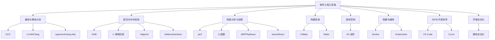
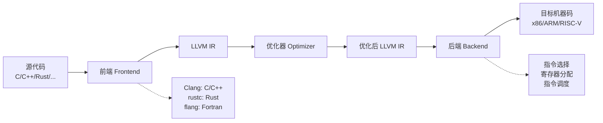
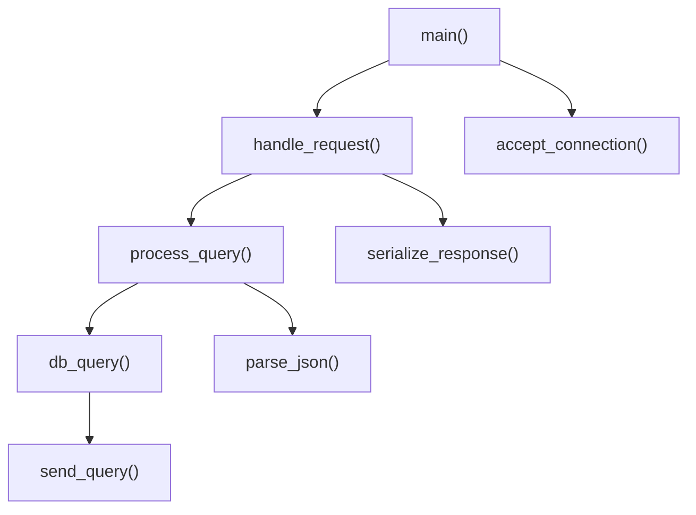
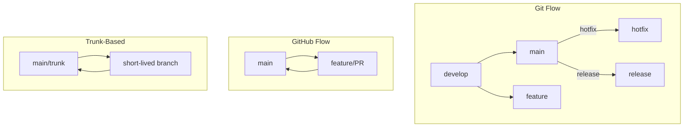
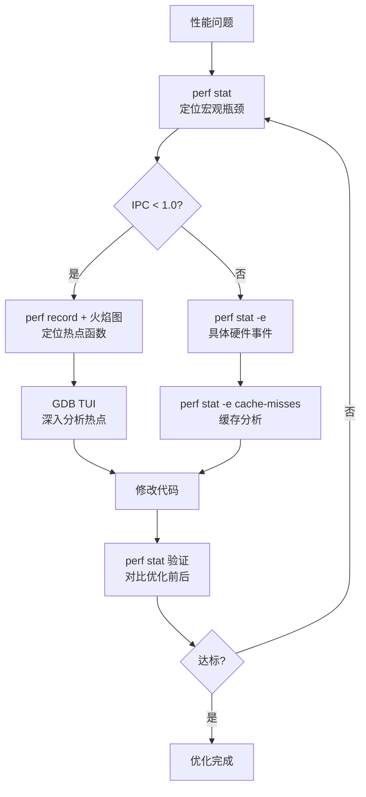

# 附录B：工具与环境搭建

> "工欲善其事，必先利其器。" ——《论语·卫灵公》

工具链的掌握程度直接决定了工程师的天花板。写代码只占开发工作的一小部分——更多的时间花在调试、排查、构建、部署、协作上。一个只会用 `gcc -o` 的工程师和一个精通 GDB 条件断点 + perf 火焰图 + ASan 内存检测的工程师，面对同一个 bug 的解决速度可能相差一个数量级。

本附录不是工具手册的简单罗列，而是围绕**编译→调试→分析→构建→协作→部署**这条完整的工程链路，逐一讲解每个环节最实用的工具和最佳实践。每个工具都从原理讲起，配以实战案例，确保你不仅知道"怎么用"，还理解"为什么这么用"。

---

## 知识体系总览



**阅读建议**：工具的学习必须结合实际项目。建议选择一个小型 C/C++ 项目作为载体，在阅读本附录的同时，逐步将 GDB、perf、Valgrind、CMake 等工具应用到该项目中。孤立地记忆命令毫无意义，在真实场景中用过一次就忘不了。

---

# 一、编译与静态分析

编译器是软件工程的基石。理解编译器不仅帮你写出更高效的代码，更能让你看懂错误信息背后的真正含义。

## 1.1 GCC：GNU 编译器套件

GCC（GNU Compiler Collection）是 Linux 世界最基础的编译工具，支持 C、C++、Fortran、Go、D 等数十种语言。几乎所有 Linux 发行版都预装或可直接安装 GCC。

### 安装

```bash
# Ubuntu/Debian
sudo apt update
sudo apt install build-essential gcc g++

# CentOS/RHEL/Rocky
sudo yum groupinstall "Development Tools"

# 验证安装
gcc --version
g++ --version
```

`build-essential` 是一个元包，它会安装 `gcc`、`g++`、`make`、`libc-dev` 等一系列编译所需的基础包。在 Ubuntu 上装完这一个就齐了。

### 核心编译选项

```bash
# 最基础的编译
gcc -o hello hello.c

# 开启所有警告（强烈推荐每次编译都加上）
gcc -Wall -Wextra -o hello hello.c

# 指定 C 标准
gcc -std=c11 -o hello hello.c    # C11
gcc -std=c17 -o hello hello.c    # C17（最新标准）

# 生成调试信息（GDB 必需）
gcc -g -o hello hello.c

# 优化级别
gcc -O0 -o hello hello.c   # 无优化（默认，调试用，运行最慢）
gcc -O1 -o hello hello.c   # 基本优化
gcc -O2 -o hello hello.c   # 推荐的发布优化级别
gcc -O3 -o hello hello.c   # 激进优化（可能增加二进制体积）
gcc -Os -o hello hello.c   # 体积优化（嵌入式常用）

# 生成汇编代码（查看编译器输出的汇编）
gcc -S -masm=intel hello.c -o hello.s

# 仅预处理（查看宏展开结果，调试宏问题的利器）
gcc -E hello.c > hello.i

# 交叉编译（在 x86 上编译 ARM 程序）
gcc -o hello hello.c -target aarch64-linux-gnu
```

### 严格警告配置

在生产项目中，推荐使用以下警告组合。把它们加到 CMakeLists.txt 或 Makefile 中，作为团队的编译规范：

```bash
gcc -Wall -Wextra -Wpedantic -Werror \
    -Wshadow -Wformat=2 -Wconversion \
    -Wnull-dereference -Wdouble-promotion \
    -Wstack-protector -Wstrict-overflow=2 \
    -o hello hello.c
```

各选项的含义：

| 选项 | 作用 | 为什么重要 |
|------|------|-----------|
| `-Wall` | 开启大多数常用警告 | 未初始化变量、隐式声明等 |
| `-Wextra` | 开启额外警告 | 未使用的参数、符号比较等 |
| `-Wpedantic` | 严格遵循 ISO C/C++ 标准 | 避免使用非标准扩展 |
| `-Werror` | 将警告视为编译错误 | CI 中强制零警告 |
| `-Wshadow` | 变量遮蔽警告 | 防止内层变量意外覆盖外层变量 |
| `-Wformat=2` | 格式化字符串安全检查 | 防止 `printf` 格式化漏洞 |
| `-Wconversion` | 隐式类型转换警告 | 防止精度丢失和符号问题 |
| `-Wnull-dereference` | 空指针解引用警告 | 在编译时发现潜在的空指针崩溃 |

`-Wconversion` 特别有价值——它会警告你所有可能丢失精度的隐式类型转换，例如把 `long` 赋给 `int`、把 `double` 赋给 `float`。这在跨平台项目中尤为重要，因为 `int` 在 32 位和 64 位系统上的大小可能不同。

### 编译器优化原理

GCC 的优化分为多个阶段：

1. **前端阶段**：语法分析、语义检查、类型推导，生成 GIMPLE 中间表示
2. **优化阶段**：基于 GIMPLE 执行数十个优化 pass
3. **后端阶段**：针对目标架构的指令选择、寄存器分配、指令调度

核心优化 pass 包括：

| 优化名称 | 英文 | 作用 | 示例 |
|---------|------|------|------|
| 常量折叠 | Constant Folding | 编译时计算常量表达式 | `3 * 4` → `12` |
| 死代码消除 | Dead Code Elimination | 删除永远不会执行的代码 | 永假条件分支内的代码 |
| 循环展开 | Loop Unrolling | 将循环体复制多次减少分支 | `for(i=0;i<4;i++)` 展开为 4 次 |
| 内联展开 | Inlining | 小函数直接嵌入调用点 | 消除函数调用开销 |
| 尾调用优化 | Tail Call Optimization | 尾递归转化为循环 | 防止递归栈溢出 |
| 循环向量化 | Auto-Vectorization | 利用 SIMD 指令并行处理 | 一次处理 4/8 个元素 |
| 公共子表达式消除 | CSE | 相同计算结果复用 | `a*b + a*b` → `t = a*b; t+t` |

你可以通过 `-S` 选项查看优化后的汇编代码，验证编译器是否做了你期望的优化：

```bash
# 对比不同优化级别下的汇编输出
gcc -O0 -S hello.c -o hello_O0.s
gcc -O2 -S hello.c -o hello_O2.s
diff hello_O0.s hello_O2.s
```

## 1.2 LLVM/Clang：模块化编译器基础设施

LLVM 是模块化的编译器框架，Clang 是基于 LLVM 的 C/C++/Objective-C 编译器。相比 GCC，Clang 的优势在于：更快的编译速度、更友好的错误信息、内置的静态分析和地址消毒器。

### 安装

```bash
# Ubuntu/Debian
sudo apt install clang clangd lldb lld

# macOS（Xcode Command Line Tools）
xcode-select --install

# 验证
clang --version
```

### Clang 核心功能

```bash
# 基本编译（与 GCC 命令行完全兼容）
clang -Wall -Wextra -o hello hello.c

# 生成 LLVM IR（中间表示——理解编译器行为的关键）
clang -S -emit-llvm hello.c -o hello.ll

# 生成优化后的 LLVM IR（查看优化器做了什么）
clang -O2 -S -emit-llvm hello.c -o hello_opt.ll

# 内置静态分析（无需运行程序即可发现 bug）
clang --analyze hello.c

# 生成编译数据库（compile_commands.json）
# 这是 clangd、clang-tidy 等工具的基础
cmake -DCMAKE_EXPORT_COMPILE_COMMANDS=ON -B build

# clang-tidy 静态检查（更深入的代码质量分析）
clang-tidy hello.c -- -std=c11

# clang-format 自动格式化
clang-format -i hello.c
```

### LLVM 三阶段架构



LLVM IR 是一种强类型的、类似汇编的低级语言，是所有 LLVM 前端的统一输出格式：

```llvm
; 一个简单的加法函数
define i32 @add(i32 %a, i32 %b) {
entry:
  %result = add i32 %a, %b
  ret i32 %result
}
```

理解 LLVM IR 的价值在于：
- **编写代码分析工具**：基于 LLVM Pass 框架编写自定义的程序分析
- **实现 DSL**：通过 MLIR 等子框架构建领域特定语言
- **理解优化效果**：通过对比优化前后的 IR，精确了解编译器做了什么

### AddressSanitizer（ASan）

ASan 是 GCC 和 Clang 内置的运行时内存错误检测器，比 Valgrind 快约 5-10 倍，是日常开发中检测内存问题的首选工具：

```bash
# 编译时启用
gcc -fsanitize=address -g -fno-omit-frame-pointer -o program program.c
clang -fsanitize=address -g -fno-omit-frame-pointer -o program program.c

# 运行——ASan 会自动检测并报告错误
./program

# 常用环境变量
ASAN_OPTIONS=detect_leaks=1:halt_on_error=0:log_path=asan.log ./program
```

ASan 能检测的错误类型：

| 错误类型 | 说明 | 示例 |
|---------|------|------|
| Heap buffer overflow | 堆缓冲区越界 | `malloc(4)` 后写 `data[5]` |
| Stack buffer overflow | 栈缓冲区越界 | 数组越界写入 |
| Global buffer overflow | 全局缓冲区越界 | 全局数组越界 |
| Use after free | 释放后使用 | `free(p)` 后继续读 `*p` |
| Use after return | 返回后使用 | 函数返回局部变量的指针 |
| Use after scope | 作用域结束后使用 | 超出生命周期的栈变量 |
| Double free | 重复释放 | 对同一指针调用两次 `free` |
| Memory leak | 内存泄漏 | 分配后未释放 |

### ThreadSanitizer 和 MemorySanitizer

```bash
# TSan：检测数据竞争（多线程 bug）
clang -fsanitize=thread -g -o program program.c

# MSan：检测使用未初始化内存
clang -fsanitize=memory -g -o program program.c

# UBSan：检测未定义行为
clang -fsanitize=undefined -g -o program program.c
```

注意：这些 sanitizer 通常**不能同时启用**——每次只能用一个。推荐在日常开发中用 ASan，在 CI 中根据需要分别运行 TSan 和 UBSan。

### ASan vs Valgrind 选型对比

| 特性 | AddressSanitizer | Valgrind Memcheck |
|------|-----------------|-------------------|
| 性能开销 | ~2x（运行速度降低一半） | ~10-50x（运行极慢） |
| 内存开销 | ~3x | ~10x |
| 检测精度 | 高 | 非常高（能检测更细微的问题） |
| 使用方式 | 编译时插桩 | 运行时插桩（无需重新编译） |
| 适用场景 | 日常开发 + CI | 深度分析 + 复杂泄漏排查 |
| 是否需要源码 | 是 | 否（可分析二进制） |
| 支持的语言 | C/C++/Rust | C/C++/Fortran 等 |

**推荐策略**：日常开发用 ASan（快），CI 用 ASan + Valgrind 双检（覆盖面广），复杂泄漏用 Valgrind 深度分析。

## 1.3 cppcheck 与 clang-tidy

除了编译器内置的警告，独立的静态分析工具能发现更深层的问题：

```bash
# cppcheck：轻量级 C/C++ 静态分析
sudo apt install cppcheck

# 基本使用
cppcheck --enable=all --std=c11 src/

# 输出到文件
cppcheck --enable=all --std=c11 --xml src/ 2> cppcheck.xml

# clang-tidy：基于 AST 的深度分析
clang-tidy src/*.cpp -- -std=c17 -Iinclude/

# 只运行特定检查
clang-tidy src/*.cpp --checks='bugprone-*,performance-*' -- -std=c17
```

常用的 clang-tidy 检查类别：

| 类别 | 作用 | 示例 |
|------|------|------|
| `bugprone-*` | 常见编程错误 | 空指针解引用、逻辑错误 |
| `performance-*` | 性能优化建议 | 不必要的拷贝、低效容器使用 |
| `modernize-*` | 现代 C++ 改写建议 | 用 `auto`、`nullptr` 替代旧写法 |
| `readability-*` | 代码可读性建议 | 命名规范、冗余代码 |
| `cppcoreguidelines-*` | C++ Core Guidelines 检查 | 内存管理、资源管理 |

---

# 二、调试工具

调试能力是区分初级和高级工程师的关键指标。很多工程师只会在 IDE 里点断点，但在面对复杂的生产环境问题（多线程死锁、内存损坏、性能退化）时，命令行调试工具是唯一的选择。

## 2.1 GDB：GNU 调试器

GDB（GNU Debugger）是 Linux 下最强大的调试器，支持 C、C++、Rust、Go 等多种语言。

### 编译准备

调试的前提是编译时包含调试信息：

```bash
# 调试用编译：-g 生成调试符号，-O0 禁止优化
gcc -g -O0 -o program program.c

# 也可以调试优化后的代码（有时 bug 只在优化后出现）
gcc -g -O2 -o program program.c
# 注意：优化可能导致变量被优化掉、单步执行跳跃等问题
```

### 基础操作

```bash
gdb ./program              # 启动 GDB

# 断点操作
(gdb) break main           # 在 main 函数设置断点
(gdb) break file.c:42      # 在文件第 42 行设置断点
(gdb) break func_name      # 在函数名处设置断点
(gdb) info breakpoints     # 查看所有断点
(gdb) delete 1             # 删除 1 号断点

# 运行控制
(gdb) run                  # 启动程序
(gdb) run arg1 arg2        # 带参数启动
(gdb) next                 # 单步执行（不进入函数）
(gdb) step                 # 单步执行（进入函数）
(gdb) finish               # 执行到当前函数返回
(gdb) continue             # 继续执行到下一个断点

# 查看信息
(gdb) print var            # 打印变量值
(gdb) print *ptr           # 打印指针指向的内容
(gdb) print sizeof(var)    # 查看大小
(gdb) ptype var            # 查看类型定义
(gdb) backtrace            # 查看调用栈（最常用的命令之一）
(gdb) info locals          # 查看当前帧的所有局部变量
```

### 条件断点——精准捕获

条件断点在满足条件时才中断，是调试循环和大批量数据处理时的利器：

```bash
# 当 i 等于 100 时中断
(gdb) break file.c:42 if i == 100

# 当字符串匹配时中断
(gdb) break file.c:42 if strcmp(name, "target") == 0

# 当某个条件为真时中断（例如计数器达到阈值）
(gdb) break process_item if counter == 1000

# 修改已有断点的条件
(gdb) condition 1 i == 200

# 查看所有断点及其条件
(gdb) info break
```

### 数据观察点——追踪变量变化

当 bug 表现为"某个变量莫名其妙被改了"时，数据观察点是你的最佳搭档：

```bash
# 当变量值改变时中断（写观察点）
(gdb) watch var

# 当变量被读取时中断（读观察点）
(gdb) rwatch var

# 读写都中断
(gdb) awatch var

# 观察内存地址的变化
(gdb) watch *(int*)0x7fffffffe000

# 观察结构体成员
(gdb) watch my_struct.field
```

注意：数据观察点通过硬件调试寄存器实现，通常只有 4 个硬件观察点可用。如果超出，GDB 会退化为软件模拟，速度会大幅下降。

### 内存检查——深入底层

```bash
# 查看内存内容（x 命令格式：x/[数量][格式][宽度] 地址）
(gdb) x/20xw $rsp           # 查看栈顶 20 个字（十六进制，4字节宽）
(gdb) x/10s 0x400000        # 查看字符串
(gdb) x/20i $rip            # 查看接下来 20 条汇编指令
(gdb) x/10xg $rsp           # 以 8 字节宽查看（64 位指针）

# 查看变量的内存布局（对齐、填充问题）
(gdb) p &amp;var                # 查看变量地址
(gdb) p sizeof(var)         # 查看变量大小
(gdb) ptype /o var          # 查看类型定义及偏移量（调试结构体对齐时非常有用）
```

### 多线程调试

```bash
# 查看所有线程
(gdb) info threads
# 输出示例：
#   Id   Target Id         Frame
# * 1    Thread 0x7f...1  main () at server.cpp:42
#   2    Thread 0x7f...2  worker_thread () at worker.cpp:15
#   3    Thread 0x7f...3  accept_connection () at network.cpp:8

# 切换到指定线程
(gdb) thread 2

# 在所有线程的指定位置设置断点
(gdb) break file.c:42 thread all

# 查看所有线程的调用栈（死锁排查的核心命令）
(gdb) thread apply all backtrace

# 为每个线程设置日志
(gdb) set logging on
(gdb) thread apply all backtrace
# 输出会保存到 gdb.txt
```

### 远程调试

当程序运行在远程服务器或嵌入式设备上时，通过 `gdbserver` 进行远程调试：

```bash
# 在目标机器上
gdbserver :1234 ./program          # 监听 1234 端口

# 在开发机上
gdb ./program
(gdb) target remote 192.168.1.100:1234
(gdb) break main
(gdb) continue

# 通过 SSH 隧道（更安全）
# 在本地终端
ssh -L 1234:localhost:1234 user@remote-server

# 然后直接连接本地端口
(gdb) target remote localhost:1234
```

### 核心转储分析

程序崩溃时的核心转储（core dump）是调试生产环境问题的关键线索：

```bash
# 1. 启用核心转储
ulimit -c unlimited                  # 允许生成 core 文件
echo '/tmp/core.%e.%p' | sudo tee /proc/sys/kernel/core_pattern

# 2. 程序崩溃后，加载核心转储
gdb ./program core.12345.67890

# 3. 查看崩溃时的状态
(gdb) backtrace                      # 查看崩溃时的调用栈
(gdb) backtrace full                 # 同时显示局部变量
(gdb) info registers                 # 查看寄存器状态
(gdb) frame 3                        # 切换到第 3 帧
(gdb) print var                      # 查看该帧的变量
(gdb) list                           # 查看崩溃点附近的源码

# 4. 也可以在程序运行中手动生成核心转段
(gdb) generate-core-file             # 在断点处手动生成
```

### GDB 配置文件

创建 `~/.gdbinit` 让 GDB 默认行为更友好：

```bash
# ~/.gdbinit
set print pretty on                  # 美化结构体输出
set print array on                   # 数组分行显示
set pagination off                   # 关闭分页（脚本友好）
set history save on                  # 保存命令历史
set history filename ~/.gdb_history
set confirm off                      # 关闭确认提示
set follow-fork-mode child           # fork 后跟踪子进程
set print object on                  # 显示 C++ 虚表

# 自定义快捷命令
define ll
    info locals
end
document ll
    Print all local variables in the current frame.
end

define bt
    backtrace
end

define startup
    set pagination off
    set confirm off
end
```

### TUI 模式

GDB 内置的文本用户界面，可以同时查看源码、汇编和命令：

```bash
(gdb) layout src             # 源代码窗口
(gdb) layout asm             # 汇编窗口
(gdb) layout split           # 源代码 + 汇编分屏
(gdb) layout regs            # 寄存器视图

(gdb) focus cmd              # 焦点切换到命令窗口
(gdb) focus src              # 焦点切换到源码窗口
(gdb) winheight src +5       # 调整窗口高度

# 快捷键
# Ctrl+x 2：切换普通/TUI 模式
# Ctrl+x a：切换 TUI 开/关
```

### GDB + VS Code 集成

```json
// .vscode/launch.json
{
    "version": "0.2.0",
    "configurations": [
        {
            "name": "Debug (GDB)",
            "type": "cppdbg",
            "request": "launch",
            "program": "${workspaceFolder}/build/myapp",
            "args": [],
            "stopAtEntry": false,
            "cwd": "${workspaceFolder}",
            "environment": [],
            "externalConsole": false,
            "MIMode": "gdb",
            "setupCommands": [
                {
                    "description": "Enable pretty-printing",
                    "text": "-enable-pretty-printing",
                    "ignoreFailures": true
                }
            ],
            "preLaunchTask": "CMake: build",
            "miDebuggerPath": "/usr/bin/gdb"
        }
    ]
}
```

## 2.2 rr：录制与回放调试器

rr（Record and Replay）是 Mozilla 开发的革命性调试工具。它能录制程序的一次执行过程，然后反复、确定性地回放——包括时间倒流。这意味着你可以在崩溃后用 GDB 无限次"重来"。

```bash
# 安装
sudo apt install rr

# 录制程序执行
rr record ./program

# 回放（会自动启动 GDB）
rr replay

# 在 GDB 回放中的特殊操作
(gdb) run              # 从头开始回放
(gdb) reverse-continue  # 反向执行到上一个断点
(gdb) reverse-step      # 反向单步
(gdb) reverse-next      # 反向单步（不进入函数）
```

rr 的典型应用场景：
- **崩溃后调试**：程序崩溃时，rr 已经录制了完整的执行历史，你可以用 GDB 反向执行到崩溃点之前，查看所有变量的状态
- **竞态条件**：多线程 bug 往往难以复现，rr 可以确定性回放，让竞态条件 100% 复现
- **测试驱动开发**：录制测试失败的场景，然后反复回放修改过程

注意：rr 只支持 Linux x86-64，且需要硬件虚拟化支持。在 Docker 容器中使用需要 `--privileged` 标志。

## 2.3 Valgrind：程序分析框架

Valgrind 是功能强大的程序分析框架，其中最常用的工具是 Memcheck（内存错误检测）。

### Memcheck 基本用法

```bash
# 安装
sudo apt install valgrind

# 基本检测
valgrind --leak-check=full --show-leak-kinds=all ./program

# 详细检测 + 输出到文件
valgrind --leak-check=full \
         --show-leak-kinds=all \
         --track-origins=yes \
         --verbose \
         --log-file=valgrind.log \
         ./program
```

### 输出解读

==12345== Invalid read of size 4
==12345==    at 0x400542: main (test.c:10)
==12345==  Address 0x5204048 is 0 bytes after a block of size 8 alloc'd
==12345==    at 0x4C2AB80: malloc (in /usr/lib/valgrind/...)
==12345==    by 0x400522: main (test.c:8)

==12345== 8 bytes in 1 blocks are definitely lost
==12345==    at 0x4C2AB80: malloc (in /usr/lib/valgrind/...)
==12345==    by 0x400522: main (test.c:8)

关键术语：
- **Invalid read/write**：读/写了非法内存地址（越界、释放后使用）
- **definitely lost**：确定的内存泄漏（没有任何指针指向这块内存）
- **indirectly lost**：间接泄漏（父对象泄漏导致子对象也泄漏）
- **possibly lost**：可能泄漏（存在指向内存中部的指针）
- **still reachable**：可达但未释放（程序结束时仍持有的内存，通常不是 bug）

### Valgrind 抑制文件

当第三方库有已知的、无害的内存问题时，用抑制文件过滤噪音：

```bash
# suppression.supp
{
   libcrypto_known_leak
   Memcheck:Leak
   match-leak-kinds: possible
   fun:CRYPTO_malloc
   fun:CRYPTO_realloc
}

{
   libssl_false_positive
   Memcheck:Leak
   match-leak-kinds: possible
   fun:SSL_new
}

# 使用
valgrind --suppressions=suppression.supp --leak-check=full ./program

# 也可以让 Valgrind 自动生成抑制文件模板
valgrind --gen-suppressions=all ./program 2>&amp;1 | grep -A 20 "^{" > suppressions.supp
```

### Valgrind + GDB 联合调试

```bash
# 终端 1：启动 Valgrind 的 GDB 服务器
valgrind --vgdb=yes --vgdb-error=0 ./program

# 终端 2：用 GDB 连接
gdb ./program
(gdb) target remote | vgdb
(gdb) break some_function
(gdb) continue
```

这种组合让你能用 GDB 的交互式调试能力，同时享受 Valgrind 的内存检测。

### Valgrind 工具集

Valgrind 不只有 Memcheck，还有其他专业工具：

| 工具 | 用途 | 命令示例 |
|------|------|---------|
| Memcheck | 内存错误检测 | `valgrind --tool=memcheck` |
| Cachegrind | 缓存命中分析 | `valgrind --tool=cachegrind` |
| Callgrind | 函数调用分析 | `valgrind --tool=callgrind` |
| Helgrind | 多线程错误检测 | `valgrind --tool=helgrind` |
| DRD | 另一个多线程检测器 | `valgrind --tool=drd` |
| Massif | 堆内存分析 | `valgrind --tool=massif` |

```bash
# Cachegrind：分析缓存命中率
valgrind --tool=cachegrind ./program
cg_annotate cachegrind.out.12345

# Callgrind：分析函数调用开销
valgrind --tool=callgrind ./program
callgrind_annotate callgrind.out.12345

# Massif：分析堆内存使用随时间的变化
valgrind --tool=massif ./program
ms_print massif.out.12345

# Helgrind：检测多线程数据竞争
valgrind --tool=helgrind ./program
```

---

# 三、性能分析与追踪

性能优化的第一原则：**先测量，再优化**。凭直觉猜测瓶颈在哪里，往往是在浪费时间。

## 3.1 perf：Linux 性能分析利器

perf 是 Linux 内核自带的性能分析工具，可以直接读取 CPU 硬件计数器，精确测量 CPU 周期、缓存命中、分支预测等硬件事件。

### 安装

```bash
sudo apt install linux-tools-common linux-tools-generic linux-tools-$(uname -r)
```

### perf stat：性能概览

```bash
# 统计程序的性能事件
perf stat ./program
```

输出解读：

 Performance counter stats for './program':

          5,123.45 msec  task-clock                #    0.998 CPUs utilized
               123      context-switches           #   24.012 /sec
                12      cpu-migrations             #    2.343 /sec
             1,234      page-faults                #  240.908 /sec
    12,345,678,901      cycles                     #    2.410 GHz
     9,876,543,210      instructions               #    0.80  insn per cycle
     1,234,567,890      branches                   #  240.967 M/sec
        12,345,678      branch-misses              #    1.00% of all branches
     2,345,678,901      cache-references           #  457.923 M/sec
        23,456,789      cache-misses               #    1.00% of all cache-references

关键指标：

| 指标 | 含义 | 健康值 | 说明 |
|------|------|--------|------|
| insn per cycle (IPC) | 每周期指令数 | > 1.0 | < 1.0 说明 CPU 在等待（缓存未命中、分支预测失败） |
| branch-misses | 分支预测失败率 | < 5% | 过高可能需要重排条件分支 |
| cache-misses | 缓存未命中率 | < 2% | 过高说明数据访问模式差，可能需要调整数据结构布局 |
| context-switches | 上下文切换次数 | 越少越好 | 频繁切换说明线程调度问题 |
| page-faults | 缺页中断次数 | 越少越好 | 大量缺页说明内存分配问题 |

### perf record：采样分析

```bash
# 记录 CPU 采样数据（99Hz 采样频率——避免与定时器对齐）
perf record -g -F 99 ./program

# 交互式查看报告
perf report

# 记录特定事件
perf record -e cache-misses,branch-misses -g ./program

# 记录已运行的进程
perf record -g -p 12345

# 记录指定 CPU
perf record -g -C 0

# 实时查看系统热点
perf top
```

### perf trace

```bash
# 追踪系统调用（类似 strace，但开销更低）
perf trace ./program

# 只追踪特定系统调用
perf trace -e open,read,write ./program

# 统计系统调用耗时
perf trace -s ./program
```

## 3.2 火焰图

火焰图（Flame Graph）由 Brendan Gregg 发明，是性能数据可视化的标准工具。它将 perf 采样数据转换为直观的 SVG 图，让你一眼就能看到程序的热点在哪里。

### 安装

```bash
git clone https://github.com/brendangregg/FlameGraph.git ~/FlameGraph
export PATH=$PATH:~/FlameGraph
```

### 生成 CPU 火焰图

```bash
# 完整流程
perf record -g -F 99 ./program               # 采样
perf script > out.perf                        # 转换为文本格式
stackcollapse-perf.pl out.perf > out.folded   # 折叠调用栈
flamegraph.pl out.folded > cpu.svg            # 生成 SVG

# 一行命令版本
perf record -g -F 99 ./program &amp;&amp; \
perf script | stackcollapse-perf.pl | flamegraph.pl > cpu.svg
```

### 火焰图解读



解读要点：
- **X 轴**：表示采样比例，不是时间。越宽的函数表示 CPU 时间占比越大
- **Y 轴**：表示调用栈深度。底部是入口函数，越往上越具体
- **颜色**：随机选择，没有特殊含义（红/黄/绿都不代表好/坏）
- **找瓶颈**：看最宽的"平台"——那就是 CPU 时间集中的地方

### 生成内存火焰图

```bash
# 追踪内核内存分配事件
perf record -e kmem:kmalloc -g ./program
perf script | stackcollapse-perf.pl | flamegraph.pl --color=mem > mem.svg

# 追踪用户态 malloc（需要 tcmalloc 或 jemalloc 配合）
```

### 生成 Off-CPU 火焰图

Off-CPU 火焰图展示程序不在 CPU 上运行的时间花在了哪里（等待 I/O、锁、调度）：

```bash
# 追踪调度切换事件
perf record -e sched:sched_switch -g ./program
perf script | stackcollapse-perf.pl | flamegraph.pl --color=io > offcpu.svg
```

Off-CPU 火焰图对排查 I/O 瓶颈和锁竞争特别有价值——这些是 CPU 火焰图看不到的。

## 3.3 eBPF/bpftrace

eBPF（extended Berkeley Packet Filter）是 Linux 内核中最具革命性的技术之一，允许在内核空间安全地运行自定义追踪程序。bpftrace 是基于 eBPF 的高级追踪语言。

### 安装

```bash
# Ubuntu
sudo apt install bpftrace

# 验证内核支持（需要 Linux 4.9+）
cat /proc/version
```

### bpftrace 单行命令

```bash
# 追踪所有文件打开操作
sudo bpftrace -e 'tracepoint:syscalls:sys_enter_openat {
    printf("%-16s %-6d %s\n", comm, pid, str(args->filename));
}'

# 统计每个进程的系统调用次数
sudo bpftrace -e 'tracepoint:raw_syscalls:sys_enter {
    @[comm] = count();
}'

# 追踪进程创建
sudo bpftrace -e 'tracepoint:sched:sched_process_exec {
    printf("New process: %s (pid: %d)\n", str(args->filename), pid);
}'

# 统计函数执行延迟直方图
sudo bpftrace -e '
kprobe:do_sys_open { @start[tid] = nsecs; }
kretprobe:do_sys_open /@start[tid]/ {
    @usecs = hist((nsecs - @start[tid]) / 1000);
    delete(@start[tid]);
}'
```

### bpftrace 脚本模板

```bash
#!/usr/bin/env bpftrace

// 追踪指定函数的执行延迟
BEGIN
{
    printf("Tracing function latency... Hit Ctrl-C to end.\n");
}

kprobe:target_function
{
    @start[tid] = nsecs;
}

kretprobe:target_function
/@start[tid]/
{
    $duration = nsecs - @start[tid];
    @usecs = hist($duration / 1000);
    printf("%-16s %-6d %d us\n", comm, pid, $duration / 1000);
    delete(@start[tid]);
}

END
{
    clear(@start);
    printf("\nLatency distribution:\n");
}
```

### BCC 工具集

BCC（BPF Compiler Collection）提供了大量开箱即用的追踪工具：

```bash
sudo apt install bpfcc-tools

# I/O 延迟分析
sudo biolatency-bpfcc

# TCP 连接追踪
sudo tcpconnect-bpfcc

# 文件系统操作排行
sudo filetop-bpfcc

# 内存泄漏检测
sudo memleak-bpfcc -p 12345

# 进程执行追踪
sudo execsnoop-bpfcc

# 信号追踪
sudo sigsnoop-bpfcc
```

### eBPF vs strace 选型

| 特性 | eBPF/bpftrace | strace |
|------|---------------|--------|
| 性能开销 | 极低（< 1%） | 高（10-100x） |
| 生产环境可用 | 是 | 不推荐（开销太大） |
| 灵活性 | 高（可编写自定义追踪逻辑） | 中（只能追踪系统调用） |
| 内核可见性 | 深（可追踪内核函数） | 浅（仅系统调用层面） |
| 学习曲线 | 较陡 | 平缓 |

## 3.4 strace/ltrace

尽管 eBPF 更强大，strace 仍然是最常用的快速诊断工具，因为它不需要特殊权限，也不需要编译任何东西：

```bash
# 追踪所有系统调用
strace ./program

# 追踪特定系统调用
strace -e trace=open,read,write ./program

# 统计系统调用耗时
strace -c ./program

# 追踪已运行的进程
strace -p 12345

# 输出到文件
strace -o trace.log ./program

# 追踪子进程
strace -f ./program

# 追踪并显示时间戳
strace -t -e trace=network ./program
```

strace 输出解读：

open("/etc/passwd", O_RDONLY)    = 3        # 成功，返回文件描述符 3
read(3, "root:x:0:0:root:/root:/bin/bash\n"..., 4096) = 1234   # 读取 1234 字节
close(3)                          = 0
open("/nonexistent", O_RDONLY)    = -1 ENOENT (No such file or directory)  # 失败

ltrace 用于追踪动态库函数调用：

```bash
# 追踪所有库函数调用
ltrace ./program

# 追踪特定函数
ltrace -e malloc,free ./program

# 统计函数调用
ltrace -c ./program
```

**strace 的典型排查场景**：
- 程序启动失败（找不到配置文件、权限不足）
- 程序卡住（卡在哪个系统调用上）
- I/O 性能问题（哪个文件操作最慢）
- 网络连接问题（DNS 解析、TCP 连接）

---

# 四、构建系统

## 4.1 CMake：现代 C/C++ 构建标准

CMake 不是构建工具本身，而是构建系统的生成器——它生成 Makefile、Ninja 文件或 Visual Studio 项目。CMake 已经成为 C/C++ 项目的事实标准。

### CMakeLists.txt 基础结构

```cmake
cmake_minimum_required(VERSION 3.16)
project(MyProject VERSION 1.0.0 LANGUAGES C CXX)

# 设置 C++ 标准
set(CMAKE_CXX_STANDARD 17)
set(CMAKE_CXX_STANDARD_REQUIRED ON)
set(CMAKE_CXX_EXTENSIONS OFF)          # 禁用编译器扩展（更可移植）

# 导出编译数据库（clangd/clang-tidy 需要）
set(CMAKE_EXPORT_COMPILE_COMMANDS ON)

# 调试/发布配置
set(CMAKE_BUILD_TYPE Debug CACHE STRING "Build type" FORCE)

# 添加可执行文件
add_executable(myapp src/main.cpp src/utils.cpp)
target_include_directories(myapp PRIVATE ${CMAKE_SOURCE_DIR}/include)
target_compile_options(myapp PRIVATE -Wall -Wextra -Wpedantic)

# 添加静态库
add_library(mylib STATIC lib/bar.cpp lib/baz.cpp)
target_include_directories(mylib PUBLIC ${CMAKE_SOURCE_DIR}/include)

# 链接
target_link_libraries(myapp PRIVATE mylib)

# 测试
enable_testing()
add_executable(test_main test/test_main.cpp)
target_link_libraries(test_main PRIVATE mylib)
add_test(NAME test_main COMMAND test_main)
```

### 现代 CMake 最佳实践

**核心原则：使用 `target_*` 命令，不要使用全局命令。**

```cmake
# 错误（全局命令，影响所有目标）
include_directories(${CMAKE_SOURCE_DIR}/include)
link_libraries(mylib)

# 正确（target-specific，只影响指定目标）
target_include_directories(mylib PUBLIC ${CMAKE_SOURCE_DIR}/include)
target_link_libraries(myapp PRIVATE mylib)

# 创建接口库（header-only 库的标准做法）
add_library(myheaderlib INTERFACE)
target_include_directories(myheaderlib INTERFACE ${CMAKE_SOURCE_DIR}/include)
target_compile_features(myheaderlib INTERFACE cxx_std_17)

# 使用生成器表达式（根据编译器动态设置选项）
target_compile_options(myapp PRIVATE
    $<$<CXX_COMPILER_ID:GNU>:-Wall -Wextra>
    $<$<CXX_COMPILER_ID:Clang>:-Wall -Wextra -Wpedantic>
    $<$<CXX_COMPILER_ID:MSVC>:/W4>
)
```

### 查找和使用第三方库

```cmake
# 方式 1：find_package（推荐，使用系统安装的库）
find_package(Boost REQUIRED COMPONENTS filesystem system)
target_link_libraries(myapp PRIVATE Boost::filesystem Boost::system)

# 方式 2：pkg-config
find_package(PkgConfig REQUIRED)
pkg_check_modules(SQLITE3 REQUIRED sqlite3)
target_link_libraries(myapp PRIVATE ${SQLITE3_LIBRARIES})
target_include_directories(myapp PRIVATE ${SQLITE3_INCLUDE_DIRS})

# 方式 3：FetchContent（CMake 3.11+，自动下载依赖）
include(FetchContent)
FetchContent_Declare(
    fmt
    GIT_REPOSITORY https://github.com/fmtlib/fmt.git
    GIT_TAG 10.2.1
)
FetchContent_MakeAvailable(fmt)
target_link_libraries(myapp PRIVATE fmt::fmt)

# 方式 4：vcpkg 集成
# 在 CMakePresets.json 中设置 CMAKE_TOOLCHAIN_FILE
```

### CMake Presets

CMake Presets（3.19+）统一团队的构建配置，消除"你用什么参数编译的"这类沟通成本：

```json
{
    "version": 3,
    "configurePresets": [
        {
            "name": "debug",
            "displayName": "Debug Build",
            "generator": "Ninja",
            "binaryDir": "${sourceDir}/build/debug",
            "cacheVariables": {
                "CMAKE_BUILD_TYPE": "Debug",
                "CMAKE_EXPORT_COMPILE_COMMANDS": "ON"
            }
        },
        {
            "name": "release",
            "displayName": "Release Build",
            "generator": "Ninja",
            "binaryDir": "${sourceDir}/build/release",
            "cacheVariables": {
                "CMAKE_BUILD_TYPE": "Release"
            }
        },
        {
            "name": "asan",
            "displayName": "AddressSanitizer Build",
            "generator": "Ninja",
            "binaryDir": "${sourceDir}/build/asan",
            "cacheVariables": {
                "CMAKE_BUILD_TYPE": "Debug",
                "CMAKE_C_FLAGS": "-fsanitize=address -fno-omit-frame-pointer",
                "CMAKE_CXX_FLAGS": "-fsanitize=address -fno-omit-frame-pointer"
            }
        }
    ],
    "buildPresets": [
        { "name": "debug", "configurePreset": "debug" },
        { "name": "release", "configurePreset": "release" },
        { "name": "asan", "configurePreset": "asan" }
    ]
}
```

```bash
# 使用预设
cmake --preset debug
cmake --build --preset debug
ctest --preset debug

# ASan 构建
cmake --preset asan
cmake --build --preset asan
```

## 4.2 Make：理解构建系统的基石

尽管 CMake 更现代，理解 Make 对理解所有构建系统都很有价值。

### Makefile 模板

```makefile
# 变量
CC = gcc
CXX = g++
CFLAGS = -Wall -Wextra -O2 -std=c11
CXXFLAGS = -Wall -Wextra -O2 -std=c++17
LDFLAGS =
DEBUG_FLAGS = -g -O0 -fsanitize=address

# 自动依赖生成
DEPFLAGS = -MMD -MP

# 目标
TARGET = myapp
C_SRCS = $(wildcard src/*.c)
CXX_SRCS = $(wildcard src/*.cpp)
OBJS = $(C_SRCS:.c=.o) $(CXX_SRCS:.cpp=.o)
DEPS = $(OBJS:.o=.d)

# 默认目标
all: $(TARGET)

# 链接
$(TARGET): $(OBJS)
	$(CXX) $(LDFLAGS) -o $@ $^

# C 编译
%.o: %.c
	$(CC) $(CFLAGS) $(DEPFLAGS) -c -o $@ $<

# C++ 编译
%.o: %.cpp
	$(CXX) $(CXXFLAGS) $(DEPFLAGS) -c -o $@ $<

# 调试构建
debug: CFLAGS = $(DEBUG_FLAGS)
debug: CXXFLAGS = $(DEBUG_FLAGS)
debug: clean all

# 清理
clean:
	rm -f $(OBJS) $(DEPS) $(TARGET)

# 包含自动生成的依赖文件
-include $(DEPS)

.PHONY: all clean debug
```

### Make 常用函数

```makefile
# 文件查找
SRCS = $(wildcard src/*.c)
HEADERS = $(wildcard include/*.h)

# 模式替换
OBJS = $(patsubst src/%.c, build/%.o, $(SRCS))

# 字符串替换
NEW_TEXT = $(subst old,new,text)

# 去除前缀/后缀
DIRS = $(notdir $(SRCS))
BASENAMES = $(basename $(SRCS))

# 条件判断
ifeq ($(BUILD_TYPE),debug)
    CFLAGS += -g -O0
else
    CFLAGS += -O2 -DNDEBUG
endif

# 函数
rwildcard = $(foreach d,$(wildcard $(1:=/*)),$(call rwildcard,$d,$2) $(filter $(subst *,%,$2),$d))
ALL_CPP = $(call rwildcard,src,*.cpp)
```

---

# 五、版本控制：Git 进阶

## 5.1 Git Rebase

Rebase 将一个分支的提交"移植"到另一个分支上，保持线性的提交历史：

```bash
# 基本 rebase
git checkout feature
git rebase main

# 交互式 rebase（修改最近 3 个提交）
git rebase -i HEAD~3
```

交互式 rebase 的操作菜单：

pick f7f3f6d feat: add user authentication
pick 310154e fix: typo in README
pick a5f4a0d feat: add password validation

# 操作说明：
# p, pick    = 使用该提交（保持原样）
# r, reword  = 使用该提交，但修改提交信息
# e, edit    = 使用该提交，但停下来修改内容
# s, squash  = 合并到前一个提交（保留两个提交的信息）
# f, fixup   = 合并到前一个提交（丢弃此提交的信息）
# d, drop    = 删除该提交

**Rebase vs Merge 选择**：

```bash
# Merge：保留分支历史，创建合并提交
git checkout main
git merge feature
# 结果：main 上有合并提交，保留完整的分支和合并历史

# Rebase + 快进合并：线性历史
git checkout feature
git rebase main              # 将 feature 的提交"重放"到 main 最新位置
git checkout main
git merge feature            # 快进合并（fast-forward）
# 结果：线性历史，没有合并提交
```

**黄金法则：不要对已推送到公共仓库的提交进行 rebase。** Rebase 会改写提交历史，如果其他人已经基于这些提交做了开发，rebase 会导致他们的工作混乱。

## 5.2 Git Cherry-pick

将特定的提交从一个分支"摘"到另一个分支：

```bash
# 应用单个提交
git cherry-pick abc1234

# 应用多个提交
git cherry-pick abc1234 def5678

# 应用提交范围（不含起点）
git cherry-pick abc1234..def5678

# 只应用更改，不自动提交（适合手动组合多个提交）
git cherry-pick --no-commit abc1234

# 冲突解决
git cherry-pick --continue    # 解决冲突后继续
git cherry-pick --abort       # 放弃整个 cherry-pick
```

典型场景：将 hotfix 从 main 移植到 release 分支。

## 5.3 Git Bisect

使用二分查找定位引入 bug 的提交，对于大型项目特别有价值：

```bash
# 开始 bisect
git bisect start
git bisect bad HEAD              # 当前版本有 bug
git bisect good v1.0.0           # v1.0.0 没有 bug

# Git 自动检出中间版本，你测试后标记
git bisect good                  # 如果这个版本没问题
# 或
git bisect bad                   # 如果这个版本有问题

# 重复直到找到罪魁祸首
# 输出：abc1234 is the first bad commit

git bisect reset                 # 结束 bisect，回到原始分支
```

**自动化 bisect**（强烈推荐）：

```bash
# 创建测试脚本
cat > test_script.sh << 'EOF'
#!/bin/bash
make -j$(nproc) &amp;&amp; ./test_suite
exit $?
EOF
chmod +x test_script.sh

# 自动 bisect
git bisect start HEAD v1.0.0
git bisect run ./test_script.sh

# 退出码约定：
# 0    = 好版本
# 125  = 跳过此版本（无法编译等）
# 1-124, 126-127 = 坏版本
```

## 5.4 Git Stash 和 Reflog

```bash
# Stash：临时保存工作区修改
git stash                            # 保存所有修改
git stash push -m "正在开发的功能"   # 带描述保存
git stash list                       # 查看所有 stash
git stash pop                        # 恢复最近的 stash 并删除
git stash apply stash@{2}            # 恢复指定 stash（不删除）
git stash branch new-branch          # 从 stash 创建新分支
git stash drop stash@{0}             # 删除指定 stash

# Reflog：Git 的"后悔药"
git reflog                           # 查看所有 HEAD 移动记录
git checkout -b recovered abc1234    # 恢复误删的分支
git reset --hard HEAD@{2}            # 撤销误操作的 reset
```

## 5.5 Git 工作流对比



| 工作流 | 适用场景 | 优点 | 缺点 |
|--------|---------|------|------|
| Git Flow | 版本发布周期长的项目 | 分支职责清晰 | 流程复杂，合并频繁 |
| GitHub Flow | 持续部署的 Web 项目 | 简单直接 | 不适合多版本并行维护 |
| Trunk-Based | 大型团队、持续集成 | 减少合并冲突 | 需要强大的 CI 和 feature flag |

## 5.6 Git Hooks

Git hooks 在特定事件时自动执行脚本：

```bash
# .git/hooks/pre-commit（提交前检查）
#!/bin/bash
set -e

# 检查是否有未暂存的修改
if ! git diff --quiet; then
    echo "Error: unstaged changes detected"
    exit 1
fi

# 运行代码格式检查
CHANGED_FILES=$(git diff --cached --name-only --diff-filter=ACM | grep '\.cpp$\|\.h$')
if [ -n "$CHANGED_FILES" ]; then
    echo "$CHANGED_FILES" | xargs clang-format --dry-run --Werror
fi

# 运行单元测试
if [ -d "build" ]; then
    cd build &amp;&amp; ctest --output-on-failure
fi
```

```bash
# .git/hooks/commit-msg（检查提交信息格式）
#!/bin/bash
# Conventional Commits 格式检查
PATTERN="^(feat|fix|docs|style|refactor|perf|test|chore|ci|build)(\(.+\))?: .{1,72}"

if ! head -1 "$1" | grep -qE "$PATTERN"; then
    echo "Error: commit message must follow Conventional Commits format"
    echo "Example: feat: add user authentication"
    exit 1
fi
```

使用 [Husky](https://typicode.github.io/husky/)（Node.js）或 [pre-commit](https://pre-commit.com/)（Python）管理 hooks 更方便，可以版本化跟踪：

```yaml
# .pre-commit-config.yaml（Python pre-commit 框架）
repos:
  - repo: https://github.com/pre-commit/pre-commit-hooks
    rev: v4.5.0
    hooks:
      - id: trailing-whitespace
      - id: end-of-file-fixer
      - id: check-yaml
  - repo: https://github.com/psf/black
    rev: 24.3.0
    hooks:
      - id: black
  - repo: https://github.com/astral-sh/ruff-pre-commit
    rev: v0.3.0
    hooks:
      - id: ruff
```

---

# 六、容器与编排

## 6.1 Docker

Docker 通过容器化解决"在我机器上能跑"的问题——将应用及其全部依赖打包成一个可移植的镜像。

### Dockerfile 最佳实践

```dockerfile
# 多阶段构建（Go 应用示例）
# Stage 1：构建
FROM golang:1.22-alpine AS builder
WORKDIR /app

# 利用缓存层：先只复制依赖文件
COPY go.mod go.sum ./
RUN go mod download

# 再复制源码
COPY . .
RUN CGO_ENABLED=0 GOOS=linux go build -ldflags="-s -w" -o myapp .

# Stage 2：运行（极小镜像）
FROM alpine:3.19
RUN apk --no-cache add ca-certificates tzdata
RUN adduser -D -u 1001 appuser
USER appuser
WORKDIR /home/appuser/
COPY --from=builder /app/myapp .
ENTRYPOINT ["./myapp"]
```

Dockerfile 优化原则：

| 原则 | 说明 | 效果 |
|------|------|------|
| 多阶段构建 | 构建和运行分开 | 镜像体积从 1GB+ 降到 10MB |
| 合理利用缓存 | 把不变的层放前面 | 重复构建时跳过未变更的层 |
| 使用 `.dockerignore` | 排除不需要的文件 | 减少构建上下文大小 |
| 最小化层数 | 合并 RUN 命令 | 减少镜像层数 |
| 使用非 root 用户 | `USER appuser` | 安全性：即使容器被攻破，也没有 root 权限 |
| 固定基础镜像版本 | `alpine:3.19` 而非 `alpine:latest` | 可重复构建 |

### Docker Compose

```yaml
# docker-compose.yml
version: '3.8'

services:
  app:
    build: .
    ports:
      - "8080:8080"
    environment:
      - DB_HOST=db
      - REDIS_HOST=redis
    depends_on:
      db:
        condition: service_healthy
      redis:
        condition: service_healthy
    volumes:
      - .:/app                    # 源码热重载
      - /app/node_modules         # 避免覆盖容器内依赖
    restart: unless-stopped

  db:
    image: postgres:15-alpine
    environment:
      POSTGRES_DB: myapp
      POSTGRES_PASSWORD: devpassword
    volumes:
      - pgdata:/var/lib/postgresql/data
    healthcheck:
      test: ["CMD-SHELL", "pg_isready -U postgres"]
      interval: 5s
      timeout: 5s
      retries: 5

  redis:
    image: redis:7-alpine
    ports:
      - "6379:6379"
    healthcheck:
      test: ["CMD", "redis-cli", "ping"]
      interval: 5s
      timeout: 3s
      retries: 5

volumes:
  pgdata:
```

### Docker 资源限制与调试

```bash
# 资源限制
docker run -d --cpus="1.5" --memory="512m" --memory-swap="512m" myimage

# 查看容器资源使用
docker stats

# 查看容器日志
docker logs -f --tail 100 container_name

# 进入运行中的容器
docker exec -it container_name sh

# 查看容器网络
docker network inspect bridge

# 进入容器网络命名空间（不进入容器）
PID=$(docker inspect --format '{{.State.Pid}}' container_name)
nsenter -t $PID -n ip addr show
```

### Docker 安全实践

```bash
# 1. 不以 root 运行容器
docker run --user 1000:1000 myimage

# 2. 只读文件系统
docker run --read-only --tmpfs /tmp myimage

# 3. 限制系统调用
docker run --security-opt seccomp=profile.json myimage

# 4. 扫描镜像漏洞
docker scout cves myimage:latest

# 5. 使用 DockerSlim/Trivy 扫描
trivy image myimage:latest
```

## 6.2 Kubernetes 本地开发

### Kind vs Minikube 选型

| 特性 | Kind | Minikube |
|------|------|----------|
| 底层技术 | Docker 容器 | VM / Docker / Podman |
| 多节点支持 | 原生 | 需要 `--nodes` 参数 |
| 启动速度 | 快（秒级） | 较慢（分钟级） |
| 资源占用 | 低 | 中-高 |
| 插件生态 | 无 | 丰富（Dashboard、Ingress 等） |
| 适用场景 | CI/CD、轻量测试 | 本地开发、学习 |

### Kind 集群搭建

```bash
# 安装
go install sigs.k8s.io/kind@latest

# 创建单节点集群
kind create cluster --name dev

# 创建多节点集群（1 控制面 + 2 工作节点）
cat <<EOF | kind create cluster --config=-
kind: Cluster
apiVersion: kind.x-k8s.io/v1alpha4
nodes:
  - role: control-plane
    kubeadmConfigPatches:
      - |
        kind: InitConfiguration
        nodeRegistration:
          kubeletExtraArgs:
            node-labels: "ingress-ready=true"
  - role: worker
  - role: worker
EOF

# 部署应用
kubectl create deployment nginx --image=nginx --replicas=3
kubectl expose deployment nginx --port=80 --type=NodePort

# 查看状态
kubectl get nodes
kubectl get pods -o wide
kubectl describe pod <pod-name>

# 进入容器
kubectl exec -it <pod-name> -- /bin/bash

# 查看日志
kubectl logs -f <pod-name>

# 清理
kind delete cluster --name dev
```

---

# 七、IDE 与开发效率

## 7.1 VS Code + Remote Development

VS Code 的 Remote Development 扩展族允许在远程服务器上进行完整的开发体验——编辑、调试、终端全部运行在远端，本地只是一个 UI 壳。

### 必装扩展

| 扩展 | 用途 | 必要性 |
|------|------|--------|
| Remote - SSH | SSH 远程开发 | ★★★ |
| Remote - Containers | Docker 容器内开发 | ★★★ |
| C/C++ (Microsoft) | C/C++ 语言支持 | ★★★ |
| clangd | C/C++ 语言服务器（比 C/C++ 扩展更快） | ★★★ |
| CMake Tools | CMake 项目集成 | ★★★ |
| GitLens | Git 增强（blame、历史、对比） | ★★☆ |
| Docker | Docker 集成 | ★★☆ |
| Kubernetes | K8s 集成 | ★☆☆ |

### clangd 配置

clangd 是 LLVM 项目的语言服务器，比 Microsoft 的 C/C++ 扩展提供更准确的代码补全和诊断：

```json
// .vscode/settings.json
{
    // 禁用 Microsoft C/C++ 扩展的 IntelliSense（避免冲突）
    "C_Cpp.intelliSenseEngine": "disabled",

    // clangd 配置
    "clangd.path": "/usr/bin/clangd",
    "clangd.arguments": [
        "--compile-commands-dir=${workspaceFolder}/build",
        "--clang-tidy",
        "--completion-style=detailed",
        "--header-insertion=never",
        "-j=4"
    ],

    // 保存时自动格式化
    "editor.formatOnSave": true,
    "[cpp]": {
        "editor.defaultFormatter": "llvm-vs-code-extensions.vscode-clangd"
    }
}
```

## 7.2 CLion

CLion 是 JetBrains 出品的 C/C++ IDE，深度集成 CMake，提供开箱即用的调试、重构和代码分析：

- **CMake 原生支持**：自动识别 CMakeLists.txt，图形化配置构建目标
- **集成 GDB/LLDB**：图形化断点、变量查看、内存查看
- **代码分析**：内置 clang-tidy、cppcheck 集成
- **远程开发**：通过 SSH 工具链在远程服务器上编译和调试
- **重构能力**：重命名、提取函数、内联变量等，支持 C/C++

配置步骤：
1. File → Settings → Build → Toolchains → 添加 GCC/Clang 工具链
2. File → Settings → Build → CMake → 设置 CMake Profile
3. File → Settings → Editor → Code Style → 选择 Google/LLVM 风格

## 7.3 现代 CLI 工具

这些工具替代了传统的 Unix 命令，提供更好的用户体验：

| 传统工具 | 现代替代 | 优势 | 安装 |
|---------|---------|------|------|
| grep | ripgrep (rg) | 速度快 10 倍，自动忽略 .gitignore | `apt install ripgrep` |
| find | fd | 语法更简洁，速度更快 | `apt install fd-find` |
| cat | bat | 语法高亮、行号、Git diff | `apt install bat` |
| ls | exa/eza | 彩色输出、Git 状态、树状显示 | `apt install exa` |
| top | htop/btop | 交互式、更美观 | `apt install htop` |
| du | dust | 可视化磁盘使用 | `cargo install dust` |
| du (文件数) | ncdu | 交互式目录分析 | `apt install ncdu` |
| diff | delta | 语法高亮 diff | `cargo install git-delta` |

```bash
# ripgrep 使用示例
rg "TODO|FIXME|HACK" --type cpp          # 在 C++ 文件中搜索
rg -l "error" --glob "*.log"             # 列出包含 error 的日志文件
rg "pattern" -g '!vendor/'               # 排除 vendor 目录

# fd 使用示例
fd -e cpp -e h                           # 查找所有 .cpp 和 .h 文件
fd test                                  # 查找文件名包含 test 的文件
fd -x rm {}                              # 批量操作

# bat 使用示例
bat src/main.cpp                         # 语法高亮查看
bat -l cpp TODO                          # 指定语言高亮
```

---

# 八、环境自动化

## 8.1 一键搭建脚本

```bash
#!/bin/bash
# setup_dev_env.sh - C++ 开发环境自动化搭建
# 用法: sudo ./setup_dev_env.sh

set -euo pipefail

echo "=========================================="
echo "  C++ Development Environment Setup"
echo "=========================================="

# 颜色定义
RED='\033[0;31m'
GREEN='\033[0;32m'
NC='\033[0m'

log() { echo -e "${GREEN}[INFO]${NC} $1"; }
error() { echo -e "${RED}[ERROR]${NC} $1"; exit 1; }

# 检查系统
if [[ $EUID -ne 0 ]]; then
    error "请使用 sudo 运行此脚本"
fi

# 检测发行版
if command -v apt &amp;> /dev/null; then
    PKG_MANAGER="apt"
elif command -v yum &amp;> /dev/null; then
    PKG_MANAGER="yum"
else
    error "不支持的包管理器"
fi

log "检测到包管理器: $PKG_MANAGER"

# 编译工具链
log "安装编译工具链..."
if [ "$PKG_MANAGER" = "apt" ]; then
    apt update
    apt install -y build-essential cmake ninja-build \
        clang clangd lldb lld \
        gdb valgrind \
        git git-lfs
else
    yum groupinstall -y "Development Tools"
    yum install -y cmake ninja-build clang clang-tools-extra \
        gdb valgrind git git-lfs
fi

# perf 工具
log "安装性能分析工具..."
if [ "$PKG_MANAGER" = "apt" ]; then
    apt install -y linux-tools-common linux-tools-generic \
        linux-tools-$(uname -r) bpftrace bpfcc-tools
fi

# Docker
if ! command -v docker &amp;> /dev/null; then
    log "安装 Docker..."
    if [ "$PKG_MANAGER" = "apt" ]; then
        apt install -y docker.io
    else
        yum install -y docker
    fi
    systemctl start docker
    systemctl enable docker
fi

# FlameGraph
if [ ! -d "$HOME/FlameGraph" ]; then
    log "安装 FlameGraph..."
    git clone https://github.com/brendangregg/FlameGraph.git "$HOME/FlameGraph"
fi

# Git 配置
log "配置 Git..."
git config --global core.editor vim
git config --global init.defaultBranch main
git config --global pull.rebase true

# 环境变量
log "配置环境变量..."
cat >> /etc/profile.d/dev-tools.sh << 'ENVEOF'
export PATH="$PATH:$HOME/FlameGraph"
ENVEOF

echo ""
echo "=========================================="
echo "  安装完成！"
echo "=========================================="
echo ""
echo "已安装的工具："
echo "  编译: gcc, g++, clang, clangd, cmake, ninja"
echo "  调试: gdb, valgrind, lldb"
echo "  性能: perf, bpftrace, FlameGraph"
echo "  容器: docker"
echo "  版本: git"
echo ""
echo "请重新登录以使环境变量生效。"
```

## 8.2 项目模板生成

```bash
#!/bin/bash
# new_project.sh - 创建标准化 C++ 项目
# 用法: ./new_project.sh <project_name>

set -euo pipefail

PROJECT_NAME="${1:?用法: $0 <project_name>}"

mkdir -p "$PROJECT_NAME"/{src,include,test,build,docs}

# CMakeLists.txt
cat > "$PROJECT_NAME/CMakeLists.txt" << 'EOF'
cmake_minimum_required(VERSION 3.16)
project(@PROJECT@ VERSION 1.0.0 LANGUAGES CXX)

set(CMAKE_CXX_STANDARD 17)
set(CMAKE_CXX_STANDARD_REQUIRED ON)
set(CMAKE_EXPORT_COMPILE_COMMANDS ON)
set(CMAKE_BUILD_TYPE Debug)

# 源文件
file(GLOB_RECURSE SOURCES src/*.cpp)

# 主程序
add_executable(${PROJECT_NAME} ${SOURCES})
target_include_directories(${PROJECT_NAME} PRIVATE include)
target_compile_options(${PROJECT_NAME} PRIVATE -Wall -Wextra -Wpedantic)

# 测试
enable_testing()
find_package(GTest QUIET)
if(GTest_FOUND)
    file(GLOB_RECURSE TEST_SOURCES test/*.cpp)
    add_executable(tests ${TEST_SOURCES})
    target_link_libraries(tests PRIVATE ${PROJECT_NAME} GTest::gtest_main)
    add_test(NAME all_tests COMMAND tests)
endif()
EOF
sed -i "s/@PROJECT@/$PROJECT_NAME/g" "$PROJECT_NAME/CMakeLists.txt"

# .gitignore
cat > "$PROJECT_NAME/.gitignore" << 'EOF'
build/
*.o
*.a
*.so
*.d
.vscode/
.idea/
compile_commands.json
EOF

# main.cpp
cat > "$PROJECT_NAME/src/main.cpp" << 'EOF'
#include <cstdio>

int main() {
    printf("Hello, World!\n");
    return 0;
}
EOF

# README.md
cat > "$PROJECT_NAME/README.md" << EOF
# $PROJECT_NAME

## 构建

\`\`\`bash
cmake -B build -G Ninja
cmake --build build
\`\`\`

## 运行

\`\`\`bash
./build/$PROJECT_NAME
\`\`\`

## 测试

\`\`\`bash
cd build &amp;&amp; ctest
\`\`\`
EOF

# Git 初始化
cd "$PROJECT_NAME"
git init
git add .
git commit -m "feat: initial project setup"

echo "项目 $PROJECT_NAME 创建完成！"
echo "  cd $PROJECT_NAME"
echo "  cmake -B build -G Ninja &amp;&amp; cmake --build build"
```

---

# 九、工具组合工作流

掌握单个工具只是基础，真正的效率来自工具之间的组合。以下是几个经过验证的高效工作流：

## 9.1 性能优化工作流



```bash
# Step 1: perf stat 获取概览
perf stat ./httpserver

# Step 2: 如果 IPC 低，生成火焰图
perf record -g -F 99 ./httpserver &amp;
wrk -t4 -c100 -d30s http://localhost:8080/api
kill %1
perf script | stackcollapse-perf.pl | flamegraph.pl > flame.svg

# Step 3: 在火焰图中找到最宽的"平台"
# 假设发现 45% 时间在 std::unordered_map::find()

# Step 4: GDB 深入分析
gdb ./httpserver
(gdb) break unordered_map_find
(gdb) run
(gdb) layout split
(gdb) info locals

# Step 5: 优化后验证
perf stat ./httpserver_optimized
# 对比 IPC、cache-misses 等指标
```

## 9.2 内存问题排查工作流

```bash
# Step 1: ASan 快速扫描（开发阶段）
gcc -fsanitize=address -g -fno-omit-frame-pointer -o program program.c
./program
# 如果 ASan 报告错误 → 根据输出直接定位问题

# Step 2: Valgrind 深度分析（ASan 未发现问题时）
valgrind --leak-check=full --show-leak-kinds=all --track-origins=yes \
    --log-file=valgrind.log ./program
cat valgrind.log

# Step 3: 多线程问题用 Helgrind
valgrind --tool=helgrind ./program

# Step 4: 堆内存增长分析用 Massif
valgrind --tool=massif ./program
ms_print massif.out.*

# Step 5: 复杂场景用 GDB + Valgrind 联合
valgrind --vgdb=yes --vgdb-error=0 ./program &amp;
# 另一个终端
gdb ./program
(gdb) target remote | vgdb
(gdb) watch *(int*)0x...        # 在 Valgrind 发现的问题地址设观察点
(gdb) continue
```

## 9.3 生产环境诊断工作流

```bash
# Step 1: 快速状态检查
strace -c -p <PID> -f           # 统计系统调用（运行 10 秒后 Ctrl+C）
top -p <PID>                    # CPU/内存使用
cat /proc/<PID>/status          # 进程详细状态

# Step 2: bpftrace 精确诊断
# 追踪读操作延迟
sudo bpftrace -e '
tracepoint:syscalls:sys_enter_read { @start[tid] = nsecs; }
tracepoint:syscalls:sys_exit_read /@start[tid]/ {
    @usecs = hist((nsecs - @start[tid]) / 1000);
    delete(@start[tid]);
}'

# 追踪文件打开
sudo bpftrace -e '
tracepoint:syscalls:sys_enter_openat {
    printf("%-16s %-6d %s\n", comm, pid, str(args->filename));
}'

# Step 3: 如果怀疑是锁竞争
perf record -e sched:sched_switch -g -p <PID> -- sleep 10
perf script | stackcollapse-perf.pl | flamegraph.pl --color=io > offcpu.svg

# Step 4: 如果怀疑是网络问题
sudo tcpconnect-bpfcc           # 追踪出站 TCP 连接
sudo tcpretrans-bpfcc           # 追踪 TCP 重传
```

---

# 十、常见误区

## 误区一：盲目追求最新版本

**错误认知**："新工具一定比旧工具好，应该第一时间升级。"

**实际情况**：新版本可能引入未发现的 bug，与项目依赖的其他工具不兼容，或社区支持尚不成熟。

**正确做法**：在个人项目中尝试新工具积累经验；团队项目优先使用 LTS 版本；引入新工具前进行 PoC 验证。

## 误区二：忽略开发环境一致性

**错误认知**："我这里能跑就行，环境问题让他们自己解决。"

**实际情况**：不同操作系统、不同版本的运行时、不同系统库版本——"在我机器上没问题"是团队协作的头号杀手。

**正确做法**：用 Docker 统一开发环境；用版本管理器锁定运行时版本（pyenv/nvm/rustup）；提供一键环境搭建脚本；CI 使用与开发一致的容器镜像。

## 误区三：把 GDB 当 print 用

**错误认知**："调试就是加 print 然后重新编译。"

**实际情况**：每次加 print → 编译 → 运行的循环可能需要几十秒。GDB 的断点、条件断点、数据观察点让你在运行中实时检查状态，效率高一个数量级。

**正确做法**：花 30 分钟学习 GDB 的条件断点和数据观察点。对于多线程问题，学会 `thread apply all backtrace`。对于难以复现的问题，试试 `rr` 录制回放。

## 误区四：不写 .dockerignore

**错误认知**：Docker 构建只关心 Dockerfile 里的内容。

**实际情况**：Docker 构建上下文会发送整个项目目录到 Docker daemon。没有 `.dockerignore`，`node_modules`、`.git`、构建产物都会被发送，大幅拖慢构建速度。

**正确做法**：创建 `.dockerignore`，排除 `node_modules/`、`.git/`、`build/`、`*.o` 等不需要的文件。

## 误区五：提交信息随意

**错误认知**："Git 就是用来存代码的，提交信息写什么无所谓。"

**实际情况**：一个月后你面对 `fix bug` 这样的提交信息，完全不知道当时修了什么、为什么修。

**正确做法**：遵循 Conventional Commits 规范（`feat:`、`fix:`、`docs:` 等前缀），每个提交只做一件事，保持原子性。用 `git log --oneline` 时能一眼看出每个提交做了什么。

## 误区六：不做工具选型评估

**错误认知**："这个工具大家都在用，我们也用。"

**实际情况**：别人的场景和你不同。热门工具可能不适合你的技术栈、团队规模或性能要求。

**正确做法**：工具选型考虑六个维度——功能匹配度、社区活跃度、学习曲线、长期维护性、迁移成本、性能消耗。通过 PoC 在小范围内验证后再做决策。

---

# 十一、练习

## 练习 1：Docker 化开发环境

**目标**：用 Docker 统一开发环境，实现"克隆即运行"。

**任务**：
1. 为一个 Web 项目编写 Dockerfile（多阶段构建）和 docker-compose.yml
2. 包含应用、PostgreSQL、Redis 三个服务
3. 实现健康检查、数据持久化、代码热重载
4. 编写 `.dockerignore` 和一键启动脚本
5. 让另一个团队成员克隆项目后一条命令启动

## 练习 2：Git 工作流实战

**目标**：掌握分支管理、代码评审和 bisect 调试。

**任务**：
1. 创建仓库，模拟多人协作：feature 分支 → rebase → 合并
2. 使用交互式 rebase 整理 5 个提交的历史
3. 编写自动化测试脚本，用 `git bisect run` 定位一个故意引入的 bug
4. 配置 pre-commit hook 自动运行代码格式检查

## 练习 3：性能分析全流程

**目标**：从发现性能问题到优化验证的完整闭环。

**任务**：
1. 编写一个有性能问题的程序（例如 O(n²) 暴力搜索）
2. 用 `perf stat` 分析瓶颈类型
3. 用 `perf record` + 火焰图定位热点函数
4. 优化算法，重新测量验证
5. 编写优化报告，对比优化前后的 perf stat 指标

## 练习 4：内存问题排查

**目标**：掌握 ASan 和 Valgrind 的使用。

**任务**：
1. 编写一个有内存泄漏和缓冲区溢出的程序
2. 用 ASan 快速定位缓冲区溢出
3. 用 Valgrind 定位内存泄漏
4. 修复所有问题，确保 ASan 和 Valgrind 报告零错误
5. 将检测集成到 CI 流水线中

## 练习 5：完整项目工具链搭建

**目标**：从零搭建一个标准化项目的完整工具链。

**任务**：选择你熟悉的语言，搭建包含以下内容的项目模板：
1. CMake/Make 构建配置（含 Presets）
2. 代码格式化 + lint 配置
3. Git hooks（pre-commit + commit-msg）
4. CI/CD 流水线（GitHub Actions）
5. Docker 化开发环境
6. README 文档

**验收标准**：新成员克隆项目后运行一个脚本即可开始开发，提交代码自动触发检查和测试。

---

# 本章小结

## 核心原则

**环境一致性是协作的基础。** 用 Docker 容器化、依赖版本锁定、配置文件版本化等手段，确保所有开发者的环境完全一致。消除"在我机器上能跑"的问题。

**自动化是效率的倍增器。** 代码格式化、lint 检查、测试运行、构建部署——所有重复性手动操作都应该被自动化。一次投入配置的时间，换来团队每人每天的时间节省。

**先测量，再优化。** 性能优化不要靠猜，用 perf/stat 实测。内存问题不要靠想，用 ASan/Valgrind 实测。用数据驱动决策。

## 工具选型要点

| 维度 | 考虑因素 |
|------|---------|
| 功能匹配度 | 是否满足核心需求 |
| 社区活跃度 | GitHub Stars、Issue 响应、Release 频率 |
| 学习曲线 | 团队能否快速上手 |
| 长期维护性 | 是否有持续维护 |
| 迁移成本 | 从现有方案迁移的难度 |
| 性能消耗 | 是否满足项目要求 |

## 推荐学习路径

1. **初级**：熟练使用一个 IDE + 掌握 Git 基本操作 + 配置基本 CI/CD
2. **中级**：Docker 化开发环境 + 代码质量工具链 + 自动化部署
3. **高级**：GDB 高级调试 + perf 性能分析 + eBPF 内核追踪 + 基础设施即代码

工具的价值在于使用。不要追求掌握所有工具的所有功能，而是深入掌握与当前工作最相关的工具，并在实际项目中反复练习。最好的工具链是让开发者感觉不到它存在的工具链。
