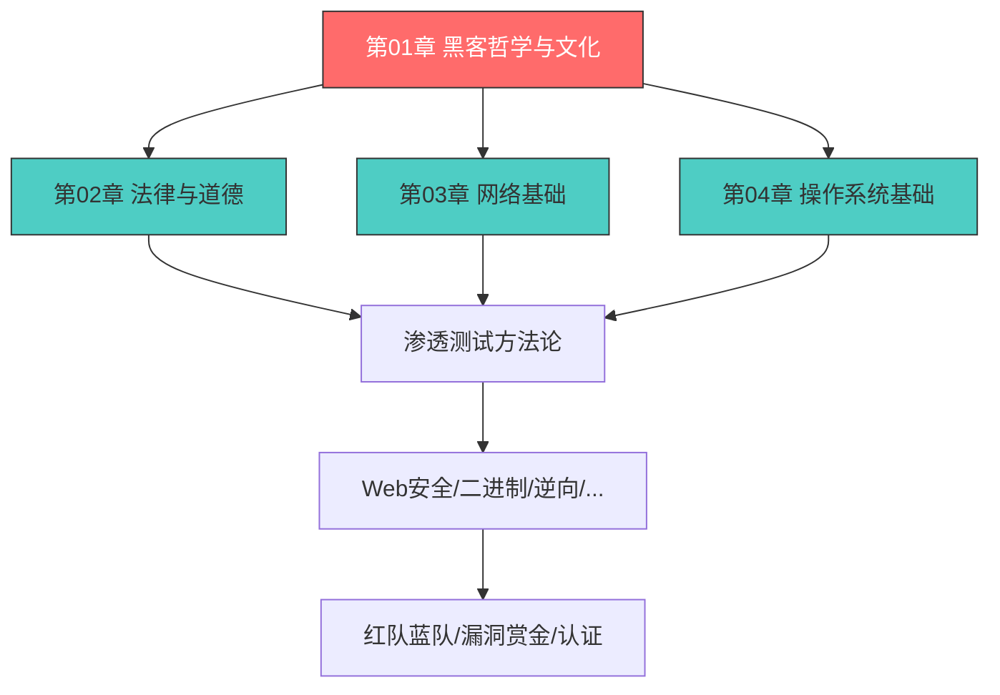
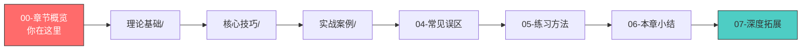

# 第01章 黑客哲学与文化 - 章节概览

## 为什么本章是全书的基石

在网络安全领域，技术能力与文化理解缺一不可。一个只会使用工具却不理解黑客精神的人，充其量只是一个"脚本小子"；一个技术高超却没有道德底线的人，终将走向犯罪的深渊。本章的目的，是在你碰触任何一行代码、任何一个工具之前，先为你建立正确的思想根基。

这并非空洞的说教。回顾网络安全史上最著名的案例——Kevin Mitnick 的社会工程学攻击、Stuxnet 的国家级网络武器、Anonymous 的去中心化行动——你会发现，每一个案例背后都深植着黑客文化的基因。不理解这些文化背景，你将无法真正理解攻击者的动机、思维模式和行为逻辑，也就无法成为一名合格的安全从业者。

### 本章在全书中的位置

本章是全书的思想起点。后续所有技术章节——从网络基础到渗透测试，从 Web 安全到红队演练——都建立在本章所确立的价值观和思维方式之上。如果跳过本章直接学习技术，你可能会成为一个熟练的工具使用者，但很难成为一个真正理解安全本质的从业者。

### 与其他章节的关系

| 关联章节 | 关联点 | 为什么需要本章的知识 |
|---------|--------|-------------------|
| 第02章 法律与道德 | 黑客伦理 → 法律边界 | 理解黑客文化才能理解法律为何如此制定 |
| 第05章 信息收集 | 信息搜集思维 → OSINT | 批判性思维是信息搜集的核心能力 |
| 第10章 社会工程学 | 社会工程学文化根源 | Kevin Mitnick 的案例是最好的教材 |
| 第26章 红队蓝队 | 攻防对抗思维 | 红队/蓝队角色源自黑客文化的帽子分类 |
| 第27章 Bug Bounty | 漏洞经济与社区 | 漏洞赏金是黑客伦理的商业化实践 |

## 本章核心内容导览

### 模块一：黑客的定义与分类体系

"Hacker"这个词被严重污染了。在大众语境中，它几乎等同于"网络罪犯"；但在技术社区中，它代表着对技术的深度理解和创造性解决问题的能力。这种语义分裂并非偶然——它反映了黑客文化从地下走向主流的过程中，媒体叙事与技术社区自我认知之间的深刻冲突。

本模块将建立一个完整的分类框架：

| 类型 | 英文名 | 核心特征 | 法律地位 | 典型场景 |
|------|--------|---------|---------|---------|
| 白帽黑客 | White Hat | 获得授权的安全测试 | 完全合法 | 企业渗透测试、漏洞赏金 |
| 黑帽黑客 | Black Hat | 未经授权的恶意入侵 | 违法犯罪 | 数据窃取、勒索攻击 |
| 灰帽黑客 | Grey Hat | 未授权但无恶意 | 法律灰色地带 | 未经授权发现漏洞后报告 |
| 红帽黑客 | Red Hat | 主动攻击黑帽黑客 | 法律争议 | 反制恶意黑客组织 |
| 蓝帽黑客 | Blue Hat | 外部安全测试人员 | 合法 | 微软蓝帽大会、产品发布前测试 |
| 脚本小子 | Script Kiddie | 使用现成工具、缺乏理解 | 视行为而定 | 使用 Metasploit 但不理解原理 |

你还会了解到现代企业安全体系中的角色分工：渗透测试工程师、安全研究员、漏洞赏金猎人、安全架构师、应急响应工程师——它们各自需要什么技能、什么思维方式、什么职业路径。

### 模块二：黑客文化的历史演变

黑客文化不是凭空出现的。它从 MIT 的技术模型铁路俱乐部（TMRC）萌芽，经过半个多世纪的演化，形成了今天的复杂生态。理解这段历史，不是为了背诵年表，而是为了理解：为什么黑客群体会形成今天的价值观？为什么某些行为模式会反复出现？

本模块按时间线展开五个世代的深度分析：

| 世代 | 时间 | 核心场景 | 代表事件 | 对后世的影响 |
|------|------|---------|---------|------------|
| 第一代 | 1960s | MIT AI 实验室 | ITS 操作系统、TMRC | 奠定了信息自由和共享精神 |
| 第二代 | 1970s | Homebrew Computer Club | Apple 诞生、蓝盒子 | 个人计算机革命、电话飞客文化 |
| 第三代 | 1980s | BBS 和早期网络 | Morris 蠕虫、CFAA 立法 | 黑客与法律的第一次正面冲突 |
| 第四代 | 1990-2000s | 互联网时代 | Linux、开源运动、ILOVEYOU | 开源精神和网络安全行业兴起 |
| 第五代 | 2010s-至今 | 高级威胁时代 | Stuxnet、SolarWinds、Log4Shell | 国家级网络战和漏洞经济体系 |

每个世代的关键转折点——从 MIT 黑客对管理层的蔑视，到电话飞客发现电话系统的漏洞，到 Morris 蠕虫引发的法律风暴，到开源运动对商业垄断的挑战——都在塑造着今天的黑客文化。你将看到，历史不是线性进步的，而是充满了分裂、融合和循环。

### 模块三：黑客伦理与价值观

黑客文化有一套不成文的行为准则，它比任何书面的规章制度都更有约束力。这套准则的核心包括：

**信息自由**——但不是无条件的自由。负责任的漏洞披露（Responsible Disclosure）机制就是一个典型的折中：安全研究员发现漏洞后，会给厂商一定的时间修复（通常是 90 天），然后才公开细节。Google Project Zero 的 90 天政策就是这一理念的制度化表达。

**技术能力即价值**——在黑客社区中，你的学历、年龄、性别都不重要，重要的是你能做什么。Linus Torvalds 的名言 "Talk is cheap, show me the code" 完美地体现了这种"能力主义"（Meritocracy）文化。

**质疑权威**——从 MIT 黑客对管理层的蔑视，到加密朋克（Cypherpunk）对隐私权的捍卫，到区块链对去中心化的追求，质疑权威的精神贯穿了黑客文化的整个历史。

**分享与协作**——开源软件、CTF 竞赛、安全会议、在线社区，都是这种精神的具体体现。一个从不分享知识的黑客，在社区中不会得到尊重。

**创造性解决问题**——黑客的核心能力不是使用工具，而是用非传统方法达到目标。一个真正的黑客看到一个系统时，想到的不是"它能做什么"，而是"它还能做什么"。

### 模块四：批判性思维与安全分析方法

黑客最核心的"技巧"不是某个工具的使用方法，而是一种思维方式。本模块将系统地教授四种核心思维工具：

**攻击者视角**——普通用户看到一个登录页面会想"输入用户名和密码"；安全研究员看到同一个页面会想：这个输入框是否对 SQL 注入有防御？密码传输是否用了 HTTPS？是否存在暴力破解保护？会话管理是否安全？是否有 CSRF 防护？错误消息是否会泄露信息？

**第一性原理思维**——回到问题的本质，从最基本的假设开始思考。以 SQL 注入为例：它的本质是应用程序将用户输入直接拼接到 SQL 语句中，而 SQL 是一种结构化查询语言，有特定语法。理解了这个本质，你就能推导出参数化查询为什么能防注入、二次注入为什么会存在、以及为什么不仅 SELECT，INSERT/UPDATE/DELETE 都可能被注入。

**攻击树分析**——Bruce Schneier 在 1999 年提出的系统化安全分析方法，将复杂的攻击场景分解为层次化的子目标，帮助你全面分析可能的攻击路径。

**威胁建模**——微软的 STRIDE 模型（欺骗、篡改、否认、信息泄露、拒绝服务、权限提升）是在系统设计阶段识别安全风险的标准框架。

### 模块五：著名黑客事件深度分析

理论需要案例来印证。本章精选了多个改变网络安全格局的真实事件，每个案例都从黑客文化的视角进行深度解读：

| 人物/事件 | 类型 | 核心教训 | 深层启示 |
|-----------|------|---------|---------|
| Kevin Mitnick | 个人传奇 | 社会工程学的威力 | 从违法到合法的职业转变 |
| Adrian Lamo | 个人传奇 | 黑客伦理的复杂性 | 告密者与道德困境 |
| Stuxnet | 网络武器 | 技术水平与战略影响 | 网络战改变国际关系 |
| Anonymous | 黑客组织 | 去中心化行动的力量 | 黑客行动主义的边界 |
| Equifax | 数据泄露 | 安全漏洞的现实影响 | 供应链安全的重要性 |
| SolarWinds | 供应链攻击 | 高级持久性威胁 | 信任链的脆弱性 |
| Log4Shell | 零日漏洞 | 开源软件的安全挑战 | 互联网基础设施的脆弱性 |
| Colonial Pipeline | 勒索攻击 | 关键基础设施的脆弱性 | 勒索经济学 |

每个案例都不是简单的事件描述，而是深入分析：攻击者的动机是什么？他们用了什么技术？为什么防御方失败了？这个事件如何改变了安全行业？

### 模块六：常见误区与纠正

关于黑客文化的误解比比皆是。本模块将系统地拆解七大常见误区：

1. **"黑客就是犯罪分子"**——真相：全球有超过 400 万网络安全专业人员从事合法的"白帽"工作
2. **"黑客技术是天生的"**——真相：绝大多数成功的安全从业者都是通过系统学习和持续实践成长的
3. **"学会一个工具就等于学会安全"**——真相：工具会过时，原理不会
4. **"CTF 就是真实的安全"**——真相：CTF 是很好的学习工具，但与真实安全工作有显著差异
5. **"安全只是技术问题"**——真相：安全是技术、人员和流程的综合问题
6. **"开源软件比商业软件更安全"**——真相：Heartbleed、Log4Shell 都发生在开源软件中
7. **"我没有什么值得被攻击的"**——真相：大多数攻击是自动化的，不区分目标价值

每个误区都会从来源分析、事实真相、正确理解三个维度展开，帮助你建立准确的安全认知。

### 模块七：实践方法与学习路径

学习黑客文化不是读几本书就完了。本模块提供一套完整的学习路径：

- **学习环境搭建**：从虚拟机到 Kali Linux 的完整配置指南
- **CTF 入门路径**：OverTheWire、Hack The Box、TryHackMe 的系统学习路线
- **社区参与指南**：从 Reddit r/netsec 到 DEF CON，从 GitHub 到先知社区
- **阅读清单**：从 Steven Levy 的《黑客》到 Nicole Perlroth 的《This Is How They Tell Me the World Ends》
- **职业规划**：安全行业的入行路径、认证路线和职业发展

## 学习目标

完成本章学习后，你将能够：

1. **准确区分**黑客、骇客、白帽、黑帽、灰帽等概念，不再被媒体叙事误导
2. **完整叙述**黑客文化从 1960 年代 MIT 到今天的五个世代演变，理解每个世代的关键转折点
3. **深刻理解**黑客伦理的核心原则——信息自由、技术能力主义、质疑权威、分享协作——以及它们在现代安全行业中的体现
4. **熟练运用**四种核心思维工具：攻击者视角、第一性原理、攻击树分析、威胁建模
5. **深度分析**至少 5 个著名黑客事件背后的技术、文化和伦理维度
6. **识别并纠正**关于黑客文化的七大常见误解
7. **制定**个人的学习计划和社区参与策略

## 前置知识

本章不需要任何技术前置知识。无论你是计算机专业学生、IT 从业者还是对网络安全感兴趣的初学者，都可以从本章开始学习。

但如果你具备以下背景，会有助于更深入地理解本章内容：

| 背景 | 优势 | 无此背景的应对 |
|------|------|-------------|
| 计算机基础知识 | 更快理解技术案例 | 案例部分会提供足够的背景解释 |
| 英语阅读能力 | 可直接阅读原始资料 | 关键术语会提供中英对照 |
| 编程经验 | 更好理解"代码即权力"的理念 | 本章不要求编程能力 |

## 章节结构

本章由以下模块组成，按由浅入深的顺序排列：

| 模块 | 路径 | 核心内容 | 预计阅读时间 |
|------|------|---------|------------|
| 章节概览 | 00-章节概览.md | 全章导览与学习路径 | 15 分钟 |
| 理论基础 | 理论基础/ | 黑客定义、历史演变、伦理价值观、推荐阅读 | 45 分钟 |
| 核心技巧 | 核心技巧/ | 批判性思维、信息搜集、工具思维、学习方法论 | 40 分钟 |
| 实战案例 | 实战案例/ | Kevin Mitnick、Stuxnet、Anonymous 等 10+ 深度案例 | 60 分钟 |
| 常见误区 | 04-常见误区.md | 七大误解的来源分析与纠正 | 25 分钟 |
| 练习方法 | 05-练习方法.md | 学习计划、社区参与、CTF 路径、职业准备 | 30 分钟 |
| 本章小结 | 06-本章小结.md | 回顾、自测题、下章预告 | 15 分钟 |
| 深度拓展 | 07-深度拓展.md | 哲学根基、社会学分析、行业前沿、思考题 | 45 分钟 |

总计约 **4.5 小时** 的阅读与练习时间。建议分 2-3 个学习周期完成，每个周期 1.5-2 小时。

### 建议阅读顺序

- **必读**：理论基础 → 核心技巧 → 实战案例 → 常见误区 → 本章小结
- **推荐**：练习方法（动手实践）→ 深度拓展（进阶理解）
- **可选**：如果时间有限，先完成理论基础和核心技巧，其余可后续补充

## 如何高效使用本章

### 对于初学者

如果你是第一次接触网络安全，请按顺序阅读。不要跳过理论基础——那些看似"不实用"的文化和历史知识，会在后续的技术学习中反复用到。当你理解了为什么黑客文化强调"质疑权威"，你才能理解为什么渗透测试要从"假设一切都有漏洞"开始。

### 对于有经验的从业者

如果你已经有一定安全基础，可以重点关注：
- 理论基础中的黑客伦理部分（帮助你建立职业道德框架）
- 核心技巧中的威胁建模和攻击树分析（系统化的安全分析方法）
- 实战案例中的最新事件（SolarWinds、Log4Shell、Colonial Pipeline）
- 深度拓展中的哲学和社会学分析（提升思考深度）

### 对于安全团队管理者

本章对于组建和管理安全团队也有参考价值：
- 理解不同"帽子"黑客的角色定位，有助于合理分配团队职责
- 理解黑客文化的价值观，有助于建立团队文化和激励机制
- 常见误区部分可以帮助你向非技术人员解释安全工作的本质

---

> *"The world is full of fascinating problems waiting to be solved."*
> — Eric S. Raymond，《黑客文化简史》

---

> ⚠️ **安全警告与免责声明**
>
> 本章内容仅供**合法的安全测试与教育目的**使用。所有技术、工具和方法的讨论均旨在帮助安全从业者在**获得明确授权**的前提下进行防御性安全研究。
>
> - 🚫 **未经授权**对任何系统、网络或应用进行安全测试是**违法行为**
> - ✅ 所有实践活动应在**隔离的实验环境**中进行（如虚拟机、CTF 平台）
> - ✅ 遵守所在国家和地区的**网络安全法律法规**
> - ✅ 遵循**负责任的漏洞披露**原则
>
> 作者不对因滥用本章内容造成的任何后果承担责任。
