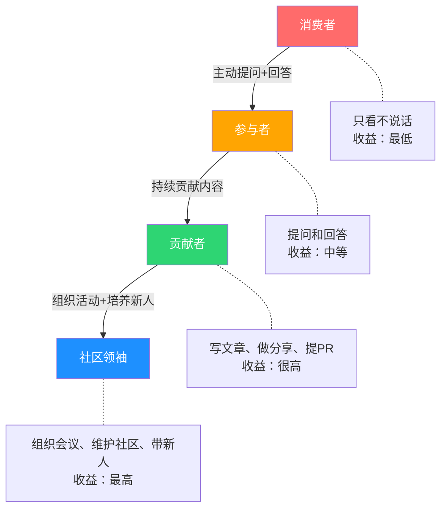
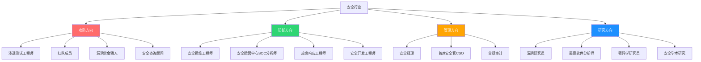

# 第01章 黑客哲学与文化 - 练习方法

> 黑客技能不是"知道"出来的，是"练"出来的。本章提供一套从零到专业级的完整练习体系——不是告诉你"要多练"，而是告诉你练什么、怎么练、练到什么程度算合格。

## 5.1 建立学习习惯：科学方法论

### 5.1.1 学习科学：为什么大多数人半途而废

网络安全学习的失败率极高。根据 SANS Institute 2023年的调查，超过60%的自学者在6个月内放弃。根本原因不是"不够聪明"，而是学习方法错误。理解以下三个认知科学原理，可以将你的学习效率提升3-5倍：

**间隔重复（Spaced Repetition）**

德国心理学家赫尔曼·艾宾浩斯的遗忘曲线表明，新知识在24小时内会遗忘约70%。间隔重复通过在即将遗忘时复习来对抗遗忘曲线。具体做法：

- 学完一个概念后，分别在1天、3天、7天、14天、30天后复习
- 使用 Anki 制作闪卡，让算法自动安排复习时间
- 每张卡片只包含一个知识点，正面是问题，背面是答案

例如，学完 SQL 注入后，制作如下 Anki 卡片：

```text
正面：SQL注入中，UNION注入的前提条件是什么？
背面：1) 前端查询返回了结果集（不是盲注场景）
      2) 已知原始查询的列数（ORDER BY或UNION SELECT NULL探测）
      3) 对应列的数据类型兼容
```

**刻意练习（Deliberate Practice）**

心理学家安德斯·艾利克森提出的刻意练习理论指出，技能提升需要：
1. 明确的改进目标（不是"学Web安全"，而是"掌握SQL注入的5种绕过WAF技术"）
2. 即时反馈（每次练习后立即验证结果）
3. 舒适区边缘的难度（太简单无进步，太难会放弃）
4. 重复和修正（同一技术反复练习直到自动化）

在安全学习中的应用：

| 阶段 | 目标 | 练习方式 | 反馈来源 |
|------|------|----------|----------|
| 认知 | 理解漏洞原理 | 阅读CVE分析、看视频 | 能否用自己的话解释 |
| 模仿 | 复现已有攻击 | 跟着教程在靶机上操作 | 攻击是否成功 |
| 独立 | 自主发现漏洞 | 在CTF/靶场中独立解题 | Flag是否获取 |
| 创造 | 发现新的攻击方式 | 在真实项目中挖掘 | 是否发现0day |

**费曼学习法**

理查德·费曼的学习法核心是"如果你不能用简单的语言解释一个概念，说明你没有真正理解它"。在安全学习中：

1. **选择概念**：比如 CSRF 攻击
2. **教给别人**：假设对方是完全没有技术背景的人，用类比解释
3. **发现卡壳**：在解释过程中，你会发现自己说不清楚的地方
4. **回溯学习**：针对卡壳的地方重新深入学习
5. **简化表达**：用最简单的语言重新解释

实践建议：每周写一篇技术博客，把本周学到的知识用最简单的语言解释清楚。如果某个概念你写了500字还没说清楚，说明你还需要继续学习。

### 5.1.2 制定可执行的学习计划

空洞的"每天学习2小时"没有意义。你需要的是一个具体的、可执行的、有里程碑的学习计划。以下是一个经过验证的12个月学习路线图：

**第1-2个月：基础建设期**

```yaml
目标: 能够独立搭建和使用Linux环境
每日时间分配:
  - 理论学习: 30分钟（阅读/视频）
  - 动手操作: 60分钟（实验/练习）
  - 笔记整理: 15分钟（记录/复习）
周计划:
  第1周: 安装Ubuntu/Kali，熟悉文件系统、用户权限、包管理
  第2周: Shell脚本基础——变量、条件、循环、管道
  第3周: 网络基础——TCP/IP协议栈、子网划分、常用命令
  第4周: Python基础——变量、函数、文件操作、HTTP请求
里程碑: 能用Python写一个简单的端口扫描器
```

**第3-4个月：Web安全入门期**

```yaml
目标: 理解OWASP Top 10，能在靶场中利用基础漏洞
每日时间分配:
  - 理论学习: 30分钟
  - 靶场练习: 90分钟
  - Writeup写作: 15分钟
周计划:
  第5周: HTTP协议深度理解——请求方法、状态码、Header、Cookie
  第6周: SQL注入——联合查询、布尔盲注、时间盲注、报错注入
  第7周: XSS——反射型、存储型、DOM型、CSP绕过
  第8周: 认证漏洞——弱口令、Session固定、JWT攻击
里程碑: 完成PortSwigger Academy的SQL注入和XSS所有实验室
```

**第5-6个月：工具链掌握期**

```yaml
目标: 熟练使用主流渗透测试工具
周计划:
  第9周: Burp Suite——代理配置、拦截、Repeater、Intruder、Scanner
  第10周: Nmap——主机发现、端口扫描、服务识别、NSE脚本
  第11周: Metasploit——模块体系、Payload生成、后渗透操作
  第12周: SQLMap——自动注入、Tamper脚本、WAF绕过
里程碑: 在Hack The Box上独立拿下一台Easy难度的靶机
```

**第7-9个月：专项突破期**

```yaml
目标: 选择1-2个方向深入
选择建议:
  Web方向: SSRF→XXE→反序列化→代码审计→框架漏洞
  二进制方向: 栈溢出→格式化字符串→堆利用→ROP→内核利用
  内网方向: 信息收集→横向移动→权限维持→域渗透
里程碑: 在CTF竞赛中至少解出一道中等难度的题目
```

**第10-12个月：实战转化期**

```yaml
目标: 将技能转化为实际价值
周计划:
  第37-40周: 漏洞赏金实践——选择2-3个目标进行深度挖掘
  第41-44周: 安全认证备考——OSCP/CEH/CISP（根据职业方向选择）
  第45-48周: 作品集整理——GitHub项目、博客文章、CTF成绩
里程碑: 在漏洞赏金平台提交第一个有效漏洞
```

### 5.1.3 时间管理的科学方法

**番茄工作法的正确用法**

番茄工作法不是简单地"工作25分钟休息5分钟"。在安全学习中，你需要调整参数：

- **复杂任务（代码审计、漏洞分析）**：45分钟工作 + 10分钟休息
- **重复练习（刷靶场、练工具）**：25分钟工作 + 5分钟休息
- **理论学习（读书、看视频）**：30分钟工作 + 5分钟休息

每个番茄钟结束后，花30秒记录：做了什么、遇到什么问题、下一步计划。这30秒的记录会在长期积累中产生巨大价值。

**精力管理优先于时间管理**

人体的精力有自然波动周期（ultradian rhythm），约90-120分钟一个循环。将最需要专注力的学习任务（漏洞分析、代码审计）安排在精力高峰期，将机械性任务（整理笔记、复习Anki卡片）安排在低谷期。

一般规律：
- 上午9-11点：认知能力最强，适合学习新概念
- 下午2-4点：精力回升，适合动手实验
- 晚上8-10点：适合复习和整理笔记

**消除干扰的具体方法**

学习时的干扰会将你的恢复时间延长23分钟（加州大学尔湾分校研究）。具体对策：

```bash
# Linux系统：学习时屏蔽干扰网站
# 编辑 /etc/hosts，添加以下行：
127.0.0.1  www.weibo.com
127.0.0.1  www.douyin.com
127.0.0.1  www.bilibili.com
# 学习完成后删除这些行

# 更优雅的方案：使用定时脚本
# block_distractions.sh
#!/bin/bash
echo "开始学习模式（2小时）"
echo "127.0.0.1 www.weibo.com www.douyin.com" | sudo tee -a /etc/hosts
sleep 7200
sudo sed -i '/127.0.0.1 www.weibo.com/d' /etc/hosts
echo "学习时间结束，已解除屏蔽"
```

### 5.1.4 学习环境搭建详解

**硬件配置建议**

| 配置项 | 最低要求 | 推荐配置 | 说明 |
|--------|----------|----------|------|
| CPU | 4核 | 8核+ | 虚拟机和编译需要多核 |
| 内存 | 8GB | 16-32GB | 同时运行多个虚拟机 |
| 存储 | 256GB SSD | 512GB+ NVMe SSD | 虚拟机镜像占用大量空间 |
| 网络 | 稳定宽带 | 有线连接 | 无线可能影响某些测试 |
| 外设 | - | 外接显示器 | 双屏提升效率50%+ |

**虚拟化环境搭建步骤**

```bash
# 1. 安装VirtualBox（以Ubuntu为例）
sudo apt update
sudo apt install virtualbox virtualbox-ext-pack

# 2. 创建虚拟网络
# VirtualBox → 工具 → 网络 → 仅主机(Host-Only)网络
# 创建vboxnet0: 192.168.56.1/24
# 启用DHCP服务器: 192.168.56.100-192.168.56.254

# 3. 下载并导入Kali Linux
wget https://cdimage.kali.org/kali-2024.1/kali-linux-2024.1-virtualbox-amd64.7z
# 在VirtualBox中导入虚拟机

# 4. 配置Kali虚拟机
# 网络适配器1: NAT（用于上网）
# 网络适配器2: 仅主机网络（用于靶场练习）
# 分配内存: 4GB, CPU: 2核, 显存: 128MB

# 5. 下载靶机
# Metasploitable2: https://sourceforge.net/projects/metasploitable/
# DVWA: https://github.com/digininja/DVWA
# Vulhub: https://github.com/vulhub/vulhub (Docker漏洞环境)
```

**使用Vulhub快速搭建漏洞环境**

Vulhub是一个基于Docker的漏洞复现环境集合，包含数百个真实CVE的复现环境：

```bash
# 安装Docker
sudo apt install docker.io docker-compose
sudo usermod -aG docker $USER
# 重新登录使docker组生效

# 克隆Vulhub
git clone https://github.com/vulhub/vulhub.git
cd vulhub

# 启动一个漏洞环境（以Apache Struts2 S2-045为例）
cd struts2/s2-045
docker-compose up -d

# 查看运行状态
docker-compose ps

# 漏洞环境通常在 localhost:端口 运行
# 按照README.md中的说明进行复现

# 练习完毕后关闭环境
docker-compose down
```

**云靶场方案（无需本地硬件）**

如果你的电脑配置不够，可以使用云靶场：

| 平台 | 特点 | 费用 | 适用阶段 |
|------|------|------|----------|
| TryHackMe | 引导式学习，内置VPN | 免费/月费$14 | 入门-中级 |
| Hack The Box | 独立挑战，真实环境 | 免费/月费$14 | 中级-高级 |
| PentesterLab | 渐进式Web安全 | 免费/年费$199 | Web安全专精 |
| PortSwigger Academy | Burp Suite官方教程 | 完全免费 | Web安全必修 |
| OverTheWire | 纯命令行挑战 | 完全免费 | Linux基础 |

## 5.2 社区参与：从旁观者到贡献者

### 5.2.1 安全社区的正确参与姿势

很多人"加入"了社区但从未真正"参与"。社区参与不是潜水看帖，而是建立有价值的人际网络和知识交换。

**社区参与的三个层次**



**高质量提问的艺术**

安全社区对低质量提问的容忍度很低。一个糟糕的提问不仅得不到帮助，还可能损害你的声誉。高质量提问的结构：

```text
标题: [具体技术] + [具体问题现象]
例如: "[Burp Suite] Intruder爆破时返回长度全部相同，无法区分正确密码"

正文结构:
1. 我要做什么（目标）
2. 我已经尝试了什么（已做的工作）
3. 我遇到了什么问题（具体现象，附截图/日志）
4. 我的环境信息（OS、工具版本、配置）
5. 我的猜测（你认为可能的原因）

反面教材:
"有人会SQL注入吗？教教我" ← 没有任何信息，没有人会回复
"为什么我的SQLMap跑不出来？" ← 没有命令、没有报错、没有目标信息
```

**主要安全社区详解**

| 社区 | 类型 | 语言 | 特点 | 适合人群 |
|------|------|------|------|----------|
| Reddit r/netsec | 论坛 | 英文 | 高质量技术讨论，严格的版规 | 中级以上 |
| Reddit r/HowToHack | 论坛 | 英文 | 入门友好，有学习路径 | 入门-中级 |
| 先知社区 | 论坛 | 中文 | 阿里安全旗下，高质量漏洞分析 | 中级以上 |
| 看雪论坛 | 论坛 | 中文 | 二进制安全、逆向工程专精 | 中级-高级 |
| FreeBuf | 媒体 | 中文 | 安全资讯、技术文章 | 全阶段 |
| 安全客 | 媒体 | 中文 | 360旗下，漏洞预警、技术分析 | 全阶段 |
| Discord (InfoSec) | 即时通讯 | 英文 | 实时交流，多个专业频道 | 全阶段 |
| GitHub | 代码托管 | - | 开源安全工具、CVE PoC | 全阶段 |
| Twitter/X | 社交媒体 | 英/中 | 安全研究员动态、0day预警 | 全阶段 |

### 5.2.2 安全会议：不只是去听演讲

安全会议的价值排序：建立人脉 > 学习新技术 > 了解行业趋势 > 听演讲。很多最有价值的信息交换发生在走廊、酒吧和after-party中。

**全球主要安全会议**

| 会议 | 地点 | 时间 | 特点 | 参会建议 |
|------|------|------|------|----------|
| DEF CON | 拉斯维加斯 | 每年8月 | 全球最大黑客会议，氛围自由 | 第一次去重点关注Villages |
| Black Hat | 拉斯维加斯 | 每年8月（DEF CON前一周） | 商业化，企业导向 | 适合职业发展 |
| CCC | 德国/线上 | 每年12月 | 欧洲最大，政治色彩浓 | 欧洲安全社区必去 |
| HITB | 阿姆斯特丹/吉隆坡 | 不定期 | 技术深度高 | 亚洲地区推荐 |
| PoC | 韩国首尔 | 每年10-11月 | 亚洲顶级技术会议 | 东亚安全社区 |

**中国主要安全会议**

| 会议 | 主办方 | 特点 | 参与方式 |
|------|--------|------|----------|
| XCON | 知道创宇 | 中国最早黑客会议之一 | 关注官网报名 |
| KCon | KCon组委会 | 技术驱动，议题质量高 | 提交议题/报名参会 |
| 补天白帽大会 | 补天平台 | 漏洞赏金生态 | 补天白帽可免费参加 |
| 看雪安全峰会 | 看雪论坛 | 二进制安全深度 | 看雪论坛报名 |
| GeekPwn | 腾讯 | 极客挑战赛 | 提交破解项目 |
| MOSEC | 多公司联合 | 移动安全 | 移动安全研究者 |

**最大化会议收益的策略**

会前准备：
- 研读所有议题摘要，标记最感兴趣的5-8个
- 准备电梯演讲（30秒介绍自己是谁、做什么、对什么感兴趣）
- 带足名片（或准备好LinkedIn/微信二维码）
- 了解会场周边的社交活动安排

会中策略：
- 不要试图听完所有演讲——选择3-4个重点听，其余看录像
- 把更多时间花在Villages（实操区域）和走廊社交
- 主动与演讲者交流，提出有深度的问题
- 参加CTF竞赛和Workshop

会后跟进：
- 48小时内给新认识的人发消息
- 整理会议笔记，发布技术博客
- 尝试复现感兴趣的演讲中的技术

### 5.2.3 贡献开源项目的实操路径

开源贡献不只是"修bug"，它是建立技术声誉的最有效方式之一。安全行业的招聘经理普遍认为，有质量的开源贡献比简历上的任何证书都更有说服力。

**第一步：找到适合贡献的项目**

```bash
# GitHub搜索安全工具项目
# 搜索带有"good first issue"标签的项目
https://github.com/topics/security?q=good-first-issue

# 推荐的入门级安全项目
# 1. nuclei - 漏洞扫描器模板（YAML编写，不需要编程）
#    https://github.com/projectdiscovery/nuclei
# 2. SecLists - 安全测试用的字典和Payload集合
#    https://github.com/danielmiessler/SecLists
# 3. PayloadsAllTheThings - Web安全Payload大全
#    https://github.com/swisskyrepo/PayloadsAllTheThings
# 4. OWASP CheatSheetSeries - 安全开发备忘录
#    https://github.com/OWASP/CheatSheetSeries
```

**第二步：从非代码贡献开始**

贡献不一定要写代码。以下贡献方式门槛更低，但同样有价值：

1. **修复文档**：纠正拼写错误、补充缺失信息、改进翻译
2. **报告Bug**：写清楚的Bug报告（包含复现步骤、环境信息、预期vs实际行为）
3. **添加测试用例**：为已有功能编写测试
4. **翻译**：将英文文档翻译成中文
5. **编写Nuclei模板**：为新发现的漏洞编写扫描模板

**第三步：代码贡献的标准流程**

```bash
# 1. Fork项目到自己的账号
# 在GitHub上点击Fork按钮

# 2. 克隆到本地
git clone https://github.com/你的用户名/项目名.git
cd 项目名

# 3. 添加上游仓库
git remote add upstream https://github.com/原作者/项目名.git

# 4. 创建功能分支
git checkout -b fix/your-fix-description

# 5. 进行修改，遵循项目的代码风格
# 阅读 CONTRIBUTING.md 了解项目的贡献规范

# 6. 提交修改
git add .
git commit -m "fix: 简洁描述你的修改（遵循Conventional Commits规范）"

# 7. 推送到自己的仓库
git push origin fix/your-fix-description

# 8. 在GitHub上创建Pull Request
# 在PR描述中说明：修改了什么、为什么修改、如何测试

# 9. 等待Code Review，根据反馈修改
# 10. 合并后同步上游
git checkout main
git pull upstream main
git push origin main
```

## 5.3 CTF练习：系统化训练体系

### 5.3.1 CTF竞赛类型与平台选择

CTF（Capture The Flag）竞赛有三种主要形式，每种形式训练不同的技能：

**三种CTF形式对比**

| 类型 | 描述 | 代表平台 | 适合阶段 | 训练重点 |
|------|------|----------|----------|----------|
| Jeopardy（解题） | 解答独立题目获取Flag | CTFtime上的大多数比赛 | 入门-中级 | 广度：接触多种题型 |
| Attack-Defense（攻防） | 攻击对手服务器同时防御己方 | DEF CON CTF | 高级 | 深度：实时对抗能力 |
| King of the Hill | 抢占并控制服务器 | Hack The Box Pro Labs | 中级-高级 | 综合：渗透+权限维持 |

**分阶段平台推荐**

入门阶段（第1-3个月）：

```text
1. PortSwigger Web Security Academy（首选）
   - 地址: https://portswigger.net/web-security
   - 特点: 完全免费，循序渐进，每个主题有配套实验室
   - 推荐路径: SQL注入 → XSS → 认证 → 访问控制 → SSRF
   - 目标: 完成所有基础和中级实验室

2. OverTheWire: Bandit
   - 地址: https://overthewire.org/wargames/bandit/
   - 特点: 通过游戏化方式学习Linux命令行
   - 目标: 完成全部34关（约需1-2周）

3. PicoCTF Practice
   - 地址: https://play.picoctf.org/practice
   - 特点: 面向初学者，有详细提示
   - 目标: 完成General Skills和Web Exploitation分类
```

中级阶段（第4-8个月）：

```text
1. Hack The Box
   - 地址: https://www.hackthebox.com/
   - 策略: 从Easy机器开始，先看官方提示，再看Writeup
   - 目标: 独立完成10台Easy + 5台Medium
   - 重点机器推荐: Lame, Blue, Jerry, Netmon, Bounty

2. TryHackMe
   - 地址: https://tryhackme.com/
   - 推荐路径: Complete Beginner → Web Fundamentals → Offensive Pentesting
   - 特点: 内置OpenVPN，无需复杂配置

3. PentesterLab
   - 地址: https://pentesterlab.com/
   - 特点: 专注于Web安全，渐进式难度
   - 推荐: 从Free Exercises开始，然后做Pro路径
```

高级阶段（第9个月+）：

```text
1. Hack The Box Pro Labs
   - Dante: 内网渗透实验室
   - RastaLabs: 红队模拟环境
   - Offshore: 企业网络渗透

2. CTFtime竞赛
   - 地址: https://ctftime.org/
   - 策略: 参加全球排名前50的CTF竞赛
   - 建议频率: 每月参加1-2场线上CTF

3. Bug Bounty平台
   - HackerOne: https://hackerone.com/
   - Bugcrowd: https://bugcrowd.com/
   - 补天: https://www.butian.net/
   - 漏洞盒子: https://www.vulbox.com/
```

### 5.3.2 各方向详细学习路径

**Web安全方向：从零到独立挖洞**

Web安全是最热门的入门方向，因为它门槛相对低、学习资源丰富、就业需求大。以下是一个详细的渐进式学习路径：

```text
阶段1: HTTP协议深度理解（2周）
├── HTTP请求/响应结构（方法、状态码、Header、Body）
├── Cookie/Session机制
├── HTTPS/TLS握手过程
├── 同源策略与CORS
├── 实操: 用Burp Suite拦截和修改每一个HTTP请求
└── 检验: 能够解释301/302的区别、Set-Cookie各属性的作用

阶段2: 注入攻击（4周）
├── SQL注入
│   ├── 联合查询注入（UNION SELECT）
│   ├── 布尔盲注（AND 1=1/1=2判断）
│   ├── 时间盲注（SLEEP/BENCHMARK）
│   ├── 报错注入（EXTRACTVALUE/UPDATEXML）
│   ├── 堆叠注入（;分隔多条SQL）
│   ├── 二次注入（存储后触发）
│   └── WAF绕过（编码、注释、大小写、内联注释）
├── NoSQL注入
│   ├── MongoDB: {$gt: ""}, {$ne: null}
│   └── 运算符注入
├── 命令注入
│   ├── 管道符: |, ||, &
│   ├── 反引号: `command`
│   └── $()替换: $(command)
├── LDAP注入
└── 实操: 完成SQLi-labs全部关卡 + PortSwigger SQL注入实验室

阶段3: 客户端攻击（3周）
├── XSS
│   ├── 反射型XSS（URL参数→页面输出）
│   ├── 存储型XSS（数据库→页面输出）
│   ├── DOM型XSS（JavaScript处理→DOM操作）
│   ├── CSP绕过策略
│   ├── XSS窃取Cookie的完整Payload构造
│   └── 防御: 输出编码、CSP、HttpOnly
├── CSRF
│   ├── 原理: 利用浏览器自动携带Cookie
│   ├── PoC构造: 自动提交表单
│   ├── 绕过: Referer检查、Token预测
│   └── 防御: CSRF Token、SameSite Cookie
├── 点击劫持
│   ├── iframe覆盖技术
│   └── X-Frame-Options防御
└── 实操: DVWA全部安全等级 + PortSwigger XSS实验室

阶段4: 服务端漏洞（4周）
├── SSRF
│   ├── 内网探测: http://127.0.0.1, http://192.168.x.x
│   ├── 协议利用: file://, gopher://, dict://
│   ├── 绕过: DNS重绑定、IP十进制、IPv6表示
│   └── 危害: 云元数据（169.254.169.254）
├── XXE
│   ├── 外部实体读取文件: file:///etc/passwd
│   ├── Blind XXE: 外带数据
│   └── SSRF via XXE
├── 文件上传
│   ├── 前端绕过: 修改JS/禁用JS
│   ├── MIME类型绕过: 修改Content-Type
│   ├── 扩展名绕过: .php5, .phtml, .pht
│   ├── .htaccess上传
│   ├── 图片马: exiftool注入PHP代码
│   └── 竞争条件上传
├── 文件包含
│   ├── 本地文件包含(LFI): ../../etc/passwd
│   ├── 远程文件包含(RFI): http://attacker/shell.txt
│   ├── PHP伪协议: php://filter, php://input
│   └── 日志投毒
├── 反序列化
│   ├── PHP: serialize()/unserialize(), __wakeup/__destruct
│   ├── Java: readObject(), ysoserial
│   ├── Python: pickle.loads()
│   └── .NET: BinaryFormatter
└── 实操: Vulhub复现5个以上CVE + PortSwigger SSRF/XXE实验室

阶段5: 认证与授权（2周）
├── JWT攻击
│   ├── 算法混淆: RS256→HS256
│   ├── None算法
│   ├── 密钥爆破: jwt_tool
│   └── Kid注入
├── OAuth 2.0漏洞
│   ├── redirect_uri劫持
│   ├── State参数缺失
│   └── Token泄露
├── Session管理
│   ├── Session固定攻击
│   ├── Session劫持
│   └── Cookie安全属性
└── 实操: PortSwigger JWT + Authentication实验室

阶段6: 高级技术（持续学习）
├── 原型链污染（JavaScript）
├── GraphQL攻击
├── Web缓存投毒/欺骗
├── HTTP请求走私
├── WebSocket安全
├── 子域名接管
└── 实操: 参加CTF竞赛 + 开始Bug Bounty
```

**逆向工程方向：从汇编到恶意软件分析**

```text
阶段1: 计算机基础（3周）
├── x86/x64汇编语言
│   ├── 寄存器: EAX, EBX, ECX, EDX, ESI, EDI, ESP, EBP
│   ├── 常用指令: MOV, PUSH, POP, CALL, RET, JMP, CMP, JE/JNE
│   ├── 栈帧结构: 函数调用时的栈变化
│   └── 实操: 用GDB单步执行，观察寄存器和内存变化
├── C语言基础
│   ├── 指针和内存管理
│   ├── 数组和字符串
│   └── 结构体和联合体
└── 操作系统基础
    ├── 进程内存布局（栈、堆、BSS、数据段、代码段）
    ├── ELF/PE文件格式
    └── 系统调用

阶段2: 逆向工具使用（4周）
├── 静态分析
│   ├── Ghidra: 反编译、函数分析、脚本编写
│   ├── IDA Pro: 业界标准（Free版本可用）
│   ├── radare2/rizin: 命令行逆向框架
│   └── 实操: 分析一个简单的CrackMe
├── 动态分析
│   ├── GDB + pwndbg/GEF: Linux调试
│   ├── x64dbg: Windows调试
│   ├── strace/ltrace: 系统调用/库调用跟踪
│   └── 实操: 动态跟踪CrackMe的验证逻辑
└── 混合分析
    ├── 用静态分析理解结构，用动态分析验证猜测
    └── 实操: 完成crackmes.one上10个简单挑战

阶段3: CTF逆向题型（6周）
├── ELF逆向
├── PE逆向
├-.NET逆向（dnSpy）
├── Go/Rust逆向（特殊ABI）
├── Python打包逆向（pyinstxtractor + uncompyle6）
├── Android逆向（jadx, apktool）
└── 实操: CTFtime上参加2-3场CTF，专做Reverse类题目

阶段4: 恶意软件分析（持续学习）
├── 静态分析: 字符串提取、导入表分析、YARA规则
├── 动态分析: 沙箱环境（Cuckoo Sandbox）、行为监控
├── 常见恶意软件家族: RAT、勒索软件、挖矿木马
└── 实操: 在MalwareBazaar上下载样本进行分析
```

**Pwn（二进制利用）方向：从栈溢出到内核利用**

```text
阶段1: 内存基础（3周）
├── C语言指针深入理解
├── 栈的工作原理（函数调用、返回地址、栈帧）
├── 堆的工作原理（malloc/free、堆管理器结构）
├── 内存保护机制
│   ├── NX（No-eXecute）: 数据段不可执行
│   ├── ASLR: 地址空间随机化
│   ├── Stack Canary: 栈保护
│   ├── PIE: 代码地址随机化
│   └── RELRO: GOT表保护
└── 工具: pwndbg/GEF, pwntools, checksec

阶段2: 栈溢出（4周）
├── 基本栈溢出: 覆盖返回地址
├── Shellcode编写与注入
├── ROP（Return-Oriented Programming）
│   ├── gadget查找: ROPgadget, ropper
│   ├── ROP chain构造
│   └── ret2libc
├── 绕过Stack Canary
│   ├── 泄露Canary值
│   ├── 覆写__stack_chk_fail GOT
└── 实操: 完成ROP Emporium全部挑战

阶段3: 堆利用（6周）
├── glibc堆管理器
│   ├── chunk结构（prev_size, size, fd, bk）
│   ├── bins: fastbin, unsorted bin, smallbin, largebin
│   ├── tcache（glibc 2.26+）
│   └── arena和top chunk
├── 经典堆利用技术
│   ├── Use-After-Free (UAF)
│   ├── Double Free
│   ├── Heap Overflow → Unlink
│   ├── Off-By-One
│   └── House系列: House of Force, House of Spirit, House of Lore
├── 现代堆利用技术
│   ├── Tcache Poisoning
│   ├── Large Bin Attack
│   ├── FSOP（File Stream Oriented Programming）
│   └── House of Apple系列
└── 实操: BUUCTF Pwn分类 + How2Heap

阶段4: 高级技术（持续学习）
├── 内核利用（UAF → 提权）
├- 虚拟机逃逸
├── 浏览器利用（V8引擎）
└── 实操: 跟踪最新CTF的Kernel Pwn题目
```

### 5.3.3 CTF竞赛实战策略

**赛前准备清单**

```bash
# 1. 工具环境准备（赛前一天检查）
# Web方向
pip install sqlmap requests beautifulsoup4 flask
# 安装Burp Suite Community Edition
# 安装浏览器插件: Wappalyzer, Cookie-Editor, HackBar

# Pwn方向
pip install pwntools ropper
sudo apt install gdb gdb-multiarch
# 安装pwndbg: https://github.com/pwndbg/pwndbg
# 安装one_gadget: gem install one_gadget

# Crypto方向
pip install pycryptodome gmpy2 sympy sage-numerical-backends-coin

# Misc方向
sudo apt install binwalk foremost steghide stegsolve
pip install z3-solver angr

# 2. 知识库准备
# 整理自己的Cheat Sheet（速查表）
# 准备常用Payload和脚本模板
# 下载离线字典（RockYou、常见密码、目录字典）
```

**比赛中的时间管理**

```text
比赛开始（0-15分钟）:
├── 快速浏览所有题目
├── 按难度和分值初步排序
├── 团队分工：每人负责1-2个擅长方向
└── 先做签到题（签到/Warmup），确保不空手

比赛中期（15分钟-结束前2小时）:
├── 按优先级攻克题目
├── 遇到卡壳超过30分钟的题目，先标记跳过
├── 定期同步进度（每1-2小时团队同步一次）
├── 关注动态flag（有些题flag会变化）
└── 保持通讯，共享发现

比赛后期（最后2小时）:
├── 回到之前卡壳的题目，用新思路尝试
├── 检查已做题目是否还有附加flag
├── 高分值题目优先（如果差距不大）
└── 提交前仔细检查flag格式（常见错误：多余空格、换行符）
```

**Writeup写作模板**

赛后写Writeup是最有价值的学习环节。一个好的Writeup应该让没参加比赛的人也能跟着复现：

```markdown
# [题目名称] - [分类] - [难度]

## 题目描述
（粘贴题目描述和附件）

## 初始分析
- 文件类型检查: file, strings, binwalk
- 初步观察: 开放端口、响应内容、异常点

## 解题过程

### Step 1: [步骤标题]
[具体操作和分析]
```bash
# 命令和输出
```text
[为什么这样做，观察到了什么]

### Step 2: [步骤标题]
...

### Step N: 获取Flag
```bash
# 最终获取flag的命令
```text

## Flag
`flag{xxxxxxxxxxxxxxxx}`

## 知识点总结
- 学到了什么新知识
- 可以复用的技巧
- 相关参考资料

## 时间线
- 00:00 - 开始分析
- 00:15 - 发现注入点
- 00:35 - 获取shell
- 00:45 - 获取flag
```

### 5.3.4 建立个人CTF团队

单打独斗可以入门，但要在CTF中取得好成绩，团队协作是必需的。

**团队组建建议**

```text
理想团队配置（4-6人）:
├── Web × 2: 一人偏前端（XSS/CSRF），一人偏后端（注入/SSRF）
├── Pwn × 1-2: 栈/堆利用、内核利用
├── Reverse × 1: 逆向分析、脱壳、混淆对抗
├── Crypto × 1: 密码学分析、数学基础
└── Misc × 1: 杂项（取证、隐写、编码、OSINT）

团队协作工具:
├── 即时通讯: Discord/Telegram群组
├── 协作文档: HackMD/Notion（实时共享笔记）
├── Flag提交: 统一由一人提交（避免重复提交）
├── 知识库: Git仓库（存放脚本、工具、历史Writeup）
└── VPN: 共享VPN配置（如果是内网环境的CTF）
```

## 5.4 阅读与研究：构建知识体系

### 5.4.1 系统化阅读方法

安全领域的知识更新极快，盲目阅读会浪费大量时间。你需要一个系统化的阅读策略。

**阅读的金字塔结构**

```text
                    ┌─────────────────┐
                    │   学术论文       │  ← 最新研究成果
                    │  (每周1-2篇)     │
                  ┌─┴─────────────────┴─┐
                  │   技术博客/Writeup   │  ← 实战经验
                  │   (每天1-2篇)       │
                ┌─┴─────────────────────┴─┐
                │   安全资讯/漏洞公告      │  ← 行业动态
                │   (每天浏览)            │
              ┌─┴─────────────────────────┴─┐
              │   书籍/系统课程              │  ← 知识体系
              │   (持续阅读)                │
            ┌─┴─────────────────────────────┴─┐
            │   官方文档/技术规范              │  ← 权威参考
            │   (按需查阅)                    │
            └─────────────────────────────────┘
```

**推荐书单（按方向分类）**

通用基础：

| 书名 | 作者 | 适合阶段 | 重点内容 |
|------|------|----------|----------|
| 《黑客：计算机革命的英雄》 | Steven Levy | 入门 | 黑客文化起源和精神 |
| 《黑客与画家》 | Paul Graham | 入门 | 黑客思维和创造力 |
| 《大教堂与集市》 | Eric S. Raymond | 入门 | 开源文化和方法论 |
| 《暗时间》 | 刘未鹏 | 入门 | 学习方法和思维模式 |
| 《编码：隐匿在计算机软硬件背后的语言》 | Charles Petzold | 入门-中级 | 计算机底层原理 |

Web安全：

| 书名 | 作者 | 适合阶段 | 重点内容 |
|------|------|----------|----------|
| 《Web安全攻防：渗透测试实战指南》 | 徐焱等 | 入门 | Web安全全景入门 |
| 《白帽子讲Web安全》 | 吴翰清 | 入门-中级 | 阿里安全视角的Web安全 |
| 《黑客攻防技术宝典：Web实战篇》 | Dafydd Stuttard等 | 中级 | Web渗透测试圣经 |
| 《Web应用安全权威指南》 | 诸葛建伟 | 中级 | 系统化的Web安全知识 |
| 《Browser Hacker's Handbook》 | Wade Alcorn等 | 高级 | 浏览器安全深度 |

二进制安全：

| 书名 | 作者 | 适合阶段 | 重点内容 |
|------|------|----------|----------|
| 《程序员的自我修养》 | 俞甲子等 | 中级 | 链接、装载与库 |
| 《加密与解密》 | 段钢 | 中级 | 逆向工程入门 |
| 《0day安全：软件漏洞分析技术》 | 王清 | 中级-高级 | 漏洞挖掘和利用 |
| 《漏洞战争》 | 石华耀 | 高级 | 真实CVE漏洞分析 |
| 《Android软件安全权威指南》 | Nicolas Collings | 高级 | Android逆向和安全 |

### 5.4.2 信息源管理：RSS和自动化

手动逐个网站查看信息效率极低。使用RSS聚合器和自动化工具，让信息主动找你。

**RSS订阅配置**

```bash
# 推荐的RSS阅读器
# 1. Miniflux (自托管): https://miniflux.app/
# 2. Feedly (云端): https://feedly.com/
# 3. Newsboat (终端): sudo apt install newsboat

# 安装Newsboat
sudo apt install newsboat

# 添加RSS源 (~/.newsboat/urls)
https://krebsonsecurity.com/feed/
https://www.schneier.com/feed/atom/
https://googleprojectzero.blogspot.com/feeds/posts/default
https://feeds.feedburner.com/TheHackersNews
https://blog.trailofbits.com/feed/
https://research.checkpoint.com/feed/
https://paper.seebug.org/rss/
https://www.anquanke.com/rss

# 运行
newsboat -r
```

**自动化安全资讯聚合**

```python
# 用Python脚本自动抓取安全资讯
# pip install feedparser requests

import feedparser
from datetime import datetime

FEEDS = {
    "Krebs on Security": "https://krebsonsecurity.com/feed/",
    "Google Project Zero": "https://googleprojectzero.blogspot.com/feeds/posts/default",
    "The Hacker News": "https://feeds.feedburner.com/TheHackersNews",
    "安全客": "https://api.anquanke.com/data/v1/rss",
}

def fetch_news():
    articles = []
    for source, url in FEEDS.items():
        feed = feedparser.parse(url)
        for entry in feed.entries[:5]:  # 每个源取前5篇
            articles.append({
                "source": source,
                "title": entry.title,
                "link": entry.link,
                "published": entry.get("published", "N/A"),
            })
    return articles

if __name__ == "__main__":
    news = fetch_news()
    for article in sorted(news, key=lambda x: x["published"], reverse=True):
        print(f"[{article['source']}] {article['title']}")
        print(f"  {article['link']}\n")
```

### 5.4.3 技术写作：从消费者到生产者

写作不是"锦上添花"，它是深度学习的核心手段。研究表明，将知识转化为文字的过程可以将记忆保留率从10%提升到90%（学习金字塔理论）。

**写作的四种形式**

1. **学习笔记**：记录每天学到的知识点，用自己的语言重新组织
2. **CTF Writeup**：详细的解题过程，是社区中最有价值的内容类型
3. **漏洞分析**：分析公开的CVE，理解漏洞原理和利用方法
4. **工具教程**：分享工具的使用技巧和实战经验

**博客平台选择**

| 平台 | 优点 | 缺点 | 适合 |
|------|------|------|------|
| GitHub Pages + Hugo | 免费、SEO好、完全可控 | 需要一定技术基础 | 有技术基础的人 |
| 看雪/先知社区 | 已有受众、审核发表 | 平台限制 | 想快速获得关注 |
| 知乎专栏 | 用户基数大、SEO好 | 安全内容可能被限流 | 入门写作者 |
| 个人WordPress | 灵活、插件丰富 | 需要维护服务器 | 长期运营 |
| Notion/语雀 | 写作体验好、协作方便 | SEO差、依赖平台 | 团队协作文档 |

**技术文章的写作框架**

```text
标题: [技术关键词] + [具体场景/问题]
例如: "从零到一：用Burp Suite自动化挖掘SQL注入漏洞"

结构:
1. 引言（100-200字）
   - 这个技术解决什么问题
   - 为什么现在要讨论这个
   - 阅读本文能学到什么

2. 背景知识（200-500字）
   - 前置知识
   - 相关概念解释

3. 核心内容（1000-3000字）
   - 原理分析（配图/代码）
   - 实操步骤（详细到可以复现）
   - 遇到的坑和解决方案

4. 实验验证（500-1000字）
   - 实验环境搭建
   - 完整的复现过程
   - 截图/日志/代码输出

5. 总结与延伸（200-300字）
   - 核心知识点回顾
   - 防御建议
   - 延伸阅读链接

6. 参考资料
   - 引用的论文、文章、工具链接
```

## 5.5 实践项目：从练习到作品集

### 5.5.1 实验环境搭建详解

**使用Vulhub搭建CVE复现环境**

Vulhub是学习漏洞复现的最佳资源之一，包含数百个真实CVE的Docker化复现环境：

```bash
# 典型的CVE复现流程

# 1. 选择目标漏洞
cd vulhub/log4j/CVE-2021-44228

# 2. 阅读README.md，了解漏洞原理和复现步骤
cat README.md

# 3. 启动漏洞环境
docker-compose up -d

# 4. 确认服务运行
docker-compose ps
# 输出: NAME  STATE  PORTS
#       cve-2021-44228_app_1  Up  0.0.0.0:8983->8983/tcp

# 5. 按照README的步骤进行复现
# （每种漏洞的具体步骤不同，严格按文档操作）

# 6. 记录复现过程
# 截图、记录命令和输出、分析原理

# 7. 清理环境
docker-compose down
```

**自建靶场：DVWA + Juice Shop**

```bash
# 方案1: Docker一键部署DVWA
docker run -d -p 80:80 vulnerables/web-dvwa

# 访问 http://localhost/setup.php 初始化数据库
# 默认账号: admin / password

# 方案2: Docker部署OWASP Juice Shop（更现代的靶场）
docker run -d -p 3000:3000 bkimminich/juice-shop

# 访问 http://localhost:3000
# 包含100+个安全挑战，从简单到困难

# 方案3: 使用Vagrant搭建多机靶场
# Vagrantfile
Vagrant.configure("2") do |config|
  config.vm.define "kali" do |kali|
    kali.vm.box = "kalilinux/rolling"
    kali.vm.network "private_network", ip: "192.168.56.10"
    kali.vm.provider "virtualbox" do |vb|
      vb.memory = "4096"
      vb.cpus = 2
    end
  end
  
  config.vm.define "target" do |target|
    target.vm.box = "ubuntu/trusty64"
    target.vm.network "private_network", ip: "192.168.56.20"
  end
end
```

### 5.5.2 从易到难的实践项目

**项目1：个人信息安全审计（1周）**

这是最容易开始的项目，不需要任何外部资源：

```bash
# 1. 密码安全审计
# 检查常用密码是否在泄露数据库中
# 使用Have I Been Pwned API
curl -s "https://api.pwnedpasswords.com/range/$(echo -n '你的密码' | sha1sum | cut -c1-5 | tr a-z A-Z)"
# 返回的hash后缀中如果有匹配的，说明密码已泄露

# 2. 检查邮箱泄露情况
curl -s "https://haveibeenpwned.com/api/v3/breachedaccount/your@email.com" \
  -H "hibp-api-key: YOUR_API_KEY"
# 注册API Key: https://haveibeenpwned.com/API/Key

# 3. 浏览器安全检查
# Chrome: chrome://settings/passwords 检查弱密码
# Firefox: about:logins 检查密码健康度
# 安装密码管理器: Bitwarden (免费) 或 KeePassXC (离线)

# 4. 社交媒体隐私审计
# 检查公开信息: 搜索自己的用户名和真名
# 检查隐私设置: 限制谁可以看到你的帖子
# 删除不必要的应用授权: 检查OAuth授权列表

# 5. 设备安全检查
# 系统更新: 确保操作系统和软件是最新版本
# 防火墙: 确认防火墙已启用
# 磁盘加密: 检查是否启用了全盘加密
```

**项目2：家庭网络安全评估（2周）**

```bash
# 1. 网络发现
# 安装nmap
sudo apt install nmap

# 扫描家庭网络中的所有设备
sudo nmap -sn 192.168.1.0/24
# 输出所有在线设备的IP和MAC地址

# 2. 端口扫描
# 对每个发现的设备进行端口扫描
sudo nmap -sV -O 192.168.1.1  # 路由器
sudo nmap -sV -O 192.168.1.x  # 其他设备

# 3. 路由器安全检查
# 登录路由器管理界面（通常 192.168.1.1）
# 检查项目:
# - 默认密码是否已修改
# - 固件是否为最新版本
# - WPS是否关闭（WPS有已知漏洞）
# - WiFi加密是否使用WPA3或WPA2
# - 远程管理是否关闭
# - UPnP是否关闭（除非有特殊需求）
# - DNS是否设置为可信DNS（如8.8.8.8或1.1.1.1）

# 4. IoT设备安全检查
# 搜索Shodan查看你的设备是否有已知漏洞
# https://www.shodan.io/
# 搜索你的公网IP，查看暴露的服务

# 5. 生成安全评估报告
# 记录所有发现的安全问题
# 按风险等级排序（高/中/低）
# 给出具体的修复建议
```

**项目3：开源安全工具深度学习（4周）**

选择一个开源安全工具，从用户变成贡献者：

```bash
# 以Nuclei为例（漏洞扫描器）

# 第1周: 熟练使用
# 安装
go install -v github.com/projectdiscovery/nuclei/v3/cmd/nuclei@latest
# 更新模板
nuclei -update-templates
# 基本扫描
nuclei -u http://target.com
# 使用特定模板
nuclei -u http://target.com -t cves/
# 批量扫描
nuclei -l urls.txt -severity critical,high

# 第2周: 理解架构
# 阅读源代码，理解模块结构
git clone https://github.com/projectdiscovery/nuclei.git
cd nuclei
# 重点理解:
# - pkg/protocols/ (协议处理模块)
# - pkg/templates/ (模板解析)
# - pkg/runner/ (扫描引擎)

# 第3周: 编写模板
# 学习Nuclei模板语法
# 为一个新发现的漏洞编写模板
# 示例: CVE-2024-XXXXX.yaml
id: cve-2024-xxxxx
info:
  name: Product X - RCE
  severity: critical
  description: Description of the vulnerability
requests:
  - method: GET
    path:
      - "{{BaseURL}}/vulnerable-endpoint"
    matchers:
      - type: word
        words:
          - "vulnerable_pattern"

# 第4周: 提交贡献
# 在GitHub上Fork项目
# 提交你的模板到community/templates
# 或者修复一个Bug、改进文档
```

**项目4：漏洞复现与分析（持续）**

```bash
# 选择CVE的标准:
# 1. 选择最近1-2年的CVE（学习最新技术）
# 2. 选择高危漏洞（CVSS 7.0+）
# 3. 选择有公开PoC的漏洞
# 4. 选择你感兴趣的软件/框架

# 复现流程:
# 1. 阅读CVE公告和NVD描述
# 2. 查找相关的技术分析文章
# 3. 搭建存在漏洞的环境（Vulhub/Docker/源码编译）
# 4. 复现漏洞利用
# 5. 分析漏洞根因（代码层面）
# 6. 理解修复方案
# 7. 编写详细的分析报告

# 推荐的CVE学习资源:
# - Vulhub: https://github.com/vulhub/vulhub
# - CVE Details: https://www.cvedetails.com/
# - ExploitDB: https://www.exploit-db.com/
# - NVD: https://nvd.nist.gov/
```

### 5.5.3 建立可展示的作品集

**作品集的核心组成**

```text
个人作品集 (GitHub Profile)
├── README.md: 个人简介、技术栈、联系方式
├── Pinned Repositories (6个):
│   ├── 1. 安全工具/脚本（展示编码能力）
│   ├── 2. CTF Writeups（展示解题能力）
│   ├── 3. 漏洞分析报告（展示研究能力）
│   ├── 4. 学习笔记/知识库（展示学习能力）
│   ├── 5. 开源贡献（展示协作能力）
│   └── 6. 个人博客源码（展示持续输出）
├── Contributions Graph: 绿色方格越多越好
└── Stars/Forks: 项目被star的数量是影响力的指标
```

**GitHub Profile README模板**

```markdown
# 👋 Hi, I'm [Your Name]

## 🔐 About Me
- 🎯 专注于 [Web安全/二进制安全/内网渗透]
- 🏆 CTF Team: [Team Name] | CTFtime Rating: [xxx]
- 🐛 已在 [HackerOne/补天] 发现 [xx] 个漏洞
- 📝 博客: [your-blog.com]

## 🛠️ Tech Stack
!Python
!Linux
!Burp Suite

## 📊 GitHub Stats


## 🏆 CTF Achievements
| Competition | Rank | Team |
|-------------|------|------|
| [CTF Name] | #xx | [Team] |

## 📫 Contact
- Email: your@email.com
- Twitter: @yourhandle
```

## 5.6 职业准备：从学生到专业人士

### 5.6.1 安全行业的职业路径

安全行业不是只有"渗透测试工程师"一个职位。了解完整的职业图谱，可以帮你做出更好的选择：



**各方向薪资参考（中国市场，2024年）**

| 职位 | 初级(0-2年) | 中级(3-5年) | 高级(5年+) | 说明 |
|------|------------|------------|-----------|------|
| 渗透测试工程师 | 8-15K | 15-30K | 30-50K+ | 薪资差异大，取决于能力 |
| 红队成员 | 15-25K | 25-50K | 50-80K+ | 门槛高，需求增长快 |
| 安全运维 | 8-12K | 12-25K | 25-40K | 入门门槛相对低 |
| SOC分析师 | 8-15K | 15-25K | 25-40K | 大型企业需求稳定 |
| 安全开发 | 12-20K | 20-40K | 40-70K+ | 需要扎实的编程能力 |
| 漏洞研究员 | - | 20-50K | 50-100K+ | 高度取决于个人能力 |
| 安全咨询 | 10-18K | 18-35K | 35-60K | 沟通能力同样重要 |

### 5.6.2 安全认证选择指南

认证不是万能的，但在简历筛选阶段，很多HR确实会用认证作为硬性条件。选择认证的原则：根据职业方向选择，不要盲目考证。

| 认证 | 方向 | 难度 | 费用 | 含金量 | 建议 |
|------|------|------|------|--------|------|
| OSCP | 渗透测试 | 高 | ~$1599 | 极高 | 渗透测试方向必考 |
| OSWE | Web安全 | 高 | ~$1599 | 高 | Web安全深度认证 |
| OSEP | 高级渗透 | 极高 | ~$1599 | 极高 | 红队方向进阶 |
| CEH | 通用安全 | 中 | ~$1199 | 中 | 入门级，HR认可 |
| CISP | 国内通用 | 中 | ~9600元 | 中-高 | 国企/政府项目必备 |
| CISP-PTE | 国内渗透 | 中-高 | ~18800元 | 中-高 | 国内渗透测试方向 |
| CompTIA Security+ | 安全基础 | 低-中 | ~$392 | 中 | 安全入门认证 |
| GPEN | 渗透测试 | 高 | ~$8000+ | 高 | SANS体系，企业认可 |
| CRTP/CRTO | AD/红队 | 中-高 | ~$300-500 | 高 | Active Directory渗透 |

### 5.6.3 建立专业简历

安全行业的简历与普通IT简历不同，需要突出实战能力和技术深度。

**简历结构建议**

```text
[姓名]
[联系方式: 邮箱 | 电话 | GitHub | 博客 | LinkedIn]

═══ 专业摘要 ═══
2-3句话概括你的核心能力、专注方向和职业目标。
例如: "专注于Web安全的渗透测试工程师，拥有2年实战经验。
在HackerOne平台累计发现30+个漏洞，其中包括5个高危漏洞。
持有OSCP认证，活跃于CTF社区。"

═══ 核心技能 ═══
渗透测试: Web应用渗透、内网渗透、API安全测试
工具链: Burp Suite, Nmap, Metasploit, SQLMap, Cobalt Strike
编程语言: Python(熟练), Go(熟悉), Bash(熟练), SQL(熟练)
安全知识: OWASP Top 10, ATT&CK框架, 漏洞生命周期
操作系统: Linux(Kali/Ubuntu), Windows, macOS

═══ 工作/项目经验 ═══
[公司/项目名称] - [职位] - [时间]
- 具体做了什么（用动词开头）
- 产出了什么结果（用数据量化）
- 使用了什么技术

例如:
XX科技有限公司 - 安全工程师 - 2023.06-至今
- 独立完成15+个Web应用渗透测试项目，发现100+个安全漏洞
- 主导公司SDL流程建设，将漏洞修复周期从30天缩短到7天
- 开发自动化安全扫描工具，覆盖率提升60%

═══ CTF/漏洞赏金成绩 ═══
- CTFtime排名: 全球前xxx
- 代表性CTF成绩: [比赛名称] [排名]
- HackerOne/Bugcrowd: 发现xx个漏洞，获得$xx赏金
- 补天平台: 白帽积分xxx

═══ 认证 ═══
- OSCP (Offensive Security Certified Professional) - 2023
- CISP (注册信息安全专业人员) - 2022

═══ 社区贡献 ═══
- GitHub开源项目: [项目名] (xx Stars)
- 技术博客: [博客地址] (xx篇原创文章)
- 会议演讲: [会议名称] - [演讲题目]
```

### 5.6.4 面试准备详解

安全面试通常比普通开发面试更具挑战性，因为需要同时考察理论知识、实战能力和思维方式。

**技术面试常见问题分类**

```text
1. 基础概念（入门级）
   - 什么是SQL注入？有哪些类型？如何防御？
   - 解释对称加密和非对称加密的区别
   - 什么是OWASP Top 10？列举5个并解释
   - TCP三次握手的过程？与安全有什么关系？

2. 漏洞原理（中级）
   - CSRF和XSS的区别和联系？
   - SSRF有哪些绕过方法？
   - 描述一个JWT攻击的完整过程
   - 反序列化漏洞的原理是什么？PHP/Java有何不同？

3. 实战场景（高级）
   - 给你一个目标网站，你如何开始渗透测试？
   - 你发现了一个SQL注入，但有WAF，你怎么绕过？
   - 如何从一个低权限的Webshell提升到系统权限？
   - 描述一次完整的内网渗透过程

4. 工具使用
   - Burp Suite的各个模块分别有什么用？
   - Nmap的-sS和-sT扫描有什么区别？
   - 如何使用Cobalt Strike进行内网渗透？

5. 编程能力
   - 用Python写一个简单的端口扫描器
   - 编写一个SQL注入的自动化检测脚本
   - 如何用脚本自动化一个渗透测试流程？

6. 行为/案例
   - 描述一个你发现的最有价值的漏洞
   - 你如何保持对最新安全技术的了解？
   - 如果你在测试中不小心影响了生产系统，你会怎么做？
```

**实战面试准备**

很多安全岗位会有实战测试环节。准备方法：

```bash
# 1. 熟悉标准的渗透测试流程
# 信息收集 → 漏洞发现 → 漏洞利用 → 后渗透 → 报告编写

# 2. 练习限时靶机
# 在Hack The Box上练习限时完成:
# Easy机器: 目标30分钟内
# Medium机器: 目标60分钟内

# 3. 准备常用的渗透测试脚本
# 确保你能快速编写:
# - 端口扫描器
# - 目录枚举器
# - 子域名发现脚本
# - 简单的漏洞检测脚本

# 4. 练习报告编写
# 很多公司要求你在测试后提交报告
# 报告应包含: 执行摘要、技术详情、风险评估、修复建议
```

### 5.6.5 持续学习计划

安全领域不进则退。即使已经入行，也需要持续学习。

**日常学习习惯**

```text
每天（30-60分钟）:
├── 浏览安全资讯（RSS/新闻）
├── 阅读1-2篇技术文章
├── 复习Anki卡片（10-15分钟）
└── 练习一个CTF题目（如果当天有时间）

每周（3-5小时）:
├── 深度阅读一篇技术文章或研究论文
├── 完成1-2个CTF挑战
├── 写一篇技术博客或笔记
└── 更新知识库

每月（1-2天）:
├── 复现一个新CVE
├── 学习一个新的安全工具或技术
├── 回顾月度学习成果
└── 调整下月学习计划

每年:
├── 考取或更新一个安全认证
├── 参加1-2个安全会议
├── 审视职业发展方向
└── 更新个人作品集
```

**跟踪最新安全动态的方法**

```bash
# 1. CVE监控
# 关注NVD的CVE更新
# 使用工具: vulners (https://vulners.com/)
pip install vulners
# 编写脚本自动获取最新高危CVE

# 2. 安全邮件列表订阅
# - Full Disclosure (https://seclists.org/fulldisclosure/)
# - OSS-Security (https://seclists.org/oss-sec/)
# - 360CERT Weekly (中文安全周报)

# 3. Twitter/X安全研究员列表
# 关注安全研究员和组织的账号
# 使用列表功能分组管理

# 4. GitHub Trending
# 定期查看security标签下的trending项目
# https://github.com/trending?since=weekly&spoken_language_code=&language=
```

## 5.7 常见误区与纠正

### 误区1：只看不练

**症状**：收藏了大量教程和工具，看了很多视频，但从未真正动手操作。

**纠正**：遵循"1小时阅读，3小时实践"的比例。每学一个新概念，立即在靶机上验证。读完一篇SQL注入文章后，立刻打开DVWA或PortSwigger的实验室动手练习。

### 误区2：追求工具数量而非理解深度

**症状**：收集了100个安全工具，但每个都只会基本用法。

**纠正**：选择5-10个核心工具（Nmap、Burp Suite、SQLMap、Metasploit、Ghidra），从使用者变成专家。理解工具的工作原理，而不仅仅是会敲命令。例如，不只会用SQLMap跑注入，还要理解它的检测逻辑、Tamper脚本的编写方法。

### 误区3：跳过基础直接学高级技术

**症状**：还没理解HTTP协议就开始学反序列化利用。

**纠正**：安全技术是建立在计算机基础知识之上的。没有扎实的基础，高级技术只能停留在"照猫画虎"的层面。确保你真正理解以下基础后再进入高级主题：
- TCP/IP协议栈
- Linux操作系统
- 至一门编程语言
- Web应用的工作原理

### 误区4：忽视法律和道德边界

**症状**：在未授权的情况下测试他人系统。

**纠正**：未经授权的渗透测试是违法行为（《刑法》第285、286条）。所有练习必须在合法环境中进行：
- 自己搭建的靶机
- 官方授权的靶场（Hack The Box、TryHackMe等）
- 获得书面授权的系统
- 漏洞赏金平台（在规则范围内）

### 误区5：独自学习不寻求反馈

**症状**：从不分享自己的学习成果，从不参加CTF，从不与他人交流。

**纠正**：学习需要反馈循环。加入社区、参加CTF、写技术博客、做开源贡献——这些都能给你提供宝贵的反馈。闭门造车的学习效率远低于有社交反馈的学习。

### 误区6：过早追求0day而忽视基础知识

**症状**：刚学了3个月安全就想挖0day。

**纠正**：发现0day需要深厚的代码审计功底、对目标系统架构的深入理解、以及大量的时间投入。先把OWASP Top 10的每个漏洞类型理解透彻，能在靶场中独立利用，再去考虑漏洞挖掘。

## 本节小结

学习安全技术不是线性过程，而是螺旋上升的过程。以下是一张检查清单，帮你评估自己的练习方向是否正确：

```text
□ 是否有明确的学习计划？（不是"我要学安全"，而是"本周要掌握SQL注入的5种类型"）
□ 是否每天都在动手练习？（光看不算，必须亲手操作）
□ 是否在写技术笔记/博客？（输出倒逼输入）
□ 是否参与了安全社区？（不是潜水，是真正的参与）
□ 是否在参加CTF？（至少每月一场）
□ 是否有可展示的作品集？（GitHub项目、博客文章）
□ 是否在跟踪最新安全动态？（每天花15分钟浏览安全资讯）
□ 是否有同路人？（学习伙伴、CTF队友、社区朋友）
□ 是否遵守了法律和道德边界？（永远不要越线）
□ 是否在享受这个过程？（如果觉得痛苦，可能方法不对）
```

记住一个核心原则：**安全技能的提升不取决于你"知道"多少，而取决于你"做过"多少**。每天投入1小时的刻意练习，坚持12个月，你将获得大多数同龄人无法企及的安全技能。

开始行动。现在就开始。打开一个靶场，开始第一道题。
