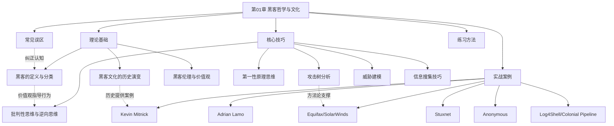
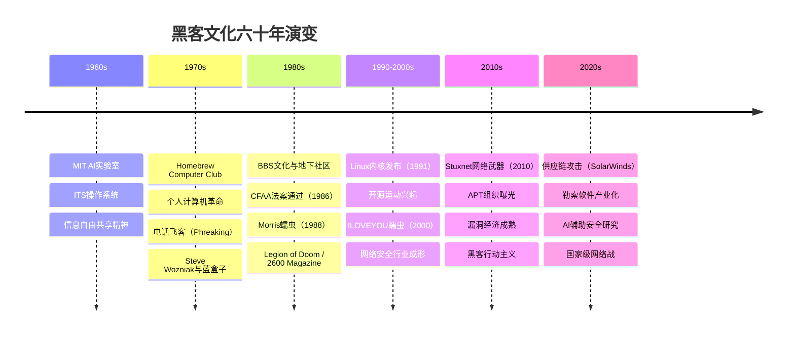

# 第01章 黑客哲学与文化 - 本章小结

## 一、本章定位与学习路线图

本章是整本教程的思想基石。在接触任何技术工具之前，你需要先建立对黑客文化的正确理解——这不是可选的"软知识"，而是决定你整个安全职业生涯高度的地基。一个没有正确价值观的安全从业者，技术越强，破坏力越大。



## 二、知识体系全景回顾

### 2.1 道：黑客的定义与身份认同

"黑客"一词诞生于1960年代MIT的Tech Model Railroad Club，最初描述的是能够以创造性、优雅方式解决技术问题的人。Steven Levy在1984年出版的《黑客：计算机革命的英雄》中将第一代黑客的核心价值观总结为五条原则：计算机的使用应该是自由的、信息应该自由流通、不信任权威、计算机可以创造美、计算机可以改善生活。

媒体的误用让"hacker"与"cracker"混为一谈，安全社区因此发展出"帽子"分类系统：

| 类型 | 定义 | 行为特征 | 法律地位 | 典型职业 |
|------|------|----------|----------|----------|
| 白帽（White Hat） | 授权下的安全测试人员 | 发现漏洞并帮助修复 | 合法，受法律保护 | 渗透测试工程师、安全架构师 |
| 黑帽（Black Hat） | 未授权的系统入侵者 | 窃取数据、破坏系统 | 违法，面临刑事处罚 | 无合法职业对应 |
| 灰帽（Grey Hat） | 介于两者之间的行为者 | 未授权测试但会报告漏洞 | 法律灰色地带 | 漏洞赏金猎人（需规范操作） |
| 红帽（Red Hat） | 主动攻击黑帽的黑客 | 以攻止攻，反击恶意黑客 | 法律地位模糊 | 部分政府网络安全机构 |
| 蓝帽（Blue Hat） | 外部安全测试人员 | 产品发布前的安全测试 | 合法 | 微软蓝帽计划等 |
| 脚本小子（Script Kiddie） | 使用他人工具的初学者 | 不理解原理，只会运行工具 | 取决于行为 | 无（需尽快成长为真正从业者） |

现代安全行业中有多种合法角色运用黑客技术：渗透测试工程师模拟攻击者视角、安全研究员发现新漏洞类型、漏洞赏金猎人通过合法平台获取收入、安全架构师在设计阶段融入安全考量、应急响应工程师在安全事件后调查和恢复。根据(ISC)²的报告，全球网络安全专业人员已超过500万人。

### 2.2 法：黑客文化的历史演变

黑客文化从MIT实验室到全球网络空间，经历了五个关键阶段。每个阶段都塑造了今天的安全行业：



**第一代（1960s）**：MIT AI实验室的共享精神——计算机时间宝贵，应该充分利用每一秒。ITS操作系统没有密码，所有代码公开可读。这种"所有信息应该自由流通"的理念成为黑客文化的DNA。

**第二代（1970s）**：从软件到硬件的革命。Homebrew Computer Club（1975年）催生了个人计算机产业，Steve Wozniak和Steve Jobs在这里起步。电话飞客文化——John Draper发现Captain Crunch麦片盒里的2600Hz哨子能控制AT&T电话交换系统——展示了"理解系统原理就能创造性利用"的黑客精神。

**第三代（1980s）**：地下文化与法律碰撞。BBS成为黑客群体的聚集地，Legion of Doom和Masters of Deception等组织兴起。1986年CFAA法案的通过标志着法律开始介入，Kevin Mitnick和Kevin Poulsen先后入狱。1988年Morris蠕虫成为第一个根据CFAA被定罪的案例。

**第四代（1990-2000s）**：互联网时代的双面性。Linus Torvalds的Linux（1991）和Eric Raymond的《大教堂与集市》（1998）推动了开源运动。同时，ILOVEYOU蠕虫造成约100亿美元损失、Code Red感染35万台服务器、SQL Slammer在10分钟内感染全球75%主机——网络犯罪开始产业化。

**第五代（2010s至今）**：高级威胁时代。Stuxnet（2010）证明了网络武器可以破坏物理设施。APT28、APT29、Lazarus Group等国家级黑客组织被曝光。漏洞赏金平台（HackerOne、Bugcrowd）催生了成熟的漏洞经济。Anonymous等组织将黑客行动主义推向新高度。2020年SolarWinds供应链攻击和2021年Colonial Pipeline勒索事件展示了现代网络威胁的复杂性和破坏力。

### 2.3 术：黑客伦理与价值观

黑客文化不是无政府主义——它有一套被广泛认同的伦理原则。这些原则决定了你的行为边界：

**核心价值观矩阵**

| 价值观 | 内涵 | 技术体现 | 社会意义 |
|--------|------|----------|----------|
| 信息自由 | 信息应该自由流通 | GPL许可证、开源软件 | 知识不应该被垄断 |
| 能力主义 | 技术能力是唯一评价标准 | "Talk is cheap, show me the code" | 打破学历、年龄、性别壁垒 |
| 质疑权威 | 对集中化权力持怀疑态度 | 去中心化技术、加密通信 | 推动制度进步 |
| 分享协作 | 知识越分享越有价值 | CTF、安全社区、开源贡献 | 加速技术进步 |
| 创造性解决问题 | 用非传统方式达到目标 | 漏洞挖掘、逆向工程 | 培养创新能力 |

**负责任的漏洞披露（Responsible Disclosure）**是平衡信息公开与安全风险的核心机制。Google Project Zero的90天披露政策是目前业界较为广泛接受的标准：厂商有90天的时间修复漏洞，超过期限后漏洞细节将被公开。Katie Moussouris创立的协调漏洞披露（CVD）流程进一步细化了这一机制。

信息自由不是绝对的——零日漏洞利用代码的公开传播可能带来安全风险，这就是为什么安全社区发展出了"先通知厂商、给修复时间、再公开细节"的行业规范。

### 2.4 器：核心思维技巧

本章介绍的思维技巧是安全从业者最核心的"武器"——不是某个具体工具，而是分析问题的方法论。

**批判性思维（攻击者视角）**

普通用户看到登录页面想"输入密码登录"，安全从业者看到同一页面会想：SQL注入防御？HTTPS传输？暴力破解保护？会话管理？CSRF防护？错误消息信息泄露？认证绕过可能性？这种"不信任任何默认配置、不信任任何用户输入、不信任任何看似安全的系统"的思维方式是安全思维的核心。

**第一性原理思维**

回到问题本质，从最基本的假设开始思考。以SQL注入为例：本质是应用程序将用户输入直接拼接到SQL语句中，SQL是结构化查询语言有特定语法，用户输入如果包含SQL语法就会被数据库引擎解析为指令。理解了这个本质，你就能推导出：参数化查询能防止注入（因为分离了数据和指令）、所有基于字符串拼接的SQL语句都有注入风险、不仅是SELECT，INSERT/UPDATE/DELETE都可能被注入、二次注入是存储数据在后续使用时被拼接到SQL语句中。

**攻击树分析（Attack Tree）**

Bruce Schneier在1999年提出的安全分析方法，将复杂攻击场景分解为层次化子目标。构建步骤：定义根目标→分解子目标→确定AND/OR逻辑关系→递归分解→评估每个叶子节点的难度、成本和风险。

**威胁建模（Threat Modeling）**

微软STRIDE模型是最常用的威胁建模框架：

| 威胁类型 | 描述 | 对应安全属性 | 典型攻击示例 |
|---------|------|-------------|-------------|
| Spoofing（欺骗） | 假冒他人身份 | 认证 | 钓鱼邮件、Session劫持 |
| Tampering（篡改） | 修改数据或代码 | 完整性 | SQL注入、中间人攻击 |
| Repudiation（否认） | 否认执行过的操作 | 不可否认性 | 日志篡改、删除操作记录 |
| Information Disclosure（信息泄露） | 未授权的信息访问 | 保密性 | 目录遍历、敏感数据泄露 |
| Denial of Service（拒绝服务） | 系统可用性破坏 | 可用性 | DDoS、资源耗尽攻击 |
| Elevation of Privilege（权限提升） | 获取更高权限 | 授权 | 本地提权、横向移动 |

**信息搜集技巧**

被动信息搜集（不直接与目标交互）是渗透测试的第一步，也是OSINT的核心内容。包括：域名和IP信息查询（WHOIS、DNS记录、证书透明度日志）、搜索引擎高级技巧（Google Dorks）、公开数据源（社交媒体、代码仓库、招聘网站）。主动信息搜集则包括端口扫描、服务枚举、Web应用指纹识别等。

## 三、实战案例核心教训

本章通过六个真实案例展示了黑客文化的多个维度。以下是每个案例的核心教训：

| 案例 | 时间 | 核心教训 | 关联知识点 |
|------|------|----------|-----------|
| Kevin Mitnick | 1980s-2000s | 社会工程学的威力；从违法到合法的转变 | 黑客分类、职业转型 |
| Adrian Lamo | 2000s | 黑客伦理的复杂性；告密者的道德困境 | 灰帽行为、道德边界 |
| Stuxnet | 2010 | 网络武器可以破坏物理设施；国家级网络战的开端 | APT攻击、零日漏洞链 |
| Anonymous | 2008-至今 | 去中心化组织的力量与局限；黑客行动主义的两面性 | 黑客行动主义、社区治理 |
| Equifax | 2017 | 已知漏洞不修复的代价（Apache Struts CVE-2017-5638）；1.47亿人数据泄露 | 漏洞管理、安全响应 |
| SolarWinds | 2020 | 供应链攻击的隐蔽性和破坏力；信任链被打破的后果 | 供应链安全、APT |
| Log4Shell | 2021 | 开源组件的广泛使用放大了漏洞影响；一个JNDI查找调用影响全球 | 开源安全、依赖管理 |
| Colonial Pipeline | 2021 | 勒索软件对关键基础设施的威胁；网络安全与国家安全的交汇 | 勒索软件、关键基础设施 |

**从案例中提炼的关键模式：**

1. **技术漏洞+人为疏忽=灾难**：Equifax的Apache Struts漏洞补丁早就发布了，但没有及时应用。SolarWinds的构建系统被入侵，但没有代码签名验证。
2. **攻击面在不断扩大**：从单机入侵（Mitnick时代）到供应链攻击（SolarWinds），攻击者总能找到最薄弱的环节。
3. **法律后果越来越严重**：Mitnick被判5年监禁，今天的数据泄露可能导致企业面临数十亿美元的罚款（GDPR最高可达全球营收的4%）。
4. **防御比攻击更难**：攻击者只需要找到一个突破口，防御者需要保护所有可能的攻击面。

## 四、七大常见误区深度辨析

本章纠正了关于黑客文化的七个常见误解。理解这些误区不是"知道就好"——它们直接影响你的学习路径和职业发展：

| 误区 | 真相 | 对你的影响 |
|------|------|-----------|
| 黑客=犯罪分子 | 黑客是技术能力，白帽是合法职业 | 决定你是否敢踏入门 |
| 黑客技术是天生的 | 绝大多数从业者通过系统学习成长 | 决定你是否坚持学习 |
| 学会工具就等于学会安全 | 工具会过时，原理不会；理解原理才能创新 | 决定你的学习方法 |
| CTF=真实安全 | CTF是学习工具，真实环境更复杂 | 决定你的练习策略 |
| 安全只是技术问题 | 安全=技术+人员+流程 | 决定你的能力维度 |
| 开源比闭源更安全 | 取决于代码质量、维护状态和安全响应 | 决定你的技术选型 |
| 我没什么值得被攻击 | 自动化攻击不区分目标价值 | 决定你的安全意识 |

**特别强调"原理优先"原则**：以SQL注入为例——只会使用SQLMap的"脚本小子"遇到WAF就无法应对；理解SQL注入原理的人能手动构造注入语句，理解WAF绕过的原理，甚至能发现新的注入向量。工具是提高效率的手段，原理才是你的核心竞争力。

## 五、关键概念速查表

| 概念 | 定义 | 在本书中的位置 | 重要性等级 |
|------|------|---------------|-----------|
| 白帽黑客 | 在授权下进行安全测试的专业人员 | 第1章理论基础 | ★★★★★ |
| 黑帽黑客 | 未经授权入侵系统的非法行为者 | 第1章理论基础 | ★★★★★ |
| 灰帽黑客 | 介于白帽和黑帽之间的行为者 | 第1章理论基础 | ★★★★☆ |
| 黑客伦理 | 黑客文化的价值观体系（信息自由、能力主义、质疑权威） | 第1章理论基础 | ★★★★★ |
| 社会工程学 | 利用人的心理弱点进行攻击的技术 | 第1章+后续渗透测试章节 | ★★★★★ |
| 攻击树 | Bruce Schneier提出的系统化攻击分析方法 | 第1章核心技巧 | ★★★★☆ |
| 威胁建模 | 在系统设计阶段识别安全风险的方法（STRIDE） | 第1章核心技巧 | ★★★★☆ |
| 负责任披露 | 漏洞报告的行业规范（90天修复窗口） | 第1章理论基础 | ★★★★★ |
| APT | 高级持续性威胁，通常由国家级行为体发起 | 第1章实战案例 | ★★★★☆ |
| OSINT | 开源情报，从公开来源收集信息 | 第1章核心技巧 | ★★★★☆ |
| CTF | Capture The Flag，安全学习和竞赛方式 | 第1章练习方法 | ★★★★☆ |
| 零日漏洞 | 未被厂商知晓的安全漏洞 | 第1章深度拓展 | ★★★★★ |
| 供应链攻击 | 通过攻击软件供应链来入侵最终目标 | 第1章实战案例 | ★★★★★ |

## 六、自检清单：你真的掌握了吗？

完成本章学习后，用以下问题检验自己的理解深度。每个问题对应不同的认知层次：

### 6.1 记忆层（知道）

- [ ] "Hacker"一词最初来自哪里？含义是什么？
- [ ] 白帽、黑帽、灰帽黑客的区别是什么？
- [ ] 黑客文化经历了哪五个阶段？
- [ ] Steven Levy总结的黑客伦理包含哪些原则？

### 6.2 理解层（懂为什么）

- [ ] 为什么媒体会将"黑客"与"犯罪"画等号？这种误解的根源是什么？
- [ ] 为什么说"理解原理比掌握工具更重要"？举一个具体例子。
- [ ] 为什么负责任的漏洞披露需要给厂商修复时间？如果不给会怎样？
- [ ] 为什么说"安全不只是技术问题"？CEO诈骗（BEC）如何证明这一点？

### 6.3 应用层（会用）

- [ ] 你能用攻击树分析一个具体的攻击场景吗？（如：获取某网站的管理员权限）
- [ ] 你能用STRIDE模型对一个简单应用进行威胁建模吗？
- [ ] 你能区分一个安全行为是合法还是违法吗？判断依据是什么？
- [ ] 你能设计一个简单的负责任漏洞披露流程吗？

### 6.4 分析层（看得透）

- [ ] Kevin Mitnick从通缉犯变成安全顾问，这个转变说明了什么？
- [ ] Stuxnet的技术水平和战略影响之间有什么关系？
- [ ] SolarWinds供应链攻击为什么比传统攻击更难防御？
- [ ] 开源运动的"信息自由"与安全研究的"负责任披露"之间是否存在矛盾？

### 6.5 评价层（能判断）

- [ ] 如果你发现了一个知名网站的严重漏洞但联系不上厂商，你会怎么做？
- [ ] Anonymous对ISIS的攻击是否具有道德正当性？为什么？
- [ ] AI辅助漏洞发现会如何改变攻防格局？

### 6.6 创造层（能输出）

- [ ] 你能为一个虚构公司设计一份安全政策草案吗？
- [ ] 你能写一篇关于黑客伦理的500字分析文章吗？
- [ ] 你能为一个开源安全工具提交一个有意义的Issue或PR吗？

**评分标准**：如果前4层（记忆→分析）的问题你都能清晰回答，说明你已掌握本章核心内容。如果后2层（评价→创造）也能应对，说明你已经超越了"学习者"阶段，开始像安全从业者一样思考。

## 七、常见薄弱点与补救建议

学习本章时，以下几个点容易被忽视或理解不深：

| 薄弱点 | 表现 | 补救方法 |
|--------|------|----------|
| 黑客伦理的边界 | 只知道"信息应该自由"，不知道边界在哪 | 阅读Google Project Zero的披露政策；研究CVE-2017-5638（Equifax）的披露时间线 |
| 攻击树的实际应用 | 理论懂了但不会用 | 选择一个真实漏洞（如Log4Shell），手动构建攻击树 |
| 威胁建模的深度 | 只知道STRIDE的六个字母 | 用STRIDE分析你常用的手机App，写出完整的威胁报告 |
| 历史事件的关联性 | 每个案例单独看懂了，但看不到演变脉络 | 画一条从Morris蠕虫→ILOVEYOU→Stuxnet→SolarWinds→Log4Shell的技术演变线 |
| 法律边界的判断 | 知道"未授权=违法"，但实际场景判断不清 | 阅读第2章《法律与道德》后，回头重新审视本章案例 |

## 八、知识网络：本章与后续章节的连接

本章建立的概念框架将贯穿整本书：

```text
第01章 黑客哲学与文化
├── 黑客伦理 ──────────→ 第02章 法律与道德（深入法律边界）
├── 攻击者思维 ────────→ 第03章 网络基础（理解攻击面）
├── 威胁建模 ──────────→ 第04章 Web安全（应用层威胁分析）
├── 攻击树 ────────────→ 第05章 渗透测试（系统化攻击规划）
├── 社会工程学 ────────→ 第06章 社会工程学（深入人的因素）
├── 供应链攻击 ────────→ 第07章 恶意软件分析（理解攻击载体）
├── 漏洞经济 ──────────→ 第08章 漏洞研究（发现与报告漏洞）
├── APT攻击 ───────────→ 第09章 高级持续性威胁（国家级攻击）
└── 安全社区 ──────────→ 全书（持续学习与社区参与）
```

## 九、下一步行动清单

### 立即行动（今天）

1. **回顾薄弱点**：对照上面的自检清单，标记你还不确定的问题
2. **搭建环境**：安装VirtualBox/VMware，下载Kali Linux虚拟机
3. **加入社区**：选择一个安全社区加入（Reddit r/netsec、安全客、看雪论坛）

### 本周行动

4. **阅读推荐书籍**：从Steven Levy的《黑客：计算机革命的英雄》开始
5. **开始CTF**：注册OverTheWire，完成Bandit前10关
6. **练习威胁建模**：用STRIDE分析你常用的任意一个App

### 本月行动

7. **深入案例研究**：选择本章一个案例（推荐Stuxnet或SolarWinds），阅读完整的技术分析报告
8. **建立学习日志**：每天记录学习内容和思考
9. **进入第二章**：开始学习《法律与道德》

## 十、本章核心金句

> *"The world is full of fascinating problems waiting to be solved."*
> — Eric S. Raymond，《黑客文化简史》

> *"Talk is cheap, show me the code."*
> — Linus Torvalds

> *"Information wants to be free."*
> — Stewart Brand，《Whole Earth Catalog》

> *"技术是一把双刃剑，掌握黑客技术的人需要更高的道德标准。真正的黑客精神是创造而非破坏，是分享而非独占，是质疑而非盲从。"*

---

记住，成为一名优秀的安全从业者需要时间、耐心和持续的努力。本章为你奠定了正确的思想基础——你理解了黑客文化的本质、建立了正确的价值观、掌握了基本的思维方法。接下来的章节将带你进入技术学习的旅程。保持好奇心，享受学习的过程。每一行你写的代码、每一个你分析的漏洞、每一次你参与的CTF，都在把你塑造成一个更好的安全从业者。
