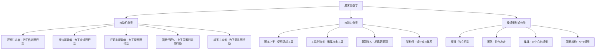
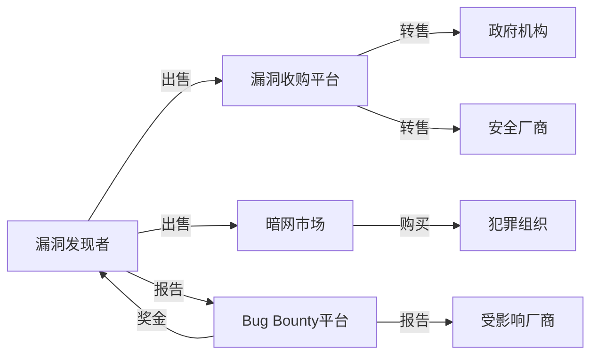
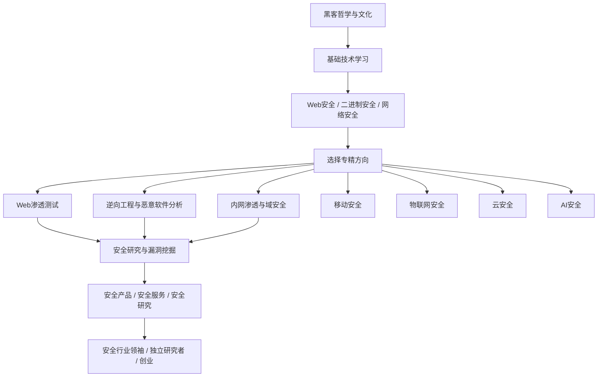

# 第01章 黑客哲学与文化 - 深度拓展

> 本章是全章的进阶延伸，面向希望深入理解黑客文化本质、行业格局和伦理边界的读者。如果你已经掌握了黑客的基本定义、历史脉络和核心价值观，这里的内容将带你进入更深层的思考。

---

## 一、黑客伦理的哲学根基

黑客文化并非凭空产生。它植根于西方数百年的自由主义思想传统，与技术乌托邦主义、反权威精神和信息民主化运动紧密交织。理解这些哲学根基，不是学术装饰——它决定了你在面对真实道德困境时如何抉择。

### 1.1 自由意志主义与技术乌托邦

#### 1960年代反文化运动的遗产

20世纪60年代的美国反文化运动（Counterculture Movement）对黑客文化的形成产生了决定性影响。这场运动的核心诉求——反对权威、追求个人自由、质疑体制——直接塑造了第一代黑客的价值观。

Stewart Brand在1968年创办的《Whole Earth Catalog》是连接反文化运动与黑客文化的桥梁。Brand提出的"信息获取工具"理念——让普通人获得此前只有精英阶层才能接触的知识和工具——直接启发了后来的黑客社区。Brand的名言"Information wants to be free"（信息渴望自由）成为黑客伦理的核心信条之一。

这句话的完整版本其实更精确："Information wants to be free. Information also wants to be expensive. That tension will not go away."（信息渴望自由，同时也渴望昂贵。这种张力不会消失。）很多引用者只取前半句，忽略了Brand本人对这种内在矛盾的清醒认知——这种选择性引用本身就反映了黑客社区内部关于信息自由边界的持续争论。

#### 赛博空间独立宣言

1996年2月8日，电子前线基金会（EFF）联合创始人John Perry Barlow在达沃斯世界经济论坛上发表了《赛博空间独立宣言》（A Declaration of the Independence of Cyberspace）：

> "工业世界的政府们，你们这些令人厌倦的钢铁和血肉的巨人，我来自赛博空间，思维的新家园。我代表未来，要求属于过去的你们不要干涉我们。"

这份宣言代表了早期互联网社区对去中心化、无政府治理的理想主义追求。从历史角度看，它与18世纪的启蒙运动和美国独立宣言有着清晰的精神谱系关系——都是对既有权力结构的挑战，都诉诸自然权利和个体自由。

但现实比理想骨感得多。2023年，Barlow已经去世五年，赛博空间不仅没有独立于国家主权，反而成为大国博弈的核心战场。中国、俄罗斯、欧盟、美国各自建立了自己的网络治理框架。这份宣言的历史价值在于它记录了一个特定时代的技术乐观主义——以及这种乐观主义的局限性。

#### 技术乌托邦的幻灭与重建

技术乌托邦主义经历了三个阶段：

| 阶段 | 时期 | 核心信念 | 代表事件 |
|------|------|----------|----------|
| 兴起 | 1960-1990s | 技术将解放人类，信息自由将带来民主化 | 个人计算机革命、互联网诞生 |
| 幻灭 | 2000-2010s | 技术被资本和权力收编，成为控制工具 | 监控资本主义崛起、棱镜门 |
| 重建 | 2010s-至今 | 务实的技术改良主义，关注具体权利而非宏大叙事 | GDPR、密码朋克运动、去中心化技术 |

今天的黑客社区已经从"技术必然带来自由"的天真信念，转向了更务实的立场：技术是中性的工具，关键在于谁控制它、如何使用它、为谁服务。

### 1.2 维特根斯坦的语言游戏与黑客术语体系

路德维希·维特根斯坦（Ludwig Wittgenstein）后期哲学中的"语言游戏"（Language Game）概念，为理解黑客文化中的术语体系提供了精确的理论框架。

#### 语言游戏理论简述

维特根斯坦在《哲学研究》中提出：语言的意义不在于它指向的对象，而在于它在特定"生活形式"（Lebensform）中的使用方式。一个词的含义由它在特定语境中的"游戏规则"决定。

黑客术语完美地印证了这一理论。以下术语的含义完全取决于你在哪个"游戏"中使用它们：

| 术语 | 字面含义 | 黑客语境含义 | 社会功能 |
|------|----------|--------------|----------|
| pwned | 无（拼写错误） | 被攻破、被完全控制 | 标识入门者对极客文化的了解程度 |
| 0day | 零天 | 未公开的漏洞（厂商零天知晓） | 量化技术水平和资源 |
| l33t | 无（leet → elite） | 精英、高手 | 群体内部等级标识 |
| n00b | 新手 | 不懂规矩的新人 | 维护社区边界 |
| root | 根 | 最高权限 | 标志技术能力的顶峰 |
| pwn | 拥有（own的变体） | 完全控制目标系统 | 攻击成功的标志 |
| CVE | 无（缩写） | 公共漏洞编号 | 安全行业的通用语言 |
| shell | 壳 | 命令行访问权限 | 攻击的核心目标 |

#### Jargon File：黑客文化的语言学档案

Eric Raymond从1975年开始维护的Jargon File（又名《The New Hacker's Dictionary》）是黑客亚文化最完整的语言学档案。该文件记录了数千条术语及其起源故事，其中许多术语的演化过程本身就反映了黑客文化的历史变迁。

值得注意的是，Raymond的Jargon File也受到批评——一些人认为它过度代表了特定子群体（美国东海岸学术黑客）的声音，而忽略了其他地区和群体的黑客文化。这种批评本身就揭示了一个重要事实：黑客文化从来不是单一的、均质的，它是多个相互重叠的亚文化的集合。

#### 黑客术语的演变规律

黑客术语的产生和消亡遵循几个可观察的规律：

1. **技术术语的生活化**：如"bug"从工程术语变成日常用语，"firewall"从建筑概念变成网络安全术语
2. **拼写变异作为身份标识**：l33t（leet）speak、故意拼写错误（pwn代替own）是区分"圈内人"和"圈外人"的信号
3. **军事/战争隐喻的泛化**：exploit（利用）、payload（载荷）、attack surface（攻击面）——安全领域大量借用军事术语，反映了对抗性的思维模式
4. **反讽与解构**：Lulz（lols的变体，来自LulzSec）、"because we can"等表达体现了黑客文化中根深蒂固的反权威幽默感

### 1.3 开源运动的伦理分裂：自由软件 vs. 开源软件

Richard Stallman创立的自由软件基金会（FSF）和GNU项目，将黑客伦理从单纯的技术探索提升到了社会运动的高度。Stallman提出的"四大自由"构成了自由软件运动的伦理基石：

- **自由0**：以任何目的运行程序的自由
- **自由1**：研究程序如何工作并修改它的自由
- **自由2**：重新分发副本的自由
- **自由3**：将修改后的版本分发给他人的自由

#### Stallman与Raymond的路线之争

1998年，Eric Raymond和Bruce Perens创立了"开源倡议"（Open Source Initiative, OSI），明确与Stallman的"自由软件"运动分道扬镳。这一分裂的深层原因不是技术分歧，而是**传播策略和哲学立场的根本差异**：

| 维度 | 自由软件（FSF/Stallman） | 开源软件（OSI/Raymond） |
|------|--------------------------|-------------------------|
| 核心诉求 | 用户的道德权利和自由 | 软件开发的方法论优势 |
| 论证方式 | 伦理论证（"你应该这样做"） | 实用论证（"这样做效果更好"） |
| 对商业的态度 | 警惕商业化对自由的侵蚀 | 拥抱商业化带来的资源和影响力 |
| 目标受众 | 公众和政策制定者 | 企业和开发者 |
| 典型代表 | GNU/Linux（强调GNU） | Linux（淡化自由软件理念） |
| 许可证偏好 | GPL（强copyleft） | MIT/Apache/BSD（宽松许可） |

这场争论至今仍在继续。2019年，Stallman因在MIT相关争议中的不当言论被迫辞去FSF主席职务（后于2021年复职），这一事件再次引发了社区关于"技术贡献者是否应该与其个人观点分离"的激烈辩论。

#### 对安全从业者的启示

这场分裂对安全从业者有直接的实践意义：

- **GPL许可的安全工具**（如Metasploit、Nmap）通常要求衍生作品也必须开源，这影响了商业安全产品的开发策略
- **MIT/Apache许可的安全工具**（如许多Python安全库）允许在闭源商业产品中使用，降低了商业化的法律风险
- 理解不同开源许可证的含义，是安全从业者的基本素养——你不能在一个渗透测试项目中随意混合不同许可证的工具

### 1.4 安全研究的道德困境：披露的艺术

安全研究者面临的最核心道德困境是漏洞披露问题。这不是一个有标准答案的技术问题，而是一个需要在多个相互竞争的价值之间寻找平衡的伦理判断。

#### 披露范式的演化

漏洞披露的历史经历了几个关键阶段：

**1. 默许期（1990年代之前）**：没有明确的披露规范。发现漏洞的人要么默默修复，要么公开发布，没有系统性的协调机制。

**2. 完全披露 vs. 负责任披露的争论（2000年代）**

2002年，安全研究者Rain Forest Puppy提出了"负责任披露"（Responsible Disclosure）的概念：发现漏洞后应先通知厂商，给予合理修复时间，然后再公开。这一理念得到了微软等大厂商的大力支持。

但完全披露（Full Disclosure）的支持者反驳说：厂商在没有公开压力的情况下会拖延修复，完全披露是保护用户的唯一有效方式。

**3. 协调漏洞披露（CVD）的标准化（2010年代至今）**

Katie Moussouris创立的漏洞赏金协调漏洞披露（CVD）流程试图在两种极端之间找到平衡。其核心框架包括：

```text
发现漏洞 → 初始报告（厂商/协调机构） → 确认接收 → 修复开发
→ 补丁发布 → 公开披露（通常90天窗口期）
```

#### 经典案例分析

**案例一：Google Project Zero vs. 微软（2018年）**

Google Project Zero严格执行90天披露期限。2018年初，Project Zero在90天期限到期后公开了Spectre和Meltdown漏洞的细节，而微软尚未完成所有受影响产品的补丁。微软公开批评Google的做法"将用户置于风险之中"，Google则坚持认为严格的期限是迫使厂商认真对待安全的唯一方式。

这个案例的核心矛盾在于：Google的立场是"规则必须一视同仁"，微软的立场是"特殊情况需要灵活处理"。两种立场都有道理，但它们基于不同的价值优先级。

**案例二：EternalBlue与WannaCry（2017年）**

NSA（美国国家安全局）在发现Windows SMB协议中的EternalBlue漏洞后，选择将其武器化而非通知微软。2017年，Shadow Brokers黑客组织泄露了NSA的工具库，其中包含EternalBlue的利用代码。随后，WannaCry勒索病毒利用该漏洞在全球范围内造成大规模破坏，影响了150多个国家的20多万台计算机，包括英国NHS医疗系统。

这个案例的教训是：**政府机构囤积漏洞的行为存在系统性风险**。NSA的"漏洞公平裁决过程"（Vulnerabilities Equities Process, VEP）理论上要求在"进攻价值"和"防御价值"之间平衡，但EternalBlue事件暴露了这一过程的失败——一个本应被修复的漏洞被囤积了数年，最终造成了全球性的安全灾难。

**案例三：Log4Shell（2021年）**

Apache Log4j中的远程代码执行漏洞（CVE-2021-44228）是近年来影响最广泛的安全事件之一。该漏洞在被公开披露后，由于Log4j在整个Java生态中的广泛使用，几乎所有使用Java的企业都受到影响。这个案例凸显了一个新问题：**在现代软件供应链中，一个组件的漏洞可能影响数百万个下游应用**。

### 1.5 网络空间的哲学问题

#### 隐私权的哲学基础

隐私权不仅仅是一个法律概念，它有深厚的哲学根基。哲学家们对隐私的理解经历了三个层次的演化：

**1. 信息自决权**：个人有权决定自己的信息被谁获取、如何使用。这一理念源自康德的自主性（autonomy）概念——人是目的，不是手段。

**2. 语境完整性**：Helen Nissenbaum教授提出的"语境完整性"（Contextual Integrity）理论认为，隐私侵权的本质不是"信息泄露"，而是"信息流违反了特定社会语境的规范"。例如：你告诉医生的健康信息，不应该出现在保险公司的数据库中——即使信息是真实的，信息的流动违反了医患关系的语境规范。

**3. 监控与权力**：福柯的"全景监狱"（Panopticon）概念被广泛应用于数字监控分析。当人们知道自己可能被监视时，他们会自我审查——这不是技术问题，是权力问题。

这些哲学框架对安全从业者的实际工作有直接指导意义：当你设计一个监控系统或安全审计方案时，你不仅仅在做技术决策，你同时在做伦理决策。

#### 数字身份与真实自我的张力

在赛博空间中，人们可以创建与物理身份完全分离的数字身份。这种"身份解耦"带来了深刻的哲学问题：

- **匿名性是自由的保障还是犯罪的庇护？** Tor网络既保护了政治异见者，也为暗网犯罪提供了基础设施
- **数字身份是否有"被遗忘的权利"？** 欧盟GDPR第17条确立了这一权利，但技术实现（从互联网上彻底删除信息）几乎不可能
- **在线行为是否应该追溯到真实身份？** 这是中国网络实名制的核心争议点

---

## 二、黑客群体的社会学透视

### 2.1 黑客亚文化的理论框架

从社会学角度看，黑客群体完全符合Dick Hebdige在《Subculture: The Meaning of Style》中描述的亚文化特征。让我们用Hebdige的理论框架系统地解构黑客文化：

#### 亚文化的五要素

| 要素 | 黑客文化中的体现 |
|------|------------------|
| 独特语言 | l33t speak、技术术语、IRC行话 |
| 符号系统 | ASCII艺术、Tux企鹅、匿名面具、绿色代码雨 |
| 仪式行为 | CTF竞赛的flag提交、Defcon的badge hacking、黑掉一个系统的"通关"仪式 |
| 价值观念 | 信息自由、反权威、技术精英主义 |
| 着装/视觉风格 | 黑色T恤、连帽衫、极简主义审美 |

#### 黑客社区的信任机制

黑客社区发展出了独特的信任建立机制，这些机制通常基于技术能力的可验证证明：

**1. PGP信任之网（Web of Trust）**

Phil Zimmermann设计的PGP信任之网是去中心化信任的经典模型。与依赖中央证书颁发机构（CA）的PKI不同，PGP让用户互相签名来建立信任链：

```text
Alice签名Bob的公钥 → Bob签名Charlie的公钥 → Alice可以通过信任Bob间接信任Charlie
```

这个模型的技术创新在于：它用数学证明代替了机构背书，完美契合了黑客文化中"不信任权威"的核心价值观。但实际使用中，PGP信任之网从未真正大规模普及——密钥管理的复杂性使其难以被普通用户接受。

**2. 贡献图谱（Contribution Graph）**

在GitHub时代，你的贡献历史（contribution graph）成为新的"信任证明"。一个满是绿色方块的GitHub主页，就像黑客社区的"信用报告"。这种机制更透明、更可验证，但也带来了新的问题——它倾向于奖励"量"而非"质"，并且对非英语国家的开发者存在系统性偏见。

**3. 漏洞赏金声誉系统**

HackerOne、Bugcrowd等平台建立了基于漏洞发现记录的声誉系统。你在这些平台上的排名和成就，成为你在安全社区中的"信用积分"。

### 2.2 黑客类型学：超越帽子的颜色

传统的"白帽/黑帽/灰帽"分类过于简化。以下是更精确的黑客类型学：



#### 每种类型的典型特征

**理想主义者（Idealist）**

代表人物：Aaron Swartz、Edward Snowden、Chelsea Manning

核心驱动：信息应该自由、权力应该被监督、不公正应该被揭露

典型案例：Aaron Swartz利用MIT网络从JSTOR批量下载学术论文，他认为这些由公共资金资助的研究成果应该对所有人免费开放。他的行为引发了关于学术出版垄断和信息自由的广泛讨论。2013年，26岁的Swartz在面临联邦起诉的压力下自杀，这一事件成为数字权利运动的重要转折点。

**经济驱动者（Mercenary）**

代表人物：各种勒索软件团伙成员、漏洞经纪人

核心驱动：经济利益最大化

典型案例：DarkSide勒索软件团伙在2021年攻击Colonial Pipeline后获得了约440万美元的赎金。该团伙甚至有"客户服务"部门来处理赎金谈判——犯罪行为的产业化程度令人震惊。

**好奇心驱动者（Explorer）**

代表人物：Kevin Mitnick（早期）、大多数CTF选手

核心驱动：证明自己能做到、理解系统如何工作

典型案例：Kevin Mitnick在1980-90年代入侵多家电信公司的主要动机不是经济利益，而是证明自己能够做到。他后来在自传中写道："对我而言，挑战本身就是奖励。"

**国家代理人（State Actor）**

代表人物：方程式组织（Equation Group）、APT28/Fancy Bear、Lazarus Group

核心驱动：国家情报和战略利益

典型案例：2010年被发现的Stuxnet病毒，被广泛认为是美国和以色列联合开发的网络武器，用于破坏伊朗核设施的铀浓缩离心机。这是已知的第一个以物理基础设施为目标的网络武器，标志着网络战从理论走向现实。

**虚无主义者（Nihilist）**

代表人物：部分Anonymous成员、LulzSec核心成员

核心驱动：看世界燃烧（for the lulz）

典型案例：LulzSec在2011年进行了为期50天的"试航"（Lulz Boat）攻击活动，攻击了索尼、PBS、FBI关联网站等目标，其声明"We do it because it's lulzy"完美体现了这种虚无主义精神。

### 2.3 性别与多样性：被忽视的历史与当下的努力

#### 被遗忘的先驱

黑客文化长期以男性为主导，但历史上有许多被忽视的女性做出了关键贡献：

- **Ada Lovelace（1815-1852）**：拜伦勋爵之女，为Charles Babbage的分析机编写了世界上第一个算法，被广泛认为是第一位程序员
- **Grace Hopper（1906-1992）**：COBOL语言之母、编译器先驱、"debug"一词的命名者（她从计算机中取出了一只真正的虫子——飞蛾）
- **Margaret Hamilton（1936-）**：Apollo登月计划的软件负责人，创造了"软件工程"这个术语
- **Hedy Lamarr（1914-2000）**：好莱坞女演员兼发明家，她与George Antheil共同发明的"频率跳变"技术是现代Wi-Fi和蓝牙的前身

#### 当下的努力与持续的挑战

近年来安全社区在推动多样性方面的努力包括：

- **Women in Security and Privacy（WISP）**：为女性提供安全和隐私领域的职业发展支持
- **Girls Who Code**：旨在缩小科技领域的性别差距
- **DEF CON的多样性举措**：包括专门的女性和少数群体聚会空间
- **中国的女性安全研究者群体**：如安全圈内的"小姐姐"社群

但挑战依然严峻。根据ISC²的2023年报告，全球网络安全从业者中女性仅占约25%。安全会议的speaker lineup中女性比例更低。改变这种状况需要系统性的努力——不是降低标准，而是消除结构性障碍。

### 2.4 黑客心理学：动机与认知模式

理解黑客的心理动机，有助于安全从业者更好地预测攻击者行为。

#### 认知模式特征

安全研究者普遍具有以下认知特征：

**1. 系统性思维（Systems Thinking）**：不满足于理解单个组件，而是追求理解整个系统如何运作——包括系统设计者未曾预料的交互方式。

**2. 逆向思维（Reverse Thinking）**：当普通人看到一个系统时，他们想的是"这个系统如何工作"；黑客想的是"这个系统如何可以被打破"。

**3. 模式识别（Pattern Recognition）**：能够在看似无关的系统中识别出相似的漏洞模式。例如，理解了SQL注入的原理后，能够识别LDAP注入、NoSQL注入等变体。

**4. 持续性（Persistence）**：面对一个"安全"的系统时，普通人会放弃；黑客会想"我还没有找到正确的方法"。

#### 动机光谱

从心理学角度看，黑客的动机可以映射到马斯洛需求层次：

| 需求层次 | 黑客动机体现 |
|----------|-------------|
| 生理/安全 | 经济驱动的犯罪黑客、国家资助的APT |
| 归属感 | 参与黑客社区、获得同行认可 |
| 尊重 | CTF排名、漏洞赏金、安全会议演讲 |
| 自我实现 | 技术突破、改变世界、推动安全进步 |

---

## 三、行业前沿动态

### 3.1 黑客行动主义的演变

从早期的Cult of the Dead Cow（cDc）到Anonymous、LulzSec，黑客行动主义（Hacktivism）在2020年代进入了新阶段。

#### 演化时间线

| 时期 | 代表组织/事件 | 特征 |
|------|--------------|------|
| 1990s | cDc、Hacktivismo | 软件工具导向（如Peekabooty绕过审查） |
| 2008-2012 | Anonymous、LulzSec | 去中心化、DDoS为主、"for the lulz" |
| 2013-2019 | 彭博社式行动主义 | 数据泄露、泄露敏感信息 |
| 2022-至今 | IT Army of Ukraine | 黑客行动主义与国家行为融合 |

2022年俄乌冲突期间，IT Army of Ukraine的组建标志着一个重要的转折点：黑客行动主义不再仅仅是个人或群体对权力的挑战，而是被纳入了国家的军事战略。乌克兰政府通过Telegram频道公开招募志愿者，对俄罗斯目标发动DDoS攻击。这种"平民参与网络战"的模式引发了关于国际法、战争伦理和数字平民保护的深刻讨论。

#### 中国语境下的黑客行动主义

在中国互联网语境中，黑客行动主义有其特殊表现形式：

- **红客联盟（Honker Union）**：2001年中美撞机事件后成立，组织了对美国网站的攻击行动。这是中国黑客行动主义的标志性事件
- **爱国黑客与民族主义**：中国黑客行动主义往往与民族主义情绪紧密交织，这与西方以反权威为导向的黑客行动主义形成对比
- **技术民族主义**：近年来，中国安全社区越来越强调自主可控的安全技术和国产替代

### 3.2 AI辅助安全研究：范式转变

2023-2026年间，AI在安全研究中的应用取得了突破性进展，正在从根本上改变安全研究的方式和效率。

#### AI在安全研究中的应用矩阵

| 应用方向 | 代表性工具/项目 | 成熟度 | 影响程度 |
|----------|----------------|--------|----------|
| 模糊测试自动化 | Google OSS-Fuzz、AFL++ | 高 | 已发现数千个真实漏洞 |
| 代码审计辅助 | GitHub Copilot、CodeQL | 中高 | 显著提高审计效率 |
| 漏洞模式识别 | 大型语言模型（LLM） | 中 | 降低安全研究门槛 |
| 恶意代码分析 | GPT-4分析恶意软件 | 中 | 加速逆向工程 |
| 红队自动化 | AI驱动的渗透测试 | 低中 | 可能改变攻击格局 |
| 安全策略生成 | AI生成防火墙规则、SIEM规则 | 中 | 减少配置错误 |

#### LLM在安全领域的深度应用

大型语言模型（LLM）对安全研究的影响最为深远，具体体现在：

**1. 漏洞发现**

LLM可以分析大量代码库，识别潜在的安全漏洞模式。2024年，Google的研究团队展示了使用Gemini模型自动发现开源软件中的内存安全漏洞的能力。与传统的静态分析工具不同，LLM能够理解代码的语义上下文，减少误报率。

**2. 漏洞利用生成**

更令人担忧的是，LLM也可以用于自动生成漏洞利用代码。虽然主要模型都内置了安全限制，但开源模型（如Llama、Mistral）在微调后可能绕过这些限制。2024年的一项研究表明，GPT-4级别的模型可以为已知CVE自动生成可用的exploit。

**3. 社会工程学自动化**

LLM使社会工程学攻击的规模化成为可能。攻击者可以：
- 批量生成高度个性化的钓鱼邮件
- 模仿特定人物的写作风格
- 自动化地与目标进行多轮对话
- 生成令人信服的虚假身份和背景故事

**4. 安全防御的AI化**

防御方同样在利用AI：
- **异常行为检测**：基于AI的UEBA（User and Entity Behavior Analytics）系统
- **自动化响应**：SOAR（Security Orchestration, Automation and Response）平台
- **威胁情报分析**：AI处理和关联海量威胁情报数据

#### 攻防格局的未来演化

安全行业正在经历一个关键转折点：从"人对人"的对抗向"AI对AI"的对抗过渡。这种转变的深层影响包括：

- **攻击成本急剧下降**：以前需要高级技能才能执行的攻击，现在可能由AI自动完成
- **防御响应速度成为关键**：人类分析员的速度已经无法跟上AI驱动的攻击
- **安全人才需求转变**：从"会操作工具的人"转向"能训练和管理AI安全系统的人"
- **新型漏洞类型出现**：AI模型本身的安全问题（对抗性攻击、提示注入、数据投毒）成为新的攻击面

### 3.3 零日漏洞市场与漏洞经济

#### 零日市场的运作机制

零日漏洞市场是一个多层次的生态系统：



#### 价格参考（2024-2025年）

| 漏洞类型 | Zerodium报价 | Crowdfense报价 | Bug Bounty平均 |
|----------|-------------|----------------|----------------|
| iOS完整利用链 | $2,000,000+ | $2,500,000+ | $500,000-1,000,000 |
| Android完整利用链 | $1,500,000+ | $2,000,000+ | $250,000-500,000 |
| Windows RCE | $500,000+ | $600,000+ | $50,000-200,000 |
| Chrome RCE | $500,000+ | $600,000+ | $100,000-250,000 |
| WhatsApp/Signal RCE | $1,000,000+ | $1,500,000+ | $200,000-500,000 |
| 零点击远程利用 | $3,000,000+ | $3,500,000+ | $1,000,000+ |

价格差异巨大的原因在于：

- **黑市（Zerodium等）**：买家是政府和情报机构，用途是进攻性网络行动，价格最高
- **Bug Bounty（HackerOne等）**：买家是厂商本身，用途是防御性修复，价格相对较低
- **暗网市场**：价格波动大，存在欺诈风险，但匿名性高

#### 漏洞公平裁决过程（VEP）

美国政府的"漏洞公平裁决过程"（Vulnerabilities Equities Process, VEP）是一个跨部门决策机制，用于决定政府发现的漏洞是否应该公开披露。其核心决策框架是：

```text
进攻价值（用于情报收集和网络行动） vs. 防御价值（保护美国系统和盟友）
```

2017年，美国政府首次公开了VEP的框架文件，但批评者指出：该过程缺乏外部监督，且"进攻价值"的权重被系统性地高估。EternalBlue事件就是VEP失败的典型案例。

#### 中国的漏洞管理政策

中国在漏洞管理方面有独特的政策框架：

- **《网络安全法》（2017年）**：要求网络运营者发现安全漏洞后立即采取补救措施，并按规定向主管部门报告
- **CNVD（国家信息安全漏洞共享平台）**：由国家互联网应急中心（CNCERT/CC）运营，是官方的漏洞信息共享平台
- **CNNVD（国家信息安全漏洞库）**：由中国信息安全测评中心运营
- **漏洞出口管制**：中国将部分网络安全技术纳入出口管制清单，限制向境外提供特定漏洞信息

### 3.4 全球安全社区生态

#### 全球重要安全会议

| 会议 | 地点 | 特点 | 适合人群 |
|------|------|------|----------|
| DEF CON | 拉斯维加斯 | 最大的黑客聚会，氛围自由 | 所有层级 |
| Black Hat | 拉斯维加斯 | 商业化、企业导向 | 专业人士 |
| CCC | 柏林 | 欧洲最大，政治色彩浓厚 | 技术+政策 |
| CanSecWest | 温哥华 | Pwn2Own所在地 | 高级研究者 |
| HITB | 阿姆斯特丹/吉隆坡 | 亚太地区重要会议 | 亚太社区 |

#### 中国安全社区

| 社区/会议 | 特点 | 入口 |
|-----------|------|------|
| 看雪安全峰会 | 国内最老牌的安全技术会议 | kanxue.com |
| KCon | 黑客大会，技术分享为主 | kcon.knownsec.com |
| XCON | 安全焦点技术峰会 | xfocus.org |
| 补天/漏洞盒子 | 国内主要漏洞赏金平台 | butian.net / vulbox.com |
| 先知社区 | 阿里安全的技术社区 | xz.aliyun.com |
| 安全客 | 360旗下安全资讯平台 | anquanke.com |
| FreeBuf | 安全媒体和技术社区 | freebuf.com |
| 吾爱破解 | 软件安全和逆向工程社区 | 52pojie.cn |

#### 安全社区的参与策略

对于初学者，建议的参与路径是：

```text
阅读安全博客和新闻 → 注册CTF平台练习 → 参加本地安全聚会
→ 在GitHub上贡献代码/提Issue → 参加CTF比赛 → 在安全会议上发表演讲
→ 发现漏洞并提交Bug Bounty → 建立个人安全博客/品牌
```

---

## 四、法律与合规框架

### 4.1 各主要司法管辖区的网络安全法律

安全从业者需要了解主要司法管辖区的法律框架，因为"合法性"不是一个全球统一的概念。

#### 中国

| 法律/法规 | 生效时间 | 核心要点 |
|-----------|---------|----------|
| 《网络安全法》 | 2017年6月 | 网络运营者安全义务、个人信息保护、关键基础设施保护 |
| 《数据安全法》 | 2021年9月 | 数据分类分级、数据安全审查、数据出境管理 |
| 《个人信息保护法》 | 2021年11月 | 个人信息处理规则、跨境传输限制、个人权利 |
| 《关键信息基础设施安全保护条例》 | 2021年9月 | CII的认定、运营者义务、安全保护措施 |

**对安全研究者的关键约束**：未经授权对任何系统进行安全测试在中国属于违法行为。《刑法》第285条（非法侵入计算机信息系统罪）和第286条（破坏计算机信息系统罪）的适用范围非常宽泛。

#### 美国

| 法律 | 适用场景 | 核心要点 |
|------|---------|----------|
| CFAA（计算机欺诈和滥用法案） | 所有计算机犯罪 | "未经授权访问"的定义争议 |
| DMCA（数字千年版权法） | 技术保护措施绕过 | 安全研究豁免条款 |
| CISA（网络安全信息共享法） | 漏洞信息共享 | 鼓励政府与企业共享威胁情报 |

**CFAA的"授权"问题**：CFAA最大的争议在于"未经授权访问"的定义过于模糊。2021年，美国最高法院在Van Buren v. United States案中对CFAA的适用范围进行了限缩解释——这被视为安全研究者的胜利。

#### 欧盟

| 法律 | 核心要点 |
|------|----------|
| GDPR | 个人数据保护、数据泄露通知义务（72小时内） |
| NIS2指令 | 关键基础设施网络安全要求 |
| 网络弹性法案（CRA） | 消费者联网产品的安全要求 |
| 人工智能法案（AI Act） | AI系统的安全和伦理要求 |

### 4.2 安全研究的法律风险管理

安全研究者应该采取以下措施来管理法律风险：

1. **始终获得书面授权**：在进行任何安全测试之前，确保获得系统所有者的书面授权，明确测试范围和边界
2. **遵守Bug Bounty规则**：如果你通过Bug Bounty平台进行研究，严格遵守平台的规则和范围限制
3. **避免访问真实用户数据**：在漏洞验证过程中，使用测试数据而非真实用户数据
4. **及时报告**：发现漏洞后尽快通过负责任的渠道报告
5. **咨询法律专业人士**：如果你不确定某项研究是否合法，先咨询律师

### 4.3 道德黑客的职业认证

主流的安全认证体系为道德黑客提供了职业合法性：

| 认证 | 颁发机构 | 侧重点 | 国际认可度 |
|------|---------|--------|-----------|
| OSCP | Offensive Security | 实战渗透测试 | 极高 |
| CEH | EC-Council | 道德黑客基础 | 高 |
| GPEN | SANS/GIAC | 渗透测试方法论 | 高 |
| CREST | CREST | 高级渗透测试（英国/亚太） | 高 |
| CISSP | (ISC)² | 安全管理 | 极高 |
| PTE/PTS | eLearnSecurity | 渗透测试实战 | 中高 |
| CISP | 中国信息安全测评中心 | 国内安全认证 | 中国高 |

---

## 五、黑客文化与赛博朋克

### 5.1 赛博朋克文学对黑客文化的影响

赛博朋克（Cyberpunk）不仅仅是一种文学/影视类型——它为黑客文化提供了想象力框架和身份认同。

#### 关键作品及其影响

**William Gibson《Neuromancer》（1984年）**

这本小说创造了"赛博空间"（Cyberspace）这个概念。Gibson的描述——"赛博空间，共识性的幻觉……从人类系统中每一台计算机中抽取的数据的图形化表示"——为后来的黑客提供了一个关于网络空间的视觉想象。可以说，没有Gibson的赛博空间概念，就没有后来John Perry Barlow的赛博空间独立宣言。

**Neal Stephenson《Snow Crash》（1992年）**

这本小说预见了虚拟现实、加密货币和去中心化自治组织等概念。书中"黑客/剑客"（Hacker/Swordfighter）主角的形象，直接影响了一代黑客的自我认同。

**Philip K. Dick的作品**

Dick关于"什么是真实"的哲学探索，与黑客文化中"发现隐藏在表面之下的真相"的核心追求高度共鸣。

#### 赛博朋克美学在黑客文化中的渗透

- **视觉语言**：绿色终端文字、矩阵代码雨、霓虹色调——这些赛博朋克视觉元素已经成为黑客文化的标志性符号
- **世界观**：反企业垄断、反政府监控、个人对抗系统——赛博朋克的叙事框架直接映射到黑客的现实处境
- **黑客大会的Cosplay**：DEF CON等会议中大量出现的赛博朋克风格装扮，是这种文化认同的外在表达

### 5.2 赛博朋克已成现实？

William Gibson曾说："未来已经到来，只是分布不均匀。"当我们审视当下的世界，会发现赛博朋克小说中描绘的许多场景已经成为现实：

| 赛博朋克预言 | 当代现实 |
|-------------|----------|
| 巨型企业控制信息 | Google、Meta、腾讯等平台公司的数据垄断 |
| 监控无处不在 | 智能手机追踪、面部识别、社会信用体系 |
| 虚拟现实与增强现实 | Meta Quest、Apple Vision Pro |
| 加密货币 | Bitcoin、Ethereum及整个加密货币生态 |
| 企业战争 | 科技公司之间的专利战、平台封锁 |
| 数字鸿沟 | 全球互联网接入不平等、数字素养差距 |

---

## 六、推荐学习资源

### 6.1 书籍

#### 经典必读（按主题分类）

**黑客文化与历史**

| 书名 | 作者 | 内容概要 | 获取方式 |
|------|------|----------|----------|
| 《Hackers: Heroes of the Computer Revolution》 | Steven Levy | 黑客文化经典，追溯从MIT到硅谷的历史 | O'Reilly Media，2010年再版 |
| 《The Cathedral and the Bazaar》 | Eric Raymond | 开源运动理论基础，探讨两种开发模式 | 免费在线：catb.org/esr/writings/cathedral-bazaar/ |
| 《Free as in Freedom》 | Sam Williams | Richard Stallman传记，自由软件运动 | 免费在线：gnu.org |
| 《The Jargon File》 | Eric Raymond等 | 黑客术语权威参考 | 免费在线：catb.org/jargon/ |

**黑客传记与案例**

| 书名 | 作者 | 内容概要 | 获取方式 |
|------|------|----------|----------|
| 《Ghost in the Wires》 | Kevin Mitnick | 传奇黑客自传，社会工程学实战 | Little, Brown and Company，2011 |
| 《The Art of Intrusion》 | Kevin Mitnick | 真实黑客入侵案例集 | Wiley，2005 |
| 《Takedown》 | Tsutomu Shimomura | 追捕Kevin Mitnick的真实故事 | Hyperion，1996 |
| 《Underground》 | Suelette Dreyfus | 澳大利亚和美国黑客文化的纪实 | 免费在线 |

**网络安全与地缘政治**

| 书名 | 作者 | 内容概要 | 获取方式 |
|------|------|----------|----------|
| 《Sandworm》 | Andy Greenberg | 俄罗斯GRU黑客组织深度报道 | Doubleday，2019 |
| 《This Is How They Tell Me the World Ends》 | Nicole Perlroth | 零日武器市场调查 | Bloomsbury，2021 |
| 《Countdown to Zero Day》 | Kim Zetter | Stuxnet病毒完整故事 | Crown，2014 |
| 《Dark Territory》 | Fred Kaplan | 美国网络战历史 | Simon & Schuster，2016 |
| 《The Cuckoo's Egg》 | Cliff Stoll | 追踪克格勃间谍的经典纪实 | 免费在线多种格式 |

**安全技术**

| 书名 | 作者 | 内容概要 |
|------|------|----------|
| 《The Web Application Hacker's Handbook》 | Dafydd Stuttard | Web安全测试权威指南 |
| 《Hacking: The Art of Exploitation》 | Jon Erickson | 从底层理解漏洞利用 |
| 《Metasploit: The Penetration Tester's Guide》 | David Kennedy等 | Metasploit框架实战 |
| 《Practical Malware Analysis》 | Michael Sikorski | 恶意软件分析入门到精通 |
| 《The IDA Pro Book》 | Chris Eagle | IDA Pro逆向工程权威指南 |

#### 中文推荐书籍

| 书名 | 作者 | 内容概要 |
|------|------|----------|
| 《白帽子讲Web安全》 | 吴翰清 | Web安全基础，阿里安全专家之作 |
| 《加密与解密》 | 段钢 | 软件安全和逆向工程经典教材 |
| 《黑客攻防技术宝典：Web实战篇》 | 吴翰清等 | Web渗透测试实战 |
| 《代码审计：企业级Web代码安全架构》 | 徐焱等 | 代码审计方法论 |
| 《网络是怎样连接的》 | 户根勤 | 理解网络基础（日文原版也有名） |

### 6.2 在线资源

#### 信息来源

| 资源 | 类型 | 语言 | 地址 |
|------|------|------|------|
| Jargon File | 术语词典 | 英文 | catb.org/jargon/ |
| Phrack Magazine | 技术杂志 | 英文 | phrack.org |
| 2600: The Hacker Quarterly | 文化杂志 | 英文 | 2600.com |
| Hacker News | 技术社区 | 英文 | news.ycombinator.com |
| Krebs on Security | 安全新闻 | 英文 | krebsonsecurity.com |
| The Hacker News | 安全新闻 | 英文 | thehackernews.com |
| EFF | 数字权利 | 英文 | eff.org |

#### 中国安全社区

| 资源 | 类型 | 地址 |
|------|------|------|
| 先知社区 | 技术分享 | xz.aliyun.com |
| FreeBuf | 安全媒体 | freebuf.com |
| 安全客 | 安全资讯 | anquanke.com |
| 看雪论坛 | 安全技术 | bbs.kanxue.com |
| 吾爱破解 | 逆向工程 | 52pojie.cn |
| T00ls | 安全技术 | t00ls.net |
| 安全脉搏 | 安全技术 | secpulse.com |

#### 实践平台

| 平台 | 类型 | 适合阶段 | 地址 |
|------|------|----------|------|
| OverTheWire | Wargame | 入门 | overthewire.org |
| Hack The Box | 渗透测试 | 初级到高级 | hackthebox.com |
| TryHackMe | 引导式学习 | 入门到中级 | tryhackme.com |
| PortSwigger Web Security Academy | Web安全 | 初级到高级 | portswigger.net/web-security |
| PentesterLab | 渗透测试 | 中级 | pentesterlab.com |
| picoCTF | CTF竞赛 | 入门 | picoctf.org |
| CTFtime | CTF赛事聚合 | 所有 | ctftime.org |
| VulnHub | 靶机下载 | 中级 | vulnhub.com |
| 内网渗透靶场 | 内网安全 | 中级 | 各类开源靶场 |

#### 播客与视频

| 资源 | 类型 | 语言 | 内容 |
|------|------|------|------|
| Darknet Diaries | 播客 | 英文 | 真实网络犯罪和黑客故事 |
| Risky Business | 播客 | 英文 | 安全行业新闻和分析 |
| Security Now | 播客 | 英文 | Steve Gibson的安全技术讲解 |
| LiveOverflow | YouTube | 英文 | CTF和安全研究教程 |
| IppSec | YouTube | 英文 | Hack The Box详细解题 |
| John Hammond | YouTube | 英文 | CTF和安全教程 |

### 6.3 纪录片与影视作品

#### 纪录片

| 名称 | 年份 | 主题 | 推荐理由 |
|------|------|------|----------|
| 《The Internet's Own Boy》 | 2014 | Aaron Swartz | 信息自由与法律冲突的深刻反思 |
| 《Citizenfour》 | 2014 | Edward Snowden | 监控国家的第一手记录 |
| 《Zero Days》 | 2016 | Stuxnet | 网络武器的完整故事 |
| 《The Great Hack》 | 2019 | Cambridge Analytica | 数据操纵与民主 |
| 《The Social Dilemma》 | 2020 | 社交媒体 | 技术伦理的大众化讨论 |
| 《Cyber Hell》 | 2022 | 韩国N号房事件 | 网络犯罪的社会影响 |
| 《We Are Legion》 | 2012 | Anonymous | 黑客行动主义的深度记录 |

#### 推荐影视（有技术参考价值）

| 名称 | 类型 | 年份 | 技术准确度 |
|------|------|------|-----------|
| Mr. Robot | 电视剧 | 2015-2019 | 极高（真实工具和攻击技术） |
| Sneakers | 电影 | 1992 | 中高 |
| Hackers | 电影 | 1995 | 低（但文化影响大） |
| The Matrix | 电影 | 1999 | 低（哲学影响大） |
| Black Mirror | 电视剧 | 2011- | 中（技术伦理探讨） |

---

## 七、思考题与讨论问题

### 7.1 哲学与伦理思考

**1. 信息自由的边界**

Richard Stallman主张"信息应该自由"，但在安全领域，某些信息（如零日漏洞利用代码）的自由传播可能带来安全风险。思考以下问题：

- 信息自由是否是一个绝对价值？如果不是，它应该与哪些价值进行权衡？
- 如果"信息渴望自由"是真的，那么试图限制信息流通是否注定失败？
- 学术论文应该免费公开吗？药品配方呢？核武器设计图呢？你的界限在哪里，为什么？

**2. 白帽与灰帽的定义**

假设你发现了一个知名网站的严重安全漏洞，你尝试联系该网站但未获回应。你是否会在未经许可的情况下进一步测试以确认漏洞？请考虑：

- 你认为这种行为是否道德？
- 法律后果是什么？（参考上文CFAA和中国《刑法》285/286条）
- 如果这个漏洞影响了数百万用户，你的判断会改变吗？
- "负责任披露"中的"负责任"由谁定义？

**3. 安全研究者的责任**

2017年WannaCry勒索病毒利用了NSA泄露的EternalBlue漏洞。如果NSA在发现漏洞后就公开披露，WannaCry可能不会造成如此大的破坏。思考：

- 安全研究者（包括政府机构）发现漏洞后，是否有立即公开的道德义务？
- 政府是否应该被允许囤积网络武器？
- 如果防御价值和进攻价值冲突，应如何决策？

**4. AI与安全研究的未来**

随着AI技术的发展，自动化的漏洞发现和利用可能成为现实。思考：

- 当攻击可以自动化时，防御如何保持同步？
- 传统的"人与人"安全对抗是否会演变为"AI与AI"的对抗？
- 如果AI可以自动发现并利用漏洞，安全研究这个职业会消失吗？

### 7.2 行业与社会思考

**5. 黑客行动主义的正当性**

Anonymous等黑客组织曾对ISIS、恋童癖网站等目标发起攻击。思考：

- 从道德角度看，这种"以暴制暴"的黑客行动主义是否具有正当性？
- 即使目标是邪恶的，未经授权的攻击行为是否可以被接受？
- 如果你支持对ISIS的黑客攻击，你是否也支持对中国防火墙的攻击？你的界限在哪里？

**6. 开源与安全**

"足够多的眼睛可以让所有bug浮出水面"（Linus's Law）这一论点是否成立？结合以下案例思考：

- **Heartbleed（2014年）**：OpenSSL是开源软件，但Heartbleed漏洞存在了两年才被发现
- **Log4Shell（2021年）**：Log4j是开源软件的核心组件，但其维护者只有一人
- 开源软件是否真的比闭源软件更安全？还是说安全性取决于其他因素？

**7. 黑客文化的商业化**

Bug Bounty平台的兴起和安全产业的发展正在改变黑客文化的面貌。思考：

- 商业化的安全研究是否背离了最初的黑客精神？
- 当一个漏洞发现者面临"报告给厂商获取$50,000赏金"和"卖给Zerodium获取$500,000"的选择时，你会如何建议他？
- 安全行业是否需要更严格的伦理规范？

**8. 网络空间的主权与自由**

各国政府越来越多地干预网络空间。思考：

- 赛博空间是否应该独立于国家主权？
- 你认为理想的网络治理模式是什么？
- 全球互联网是否应该有统一的规则，还是允许各国自主管理？

### 7.3 代际与未来思考

**9. 代际差异**

1960年代的第一代黑客与今天的Z世代黑客在价值观和行为方式上有何异同？思考：

- 社交媒体、短视频等新媒介如何影响黑客文化的传承？
- "黑客精神"在不同代际之间是否保持了一致性？
- 新一代黑客是否面临与前辈不同的道德挑战？

**10. 道德黑客的培养**

如果你要设计一门"道德黑客"课程，除了技术内容外，你会加入哪些伦理和社会学内容？思考：

- 如何培养既技术过硬又有道德底线的安全人才？
- 伦理教育是否应该成为安全认证的必要组成部分？
- 如何防止安全知识被滥用？

---

## 八、拓展实验与实践

### 8.1 社区参与实践

**实践1：开源贡献**

选择一个感兴趣的开源安全工具项目，在GitHub上：
1. 阅读其源代码，理解项目架构
2. 尝试复现一个已知的Issue
3. 提交一个有意义的Issue或Pull Request
4. 记录你的贡献过程和学到的东西

推荐项目：Nmap、Metasploit Framework、OWASP ZAP、Burp Suite扩展

**实践2：CTF入门**

1. 注册OverTheWire Bandit挑战（入门级Linux安全挑战）
2. 完成前15关并记录解题思路
3. 尝试picoCTF或TryHackMe的入门路径
4. 在CTFtime.org上找一场在线CTF比赛参加

**实践3：安全社区融入**

1. 注册一个安全社区账号（如先知社区、FreeBuf、Hacker News）
2. 阅读并评论3篇技术文章
3. 关注5位安全研究者（Twitter/X或GitHub）
4. 参加一次本地或在线的安全聚会（如OWASP本地分会）

### 8.2 文化研究实践

**实践1：经典文章阅读**

阅读Phrack Magazine的经典文章，写500字读后感。推荐：
- Phrack 49: "Smashing The Stack For Fun And Profit"（Aleph One）
- Phrack 58: "The Big TOE"（缓冲区溢出系列）
- Phrack 63: "Exploiting with Precision"（精确利用）

**实践2：纪录片讨论**

观看纪录片《The Internet's Own Boy》，讨论以下问题：
- Aaron Swartz的行为是犯罪还是公民不服从？
- 如果你处在他的位置，你会怎么做？
- 他的案件对后来的数字权利运动产生了什么影响？

**实践3：安全从业者访谈**

采访一位安全从业者（可以是线上联系），了解：
- 他们如何进入安全行业？
- 他们如何处理工作中的道德困境？
- 他们对黑客文化的看法？

### 8.3 思维训练

**实践1：威胁建模**

使用STRIDE模型对你常用的手机应用进行威胁建模练习：
- **S**poofing（欺骗）：攻击者如何冒充用户？
- **T**ampering（篡改）：数据在传输或存储中如何被修改？
- **R**epudiation（否认）：用户如何否认自己的操作？
- **I**nformation Disclosure（信息泄露）：敏感数据如何被暴露？
- **D**enial of Service（拒绝服务）：服务如何被中断？
- **E**levation of Privilege（权限提升）：攻击者如何获取更高权限？

输出一份威胁模型文档，列出每种威胁类型的具体场景和缓解措施。

**实践2：攻击树分析**

用攻击树（Attack Tree）分析一种常见的网络钓鱼攻击场景：

```text
目标：获取目标用户的银行账户凭证
├── 路径1：伪造银行登录页面
│   ├── 注册相似域名
│   ├── 复制银行网站UI
│   └── 部署HTTPS证书
├── 路径2：发送钓鱼邮件
│   ├── 获取目标邮箱
│   ├── 编写社会工程学话术
│   └── 绕过邮件安全网关
└── 路径3：诱导用户操作
    ├── 制造紧迫感（"账户异常"）
    ├── 伪装为可信来源
    └── 利用恐惧心理
```

**实践3：安全政策撰写**

为一个虚构的公司撰写一份安全政策草案，必须包含：
- 负责任的漏洞披露流程（Vulnerability Disclosure Policy）
- 安全测试授权流程
- 数据分类和保护要求
- 安全事件响应流程

---

## 九、延伸阅读与进阶路径

### 9.1 学术研究方向

如果你对黑客文化和安全研究的学术层面感兴趣，以下期刊和会议值得关注：

| 资源 | 类型 | 关注领域 |
|------|------|----------|
| IEEE S&P | 会议 | 安全四大顶会之一 |
| USENIX Security | 会议 | 安全四大顶会之一 |
| ACM CCS | 会议 | 安全四大顶会之一 |
| NDSS | 会议 | 安全四大顶会之一 |
| PoC or GTFO | 期刊 | 实战安全研究 |
| IEEE S&P Magazine | 期刊 | 安全政策和技术 |

### 9.2 进阶学习路径



---

> **本章寄语**：技术是一把双刃剑，掌握黑客技术的人需要更高的道德标准。真正的黑客精神是创造而非破坏，是分享而非独占，是质疑而非盲从。在你踏上安全之路的起点，请先确立你的道德罗盘——因为当你掌握了足够的技术能力之后，你的道德底线将是区分你和犯罪者的唯一界限。
>
> *"With great power comes great great responsibility."* — 这句话不仅适用于蜘蛛侠，也适用于每一个掌握网络安全技术的人。

---

> ⚠️ **安全警告与免责声明**
>
> 本章内容仅供**合法的安全测试与教育目的**使用。所有技术、工具和方法的讨论均旨在帮助安全从业者在**获得明确授权**的前提下进行防御性安全研究。
>
> - 🚫 **未经授权**对任何系统、网络或应用进行安全测试是**违法行为**
> - ✅ 所有实践活动应在**隔离的实验环境**中进行（如虚拟机、CTF平台）
> - ✅ 遵守所在国家和地区的**网络安全法律法规**
> - ✅ 遵循**负责任的漏洞披露**原则
>
> 作者不对因滥用本章内容造成的任何后果承担责任。
