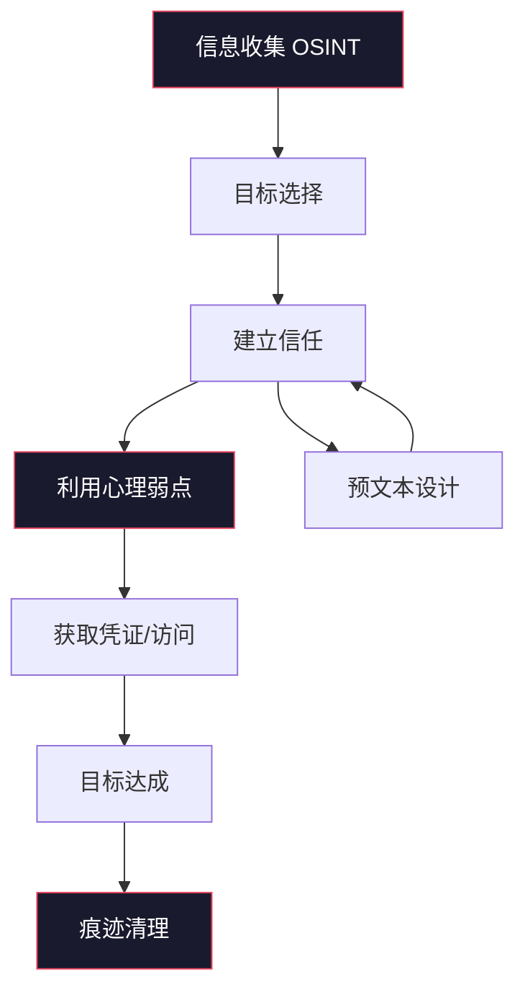
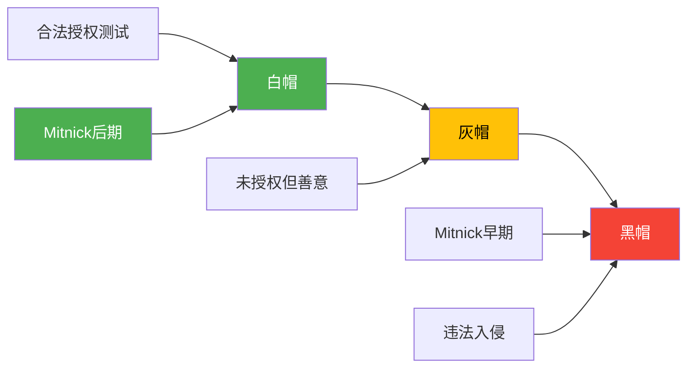

## 3.1 Kevin Mitnick：从通缉犯到安全顾问

Kevin David Mitnick（1963年8月6日—2023年7月16日）是计算机安全史上最富传奇色彩的人物之一。他是第一个被FBI以"头号电脑通缉犯"（Most Wanted）身份通缉的黑客，他的追捕过程被写成畅销书和拍成电影，他的名字几乎成为"黑客"的同义词。但更重要的是，他的一生完整呈现了黑客文化中最具争议性的命题：**技术天才如何跨越法律边界，又如何在高墙之内找到新的方向**。

本节将完整梳理Mitnick的生平、技术手法、法律经历和转型历程，从中提炼出对安全从业者真正有价值的教训。

---

### 3.1.1 早年生活：电话飞客的诞生

#### 家庭背景与性格形成

Kevin Mitnick出生于洛杉矶Van Nuys的一个犹太家庭。父母在他三岁时离异，母亲Shelly Jaffe独自将他抚养长大。Mitnick从小就展现出强烈的求知欲和对规则的挑战精神——他后来在自传《Ghost in the Wires》中回忆，童年时他最大的乐趣就是找到规则中的漏洞。

这种性格特质在黑客文化中被高度认同。Eric S. Raymond在《How to Become a Hacker》中描述的黑客核心特质——**对系统边界的好奇心**和**对权威的质疑态度**——在少年Mitnick身上体现得淋漓尽致。

#### 电话飞客启蒙（1970年代末）

Mitnick的黑客生涯始于电话飞客（Phone Phreaking）。1970年代末，15岁的他通过洛杉矶的电话飞客圈子接触到了操纵电话系统的技术。

电话飞客的核心原理是：电话交换系统使用带内信令（In-Band Signaling），即控制信号和语音信号走同一条线路。通过精确播放特定频率的音频，可以欺骗交换机执行操作：

| 频率组合 | 功能 | 发现者 |
|----------|------|--------|
| 2600 Hz | 重置线路，进入运营商模式 | John Draper（Captain Crunch） |
| 700 Hz + 900 Hz 脉冲 | AT&T MF信令，路由长途呼叫 | Joe Engressia |
| 2600 Hz + 2400 Hz | 特殊服务激活 | 各种Phreaker社区 |

Mitnick通过电话飞客社区学到的不仅是技术，更重要的是**社会工程学的雏形**。要获取电话系统的内部信息，他必须学会伪装身份、建立信任、引导对话——这些技能后来成为他最强大的攻击武器。

#### 初始入侵：太平洋贝尔

Mitnick最早的重大入侵目标是太平洋贝尔（Pacific Bell）的内部计算机系统。他通过社会工程学获取了该公司内部手册和系统操作流程，这让他能够：

- 了解电话公司的组织架构和工作流程
- 获取内部系统的登录凭证
- 追踪对他进行调查的安全人员

这次经历让Mitnick深刻认识到一个关键事实：**人是最容易被攻破的系统组件**。技术再强大，如果操作人员可以被欺骗，整个安全体系就会崩溃。

---

### 3.1.2 黑客生涯：从探索到失控

#### 第一次入狱（1988年）

1988年，Mitnick因入侵数字设备公司（DEC）的计算机系统被捕。他成功复制了DEC的VMS（Virtual Memory System）操作系统的源代码——这在当时是运行在大量关键基础设施上的主流操作系统。

**入侵技术细节**：

Mitnick的DEC入侵并非单纯的技术突破，而是社会工程学与技术能力的结合：

1. **信息收集阶段**：通过电话社交获取DEC员工的姓名、职位、项目信息
2. **建立信任**：冒充DEC内部IT支持人员，联系目标系统的管理员
3. **获取凭证**：通过预文本（Pretexting）骗取管理员的用户名和密码
4. **系统渗透**：使用获取的凭证远程访问DEC的内部网络
5. **数据窃取**：下载VMS操作系统源代码

这次入侵导致DEC估算损失约16万美元（1988年币值）。Mitnick被判处12个月联邦监狱和3年监督释放（Supervised Release）。

> **关键细节**：在当时的法律框架下，计算机犯罪的量刑标准远不如今天严格。12个月的刑期在今天看来几乎不可思议——同样的行为在现行《计算机欺诈和滥用法案》（CFAA）下可能面临10年以上监禁。

#### 假释期间的技术活动

出狱后，Mitnick被置于严格的监督释放条件下，其中包括**禁止使用计算机**的条款。然而，对于一个从小就被技术吸引的人来说，这种禁令几乎是不可能遵守的。

在此期间，Mitnick继续进行入侵活动，但他的目标变得更加广泛：

- **Motorola**：获取手机源代码
- **Nokia**：获取手机固件设计
- **Sun Microsystems**：获取Solaris操作系统源代码
- **Fujitsu**：获取商业机密
- **多家大学**：获取研究数据

#### 成为FBI头号通缉犯（1992-1995年）

1992年，当联邦调查局开始追踪Mitnick时，他做出了一个改变命运的决定：**逃亡**。

接下来的两年半时间里，Mitnick成为了美国历史上最著名的电脑犯罪逃犯。他的逃亡策略展现了一个顶级黑客的全面能力：

**反追踪技术**：

- **克隆手机**：Mitnick大量使用克隆手机（Cloned Cell Phones）来隐藏自己的真实身份和位置。他通过入侵手机运营商的系统获取ESN（电子序列号）和MIN（移动识别码），然后将这些信息写入空白手机芯片，制造出在运营商系统中看起来完全合法的"影子"手机。
- **IP跳转**：使用多层代理和被入侵的系统作为跳板，使追踪者难以定位真实的网络接入点。
- **身份伪造**：使用虚假身份文件、借记卡和租赁记录来建立新的生活痕迹。

**社会工程学反侦察**：

Mitnick不仅使用技术手段逃避追踪，还利用社会工程学反过来监控追踪者：

- 他入侵了太平洋贝尔的系统，可以查看哪些线路被用于监控
- 他冒充FBI特工和电话公司技术人员，获取调查进展的信息
- 他甚至曾经监听过Tsutomu Shimomura的电话

#### Shimomura的追捕（1995年）

Tsutomu Shimomura是一位在圣迭戈超级计算机中心（San Diego Supercomputer Center）工作的物理学家和安全研究员。当Mitnick入侵了他的个人系统后，Shimomura将追踪Mitnick视为个人使命。

**追捕过程的关键技术细节**：

1. **入侵检测**：Shimomura首先发现自己系统中的异常——有人通过TCP/IP协议栈的已知漏洞（利用IP源路由欺骗）入侵了他的工作站
2. **流量分析**：Shimomura和同事Mark Lotter使用无线电方向定位技术（Direction Finding）追踪克隆手机的信号
3. **协作追捕**：与FBI合作，在全美范围内展开搜捕
4. **最终定位**：1995年2月15日，通过太平洋贝尔的交换机记录和无线电信号定位，FBI在北卡罗来纳州Raleigh市的一间公寓中找到了Mitnick

**被捕时的细节**：

当FBI特工破门而入时，Mitnick正在使用一台笔记本电脑。公寓里堆满了电子设备：多部手机、笔记本电脑、软盘、以及大量手写的笔记和密码记录。

Shimomura后来与《纽约时报》记者John Markoff合著了《Takedown: The Pursuit and Capture of Kevin Mitnick, America's Most Wanted Computer Outlaw》一书，详细记录了追捕过程。这本书后来被改编为同名电影。

---

### 3.1.3 法律审判与争议

#### 起诉与量刑

Mitnick面临25项联邦罪名指控，包括：

- 计算机欺诈（Computer Fraud）
- 非法使用访问设备（Illegal Use of Access Devices）
- 非法入侵联邦计算机系统（Unauthorized Access to Federal Computers）
- 损坏计算机系统（Causing Damage to Computers）

检察官声称Mitnick造成的损失高达2.91亿美元——这个数字后来被广泛质疑，被认为严重夸大了实际损害。

**认罪协议**：1999年3月，Mitnick与检方达成认罪协议，承认其中5项罪名。他被判处46个月联邦监狱（已服刑期计入），外加额外3年的监督释放期。

#### 争议性的释放条件

2000年1月21日，Mitnick出狱时面临的条件在当时引起了巨大争议：

| 限制条件 | 具体内容 | 时间期限 |
|----------|----------|----------|
| 禁止使用计算机 | 不得接触任何计算机设备（不包括打字机） | 至2003年1月 |
| 禁止使用手机 | 不得使用任何移动通信设备 | 至2003年1月 |
| 就业限制 | 不得从事任何与计算机相关的工作 | 监督释放期间 |
| 禁止盈利 | 不得从其犯罪经历中获利 | 法律存续期间 |

> **争议焦点**：在21世纪初，"不得使用计算机"的禁令几乎等同于将一个人从社会中完全隔离。许多法律专家和民权活动家认为这种条件过于严苛，违反了比例原则。

#### 案件的法律影响

Mitnick的案件推动了美国计算机犯罪法律的多项改革：

1. **CFAA的修订**：《计算机欺诈和滥用法案》在此后经历了多次修订，量刑标准显著提高
2. **损失计算标准**：司法部开始重新审视计算机犯罪中"损失"的计算方法
3. **监督释放条件**：联邦法院开始更加审慎地设计与技术相关的监督条件

---

### 3.1.4 社会工程学：Mitnick的核心武器

#### 社会工程学的定义与原理

社会工程学（Social Engineering）是一种通过心理操纵来获取机密信息或执行特定操作的攻击技术。Mitnick将其称为"欺骗的艺术"（The Art of Deception），并将其提升到了系统化的高度。

社会工程学攻击的有效性建立在以下心理学原理之上：

| 心理学原理 | 攻击中的应用 | Mitnick的典型手法 |
|------------|--------------|-------------------|
| **权威服从** | 冒充上级或权威机构 | 伪装成FBI特工或公司高管 |
| **互惠原则** | 先提供"帮助"再索取信息 | 假装解决IT问题后索要凭证 |
| **社会认同** | 利用群体压力 | "其他部门都已经更新了密码" |
| **稀缺性** | 制造紧迫感 | "系统将在30分钟后锁定" |
| **一致性** | 利用已建立的行为模式 | "就像你上次给技术支持那样" |
| **喜好** | 建立个人关系 | 花数周时间与目标建立信任 |

#### Mitnick的经典社会工程学攻击链

**案例一：Motorola源代码窃取（1992年）**

这是Mitnick最著名、技术细节最完整的社会工程学案例：

**第一阶段：信息收集（OSINT）**

```text
目标：获取Motorola手机部门的源代码
时间线：数周的信息收集

收集的信息：
├── 组织架构：手机部门的团队结构、关键人员
├── 技术栈：使用的操作系统、开发工具、代码仓库
├── 流程规范：IT支持流程、密码重置流程
└── 人际关系：谁认识谁、谁信任谁
```

Mitnick通过以下方式收集信息：
- 浏览Motorola的公开网站和招聘信息，了解技术栈和团队结构
- 拨打Motorola总机，以记者或供应商身份获取部门联系方式
- 参加行业会议，收集名片和技术讨论信息

**第二阶段：建立信任**

Mitnick冒充Motorola的IT支持人员，联系手机部门的工程师。他的对话脚本经过精心设计：

> "你好，我是IT部门的Mike。我们正在进行系统升级，需要验证一下你的账户信息。你用的是哪个开发服务器？你的用户名是什么？"

这种攻击利用了几个关键心理因素：
- **权威**：IT部门在技术问题上具有天然的权威性
- **紧迫感**："系统升级"暗示时间紧迫
- **互惠**：假装提供帮助（"升级"是为了更好的服务）

**第三阶段：获取访问**

通过多轮社会工程学攻击，Mitnick逐步获取了：
- 开发服务器的访问凭证
- 内部VPN的连接信息
- 源代码管理系统的读取权限

**第四阶段：数据窃取**

使用获取的凭证，Mitnick通过网络连接下载了Motorola的手机源代码。

> **教训**：Motorola拥有完善的技术安全措施——防火墙、加密、访问控制。但这些措施在社会工程学面前形同虚设，因为攻击者绕过了所有技术防线，直接针对最脆弱的组件：人。

**案例二：Nokia手机固件窃取**

Mitnick使用类似的策略入侵了Nokia，获取了手机固件的设计文档。他的方法略有不同：

1. 冒充Nokia芬兰总部的IT人员，联系美国分公司的工程师
2. 利用跨国公司的沟通壁垒——美国员工很难验证来自"总部"的请求
3. 使用伪造的电子邮件和内部文档增强可信度

**案例三：PacBell追踪反制**

当FBI开始追踪Mitnick时，他反向入侵了太平洋贝尔的系统：

- 获取了用于监控他的电话线路信息
- 了解了FBI的调查进展
- 甚至能够反向追踪追踪者的位置

这种"反追踪"能力展示了顶级黑客的全面性：不仅要会攻，还要会守。

#### Mitnick的社会工程学框架

Mitnick在其著作中总结了一套完整的社会工程学攻击框架：



每个阶段都有详细的操作规范和变体策略，这些内容在《The Art of Deception》中有系统性的阐述。

---

### 3.1.5 转型：从通缉犯到安全顾问

#### 出狱后的艰难过渡

Mitnick出狱时面临的挑战是前所未有的。在一个已经高度数字化的世界里，他被禁止使用计算机——这意味着他不能：

- 使用电子邮件
- 浏览互联网
- 使用手机
- 从事任何与计算机相关的工作

他最初的谋生方式是参加各种会议和演讲，分享他的黑客经历。讽刺的是，正是他作为通缉犯的"恶名"，成为了他转型的资本。

#### Mitnick Security Consulting的成立

2003年，当限制条件放松后，Mitnick创办了Mitnick Security Consulting，专注于：

1. **渗透测试（Penetration Testing）**：在企业授权下模拟黑客攻击，测试安全防御
2. **安全审计（Security Audit）**：评估组织的整体安全状况
3. **社会工程学测试**：通过模拟社会工程学攻击来评估员工的安全意识
4. **安全培训**：为企业员工提供安全意识培训

**客户名单**：Mitnick Security Consulting的客户包括数十家财富500强企业和政府机构。Mitnick的"前科"反而成为了最好的广告——如果曾经的头号通缉犯都无法攻破你的系统，那你确实足够安全。

#### 著作与思想传播

Mitnick出版了多本畅销书，每本都从不同角度阐述了他的安全理念：

| 书名 | 出版年份 | 核心内容 | 影响力 |
|------|----------|----------|--------|
| 《The Art of Deception》（欺骗的艺术） | 2002 | 社会工程学的系统化阐述 | 安全培训标准教材 |
| 《The Art of Intrusion》（入侵的艺术） | 2005 | 多个真实黑客案例深度分析 | 黑客文化经典 |
| 《The Art of Invisibility》（隐身术） | 2017 | 个人隐私保护实用指南 | 普通读者安全指南 |
| 《Ghost in the Wires》（电线中的幽灵） | 2011 | Mitnick自传，最完整的人生记录 | 黑客文化历史文献 |

**《The Art of Deception》的核心观点**：

这本书不仅仅是Mitnick的攻击案例集，更是一部社会工程学的系统性论著。核心观点包括：

1. **安全链的最薄弱环节是人**：无论技术防护多么强大，如果员工可以被欺骗，整个系统就会崩溃
2. **安全意识培训比技术投入更重要**：企业每年花费数百万美元购买安全设备，却忽视了对员工的基本培训
3. **社会工程学攻击是最难防御的**：因为它利用的是人性弱点，而不是技术漏洞
4. **防御需要系统化方法**：建立安全策略、培训计划和响应流程

#### 晚年活动与遗产

在生命的最后十年，Mitnick继续活跃在安全社区中：

- 在全球安全会议上发表主题演讲
- 通过社交媒体（拥有大量粉丝）普及安全知识
- 为多家安全公司提供顾问服务
- 参与纪录片和媒体采访，讲述他的故事

2023年7月16日，Kevin Mitnick因胰腺癌去世，享年59岁。他的去世在全球安全社区引起了广泛哀悼——无论人们如何评价他的过去，都无法否认他对安全行业的深远影响。

---

### 3.1.6 深度分析：Mitnick的技术能力

#### 被高估还是被低估？

对Mitnick技术能力的评价存在两种截然不同的观点：

**被高估派**：
- Mitnick的主要能力是社会工程学，而非纯技术
- 他使用的技术手段大多是已知漏洞，并非原创发现
- 媒体的夸大报道（如"入侵NORAD"）与事实不符
- 他的"2.91亿美元损失"被严重夸大

**被低估派**：
- Mitnick展示了技术与社会工程学结合的全新攻击范式
- 他的反追踪能力在当时是顶级水平
- 他能够在多个高度安全的系统之间长期活动而不被发现
- 他的入侵方法论对后来的渗透测试产生了深远影响

**客观评价**：

Mitnick的真实技术水平可能在中等偏上，但他的**综合能力**——技术+社会工程学+反追踪+心理素质——在当时确实是顶级的。他的核心贡献不在于发现了某个惊天漏洞，而在于：

1. **展示了社会工程学的系统化方法**
2. **证明了人在安全链中的关键作用**
3. **推动了企业安全意识培训的发展**
4. **促进了计算机犯罪法律的完善**

#### 技术贡献的客观评估

| 能力维度 | 评分 | 说明 |
|----------|------|------|
| 系统渗透 | ★★★★☆ | 善于利用已知漏洞和社会工程学获取访问 |
| 社会工程学 | ★★★★★ | 该领域公认的顶级专家 |
| 反追踪/隐匿 | ★★★★★ | 两年半逃亡期间展现的反追踪能力堪称传奇 |
| 漏洞研究 | ★★★☆☆ | 更多是利用已知漏洞而非发现新漏洞 |
| 代码能力 | ★★★☆☆ | 能够理解和修改代码，但不是顶级程序员 |
| 安全咨询 | ★★★★★ | 出狱后的咨询工作证明了他的专业价值 |

---

### 3.1.7 Mitnick与黑客文化的深层联系

#### 黑客伦理的冲突与融合

Mitnick的故事完美体现了黑客文化中**信息自由**与**法律边界**之间的张力：

**传统黑客伦理**（Steven Levy的《Hackers》定义）：
- 所有信息都应该免费
- 对权威的不信任
- 用黑客能力评判一个人的价值

**法律现实**：
- 计算机系统的所有者有权控制对其系统的访问
- 未经授权的访问是犯罪行为
- 财产损失和隐私侵犯需要法律保护

Mitnick的一生就是在这两种力量之间挣扎的过程。他的早期行为遵循的是传统的黑客伦理——探索系统、获取知识、挑战权威。但当他越过了法律的红线，现实世界的后果也随之而来。

#### 从Mitnick看黑客的道德光谱

Mitnick的经历为我们理解黑客的道德光谱提供了鲜活的案例：



Mitnick的人生轨迹是一个从黑帽到白帽的完整转型——这在黑客历史上并非孤例，但他的案例最具戏剧性和教育意义。

---

### 3.1.8 对当代安全从业者的启示

#### 从Mitnick案例中提炼的安全原则

**原则一：技术防线不是万能的**

Mitnick的入侵几乎都是通过社会工程学绕过了技术防线。这告诉我们：

- 再强大的防火墙也无法阻止员工主动泄露密码
- 安全审计必须包括人员行为评估
- 技术安全和人员安全需要同等重视

**原则二：安全培训的ROI是最高的**

《The Art of Deception》出版后，全球企业开始重视安全意识培训。数据表明：

- 员工安全意识培训的投资回报率（ROI）通常在5:1到10:1之间
- 经过培训的员工识别社会工程学攻击的能力提高60%以上
- 安全事件的发生率在培训后通常下降40%以上

**原则三：安全策略需要"假设已被入侵"**

Mitnick能够在系统中长期活动而不被发现，说明当时的监控和检测能力不足。现代安全策略应该：

- 实施零信任架构（Zero Trust Architecture）
- 部署行为分析和异常检测
- 建立安全事件响应团队（CSIRT）

**原则四：法律边界不可逾越**

Mitnick的故事最深刻的教训是：**技术能力不能成为违法行为的借口**。

今天的安全行业为技术人员提供了合法的渠道：
- **漏洞赏金计划**（Bug Bounty）：通过合法发现漏洞获取报酬
- **渗透测试**：在授权下模拟攻击
- **安全研究**：在负责任的披露框架下研究漏洞
- **CTF竞赛**：在法律允许的范围内磨练技能

#### Mitnick Security Consulting的工作方法

Mitnick在咨询工作中总结了一套系统化的安全评估方法：

1. **外部侦察**：模拟攻击者的信息收集阶段
2. **社会工程学测试**：通过电话、邮件、现场访问测试员工
3. **技术渗透**：在授权范围内测试技术防线
4. **物理安全**：评估办公场所的物理安全措施
5. **报告与培训**：提供详细的评估报告和改进建议

---

### 3.1.9 文化影响与流行文化中的Mitnick

#### 书籍与影视作品

Mitnick的追捕过程催生了大量的文化产品：

| 作品 | 类型 | 作者/导演 | 视角 |
|------|------|-----------|------|
| 《Takedown》 | 书籍 | Shimomura & Markoff | 追捕者视角 |
| 《The Fugitive Game》 | 书籍 | Jonathan Littman | Mitnick视角 |
| 《Takedown》（电影） | 电影 | 1999年 | 追捕者视角 |
| 《Track Down》 | 纪录片 | 2000年 | 综合视角 |
| 《Ghost in the Wires》 | 自传 | Kevin Mitnick | Mitnick本人视角 |

这些作品之间的叙事冲突本身就是一个有趣的案例研究——同一事件在不同视角下呈现出截然不同的面貌。

#### "Mitnick神话"的解构

在大众文化中，Mitnick经常被神话化：
- "他入侵了NORAD"——实际上这一说法缺乏可靠证据
- "他造成了2.91亿美元损失"——这个数字被广泛质疑
- "他可以仅凭口哨启动核导弹"——这是对电话飞客技术的严重夸张

这些神话反映了公众对黑客的恐惧和浪漫化想象。作为安全从业者，我们需要基于事实而非神话来理解Mitnick——他的真实故事已经足够精彩，不需要额外的戏剧化加工。

---

### 3.1.10 总结：Mitnick留下的遗产

Kevin Mitnick的一生为网络安全行业留下了多重遗产：

**技术层面**：
- 社会工程学的系统化方法论
- 技术与心理结合的攻击范式
- 反追踪技术的实战案例

**法律层面**：
- 推动了计算机犯罪法律的完善
- 引发了对"损失计算"标准的讨论
- 促进了对技术相关监督条件的反思

**文化层面**：
- 成为黑客文化的标志性人物
- 推动了安全意识培训的普及
- 展示了从黑帽到白帽转型的可能性

**教育层面**：
- 他的著作成为安全培训的标准教材
- 他的案例被广泛用于安全教育
- 他的故事提醒着每个技术人员：能力越大，责任越大

> **最后的思考**：Mitnick的故事告诉我们，黑客的真正价值不在于入侵系统，而在于保护系统。他的前半生证明了最强大的攻击来自对人性的理解，他的后半生证明了这种理解同样可以用于防御。这或许是Kevin Mitnick留给安全行业最重要的遗产。

---

> **延伸阅读**
>
> - Kevin Mitnick,《Ghost in the Wires: My Adventures as the World's Most Wanted Hacker》(2011)——最权威的一手资料
> - Kevin Mitnick,《The Art of Deception: Controlling the Human Element of Security》(2002)——社会工程学经典
> - Tsutomu Shimomura & John Markoff,《Takedown: The Pursuit and Capture of Kevin Mitnick》(1996)——追捕者视角
> - Jonathan Littman,《The Fugitive Game: Online with Kevin Mitnick》(1996)——独立记者的调查视角
> - Steven Levy,《Hackers: Heroes of the Computer Revolution》(1984)——理解黑客文化的历史背景
> - 第23章 社会工程学——本书对社会工程学的系统性阐述，与本案例形成呼应
