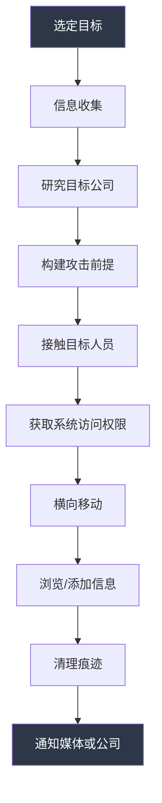

## 3.2 Adrian Lamo：无家可归的天才黑客

> "我有很强的道德感。我只是不总是遵守它。" —— Adrian Lamo

Adrian Lamo（1981—2018）是信息安全史上最矛盾、最令人不安的人物之一。他是黑客圈公认的天才——用一台公共图书馆的电脑就能入侵《纽约时报》和微软的系统；他也是黑客圈最痛恨的叛徒——向军方告发了向 WikiLeaks 泄露数十万份机密文件的 Chelsea Manning。他的一生是一部关于技术天才、道德困境、精神疾病和制度暴力的悲剧史诗。

---

### 3.2.1 早年生活：一个天才的诞生

#### 家庭背景与童年

Adrian Alan Lamo 于 1981 年 2 月 20 日出生在马萨诸塞州波士顿（部分资料记载为马尔登市）。他的父亲 Mario Lamo-Jimenez 是一位哥伦比亚裔移民，职业为作家和记者；母亲 Mary Lamo 是美国人。这种跨文化家庭背景赋予了 Adrian 一种局外人的视角——他既不完全属于拉丁裔社区，也不完全融入主流白人社会。

童年时期，全家迁至旧金山湾区。Adrian 从小展现出超常的智力和异常强烈的好奇心，但同时伴随严重的社交困难。他很难与同龄人建立关系，经常独来独往。他后来被诊断为阿斯伯格综合征（Asperger's Syndrome，属于自闭症谱系障碍），这解释了他在社交互动和理解社会暗示方面的长期困难。

#### 教育经历

Adrian 在旧金山湾区多所学校就读，智力上远超同龄人，但对学校体制的社交和行政规则感到极度不适。大约 16 岁（1997 年前后）时，他从高中辍学。后来他通过了 GED（普通教育发展考试，相当于高中同等学力认证），并短暂就读过社区大学，但未完成学位。

尽管缺乏正规高等教育，Adrian 是一位极其出色的自学者。他大量阅读计算机科学、网络协议和信息安全领域的技术文献，在知识深度上丝毫不逊于科班出身的专业人士。他完全靠自学掌握了网络渗透的技术和方法论。

#### 塑造他的因素

以下因素共同塑造了 Adrian Lamo 这个独一无二的人物：

| 因素 | 影响 |
|------|------|
| 阿斯伯格综合征 | 使他极度专注、偏好独处、社交困难，但赋予他异常的分析能力 |
| 哥伦比亚裔移民家庭 | 让他始终是一个"局外人"，对体制缺乏天然的信任 |
| 旧金山湾区 90 年代科技热潮 | 为他提供了接触黑客文化的沃土 |
| 高中辍学 | 摆脱了体制约束，走上了完全自学的道路 |
| 无家可归的生活方式 | 既是他的选择，也是他的困境，塑造了他的操作方式 |

---

### 3.2.2 黑客方法论：咖啡店里的战争

Lamo 的黑客方法论在业界独树一帜。他不编写恶意代码，不开发零日漏洞，也不坐在自己的房间里远程攻击目标。他的核心理念可以用一句话概括：**最脆弱的环节永远是人**。

#### 核心方法：公共终端策略

Lamo 的标志性特征是他只使用公共互联网接入点进行入侵活动，这也是他获得"无家可归的黑客"绰号的原因：

**主要入侵地点：**
- **Kinko's（现 FedEx Office）复印中心** —— 他的首选场所，营业时间长、电脑性能尚可、付费使用不需身份验证
- **公共图书馆** —— 免费网络接入，人流密集，难以追踪
- **咖啡店和咖啡馆** —— 提供免费 Wi-Fi，来去自如
- **大学计算机实验室** —— 网络速度快，许多终端无需登录
- **网吧** —— 付费使用，匿名性高
- **书店电脑（如 Barnes & Noble）** —— 可以使用店内电脑而不引起注意

**操作规则：**
1. 绝不连续在同一地点工作两次
2. 每次使用终端时间控制在 15-45 分钟内
3. 使用现金支付所有费用，不留信用卡记录
4. 不使用预付费卡或借用账户（这本身也会留下痕迹）
5. 离开前清除所有活动痕迹

#### 社会工程学

Lamo 是一位社会工程学大师。他的攻击流程通常如下：

他的社会工程学技巧包括：
- **电话欺诈**：致电目标公司的帮助台或 IT 部门，冒充员工或承包商，利用事先研究好的内部术语和人名建立可信度
- **公开信息利用**：通过公司通讯录、新闻稿、组织架构图等公开信息构建精确的攻击前提
- **深度研究**：在发起入侵前，花大量时间了解目标公司的内部结构、员工姓名、业务流程
- **角色扮演**：根据场景需要扮演不同的角色——技术支持人员、新入职员工、外部顾问

一个有趣的悖论是：Lamo 在日常社交中极度焦虑，但在策略性的社会工程学场景中却能表现得异常自信和有说服力。阿斯伯格综合征让他难以理解自然的社交暗示，但这种"缺陷"在需要精确执行脚本化的社交攻击时反而成了一种优势。

#### 无线网络攻击（War-Driving）

Lamo 还实践了 war-driving（无线网络驾车搜索）——开车或步行穿越商业区和住宅区，用装有无线网卡的笔记本电脑搜索未加密或加密薄弱的 Wi-Fi 网络。

在 2000 年代初期，Wi-Fi 安全（WEP/WPA）配置普遍糟糕，大量家庭和小型企业的无线网络处于完全开放状态。通过连接这些陌生人的网络，Lamo 为自己的入侵活动增加了一层额外的匿名保护。

#### 技术手段

虽然社会工程学是他的主要武器，Lamo 也具备扎实的技术能力：

- **Web 应用漏洞利用**：SQL 注入、跨站脚本（XSS）、目录遍历
- **配置错误利用**：默认密码、未修改的出厂设置、错误配置的服务器
- **代理服务器**：使用开放代理服务器路由流量，隐藏真实来源
- **内网穿透**：利用暴露在公网上的企业内网入口
- **VPN/远程访问**：利用配置错误的 VPN 和远程访问系统

#### 运营安全（OpSec）

Lamo 对运营安全的重视近乎偏执：

- 绝不使用自己的家庭网络进行黑客活动
- 不断更换位置，避免留下可追踪的数字足迹
- 使用多层代理和匿名化工具
- 不保留活动记录
- 无固定地址、无持续使用的电话号码、无固定工作——这种游牧式生活方式让他天然难以被追踪

---

### 3.2.3 入侵事件全录（1999—2003）

大约从 1999 年到 2003 年，Lamo 先后入侵了多家世界知名企业和组织。以下按时间顺序详细记录。

#### Yahoo!（约 2000—2001 年）

Lamo 利用 Yahoo! 网络服务中的漏洞获得了对其内部系统的未授权访问。当时 Yahoo! 是全球最大的互联网门户之一，这次入侵证明了即使是互联网巨头也存在严重的安全缺陷。Lamo 据报访问了内部系统和用户数据，但未窃取或破坏任何信息。

#### America Online / AOL（约 2000—2001 年）

AOL 在当时是美国占主导地位的互联网服务提供商，拥有数千万订户。Lamo 利用 AOL 网络基础设施中的漏洞入侵了其系统。对于一个拥有如此庞大用户基础的消费级互联网服务来说，这次入侵暴露了其安全体系的重大缺陷。

#### Excite@Home（约 2001 年）

Excite@Home 是 90 年代末和 21 世纪初的一家主要宽带互联网服务提供商和网络门户。Lamo 在该公司已陷入财务困境（2001 年 9 月申请破产）期间入侵了其系统，访问了用户数据和内部系统。这次入侵证明了企业动荡时期安全防线往往最为脆弱。

#### Microsoft（约 2001—2002 年）

入侵微软系统是 Lamo 最高调的成就之一。微软当时正在推进"可信赖计算"（Trustworthy Computing）计划，Lamo 的入侵让这家全球最大软件公司颜面扫地。他利用了 Web 应用漏洞，成功访问了微软的内部系统。这次入侵证明了一个残酷的事实：即使是资源最雄厚的科技公司，也无法完全杜绝安全漏洞。

#### MCI WorldCom（约 2001—2002 年）

MCI WorldCom（后更名为 WorldCom）是美国主要电信公司之一。Lamo 入侵了其内部网络，据报访问了计费系统和内部通信。这次入侵具有特殊意义：WorldCom 当时已深陷美国历史上最大的公司财务欺诈丑闻（其会计造假于 2002 年 6 月曝光）。Lamo 的入侵暴露了关键通信基础设施的安全脆弱性。

#### 纽约时报（2002 年 2 月—8 月）

这是 Lamo 最著名、影响最深远的一次入侵，值得详细记述。

**入侵过程：**

1. **发现入口**：Lamo 发现《纽约时报》内部网络中集成了 LexisNexis 数据库接口，该接口因配置错误而可从公网直接访问
2. **绕过认证**：他利用访问控制机制中的弱点，无需有效凭证即可进入 LexisNexis 门户
3. **横向渗透**：从 LexisNexis 接口作为跳板，进一步深入《纽约时报》的内部系统
4. **系统浏览**：他访问了以下系统：

| 系统 | 内容 | 敏感程度 |
|------|------|----------|
| LexisNexis 数据库 | 新闻检索和研究资料 | 中 |
| 专家来源数据库（Op-Ed Contributor Database） | 外部专家和线人的姓名、联系方式、专业领域、可靠性评估、使用该来源的专栏作家信息 | 极高 |
| 员工信息 | 《纽约时报》雇员相关数据 | 高 |
| 新闻监控工具 | 内部新闻监测系统 | 中 |

5. **关键行为**：Lamo 做了一个既大胆又致命的举动——他**将自己的名字添加到了专家来源数据库中**，将自己的真实姓名和联系方式录入为"计算机安全专家"。这个行为后来成为他被追查的关键线索。
6. **未造成破坏**：除添加自己的信息外，他未删除、修改或泄露任何数据

**发现与调查：**

《纽约时报》在安全审计中检测到异常活动，发现了对专家来源数据库的未授权访问。Lamo 留下的自我登记信息是明显的破绽。报社随即报告了 FBI，调查人员通过 IP 日志和行为模式分析，最终锁定了 Lamo。

**历史意义：**

这次入侵具有多重意义：
- 证明了大型新闻机构的网络安全同样不堪一击
- 专家来源数据库是新闻行业的核心资源，其泄露引发了新闻自由方面的担忧
- 成为美国早期计算机入侵司法判例中的标志性案件
- 为 Lamo 带来了全国性的媒体关注

**媒体报道的讽刺：**

2002 年 9 月，《纽约时报》记者 Amy Harmon 在《纽约时报杂志》发表了一篇关于 Lamo 的人物特写，标题为"The Vulnerability Expert"（《漏洞专家》）。被他入侵的报纸反过来为他做了一次长篇报道——这种荒诞的反转本身就是黑客文化的缩影。这篇文章将 Lamo 推向全国舞台，确立了他"无家可归的黑客"的公众形象。

---

### 3.2.4 法律案件：审判与量刑

#### FBI 调查

2002 年中期，FBI 对《纽约时报》入侵事件展开调查，随后扩展到 Lamo 的其他入侵行为（Yahoo!、AOL、微软、Excite@Home、MCI WorldCom）。尽管 Lamo 使用公共终端并采取了严格的运营安全措施，调查人员还是通过以下方法锁定了他：

- **数字取证**：分析入侵会话的 IP 地址和时间戳
- **行为模式分析**：Lamo 的入侵方式具有高度一致性——公共终端、类似的目标选择策略、相似的入侵手法
- **地理关联**：将入侵活动的地理位置与 Lamo 的已知活动范围进行匹配
- **自我登记线索**：《纽约时报》专家来源数据库中"Adrian Lamo"这条记录是最直接的证据

#### 逮捕与起诉

2003 年 9 月 8 日前后，联邦逮捕令签发。由于 Lamo 居无定所，最初难以找到他。他最终向当局自首（部分报道称他在加利福尼亚州萨克拉门托地区被逮捕）。

他被指控一项计算机欺诈罪，依据是《计算机欺诈和滥用法案》（Computer Fraud and Abuse Act，CFAA，18 U.S.C. § 1030），具体涉及《纽约时报》入侵事件。其他入侵行为在量刑时被考虑，但未单独起诉。

#### 认罪与量刑

2004 年 1 月，Lamo 对一项未授权计算机访问罪（CFAA 下的重罪）认罪。认罪协议包括：认罪、配合调查、同意赔偿受害者。

2004 年 4 月 17 日，加利福尼亚东区联邦地区法院法官 D. Lowell Jensen 宣判：

| 判决内容 | 详情 |
|----------|------|
| 家庭监禁 | 6 个月（在加州卡迈克尔的父母家中执行） |
| 缓刑 | 2 年 |
| 赔偿金 | $65,000（向受害公司支付） |
| 社区服务 | 具体时长因报道而异 |
| 计算机使用限制 | 监禁期间使用电脑须经授权并接受监控 |

量刑相对较轻，原因是：
- Lamo 未为牟利而窃取或破坏数据
- 无犯罪前科
- 配合调查
- 阿斯伯格综合征被法院认定为减轻处罚的因素
- 表达了悔意
- 入侵行为未造成可量化的经济损失（主要损失是调查和修复费用）

#### 定罪的长期影响

重罪记录始终伴随着 Lamo。它严重影响了他的就业前景，加剧了他边缘化的生存状态。尽管如此，他仍以各种身份继续从事信息安全工作。

---

### 3.2.5 Chelsea Manning 事件：一个时代的分裂

这是 Lamo 一生中最重大、最具争议的事件，也是他被黑客社区永久放逐的转折点。

#### 背景：Chelsea Manning

Chelsea Manning（出生时名为 Bradley Edward Manning，1987 年 12 月 17 日出生）是美国陆军情报分析员，2009 年 10 月起部署在巴格达前方作战基地 Hammer。她拥有绝密安全许可，可以访问 SIPRNet（秘密互联网协议路由器网络）和 JWICS（联合全球情报通信系统）中的机密军事和外交数据库。

Manning 当时正经历性别认同危机、极度孤独和情感困扰，同时对在机密材料中看到的内容产生了严重的道德不安。

#### 泄露的规模

2009 年 11 月至 2010 年 5 月间，Manning 下载了数十万份机密文件并泄露给 WikiLeaks：

| 泄露内容 | 发布日期 | 规模 |
|----------|----------|------|
| "附带谋杀"（Collateral Murder）视频 | 2010 年 4 月 5 日 | 美军阿帕奇直升机在巴格达攻击的机密视频，造成包括两名路透社记者在内的多人死亡 |
| 阿富汗战争日记 | 2010 年 7 月 25 日 | 约 75,000 份机密军事文件（2004—2010 年） |
| 伊拉克战争日志 | 2010 年 10 月 22 日 | 约 391,832 份机密战场报告（2004—2009 年） |
| 关塔那摩湾文件 | 2011 年 4 月 25 日 | 在押人员档案 |
| 外交电报（Cablegate） | 2010 年 11 月 28 日起 | 约 251,287 份外交电报，来自全球 274 个美国大使馆和领事馆 |

Manning 在军事法庭上的证词描述了她如何用 Lady Gaga CD 作掩护——假装听音乐，实际上在将数据刻录到光盘上带出机密设施。

#### 对话过程

2010 年 5 月 20 日前后，Manning 通过加密即时通讯工具联系了 Lamo。她通过 Lamo 作为黑客和安全研究人员的公开形象找到了他——Lamo 曾被《连线》杂志等媒体报道为一个有社会良知的黑客。Manning 显然认为 Lamo 会理解和同情她泄露机密文件的决定。

在大约 5 月 20 日至 25 日期间，Manning 和 Lamo 进行了大量消息交流。Manning 详细透露了：

- 泄露给 WikiLeaks 的范围和规模
- 如何从机密系统中提取文件的技术细节
- 与 Julian Assange（代号"pressassociation"）的互动
- 泄露的动机——揭露她所认为的战争罪行和外交欺骗
- 个人困扰，包括性别认同问题

Manning 在对话中的一些原话后来被公开：

> "如果你每天 14 小时、连续 7 个月拥有对机密网络的前所未有访问权，你会怎么做？"

> "上帝知道现在会发生什么。希望是全球性的讨论、辩论和改革……我希望人们看到真相……因为没有信息，公众就无法做出知情的决定。"

> "我是一个有贡献的成员……我有责任确保公众获得信息。"

Manning 在对话中既表现出坚定的信念，也流露出深深的恐惧。她似乎在寻求理解和情感连接。

#### Lamo 的决定

Lamo 就如何处理 Manning 的透露咨询了朋友和同事：

- **Kevin Poulsen**：前黑客转型的记者，当时是《连线》杂志的高级编辑。Poulsen 告诉 Lamo 这件事非常严重，可能涉及国家安全。
- **Timothy Webster**：前陆军反情报人员，Lamo 认识的人。

经过考虑，Lamo 决定向联邦当局报告 Manning。他联系了美国陆军刑事调查司令部（CID）和 FBI，提供了聊天记录和其他 Manning 分享的信息。

Lamo 后来声称他的决定出于以下动机：
- 担心泄露的文件可能危及军事人员、情报来源和外国联系人的生命
- 认为泄露的规模太大、太危险，不能忽视
- 感到有道德义务阻止潜在的伤害

但 Lamo 在不同场合给出的解释前后不一，有时相互矛盾。

#### Manning 的逮捕与审判

2010 年 5 月 27 日，Chelsea Manning 在伊拉克前方作战基地 Hammer 被逮捕。她最初被关押在科威特，后转至弗吉尼亚州匡蒂科的海军陆战队监狱。她在拘留期间的待遇（包括单独监禁和被迫裸体）成为重大争议。

Manning 被指控 22 项罪名，包括"协助敌人"（死刑指控，但检方未寻求死刑）。2013 年 7 月 30 日，Manning 被宣告"协助敌人"罪名不成立，但被判 20 项其他罪名成立，包括 6 项违反《间谍法》、5 项盗窃、1 项计算机欺诈。

2013 年 8 月 21 日，Manning 被判处 35 年监禁。2017 年 1 月，奥巴马总统为其减刑。2017 年 5 月 17 日，Manning 在服刑约 7 年后获释。

#### 对 Lamo 的影响

Lamo 报告 Manning 的决定让他成为黑客和黑客行动主义社区中最受鄙视的人物之一：

- 他收到了**死亡威胁**，遭受了持续的骚扰
- 他被称为"告密者"（snitch）、"线人"（informer）、"叛徒"（traitor）
- **Anonymous** 黑客集体公开谴责他
- **WikiLeaks** 和 Julian Assange 公开抨击他
- 他在黑客会议上的公开露面变成了充满敌意的环境
- 许多曾经尊重他的人彻底与他断绝关系

支持 Lamo 的人认为：
- Manning 的泄露是鲁莽的，危及了生命
- 泄露数十万份机密文件在性质上与针对具体不当行为的举报完全不同
- Lamo 有法律和道德义务报告他所知道的事情

这一事件从根本上分裂了信息安全社区，至今仍是黑客伦理讨论中最激烈的话题之一。

#### 聊天记录争议

Manning 和 Lamo 之间的完整聊天记录从未被完全公开。Kevin Poulsen 和《连线》杂志发布了删节版本，声称删节是为了保护 Manning 的隐私和安全。批评者指控 Poulsen 和《连线》选择性地发布记录以塑造叙事。完整未删节的记录最终由其他渠道发布。围绕聊天记录的争论本身又成为一场关于新闻业、信息源保护和透明度的元争议。

---

### 3.2.6 无家可归的生活：游牧者的困境

#### 阿斯伯格综合征

Lamo 的阿斯伯格综合征在他的法律诉讼期间（约 2004 年）被正式诊断，并被法院认定为减轻处罚的因素。阿斯伯格综合征的特征在他身上表现得非常明显：

- **社交互动困难**：难以理解社交暗示和规范，在自然社交场合中极度焦虑
- **高度专注**：对计算机系统和网络有近乎痴迷的专注
- **重复行为模式**：入侵方式的高度一致性
- **制度排斥**：难以适应权威和体制结构

一个引人注目的悖论是：他在日常社交中极度不自在，但在策略性社会工程学场景中却能表现出色。这种矛盾可以用阿斯伯格综合征来解释——后者是有脚本的、有明确目标的互动，而前者是混乱的、不可预测的。

#### 流浪生活

Lamo 的无家可归既是生活方式的选择，也是他处境的结果。他在被捕前就已经过着流浪生活，在被捕后断断续续地继续着这种生活。他曾睡在：

- 废弃建筑物
- 教堂和收容所
- 朋友家的沙发上
- 公园和公共场所
- 他所关联组织的办公室

他经常挨饿，健康状况持续恶化。他辗转于旧金山、纽约、威奇托（堪萨斯州）等城市之间。

在家庭监禁期间（2004—2005 年），他住在加州卡迈克尔的父母家中，这是他为数不多有稳定住所的时期。缓刑结束后，他恢复了游牧式生活。

---

### 3.2.7 最终岁月与去世

#### 晚年生活

Manning 事件后，Lamo 的生活急剧恶化。他在黑客社区中的声誉已无法修复，持续的骚扰和孤立加剧了他的心理健康问题。他与抑郁症和物质滥用作斗争，社交圈子急剧缩小。

尽管如此，他仍偶尔在安全会议上露面，继续以自由撰稿人的身份写作。他为《连线》新闻和 SecurityFocus 等媒体撰稿，贡献了关于信息安全的分析和评论。

#### 死亡

2018 年 3 月 14 日，Adrian Lamo 被发现在堪萨斯州威奇托的公寓中去世，享年 37 岁。死因为自然原因——尽管考虑到他的年龄，这个结论引发了部分人的质疑。具体死因从未被完全公开。

他的去世在信息安全社区引发了复杂的反应：有人悼念一位天才的陨落，有人仍然无法原谅他在 Manning 事件中的角色，也有人指出这个悲剧凸显了科技社区对心理健康问题的长期忽视。

---

### 3.2.8 哲学与遗产

#### 黑客哲学

Lamo 的黑客哲学可以概括为几个核心信条：

1. **信息应该是自由的**：他认为封闭的系统和信息壁垒是不健康的，黑客有责任揭露这些壁垒
2. **不以牟利为目的**：他从未出售或利用他入侵获取的信息来获利
3. **披露而非破坏**：他入侵后通常会通知媒体或受影响的公司，而非销毁或篡改数据
4. **灰色地带**：他不认为自己是白帽（完全合法的安全研究者）或黑帽（犯罪黑客），而是存在于两者之间的灰色地带

他的名言"我有很强的道德感。我只是不总是遵守它。"精确地捕捉了他内心的矛盾。

#### 道德困境

Lamo 的一生引发了多个至今仍在讨论的道德问题：

**困境一：入侵者的责任**
当黑客发现系统漏洞时，他们是否有义务报告？如果报告，应该向谁报告——公司、媒体还是政府？不报告是否构成同谋？

**困境二：告密者的伦理**
当一个人被信任地告知违法行为时，举报这种信任是否正当？Manning 的泄露是举报战争罪行的勇敢行为，还是危及生命的鲁莽行为？Lamo 的举报是保护国家安全的爱国行为，还是背叛信任的卑鄙行为？

**困境三：精神健康与刑事责任**
阿斯伯格综合征在多大程度上影响了 Lamo 的判断和行为？法律系统在量刑时考虑精神健康因素是否适当？科技社区对精神健康问题的忽视如何导致了这样的悲剧？

**困境四：国家安全与新闻自由**
《纽约时报》专家来源数据库的泄露涉及新闻自由的核心——消息来源的保密性。黑客入侵新闻机构与政府监控新闻机构之间的界限在哪里？

#### 对网络安全法律的影响

Lamo 的案件是 CFAA 早期判例之一，对后续的计算机犯罪司法实践产生了影响：

- **CFAA 的解释**：确立了"未授权访问"的判例解释
- **企业安全实践**：推动了企业更加重视内部网络安全和员工培训
- **内部威胁意识**：强化了对"社会工程学攻击"作为安全威胁的认知
- **CFAA 改革运动**：Lamo 的案件（以及后来的 Aaron Swartz 案等）引发了对 CFAA 过于宽泛和严厉的批评，推动了改革讨论

---

### 3.2.9 关键人物表

| 人物 | 身份 | 与 Lamo 的关系 |
|------|------|----------------|
| Chelsea Manning | 美国陆军情报分析员 | 向 Lamo 透露泄露机密信息，被 Lamo 举报 |
| Kevin Poulsen | 前黑客，《连线》杂志高级编辑 | Lamo 的咨询对象，后发布聊天记录 |
| Julian Assange | WikiLeaks 创始人 | Manning 泄露的目标组织负责人，公开谴责 Lamo |
| Amy Harmon | 《纽约时报》记者 | 撰写了 Lamo 的人物特写"The Vulnerability Expert" |
| Timothy Webster | 前陆军反情报人员 | Lamo 在 Manning 事件中的另一个咨询对象 |
| Mario Lamo-Jimenez | Lamo 的父亲，哥伦比亚裔作家 | 家庭监禁期间的住所提供者 |

---

### 3.2.10 时间线

| 时间 | 事件 |
|------|------|
| 1981 年 2 月 20 日 | Adrian Alan Lamo 出生于马萨诸塞州波士顿 |
| 约 1997 年 | 从高中辍学（约 16 岁），后获得 GED |
| 约 1999—2001 年 | 入侵 Yahoo!、AOL、Excite@Home 等公司 |
| 约 2001—2002 年 | 入侵微软、MCI WorldCom |
| 2002 年 2—8 月 | 入侵《纽约时报》 |
| 2002 年 9 月 | 《纽约时报杂志》发表 Amy Harmon 的人物特写 |
| 2002 年中 | FBI 开始调查 |
| 2003 年 9 月 8 日 | 联邦逮捕令签发，Lamo 最终自首 |
| 2004 年 1 月 | 认罪 |
| 2004 年 4 月 17 日 | 量刑：6 个月家庭监禁、2 年缓刑、$65,000 赔偿 |
| 2005 年 | 家庭监禁和缓刑期满 |
| 2010 年 5 月 20—25 日 | 与 Chelsea Manning 进行加密通信 |
| 2010 年 5 月 27 日 | Manning 在伊拉克被逮捕 |
| 2013 年 7 月 30 日 | Manning 被判 20 项罪名成立 |
| 2013 年 8 月 21 日 | Manning 被判处 35 年监禁 |
| 2017 年 1 月 | 奥巴马总统为 Manning 减刑 |
| 2017 年 5 月 17 | Manning 获释 |
| 2018 年 3 月 14 日 | Adrian Lamo 在堪萨斯州威奇托去世，享年 37 岁 |

---

### 3.2.11 对读者的启示

#### 对安全研究人员

Lamo 的案例展示了"灰色帽"黑客的法律风险。即使不以牟利为目的、不破坏数据，未授权访问仍然构成联邦重罪。安全研究人员必须：

- 始终在授权范围内进行测试
- 了解 CFAA 及相关法律的具体条款
- 建立负责任的漏洞披露流程
- 保存所有研究活动的记录

#### 对信息安全从业者

Lamo 的社会工程学技巧提醒我们：

- 技术防线再强，人的环节永远是最脆弱的
- 帮助台和 IT 支持人员是社会工程学攻击的首要目标
- 定期的安全意识培训至关重要
- 验证身份的流程必须严格且不可绕过

#### 对所有人

Adrian Lamo 的悲剧是一个关于天才、孤独、道德困境和制度失败的故事。他的案例提醒我们：

- 精神健康问题不应被忽视或污名化
- 技术天才不等于道德智慧
- 举报与背叛之间的界限远比我们想象的模糊
- 黑客文化中的忠诚和信任准则与主流法律体系之间存在根本性张力

> Adrian Lamo 用一台图书馆的电脑入侵了世界上最强大的新闻机构，却最终被自己内心的矛盾所击垮。他的故事不仅仅是关于黑客技术的——它是关于人本身的。
