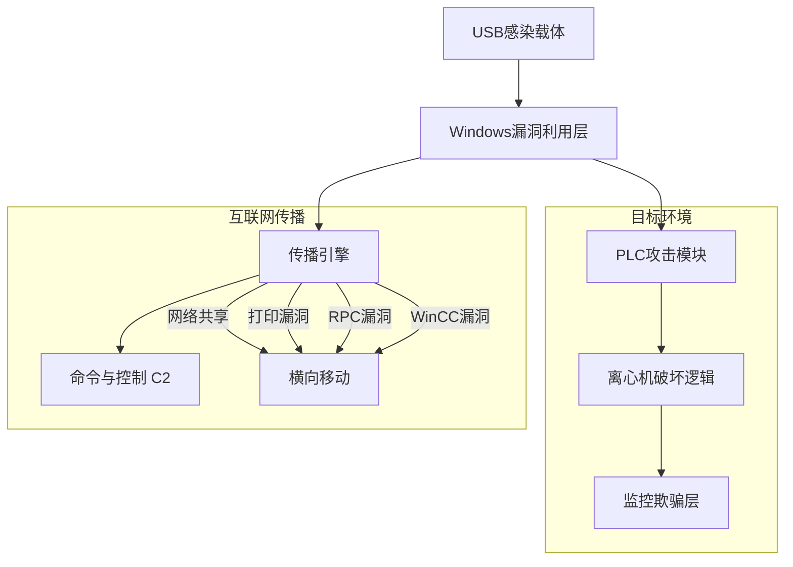
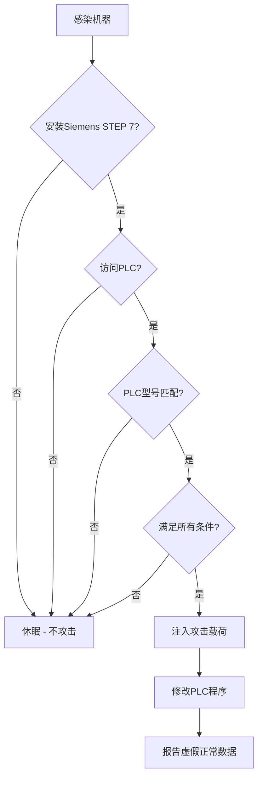
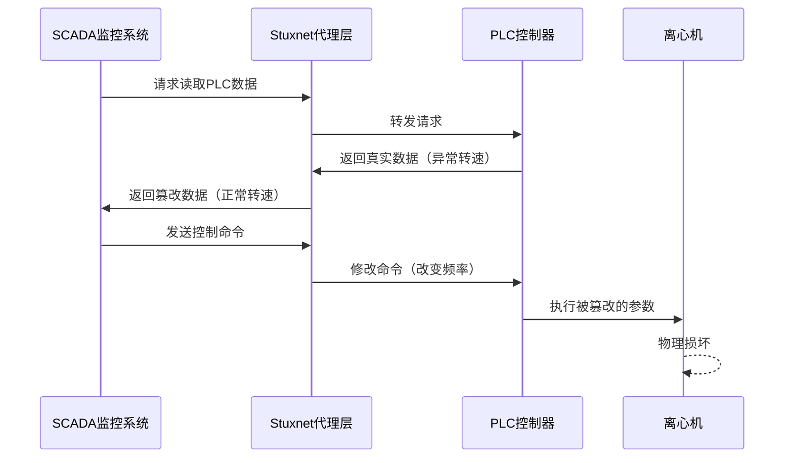
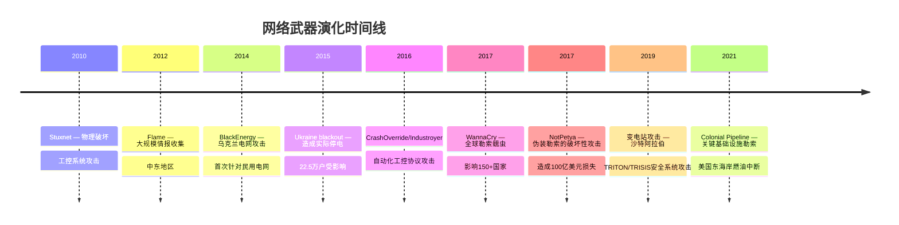

## 3.3 Stuxnet：第一个网络武器

### 3.3.1 背景：为什么需要一个网络武器？

2010年6月，白俄罗斯安全公司VirusBlokAda的分析师Sergey Ulasen发现了一个异常样本——一个通过USB驱动器传播的蠕虫，但它远非普通恶意软件。它拥有合法的数字签名、利用了四个从未公开的Windows漏洞、能够精确操控工业控制系统。这个样本后来被命名为**Stuxnet**，它是人类历史上第一个被公开发现的**网络武器**——一个专门设计用来破坏物理基础设施的软件。

Stuxnet的诞生不是偶然的黑客行为，而是国家级行为体精心策划的军事行动的一部分。要理解Stuxnet，必须先理解它所处的地缘政治背景。

**伊朗核计划的威胁**

2000年代中期，伊朗的铀浓缩计划引发国际社会高度关注。伊朗在纳坦兹（Natanz）建设了大型地下铀浓缩设施，使用数千台IR-1型离心机进行铀浓缩。IR-1离心机基于1970年代的Zippe型离心机设计，通过高速旋转将铀-235从铀-238中分离出来。每台离心机的转速约为1,000转/秒（60,000 RPM），工作在极端精密的条件下——任何微小的转速波动都可能导致离心机损坏。

国际社会通过外交手段和经济制裁试图阻止伊朗的核计划，但效果有限。以色列将伊朗核武器计划视为生存性威胁，多次暗示可能采取军事打击。在这一背景下，一种不需要炸弹、不会造成人员伤亡、不会引发公开战争的替代方案被提上了议程——**网络武器**。

**"奥林匹克运动会"行动**

据多位美国政府高级官员事后透露（主要通过David Sanger等记者的调查报道），Stuxnet是美国国家安全局（NSA）和以色列军事情报部门（Unit 8200）联合开发的秘密项目，代号为**"奥林匹克运动会"（Operation Olympic Games）**。该项目始于小布什政府时期（约2006-2007年），在奥巴马政府时期继续推进并最终部署。

项目的核心目标是：在不发动军事打击的前提下，**延迟伊朗的核计划**——不是破坏其全部能力，而是制造"技术问题"，让伊朗的工程师和科学家对设备产生怀疑、互相猜忌、浪费时间排查故障。

### 3.3.2 技术架构：一个工程奇迹

Stuxnet的技术复杂度远远超出了当时任何已知的恶意软件。安全研究者将其描述为"网络空间的阿波罗计划"——其复杂程度暗示它是由一个拥有顶级工程师团队、多年开发时间和充足预算的组织所构建的。

#### 整体架构

Stuxnet不是一个单一的程序，而是一个**模块化的攻击框架**，由多个组件协同工作：

Stuxnet的主DLL（`mrxcls.sys`和`mrxnet.sys`）约500KB，由C/C++编写，包含多个子模块：

| 组件 | 文件名 | 功能 |
|------|--------|------|
| 主加载器 | `mrxcls.sys` | 内核级Rootkit，注入系统服务 |
| 网络过滤器 | `mrxnet.sys` | 隐藏文件和网络流量 |
| 传播模块 | 多个DLL | 通过五种方式横向移动 |
| PLC攻击模块 | `s7hkimdb.dll`等 | 拦截并修改PLC通信 |
| 配置数据 | 加密配置块 | 目标特征、PLC代码载荷 |
| C2通信 | HTTP模块 | 与命令控制服务器通信 |

#### 五种传播机制

Stuxnet使用了**五种不同的传播方式**，这在恶意软件中前所未有：

**机制一：USB驱动器传播（主要途径）**

这是Stuxnet渗透物理隔离（air-gapped）网络的关键路径。当USB驱动器插入受感染的Windows机器时，Stuxnet会：

1. 将自身复制到USB驱动器的根目录
2. 创建一个特殊的`LNK`快捷方式文件，利用Windows Shell的自动渲染功能
3. 当用户在文件管理器中**仅查看**（不需要双击）该USB驱动器时，LNK文件触发漏洞（CVE-2010-2568），自动执行恶意代码

这个漏洞的利用极其精妙——它利用了Windows处理LNK文件时`shell32.dll`中的一个缺陷，使得仅仅在资源管理器中显示USB驱动器的内容就能触发代码执行。这是Stuxnet的四个零日漏洞之一。

**机制二：网络共享传播**

Stuxnet会扫描网络中共享文件夹的可写路径，将自身复制到这些共享目录中，并创建伪装的快捷方式文件。当其他用户浏览这些共享文件夹时，同样的LNK漏洞被触发。

**机制三：打印后台处理程序漏洞（CVE-2010-2729）**

利用Windows打印后台处理程序（Print Spooler）服务中的漏洞，通过向目标机器发送特制的打印请求来远程执行代码。这个漏洞允许Stuxnet在局域网内从一台机器跳到另一台机器，无需任何用户交互。

**机制四：Windows任务计划程序漏洞（CVE-2010-3338）**

利用任务计划程序中的栈溢出漏洞，通过RPC（远程过程调用）在目标系统上执行代码。

**机制五：WinCC/STEP 7数据库漏洞（CVE-2010-2772）**

这是最具针对性的传播方式。Siemens WinCC是工业控制系统的监控软件，它使用硬编码的数据库密码（`2WSC`）。Stuxnet利用这个已知的默认凭证连接到WinCC的SQL Server数据库，通过数据库存储过程执行任意命令。这个漏洞的存在说明Stuxnet的开发者对Siemens工业控制系统有着深入的了解。

#### 四个零日漏洞

在当时，一个恶意软件利用一个零日漏洞已经非常罕见。Stuxnet一次性使用了**四个零日漏洞**，这直接指向国家级开发资源：

| CVE编号 | 漏洞类型 | 利用方式 | 影响 |
|---------|---------|---------|------|
| CVE-2010-2568 | Windows Shell LNK远程代码执行 | USB/网络共享自动触发 | Windows XP至Windows 7 |
| CVE-2010-2729 | Windows打印后台处理程序远程代码执行 | 局域网打印请求 | Windows 2000至Windows 7 |
| CVE-2010-3338 | Windows任务计划程序栈溢出 | RPC远程调用 | Windows XP/2003 |
| CVE-2010-2772 | Siemens WinCC硬编码密码 | 数据库SQL注入 | WinCC < 7.0 |

#### 合法数字签名

Stuxnet使用了**两份窃取的合法数字签名**来签署其驱动程序：

- **Realtek Semiconductor Corp.**（瑞昱半导体）：签名日期为2010年1月25日
- **JMicron Technology Corp.**（智微科技）：签名日期为2010年2月11日

这两家都是台湾的半导体公司，生产网络和存储控制芯片。Stuxnet使用这些签名的目的很明确：绕过Windows Vista/7的驱动程序签名验证机制（Kernel Mode Code Signing）。当操作系统检查驱动程序签名时，会看到来自合法公司的有效签名，从而允许恶意驱动加载。

这些签名是如何获取的至今没有公开确认，但最可能的途径是：攻击者事先入侵了这两家公司的内部网络，窃取了代码签名证书及其私钥。这也意味着Stuxnet的开发者在部署之前进行了长时间的准备和侦察活动。

### 3.3.3 攻击载荷：精确打击离心机

Stuxnet最令人震惊的部分不是它的传播能力，而是它的**攻击载荷**——一个专门设计用来破坏伊朗铀浓缩离心机的精密代码。

#### 目标识别逻辑

Stuxnet并非对所有感染的机器都发动攻击。它包含极其精确的**环境指纹识别**逻辑，只有在满足所有条件时才激活攻击载荷：

Stuxnet检查以下条件：

1. **是否安装Siemens STEP 7软件**：这是Siemens PLC的编程环境。只有工程师工作站上才会安装这个软件，这意味着Stuxnet精确地瞄准了能够接触PLC的机器。

2. **PLC类型和配置**：Stuxnet检查目标PLC是否是Siemens S7-315或S7-417系列。S7-315用于控制单个离心机级联（cascade），S7-417用于控制更大的级联组。

3. **变频器（VFD）特征**：Stuxnet检查连接到PLC的变频驱动器的配置。它特别寻找两个特定的变频器制造商：**Fararo Paya**（伊朗本土公司）和**Vacon**（芬兰公司），这两家公司都为纳坦兹设施提供了变频器。

4. **特定的PLC功能块（FB）和数据块（DB）**：Stuxnet检查PLC中是否存在与离心机控制相关的特定代码块。

只有当所有条件都满足时，Stuxnet才会注入其攻击代码。

#### 攻击载荷一：S7-315（频率攻击）

针对S7-315 PLC的攻击载荷是Stuxnet最精密的部分。它直接操作控制离心机旋转速度的**变频驱动器（VFD）**：

**正常运行参数：**
- IR-1离心机的正常工作频率：约1,064 Hz（对应约63,840 RPM）
- 允许的频率波动范围：极小，±几赫兹

**攻击手法：**

Stuxnet修改PLC中控制VFD输出频率的参数，按照以下周期性模式改变离心机转速：

| 阶段 | 持续时间 | 频率 | 效果 |
|------|---------|------|------|
| 正常运行 | 27天 | 1,064 Hz | 正常转速 |
| 攻击阶段一 | — | 上升至1,410 Hz | 转速提高约32% |
| 正常运行 | 27天 | 1,064 Hz | 恢复正常 |
| 攻击阶段二 | — | 下降至约2 Hz | 转速骤降至几乎停止 |
| 恢复 | — | 恢复至1,064 Hz | 重新加速 |

这种频率的剧烈波动对离心机是灾难性的。IR-1离心机的转子由极薄的碳纤维制成，悬浮在真空中，转速高达1,000转/秒。突然加速会导致转子因离心力过大而摩擦腔壁；突然减速则会导致转子失去悬浮状态而坠落。无论哪种情况，结果都是离心机的物理损坏。

#### 攻击载荷二：S7-417（压力攻击）

针对S7-417 PLC的攻击载荷更加复杂，它操控的是离心机级联中的**阀门和压力传感器**：

1. 打开和关闭级联中特定位置的阀门
2. 修改压力传感器的读数，使监控系统显示正常值
3. 在级联内部制造压力异常，导致离心机工作在设计压力之外

这种攻击的目的不是立即破坏设备，而是**持续降低铀浓缩效率**，同时让伊朗工程师无法找到问题的根源。

#### 监控欺骗层

Stuxnet攻击中最精妙的部分是它的**"中间人"欺骗**。在修改PLC参数的同时，Stuxnet会：

1. **拦截从PLC到SCADA系统的数据**
2. **替换为预先录制的"正常"数据**
3. 操作员在监控屏幕上看到的一切都是正常的——转速、温度、压力都在正常范围内

这意味着即使离心机正在被破坏，监控室的操作员也会认为一切正常。只有当技术人员亲自到现场检查设备时，才会发现问题。伊朗工程师花了很长时间才意识到他们的离心机不是"质量问题"或"维护问题"，而是遭受了网络攻击。

这种欺骗机制的实现方式是：Stuxnet劫持了STEP 7软件与PLC之间的通信协议（S7协议），在数据路径上插入了一个透明的代理层。

### 3.3.4 时间线与发现过程

Stuxnet的完整时间线揭示了一个精心策划、分阶段执行的国家级行动：

| 时间 | 事件 |
|------|------|
| 2005-2007年 | 推测开发阶段开始，侦察Siemens ICS系统 |
| 2007年 | 第一版Stuxnet（0.500）开始传播，针对S7-417 PLC |
| 2009年1月 | Stuxnet 1.001出现，增加了S7-315攻击载荷 |
| 2009年中期 | Stuxnet 1.100版本出现，增强了传播能力 |
| 2010年1月 | 使用Realtek数字签名 |
| 2010年2月 | 使用JMicron数字签名 |
| 2010年6月17日 | VirusBlokAda首次发现并分析样本 |
| 2010年7月 | Symantec开始深度分析（Eric Chien团队） |
| 2010年7月12日 | 微软发布LNK漏洞安全公告 |
| 2010年9月 | Symantec发布W32.Stuxnet Dossier（第一份完整技术分析报告） |
| 2010年11月 | Langner Research发表PLC攻击载荷分析 |
| 2011年1月 | 《纽约时报》首次报道Stuxnet与美以合作的关联 |
| 2012年1月 | David Sanger详细报道"奥林匹克运动会"行动 |
| 2012年6月 | Kaspersky发现Flame恶意软件，与Stuxnet存在代码关联 |
| 2013年2月 | 美国政府首次非正式确认参与Stuxnet |

**感染规模：**

据Symantec的遥测数据，Stuxnet感染了全球超过100,000台计算机，其中：

- **伊朗**：约60%的感染
- **印度尼西亚**：约18%
- **印度**：约10%
- 其余分布在其他国家

但这些感染绝大多数是**附带损害**——Stuxnet的传播机制过于"激进"，导致它在跳出纳坦兹设施的隔离网络后，在全球范围内大量传播。然而，其攻击载荷只在纳坦兹激活——这是目标识别逻辑精确性的证明。

**对伊朗核计划的实际影响：**

据国际原子能机构（IAEA）的报告和西方情报评估：

- 纳坦兹在2009年底至2010年初期间，**离心机更换率异常升高**
- 伊朗被迫将已安装的约9,000台离心机中的约1,000台替换
- 低浓缩铀（LEU）产量在2010年初一度下降
- 伊朗的核计划据估计被延迟了**1-2年**

这些数字虽然看起来不大，但在地缘政治层面意义深远——它们可能为外交谈判争取了关键的时间窗口。

### 3.3.5 Rootkit与隐蔽技术

Stuxnet的隐蔽技术同样达到了当时恶意软件的最高水平。

#### Windows内核Rootkit

Stuxnet安装了两个内核级Rootkit驱动程序：

1. **`mrxcls.sys`**：主Rootkit驱动，负责将Stuxnet的DLL注入到关键系统进程中。它劫持了Windows的API调用链，使得`lsass.exe`（本地安全认证子系统）在启动时自动加载Stuxnet组件。

2. **`mrxnet.sys`**：文件系统过滤驱动，负责隐藏Stuxnet的文件。它拦截文件系统API调用，对包含特定模式的文件返回"文件不存在"的错误。

这两个驱动都使用了合法数字签名（前面提到的Realtek和JMicron签名），因此能够通过Windows的驱动签名验证。

#### PLC Rootkit

更令人惊讶的是，Stuxnet还实现了**PLC级别的Rootkit**——这在当时是完全前所未有的。具体来说：

1. Stuxnet向PLC的MMC（Memory Module Card）写入恶意OB（Organization Block）代码
2. 它修改OB1（主程序块）和OB35（循环中断块）来注入攻击逻辑
3. 更关键的是，它修改了**系统功能块SFB**，使得STEP 7软件在读取PLC程序时看到的是**原始的、未被修改的代码**，而不是被Stuxnet注入的恶意代码

这种PLC Rootkit意味着，即使伊朗工程师将PLC程序读出来检查，也不会发现任何异常。恶意代码只存在于PLC的运行内存中，对编程软件是不可见的。

### 3.3.6 命令与控制基础设施

Stuxnet的C2（命令与控制）基础设施设计体现了国家级行动的特征：

**通信方式：**

Stuxnet使用HTTP协议与C2服务器通信。它会尝试连接以下域名：

- `www.mypremierfutbol.com`
- `www.todaysfutbol.com`

这些域名被注册在合法的ISP上，指向位于马来西亚和丹麦的服务器。

**C2功能：**

1. **上传窃取的数据**：Stuxnet会收集受感染系统上的信息（计算机名、IP地址、已安装软件列表、STEP 7项目数据等），打包加密后上传到C2服务器
2. **接收更新**：C2服务器可以向Stuxnet推送更新模块、新的攻击配置、甚至新的漏洞利用代码
3. **远程控制**：C2可以向Stuxnet下发命令，修改其行为

**操作安全（OPSEC）：**

Stuxnet的C2通信具有很强的操作安全意识：

- 所有通信数据都经过加密
- 通信频率低，避免产生异常流量模式
- C2服务器使用合法域名，不触发黑名单检测
- 整个C2基础设施在Stuxnet被发现后很快被关闭，没有留下明显的数字痕迹

### 3.3.7 对网络安全的深远影响

Stuxnet的影响远远超出了伊朗核计划的范畴。它从根本上改变了网络安全的格局。

#### 1. 网络战争从理论变为现实

在Stuxnet之前，"网络战争"主要存在于学术论文和军事理论中。Stuxnet第一次**公开证明**了网络攻击可以对物理世界造成**实质性、可测量的破坏**——不是瘫痪电脑系统，不是窃取数据，而是**物理摧毁工业设备**。

这在国际安全领域引发了根本性的范式转变：网络攻击不再仅仅是信息安全问题，而是与传统军事行动等价的**战争行为**。

#### 2. 工控安全的警钟

Stuxnet暴露了工业控制系统（ICS）安全的根本性缺陷：

| 问题 | 说明 |
|------|------|
| **物理隔离不够** | 纳坦兹是物理隔离的，但USB驱动器跨越了空气间隙 |
| **SCADA系统缺乏认证** | S7协议缺乏加密和认证，任何能访问网络的人都可以操控PLC |
| **默认密码** | WinCC的硬编码数据库密码是公开的秘密 |
| **补丁管理困难** | ICS系统通常无法停机打补丁 |
| **信任模型过时** | ICS系统假设内部网络是可信的 |

#### 3. 零日漏洞武器化

Stuxnet开创了**系统性地将零日漏洞武器化**的先例。一次性使用四个零日漏洞表明：国家级行为体有能力囤积和利用多个零日漏洞，将其作为战略武器。这直接催生了全球性的零日漏洞交易市场，推动了漏洞赏金计划的普及。

#### 4. APT时代的开端

Stuxnet标志着**高级持续性威胁（APT）**概念从学术概念走向公众视野。此后，一系列与Stuxnet相关的恶意软件被陆续发现：

| 恶意软件 | 发现时间 | 关联 | 目标 |
|---------|---------|------|------|
| Duqu | 2011年9月 | 与Stuxnet共享部分代码 | 情报收集（侦察工具） |
| Flame | 2012年5月 | 与Stuxnet有代码关联 | 中东情报收集 |
| Gauss | 2012年6月 | 与Flame共享平台 | 银行账户和系统信息窃取 |
| MiniFlame | 2012年10月 | Flame的精简模块 | 精准定向攻击 |

这些发现表明，Stuxnet不是一个孤立的项目，而是一个庞大的**国家级网络武器体系**的一部分。

#### 5. 道德与法律争议

Stuxnet引发了关于网络武器的深刻伦理和法律讨论：

**支持者的论点：**
- 避免了可能导致大量平民伤亡的军事打击
- 比传统武器更精确，附带损害更小
- 为外交谈判争取了时间

**反对者的论点：**
- 开创了使用网络武器攻击主权国家基础设施的先例
- 一旦攻击代码被公开，任何国家或组织都可能效仿
- 附带感染影响了全球数十万台无辜计算机
- 违反了国际法中关于使用武力的规定

最深刻的讽刺在于：Stuxnet的传播失控——它本应只感染纳坦兹，却扩散到了全球。这揭示了网络武器的一个根本特性：**一旦释放，就无法完全控制**。这与核武器的"放射性沾染"有相似之处——你无法保证攻击只影响目标。

### 3.3.8 从Stuxnet到今天：网络武器的演化

Stuxnet不是终点，而是起点。在其后的十余年间，网络武器经历了快速的演化：

从Stuxnet到今天，网络武器的几个关键趋势：

1. **从国家级专属到扩散化**：Stuxnet需要国家级资源开发，但其技术原理被公开后，更低能力的行为体也能开发类似工具
2. **从定向攻击到无差别攻击**：Stuxnet精确瞄准特定目标，而WannaCry/NotPetya则是无差别攻击
3. **从单一目标到关键基础设施**：攻击对象从核设施扩展到电网、供水、交通、医疗等民用关键基础设施
4. **从破坏到勒索**：攻击动机从地缘政治目的扩展到经济勒索

### 3.3.9 Stuxnet对安全从业者的启示

#### 对红队（攻击方）的启示

1. **目标识别的重要性**：Stuxnet最精妙的设计不是它的漏洞利用，而是它精确的目标识别逻辑。在数千台计算机中，攻击载荷只在极少数满足条件的机器上激活。

2. **供应链攻击的价值**：通过窃取Realtek和JMicron的签名证书，Stuxnet绕过了操作系统的信任机制。这预示了后来SolarWinds等供应链攻击的模式。

3. **持久化与隐蔽并重**：PLC Rootkit的概念表明，高级攻击需要在目标系统的每一层都建立隐蔽机制。

4. **操作安全**：Stuxnet被发现是因为它的传播失控，不是因为安全研究人员主动追踪到了它。这说明即使是最高水平的攻击也有操作安全的弱点。

#### 对蓝队（防御方）的启示

1. **物理隔离不是万能的**：USB策略、设备管控、数据二极管（Data Diode）等多层次防护是必要的。

2. **工业网络需要深度监控**：SCADA/ICS网络必须部署专门的入侵检测系统，监控PLC的程序变更和通信异常。

3. **完整性验证至关重要**：对关键系统定期进行完整性校验（如PLC程序的哈希值比对），可以在攻击载荷激活后尽早发现异常。

4. **零信任架构**：不再假设内部网络是可信的，对所有通信进行认证和加密。

5. **供应链安全**：代码签名证书的管理必须极其严格，包括证书的使用监控、吊销机制和硬件安全模块（HSM）保护。

#### 对决策者的启示

1. **网络武器的不可控性**：一旦释放就无法完全控制，附带损害可能超出预期。

2. **攻防不对称**：攻击者的成本远低于防御者——开发Stuxnet可能花费数千万美元，但防御所有类似攻击的成本是天文数字。

3. **国际合作的必要性**：网络武器的扩散性使得任何国家都无法独善其身，国际合作（如建立网络武器使用规范）是必然趋势。

### 3.3.10 延伸阅读与资源

**核心文献：**

| 文献 | 作者/机构 | 重点内容 |
|------|----------|---------|
| W32.Stuxnet Dossier | Symantec Security Response | 最权威的技术分析报告，详细描述了Stuxnet的每个组件 |
| Stuxnet: Dissecting a Cyberwarfare Weapon | Ralph Langner | 首个分析PLC攻击载荷的研究者，详细解释了离心机攻击机制 |
| Countdown to Zero Day | Kim Zetter | 最全面的叙事性记录，涵盖从技术到政治的方方面面 |
| Confront and Conceal | David Sanger | 首次披露"奥林匹克运动会"行动的内幕报道 |
| The Stuxnet Worm: A Cyberweapon | Langner Research | 专注于PLC攻击载荷的技术分析 |

**技术参考：**

- **Symantec博客系列**：Symantec在2010-2012年间发布了多篇关于Stuxnet技术细节的博客文章，包括对不同版本（0.500、1.001、1.100）的对比分析
- **Kaspersky Securelist**：Kaspersky的分析发现了Stuxnet与Flame恶意软件的代码关联
- **ICS-CERT公告**：美国ICS-CERT发布了多份关于Stuxnet利用的工控漏洞的公告和缓解建议

**纪录片和影视作品：**

- **《Zero Days》（2016）**：Alex Gibney执导的纪录片，深入调查Stuxnet及其后续影响
- **《Countdown to Stuxnet》**：多个安全会议的演讲记录

### 3.3.11 本节小结

Stuxnet是网络空间的一个分水岭事件。它证明了几个关键事实：

1. **网络攻击可以跨越数字-物理边界**，对现实世界的设备造成实质性破坏
2. **国家级行为体拥有远超公众想象的网络能力**，包括多年开发、多个零日漏洞、合法签名窃取等
3. **物理隔离不再是绝对的安全保障**，USB驱动器和人的操作失误是最大的薄弱环节
4. **工业控制系统需要全新的安全范式**，传统的IT安全策略不足以保护OT（运营技术）环境
5. **网络武器一旦释放就无法控制**，附带损害是不可避免的

Stuxnet的故事远未结束。它的技术遗产——从零日武器化到工控系统攻击——至今仍在塑造着全球网络安全的格局。对每一个安全从业者来说，理解Stuxnet不仅是学习一段历史，更是理解未来网络威胁的必修课。
