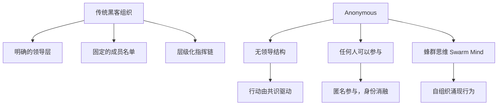
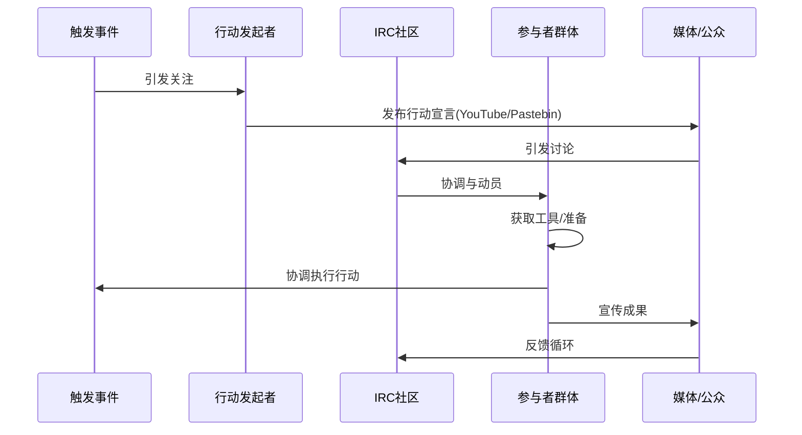

## 3.4 Anonymous：去中心化黑客集体

Anonymous 是互联网历史上最具影响力、最神秘、也最具争议的黑客行动主义集体。它不是一个组织，没有成员名单，没有总部，没有领导人——它是一种文化现象，一种身份认同，一种"任何人都可以是 Anonymous"的去中心化运动。从 2003 年的 4chan 论坛萌芽，到席卷全球的政治行动，Anonymous 用二十余年的时间重新定义了黑客行动主义（Hacktivism）的边界。

### 3.4.1 起源与文化基因

#### 从 4chan 到全球运动

Anonymous 的故事始于 4chan 的 /b/ 板（Random 板），这是一个完全匿名的图片分享论坛。2003 年至 2006 年间，/b/ 板的用户逐渐形成了一种独特的亚文化：

- **集体匿名**：所有帖子默认署名 "Anonymous"，个体消融于集体之中
- **无厘头幽默**：以恶搞（Trolling）、网络迷因（Meme）和恶作剧为主要活动
- **群体行动**：自发组织针对特定目标的线上骚扰或恶作剧活动

早期的 Anonymous 更像是一群互联网恶作剧者。他们发起的行动往往带有强烈的游戏性质，比如 2006 年对 Habbo Hotel 的"凝固"行动（用户集体装扮成黑人角色堵住泳池），或者对 YouTube 上"不受欢迎"视频的协调轰炸。

#### 文化符号与身份认同

Anonymous 拥有一套独特的视觉语言和文化符号：

| 符号 | 含义 | 来源 |
|------|------|------|
| Guy Fawkes 面具 | 匿名身份的外化象征 | 电影《V字仇杀队》（2005） |
| 无头西装人 | 去中心化，"没有领袖" | 4chan 文化 |
| "We are Legion" | 集体身份宣言 | 《圣经》中"军团"的典故 |
| "Expect us" | 威胁与警告 | Operation Chanology |
| "#OpXXX" | 行动代号命名规范 | IRC 频道传统 |

Guy Fawkes 面具成为 Anonymous 最具辨识度的标志。这副面具源自 17 世纪英国火药阴谋案中的天主教反抗者 Guy Fawkes，经由 Alan Moore 的漫画《V字仇杀队》和 2005 年同名电影重新诠释为反抗权威的象征。Anonymous 将其转化为全球性的行动主义图腾——2011 年"占领华尔街"运动中，这副面具被广泛使用，HBO 纪录片《We Are Legion: The Story of the Hacktivists》（2012）更是将其推向主流视野。

#### 从恶作剧到行动主义的蜕变

2008 年是 Anonymous 历史上的分水岭。在此之前，Anonymous 的活动以娱乐为主；在此之后，它开始介入严肃的政治议题。这一转变的催化剂是 **Operation Chanology**。

2008 年 1 月，山达基教会（Church of Scientology）试图通过法律手段删除一段泄露的内部宣传视频（Tom Cruise 谈论山达基教的片段）。这引发了 Anonymous 的愤怒——他们认为这是对互联网自由的审查。于是，Anonymous 发起了史上第一次大规模政治行动：

- **线上攻击**：对山达基教会网站发起 DDoS 攻击
- **线下抗议**：全球多城市同步举行街头示威，参与者佩戴 Guy Fawkes 面具
- **信息战**：泄露教会内部文件，公开批评其做法

Chanology 标志着 Anonymous 从 4chan 上的匿名恶作剧者转型为具有政治诉求的黑客行动主义集体。这一事件也被学术界广泛研究，成为去中心化社会运动的经典案例。

### 3.4.2 组织结构与运作机制

#### 去中心化架构

Anonymous 最显著的特征是其彻底的去中心化架构。与传统黑客组织（如 L0pht、Cult of the Dead Cow）不同，Anonymous 没有正式的成员资格、入会程序或组织层级。



这种架构的核心原则是：

1. **无领袖原则**：没有 CEO，没有发言人，没有人能代表整个 Anonymous
2. **自愿参与**：任何人可以以 Anonymous 的名义发起或参与行动
3. **行动即身份**：你不是 Anonymous 的"成员"，你做 Anonymous 的事，你就是 Anonymous
4. **共识形成**：行动的合法性来自社区的自发响应——如果一个"Op"（行动）获得了足够多的支持和参与，它就"成立"了

#### 通信与协作基础设施

尽管去中心化，Anonymous 仍然需要通信基础设施来协调行动：

**IRC（Internet Relay Chat）**：Anonymous 的核心通信平台。主要的 IRC 网络包括：

- **AnonOps**：最活跃的 Anonymous IRC 网络，运营多个频道
- **#ops** 频道：用于策划和协调具体行动
- **#command** 频道：（讽刺性的名字）用于讨论战略方向
- 使用 IRC 的原因是其低门槛、可匿名性和去中心化特性

**其他通信工具**：

| 工具 | 用途 | 特点 |
|------|------|------|
| IRC (AnonOps) | 核心协调平台 | 匿名、实时、频道式 |
| Twitter | 信息发布与宣传 | #Anonymous #OpXXX 标签 |
| Pastebin | 信息发布与数据泄露 | 匿名发布，无需注册 |
| YouTube | 宣传视频发布 | 带面具的声明视频 |
| Tor | 匿名通信与资源访问 | 隐藏服务 |
| Encrypted chat | 敏感信息传递 | Signal、PGP 加密 |
| Reddit | 社区讨论与招募 | r/Anonymous 子版块 |

#### 行动发起与组织流程

一个典型的 Anonymous 行动（Op）通常遵循以下流程：

1. **动机触发**：某个事件或议题引发社区关注
2. **宣言发布**：发起者通过 YouTube 视频或 Pastebin 文本发布行动宣言
3. **社区讨论**：在 IRC 和社交媒体上讨论行动的目标、策略和合法性
4. **工具分发**：参与者获取所需工具（如 LOIC 低轨道离子炮）
5. **协调执行**：在约定时间发起攻击或行动
6. **宣传扩散**：通过社交媒体传播成果，吸引更多参与者
7. **撤退或升级**：根据反应决定是否持续或扩大行动



### 3.4.3 核心行动全景

Anonymous 的行动史是一部互联网行动主义的编年史。以下按时间线梳理其最具影响力的行动：

#### Project Chanology（2008）

**背景**：山达基教会试图审查一段 Tom Cruise 的内部宣传视频，Anonymous 视为对互联网自由的攻击。

**行动内容**：
- 对山达基教会网站发起 DDoS 攻击
- 全球 100+ 城市同步举行街头抗议
- 泄露教会内部文件
- 持续数月的信息战

**影响**：Anonymous 从亚文化圈子进入主流视野。这是第一次有组织的线上-线下混合黑客行动主义行动。

#### Operation Payback（2010）

**背景**：多家支付公司（Visa、MasterCard、PayPal）在维基解密（WikiLeaks）发布美国外交电报后切断了其资金渠道。Anonymous 认为这是对信息自由的打压。

**行动内容**：
- 使用 LOIC 工具对 Visa、MasterCard、PayPal 发起大规模 DDoS 攻击
- 攻击瑞典政府网站（因对 Julian Assange 的逮捕令）
- 攻击支持 SOPA/PIPA 法案的美国议员网站

**关键数据**：
- PayPal 攻击导致其服务中断数小时
- 超过 7,000 人参与 LOIC 攻击
- 事件引发了关于"数字抗议"合法性的全球讨论

**后果**：FBI 逮捕了 14 名参与攻击的 Anonymous 成员，引发了关于大规模参与 DDoS 攻击者是否应被追责的法律争论。

#### 阿拉伯之春支援（2011）

**背景**：2010-2011 年，中东和北非爆发大规模反政府抗议运动。

**行动内容**：
- 攻击突尼斯、埃及、利比亚等国政府网站
- 为抗议者提供匿名通信工具和技术指导
- 泄露政府官员的个人信息
- 帮助恢复被政府切断的通信网络

**影响**：Anonymous 在阿拉伯之春中扮演了技术支持者的角色，展示了黑客行动主义在全球政治动荡中的实际影响力。

#### Operation Darknet（2011）

**背景**：Anonymous 发现大量儿童色情内容托管在 Tor 隐藏服务上。

**行动内容**：
- 识别并曝光了 100+ 个托管儿童色情内容的网站
- 攻击并关闭了 "Lolita City" 等网站
- 泄露了约 1,589 个相关用户的用户名
- 联系执法部门提供情报

**意义**：这是 Anonymous 为数不多获得广泛正面评价的行动，展示了去中心化黑客集体在打击网络犯罪方面的潜力。

#### Operation Megaupload（2012）

**背景**：美国 FBI 关闭了文件共享网站 Megaupload 并逮捕其创始人 Kim Dotcom。

**行动内容**：
- 史上最大规模的 DDoS 攻击之一
- 攻击了美国司法部、FBI、环球唱片、EMI 等多个目标
- 部分网站被短暂关闭
- 攻击在 Megaupload 被关闭后一小时内即开始

**技术特点**：这次行动展示了 Anonymous 的快速反应能力和动员规模。

#### Operation ISIS（2015）

**背景**：ISIS 利用社交媒体进行恐怖主义宣传和招募。

**行动内容**：
- 识别并报告了超过 25,000 个 ISIS 相关 Twitter 账户
- 攻击 ISIS 相关网站和通信渠道
- 与执法部门共享情报
- 发起反极端主义宣传行动

**影响**：展示了 Anonymous 在反恐领域的实际作用，但也引发了关于去中心化集体能否准确识别目标的讨论。

#### Operation Russia（2022）

**背景**：2022 年 2 月俄罗斯入侵乌克兰后，Anonymous 宣布对俄罗斯发动网络战。

**行动内容**：
- 入侵俄罗斯国家电视台，播放乌克兰战争画面
- 泄露俄罗斯政府机构和企业的大量数据
- 攻击俄罗斯政府网站、银行系统
- 通过卫星广播播放乌克兰国歌

**影响**：这是 Anonymous 迄今最大规模的地缘政治行动，标志着其进入了国家间网络战的领域。

#### 行动影响力对比

| 行动 | 年份 | 规模 | 技术难度 | 政治影响 | 公众认知 |
|------|------|------|----------|----------|----------|
| Chanology | 2008 | 中 | 低 | 中 | 高（首次亮相） |
| Payback | 2010 | 大 | 中 | 高 | 高 |
| 阿拉伯之春 | 2011 | 大 | 中 | 非常高 | 高 |
| Darknet | 2011 | 中 | 高 | 中 | 中 |
| Megaupload | 2012 | 非常大 | 低 | 中 | 高 |
| ISIS | 2015 | 大 | 中 | 高 | 中 |
| Russia | 2022 | 非常大 | 高 | 非常高 | 非常高 |

### 3.4.4 技术手段与工具

Anonymous 使用的技术手段随时间演进，从简单的 DDoS 工具到复杂的数据泄露和入侵技术。

#### DDoS 工具

**LOIC（Low Orbit Ion Cannon，低轨道离子炮）**：

LOIC 是 Anonymous 最标志性的攻击工具，最初由 Praetox Technologies 开发用于网络压力测试。

```text
LOIC 工作原理：
┌─────────────┐     TCP/UDP/HTTP 请求      ┌──────────┐
│  参与者 1   │ ──────────────────────────► │          │
├─────────────┤                             │          │
│  参与者 2   │ ──────────────────────────► │  目标    │
├─────────────┤                             │  服务器  │
│  ...        │ ──────────────────────────► │          │
├─────────────┤                             │          │
│  参与者 N   │ ──────────────────────────► │          │
└─────────────┘                             └──────────┘
     共同模式：同步攻击，集中流量
```

- **HIVEMIND 模式**：LOIC 的特殊功能，允许将多台计算机连接到 IRC 频道，由操作员统一控制攻击目标和参数
- **缺点**：不隐藏 IP 地址，参与者的 IP 完全暴露，这也是为什么 FBI 能够逮捕参与者

**HOIC（High Orbit Ion Cannon）**：

LOIC 的升级版本，增加了以下功能：
- 支持脚本化的多目标攻击
- 通过 Header 洪泛增加服务器处理负担
- 更高的并发连接数
- 一定程度的 IP 混淆

**Slowloris**：

一种低带宽 DDoS 攻击工具：
- 不需要大量带宽，单台机器即可发起有效攻击
- 通过建立大量半开 HTTP 连接耗尽目标服务器的连接池
- 对 Apache 服务器特别有效

#### 信息收集与入侵工具

| 工具 | 用途 | 说明 |
|------|------|------|
| Nmap | 网络扫描与端口发现 | 目标基础设施侦察 |
| SQLMap | SQL 注入自动化 | 数据库入侵 |
| Havij | SQL 注入 GUI 工具 | 降低了技术门槛 |
| John the Ripper | 密码破解 | 离线密码哈希破解 |
| Hydra | 在线暴力破解 | 登录凭证猜测 |
| Metasploit | 漏洞利用框架 | 入侵后渗透 |
| Social Engineering Toolkit | 社会工程 | 钓鱼攻击 |

#### 匿名与安全工具

| 工具 | 用途 | 重要性 |
|------|------|--------|
| Tor | 网络流量匿名化 | 核心 |
| VPN | IP 地址隐藏 | 基础 |
| Proxychains | 代理链 | 增强匿名性 |
| Tails OS | 安全操作系统 | 高 |
| Whonix | 隔离网络环境 | 高 |
| PGP | 通信加密 | 中 |

### 3.4.5 去中心化组织的优劣分析

Anonymous 的去中心化架构既是其最大的优势，也是其最根本的局限。

#### 优势

**韧性与反脆弱性**：

传统组织的领导层被捕或叛变会导致整个组织崩溃（参考 LulzSec 的案例）。Anonymous 则不同——没有领导可以被抓，没有结构可以被瓦解。FBI 逮捕了数十名 Anonymous 参与者，但运动本身从未停止。

**规模化动员**：

去中心化意味着没有入会门槛。任何人只需佩戴面具、使用标签、参与 IRC 频道即可"加入"。这使得 Anonymous 能够在短时间内动员数千甚至数万人参与行动。

**议题灵活性**：

没有固定的组织章程或意识形态框架，Anonymous 可以快速切换目标——从山达基教会到阿拉伯之春，从儿童色情到俄罗斯政府，只要社区认为某个议题值得行动。

#### 劣势

**行动一致性问题**：

没有领导层意味着没有统一的行动标准。同一个"Op"中，不同参与者可能采取截然不同的策略，从合法抗议到非法入侵，难以协调。

**"伪造匿名"问题**：

任何人都可以以 Anonymous 的名义行动，这导致了大量的冒名行为。2020 年，有人以 Anonymous 的名义在 Facebook 上创建了拥有数百万粉丝的页面，但其运营者的真实意图和身份始终存疑。

**道德边界模糊**：

没有组织章程意味着没有明确的道德准则。一些行动（如 Operation Darknet）获得了广泛支持，而另一些（如针对普通企业的数据泄露）则引发了伦理争议。

**能力参差不齐**：

参与者的技术水平从专业安全研究员到只会点击按钮的新手不等。在 Operation Payback 中，使用 LOIC 的大多数参与者实际上只是在运行一个简单的网络压力测试工具，真正的技术工作由少数核心成员完成。

### 3.4.6 法律后果与个人代价

Anonymous 的去中心化并不意味着参与者不需要承担法律后果。事实上，许多参与者付出了沉重的个人代价。

#### 著名案例

**Barrett Brown（1981-2024）**：

记者和 Anonymous 的同情者。2012 年因转发泄露数据的链接被逮捕，面临最高 105 年的监禁。最终被判处 63 个月监禁。他的案件引发了关于新闻自由和信息传播权利的广泛讨论。2024 年去世。

**Jeremy Hammond（1985-）**：

黑客和 Anonymous 参与者。因入侵 Stratfor（全球情报公司）并泄露 500 万封内部邮件被判处 10 年监禁。他的行动揭露了私人情报公司对全球活动人士的监控。

**Hector Monsegur（Sabu，1983-）**：

LulzSec（与 Anonymous 关联的黑客小组）的核心成员。被 FBI 逮捕后成为线人，协助 FBI 逮捕了其他多名成员。他的叛变揭示了去中心化运动中"信任"的风险。

**Deric Lostutter（KYAnonymous，1987-）**：

因参与 Steubenville 高中强奸案的曝光行动被判处 2 年监禁。他的案例展示了即使是出于正义动机的行动也可能面临法律后果。

#### 逮捕与起诉统计

FBI 在 2011-2015 年间针对 Anonymous 相关行动逮捕了超过 100 人，主要罪名包括：
- 计算机欺诈和滥用（Computer Fraud and Abuse Act，CFAA）
- 共谋罪（Conspiracy）
- 身份盗窃
- 银行欺诈（针对涉及金融系统的行动）

### 3.4.7 黑客行动主义的伦理困境

Anonymous 的行动史引发了一系列深刻的伦理问题，这些问题至今没有共识答案。

#### 核心伦理辩论

**DDoS 攻击是否等于数字抗议？**

支持方认为：DDoS 攻击类似于现实中的"占座"抗议或纠察线封锁，是表达政治诉求的合法手段。在 2013 年 WhiteHouse.gov 的请愿中，超过 5,000 人签名要求将 DDoS 攻击认定为合法的抗议形式。

反对方认为：DDoS 攻击是非法入侵计算机系统，违反了 CFAA，与和平抗议不可类比。它可能影响无辜的第三方用户，且攻击规模难以控制。

**数据泄露中的"附带伤害"**：

Anonymous 泄露的数据往往包含无辜个人的信息。例如，在 HBGary Federal 入侵事件中，泄露的邮件中包含了公司普通员工的私人通信。在 Steubenville 案件中，虽然揭露了强奸案的真相，但也暴露了受害者的身份信息。

**谁来定义"正义"？**

没有组织章程意味着 Anonymous 的"正义"标准完全由参与者的共识决定。这导致了行动目标的不一致——同一个集体既可以打击儿童色情网站，也可以攻击正当经营的企业。

#### 学术视角

学术界对 Anonymous 的研究主要集中在以下几个方向：

1. **去中心化社会运动理论**：Manuel Castells 的"网络社会"理论、John Arquilla 和 David Ronfeldt 的"Netwar"概念
2. **集体行动的数字转型**：Clay Shirky 的《Here Comes Everybody》中关于"无组织的组织"的分析
3. **网络主权与治理**：Evgeny Morozov 对"网络自由主义"的批判
4. **黑客伦理的演变**：从 Steven Levy 的"黑客伦理"到当代黑客行动主义的价值观转型

### 3.4.8 Anonymous 的遗产与当代影响

#### 对网络安全的影响

Anonymous 的存在迫使全球组织重新审视其网络安全策略：

- **DDoS 防御成为标配**：Anonymous 的 DDoS 攻击推动了 Cloudflare 等 DDoS 防护服务的普及
- **漏洞披露文化**：Anonymous 的"先攻击后公开"模式与负责任漏洞披露形成了张力
- **安全意识提升**：许多组织在遭受 Anonymous 攻击后才开始重视网络安全

#### 对政治行动主义的影响

Anonymous 开创了一种新的政治行动模式——不需要物理集结，不需要暴露身份，技术能力就是力量。这一模式影响了后续的多个黑客行动主义集体：

- **LulzSec**（2011）：从 Anonymous 分裂出的更激进小组
- **Lizard Squad**（2014-2015）：以 DDoS 攻击为主要手段
- **Ghost Squad Hackers**（2016）：继承 Anonymous 的行动主义传统
- **各种 "Ops" 运动**：2020 年代仍在持续的各类行动

#### 当代状态

2020 年代的 Anonymous 已经与其早期形态大不相同：

- **Facebook 时代**：大量"Anonymous" Facebook 页面拥有数百万粉丝，但其真实性和代表性存疑
- **去政治化**：许多参与者更关注社会正义议题而非技术黑客活动
- **碎片化**：没有统一的"Anonymous"，各地小组独立行动
- **2022 年复兴**：俄乌冲突中 Anonymous 的大规模行动使其重新获得全球关注

### 3.4.9 对安全研究者的启示

研究 Anonymous 案例对安全从业者有多方面的价值：

**组织安全层面**：
- 去中心化威胁难以用传统安全模型应对——没有 IP 黑名单，没有固定的攻击向量
- 品牌声誉风险：任何组织都可能成为 Anonymous 的目标
- 信息泄露的连锁效应：一次成功的入侵可能导致数月甚至数年的持续信息战

**技术层面**：
- DDoS 防御策略必须考虑多向量、大规模攻击场景
- 内部威胁和社工攻击是 Anonymous 获取初始访问的重要手段
- 数据泄露后的应急响应计划必须考虑"公开羞辱"场景

**战略层面**：
- 与黑客行动主义集体的对抗本质上是信息战，而非纯技术战
- 透明度和沟通策略可能比技术防御更重要
- 理解攻击者的动机（政治 vs. 经济 vs. 名声）有助于制定有效的防御策略

### 3.4.10 核心教训总结

Anonymous 的二十余年历史提供了以下关键教训：

1. **去中心化是一把双刃剑**：它提供了韧性和动员力，但牺牲了控制力和一致性。没有领导可以被抓，但也没有人能保证行动符合道德标准。

2. **技术去门槛化改变了力量格局**：LOIC 这样的工具让技术小白也能参与 DDoS 攻击，但真正的核心技术工作仍然需要专业知识。

3. **匿名不等于免责**：FBI 的多次逮捕行动证明，在技术层面完全匿名是非常困难的。参与者的真实身份可以通过多种方式被追踪。

4. **道德边界需要外部约束**：没有组织章程的集体行动容易滑向不道德的方向。匿名性和去中心化放大了"群体极化"的风险。

5. **信息时代的安全是全方位的**：Anonymous 的行动表明，网络安全不仅仅是技术问题，更是政治、社会和伦理问题的交汇点。

6. **历史会重演，但形式会变化**：Anonymous 的精神——去中心化行动主义、信息自由、反抗权威——不会消失，它会以新的形式在新的平台上重新出现。
