## 3.6 SolarWinds供应链攻击（2020年）

SolarWinds事件是网络安全史上最具影响力的供应链攻击之一。攻击者通过入侵IT管理软件供应商SolarWinds的构建系统，在其核心产品Orion Platform的更新包中植入后门，最终影响了超过18,000个组织，包括美国财政部、国土安全部、国务院等关键政府机构，以及微软、英特尔、FireEye等顶级科技企业。这起事件深刻改变了全球对供应链安全的认知，推动了零信任架构的加速落地。

### 3.6.1 背景与攻击者画像

#### SolarWinds公司与Orion平台

SolarWinds是一家总部位于美国德克萨斯州奥斯汀的IT基础设施管理公司，其产品被全球超过300,000个客户用于监控网络、服务器、数据库和应用程序的运行状态。Orion Platform是其旗舰产品，拥有约18,000个活跃用户，部署在企业网络的核心位置——这意味着Orion拥有对整个IT基础设施的深度可见性和特权访问权限。

Orion的特殊地位体现在以下方面：

| 能力维度 | 具体权限 | 攻击价值 |
|---------|---------|---------|
| 网络监控 | 完整的网络拓扑和流量视图 | 侦察与横向移动的地图 |
| 系统管理 | 对服务器和工作站的管理权限 | 直接控制关键资产 |
| 凭证访问 | 通常拥有域管理员级别的服务账户 | 一键获取全网凭证 |
| 日志收集 | 集中收集各系统日志 | 了解防御能力与盲区 |
| 更新机制 | 定期从互联网拉取更新 | 恶意代码分发通道 |

#### 攻击者：APT29（Cozy Bear）

美国政府和多家安全公司将此次攻击归因于俄罗斯对外情报局（SVR），具体执行单位是其下属的APT29（又名Cozy Bear、The Dukes）。APT29是全球最顶尖的高级持续性威胁组织之一，具备以下特征：

- **国家级资源**：拥有充足的人力、资金和技术支持
- **极高的技术素养**：擅长开发定制恶意软件，善于反取证
- **耐心与纪律**：长期潜伏，优先保障隐蔽性而非速度
- **战略目标明确**：以情报收集为主要目的，不做破坏性行动

APT29此前的知名行动包括2016年入侵美国民主党全国委员会（DNC）网络、针对COVID-19疫苗研发机构的攻击等。SolarWinds行动是其已知规模最大、影响最深远的一次操作。

### 3.6.2 完整攻击链分析

整个攻击过程可以分为五个阶段，从初始入侵到最终完成情报收集，历时约14个月。

```mermaid
graph LR
    A[初始入侵<br/>2019年10月前] --> B[植入后门<br/>2019年10月-2020年3月]
    B --> C[分发传播<br/>2020年3-6月]
    C --> D[目标筛选<br/>2020年6-9月]
    D --> E[情报收集<br/>2020年9-12月]
    E --> F[被发现<br/>2020年12月]
    style A fill:#2d1b3d,stroke:#e74c3c
    style B fill:#2d1b3d,stroke:#e74c3c
    style C fill:#2d1b3d,stroke:#f39c12
    style D fill:#2d1b3d,stroke:#f39c12
    style E fill:#2d1b3d,stroke:#3498db
    style F fill:#2d1b3d,stroke:#e74c3c
```



#### 阶段一：初始入侵

攻击者首先入侵了SolarWinds的内部网络。虽然确切的入侵方式至今未被官方完全公布，但根据已知信息和Volexity等安全公司的分析，最可能的途径包括：

1. **凭证窃取**：通过鱼叉式钓鱼攻击获取SolarWinds员工的凭据，进而访问内部开发环境
2. **开发环境渗透**：攻击者瞄准了SolarWinds的构建服务器——这是整个攻击链中最关键的一环

安全研究者后来发现，SolarWinds的源代码仓库在GitHub上曾一度以公开方式托管，且其更新服务器的密码被硬编码为`SolarWinds123`。这些安全疏漏虽不一定是攻击者的入口，但反映了该公司整体的安全管理水平。

#### 阶段二：Sunburst后门植入

攻击者在获取构建环境的访问权限后，将恶意代码植入了Orion Platform的源代码中。这个后门被命名为**SUNBURST**（微软命名），也被称为Solorigate。Sunburst的植入方式极为精妙：

**代码注入策略**：攻击者没有简单地添加一个全新的恶意文件，而是将恶意逻辑嵌入到了Orion已有的合法源代码文件`SolarWinds.Orion.Core.BusinessLayer.dll`中。这意味着恶意代码在编译后与合法代码融为一体，传统的静态分析很难将其识别出来。

**核心恶意代码功能**：

```cpp
SUNBURST 后门技术架构
├── 初始化阶段（延迟12-14天执行，避免沙箱检测）
│   ├── 检查进程名是否为SolarWinds.BusinessLayerHost.exe
│   ├── 禁用.NET ETW跟踪（Event Tracing for Windows）
│   ├── 检查杀毒软件和安全产品列表
│   └── 检查是否在分析环境/虚拟机中运行
├── 通信阶段
│   ├── 生成唯一受害者ID（基于主机名+MAC地址的哈希）
│   ├── DNS隧道通信（使用avsvmcloud.com子域名）
│   ├── DGA算法生成子域名（Domain Generation Algorithm）
│   └── C2响应通过HTTP回传JSON配置
└── 执行阶段
    ├── 下载并执行额外载荷（TEARDROP/RAINDROP）
    ├── 文件系统操作（读/写/删除/执行）
    ├── 进程创建与管理
    └── 系统信息收集与回传
```

**反检测机制详解**：

Sunburst实现了多层反检测，这是它能潜伏数月不被发现的关键：

- **超长延迟启动**：安装后会休眠12-14天，这段时间远超大多数沙箱的分析窗口期
- **环境感知**：会检查运行环境中的各种特征，包括特定进程名、MAC地址前缀、注册表键值、已安装的安全产品等。如果检测到分析环境，后门会完全静默
- **DNS隧道通信**：不使用常规的HTTP/HTTPS通信，而是通过DNS查询将数据编码在子域名中（如`<encoded-data>.avsvmcloud.com`），这种通信模式极难被传统防火墙和IDS检测到
- **流量伪装**：DNS查询的目标域名`avsvmcloud.com`看起来完全合法，且实际注册并指向了合法基础设施
- **限速与抖动**：通信频率经过控制，避免产生异常的网络流量模式

#### 阶段三：Sunspot监控器（可选的更早植入层）

在后续调查中，CrowdStrike发现了另一个更早期的植入物——**SUNSPOT**。SUNSPOT的作用是在SolarWinds的构建过程中实时监控编译操作，在编译Orion产品时悄悄替换源代码文件，编译完成后再恢复原始文件。这种手法意味着：

- 源代码仓库中的代码始终是干净的，代码审计无法发现问题
- 只有最终编译出的二进制文件包含恶意代码
- 构建日志也被篡改，去除了所有替换痕迹

这展示了攻击者对软件工程流程的深刻理解——他们选择在编译阶段而非源码阶段注入，因为编译产物更少受到审查。

#### 阶段四：目标筛选与横向移动

Sunburst通过DNS隧道接收到C2服务器的指令后，并不是对所有感染系统都执行后续操作。攻击者实现了一套精密的目标筛选机制：

**筛选逻辑**：
- 首先通过主机名和域名判断受害组织的身份
- 特别关注`.gov`、`.mil`、`.edu`域名，以及已知政府机构和大型企业的域名
- 对高价值目标激活后续攻击载荷
- 对低价值目标（如小型企业、测试环境）保持静默或排除
- 据估计，18,000个感染组织中，只有约100个被选中进行了深度入侵

**横向移动工具链**：

对选中的高价值目标，攻击者部署了额外的工具链：

| 工具名称 | 类型 | 功能 |
|---------|-----|------|
| TEARDROP | 内存加载器 | 在内存中解密并执行Cobalt Strike Beacon |
| RAINDROP | 内存加载器 | 与TEARDROP类似，用于不同感染路径 |
| Cobalt Strike | 渗透测试工具 | 商业化渗透框架，用于横向移动 |
| GoldMax/SUNSHUTTLE | 后门 | 用Go语言编写的持久化后门 |
| Sibot | 后门 | VBScript后门，用于维持访问 |

攻击者在横向移动中使用了一系列Living-off-the-Land（LOL）技术：
- 使用合法的系统工具（如PowerShell、WMI、cmd.exe）执行恶意操作
- 操纵Active Directory以获取更多权限
- 窃取和使用合法的服务账户凭证
- 使用SAML令牌伪造技术（Golden SAML）访问云服务

**Golden SAML攻击详解**：

这是此次行动中最精妙的技术之一。攻击者通过以下步骤实现了对受害者Azure/Microsoft 365环境的完全控制：

1. 从Active Directory联合服务（AD FS）服务器窃取SAML令牌签名证书
2. 使用该证书伪造任意用户的SAML令牌
3. 以伪造的令牌向Azure AD进行身份认证
4. 获取对Exchange Online、SharePoint等云服务的完全访问权限

这种攻击的优势在于：伪造的令牌来自合法的AD FS服务器，不会触发任何安全告警，且不受密码重置或MFA的影响——因为攻击者直接绕过了认证流程。

#### 阶段五：发现与曝光

2020年12月8日，FireEye公司发现其内部网络遭到入侵，其红队工具被盗。在调查入侵过程中，FireEye的安全研究人员最终追踪到了SolarWinds Orion更新作为入侵源，并于12月13日公开披露了这一发现。

FireEye的发现过程本身也值得研究——它是通过一个异常行为被检测到的：攻击者为被盗的红队工具注册了一个新的多因素认证（MFA）设备，这个异常的MFA注册事件触发了告警。如果没有这个偶然发现，攻击可能会持续更长时间。

### 3.6.3 攻击影响评估

#### 直接影响

- **感染范围**：约18,000个组织安装了包含后门的Orion更新
- **深度入侵**：约100个组织遭到深度攻击，其中约10个为美国政府机构
- **关键受害方**：
  - 美国财政部：攻击者访问了内部电子邮件系统
  - 美国国土安全部：多个部门的网络被渗透
  - 美国国务院：大量敏感外交通信可能被窃取
  - 美国商务部（NIST）：国家标准与技术研究院受影响
  - 微软：源代码仓库被访问（但微软称核心源代码未被修改）
  - 英特尔、思科、VMware等科技公司

#### 间接影响与行业变革

SolarWinds事件的影响远超直接的技术入侵，它深刻改变了整个网络安全行业：

**政策与监管层面**：
- 2021年5月，美国总统拜登签署第14028号行政令，强制要求联邦机构和承包商提升供应链安全
- 美国CISA发布了紧急指令ED 21-01，要求所有联邦机构立即断开或限制SolarWinds Orion产品的使用
- 推动了SBOM（软件物料清单）标准的制定和推广
- 加速了零信任架构在联邦政府的部署

**行业实践层面**：
- 企业开始重新评估其第三方软件供应链的风险
- 构建环境安全（Build Security）受到前所未有的关注
- 软件签名和可验证构建（Reproducible Builds）的需求增长
- SLSA（Supply-chain Levels for Software Artifacts）框架应运而生

### 3.6.4 技术深度剖析

#### Sunburst DNS通信协议

Sunburst的C2通信协议是其最精妙的设计之一。它使用DNS查询作为隐蔽信道，将数据编码在子域名中：

```text
通信流程：
1. 受害主机生成受害者唯一ID
   ID = SHA256(hostname + MAC_address)[取前16字节]

2. 编码受害者信息到DNS子域名
   格式: <encoded-id>.appsync-api.us-east-1.avsvmcloud.com

3. C2服务器返回DNS解析结果中编码的指令
   指令通过CNAME和A记录的IP地址编码

4. 后门解码指令并执行相应操作
```

**DGA（域名生成算法）细节**：

Sunburst的DGA算法并非传统的随机域名生成，而是基于受害者的标识符生成确定性的子域名。攻击者的DNS服务器可以精确地将每个受害者路由到对应的C2通道，实现一对多的精确控制。

DGA的编码方式：
- 使用Base32编码将受害者ID嵌入子域名
- 在子域名中插入看似随机但实际编码了指令的字符
- 子域名长度经过控制，不超过DNS协议限制（每级标签63字节，总长度253字节）

#### TEARDROP内存加载器

TEARDROP是Sunburst在选定高价值目标后下载的第二阶段载荷。它是一个内存加载器，设计目标是在不触碰磁盘的情况下加载最终的攻击工具：

```text
TEARDROP执行流程：
1. Sunburst将TEARDROP作为合法DLL的一部分写入磁盘
2. TEARDROP被加载后，从自身数据段中提取加密的嵌入式载荷
3. 使用自定义的XOR变体算法解密载荷
4. 在内存中构建Cobalt Strike Beacon
5. Beacon建立与Cobalt Strike团队服务器的通信
6. TEARDROP自身在完成加载后不再参与后续攻击
```

TEARDROP的关键设计特点：
- 完全在内存中执行，不留下文件系统痕迹
- 使用自定义的加密算法，避免与已知恶意软件特征匹配
- 伪装成合法的DLL，通过合法的SolarWinds进程加载

### 3.6.5 防御视角：如何检测与防护

#### 已知的检测指标（IoC）

**域名与网络指标**：
- `avsvmcloud[.]com` — Sunburst的主要C2域名
- 特定的DNS查询模式（高频、长子域名、Base32编码特征）
- SolarWinds进程的异常DNS查询行为（Orion正常情况下不应查询此域名）

**文件系统指标**：
- `SolarWinds.Orion.Core.BusinessLayer.dll`的特定版本哈希值
- 文件路径：`C:\Windows\Temp\` 或 `C:\Users\<user>\AppData\Roaming\`下的异常文件
- 与Orion相关的异常临时文件

**行为指标**：
- SolarWinds进程在启动后12-14天开始产生网络流量
- SolarWinds进程禁用ETW（Event Tracing for Windows）日志
- SolarWinds进程查询非预期的外部域名
- 异常的SAML令牌签发事件
- 新的MFA设备注册（这是FireEye发现入侵的关键线索）

#### YARA检测规则示例

```yara
rule SolarWinds_SUNBURST_Backdoor {
    meta:
        description = "Detects SUNBURST backdoor in SolarWinds Orion"
        author = "Security Researcher"
        reference = "FireEye/微软公告"
        date = "2020-12"
    strings:
        $s1 = "SolarWinds.Orion.Core.BusinessLayer" ascii
        $s2 = "avsvmcloud" ascii wide
        $s3 = "8490E8CFD9C6E8B86B5E5EC2C8E7A72B" ascii
        $class = "OrionImprovementBusinessLayer" ascii
        $dll = "SolarWinds.Orion.Core.BusinessLayer.dll" ascii wide
    condition:
        uint16(0) == 0x5A4D and
        ($dll or ($class and any of ($s*)))
}
```

#### Snort/Suricata网络检测规则

```text
# 检测可疑的DNS子域名长度（超过正常阈值）
alert dns any any -> any 53 (
    msg:"SUSPICIOUS Long DNS Query - Possible SUNBURST DNS Tunnel";
    dns.query;
    pcre:"/^[a-zA-Z0-9]{16,}\.appsync-api\./i";
    sid:2020120101;
    rev:1;
)

# 检测avsvmcloud.com域名通信
alert dns any any -> any 53 (
    msg:"SUNBURST C2 Domain - avsvmcloud.com";
    dns.query;
    content:"avsvmcloud.com";
    sid:2020120102;
    rev:1;
)
```

#### 纵深防御策略

针对供应链攻击的防御需要多层协同：

```mermaid
graph TB
    subgraph 预防层
        A1[供应商安全评估] --> A2[构建环境安全]
        A2 --> A3[代码签名与验证]
        A3 --> A4[SBOM管理]
    end
    subgraph 检测层
        B1[网络流量分析] --> B2[DNS查询监控]
        B2 --> B3[端点行为检测]
        B3 --> B4[UEBA异常分析]
    end
    subgraph 响应层
        C1[自动化隔离] --> C2[取证分析]
        C2 --> C3[供应链溯源]
        C3 --> C4[协同通报]
    end
    subgraph 治理层
        D1[零信任架构] --> D2[最小权限原则]
        D2 --> D3[持续监控]
        D3 --> D4[红队演练]
    end
    style A1 fill:#1a472a,stroke:#2ecc71
    style B1 fill:#1a3a5c,stroke:#3498db
    style C1 fill:#5c1a1a,stroke:#e74c3c
    style D1 fill:#4a3b1a,stroke:#f39c12
```



**具体防护措施**：

1. **构建环境安全**
   - 构建服务器必须物理隔离或网络隔离
   - 实施构建过程的完整性校验（SLSA Level 3+）
   - 构建日志不可篡改（写入独立的日志系统）
   - 定期对构建环境进行安全审计

2. **软件供应链验证**
   - 要求供应商提供SBOM（软件物料清单）
   - 验证软件更新的数字签名
   - 使用可重现构建验证二进制文件的完整性
   - 对关键更新进行沙箱测试后再部署

3. **零信任网络架构**
   - 任何内部系统不应被默认信任
   - 所有通信必须经过认证和加密
   - 实施微分段，限制横向移动
   - 持续验证设备和用户的身份

4. **DNS安全**
   - 监控异常的DNS查询模式（长子域名、高频查询、编码特征）
   - 部署DNS安全扩展（DNSSEC）
   - 使用DNS防火墙过滤已知恶意域名
   - 对DNS流量进行深度包检测

### 3.6.6 常见误区与纠正

| 误区 | 事实 |
|-----|------|
| "这是一次普通的黑客攻击" | 这是一次由国家情报机构执行的、持续14个月的高度复杂行动 |
| "只有安装了SolarWinds的组织受影响" | 受影响的约18,000个组织中，只有约100个被深度攻击；攻击者有选择性地筛选目标 |
| "修复密码和更新软件就能解决" | 核心问题在于构建环境被入侵；单靠补丁无法防止类似的供应链攻击再次发生 |
| "这是SolarWinds的错" | 虽然SolarWinds安全措施不足是诱因，但这类攻击的根因是整个行业的软件供应链安全体系薄弱 |
| "杀毒软件应该能检测到" | Sunburst专门针对主流安全产品进行了规避测试，且通过合法进程加载，传统杀毒软件极难检测 |
| "事后重置密码就够了" | 攻击者使用了Golden SAML技术，可以在不知道密码的情况下访问云服务，密码重置无法解决问题 |

### 3.6.7 对安全从业者的核心启示

**技术层面**：
- 供应链攻击代表了攻击复杂度的最高水平，防御者必须假设"软件可能被污染"
- DNS隧道是高级威胁的常见C2通道，必须对DNS流量实施深度监控
- 内存加载和无文件攻击正在成为主流，传统的基于文件的检测需要与行为分析结合
- 身份与访问管理（IAM）是防御的最后一道防线，Golden SAML等攻击证明了传统认证机制的脆弱性

**组织层面**：
- 软件供应商必须将构建环境视为最高级别的安全资产进行保护
- 使用第三方软件的组织需要建立供应链风险管理流程，而不是盲目信任供应商
- 事件响应能力至关重要——FireEye发现入侵并公开披露的做法，是负责任安全行为的典范
- 行业协作是应对供应链威胁的必要条件，信息共享的速度直接影响攻击的遏制效果

**哲学层面**：

SolarWinds事件揭示了一个根本性的矛盾：现代IT基础设施高度依赖第三方软件，但第三方软件的安全性却难以被使用者验证。这是一个信任问题——我们每天使用的操作系统、安全工具、管理软件，都可能成为攻击的载体。安全从业者需要在信任与验证之间找到平衡，既要拥抱开源生态和第三方工具带来的效率，又要建立持续验证的机制。

正如SolarWinds攻击所展示的：最危险的攻击不是来自你害怕的地方，而是来自你信任的地方。
