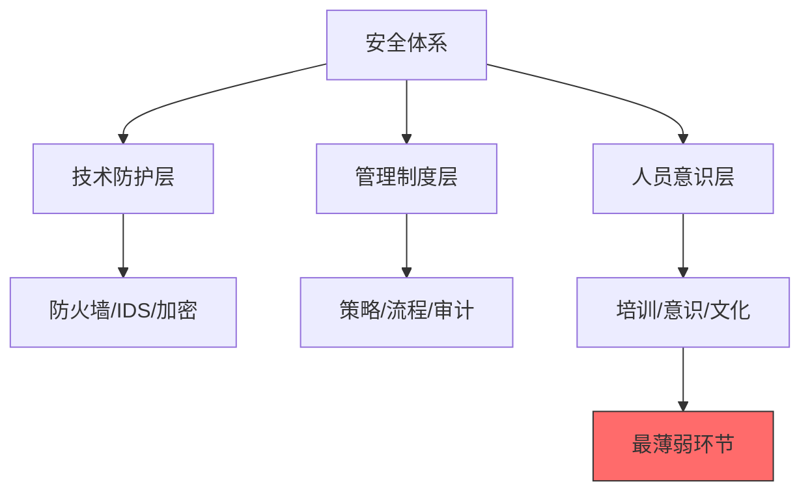
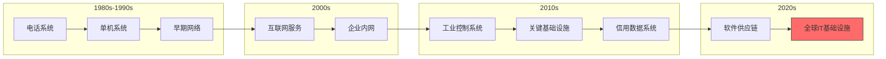
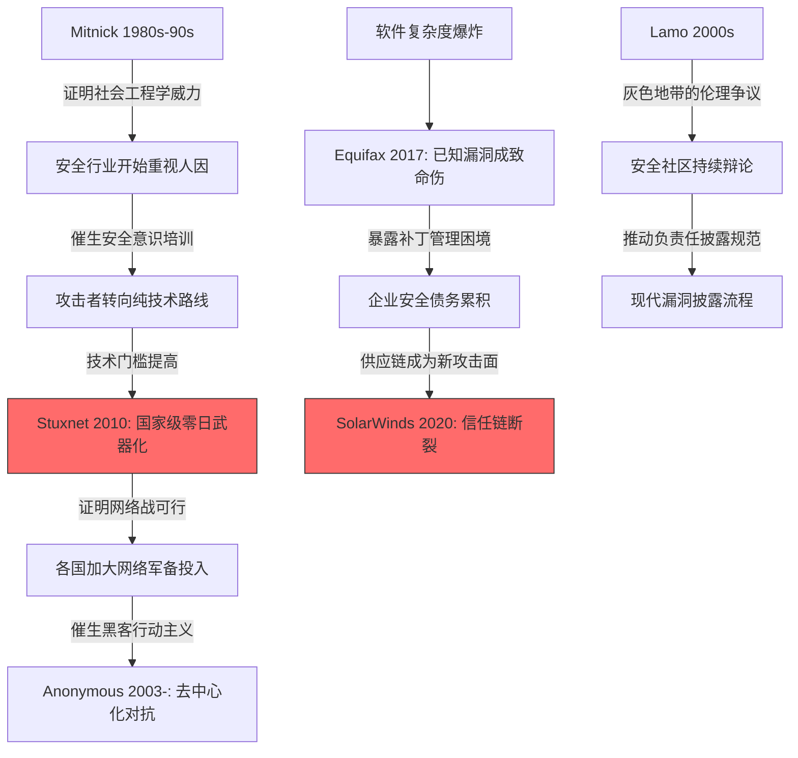

## 本节小结：从个人传奇到国家武器——六大案例的深度复盘

前六个案例横跨了黑客文化三十年的演化历程。从Kevin Mitnick的社会工程学把戏到SolarWinds的国家级供应链攻击，每一个案例都不是孤立的事件，而是黑客文化演化链条上的关键节点。本节将从多个维度对这些案例进行系统性复盘，提炼出贯穿其中的规律、教训和思维框架。

### 案例全景回顾

在进入深度分析之前，先用一张表回顾六个案例的核心要素：

| 案例 | 时间 | 类型 | 核心手法 | 影响规模 | 关键词 |
|------|------|------|----------|----------|--------|
| Kevin Mitnick | 1980s-1995 | 个人黑客 | 社会工程学 + 技术入侵 | 企业级 | 人性弱点、救赎 |
| Adrian Lamo | 2000s | 个人黑客 | 网络入侵 + 告密 | 国家级（间接） | 道德困境、灰色地带 |
| Stuxnet | 2010 | 国家级网络武器 | 零日漏洞 + PLC攻击 | 国家级（物理破坏） | 网络战争、跨域攻击 |
| Anonymous | 2003-至今 | 去中心化集体 | DDoS + 数据泄露 + 入侵 | 全球级 | 去中心化、黑客行动主义 |
| Equifax | 2017 | 企业安全事故 | 已知漏洞利用 | 1.47亿人 | 补丁管理、安全债务 |
| SolarWinds | 2020 | 供应链攻击 | 供应链投毒 | 18000+组织 | 信任滥用、供应链安全 |

### 五大跨案例主题

这六个案例看似各不相同，但深入分析后可以提炼出五个贯穿始终的核心主题。

#### 主题一：人的因素始终是安全链最薄弱的环节

Mitnick的成功不在于他的技术有多高超，而在于他深刻理解人性的弱点。他通过冒充IT部门员工、利用人们的信任和服从心理，绕过了当时最先进的技术防护。这个教训在三十年后的今天依然成立——Equifax事件中，一个已知漏洞之所以未被修补，根源在于组织内部的安全优先级排序出了问题；SolarWinds事件中，攻击者之所以能潜伏数月，部分原因是安全团队对内部软件更新的信任惯性。

**关键洞察**：技术防护的上限取决于操作它的人。无论防火墙多么先进、加密算法多么强大，一个心怀不满的员工、一个疏忽大意的管理员、或者一个被社工欺骗的技术支持人员，都可能成为整个安全体系的突破口。



**从案例中提取的人因失败模式**：

| 失败模式 | 对应案例 | 具体表现 | 防御策略 |
|----------|----------|----------|----------|
| 社会工程学欺骗 | Mitnick | 冒充内部人员获取权限 | 安全意识培训 + 身份验证流程 |
| 安全优先级错位 | Equifax | 已知漏洞未及时修补 | 自动化补丁管理 + SLA约束 |
| 信任惯性 | SolarWinds | 对内部更新不加验证 | 零信任架构 + 代码签名验证 |
| 道德判断失误 | Lamo | 告密行为引发伦理争议 | 明确的举报渠道和伦理准则 |
| 组织协调失败 | Equifax | 安全团队与运维脱节 | DevSecOps文化 + 跨部门协作 |

#### 主题二：攻击面随技术演化不断扩大

将六个案例按时间线排列，可以清晰地看到攻击面的演化趋势：



Mitnick时代，攻击面是电话线和单台计算机；Stuxnet时代，攻击面扩展到了物理隔离的工业控制系统；SolarWinds时代，攻击面已经延伸到整个软件供应链——数万个组织通过同一个软件供应商被一网打尽。

**攻击面演化的三个规律**：

1. **从物理到虚拟**：早期黑客需要物理接触目标（Mitnick的电话飞客），后来只需网络连接，再后来甚至不需要直接连接目标（供应链攻击通过第三方迂回渗透）
2. **从单一到生态**：攻击目标从单台机器扩展到整个供应链生态系统，一次入侵可以影响数万个下游组织
3. **从信息到物理**：Stuxnet证明了网络攻击可以对物理世界造成实质性破坏，打破了"网络攻击只影响数据"的幻觉

#### 主题三：道德边界是模糊的、流动的

六个案例中最引人深思的，是黑客行为的道德边界问题。

**道德光谱分析**：

```text
完全正当 ←————————————————————→ 完全不正当
  |          |          |          |          |
 白帽      灰帽       黑帽      犯罪      恐怖主义
 渗透测试  漏洞披露   未授权入侵 数据窃取   关键设施破坏
          (Lamo)    (Mitnick)  (Equifax攻击者) (假设场景)
                                    |
                               Anonymous
                              (取决于立场)
```

Mitnick的故事展示了**个人救赎的可能性**——从FBI通缉犯到受人尊敬的安全顾问，技术能力可以被引导到合法的方向。Lamo的故事则展示了**道德判断的复杂性**——告发Chelsea Manning的行为，支持者认为是保护国家安全，反对者认为是背叛信任。Anonymous的案例更是将这种模糊性推向极致——用非法手段追求社会正义，到底是英雄还是罪犯？

**没有简单答案，但有思考框架**：

- **意图评估**：行为的目的是破坏还是建设？是谋私利还是追求公益？
- **后果评估**：行为造成了什么影响？受益者和受害者分别是谁？
- **比例原则**：使用手段的强度与所追求目标的价值是否成比例？
- **替代方案**：是否可以通过合法途径达到同样的目的？

#### 主题四：安全是一个持续过程，不是一个终态

Equifax和SolarWinds事件共同揭示了一个残酷的现实：**安全不是一次性的工程，而是永无止境的运营**。

Equifax的悲剧根源不在于漏洞本身——CVE-2017-5638的补丁在攻击发生前两个月就已发布。悲剧在于组织没有建立有效的漏洞修补流程。这不是技术问题，是管理问题。

SolarWinds的教训更加深刻：即使你自己的系统固若金汤，你的供应商可能就是那个薄弱环节。安全边界已经从"自己的围墙"扩展到了"整个供应链"。

**安全成熟度的五个层级**：

| 层级 | 特征 | 对应案例的教训 |
|------|------|----------------|
| L1 - 无意识 | 没有安全意识和措施 | Equifax的补丁管理缺失 |
| L2 - 被动响应 | 出了事才处理 | Equifax发现入侵延迟76天 |
| L3 - 主动防御 | 有策略、有流程、有监控 | 基本的安全运营中心（SOC） |
| L4 - 持续改进 | 从事件中学习，不断优化 | 从SolarWinds学到的供应链审计 |
| L5 - 预测防御 | 利用威胁情报预判攻击 | Stuxnet级别的国家级防御体系 |

#### 主题五：技术双刃剑——同样的能力，不同的用途

| 技术能力 | 白帽用途 | 黑帽用途 | 案例对照 |
|----------|----------|----------|----------|
| 社会工程学 | 安全意识培训 | 欺骗获取权限 | Mitnick：从攻击到咨询 |
| 漏洞发现 | 负责任披露 | 武器化利用 | Stuxnet：零日漏洞的国家级武器化 |
| 网络渗透 | 渗透测试 | 未授权入侵 | Lamo：发现漏洞但方式越界 |
| DDoS能力 | 压力测试 | 服务瘫痪 | Anonymous：政治抗议工具 |
| 供应链访问 | 软件分发 | 投毒攻击 | SolarWinds：信任通道变攻击通道 |

### 案例间的因果链条

这六个案例不是随机选取的，它们之间存在着深层的因果和演化关系：



### 对安全从业者的核心启示

#### 启示一：建立"假设已被入侵"的思维模式

传统安全思维是"防止入侵"，但SolarWinds和Equifax的案例证明，这种思维存在根本缺陷。现代安全思维应该是：

- **假设边界已被突破**：不依赖外围防御，而是在内部建立多层检测
- **假设内部存在威胁**：零信任架构，对所有访问进行验证
- **假设软件已被篡改**：代码签名、完整性验证、行为监控

#### 启示二：安全投资的优先级应该是"人 > 流程 > 技术"

| 投资方向 | ROI | 案例佐证 |
|----------|-----|----------|
| 安全意识培训 | 最高 | Mitnick案例：社工攻击的唯一防线 |
| 流程和制度 | 高 | Equifax：补丁管理流程缺失导致灾难 |
| 技术工具 | 中 | SolarWinds：再好的工具也检测不到供应链投毒 |
| 应急响应 | 保险 | 所有案例：快速响应可以大幅减少损失 |

#### 启示三：构建安全文化而非安全合规

Equifax可能在纸面上满足了各种合规要求，但依然遭遇了灾难性的数据泄露。合规是底线，不是目标。真正的安全文化意味着：

- 每个员工都理解自己是安全链的一环
- 安全团队与业务团队协作而非对立
- 漏洞报告被视为改进机会而非追责依据
- 安全投入被视为业务保障而非成本中心

#### 启示四：关注演化趋势而非孤立事件

从六个案例的时间线可以提取出清晰的趋势信号：

1. **攻击规模化**：从个人行为到国家级行动到供应链级影响
2. **攻击自动化**：从手工入侵到自动化漏洞利用到AI辅助攻击
3. **目标关键化**：从普通企业到金融机构到关键基础设施
4. **后果物理化**：从数据泄露到服务中断到物理设施损坏

这些趋势指向一个结论：网络安全正在从"信息技术问题"演变为"国家安全问题"和"公共安全问题"。

### 进入下一部分的过渡

以上六个案例主要展示了黑客文化中**个人行为者、集体行动者和企业受害者**的面貌。接下来的案例将进入更加严峻的领域：

- **Log4Shell**（2021）：一个开源组件的漏洞如何影响全球互联网基础设施
- **Colonial Pipeline**（2021）：勒索软件如何瘫痪一个国家的关键基础设施
- **供应链攻击演化**：从SolarWinds到Log4j，供应链威胁如何不断升级
- **AI时代的挑战**：人工智能如何从根本上改变攻防格局

这些后续案例将进一步验证本节提炼的五大主题，并揭示新的维度——当黑客活动从"人与系统的对抗"演变为"生态系统与生态系统的对抗"时，我们的思维框架和防御策略也需要根本性的升级。
