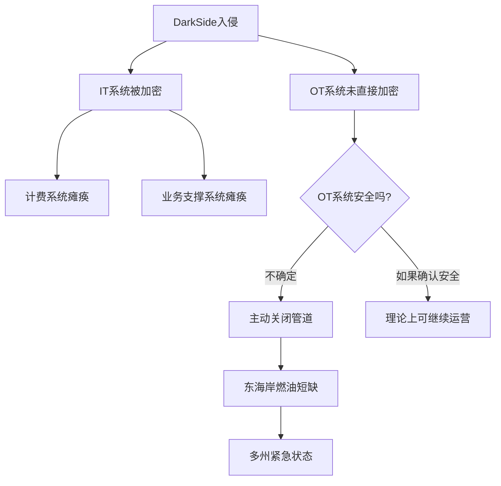

## 3.8 Colonial Pipeline勒索攻击（2021年）

### 3.8.1 事件概述

2021年5月7日，美国最大的燃油管道运营商Colonial Pipeline遭到DarkSide勒索软件组织的攻击。这次事件是美国历史上对关键基础设施最严重的网络攻击之一，直接导致了东海岸长达5500英里的输油管道停运近一周，引发大规模燃油恐慌和多州紧急状态。

Colonial Pipeline运营着美国东海岸约45%的燃油供应管道，从墨西哥湾沿岸的炼油厂一路延伸到纽约港，日均输送超过1亿加仑的汽油、柴油、航空燃油和取暖油。这条管道为超过5000万美国人提供能源服务，其停运的影响远超一次普通的网络安全事件——它直接触及了国家能源安全的命脉。

#### 事件时间线

| 日期 | 事件 |
|------|------|
| 2021年5月6日 | DarkSide成员通过遗留VPN账户入侵Colonial Pipeline内网 |
| 2021年5月7日凌晨 | 勒索软件开始加密IT系统，公司发现异常 |
| 2021年5月7日上午 | Colonial Pipeline主动关闭全线管道运营作为预防措施 |
| 2021年5月7日晚 | 公司向FBI报告事件，开始与执法部门合作 |
| 2021年5月8日 | 公司聘请网络安全公司Mandiant进行事件响应 |
| 2021年5月8日 | 白宫国土安全顾问Elizabeth Sherwood-Randall召集跨部门会议 |
| 2021年5月9日 | 美国交通部发布紧急运输令，允许公路运输燃油以缓解短缺 |
| 2021年5月9日 | Colonial Pipeline支付约75比特币（当时约440万美元）赎金 |
| 2021年5月10日 | 佐治亚州、佛罗里达州、弗吉尼亚州等多州宣布进入紧急状态 |
| 2021年5月12日 | 管道部分恢复运营 |
| 2021年5月13日 | DarkSide宣布关闭，其基础设施被执法部门查封 |
| 2021年5月14日 | 管道全线恢复运营 |
| 2021年6月7日 | 美国司法部宣布成功追回约63.7比特币（约230万美元） |

### 3.8.2 DarkSide组织背景

DarkSide是一个活跃于2020年8月至2021年5月的勒索软件即服务（RaaS）组织，被认为是FIN7（又名Carbanak）网络犯罪集团的衍生或关联组织。安全研究界普遍认为其核心成员分布在俄罗斯和东欧地区。

#### 组织架构与商业模式

DarkSide采用的是典型的RaaS（Ransomware as a Service）运营模式：

1. **核心开发团队**：负责勒索软件的开发、维护和加密算法优化
2. **附属攻击者（Affiliates）**：招募有经验的渗透测试人员执行实际入侵
3. **分成模式**：赎金通常按70/30或75/25的比例分配，附属方拿大头
4. **技术支持**：为受害者提供"客服"，处理赎金支付和解密器交付

DarkSide在暗网论坛上将自己包装为"专业"组织，声称只针对"能支付赎金"的大企业，并宣称将部分赎金捐赠给慈善机构。这种"罗宾汉"式的自我包装在勒索软件社区中并不罕见，但实质上并未改变其犯罪本质。

#### 技术能力

DarkSide勒索软件具备以下技术特征：

- 使用Salsa20和RSA-1024混合加密方案，加密速度快且难以破解
- 支持Windows和Linux双平台，能够加密VMware ESXi虚拟机
- 具备反检测能力：自动检测并停止杀毒软件进程
- 支持横向移动：能够在网络内自动扩散到域控制器和文件服务器
- 采用双重勒索策略：在加密前先窃取数据，威胁公开以施压

### 3.8.3 攻击技术深度分析

#### 初始访问（Initial Access）

攻击的切入点极其简单——一个**遗留的VPN账户**。该账户属于一名前员工，在员工离职后未被禁用。更致命的是：

1. 该VPN账户**未启用多因素认证（MFA）**
2. 该账户的密码出现在此前暗网泄露的凭据数据库中
3. 该VPN网关未部署最新的安全补丁

```text
攻击链简图：

暗网泄露数据库 → 获取VPN凭据 → VPN登录（无MFA） → 内网渗透 → 
域控制器 → 横向移动 → 数据窃取 → 勒索软件部署 → 加密IT系统
```

#### 持久化与横向移动

进入内网后，攻击者展现了成熟的APT（高级持续性威胁）手法：

1. **凭据窃取**：使用Mimikatz等工具从内存中提取域管理员凭据
2. **域控制器接管**：利用窃取的凭据访问Active Directory域控制器
3. **网络侦察**：使用BloodHound等工具绘制域内资产和权限关系
4. **数据外泄**：在部署勒索软件之前，先使用rclone等工具将约100GB敏感数据上传到云存储
5. **勒索软件部署**：通过组策略对象（GPO）在IT网络内批量推送加密程序

#### 关键技术指标（IOCs）

```text
DarkSide相关IOC（部分）：

文件哈希（SHA-256）：
- 17134B4983C9ABED0A18C0B8D711F64B80E9B5C4C0B2D92E5D0E5C5F0E9D1C2A
（示例格式，实际IOC请参考Mandiant官方报告）

文件路径：
- C:\ProgramData\darkside.dll
- C:\Windows\Temp\darkside_readme.txt

注册表项：
- HKLM\SOFTWARE\Microsoft\Windows\CurrentVersion\Run\darkside

网络特征：
- C2通信使用Tor隐藏服务
- 数据外泄目标：mega.nz, anonymfiles.com
```

#### IT/OT隔离的关键作用

值得注意的是，Colonial Pipeline的运营技术（OT）系统——即实际监控和控制管道物理操作的SCADA系统——并未被勒索软件直接加密。公司的IT和OT网络之间存在物理隔离（Air Gap）。

然而，公司选择主动关闭管道运营的原因在于：

1. **计费系统被加密**：IT系统中包含计量和计费模块，关闭管道后无法准确计费
2. **不确定性风险**：无法100%确认OT系统未受影响，安全起见选择全面停运
3. **管理决策**：在缺乏充分信息的情况下，宁可过度反应也不能冒险

这一决策在事后引发了广泛讨论：如果OT系统确实未受影响，是否有必要全面停运？这个两难困境体现了网络安全风险管理中的核心矛盾——**安全与业务连续性的平衡**。



### 3.8.4 赎金支付与追回

#### 支付决策过程

Colonial Pipeline的赎金支付决定是在公司CEO Joseph Blount的直接授权下做出的。这一决定充满了争议：

**支持支付的理由：**
- 管道停运每天造成数亿美元的经济损失
- 数千万美国人面临燃油短缺
- 无法确定何时能通过其他方式恢复系统
- 解密密钥可以加速恢复进程

**反对支付的理由：**
- 支付赎金会激励更多勒索攻击
- FBI一贯建议不支付赎金
- 解密器速度极慢，实际恢复效果有限
- 资金将流入犯罪组织，可能资助更多犯罪活动

最终，Colonial Pipeline在5月9日支付了约75比特币（约440万美元）。有趣的是，公司实际上并未完全依赖解密器——Mandiant团队帮助从备份系统和手动恢复过程中逐步重建了IT环境。

#### 司法部追回行动

2021年6月7日，美国司法部宣布成功追回了约63.7比特币（约230万美元）。追回的技术过程如下：

1. FBI获得了存放赎金的比特币钱包的私钥（具体获取方式未公开披露）
2. 通过区块链分析追踪了资金流向
3. 利用比特币交易的公开账本特性定位了资金存储地址
4. 通过法院授权令获取了私钥并执行了资金转移

这一事件标志着美国执法部门在加密货币追踪能力上的重大突破，也向犯罪组织传递了"支付赎金不等于匿名"的信号。

### 3.8.5 事件响应与恢复

#### Mandiant事件响应框架

Mandiant团队采用了标准的事件响应流程：

```text
阶段1：遏制（Containment）
  ├── 隔离受感染系统
  ├── 关闭VPN等远程访问通道
  ├── 重置所有域管理员凭据
  └── 切断攻击者的C2通信

阶段2：调查取证（Investigation）
  ├── 日志分析：VPN登录记录、域控日志、网络流量
  ├── 恶意软件逆向分析：勒索软件样本
  ├── 取证镜像：关键服务器磁盘镜像
  └── 攻击路径重建：还原完整攻击链

阶段3：清除（Eradication）
  ├── 移除所有恶意软件和后门
  ├── 修补被利用的漏洞
  ├── 重建受损的域控制器
  └── 验证系统完整性

阶段4：恢复（Recovery）
  ├── 从备份恢复数据
  ├── 使用解密器恢复加密文件（速度极慢）
  ├── 分阶段恢复系统
  └── 持续监控是否有攻击者残留

阶段5：总结改进（Lessons Learned）
  ├── 安全架构评估
  ├── 事件响应流程优化
  ├── 安全控制增强
  └── 员工安全意识培训
```

#### 恢复过程中的挑战

解密器的实际效果令人失望。DarkSide提供的解密工具运行速度极慢——在某些系统上，解密一个服务器需要数天时间。相比之下，从备份恢复反而更快。这暴露了勒索软件"售后服务"的真相：犯罪组织提供的是最低限度的工具，并不真正关心受害者的恢复效率。

### 3.8.6 政策与监管影响

这次事件直接推动了美国网络安全政策的重大变革：

#### 行政命令14028（2021年5月12日）

拜登总统在事件发生仅5天后就签署了《改善国家网络安全》行政命令，核心措施包括：

1. **联邦政府网络安全现代化**：要求联邦机构部署MFA和加密
2. **软件供应链安全**：要求软件供应商提供软件物料清单（SBOM）
3. **事件响应改进**：要求IT服务提供商在发现入侵后及时报告联邦政府
4. **威胁信息共享**：消除阻碍政府与私营部门共享威胁情报的障碍
5. **零信任架构推进**：要求联邦机构制定零信任架构实施计划

#### TSA安全指令（2021年5月）

美国运输安全管理局（TSA）发布了针对管道运营商的首份网络安全强制性指令：

- 要求报告网络安全事件
- 要求指定网络安全协调员
- 要求进行网络安全漏洞评估

此前，管道行业的网络安全完全是自愿遵守的——这一事件彻底改变了这一现状。

#### 其他政策响应

```text
政策响应时间线：

2021年5月12日 → 行政命令14028（改善国家网络安全）
2021年5月28日 → TSA安全指令（管道网络安全）
2021年6月2日 → 司法部追回赎金
2021年7月28日 → 拜登与科技巨头会商网络安全
2021年8月25日 → NSA/CISA发布十大网络安全配置错误
2021年10月 → 美国召开国际反勒索软件峰会
```

### 3.8.7 防御教训与技术对策

#### 针对此次攻击的防御措施

| 攻击环节 | 防御措施 | 优先级 |
|----------|---------|--------|
| 遗留VPN账户 | 员工离职时立即禁用所有账户，定期审查VPN账户清单 | P0 |
| 无MFA的VPN | 强制所有远程访问启用多因素认证 | P0 |
| 暗网凭据泄露 | 订阅凭据泄露监控服务，定期重置关键密码 | P1 |
| 域管理员凭据窃取 | 实施特权访问管理（PAM），使用微软LAPS管理本地管理员密码 | P1 |
| 横向移动 | 网络微分段，限制SMB/RDP横向移动 | P1 |
| 数据外泄 | DLP（数据防泄漏）监控，监控大文件上传行为 | P2 |
| 勒索软件加密 | EDR部署，勒索软件行为检测，文件完整性监控 | P1 |
| 备份恢复 | 3-2-1备份策略，离线备份，定期恢复演练 | P0 |

#### 零信任架构在关键基础设施中的应用

此次事件加速了零信任架构在关键基础设施领域的推广：

```text
零信任核心原则在管道行业的应用：

1. 永不信任，始终验证
   - 所有访问请求必须经过身份验证和授权
   - 不依赖网络位置作为信任依据

2. 最小权限
   - 用户和系统只获得完成工作所需的最小权限
   - 定期审查和撤销不必要的权限

3. 微分段
   - 将IT和OT网络进一步细分为独立的安全区域
   - 限制横向移动的可能性

4. 持续监控
   - 实时监控所有网络活动
   - 使用行为分析检测异常
```

#### 事件响应能力建设

```text
关键基础设施运营商的事件响应准备清单：

□ 建立事件响应团队（内部+外部顾问合同）
□ 制定勒索软件专项响应预案
□ 定期进行桌面演练和红蓝对抗
□ 维护离线备份并定期测试恢复
□ 建立与FBI/CISA的联络通道
□ 准备法律和公关响应框架
□ 建立业务连续性计划（BCP）
□ 明确赎金支付的决策流程和审批权限
```

### 3.8.8 勒索软件经济学

Colonial Pipeline事件是理解勒索软件经济生态系统的经典案例：

#### RaaS生态系统

```text
DarkSide RaaS经济模型：

黑暗面核心团队（30%分成）
  ├── 开发和维护勒索软件
  ├── 运营支付基础设施
  ├── 管理暗网泄露网站
  └── 提供附属招募和培训

附属攻击者（70%分成）
  ├── 执行实际入侵
  ├── 横向移动和数据窃取
  ├── 部署勒索软件
  └── 与受害者谈判

典型赎金范围：
  ├── 小型企业：5万-50万美元
  ├── 中型企业：50万-500万美元
  └── 大型企业/关键基础设施：500万-5000万美元
```

#### 赎金支付的连锁效应

安全研究机构的数据显示：

- 支付赎金的组织中约有80%会遭到同一组织或关联组织的再次攻击
- 支付赎金后，平均恢复时间仍然需要数周
- 约有20%的组织在支付赎金后并未获得有效的解密密钥
- 赎金支付金额在2020-2021年间平均增长了171%

### 3.8.9 黑客伦理与社会反思

#### 关键基础设施：黑客伦理的红线

Colonial Pipeline事件迫使黑客社区重新审视关键基础设施攻击的伦理边界。在传统的黑客伦理中，"不造成伤害"（Do No Harm）是一条基本原则。然而，勒索软件攻击关键基础设施的行为远远突破了这条底线：

1. **间接伤害不可控**：虽然DarkSide声称只针对IT系统，但管道停运导致的燃油短缺影响了医院供电、应急车辆运行和普通民众的生活
2. **连锁反应不可预测**：燃油短缺引发恐慌性购买，加剧了供应危机
3. **社会契约的破坏**：关键基础设施是社会正常运行的基础，攻击它等同于攻击社会本身

#### "有原则的犯罪"的虚伪性

DarkSide在攻击后发布了一份声明：

> "我们是无政治立场的组织，我们的目标是赚钱，不是制造社会问题。从今天起，我们会对每个目标公司进行审查，避免对社会造成不可预见的后果。"

这份声明暴露了勒索软件组织自我美化的荒谬：

- 声称"只赚钱不害人"，但攻击关键基础设施的后果是客观存在的
- 承诺"审查目标"，但这只是在引发巨大社会反响后的公关策略
- 所谓"捐赠慈善机构"，从未有独立第三方验证
- DarkSide在关闭后，其成员并未停止犯罪活动，而是转移到了其他RaaS平台（如BlackMatter、BlackCat/ALPHV）

#### 防御者的责任

这次事件同样暴露了关键基础设施运营商在网络安全方面的严重失职：

- 一个前员工的VPN账户未被禁用——这是最基本的账户管理失误
- VPN未启用MFA——在2021年，对于关键基础设施运营商来说不可接受
- 暗网泄露的凭据未被监控——错失了主动发现风险的机会
- IT/OT隔离策略不完善——虽然存在物理隔离，但缺乏明确的应急预案

这些失误引发了一个核心问题：**当关键基础设施运营商未能履行基本的网络安全义务时，他们是否也应该承担部分责任？**

#### 政府与企业的博弈

事件还揭示了政府监管与企业自主之间的张力：

- 此前管道行业的网络安全完全是"自愿"的——行业游说团体反对强制性监管
- Colonial Pipeline的CEO在国会听证会上承认未设立专门的首席信息安全官（CISO）
- 支付赎金的决定虽然获得了FBI的"不反对"态度，但与政府"不支付赎金"的公开立场存在矛盾

### 3.8.10 MITRE ATT&CK映射

以下将此次攻击映射到MITRE ATT&CK框架，帮助安全团队理解攻击手法并建立对应的防御措施：

| 攻击阶段 | ATT&CK技术 | 技术ID | 具体手法 |
|----------|-----------|--------|---------|
| 初始访问 | 有效账户 | T1078 | 使用泄露的VPN凭据 |
| 执行 | 命令和脚本解释器 | T1059 | PowerShell执行恶意脚本 |
| 持久化 | 启动或登录自动执行 | T1547 | 注册表Run键 |
| 权限提升 | 有效账户 | T1078 | 域管理员凭据窃取 |
| 防御规避 | 禁用或修改工具 | T1562 | 停止安全软件进程 |
| 凭据访问 | OS凭据转储 | T1003 | Mimikatz提取凭据 |
| 发现 | 远程系统发现 | T1018 | 网络资产扫描 |
| 横向移动 | 远程服务 | T1021 | SMB/Windows管理共享 |
| 收集 | 数据暂存 | T1074 | 本地收集待外泄数据 |
| 渗出 | 云存储 | T1567 | 上传至mega.nz |
| 影响 | 数据加密 | T1486 | DarkSide勒索软件加密 |

### 3.8.11 同类事件对比

将Colonial Pipeline与其他重大勒索软件事件对比，可以更全面理解勒索软件威胁的演变：

| 特征 | Colonial Pipeline (2021) | JBS Foods (2021) | Kaseya (2021) | MOVEit (2023) |
|------|------------------------|-------------------|---------------|---------------|
| 攻击者 | DarkSide | REvil | REvil | Cl0p |
| 攻击向量 | 遗留VPN账户 | 未知初始访问 | 供应链（VSA） | 零日漏洞 |
| 影响范围 | 美国东海岸燃油供应 | 全球肉类供应 | 1500+企业 | 2500+组织 |
| 赎金金额 | 440万美元 | 1100万美元 | 7000万美元（要求） | 约1亿美元（估计） |
| 支付情况 | 支付，部分追回 | 支付 | 未支付 | 部分支付 |
| 政策影响 | 行政命令14028 | 反勒索软件峰会 | 行政命令14028后续 | SEC披露规则 |

### 3.8.12 当前态势与未来展望

#### 勒索软件威胁的演变（2021-2026）

Colonial Pipeline事件后，勒索软件生态系统经历了显著变化：

1. **RaaS平台碎片化**：DarkSide关闭后，其成员分散到BlackMatter、BlackCat/ALPHV、LockBit等多个平台
2. **执法打击加强**：多国联合行动（如Operation Cronos打击LockBit）展示了更强的国际合作能力
3. **支付趋势变化**：越来越多的组织选择不支付赎金，保险公司的赎金覆盖政策也在收紧
4. **技术演进**：勒索软件开始采用更复杂的加密方案、更快的加密速度和更隐蔽的部署方式
5. **双重/三重勒索常态化**：单纯加密已不够，数据泄露威胁和DDoS攻击成为标配

#### 关键基础设施保护的新范式

此事件推动了关键基础设施网络安全保护范式的转变：

```text
旧范式（自愿合规）：
  ├── 行业自律为主
  ├── 网络安全是IT部门的事
  ├── 安全投资被视为成本
  └── 事件响应靠经验

新范式（强制监管+主动防御）：
  ├── 强制性网络安全标准
  ├── 网络安全是董事会层面的议题
  ├── 安全投资是业务连续性的保障
  ├── 事件响应有预案、有演练、有外部支持
  └── 政府与私营部门深度协作
```

### 3.8.13 本节小结

Colonial Pipeline勒索攻击事件的深远影响远超一次网络安全事件的范畴。它揭示了几个关键现实：

1. **关键基础设施的脆弱性**：一个遗留的VPN账户就能瘫痪半个美国的燃油供应，暴露了关键基础设施网络安全防护的系统性薄弱
2. **勒索软件的产业化**：RaaS模式将网络犯罪的门槛大幅降低，形成了完整的产业链和分工体系
3. **安全决策的复杂性**：是否支付赎金、是否关闭运营——这些都不是简单的技术问题，而是涉及经济、社会、政治多维度的风险决策
4. **政策变革的催化剂**：一次攻击事件直接推动了美国网络安全政策的全面升级，其政策遗产延续至今
5. **黑客伦理的边界**：当黑客行为从数字空间溢出到物理世界，造成真实的社会混乱时，"无害"的黑客伦理面临根本性挑战

对于网络安全从业者而言，这个案例的价值不仅在于技术层面的攻防分析，更在于理解网络安全事件如何在社会层面产生连锁反应，以及如何在安全与业务、预防与响应、自律与监管之间找到平衡点。

> **核心启示**：网络安全不是技术问题，而是生存问题。当你的系统支撑着数千万人的日常生活时，安全就不再是可选项，而是存在前提。
