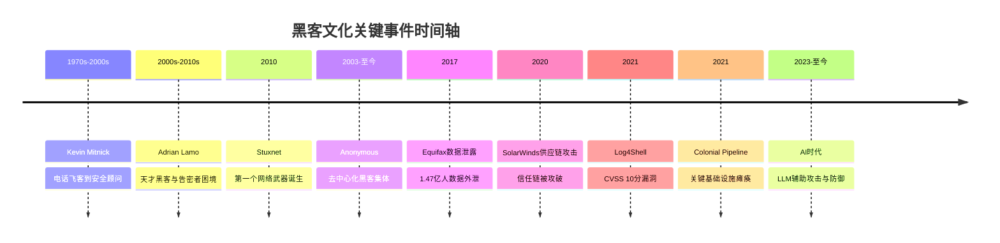
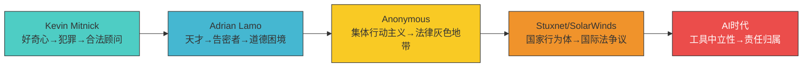
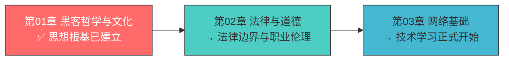

## 本章总结：从历史中汲取力量，向未来宣示责任

本章通过十个真实案例，完整呈现了黑客文化从个人传奇到国家级网络武器、从去中心化集体行动到AI时代新挑战的全貌。这些案例不是孤立的故事，而是一条环环相扣的因果链——每一次重大安全事件都在前人的基础上演化，每一种攻击手法都在防御方的应对中迭代升级。本节将从全局视角重新审视这些案例，提炼贯穿其中的核心规律，并为后续章节的学习建立思维框架。

---

### 一、案例全景回顾

在进入深度分析之前，先回顾本章覆盖的所有案例及其核心定位：

| 案例 | 时间 | 类型 | 核心关键词 | 在黑客文化中的坐标 |
|------|------|------|-----------|-------------------|
| Kevin Mitnick | 1970s-2000s | 个人传奇 | 社会工程学、电话飞客、从违法到合法 | 黑客个人命运与法律边界的经典叙事 |
| Adrian Lamo | 2000s-2010s | 个人传奇 | 无家可归黑客、告密者、道德困境 | 黑客伦理复杂性的极端案例 |
| Stuxnet | 2010 | 网络武器 | 国家级攻击、工业控制系统、物理破坏 | 网络战从理论变为现实的分水岭 |
| Anonymous | 2003-至今 | 黑客组织 | 去中心化、黑客行动主义、DDoS | 集体行动主义与黑客文化的交汇 |
| Equifax | 2017 | 数据泄露 | 已知漏洞未修补、1.47亿人数据 | 补丁管理失败的代价 |
| SolarWinds | 2020 | 供应链攻击 | 信任链、长期潜伏、APT | 供应链安全威胁的范式转变 |
| Log4Shell | 2021 | 零日漏洞 | 开源组件、JNDI注入、CVSS 10 | 互联网基础设施脆弱性的极端体现 |
| Colonial Pipeline | 2021 | 勒索攻击 | 关键基础设施、RaaS、440万美元赎金 | 勒索经济与国家安全的交汇点 |
| 供应链攻击演化 | 2020-2023 | 趋势分析 | SBOM、零信任、行为监控 | 攻防博弈的持续升级 |
| AI时代新挑战 | 2023-至今 | 前沿趋势 | LLM辅助攻击、深度伪造、对抗性ML | 黑客文化的下一个转折点 |

---

### 二、贯穿所有案例的五条主线

回顾所有案例，可以提炼出五条贯穿始终的主线。理解这些主线，比记住任何一个单独的案例都更有价值——因为案例会过时，但规律不会。

#### 主线一：攻击面的持续扩张

从Kevin Mitnick时代攻击电话系统和单台计算机，到Stuxnet攻击工业控制系统，到SolarWinds攻击整个软件供应链，到Log4Shell影响全球数百万Java应用——攻击面在持续且加速地扩张。

这种扩张有三个驱动因素：

1. **数字化程度加深**：越来越多的物理世界设备接入网络，从工厂离心机到燃油管道，每一个新连接点都是新的攻击面
2. **软件供应链的复杂化**：现代软件依赖数千个第三方组件，任何一个组件的漏洞都可能影响所有下游用户。Log4Shell就是一个日志库中的一行代码引发的全球性危机
3. **信任关系的网络化**：SolarWinds事件证明，攻击者不需要攻击你的系统，只需要攻击你信任的供应商，就能通过信任链间接入侵你

对安全从业者的启示：你的防御范围不仅是你自己的系统，还包括你依赖的所有供应商、开源组件和第三方服务。**攻击面管理（Attack Surface Management）**不是一个可选的附加能力，而是现代安全体系的基础能力。

#### 主线二：人的因素始终是最大变量

无论技术如何演进，人的因素始终是安全链条中最薄弱的环节：

- **Kevin Mitnick**：他最强大的武器不是代码，而是社会工程学——通过欺骗人类获取信任和信息。他在自传中明确写道："人为因素才是安全链中最薄弱的环节"
- **Adrian Lamo**：他的天才技术能力最终被道德困境和心理健康问题所左右，证明技术能力无法替代健全的判断力
- **Equifax**：漏洞补丁早已发布两个月，但人类的组织惰性和流程缺陷导致补丁未被及时应用
- **Colonial Pipeline**：攻击入口是一个遗留的VPN账户，没有启用多因素认证——一个基本的安全卫生问题

这不是说技术不重要，而是说：**技术防御必须与人员培训、流程优化、文化建设同步推进**。一个安全意识薄弱的组织，即使部署了最先进的安全工具，也迟早会被攻破。

#### 主线三：攻防博弈的不对称性

所有案例都揭示了一个残酷的事实：**防御方必须堵住所有漏洞，攻击方只需要找到一个突破口**。这种不对称性在三个层面体现得淋漓尽致：

| 维度 | 攻击方优势 | 防御方困境 |
|------|----------|----------|
| 时间 | 可以选择最佳攻击时机 | 必须7×24小时持续防御 |
| 知识 | 只需要了解一个漏洞 | 必须了解所有可能的攻击向量 |
| 成本 | 一次成功即可回本 | 需要持续投入且无法"完成" |
| 检测 | 高级攻击可潜伏数月 | 误报消耗大量分析资源 |
| 归因 | 匿名化手段丰富 | 归因困难导致追责困难 |

SolarWinds攻击者在系统中潜伏了至少9个月才被发现；Colonial Pipeline的攻击者在部署勒索软件之前已经完成了完整的侦察和横向移动。防御方的反应时间远远滞后于攻击方的行动速度。

应对这种不对称性的核心策略是**假设已被入侵（Assume Breach）**的思维模式——不是追求"不被攻破"，而是追求"被攻破后能快速检测、限制损害和恢复"。

#### 主线四：从技术问题到地缘政治问题

案例的时间线清晰地展示了一个趋势：网络安全正在从纯粹的技术领域扩展为地缘政治的核心议题。

- **Stuxnet**（2010）：首次将网络攻击作为国家军事行动的一部分，直接影响了伊朗核计划的进度，改变了国际关系的博弈方式
- **Anonymous**：黑客行动主义模糊了政治抗议与网络犯罪的边界，将黑客文化与社会运动深度绑定
- **SolarWinds**（2020）：被归因为俄罗斯情报机构的行动，引发了美俄之间严重的外交危机
- **Colonial Pipeline**（2021）：一次勒索攻击导致美国东海岸燃油供应中断，多个州宣布进入紧急状态，迫使总统拜登签署网络安全行政命令

对安全从业者的启示：理解地缘政治背景不再是"额外知识"，而是做好安全工作的必备能力。你需要知道你的组织可能面临哪些国家级威胁行为体，它们的动机是什么，它们的TTP（战术、技术和程序）有什么特征。

#### 主线五：黑客伦理的持续演化

从Kevin Mitnick时代"技术好奇心驱动的越界"，到Anonymous的"以攻击手段追求社会正义"，到AI时代"自动化攻击工具的伦理边界"——黑客伦理的讨论从未停止，且在不断演化。

案例中的伦理光谱：

这条演化线的核心张力始终是：**技术能力与道德责任之间的平衡**。能力越大，责任越大——这句话在网络安全领域不是陈词滥调，而是每一个安全从业者每天都在面对的现实选择。

---

### 三、案例背后的攻防技术演化脉络

抛开文化层面的讨论，从纯技术角度看，这些案例也清晰地勾勒出了攻防技术的演化路径：

#### 攻击技术的四代演化

| 代际 | 代表案例 | 核心手法 | 特征 |
|------|---------|---------|------|
| 第一代：社会工程学 | Kevin Mitnick | 电话欺骗、身份伪装、物理入侵 | 依赖人的弱点，技术门槛低 |
| 第二代：漏洞利用 | Equifax、Log4Shell | 利用已知/未知漏洞获取访问权限 | 依赖软件缺陷，自动化程度高 |
| 第三代：供应链攻击 | SolarWinds、Codecov | 入侵信任链上游，污染软件分发渠道 | 滥用信任关系，检测极其困难 |
| 第四代：AI辅助攻击 | 深度伪造、自动化钓鱼 | LLM生成钓鱼内容、自动化漏洞挖掘 | 攻击门槛大幅降低，规模空前 |

#### 防御策略的对应演化

| 代际 | 防御重点 | 代表技术/方法 |
|------|---------|-------------|
| 第一代 | 人员安全意识培训 | 社会工程学演练、安全意识课程 |
| 第二代 | 漏洞管理和补丁 | 漏洞扫描、补丁管理系统、WAF |
| 第三代 | 供应链安全和零信任 | SBOM、签名验证、微隔离、零信任架构 |
| 第四代 | AI驱动的安全运营 | AI威胁检测、SOAR、行为分析、对抗性测试 |

每一代防御策略都不是替代前一代，而是在前一代基础上叠加。一个成熟的安全体系需要同时覆盖所有四个层面。

---

### 四、从案例中提炼的安全从业者能力模型

基于本章所有案例的分析，可以构建一个安全从业者应当具备的能力模型。这个模型不是凭空设计的，而是从真实事件中反向推导出来的——每一个能力项都对应着一个或多个案例中防御方缺失的能力。

```mermaid
graph TD
    A[安全从业者能力模型] --> B[技术能力]
    A --> C[思维能力]
    A --> D[伦理能力]
    A --> E[协作能力]

    B --> B1["漏洞分析与利用<br>（Equifax、Log4Shell）"]
    B --> B2["威胁检测与响应<br>（SolarWinds、Colonial Pipeline）"]
    B --> B3["安全架构设计<br>（零信任、供应链安全）"]
    B --> B4["AI安全工具运用<br>（AI时代新挑战）"]

    C --> C1["攻击者视角思维<br>（Mitnick、Stuxnet）"]
    C --> C2["系统性风险评估<br>（供应链攻击演化）"]
    C --> C3["第一性原理分析<br>（Log4Shell技术原理）"]
    C --> C4["威胁建模能力<br>（STRIDE、攻击树）"]

    D --> D1["职业道德判断<br>（Adrian Lamo困境）"]
    D --> D2["负责任披露<br>（漏洞披露伦理）"]
    D --> D3["法律边界意识<br>（CFAA、各国网络安全法）"]
    D --> D4["社会责任感<br>（Anonymous行动主义反思）"]

    E --> E1["跨团队协作<br>（安全不是一个人的事）"]
    E --> E2["社区参与<br>（开源安全、CTF、会议）"]
    E --> E3["情报共享<br>（威胁情报社区）"]
    E --> E4["非技术沟通<br>（向管理层解释风险）"]

    style A fill:#ff6b6b,stroke:#333,color:#fff
    style B fill:#4ecdc4,stroke:#333
    style C fill:#45b7d1,stroke:#333
    style D fill:#f9ca24,stroke:#333
    style E fill:#6c5ce7,stroke:#333,color:#fff
```

#### 能力模型的优先级排序

对于不同阶段的从业者，能力培养的优先级不同：

**初学者（0-1年）**：先建立思维能力和伦理能力。本章的核心价值就在于此——在你碰触任何工具之前，先建立正确的思维方式和价值判断标准。技术能力可以通过后续章节系统学习，但思维和伦理的根基必须在起步阶段就打牢。

**中级从业者（1-3年）**：重点发展技术能力中的漏洞分析和威胁检测，同时开始培养协作能力中的社区参与和非技术沟通。这个阶段的关键是从"会用工具"升级到"理解原理"。

**高级从业者（3年以上）**：四个维度需要均衡发展。特别是伦理能力中的法律边界意识和社会责任感——当你拥有了强大的技术能力，如何正确使用这些能力就变成了最重要的问题。

---

### 五、关键教训清单

从所有案例中提炼出最重要的教训，按紧迫程度排序：

#### 立即行动

1. **补丁管理是生死线**：Equifax事件证明，已知漏洞两个月不修补就可能导致灾难。建立自动化补丁管理流程，对关键漏洞设定24-72小时的修复SLA
2. **多因素认证不是可选项**：Colonial Pipeline的攻击入口是一个没有MFA的VPN账户。对所有远程访问和特权账户强制启用MFA
3. **供应链可见性是基础能力**：你无法保护你看不见的东西。建立软件物料清单（SBOM），了解你的系统依赖了哪些第三方组件

#### 中期规划

4. **假设已被入侵的架构设计**：不要追求"不被攻破"的完美防线，而是设计"被攻破后能快速发现和限制损害"的弹性架构。微隔离、最小权限、日志审计、异常检测是核心能力
5. **安全意识培训必须持续进行**：Kevin Mitnick用社会工程学攻破了技术防线，说明人的因素永远是安全链条中最薄弱的环节。培训不是一次性的活动，而是持续的文化建设
6. **事件响应能力需要演练**：Colonial Pipeline的混乱应对暴露了事件响应能力的不足。定期进行桌面推演和实战演练，确保在真正的安全事件发生时能够有序应对

#### 长期战略

7. **关注AI对攻防双方的影响**：AI既是攻击者的武器，也是防御者的工具。提前布局AI安全能力，包括AI驱动的威胁检测、AI辅助的安全审计，以及针对AI模型本身的安全防护
8. **理解地缘政治背景**：网络安全已经从技术问题扩展为地缘政治问题。了解你所在行业和地区的威胁态势，关注国家级威胁行为体的活动
9. **投资社区和人才培养**：安全行业面临严重的人才短缺。通过参与开源安全项目、CTF竞赛、安全会议等方式，既提升自身能力，也为社区做出贡献

---

### 六、本章知识自测

在进入下一章之前，用以下问题检验你对本章内容的理解程度。每个问题都对应着本章的一个核心知识点：

**基础理解层**

1. 白帽黑客、黑帽黑客和灰帽黑客的核心区别是什么？法律地位有何不同？
2. 黑客文化从1960年代MIT到今天经历了哪五个世代？每个世代的标志性事件是什么？
3. Kevin Mitnick最强大的攻击手段是什么？为什么这种方法至今仍然有效？
4. Stuxnet为什么被称为"第一个网络武器"？它与普通恶意软件的本质区别是什么？

**深度分析层**

5. Equifax事件中，技术漏洞只是表象，更深层的组织和管理问题是什么？
6. SolarWinds供应链攻击为什么比传统攻击更难防御？信任模型需要如何重新设计？
7. Anonymous的去中心化组织结构有什么优势和劣势？这种模式对安全行业有什么启示？
8. Colonial Pipeline事件如何改变了美国政府对网络安全的态度？产生了哪些政策后果？

**综合应用层**

9. 如果你是一家企业的CISO，面对供应链攻击的威胁，你会优先部署哪些防御措施？如何说服管理层投入预算？
10. AI技术会如何改变黑客文化？请从攻击方和防御方两个角度分析，并讨论其中的伦理问题。

---

### 七、从本章到下一章的过渡

本章建立了黑客文化的思想根基——从定义、历史、伦理到实战案例的全景认知。你已经理解了：

- **黑客是什么**：不是一个标签，而是一种思维方式和文化传统
- **黑客做了什么**：从个人传奇到国家级行动，黑客行为的边界在不断扩展
- **为什么这些事重要**：每一个案例都在塑造今天的安全行业和法律框架

下一章《法律与道德》将在此基础上深入探讨：当技术能力遇上法律边界，安全从业者应该如何抉择？我们将系统梳理全球主要国家的网络安全法律体系，分析合法安全测试的边界在哪里，以及如何在技术探索中始终保持在法律和道德的安全区内。

> *"The world is full of fascinating problems waiting to be solved."*
> — Eric S. Raymond，《黑客文化简史》

带着这份对黑客文化的深刻理解，你已经做好了进入网络安全技术世界的准备。接下来的旅程会越来越技术化，但请记住：**技术只是工具，思维方式和价值判断才是区分优秀安全从业者与脚本小子的根本**。
