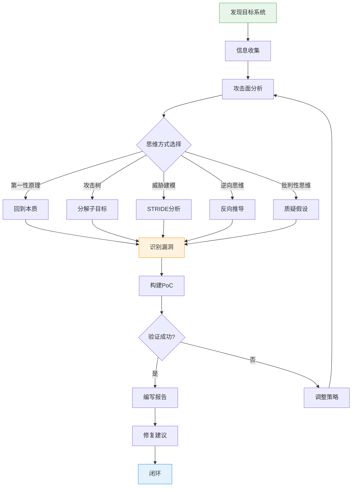
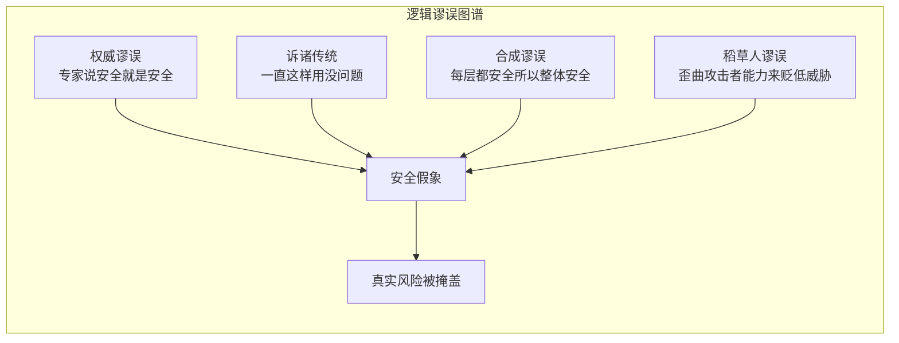
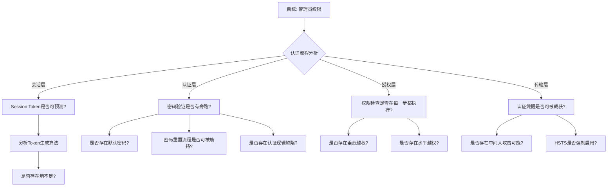
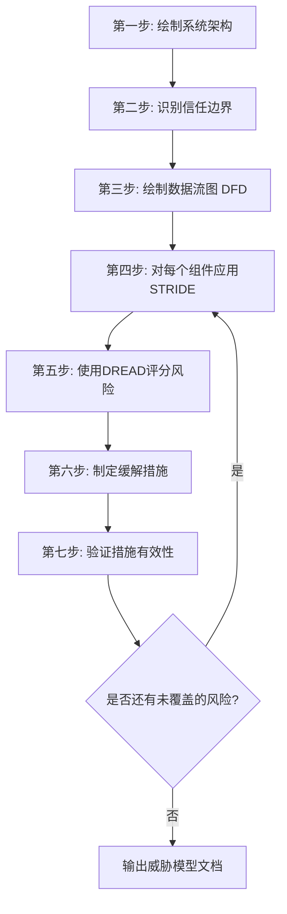
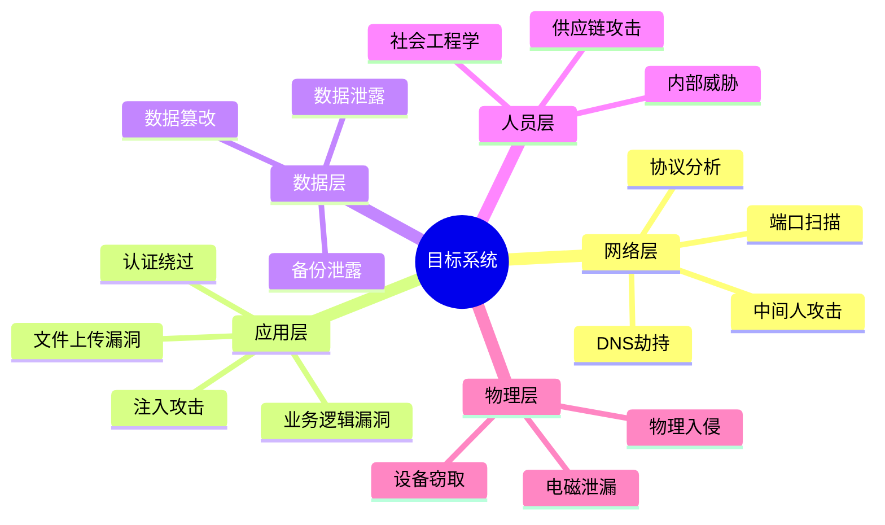
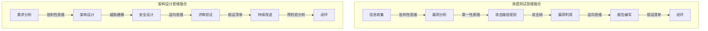

## 2.1 批判性思维与逆向思维

安全从业者的核心竞争力不是会用多少工具，而是如何思考问题。工具会过时，漏洞会修补，但思维方式是一切攻防技术的根基。本章系统讲解黑客领域最重要的两种思维模式——批判性思维与逆向思维，以及它们在安全实践中的具体应用。

### 2.1.1 安全思维的本质

> **安全思维模型全景图**



安全思维的核心可以用一句话概括：**不信任任何默认配置、不信任任何用户输入、不信任任何看似安全的系统**。这不是偏执，而是对抗性环境下的理性策略。

普通用户看到一个登录页面时，会想"输入用户名和密码登录"。而安全研究人员看到同一个页面时，会想：

- 这个输入框是否对SQL注入有防御？
- 密码传输是否使用了HTTPS？证书是否有效？
- 是否存在暴力破解保护？速率限制是基于IP还是基于会话？
- 会话管理是否安全？Token是否可预测？
- 是否存在CSRF防护？Token是否绑定到会话？
- 错误消息是否会泄露信息？是否存在用户名枚举？
- 是否可以通过其他方式绕过认证？OAuth流程是否可被劫持？
- 密码重置流程是否安全？是否存在竞态条件？
- 是否存在账户锁定机制？锁定后是否可以被滥用为拒绝服务？

这种"攻击者视角"的思维方式不是天生的，而是通过系统训练养成的。下面我们将它拆解为可学习、可练习的具体技能。

### 2.1.2 批判性思维

#### 什么是批判性思维

批判性思维（Critical Thinking）是一种有目的的、自我校准的判断过程。它要求你对任何声明、假设、证据和论证进行系统性的评估，而不是被动接受。在安全领域，批判性思维意味着：

- **质疑假设**：系统设计者假设了什么？这些假设在什么条件下会失效？
- **评估证据**：声称"安全"的依据是什么？证据是否充分？
- **识别偏见**：开发者、审计者、用户各有什么认知盲区？
- **推导结论**：从已知事实能推出什么？推理链是否严密？

#### 认知偏见与安全判断

人类大脑天生存在系统性的判断偏差，这些偏差在安全分析中会导致严重的盲区。以下是安全领域最常见的认知偏见：

| 偏见类型 | 定义 | 安全场景中的表现 | 应对策略 |
|---------|------|----------------|---------|
| 确认偏误（Confirmation Bias） | 倾向于寻找支持已有观点的证据 | 只测试自己认为可能存在的漏洞，忽略其他攻击面 | 强制自己列出"不可能存在漏洞"的场景并逐一验证 |
| 可得性启发（Availability Heuristic） | 依据容易想到的例子做判断 | 只关注最近曝光的CVE，忽略同类但不那么出名的漏洞 | 系统化地扫描所有攻击面，而非凭直觉选择 |
| 锚定效应（Anchoring Effect） | 过度依赖第一个获得的信息 | 初始扫描结果影响后续所有判断，忽略深层漏洞 | 多次独立扫描，使用不同工具和方法 |
| 达克效应（Dunning-Kruger Effect） | 能力不足者高估自己 | 初学者认为简单的SQL注入测试就等于完整的安全评估 | 建立标准化的评估清单，强制覆盖所有维度 |
| 现状偏见（Status Quo Bias） | 倾向于维持现状 | "这个系统一直这样运行，应该没问题" | 定期重新评估，假设环境已经变化 |
| 群体思维（Groupthink） | 团队中追求一致而压制异议 | 安全评审中没人敢指出明显的架构缺陷 | 建立匿名报告机制，鼓励"红队"角色 |

#### Socratic 提问法在安全分析中的应用

Socratic 提问法是一种通过系统性提问来揭示假设、检验逻辑的方法。在安全审计中，可以用以下六类问题：

**1. 澄清类问题（Clarification）**
- "你说这个接口是安全的，'安全'具体指什么？"
- "认证机制具体是怎样的？用什么协议实现的？"
- "你所说的'内部网络'的边界在哪里？"

**2. 假设检验类问题（Challenging Assumptions）**
- "你假设所有用户都是善意的，这个假设成立吗？"
- "你假设TLS是终端用户在使用，如果中间有代理呢？"
- "你假设数据库永远不被直接访问，如果运维人员的凭证泄露了呢？"

**3. 证据类问题（Probing Evidence）**
- "你说这个输入已经做了验证，验证规则具体是什么？服务端还是客户端？"
- "你声称没有SQL注入风险，做过什么测试来验证？"
- "这个安全控制经过了谁的审计？审计报告能看吗？"

**4. 视角类问题（Viewpoint Exploration）**
- "如果我是内部威胁者，我能做什么？"
- "如果这个系统暴露在公网上，攻击面会有什么变化？"
- "如果用户在使用企业代理，证书链会怎么变化？"

**5. 后果类问题（Consequential Thinking）**
- "如果这个Token泄露了，影响范围有多大？"
- "如果这个服务宕机了，下游系统会怎样？"
- "如果这个加密算法被破解了，历史数据怎么办？"

**6. 反思类问题（Meta-Questions）**
- "我们是不是忽略了某个攻击面？"
- "我们的评估方法本身是否有盲区？"
- "如果我是攻击者，我会先攻击哪个环节？"

#### 常见逻辑谬误

在安全讨论和报告中，以下逻辑谬误出现频率极高：



**权威谬误（Appeal to Authority）**
- 错误表现："这个产品是大厂出的，肯定安全。"
- 纠正：任何产品都可能存在漏洞，2021年Log4j事件影响了全球数百万系统，而Log4j正是Apache基金会维护的核心组件。

**诉诸传统（Appeal to Tradition）**
- 错误表现："这个协议用了20年了，肯定没问题。"
- 纠正：MD5和SHA-1也曾被认为是安全的，直到碰撞攻击被证明可行。安全评估必须基于当前的技术现实，而非历史惯性。

**合成谬误（Composition Fallacy）**
- 错误表现："每一层都有安全控制，所以整体是安全的。"
- 纠正：安全不是各层独立的，层与层之间的交互可能引入新的攻击面。一个组件单独看是安全的，组合起来可能产生意料之外的漏洞链。

**稻草人谬误（Straw Man）**
- 错误表现："攻击者需要物理接触设备才能攻击，这种场景不现实。"
- 纠正：先歪曲攻击场景，再声称不现实，这是典型的稻草人。实际上很多攻击可以通过远程方式完成，不需要物理接触。

### 2.1.3 逆向思维

#### 什么是逆向思维

逆向思维（Reverse Thinking）是一种从结果出发、反向推导的思考方式。与正向思维"从已知条件推导结论"不同，逆向思维是"从目标状态反推需要满足的条件"。

在安全领域，逆向思维的应用场景极其广泛：

- **漏洞挖掘**：不是从代码出发找漏洞，而是从"我希望实现什么效果"出发，反推需要哪些条件
- **渗透测试**：不是从外部逐层突破，而是先确定最终目标，再寻找最短路径
- **防御设计**：不是堵已知的漏洞，而是假设攻击者已经突破，反推防御策略

#### 正向思维 vs 逆向思维

| 维度 | 正向思维 | 逆向思维 |
|------|---------|---------|
| 起点 | 已知条件/当前状态 | 目标/期望结果 |
| 方向 | 从原因到结果 | 从结果到原因 |
| 优势 | 系统性、全面性 | 创造性、突破性 |
| 劣势 | 可能遗漏非线性路径 | 可能忽略约束条件 |
| 适用场景 | 系统审计、合规检查 | 漏洞利用、红队行动 |
| 典型工具 | 检查清单、标准框架 | 攻击树、逆向工程 |

#### 逆向思维的实战应用

**案例1：逆向推导SQL注入**

正向思维：检查代码中是否有字符串拼接 → 发现拼接 → 判断存在注入

逆向思维：
1. 目标：在数据库中执行任意SQL语句
2. 需要什么条件？用户输入被当作SQL代码执行
3. 什么情况下会这样？输入未经参数化处理
4. 怎么找到这样的点？搜索所有数据库查询构造点
5. 怎么验证？构造一个不影响业务但可检测的查询（如时间延迟）
6. 怎么利用？逐步增加复杂度，从布尔盲注到联合查询

**案例2：逆向设计认证绕过**

目标：以管理员身份访问系统



**案例3：从防御失败反推攻击路径**

当一个系统被攻破时，逆向思维可以帮助我们快速理解攻击链：

1. 从最终被窃取的数据开始
2. 这些数据存在哪里？数据库、文件系统、缓存？
3. 攻击者如何访问到这些存储？通过应用层、直接访问、还是侧信道？
4. 攻击者如何获得访问权限？利用了什么漏洞或配置错误？
5. 攻击者如何进入内网？通过钓鱼、供应链攻击、还是物理入侵？
6. 攻击的初始入口点在哪里？

这种反向推导能力在应急响应（Incident Response）中至关重要。

### 2.1.4 第一性原理思维

第一性原理思维要求回到问题的本质，从最基本的假设开始思考，而不是依赖类比或经验。

**案例：理解SQL注入的本质**

很多初学者学习SQL注入时，只是背诵各种注入语句和绕过技巧。但如果你用第一性原理来理解，SQL注入的本质是：

1. 应用程序将用户输入直接拼接到SQL语句中
2. SQL是一种结构化的查询语言，有特定的语法
3. 如果用户输入包含SQL语法，它会被数据库引擎解析为指令
4. 这意味着用户可以在一定程度上控制SQL语句的执行逻辑

理解了这个本质，你就能推导出：
- 参数化查询（Prepared Statements）能防止注入，因为它将数据和指令分离
- 所有基于字符串拼接的SQL语句都可能存在注入风险
- 不仅是SELECT，INSERT、UPDATE、DELETE语句都可能被注入
- 二次注入（Second Order Injection）是当存储的数据在后续使用时被拼接到SQL语句中
- ORM框架如果使用不当，同样可能存在注入

**案例：理解XSS的本质**

XSS（跨站脚本攻击）的第一性原理分析：

1. Web页面是由HTML、CSS和JavaScript组成的文本
2. 浏览器根据上下文（HTML标签内、属性内、JavaScript内、URL内）解析这些文本
3. 如果用户输入出现在页面中，且被浏览器解析为代码而非数据，就会执行
4. 所以XSS的根本原因是**数据与代码的边界被打破**

从这个本质出发：
- 编码（Encoding）的本质是告诉浏览器"这是数据，不是代码"
- 不同上下文需要不同的编码方式（HTML编码、JavaScript编码、URL编码）
- CSP（内容安全策略）的本质是限制哪些代码可以被执行
- HttpOnly Cookie的本质是让JavaScript无法访问敏感数据

**案例：理解CSRF的本质**

1. 浏览器会自动在每个请求中携带Cookie
2. 服务器无法区分"用户主动发起的请求"和"被诱导发起的请求"
3. 攻击者可以在自己的页面中构造指向目标站点的请求
4. 当用户访问攻击者的页面时，浏览器会自动携带目标站点的Cookie

从这个本质出发防御方案就很清晰了：
- CSRF Token的本质是让请求携带一个攻击者无法获取的凭证
- SameSite Cookie的本质是限制Cookie在跨站请求中的发送
- 验证Referer/Origin的本质是检查请求是否从可信来源发起

### 2.1.5 攻击树分析

攻击树（Attack Tree）是一种系统化的安全分析方法，由Bruce Schneier在1999年提出。它将复杂的攻击场景分解为层次化的子目标，帮助我们全面分析可能的攻击路径。

#### 构建攻击树的步骤

1. **定义根目标**：攻击者的最终目的（如"获取管理员账户"）
2. **分解子目标**：实现根目标需要完成哪些子任务
3. **逻辑关系**：子目标之间是AND（全部需要）还是OR（任一即可）关系
4. **递归分解**：继续将每个子目标分解为更小的步骤
5. **评估可行性**：评估每个叶子节点的难度、成本和风险
6. **标注成本**：为每个节点标注所需的时间、技能、资源
7. **识别关键路径**：找出成本最低的攻击路径

#### 完整攻击树示例

```text
目标：获取数据库中的用户数据
├── OR: 直接访问数据库
│   ├── AND: 获取数据库凭证
│   │   ├── 搜索配置文件中的硬编码密码（难度:低，成本:分钟级）
│   │   ├── 利用默认凭证（难度:低，成本:秒级）
│   │   ├── 通过SQL注入获取凭证表（难度:中，成本:小时级）
│   │   └── 暴力破解数据库密码（难度:高，成本:天级）
│   └── AND: 建立网络连接
│       ├── 利用网络配置错误（难度:中，成本:分钟级）
│       ├── 通过跳板机访问（难度:高，成本:天级）
│       └── 利用VPN/远程访问漏洞（难度:中，成本:小时级）
├── OR: 通过应用层获取
│   ├── SQL注入漏洞（难度:中，成本:小时级）
│   ├── 未授权的API访问（难度:低，成本:分钟级）
│   ├── IDOR/越权访问（难度:低-中，成本:分钟-小时级）
│   └── SSRF访问内部数据库接口（难度:中，成本:小时级）
├── OR: 间接获取
│   ├── 社会工程学攻击管理员（难度:中，成本:天级）
│   ├── 利用备份文件泄露（难度:低，成本:分钟级）
│   ├── 通过第三方服务泄露（难度:中，成本:天级）
│   └── 供应链攻击（难度:高，成本:周-月级）
└── OR: 物理/内部途径
    ├── 内部威胁者直接复制（难度:低，成本:分钟级）
    ├── 物理访问服务器（难度:高，成本:天级）
    └── 利用废弃硬件中的数据（难度:低，成本:小时级）
```

#### 攻击树的量化评估

对攻击树进行量化评估，可以使用以下维度：

| 评估维度 | 评分标准 | 权重 |
|---------|---------|------|
| 技术难度 | 1(脚本小子) - 5(国家级APT) | 30% |
| 时间成本 | 1(分钟) - 5(月以上) | 25% |
| 资源需求 | 1(免费工具) - 5(定制硬件/0day) | 20% |
| 检测风险 | 1(完全隐蔽) - 5(极易被发现) | 15% |
| 成功概率 | 1(<10%) - 5(>90%) | 10% |

综合得分越低的路径，攻击者越可能优先尝试。防御方应优先加固这些低分路径。

### 2.1.6 威胁建模

威胁建模（Threat Modeling）是一种在系统设计阶段识别安全风险的方法。微软的STRIDE模型是最常用的威胁建模框架之一：

| 威胁类型 | 描述 | 安全属性 | 攻击示例 | 防御措施 |
|---------|------|---------|---------|---------|
| Spoofing（欺骗） | 假冒他人身份 | 认证 | 会话劫持、凭证伪造 | 多因素认证、证书固定 |
| Tampering（篡改） | 修改数据或代码 | 完整性 | 中间人攻击、参数篡改 | 数字签名、HMAC |
| Repudiation（否认） | 否认执行过的操作 | 不可否认性 | 否认发起过转账 | 审计日志、数字签名 |
| Information Disclosure（信息泄露） | 未授权的信息访问 | 保密性 | 数据泄露、侧信道攻击 | 加密、访问控制 |
| Denial of Service（拒绝服务） | 系统可用性破坏 | 可用性 | DDoS、资源耗尽 | 限流、冗余架构 |
| Elevation of Privilege（权限提升） | 获取更高权限 | 授权 | 垂直越权、提权漏洞 | 最小权限原则、沙箱 |

#### 威胁建模的完整流程



**DREAD风险评分系统：**

| 维度 | 含义 | 1分 | 5分 |
|------|------|-----|-----|
| Damage（损害） | 潜在损害程度 | 仅影响单个用户 | 影响整个系统和所有用户 |
| Reproducibility（可复现性） | 攻击的可重复程度 | 需要极特殊条件 | 每次都能成功 |
| Exploitability（可利用性） | 实施攻击的难度 | 需要国家级资源 | 使用公开工具即可 |
| Affected Users（影响范围） | 受影响的用户比例 | 极少数用户 | 所有用户 |
| Discoverability（可发现性） | 漏洞被发现的概率 | 需要源码级访问 | 通过黑盒测试即可发现 |

DREAD总分 = (D + R + E + A + D) / 5，分数越高风险越大。

#### 实战：Web应用威胁建模示例

以一个典型的电商系统为例：

**系统边界与信任区域：**
- 可信区域：后端服务、数据库集群
- 半可信区域：CDN、第三方支付网关
- 不可信区域：用户浏览器、外部API调用方

**关键数据流与对应威胁：**

| 数据流 | STRIDE威胁 | 风险等级 | 缓解措施 |
|-------|-----------|---------|---------|
| 用户→登录接口 | S:凭证伪造 | 高 | bcrypt哈希+MFA+账户锁定 |
| 用户→订单接口 | T:参数篡改、E:越权 | 高 | 签名校验+服务端权限检查 |
| 服务→支付网关 | I:支付数据泄露 | 极高 | TLS+PCI DSS合规 |
| 服务→日志系统 | R:日志篡改 | 中 | 只追加写入+完整性校验 |
| 用户→商品搜索 | D:注入攻击 | 高 | 参数化查询+输入验证 |
| 服务→邮件服务 | S:邮件欺骗 | 中 | SPF/DKIM/DMARC |

### 2.1.7 思维工具箱

#### 工具1：假设清单（Assumption Checklist）

在审计任何系统前，先列出系统设计者的隐含假设，然后逐一验证：

```text
假设清单模板：
┌─────────────────────────────────────────────────────────┐
│ 系统名称: _______________  审计日期: _______________    │
├─────────────────────────────────────────────────────────┤
│ # │ 设计者假设              │ 验证方法   │ 结果       │
├───┼────────────────────────┼──────────┼──────────────┤
│ 1 │ 所有输入来自浏览器      │ 抓包测试  │ ✗ 存在API直接调用│
│ 2 │ 用户只能访问自己的数据  │ IDOR测试  │ ✓ 已做权限校验  │
│ 3 │ 内部网络不可被外部访问  │ SSRF测试  │ ✗ 存在SSRF漏洞  │
│ 4 │ 加密算法足够安全        │ 算法审查  │ ✓ 使用AES-256   │
│ 5 │ 日志不可被篡改          │ 权限检查  │ ✗ 日志文件可写  │
└─────────────────────────────────────────────────────────┘
```

#### 工具2：预检验分析（Pre-Mortem Analysis）

在项目上线前，假设系统已经被攻破，然后反推可能的攻击路径：

1. 假设："用户数据在上周被大规模泄露"
2. 问自己："攻击者是怎么做到的？"
3. 列出所有可能的路径（至少10条）
4. 评估每条路径的当前防御状态
5. 对薄弱路径优先加固

这种方法比"我们来看看有什么漏洞"有效得多，因为它迫使你站在攻击者角度思考。

#### 工具3：攻击者画像（Threat Actor Profiling）

不同类型的攻击者有不同的动机、能力和策略，针对性防御更加有效：

| 攻击者类型 | 动机 | 典型能力 | 常用手段 | 防御重点 |
|-----------|------|---------|---------|---------|
| 脚本小子（Script Kiddie） | 好奇心、炫技 | 低，使用现成工具 | 公开漏洞利用、暴力破解 | 基础安全加固、及时打补丁 |
| 黑帽黑客（Black Hat） | 经济利益 | 中-高 | 0day、社工、定制恶意软件 | 纵深防御、入侵检测 |
| 白帽黑客（White Hat） | 授权测试 | 高 | 与黑帽相同但有授权 | 配合测试、修复建议 |
| APT组织（Nation-State） | 情报、破坏 | 极高 | 供应链攻击、0day储备 | 零信任架构、持续监控 |
| 内部威胁（Insider） | 报复、经济利益 | 高（有内部访问权限） | 数据窃取、破坏 | 最小权限、行为监控 |
| 黑客行动主义（Hacktivism） | 政治/意识形态 | 中-高 | DDoS、网站篡改、数据泄露 | WAF、DDoS防护、数据加密 |

#### 工具4：思维导图法

当面对一个复杂系统时，用思维导图法将攻击面可视化：



### 2.1.8 思维训练方法

掌握思维方式需要刻意练习，以下是经过验证的训练方法：

#### 方法1：CTF题目复盘

参加CTF（Capture The Flag）竞赛后，不要只看writeup学解法，而是用批判性思维复盘：

1. 这道题的设计者假设了什么？
2. 我在解题时有哪些认知偏见影响了判断？
3. 如果用逆向思维，从flag出发反推，路径是否更短？
4. 这道题的漏洞本质是什么？属于哪一类根本原因？
5. 如果我是出题人，我会怎么设计更难的变体？

#### 方法2：漏洞报告精读

每周精读2-3篇高质量的漏洞报告（HackerOne、Bugcrowd、Google VRP），重点关注：

- 研究人员的思维过程，而非技术细节
- 他们是如何发现这个漏洞的？是系统测试还是意外发现？
- 他们的推理链是什么？有没有跳过某些步骤？
- 如果是你，你会从哪个角度切入？

#### 方法3：日常系统审计练习

选择日常使用的软件或网站（在合法授权范围内），练习安全思维：

1. 绘制该系统的简化架构图
2. 识别信任边界和数据流
3. 对每个组件应用STRIDE模型
4. 用攻击树分析最可能的攻击路径
5. 用假设清单验证设计者的隐含假设

#### 方法4：红蓝对抗演练

与同事进行红蓝对抗：

- 蓝队（防守方）：部署系统并声称"安全"
- 红队（攻击方）：尝试突破防御
- 规则：每发现一个漏洞，双方共同分析根本原因
- 复盘：红队的思维过程比漏洞本身更有价值

### 2.1.9 常见误区与纠正

| 误区 | 纠正 |
|------|------|
| "批判性思维就是挑毛病" | 批判性思维是系统性评估，包括认可做得好的部分 |
| "逆向思维只适合攻击" | 防御设计同样需要逆向思维——从攻击者的角度审视防御 |
| "安全思维是天生的" | 思维方式可以通过刻意练习系统性地培养 |
| "工具用得好就是安全专家" | 工具只是手段，思维方式才是核心竞争力 |
| "漏洞都是技术性的" | 很多安全事件的根本原因是逻辑缺陷或流程问题 |
| "经验越丰富判断越准" | 经验丰富的安全从业者同样会受认知偏见影响，需要系统性方法来校准 |
| "安全思维只在工作时需要" | 安全思维是一种通用能力，可以应用到生活的方方面面 |

### 2.1.10 进阶：思维模型的融合应用

真正的安全高手不会孤立地使用某一种思维模型，而是根据场景灵活组合：

**渗透测试中的思维融合：**

1. **信息收集阶段**：批判性思维——质疑收集到的信息是否准确、完整
2. **漏洞分析阶段**：第一性原理——回到漏洞的本质，理解根因
3. **攻击路径规划**：攻击树——系统化地列举所有可能路径
4. **漏洞利用阶段**：逆向思维——从目标状态反推利用条件
5. **报告编写阶段**：假设清单——验证所有结论的证据是否充分

**架构设计中的思维融合：**

1. **需求分析**：批判性思维——质疑需求是否合理、是否包含安全需求
2. **架构设计**：威胁建模——系统化识别所有威胁
3. **安全设计**：逆向思维——从攻击者角度审视设计
4. **评审验证**：假设清单——验证所有安全假设
5. **持续改进**：预检验分析——定期假设已被攻破，检查防御有效性



### 2.1.11 推荐资源

**书籍：**
- 《Thinking, Fast and Slow》Daniel Kahneman — 理解人类思维的两种模式及其偏差
- 《The Art of Attack》Maxim Chernyakhovsky — 攻击者思维模型的系统化阐述
- 《Threat Modeling: Designing for Security》Adam Shostack — 威胁建模的权威指南
- 《Attacker Mindset》Laura K. Batey — 红队行动中的心理博弈
- 《Critical Thinking》Richard Paul & Linda Elder — 批判性思维的系统方法论

**在线资源：**
- OWASP Threat Modeling Cheat Sheet — 实用的威胁建模清单
- MITRE ATT&CK Framework — 攻击技术的系统化知识库
- Bruce Schneier的博客 — 安全思维的经典来源
- Google Project Zero博客 — 顶级漏洞研究的思维过程

**工具：**
- OWASP Threat Dragon — 开源的威胁建模工具
- Microsoft Threat Modeling Tool — 微软官方威胁建模工具
- STRIDE-per-element清单 — 可打印的威胁分析工作表
- Lucidchart / draw.io — 绘制攻击树和数据流图
