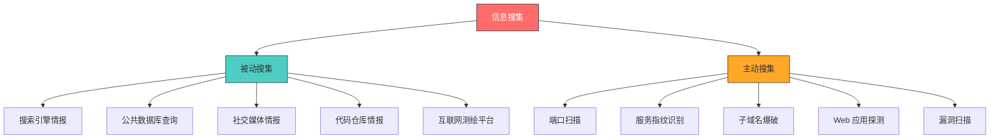
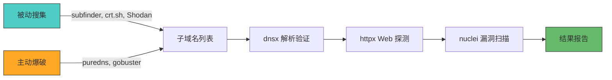
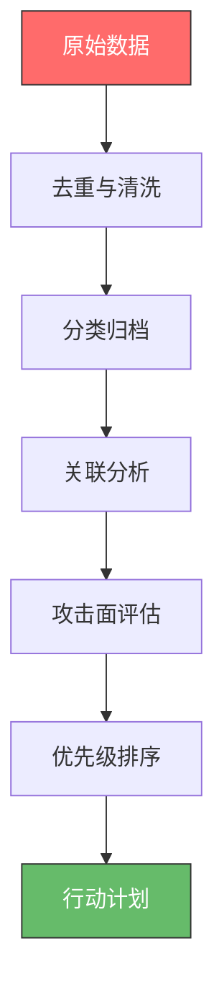

## 2.2 信息搜集技巧

信息搜集（Reconnaissance）是安全评估的第一步，也是决定后续工作质量的关键环节。一个经验丰富的渗透测试工程师会将 60%-70% 的时间花在信息搜集上——这不是因为他们不知道怎么"攻击"，而是因为他们深刻理解：**你对目标了解得越多，攻击面就越清晰，成功的概率就越高，被发现的风险就越低**。

### 2.2.1 信息搜集的本质与方法论

#### 为什么信息搜集是第一步

在渗透测试的 PTES（Penetration Testing Execution Standard）方法论中，信息搜集位于漏洞分析和漏洞利用之前。这不是一个可以跳过或草率对待的步骤——它是整个安全评估的地基。


信息搜集的价值体现在三个层面：

- **发现攻击面**：一个企业可能有数百个域名、数千个子域名、上万个端口暴露在互联网上。你不搜集，就永远不知道真正的攻击面有多大。
- **降低风险**：被动信息搜集不与目标直接交互，不会触发 IDS/IPS 告警，不会留下日志记录。这是最安全的侦察方式。
- **提高效率**：盲目扫描一个 /24 网段可能需要数小时；但如果你已经通过 OSINT 确定了关键 IP 范围和端口，可以精确打击。

#### 信息搜集的分类框架

信息搜集按与目标的交互程度，分为两大类：

| 维度 | 被动信息搜集（Passive） | 主动信息搜集（Active） |
|------|----------------------|---------------------|
| 与目标交互 | 不直接交互，通过第三方数据源 | 直接向目标发送探测请求 |
| 被检测风险 | 极低 | 中到高，取决于探测方式 |
| 法律风险 | 低（公开信息） | 需要授权，否则可能违法 |
| 数据来源 | 搜索引擎、公共数据库、社交媒体 | 端口扫描、服务枚举、漏洞探测 |
| 适用阶段 | 评估初期，建立目标画像 | 确认攻击面后，深入探测 |
| 典型工具 | Shodan、crt.sh、theHarvester | Nmap、Nuclei、ffuf |

此外，按信息类型还可以细分为：

- **基础设施情报**：域名、IP、ASN、网络拓扑、DNS 记录
- **技术栈情报**：Web 服务器、框架、CMS、WAF、CDN
- **人员情报**：员工邮箱、组织架构、社交账号、技术背景
- **代码与配置情报**：源码泄露、API 密钥、内部文档、配置文件
- **历史情报**：历史 DNS 记录、历史页面快照、已泄露数据



#### OPSEC：信息搜集阶段的自我保护

信息搜集本身也需要保护搜集者的身份和安全。OPSEC（Operations Security）原则在信息搜集阶段的具体实践包括：

- **使用 VPN 或代理链**：所有对外请求都应通过 VPN 或 Tor 网络，避免暴露真实 IP。特别是在主动扫描时，目标的日志中会记录你的来源 IP。
- **分离工作环境**：使用专用的虚拟机或容器进行信息搜集，不要在日常使用的系统上运行扫描工具。
- **控制请求频率**：大量高频请求会触发速率限制和 WAF 告警。使用随机化的 User-Agent、随机化的请求间隔来降低被检测的风险。
- **清理痕迹**：DNS 查询会在本地 DNS 缓存、ISP 的 DNS 日志中留下记录。使用 DNS over HTTPS（DoH）或 DNS over TLS（DoT）来加密 DNS 查询。
- **匿名邮箱和账号**：如果需要在社交平台上搜集信息，使用匿名注册的账号，不要使用与个人身份关联的账号。

### 2.2.2 被动信息搜集：不触碰目标的侦察

被动信息搜集是从公开可用的数据源中提取信息，整个过程不会向目标系统发送任何请求。这是最安全、最隐蔽的侦察方式，也是信息搜集的第一步。

#### DNS 信息搜集

DNS（域名系统）是互联网的电话簿，它记录了一个域名几乎所有关键的基础设施信息。DNS 记录的类型及其安全意义如下：

| 记录类型 | 含义 | 安全意义 |
|---------|------|---------|
| A | 域名到 IPv4 地址的映射 | 确定目标的 IP 地址，识别真实服务器位置 |
| AAAA | 域名到 IPv6 地址的映射 | IPv6 地址可能未被安全设备覆盖 |
| MX | 邮件服务器记录 | 邮件服务器是钓鱼攻击和邮件安全分析的重点 |
| NS | 域名服务器记录 | 识别 DNS 服务商，DNS 劫持风险评估 |
| TXT | 文本记录 | 包含 SPF/DKIM/DMARC 等邮件安全策略，可能泄露内部信息 |
| CNAME | 别名记录 | 暴露 CDN、第三方服务、云托管信息 |
| SOA | 权威记录 | 包含管理员邮箱、序列号，可用于社工 |
| SRV | 服务记录 | 直接暴露内部服务名称和端口 |

**WHOIS 查询**

WHOIS 查询返回域名的注册信息，包括注册人、注册商、注册/到期时间、DNS 服务器等。虽然 GDPR（通用数据保护条例）实施后，大多数 .com/.net 域名的注册人信息已被隐藏，但 WHOIS 仍然提供有价值的元数据：

```bash
# 基础 WHOIS 查询
whois example.com

# 查询 IP 地址的归属信息
whois 203.0.113.1

# 查询 ASN（自治系统编号）
whois -h whois.radb.net -- '-i origin AS13335'
```

WHOIS 中值得关注的信息点：

- **注册商和注册时间**：新注册的域名（< 30 天）可能是钓鱼域名
- **域名服务器**：可以识别目标使用的 DNS 托管服务商
- **关联域名**：同一注册人注册的其他域名可能属于同一组织
- **历史记录**：通过 WHOIS 历史查询服务（如 WhoisXML API）可以看到域名的历次注册变更

**DNS 记录枚举**

```bash
# 查询所有常见 DNS 记录类型
dig example.com A +short
dig example.com AAAA +short
dig example.com MX +short
dig example.com NS +short
dig example.com TXT +short
dig example.com CNAME +short
dig example.com SOA +short

# 使用 ANY 查询（注意：许多 DNS 服务器已禁用 ANY 查询）
dig example.com ANY

# 反向 DNS 查询（从 IP 反查域名）
dig -x 203.0.113.1 +short

# 批量反向 DNS 查询（探测整个 IP 段的域名绑定）
for ip in $(seq 1 254); do dig -x 192.168.1.$ip +short; done

# DNS 区域传送（Zone Transfer）—— 如果成功，将泄露整个域名的 DNS 记录
dig @ns1.example.com example.com AXFR
```

**DNS 区域传送漏洞**是一个经常被忽视但影响严重的安全问题。如果 DNS 服务器配置不当，允许任何人执行区域传送（AXFR），攻击者可以获得该域名下所有的 DNS 记录——包括内部主机名、邮件服务器、测试环境、管理后台等。测试方法：

```bash
# 逐一测试所有 NS 服务器是否允许区域传送
for ns in $(dig example.com NS +short); do
    echo "Testing $ns..."
    dig @$ns example.com AXFR
done
```

**DNSSEC 验证**：DNSSEC（DNS 安全扩展）用于防止 DNS 欺骗。检查目标是否部署了 DNSSEC：

```bash
dig example.com +dnssec +short
dig example.com DNSKEY +short
```

**DNS 缓存探测**：通过查询 DNS 缓存可以判断目标是否使用了特定的 CDN 节点或内部解析：

```bash
# 查看本地 DNS 缓存（Linux/systemd-resolved）
resolvectl statistics

# 查看 TTL 值变化以判断是否使用 CDN
dig example.com | grep -i "answer section" -A 5
```

#### 子域名发现

子域名枚举是扩大攻击面的最有效手段。一个大型企业可能有数百个子域名，其中很多运行着过时的系统、测试环境或被遗忘的服务——这些往往是安全弱点的集中地。

**方法一：证书透明度日志（Certificate Transparency）**

当一个域名申请 SSL/TLS 证书时，证书会被记录到公开的证书透明度日志中。这意味着你可以通过查询证书日志来发现子域名——即使这些子域名没有在 DNS 中公开。

```bash
# 使用 crt.sh 查询（免费，无需 API Key）
curl -s "https://crt.sh/?q=%25.example.com&output=json" | \
    jq -r '.[] | .name_value' | \
    sort -u

# 过滤通配符证书
curl -s "https://crt.sh/?q=%25.example.com&output=json" | \
    jq -r '.[] | .name_value' | \
    grep -v "^\*" | \
    sort -u

# 使用 certsh 命令行工具（如果安装了）
certsh example.com
```

证书透明度日志的价值在于：

- 它包含历史数据，即使证书已过期，记录仍然存在
- 它可以发现已经被下线但曾经存在的子域名
- 它不受 DNS 配置限制——只要申请过证书就会被记录
- 它是完全被动的操作，不向目标发送任何请求

**方法二：搜索引擎枚举**

```bash
# Google 搜索子域名
# 搜索语法：site:*.example.com -www

# 使用 amass 的被动模式（不发送任何请求到目标）
amass enum -passive -d example.com -o subdomains.txt

# 使用 subfinder（纯被动，聚合多个数据源）
subfinder -d example.com -all -o subdomains.txt
```

**方法三：DNS 暴力枚举**

DNS 暴力枚举是主动搜集方法——它向目标 DNS 服务器发送大量猜测请求，测试哪些子域名存在：

```bash
# 使用 gobuster 进行 DNS 爆破
gobuster dns -d example.com -w /usr/share/wordlists/subdomains-top1million-5000.txt -t 50

# 使用 ffuf 进行 DNS 爆破
ffuf -u "http://FUZZ.example.com" -w /usr/share/wordlists/subdomains-top1million-5000.txt -mc 200,301,302,403

# 使用 puredns（高性能 DNS 爆破，支持通配符检测）
puredns bruteforce wordlist.txt example.com --resolvers resolvers.txt
```

DNS 暴力枚举的关键技巧：

- **通配符检测**：在开始爆破之前，先查询一个随机的子域名（如 `thisdoesnotexist123.example.com`）。如果返回了结果，说明目标配置了通配符解析，所有子域名都会"存在"——此时需要通过响应内容来区分真实子域名。
- **使用高质量字典**：通用字典效率低下。针对特定行业（如金融、电商、教育）的字典效果更好。也可以从已发现的子域名中提取模式来生成自定义字典。
- **递归枚举**：对发现的子域名继续枚举，可以发现更深层的子域名（如 `dev.api.internal.example.com`）。

**方法四：利用其他数据源**

```bash
# 通过 VirusTotal 查询（需要 API Key）
curl -s "https://www.virustotal.com/api/v3/domains/example.com/subdomains" \
    -H "x-apikey: YOUR_API_KEY" | jq -r '.data[].id'

# 通过 SecurityTrails 查询
curl -s "https://api.securitytrails.com/v1/domain/example.com/subdomains" \
    -H "apikey: YOUR_API_KEY" | jq -r '.subdomains[]'

# 通过 AlienVault OTX 查询
curl -s "https://otx.alienvault.com/api/v1/indicators/domain/example.com/passive_dns" | \
    jq -r '.passive_dns[].hostname' | sort -u
```

**方法五：从已知信息推导**

```bash
# 从 DNS 记录中的 CNAME 推导
dig example.com CNAME +short  # 可能指向 CDN 或云服务

# 从 MX 记录推导邮件子域名
dig example.com MX +short  # 然后对邮件服务器域名进行子域名枚举

# 从 TXT 记录中提取子域名
dig example.com TXT +short  # SPF 记录可能包含邮件服务器子域名

# 从 SSL 证书的 SAN（Subject Alternative Name）中提取
echo | openssl s_client -connect example.com:443 2>/dev/null | \
    openssl x509 -noout -text | grep -i "DNS:"
```

子域名搜集完成后，需要对结果进行整理和验证：

```bash
# 去重并排序
sort -u subdomains.txt > subdomains_unique.txt

# 批量解析 IP
while read sub; do
    ip=$(dig +short "$sub" A | head -1)
    echo "$sub -> $ip"
done < subdomains_unique.txt

# 识别 CDN/云托管的子域名（CNAME 分析）
while read sub; do
    cname=$(dig +short "$sub" CNAME)
    [ -n "$cname" ] && echo "$sub -> CNAME -> $cname"
done < subdomains_unique.txt
```

#### WHOIS 与 IP 归属分析

WHOIS 查询不仅能用于域名，还能用于 IP 地址和 ASN（自治系统编号）的归属分析：

```bash
# 查询 IP 归属
whois 203.0.113.1 | grep -i "org\|net\|country\|descr"

# 查询 ASN 信息
whois -h whois.radb.net -- '-i origin AS13335' | head -20

# 通过 BGP 数据查看 ASN 的 IP 范围
whois -h whois.radb.net -- '-i origin AS13335' | grep "route"

# 使用 ipinfo.io 查询 IP 归属（简单快速）
curl -s "https://ipinfo.io/203.0.113.1" | jq .
```

ASN 分析的价值：一个组织通常拥有一个或多个 ASN，每个 ASN 管理着特定的 IP 地址范围。通过查询目标的 ASN，可以发现该组织的所有 IP 段——这对于后续的端口扫描和网络侦察至关重要。

#### 搜索引擎情报（Google Dorking）

Google Dorking 是使用高级搜索运算符来发现目标公开信息的技术。Google 的索引中包含了大量未被普通搜索发现的敏感信息——目录列表、配置文件、管理后台、日志文件等。

**核心搜索运算符详解：**

| 运算符 | 含义 | 示例 | 用途 |
|--------|------|------|------|
| `site:` | 限定搜索域名 | `site:example.com` | 限制搜索范围到目标域名 |
| `inurl:` | URL 中包含关键词 | `inurl:admin` | 发现管理后台和敏感路径 |
| `intitle:` | 标题中包含关键词 | `intitle:"index of"` | 发现目录列表 |
| `filetype:` | 文件类型 | `filetype:pdf` | 搜索特定类型的文件 |
| `ext:` | 文件扩展名 | `ext:sql` | 搜索数据库备份文件 |
| `intext:` | 正文中包含关键词 | `intext:password` | 搜索包含敏感信息的页面 |
| `cache:` | 查看 Google 缓存 | `cache:example.com` | 查看已下线页面的内容 |
| `related:` | 相关网站 | `related:example.com` | 发现关联网站 |
| `info:` | 网站摘要信息 | `info:example.com` | 快速了解网站概况 |
| `"..."` | 精确匹配 | `"internal use only"` | 搜索精确短语 |
| `-` | 排除 | `site:example.com -www` | 排除特定结果 |
| `OR` | 或逻辑 | `admin OR login` | 扩大搜索范围 |

**实战 Dork 集合：**

```text
# 发现目录列表（暴露文件结构）
site:example.com intitle:"index of"
site:example.com intitle:"index of /" "parent directory"

# 搜索配置文件（可能包含数据库凭证）
site:example.com ext:xml | ext:conf | ext:cnf | ext:reg | ext:inf | ext:rdp | ext:cfg
site:example.com filetype:env | filetype:yml | filetype:yaml

# 搜索数据库备份
site:example.com ext:sql | ext:bak | ext:dump | ext:backup

# 搜索管理后台
site:example.com inurl:admin | inurl:login | inurl:portal
site:example.com inurl:wp-admin | inurl:administrator
site:example.com intitle:"admin panel" | intitle:"control panel"

# 搜索错误信息（可能泄露技术栈和内部路径）
site:example.com intext:"error" intext:"mysql" | intext:"postgresql"
site:example.com intext:"fatal error" | intext:"stack trace"
site:example.com intext:"warning" intext:"php"

# 搜索泄露的文档
site:example.com filetype:pdf | filetype:doc | filetype:docx | filetype:xls
site:example.com filetype:doc "internal" | "confidential" | "proprietary"

# 搜索 API 端点
site:example.com inurl:api | inurl:v1 | inurl:v2 | inurl:graphql
site:example.com inurl:swagger | inurl:openapi

# 搜索包含密码的文件（极端敏感）
site:example.com filetype:txt "password"
site:example.com filetype:csv "password"
site:example.com ext:properties "password" | "secret"

# 搜索 Jenkins、Grafana 等运维工具
site:example.com inurl:jenkins | inurl:grafana | inurl:nagios | inurl:zabbix
site:example.com intitle:"Dashboard [Jenkins]" | intitle:"Grafana"

# 搜索 Pastebin 等代码分享平台上的泄露
site:pastebin.com "example.com"
site:github.com "example.com" password | secret | api_key
```

**其他搜索引擎的 Dorking：**

Google Dorking 仅限 Google 索引的内容。以下是其他搜索引擎的等效操作：

| 搜索引擎 | 特点 | 适用场景 |
|---------|------|---------|
| Bing | 支持 `ip:` 运算符，可搜索特定 IP 上的所有网站 | 共享主机上的其他网站 |
| Yandex | 对俄语内容索引更全，图片搜索能力强 | 跨语言情报搜集 |
| DuckDuckGo | 不跟踪用户，结果更中立 | 匿名搜索 |
| Baidu | 中文内容索引最全 | 中国目标的信息搜集 |

```bash
# Bing: 搜索特定 IP 上的所有域名
# 搜索语法：ip:203.0.113.1

# 使用 dork-cli 工具自动化 Google Dorking
dork-cli -d example.com -t 50
```

#### 互联网测绘平台

互联网测绘平台（Internet-wide Scanning Platforms）是被动信息搜集的利器——它们持续扫描整个互联网并建立索引，你可以直接查询而不需要自己扫描。

**Shodan**

Shodan 是最知名的互联网设备搜索引擎，它索引了互联网上所有暴露的服务、设备和系统。

```bash
# 安装 Shodan CLI
pip install shodan
shodan init YOUR_API_KEY

# 搜索目标域名的暴露服务
shodan search "hostname:example.com"

# 搜索特定端口
shodan search "hostname:example.com port:22"

# 搜索特定服务
shodan search "hostname:example.com product:apache"

# 搜索 SSL 证书
shodan search "ssl.cert.subject.cn:example.com"

# 获取主机详情
shodan host 203.0.113.1

# 搜索 CVE 漏洞
shodan search "hostname:example.com vuln:CVE-2021-44228"

# 搜索 ICS/SCADA 设备
shodan search "port:502 country:CN"  # Modbus 设备

# 搜索摄像头
shodan search "Server: GoAhead product:webcam"
```

Shodan 的高级过滤器：

| 过滤器 | 含义 | 示例 |
|--------|------|------|
| `hostname:` | 主机名包含 | `hostname:example.com` |
| `net:` | IP/CIDR 范围 | `net:203.0.113.0/24` |
| `port:` | 端口号 | `port:3389` |
| `product:` | 软件产品 | `product:nginx` |
| `os:` | 操作系统 | `os:"Windows Server"` |
| `vuln:` | CVE 编号 | `vuln:CVE-2021-44228` |
| `ssl:` | SSL 证书信息 | `ssl.cert.subject.cn:example.com` |
| `country:` | 国家 | `country:CN` |
| `org:` | 组织 | `org:"Example Inc"` |
| `http.title:` | 页面标题 | `http.title:"Dashboard"` |
| `http.status:` | HTTP 状态码 | `http.status:200` |
| `asn:` | ASN 编号 | `asn:AS13335` |
| `before:` / `after:` | 时间范围 | `after:2024-01-01` |

**Censys**

Censys 是另一个强大的互联网扫描平台，由密歇根大学的研究团队开发，提供更丰富的证书和主机数据：

```bash
# 安装 Censys CLI
pip install censys

# 搜索主机
censys search "services.tls.certificates.leaf_data.subject.common_name:example.com"

# 搜索证书
censys search-certificates "parsed.subject.common_name:example.com"

# 通过 API 查询
curl -s "https://search.censys.io/api/v2/hosts/search?q=example.com" \
    -u "API_ID:API_SECRET" | jq .
```

**FOFA（网络空间测绘）**

FOFA 是中国开发的互联网测绘平台，对中国境内的互联网资产索引更全面：

```bash
# 通过 API 查询
curl -s "https://fofa.info/api/v1/search/all?email=YOUR_EMAIL&key=YOUR_KEY&qbase64=$(echo -n 'domain="example.com"' | base64)" | jq .

# FOFA 搜索语法
# domain="example.com"          搜索域名
# host="example.com"            搜索主机
# ip="203.0.113.1"              搜索 IP
# title="Dashboard"             搜索页面标题
# body="login"                  搜索页面内容
# cert="example.com"            搜索证书
# port="8080"                   搜索端口
# country="CN"                  搜索国家
# banner="nginx"                搜索 banner 信息
```

**ZoomEye（钟馗之眼）**

ZoomEye 是知道创宇旗下的网络空间搜索引擎，同样对中国互联网资产有较好的覆盖：

```bash
# ZoomEye 搜索语法
# app:"Apache httpd"            搜索应用
# device:"router"               搜索设备类型
# os:"Windows"                  搜索操作系统
# service:"ssh"                 搜索服务
# hostname:"example.com"        搜索主机名
```

**各平台对比：**

| 平台 | 免费额度 | 数据更新频率 | 中国覆盖 | 特色功能 |
|------|---------|------------|---------|---------|
| Shodan | 有限查询 | 持续 | 一般 | ICS/SCADA 设备、漏洞匹配 |
| Censys | 250 次/月 | 持续 | 一般 | 证书搜索、历史数据 |
| FOFA | 有限查询 | 高频 | 优秀 | 中文资产、协议识别 |
| ZoomEye | 有限查询 | 高频 | 优秀 | 设备指纹、漏洞检测 |

#### 代码仓库与开发者情报

代码仓库（如 GitHub、GitLab）是泄露敏感信息的高风险区域。开发者经常不小心将 API 密钥、数据库密码、内部配置文件提交到公开仓库中。

**GitHub 搜索**

```bash
# 使用 github-subdomains 工具从 GitHub 中搜索子域名
github-subdomains -d example.com -t YOUR_GITHUB_TOKEN

# 手动搜索 GitHub（高级搜索语法）
# 搜索包含目标域名的代码
# 搜索语法：example.com password
# 搜索语法：example.com api_key
# 搜索语法：example.com secret
# 搜索语法：org:example-org password

# 使用 GitDorker 自动化搜索
python3 GitDorker.py -t YOUR_GITHUB_TOKEN -d example.com -q "password OR secret OR api_key"
```

**GitHub 高级搜索中值得关注的关键词：**

| 搜索关键词 | 风险等级 | 泄露内容 |
|-----------|---------|---------|
| `password` | 高 | 硬编码密码 |
| `api_key` / `apikey` | 高 | API 密钥 |
| `secret` / `secret_key` | 高 | 加密密钥、会话密钥 |
| `token` | 高 | 访问令牌 |
| `credentials` | 高 | 凭证配置 |
| `aws_access_key` | 极高 | AWS 访问密钥 |
| `PRIVATE KEY` | 极高 | SSH 私钥、SSL 私钥 |
| `.env` | 高 | 环境变量配置文件 |
| `internal` / `confidential` | 中 | 内部文档和注释 |
| `jdbc:` | 高 | 数据库连接字符串 |
| `mongodb://` / `redis://` | 高 | 数据库连接 URI |

```bash
# 使用 truffleHog 扫描 Git 仓库中的高熵字符串和密钥
trufflehog git https://github.com/example-org/example-repo.git

# 使用 git-secrets 扫描本地仓库
git secrets --scan

# 使用 gitleaks 在 CI/CD 中自动检测
gitleaks detect --source . -v
```

**从开发者个人资料中搜集信息：**

- 开发者的 GitHub 个人资料可能暴露技术栈偏好、项目历史、邮箱地址
- commit 历史中的邮箱地址可以用于钓鱼攻击
- 开发者在 Stack Overflow 上的提问可能暴露内部系统的问题
- npm/pip 等包管理器的注册邮箱可能泄露

#### 社交媒体情报（SOCMINT）

社交媒体是获取人员信息的重要来源。通过社交媒体情报，可以构建目标组织的人员画像、技术栈信息、组织架构等。

| 平台 | 可获取信息 | 搜集方法 |
|------|-----------|---------|
| LinkedIn | 组织架构、员工姓名/职位/技术栈、招聘信息 | 高级搜索、公司页面、员工列表 |
| Twitter/X | 安全事件讨论、技术栈暴露、员工动态 | 搜索语法、列表、地理位置搜索 |
| GitHub | 代码仓库、技术栈、API 密钥泄露 | 组织页面、代码搜索、commit 历史 |
| Stack Overflow | 技术问题暴露内部系统 | 用户资料、提问历史 |
| 微博/脉脉 | 中国企业的员工信息、内部爆料 | 搜索关键词、话题跟踪 |
| 知乎 | 行业讨论、匿名爆料 | 搜索关键词、专栏文章 |

**LinkedIn 情报搜集技巧：**

```bash
# 使用 linkedin2username 从 LinkedIn 公司页面提取员工姓名
python3 linkedin2username.py -c "Example Company" -d example.com

# 生成用户名格式列表（用于密码喷洒等）
# 常见格式：firstname.lastname, firstnamelastname, f.lastname, firstlast
```

**社交媒体搜集的 OPSEC 注意事项：**

- LinkedIn 会显示谁查看了你的档案——使用匿名浏览模式或专用账号
- 不要在目标组织的社交媒体帖子下互动（点赞、评论），这会引起注意
- 使用截图而非链接保存情报，避免引用链接暴露你的 IP

#### 电子邮件情报

电子邮件地址是社会工程学攻击的入口点。搜集目标组织的邮件地址格式和有效邮箱列表，是信息搜集的重要环节。

```bash
# 使用 theHarvester 从多个数据源搜集邮件地址
theHarvester -d example.com -b all -l 200

# 使用 hunter.io API 查询企业邮箱格式
curl -s "https://api.hunter.io/v2/domain-search?domain=example.com&api_key=YOUR_KEY" | jq .

# 使用 emailfinder 自动化搜索
emailfinder -d example.com

# 验证邮箱是否有效（SMTP 验证）
# 注意：频繁验证可能导致你的 IP 被邮件服务器封禁
smtp-user-enum -M VRFY -U emails.txt -t mail.example.com
```

**邮件安全记录分析：**

```bash
# 检查 SPF 记录（发送者策略框架）
dig example.com TXT +short | grep "spf"

# 检查 DKIM 记录
dig default._domainkey.example.com TXT +short

# 检查 DMARC 记录
dig _dmarc.example.com TXT +short

# 分析邮件安全策略的强度
# SPF 记录中的 ~all（软失败）比 -all（硬失败）更容易被利用
# 缺少 DMARC 记录意味着攻击者可以更轻松地伪造发件人
```

邮件安全记录的分析价值：

- **SPF 记录**中列举的 IP 地址和域名可以揭示目标使用的邮件服务提供商和第三方服务
- **DMARC 策略**的强度（p=none/reject/quarantine）反映了目标的邮件安全成熟度
- **缺少 DMARC**意味着攻击者可以更容易地发送伪造的钓鱼邮件

#### 历史情报与快照

历史数据可以揭示当前已不存在但可能仍然可被利用的信息。

```bash
# 使用 Wayback Machine 查询历史快照
curl -s "https://web.archive.org/cdx/search/cdx?url=example.com/*&output=json&limit=100" | jq .

# 下载历史快照的 robots.txt（可能包含被移除但仍然有效的路径）
curl -s "https://web.archive.org/web/2023/https://example.com/robots.txt"

# 使用 waybackurls 提取历史 URL
echo "example.com" | waybackurls > wayback_urls.txt

# 从历史 URL 中发现已下线但未删除的管理后台
cat wayback_urls.txt | grep -i "admin\|login\|panel\|dashboard"
```

Wayback Machine 的价值：

- 发现已下线但仍可访问的页面（服务器上可能未删除）
- 从历史 robots.txt 中发现 Disallow 路径（管理员不想被索引的路径通常更有趣）
- 从历史页面中提取 API 端点和参数
- 追踪网站的技术栈变更历史

### 2.2.3 主动信息搜集：直接与目标交互

主动信息搜集需要直接与目标系统交互，因此存在被检测和记录的风险。在执行主动搜集之前，必须确保已获得合法授权。

#### 端口扫描

端口扫描是主动信息搜集的核心技术。通过向目标的端口发送探测请求，可以确定哪些端口是开放的、运行着什么服务、使用什么版本。

**Nmap：端口扫描的瑞士军刀**

Nmap（Network Mapper）是最广泛使用的网络扫描工具，其功能远不止简单的端口扫描。

```bash
# TCP Connect 扫描（完整三次握手，可靠但容易被检测）
nmap -sT target.com

# SYN 扫描（半开扫描，发送 SYN 后直接发 RST，不完成握手，更隐蔽）
nmap -sS target.com

# 快速扫描（只扫描最常见的 100 个端口）
nmap -F target.com

# 全端口扫描（1-65535，耗时较长）
nmap -p- target.com

# 指定端口范围
nmap -p 80,443,8080,8443 target.com
nmap -p 1-1024 target.com

# 服务版本检测（识别端口上运行的具体服务和版本）
nmap -sV target.com

# 操作系统检测
nmap -O target.com

# 脚本扫描（使用 NSE 脚本进行更深入的检测）
nmap -sC target.com  # 使用默认脚本
nmap --script vuln target.com  # 使用漏洞检测脚本
nmap --script http-enum target.com  # 枚举 Web 应用目录

# 组合扫描（最常用的组合）
nmap -sV -sC -O -p- target.com

# UDP 扫描（UDP 服务容易被忽视，如 DNS、SNMP、TFTP）
nmap -sU target.com
nmap -sU --top-ports 100 target.com

# 防火墙/IDS 规避技术
nmap -D RND:10 target.com  # 使用 10 个随机诱饵 IP
nmap --source-port 53 target.com  # 伪装源端口为 DNS
nmap -f target.com  # 分片数据包
nmap --mtu 24 target.com  # 自定义 MTU
nmap -T2 target.com  # 降低扫描速度（T0-T5，T0 最慢）
nmap --scan-delay 1000ms target.com  # 设置探测间隔
```

**Nmap NSE 脚本分类与常用脚本：**

| 类别 | 脚本 | 用途 |
|------|------|------|
| auth | `ssh-auth-methods`, `http-auth` | 认证方式探测 |
| broadcast | `broadcast-ping` | 广播发现 |
| brute | `ssh-brute`, `http-form-brute` | 暴力破解（需谨慎） |
| default | `http-title`, `ssh-hostkey` | 默认扫描脚本组 |
| discovery | `dns-brute`, `http-enum` | 服务和目录枚举 |
| exploit | `smb-vuln-ms17-010` | 漏洞利用（仅限授权测试） |
| vuln | `vuln`, `http-vuln-*` | 漏洞检测 |
| safe | 大部分脚本 | 安全的检测脚本 |

```bash
# 枚举 HTTP 目录
nmap --script http-enum -p 80,443 target.com

# 检测 SMB 漏洞
nmap --script smb-vuln* -p 445 target.com

# 枚举 SSL/TLS 证书信息
nmap --script ssl-cert -p 443 target.com

# 检测 SSL/TLS 漏洞
nmap --script ssl-enum-ciphers -p 443 target.com

# DNS 枚举
nmap --script dns-brute --script-args dns-brute.threads=10 target.com
```

**Masscan：极速端口扫描**

Masscan 是专门为大规模端口扫描设计的工具，它的速度是 Nmap 的数百倍，适合对整个网段甚至整个互联网进行扫描：

```bash
# 扫描整个 /24 网段的特定端口
masscan 203.0.113.0/24 -p 80,443 --rate=1000

# 扫描整个 /16 网段
masscan 203.0.113.0/16 -p 80,443,8080 --rate=10000 -oJ results.json

# 扫描全端口（1-65535）
masscan 203.0.113.1 -p 0-65535 --rate=10000

# 将结果导入 Nmap 进行详细扫描
masscan 203.0.113.0/24 -p 1-65535 --rate=10000 -oL masscan_results.txt
nmap -sV -sC -iL masscan_results.txt -oX nmap_results.xml
```

Masscan 的注意事项：

- 使用 `--rate` 控制发包速率，过高的速率可能导致网络拥塞或被封禁
- Masscan 使用异步传输，结果可能有遗漏，重要目标建议用 Nmap 复核
- 需要 root 权限运行
- 不建议在没有授权的情况下对公网进行大规模扫描

#### Web 应用指纹识别

Web 应用指纹识别是确定目标使用的 Web 技术栈的过程——包括 Web 服务器、编程语言、CMS、框架、WAF 等。

```bash
# WhatWeb：综合 Web 指纹识别
whatweb target.com
whatweb -a 3 target.com  # 激进模式，更深入的检测
whatweb -v target.com  # 详细输出

# Wappalyzer CLI
wappalyzer target.com

# HTTP 响应头分析（手动）
curl -I -s target.com
# 关注的头字段：
# Server: nginx/1.18.0          # Web 服务器版本
# X-Powered-By: Express         # 后端技术
# X-Generator: WordPress 6.0    # CMS
# Set-Cookie: PHPSESSID=...     # PHP 应用
# Set-Cookie: JSESSIONID=...    # Java 应用
# Set-Cookie: ASP.NET_SessionId  # ASP.NET 应用
# X-Frame-Options: SAMEORIGIN  # 安全头

# robots.txt 分析
curl -s target.com/robots.txt
# Disallow 路径通常包含管理后台、API 端点、敏感目录

# sitemap.xml 分析
curl -s target.com/sitemap.xml
# 包含网站的完整 URL 列表

# .well-known 目录探测
curl -s target.com/.well-known/security.txt  # 安全联系方式
curl -s target.com/.well-known/openid-configuration  # OpenID 配置

# 错误页面信息泄露
curl -s target.com/nonexistent-page
# 自定义错误页面可能暴露服务器类型和版本

# favicon.ico 指纹
# 不同的 CMS 和框架使用不同的默认 favicon，可以通过 hash 识别
curl -s target.com/favicon.ico | md5sum
# 将 hash 值与已知的 favicon 数据库比对
```

**Web 技术栈识别的信号源：**

| 信号 | 可能的技术栈 |
|------|------------|
| `X-Powered-By: Express` | Node.js + Express |
| `Set-Cookie: PHPSESSID` | PHP |
| `Set-Cookie: JSESSIONID` | Java (Tomcat/Jetty) |
| `Set-Cookie: ASP.NET_SessionId` | ASP.NET |
| `Server: Apache/2.4` | Apache HTTP Server |
| `Server: nginx` | Nginx |
| `X-Generator: WordPress` | WordPress CMS |
| `/wp-content/`, `/wp-includes/` | WordPress |
| `/administrator/` | Joomla |
| `/sites/default/` | Drupal |
| `X-Drupal-Cache` | Drupal |
| `/__admin__/` | Wagtail (Django) |
| `X-Request-Id` | Ruby on Rails |

**WAF（Web 应用防火墙）检测：**

```bash
# 使用 wafw00f 检测 WAF
wafw00f target.com

# 手动触发 WAF 检测（发送明显攻击载荷看响应）
curl "target.com/?id=<script>alert(1)</script>"
# WAF 通常返回 403/406/501 或自定义拦截页面

# Nmap WAF 检测
nmap --script http-waf-detect target.com
nmap --script http-waf-fingerprint target.com
```

#### 子域名主动枚举

主动子域名枚举比被动搜集更激进——它直接向目标 DNS 服务器发送请求，可以发现被动搜集遗漏的子域名。

```bash
# subfinder + amass + dnsx 联合使用
subfinder -d example.com -all -silent > subs.txt
amass enum -active -d example.com >> subs.txt
sort -u subs.txt > subs_unique.txt

# DNS 解析验证（确认子域名是否存活）
cat subs_unique.txt | dnsx -silent -a -resp > subs_resolved.txt

# HTTP 探测（确认哪些子域名有 Web 服务）
cat subs_resolved.txt | httpx -silent -title -tech-detect -status-code > subs_web.txt

# 使用 puredns 进行高质量 DNS 爆破
puredns bruteforce /usr/share/wordlists/subdomains.txt example.com \
    --resolvers resolvers.txt \
    --rate-limit 100 \
    --wildcard-filter
```

**子域名发现工具链推荐：**



#### 网络拓扑与路由分析

了解目标的网络拓扑和路由路径有助于识别防火墙、负载均衡器、CDN 等基础设施。

```bash
# Traceroute（路由路径追踪）
traceroute target.com
# Linux 下更好的替代品
mtr target.com

# TCP Traceroute（绕过禁止 ICMP 的防火墙）
traceroute -T -p 443 target.com

# 使用 Nmap 进行路由追踪
nmap --traceroute target.com

# 识别 CDN
dig example.com +short  # 查看 IP 是否属于已知 CDN 网段
curl -s "https://ipinfo.io/$(dig +short example.com | head -1)" | jq .org

# 识别真实 IP（绕过 CDN）
# 方法1：查找历史 DNS 记录（CDN 部署前的真实 IP）
# 方法2：查找子域名中未使用 CDN 的记录
# 方法3：查看邮件服务器的 IP（通常不通过 CDN）
dig mail.example.com +short
# 方法4：查看 SSL 证书的关联 IP
```

**CDN 绕过技术：**

许多目标使用 CDN（如 Cloudflare）隐藏真实 IP。绕过 CDN 找到真实 IP 是后续渗透的关键步骤：

```bash
# 1. 历史 DNS 记录查询
curl -s "https://securitytrails.com/domain/example.com/dns" | grep -o '[0-9]\+\.[0-9]\+\.[0-9]\+\.[0-9]\+'

# 2. 查询 SPF 记录中的 IP
dig example.com TXT +short | grep "ip4:"

# 3. 查询未被 CDN 保护的子域名
# 如 direct.example.com, mail.example.com, ftp.example.com

# 4. 通过 SSL 证书搜索
# 在 Censys/Shodan 中搜索目标 SSL 证书关联的 IP

# 5. 利用 favicon.ico hash 在 Shodan 搜索
curl -s target.com/favicon.ico | mmh3  # 计算 mmh3 hash
# shodan search "http.favicon.hash:<hash>"
```

#### 主动扫描的速率控制与规避

主动扫描的最大风险是被检测和封禁。合理的速率控制和规避策略至关重要：

```bash
# Nmap 速率控制
nmap -T1 target.com  # 极慢（IDS 规避）
nmap -T2 target.com  # 谨慎
nmap -T3 target.com  # 正常（默认）
nmap -T4 target.com  # 激进
nmap -T5 target.com  # 疯狂（可能丢包）

# Nmap 时间控制
nmap --scan-delay 5s target.com  # 每次探测间隔 5 秒
nmap --max-retries 1 target.com  # 最多重试 1 次
nmap --host-timeout 300s target.com  # 单主机超时

# 使用代理进行扫描
# Nmap 通过 SOCKS 代理
proxychains nmap -sS target.com

# 使用 Nuclei 进行漏洞扫描（内置速率控制）
nuclei -l subs_web.txt -rate-limit 100 -concurrency 25
```

### 2.2.4 信息整理与攻击面管理

搜集到的信息如果不整理，就是一堆噪音。高效的信息整理是将数据转化为可操作情报的关键。

#### 信息整理工作流



**分类归档模板：**

```markdown
# 目标信息搜集报告

## 基础信息
- 目标域名：example.com
- IP 地址：203.0.113.1 (AS13335, Cloudflare)
- 真实 IP：198.51.100.1 (找到的真实 IP)
- 注册商：Example Registrar
- 注册时间：2010-01-01

## 子域名发现
| 子域名 | IP | CDN | 服务 | 状态 |
|--------|-----|-----|------|------|
| www.example.com | 203.0.113.1 | Cloudflare | nginx/1.18 | 200 |
| mail.example.com | 198.51.100.2 | 无 | Postfix | 25 open |
| dev.example.com | 198.51.100.3 | 无 | Apache/2.4 | 403 |

## 技术栈
- Web 服务器：nginx/1.18.0
- 后端语言：PHP 8.1
- CMS：WordPress 6.0
- CDN：Cloudflare
- 邮件：Google Workspace

## 暴露服务
| 端口 | 服务 | 版本 | 风险 |
|------|------|------|------|
| 22 | SSH | OpenSSH 8.4 | 低 |
| 80 | HTTP | nginx 1.18 | 低 |
| 443 | HTTPS | nginx 1.18 | 低 |
| 3306 | MySQL | 8.0 | 高（不应暴露） |

## 邮件安全
- SPF：已配置（~all，软失败）
- DKIM：已配置
- DMARC：未配置 ❌

## 敏感信息
- robots.txt 暴露 /wp-admin/
- sitemap.xml 包含 500+ URL
- GitHub 上发现 1 个公开仓库，包含 .env 文件示例
```

#### 自动化信息搜集框架

手动信息搜集效率低下且容易遗漏。自动化框架可以标准化搜集流程，提高效率和覆盖面。

```bash
# reconftw：全自动化信息搜集框架
# https://github.com/six2dez/reconftw
git clone https://github.com/six2dez/reconftw.git
cd reconftw
./install.sh
./reconftw.sh -d example.com -r  # 完整扫描

# theHarvester：多数据源邮件和子域名搜集
theHarvester -d example.com -b all -l 500 -f report.html

# Osmedeus：全自动侦察框架
osmedeus scan -f general -t example.com

# SpiderFoot：OSINT 自动化平台
spiderfoot -l 127.0.0.1:5001  # 启动 Web 界面
```

**自定义自动化脚本示例：**

```bash
#!/bin/bash
# simple-recon.sh - 基础信息搜集脚本
TARGET=$1
OUTPUT_DIR="recon_${TARGET}_$(date +%Y%m%d)"
mkdir -p "$OUTPUT_DIR"

echo "[*] Starting reconnaissance on $TARGET"

# WHOIS
echo "[*] WHOIS lookup..."
whois "$TARGET" > "$OUTPUT_DIR/whois.txt"

# DNS records
echo "[*] DNS records..."
for type in A AAAA MX NS TXT SOA CNAME SRV; do
    dig "$TARGET" "$type" +short > "$OUTPUT_DIR/dns_${type}.txt"
done

# Subdomain enumeration
echo "[*] Subdomain enumeration..."
subfinder -d "$TARGET" -silent > "$OUTPUT_DIR/subdomains_subfinder.txt"
curl -s "https://crt.sh/?q=%25.$TARGET&output=json" | \
    jq -r '.[] | .name_value' | sort -u > "$OUTPUT_DIR/subdomains_crtsh.txt"
cat "$OUTPUT_DIR"/subdomains_*.txt | sort -u > "$OUTPUT_DIR/subdomains_all.txt"

# DNS resolution
echo "[*] DNS resolution..."
cat "$OUTPUT_DIR/subdomains_all.txt" | dnsx -silent -a -resp > "$OUTPUT_DIR/resolved.txt"

# HTTP probing
echo "[*] HTTP probing..."
cat "$OUTPUT_DIR/subdomains_all.txt" | httpx -silent -title -status-code > "$OUTPUT_DIR/webservers.txt"

# Port scanning (top ports)
echo "[*] Port scanning..."
nmap -F -sV --open -iL "$OUTPUT_DIR/resolved.txt" -oN "$OUTPUT_DIR/nmap.txt"

echo "[+] Reconnaissance complete. Results in $OUTPUT_DIR/"
```

### 2.2.5 法律与道德边界

信息搜集的法律边界是安全从业者必须清楚的认知。不同国家和地区的法律对信息搜集的定义和处罚各不相同。

**关键法律框架：**

| 国家/地区 | 主要法律 | 关键条款 |
|----------|---------|---------|
| 中国 | 《网络安全法》《刑法》第285/286条 | 未经授权侵入计算机信息系统，最高7年有期徒刑 |
| 美国 | CFAA（计算机欺诈和滥用法） | 未经授权访问计算机系统，最高20年监禁 |
| 欧盟 | GDPR、《网络犯罪公约》 | 数据保护、跨境网络犯罪 |
| 英国 | Computer Misuse Act 1990 | 未经授权访问计算机系统 |

**合法与非法的界限：**

| 行为 | 合法性 | 条件 |
|------|--------|------|
| 查询公开的 WHOIS/DNS 记录 | ✅ 合法 | 公开信息，无需授权 |
| 使用 Shodan/Censys 查询 | ✅ 合法 | 查询第三方收集的公开数据 |
| 搜索引擎 Dorking | ✅ 合法 | 查询搜索引擎索引的公开内容 |
| 端口扫描（未经授权） | ⚠️ 灰色地带 | 许多国家将未授权端口扫描视为犯罪预备 |
| 主动漏洞扫描（未经授权） | ❌ 违法 | 构成非法侵入计算机系统 |
| 社会工程学（未经授权） | ❌ 违法 | 可能构成欺诈 |

**核心原则：没有书面授权，不要对目标进行任何主动信息搜集。**

即使在被动信息搜集阶段，也应该：

- 记录所有搜集活动的时间和内容
- 不下载或存储目标的敏感数据（如泄露的数据库）
- 不使用搜集到的信息进行任何未授权的操作
- 在授权范围内工作，不超越授权范围

### 2.2.6 常见误区与纠正

**误区一："信息搜集就是跑个 Nmap"**

纠正：Nmap 只是端口扫描工具，只是信息搜集的一个环节。完整的信息搜集包括 DNS 枚举、子域名发现、WHOIS 分析、搜索引擎情报、代码仓库搜索、社交媒体情报、历史数据分析等多个维度。只跑 Nmap 会遗漏大量关键信息。

**误区二："被动搜集不需要 OPSEC"**

纠正：即使被动搜集不直接接触目标，你的查询行为仍然会被数据源记录。例如，Shodan 查询会记录你的 API Key，crt.sh 会记录你的 IP，GitHub 搜索会记录你的账号。在严肃的安全评估中，应该使用 VPN 和匿名账号。

**误区三："子域名越多越好"**

纠正：发现 1000 个子域名但没有验证它们是否存活，不如发现 50 个已验证存活的子域名。搜集到的子域名必须经过 DNS 解析验证、HTTP 探测、服务指纹识别等后续处理，才能转化为可操作的情报。

**误区四："工具自动化就够了"**

纠正：自动化工具会遗漏需要人工推理才能发现的信息。例如，从招聘信息中推断使用的编程语言，从员工的 GitHub 个人主页中发现内部项目名称，从 SSL 证书的组织信息中推断关联域名——这些需要人的判断力。

**误区五："搜集完成就可以开始攻击"**

纠正：信息搜集的结果需要经过整理、分析、验证后才能用于后续步骤。未经整理的原始数据是一堆噪音；未验证的信息可能导致错误的攻击路径。花时间整理和分析搜集结果，会在后续阶段节省大量时间。

### 2.2.7 进阶：OSINT 与威胁情报

信息搜集的最高层次是 OSINT（Open Source Intelligence，开源情报）和威胁情报（Threat Intelligence）的融合。

#### OSINT 框架

OSINT 不仅仅是"搜索"——它是一套系统的情报搜集方法论，起源于军事情报领域，现已被广泛应用于网络安全。

**OSINT 数据源分类（NATO OSINT 手册）：**

| 数据源 | 示例 | 安全领域应用 |
|--------|------|------------|
| 媒体 | 新闻、博客、论坛 | 安全事件监控、泄露事件追踪 |
| 网络 | 网站、社交媒体、代码仓库 | 资产发现、人员情报、技术栈分析 |
| 公共数据 | 政府记录、专利、公司注册 | 组织架构、关联公司、法律纠纷 |
| 地理空间 | 卫星图像、地图、街景 | 物理安全评估、设施位置确认 |
| 学术 | 论文、会议、研究机构 | 技术趋势、研究团队、漏洞研究 |
| 商业 | 行业报告、市场数据 | 竞争情报、供应链分析 |

**OSINT 工具生态系统：**

```bash
# Maltego：图形化 OSINT 分析平台
# 支持实体关联分析，可以可视化人员、域名、IP 之间的关系
maltego

# Recon-ng：模块化 OSINT 框架
recon-ng
# > workspaces create example_recon
# > marketplace install all
# > modules load recon/domains-hosts/hackertarget
# > options set SOURCE example.com
# > run

# SpiderFoot：Web 界面的 OSINT 自动化平台
spiderfoot -l 0.0.0.0:5001

# Photon：Web 爬虫 + OSINT
python3 photon.py -u example.com -l 3 -t 10 --keys
```

#### 威胁情报整合

威胁情报（Threat Intelligence）是关于攻击者、攻击手法和攻击趋势的情报。在信息搜集阶段整合威胁情报，可以帮助你了解目标可能面临的威胁类型。

```bash
# 查询 IP/域名的威胁情报
# VirusTotal
curl -s "https://www.virustotal.com/api/v3/domains/example.com" \
    -H "x-apikey: YOUR_KEY" | jq '.data.attributes.last_analysis_stats'

# AbuseIPDB（IP 信誉查询）
curl -s "https://api.abuseipdb.com/api/v2/check?ipAddress=203.0.113.1" \
    -H "Key: YOUR_KEY" | jq '.data.abuseConfidenceScore'

# AlienVault OTX（开放威胁情报）
curl -s "https://otx.alienvault.com/api/v1/indicators/hostname/example.com/general" | jq .

# MITRE ATT&CK 映射
# 将发现的技术栈与已知的攻击技术关联
# 例如：发现目标使用 Apache Struts -> 关联 ATT&CK T1190 (Exploit Public-Facing Application)
```

#### 持续监控与自动化情报收集

信息搜集不是一次性的工作。在真实的安全运营中，需要建立持续的监控机制：

```bash
# 使用 dnstwist 监控域名仿冒
dnstwist --registered --format csv example.com > dnstwist_report.csv

# 使用 notify 实时接收子域名变化通知
subfinder -d example.com -silent | notify -id new-subs

# 使用 GitGuardian 监控 GitHub 代码泄露
# 配置 Webhook 接收告警

# 使用 cron 定期运行信息搜集脚本
# 0 2 * * * /opt/scripts/recon-update.sh example.com
```

### 2.2.8 信息搜集实战案例

**案例：对一个虚构目标的完整信息搜集流程**

假设目标是 `example-shop.com`（虚构电商网站），客户要求进行授权渗透测试。

**第一步：被动信息搜集（第 1-2 天）**

```text
1. WHOIS 查询 → 获取注册信息、DNS 服务器、关联域名
2. DNS 枚举 → 发现 A/MX/NS/TXT/CNAME 记录
3. 证书透明度 → crt.sh 发现 127 个子域名
4. Shodan 查询 → 发现 3 个 IP 有暴露服务（MySQL 3306, Redis 6379）
5. GitHub 搜索 → 发现 1 个开发者提交了 .env 文件（含数据库密码）
6. Google Dorking → 发现 /admin/ 路径，目录列表暴露
7. 历史快照 → Wayback Machine 发现已下线的 /api/v1/ 端点
```

**第二步：子域名验证（第 2-3 天）**

```text
1. 被动搜集去重后 → 127 个子域名
2. DNS 解析验证 → 89 个存活
3. HTTP 探测 → 64 个有 Web 服务
4. CDN 识别 → 41 个通过 Cloudflare，23 个直连
5. 技术栈识别 → WordPress (32), React SPA (18), Java Spring (8), Python Django (6)
```

**第三步：主动扫描（第 3-4 天，已获授权）**

```text
1. 端口扫描 → 23 个直连 IP，共发现 312 个开放端口
2. 服务识别 → nginx 1.18 (45), Apache 2.4 (23), MySQL 8.0 (3), Redis 6.2 (2)
3. 漏洞扫描 → 发现 2 个 CVE（WordPress 插件 RCE, Redis 未授权访问）
4. 子域名主动枚举 → 新增 34 个子域名（DNS 爆破发现）
```

**第四步：报告整理（第 4-5 天）**

```text
1. 整理攻击面清单 → 64 个 Web 应用 + 312 个开放端口
2. 风险评估 → 高风险：Redis 未授权访问、泄露的数据库凭证
3. 优先级排序 → 先验证 Redis 未授权访问 → 再测试 WordPress RCE
4. 生成报告 → 包含所有发现、证据截图、风险等级、修复建议
```

这个案例展示了信息搜集如何从大量原始数据中逐步提炼出可操作的情报——最终聚焦到几个高风险问题上，而不是盲目地测试所有 64 个 Web 应用。

---

> **本节关键要点**
>
> 1. 信息搜集是渗透测试中耗时最长、价值最高的阶段，60%-70% 的时间应花在这里
> 2. 被动搜集和主动搜集是两种互补的方法，应先被动后主动
> 3. 互联网测绘平台（Shodan、Censys、FOFA）是被动搜集的利器
> 4. 子域名枚举是扩大攻击面的最有效手段
> 5. 信息搜集必须在法律授权范围内进行，没有授权不要主动扫描
> 6. 信息整理和分析与信息搜集本身同样重要
> 7. 自动化工具不能替代人工分析和推理
