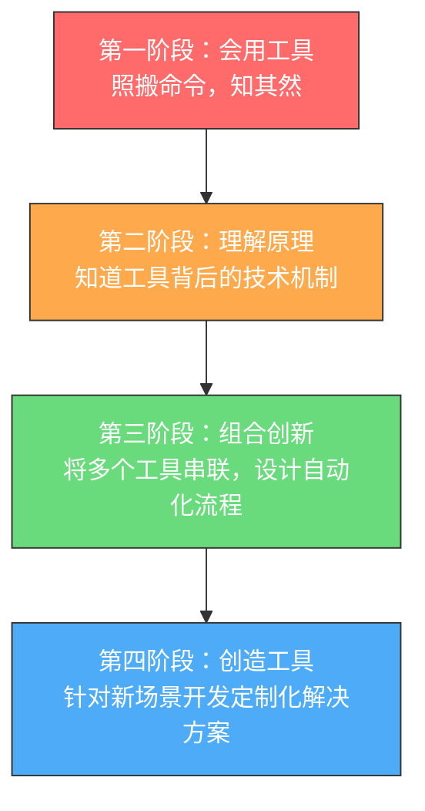
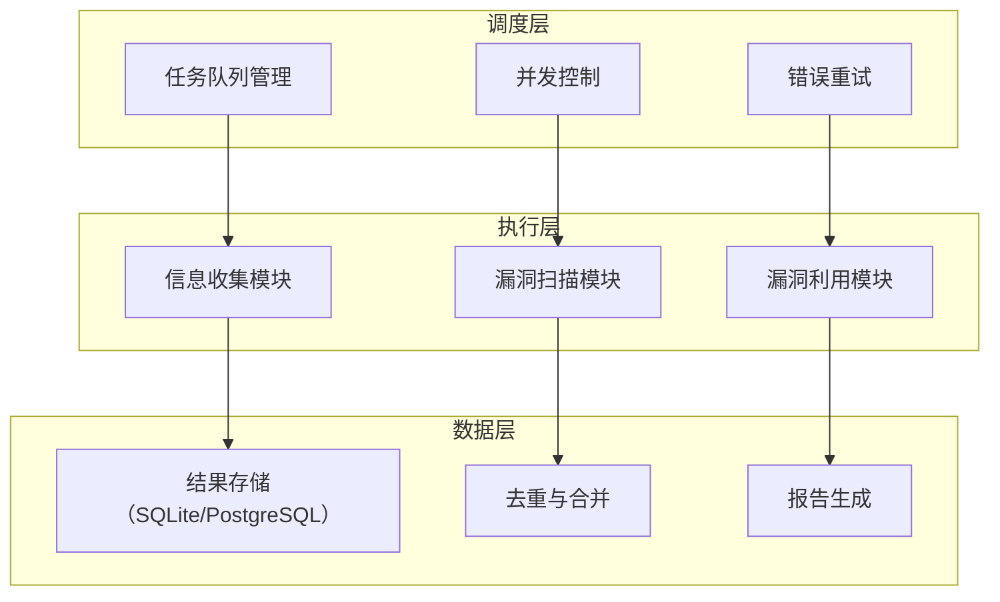
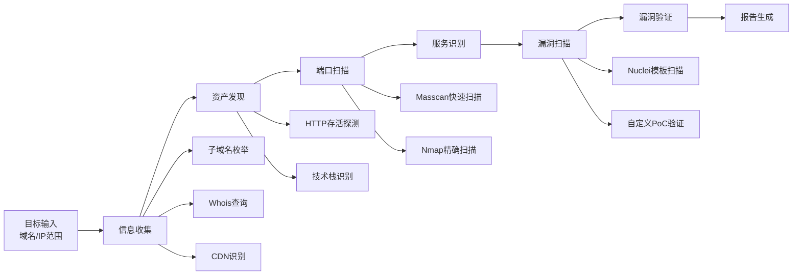

## 2.3 工具思维与自动化

工具是黑客能力的延伸，但工具本身不等于能力。真正的安全从业者遵循"理解原理→手动验证→工具提效→定制开发"的认知路径，将工具视为思维的放大器而非替代品。本节从工具哲学、自动化方法论、实战脚本开发三个维度，系统阐述如何建立正确的工具观并将其转化为持续的生产力。

### 2.3.1 工具使用者与工具创造者的鸿沟

安全行业存在一条清晰的能力分水岭：一侧是工具使用者（Script Kiddie），另一侧是工具创造者（Tool Builder）。两者的根本差异不在于会用多少工具，而在于对工具底层逻辑的理解深度。

#### 工具使用者的典型行为模式

- 打开Kali Linux，点击图形界面中的工具图标
- 按照网上的教程一步步输入命令
- 工具报错时不知如何排查，只能搜索错误信息
- 无法判断工具输出的准确性，盲目信任结果
- 遇到新场景时束手无策，因为没有现成教程可循

#### 工具创造者的行为模式

- 理解工具的工作原理，知道它在什么条件下有效、什么条件下失效
- 能根据目标环境的特点调整工具参数甚至修改工具源码
- 能将多个工具的输出整合成新的攻击链或检测逻辑
- 当没有现成工具时，能快速编写脚本解决问题
- 能评估工具的可靠性，识别误报和漏报

#### 能力跃迁的四阶段模型



以SQL注入为例，四个阶段的具体表现：

| 阶段 | 行为 | 能力边界 |
|------|------|----------|
| 会用工具 | 运行 `sqlmap -u "http://target.com/?id=1" --dbs` | 只能处理标准场景，遇到WAF或自定义过滤就卡住 |
| 理解原理 | 知道UNION注入需要列数匹配、盲注依赖布尔判断或时间延迟 | 能判断为什么sqlmap在某个目标上失败 |
| 组合创新 | 先用Burp抓包分析参数特征，再用自定义tamper脚本绕过WAF，最后用sqlmap的`--tamper`选项注入 | 能处理大多数有防御的目标 |
| 创造工具 | 针对特定CMS的注入点编写专用exploit，集成到自己的漏洞扫描框架中 | 能发现和利用sqlmap无法自动识别的复杂注入 |

### 2.3.2 原理优先的学习方法论

"先理解原理，再使用工具"不是一句口号，而是一套可执行的学习流程。

#### 步骤一：拆解工具的工作机制

以Nmap端口扫描为例，不要只记住 `nmap -sV -sC target`，而要理解：

- **TCP SYN扫描（-sS）**：发送SYN包，收到SYN/ACK表示端口开放，收到RST表示关闭。不完成三次握手，速度快且隐蔽
- **TCP Connect扫描（-sT）**：完成完整的三次握手，会被目标日志记录，但不需要root权限
- **UDP扫描（-sU）**：UDP无连接，靠ICMP端口不可达消息判断关闭状态，速度极慢
- **服务版本检测（-sV）**：发送特定探测字符串，匹配Nmap的`nmap-service-probes`数据库
- **脚本引擎（--script）**：基于Lua的NSE脚本，可以在扫描阶段执行自定义逻辑

理解这些后，你就知道为什么在某些场景下Nmap会给出错误结果——比如目标有状态防火墙丢弃了RST包，导致关闭端口被误判为被过滤。

#### 步骤二：手动重现工具的核心功能

用原始的网络编程重现工具的核心逻辑。以下是一个用Python的`socket`模块实现的TCP SYN扫描概念验证：

```python
import socket
import struct

def raw_tcp_syn_scan(target_ip, port):
    """
    概念演示：用原始套接字发送TCP SYN包
    注意：需要root权限，且仅用于学习目的
    实际环境中应使用scapy等专业库
    """
    # 创建原始套接字（需要root权限）
    sock = socket.socket(socket.AF_INET, socket.SOCK_RAW, socket.IPPROTO_TCP)
    sock.settimeout(2)
    
    # 手动构造TCP头部
    # 源端口、目标端口、序列号、确认号、数据偏移+标志位...
    source_port = 44444
    tcp_header = struct.pack(
        '!HHLLBBHHH',
        source_port,    # 源端口
        port,           # 目标端口
        0,              # 序列号
        0,              # 确认号
        (5 << 4),       # 数据偏移（5个32位字 = 20字节）
        0x02,           # 标志位：SYN = 0x02
        65535,          # 窗口大小
        0,              # 校验和（需要计算）
        0               # 紧急指针
    )
    
    # 实际实现中还需要构造IP头部、计算校验和
    # 这里仅为概念演示，省略了完整实现
    print(f"向 {target_ip}:{port} 发送SYN包")
    sock.close()

# 通过手动实现，你理解了：
# 1. SYN扫描的底层是原始套接字操作
# 2. 需要root权限的原因（操作原始套接字）
# 3. 为什么扫描速度受限于网络延迟和包处理能力
# 4. 防火墙如何通过丢弃SYN包来阻止扫描
```

#### 步骤三：对比手动实现与成熟工具的差异

手动实现后，你会深刻体会到成熟工具的价值：

- **性能优化**：Nmap使用异步I/O和并行扫描，手动脚本通常是串行的
- **可靠性处理**：Nmap处理了丢包重试、拥塞控制、各种异常响应
- **指纹数据库**：Nmap的`nmap-os-fingerprints`包含数千条操作系统指纹
- **隐蔽性设计**：Nmap支持分片、诱饵、时序控制等反检测技术

这种对比让你从"会用"升级到"理解为什么这样用"。

### 2.3.3 自动化思维的核心原则

自动化不是简单地把手动操作录制成脚本。真正的自动化思维遵循以下原则：

#### 原则一：识别可自动化的模式

| 手动操作特征 | 自动化可行性 | 示例 |
|-------------|-------------|------|
| 重复执行相同步骤 | 高 | 对100个IP执行相同的端口扫描 |
| 需要人工判断的复杂决策 | 低 | 分析漏洞的实际可利用性 |
| 数据格式转换和整合 | 高 | 将Nmap XML输出转换为Excel报告 |
| 需要交互式操作的工具 | 中 | 用`expect`自动化需要输入的CLI工具 |
| 基于规则的响应 | 高 | 发现开放端口后自动触发对应的服务扫描 |

#### 原则二：分层设计自动化系统

一个成熟的自动化安全工作流应该分三层：



#### 原则三：幂等性与容错

自动化脚本必须具备两个关键特性：

**幂等性**——多次执行产生相同结果：

```python
# 不幂等的写法：每次执行都会追加
with open('results.txt', 'a') as f:
    f.write(f"{target}: {result}\n")

# 幂等的写法：基于目标去重
import sqlite3

def save_result(target, result):
    """幂等保存：相同目标只保留最新结果"""
    conn = sqlite3.connect('scan_results.db')
    conn.execute("""
        INSERT OR REPLACE INTO results (target, port, service, updated_at)
        VALUES (?, ?, ?, datetime('now'))
    """, (target, result['port'], result['service']))
    conn.commit()
    conn.close()
```

**容错性**——单点失败不影响整体流程：

```python
import logging
from functools import wraps

logger = logging.getLogger(__name__)

def safe_execute(func):
    """装饰器：捕获异常但不中断流程"""
    @wraps(func)
    def wrapper(*args, **kwargs):
        try:
            return func(*args, **kwargs)
        except Exception as e:
            logger.error(f"{func.__name__} 失败: {e}")
            return None  # 返回None而不是抛出异常
    return wrapper

@safe_execute
def scan_port(target, port):
    """单个端口扫描，失败时返回None"""
    import socket
    sock = socket.socket(socket.AF_INET, socket.SOCK_STREAM)
    sock.settimeout(2)
    result = sock.connect_ex((target, port))
    sock.close()
    if result == 0:
        return {'port': port, 'status': 'open'}
    return None

# 主流程不受单个端口扫描失败影响
targets = ['192.168.1.1', '192.168.1.2', '10.0.0.1']
for target in targets:
    for port in [22, 80, 443, 8080]:
        result = scan_port(target, port)
        if result:
            print(f"[+] {target}:{port} 开放")
```

### 2.3.4 实战：构建自动化子域名枚举框架

下面从一个简单的脚本开始，逐步演进为一个可复用的框架，展示自动化思维的完整过程。

#### 第一版：最小可用脚本

```python
#!/usr/bin/env python3
"""
子域名枚举器 v1 - 最小可用版本
功能：通过DNS爆破发现子域名
"""
import requests
import sys

def enumerate_subdomains(domain, wordlist):
    """简单的子域名爆破脚本"""
    found = []
    with open(wordlist, 'r') as f:
        subdomains = f.read().splitlines()
    
    for sub in subdomains:
        url = f"http://{sub}.{domain}"
        try:
            response = requests.get(url, timeout=3)
            if response.status_code:
                print(f"[+] Found: {url} (Status: {response.status_code})")
                found.append(url)
        except requests.exceptions.RequestException:
            pass
    
    return found

if __name__ == "__main__":
    domain = sys.argv[1]
    wordlist = sys.argv[2]
    results = enumerate_subdomains(domain, wordlist)
    print(f"\n[+] Total found: {len(results)}")
```

**这个版本的问题：**
- 使用HTTP请求而非DNS查询，效率极低且会遗漏无Web服务的子域名
- 没有并发，1万个字典要跑很久
- 没有结果持久化，脚本中断就丢失进度
- 没有去重，同一个子域名可能被多次记录

#### 第二版：改用DNS查询 + 并发

```python
#!/usr/bin/env python3
"""
子域名枚举器 v2 - DNS查询 + 并发
改进：用DNS替代HTTP，增加并发，增加结果持久化
"""
import dns.resolver
import asyncio
import aiofiles
import json
import os
from datetime import datetime
from pathlib import Path

class SubdomainEnumerator:
    def __init__(self, domain, wordlist, concurrency=100, output_dir='results'):
        self.domain = domain
        self.wordlist = wordlist
        self.concurrency = concurrency
        self.output_dir = Path(output_dir)
        self.output_dir.mkdir(exist_ok=True)
        self.found = []
        self.semaphore = asyncio.Semaphore(concurrency)
    
    async def resolve_subdomain(self, subdomain):
        """异步DNS解析单个子域名"""
        fqdn = f"{subdomain}.{self.domain}"
        async with self.semaphore:
            try:
                resolver = dns.resolver.Resolver()
                resolver.timeout = 2
                resolver.lifetime = 2
                answers = await asyncio.get_event_loop().run_in_executor(
                    None, resolver.resolve, fqdn, 'A'
                )
                ips = [str(rdata) for rdata in answers]
                result = {'subdomain': fqdn, 'ips': ips, 'timestamp': datetime.now().isoformat()}
                self.found.append(result)
                print(f"[+] {fqdn} -> {', '.join(ips)}")
                return result
            except (dns.resolver.NXDOMAIN, dns.resolver.NoAnswer, 
                    dns.resolver.NoNameservers, dns.resolver.Timeout,
                    dns.exception.DNSException):
                return None
    
    async def run(self):
        """执行枚举"""
        # 加载字典
        async with aiofiles.open(self.wordlist, 'r') as f:
            words = [line.strip() async for line in f if line.strip()]
        
        print(f"[*] 开始枚举 {self.domain}，字典大小: {len(words)}")
        
        # 并发执行
        tasks = [self.resolve_subdomain(w) for w in words]
        await asyncio.gather(*tasks)
        
        # 保存结果
        output_file = self.output_dir / f"{self.domain}_{datetime.now():%Y%m%d_%H%M%S}.json"
        async with aiofiles.open(output_file, 'w') as f:
            await f.write(json.dumps(self.found, indent=2, ensure_ascii=False))
        
        print(f"\n[+] 完成！发现 {len(self.found)} 个子域名")
        print(f"[+] 结果保存到: {output_file}")
        return self.found

async def main():
    import sys
    if len(sys.argv) < 3:
        print(f"用法: {sys.argv[0]} <domain> <wordlist>")
        sys.exit(1)
    
    enumerator = SubdomainEnumerator(sys.argv[1], sys.argv[2])
    await enumerator.run()

if __name__ == "__main__":
    asyncio.run(main())
```

#### 第三版：集成多源数据 + 增量扫描

成熟的安全工具不会只依赖一种数据源。真正的子域名枚举应该整合多种方法：

```python
#!/usr/bin/env python3
"""
子域名枚举器 v3 - 多源数据整合
数据源：DNS爆破、证书透明度日志、搜索引擎、暴力枚举
"""
import asyncio
import aiohttp
import dns.resolver
import json
import sqlite3
import hashlib
from datetime import datetime
from pathlib import Path
from abc import ABC, abstractmethod

class DataSource(ABC):
    """数据源抽象基类"""
    @abstractmethod
    async def enumerate(self, domain: str) -> list:
        pass

class DNSBruteForce(DataSource):
    """DNS字典爆破"""
    def __init__(self, wordlist, concurrency=200):
        self.wordlist = wordlist
        self.concurrency = concurrency
    
    async def enumerate(self, domain):
        # 实现略，同v2的DNS解析逻辑
        pass

class CertificateTransparency(DataSource):
    """证书透明度日志查询（crt.sh）"""
    async def enumerate(self, domain):
        results = []
        url = f"https://crt.sh/?q=%.{domain}&output=json"
        async with aiohttp.ClientSession() as session:
            try:
                async with session.get(url, timeout=aiohttp.ClientTimeout(total=30)) as resp:
                    if resp.status == 200:
                        data = await resp.json()
                        seen = set()
                        for entry in data:
                            name = entry.get('name_value', '')
                            for sub in name.split('\n'):
                                sub = sub.strip().lower()
                                if sub.endswith(domain) and '*' not in sub and sub not in seen:
                                    seen.add(sub)
                                    results.append({'subdomain': sub, 'source': 'crt.sh'})
            except Exception as e:
                print(f"[-] crt.sh 查询失败: {e}")
        return results

class SearchEngineEnum(DataSource):
    """搜索引擎子域名发现（使用公开API）"""
    async def enumerate(self, domain):
        # 通过搜索引擎的site:操作符发现子域名
        # 实际实现需要处理反爬和API限制
        results = []
        # 这里可以集成多个搜索引擎的API
        return results

class SubdomainDB:
    """结果数据库管理"""
    def __init__(self, db_path):
        self.db_path = db_path
        self._init_db()
    
    def _init_db(self):
        conn = sqlite3.connect(self.db_path)
        conn.execute("""
            CREATE TABLE IF NOT EXISTS subdomains (
                id INTEGER PRIMARY KEY,
                domain TEXT NOT NULL,
                subdomain TEXT NOT NULL,
                ips TEXT,
                source TEXT,
                first_seen TEXT,
                last_seen TEXT,
                UNIQUE(domain, subdomain)
            )
        """)
        conn.execute("""
            CREATE TABLE IF NOT EXISTS scan_history (
                id INTEGER PRIMARY KEY,
                domain TEXT NOT NULL,
                scan_time TEXT,
                total_found INTEGER,
                new_found INTEGER,
                scan_config TEXT
            )
        """)
        conn.commit()
        conn.close()
    
    def upsert(self, domain, subdomain, ips, source):
        """插入或更新：新子域名记录首次发现时间，已存在的更新最后发现时间"""
        conn = sqlite3.connect(self.db_path)
        now = datetime.now().isoformat()
        try:
            conn.execute("""
                INSERT INTO subdomains (domain, subdomain, ips, source, first_seen, last_seen)
                VALUES (?, ?, ?, ?, ?, ?)
                ON CONFLICT(domain, subdomain) DO UPDATE SET
                    ips = excluded.ips,
                    last_seen = excluded.last_seen,
                    source = subdomains.source || ',' || excluded.source
            """, (domain, subdomain, json.dumps(ips), source, now, now))
            conn.commit()
            return True
        except sqlite3.IntegrityError:
            return False
        finally:
            conn.close()
    
    def get_new_since(self, domain, since_time):
        """获取指定时间后新发现的子域名"""
        conn = sqlite3.connect(self.db_path)
        cursor = conn.execute(
            "SELECT subdomain, ips FROM subdomains WHERE domain=? AND first_seen>?",
            (domain, since_time)
        )
        results = cursor.fetchall()
        conn.close()
        return results
```

### 2.3.5 工具链设计：从单点到体系

单个工具解决单个问题，工具链解决整个工作流。设计工具链的核心是定义清晰的数据流。

#### 典型渗透测试工具链



#### 工具链编排脚本示例

```python
#!/usr/bin/env python3
"""
安全评估工具链编排器
将多个独立工具串联成自动化工作流
"""
import subprocess
import json
import xml.etree.ElementTree as ET
from dataclasses import dataclass, field
from typing import List, Dict, Optional
from pathlib import Path

@dataclass
class Target:
    """评估目标"""
    domain: str
    ips: List[str] = field(default_factory=list)
    subdomains: List[str] = field(default_factory=list)
    open_ports: Dict[str, List[int]] = field(default_factory=dict)  # ip -> [ports]
    services: Dict[str, Dict[int, str]] = field(default_factory=dict)  # ip -> {port: service}
    vulnerabilities: List[dict] = field(default_factory=list)

class Pipeline:
    """安全评估流水线"""
    def __init__(self, target: Target, output_dir: str = 'assessment'):
        self.target = target
        self.output_dir = Path(output_dir)
        self.output_dir.mkdir(parents=True, exist_ok=True)
    
    def run_subdomain_enum(self):
        """阶段1：子域名枚举"""
        print("[*] 阶段1：子域名枚举")
        # 调用子域名枚举工具
        result_file = self.output_dir / 'subdomains.json'
        subprocess.run([
            'subfinder', '-d', self.target.domain,
            '-o', str(result_file), '-silent'
        ], timeout=300)
        
        if result_file.exists():
            with open(result_file) as f:
                data = json.load(f)
                self.target.subdomains = [item['host'] for item in data]
        print(f"    发现 {len(self.target.subdomains)} 个子域名")
    
    def run_alive_check(self):
        """阶段2：HTTP存活探测"""
        print("[*] 阶段2：HTTP存活探测")
        input_file = self.output_dir / 'subdomains.txt'
        output_file = self.output_dir / 'alive.txt'
        
        with open(input_file, 'w') as f:
            f.write('\n'.join(self.target.subdomains))
        
        subprocess.run([
            'httpx', '-l', str(input_file),
            '-o', str(output_file), '-silent',
            '-status-code', '-title', '-tech-detect'
        ], timeout=300)
        print(f"    存活目标已保存到 {output_file}")
    
    def run_port_scan(self, ports='1-10000'):
        """阶段3：端口扫描"""
        print("[*] 阶段3：端口扫描")
        # 先用Masscan快速扫描
        masscan_output = self.output_dir / 'masscan.json'
        all_ips = self.target.ips.copy()
        
        for ip in all_ips:
            subprocess.run([
                'masscan', ip, '-p', ports,
                '--rate', '1000',
                '-oJ', str(masscan_output),
                '--append-output'
            ], timeout=600)
        
        # 解析Masscan结果
        if masscan_output.exists():
            with open(masscan_output) as f:
                content = f.read().strip()
                if content:
                    # Masscan输出可能不是标准JSON数组
                    content = content.rstrip(',')
                    if not content.startswith('['):
                        content = '[' + content + ']'
                    results = json.loads(content)
                    for item in results:
                        ip = item.get('ip')
                        port = item.get('ports', [{}])[0].get('port')
                        if ip and port:
                            self.target.open_ports.setdefault(ip, []).append(port)
        
        # 再用Nmap精确扫描已发现的端口
        for ip, ports_list in self.target.open_ports.items():
            port_str = ','.join(map(str, ports_list))
            nmap_output = self.output_dir / f'nmap_{ip}.xml'
            subprocess.run([
                'nmap', '-sV', '-sC',
                '-p', port_str,
                '-oX', str(nmap_output),
                ip
            ], timeout=300)
            self._parse_nmap_xml(ip, nmap_output)
        
        print(f"    扫描完成，共发现 {sum(len(v) for v in self.target.open_ports.values())} 个开放端口")
    
    def _parse_nmap_xml(self, ip, xml_file):
        """解析Nmap XML输出"""
        if not xml_file.exists():
            return
        tree = ET.parse(xml_file)
        root = tree.getroot()
        self.target.services.setdefault(ip, {})
        
        for host in root.findall('.//host'):
            for port_elem in host.findall('.//port'):
                port_id = int(port_elem.get('portid'))
                service = port_elem.find('service')
                if service is not None:
                    self.target.services[ip][port_id] = service.get('name', 'unknown')
    
    def run_vuln_scan(self):
        """阶段4：漏洞扫描"""
        print("[*] 阶段4：漏洞扫描")
        # 收集所有存活的URL
        alive_file = self.output_dir / 'alive.txt'
        if not alive_file.exists():
            print("    [-] 无存活目标，跳过漏洞扫描")
            return
        
        nuclei_output = self.output_dir / 'nuclei_results.json'
        subprocess.run([
            'nuclei', '-l', str(alive_file),
            '-o', str(nuclei_output),
            '-json', '-silent',
            '-severity', 'critical,high,medium'
        ], timeout=1800)
        
        if nuclei_output.exists():
            with open(nuclei_output) as f:
                for line in f:
                    if line.strip():
                        self.target.vulnerabilities.append(json.loads(line))
        
        print(f"    发现 {len(self.target.vulnerabilities)} 个潜在漏洞")
    
    def generate_report(self):
        """阶段5：生成报告"""
        print("[*] 阶段5：生成报告")
        report = {
            'target': self.target.domain,
            'scan_time': __import__('datetime').datetime.now().isoformat(),
            'summary': {
                'subdomains_found': len(self.target.subdomains),
                'total_open_ports': sum(len(v) for v in self.target.open_ports.values()),
                'vulnerabilities_found': len(self.target.vulnerabilities),
            },
            'subdomains': self.target.subdomains,
            'open_ports': self.target.open_ports,
            'services': self.target.services,
            'vulnerabilities': self.target.vulnerabilities,
        }
        
        report_file = self.output_dir / 'report.json'
        with open(report_file, 'w') as f:
            json.dump(report, f, indent=2, ensure_ascii=False)
        
        print(f"[+] 报告已保存到: {report_file}")
        return report
    
    def run(self, ports='1-10000'):
        """执行完整流水线"""
        print(f"[*] 开始安全评估: {self.target.domain}")
        print("=" * 50)
        
        self.run_subdomain_enum()
        self.run_alive_check()
        self.run_port_scan(ports)
        self.run_vuln_scan()
        report = self.generate_report()
        
        print("=" * 50)
        print(f"[+] 评估完成！")
        return report

if __name__ == "__main__":
    import sys
    domain = sys.argv[1] if len(sys.argv) > 1 else "example.com"
    target = Target(domain=domain)
    pipeline = Pipeline(target)
    pipeline.run()
```

### 2.3.6 工具选择的评估框架

面对同类工具的多个选择，如何做出决策？以下是系统化的评估维度：

| 评估维度 | 权重 | 评估方法 |
|---------|------|---------|
| **准确性** | 高 | 用已知目标测试，对比已知事实验证结果 |
| **速度** | 中 | 相同条件下计时对比 |
| **可维护性** | 中 | 查看GitHub提交频率、Issue响应速度、文档质量 |
| **隐蔽性** | 视场景 | 分析工具的流量特征、是否支持代理、是否会产生大量日志 |
| **扩展性** | 中 | 是否支持插件、是否可以自定义规则、API是否完善 |
| **社区活跃度** | 低-中 | GitHub Stars、Forks、贡献者数量、最近更新时间 |
| **依赖复杂度** | 低 | 安装是否简单、依赖链是否过长、是否需要特殊环境 |

#### 同类工具对比示例：端口扫描器

| 特性 | Nmap | Masscan | Rustscan | Unicornscan |
|------|------|---------|----------|-------------|
| 速度 | 中等 | 极快（异步SYN） | 快（Rust实现） | 快 |
| 准确性 | 高 | 中等（可能丢包） | 高（调用Nmap） | 中等 |
| 隐蔽性 | 低-中（可调） | 低（流量大） | 中等 | 高 |
| 服务识别 | 强（NSE脚本） | 弱（仅端口） | 强（借用Nmap） | 弱 |
| 适用场景 | 精确扫描 | 大范围快速扫描 | 快速扫描+Nmap精确 | 隐蔽扫描 |
| 学习曲线 | 中等 | 低 | 低 | 高 |

**选择策略**：没有最好的工具，只有最适合场景的工具。大范围资产发现用Masscan，精确服务识别用Nmap，日常快速扫描用Rustscan。

### 2.3.7 自动化中的常见陷阱

#### 陷阱一：过度自动化

不是所有工作都应该自动化。以下情况应保持手动：

- **漏洞验证**：自动化扫描器的误报率通常在30%-70%，高危漏洞必须手动验证
- **报告解读**：工具输出是原始数据，需要人工分析才能得出有意义的结论
- **社会工程学**：自动化钓鱼邮件缺乏针对性，效果远不如手工定制
- **零日漏洞研究**：发现新漏洞需要创造性思维，目前无法自动化

#### 陷阱二：忽略工具的副作用

```python
# 危险：不加限制的自动化扫描可能造成拒绝服务
def bad_scan(target, ports):
    """反面教材：无限制并发"""
    import concurrent.futures
    with concurrent.futures.ThreadPoolExecutor(max_workers=1000) as executor:
        # 1000个并发连接可能打垮目标服务器
        futures = [executor.submit(scan_port, target, p) for p in ports]
        # ...

# 正确做法：限制并发和速率
def good_scan(target, ports, max_workers=50, delay=0.1):
    """正确的做法：控制并发和速率"""
    import concurrent.futures
    import time
    
    with concurrent.futures.ThreadPoolExecutor(max_workers=max_workers) as executor:
        futures = []
        for port in ports:
            futures.append(executor.submit(scan_port, target, port))
            time.sleep(delay)  # 速率限制
        results = [f.result() for f in concurrent.futures.as_completed(futures)]
    return [r for r in results if r]
```

#### 陷阱三：工具链的单点故障

```python
# 不健壮的工具链：一个环节失败就全部停止
def fragile_pipeline(target):
    subdomains = enumerate_subdomains(target)     # 失败则后续全部跳过
    alive = check_alive(subdomains)               # 失败则后续全部跳过
    ports = scan_ports(alive)                     # 失败则后续全部跳过
    vulns = scan_vulns(ports)                     # 失败则后续全部跳过

# 健壮的工具链：每个环节独立，失败不影响其他环节
def robust_pipeline(target):
    results = {'target': target}
    
    # 每个阶段独立执行，失败时使用空结果继续
    results['subdomains'] = safe_call(enumerate_subdomains, target, default=[])
    results['alive'] = safe_call(check_alive, results['subdomains'], default=[])
    results['ports'] = safe_call(scan_ports, results['alive'], default={})
    results['vulns'] = safe_call(scan_vulns, results['ports'], default=[])
    
    return results

def safe_call(func, *args, default=None):
    """安全调用：失败时返回默认值"""
    try:
        return func(*args)
    except Exception as e:
        print(f"[-] {func.__name__} 失败: {e}")
        return default
```

#### 陷阱四：忽视输出验证

工具的输出不等于事实。必须建立验证机制：

```python
def validate_scan_results(results):
    """验证扫描结果的合理性"""
    warnings = []
    
    for target, ports in results.items():
        # 检查1：开放端口数量是否异常
        if len(ports) > 100:
            warnings.append(f"[!] {target}: 开放端口数({len(ports)})异常，可能存在误报")
        
        # 检查2：是否包含已知的蜜罐特征
        honeypot_ports = {2222, 4444, 5555, 8888}
        if honeypot_ports.intersection(set(ports)):
            warnings.append(f"[!] {target}: 可能是蜜罐（检测到特征端口）")
        
        # 检查3：服务版本是否一致
        services = get_services(target, ports)
        if services.get(22, '').startswith('OpenSSH') and services.get(3389):
            warnings.append(f"[!] {target}: 同时开放SSH和RDP，可能是诱饵")
    
    return warnings
```

### 2.3.8 常用安全工具速查表

#### 信息收集

| 工具 | 用途 | 关键参数 | 安装方式 |
|------|------|---------|---------|
| Nmap | 端口扫描与服务识别 | `-sS` SYN扫描, `-sV` 版本检测, `-O` OS检测 | `apt install nmap` |
| Masscan | 大范围快速端口扫描 | `-p1-65535 --rate 10000` | `apt install masscan` |
| subfinder | 被动子域名枚举 | `-d domain -silent` | `go install github.com/projectdiscovery/subfinder/v2/cmd/subfinder@latest` |
| httpx | HTTP存活探测与技术识别 | `-l targets.txt -status-code -title -tech-detect` | `go install github.com/projectdiscovery/httpx/cmd/httpx@latest` |
| Shodan | 互联网资产搜索 | `shodan search "apache country:CN"` | `pip install shodan` |

#### 漏洞扫描与利用

| 工具 | 用途 | 关键参数 | 安装方式 |
|------|------|---------|---------|
| Nuclei | 基于模板的漏洞扫描 | `-l targets.txt -t cves/ -severity critical,high` | `go install github.com/projectdiscovery/nuclei/v3/cmd/nuclei@latest` |
| SQLMap | 自动化SQL注入 | `-u "URL" --dbs --batch` | `pip install sqlmap` |
| Burp Suite | Web应用安全测试平台 | 社区版免费，专业版付费 | 官网下载 |
| Metasploit | 漏洞利用框架 | `msfconsole` | `apt install metasploit-framework` |
| Nikto | Web服务器扫描 | `-h target -C all` | `apt install nikto` |

#### 密码攻击

| 工具 | 用途 | 关键参数 | 安装方式 |
|------|------|---------|---------|
| Hashcat | GPU加速密码破解 | `-m 0 -a 0 hash.txt wordlist.txt` | `apt install hashcat` |
| John the Ripper | 密码破解 | `--wordlist=rockyou.txt hash.txt` | `apt install john` |
| Hydra | 在线密码爆破 | `-l admin -P wordlist.txt target ssh` | `apt install hydra` |

#### 网络分析

| 工具 | 用途 | 关键参数 | 安装方式 |
|------|------|---------|---------|
| Wireshark | 图形化网络协议分析 | 过滤器：`http.request.method == "POST"` | `apt install wireshark` |
| tcpdump | 命令行抓包 | `-i eth0 -w capture.pcap port 80` | `apt install tcpdump` |
| mitmproxy | HTTP/HTTPS中间人代理 | `mitmproxy -p 8080` | `pip install mitmproxy` |

#### 逆向与二进制分析

| 工具 | 用途 | 关键参数 | 安装方式 |
|------|------|---------|---------|
| Ghidra | NSA开源逆向工程套件 | 支持多架构反编译 | 官网下载 |
| GDB | GNU调试器 | `gdb ./binary` → `r` → `bt` | `apt install gdb` |
| pwntools | CTF/漏洞利用开发框架 | `from pwn import *` | `pip install pwntools` |

### 2.3.9 自动化伦理与法律边界

自动化工具是双刃剑。放大能力的同时也放大了责任。

#### 法律红线

- **未经授权的扫描即违法**：即使只是端口扫描，对未授权的目标执行也违反《网络安全法》和《刑法》第285条（非法侵入计算机信息系统罪）
- **自动化≠免责**：用脚本攻击和手动攻击在法律上没有区别，自动化可能被视为"情节严重"的加重因素
- **工具开发者也有责任**：编写和分发专门用于攻击的工具，在某些司法管辖区也可能构成犯罪

#### 伦理准则

1. **只在授权范围内操作**：获得书面授权后才能进行任何安全测试
2. **控制影响范围**：自动化脚本必须有速率限制和范围限制，避免对目标造成拒绝服务
3. **保护数据安全**：测试过程中获取的敏感数据必须加密存储，测试结束后按约定销毁
4. **及时报告**：发现的漏洞应在约定时间内报告给相关方，不公开传播

### 2.3.10 进阶：自定义工具开发框架

当你需要的工具不存在时，就需要自己创造。以下是构建安全工具的Python框架：

```python
#!/usr/bin/env python3
"""
安全工具开发基础框架
提供参数解析、日志、并发、结果导出等通用功能
"""
import argparse
import logging
import json
import csv
import sys
import asyncio
from abc import ABC, abstractmethod
from datetime import datetime
from pathlib import Path
from typing import List, Any, Optional
from dataclasses import dataclass, field, asdict

# ========== 日志配置 ==========
def setup_logging(verbose=False, log_file=None):
    level = logging.DEBUG if verbose else logging.INFO
    handlers = [logging.StreamHandler(sys.stdout)]
    if log_file:
        handlers.append(logging.FileHandler(log_file))
    
    logging.basicConfig(
        level=level,
        format='%(asctime)s [%(levelname)s] %(name)s: %(message)s',
        datefmt='%Y-%m-%d %H:%M:%S',
        handlers=handlers
    )

# ========== 结果数据模型 ==========
@dataclass
class Finding:
    """发现项数据模型"""
    target: str
    category: str
    severity: str  # critical/high/medium/low/info
    title: str
    detail: str
    evidence: str = ""
    remediation: str = ""
    timestamp: str = field(default_factory=lambda: datetime.now().isoformat())

# ========== 结果导出器 ==========
class ResultExporter:
    """支持多种格式的结果导出"""
    @staticmethod
    def to_json(findings: List[Finding], output_path: str):
        with open(output_path, 'w') as f:
            json.dump([asdict(f) for f in findings], f, indent=2, ensure_ascii=False)
    
    @staticmethod
    def to_csv(findings: List[Finding], output_path: str):
        if not findings:
            return
        fieldnames = asdict(findings[0]).keys()
        with open(output_path, 'w', newline='') as f:
            writer = csv.DictWriter(f, fieldnames=fieldnames)
            writer.writeheader()
            for finding in findings:
                writer.writerow(asdict(finding))
    
    @staticmethod
    def to_markdown(findings: List[Finding], output_path: str):
        severity_order = {'critical': 0, 'high': 1, 'medium': 2, 'low': 3, 'info': 4}
        findings.sort(key=lambda f: severity_order.get(f.severity, 5))
        
        with open(output_path, 'w') as f:
            f.write(f"# 安全评估报告\n\n")
            f.write(f"生成时间: {datetime.now().strftime('%Y-%m-%d %H:%M:%S')}\n\n")
            f.write(f"## 摘要\n\n")
            
            for sev in ['critical', 'high', 'medium', 'low', 'info']:
                count = sum(1 for finding in findings if finding.severity == sev)
                if count:
                    f.write(f"- **{sev.upper()}**: {count}\n")
            
            f.write(f"\n## 详细发现\n\n")
            for i, finding in enumerate(findings, 1):
                f.write(f"### {i}. [{finding.severity.upper()}] {finding.title}\n\n")
                f.write(f"- **目标**: {finding.target}\n")
                f.write(f"- **分类**: {finding.category}\n")
                if finding.detail:
                    f.write(f"\n{finding.detail}\n\n")
                if finding.evidence:
                    f.write(f"**证据**:\n```\n{finding.evidence}\n```\n\n")
                if finding.remediation:
                    f.write(f"**修复建议**: {finding.remediation}\n\n")
                f.write("---\n\n")

# ========== 工具基类 ==========
class SecurityTool(ABC):
    """安全工具抽象基类"""
    def __init__(self):
        self.logger = logging.getLogger(self.__class__.__name__)
        self.findings: List[Finding] = []
    
    @abstractmethod
    def setup_args(self, parser: argparse.ArgumentParser):
        """定义命令行参数"""
        pass
    
    @abstractmethod
    async def run(self, args):
        """执行扫描逻辑"""
        pass
    
    def add_finding(self, target, category, severity, title, detail, 
                    evidence="", remediation=""):
        """记录一个发现"""
        finding = Finding(
            target=target, category=category, severity=severity,
            title=title, detail=detail, evidence=evidence,
            remediation=remediation
        )
        self.findings.append(finding)
        self.logger.info(f"[{severity.upper()}] {title} @ {target}")
    
    def export_results(self, output_dir: str, formats: List[str] = None):
        """导出结果"""
        if not formats:
            formats = ['json', 'csv', 'md']
        
        output_path = Path(output_dir)
        output_path.mkdir(parents=True, exist_ok=True)
        
        timestamp = datetime.now().strftime('%Y%m%d_%H%M%S')
        exporters = {
            'json': (ResultExporter.to_json, '.json'),
            'csv': (ResultExporter.to_csv, '.csv'),
            'md': (ResultExporter.to_markdown, '.md'),
        }
        
        for fmt in formats:
            if fmt in exporters:
                func, ext = exporters[fmt]
                filepath = output_path / f"report_{timestamp}{ext}"
                func(self.findings, str(filepath))
                self.logger.info(f"报告已导出: {filepath}")
    
    def main(self):
        """入口函数"""
        parser = argparse.ArgumentParser(description=self.__class__.__doc__)
        self.setup_args(parser)
        args = parser.parse_args()
        
        setup_logging(args.verbose if hasattr(args, 'verbose') else False)
        
        self.logger.info(f"开始执行: {self.__class__.__name__}")
        asyncio.run(self.run(args))
        
        output_dir = args.output if hasattr(args, 'output') else 'results'
        self.export_results(output_dir)
        
        self.logger.info(f"完成！共发现 {len(self.findings)} 个问题")

# ========== 使用示例 ==========
class HeaderChecker(SecurityTool):
    """HTTP安全头检测工具"""
    
    def setup_args(self, parser):
        parser.add_argument('targets', nargs='+', help='目标URL列表')
        parser.add_argument('-o', '--output', default='results', help='输出目录')
        parser.add_argument('-v', '--verbose', action='store_true', help='详细输出')
    
    async def run(self, args):
        import aiohttp
        
        security_headers = {
            'Strict-Transport-Security': ('HSTS未配置', 'high',
                '攻击者可以通过SSL剥离攻击降级HTTPS连接',
                '添加响应头: Strict-Transport-Security: max-age=31536000; includeSubDomains'),
            'Content-Security-Policy': ('CSP未配置', 'high',
                '无法防御XSS攻击中的内联脚本注入',
                '配置Content-Security-Policy限制脚本和资源来源'),
            'X-Frame-Options': ('X-Frame-Options未配置', 'medium',
                '页面可能被嵌入iframe，存在点击劫持风险',
                '添加响应头: X-Frame-Options: DENY'),
            'X-Content-Type-Options': ('X-Content-Type-Options未配置', 'low',
                '浏览器可能进行MIME类型嗅探，存在安全风险',
                '添加响应头: X-Content-Type-Options: nosniff'),
        }
        
        async with aiohttp.ClientSession() as session:
            for url in args.targets:
                if not url.startswith('http'):
                    url = f'https://{url}'
                try:
                    async with session.get(url, timeout=aiohttp.ClientTimeout(total=10),
                                          allow_redirects=True, ssl=False) as resp:
                        headers = {k.lower(): v for k, v in resp.headers.items()}
                        for header_name, (title, severity, detail, fix) in security_headers.items():
                            if header_name.lower() not in headers:
                                self.add_finding(url, '安全配置', severity, title, detail, remediation=fix)
                except Exception as e:
                    self.logger.error(f"请求失败 {url}: {e}")

if __name__ == "__main__":
    HeaderChecker().main()
```

### 2.3.11 本节核心要点

1. **工具是能力的延伸，不是能力本身**：先理解原理，再使用工具，最后才能创造工具
2. **自动化思维的核心是模式识别**：识别可重复、可规则化的操作，将其转化为脚本
3. **分层设计**：调度层、执行层、数据层各司其职，便于维护和扩展
4. **幂等性与容错**：自动化脚本必须能安全地重复执行，单点失败不影响整体
5. **工具链比单点工具更强大**：将多个工具串联，数据在工具间流转，形成完整工作流
6. **验证重于信任**：工具的输出不等于事实，必须建立验证机制
7. **法律和伦理是底线**：未经授权的自动化扫描就是违法行为
