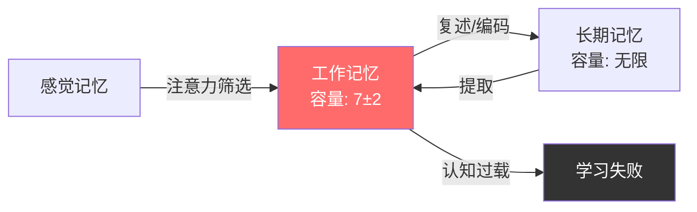
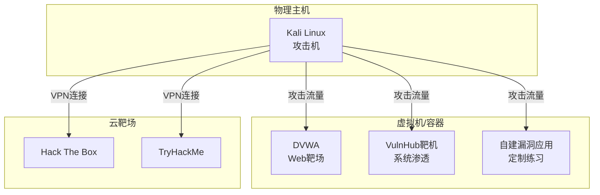

## 2.4 学习方法论

信息安全是一个知识密度极高、更新速度极快的领域。每年新增的CVE数量超过25,000个，新的攻击手法、防御机制、工具框架层出不穷。面对这样的知识洪流，传统的"从头到尾读完一本书"的学习方式已经远远不够。黑客需要的是一套经过验证的、可迭代的学习系统——它不仅要帮你获取知识，更要帮你将知识转化为可执行的直觉。

本节将从认知科学的理论基础出发，结合安全领域的特殊性，构建一套完整的学习方法论体系。

### 2.4.1 认知科学基础：理解你的大脑如何学习

在讨论具体方法之前，有必要先理解人类学习的底层机制。这些原理来自认知心理学的实证研究，是所有高效学习方法的理论基石。

#### 工作记忆与认知负荷

认知心理学家George Miller在1956年提出，人类的工作记忆容量约为7±2个信息单元。这意味着你一次能有效处理的信息是有限的。当学习一个新的安全概念时（比如理解XSS的DOM型变种），如果你同时还需要回忆HTTP协议、JavaScript DOM操作、浏览器安全模型等多个前置知识，工作记忆就会被占满，新知识无法有效编码到长期记忆中。

这就是为什么学习路径规划如此重要——你必须确保在学习任何高级主题之前，前置知识已经足够自动化（不需要占用工作记忆就能调用）。



#### 编码特异性原理

Tulving和Thomson在1973年的研究表明，记忆的提取效果与编码时的情境高度相关。用直白的话说：你在什么情境下学到的知识，在类似情境下更容易被回忆起来。

这对安全学习的启示是：如果你只通过阅读理论来学习SQL注入，那么在实际渗透测试中，你很可能无法回忆起这些知识。只有在真实的或模拟的攻防环境中练习，知识才会被编码到正确的情境中，从而在实战中被有效提取。

#### 间隔重复与遗忘曲线

Hermann Ebbinghaus在1885年通过实验绘制了著名的遗忘曲线：新学的知识如果不复习，20分钟后遗忘42%，1小时后遗忘56%，1天后遗忘74%，1个月后遗忘79%。

但每次复习都会重置遗忘速度。间隔重复系统（Spaced Repetition System, SRS）的核心算法就是：在你即将遗忘的临界点安排复习，用最少的复习次数实现最长的记忆保持。

| 复习次数 | 建议间隔 | 记忆保持率 |
|---------|---------|-----------|
| 第1次 | 学习后1天 | ~90% |
| 第2次 | 3天后 | ~92% |
| 第3次 | 7天后 | ~94% |
| 第4次 | 14天后 | ~95% |
| 第5次 | 30天后 | ~97% |
| 后续 | 逐步延长 | ~98%+ |

在安全领域，间隔重复特别适合记忆以下内容：
- 常见漏洞的利用模式和Payload
- 命令行工具的参数和用法
- 协议格式和关键字段
- 常见端口和服务的对应关系
- 编程语言中容易遗忘的语法细节

### 2.4.2 费曼学习法：用教代替学

Richard Feynman的学习方法论被广泛推崇，但很少有人将其适配到安全领域。费曼法的核心不是"向别人解释"这个行为本身，而是通过解释过程暴露你认知中的模糊地带。

#### 费曼法的四个步骤在安全学习中的应用

**第一步：选择一个概念并写出你的理解**

以"CSRF（跨站请求伪造）"为例。不要只写"一种让受害者在不知情的情况下执行操作的攻击"——这是教科书定义，不是你的理解。试着用自己的话写出：

> CSRF利用了浏览器自动附带Cookie的机制。当用户登录了bank.com后，浏览器会保存一个会话Cookie。如果此时用户访问了evil.com，evil.com的页面可以通过隐藏的表单或JavaScript向bank.com/transfer发起POST请求。浏览器会自动附带bank.com的Cookie，银行服务器无法区分这个请求是用户主动发起的还是被第三方诱导的。

**第二步：识别理解中的断裂点**

当你写下上面这段话后，问自己：
- 为什么浏览器要自动附带Cookie？这个设计的初衷是什么？
- SameSite Cookie属性是如何防御CSRF的？它的限制是什么？
- CSRF Token的具体生成和验证流程是什么？
- 为什么GET请求不应该有副作用？这和CSRF有什么关系？

如果你发现自己在某个问题上答不上来或含糊其辞，那就是你的知识断裂点。

**第三步：回到原始材料填补空白**

针对断裂点，查阅RFC 6265（Cookie规范）、OWASP CSRF Prevention Cheat Sheet、实际的CVE案例。不是泛泛地"看一遍"，而是带着具体的疑问去寻找答案。

**第四步：用最简单的语言重新组织**

尝试写一篇面向初级开发者的CSRF解释文章，要求：
- 不使用任何安全术语（除非你先解释了它）
- 用日常生活类比说明核心机制
- 包含一个可以亲手复现的最小示例
- 清楚说明防御方法和每种方法的优缺点

如果一个12岁的小孩能读懂你的解释并且能说出"哦，就是那个网站偷偷用我的身份去做坏事"，说明你真的理解了。

#### 费曼法的进阶：漏洞分析报告

费曼法有一个安全领域专用的变体——撰写漏洞分析报告。当你学完一个漏洞类型后，尝试写一份完整的分析报告，包含：

1. **漏洞概述**：用三句话说明这个漏洞是什么、为什么危险、影响范围
2. **技术原理**：详细的机制分析，包括数据流、信任模型、攻击面
3. **复现步骤**：从零搭建环境到成功利用的每一步操作
4. **根因分析**：代码层面的根本原因，不是表面症状
5. **修复方案**：至少给出两种修复思路，分析各自优劣
6. **防御检测**：WAF规则、IDS签名、代码审计检查点

这个过程会迫使你深入到"以为自己理解但其实并不理解"的层面。

### 2.4.3 刻意练习：从知道到做到

心理学家Anders Ericsson通过研究顶尖小提琴手、国际象棋大师等领域的专家发现，卓越表现的核心不是天赋，也不是简单的重复练习，而是刻意练习（Deliberate Practice）。

刻意练习与普通练习的关键区别：

| 维度 | 普通练习 | 刻意练习 |
|------|---------|---------|
| 目标 | 模糊（"学安全"） | 精确（"掌握SQL盲注的时间延迟技术"） |
| 难度 | 重复已会的 | 在能力边界之外的"拉伸区" |
| 反馈 | 无或延迟 | 即时、具体、可操作 |
| 关注 | 整体表现 | 单一薄弱环节 |
| 心态 | 舒适 | 需要高度集中注意力 |

#### 安全领域的刻意练习框架

**阶段一：分解技能树**

网络安全的技能树是高度分支化的。与其笼统地说"学习渗透测试"，不如将其分解为可独立练习的子技能：

```text
渗透测试
├── 信息收集
│   ├── 被动信息收集（OSINT）
│   ├── 主动信息收集（扫描枚举）
│   └── 信息关联与分析
├── 漏洞发现
│   ├── Web应用漏洞（OWASP Top 10）
│   ├── 服务漏洞（协议级）
│   ├── 逻辑漏洞
│   └── 配置错误
├── 漏洞利用
│   ├── RCE利用
│   ├── 权限提升
│   ├── 横向移动
│   └── 数据提取
├── 后渗透
│   ├── 持久化
│   ├── 痕迹清理
│   └── 数据渗出
└── 报告撰写
    ├── 技术细节
    ├── 业务影响
    └── 修复建议
```

每次练习只聚焦其中一个叶子节点。一次练习Session只练"SQL盲注布尔型技术"，而不是"所有SQL注入"。

**阶段二：选择挑战区任务**

挑战区的定义是：你大概有60-70%的成功概率。太简单会无聊，太难会挫败。具体到安全练习：

- **太简单**：用SQLMap自动跑一个已知有SQL注入的靶场
- **恰好的挑战**：手动完成一个SQL盲注，从发现到数据提取全程不用自动化工具
- **太难**：在完全陌生的环境中，不看任何提示，尝试找到并利用一个未知漏洞

推荐的练习平台按难度递进：

| 平台 | 难度 | 适合阶段 | 特点 |
|------|------|---------|------|
| DVWA | 入门 | 初学者 | 可调安全等级，有提示 |
| WebGoat | 入门-中等 | 初学者 | OWASP官方，有教学 |
| Hack The Box | 中等-高级 | 进阶 | 真实环境，社区活跃 |
| TryHackMe | 入门-中等 | 初学者-进阶 | 引导式学习路径 |
| PentesterLab | 中等 | 进阶 | 专注Web安全 |
| VulnHub | 中等-高级 | 进阶 | 可下载本地部署 |
| PortSwigger Academy | 中等 | 进阶 | Web安全最权威 |

**阶段三：获取高质量反馈**

反馈是刻意练习中最容易被忽视但最关键的环节。在安全学习中，反馈来源包括：

1. **自动化验证**：靶场平台通常会告诉你Flag是否正确，但这只是"结果反馈"
2. **对比解题报告**：Hack The Box等平台在机器退役后会发布官方Write-up。完成练习后，对比你的解法和他人的解法，特别关注：
   - 你用了哪些步骤？他人少了哪些（冗余分析）
   - 他人用了哪些步骤？你缺了哪些（知识盲区）
   - 同一步骤的实现方式有何不同（效率对比）
3. **社区审查**：将自己的Write-up发布到博客或论坛，接受社区反馈
4. **导师指导**：如果可能，找一位经验丰富的安全从业者定期Review你的工作

**第四步：针对性重复**

发现薄弱环节后，不要泛泛复习，而是设计针对性的练习：
- 如果你在权限提升方面薄弱，连续做10台Linux提权靶机
- 如果你对反序列化利用不熟，专门花一周时间只研究这个主题
- 如果你的报告写得差，找5份优秀的渗透测试报告，逐段分析其结构和表达

### 2.4.4 知识管理系统：构建你的第二大脑

安全领域的知识量大、更新快、关联性强。仅靠大脑记忆是不够的，你需要一个外部化的知识管理系统。这个系统不仅要存储信息，更要支持知识的发现、关联和演化。

#### 为什么需要知识管理系统

考虑一个典型场景：你在渗透测试中遇到了一个Exchange服务器。你之前研究过ProxyShell漏洞，但记不清具体是哪个端点、什么请求格式。如果没有知识管理系统，你要么重新Google（可能花10-30分钟），要么翻之前的聊天记录（可能找不到）。

如果你有一个组织良好的笔记系统，你可以在30秒内找到：ProxyShell的漏洞编号、影响版本、利用条件、请求示例、修复方法，以及你上次在哪个项目中遇到过类似环境。

#### 选择工具

| 工具 | 优势 | 劣势 | 适合人群 |
|------|------|------|---------|
| Obsidian | 本地Markdown、双向链接、图谱视图、插件生态丰富 | 需要自己组织结构 | 喜欢掌控数据的技术人 |
| Notion | 协作友好、数据库功能强大、模板丰富 | 云端存储、隐私顾虑、Markdown导出有损 | 团队协作场景 |
| Logseq | 开源、大纲式、双向链接 | 生态比Obsidian小 | 喜欢大纲思维的人 |
| 语雀/飞书文档 | 中文生态好、在线协作 | 锁定平台、数据迁移难 | 纯中文团队 |
| VS Code + Foam | 轻量、开发者友好 | 需要配置、学习曲线 | 深度VS Code用户 |

对于安全从业者，推荐Obsidian作为主力工具。原因：
- 所有数据以纯Markdown文件存储在本地，完全可控
- 双向链接和图谱视图天然适合安全知识的网状结构
- Git版本控制友好，可以追踪知识的演化过程
- 丰富的插件支持（如Dataview、Templater、Excalidraw）

#### 知识组织结构

安全知识库推荐采用"PARA"结构的变体：

```text
vault/
├── 00-Inbox/              # 未整理的快速记录
├── 01-Techniques/         # 攻击技术分类
│   ├── Web/
│   │   ├── SQL-Injection.md
│   │   ├── XSS.md
│   │   ├── SSRF.md
│   │   └── ...
│   ├── Network/
│   ├── System/
│   ├── Crypto/
│   └── Social-Engineering/
├── 02-Tools/              # 工具使用笔记
│   ├── Nmap.md
│   ├── Burp-Suite.md
│   ├── BloodHound.md
│   └── ...
├── 03-Writeups/           # 练习和实战的解题报告
│   ├── HTB/
│   ├── THM/
│   ├── CTF/
│   └── Real-World/
├── 04-Resources/          # 学习资源和参考
│   ├── Books.md
│   ├── Courses.md
│   ├── Blogs.md
│   └── Cheatsheets/
├── 05-Projects/           # 进行中的项目和研究
└── 06-Archive/            # 已归档的旧笔记
```

#### 笔记的最佳实践

**原子化原则**：每条笔记只记录一个概念。"SQL注入"不应该是一个巨大的笔记，而应该是多个原子笔记的集合：联合查询注入、布尔盲注、时间盲注、堆叠查询、WAF绕过、防御方案……每个都是独立的笔记，通过双向链接形成网络。

**双向链接的使用**：

```markdown
# 布尔盲注

布尔盲注是 [[SQL注入]] 的一种变体，适用于页面不回显数据库内容
但会根据查询结果返回不同页面的场景。

## 利用条件
- 目标存在 [[SQL注入点]]
- 页面有布尔状态差异（如内容显示/不显示）
- 通常配合 [[Substring函数]] 和 [[ASCII码比较]] 使用

## 常见Payload
- `AND 1=1` vs `AND 1=2` 判断注入点
- `AND (SELECT SUBSTRING(username,1,1) FROM users)='a'` 逐字符爆破

## 自动化工具
- [[SQLMap]] 的 `--technique=B` 模式
- 手动脚本编写参考 → [[Writeups/HTB/某个靶机]]

## 相关技术
- [[时间盲注]] — 当布尔差异也不明显时的替代方案
- [[DNSLog外带]] — 高效数据提取技术
```

**模板化**：为不同类型的笔记创建模板，确保信息结构一致。例如，漏洞笔记模板：

```markdown
# {{漏洞名称}}

## 概述
- 漏洞类型：
- 严重程度：
- 影响范围：

## 技术原理

## 利用条件

## 复现步骤
1. 
2. 
3. 

## Payload示例

## 修复方案

## 参考资料
- 
```

#### 间隔重复集成

将知识管理系统与间隔重复工具结合。推荐方案：

1. **Obsidian + Spaced Repetition插件**：直接在Obsidian内创建复习卡片，无需额外工具
2. **Anki手动导入**：将关键知识点制作为Anki卡片，利用其成熟的SRS算法
3. **自制复习日历**：用简单的脚本根据遗忘曲线安排复习，标记每条笔记的下次复习日期

Anki卡片示例（安全领域专用格式）：

```text
正面：SQL盲注中，如何判断数据库名的长度？
反手：使用二分法配合条件语句：
AND (SELECT LENGTH(database()))>N
通过不断缩小N的范围确定精确长度。
例：>5为真，>10为假 → 长度在6-10之间 → >7为真，>8为假 → 长度为8

标签：SQL注入/盲注/基础
```

### 2.4.5 高效阅读技术材料

安全领域有大量技术材料需要阅读：RFC文档、CVE报告、安全论文、源代码、Write-up、博客文章。不同类型材料有不同的阅读策略。

#### RFC和协议文档

RFC文档（如RFC 7231 HTTP/1.1）通常冗长且形式化。正确的阅读方法不是从头到尾线性阅读，而是：

1. **先读Abstract和Introduction**：理解文档要解决什么问题
2. **看目录结构**：了解文档的组织方式
3. **跳到与你当前需求相关的章节**：不需要通读
4. **重点关注MUST/SHOULD/MAY语句**：这些是协议的核心要求
5. **记录关键数据格式**：字段名、长度、取值范围

#### CVE和漏洞报告

一份高质量的CVE分析应该提取以下信息：

| 信息 | 作用 |
|------|------|
| CVE编号 | 唯一标识，用于追踪 |
| CVSS评分 | 量化严重程度 |
| 影响版本 | 判断目标是否受影响 |
| 攻击向量 | 网络/本地/物理 |
| 前置条件 | 利用所需条件 |
| 漏洞根因 | 代码层面的根本原因 |
| PoC/Exploit | 可复现的利用代码 |
| 修复方案 | 官方或临时修复 |
| 参考链接 | 延伸阅读 |

#### 源代码审计

阅读安全工具或目标应用的源代码时：

1. **先看入口点**：main函数、路由定义、配置文件
2. **追踪数据流**：用户输入从哪里进入，经过哪些处理，最终在哪里使用
3. **关注危险函数**：eval()、exec()、system()、pickle.loads()等
4. **检查权限逻辑**：认证、授权、访问控制的实现
5. **看错误处理**：异常是否被正确处理，错误信息是否泄露敏感数据

#### 源代码审计重点搜索模式

```bash
# Python危险函数
grep -rn "eval\|exec\|os\.system\|subprocess\|pickle\.loads\|yaml\.load" --include="*.py" .

# JavaScript危险函数
grep -rn "eval(\|innerHTML\|document\.write\|dangerouslySetInnerHTML" --include="*.js" .

# SQL拼接（非参数化查询）
grep -rn "execute.*f\"\|execute.*format\|execute.*+\|execute.*%" --include="*.py" .

# 硬编码密钥和凭证
grep -rn "password\s*=\s*['\"]\|api_key\s*=\s*['\"]\|secret\s*=\s*['\"]" --include="*.py" --include="*.js" --include="*.yaml" .
```

### 2.4.6 搭建个人实验环境

安全学习绝对离不开动手实践。阅读100篇关于SQL注入的文章，不如自己亲手在一个有SQL注入的应用上执行一次完整攻击。你需要一个随时可用的个人实验环境。

#### 最小化实验环境



**基础配置建议**：

- **攻击机**：Kali Linux或Parrot OS（虚拟机），配置至少4GB内存、50GB磁盘
- **靶机管理**：VirtualBox或VMware，建议使用NAT Network模式隔离靶场网络
- **容器靶场**：Docker Compose一键部署DVWA、WebGoat、Juice Shop等
- **流量分析**：攻击机上运行Wireshark，抓取所有攻击流量用于复盘

#### Docker一键部署靶场

```yaml
# docker-compose.yml - 多靶场环境
version: '3'
services:
  dvwa:
    image: vulnerables/web-dvwa
    ports:
      - "8081:80"
    environment:
      - MYSQL_PASS=dvwa

  webgoat:
    image: webgoat/webgoat
    ports:
      - "8082:8080"
    environment:
      - WEBGOAT_HOST=0.0.0.0

  juice-shop:
    image: bkimminich/juice-shop
    ports:
      - "8083:3000"

  sqlilabs:
    image: acgpiano/sqli-labs
    ports:
      - "8084:80"

networks:
  default:
    name: pentest-lab
```

启动命令：

```bash
docker-compose up -d
# 访问 http://localhost:8081 打开DVWA
# 访问 http://localhost:8082 打开WebGoat
# 访问 http://localhost:8083 打开Juice Shop
# 访问 http://localhost:8084 打开SQLi-labs
```

### 2.4.7 学习路径规划

安全领域的知识广度让很多初学者迷失方向。一个好的学习路径应该像游戏中的技能树——有明确的前置依赖，有阶段性的里程碑，有可衡量的进度指标。

#### 初学者路径（0-6个月）

**目标**：建立安全思维，掌握基础工具，能完成简单靶场

| 阶段 | 时间 | 学习内容 | 里程碑 |
|------|------|---------|--------|
| 1 | 第1-2月 | 计算机网络基础（TCP/IP、HTTP）、Linux基础操作、Python基础 | 能用Wireshark分析HTTP流量，能写Python脚本 |
| 2 | 第3-4月 | Web安全基础（OWASP Top 10）、Burp Suite基础、DVWA全等级通关 | 能手动发现和利用常见Web漏洞 |
| 3 | 第5-6月 | 信息收集、基础渗透测试流程、3-5台Easy级HTB靶机 | 能独立完成一台Easy靶机的渗透 |

#### 进阶路径（6-18个月）

**目标**：深入一个方向，具备独立渗透能力，开始CTF竞赛

| 阶段 | 时间 | 学习内容 | 里程碑 |
|------|------|---------|--------|
| 4 | 第7-9月 | Web安全深入（反序列化、SSRF进阶、JWT攻击）、代码审计入门 | 能审计中小型开源项目的Web安全 |
| 5 | 第10-12月 | 内网渗透基础（域渗透、横向移动）、权限提升技术 | 完成HTB Medium级靶机，理解域环境攻防 |
| 6 | 第13-18月 | 选择专精方向（Web/二进制/逆向/密码学）、参加CTF竞赛 | 在CTF中获得有效得分，发表Write-up |

#### 专家路径（18个月+）

**目标**：具备0day研究能力，能发现和利用未知漏洞

- 深入研究一个细分方向（如浏览器漏洞、内核漏洞、协议漏洞）
- 阅读安全顶会论文（Black Hat、DEF CON、USENIX Security）
- 参与开源安全工具开发
- 进行独立安全研究并提交CVE

### 2.4.8 持续学习的日常习惯

学习方法论的最终落脚点是日常习惯。以下是一套经过验证的日常学习框架：

#### 每日习惯（30-60分钟）

1. **威胁情报浏览**（10分钟）：浏览Hacker News、Reddit r/netsec、Twitter安全圈、安全客等信息源，了解最新漏洞和攻击事件
2. **技能练习**（20-40分钟）：在靶场平台上练习，或者继续进行当前的安全项目
3. **笔记整理**（10分钟）：将今天学到的内容整理到知识库中，建立双向链接

#### 每周习惯

1. **Write-up撰写**（2-3小时）：完成本周做的靶机或CTF题目的完整Write-up
2. **知识回顾**（30分钟）：复习间隔重复系统安排的内容
3. **社群交流**（1小时）：参与安全社群讨论，解答他人问题（费曼法的实战应用）

#### 每月习惯

1. **月度复盘**：回顾本月学到了什么、解决了什么问题、有什么新发现
2. **技能评估**：对照学习路径检查进度，调整下月计划
3. **深度阅读**：读一篇完整的安全论文或技术报告

### 2.4.9 常见学习误区

#### 误区一：工具收集症

症状：花大量时间收集和安装各种安全工具，但很少真正使用它们。收藏了几百个GitHub仓库，每个只看了README。

纠正：工具是手段不是目的。一个你真正会用的Nmap比100个你只会`--help`的工具有价值得多。采用"按需学习"原则——遇到具体问题时再去学相应的工具。

#### 误区二：教程地狱（Tutorial Hell）

症状：不停地跟着教程做，但脱离教程后就不会了。能跟着视频完成HTB靶机，但面对新环境完全不知道从何下手。

纠正：每完成一个教程后，立刻在一个没有教程的类似环境中独立练习。先尝试30分钟，实在不行再参考提示。关键是要经历"不知道该怎么办→尝试→失败→思考→再尝试"的过程。

#### 误区三：只攻不防

症状：只学攻击技术，对防御、安全架构、安全开发生命周期（SDL）完全不了解。

纠正：理解防御才能更好地攻击。很多优秀的漏洞发现来自于对防御机制的深入理解——知道WAF的规则才能绕过它，知道认证框架的设计才能找到逻辑漏洞。攻击和防御是一枚硬币的两面。

#### 误区四：孤岛式学习

症状：完全自己学，不参与社区，不分享，不交流。

纠正：安全社区是巨大的知识网络。一个人的学习速度远不如一个社区。参与Discord/Telegram安全群、参加本地安全聚会（如DEF CON Groups）、在CTF团队中协作、发表Write-up——这些都是加速学习的杠杆。

#### 误区五：忽略基础

症状：跳过计算机网络、操作系统、编程基础，直接学习高级渗透技术。结果在实战中遇到非标准情况就束手无策。

纠正：基础决定上限。不理解TCP三次握手的人，无法真正理解SYN Flood攻击。不理解内存管理的人，无法真正理解缓冲区溢出。花在基础上的时间永远不是浪费。

### 2.4.10 学习资源推荐

#### 书籍

| 书名 | 适合阶段 | 领域 | 推荐理由 |
|------|---------|------|---------|
| 《Web应用安全权威指南》 | 入门 | Web | 日本Web安全专家执笔，系统全面 |
| 《白帽子讲Web安全》 | 入门 | Web | 中文经典，适合国内读者 |
| 《黑客攻防技术宝典：Web实战篇》 | 中级 | Web | 深入Web安全各细分领域 |
| 《Metasploit渗透测试指南》 | 中级 | 渗透 | Metasploit框架权威指南 |
| 《The Web Application Hacker's Handbook》 | 中级-高级 | Web | Web安全领域的圣经 |
| 《渗透测试实战第三版》 | 中级 | 综合 | Georgia Weidman著，实操性强 |
| 《逆向工程核心原理》 | 高级 | 二进制 | 深入逆向分析技术 |
| 《加密与解密》 | 高级 | 逆向 | 中文逆向分析经典 |

#### 在线资源

- **PortSwigger Web Security Academy**：Web安全最权威的免费学习平台
- **Hack The Box Academy**：系统化的渗透测试学习路径
- **TryHackMe**：适合初学者的引导式学习
- **OWASP Testing Guide**：渗透测试方法论的权威参考
- **PayloadsAllTheThings**：GitHub上的Payload集合，覆盖所有攻击类型
- **GTFOBins**：Linux提权利用的SUID/Shell命令集合
- **CyberChef**：数据编解码、加密解密的瑞士军刀

#### 认证路径

认证不是学习的目的，但可以作为阶段性里程碑：

```text
入门级 ─────────────────────────────── 专家级

CompTIA ─→ eJPT ─→ OSCP ─→ OSWE/OSEP ─→ OSED ─→ 自主研究
Security+    ─→ CEH  ─→ GPEN ─→ GXPN    ─→ CVE提交
         ─→ PNPT  ─→ CRTO ─→ CRTP
```

其中OSCP（Offensive Security Certified Professional）是渗透测试领域含金量最高的入门级认证之一，它的考试要求你在24小时内独立完成对多台目标机器的渗透并提交报告。这个过程本身就是一次高强度的刻意练习。

### 2.4.11 本节总结

学习方法论的核心可以归纳为一个公式：

> **高效学习 = 正确的方法 × 持续的投入 × 及时的反馈**

- **费曼学习法**帮你暴露知识盲区，确保真正理解而非表面记忆
- **刻意练习**让你在能力边界反复拉伸，实现技能的真实增长
- **知识管理系统**将碎片化知识组织为可检索、可关联的知识网络
- **实验环境**提供零风险的练习场，让理论转化为肌肉记忆
- **学习路径**给出明确的阶段目标，避免迷失在知识海洋中
- **日常习惯**确保学习的持续性和系统性

最有效的学习方法是你能持续执行的方法。不要追求完美的体系，从今天开始记录第一条笔记、完成第一道靶场题目、写出第一篇Write-up——然后持续迭代你的方法和习惯。
