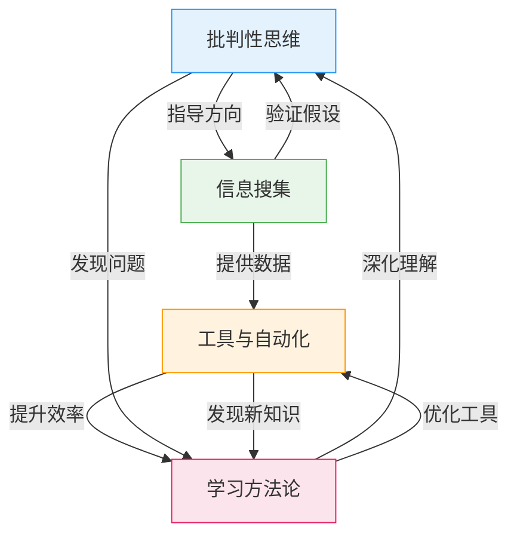

## 本节小结

本节从四个维度构建了安全从业者的核心技巧体系：**批判性思维与逆向思维**提供了看待安全问题的视角框架，**信息搜集技巧**奠定了渗透测试和安全研究的数据基础，**工具思维与自动化**解决了效率与深度的平衡问题，**学习方法论**则确保了持续成长的路径。这四个维度不是孤立的知识点，而是相互支撑的能力闭环——没有批判性思维，信息搜集就是盲目堆砌；没有自动化能力，再好的思维也受限于手工效率；没有系统的学习方法，所有技能都会停滞在入门水平。

### 四大核心技巧回顾

#### 批判性思维与逆向思维：安全从业者的思维底色

安全思维的本质是**不信任**——不信任默认配置、不信任用户输入、不信任看似安全的系统。普通用户看到登录页面想的是"输入账号密码"，安全研究者看到的是SQL注入可能性、HTTPS传输保护、暴力破解防护、会话管理安全性、CSRF防护机制、错误消息信息泄露、认证绕过路径等至少七个维度的安全考量。

本节介绍了三种核心思维工具：

| 思维工具 | 核心思想 | 适用场景 |
|---------|---------|---------|
| 第一性原理思维 | 回到问题本质，从基本假设出发推理 | 理解漏洞根因、推导防御方案 |
| 攻击树分析 | 将攻击目标层次化分解为子目标 | 系统化分析攻击路径、评估风险 |
| 威胁建模（STRIDE） | 按六类威胁维度系统识别风险 | 系统设计阶段的安全评审 |

第一性原理的价值在于**举一反三**。以SQL注入为例，背诵注入语句只能应对已知场景，但理解"用户输入被拼接为SQL指令"这个本质后，你能自行推导出参数化查询的防御原理、所有基于拼接的语句都存在风险、二次注入的成因等深层知识。这种从原理出发的思维方式，是区分"脚本小子"和真正安全研究者的关键分水岭。

攻击树由Bruce Schneier于1999年提出，其核心是将复杂攻击场景分解为AND/OR逻辑关系的层次结构。构建攻击树的五个步骤——定义根目标、分解子目标、确定逻辑关系、递归分解、评估可行性——为任何安全分析提供了可复用的框架。STRIDE模型则从欺骗、篡改、否认、信息泄露、拒绝服务、权限提升六个维度，配合数据流图（DFD）实现系统化的威胁识别。

#### 信息搜集技巧：渗透测试的第一步

信息搜集分为被动搜集和主动搜集两大类，二者的本质区别在于**是否与目标系统直接交互**。

被动信息搜集是零接触的情报收集，属于OSINT（开源情报）的核心范畴：

- **域名和IP情报**：WHOIS查询获取注册信息，DNS记录（A/MX/NS/TXT）揭示基础设施，证书透明度日志（crt.sh）枚举子域名
- **搜索引擎技巧**：Google Dorks通过`site:`、`filetype:`、`inurl:`、`intitle:`等运算符发现暴露的敏感文件、管理后台、目录列表
- **社交媒体情报（SOCMINT）**：LinkedIn暴露组织架构和技术栈，GitHub可能泄露代码和API密钥，技术论坛的问题求助可能暴露系统信息

主动信息搜集需要直接与目标交互，**必须确保已获得法律授权**：

- **端口扫描**：Nmap是最核心的工具，支持服务版本检测（`-sV`）、脚本扫描（`--script`）、操作系统识别（`-O`）、UDP扫描（`-sU`）
- **Web指纹识别**：whatweb、Wappalyzer识别技术栈，HTTP响应头和robots.txt泄露架构信息
- **子域名枚举**：subfinder、amass等工具结合字典爆破和被动数据源

信息搜集的质量直接决定后续渗透测试的深度。一个经验法则是：**在信息搜集阶段投入的时间，往往能节省后续数倍的测试时间**。遗漏一个子域名可能意味着遗漏一个完整的攻击面。

#### 工具思维与自动化：效率与理解的平衡

初学者最常见的误区是**过度依赖工具而不理解原理**。正确的成长路径是四步递进：

1. **先理解原理**：学习漏洞的成因、类型和影响机制
2. **手动实践**：使用Burp Suite等代理工具手动构造攻击载荷
3. **使用工具**：理解原理后，用SQLMap等自动化工具提升效率
4. **定制化开发**：当现有工具无法满足需求时，编写自定义脚本

自动化思维是优秀安全从业者的分水岭。Python是最推荐的自动化语言，其丰富的安全工具库（requests、scapy、pwntools等）和简洁的语法使其成为安全领域的首选。本节提供的子域名枚举脚本示例展示了自动化的基本模式：读取字典→遍历目标→发送请求→记录结果。

常用工具按功能可分为八大类别：

| 类别 | 代表工具 | 核心用途 |
|------|---------|---------|
| 信息搜集 | Nmap, Shodan, Censys | 网络扫描和互联网资产搜索 |
| Web测试 | Burp Suite, OWASP ZAP | Web应用安全测试的代理平台 |
| 漏洞利用 | Metasploit, sqlmap | 漏洞利用框架和自动化攻击 |
| 密码攻击 | Hashcat, John the Ripper | 离线/在线密码破解 |
| 无线安全 | Aircrack-ng, Wireshark | 无线网络和协议分析 |
| 逆向工程 | Ghidra, IDA Pro | 二进制程序分析和反编译 |
| 社会工程学 | SET, Gophish | 钓鱼攻击和社会工程框架 |
| 编程语言 | Python, Bash, Go | 脚本编写和工具开发 |

工具是手段而非目的。真正的能力体现在**当工具失效时，你能否理解底层原理并自行解决问题**。

#### 学习方法论：持续成长的引擎

安全领域的知识更新速度极快，有效的学习方法比具体的技术知识更重要。本节介绍了三种经过验证的学习方法：

**费曼学习法**的核心是"如果你无法用简单的语言解释一个概念，说明你还没有真正理解它"。在安全领域，尝试向非技术人员解释SQL注入、XSS、CSRF等概念，是检验自己理解深度的有效手段。当你发现自己卡在某个细节无法简化时，那就是需要回去深入学习的知识空白。

**刻意练习**强调四个要素：
- **聚焦具体技能**：不要泛泛地"学习安全"，而是专注于SQL注入、XSS、权限提升等具体技能点
- **在挑战区练习**：选择略高于当前能力的任务，太简单会无聊，太难会挫败
- **获得反馈**：通过CTF比赛、代码审查、WriteUp对比、导师指导获得即时反馈
- **持续重复**：定期练习形成肌肉记忆，安全技能和体育技能一样需要反复操练

**知识体系构建**是将零散知识转化为系统能力的关键。推荐使用Obsidian、Notion等双向链接笔记工具，建立概念之间的关联网络。记录每次学习的新概念、实战经验和教训，定期回顾和更新。一个好的知识体系应该能够让你在遇到新问题时，快速定位到相关的已有知识。

### 四大技巧的协同关系

这四个维度不是线性关系，而是相互支撑的闭环结构：

- **批判性思维→信息搜集**：思维决定搜集方向，有攻击者视角才能知道该搜集什么
- **信息搜集→自动化**：大量数据需要工具处理，手动搜集效率太低
- **自动化→学习方法论**：编写工具的过程深化对原理的理解，遇到的问题驱动学习
- **学习方法论→批判性思维**：持续学习扩展思维边界，新的知识带来新的攻击视角

### 从基础到进阶的跃迁路径

本节覆盖的四大核心技巧是**基础层**，为后续的进阶训练奠定基础。在进阶部分（2.5节），我们将在此基础上拓展以下能力：

| 基础技巧 | 进阶方向 | 能力跃迁 |
|---------|---------|---------|
| 批判性思维 | 红蓝紫队思维融合 | 从单点思考到攻防全局视角 |
| 信息搜集 | 漏洞挖掘系统化方法论 | 从被动搜集到主动发现 |
| 工具与自动化 | 攻击链构建能力 | 从单点工具到完整攻击链 |
| 学习方法论 | 安全研究与社区参与 | 从个人学习到行业贡献 |

基础阶段的目标是**建立正确的思维方式和基本技能**，进阶阶段的目标是**形成系统化的实战能力和研究方法论**。二者的关系是地基与建筑——没有扎实的基础，进阶内容只会是空中楼阁。

### 自检清单

完成本节学习后，你可以通过以下问题检验自己的掌握程度：

**批判性思维（2.1节）：**
- 能否用第一性原理解释至少三种常见Web漏洞的本质？
- 能否为一个简单系统构建完整的攻击树？
- 能否使用STRIDE模型对一个Web应用进行威胁建模？

**信息搜集（2.2节）：**
- 能否在不与目标交互的情况下，通过被动搜集获取域名、IP、技术栈等基础信息？
- 能否熟练使用至少三种Google Dork运算符？
- 能否使用Nmap进行基础的端口扫描和服务识别？

**工具与自动化（2.3节）：**
- 能否用Python编写一个基础的安全工具脚本？
- 是否理解工具背后的原理，而非仅仅会使用？
- 能否在工具失效时手动完成同样的任务？

**学习方法论（2.4节）：**
- 能否用简单的语言向非技术人员解释SQL注入？
- 是否有持续练习的CTF平台或靶场环境？
- 是否建立了个人安全知识库？

如果以上问题有超过一半无法自信回答，建议回到对应章节重新学习，并结合实践加深理解。

### 关键要点速记

1. **安全思维的核心是不信任**：对默认配置、用户输入、系统设计保持怀疑
2. **第一性原理优于经验类比**：理解本质才能举一反三
3. **信息搜集决定渗透深度**：投入在搜集阶段的时间会节省后续数倍时间
4. **先原理后工具**：理解底层机制比会用工具更重要
5. **自动化是能力分水岭**：Python是安全领域最推荐的自动化语言
6. **费曼学习法检验理解深度**：无法简化解释说明理解不足
7. **刻意练习需要反馈**：CTF、WriteUp对比、导师指导都是反馈来源
8. **知识体系是长期资产**：用双向链接工具构建概念关联网络

这些核心技巧将在后续的每一个章节中反复应用和深化。带着这些思维框架和方法论进入实战学习，你会发现技术知识的吸收效率显著提升。
