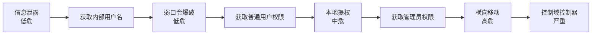
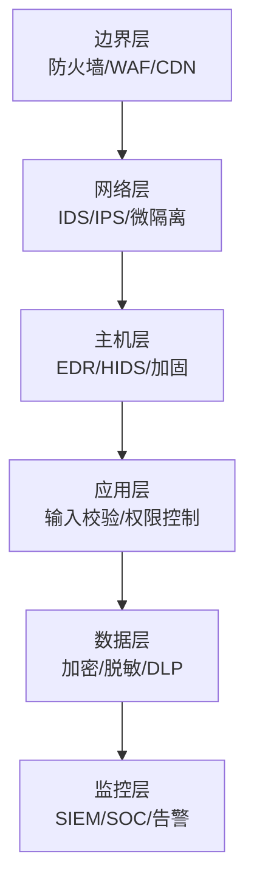
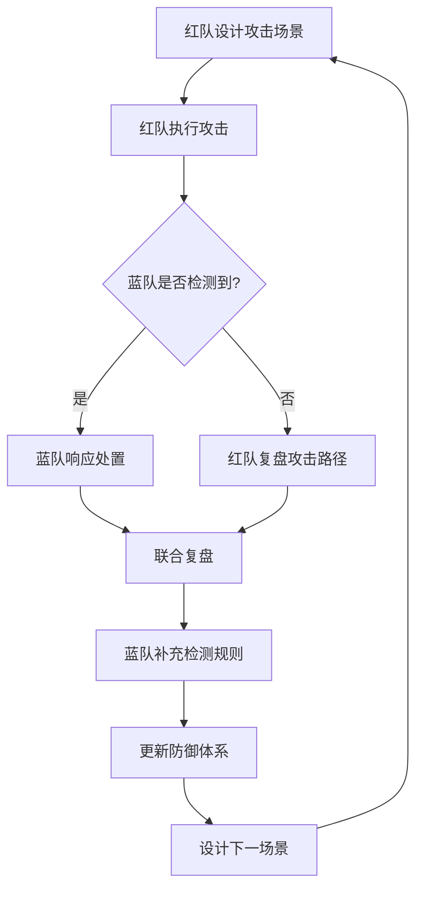
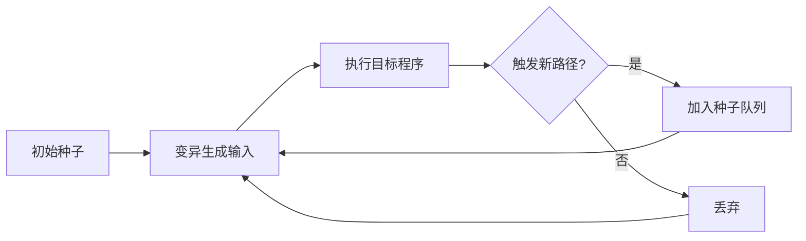
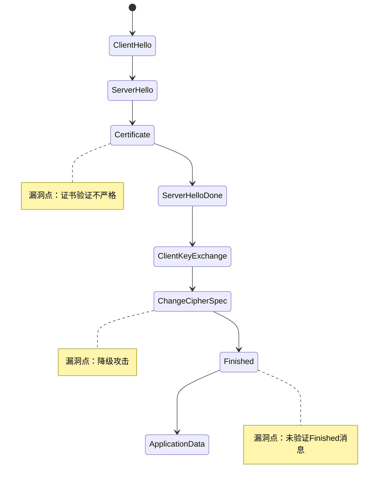

## 2.5 黑客思维模式的进阶训练

掌握基础安全知识只是起点。真正的黑客能力差距不在工具层面，而在思维层面——面对同一个目标，有人看到的是表面功能，有人看到的是底层信任模型、状态机缺陷和隐式攻击面。本节系统性地训练进阶黑客思维，涵盖红蓝对抗思维、漏洞挖掘方法论、攻击链构建、安全研究路径、实战能力培养和社区参与六大维度。

### 2.5.1 红队思维与蓝队思维的融合

#### 红队思维：攻击者的视角

红队思维的本质是**在约束条件下寻找最短攻击路径**。与渗透测试不同，红队行动模拟真实APT攻击者，不受限于预定义的测试范围，而是以业务目标为导向。

**红队思维的五个核心特征：**

**1. 最短路径原则**

攻击者永远在寻找达成目标的最高效方式。这不是"尝试所有已知漏洞"的暴力方式，而是基于目标环境的架构理解，选择阻力最小的路径。

以一个典型的企业内网为例：直接攻击面向互联网的Web应用可能面对WAF、IDS等多层防护；但通过钓鱼邮件获取一个普通员工的凭证，再利用内网缺乏微隔离的特点横向移动，往往效率更高。2020年SolarWinds供应链攻击就是最短路径原则的极致体现——攻击者没有直接攻击目标组织，而是入侵了所有目标都在使用的供应链软件。

**2. 信任关系利用**

系统中的任何信任关系都是潜在攻击面。信任关系包括但不限于：

| 信任类型 | 示例 | 攻击利用方式 |
|----------|------|-------------|
| 网络信任 | 内网主机互信、VPN准入 | 从受信网络发起攻击绕过边界防护 |
| 身份信任 | SSO、OAuth令牌、API Key | 窃取或伪造信任凭证 |
| 软件信任 | 签名验证、白名单 | 供应链攻击、DLL劫持 |
| 人员信任 | 社交关系、权威服从 | 社会工程学攻击 |
| 数据信任 | 内部API不校验输入 | 从内部接口注入恶意数据 |

**3. 链式思维（Kill Chain Thinking）**

单个低危漏洞的价值有限，但将多个低危漏洞串联起来，可以形成高危攻击链。这是红队思维的核心能力。



**4. 环境适应能力**

相同的漏洞在不同环境中可能有完全不同的利用方式和影响范围。红队思维要求根据目标环境的特点动态调整策略：

- **云环境**：关注IAM配置错误、元数据服务、容器逃逸
- **IoT环境**：关注固件提取、调试接口、默认凭证
- **移动应用**：关注证书固定绕过、本地存储、组件暴露
- **内网环境**：关注协议缺陷（如LLMNR/NBT-NS投毒）、组策略配置

**5. 持久化思维**

真正的攻击者不满足于一次性的访问权限，而是思考如何在目标系统中长期保持存在，同时避免被检测。持久化的层次包括：

- **用户层**：植入Webshell、计划任务、启动项、SSH密钥
- **系统层**：Rootkit、引导区感染、固件植入
- **身份层**：创建隐藏账户、修改ACL、植入Golden Ticket
- **网络层**：DNS隧道、ICMP隧道、合法服务隐蔽通信

#### 蓝队思维：防御者的视角

蓝队思维的本质是**通过理解正常来识别异常**。蓝队不是简单地"打补丁+装防火墙"，而是构建一个能够感知、分析和响应威胁的有机防御体系。

**蓝队思维的五个核心特征：**

**1. 纵深防御（Defense in Depth）**

纵深防御的核心假设是：任何单一安全措施都可能被绕过，因此需要构建多层、异构的防御体系。



**2. 基线建立（Baseline）**

你无法检测你不了解的东西。蓝队必须深入理解系统的正常行为模式，才能在异常出现时及时识别。

基线建立的关键维度：
- **网络基线**：正常的流量模式、DNS查询、外部连接
- **进程基线**：正常的进程树、父子关系、启动参数
- **用户行为基线**：正常的登录时间、访问资源、操作模式
- **配置基线**：系统的安全配置基线（如CIS Benchmark）

**3. 快速响应（Incident Response）**

安全事件发生后的响应速度直接影响损失范围。蓝队思维要求预先制定响应预案，并通过演练不断优化。

事件响应的关键指标：
- **MTTD（平均检测时间）**：从入侵发生到被发现的时间
- **MTTR（平均响应时间）**：从发现到开始处置的时间
- **MTTC（平均控制时间）**：从发现到威胁被控制的时间

根据IBM《2024年数据泄露成本报告》，MTTD低于200天的组织，数据泄露平均成本比超过200天的组织低约40%。

**4. 威胁建模（Threat Modeling）**

威胁建模是系统性识别和评估潜在威胁的结构化方法。主流的威胁建模方法包括：

| 方法 | 适用场景 | 核心思路 |
|------|---------|---------|
| STRIDE | 应用安全 | 欺骗、篡改、抵赖、信息泄露、拒绝服务、提权 |
| PASTA | 业务驱动 | 以业务风险为中心的七阶段威胁建模 |
| DREAD | 风险评估 | 损害、复现性、受影响用户、可发现性、可利用性 |
| LINDDUN | 隐私保护 | 链接、识别、不可否认、检测、数据泄露、不知情、不合规 |

**5. 日志分析能力**

从海量日志中提取有价值的安全信息是蓝队的核心技能。日志分析的关键在于：

- **知道看什么**：安全相关的日志源（认证日志、网络流量、DNS查询、PowerShell执行、WMI活动）
- **知道怎么关联**：将不同来源的日志通过时间、IP、用户等维度关联分析
- **知道什么是异常**：偏离基线的行为模式，如异常时间登录、异常数据量传输、异常命令执行

#### 紫队协作：攻防融合的实践模式

紫队不是红队和蓝队的简单叠加，而是一种**协同作战模式**。其核心理念是：攻击的价值不在于"攻破"，而在于驱动防御能力的提升。

紫队协作的典型工作流：



紫队协作的关键实践：
- **攻击前沟通**：红队提前告知攻击的大致时间和范围（但不透露具体手法）
- **实时观察**：蓝队在攻击执行期间观察检测系统的反应
- **立即复盘**：攻击结束后立即进行技术复盘，而非等待报告
- **能力转化**：将每次攻击发现的盲区转化为具体的检测规则或防御措施

### 2.5.2 漏洞挖掘的系统化方法论

漏洞挖掘不是"碰运气"，而是有方法论支撑的系统性工程。以下三种思维模式是漏洞挖掘能力的核心。

#### 模糊测试思维（Fuzzing Mindset）

模糊测试通过向目标程序输入大量随机或半随机的数据来发现异常行为。模糊测试思维的核心是**理解输入空间并系统性地探索它**。

**模糊测试的五个关键维度：**

**1. 输入空间分析**

在开始Fuzz之前，必须充分理解目标程序接受的输入类型：

```text
输入类型分析清单：
├── 文件格式输入
│   ├── 文本文件（JSON、XML、CSV、YAML）
│   ├── 二进制文件（图片、音视频、文档）
│   └── 自定义格式（私有协议、配置文件）
├── 网络协议输入
│   ├── 应用层协议（HTTP、DNS、SMTP）
│   ├── 传输层异常（畸形TCP/UDP包）
│   └── 自定义协议（私有端口服务）
├── 命令行参数
│   ├── 位置参数
│   ├── 选项参数
│   └── 环境变量
└── API输入
    ├── REST API（JSON Body、Query参数、Path参数）
    ├── GraphQL（Query、Mutation、变量）
    └── RPC接口（序列化数据）
```

**2. 变异策略**

变异策略决定了Fuzzer生成测试用例的方式。常用的变异策略包括：

| 策略 | 方法 | 适用场景 |
|------|------|---------|
| 位翻转 | 随机翻转输入中的若干位 | 二进制协议、文件格式 |
| 字节替换 | 用特殊值替换特定字节 | 边界值测试 |
| 块操作 | 插入、删除、复制数据块 | 格式解析器 |
| 字典替换 | 用已知危险值替换 | SQL注入、命令注入等 |
| 语法感知 | 基于格式语法生成变异 | 结构化输入（JSON/XML） |
| 覆盖率引导 | 根据代码覆盖率调整变异方向 | 通用场景 |

**3. 覆盖率引导**

覆盖率引导是现代Fuzzer（如AFL、LibFuzzer、Honggfuzz）的核心技术。其原理是：跟踪每次输入触发的代码路径，优先保留那些触发了新路径的输入作为后续变异的种子。



**4. 崩溃分析**

发现崩溃只是第一步，更重要的是判断崩溃是否可利用：

- **段错误（SIGSEGV）**：访问非法内存地址，可能可利用
- **堆溢出**：覆盖堆元数据，可能实现任意写
- **栈溢出**：覆盖返回地址，可能实现代码执行
- **Use-After-Free**：释放后使用，可能实现类型混淆
- **整数溢出**：导致缓冲区分配不足，间接引发内存损坏

**5. 实用Fuzzing工具链**

```text
模糊测试工具选择：
├── 通用覆盖率引导Fuzzer
│   ├── AFL++（最流行，支持多种模式）
│   ├── LibFuzzer（进程内，适合库函数）
│   └── Honggfuzz（支持硬件反馈）
├── 协议Fuzzer
│   ├── Boofuzz（网络协议Fuzzing框架）
│   └── Kitty（协议Fuzzing框架）
├── 文件格式Fuzzer
│   ├── AFL++ QEMU模式（无需源码）
│   └── WinAFL（Windows平台）
└── 浏览器Fuzzer
    ├── ClusterFuzz（Google OSS-Fuzz）
    └── Domato（DOM Fuzzer）
```

#### 代码审计思维（Code Audit Mindset）

代码审计是从源代码层面发现安全漏洞的方法，其核心是**理解数据流并追踪信任边界的变化**。

**代码审计的五个关键维度：**

**1. 数据流追踪**

追踪用户输入从进入到使用的完整路径。关键在于识别"Source"（数据入口）和"Sink"（危险操作点）。

常见的Source（不可信数据入口）：
- HTTP请求参数（GET/POST/COOKIE/HEADER）
- 文件上传内容
- 数据库查询结果（可能已被污染）
- 外部API返回值
- 用户输入的命令行参数

常见的Sink（危险操作点）：
- SQL查询拼接 → SQL注入
- Shell命令拼接 → 命令注入
- HTML模板渲染 → XSS
- 文件路径拼接 → 路径遍历
- 反序列化操作 → 反序列化漏洞
- XML解析 → XXE

**2. 危险函数识别**

不同语言有其特有的危险函数，审计时应优先关注：

```python
# Python 危险函数示例
eval(user_input)          # 代码执行
exec(user_input)          # 代码执行
os.system(cmd)            # 命令注入
subprocess.call(cmd, shell=True)  # 命令注入
pickle.loads(data)        # 反序列化
yaml.load(data)           # YAML反序列化（未使用SafeLoader）
open(os.path.join(dir, user_file))  # 路径遍历
```

```javascript
// JavaScript 危险函数示例
eval(userInput);                     // 代码执行
new Function(userInput);             // 代码执行
innerHTML = userInput;               // XSS
document.write(userInput);           // XSS
child_process.exec(cmd);             // 命令注入
JSON.parse(userInput);               // 原型链污染风险
```

```java
// Java 危险函数示例
Runtime.getRuntime().exec(cmd);      // 命令注入
ObjectInputStream.readObject();      // 反序列化
Statement.execute(sql);              // SQL注入
XMLReader.parse(input);              // XXE（未禁用外部实体）
```

**3. 补丁分析（Patch Diffing）**

通过对比补丁前后的代码差异，可以快速理解漏洞的成因，甚至推导出利用方式。补丁分析的典型流程：

1. 获取补丁前后的版本（如通过Git历史、安全公告中的commit链接）
2. 使用diff工具（如BinDiff、Diaphora、IDA的Bindiff插件）进行二进制或源码对比
3. 分析变更的代码逻辑，理解修复了什么问题
4. 反向推导漏洞的成因和可能的利用方式
5. 验证推导是否正确（在安全的测试环境中）

**4. 审计辅助工具**

```text
代码审计工具矩阵：
├── 静态分析（SAST）
│   ├── Semgrep（规则驱动，支持多语言）
│   ├── CodeQL（GitHub出品，查询式分析）
│   ├── SonarQube（企业级，持续集成）
│   ├── Bandit（Python专用）
│   ├── ESLint + security-plugin（JavaScript）
│   └── Brakeman（Ruby on Rails）
├── 依赖扫描（SCA）
│   ├── Snyk（依赖漏洞扫描）
│   ├── OWASP Dependency-Check
│   └── npm audit / pip audit / cargo audit
└── 动态分析（DAST）
    ├── Burp Suite（Web应用）
    ├── OWASP ZAP（开源Web扫描）
    └── SQLMap（SQL注入专用）
```

#### 协议分析思维（Protocol Analysis Mindset）

网络协议分析是发现协议层面漏洞的关键能力。协议漏洞往往影响范围极广（如Heartbleed影响了全球大量HTTPS服务器），且不易通过常规扫描发现。

**协议分析的五个关键维度：**

**1. 状态机理解**

网络协议通常定义了严格的状态转换过程。漏洞往往出现在：
- **非法状态转换**：跳过某个必要的状态直接进入后续状态
- **状态混淆**：在某个状态下执行了只有另一状态才允许的操作
- **状态残留**：连接断开后状态未正确清理

以TLS握手为例：



**2. 时序分析**

协议消息的发送顺序和时间间隔可能泄露敏感信息：
- **时序侧信道**：通过响应时间差异推断密码的正确字符
- **重放攻击**：截获并重放合法消息
- **竞态条件**：在状态转换的间隙发送消息

**3. 实用协议分析工具**

- **Wireshark**：网络协议分析的事实标准，支持数百种协议解析
- **Scapy**：Python协议构造和发送库，适合自定义协议测试
- **tcpdump**：轻量级命令行抓包工具
- **mitmproxy**：交互式HTTPS代理，适合应用层协议分析
- **protobuf-decoder / grpcurl**：gRPC协议分析

### 2.5.3 攻击链构建能力

#### MITRE ATT&CK框架的深度应用

MITRE ATT&CK是描述攻击者战术和技术的知识库，是构建攻击链的标准化参考框架。它将攻击活动分解为14个战术阶段和数百种具体技术。

| 阶段 | 英文 | 描述 | 典型技术示例 |
|------|------|------|-------------|
| 侦察 | Reconnaissance | 收集目标信息以规划攻击 | OSINT、网络扫描、社工信息收集 |
| 资源开发 | Resource Development | 建立攻击所需的基础设施 | 购买域名、获取代码签名证书 |
| 初始访问 | Initial Access | 获得目标环境的初始立足点 | 钓鱼邮件、漏洞利用、供应链攻击 |
| 执行 | Execution | 在目标系统上执行恶意代码 | PowerShell、WMI、计划任务 |
| 持久化 | Persistence | 维持对目标系统的访问权限 | 注册表自启动、DLL劫持、账户创建 |
| 提权 | Privilege Escalation | 获取更高权限 | 内核漏洞利用、配置错误利用 |
| 防御规避 | Defense Evasion | 绕过安全检测措施 | 代码混淆、进程注入、Rootkit |
| 凭证访问 | Credential Access | 获取认证凭证 | LSASS内存读取、键盘记录、Kerberoasting |
| 发现 | Discovery | 了解目标环境的结构和配置 | 域信息枚举、网络拓扑发现 |
| 横向移动 | Lateral Movement | 在网络中扩展访问范围 | Pass-the-Hash、RDP、SMB |
| 收集 | Collection | 收集感兴趣的目标数据 | 文件收集、屏幕截图、音频录制 |
| 命令与控制 | Command and Control | 与被控系统建立通信通道 | DNS隧道、HTTPS C2、合法云服务 |
| 渗出 | Exfiltration | 将数据传输到攻击者控制的外部系统 | 加密通道、DNS渗出、物理设备 |
| 影响 | Impact | 破坏、干扰或操纵系统和数据 | 勒索加密、数据销毁、服务中断 |

#### 攻击链构建的系统方法

构建攻击链不是按顺序执行每个阶段，而是根据目标环境的特点和防御态势动态调整。

**Web应用攻击链示例（完整版）：**

```text
阶段1：侦察（1-3天）
├── 子域名枚举（subfinder、amass、证书透明度日志）
├── 端口和服务扫描（nmap、masscan）
├── 技术栈识别（Wappalyzer、WhatWeb）
├── 目录和文件枚举（dirsearch、ffuf）
├── JS文件分析（API端点、硬编码凭证、子域名）
├── Wayback Machine历史页面分析
└── GitHub/GitLab代码泄露检查

阶段2：初始访问
├── 已知CVE漏洞利用（Struts2、Log4j、Spring4Shell）
├── 业务逻辑漏洞（越权、竞态条件、支付逻辑）
├── 认证绕过（默认凭证、JWT伪造、OAuth配置错误）
└── 供应链入口（第三方组件漏洞、CDN投毒）

阶段3：立足点巩固
├── 上传Webshell（考虑免杀和隐蔽性）
├── 获取数据库连接信息
├── 收集内部服务地址和凭证
└── 建立反向Shell或C2通道

阶段4：内网扩展
├── 内网信息收集（网段、主机、服务、用户）
├── 利用获取的凭证横向移动
├── 攻击域控制器（Kerberoasting、DCSync、Zerologon）
└── 获取关键业务系统访问权限

阶段5：目标达成
├── 定位和获取目标数据
├── 数据打包和加密传输
└── 痕迹清理（如需要）
```

#### 攻击链构建的练习方法

**方法一：基于公开报告的攻击链复现**

选择公开的APT报告（如Mandiant、CrowdStrike、卡巴斯基的报告），在实验室环境中复现整个攻击链。推荐的公开报告来源：
- MITRE ATT&CK Groups页面（每个APT组织的技术映射）
- APT Reports GitHub仓库（github.com/aptnotes）
- 各安全厂商的年度威胁报告

**方法二：基于场景的攻击链设计**

给定一个场景（如"获取某电商平台的用户数据"），自主设计完整的攻击链。关键练习点：
- 为每个阶段准备至少两种备选方案
- 考虑被检测后的降级策略
- 估算每个步骤的时间和资源消耗

**方法三：Purple Team演练**

在获得授权的环境中，红队执行攻击链，蓝队实时监控和响应，演练后联合复盘。这是最接近实战的训练方式。

### 2.5.4 安全研究的方法论

#### 从问题到发现的研究路径

安全研究不是漫无目的地测试，而是有结构的探索过程。

**安全研究的六阶段方法论：**

**阶段一：问题定义**

明确研究的目标和范围。好的问题定义应该满足：
- **具体**：不是"找X产品的漏洞"，而是"分析X产品在处理Y场景时是否存在Z类漏洞"
- **可验证**：研究结果必须可以被独立复现和验证
- **有价值**：研究发现应该对安全社区或业务有实际意义

**阶段二：文献调研**

在开始动手之前，全面了解已有的研究成果：
- 搜索CVE数据库，了解目标产品已知的安全问题
- 阅读相关安全论文和技术博客
- 查看目标产品的安全公告和补丁历史
- 了解同类产品的安全研究方法

**阶段三：技术分析**

深入分析目标系统的技术实现：
- 架构分析：理解系统的整体架构和组件关系
- 接口分析：识别所有对外接口和数据入口
- 代码分析：审计关键代码路径和安全敏感逻辑
- 配置分析：检查默认配置和安全配置选项

**阶段四：假设形成**

基于技术分析结果，形成具体的漏洞假设。好的假设应该：
- 基于已知的漏洞模式（如OWASP Top 10、CWE Top 25）
- 结合目标系统的具体技术实现
- 考虑攻击者的真实利用场景

**阶段五：实验验证**

设计实验来验证或否定假设：
- 在安全的测试环境中进行
- 记录详细的实验步骤和结果
- 多次重复验证确保结果的可靠性
- 探索漏洞的边界条件和影响范围

**阶段六：成果整理**

将研究发现整理成有价值的输出：
- 漏洞报告：包含漏洞描述、影响范围、复现步骤、修复建议
- 技术博客：分享研究方法和发现过程
- 安全论文：对研究进行系统性总结和理论提升
- 工具/脚本：将研究成果工具化，方便社区使用

#### 安全论文的高效阅读方法

安全研究论文数量庞大，高效阅读是保持技术前沿的关键能力。

**论文阅读的三层策略：**

```text
第一层：快速筛选（5-10分钟/篇）
├── 读标题和摘要 → 判断是否与自己的研究方向相关
├── 看图表和实验结果 → 快速了解核心贡献
└── 决定是否值得深入阅读

第二层：结构化阅读（30-60分钟/篇）
├── 理解威胁模型 → 论文假设了什么样的攻击场景
├── 分析技术方案 → 核心创新点是什么
├── 评估实验设计 → 实验是否合理、结果是否有说服力
└── 思考局限性 → 论文的方法有什么适用范围和限制

第三层：深度研读（2-4小时/篇，仅对关键论文）
├── 复现实验 → 亲手跑一遍代码或算法
├── 检查引用 → 追溯关键引用，理解技术背景
├── 批判性分析 → 找出论文的假设、局限和可能的改进方向
└── 笔记整理 → 提取可复用的技术方法和思路
```

**推荐的安全研究论文来源：**

| 来源 | 特点 | 适用方向 |
|------|------|---------|
| USENIX Security | 顶级学术会议 | 综合安全 |
| IEEE S&P | 顶级学术会议 | 系统安全、密码学 |
| CCS | 顶级学术会议 | 网络安全、应用安全 |
| NDSS | 顶级学术会议 | 网络安全、DNS安全 |
| Black Hat/DEFCON | 工业界会议 | 实战攻防 |
| arXiv cs.CR | 预印本 | 最新研究（未经同行评审） |
| Google Project Zero Blog | 漏洞研究 | 浏览器/OS/内核漏洞 |

### 2.5.5 实战能力培养路径

#### CTF竞赛训练体系

CTF（Capture The Flag）竞赛是系统性培养安全实战能力的有效途径。CTF不是"做题考试"，而是对安全思维和技术能力的综合训练。

**CTF的主要赛题类型：**

| 类型 | 英文 | 核心能力 | 典型题目 |
|------|------|---------|---------|
| Web安全 | Web | Web漏洞发现和利用 | SQL注入、XSS、反序列化、SSRF |
| 二进制漏洞利用 | PWN | 内存损坏漏洞利用 | 栈溢出、堆利用、格式化字符串 |
| 逆向工程 | Reverse | 程序分析和理解 | 恶意软件分析、加密算法识别 |
| 密码学 | Crypto | 密码算法分析 | RSA攻击、AES侧信道、哈希碰撞 |
| 杂项 | Misc | 综合能力 | 隐写术、流量分析、区块链 |

**分阶段训练计划：**

**入门阶段（0-6个月）——建立基础**

目标：掌握基本安全概念和工具使用。

```text
月1-2：基础技能
├── 学习一门编程语言（Python优先）
├── Linux基础操作和Shell脚本
├── 网络基础（TCP/IP、HTTP协议）
└── Web安全基础（OWASP Top 10）

月3-4：工具入门
├── Burp Suite（Web安全测试）
├── Wireshark（网络分析）
├── Ghidra（逆向分析）
├── GDB/pwndbg（二进制调试）
└── CyberChef（数据编解码）

月5-6：初级练习
├── 平台：CTFHub、BUUCTF、攻防世界
├── 难度：入门到简单
├── 目标：完成50-100道基础题目
└── 重点：Web和Misc方向
```

**进阶阶段（6-18个月）——专精方向**

目标：在选定方向上达到能独立解题的水平。

```text
选择主攻方向后深入学习：

Web方向：
├── 深入学习各种Web漏洞的利用技巧
├── 学习代码审计方法
├── 研究Java/PHP/Python反序列化
├── 学习SSRF、XXE、SSTI等高级漏洞
└── 阅读CTF WriteUp积累解题思路

PWN方向：
├── 深入学习x86/x64汇编
├── 掌握栈溢出的各种利用技术
├── 学习堆利用（glibc malloc机制）
├── 学习各种保护机制的绕过方法
└── 练习ROP链构造

Crypto方向：
├── 数论基础（模运算、欧拉定理、中国剩余定理）
├── RSA攻击方法全集
├── 对称密码分析基础
├── 哈希函数攻击
└── 椭圆曲线密码学基础

参加比赛：
├── 国内：XCTF、强网杯、网鼎杯、CISCN
├── 国际：DEF CON CTF Quals、Google CTF、PlaidCTF
└── 每场比赛后认真阅读WriteUp，学习新方法
```

**高级阶段（18个月以上）——创新输出**

目标：能够独立发现和利用新漏洞，开始输出安全研究内容。

- 在知名CTF比赛中取得稳定成绩
- 能够独立出题并搭建CTF环境
- 开始关注真实软件的安全研究
- 输出自己的安全研究内容（博客、工具、论文）

#### 漏洞赏金实战

漏洞赏金（Bug Bounty）是将CTF能力转化为实战经验、并获得经济回报的重要途径。

**从CTF到Bug Bounty的思维转变：**

| 维度 | CTF | Bug Bounty |
|------|-----|-----------|
| 目标 | 解出题目拿到Flag | 发现真实产品的安全漏洞 |
| 环境 | 人造的、有明确解法 | 真实的、可能没有已知利用方式 |
| 范围 | 明确的题目范围 | 需要自己确定测试重点 |
| 竞争 | 团队合作为主 | 独立研究为主，竞争激烈 |
| 价值 | 学习和荣誉 | 经济回报和职业发展 |

**Bug Bounty入门路径：**

**第一步：平台选择和注册**

主流漏洞赏金平台：
- **HackerOne**：最大的漏洞赏金平台，项目最多
- **Bugcrowd**：第二大平台，企业项目为主
- **Intigriti**：欧洲最大的平台
- **补天**：国内最大的漏洞响应平台
- **漏洞盒子**：国内知名平台

**第二步：选择合适的起步项目**

新手常见错误是直接去测大项目（如Google、Facebook），结果浪费大量时间一无所获。正确的起步策略：

- 选择**范围较小**的项目（单一Web应用比整个企业好）
- 选择**文档较好**的项目（有详细的scope和规则说明）
- 选择**响应较快**的项目（鼓励新手，也便于学习反馈）
- 关注**新上线**的项目（竞争少，漏洞多）

**第三步：系统化测试方法**

```text
漏洞赏金测试流程：
├── 1. 信息收集（投入30-40%的时间）
│   ├── 子域名枚举和发现
│   ├── 端口扫描和服务识别
│   ├── 技术栈和框架识别
│   ├── JavaScript文件分析
│   ├── API端点发现
│   └── 历史版本和备份文件发现
├── 2. 功能理解和业务逻辑分析
│   ├── 完整走通所有业务流程
│   ├── 理解用户角色和权限体系
│   ├── 记录所有API端点和参数
│   └── 识别安全敏感功能（认证、支付、文件处理）
├── 3. 自动化扫描
│   ├── Burp Suite主动扫描
│   ├── Nuclei模板扫描
│   └── 自定义脚本扫描
├── 4. 手动深入测试
│   ├── 认证和授权测试
│   ├── 输入验证测试
│   ├── 业务逻辑测试
│   ├── API安全测试
│   └── 第三方组件漏洞
└── 5. 报告撰写和提交
    ├── 清晰描述漏洞和影响
    ├── 提供详细的复现步骤
    ├── 附带PoC（概念验证）
    └── 给出修复建议
```

**第四步：报告撰写**

好的漏洞报告应该包含：

```text
标题：[组件] [漏洞类型] [简要影响]

概述：一句话描述漏洞及其影响

影响：量化受影响的用户/数据范围

复现步骤：
1. 步骤一（附截图或请求/响应）
2. 步骤二
3. 步骤三
...

技术细节：
- 漏洞根因分析
- 利用条件
- 影响范围

修复建议：
- 具体的修复方案（不是笼统的"加强输入验证"）
```

#### 真实漏洞研究实战

当你具备了CTF和Bug Bounty的经验后，可以开始进行更深层次的安全研究。

**漏洞研究的四个层次：**

```text
层次1：已知漏洞利用（Script Kiddie）
└── 使用公开的PoC/EXP工具利用已知漏洞

层次2：变种漏洞发现（Bug Hunter）
└── 基于已知漏洞模式，在新目标中发现类似漏洞

层次3：未知漏洞挖掘（Security Researcher）
└── 通过代码审计或Fuzzing发现全新的零日漏洞

层次4：漏洞利用链构造（Exploit Developer）
└── 将多个漏洞组合，突破现代安全防护机制（如沙箱逃逸）
```

### 2.5.6 安全社区参与和知识输出

技术能力的提升不应该是孤立的过程。安全社区的参与和知识输出是加速成长的重要方式。

#### 技术博客写作

技术博客是安全研究者展示能力和分享知识的重要渠道。一篇好的安全技术博客应该满足：

**内容标准：**
- **有原创性**：不是简单翻译或转载别人的内容
- **有技术深度**：不是"Hello World"级别的入门教程
- **有可复现性**：读者能按照你的步骤复现你的发现
- **有防御建议**：不仅展示攻击，还要提供建议的防御措施

**推荐的博客平台：**
- **个人博客**：最灵活，适合长期积累（Hugo/Jekyll/Ghost）
- **Medium**：国际化平台，适合英文内容
- **安全社区博客**：先知社区、FreeBuf、看雪论坛
- **GitHub Pages**：与代码仓库结合，方便分享工具

#### 开源项目贡献

参与开源安全项目是提升技术能力和社区影响力的有效方式。

**开源安全项目的贡献路径：**

```text
入门级贡献：
├── 报告Bug和文档错误
├── 改进文档和README
├── 添加翻译
└── 修复简单的Bug

进阶级贡献：
├── 添加新功能或模块
├── 编写测试用例
├── 优化性能
└── 代码审查

高级贡献：
├── 架构设计和重构
├── 安全漏洞修复
├── 发布维护
└── 成为核心维护者
```

**推荐参与的开源安全项目：**

| 项目 | 类型 | 入手难度 | 贡献机会 |
|------|------|---------|---------|
| Nuclei | 漏洞扫描模板 | 低（写YAML模板） | 非常多 |
| OWASP ZAP | Web安全扫描 | 中（Java） | 多 |
| Burp Suite Extensions | Burp插件 | 中（Java/Python） | 多 |
| Metasploit | 渗透测试框架 | 高（Ruby） | 中 |
| Ghidra | 逆向工程工具 | 高（Java） | 中 |
| YARA | 恶意软件规则 | 低（写规则） | 非常多 |

#### 安全会议参与

参加安全会议是扩展视野、学习前沿技术和建立人脉的重要方式。

**国内主要安全会议：**

| 会议 | 特点 | 适合人群 |
|------|------|---------|
| 看雪安全峰会 | 技术深度高，偏底层安全 | 逆向/内核/漏洞研究者 |
| 补天白帽大会 | 白帽黑客社区 | Bug Bounty研究者 |
| KCon | 黑客大会，技术前沿 | 综合安全研究者 |
| ISC | 产业安全大会 | 安全从业者 |
| XCON | 安全技术大会 | 综合安全研究者 |

**国际主要安全会议：**

| 会议 | 特点 | 适合人群 |
|------|------|---------|
| Black Hat | 最知名的安全技术会议 | 安全研究者、企业安全 |
| DEF CON | 最大的黑客社区会议 | 黑客文化爱好者 |
| USENIX Security | 顶级学术会议 | 学术研究者 |
| REcon | 逆向工程专题 | 逆向工程师 |
| OffensiveCon | 攻击性安全 | 渗透测试/红队 |

### 2.5.7 思维训练的常见误区与纠正

#### 误区一：过度依赖工具

**表现**：一上来就打开扫描器，扫描结果出来后只会用现成的PoC。

**纠正**：工具是思维的延伸，不是思维的替代。在使用任何工具之前，先问自己：
- 这个工具在做什么？它的检测逻辑是什么？
- 它可能遗漏什么？它的盲区在哪里？
- 如果没有这个工具，我该如何手动完成同样的事情？

#### 误区二：只关注技术细节忽略业务逻辑

**表现**：深入研究某个CVE的技术细节，但忽略了漏洞在真实业务场景中的影响和利用价值。

**纠正**：始终从业务视角评估安全问题。一个"中危"的技术漏洞在特定业务场景下可能造成"严重"的业务影响。

#### 误区三：单点思维，缺乏系统视角

**表现**：发现一个漏洞就认为完成任务，没有思考这个漏洞在攻击链中的位置。

**纠正**：每个发现都应该放在更大的攻击图景中思考。问自己：
- 这个发现能为后续攻击打开什么路径？
- 与其他已知信息结合能产生什么效果？
- 攻击者会如何利用这个发现？

#### 误区四：只学攻击不学防御

**表现**：对攻击技术如数家珍，但不知道如何检测和防御这些攻击。

**纠正**：真正的安全能力是攻防一体的。每次学习一种攻击技术时，同步研究：
- 这种攻击会在系统中留下什么痕迹？
- 如何配置检测规则来发现这种攻击？
- 有哪些防御措施可以阻止或缓解这种攻击？

#### 误区五：害怕"脏活"，只做高端研究

**表现**：只对零日漏洞、内核利用等"高端"方向感兴趣，不屑于做基础的安全工作。

**纠正**：绝大多数安全事件的根本原因是基础安全工作没做好（弱口令、未打补丁、配置错误）。扎实的基础功是高端研究的前提。

### 2.5.8 本节小结

黑客思维模式的进阶训练是一个持续迭代的过程。核心要点：

1. **攻防融合**：同时具备红队和蓝队视角，理解紫队协作的价值
2. **方法论驱动**：漏洞挖掘不是碰运气，而是有系统方法论支撑的工程
3. **攻击链思维**：单个漏洞的价值有限，攻击链构建能力才是核心
4. **研究导向**：从"找漏洞"到"做研究"，建立完整的安全研究方法论
5. **实战检验**：CTF和Bug Bounty是检验和提升能力的最佳途径
6. **社区参与**：技术成长不应该是孤立的过程，积极参与社区和知识输出
7. **避免误区**：警惕过度依赖工具、忽略业务逻辑、单点思维等常见陷阱
