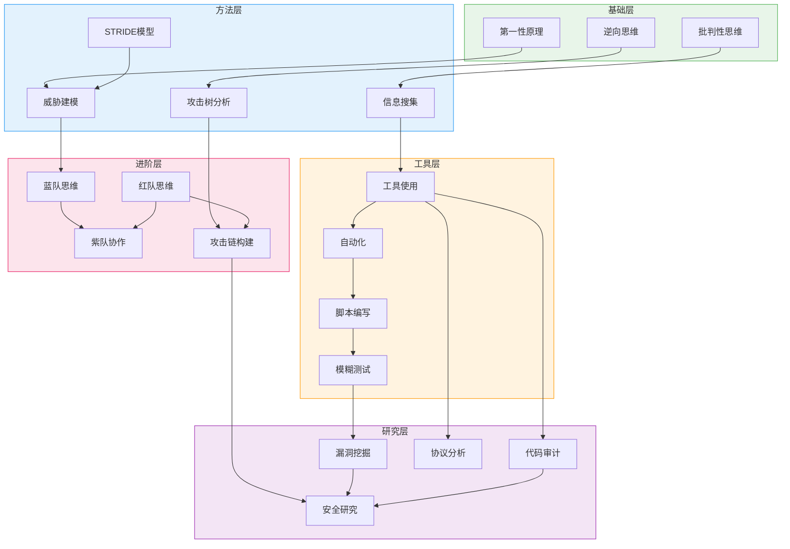
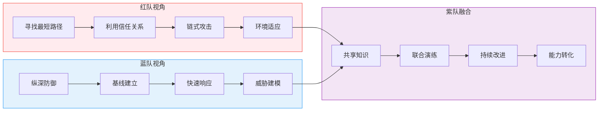
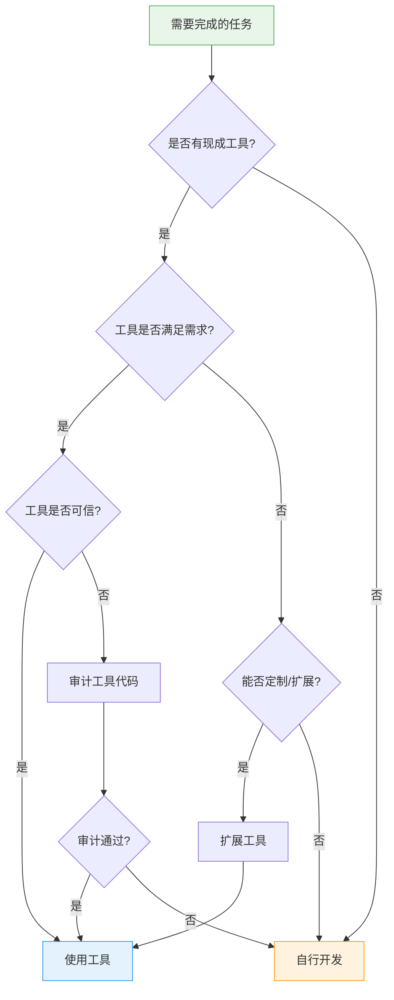
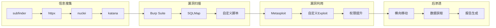
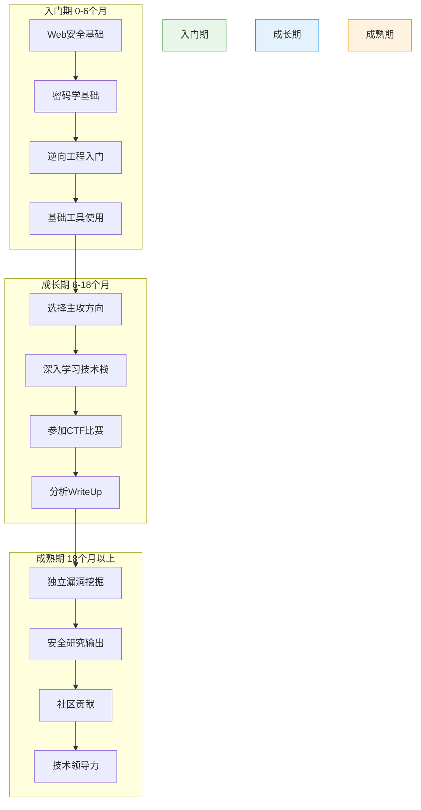
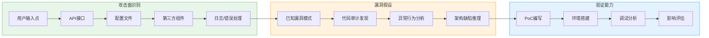
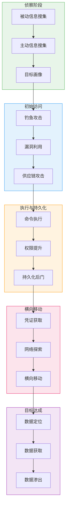
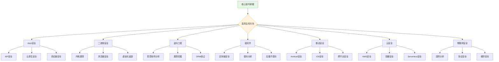

## 2.6 本节进阶总结

本节从批判性思维、信息搜集、工具自动化、学习方法论到红蓝对抗与攻击链构建，系统地构建了黑客核心技巧的知识体系。作为进阶总结，本章不仅对前述内容进行深度提炼，还将建立一套完整的自我评估框架、能力成长路径和实战训练体系，帮助读者将分散的知识点整合为可操作的能力模型。

### 2.6.1 核心技巧知识图谱

黑客核心技巧并非孤立存在，而是相互交织、层层递进的能力网络。理解这张知识图谱，有助于明确自身所处的位置和下一步的提升方向。



**能力层级对照表：**

| 层级 | 核心能力 | 对应章节 | 典型产出 | 自评标准 |
|------|---------|---------|---------|---------|
| 基础层 | 安全思维模式建立 | 2.1 | 能用攻击者视角分析日常系统 | 看到登录页面能列出5个以上攻击面 |
| 方法层 | 系统化分析方法 | 2.1-2.2 | 独立完成目标信息搜集报告 | 被动+主动搜集覆盖80%公开信息 |
| 工具层 | 工具使用与自动化 | 2.2-2.3 | 编写自定义安全工具/脚本 | 能将重复性工作自动化率提升到60%以上 |
| 进阶层 | 攻防实战能力 | 2.5 | 构建完整攻击链并复现 | 在CTF比赛中进入前30% |
| 研究层 | 独立安全研究 | 2.5 | 发现并报告0day漏洞 | 在漏洞赏金平台获得有效赏金 |

### 2.6.2 思维模式的深度整合

#### 从线性思维到系统思维的跃迁

初级安全从业者往往采用线性思维：发现漏洞 → 利用漏洞 → 获得权限。而高级安全研究者采用系统思维：理解系统全貌 → 识别信任边界 → 发现信任链断裂点 → 构建多路径攻击方案。

**线性思维 vs 系统思维对比：**

| 维度 | 线性思维 | 系统思维 |
|------|---------|---------|
| 分析范围 | 单一组件 | 整个系统生态 |
| 攻击视角 | 单点突破 | 多路径并行 |
| 风险评估 | 技术影响 | 业务影响 |
| 修复建议 | 修补漏洞 | 架构改进 |
| 持续性 | 一次性 | 持续监控 |

**系统思维培养的三个阶段：**

**阶段一：组件理解（1-3个月）**
- 掌握单个技术组件的安全特性（Web服务器、数据库、中间件）
- 理解每种组件的默认配置和常见错误配置
- 建立组件级的漏洞知识库

**阶段二：交互分析（3-6个月）**
- 分析组件之间的信任关系和数据流向
- 理解API调用链和认证授权机制
- 识别组件交互中的安全边界模糊地带

**阶段三：生态视角（6个月以上）**
- 从供应链角度分析第三方依赖的安全风险
- 理解云原生环境下的新型攻击面（容器、微服务、Serverless）
- 掌握业务逻辑漏洞的识别方法

#### 攻防思维的辩证统一

红队思维和蓝队思维并非对立，而是辩证统一的关系。理解这种统一性，是成为高级安全从业者的关键。



**紫队协作的实践要点：**

1. **知识共享机制**：建立红蓝队之间的技术分享会，红队讲解攻击手法，蓝队讲解防御策略
2. **联合演练流程**：设计包含攻击和防御的综合演练场景，双方同时参与
3. **复盘改进文化**：每次演练后进行深度复盘，将攻击发现转化为防御规则
4. **能力转化路径**：建立从攻击发现到防御落地的完整流程，确保每个发现都能提升整体防御水平

### 2.6.3 信息搜集能力的进阶框架

信息搜集是渗透测试的基础，也是区分新手和老手的关键能力。本节将信息搜集能力分为四个层级：

#### 层级一：被动信息搜集（OSINT）

被动信息搜集是不与目标直接交互的信息收集方式，法律风险最低，应作为首选。

**OSINT情报源分类：**

| 情报类型 | 来源 | 工具/方法 | 价值 |
|---------|------|----------|------|
| 域名信息 | WHOIS、DNS | whois、dig、nslookup | 了解域名注册人、DNS配置 |
| 证书信息 | 证书透明度日志 | crt.sh、Censys | 发现子域名和技术栈 |
| 网络空间 | 搜索引擎 | Shodan、Censys、ZoomEye | 发现暴露的服务和设备 |
| 代码仓库 | GitHub、GitLab | truffleHog、GitLeaks | 发现泄露的密钥和配置 |
| 社交媒体 | LinkedIn、Twitter | 社工库、搜索技巧 | 获取人员信息和组织结构 |
| 历史数据 | Wayback Machine | web.archive.org | 发现历史页面和配置 |

**OSINT工作流程标准化：**

```text
1. 目标定义
   └── 明确搜集范围和目标

2. 被动侦察
   ├── 域名/子域名枚举
   ├── IP段识别
   ├── 技术栈指纹
   ├── 人员信息搜集
   └── 历史数据挖掘

3. 情报关联
   ├── 将分散信息关联到具体资产
   ├── 建立资产关系图
   └── 识别关键资产和薄弱点

4. 报告整理
   ├── 按资产分类整理
   ├── 标注信息来源和可信度
   └── 识别需要进一步验证的点
```

#### 层级二：主动信息搜集

主动信息搜集需要与目标系统交互，需要注意法律授权和隐蔽性。

**扫描策略选择：**

| 扫描类型 | 适用场景 | 工具 | 隐蔽性 |
|---------|---------|------|-------|
| 快速扫描 | 初步了解目标 | nmap -F | 高 |
| 全端口扫描 | 发现非标准服务 | nmap -p- | 中 |
| 服务版本识别 | 确定具体服务版本 | nmap -sV | 中 |
| 漏洞扫描 | 自动化漏洞发现 | Nessus、OpenVAS | 低 |
| 目录扫描 | 发现隐藏路径 | dirsearch、gobuster | 中 |
| 子域名爆破 | 发现更多子域名 | subfinder、amass | 高 |

**隐蔽扫描技巧：**

```bash
# 使用慢速扫描减少检测概率
nmap -T1 -Pn target.com

# 使用随机化扫描顺序
nmap --randomize-hosts -iL targets.txt

# 使用碎片化数据包
nmap -f target.com

# 使用诱饵IP
nmap -D RND:10 target.com

# 使用空闲扫描（无需发送真实数据包）
nmap -sI zombie_host target.com
```

#### 层级三：主动侦察与漏洞验证

在信息搜集基础上，进行针对性的漏洞验证和深度探测。

**漏洞验证流程：**

1. **漏洞情报匹配**：将搜集到的服务版本与已知漏洞数据库匹配
2. **PoC验证**：使用公开的PoC代码验证漏洞是否存在
3. **影响评估**：评估漏洞在目标环境中的实际影响
4. **利用链构建**：将多个漏洞串联构建完整的攻击路径

#### 层级四：持续情报收集

建立持续的情报收集机制，监控目标的变化。

**持续监控要点：**

- 新增子域名和IP的监控
- 服务版本变更的告警
- 证书变更的监控
- 代码仓库的敏感信息监控
- 社交媒体上与目标相关的信息

### 2.6.4 工具使用与自动化的进阶实践

#### 工具选择的决策框架

选择合适的工具是高效工作的关键。以下是工具选择的决策框架：



**工具可信度评估清单：**

- [ ] 工具源代码是否开源可审计？
- [ ] 工具是否有活跃的维护社区？
- [ ] 工具是否在安全社区内被广泛使用？
- [ ] 工具是否存在已知的安全问题？
- [ ] 工具是否需要不必要的系统权限？
- [ ] 工具是否会产生网络连接到未知服务器？

#### 自动化脚本开发最佳实践

**Python安全脚本开发规范：**

```python
#!/usr/bin/env python3
"""
安全工具脚本示例 - 子域名枚举器
作者: [作者名]
用途: 被动子域名枚举，使用证书透明度日志
合法性: 仅用于授权测试
"""

import argparse
import requests
import sys
import logging
from typing import List, Set
from concurrent.futures import ThreadPoolExecutor, as_completed

# 配置日志
logging.basicConfig(
    level=logging.INFO,
    format='%(asctime)s - %(levelname)s - %(message)s'
)
logger = logging.getLogger(__name__)

class SubdomainEnumerator:
    """子域名枚举器类"""

    def __init__(self, domain: str, threads: int = 10):
        self.domain = domain
        self.threads = threads
        self.found_subdomains: Set[str] = set()

    def query_crt_sh(self) -> Set[str]:
        """查询证书透明度日志"""
        url = f"https://crt.sh/?q=%25.{self.domain}&output=json"
        try:
            response = requests.get(url, timeout=30)
            response.raise_for_status()
            data = response.json()
            return {entry['name_value'] for entry in data}
        except requests.RequestException as e:
            logger.error(f"crt.sh查询失败: {e}")
            return set()

    def query_dns(self, subdomain: str) -> bool:
        """DNS解析验证"""
        import socket
        try:
            socket.gethostbyname(f"{subdomain}.{self.domain}")
            return True
        except socket.gaierror:
            return False

    def enumerate(self) -> List[str]:
        """执行枚举"""
        logger.info(f"开始枚举 {self.domain} 的子域名")

        # 从crt.sh获取子域名
        crt_subdomains = self.query_crt_sh()
        logger.info(f"从crt.sh获取到 {len(crt_subdomains)} 个子域名")

        # 并发验证DNS解析
        with ThreadPoolExecutor(max_workers=self.threads) as executor:
            futures = {
                executor.submit(self.query_dns, sub): sub
                for sub in crt_subdomains
            }
            for future in as_completed(futures):
                sub = futures[future]
                if future.result():
                    self.found_subdomains.add(sub)
                    logger.info(f"发现有效子域名: {sub}.{self.domain}")

        return sorted(self.found_subdomains)

def main():
    parser = argparse.ArgumentParser(description='子域名枚举工具')
    parser.add_argument('domain', help='目标域名')
    parser.add_argument('-t', '--threads', type=int, default=10,
                       help='并发线程数 (默认: 10)')
    parser.add_argument('-o', '--output', help='输出文件路径')
    args = parser.parse_args()

    enumerator = SubdomainEnumerator(args.domain, args.threads)
    results = enumerator.enumerate()

    print(f"\n[+] 发现 {len(results)} 个有效子域名:")
    for sub in results:
        print(f"    {sub}.{args.domain}")

    if args.output:
        with open(args.output, 'w') as f:
            for sub in results:
                f.write(f"{sub}.{args.domain}\n")
        logger.info(f"结果已保存到 {args.output}")

if __name__ == '__main__':
    main()
```

**脚本开发的核心原则：**

1. **合法合规**：脚本头部注明用途和合法性声明
2. **错误处理**：完善的异常处理和日志记录
3. **参数化设计**：使用argparse等库支持命令行参数
4. **并发优化**：使用线程池或异步IO提升效率
5. **输出格式化**：支持多种输出格式（文本、JSON、CSV）
6. **可测试性**：代码模块化，便于单元测试

#### 工具链编排

高级安全从业者通常需要将多个工具串联使用，形成自动化的工作流。

**典型的Web渗透测试工具链：**



**工具链自动化示例（Bash）：**

```bash
#!/bin/bash
# Web渗透测试自动化工作流
# 用法: ./pentest_auto.sh <target_domain>

TARGET=$1
OUTPUT_DIR="./recon_${TARGET}_$(date +%Y%m%d_%H%M%S)"
mkdir -p "$OUTPUT_DIR"

echo "[*] 目标: $TARGET"
echo "[*] 输出目录: $OUTPUT_DIR"

# 第一阶段：子域名枚举
echo "[1/5] 子域名枚举..."
subfinder -d "$TARGET" -silent > "$OUTPUT_DIR/subdomains.txt"
echo "[+] 发现 $(wc -l < "$OUTPUT_DIR/subdomains.txt") 个子域名"

# 第二阶段：存活检测
echo "[2/5] 存活检测..."
httpx -l "$OUTPUT_DIR/subdomains.txt" -silent > "$OUTPUT_DIR/alive.txt"
echo "[+] 存活 $(wc -l < "$OUTPUT_DIR/alive.txt") 个目标"

# 第三阶段：漏洞扫描
echo "[3/5] 漏洞扫描..."
nuclei -l "$OUTPUT_DIR/alive.txt" -t cves/ -o "$OUTPUT_DIR/nuclei_cves.txt"
nuclei -l "$OUTPUT_DIR/alive.txt" -t vulnerabilities/ -o "$OUTPUT_DIR/nuclei_vulns.txt"

# 第四阶段：目录扫描
echo "[4/5] 目录扫描..."
while read -r url; do
    dirsearch -u "$url" -w /usr/share/wordlists/dirb/common.txt \
        --format=csv -o "$OUTPUT_DIR/dirsearch_$(echo $url | sed 's/[^a-zA-Z0-9]/_/g').csv"
done < "$OUTPUT_DIR/alive.txt"

# 第五阶段：报告生成
echo "[5/5] 生成报告..."
cat > "$OUTPUT_DIR/report.md" << EOF
# 渗透测试报告 - $TARGET
## 执行时间: $(date)
## 子域名数量: $(wc -l < "$OUTPUT_DIR/subdomains.txt")
## 存活目标数量: $(wc -l < "$OUTPUT_DIR/alive.txt")
## 发现的CVE漏洞:
$(cat "$OUTPUT_DIR/nuclei_cves.txt" 2>/dev/null || echo "无")
## 发现的其他漏洞:
$(cat "$OUTPUT_DIR/nuclei_vulns.txt" 2>/dev/null || echo "无")
EOF

echo "[+] 完成！报告已生成: $OUTPUT_DIR/report.md"
```

### 2.6.5 学习方法论的深度应用

#### 费曼学习法在安全领域的应用

费曼学习法的核心是"以教促学"。在安全领域，这种方法可以有效地将理论知识转化为实战能力。

**费曼学习法四步应用：**

| 步骤 | 应用方法 | 示例（以SQL注入为例） |
|------|---------|---------------------|
| 选择概念 | 选择一个具体的安全概念 | SQL注入的原理和类型 |
| 向他人解释 | 用非技术语言向朋友解释 | "SQL注入就像在问卷调查的空白处写入命令，让工作人员执行" |
| 识别空白 | 发现自己解释不清的地方 | 为什么预编译语句能防止注入？ |
| 回顾简化 | 回到原始材料填补空白 | 理解参数化查询如何将数据和指令分离 |

**技术博客写作框架：**

```markdown
# [漏洞类型] 深度解析与实战

## 1. 漏洞概述
- 一句话定义
- 影响范围
- 危害程度

## 2. 技术原理
- 底层机制（代码层面）
- 触发条件
- 影响因素

## 3. 环境搭建
- 靶场环境准备
- 漏洞代码分析
- 工具准备

## 4. 漏洞复现
- 复现步骤（详细截图）
- Payload构造思路
- 不同场景的变体

## 5. 漏洞分析
- 根本原因分析
- 相关CVE分析
- 类似漏洞对比

## 6. 防御方案
- 临时缓解措施
- 根本修复方案
- 防御深度建议

## 7. 总结与思考
- 学习心得
- 延伸阅读
- 实战建议
```

#### 刻意练习的安全领域实践

刻意练习要求在挑战区内练习，并获得及时反馈。安全领域提供了丰富的刻意练习场景。

**CTF训练路径设计：**



**每周训练计划示例：**

| 日期 | 训练内容 | 时长 | 目标 |
|------|---------|------|------|
| 周一 | Web安全靶场练习 | 2小时 | 完成2-3个中等难度靶题 |
| 周二 | 逆向工程练习 | 2小时 | 分析1个CrackMe程序 |
| 周三 | 密码学挑战 | 2小时 | 学习1种新的密码攻击技术 |
| 周四 | PWN基础练习 | 2小时 | 完成1个栈溢出题目 |
| 周五 | 工具开发 | 2小时 | 开发或改进1个安全工具 |
| 周六 | CTF比赛 | 4-6小时 | 参加线上CTF比赛 |
| 周日 | 总结复盘 | 2小时 | 整理笔记，撰写WriteUp |

#### 知识体系构建方法

使用Obsidian等工具构建个人知识库，是长期学习的重要支撑。

**Obsidian笔记结构设计：**

```text
security-vault/
├── 00-MOC/                    # 内容地图
│   ├── Web安全MOC.md
│   ├── 逆向工程MOC.md
│   └── 密码学MOC.md
├── 01-概念/                    # 核心概念
│   ├── SQL注入原理.md
│   ├── XSS攻击类型.md
│   └── CSRF防护机制.md
├── 02-技术/                    # 技术实现
│   ├── BurpSuite使用技巧.md
│   ├── Nmap高级用法.md
│   └── Metasploit模块开发.md
├── 03-实战/                    # 实战记录
│   ├── CTF-题目名称.md
│   ├── 靶场-HackTheBox.md
│   └── 漏洞-CVE-2024-XXXXX.md
├── 04-研究/                    # 研究笔记
│   ├── 论文-论文标题.md
│   ├── 工具-工具名称.md
│   └── 技术趋势.md
└── 05-资源/                    # 学习资源
    ├── 书籍推荐.md
    ├── 在线课程.md
    └── 博客列表.md
```

**笔记模板示例（漏洞分析）：**

```markdown
---
tags: [漏洞, CVE, Web安全]
创建日期: {{date}}
状态: 进行中
---

# {{title}}

## 基本信息
- CVE编号: 
- 影响软件: 
- 影响版本: 
- CVSS评分: 
- 漏洞类型: 

## 漏洞原理
### 根本原因


### 触发条件


### 影响范围


## 漏洞复现
### 环境搭建


### 复现步骤


### 复现截图


## 漏洞分析
### 代码审计


### 漏洞修复


## 防御建议


## 相关资源
- [原始报告]()
- [NVD链接]()
- [PoC代码]()

## 学习心得


## 相关笔记
```

### 2.6.6 漏洞挖掘能力的系统化提升

漏洞挖掘是安全研究的核心技能，需要系统化的方法论和持续的实践。

#### 漏洞挖掘的思维模型

**漏洞挖掘三要素：**

1. **攻击面识别**：系统性地识别所有可能的输入点
2. **漏洞假设**：基于技术理解形成漏洞假设
3. **验证能力**：具备验证假设的技术能力



#### 常见漏洞类型的挖掘方法

**Web应用漏洞挖掘清单：**

| 漏洞类型 | 检测方法 | 工具 | 常见场景 |
|---------|---------|------|---------|
| SQL注入 | 参数测试、报错分析 | SQLMap、Burp | 登录、搜索、筛选 |
| XSS | 输入点测试、DOM分析 | XSStrike、Burp | 评论、搜索、个人资料 |
| SSRF | URL参数测试、协议探测 | Burp、自定义脚本 | 文件导入、URL预览 |
| XXE | XML输入测试 | Burp、自定义脚本 | 文件上传、API接口 |
| 反序列化 | 数据格式分析 | ysoserial、自定义脚本 | Java、PHP、Python应用 |
| 命令注入 | 命令分隔符测试 | Burp、自定义脚本 | 系统管理功能 |
| 文件上传 | 扩展名绕过、内容检测 | Burp、自定义脚本 | 头像、文档上传 |
| 逻辑漏洞 | 业务流程分析 | 手动测试 | 订单、支付、权限 |

**代码审计关键函数清单（以PHP为例）：**

```php
// 危险函数 - 命令注入
system(), exec(), passthru(), shell_exec(), popen(), proc_open()

// 危险函数 - 代码执行
eval(), assert(), create_function(), call_user_func()

// 危险函数 - 文件操作
include(), include_once(), require(), require_once()
file_get_contents(), file_put_contents()
fopen(), fread(), fwrite()

// 危险函数 - SQL注入
mysql_query(), mysqli_query(), pg_query()
直接拼接SQL语句的任何代码

// 危险函数 - XSS
echo, print, printf 直接输出未过滤的用户输入
```

#### 模糊测试的进阶应用

模糊测试是发现未知漏洞的重要方法，需要掌握多种技术。

**模糊测试策略选择：**

| 策略 | 适用场景 | 工具 | 优缺点 |
|------|---------|------|-------|
| 基于变异 | 已有样本 | AFL、LibFuzzer | 简单但覆盖有限 |
| 基于生成 | 有协议规范 | Peach、Boofuzz | 覆盖广但需要建模 |
| 覆盖率引导 | 有源代码 | AFL++、LibFuzzer | 效率高但需要编译 |
| 智能模糊 | 复杂协议 | 自定义Fuzzer | 针对性强但开发成本高 |

**AFL模糊测试工作流：**

```bash
# 1. 准备测试用例
mkdir input output
echo "test" > input/test.txt

# 2. 编译目标程序（插桩版本）
afl-gcc -o target target.c

# 3. 启动模糊测试
afl-fuzz -i input -o output ./target @@

# 4. 监控进度
# 查看fuzzer_stats文件获取统计信息
cat output/fuzzer_stats

# 5. 分析崩溃
# 崩溃文件保存在output/crashes/目录
ls output/crashes/
```

### 2.6.7 攻击链构建的实战演练

攻击链构建是将分散的技术能力整合为实战能力的关键。

#### 攻击链构建方法论

**MITRE ATT&CK框架深度应用：**



#### Web应用攻击链实战示例

**场景：某企业内部OA系统的渗透测试**

**阶段一：信息搜集（被动）**

```bash
# 子域名枚举
subfinder -d target.com -silent > subdomains.txt

# 证书透明度查询
curl -s "https://crt.sh/?q=%25.target.com&output=json" | jq '.[] | .name_value' | sort -u

# GitHub信息泄露搜索
github-dork -d target.com -q "password OR secret OR key"
```

**阶段二：信息搜集（主动）**

```bash
# 存活检测
httpx -l subdomains.txt -silent > alive.txt

# 技术栈识别
whatweb -i alive.txt

# 目录扫描
feroxbuster -u https://target.com -w /usr/share/wordlists/dirb/common.txt
```

**阶段三：漏洞发现与利用**

```bash
# 发现登录页面弱口令
hydra -l admin -P /usr/share/wordlists/rockyou.txt target.com http-post-form \
    "/login:username=^USER^&password=^PASS^:Invalid credentials"

# 发现SQL注入
sqlmap -u "https://target.com/api/users?id=1" --batch --dbs

# 发现文件上传漏洞
# 手动测试上传功能，尝试绕过文件类型限制
```

**阶段四：权限提升与横向移动**

```bash
# 获取服务器权限后
# 查找配置文件
find / -name "*.conf" -o -name "*.yml" -o -name "*.env" 2>/dev/null

# 查找数据库凭证
grep -r "password" /var/www/ /etc/ 2>/dev/null

# 内网信息搜集
ip addr show
cat /etc/hosts
arp -a
```

**阶段五：报告生成**

报告应包含：
- 执行摘要
- 测试范围
- 发现的漏洞（按严重程度排序）
- 漏洞详情（描述、复现步骤、影响、截图）
- 修复建议
- 附录（工具输出、原始数据）

### 2.6.8 自我评估框架

#### 能力自评量表

使用以下量表评估自己在各个核心技巧领域的能力水平：

**评估标准：**
- **1级（了解）**：知道概念存在，能背诵定义
- **2级（理解）**：能解释原理，能在指导下完成操作
- **3级（应用）**：能独立完成标准场景的任务
- **4级（分析）**：能分析复杂场景，制定解决方案
- **5级（创造）**：能创新方法，输出研究成果

| 核心技巧 | 当前等级 | 目标等级 | 提升计划 |
|---------|---------|---------|---------|
| 批判性思维 | | | |
| 逆向思维 | | | |
| 第一性原理 | | | |
| 攻击树分析 | | | |
| 威胁建模 | | | |
| 被动信息搜集 | | | |
| 主动信息搜集 | | | |
| 工具使用 | | | |
| 自动化脚本 | | | |
| 费曼学习法 | | | |
| 刻意练习 | | | |
| 红队思维 | | | |
| 蓝队思维 | | | |
| 漏洞挖掘 | | | |
| 代码审计 | | | |
| 攻击链构建 | | | |

#### 成长里程碑检查点

**里程碑一：基础建立（3个月）**
- [ ] 能用攻击者视角分析日常使用的系统
- [ ] 完成至少10个Web安全靶场题目
- [ ] 掌握Burp Suite的基础使用
- [ ] 编写过至少1个安全相关的Python脚本
- [ ] 建立个人知识库并开始记录

**里程碑二：技能成型（6个月）**
- [ ] 独立完成一个目标的完整信息搜集
- [ ] 掌握至少2个方向的深入技术（Web/逆向/PWN）
- [ ] 参加过至少1次CTF比赛
- [ ] 编写过至少3个安全工具脚本
- [ ] 在技术社区发表过至少1篇技术文章

**里程碑三：实战能力（12个月）**
- [ ] 能独立构建完整的攻击链
- [ ] 在CTF比赛中取得名次
- [ ] 在漏洞赏金平台获得有效赏金
- [ ] 主导过至少1次完整的渗透测试
- [ ] 建立了自己的安全工具集

**里程碑四：研究能力（24个月）**
- [ ] 独立发现并报告过至少1个漏洞
- [ ] 在安全会议上做过分享
- [ ] 有持续的安全研究输出
- [ ] 指导过初级安全从业者
- [ ] 在特定领域有深入的专业知识

### 2.6.9 常见误区与纠正

#### 误区一：过度依赖工具

**表现：** 只会使用工具，不理解原理；遇到工具无法解决的问题就束手无策。

**纠正方法：**
1. 每使用一个工具，先阅读其源代码或文档，理解工作原理
2. 尝试用原生方法（如curl、Python requests）实现工具的核心功能
3. 当工具报错时，分析错误原因而不是换一个工具

#### 误区二：追求广度忽略深度

**表现：** 什么都会一点，但什么都不精通；学习了很多技术但无法解决实际问题。

**纠正方法：**
1. 选择1-2个主攻方向深入学习
2. 在主攻方向上达到能独立发现漏洞的水平
3. 其他方向保持基础了解即可

#### 误区三：忽视基础理论

**表现：** 只会使用现成的Payload，不理解漏洞原理；遇到新场景无法举一反三。

**纠正方法：**
1. 学习计算机网络、操作系统、编程语言的基础知识
2. 理解每种漏洞的根本原因，而不是背诵Payload
3. 尝试自己构造Payload，理解构造思路

#### 误区四：缺乏系统性

**表现：** 学习和测试都是零散的，没有系统性的方法；每次测试都是"碰运气"。

**纠正方法：**
1. 建立标准化的测试流程和检查清单
2. 使用知识管理工具记录和整理学习内容
3. 定期复盘和总结，将经验转化为方法论

#### 误区五：忽视法律边界

**表现：** 对未授权目标进行测试；使用工具时不考虑法律风险。

**纠正方法：**
1. 明确了解《网络安全法》等相关法律法规
2. 只在授权范围内进行测试
3. 使用靶场和CTF平台进行合法练习
4. 了解漏洞披露的规范流程

### 2.6.10 持续进阶的资源与路径

#### 推荐学习资源

**书籍推荐：**

| 类别 | 书籍名称 | 适用阶段 | 核心价值 |
|------|---------|---------|---------|
| 入门 | 《黑客攻防技术宝典》 | 初级 | 建立全面的安全知识框架 |
| Web安全 | 《Web应用安全权威指南》 | 中级 | 深入理解Web漏洞原理 |
| 渗透测试 | 《Metasploit渗透测试指南》 | 中级 | 掌握渗透测试方法论 |
| 逆向工程 | 《逆向工程核心原理》 | 中高级 | 深入理解二进制安全 |
| 漏洞研究 | 《漏洞战争》 | 高级 | 学习漏洞挖掘和利用技术 |
| 密码学 | 《应用密码学》 | 中级 | 理解密码学原理和应用 |

**在线平台：**

| 平台 | 类型 | 适用方向 | 特点 |
|------|------|---------|------|
| HackTheBox | 靶场 | 综合 | 真实环境，难度分级 |
| TryHackMe | 靶场 | 入门 | 引导式学习，适合初学者 |
| VulnHub | 靶场 | 综合 | 离线靶场，自主搭建 |
| PentesterLab | 靶场 | Web | 专注Web安全 |
| CTFtime | CTF | 综合 | CTF比赛信息聚合 |
| OverTheWire | 靶场 | Linux | Linux命令行和安全基础 |

**技术社区：**

| 社区 | 类型 | 参与方式 | 价值 |
|------|------|---------|------|
| 看雪论坛 | 中文安全社区 | 注册参与讨论 | 国内最专业的安全社区 |
| 先知社区 | 漏洞披露 | 提交漏洞报告 | 学习最新漏洞技术 |
| GitHub | 开源项目 | 贡献代码 | 学习工具源码，提升编程能力 |
| Twitter/X | 信息源 | 关注安全研究者 | 获取最新安全资讯 |
| Reddit | 讨论社区 | r/netsec | 国际安全社区讨论 |

#### 进阶方向选择

当基础能力建立后，需要选择深入方向：



### 2.6.11 本节核心要点回顾

黑客核心技巧的学习是一个螺旋上升的过程。以下是本节的核心要点：

**思维层面：**
- 安全思维是黑客最核心的"技巧"，它是一种思考问题的方式
- 第一性原理思维帮助我们从本质理解问题，而不是依赖经验
- 攻击树和威胁建模提供了系统化的分析框架
- 红蓝紫队思维的融合是高级安全从业者的标志

**方法层面：**
- 信息搜集是渗透测试的基础，被动搜集优先于主动搜集
- 工具使用遵循"理解原理→手动实践→工具提效→定制开发"的路径
- 费曼学习法和刻意练习是高效学习的两大支柱
- 知识体系构建需要系统化的方法和持续的维护

**实践层面：**
- 漏洞挖掘需要攻击面识别、漏洞假设、验证能力的三合一
- 攻击链构建是将分散技术能力整合为实战能力的关键
- CTF和漏洞赏金是培养实战能力的有效途径
- 自我评估和里程碑检查有助于明确成长方向

**成长路径：**

```mermaid
graph LR
    A[建立安全思维] --> B[掌握核心方法]
    B --> C[熟练工具使用]
    C --> D[形成自动化能力]
    D --> E[建立攻防视角]
    E --> F[构建攻击链]
    F --> G[独立漏洞挖掘]
    G --> H[安全研究输出]

    style A fill:#e8f5e9,stroke:#4caf50
    style B fill:#e3f2fd,stroke:#2196f3
    style C fill:#fff3e0,stroke:#ff9800
    style D fill:#fce4ec,stroke:#e91e63
    style E fill:#f3e5f5,stroke:#9c27b0
    style F fill:#e8f5e9,stroke:#4caf50
    style G fill:#e3f2fd,stroke:#2196f3
    style H fill:#fff3e0,stroke:#ff9800
```



黑客思维模式的培养是一个长期的过程。从基础的批判性思维到进阶的攻击链构建能力，从个人技能提升到社区参与，每一个环节都需要持续的努力和实践。重要的是，要始终保持好奇心和学习热情，在合法合规的框架内不断探索技术的边界。记住，真正的黑客精神不是破坏，而是对技术边界的探索和对安全本质的追求。
