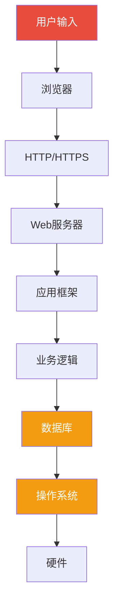
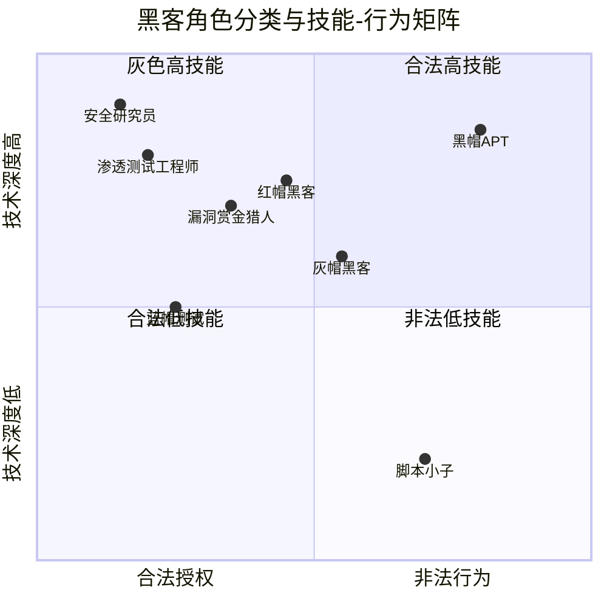
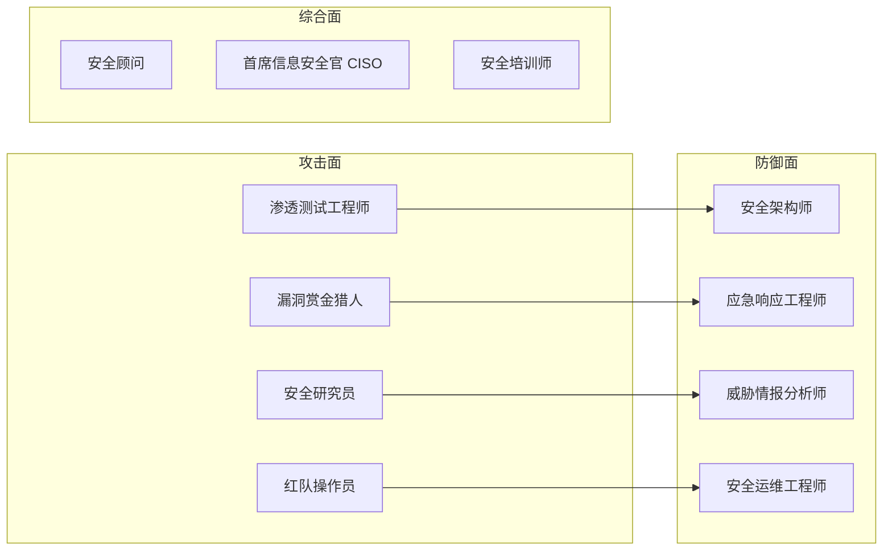
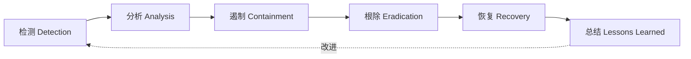
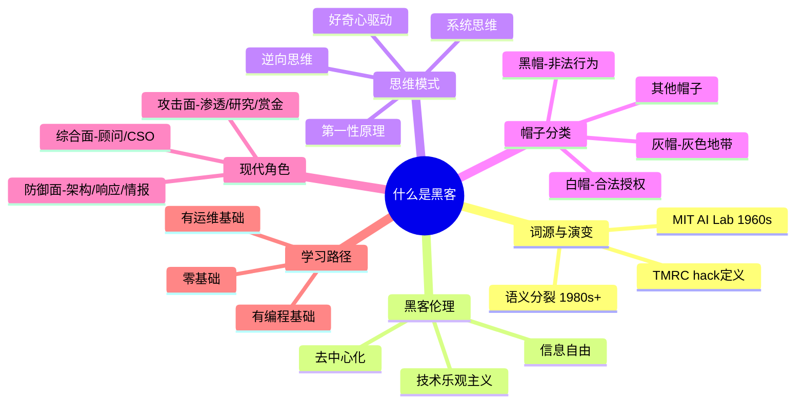

## 1.1 什么是黑客

"黑客"这个词在大众语境中几乎等同于"网络犯罪分子"，但这是一种严重的误解。黑客的本质是一种思维方式、一种文化、一种对技术边界的永恒探索。理解"什么是黑客"，是进入整个网络安全领域的第一块基石——它决定了你将以怎样的态度、怎样的标准、怎样的价值观来对待技术。

### 1.1.1 "Hacker"一词的起源与语义演变

#### 词源追溯

"Hacker"一词最早出现在1960年代的麻省理工学院（MIT）。在MIT的人工智能实验室（AI Lab）和技术模型铁路俱乐部（TMRC，Tech Model Railroad Club）中，一群对技术充满热情的学生和研究人员被同伴们称为"hacker"。这个词最初没有任何负面含义，它描述的是那些能够深入理解系统工作原理，并能以创造性方式解决问题的人。

在TMRC的词典中，"hack"被定义为"一种创造性的、巧妙的、优雅的项目或解决方案"。一个"好的hack"意味着用最简洁、最优雅的方式完成一个复杂的技术任务。TMRC的成员们把在铁路模型控制系统上做出精妙改进称为"hack"，把能在PDP-1小型机上写出令人惊叹程序的人称为"hacker"。这种对优雅和效率的追求，成为了黑客文化的核心精神之一。

需要注意的是，"hack"在当时的语境中还有一个微妙的含义：它指的不是按教科书上的标准方法解决问题，而是用出人意料的、非正统的、甚至带有恶作剧性质的方式来达成目标。一个MIT黑客可能会花整个周末编写一段代码，目的仅仅是让某个系统表现出设计者完全没有预料到的行为——这种"无用之用"恰恰是黑客精神的精髓。

#### 语义分裂

到了1980年代，随着计算机从学术机构走入商业和家庭领域，"hacker"一词的含义开始发生分裂。媒体在报道计算机安全事件时，频繁使用"hacker"来指代非法入侵计算机系统的人。1983年电影《战争游戏》（War Games）的上映更是强化了这种联想——一个少年黑客差点引发核战争的剧情让"hacker"在公众心目中的形象彻底黑化。

这种语义转变让技术社区深感不满。许多老派黑客认为，将"hacker"等同于"网络犯罪分子"是对整个文化的侮辱。Richard Stallman（自由软件运动的创始人）曾多次公开抗议这种用法，坚持认为应该用"cracker"（骇客）来指代恶意入侵者。然而语言的演变不以个人意志为转移，"hacker"的双重含义在今天已经并存。

为了在实践中区分不同类型的黑客，安全社区发展出了一套"帽子"分类系统。这个系统借鉴了美国西部片中好人戴白帽、坏人戴黑帽的传统。理解这套分类系统，是理解现代网络安全生态的第一步。

### 1.1.2 黑客伦理：六条核心信条

Steven Levy在其1984年出版的经典著作《黑客：计算机革命的英雄》（Hackers: Heroes of the Computer Revolution）中，系统地记录了MIT第一代黑客群体的历史和思想。他将这些早期黑客的核心价值观总结为六条"黑客伦理"（Hacker Ethic）：

| 信条 | 核心表述 | 深层含义 |
|------|----------|----------|
| **1. 计算机的使用应该是自由的、不受限制的** | 任何人都应该有权接触和使用计算机 | 技术不应被少数人垄断，访问权是基本权利 |
| **2. 所有信息都应该自由流通** | 信息自由是社会进步的基础 | 封锁信息是反社会行为，共享知识是美德 |
| **3. 不信任权威——促进去中心化** | 质疑一切未经验证的权威 | 官僚体制和技术垄断是创新的敌人 |
| **4. 你可以用计算机创造艺术和美** | 编程是创造性的艺术活动 | 代码的优雅和效率本身就有审美价值 |
| **5. 计算机可以改善你的生活** | 技术是解决人类问题的工具 | 对技术保持乐观，用技术推动社会进步 |
| **6. 计算机可以让生活更美好** | 技术应该服务于全人类 | 反对将技术用于压迫和控制 |

这六条信条不是抽象的口号，而是有具体的行为映射。例如：

- **信条1** 直接催生了"公共场所计算机终端运动"——1970年代，MIT黑客们反对将计算机锁在机房里，主张任何人都应该能随时使用。
- **信条2** 是后来开源运动（Open Source Movement）和自由软件运动（Free Software Movement）的理论基础。Linus Torvalds发布Linux内核时的开放精神、Richard Stallman创建GNU项目时的共享理念，都源于此。
- **信条3** 体现在技术实践中，就是对"安全性通过隐匿"（Security Through Obscurity）的不信任——真正的安全应该经得起公开审查，而不是依赖于把实现细节藏起来。

> **关键认知**：黑客伦理不是法律条文，而是一种文化共识。它不要求你盲目遵守，而是要求你独立思考。一个真正的黑客不会因为"别人说这是对的"就接受某个观点，他必须自己验证。

### 1.1.3 黑客思维模式

比技术和工具更重要的是思维方式。黑客看待世界的方式与普通人有本质区别，这种区别体现在以下几个维度：

#### 逆向思维

普通人看到一个系统，会想"这个系统是做什么用的"。黑客看到同一个系统，会想"这个系统是怎么工作的"、"它在哪里可能出错"、"如果我做一些它没有预料到的操作会怎样"。

这种逆向思维不是破坏欲，而是对系统本质的探求。当一个黑客看到一扇紧锁的门，他的第一反应不是"门锁了我进不去"，而是"这把锁的原理是什么？有没有设计者没有考虑到的开锁方式？门框是否足够坚固？窗户呢？"

#### 系统思维

黑客不会孤立地看待单个组件，而是把整个系统作为一个整体来理解。一个Web应用不仅仅是一段代码，它是前端框架、后端逻辑、数据库引擎、操作系统内核、网络协议栈、DNS解析链、CDN分发网络、浏览器渲染引擎……的层层叠加。黑客思维要求你理解这些层次之间的交互，因为漏洞往往出现在层与层的交界处。

> 上图中的红色层（用户输入）和橙色层（数据库、操作系统）是安全攻击最常见的入口点。黑客的系统思维要求理解从A到I每一层的安全边界在哪里。

#### 第一性原理

黑客不会接受"一直都是这样做的"作为答案。当面对一个技术限制时，黑客会问："这个限制的物理/逻辑根源是什么？是真正的不可能，还是只是惯例？"

经典案例：早期的密码学研究者面对"密钥分发问题"时，大多数人接受这是一个无法绕过的限制——你必须通过安全信道来交换密钥。但Diffie和Hellman在1976年提出了公钥密码学的概念，从根本上改变了游戏规则。这就是第一性原理思维的威力：不是在现有框架内优化，而是质疑框架本身。

#### 工具意识

黑客将一切事物视为工具，包括自己。操作系统是工具，编程语言是工具，网络协议是工具，甚至法律和社会规则也是可以被理解和利用的工具。这种工具意识让黑客对技术没有恐惧感——任何系统都是人造的，既然人造的，就一定可以被理解、被修改、被优化。

#### 好奇心驱动

真正的黑客学习不是为了通过考试、获得认证或找到工作。他们学习是因为好奇——想知道某个系统是怎么工作的、某个协议的细节是什么、某个漏洞的根因在哪里。这种内在驱动力是区分真正的黑客和"职业技术人员"的关键标志。

### 1.1.4 帽子分类体系：从白帽到黑帽

随着媒体的广泛报道，"hacker"一词逐渐被大众与非法入侵计算机系统的行为联系在一起。为了区分不同类型的计算机安全从业者，社区内部发展出了一套"帽子"分类系统，借鉴了美国西部片中好人戴白帽、坏人戴黑帽的传统。

#### 白帽黑客（White Hat Hacker）

白帽黑客是指在获得明确授权的前提下，对系统进行安全测试的人员。他们通常受雇于企业或安全公司，目的是发现系统中的安全漏洞并帮助修复，而不是利用这些漏洞进行攻击。

白帽黑客的核心特征：

- **合法性**：所有测试活动都在书面授权范围内进行，有明确的测试范围（Scope）和规则（Rules of Engagement）
- **建设性**：发现漏洞后立即报告，并提供修复建议
- **专业性**：遵循行业标准和最佳实践，如OWASP测试指南、PTES渗透测试执行标准

白帽黑客的典型工作内容：

| 工作类型 | 描述 | 输出物 |
|----------|------|--------|
| 渗透测试（Penetration Testing） | 模拟攻击者对系统进行授权测试 | 渗透测试报告 |
| 漏洞评估（Vulnerability Assessment） | 系统性地扫描和评估系统弱点 | 漏洞评估报告 |
| 安全审计（Security Audit） | 审查系统的安全策略和合规性 | 审计报告 |
| 代码审查（Code Review） | 检查源代码中的安全缺陷 | 代码审查报告 |
| 红队演练（Red Team Exercise） | 全方位模拟真实攻击场景 | 红队报告 |
| 安全架构评审 | 在系统设计阶段评估安全设计 | 架构安全建议 |

白帽黑客通常持有专业认证，常见的认证体系包括：

- **CEH**（Certified Ethical Hacker）：EC-Council颁发，偏重理论和工具使用
- **OSCP**（Offensive Security Certified Professional）：Offensive Security颁发，以24小时实战考试闻名，业内认可度高
- **GPEN**（GIAC Penetration Tester）：SANS/GIAC颁发，注重方法论
- **CPTS**（Certified Penetration Testing Specialist）：Hack The Box颁发，实战导向

#### 黑帽黑客（Black Hat Hacker）

黑帽黑客是指未经授权入侵计算机系统，以获取经济利益、窃取数据、破坏系统或进行其他非法活动的人。黑帽黑客的行为违反了几乎所有国家的计算机犯罪法律，可能面临严重的法律后果。

黑帽黑客的动机光谱：

| 动机类别 | 具体表现 | 典型案例 |
|----------|----------|----------|
| 经济利益 | 窃取金融信息、勒索软件、数据贩卖 | REvil勒索软件团伙 |
| 政治目的 | 黑客行动主义（Hacktivism）、政治泄密 | Anonymous对政府网站的攻击 |
| 间谍活动 | 国家支持的网络间谍、知识产权窃取 | APT28/Fancy Bear |
| 个人满足感 | 炫耀技术能力、挑战权威 | Kevin Mitnick早期行为 |
| 报复 | 对前雇主或组织的不满 | 内部威胁事件 |
| 无意识 | 被雇佣而不自知参与非法活动 | 部分CTF选手被招募 |

> **法律警示**：在中国，《刑法》第285条（非法侵入计算机信息系统罪）、第286条（破坏计算机信息系统罪）明确规定了相关刑事责任。根据情节严重程度，可处三年以下有期徒刑或者拘役，情节特别严重的处三年以上七年以下有期徒刑。在任何国家，未经授权的计算机访问都是违法行为。

#### 灰帽黑客（Grey Hat Hacker）

灰帽黑客介于白帽和黑帽之间。他们可能未经授权对系统进行测试，但不会利用发现的漏洞进行恶意活动。相反，他们通常会将漏洞报告给系统所有者，有时甚至会要求支付报酬作为"漏洞赏金"。

灰帽黑客的行为在法律上是灰色地带——未经授权的测试本身就可能违反法律，即使没有造成任何损害。这种行为的道德性在安全社区中一直存在争议。支持者认为，灰帽黑客推动了系统安全性的提升；反对者认为，未经授权的测试破坏了信任基础，而且可能造成意外的服务中断。

#### 其他帽子分类

| 类型 | 特征 | 技术水平 | 合法性 |
|------|------|----------|--------|
| **脚本小子（Script Kiddie）** | 使用他人编写的攻击工具而不理解底层原理 | 低 | 通常违法 |
| **红帽黑客（Red Hat Hacker）** | 主动攻击黑帽黑客的系统，以阻止其非法活动 | 高 | 灰色/违法 |
| **蓝帽黑客（Blue Hat Hacker）** | 被雇用来在产品发布前测试软件安全性的外部人员 | 中-高 | 合法 |
| **绿帽黑客（Green Hat Hacker）** | 新手，正在学习中的初学者 | 低 | N/A |
| **紫帽黑客（Purple Hat Hacker）** | 同时具备攻击和防御能力的安全人员 | 高 | 合法 |
| **精英黑客（Elite Hacker）** | 被社区公认的技术顶尖人物 | 极高 | 取决于行为 |

> **注意**："帽子"分类不是永久标签。一个安全从业者可能在职业生涯中以白帽身份工作，但其技术能力完全可能达到黑帽水平。帽子描述的是行为选择，而非能力上限。

### 1.1.5 现代安全生态中的角色

在现代企业安全体系中，黑客技术被分解为多种专业角色。每种角色需要不同的技能组合和思维方式：

#### 攻击面角色

**渗透测试工程师**

渗透测试工程师（Penetration Tester）负责模拟攻击者的视角，对企业的网络、应用和系统进行授权测试。需要广泛的技术知识和创造性思维。

日常工作流程：

1. **前期沟通**：与客户确定测试范围、时间窗口、禁止操作清单
2. **信息搜集**：收集目标的域名、IP、技术栈、员工信息
3. **漏洞发现**：使用自动化工具扫描 + 手动测试发现安全弱点
4. **漏洞利用**：验证漏洞的可利用性，评估实际影响
5. **后渗透**：在获得初始访问后，尝试横向移动、权限提升
6. **报告撰写**：详细记录发现、影响、复现步骤和修复建议
7. **报告交付**：向客户汇报，解答技术问题

**安全研究员**

安全研究员（Security Researcher）专注于发现新的漏洞类型和攻击技术。与渗透测试工程师的区别在于：渗透测试是用已知方法测试已知系统，安全研究是发现未知方法来攻击通用系统或协议。

工作成果通常以CVE编号（Common Vulnerabilities and Exposures）和安全论文的形式发布。顶级安全会议如Black Hat、DEF CON、USENIX Security、CCS是研究员展示成果的重要平台。

**漏洞赏金猎人**

漏洞赏金猎人（Bug Bounty Hunter）通过参与各大公司的漏洞赏金计划（Bug Bounty Program）来发现和报告漏洞，获取奖金。这是一个高度竞争的领域，顶级赏金猎人年收入可达数十万美元。

主要平台：

| 平台 | 特点 | 知名客户 |
|------|------|----------|
| HackerOne | 最大的漏洞赏金平台 | Google、Microsoft、GitHub |
| Bugcrowd | 注重全生命周期管理 | Tesla、Mastercard |
| Intigriti | 欧洲最大的平台 | 欧洲企业为主 |
| 各厂商自建 | 有的厂商独立运营赏金计划 | Apple、Google、Meta |

**红队操作员**

红队操作员（Red Team Operator）与渗透测试有本质区别：渗透测试关注"能发现多少漏洞"，红队关注"能否达成特定攻击目标"。红队演练通常持续数周甚至数月，模拟真实APT（高级持续威胁）攻击者的行为模式，包括社会工程、物理入侵、供应链攻击等非技术手段。

#### 防御面角色

**安全架构师**

安全架构师（Security Architect）设计和构建安全的系统架构，需要在系统设计阶段就考虑安全问题，而不是在系统上线后再打补丁。这个角色需要深入理解安全设计原则，如最小权限原则、纵深防御、零信任架构等。

**应急响应工程师**

应急响应工程师（Incident Responder）在安全事件发生后，负责调查、遏制和恢复。他们需要在高压环境下快速做出决策，同时保持对事件全貌的准确认知。

应急响应的典型阶段：

**威胁情报分析师**

威胁情报分析师（Threat Intelligence Analyst）负责追踪攻击者群体的活动、分析攻击趋势、预测未来威胁。他们需要具备数据挖掘、恶意软件分析、暗网监控等多方面能力。

### 1.1.6 黑客文化的里程碑事件

理解黑客文化，需要了解一些关键的历史事件。这些事件不仅塑造了公众对黑客的认知，也推动了计算机安全领域的演进：

| 年份 | 事件 | 影响 |
|------|------|------|
| 1969 | ARPANET上线 | 互联网的前身，黑客活动的早期舞台 |
| 1971 | John Draper发现"嘎吱嘎吱船长"电话免费通话方法 | 第一次有记录的"phreaking"（电话系统入侵），影响了一代黑客 |
| 1983 | 电影《战争游戏》上映 | 将黑客文化带入公众视野，也引发了对计算机安全的恐慌 |
| 1984 | Steven Levy出版《黑客》一书 | 系统记录了第一代黑客的历史和价值观 |
| 1986 | 美国《计算机欺诈和滥用法》通过 | 第一部专门针对计算机犯罪的联邦法律 |
| 1988 | Morris蠕虫 | 第一个引起广泛关注的互联网蠕虫，催生了CERT（计算机应急响应小组） |
| 1995 | Kevin Mitnick被捕 | 当时最知名的黑客案件，引发全球关注 |
| 1998 | Cult of the Dead Cow发布Back Orifice | 引发了对Windows系统安全性的广泛讨论 |
| 1999 | DEF CON 7 | 黑客大会文化的成熟 |
| 2001 | Code Red蠕虫 | 展示了自动化攻击的大规模影响 |
| 2003 | SQL Slammer蠕虫 | 10分钟内感染全球7.5万台服务器，展示了攻击速度的极限 |
| 2010 | Stuxnet被发现 | 第一个已知的网络武器，展示了网络攻击的物理破坏能力 |
| 2013 | Edward Snowden泄密 | 揭示了大规模监控的规模，引发了全球隐私和安全辩论 |
| 2017 | WannaCry勒索软件 | 攻击了150多个国家的20万台计算机，暴露了关键基础设施的脆弱性 |
| 2020 | SolarWinds供应链攻击 | 史上最复杂的供应链攻击之一，影响了多个美国政府机构 |
| 2021 | Log4Shell漏洞 | 影响了全球数百万Java应用，展示了开源软件依赖的系统性风险 |
| 2023-2025 | AI驱动的攻击与防御 | 大语言模型改变了攻防双方的能力边界，开启了安全领域的新篇章 |

> **后续深入**：这些里程碑事件中，Stuxnet、SolarWinds、Log4Shell等案例在本章实战案例部分有详细分析。

### 1.1.7 常见误解与纠正

关于黑客，存在大量根深蒂固的误解。这些误解不仅影响公众认知，也会误导初学者的学习方向：

**误解1：黑客就是犯罪分子**

事实：黑客是一种思维方式和技术追求，不等于犯罪。全球有数十万名合法的安全从业者，他们被称为"白帽黑客"或"安全研究员"，在法律框架内工作，帮助企业提升安全性。使用"hacker"来特指犯罪分子是对整个技术文化的误读。

**误解2：黑客都是天才少年**

事实：虽然媒体喜欢报道少年黑客的故事，但现实中的安全从业者大多通过系统学习和长期实践积累能力。天赋确实存在，但勤奋、好奇心和系统性思维比"天才"更重要。大部分安全专家是在25-35岁之间达到能力巅峰的——因为这个领域需要的知识广度和深度不是短期能积累的。

**误解3：黑客只需要会编程**

事实：编程是黑客的基本功之一，但远非全部。一个优秀的安全从业者还需要理解网络协议、操作系统内核、密码学原理、社会工程学、风险管理、法律合规等多个领域。事实上，许多成功的攻击利用的是人的弱点（社会工程）而非技术漏洞。

**误解4：黑客技术是邪恶的**

事实：技术本身是中性的。一把刀可以用来做饭，也可以用来伤人。黑客技术同样如此——渗透测试、漏洞研究、安全审计都是建设性的应用。理解攻击技术是为了更好地防御，正如医生需要理解疾病才能治病。

**误解5：安全工具能解决一切问题**

事实：自动化扫描工具只能发现已知类型的安全问题。真正的安全需要深度理解、创造性思维和持续的关注。如果安全工具能解决所有问题，就不会有安全漏洞了——但现实是，新的漏洞每天都在被发现。

**误解6：黑帽黑客总是比白帽强**

事实：许多顶级安全研究员和渗透测试专家的能力完全不亚于黑帽黑客。区别在于选择——他们选择在法律框架内工作。而且，白帽黑客有更多资源（合法的测试环境、专业工具、行业交流），从长期发展来看，白帽路线通常能获得更持续的成长。

### 1.1.8 如何从这里出发

理解了"什么是黑客"之后，下一步是确定方向。以下是基于不同起点的学习路径建议：

**零基础路径**

1. 学习计算机基础：操作系统原理、网络协议（TCP/IP）、编程语言（Python优先）
2. 理解安全基础概念：CIA三元组（机密性、完整性、可用性）、认证、授权、审计
3. 搭建实验环境：虚拟机、Docker容器、CTF练习平台
4. 参与入门级CTF比赛：从Web安全和密码学类别开始
5. 阅读经典教材：《黑客攻防技术宝典》《Web应用安全权威指南》

**有编程基础路径**

1. 学习安全编程：OWASP Top 10、常见漏洞模式
2. 搭建靶场环境：DVWA、WebGoat、Hack The Box
3. 学习渗透测试方法论：PTES、OWASP Testing Guide
4. 参与漏洞赏金计划：从知名度低、奖励适中的项目开始
5. 考取入门级认证：CEH或CompTIA Security+

**有运维/网络基础路径**

1. 深入网络协议安全：ARP欺骗、DNS劫持、中间人攻击
2. 学习系统加固和审计：CIS Benchmarks、Lynis
3. 掌握安全工具：Nmap、Wireshark、Metasploit
4. 学习日志分析和威胁检测：SIEM、ELK Stack
5. 转向安全运维或应急响应方向

> **关键提醒**：无论从哪个方向开始，都请务必在合法环境中练习。未经授权的测试是违法行为，而且现代网络追踪技术使得匿名攻击变得极其困难。所有本指南中介绍的技术都应在授权环境中使用。

### 1.1.9 本节核心概念回顾

本节作为全书的开篇，旨在建立对"黑客"这一概念的准确、完整的理解。在后续章节中，我们将深入探讨黑客文化的历史演变（1.2节）、黑客伦理与价值观（1.3节），并逐步进入实战领域。记住：理解黑客的本质不是学会几个工具的用法，而是培养一种独特的看待技术世界的方式。
