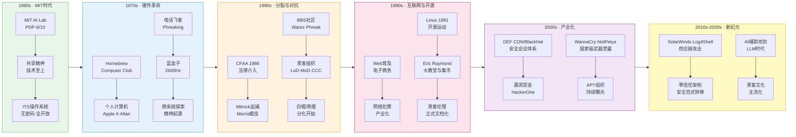
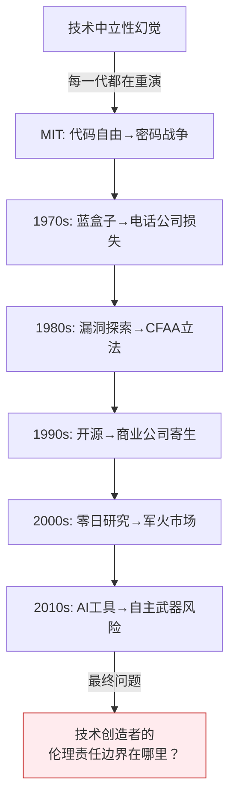

## 1.2 黑客文化的历史演变

黑客文化并非一夜之间形成——它经历了六十余年的演化，从MIT实验室里几个穿拖鞋的程序员，发展为影响全球政治、经济、军事格局的无形力量。理解这段历史，不是为了怀旧，而是为了看清黑客精神的内核：**技术赋权个体、信息应当自由、系统必须被理解**。这些信条在不同时代以不同面貌出现，但从未改变。

> **黑客文化演化全景图**

### 1.2.1 第一代黑客（1960年代）：MIT与技术乌托邦

#### 起源：PDP机房里的精神觉醒

1960年代的MIT人工智能实验室（AI Lab）是黑客文化的子宫。这里的物质条件极其有限——一台PDP-6计算机价值数百万美元（按今天的购买力计算），全校只有一台，机时按分钟计算。在这种稀缺环境下，一群天才程序员形成了一套独特的行为准则：**最大化利用计算资源，鄙视一切妨碍技术探索的官僚障碍**。

核心人物及其贡献：

| 人物 | 贡献 | 影响 |
|------|------|------|
| **Peter Deutsch** | LISP编程高手，开发了最早的LISP解释器之一 | 确立了函数式编程在黑客文化中的地位 |
| **Richard Greenblatt** | ITS核心开发者，MacLisp作者，几乎是第一个"不睡觉的黑客" | 奠定了"以代码说话"的评价标准 |
| **Bill Gosper** | 数学天才，黑客群体中的"活百科全书" | 代表了黑客对数学和算法的痴迷 |
| **Tom Knight** | 硬件黑客，ITS系统硬件支持 | 证明黑客精神不限于软件 |
| **Stewart Brand** | 《全球概目》创办者，将黑客文化引入公共视野 | 第一次把黑客理念与反文化运动连接 |

#### ITS：一个操作系统背后的政治哲学

ITS（Incompatible Timesharing System）不仅仅是一个操作系统——它是一个**政治宣言的代码实现**。其设计哲学直接体现了黑客价值观：

- **无密码设计**：系统初始版本没有任何访问控制。所有人可以查看所有代码、读取所有文件。这个设计源于一个信念：**安全措施是对用户的侮辱，是管理层不信任技术精英的表现**。后来因为ARPA（DARPA前身）要求才被迫加入密码系统，但黑客们对此嗤之以鼻，甚至把密码写在终端旁边。
- **共享终端**：系统支持多用户同时登录，鼓励"观察"他人工作。在ITS上，你可以随时查看别人屏幕上的内容，这被视为学习方式而非侵犯隐私。
- **源代码即文档**：没有用户手册。如果你想了解某个功能，直接读源码。这培养了一种深入底层的文化习惯。

#### 黑客伦理的萌芽

这个时期形成的"黑客伦理"（Hacker Ethics）后来被Steven Levy在1984年出版的《黑客：计算机革命的英雄》（Hackers: Heroes of the Computer Revolution）一书中总结为六条原则：

1. **计算机的使用不应受到限制**——任何人都有权使用计算机来探索世界
2. **所有信息都应该免费**——信息封锁是反进步的
3. **不信任权威——促进去中心化**——最优秀的工作来自松散协作
4. **你可以在计算机上创造艺术和美**——代码是创造性的表达
5. **计算机可以改善人类生活**——技术是通往更好世界的工具
6. **对计算机的访问应该不受限制**——拒绝任何形式的准入门槛

这六条原则至今仍是理解黑客文化的基石，但它们也埋下了未来分裂的种子：**"信息应该免费"这一信条，在面对商业软件版权和用户隐私时，将引发持续数十年的伦理争论**。

#### MIT模型的局限性

MIT时代的黑客文化有一个常被忽视的特征：它极度精英化。AI Lab的黑客们拥有近乎无限的机时、MIT的学术资源和ARPA的经费支持。他们的"反权威"姿态实际上建立在特权之上——他们反对的是妨碍自己工作的具体官僚，而非系统性的权力结构。这种精英底色在后来的黑客文化中反复出现，也反复被挑战。

---

### 1.2.2 第二代黑客（1970年代）：硬件革命与文化扩散

#### 从实验室到车库：Homebrew Computer Club

1975年3月5日，Gordon French和Fred Moore在门洛帕克的一个车库中创办了Homebrew Computer Club。这不是一个普通的兴趣小组——它是**将黑客精神从学术机构扩散到普通人的关键节点**。

俱乐部的运作方式本身就是黑客伦理的体现：

- **免费加入**：任何人只要有兴趣就可以参加
- **Show and Tell**：每次聚会的核心环节是成员展示自己的项目
- **信息共享**：电路图、代码、设计方案在成员之间自由流通
- **反对商业化**：早期成员对将计算机技术商业化持怀疑态度

**关键成员与后续影响：**

| 成员 | 创办/参与的项目 | 对黑客文化的影响 |
|------|----------------|------------------|
| Steve Wozniak | Apple I/II | 证明个人可以创造改变世界的产品 |
| Steve Jobs | Apple公司 | 将黑客美学引入商业产品设计 |
| Lee Felsenstein | Osborne 1电脑 | 主持俱乐部讨论，塑造了开源协作文化 |
| Bob Marsh | Processor Technology | 早期微型计算机公司 |
| Adam Osborne | Osborne Computer | 第一台便携式计算机 |

Homebrew Computer Club的历史意义在于：它证明了**黑客精神不必局限于精英学术圈**。一个在车库里用烙铁焊电路板的人，同样可以是黑客。这种"平民化"是1970年代最重要的文化突破。

#### 电话飞客（Phreaking）：跨系统思维的起源

电话飞客文化是黑客文化中最具传奇色彩的分支，也是"跨系统安全思维"的源头——**任何复杂系统都有可被利用的内部逻辑**。

**技术原理：** AT&T的电话交换系统（1ESS/4ESS）使用带内信令（in-band signaling）——控制信号和语音通话走同一条线路。这意味着，如果你能发出正确的音频频率，就可以直接控制交换机。

**关键事件时间线：**

| 时间 | 事件 | 意义 |
|------|------|------|
| 约1968年 | John Draper发现Captain Crunch麦片盒哨子发出2600Hz | 证明漏洞可以来自最意想不到的地方 |
| 1971年 | Ron Rosenbaum发表《探索电话系统的秘密》 | 第一次公开报道电话飞客文化 |
| 1972年 | YIPL（Youth International Party Line）成立 | 电话飞客与反文化运动合流 |
| 1973年 | TAP（Technical Assistance Program）创刊 | 传播电话系统知识的地下出版物 |
| 1970年代中期 | Wozniak和Jobs制造蓝盒子 | 黑客精神向创业精神的过渡 |

**2600Hz的意义远超技术本身。** 它代表了一种世界观：**大型系统的安全性往往建立在假设之上，而假设是脆弱的**。AT&T假设没有人会分析电话系统的信令协议——这个假设被一个麦片盒里的塑料哨子打破。这个教训在五十年后的每一起重大安全事件中都在重演。

**蓝盒子的经济逻辑也值得关注。** Wozniak和Jobs最初制作蓝盒子是为了免费打电话（用它拨通全球各地的电话线路），但他们很快发现可以卖掉它——第一个蓝盒子售价约150美元。这段经历直接启发了Jobs的创业思维：**黑客工具可以变成产品**。苹果公司的第一款"产品"，某种意义上就是一个蓝盒子。

#### ARPANET：黑客的新战场

1969年ARPANET上线，到1970年代中期已经连接了数十所大学和研究机构。对黑客来说，网络意味着两件事：

1. **远程访问**：不再需要物理接触计算机——你可以从千里之外进入系统
2. **社区形成**：不同大学的黑客可以通过网络交流技术

最早的网络入侵行为也出现在这个时期。1970年代末，已有黑客通过ARPANET尝试访问未授权的系统。当时没有法律框架来处理这类行为——**计算机犯罪法的空白状态，是1980年代激烈争论的伏笔**。

---

### 1.2.3 第三代黑客（1980年代）：地下文化、分裂与法律铁拳

#### BBS：互联网之前的互联网

电子公告板系统（BBS）是1980年代黑客文化的基础设施。通过调制解调器拨号连接，用户可以在BBS上发布消息、分享文件、参与讨论。BBS的规模通常很小——一台个人电脑、一根电话线、一个调制解调器就是一个BBS——但正是这种去中心化的架构，使它成为黑客文化的完美孵化器。

**BBS生态系统的分类：**

| 类型 | 内容 | 典型代表 |
|------|------|---------|
| 合法技术BBS | 编程讨论、系统管理、硬件DIY | 各地的Unix用户组BBS |
| 地下BBS（Underground） | 系统漏洞、电话飞客技术、破解方法 | Plovernet、Metal Shop |
| 盗版BBS（Warez） | 商业软件破解版分发 | 大量匿名运行的Warez站 |
| 混合型 | 技术讨论与灰色内容并存 | 多数知名BBS |

**BBS文化的核心特征是匿名性和等级制的矛盾统一。** 用户通常使用假名（handle），但社区内部有严格的声誉系统——你的技术能力决定你的地位。分享高质量的技术内容提升声望，吹牛或提供错误信息则会被鄙视。这种"匿名但有声誉"的机制，预示了后来互联网社区的许多特征。

#### 黑客组织的黄金年代

1980年代中后期，黑客组织从松散的线上社群演变为有组织的团体。几个最重要的组织：

**Legion of Doom（LoD，末日军团）**

1984年左右成立，以其成员的技术能力和行事风格闻名。LoD并非一个有严格组织结构的团体，更像是一个技术精英的社交网络。其成员包括：

- **Lex Luthor**（创始成员）：后来创办了LoD/H技术杂志
- **Erik Bloodaxe**（Chris Goggans）：后来成为安全顾问
- **Mark Abene**（Phiber Optik）：后成为著名的安全研究员

LoD的核心理念是**技术探索**——他们对电话系统和计算机网络的漏洞感兴趣，部分成员后来转型为合法的安全研究员。LoD的入会要求极高：你必须证明自己的技术能力，通常是通过展示对某个系统漏洞的深入理解。

**Masters of Deception（MoD，欺骗大师）**

MoD与LoD的对立是1980年代黑客界最大的"帮派战争"。MoD由纽约的黑客组成，其成员包括Mark Abene（Phiber Optik，后来转投LoD）和Elias Ladopoulos（Acid Phreak）。MoD更偏向于实际入侵，而非纯粹的技术研究。

**1990-1991年的"黑客大战"（The Hacker War）** 是LoD与MoD之间最激烈的冲突。双方互相入侵对方的系统、向FBI举报对方、在BBS上公开羞辱对方。这场冲突的结果是灾难性的——多名成员被捕，包括Phiber Optik和Erik Bloodaxe。**它证明了一个反复出现的模式：黑客社群内部的冲突往往导致外部力量（法律系统）的介入，最终对整个社群造成伤害。**

**Chaos Computer Club（CCC，混沌计算机俱乐部）**

1981年在德国汉堡成立，至今仍是全球最活跃的黑客组织之一。与美国同行不同，CCC从一开始就带有强烈的政治色彩。1984年，CCC成员在法国电视节目上展示了入侵法国Minitel系统的方法，引发轰动。

CCC的组织模式值得研究——它不搞匿名，不鼓励非法入侵，而是通过**公开研究、政治游说和公共教育**来推动信息安全。CCC每年举办的Chaos Communication Congress（33C3/34C3/35C3...）是全球最重要的黑客会议之一。**CCC证明了"黑客组织"可以是合法的、有社会影响力的、可持续的。**

**2600: The Hacker Quarterly**

1984年由Emmanuel Goldstein（本名Eric Corley）创办。2600杂志是黑客文化的"官方出版物"——它报道电话飞客技术、系统漏洞、黑客新闻和法律案件。2600这个名字来源于电话飞客使用的2600Hz频率。

2600的编辑立场是激进的：**信息自由、反对审查、技术探索无罪**。杂志长期与AT&T、FBI和各种企业法务部门对抗。2600至今仍在发行，并且在1990年代就开始举办HOPE（Hackers On Planet Earth）会议。

#### 法律的铁拳：CFAA与第一批受害者

1986年《计算机欺诈和滥用法案》（CFAA）的通过，标志着美国政府正式将黑客行为定义为犯罪。CFAA的制定背景是1983年好莱坞电影《战争游戏》（War Games）引发的公众恐慌——电影中一个少年黑客差点引发核战争，虽然是虚构的，却促使里根政府认真对待计算机安全。

**CFAA的核心条款：**

| 条款 | 内容 | 后续争议 |
|------|------|---------|
| §1030(a)(1) | 未经授权访问涉及国防/外交的计算机 | "授权"的定义一直模糊 |
| §1030(a)(2) | 未经授权访问计算机获取信息 | 被用于起诉几乎所有的黑客案件 |
| §1030(a)(3) | 未经授权访问政府计算机 | 对政府系统的额外保护 |
| §1030(a)(5) | 传播造成损害的程序/代码 | 后被用于起诉恶意软件作者 |

**CFAA最大的问题在于"未经授权访问"（unauthorized access）的定义模糊不清。** 一个普通用户违反了网站的服务条款（Terms of Service）算不算"未经授权"？这个问题在Aaron Swartz案（2013年）中被推到了极致——Swartz因大量下载学术论文被以CFAA起诉，面临最高35年监禁，最终自杀身亡，年仅26岁。这个案件至今仍是CFAA争议的核心案例。

**1980年代标志性案件：**

**Kevin Mitnick（1988-1995年追捕）**

Mitnick可能是全球最著名的黑客。从1980年代开始，他入侵了DEC、Motorola、Nokia等公司的系统，复制了大量软件和源代码。1988年他因入侵DEC系统被判1年监禁。出狱后继续入侵，1992年成为FBI通缉犯，开始了长达两年半的逃亡。

1995年，安全研究员Tsutomu Shimomura协助FBI在北卡罗来纳州抓获Mitnick。Mitnick案成为黑客文化与法律系统冲突的标志性事件——**他在狱中被单独关押，被禁止接触任何电子设备，甚至被禁止使用电话，因为检察官声称"他可以用口哨通过电话线发射2600Hz信号入侵电话系统"——这个说法在技术上完全是荒谬的，但它反映了一种普遍的恐惧心理。**

Mitnick后来成为合法的安全顾问，出版了《欺骗的艺术》（The Art of Deception）等畅销书，于2023年去世。

**Robert Tappan Morris与Morris蠕虫（1988年11月2日）**

康奈尔大学研究生Morris发布了第一个引起全球关注的网络蠕虫。这个蠕虫利用了Unix sendmail、fingerd和rsh/rexec的漏洞，在互联网上自动传播。Morris声称蠕虫只是实验性的、无害的，但由于代码中的一个错误——蠕虫即使在已经感染的系统上也会继续安装副本——导致了大规模的服务拒绝。

**Morris蠕虫的影响：**

- 感染了当时互联网上约10%的计算机（约6000台）
- 直接导致了CERT/CC（计算机紧急响应团队协调中心）的成立
- Morris成为第一个根据CFAA被定罪的人：3年缓刑、400小时社区服务、1万美元罚款
- **更重要的是：它迫使美国政府正式建立了网络安全应急响应体系**

> **1980年代黑客文化分裂对照表**

| 维度 | "建设性"黑客 | "探索性"黑客 |
|------|-------------|-------------|
| 核心动力 | 技术创新、产品开发 | 系统边界探索、挑战权威 |
| 对法律的态度 | 在法律框架内工作 | 法律是权力建构的障碍 |
| 经济模式 | 创业、开源 | 无经济模型或灰色收入 |
| 代表人物 | Wozniak、Torvalds | Mitnick、Poulsen |
| 文化符号 | Homebrew Club | BBS地下社区 |
| 后续发展 | 开源运动、硅谷创业 | 安全研究、漏洞赏金 |
| 伦理立场 | 黑客伦理适用于建设性工作 | 黑客伦理本身就是反建制的 |

---

### 1.2.4 第四代黑客（1990-2000年代）：开源运动、网络犯罪与文化主流化

#### 开源运动：黑客伦理的制度化

开源运动是黑客文化最重要、最持久的制度化成果。它将MIT时代的"信息共享"理念从个人行为提升为系统性的软件开发模式。

**关键里程碑：**

| 年份 | 事件 | 意义 |
|------|------|------|
| 1983 | Richard Stallman发起GNU项目 | 创建自由操作系统的宏大计划 |
| 1985 | GNU宣言发表、FSF成立 | 黑客伦理有了制度化的组织载体 |
| 1991 | Linus Torvalds发布Linux内核 0.01 | GNU/Linux成为第一个成功的开源操作系统 |
| 1997 | Eric Raymond发表《大教堂与集市》 | 系统阐述了开源开发模式 |
| 1998 | Netscape开放Navigator源码（Mozilla） | 商业公司拥抱开源的标志性事件 |
| 1999 | Open Source Initiative（OSI）成立 | "开源"作为商业友好的标签正式确立 |
| 2004 | Ubuntu 4.10发布 | 桌面Linux终于变得"可用" |
| 2005 | Git发布、GitHub前身出现 | 分布式版本控制改变了协作模式 |
| 2008 | GitHub正式上线 | 开源协作的社交网络化 |

**Stallman vs. Raymond：两种开源哲学**

开源运动内部有一个深刻的哲学分歧，至今仍在影响行业：

- **Richard Stallman的"自由软件"哲学**：核心是**用户的自由权利**（四大自由：运行、研究修改、分发、分发修改版本）。Stallman认为软件许可证不是技术问题，而是道德问题。GNU GPL许可证的"传染性"（copyleft）确保衍生作品也必须是自由的。
- **Eric Raymond的"开源"哲学**：核心是**工程效率**。Raymond认为开源是一种更好的软件开发方法论——"足够多的眼睛，所有bug都是浅层的"（Linus定律）。他刻意淡化了道德立场，使开源对企业更具吸引力。

**这场争论的实质是：黑客文化中的"自由"理念，到底应该优先服务于道德目标（用户自由）还是实用目标（工程效率）？** 今天，Raymond的"开源"标签在商业世界更受欢迎，但Stallman的"自由软件"理念在伦理层面仍然具有不可替代的价值。

**开源运动的文化影响：**

开源运动不仅仅是软件开发方法的变革，它重塑了整个技术行业的人才观念。在开源世界，你的GitHub贡献历史比你的学历更有说服力——**这是MIT时代"技术至上"原则的直接延续**。今天，全球最流行的操作系统（Android/Linux）、编程语言（Python/JavaScript的运行时）、数据库（MySQL/PostgreSQL）和开发工具（Git/VS Code）都是开源的。黑客文化在不知不觉中已经成为了全球技术基础设施的底层逻辑。

#### 网络犯罪的产业化

互联网的商业化（1990年代中期）带来了一个悖论：**它既是黑客文化的实现（信息自由流通），也是黑客文化堕落的催化剂（信息可以被货币化）**。

**1990年代末-2000年代初标志性事件：**

| 时间 | 事件 | 损失/影响 |
|------|------|----------|
| 1999年 | Melissa病毒 | 第一个通过电子邮件大规模传播的宏病毒 |
| 2000年 | ILOVEYOU蠕虫 | 约100亿美元损失，感染全球数千万台计算机 |
| 2001年 | Code Red蠕虫 | 感染35万台服务器，利用IIS漏洞 |
| 2003年 | SQL Slammer蠕虫 | 10分钟内感染全球75%的SQL Server |
| 2004年 | MyDoom蠕虫 | 历史上传播速度最快的邮件蠕虫之一 |
| 2007年 | Storm蠕虫 | 建立了第一个大规模僵尸网络（Botnet） |

**网络犯罪经济模型的成熟：**

2000年代见证了网络犯罪从"个人恶作剧"到"产业化运作"的转变。暗网市场（如Silk Road，2011年上线）提供了交易平台；僵尸网络出租服务（Botnet-as-a-Service）降低了技术门槛；垃圾邮件、钓鱼攻击和勒索软件形成了完整的产业链。

一个关键的转折点是**俄罗斯网络犯罪生态的崛起**。2000年代中后期，以俄罗斯和东欧为基地的网络犯罪组织开始主导全球网络犯罪市场。这些组织的运作方式类似于合法企业——有分工、有供应链、有客户支持，甚至有退款政策。**当黑客文化中的"反权威"精神与资本主义的利润动机结合，产生的不是解放，而是更精密的剥削。**

#### 安全行业的崛起与会议文化

面对日益严重的网络威胁，网络安全行业在2000年代经历了爆发式增长。

**会议文化：** DEF CON（1993年由Jeff Moss创办）和Black Hat（1997年创办）成为黑客文化的"圣殿"。DEF CON是野生的、非商业的、充满恶作剧的；Black Hat是专业的、企业导向的、学术性的。两者共存代表了黑客文化的双重性。

**DEF CON的经典时刻：**

- **Wall of Sheep**：实时展示未加密WiFi连接的用户名和密码——"如果你的流量被抓了，你就是羊"
- **Capture The Flag（CTF）**：安全攻防竞赛，从DEF CON发展到全球所有安全会议
- **Badge Hacking**：每年DEF CON的入场证都是一个微型硬件挑战
- **Social Engineering Village**：演示社会工程学攻击——电话钓鱼、物理入侵

**安全认证体系的建立：**

| 认证 | 机构 | 定位 | 争议 |
|------|------|------|------|
| CISSP | (ISC)² | 管理/策略层 | 被批评为"一英里宽、一英寸深" |
| CEH | EC-Council | 渗透测试入门 | 被批评为"脚本小子认证" |
| OSCP | OffSec | 实战渗透测试 | 被广泛认为是最有价值的实战认证 |
| GPAC/GPEN | SANS/GIAC | 专业深度认证 | 昂贵但内容扎实 |

**安全认证体系的存在本身就反映了黑客文化的内在张力：** 黑客精神本质上是反体制的、反等级的，但安全行业需要标准化、需要证书来证明能力。一个真正的黑客是否需要一张纸来证明自己？这个问题在DEF CON的走廊里争论了三十年。

#### 中国黑客文化的崛起（1990-2000年代）

理解黑客文化的历史演变，不能忽视中国黑客群体的独特发展路径。

**1990年代末-2000年代初：民族主义黑客运动**

1999年中国驻南联盟大使馆被炸事件是分水岭。此后，中国黑客群体（如"中国红客联盟"、"中国鹰派联盟"）发起了多次大规模网络攻击行动，目标是美国、日本等国的政府和商业网站。

**中国黑客文化的特征：**

1. **强烈的民族主义色彩**：与西方黑客的"去中心化、反权威"不同，中国早期黑客运动常常与国家利益高度一致
2. **集体行动模式**：组织大规模的DDoS攻击和网站篡改，强调"人多力量大"
3. **技术普及化**：通过论坛（如安全焦点/Xfocus、看雪论坛/Pediy）快速传播安全技术
4. **向安全行业转型**：2000年代中后期，大量中国黑客转型为安全研究员和企业安全工程师，创办了绿盟科技、启明星辰等安全公司

**关键事件：**

| 时间 | 事件 | 影响 |
|------|------|------|
| 1999年 | 中美黑客大战（因大使馆事件） | 中国黑客群体首次进入国际视野 |
| 2001年 | 中美撞机事件引发的黑客大战 | 规模更大，双方数千网站被篡改 |
| 2003年 | 红客联盟宣布解散转型 | 标志着中国黑客运动从激进转向职业化 |
| 2006年 | 安全焦点/Xfocus举办首届安全峰会 | 中国安全社区开始体系化 |
| 2008年 | 看雪论坛发展为中文逆向工程社区中心 | 技术深度达到国际水平 |

**中国黑客文化的转型路径：** 民族主义运动 → 技术社区建设 → 安全产业形成 → 国际化参与。这条路径与西方黑客文化的"学术探索 → 地下文化 → 分裂 → 职业化"截然不同，但最终指向了相似的终点：**黑客技术的制度化和商业化**。

---

### 1.2.5 第五代黑客（2010年代至今）：国家级对抗、供应链攻击与AI时代

#### APT：当国家成为黑客

高级持续性威胁（APT）彻底改变了黑客文化的格局。当一个国家投入数十亿美元、配备数百名全职工程师来实施网络攻击时，黑客文化的"个人英雄主义"叙事就显得幼稚了。

**标志性APT事件：**

**Stuxnet（2010年）** 是分水岭。这个极其复杂的计算机蠕虫——由美国NSA和以色列军事情报部门（Unit 8200）联合开发——成功破坏了伊朗纳坦兹核设施的铀浓缩离心机。Stuxnet使用了四个零日漏洞，其中两个涉及Windows内核驱动签名——这是人类历史上第一次公开确认的、以计算机代码为武器的国家级攻击。

Stuxnet的技术复杂度令人震惊：

- 利用Windows LNK文件漏洞实现自动传播（无需用户交互）
- 通过Siemens STEP 7工业控制系统软件精确定位目标设备
- 改变离心机转速的同时伪造传感器数据，使操作人员以为一切正常
- 包含多个"杀戮开关"（kill switch），在特定日期后自行停用

**这意味着：黑客技术已经从"个人技能"升级为"国家战略资产"。**

**主要APT组织概览：**

| 组织 | 归属 | 代表行动 | 特征 |
|------|------|---------|------|
| APT28/Fancy Bear | 俄罗斯GRU | 2016年美国大选干预 | 军事级定向攻击 |
| APT29/Cozy Bear | 俄罗斯SVR | SolarWinds供应链攻击 | 极度隐蔽、耐心 |
| Lazarus Group | 朝鲜RGB | WannaCry、孟加拉银行盗窃 | 为政权筹资 |
| Equation Group | 美国NSA | Shadow Brokers泄露工具 | 技术最先进 |
| APT41/Winnti | 中国 | 间谍+商业窃取混合 | 同时服务国家和私人利益 |

#### 供应链攻击：信任链的崩塌

2010年代后期，攻击者发现了比直接入侵更高效的方法：**攻击目标信任的上游供应商**。

**SolarWinds事件（2020年12月曝光）：** 俄罗斯SVR（APT29）入侵了IT管理软件公司SolarWinds的构建系统，在其Orion平台的更新包中注入了后门代码（SUNBURST）。这个后门被推送给约18000个客户，包括美国财政部、国土安全部、国务院和五角大楼。攻击者在目标网络中潜伏了超过14个月才被发现。

**Log4Shell（2021年12月）：** Apache Log4j日志库中的一个JNDI注入漏洞（CVE-2021-44228），影响了全球数百万个Java应用程序。这不是一个APT攻击，但它暴露了开源软件供应链的脆弱性——一个由少数志愿者维护的库，支撑着全球大量关键基础设施。

**供应链攻击对黑客文化的冲击是深远的：** 它证明了在高度互联的数字生态系统中，**没有任何系统是孤立的**。你的安全取决于你供应链中最薄弱的环节。这迫使整个行业重新思考安全架构——零信任（Zero Trust）模型应运而生。

#### 勒索软件：网络犯罪的终极形态

勒索软件将网络犯罪从"信息盗窃"升级为"业务中断"，使受害者面临"付钱还是关门"的困境。

**WannaCry（2017年5月12日）** 利用了NSA泄露的EternalBlue漏洞（被Shadow Brokers组织从NSA武器库中窃取并公开），在150多个国家感染了超过20万台计算机。英国NHS（国家医疗服务体系）被迫取消数千个门诊预约。**这是第一次勒索软件攻击造成大规模公共卫生危机。**

**NotPetya（2017年6月27日）** 最初伪装成勒索软件，实际上是一个旨在破坏乌克兰基础设施的网络武器（由俄罗斯GRU开发）。NotPetya通过被入侵的乌克兰税务软件M.E.Doc分发，造成全球超过100亿美元的经济损失——是有史以来破坏力最大的网络攻击。

**勒索软件即服务（RaaS）的兴起：** 2020年代，以LockBit、BlackCat/ALPHV、Cl0p为代表的RaaS平台将勒索软件"民主化"——你不需要技术能力就可以发起勒索软件攻击，只需要"加盟"并分成。这与黑客文化中的"技术赋权个体"理念形成了扭曲的镜像：**技术同样赋权了犯罪分子**。

#### 黑客行动主义与政治化

Anonymous（匿名者）是2010年代最引人注目的黑客行动主义组织。它没有正式的成员制度、没有领导层，任何人只要使用Guy Fawkes面具和#Anonymous标签就可以声称代表它行动。

**Anonymous的重大行动：**

| 时间 | 行动 | 目标 | 影响 |
|------|------|------|------|
| 2008年 | Project Chanology | 山达基教会 | Anonymous从网络恶搞转向政治行动 |
| 2010年 | Operation Payback | 反盗版组织、Visa/Mastercard | 支持WikiLeaks，展示DDoS的政治威力 |
| 2011年 | 支持阿拉伯之春 | 突尼斯、埃及政府网站 | 黑客行动主义与地缘政治的交汇 |
| 2012年 | 支持叙利亚反对派 | 叙利亚政府 | 直接介入武装冲突的信息战 |
| 2022年 | 抗议俄罗斯入侵乌克兰 | 俄罗斯政府网站 | 国家级黑客行动主义 |

**黑客行动主义的伦理困境：** Anonymous的DDoS攻击是"数字时代的静坐示威"还是"网络犯罪"？当黑客以社会正义的名义攻击企业或政府时，他们是在行使言论自由还是在破坏法治？这些问题没有简单的答案，但它们揭示了黑客文化中"反权威"基因的政治后果。

#### Bug Bounty与漏洞经济

漏洞赏金计划将黑客的探索行为合法化、商业化。HackerOne（2012年）和Bugcrowd（2012年）是两个最大的漏洞赏金平台，连接了全球数十万安全研究员和数千家企业。

**漏洞市场的价格梯度：**

| 漏洞类型 | 白帽市场（Bug Bounty） | 灰帽市场（零日经纪） | 价格差异的原因 |
|---------|----------------------|---------------------|---------------|
| XSS（跨站脚本） | $500 - $5,000 | $5,000 - $30,000 | 白帽市场供过于求 |
| SQL注入 | $1,000 - $10,000 | $10,000 - $50,000 | 影响取决于目标价值 |
| RCE（远程代码执行） | $10,000 - $100,000 | $100,000 - $500,000 | 最高危漏洞类别 |
| iOS零点击RCE | $500,000 - $1,000,000 | $2,000,000+ | 监控需求推高价格 |
| Android内核漏洞 | $100,000 - $250,000 | $500,000 - $1,000,000 | 间谍软件公司需求旺盛 |

**漏洞经济的伦理悖论：** 一个安全研究员发现了一个严重的iOS零日漏洞。如果他报告给Apple，可能获得200万美元的赏金（通过Apple Security Bounty）。如果他卖给Zerodium（零日经纪商），可能获得250万美元。如果他卖给某个中东政府用于监控异见人士，可能获得1000万美元以上。**经济激励与道德立场之间的张力，是当代黑客文化最尖锐的矛盾之一。**

#### AI时代的黑客文化（2023年至今）

大语言模型（LLM）的出现正在重新定义黑客文化：

**AI作为攻击工具：**
- AI生成的钓鱼邮件比人工编写的钓鱼邮件更精确、更个性化
- AI可以自动分析代码漏洞，大幅降低漏洞发现的技术门槛
- Deepfake技术被用于社会工程学攻击（如2024年香港某公司被骗2500万美元的AI换脸视频通话事件）
- LLM可以自动生成恶意代码和漏洞利用代码

**AI作为防御工具：**
- AI驱动的安全运营中心（SOC）可以处理海量告警
- AI辅助代码审计可以在发布前发现更多漏洞
- AI可以模拟攻击者行为，帮助防御方提前发现弱点

**AI对黑客文化哲学层面的冲击：** MIT时代的核心信条之一是"技术能力决定地位"。如果AI可以让一个编程新手自动发现复杂漏洞，那么"技术能力"的定义就需要重写。**黑客文化的未来，将取决于人类黑客能否在AI时代找到自己的独特价值——创造力、跨领域思维、对抗性直觉，这些仍然是机器无法完全替代的。**

---

### 1.2.6 历史演变的深层模式

回顾六十年的黑客文化演变，几个反复出现的模式值得注意：

**模式一：探索→利用→管制的循环**

每一次新技术的出现（分时系统→个人计算机→互联网→移动互联网→AI）都遵循相同的路径：技术探索期（充满好奇心和共享精神）→ 恶意利用期（犯罪和破坏行为激增）→ 法律管制期（政府立法、企业安全投入增加）。这个循环不会结束，但每次循环后，自由探索的空间都在缩小。

**模式二：精英化→民主化→商业化的循环**

黑客文化从MIT精英 → Homebrew平民化 → 安全产业商业化 → Bug Bounty职业化。每一次民主化都扩大了社群规模，但也稀释了技术深度。商业化则将"自由"精神驯化为可管理的职业路径。

**模式三：反权威的悖论**

黑客文化的核心精神是反权威的，但黑客文化的历史反复证明：**最成功的黑客组织和运动，最终都需要某种形式的组织化和制度化**。CCC需要注册为正式组织，开源需要许可证，安全研究需要认证体系。纯粹的反权威无法自我维持——它要么演化为制度，要么消散为噪音。

**模式四：技术中立性的幻觉**

"代码是中立的"——这是黑客文化中根深蒂固的信念。Stuxnet、WannaCry、SolarWinds证明了这个信念的天真。**代码是有政治属性的**——谁编写它、为谁服务、造成什么后果，这些问题无法用"我只是在研究技术"来回避。

> **每一代黑客文化的演化，都在重复同一个未解的哲学命题：技术自由与社会责任之间的平衡点在哪里？** 答案可能不存在一个固定的点——它随着技术力量的增大而不断移动。1960年代一个程序员在PDP-10上玩LISP对社会的威胁几乎为零；2020年代一个安全研究员发现的零日漏洞可能影响数十亿人。**技术越强大，伦理责任就越沉重。** 这不是对黑客文化的否定，而是对它的升华。
