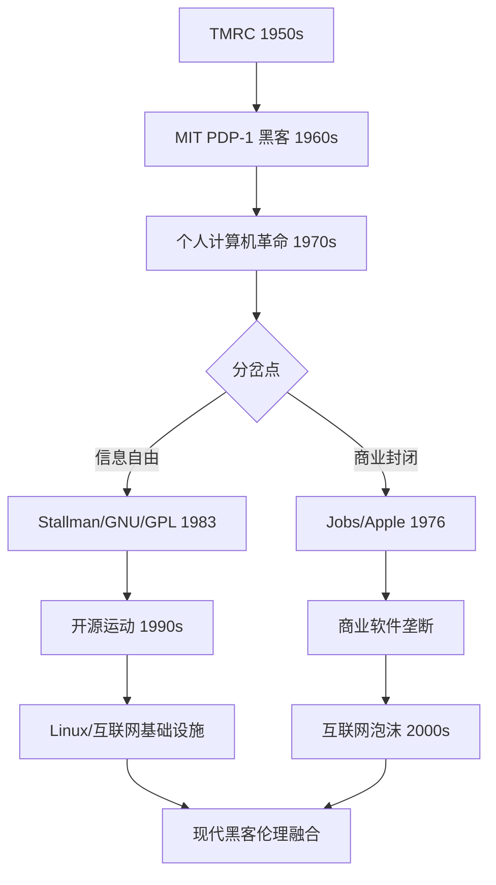
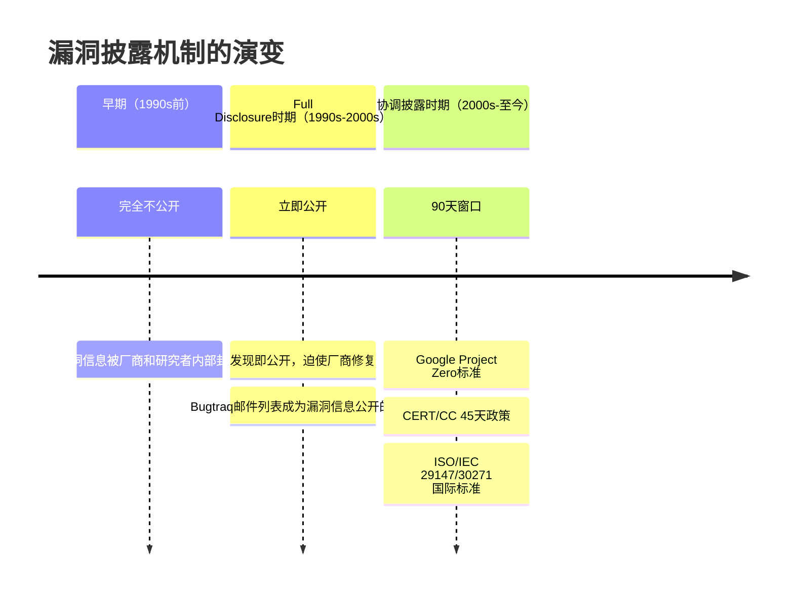

## 1.3 黑客伦理与价值观

黑客文化并非无政府主义的技术狂欢——它拥有一套比多数行业更严格、更自觉的伦理体系。理解这套体系，是成为真正黑客的第一步。本节将从历史根源出发，系统梳理黑客伦理的核心原则、演变脉络、现实困境和实践指南。

### 1.3.1 黑客伦理的历史根源

#### MIT Tech Model Railroad Club（1950s-1960s）

黑客伦理的源头可以追溯到MIT的Tech Model Railroad Club（TMRC）。这个学生社团的Signals and Power Subcommittee成员——后来被称为第一批"黑客"——在操作PDP-1大型计算机时，逐渐形成了一套非正式的行为准则。

TMRC的成员们有一个核心信条：**对系统的探索是神圣的权利**。他们认为，如果你能让一台机器做它原本设计之外的事情，这不是破坏，而是创造。这种精神后来被Steven Levy在其1984年出版的经典著作《Hackers: Heroes of the Computer Revolution》中系统记录。

#### Steven Levy的"黑客伦理"六条原则

Levy总结了早期MIT黑客群体认同的六条核心原则：

| 序号 | 原则 | 原始表述 | 含义解读 |
|------|------|----------|----------|
| 1 | 接触权 | Access to computers — and anything that might teach you something about the way the world works — should be unlimited and total | 计算机和知识应该对所有人开放，不应被少数人垄断 |
| 2 | 信息自由 | All information should be free | 信息流通不应受到人为阻碍，包括源代码、技术文档和系统内部运作方式 |
| 3 | 反权威 | Mistrust Authority — Promote Decentralization | 集中化的权力结构会阻碍创新和自由，应推动去中心化 |
| 4 | 判断标准 | You can create art and beauty on a computer | 黑客的价值应该用技术水平和创造力来衡量，而非社会身份 |
| 5 | 生活改善 | Computers can change your life for the better | 技术是改善人类生活的工具，而非控制手段 |
| 6 | 伦理内化 | These principles are to be hacked | 伦理本身也需要不断地审视、修正和完善 |

这六条原则并非来自某个组织的正式文件，而是从实践中自然凝聚的社区共识。它们奠定了后续半个世纪黑客文化的基调。

#### 从MIT到硅谷：伦理的商业化冲击

1970年代末，个人计算机革命打破了黑客伦理的"纯洁性"。当Steve Jobs和Steve Wozniak将Apple I带到Homebrew Computer Club时，一个根本性矛盾浮出水面：**信息自由与商业利益如何共处？**

Wozniak坚持免费分享Apple I的设计图纸，这完全符合黑客伦理。但Jobs看到了商业机会，推动了封闭的商业模式。这个分歧——后来被称为"Open vs. Closed"之争——至今仍在塑造技术行业。

Richard Stallman在1983年发起GNU项目，正是因为他目睹了一台打印机的固件代码从"可自由获取"变为"厂商专有"。他创建了GNU通用公共许可证（GPL），用法律手段保障"信息自由"——这就是著名的"copyleft"：你必须保持他人的自由，作为使用自由软件的条件。



### 1.3.2 黑客伦理的六大核心原则深度解析

#### 原则一：信息自由

信息自由是黑客伦理中最具争议性的原则。它并非主张"一切信息都应无条件公开"，而是强调**信息不应被人为地、不合理地封锁**。

**信息自由的三个层次：**

1. **源代码自由**：软件的源代码应该可以被查看、学习和修改。这是开源运动的基石。
2. **系统知识自由**：对计算机系统、网络协议、加密算法等技术的了解不应被垄断。
3. **安全信息自由**：关于系统漏洞和安全威胁的信息应该在适当条件下被共享。

**信息自由的边界——负责任披露：**

信息自由并非绝对的。安全社区经过数十年的实践，发展出了"负责任的漏洞披露"（Responsible Disclosure）机制来平衡信息公开与安全风险：



**现实案例——Google Project Zero的90天政策：**

2015年1月，Google Project Zero在给微软90天修复期限到期后，公开了一个Windows 8.1的权限提升漏洞（CVE-2015-0010）。微软在第89天发布了补丁，但因为时差问题，Google的自动披露系统仍将其公开。这个事件引发了激烈讨论：90天期限是否合理？时差问题是否应该被考虑？

最终，Google调整了政策，允许在截止日当天提交的补丁也算在期限内。这说明**信息自由的实践需要不断地校准和修正**。

#### 原则二：技术能力即价值（Meritocracy）

黑客文化中的"能力主义"意味着：你的社会地位取决于你做了什么，而不是你是谁。

**具体表现：**

- **代码审查文化**：在开源社区，代码的质量和贡献是唯一的评判标准。Linux内核邮件列表上，Linus Torvalds对代码的批评不分对象身份。
- **匿名/化名传统**：许多早期黑客使用化名（handle）而非真名，部分原因是为了让技术能力成为唯一的身份标识。
- **CTF和黑客竞赛**：Capture The Flag竞赛是纯粹的能力检验——你能在规定时间内解决问题，你就赢了。

**Linus Torvalds的名言——"Talk is cheap, show me the code"：**

这句话出自2000年Linux内核邮件列表。当时有人在邮件中长篇大论地讨论一个技术方案，Torvalds用这句话直接回应：别说了，把代码发出来。

**能力主义的局限性：**

能力主义并非完美。它存在几个现实问题：

1. **起点不平等**：并非所有人都有同等的机会学习和实践技术。家庭经济条件、教育资源、时区差异都会影响技术能力的积累。
2. **隐性偏见**：即使在"只看能力"的文化中，研究显示女性和少数族裔的代码贡献在同等质量下获得的评价仍然较低。
3. **能力的定义偏窄**：早期黑客文化将"能力"等同于编程能力，忽视了安全研究、文档撰写、社区管理等其他重要贡献。

现代黑客社区正在努力解决这些问题——例如通过多元化奖学金、远程参与机制和更全面的贡献评价标准。

#### 原则三：质疑权威与去中心化

黑客文化天然地对集中化的权力结构持怀疑态度。这种精神在历史上有三个重要表现：

**表现一：开源运动对商业垄断的挑战**

1998年，Netscape开放了其浏览器源代码，这成为Mozilla项目的起点。Eric Raymond和Bruce Perens随后发起了"开源"（Open Source）运动，将黑客的"信息自由"理念包装成商业友好的语言，推动了Linux、Apache、MySQL等开源技术在企业中的普及。

**表现二：加密朋克运动对隐私权的捍卫**

1990年代的加密朋克（Cypherpunk）运动是黑客质疑权威精神的极致表达。Tim May、Eric Hughes、John Gilmore等人认为：在数字时代，密码学是保护个人自由的终极工具。

Eric Hughes在1993年发表的《A Cypherpunk's Manifesto》中写道：

> "Privacy is necessary for an open society in the electronic age... We cannot expect governments, corporations, or other large, faceless organizations to grant us privacy out of their beneficence."

加密朋克的技术遗产包括：PGP加密、Tor匿名网络、比特币——这些技术都将权力从中央机构转移到个体手中。

**表现三：去中心化技术的发展**

区块链和Web3是黑客质疑权威精神的最新表现。比特币的白皮书（2008年）直接回应了中心化金融系统的信任问题：通过数学和密码学取代对机构的信任。

#### 原则四：分享与协作

黑客文化中的分享不是慈善，而是**互惠**——今天你分享一个工具，明天别人分享一个漏洞分析，整个社区因此变得更强。

**分享的具体形式：**

| 分享形式 | 典型平台/载体 | 价值 |
|----------|---------------|------|
| 开源代码 | GitHub, GitLab, SourceForge | 直接可用的工具和库 |
| 技术博客 | 个人博客, Medium, 知乎 | 经验总结和深度分析 |
| CTF题解 | CTFtime, 各平台writeup | 学习路径和解题思路 |
| 安全会议 | DEF CON, Black Hat, HITB | 前沿研究和社区连接 |
| 漏洞报告 | HackerOne, Bugcrowd | 安全贡献和经济回报 |
| 教学资源 | TryHackMe, HackTheBox | 结构化学习路径 |

**分享的伦理边界：**

分享也存在边界。以下内容的分享需要谨慎：

- **零日漏洞的利用代码**：在厂商修复之前发布完整的exploit可能造成大规模安全事件
- **针对特定个人的攻击工具**：与通用安全工具不同，针对个人的攻击工具几乎没有正当用途
- **内部系统信息**：在渗透测试中获得的客户系统信息不应在合同范围外分享

#### 原则五：技术中性与责任

技术本身是中性的——一把锤子可以用来建房子，也可以用来伤人。决定行为性质的是使用者的意图和授权。

**这个原则的实践含义：**

- 学习攻击技术本身不是犯罪，目的是理解和防御
- 编写漏洞利用代码本身不是犯罪，用于授权测试是有价值的安全工作
- 了解加密和匿名技术本身不是犯罪，保护隐私是公民权利

**但"中性"不等于"免责"：**

技术中性原则不应被滥用为逃避责任的借口。如果你编写了一个勒索软件并出售，"技术是中性的"不是有效的辩护——你的意图和行为才是关键。

#### 原则六：持续学习与改进

黑客文化的最后一条——也是最容易被忽视的一条——是**对自身伦理框架的持续审视**。

技术在变化，伦理困境也在变化。1980年代的黑客不需要考虑AI伦理、物联网安全或数据隐私（因为大规模数据收集还不存在）。一个好的黑客应该随着技术的发展不断更新自己的伦理认知。

### 1.3.3 黑客伦理的现实困境

理论上的原则在现实中常常面临冲突。以下是最常见的伦理困境及其分析：

#### 困境一：信息自由 vs. 安全责任

**场景**：你发现了一个广泛使用的开源库的严重漏洞。厂商（开源维护者）是个人志愿者，响应速度很慢。你已经给了30天时间，但修复进展为零。公开漏洞可能让数百万用户面临风险，但不公开又可能导致漏洞被其他攻击者发现并利用。

**分析**：

| 选项 | 优点 | 风险 |
|------|------|------|
| 继续等待 | 给维护者更多时间 | 漏洞可能被恶意利用 |
| 有限公开 | 发布缓解措施而非exploit | 用户可能低估风险 |
| 完全公开 | 迫使快速修复 | 攻击者可能抢先利用 |
| 自己修复后公开 | 最佳平衡 | 需要时间和维护者配合 |

**最佳实践**：采用"协调披露"——在公开漏洞的同时发布缓解措施或临时修复方案，并提前通知主要使用方（如Linux发行版的安全团队）。

#### 困境二：授权边界

**场景**：你被雇来对一个公司进行渗透测试。在测试过程中，你发现了一个子域名指向一个第三方供应商的系统。合同中没有明确提到这个第三方系统。

**分析**：

- **继续测试**可能违反合同条款，甚至触犯法律
- **停止测试**可能遗漏重要安全问题
- **通知客户**并请求扩大授权范围是最佳选择

**关键原则**：永远在书面授权范围内工作。口头承诺不是有效的法律保护。

#### 困境三：漏洞赏金计划的灰色地带

**场景**：你在一个漏洞赏金平台上发现了一个漏洞。你按照规则提交了报告，但平台判定为"重复"（已有其他人先报告）。你注意到该漏洞仍然存在，且你有更高权限的利用方式。

**分析**：

- 你不能因为没有获得赏金就公开漏洞
- 你不能利用更高权限进行未授权操作
- 你可以通过平台的申诉机制争取合理报酬
- 如果平台拒绝，你仍然有责任不滥用漏洞

#### 困境四：红队测试中的伦理底线

**场景**：你在进行红队测试时，获得了访问客户内部邮件系统的权限。你发现了公司高管之间的不当行为证据（与测试目标无关）。

**分析**：

- 你的任务是安全测试，不是内部调查
- 将发现报告给客户属于职责范围（安全事件）
- 将发现泄露给媒体或竞争对手属于违法行为
- 最佳做法：在报告中提及"发现敏感信息访问路径"，不具体描述内容

### 1.3.4 黑客与法律的边界

技术能力本身是中性的，但行为有明确的法律边界。以下是全球主要法律框架的对比：

#### 主要法律框架

| 法律 | 管辖区 | 核心条款 | 对安全研究的影响 |
|------|--------|----------|------------------|
| CFAA（计算机欺诈和滥用法） | 美国 | 未经授权访问计算机系统构成联邦犯罪 | "授权"定义模糊，导致过度起诉 |
| Computer Misuse Act | 英国 | 未经授权访问计算机材料构成犯罪 | 对安全研究有一定的保护条款 |
| 刑法第285条/286条 | 中国 | 非法侵入计算机信息系统罪/非法获取计算机信息系统数据罪 | 需要"情节严重"才构成犯罪 |
| 刑法第234a条 | 德国 | 数据间谍罪 | 对安全研究有明确的豁免条款 |
| Convention on Cybercrime（布达佩斯公约） | 国际 | 协调各国网络犯罪法律 | 被60多个国家签署 |

#### CFAA的争议——United States v. Aaron Swartz事件

2011年，互联网活动家Aaron Swartz因从JSTOR下载大量学术论文被CFAA起诉。联邦检察官以最高35年监禁和100万美元罚款相威胁。2013年，Swartz在案件审理期间自杀，年仅26岁。

这个案件暴露了CFAA的核心问题：**"未经授权访问"的定义过于宽泛**。Swartz使用的MIT网络是公开的，JSTOR后来也撤销了投诉，但联邦检察官仍坚持起诉。

Aaron Swartz事件推动了CFAA改革的讨论。2022年，美国最高法院在Van Buren v. United States案中缩小了CFAA的适用范围，裁定"超出授权访问"仅适用于有权限限制的系统内部访问，不适用于绕过使用限制。

#### 合法的安全研究行为

以下行为在大多数司法管辖区是合法且被鼓励的：

1. **在授权范围内进行渗透测试**：签订书面合同，明确测试范围和方法
2. **参与合法的漏洞赏金计划**：遵守平台规则，在规则范围内测试
3. **在隔离实验环境中研究攻击技术**：使用虚拟机或物理隔离的网络
4. **参加CTF竞赛**：在竞赛规则范围内进行技术挑战
5. **逆向工程自有软件**：在某些司法管辖区，逆向工程用于互操作性或安全研究是合法的
6. **安全研究出版**：在负责任披露后发表研究成果

#### 违法行为的明确红线

以下行为在所有主要司法管辖区都是违法的：

1. **未经授权访问他人计算机系统**：包括猜测密码、利用已知漏洞、社会工程学获取访问权限
2. **窃取、篡改或破坏数据**：无论数据的敏感程度如何
3. **制作和传播恶意软件**：即使声称"仅供研究用途"
4. **进行拒绝服务攻击**：即使是"压力测试"，未经授权也是违法的
5. **网络钓鱼和身份欺诈**：伪造身份获取他人的访问凭证

### 1.3.5 黑客伦理的现代挑战

随着技术的发展，黑客伦理面临着新的挑战：

#### 挑战一：AI与自动化攻击

AI工具降低了攻击门槛。当任何人都可以使用AI生成钓鱼邮件或自动化漏洞利用时，安全研究者的伦理责任是什么？

**关键问题**：

- 发布AI安全研究是否会间接帮助攻击者？
- AI驱动的自动化渗透测试工具的使用边界在哪里？
- 如何防止安全AI工具被滥用？

#### 挑战二：物联网（IoT）的攻击面

IoT设备的广泛部署创造了前所未有的攻击面。安全研究者在发现IoT设备漏洞时面临特殊困境：

- 很多IoT厂商不响应漏洞报告
- 设备可能控制关键基础设施（医疗设备、工业控制系统）
- 用户通常无法自行修复或断开连接

#### 挑战三：隐私与安全的冲突

大数据和监控技术的发展使隐私与安全的冲突日益尖锐。安全研究者在进行威胁情报收集时，如何平衡安全需求与隐私保护？

#### 挑战四：国家级网络行动

当国家行为体使用网络攻击手段时，传统的黑客伦理框架面临挑战。安全研究者是否应该参与国家主导的网络行动？如何区分"爱国黑客"和"国家支持的攻击者"？

### 1.3.6 培养伦理意识的实践指南

#### 建立个人伦理清单

在进行任何安全相关活动之前，问自己以下问题：

```markdown
## 安全活动伦理自检清单

### 授权检查
- [ ] 我是否有书面授权进行这个活动？
- [ ] 授权是否覆盖了我要测试的系统和方法？
- [ ] 我是否理解授权的限制条件？

### 影响评估
- [ ] 这个活动可能对第三方造成什么影响？
- [ ] 如果测试导致系统中断，我是否有应急计划？
- [ ] 我收集的数据将如何存储和处理？

### 披露计划
- [ ] 如果我发现漏洞，我将如何报告？
- [ ] 我是否给了厂商合理的时间修复？
- [ ] 我是否会在披露中包含足够的技术细节帮助防御？

### 法律合规
- [ ] 这个活动在我的司法管辖区是否合法？
- [ ] 我是否了解相关的法律风险？
- [ ] 我是否有法律顾问可以咨询？
```

#### 学习伦理的最佳资源

| 资源 | 类型 | 适合人群 |
|------|------|----------|
| Steven Levy《Hackers: Heroes of the Computer Revolution》 | 书籍 | 所有黑客 |
| Eric Raymond《The Cathedral and the Bazaar》 | 书籍/论文 | 开源贡献者 |
| Eric Hughes《A Cypherpunk's Manifesto》 | 宣言 | 隐私权倡导者 |
| EFF的Coders' Rights Project | 法律资源 | 安全研究者 |
| HackerOne的Disclosure Guidelines | 实践指南 | 漏洞赏金猎人 |
| OWASP的Ethical Guidelines | 行业标准 | Web安全从业者 |

#### 社区参与的伦理准则

1. **在分享知识时**：确保分享的内容不包含可直接用于恶意目的的完整利用代码，除非已经过了负责任披露的窗口期
2. **在帮助他人时**：不要帮助明显意图非法活动的人，即使他们声称"只是学习"
3. **在参与讨论时**：尊重不同的观点，但坚守伦理底线
4. **在发现漏洞时**：遵循负责任披露流程，不利用漏洞谋取私利

### 1.3.7 从伦理到实践：真正的黑客精神

伦理不是束缚，而是指南针。它帮助黑客在复杂的技术世界中做出正确的选择。

**真正的黑客精神包含：**

1. **好奇心驱动**：对系统如何运作的深层兴趣，而非破坏欲望
2. **建设性思维**：发现问题是为了修复问题，而非利用问题
3. **社区责任感**：个人的技术能力是社区赋予的，应该回馈社区
4. **持续学习**：技术在变化，伦理认知也需要不断更新
5. **道德勇气**：在压力下坚持正确的选择，即使这意味着损失短期利益

> "The hacker ethic is not a set of rules to follow blindly, but a framework for thinking about the relationship between technology, power, and freedom."
>
> ——改编自Steven Levy

黑客伦理的最终目标是确保技术服务于人类的自由和进步，而非成为控制和压迫的工具。每个黑客都应该将这个目标内化为自己的行为准则。
