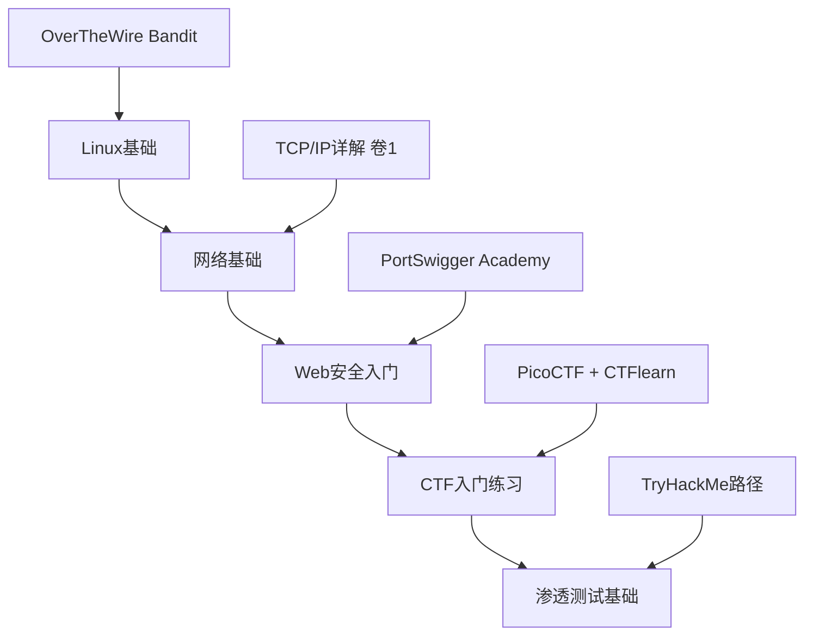

## 1.4 推荐阅读与资源

黑客文化的传承依赖于文本、代码和对话。从 MIT 机房里油印的技术备忘录，到今天覆盖全球的漏洞赏金平台，阅读和学习资源始终是黑客成长的核心基础设施。本节系统梳理从入门到精通各阶段应接触的书籍、论文、社区、课程、会议和多媒体资源，并给出学习路径建议。

### 1.4.1 书籍推荐

书籍按主题和难度分级。入门书籍帮助建立世界观，进阶书籍深化技术理解，专题书籍覆盖密码学、社会工程学、逆向工程等垂直领域。

#### 入门必读（建立黑客世界观）

**《黑客：计算机革命的英雄》**（*Hackers: Heroes of the Computer Revolution*，1984）— Steven Levy

这是黑客文化的"创世纪"。Levy 在书中记录了三代黑客的故事：50-60年代 MIT 的 TMRC 和 AI Lab（第一代硬件黑客）、70年代 Homebrew Computer Club 的个人计算机革命者（第二代硬件黑客）、80年代早期的游戏黑客（第三代）。书中首次系统提出了"黑客伦理"（Hacker Ethic）的六条原则：访问计算机应当不受限制且完全自由；所有信息应当自由流动；不信任权威——促进去中心化；以艺术和美为标准评判黑客能力；计算机可以改善人类生活。理解这些原则是理解后续所有黑客文化讨论的前提。建议在读完本书后，对照本书第1.1节讨论的黑客伦理，形成自己的理解。

**《黑客与画家》**（*Hackers and Painters*，2004）— Paul Graham

Paul Graham 是 Y Combinator 的联合创始人，也是早期 Web 应用公司 Viaweb 的创始人。这本书不是技术手册，而是一系列关于创造者思维的散文。核心观点：黑客和画家本质上是同一种人——都是"制作者"（makers）。书中关于"财富创造"（How to Make Wealth）一章解释了为什么优秀的程序员在大公司里被低估，以及创业如何让技术能力直接转化为财富。关于"设计原则"的讨论则说明了简洁性为什么是复杂系统最重要的属性。这本书对理解黑客思维方式的价值远大于具体技术知识。

**《大教堂与集市》**（*The Cathedral and the Bazaar*，1999）— Eric S. Raymond

开源运动的理论奠基作。Raymond 在文中对比了两种软件开发模式："大教堂模式"（源码在发布前由封闭团队精心打磨）和"集市模式"（源码从一开始就公开，由社区协作迭代）。文中提出的19条"集市模式"开发原则至今仍是开源社区的方法论基础，其中最著名的是"足够多的眼睛，就可让所有漏洞浮现"（Linus's Law）。这篇文章最初是 Raymond 在1997年 Linux Kongress 上的演讲稿，后来扩展成书，附带了《开拓智域》（Homesteading the Noosphere）和《魔法大锅炉》（The Magic Cauldron）两篇关于开源经济模型的论文。理解开源文化不读此书等于没入门。

**《黑客文化简史》**（*A Brief History of Hackerdom*，1992）— Eric S. Raymond

这是一篇在线可读的短文（catb.org/~esr/writings/hacker-history/），用较短篇幅梳理了从1945年到90年代初的黑客文化演变。可以作为 Levy 那本书的补充和快速概览。Raymond 的视角偏重 Unix 和自由软件传统，与 Levy 偏重 MIT 人工智能实验室的视角形成互补。

#### 技术进阶（深入安全领域）

**《欺骗的艺术》**（*The Art of Deception*，2002）— Kevin Mitnick

社会工程学的经典之作。Mitnick 曾是FBI头号通缉黑客，书中用虚构但高度逼真的案例展示了如何利用人性弱点绕过技术防线。核心观点：最脆弱的安全环节不是软件漏洞，而是人的信任倾向。书中系统分类了社会工程学攻击手法：冒充权威（pretexting）、尾随进入（tailgating）、利用紧迫感（urgency）、利用乐于助人（helpfulness）等。每个案例都附带了防范建议。本书对红队人员和安全意识培训师尤其重要。

**《网络安全基础》**（*Computer Security: Principles and Practice*，第4版）— William Stallings & Lawrie Brown

全面的计算机安全教科书，覆盖访问控制、密码学基础、网络入侵检测、恶意软件分析、软件安全等核心领域。作为教材，它比散落的在线教程更系统，每章都有习题和推荐阅读。适合有计算机基础但缺乏安全专业知识的读者系统学习。缺点是更新速度慢于威胁演变速度，需要用在线资源补充最新的攻击手法和防御技术。

**《Metasploit渗透测试指南》**（*Metasploit: The Penetration Tester's Guide*，2011）— David Kennedy 等

Metasploit 框架是渗透测试的事实标准工具。本书从渗透测试方法论讲起，涵盖信息收集、漏洞扫描、漏洞利用、后渗透、权限提升、横向移动的完整流程。虽然是2011年出版，但 Metasploit 的核心架构和工作流变化不大，本书建立的思维框架至今适用。配合 Metasploit 官方文档和 Rapid7 博客使用效果更好。

#### 专题深入（各方向经典）

**密码学方向：**
- **《密码编码学与网络安全》**（*Cryptography and Network Security*，第8版）— William Stallings。密码学入门的标准教材，从对称加密、非对称加密到数字签名、密钥管理，体系完整。
- **《应用密码学》**（*Applied Cryptography*，第2版，1996）— Bruce Schneier。密码学领域的"圣经"，虽然部分算法已被淘汰，但对密码协议设计思维的培养无可替代。
- **《Crypto Engineering》**（2009）— Ferguson, Schneier, Kohno。侧重密码学的工程实现，讨论实际部署中的陷阱和攻击。比纯理论的密码学书更贴近安全工程师的实际工作。

**逆向工程方向：**
- **《逆向工程实战》**（*Practical Reverse Engineering*，2011）— Bruce Dang 等。从 x86/x64 汇编基础讲起，覆盖 ELF/PE 格式分析、调试技术、反混淆。微软安全团队成员所著，实战性强。
- **《恶意代码分析实战》**（*Practical Malware Analysis*，2012）— Sikorski & Honig。恶意软件分析的标准教材，从静态分析到动态分析，从基础技术到高级反逆向对抗，配有大量练习样本。
- **《IDA Pro权威指南》**（*The IDA Pro Book*，第2版，2011）— Chris Eagle。IDA Pro 是逆向工程的事实标准工具，本书是其官方参考之外最权威的指南。

**漏洞研究方向：**
- **《Shellcoder's Handbook》**（*The Shellcoder's Handbook*，第2版，2007）— Anley 等。栈溢出、堆溢出、格式化字符串、ROP 链等经典漏洞利用技术的系统讲解。虽然现代操作系统已部署 ASLR、DEP、CFI 等防护，但理解这些基础是研究绕过技术的前提。
- **《Hacking: The Art of Exploitation》**（第2版，2008）— Jon Erickson。从编程、网络、密码学到漏洞利用的完整链条，用 C 语言和汇编代码演示每个概念。附带一个可启动的 LiveCD 环境供读者实操。
- **《A Bug Hunter's Diary》**（2011）— Tobias Klein。记录了作者在 VLC、iOS、macOS 等软件中发现真实漏洞的全过程，展示了漏洞猎人的思维方式和工作方法。

**Web安全方向：**
- **《Web应用安全权威指南》**（*The Web Application Hacker's Handbook*，第2版，2011）— Stuttard & Pinto。Web 安全渗透测试的"圣经"，系统覆盖 OWASP Top 10 中的所有漏洞类型，从侦察到利用到防御。
- **《白帽子讲Web安全》**（2012）— 吴翰清（道哥）。中国 Web 安全领域的经典之作，从浏览器安全模型、XSS、CSRF、SQL 注入到访问控制，用中国互联网的实际案例讲解。
- **《浏览器安全》**（*The Tangled Web*，2011）— Michal Zalewski。深入浏览器安全模型的底层机制，解释同源策略、内容安全策略、沙箱隔离等核心概念。作者是 Google 安全团队成员，也是 lcamtuf fuzzing 工具的作者。

**网络与协议方向：**
- **《TCP/IP详解 卷1：协议》**（*TCP/IP Illustrated, Vol. 1*，第2版，2012）— W. Richard Stevens & Kevin Fall。理解网络安全必须先理解网络协议。本书用包捕获（tcpdump/Wireshark）逐字节解析协议报文，是网络协议分析的终极参考。
- **《网络是怎样连接的》**（2007）— 户根勤。日本技术作家的通俗网络入门书，从输入 URL 到页面显示的完整过程，适合零基础读者建立网络全局观。

#### 人文与思想（理解黑客精神内核）

**《黑客伦理与信息时代精神》**（*The Hacker Ethic and the Spirit of the Information Age*，2001）— Pekka Himanen

芬兰哲学家对黑客工作伦理的哲学分析。对比了马克斯·韦伯描述的新教工作伦理（工作是天职，为了未来回报而忍受当下）和黑客的工作态度（工作本身就是目的，创造的快乐不需要延迟满足）。本书将黑客伦理置于更宏大的思想史背景中，帮助读者理解黑客精神与自由主义、无政府主义、嬉皮士文化之间的渊源。

**《Geek Sublime》**（2014）— Vikram Chandra

印度裔小说家和程序员的跨界之作，探讨编程与文学创作之间的深层联系。书中讨论了代码的美学标准、编程语言作为人工语言的特性、以及硅谷科技文化中的权力结构和性别问题。视角独特，适合作为黑客文化阅读的补充。

**《The Cuckoo's Egg》**（1989）— Clifford Stoll

真实的间谍追踪纪实。伯克利天文学家 Stoll 因为一笔75美分的账务误差，追踪到一个活跃的 KGB 黑客间谍网络。本书展示了80年代互联网（当时还叫 ARPANET）的安全状况，以及一个非安全专业的人如何通过耐心和好奇心完成了一次国家级网络间谍调查。叙事精彩，堪比悬疑小说。

### 1.4.2 论文与技术文档

#### 经典论文

黑客技术的核心知识沉淀在论文和技术报告中，而非商业出版物。以下是各方向必读的论文/技术文档：

**安全哲学与方法论：**
- **Reflections on Trusting Trust**（1984）— Ken Thompson。图灵奖演讲，展示了如何在编译器中植入后门且不可检测。这篇论文改变了人们对"信任链"的理解——你无法信任你没有从头构建的每一个组件。全文仅3页，但影响深远。
- **The Protection of Information in Computer Systems**（1975）— Saltzer & Schroeder。信息安全的奠基论文，提出了最小权限、完全中介、经济性机制等安全设计原则。50年后这些原则仍然适用。

**网络攻防：**
- **Smashing the Stack for Fun and Profit**（1996）— Aleph One（Phrack 49）。栈溢出漏洞利用的开山之作，将漏洞利用从少数人的秘密变成公开的技术知识。在 Phrack 杂志发表，影响了一代安全研究者。
- **Advanced Return-into-libc Exploits**（2001）— Nergal。在栈不可执行（NX/DEP）防护下，展示了如何利用已有代码片段（gadget）进行攻击，是 ROP（Return-Oriented Programming）的前身。
- **Bypassing Stack Guard and StackShield**（2000）— Bulba & Kil3r。针对早期栈保护机制的绕过技术，展示了攻防螺旋上升的动态。

**密码学与隐私：**
- **New Directions in Cryptography**（1976）— Diffie & Hellman。公钥密码学的开创性论文，奠定了现代密码学的基础。在互联网安全（TLS/SSL）、数字签名、加密货币等领域都有深远影响。
- **Tor: The Second-Generation Onion Router**（2004）— Dingledine, Mathewson, Syverson。Tor 匿名网络的技术设计文档，理解 Tor 的威胁模型、目录协议和电路构建机制。
- **Bitcoin: A Peer-to-Peer Electronic Cash System**（2008）— Satoshi Nakamoto。比特币白皮书，虽然不是传统意义上的"安全论文"，但其中的共识机制、工作量证明、密码学应用是现代分布式系统安全的重要参考。

#### 技术文档与标准

- **RFC 791/793/768**（IP/TCP/UDP）：网络协议基础，理解网络攻击的必备前提。
- **OWASP Testing Guide v4**（owasp.org/www-project-web-security-testing-guide/）：Web 应用安全测试的行业标准方法论。
- **NIST SP 800-53**（Security and Privacy Controls）：美国联邦信息系统安全控制框架，企业安全合规的参考基准。
- **MITRE ATT&CK**（attack.mitre.org）：对手战术和技术的知识库，用矩阵形式组织了从初始访问到影响的14个战术阶段，每个阶段下有详细的技术和子技术。红队用它规划攻击路径，蓝队用它构建检测规则。
- **CWE/SANS Top 25**（cwe.mitre.org/top25/）：最危险的25种软件缺陷，是漏洞分类和代码审计的参考框架。

### 1.4.3 在线资源与社区

#### 漏洞赏金与渗透测试平台

| 平台 | 网址 | 特色 | 适合阶段 |
|------|------|------|----------|
| HackerOne | hackerone.com | 全球最大漏洞赏金平台，覆盖 Google、Microsoft、GitHub 等厂商 | 中级+ |
| Bugcrowd | bugcrowd.com | 另一大赏金平台，独有"漏洞披露优先"项目 | 中级+ |
| Intigriti | intigriti.com | 欧洲最大的赏金平台 | 中级+ |
| Hack The Box | hackthebox.com | 渗透测试靶机平台，从 Easy 到 Insane 四级难度 | 入门-高级 |
| TryHackMe | tryhackme.com | 引导式学习路径，适合零基础 | 入门 |
| PortSwigger Web Security Academy | portswigger.net/web-security | 免费的 Web 安全学习平台，Burp Suite 官方出品 | 入门-中级 |
| PentesterLab | pentesterlab.com | 从基础到高级的渗透练习，强调动手实操 | 入门-高级 |
| VulnHub | vulnhub.com | 免费的可下载虚拟靶机，离线练习 | 入门-中级 |
| Root Me | root-me.org | 法国的安全挑战平台，覆盖 Web、网络、逆向、密码学等 | 入门-高级 |

#### CTF（Capture The Flag）竞赛平台

CTF 竞赛是黑客技术实战训练的核心方式。参赛者需要在限定时间内解决一系列安全挑战，包括逆向工程、漏洞利用、密码学、取证分析、Web安全等方向。

**入门练习平台：**
- **CTFlearn**（ctflearn.com）：面向初学者的 CTF 平台，难度分级清晰。
- **PicoCTF**（picoctf.org）：卡内基梅隆大学创办，专为中学生和大学生设计，每年举办新一期。
- **OverTheWire: Bandit**（overthewire.org/wargames/bandit/）：通过26+关卡学习 Linux 命令行基础，是零基础入门的最佳起点。
- **CryptoHack**（cryptohack.org）：密码学专题 CTF，从古典密码到现代密码学，循序渐进。

**进阶竞赛与平台：**
- **CTFtime**（ctftime.org）：全球 CTF 竞赛日历和团队排名，追踪各大 CTF 赛事。
- **Google CTF / Google pwn2own**：Google 主办的顶级 CTF 竞赛。
- **DEF CON CTF**：DEF CON 大会期间举办的顶级 CTF，决赛在拉斯维加斯现场进行。
- **FlareOn**（flare-on.com）：FireEye（现 Mandiant）主办的逆向工程挑战赛，每年秋天发布。
- **Microcorruption**（microcorruption.com）：嵌入式安全 CTF，在虚拟锁系统上练习逆向和漏洞利用。

#### 安全新闻与研究

- **The Hacker News**（thehackernews.com）：全球最大的安全新闻网站，覆盖面广，更新快。
- **Krebs on Security**（krebsonsecurity.com）：Brian Krebs 的独立安全调查博客，以深入的调查报道著称。Krebs 曾是华盛顿邮报记者，独立后揭露了大量重大安全事件。
- **Schneier on Security**（schneier.com）：Bruce Schneier 的安全博客，侧重安全政策、密码学和社会影响分析。
- **Google Project Zero Blog**（googleprojectzero.blogspot.com）：Google 安全团队的零日漏洞研究博客，技术水平极高，披露了大量0-day。
- **Trail of Bits Blog**（blog.trailofbits.com）：安全咨询公司 Trail of Bits 的技术博客，覆盖智能合约安全、程序分析、模糊测试等前沿话题。
- **PortSwigger Research**（portswigger.net/research）：Web 安全前沿研究，经常发布新的攻击技术和 Burp Suite 插件。
- **安全客**（anquanke.com）：国内安全资讯和技术文章平台。
- **先知社区**（xianzhicommunity）：阿里云旗下的安全技术社区，侧重漏洞分析和渗透测试。

#### 安全播客

- **Darknet Diaries**（darknetdiaries.com）：真实网络犯罪故事，叙事精彩，制作精良，是安全领域最受欢迎的播客。
- **Risky Business**（risky.biz）：澳洲安全记者 Patrick Gray 主持，每周安全新闻和访谈。
- **Security Now**（twit.tv/shows/security-now）：Steve Gibson 和 Leo Laporte 的安全播客，侧重技术解释。
- **Malicious Life**（malicious.life）：安全历史故事和事件深度分析。
- **SANS Internet Storm Center Daily Stormcast**（isc.sans.edu）：每日5分钟安全简报，适合通勤收听。
- **The CyberWire**（thecyberwire.com）：每日安全新闻摘要。
- **小众星球**：中文安全播客，覆盖国内安全事件和技术话题。

#### 学习课程

**免费课程：**
- **MIT OpenCourseWare 6.858 Computer Systems Security**（ocw.mit.edu）：MIT 的系统安全研究生课程，覆盖缓冲区溢出、沙箱隔离、Web 安全、密码学应用。课程视频和作业均可免费获取。
- **Stanford CS 253 Web Security**（web.stanford.edu/class/cs253/）：Stanford 的 Web 安全课程，由 Google 前安全工程师 Feross Aboukhadijeh 主讲。
- **Cybrary**（cybrary.it）：免费的网络安全在线课程平台，从入门到高级。
- **SANS Cyber Aces**（cyberaces.org）：SANS 提供的免费基础课程，覆盖操作系统、网络和系统管理。
- **Coursera: Cryptography I & II**（Stanford University）：Dan Boneh 教授的密码学课程，全球最受欢迎的密码学在线课。

**付费课程（高质量投资）：**
- **SANS**（sans.org）：安全行业公认的顶级培训机构。课程价格高（$7000+），但质量和行业认可度最高。GIAC 认证是安全行业的"硬通货"。
- **Offensive Security（OffSec）**（offsec.com）：OSCP（Offensive Security Certified Professional）认证是渗透测试领域最受认可的技术认证。24小时实战考试模式独一无二。
- **Pentester Academy**（pentesteracademy.com）：专注于主动攻击技术的在线培训，覆盖 Active Directory、内网渗透、Web 安全等。
- **INE/eLearnSecurity**（ine.com）：eJPT（入门级）和 eCPPT（中级）渗透测试认证。

#### 社区论坛与交流

- **Reddit r/netsec**：安全社区论坛，覆盖新闻、技术讨论和招聘信息。
- **Reddit r/ReverseEngineering**：逆向工程专题社区。
- **Reddit r/netsecstudents**：面向安全初学者的社区。
- **Hacker News**（news.ycombinator.com）：YC 旗下的技术新闻聚合站，安全话题频繁上榜。
- **Stack Overflow / Information Security Stack Exchange**（security.stackexchange.com）：安全问答社区。
- **XDA Developers**（xdadevelopers.com）：移动安全和 Android 系统定制社区。
- **看雪论坛**（pediy.com）：国内最知名的安全技术论坛，侧重逆向工程和漏洞分析。
- **吾爱破解论坛**（52pojie.cn）：国内破解和逆向工程社区。
- **T00ls**（t00ls.com）：国内渗透测试技术论坛。

### 1.4.4 工具与实战资源

#### 必备工具箱

**渗透测试发行版：**
- **Kali Linux**（kali.org）：基于 Debian 的渗透测试发行版，预装600+安全工具，是行业标准。
- **Parrot Security OS**（parrotsec.org）：轻量级安全发行版，适合资源有限的环境。
- **BlackArch Linux**（blackarch.org）：基于 Arch Linux，工具仓库极其丰富（2800+工具）。
- **Commando VM**（github.com/fireeye/commando-vm）：Windows 平台的渗透测试环境，FireEye 出品。

**核心工具类别速查：**

| 类别 | 工具 | 用途 |
|------|------|------|
| 网络扫描 | Nmap, Masscan, Zmap | 端口扫描、服务识别、网络测绘 |
| 漏洞利用 | Metasploit, ExploitDB, searchsploit | 漏洞利用框架和漏洞数据库 |
| Web安全 | Burp Suite, sqlmap, nuclei | Web代理拦截、SQL注入、漏洞扫描 |
| 逆向工程 | Ghidra, IDA Pro, radare2 | 反汇编、反编译、二进制分析 |
| 密码破解 | Hashcat, John the Ripper | 离线密码破解 |
| 无线安全 | Aircrack-ng, Wifite | Wi-Fi安全测试 |
| 取证分析 | Volatility, Autopsy, Sleuth Kit | 内存取证、磁盘取证 |
| 模糊测试 | AFL++, libFuzzer, honggfuzz | 自动化漏洞发现 |
| 社会工程 | SET (Social Engineering Toolkit) | 钓鱼攻击模拟 |
| 流量分析 | Wireshark, tcpdump, tshark | 网络流量捕获和分析 |

#### GitHub 安全资源仓库

- **awesome-security**（github.com/sbilly/awesome-security）：安全资源聚合列表，覆盖各个方向。
- **awesome-pentest**（github.com/enaqx/awesome-pentest）：渗透测试资源和工具集合。
- **SecLists**（github.com/danielmiessler/SecLists）：安全测试用的字典和列表集合，包含用户名、密码、URL路径、 fuzzing payload 等。
- **PayloadsAllTheThings**（github.com/swisskyrepo/PayloadsAllTheThings）：全面的攻击 payload 和绕过技巧集合。
- **HackTricks**（github.com/HackTricks-wiki/hacktricks）：渗透测试方法论和技巧百科，覆盖面极广。
- **OSCP Repo**（github.com/0x4D31/awesome-oscp）：OSCP 认证备考资源集合。

### 1.4.5 会议与活动

#### 全球顶级安全会议

| 会议 | 地点 | 时间 | 特色 |
|------|------|------|------|
| DEF CON | 拉斯维加斯 | 每年8月 | 全球最大的黑客会议，7大CTF赛事，主题涵盖全面 |
| Black Hat | 拉斯维加斯/欧洲/亚洲 | 每年8月（美国） | 专业安全研究会议，商业色彩浓，高质量技术演讲 |
| CCC (Chaos Communication Congress) | 德国/柏林 | 每年12月 | 欧洲最大黑客会议，黑客文化氛围浓，政治性强 |
| BSides | 全球各城市 | 全年 | 社区驱动的小型安全会议，门槛低，适合参与和演讲 |
| CanSecWorth | 温哥华 | 每年3月 | Pwn2Own 漏洞利用竞赛在此举办 |
| HITB (Hack in the Box) | 阿姆斯特丹/吉隆坡 | 每年两次 | 亚洲和欧洲的顶级安全技术会议 |
| ShmooCon | 华盛顿特区 | 每年1月 | 美国东海岸重要的社区安全会议 |

#### 国内安全会议

- **XCon**：中国最老牌的黑客技术会议之一。
- **KCon**：知道创宇主办的黑客大会，侧重实战技术。
- **HITB GSEC**（新加坡/亚洲）：覆盖亚太地区的安全会议。
- **GeekPwn**（极棒）：专注于智能设备和物联网安全的破解大赛。
- **补天白帽大会**：补天漏洞响应平台主办，侧重国内白帽子社区。
- **看雪安全峰会**：看雪论坛主办，侧重逆向工程和移动安全。

### 1.4.6 纪录片与影视作品

#### 纪录片（真实事件改编，信息密度高）

**《互联网之子》**（*The Internet's Own Boy*，2014）— Aaron Swartz 的故事。Swartz 是 RSS 1.0 规范的共同作者、Creative Commons 的早期开发者、Reddit 的联合创始人，同时也是信息自由的激进倡导者。纪录片记录了他因使用 MIT 网络批量下载 JSTOR 学术论文被联邦起诉、最终自杀的事件。这不仅是黑客故事，更是关于信息自由与知识产权之间根本冲突的深刻思考。每个从事信息安全的人都应该了解这个案例。

**《第四公民》**（*Citizenfour*，2014）— Edward Snowden 的故事。纪录片导演 Laura Poitras 在 Snowden 向媒体披露 NSA 大规模监控项目的过程中实时拍摄。影片在 Hong Kong 的酒店房间内拍摄了 Snowden 与记者 Glenn Greenwald 的对话，展示了这个改变全球隐私讨论的事件的真实发生过程。奥斯卡最佳纪录片奖获奖作品。

**《零日》**（*Zero Days*，2016）— Stuxnet 蠕虫的故事。Alex Gibney 执导，深入调查了震网病毒如何被用来破坏伊朗核设施离心机，以及美国和以色列情报机构在其中的角色。影片揭示了网络战的真实形态和国家级网络武器的运作方式。

**《黑客》**（*Hackers Wanted*，2009）— 关于黑客文化的纪录片，采访了 Adrian Lamo、Kevin Rose 等知名人物，讨论了黑客身份认同、法律风险和道德边界。

**《硅谷传奇》**（*Pirates of Silicon Valley*，1999）— Apple 和 Microsoft 的早期历史。虽然不是严格意义上的黑客纪录片，但展示了 Bill Gates 和 Steve Jobs 作为"黑客"时期的创业故事，以及他们如何从黑客转变为商业领袖。

**《The KGB, the Computer, and Me》**（1990）— Clifford Stoll 追踪 KGB 黑客间谍的纪录片，是《The Cuckoo's Egg》一书的影像版。

#### 剧情片（艺术加工，感受黑客文化氛围）

- **《战争游戏》**（*WarGames*，1983）：年轻黑客意外接入军方 AI 系统，差点引发核战争。这部电影直接推动了美国《计算机欺诈和滥用法案》（CFAA）的立法。
- **《黑客》**（*Hackers*，1995）：虽然技术细节不准确，但它定义了90年代公众对黑客的想象。对黑客亚文化的美学影响深远。
- **《剑鱼行动》**（*Swordfish*，2001）：黑客与特工的博弈，技术夸张但节奏紧凑。
- **《我是谁：没有绝对安全的系统》**（*Who Am I*，德国，2014）：德国黑客惊悚片，社会工程学和黑客心理的刻画相对真实。
- **《密码疑云》**（*The Imitation Game*，2014）：Alan Turing 破解 Enigma 的故事，展示密码学的历史根基。

### 1.4.7 学习路径建议

不同背景的学习者应采取不同的资源组合策略：

**零基础入门路径（0-6个月）：**

1. 先用 OverTheWire Bandit 学会 Linux 命令行操作
2. 读《网络是怎样连接的》或《TCP/IP详解》建立网络知识框架
3. 在 PortSwigger Web Security Academy 完成所有基础 Lab
4. 读《黑客：计算机革命的英雄》理解黑客文化
5. 在 PicoCTF 或 CTFlearn 上做入门题目
6. 使用 TryHackMe 的引导路径系统学习渗透测试

**有编程基础的进阶路径（6-18个月）：**

1. 读《大教堂与集市》和《黑客与画家》深化对黑客精神的理解
2. 学习 Python 安全脚本编写，读《Black Hat Python》
3. 读《Hacking: The Art of Exploitation》理解漏洞利用原理
4. 在 Hack The Box 上从 Easy 靶机开始挑战
5. 学习 Web 安全（《Web应用安全权威指南》+ PortSwigger 高级 Lab）
6. 准备并参加 OSCP 认证

**安全专业人员的精深路径（18个月+）：**

1. 参加 Black Hat / DEF CON 会议或观看录像
2. 阅读 Google Project Zero 和 Trail of Bits 的技术博客
3. 参加 CTFtime 上的国际 CTF 竞赛
4. 开始在 HackerOne / Bugcrowd 上进行真实漏洞赏金猎人
5. 阅读安全研究论文，跟踪最新攻击技术
6. 在安全会议（BSides、XCon 等）上发表演讲
7. 深入一个垂直方向（逆向工程/密码学/Web安全/移动安全）成为专家

### 1.4.8 常见误区与纠正

**误区一：只读不练。** 很多初学者买了一堆安全书籍，但从不打开虚拟机实操。安全是实践性极强的领域，看完《Shellcoder's Handbook》不等于会写 exploit。纠正方法：每读完一章，就在 Hack The Box 或 TryHackMe 上找到对应的靶机练习。

**误区二：工具依赖症。** 用 Nmap 扫描端口不代表理解 TCP 三次握手，用 sqlmap 跑注入不代表理解 SQL 注入原理。纠正方法：先理解原理，再使用工具。尝试用原始的 socket 编程或手动 HTTP 请求重现工具的功能。

**误区三：忽视法律边界。** 对真实系统进行未授权的渗透测试是违法行为，无论你的动机是"学习"还是"找漏洞"。纠正方法：只在授权平台上练习（HTB、VulnHub 等），对真实系统只参与合法的漏洞赏金项目。

**误区四：跟风追求热门工具。** 安全工具更新换代快，但基础原理（网络协议、操作系统机制、密码学基础）变化很慢。纠正方法：花80%的时间打基础，20%的时间跟新工具。

**误区五：中文资源就足够了。** 安全领域最前沿的研究和工具几乎全部用英文发布。依赖中文翻译永远比原始信息滞后。纠正方法：从一开始就训练英文阅读能力，直接阅读英文技术文档和论文。

**误区六：以为读完 OWASP Top 10 就"懂安全"了。** OWASP Top 10 只是一个风险排名，不是技术教程。理解"注入"这个分类名称和能在真实应用中发现并利用注入漏洞之间有巨大差距。纠正方法：在 PortSwigger Academy 上针对每种漏洞类型完成全部 Lab。
