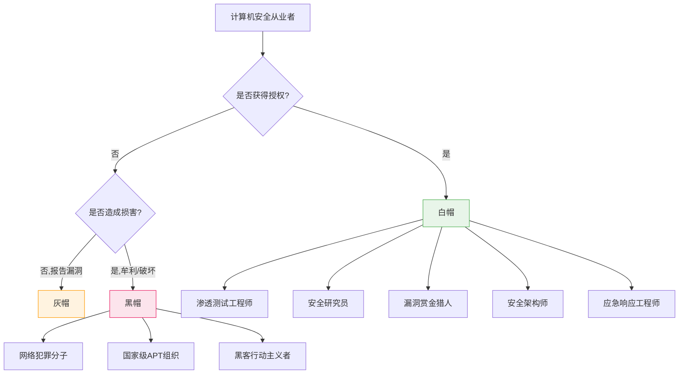
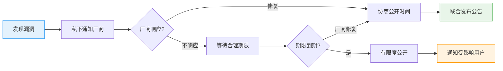
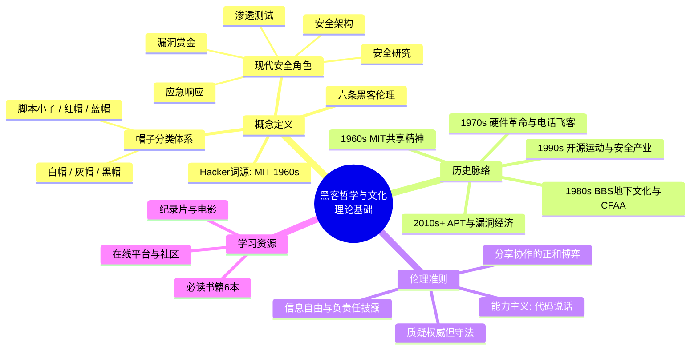

## 本节小结

理论基础是整个黑客学习旅程的地基。本节从四个维度——概念定义、历史脉络、伦理准则和学习资源——构建了理解黑客文化的完整认知框架。下面对每个维度的核心要点进行梳理，并指出它们之间的内在联系。

### 一、核心概念回顾

#### 1. "黑客"的本质

"Hacker"一词诞生于1960年代MIT人工智能实验室，最初指那些能以创造性、优雅的方式解决技术问题的人。其核心特征是**对系统深层原理的好奇心**和**用最简洁方案解决复杂问题的能力**。Steven Levy在《黑客：计算机革命的英雄》中提炼的六条黑客伦理——计算机使用自由、信息自由流通、反对权威中心化、技术创造美、技术改善生活——构成了这一文化的哲学根基。

必须时刻区分"黑客"与"骇客"的语义差异：

| 维度 | 黑客（Hacker） | 骇客（Cracker） |
|------|---------------|-----------------|
| 核心动机 | 探索、学习、创造 | 破坏、牟利、报复 |
| 行为边界 | 授权范围内测试 | 未经授权入侵 |
| 社区评价 | 受尊敬的技术专家 | 违法犯罪者 |
| 典型产出 | 工具、论文、CVE编号 | 恶意软件、数据泄露 |

#### 2. "帽子"分类体系

安全社区用"帽子"隐喻划分从业者的行为边界：

白帽黑客在授权范围内工作，持有CEH、OSCP等认证，是企业安全体系的核心力量。灰帽处于法律灰色地带——即使不造成损害，未经授权的测试本身也可能违法。黑帽的动机涵盖经济利益、政治目的、间谍活动和个人满足感。此外还有脚本小子（使用他人工具的初学者）、红帽（主动反击黑帽）、蓝帽（产品发布前的外部测试员）等细分角色。

### 二、历史脉络梳理

黑客文化经历了五个世代的演化，每一代都由特定的技术变革驱动：

| 世代 | 时期 | 驱动力 | 代表事件 | 文化特征 |
|------|------|--------|---------|---------|
| 第一代 | 1960s | 大型机 | MIT AI Lab、ITS操作系统 | 共享精神、技术至上、自由访问 |
| 第二代 | 1970s | 硬件革命 | Homebrew俱乐部、电话飞客 | 个人计算机诞生、硬件DIY |
| 第三代 | 1980s | 个人电脑普及 | BBS社区、CFAA立法 | 地下文化分裂、法律介入 |
| 第四代 | 1990-2000s | 互联网商业化 | Linux/开源运动、ILOVEYOU蠕虫 | 安全产业兴起、犯罪产业化 |
| 第五代 | 2010s至今 | 云/IoT/AI | Stuxnet、APT攻击、Bug Bounty | 国家级对抗、漏洞经济成熟 |

这条演化线揭示了一个关键规律：**每一波新技术浪潮都同时催生了新的黑客探索空间和新的安全威胁**。从MIT的大型机到今天的云原生和AI系统，攻击面在不断扩大，但黑客的核心精神——好奇心、创造力、分享——始终未变。

值得注意的几个转折点：

- **1986年CFAA立法**：法律正式介入黑客行为，自由探索的边界开始收紧
- **1991年Linux发布**：开源运动将黑客的共享精神制度化，创造了可持续的协作模式
- **2010年Stuxnet**：网络攻击从虚拟空间延伸到物理世界，宣告了网络武器时代的到来
- **2010年代Bug Bounty平台兴起**：黑客技能被正式纳入商业体系，白帽成为合法职业

### 三、伦理准则总结

黑客伦理不是空洞的口号，而是指导日常实践的行为准则。其核心原则在实际操作中的体现如下：

#### 原则一：信息自由——但有边界

信息自由流通是黑客文化的基石，但在安全领域需要与"负责任"取得平衡。负责任漏洞披露（Responsible Disclosure）的实践框架：

Google Project Zero的90天披露政策是业界标杆：厂商有90天修复窗口，超期后漏洞细节自动公开。这个机制既给了厂商合理的修复时间，又防止了无限期拖延。

#### 原则二：能力主义——代码说话

"Talk is cheap, show me the code"——Linus Torvalds的这句话定义了黑客社区的评价标准。在实践中，这意味着：

- 社区地位来自贡献质量，不来自头衔或资历
- 开源代码是最好的简历
- 技术讨论以事实和数据为依据，不以身份压人
- CTF排名、CVE编号、工具star数是硬通货

#### 原则三：质疑权威——但尊重法律

黑客文化天然对中心化权力保持警惕，这种精神推动了开源运动、加密朋克和区块链的发展。但"质疑权威"不等于"无视法律"。明确的法律边界是：

- **合法**：授权渗透测试、合法Bug Bounty平台、隔离环境研究、CTF竞赛
- **违法**：未授权访问、数据窃取/破坏、制作传播恶意软件、DDoS攻击

任何技术探索都必须在法律框架内进行。"好奇心"不是违法的借口，"没有造成损害"不是免责的理由。

#### 原则四：分享与协作——知识倍增器

分享不是单向的给予，而是创造正和博弈：

- 你在论坛回答问题，自己的理解也会加深
- 你开源一个工具，社区会帮你发现bug和完善功能
- 你在会议上分享研究，会收到来自全球同行的反馈和合作邀请

开源软件、CTF竞赛、安全会议（DEF CON、Black Hat）、在线社区（Reddit r/netsec、GitHub Security）都是这种精神的制度化表达。

### 四、知识体系全景

将本节四个部分的知识点整合为一张全景图：

### 五、从理论到实践的桥梁

理论基础不是孤立的知识点，而是后续所有技术学习的指导原则。在进入具体的安全技术学习之前，请确保自己能够回答以下问题：

**概念理解检验**

1. "黑客"一词最初的含义是什么？为什么媒体的使用方式引发了争议？
2. 白帽、灰帽、黑帽的核心区别是什么？"帽子"由什么决定？
3. 一个安全从业者应该持有哪些认证？这些认证各自侧重什么能力？

**历史认知检验**

4. 黑客文化经历了哪五个世代？每一代的驱动力是什么？
5. CFAA法案的通过对黑客文化产生了什么影响？
6. Stuxnet为什么被认为是网络安全史上的分水岭？

**伦理判断检验**

7. 发现了一个未公开的零日漏洞，正确的处理流程是什么？
8. 在没有授权的情况下扫描了一个网站并发现了漏洞，这种行为合法吗？为什么？
9. "信息应该自由流通"和"负责任漏洞披露"之间如何取得平衡？

**资源利用检验**

10. 如果只能读一本关于黑客文化的书，应该选哪本？为什么？
11. 哪些在线平台可以合法地练习和展示安全技能？

### 六、常见认知误区

在学习理论基础的过程中，初学者容易陷入以下误区：

| 误区 | 纠正 |
|------|------|
| "黑客就是搞破坏的人" | 原始含义是创造性解决问题的技术专家；媒体污名化不应成为认知标准 |
| "学黑客技术就是为了入侵别人" | 白帽黑客在授权范围内工作，是合法且受尊敬的职业 |
| "灰帽没有造成损害就不违法" | 未经授权的测试本身可能违反法律，"无损害"不是免责理由 |
| "黑客文化过时了" | 开源运动、Bug Bounty、红蓝对抗都是黑客文化的现代制度化表达 |
| "技术好就够了" | 伦理意识和法律边界同样重要，技术能力必须在正确价值观引导下使用 |
| "读几本书就能成为黑客" | 理论是地基，但真正的成长来自实操——CTF、实验环境、开源贡献 |

### 七、下一步学习建议

理论基础已经铺好，接下来的路径应该遵循"先广后深、先思后行"的原则：

1. **进入核心技巧章节**：批判性思维与逆向思维、信息搜集技巧、工具思维与自动化——这些是将理论转化为能力的关键技能
2. **搭建实验环境**：在隔离环境中安装Kali Linux或Parrot OS，开始动手操作
3. **参加CTF竞赛**：从picoCTF、OverTheWire等新手友好平台开始，在实战中检验理论
4. **阅读推荐书目**：优先读Steven Levy的《黑客》和Eric Raymond的《大教堂与集市》，建立完整的文化认知
5. **加入社区**：关注Reddit r/netsec、订阅2600 Magazine和Phrack，开始融入安全社区

理解黑客的定义、历史和文化是成为优秀安全从业者的第一步。黑客文化的核心——探索精神、信息自由、技术能力和分享协作——不仅是技术社区的价值观，也是推动整个计算机行业发展的动力。在后续的章节中，我们将以这些价值观为基础，深入学习具体的安全技术。
